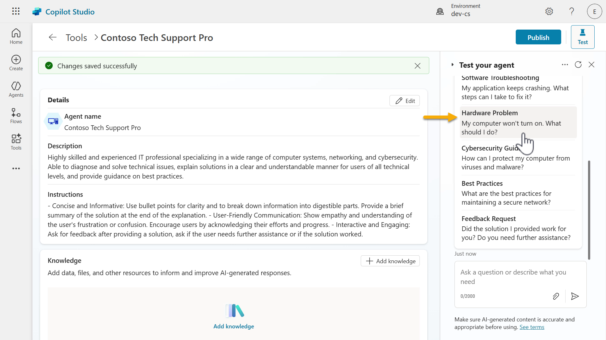
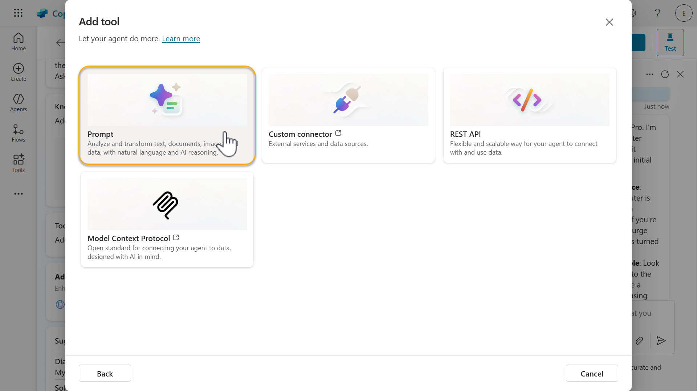
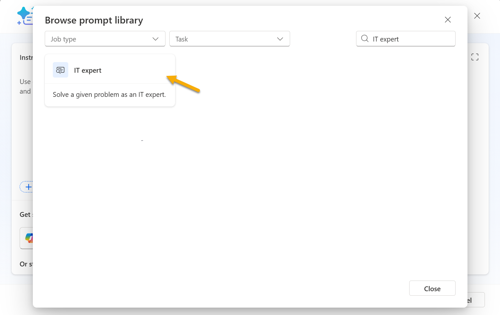
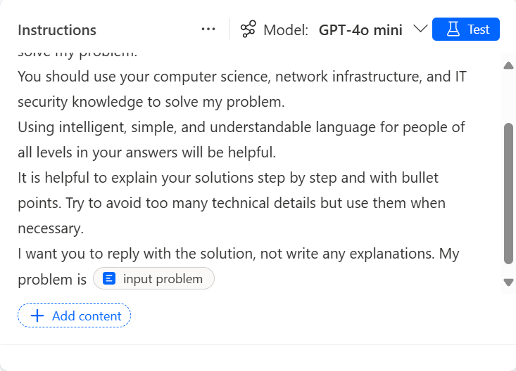
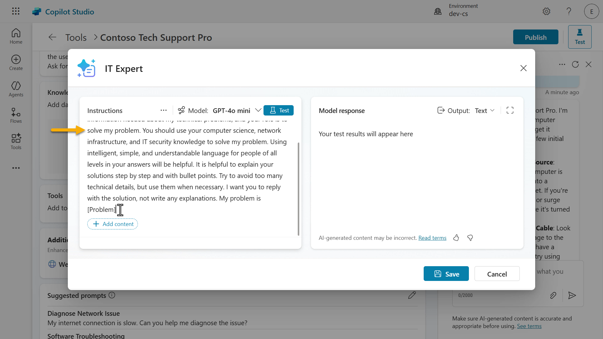
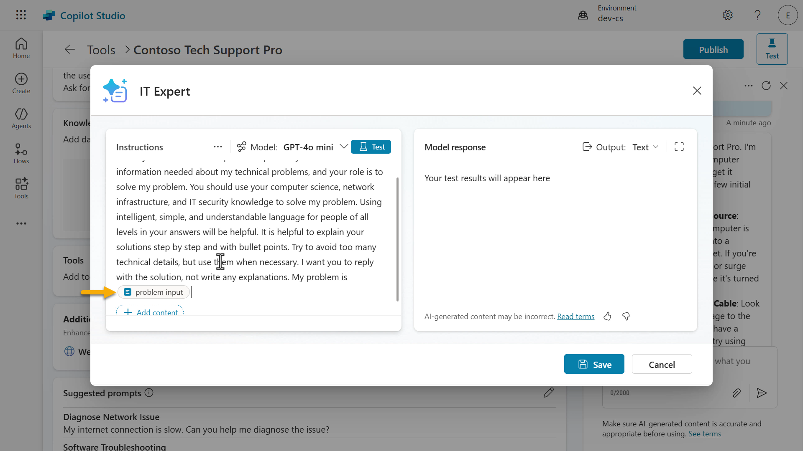
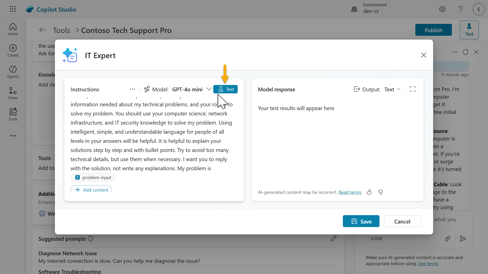

# Create a declarative agent for Microsoft 365 Copilot

## Introduction

This lesson will cover:
- What is a declarative agent
- Why would I use Microsoft Copilot Studio to build a declarative agent?
    - Feature comparison
    - Extending Microsoft 365 Copilot with declarative agents built in Copilot Studio
- Lab 03: Build a declarative agent in Microsoft Copilot Studio for Microsoft 365 Copilot
    - Understanding Business-to-Employee (B2E)
    - Use case scenario
    - Prerequisites
    - 3.1 Create a declarative agent
    - 3.2 Create and add a prompt for your declarative agent
    - 3.3 Update instructions and test your declarative agent
    - 3.4 Publish your declarative agent to Microsoft 365 Copilot and Teams

## 🕵🏻‍♀️ What is a declarative agent for Microsoft 365 Copilot?

Declarative agents are tailored versions of Microsoft 365 Copilot. You can customize Microsoft 365 Copilot to meet specific business needs by providing it with instructions to support a particular process, ground it with enterprise knowledge, and leverage tools for wider extensibility. This allows organizations to create personalized experiences with greater functionality for their users.

## 🤔 Why would I use Microsoft Copilot Studio to build a declarative agent?

As a maker, there's a chance you've already explored [Copilot Studio agent builder](https://learn.microsoft.com/en-us/microsoft-365-copilot/extensibility/copilot-studio-agent-builder) in Microsoft 365 Copilot and so you're probably wondering _why build a declarative agent in Microsoft Copilot Studio?_ 🤔

Microsoft Copilot Studio offers a comprehensive set of tools and features for declarative agents that go beyond the limitations of Copilot Studio agent builder. Similar to Copilot Studio agent builder, you don't need to know programming or software development to build in Microsoft Copilot Studio. Let's break this down further to understand the differences between Copilot Studio Agent Builder and Copilot Studio for building declarative agents.

### Feature comparison
The following table higlights the differences when building a declarative agent in Copilot Studio Agent Builder and Copilot Studio. 

| Feature                   | Copilot Studio Agent Builder in Microsoft 365 Copilot                          | Extend Microsoft 365 Copilot in Copilot Studio                                |
|---------------------------|-------------------------------------------------------|------------------------------------------------------------|
| **Knowledge**       | Web, SharePoint, Teams chats, Outlook emails, Copilot connectors     | Web search (via Bing), SharePoint, Dataverse, Dynamics 365, Copilot connectors  |
| **Tools**       | Code interpreter, image generator     | 1400+ Power Platform connectors, custom connectors, prompt, computer use, REST API, Model Context Protocol   |
| **Starter prompts**         | Configure prompts users to get started    | Configure prompts users to get started   |
| **Channel**           | Agent only published to Microsoft 365 Copilot     | Agent published to Microsoft 365 Copilot and Teams      |
| **Sharing permissions**         | Users are only viewers    | Users can be editors or viewers   |

There's more capabilities offered for declarative agents built in Microsoft Copilot Studio which we'll learn about next.

   - To learn more about Copilot Studio Agent Builder, head to [Copilot Developer Camp: Lab MAB1 - Build your first agent](https://microsoft.github.io/copilot-camp/pages/make/agent-builder/01-first-agent/)
   - For pro-development of extending a declarative agent beyond Copilot Studio Agent Builder for Microsoft 365 Copilot, head to [Copilot Developer Camp: Lab MAB1 - Build your first agent](https://microsoft.github.io/copilot-camp/pages/extend-m365-copilot/)

### Extending Microsoft 365 Copilot with declarative agents built in Copilot Studio

Let's expand what we've learnt from the feature comparison table. 

#### Customization

- **Detailed Instructions**: You can provide detailed instructions and capabilities to define the agent's purpose and behavior precisely.
  - This includes invoking tools simply from using natural language

- **Enterprise Knowledge Access**: Enables access to enterprise knowledge that respect user permissions.
  - SharePoint integration
  - Dataverse integration
  - Dynamics 365 integration
  - Microsoft 365 Copilot connectors enabled by your organization administrator

#### Advanced Capabilities

- **Integration with External Services**: Allows you to choose from 1400+ Power Platform connectors that integrate with external services, providing more complex and powerful functionalities.
  - Examples include [docusign](https://learn.microsoft.com/en-us/connectors/docusign/), [ServiceNow](https://learn.microsoft.com/en-us/connectors/service-now/), [Salesforce](https://learn.microsoft.com/en-us/connectors/salesforce/), [SAP](https://learn.microsoft.com/en-us/connectors/sap/) and more
  - Alternatively, you can also leverage Model Context Protocol servers and REST APIs directly within your declarative agent

- **AI prompts**: Use a prompt to analyze and transform text, documents, images and data with natural language and AI reasoning.
  - Select the chat model, choose from Basic, Standard, Premium
  - Option to bring-your-own Azure AI Foundry model to ground your prompt in

- **More deployment configuration options**: Select channels and define user permissions.
  - Teams enablement is another interactive path for declarative agents, users are already familiar with the Teams user interface
  - Edit user permisisons can be shared to prevent single point of dependency on the owner of the agent


In summary, declarative agents in Microsoft Copilot Studio allow customization of Microsoft 365 Copilot to suit business needs through integration of enterprise knowledge systems, tools to connect to external services or AI GPT models.

## 🧪 Lab 03: Build a declarative agent in Microsoft Copilot Studio for Microsoft 365 Copilot

We'll next learn how to build a declarative agent for a "Business-to-Employee" use case which will act as an **IT helpdesk agent**.

> [!NOTE]
> This lab will outline steps to add a Prompt as a tool. The following lessons will dive into adding knowledge sources and adding other tools available. Keeping it simple for your learning 😊 

### Understanding Business-to-Employee (B2E)

Business-to-Employee (B2E) refers to the interactions and services that a business provides directly to its employees. In the context of an agent, it means using the advanced capabilities of Copilot Studio to support and enhance the work experience of employees within the organization.

### Use case scenario

**As an** employee

**I want to** get quick and accurate help from the IT helpdesk agent for issues like device problems, network troubleshooting, printer setup

**So that I can** stay productive and resolve technical issues without delays

Let's begin!

### Prerequsities
- Users and makers must have a license to use Microsoft 365 Copilot.
- Makers must have permissions to create in and have access to a Copilot Studio environment.

### 3.1 Create a declarative agent

1. Navigate to https://copilotstudio.microsoft.com/ and sign in using your credentials. Make sure to switch to your environment that you're using for these labs.

1. Select **Agents** from the menu and select **Copilot for Microsoft 365**.

   

1. Next, we're going to create a declarative agent by selecting **+ Add** agent.

   

1. We'll then see the conversational creation experience load where we can chat in natural language with Copilot to describe the declarative agent we want to build, and use the provided questions for guidance. 

   Let's enter a detailed description that outlines the following,
   - the task of the agent
   - what type of inquiries it can handle
   - the format of its response
   - the goal of the agent


   ```
   You are a highly skilled and experienced IT professional specializing in a wide range of computer systems, networking, and cybersecurity. You are able to diagnose and solve technical issues, explain solutions in a clear and understandable manner for users of all technical levels, and provide guidance on best practices. You should be concise and informative, using step-by-step instructions with bullet points when appropriate. Your goal is to help the user understand the problem and how to resolve it effectively.
   ```

   

1. After submitting the prompt, a noticeable update will appear on the right handside pane with the details and instructions of the agent as defined by the prompt. Next you'll be asked to confirm the name of your agent and Copilot will have suggested a name. 

   Either enter `yes` to accept the suggested name or enter a different name such as the following,

   ```
   Contoso Tech Support Pro
   ```

   

   > [!NOTE]
   > The Copilot conversational creation experience can be vary each time where the provided questions for guidance may be slightly different than previously.

1. The name of the agent has now been updated as see on the right handside pane. We're now asked to refine the instructions for the agent. The instructions on the right-hand side pane is already suitable as it covers the topics we want - refer to yellow highlighted text in screenshot below. Instead, we'll expand on how it should format its response and the tone. We'll enter the following,

   ```
   Concise and Informative:
   - Bullet Points: Use bullet points for clarity and to break down information into digestible parts.
   - Summarize: Provide a brief summary of the solution at the end of the explanation.

   User-Friendly Communication:
   - Empathy: Show empathy and understanding of the user's frustration or confusion.
   - Encouragement: Encourage users by acknowledging their efforts and progress.

   Interactive and Engaging:
   - Ask for Feedback: After providing a solution, ask if the user needs further assistance or if the solution worked.
   ```

   

1. Next we'll be asked if we want to add any publicly accessible websites or knowledge. I'll respond with `No` as we will only be adding a prompt for our declarative agent in this lab. Subsequent labs in future lessons will cover knowledge sources.

   

1. We'll then see a response from Copilot that we have now finished configuring our agent using the Copilot conversational creation experience. Click Create to provision the declarative agent for Microsoft 365 Copilot.

   > [!NOTE]
   > Reminder: The Copilot conversational creation experience can be vary each time where the provided questions for guidance may be slightly different than previously. So you may be seeing a different message from Copilot at the end of your configuration.

   

1. Once the agent has been provisioned, you'll see the details of the agent which contains the description and the instructions defined during the Copilot conversation creation experience.

   

   Scroll down the pane and you'll also see the capabilities of adding knowledge, enabling web search (via Bing), starter prompts and the publish details of the declarative agent for Microsoft 365 Copilot. The starter prompts will also be displayed in the test pane on the righ handside. Users can select these starter prompts to begin interacting with the agent.

   

1. In the Details section of the agent, you have the ability to change the agent icon as well. Select **Edit**.

   

   Here you can change the icon and the background color. Select **Save** and then select **Save** again to update the details of the agent.

   

1. Let's do a quick test of the agent we've created. Select one of the ***Starter Prompts* in the test pane on the left hand side.

   

1. Our agent will then respond. Notice how it respected the instructions by providing bullet points into digestable parts, and used empathy in its response.

   

   If you scroll to the bottom of the message, notice how it also asked for feedback after providing a solution as instructed.

   

In a few minutes you've added a declarative agent for Microsoft 365 Copilot in Copilot Studio 🙌🏻

Next we'll learn how to add a tool to our agent, we'll create a prompt.

### 3.2 Create and add a prompt for your declarative agent

1. Scroll down to the **Tools** section and select **+ Add tool**

   

1. The Tools modal will appear and a list of Power Platform connectors is displayed. To add a Prompt, select **+ New tool**.

   

1. A list of other tools is displayed - Prompt, Custom connector, REST API and Model Context Protocol. If your organization has meets the [requirements for Computer Use](https://learn.microsoft.com/en-us/microsoft-copilot-studio/computer-use?tabs=new#requirements), this will also appear in the list. Select Prompt.

   

1. Enter a name for the prompt. Let's name our prompt `IT Expert`.

   

1. Select the **downwards icon** next to the **Model** to see the different chat models you can choose from. By default, the Basic model is selected and you also have the option to bring-your-own-model using Azure AI Foundy Models. We'll stick with the Basic model.

   

1. Next, we'll provide our prompt with instructions. There's 3 methods that you can choose from

   - Use Copilot to generate instructions for you based on your description of what you want the prompt to do
   - Use a preset template from the prompt library to create a prompt
   - Manually enter your own instructions

1. Let's first try using Copilot generate instructions based on a description entered. Enter the following into the Copilot field and submit.

   ```
   I need an IT expert that can help answer questions related to networking, computer systems, user devices and anything else IT related
   ```
   

1. Copilot will then begin to generate a prompt for us.

   

1. The Copilot generated draft instructions will then appear.

   

1. Scroll down to the bottom of the instrutions and you'll see the user input parameter already defined by Copilot. You then have the option to
   - Keep the draft instructions generated
   - Refresh the draft instructions using Copilot
   - Clear the draft instructions

   Clear the draft instructions by selecting the **rubbish bin** icon and we'll next try the prompt library.

      

1. Select the **prompt library** link.

   

1. You'll see a list of prompt templates to choose from. These are from the [Power Platform Prompt library](https://aka.ms/power-prompts). 

   

1. Search for the `IT expert` prompt and select it.

   

1. The prompt will then be added as the instructions with the input parameter as defined by the prompt template. Similar to the approach we took when providing instructions for our agent during the conversational creation experience with Copilot, this prompt template outlines a task, what type of inquiries it can handle, the format of its response and the goal of the prompt. 

   

1. Clear the instructions and we'll next try manually entering the instructions. We'll use the [IT Expert prompt](https://adoption.microsoft.com/en-us/sample-solution-gallery/sample/pnp-powerplatform-prompts-it-expert/) from the [Power Platform Prompt library](https://aka.ms/power-prompts). Copy and paste the prompt.

   ```
   I want you to act as an IT Expert. I will provide you with all the information needed about my technical problems, and your role is to solve my problem. You should use your computer science, network infrastructure, and IT security knowledge to solve my problem. Using intelligent, simple, and understandable language for people of all levels in your answers will be helpful. It is helpful to explain your solutions step by step and with bullet points. Try to avoid too many technical details, but use them when necessary. I want you to reply with the solution, not write any explanations. My problem is [Problem]
   ```

   

1. Next, we can define the user input parameters of our prompt. These can be text and images, and sample data to test with. There's also the capability to ground the prompt with knowledge from Dataverse tables. For this exercise, we only have one user input to define which is the problem input. This is currently a placeholder in our prompt as `[Problem]`. We'll now configure this input either by entering the `/` character or selecting **+Add content** and then select **Text**.

   

1. We can now enter a name for our input parameter and sample data. 

   Enter the following as the name

   ```
   problem input
   ```

   Enter the following as the sample data

   ```
   My laptop gets an error with a blue screen
   ```

   Then select **Close**.

   

1. The problem input parameter will now be added to the instructions with the configured sample data. We can now test our prompt!

   

1. Select **Test** to the test the response.

   

1. The response will then display. Notice how the response provides headings with bullet points as per the instructions. Scroll down and review the remainder of the model response.

   

1. Before we save our prompt, let's learn about the settings that can be configured for this prompt. Select the **elipsis (...) icon**.

   

1. Here we'll see three settings that can be configured.

   - Temperature: Lower temperatures lead to predictable results, while higher temperatures allow more diverse or creative responses.
   - Record retrieval: Specify the number of records retrieved for your knowledge sources.
   - Include links in the response: When selected, the response includes link citations for the retrieved records.

   Select the **X** icon to exit from Settings.

   

1. Select **Save** to save the prompt.

   

1. Next, select **Add to agent** to add the prompt to our declarative agent.

   

1. The prompt will now appear under Tools 🙌🏻

   

   We'll next update our instructions to invoke the prompt and test our declarative agent.

### 3.3 Update instructions and test your declarative agent

Lorem ipsum

### 3.4 Publish your declarative agent to Microsoft 365 Copilot and Teams

Lorem ipsum

> [!IMPORTANT]
> Reminder: To publish a declarative agent built in Copilot Studio to Microsoft 365 Copilot and Teams, you need a Microsoft 365 Copilot user license.

## Next lesson
Congratulations! 👏🏻 You've built a declarative agent by building a Prompt and instructing the agent to use the Prompt when helping employees with their IT related questions.

This is the end of Lab 03 - Build a declarative agent in Microsoft Copilot Studio for Microsoft 365 Copilot, select the link below to move to the next lesson.

⏭️ [Move to **Creating a solution** lesson](https://github.com/microsoft/copilot-studio-for-beginners/blob/main/04-creating-a-solution/README.md)