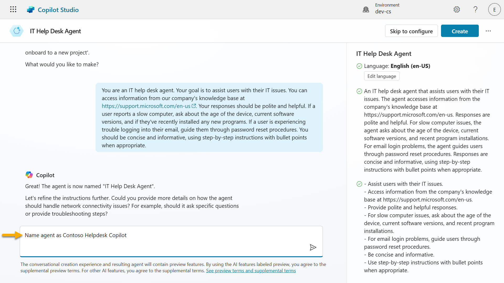
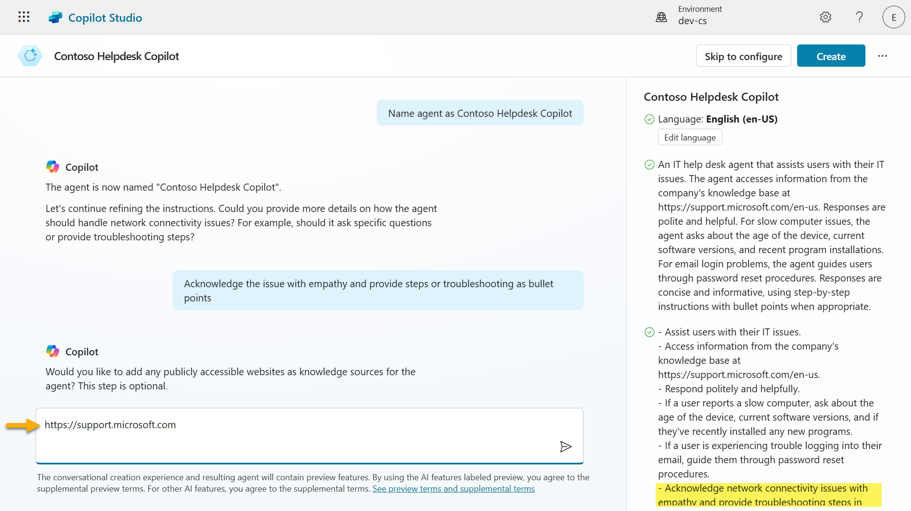
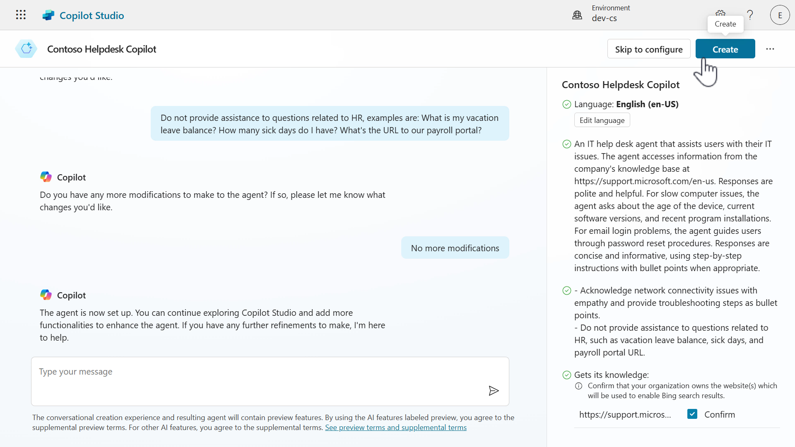

# Create a custom agent using a conversational creation experience with Copilot and grounding it with your data

## Introduction

- What is a custom agent?
    - What can a custom agent do?
    - Why use a custom agent?
    - Example
- Use natural language to create agents
- But I'm new to "describing what I want" - what do I do?    
    - Why Prompts matter
    - Tips for writing a good prompt
    - Example
- OK, so I've created my agent... how do I ground it with knowledge?
    - What is generative orchestration in the context of agents?
    - Why are knowledge sources valuable?
    - Example
    - Note on security
- Improving your agent's responses in Copilot Studio
- Lab 06: Create an agent with Copilot

## 🤔 What is a _custom_ agent?

A custom agent is a chatbot or virtual assistant that you create and design in Copilot Studio to help users with specific tasks or questions. It's called custom because:

- You decide the purpose - help users request vacation time, check order status, provide assistance with IT related questions.
- You define the converstaion - what the agent says and how it should respond.
- You ground it with your own data  - connect to your enterprise data through the built-in supported knowledge resources.
- You connect it to your own systems or applications -  choose from connectors, flows, REST APIs and model context protocol servers.

Think of it like building your own digital helper that can talk to users and complete tasks for them such as answering questions, collecting information required by a process, or connecting to your enterprise data.

### 🤖 What can a custom agent do?

A custom agent can fulfil the following:

- Ask users for information such as names, dates, or preferences
- Save that information to a database or table
- Look up data based on the questions asked and give answers
- Work autonomously without users directly interacting with the agent
- Trigger actions either on-demand through direct user interaction or autonomously such as sending emails or creating records

### 👩🏻‍💻  Why use a custom agent?
- Saves time by automating repetitive tasks.
- Gives users a friendly, guided experience.
- You can tailor it to your business or project needs.

### ✨ Example
You build a custom agent that helps employees request vacation.

It asks for their name, vacation dates, and manager’s name, then saves the information into the designated system that managed vacation requests, such as a SharePoint list.

Now, instead of navigating to the SharePoint list and creating a new item, employees simply chat with the agent instead.

## 🗣️ Use natural language to create agents

Previously you learnt how to quickly get started in building a custom agent with the prebuilt agent templates. In this lesson, wi'll dive into the conversational creation experience with Copilot. Copilot Studio makes it easy to build agents by chatting with Copilot, just like having a conversation. 

In Copilot Studio, you don’t need to write code to create an agent. Instead, you describe what you want your agent to do in plain language, and Copilot helps you build it step by step through a chat-like experience.

## 🌱 But I'm new to "describing what I want" - what do I do?

Describing in natural language to create a custom agent might be a new concept for you. Whenever you use Copilot across Microsoft products and services, you are using natural lanugage in the form of a _prompt_. 

A prompt is the message or instruction you give to an AI agent to tell it what you want it to do. Think of it like giving directions to a helpful assistant. The clearer your instructions, the better the result.

### 🪄 Why Prompts matter

- They guide the agent’s behavior.
- They help the agent understand what kind of conversation to have.
- A good prompt makes the agent more helpful and accurate.

### 📝 Tips for writing a good prompt

- Be clear and specific – say exactly what you want the agent to do.
- Think like the user – what will the user say? What should the agent reply?
- Include examples – if possible, give a sample interaction.

### ✨ Example

Let's say the HR team needs an agent to help with vacaction requests.

The prompt could be,

    “I want to build an agent that helps users submit a vacation request. When a user says they want to request time off, the agent should ask for their name, the start date of their vacation, the end date of their vacation, and their manager’s name. Once the user provides this information, the agent should save it to a SharePoint list called ‘Vacation Requests’ and post a notification in a dedicated Microsoft Teams channel.”

Why this prompt works:

- **Clearly states the goal** - submit a vacation request
- **Describes the user interaction** - what the user says and what the agent should ask
- **Lists the required data** - name, start date, end date, manager
- **Mentions where the data goes** - a SharePoint list called Vacation Requests

## 🔮 OK, I've created my agent... how do I next ground it with knowledge?

In Copilot Studio, knowledge sources are places where your agent can find information to give better answers. When you add these sources, your agent can pull in your enterprise data data from places like Power Platform, Dynamics 365, websites, and other systems your company uses.

These sources work together with AI to help your agent respond more accurately to user questions, this is acheived through what is known as **generative orchestration**.

### 🌿 What is generative orchestration in the context of agents?

Generative orchestration means the agent uses AI to decide how to answer a question by combining its built-in language skills with information from your added knowledge sources.

When a user asks a question, the agent:
1. Understands the question using AI.
1. Picks the move relevant knowledge sources.
1. Searches those sources for answers.
1. Generates a natural, helpful response using the information it found.

### 🏦 Why are knowledge sources valuable?

1. **Smarter answers** - when you add knowledge sources, your agent can give better, more accurate answers using real data from your organization.

1. **Less manual work** - you don’t have to write every possible response. The agent can search through your added sources and respond automatically.

1. **Use trusted information** - your agent can pull answers from systems you already use such as Dataverse, SharePoint, or company wesbites so that users have reliable information from a source of truth.

1. **Works with generative AI** - knowledge sources and AI help your agent understand questions and respond naturally, even if the question wasn't pre-programmed or added as a starter prompt.

1. **Flexible and expandable** - you can add knowledge sources anytime during set up or at later point in time, your agent grows smarter as your needs change.

### ✨ Example
Imagine you build an agent to help employees with HR questions. You add your company’s HR policy document and SharePoint site as knowledge sources.

When an employee asks, _“How many vacation days am I entitled to?”_, the agent uses generative orchestration to search those sources and reply with the correct policy without you having to write that answer manually. This saves you time in having to account for every possible question an employee may ask regarding their entitlements.

## Types of knowledge sources that can be added

1. **Public websites**
    - **What it does:** Searches specific websites (like your company’s site) using Bing.
    - **Why it’s useful:** Great for pulling in public-facing info like FAQs or product details.

1. **Documents**
    - **What it does:** Uses documents that you upload directly to your agent, such as PDFs or Word files. These uploaded files are stored securely in Dataverse.
    - **Why it's useful:** Enables your agent to answer questions based on internal guides, manuals or policies.

1. **SharePoint**
    - **What it does:** Connects to SharePoint folders or files using Microsoft Graph Search.
    - **Why it's useful:** Ideal for accessing team documents, HR policies, or project files stored in SharePoint.

1. **Dataverse**
    - **What it does:** Uses structured data from your Dataverse environment tables and rows, and can apply synonyms and glossary definitions for tables and columns for improving agent responses.
    - **Why it's useful:** When you need to look up enterprise data stored in Dataverse such as customer information.

1. **Real-time knowledge with connectors**
    - **What it does:** Lets your agent access live data from other enterprise systems such as Salesforce, ServiceNow, Dynamics 365, AzureSQL, Databricks, and more during a conversation, using the user's own permissions.
    - **Why it's useful:** It provided up to date, secure, and accurate responses without storing or duplicating data, making your agent smarter and safer.

1. **Azure AI Search**
    - **What it does:** Allows your agent to search through large sets of documents stored in Azure using semantic and vector search to understand user questions.
    - **Why it's useful:** Delivers accurate, trustworthy answers from complex data sources, supports citations, and scales well for large document collections with secure access controls.

## 🔒 Note on security

**Knowledge source authentication**

Some sources such as SharePoint and Dataverse require user authentication. This means the agent will only reference data in its response that the user is allowed to see. Whereas other sources may have additional configuration required for the agent to connect to it such as Azure AI Search which requires an Azure account and specifying an authentication type.

## Improving your agent's responses in Copilot Studio

After your agent is provisoned from the conversational creation experience, you'll want to test your agent against the instrutions Copilot generated from your prompt. Improving your agent’s responses in Copilot Studio is all about making sure it understands your goals clearly and has the right information to work with.

1. **Refine the agent instructions** - this is where you tell your agent how it should behave. Use clear, specific language.

    For example:
    
    ✅ “Act like a friendly customer support agent who explains things simply.”
    
    ❌ “Be helpful.” (Too vague)

1. **Check the tone and launguage** - Make sure the agent’s tone matches your audience. 

    You can set it to be:

    - Friendly and casual.
    - Professional and concise.
    - Supportive and patient.

1. **Add or update knowledge sources** - if your agent needs to answer questions about a topic, make sure it has access to the right information.

    - Add links to websites, documents, or FAQs.
    - Keep the content up to date.
    - Use clear, well-structured information.

1. **Use Topics and Triggers** - If your agent needs to handle specific tasks or conversations, you can create topics with trigger phrases. This helps guide the conversation more precisely. We'll learn more about this in the following lesson.

1. **Test with real questions** - try asking your agent the kinds of questions users might ask. 

    If the answers aren’t great:

    - Adjust the system instructions.
    - Add more examples or knowledge.
    - Rephrase your questions to see how it responds.

1. **Review and iterate** - improving an agent is an ongoing process! 

    After publishing:

    - Collect feedback from users.
    - Watch for common questions or confusion.
    - Keep refining the agent’s setup.

## 🧪 Lab 06: Create a custom agent in Copilot Studio

We're now going to learn how to create a custom agent that can chat over your data
- 6.1 Use natural language to create an agent with Copilot
- 6.2 Add an external knowledge source using a website
- 6.3 Add an internal knolwedge source using a SharePoint site - for Microsoft 365 licensed users with SharePoint included
- 6.4 Add an internal knowledge source by uploading a document - for non-Microsoft 365 licensed users who don't have SharePoint included

### ✨ Use case

We'll use the same use case from [Lesson 03 - Create a declarative agent for Microsoft 365 Copilot](https://github.com/microsoft/copilot-studio-for-beginners/blob/main/03-create-a-declarative-agent-for-M365Copilot/README.md#-use-case-scenario)

**As an** employee

**I want to** get quick and accurate help from the IT helpdesk agent for issues like device problems, network troubleshooting, printer setup

**So that I can** stay productive and resolve technical issues without delays

Let's begin!

### 6.1 Use natural language to create an agent with Copilot

1. Navigate to the Home page of Copilot Studio and in the field, enter the following prompt which describes the IT help desk agent. The prompt includes the goal of the agent, the context, the expected tasks and format of the agent's response.

   ```
   You are an IT help desk agent. Your goal is to assist users with their IT issues. You can access information from our company's knowledge base at https://support.microsoft.com/en-us. Your responses should be polite and helpful. If a user reports a slow computer, ask about the age of the device, current software versions, and if they've recently installed any new programs. If a user is experiencing trouble logging into their email, guide them through password reset procedures. You should be concise and informative, using step-by-step instructions with bullet points when appropriate.
   ```

    

 1. The conversational creation experience with Copilot will next load. You'll see Copilot is in progress of responding to you. The agent pane on the right will update shortly with details and instructions based on the prompt entered.

    

1. Copilot will update the agent pane with a name, description and instructions based on the prompt entered. Cool right?!

   

1. Next, we'll ask Copilot to name our agent as,

    ```
    Contoso Helpdesk Copilot
    ```

   

1. Copilot performs the request and we'll see that the name of the agent has been updated in the agent pane. Copilot next asks us to refine the instructions. It's asking how we should respond to particular issues and we'll request that it acknolwedges the issue and format the response as bullet points. Copy and paste the following, and submit the request to Copilot.

    ```
    Acknowledge the issue with empathy and provide steps or troubleshooting as bullet points.
    ```

   

1. The instructions of the agent will be updated after Copilot has received the request. Next, Copilot is asking for public websites to ground the agent's knowledge. Enter the following and submit,

    ```
    https://support.microsoft.com
    ```

   

1. The public website will be added as a knowledge source. If you don't see it in the agent pane, try scrolling down the pane and it'll appear as a knowledge source. 
    
    Lastly, we're going to request that our agent does not answer HR related questions. This lets our agent know that it should not answer HR related questions asked by users. Enter the following and submit,

    ```
    Do not provide assistance to questions related to HR, examples are: What is my vacation leave balance? How many sick days do I have? What's the URL to our payroll portal? 
    ```

   

1. The instructions will be updated to not provide assistance with questions related to HR. Copilot is asking again if we'd like to request more modifications. We don't need to make further updates, enter the following and submit,

    ```
    No more modifications
    ```

   

1. Copilot confirms the agent is ready to be created. Before we create our agent, let's do a couple of things. 
    
    For websites, you need to confirm which website(s) your organization owns that Bing will search through Copilot Studio. For learning purposes, we'll tick the checkbox that confirms ownership of the knowledge source. In reality, this would be _your company website_.

   

1. Next we'll double check the solution that our agent will be created in, is the solution we created and selected as the preferred solution in [Lesson 04 - Create a new solution](https://github.com/microsoft/copilot-studio-for-beginners/blob/main/04-creating-a-solution/README.md#42-create-a-new-solution).

    Select the **elipsis icon (...)** and select **Edit Advanced Settings**.

   

1. The Advanced Settings modal will appear and we can see our solution created from earlier is selected by default. This is due to selecting our solution as the preferred solution in [Lesson 04 - Create a new solution](https://github.com/microsoft/copilot-studio-for-beginners/blob/main/04-creating-a-solution/README.md#42-create-a-new-solution).

    Select **Cancel.**

   

1. Let's now create our custom agent! Select **Create**.

   

1. Copilot Studio will begin provisioning our agent.

   

1. Once our agent has been provisioned, we can see the details of the agent reflect what we requested during our Copilot conversational creation experience.

   

1. Scroll down and we'll see our instructions and the public website as the knowledge source for the agent.

   

1. Let's now test our newly created agent. Enter the following question in the **Test** pane.

    ```
    How can I check the warranty status of my Surface?
    ```

   

1. Our agent then responds with answers that are outlined as bullet points, as defined in the instructions. The response has references to the web pages that the agent formed its response from. This enables users to verify the source of the answer. If you click on the reference, you'll be directed to the web page where you can review the source of the answer.

   

1. You can also review the response and its sources by scrolling down the Knowledge modal in the Activity map.

   

Congratulations! You've built your first custom agent with Copilot in Copilot Studio 🙌🏻

### 6.2 Add an external knowledge source using a website

1. Test the website knowledge source.

   ```
   How can I find the serial number on my Surface device?
   ```

### 6.3 Add an internal knolwedge source using a SharePoint site - for Microsoft 365 licensed users with SharePoint

1. Test the SharePoint knowledge source.

   ```
   How do I access the Contoso VPN?
   ```

### 6.4 Add an internal knowledge source by uploading a document - for non-Microsoft 365 licensed users who don't have SharePoint included
   
1. Test document knowledge source.

   ```
   How do guests connect to the Contoso Guest wifi?
   ```

## Next lesson
Congratulations! 👏🏻 You've _placeholder text_

This is the end of **Lab 06 - Create an agent with Copilot**, select the link below to move to the next lesson. Your solution created in this lab will be used in the next lesson's lab.

⏭️ [Move to **Creating a solution** lesson](https://github.com/microsoft/copilot-studio-for-beginners/blob/main/05-using-prebuilt-agents/README.md)


## 📚 Additional learning
🔗 [Quickstart: Create and deploy an agent](https://learn.microsoft.com/en-us/microsoft-copilot-studio/fundamentals-get-started?context=%2Fmicrosoft-365-copilot%2Fextensibility%2Fcontext/?WT.mc_id=power-170631-ebenitez)

🔗 [Create and delete agents](https://learn.microsoft.com/en-us/microsoft-copilot-studio/authoring-first-bot?WT.mc_id=power-170631-ebenitez)

🔗 [Key concepts - Authoring agents](https://learn.microsoft.com/en-us/microsoft-copilot-studio/authoring-fundamentals/?WT.mc_id=power-170631-ebenitez)