# Enhance user interactions with Adaptive Cards

## Introduction

- What is an Adaptive Card?
- [Lab 08 - Add apative cards and enhance topic capabilities](/08-add-adaptive-card/README.md#-lab-08---add-adaptive-cards-and-enhance-topic-capabilities)
    - [8.1 Add an adaptive card to display available devices](/08-add-adaptive-card/README.md/#81-add-an-adaptive-card-to-display-available-devices)
    - [8.2 Add a condition node to enable users to request a device](/08-add-adaptive-card/README.md/#82-add-a-condition-node-to-enable-users-to-request-a-device)
    - [8.3 Create a new topic with an adaptive card for user to submit their request](/08-add-adaptive-card/README.md/#83-create-a-new-topic-with-an-adaptive-card-for-user-to-submit-their-request)
    - [8.4 Update _Available devices_ topic to redirect to the newly created topic](/08-add-adaptive-card/README.md/#84-update-available-devices-topic-to-redirect-to-the-newly-created-topic)


## 🤔 What is an Adaptive Card?

An **Adaptive Card** is essentially a JSON field that describes:

- What elements appear on the card - text, images, buttons
- How those elements are arranged
- What actions users can take such as submitting a form or opening a link

### Why Adaptive Cards matter in Copilot Studio

When you use the **Send a message node** in Copilot Studio, you can paste this JSON into the card editor to create rich, interactive messages. The designer tool helps you build the card visually, but behind the scenes, it’s generating this JSON for you.

This makes it easy to:

- Reuse cards across different agents.
- Dynamically update content using variables.
- Share or store card templates.

## 🐱 Is _JSON_ a person?

Pronounced as "Jason," it's not a person 😅

JSON, otherwise known as _JavaScript Object Notation_ is a lightweight format used to structure data. It's easy to read and write, and looks like a series of key-value pairs inside curly braces {}.

## 👀 I see another option for building an adaptive card using _formula_

Remember how we learn about Power Fx in [Lesson 07 - Add new topic with trigger and nodes](/07-add-new-topic-with-trigger/README.md/#️-using-power-fx-in-your-nodes)? The same can be applied in Adaptive Cards within Copilot Studio. 

As a recap,

    Power Fx is a low-code programming language used to add logic and dynamic behaviour to your agent. It's the same language used in Microsoft Power Apps, and it's designed to be simple and Excel-like, making it easy for developers and non-developers.

### How Power Fx works in Adaptive Cards

When you design an Adaptive Card in Copilot Studio, you can use Power Fx formulas to:

- Dynamically insert values such as user names, dates or status.
- Format text or numbers such as show currency or round numbers.
- Show or hide elements based on conditions.
- Customize responses based on user input, variables, outputs from conversation nodes.

For example,

"<samp>Hello</samp>" & `System.User.DisplayName`

This formula combines the word "Hello" with the user's name dynamically.

### Why it's useful

1. **Personalization**

    You can tailor message to each user, making interactions feel more natural and relevant.

1. **Dynamic content**

    Cards can display real data from variables and outputs from conversation nodes.

1. **Smart logic**

    You can control what users see or interact with based on conditions, improving usability and reducing errors.

1. **Low-code friendly**

    Power Fx is designed for people who aren't full-time developers. As mentioned earlier, it's readable, intuitive and similar to Excel formuals.

## 👷🏻‍♀️ Building with the Adaptive Card Designer

The **Adaptive Card Designer** is a visual tool that lets you build interactive message cards using drag-and-drop elements like text, images, buttons, and inputs. Its purpose is to help you create rich, dynamic messages without writing complex code, making it easier to design user-friendly interfaces. 

When creating an agent in Copilot Studio, it's especially valuable for the **Send a message** node because it allows you to craft personalized, structured responses that look great and can include actions or data inputs directly within the conversation from variables and previous node outputs.

## 🎨 Understanding the Adaptive Card Designer

1. **Card Elements**

    These are the building blocks of your adaptive card. You can drag and drop elements such as the following:

    - **TextBlock** to display text.
    - **Image** to show show pictures.
    - **FactSet** for key-value pairs.
    - **Input fields** to display text boxes, date pickers, toggles.
    - **Actions** to display buttons such as "Submit," "Open URL," or "Show Card."

    Each element has its own purpose and can be styled or configured.

1. **Card viewer**

    This is the **Preview** area where you see how your card will look like in real time. As you add or edit elements, the viewer updates instantly to reflect changes. This enables you to make iterative updates and see the design output at the same time.

1. **Card structure**

    This shows the **hiearchy and layout** of your card. For example:

    - A card might start with a **TextBlock** for the title.
    - Then a **ColumnSet** with an image on one side and text on the other.
    - Followed by a **FactSet** and some **Action buttons**.

    It helps you understand how elements are nested and organized.

1. **Element properties**

    When you click on any element in the card, this panel lets you **customize its settings**:

    - Change text size, weight, or color.
    - Set image URLs or alt text.
    - Configure input options like placeholder text or default values.

    This is where you fine-tune each element.

1. **Card Payload Editor**

    This is the **raw JSON code** behind your card. Advanced user can edit this directly to:

    - Add dynamic data bindings.
    - Use templating features.
    - Copy/paste card definitions.

Even if you're new to the adaptive card designer, it's helpful to see how the visual design translates into codes.

## 🌵 Common use cases

The following are common use cases for **Adaptive Cards** in Copilot Studio when used in the **Send a message** node.

1. **Forms and data collection**

    Use adaptive cards to collect structured inpur from users, such as:
    - Leave requests
    - Feedback forms
    - Contact information
    - Appointment scheduling

1. **Displaying dynamic information **

    Shows users persoalized or real-time data in a clean, readable format from enterprise sources such as ServiceNow, SAP, Dynamics 365, SharePoint etc.

    - Order summaries
    - Account balances
    - Ticket or case status
    - Upcoming events or deadlines

1. **Interactive choices**

    Let users make selections directly in the conversation:

    - Choose from a list of options, for example product categories, support topics.
    - Confirm or cancel action.
    - Rate a service or experience.

1. **Triggering actions**

    Include buttons that trigger further steps in the conversation internally or externally.

    - "Sumbit request"
    - "View details"

## ⭐ Best practices

Here are some best practices for creating Adaptive Cards for agents in Copilot Studio in the **Send a message** node.

1. **Keep it simple and focused**

    - Design cards with a clear purpose, don’t overload them with too many elements.
    - Use concise text and intuitive layouts to guide users through the interaction.

1. **Be intentional with inputs**

    - Include only the necessary input elements such as text, date choices, to avoid overwhelming users.
    - Use labels to make inputs easy to understand.

1. **Structure for readability**

    - Use **TextBlocks** for hreadings and instructions.
    - Group related elements using **Containers** or **ColumnSets** to improve visual flow.

1. **Make Action elements clear**

    - Use Action.Submit and or Action.OpenUrl with clear button titles like "Submit Request" or "View Details"
    - Avoid vague labels like "Click here"

1. **Design for adaptability**

    - Assume the card may be viewed on different screen sizes.
    - Avoid fixed widths and use flexible layouts like ColumnSets for responsiveness.

1. **Use dynamic content when possible**

    - Bind card elements to variables or outpus from nodes to personlize the user experience.
    - For example, show the user's name or current status dynamically.

## 🧪 Lab 08 - Add adaptive cards and enhance topic capabilities

We're now going to learn how to enhance our topic with adaptive cards and using advanced functionality of topics and nodes. 

- [8.1 Add an adaptive card to display available devices](/08-add-adaptive-card/README.md/#81-add-an-adaptive-card-to-display-available-devices)
- [8.2 Add a condition node to enable users to request a device](/08-add-adaptive-card/README.md/#82-add-a-condition-node-to-enable-users-to-request-a-device)
- [8.3 Create a new topic with an adaptive card for user to submit their request](/08-add-adaptive-card/README.md/#83-create-a-new-topic-with-an-adaptive-card-for-user-to-submit-their-request)
- [8.4 Update _Available devices_ topic to redirect to the newly created topic](/08-add-adaptive-card/README.md/#84-update-available-devices-topic-to-redirect-to-the-newly-created-topic)

### ✨ Use case

**As an** employee

**I want to** request a device

**So that I** can request a device from the list of available devices

Let's begin!

### Prerequisites

1. **SharePoint list**

    We'll be using the **Devices** SharePoint list from [Lesson 00 - Course Setup - Step 3: Create new SharePoint site](/00-course-setup/README.md/#step-3-create-new-sharepoint-site). 
    
    If you have not set up the **Devices** SharePoint list, please head back to [Lesson 00 - Course Setup - Step 3: Create new SharePoint site](/00-course-setup/README.md/#step-3-create-new-sharepoint-site).

1. **Contoso Helpdesk Copilot**

    We're going to use the same agent created previously in [Lesson 06 - Create a custom agent using natural language with Copilot and grounding it with your data](/06-create-agent-from-conversation/README.md).

### 8.1 Add an adaptive card to display available devices

1. In the **Available devices** topic delete the **Send a message** node that contains the JSON response of the _Get items_ SharePoint connector action in the body of the message.

    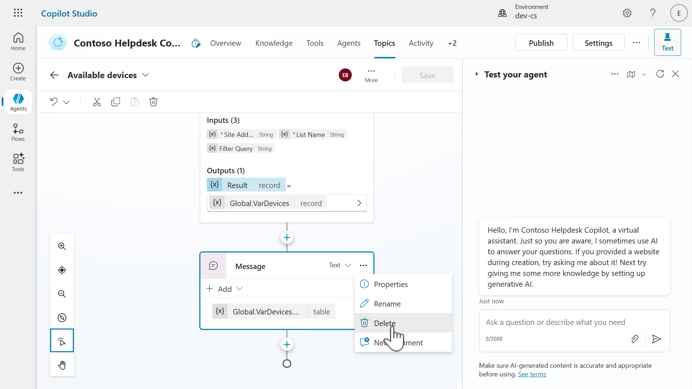

1. Select the **+ icon** and select **Send a message** node.

    

1. Select *+ Add* and select **Adaptive card**.

    

1. We're now goig to edit the JSON. Select **Edit adaptive card**.

    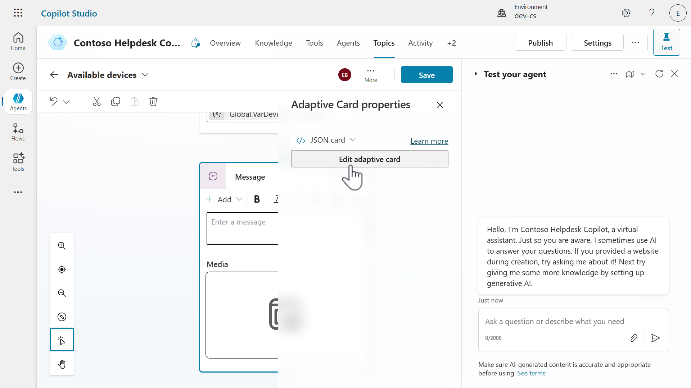

1. This is the Adaptive card designer where you can design your card and see the card design in-real time. Try dragging and dropping the TextBlock and FactSet card elements to the authoring canvas - the card viewer area. Notice how the card structure and card payload editor updates as the two card elements were added. You can directly update the card payload editor and the element properties pane.

    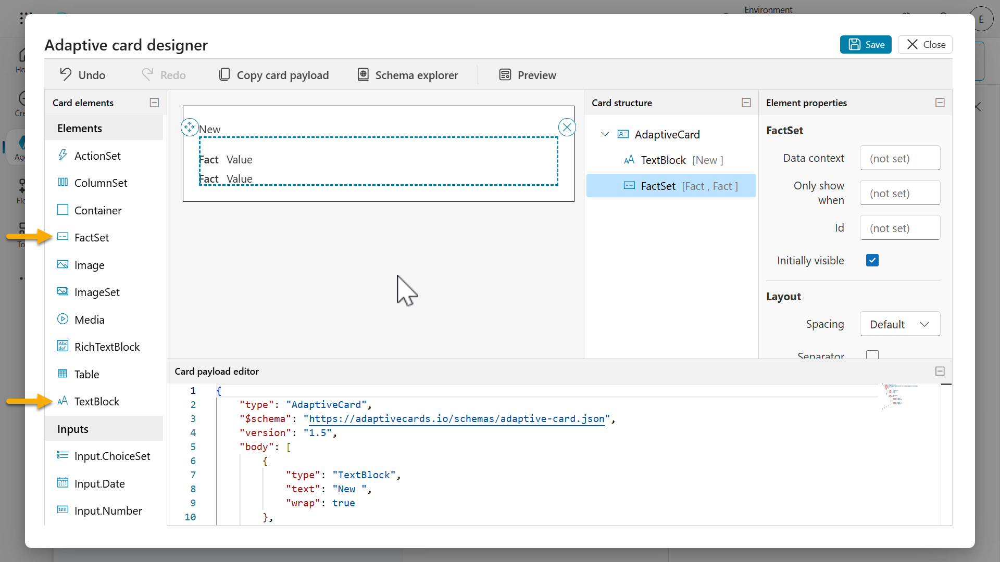

1. Select **Preview** to view the card in different widths.

    

1. The preview will load where you'll see different card output by widths.

    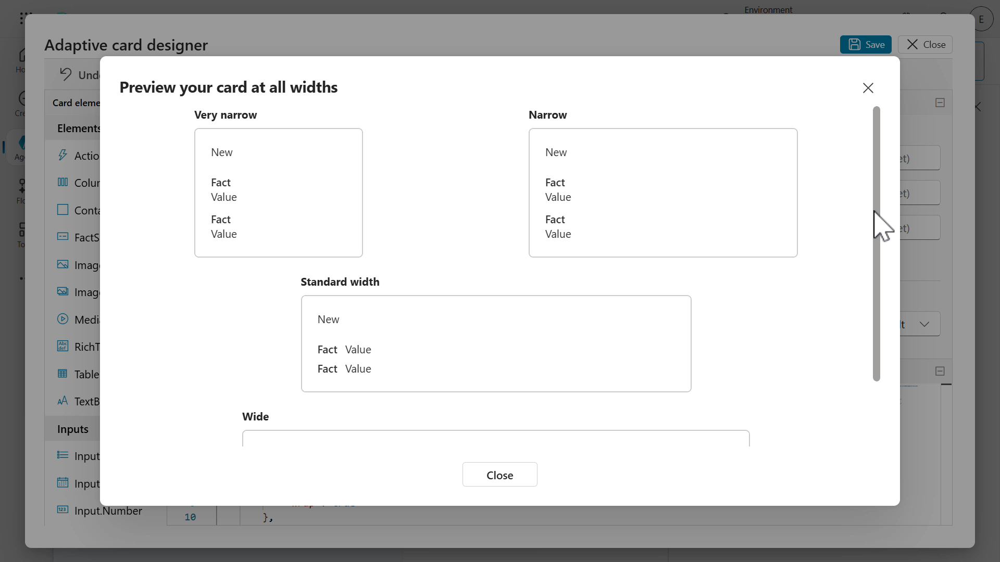

1. Exit out of **Preview** by selecting the **x icon** and select **Undo** in the designer to remove the two card elements previously added.

    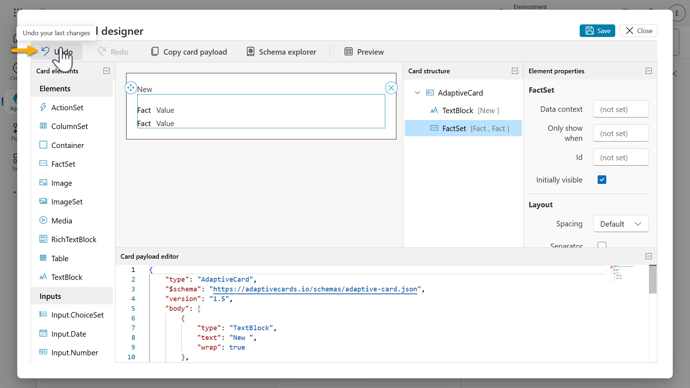

1. Click into the **Card payload editor** and select all lines using the Windows keyboard shortcut of _Ctrl + A_ or using the Mac keyboard shortcut of _Command + A_, followed by deleting the lines.

    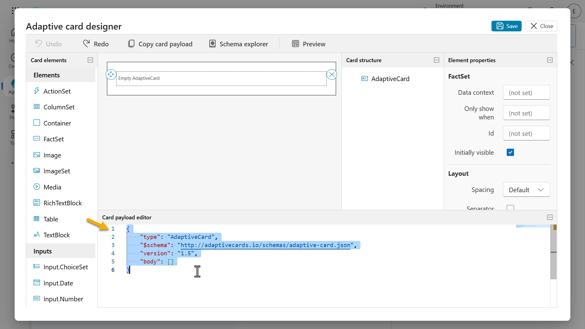

    Paste the JSON from the [Available devices .JSON file](assets/8.1_AvailableDevices.json).

    

1. Notice how the **Card Preview** now includes elements that display an image, the model, the manufacturer and the color of the device. Select **Save**. 

    

1. Close the Adaptive Card properties pane by selecting the **X icon**.

    

1. The **Send a message** node will now display the adaptive card in the authoring canvas. Select **Save** to save the topic.

    

1. Let's next test our initial adaptive card design. **Refresh** the test pane and enter the following,

    ```
    I need a laptop
    ```

    

1. Select laptop from the list and you'll next see the available devices adaptive card. This is the JSON structure we'll use for our adaptive card which we now need to bind to the output of the **Get items** SharePoint connector action from the previous node we configured in [Lab 07 - Add a new topic with conversation nodes, 7.3 Add node - Add a tool using a connector](/07-add-new-topic-with-trigger/README.md/#73-add-node---add-a-tool-using-a-connector).

    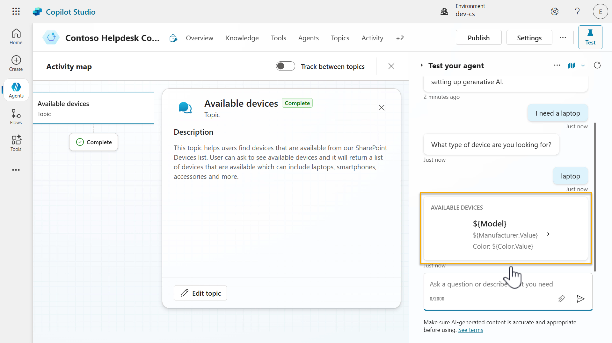

1. Let's now update our card to use Power Fx formulas. **Refresh** the test pane and selec the **x icon** in the Activity map.

    

1. Select the adaptive card in the authoring canvas and select the **chevron** icon to switch from **JSON** to **Formula**. Select **Formula**.

    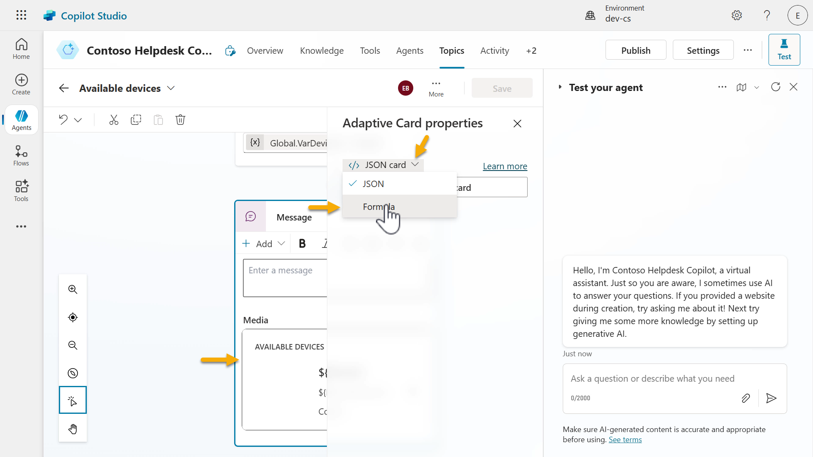

1. Click into the **Card payload editor** and select all lines using the Windows keyboard shortcut of Ctrl + A or using the Mac keyboard shortcut of Command+A, followed by deleting the lines. 

    

1. Paste the Formula from the [Available Devices formula file](assets/8.1_AvailableDevicesFormula.txt).

    

1. Let's take a closer look at the Power Fx functions used. To loop through the items returned in the **Get items** SharePoint connection action, we're using the `For All` function that lets you perform an action on each item in a list or table. 

    > Think of it like saying: _"For each item in this list, do something with it."_

    In our use case for the items in our container in the adaptive card, we're going to loop through each of the SharePoint list items returned in the **Get items** SharePoint connection action stored in the global variable via the `value` property of the JSON response. We created this global variable in [Lab 07 - Add a new topic with conversation nodes, 7.3 Add node - Add a tool using a connector](/07-add-new-topic-with-trigger/README.md/#73-add-node---add-a-tool-using-a-connector).

    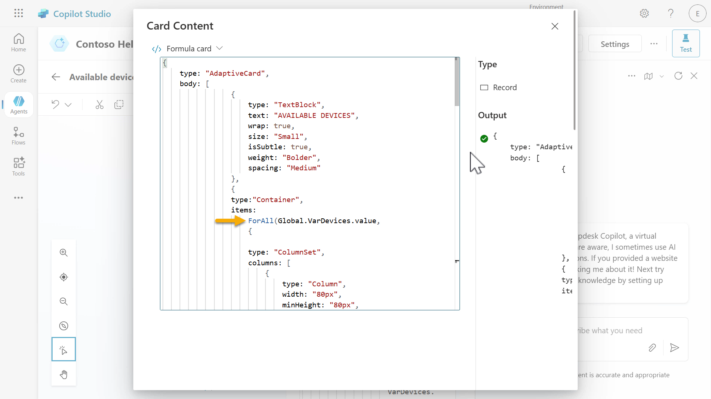

    We'll loop through each SharePoint list item to display the device image, model, manufacturer and color. Since we binded the items property in the card to the `value` property of our SharePoint JSON response stored in the global variable, we can now simply reference the properties that we want. 
    
    Below is a screenshot of where the reference to the `Image` property is used in the image element of the adaptive card.

    

    Below is a screenshot of where the references to the `Model` and `Manufacturer.Value` preoperties is used in the TextBlock elements of the adaptive card.

    

1. Let's now save our topic and test our agent. Close the **Card Content** modal by selecting the **x icon** and select the **x icon** in the **Adaptive Card properties** pane.

    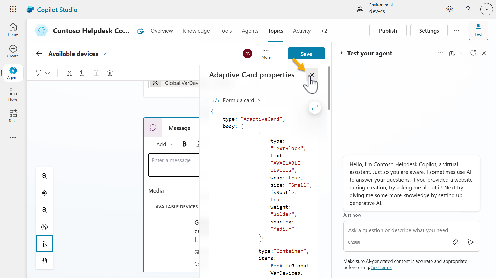

1. Select **Save** to save the topic.

    

1. **Refresh** the test pane and enter the following,

    ```
    I need a device
    ```

    

1. Select laptop from the list and you'll next see the available devices adaptive card. This this time, it's displaying the data from the Devices SharePoint list using the JSON response of the **Get items** SharePoint connector action stored in the global variable that we binded the adaptive card to using Power Fx. 

    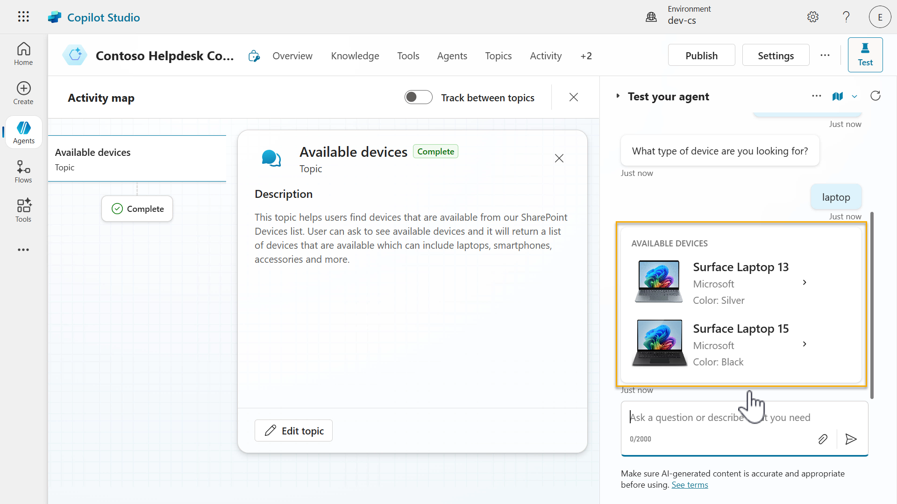.

1. **Refresh** the test pane and **close** the Activity map.

    

Awesome! 🙌🏻 You've designed and added your first Adaptive Card to your topic for your agent in Copilot Studio.

### 8.2 Add a condition node to enable users to request a device

We'll now add logic for the user to request a device from the list of devices where the status equals Available. To achieve this, we're going to add an **Ask a Question** node and a **Condition** node. 

Let's start with the question node.

1. In our **Available devices** topic, we'll add an **Ask a Question** node below the **Send a message** node with the adaptive card.

    

1. We'll now define the node. For the question, enter the following.

    ```
    Would you like to request one of these available devices?
    ```

    Next, select **+ New option** as we'll add a value for the user to select.

    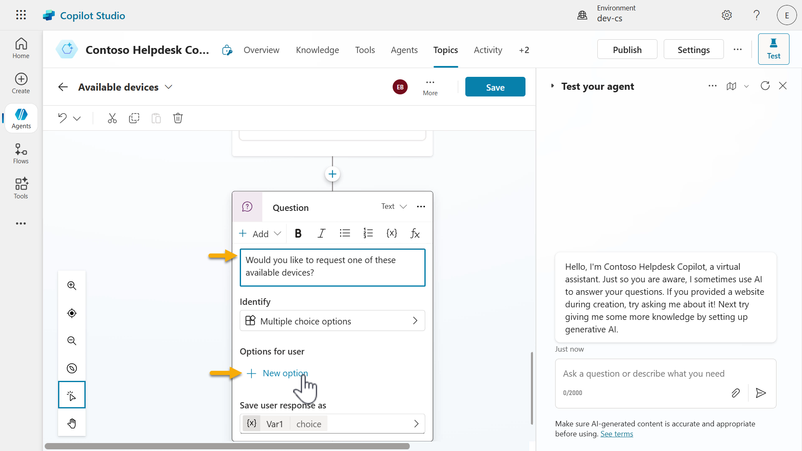

1. Enter `Yes` as the first value for the user to select.

    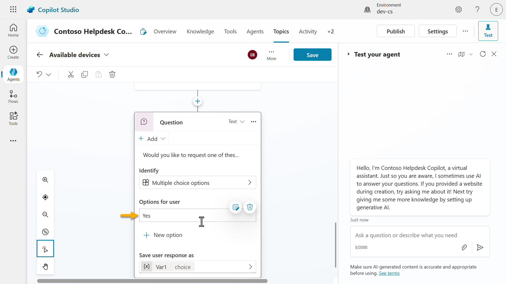

1. Select **+ New option** to add another value. Enter `No` as the second value for the user to select.

    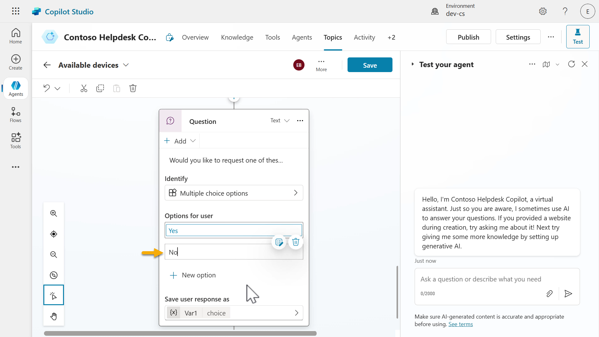

1. We'll now rename the output variable. Select the variable to load the **Variable properties** pane and name the variable as the following.

    ```
    VarRequestDevice
    ```
    

1. Close the **Variable properties** pane.

    

1. We'll next add logic to our topic by selecting the **Add a condition** node.

    

1. In the Condition node, we need to configure the logic. First we select a variable by selecting the **greater-than symbol**.

    

1. Select the **VarRequestDevice** variable previously created. This is the variable that stores the Yes/No selected value from the **Ask a Question** node.

    

1. Leave the condition set to **is equal to** since our logic is based on the Yes/No value the user selects from the **Ask a Question** node. In the value dropdown field, select **Yes**. 

    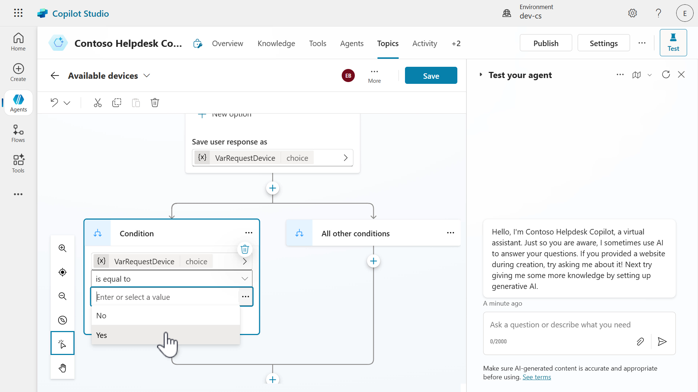

1. We've now defined this Condition node to execute only when the **VarRequestDevice variable value equals Yes**. Select **Save** to save the topic.

    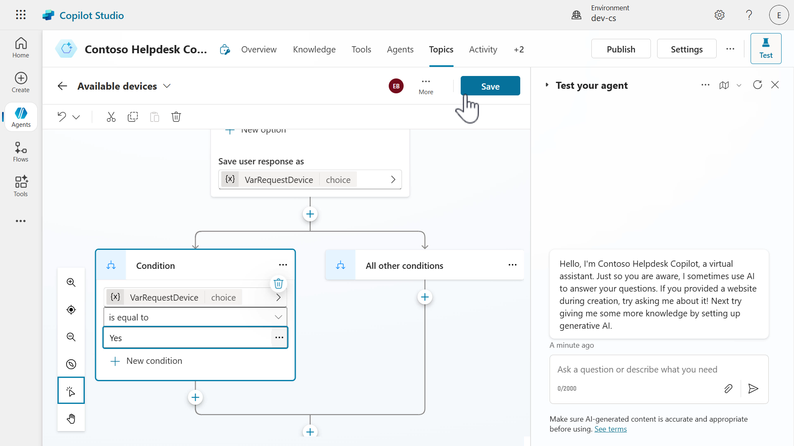

### 8.3 Create a new topic with an adaptive card for user to submit their request

As a recap, we have completed the following:

- Added an adaptive card that displays the available devices from the Devices SharePoint list.
- Added logic for a user to confirm whether they want to request a device from the list of available devices.

What we need to do next, is create a _new topic_ to direct the _Available devices_ topic to. This new topic will handle the device request by using an **Ask with adaptive card** node to enable user interaction with the agent.

Let's begin!

1. Select the **Topics** tab.

    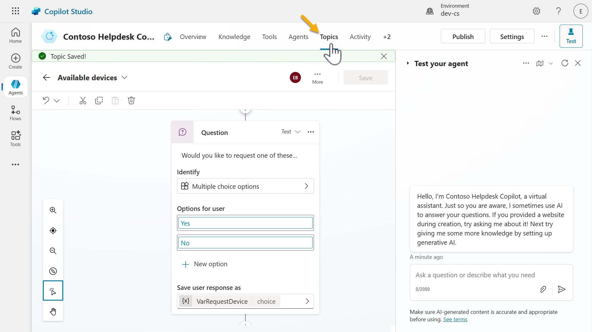

1. Select **+ Add a topic from blank**.

    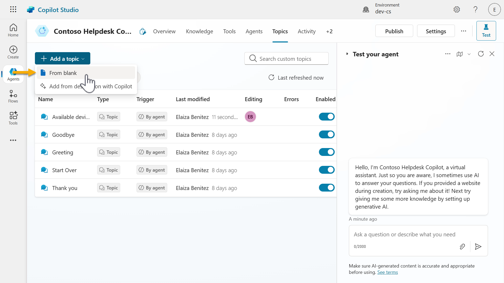

1. Name the topic as the following,

    ```
    Request device
    ```

    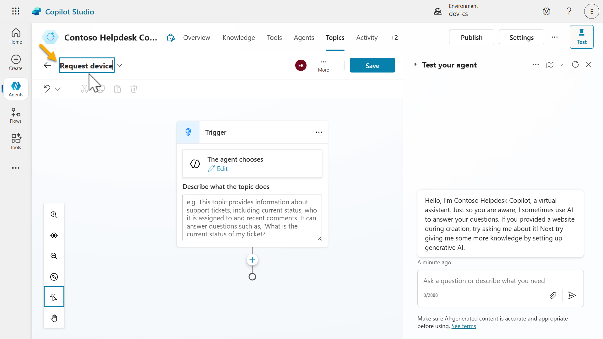

1. In the **Trigger** node, we're going to change the trigger type. Select the **opposite arrows icon** and select **It's redirected to** trigger type.

    

1. Next, add an **Ask with adaptive card** node. This node will display an interactive card for the user to select which device they would like to request.

    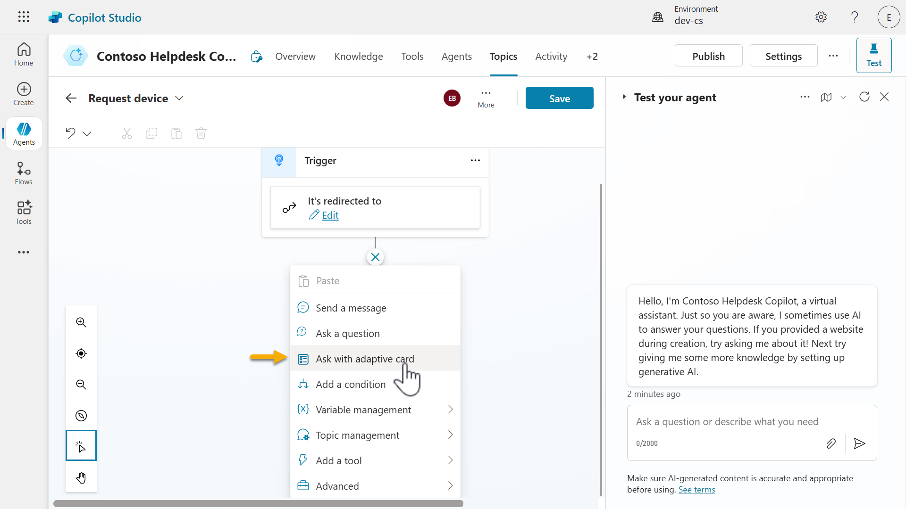

1. Select the node and the **Adaptive Card Node properties** pane will appear. Select **Edit adaptive card**.

    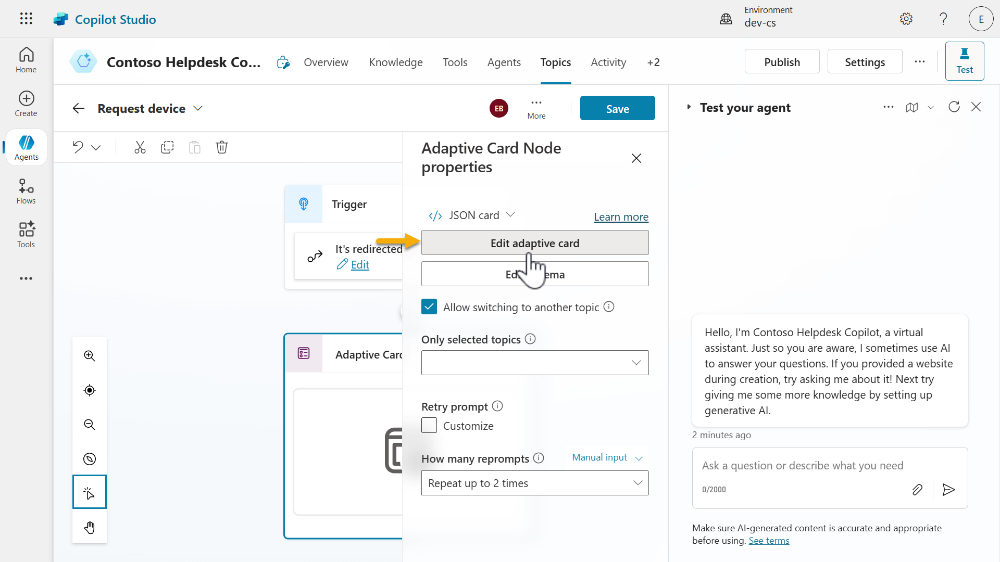

1. The **Adaptive card designer** will load. Click into the **Card payload editor** and select all lines using the Windows keyboard shortcut of _Ctrl + A_ or using the Mac keyboard shortcut of _Command + A_, followed by deleting the lines.

    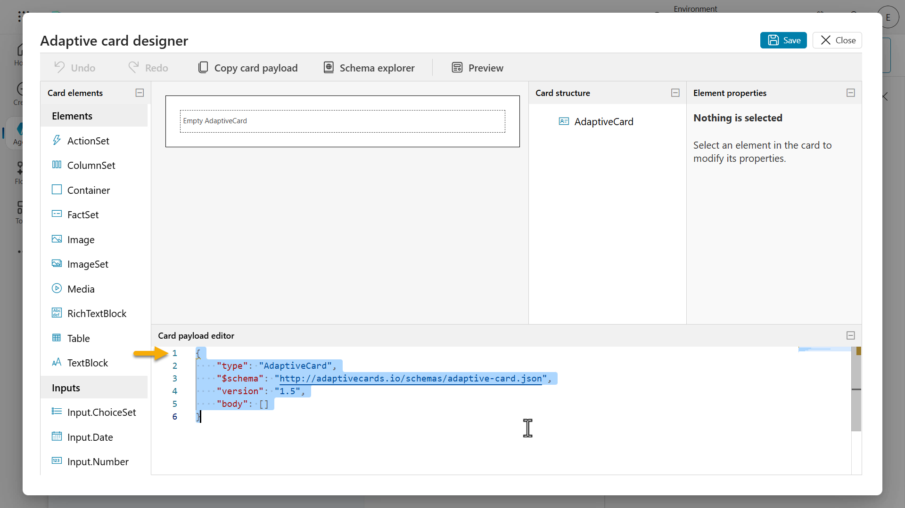

    Paste the JSON from the [Request devices .JSON file](assets/8.3_RequestDevice.json).

    

1. Notice how the **Card Preview** now includes elements that display some text and a list of available devices. Select **Save**.

    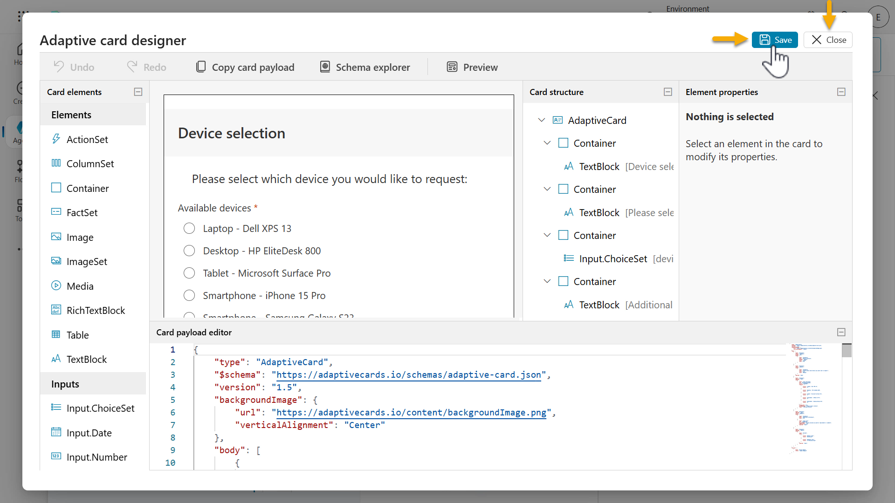

1. 


### 8.4 Update _Available devices_ topic to redirect to the newly created topic

_placeholder text_

## Next lesson
Congratulations! 👏🏻 You've learnt how to _placeholder text_ 🙌🏻

This is the end of **Lab 08 - _placeholder text_**, select the link below to move to the next lesson. We'll expand on the use case in this lab in the following lesson's lab.

⏭️ [Move to **_placeholder text_** lesson](/07-add-new-topic-with-trigger/README.md)


## 📚 Additional learning
🔗 [Link 1](https://learn.microsoft.com/en-us/microsoft-copilot-studio/authoring-system-topics?mc_id=power-170631-ebenitez)

🔗 [Link 2](https://learn.microsoft.com/en-us/microsoft-copilot-studio/guidance/topics-overview?WT.mc_id=power-170631-ebenitez)

🔗 [Link 3](https://learn.microsoft.com/en-us/microsoft-copilot-studio/authoring-triggers?WT.mc_id=power-170631-ebenitez)
