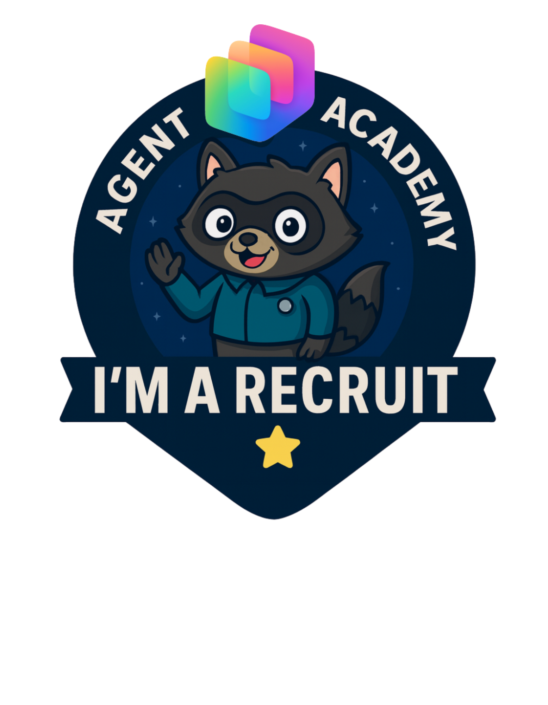
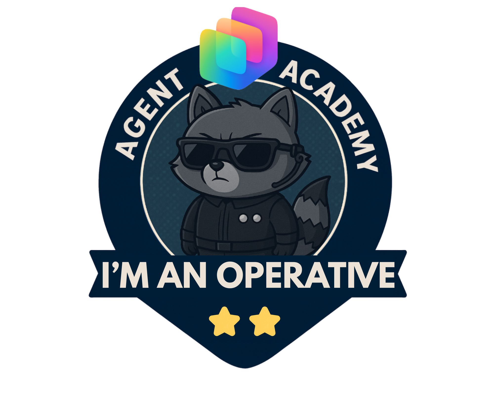

# Copilot Studio Agent Academy

**Welcome, Recruit.**  
Your mission—should you choose to accept it—is to master the art of building agents using **Microsoft Copilot Studio**.

This hands-on training is your entry point into the **world of agents**: from grounded prompts to Adaptive Cards and agent flows, you'll learn how to build, scale, and deploy intelligent agents using real-world tools and use cases.

---

## 🎯 Mission Objective

By completing the Agent Academy, you'll be able to:

- Understand what agents are in the context of Microsoft Copilot Studio
- Explore how Large Language Models (LLMs), retrieval-augmented generation (RAG), and orchestration come together in an agent
- Build both **declarative** and **custom agents**
- Enhance agents with **Topics**, **Adaptive Cards**, and **Agent Flows**
- Deploy agents to **Microsoft Teams** and **Microsoft 365 Copilot**

---

## 🧭 Curriculum Overview

This academy is broken into progressive lessons—each one designed as a field mission to level up your agent-building skills.

| Lesson | Title | Mission Briefing |
|--------|-------|------------------|
| `00` | 🧰 [Course Setup](./docs/00-course-setup/README.md) | Set up your dev environment, Copilot Studio trial, and SharePoint site |
| `01` | 🧠 [Introduction to Agents](./docs/01-introduction-to-agents/README.md) | Understand conversational AI concepts, LLMs, and autonomous vs. declarative agents |
| `02` | 🛠️ [Copilot Studio Fundamentals](./docs/02-copilot-studio-fundamentals/README.md) | Learn the building blocks: knowledge, skills, autonomy |
| `03` | 👩‍💻 [Create a Declarative Agent](./docs/03-create-a-declarative-agent-for-M365Copilot/README.md) | Add your own agent to the Microsoft 365 Copilot, grounded in a prompt |
| `04` | 🧩 [Creating a Solution](./docs/04-creating-a-solution/README.md) | Package your agent into a reusable solution for environment management |
| `05` | 🚀 [Get Started with Pre-Built Agents](./docs/05-using-prebuilt-agents/README.md) | Use and customize a template agent to accelerate setup |
| `06` | ✍️ [Build a Custom Agent](./docs/06-create-agent-from-conversation/README.md) | Create a new Copilot grounded in knowledge sources |
| `07` | 🧠 [Add a Topic with Triggers](./docs/07-add-new-topic-with-trigger/README.md) | Use Topics to define custom question/answer paths |
| `08` | 🪪 [Enhance with Adaptive Cards](./docs/08-add-adaptive-card/README.md) | Build an Adaptive Card using Power Fx and SharePoint |
| `09` | 🔁 [Automate with Agent Flows](./docs/09-add-an-agent-flow/README.md) | Use Adaptive Card input to trigger back-end flows |
| `10` | 🧭 [Add Event Triggers](./docs/10-add-event-triggers/README.md) | Enable your agent to act autonomously using event-based logic |
| `11` | 📢 [Publish Your Agent](./docs/11-publish-your-agent/README.md) | Deploy your agent to Microsoft Teams and Microsoft 365 Copilot |
| `12` | 🪪  [Understanding Licensing](./docs/12-understanding-licensing/README.md) | Learn how licensing and billing works with Copilot Studio |

---

## 🧪 Prerequisites

To complete all missions, you’ll need:

- A Microsoft 365 Developer tenant (with SharePoint enabled)
- Access to **Microsoft Copilot Studio** (trial or licensed)
- Optional: Basic knowledge of SharePoint, Power Platform, or Power Fx

---

## 🧬 Who This Is For

This course is ideal for:

- Makers and developers exploring **Copilot Studio**
- IT pros building **Microsoft 365 Copilot extensions**
- Power Platform enthusiasts who want to **level up** with intelligent agents
- Anyone who prefers to learn by **doing**

---

## 🏅 Rank Progression

The **Copilot Studio Agent Academy** is a multi-phase training program designed to build your skills across three agent ranks. Each level includes a badge and increasing responsibilities:

| Rank             | Level | Visual | Description                                                                 |
|------------------|:-----:|--------|-----------------------------------------------------------------------------|
| 🟢 **Recruit**     | •     |      | Learn the fundamentals and get hands-on with Copilot Studio basics — that’s **this course**. |
| 🔵 **Operative**   | ••    |  | Deepen your skills with orchestration, adaptive UX, and connected systems — coming soon in **Volume 2**. |
| 🟡 **Commander**   | •••   |  | Master autonomy, exception handling, security and scalable deployment — taught in the **final volume** of the academy. |

> ✅ Completing this curriculum earns you the **Recruit** badge.  
> 🔓 **Operative** and **Commander** will be unlocked in future phases.

Each level builds on the last. Finish your Recruit mission, and stay tuned to level up your agent credentials.

---

## 🎒 Other Courses

Check out these other courses to continue learning about AI and Agents:

- [Copilot Developer Camp](https://microsoft.github.io/copilot-camp/)
- [AI Agents for Beginners](https://microsoft.github.io/ai-agents-for-beginners/)
- [Model Context Protocol (MCP) For Beginners](https://github.com/microsoft/mcp-for-beginners)
- [Microsoft Copilot Studio <3 MCP Lab](https://aka.ms/mcsmcplab)

## Contributing

This project welcomes contributions and suggestions.  Most contributions require you to agree to a
Contributor License Agreement (CLA) declaring that you have the right to, and actually do, grant us
the rights to use your contribution. For details, visit <https://cla.opensource.microsoft.com>.

When you submit a pull request, a CLA bot will automatically determine whether you need to provide
a CLA and decorate the PR appropriately (e.g., status check, comment). Simply follow the instructions
provided by the bot. You will only need to do this once across all repos using our CLA.

This project has adopted the [Microsoft Open Source Code of Conduct](https://opensource.microsoft.com/codeofconduct/).
For more information see the [Code of Conduct FAQ](https://opensource.microsoft.com/codeofconduct/faq/) or
contact [opencode@microsoft.com](mailto:opencode@microsoft.com) with any additional questions or comments.

## Trademarks

This project may contain trademarks or logos for projects, products, or services. Authorized use of Microsoft
trademarks or logos is subject to and must follow
[Microsoft's Trademark & Brand Guidelines](https://www.microsoft.com/legal/intellectualproperty/trademarks/usage/general).
Use of Microsoft trademarks or logos in modified versions of this project must not cause confusion or imply Microsoft sponsorship.
Any use of third-party trademarks or logos is subject to those third-parties' policies.

