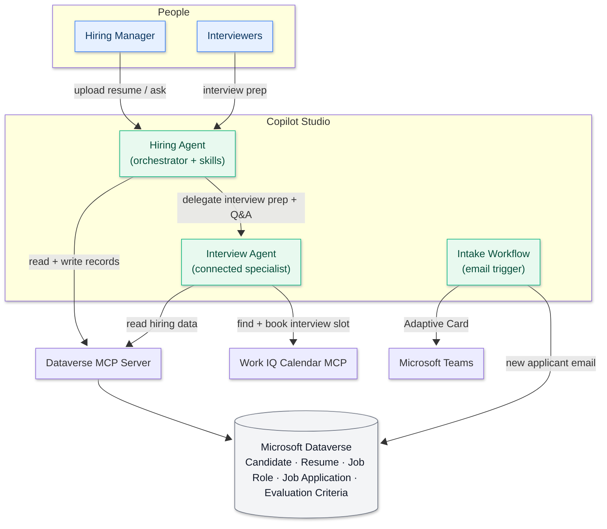

---
prev:
  text: "Operative Overview"
  link: "/operative-nextgen"
next:
  text: "Instructions, Skills and Dataverse MCP"
  link: "/operative-nextgen/02-instructions-skills-dataverse-mcp"
hide: true
preview: true
short-description: Deploy the hiring data model and create your central orchestrator agent in the new Copilot Studio experience
difficulty: 2
codename: OPERATION TALENT SCOUT
time: 45
tags:
  - fundamentals
products: [copilot-studio, dataverse]
industries:
  - hr
created-date: 2026-01-14
last-edited-date: 2026-08-12
---

# 🚨 Mission 01: Establish the Hiring Hub {#mission-01-establish-the-hiring-hub}

<mission-meta />

## 🎯 Mission Brief {#mission-brief}

Welcome, Agent. In this first mission you'll import the shared Dataverse data model and create the **Hiring Agent** that the rest of the course extends.

You'll import a pre-built solution containing the hiring tables and model-driven app, load the sample data, then create the orchestrator in the **new Microsoft Copilot Studio experience**.

The tables, app, and agent remain in place for later missions, where you'll add a connected specialist, focused skills, and autonomous workflows.

> [!IMPORTANT] Work in the current Copilot Studio experience
> This course uses Copilot Studio at `https://copilotstudio.preview.microsoft.com`. If you see a **New
> experience** toggle anywhere in the product, keep it **on** throughout - every screen and step in this
> course assumes it.

## 🔎 Objectives {#objectives}

In this mission, you'll learn:

1. How the hiring-automation scenario works
1. How to import the pre-built **Operative** solution and publish it
1. How to import the **Job Roles** and **Evaluation Criteria** sample data
1. How to create the **Hiring Agent** orchestrator and lock its identity

## 🏢 Understanding the Hiring Automation Scenario {#understanding-the-hiring-automation-scenario}

This scenario follows a resume from intake through role matching, interview preparation, and calendar booking. Agents handle the conversations and reasoning, while skills, workflows, and Dataverse store the resume, candidate, and job application records.

### Business Value

The finished system can:

- Read resumes received in chat or by email and store them in Dataverse.
- Suggest suitable job roles based on candidate profiles and weighted evaluation criteria.
- Create job applications and tailored interview-prep documents.
- Support fair and compliant hiring with safety and moderation controls.

### How It Works

The **Hiring Agent** coordinates the process and acts as the central orchestrator. Throughout this course, you will extend it with the following capabilities:

- The **Microsoft Dataverse MCP server** reads and writes shared hiring data.
- Reusable **skills** guide resume intake, role matching, application handling, and document generation.
- A connected **Interview Agent** answers questions about candidates and job roles.
- A **workflow** stores resumes received by email in Dataverse and notifies recruiters in Microsoft Teams.
- **Evaluations** and **Monitor** show how well the agent performs.

Both agents use the same Dataverse data through the MCP server, keeping their answers consistent:



::: details 🔄 Coming from the classic Operative course?
The biggest change is how you describe what an agent does. In the classic course, behavior was built as a tree of **topics** - each one a set of trigger phrases and an authored path through the conversation. The Powered by GitHub Copilot experience has no topics at all. You describe the agent's job in plain language in **Instructions**, and package the procedures you want it to follow repeatably as **skills**, which the agent loads when a request matches.

Everything the agent can use now sits on one **Build** canvas - instructions, skills, tools, knowledge and connected agents - rather than being spread across separate authoring pages.

Perhaps the biggest change is the capability of the harness itself, with the built-in ability to run advanced multi-step reasoning loops and to run Python scripts that are either written dynamically or provided by a skill.
:::

## 🧪 Lab 01 - Set up the Hiring Hub {#lab-01-set-up-the-hiring-hub}

### Prerequisites

Before you start this lab you need:

- The [course prerequisites](../index.md#prerequisites) - work through those first if you haven't
- A Power Platform environment with **Microsoft Dataverse**, and the **System Customizer** or **System Administrator** security role in it, since importing a solution creates tables
- Permission to create agents in that environment

> [!TIP] No environment yet?
> Work through **Steps 1 to 4** of the [Recruit Course Setup](../../recruit-nextgen/00-course-setup/index.md)
> to get a trial tenant, a Copilot Studio trial, and a Power Apps developer environment. Step 5 builds
> a SharePoint list for a different scenario and isn't needed here.

The rest of the course depends on one environment containing the hiring tables, the **Hiring Hub** model-driven app, and the sample roles. Let's set up that foundation first, then create the Hiring Agent.

### 1.1 Import the solution

Before the agent can read or write hiring data, its Dataverse tables and the Hiring Hub app need to exist in your environment.

1. Open **[Copilot Studio (new experience)](https://copilotstudio.preview.microsoft.com)**. Confirm the **New experience** toggle at the top of the page is turned on, then check the **environment picker** at the **bottom of the left navigation** and confirm it names your course environment. If it shows a different one, select the picker and switch before going any further.

   

   > [!WARNING] Always check your environment first
   > Get into the habit of checking the picker before you follow any instruction - the rest of the
   > course won't remind you, it assumes you're in the course environment. If something you expect is
   > missing, or a screen doesn't look like the one in the guide, check the environment picker before
   > anything else.

1. At the bottom of the left navigation, select **More**.

   

1. Under **Explore**, select **Solutions**. It opens in a new browser tab.

   

1. Download the prepared solution (`Operative_3_0_0_0.zip`):

   <action-button href="https://raw.githubusercontent.com/microsoft/agent-academy/refs/heads/main/docs/operative-nextgen/01-get-started/assets/Operative_3_0_0_0.zip" label="Download the Operative solution" icon="📦" />

   When the download finishes, select **Import solution** on the command bar.

   

1. In **Import a solution**, select **Browse**.

   

1. Select the downloaded solution, then select **Next**.

   

1. Check the details, then select **Import**.

   

   > [!NOTE]
   > On success you'll see a green notification bar: *"Solution 'Operative' imported successfully."*

1. Once you see the "imported successfully" message, select the solution display name (`Operative`) in the solutions list to review what you imported.

   Ensure the following components imported:

   

   | Display Name | Type | Description |
   | --- | --- | --- |
   | Candidate | Table | Candidate information |
   | Evaluation Criteria | Table | Evaluation criteria for the role |
   | Hiring Hub | Model-Driven App | Application for managing the hiring process |
   | Hiring Hub | Site Map | Navigation structure for the Hiring Hub app |
   | Job Application | Table | Job applications |
   | Job Role | Table | Job roles |
   | Resume | Table | Resumes of the candidates |

1. Select **Publish all customizations** at the top of the page.

   

> [!NOTE] Publisher prefix
> The Operative solution's publisher prefix is **`ppa`**, so the tables are `ppa_candidate`,
> `ppa_resume`, `ppa_jobrole`, `ppa_jobapplication`, and `ppa_evaluationcriteria`. You'll use these
> logical names when the agent reads and writes data with the Dataverse MCP server.

### 1.2 Import the sample data

The matching and interview-prep missions need **Job Roles** and their weighted **Evaluation Criteria**. Download the two CSVs - the same example data used by the original Operative course:

<download-files path="operative-nextgen/01-get-started/assets/sample-data" label="Download sample data" />

Now import the Job Role sample data. Follow these steps:

1. Go back to the **Operative** solution and select **Objects** in the left navigation. In the object type tree select **Apps**, tick the checkmark in front of the **Hiring Hub** model-driven app, then open the row's more commands menu and choose **Play**.

   

   > [!NOTE]
   > You might be prompted to sign in again - do that, and the Hiring Hub app opens.

1. Select **Job Roles** in the left navigation.

   

1. Select the **More** icon (three dots) in the command bar, then select the **right arrow** next to *Import from Excel*.

   

1. Select **Import from CSV**.

   

1. Select **Choose File**, select the **job-roles.csv** file you downloaded, and select **Open**. Leave **Owner For Imported Records** set to yourself.

   

1. Select **Next**. The delimiter step already matches the sample file - a comma field delimiter and *First row contains column headings* - so leave it as it is and select **Review Mapping**.

   

1. Check the mapping. Every column resolves automatically, because the CSV uses the table's own display names - **Job Title** as the primary field, then **Close Date**, **Description** and **Number of Hires**.

   

1. Make sure the mapping is correct and select **Finish Import**, then select **Done**. The import can take a little while - select **Refresh** to see it succeed.

   

Now import the Evaluation Criteria sample data. Follow these steps:

1. Select **Evaluation Criteria** in the left navigation.

   

1. Select the **More** icon (three dots), select the **right arrow** next to *Import from Excel*, then **Import from CSV**.

   

1. Select **Choose File**, select the **evaluation-criteria.csv** file, and select **Open**. Select **Next**, then **Review Mapping**.

   

1. This one needs a little more mapping. **Job Role** is a **lookup**, so instead of a green tick it shows a magnifying glass - select it.

   

1. Make sure **Job Title** is selected (add it if it isn't), and select **OK**. That tells the import to match each CSV value against the Job Role's **Job Title**, so every criterion attaches to the right role.

   

1. Make sure the rest of the mapping is correct and select **Finish Import**, then select **Done**. Select **Refresh** to see it succeed.

   

### 1.3 Create the Hiring Agent

With the data layer in place, we'll create the Hiring Agent that later missions will equip with skills, tools, a connected specialist, and a workflow.

1. Go to **[Copilot Studio (new experience)](https://copilotstudio.preview.microsoft.com)** and make sure the bottom-left **environment picker** shows the same environment. Confirm the **New experience** toggle is **on**.

   

1. Select **Agents** in the left navigation, then **New Agent**. The **Build** canvas opens with an *Untitled Agent*.

   

   > [!NOTE] The default model
   > A new agent starts on the platform's default model - in this build, **Claude Opus 5**, shown
   > under **Model** on the right of the Build canvas. Leave it as it is, because every step in this mission
   > assumes that model. You'll compare models and change this deliberately in
   > [Mission 04](../04-model-response-and-safety/index.md).

1. Name the agent:

   ```text
   Hiring Agent
   ```

   

1. In the **Instructions** box, paste the orchestrator instructions:

   ```text
   You are the Hiring Agent, the central orchestrator for a company's
   recruitment process. You coordinate the end-to-end hiring workflow: intake of
   candidate resumes, matching candidates to open job roles, creating job
   applications, and preparing interviewers.

   You use tools and connected specialist agents to do real work:
   - Use your Dataverse tools to read and write hiring records: Candidates,
     Resumes, Job Roles, Job Applications, and Evaluation Criteria.
   - Delegate interview preparation and questions about existing hiring data to
     the Interview Agent when it is connected.

   Scope and behavior:
   - Only help with recruitment and hiring tasks. Politely decline anything
     unrelated.
   - Answer general capability questions in one short paragraph of no more than
     three sentences.
   - Never invent identifiers. Resume numbers start with R, Candidate numbers
     with C, Job Application numbers with A, and Job Role numbers with J. Always
     read these from tool results.
   - Be concise, professional, and evidence-based. Whenever you create or update
     a record, state its number back to the user.
   ```

    

1. Before the first save, open the more options menu, **Settings**, **Agent details**.

   

1. On the **Agent details** tab, fill in the agent's **identity** with the values in this table:

   | Field | Value |
   | --- | --- |
   | **Schema name** | `ppa_hiringagent` |
   | **Solution** | Operative |
   | **Primary language** | English |

   

   > [!IMPORTANT] These settings lock on first save
   > **Schema name, solution, and primary language cannot be changed after the first save.** Setting
   > the solution to **Operative** places the agent (and everything you add to it) in the same
   > solution as the data, and gives it the `ppa_` schema prefix.

1. Close **Settings**, then select **Save**. The URL changes to include the new agent's id - your **Hiring Agent** now exists in the **Operative** solution.

   

1. Before going any further we need to confirm the agent behaves as configured, so select the **Preview** tab and send a couple of messages:

   ```text
   What can you help me with?
   ```

   It introduces itself as your hiring assistant and describes what it does. Then ask:

   ```text
   What's the weather today?
   ```

   It politely declines and steers back to hiring.

   

   It has no data tools yet, so it only chats for now - you'll wire it to Dataverse in Mission 02.

## ✅ Mission Complete {#mission-complete}

Mission 01 is complete. You now have the course foundation in place:

✅ **Scenario understanding**: You understand how the hiring-automation solution works.

✅ **Solution deployment**: You imported and published the **Operative** solution and its sample data.

✅ **Agent creation**: You created the **Hiring Agent** orchestrator with a locked identity in the **Operative** solution.

⏭️ [Move to **Instructions, Skills and Dataverse MCP** mission](../02-instructions-skills-dataverse-mcp/index.md)

## 📚 Tactical Resources {#tactical-resources}

🔗 [Create an agent in Copilot Studio](https://learn.microsoft.com/microsoft-copilot-studio/authoring-first-bot)

🔗 [Microsoft Dataverse documentation](https://learn.microsoft.com/power-apps/maker/data-platform)

🔗 [Import solutions](https://learn.microsoft.com/power-apps/maker/data-platform/import-update-export-solutions)

<analytics-tag section="operative-nextgen" mission="01-get-started" />
