---
prev:
  text: "Establish the Hiring Hub"
  link: "/operative-nextgen/01-get-started"
next:
  text: "Add a Connected Interview Agent"
  link: "/operative-nextgen/03-connected-agent"
hide: true
preview: true
short-description: Author instructions and a reusable resume-intake skill that handles missing inputs and tool errors, then connect it to live Dataverse data
difficulty: 2
codename: OPERATION SECRET DIRECTIVE
time: 50
tags:
  - instructions
  - custom-skills
  - mcp
products: [copilot-studio, dataverse]
industries:
  - hr
created-date: 2026-01-14
last-edited-date: 2026-08-12
---

# 🚨 Mission 02: Instructions, Skills and Dataverse MCP {#mission-02-instructions-skills-and-dataverse-mcp}

<mission-meta />

## 🎯 Mission Brief {#mission-brief}

Agent, in this mission you'll learn about **agent instruction** best practices - how the always-on description of what an agent is for and how it should behave is written well.

You'll then package resume intake as a **skill**: a named set of steps the agent loads when a request matches it. Keeping intake in its own skill means the agent follows the same procedure every time, and you can change that procedure in one place.

A skill on its own only *describes* what to do with hiring records. To let the agent actually read and write them, you'll add the **Microsoft Dataverse MCP server**, which gives it search, read, create, and update actions over the hiring tables.

## 🔎 Objectives {#objectives}

In this mission, you'll learn:

1. How to write clear **agent instructions** that scope behavior and reference tools
1. What **skills** are, when to use them, and the two ways to author them
1. How to create a **skill from blank** that handles missing inputs, tool errors, and uploaded files
1. How to add the **Microsoft Dataverse MCP server** so the agent can search, read, create, and update hiring records
1. How to test live Dataverse access in **Preview** and establish a reusable evaluation set

## 📝 Agent instructions {#agent-instructions}

Instructions are the agent's always-on system prompt. The following points are the best practices for good instructions:

- **Set the role and scope** - what the agent is for, and what to refuse.
- **Spell out any fixed sequence** the agent must always follow when a task spans several tools, skills, or connected agents. You don't need to list everything it can use - when the orchestrator plans, it reads each tool, skill, and connected agent's own **description**. Write down a sequence only where a different order would produce the wrong result, such as creating the Candidate before the Resume that links to it.
- **Constrain identifiers and formats** - e.g. "Resume numbers start with R. Never invent them."
- **Describe tone** - concise, professional, evidence-based.

The **Hiring Agent** instructions below do all four - they set the orchestrator's role and scope, say when to hand interview work to the Interview Agent specialist, constrain the `R#####` / `C#####` / `A#####` / `J#####` identifiers, and set an evidence-based tone.

## 🛠️ What are skills? {#what-are-skills}

A **skill** is a named, described, reusable unit of behavior. When the user's request matches a skill's description, the agent **loads** the skill and follows its instructions. This means you don't need to name the skill explicitly in the agent's instructions, unless there are specific rules about *when* it should be called. The agent even ships with built-in skills - for example an `analyzing-pdf` skill it uses to read uploaded documents.

Skills make behavior **modular and reusable**, so instead of one huge instruction blob, you package a specific procedure (intake, matching, document generation) that the agent **loads only when a request matches its description**.

There are two kinds. A skill written as **natural language instructions** is still carried out by the model - the same reasoning as always, just scoped to one job and reusable. A skill that bundles a **Python script**, bundled with the instructions as a `.zip` file, hands part of the work to code, so calculations, validation, and document layout come out the same every time.

> [!INFO] Covered in Recruit
> Revisit [Recruit Mission 06: Add Skills](../../recruit-nextgen/06-add-skills/index.md) for the anatomy of a `SKILL.md` file and the ten principles for writing skill instructions.

### Three ways to author a skill

There are three ways to author a skill in the agent's **Build** tab. Open your **Hiring Agent**, **Build**, and next to **Skills** select **➕ Add skill**:

| Mode | What you provide | Best for |
| --- | --- | --- |
| **Upload a skill** | A **`SKILL.md`** file, or a **`.zip`** that bundles `SKILL.md` together with any supporting files - **Python** scripts, reference material, templates | A skill that needs **more than instructions**: code-defined document rendering (Mission 06), or a short skill that points at bundled resources |
| **Generate with AI (preview)** | A **description of the job** in your own words | A first draft when you know the outcome you want but not yet the steps. Copilot writes the name, description and instructions, and you edit them |
| **Create from blank** | **Name**, **Description**, and **Instructions** (markdown procedure) | Procedures the agent carries out with its own tools/reasoning (intake, matching, triage) |

> [!NOTE] Why this mission writes the skill by hand
> **Generate with AI** is the quickest way to a draft, and it is a reasonable place to start on your
> own agents. This mission uses **Create from blank** instead, because the wording of a skill's
> description is what decides when the orchestrator loads it - and that is the judgement the next
> section is about. Write one by hand first, and you can tell whether a generated one is any good.

<!-- Separate adjacent callouts for Markdownlint. -->
> [!IMPORTANT] Why a zip, not a bare SKILL.md
> A `.zip` can carry more than the skill itself, and that buys you two things.
>
> It lets `SKILL.md` stay **short**. Instead of one long document the agent has to read in full every
> time the skill loads, the skill becomes a brief procedure that **points at** the other files in the
> bundle - reference tables, templates, worked examples - and the agent opens only the ones a
> particular request actually needs. That is what **progressive disclosure** means - keep the always-loaded part
> small, and let the detail sit behind a pointer.
>
> It also lets you bundle **Python scripts**. Code can settle calculations, validation rules, and document
> structure instead of asking a model to reproduce them from prose. In **Mission 06**, Python controls the
> Word document's sections and styles while the model prepares grounded content for those sections.

## ✍️ Writing good skill descriptions {#writing-good-descriptions}

The **description** is how the orchestrator decides *when* to load a skill (and later which tool or connected agent to call). Follow these rules:

- Use **simple, direct language** in active voice and present tense.
- Be **specific** about what it does and when to use it - include the triggering intent.
- Keep it to **one or two sentences**, and make it **distinct** from other skills to avoid overlap.

> [!NOTE] Good and bad descriptions
> **Good:** *"Use whenever a candidate resume is provided (uploaded or by email). Reads the resume,
> upserts the Candidate and Resume in Dataverse, matches to open roles, and creates Job Applications
> on confirmation."*
>
> **Bad:** *"Handles resumes."* (too vague - the agent can't tell it apart from other behavior)

## 🧠 Reading live data with MCP {#reading-live-data-with-mcp}

The skills we are going to build will reference Dataverse tables (`ppa_candidate`, `ppa_jobrole`, …) but can't do anything until the agent has a **tool** - a live connection to real data. **Model Context Protocol (MCP)** is an open standard that lets an agent connect to external tools and data through a single, standardized server. When we add an MCP server, Copilot Studio discovers all the tools it offers and lets us pick them all, or select just the ones we need.

When the agent has picked the MCP server to call based on its description, it then picks the best tools to use. Multiple tools can be called in sequence to achieve whatever goal the agent is working towards.

> [!NOTE] If the Dataverse MCP server is not listed
> Access to the Dataverse MCP server is governed by a Power Platform environment setting, so an
> administrator may need to turn it on before it appears under **Add tool**. See
> [the Dataverse MCP server documentation](https://learn.microsoft.com/power-apps/maker/data-platform/data-platform-mcp)
> for its prerequisites and how it is enabled.

| Dataverse MCP Server tool | What the tool does |
| --- | --- |
| `search` | Look up a table or column by name, when all it has to go on is what something is called |
| `describe` | Read a table's shape - its columns, their types, and how it relates to other tables |
| `read_query` | Fetch rows, filtered and sorted, following relationships to related records |
| `create_record` | Add a row |
| `update_record` | Change a row that already exists |

## 🔬 Preview and evaluations {#preview-and-evaluations}

There are two ways to test the behavior of our agents:

**Preview** is the test chat that sits inside the agent. It is where you test how your agent will behave when users interact with it, including where it calls its tools and connects to data. Preview shows you *what the agent does* on one question - including its reasoning and every tool call - which makes it the place to investigate behavior you don't understand.

**Evaluations** are a saved set of questions, each with a reference answer describing what a good reply contains. You run the whole set on demand and get a score back. Evaluations tell you *whether the agent is getting better or worse* as you change it.

Evaluation sets can then be used as **regression tests** - a set of checks you re-run after every change, to be sure the work you just did didn't break something that already worked. From here on, every mission that changes the agent adds a case to its set and re-runs the **whole** set rather than just the new case. If something that used to pass starts failing, you find out now instead of three missions later.

The golden rule for these sets is that **every case should Pass**, so a red **Fail** always means *something broke*.

::: details 🔄 Coming from the classic Operative course?
In the classic course, behavior was shaped with **topics**, and every Dataverse operation needed its own **agent flow** - one to list rows, another to create a row, another to update one.

The Powered by GitHub Copilot experience separates those two ideas. Overall behavior lives in **instructions**, and any procedure you want the agent to repeat is packaged as a **skill** it loads when a request matches the skill's description. Data access is no longer built operation by operation. A single **Dataverse MCP server** gives the agent every data action at once, and the agent decides which one to call.
:::

## 🧪 Lab 02 - Authoring Skills and connecting to the Dataverse MCP Server {#lab-02-author-the-skill-and-connect-the-data-layer}

### Prerequisites

Before you start this lab you need:

- The **Hiring Agent** created in [Mission 01](../01-get-started/index.md)
- The **Operative** solution imported, with the **Job Roles** and **Evaluation Criteria** sample data loaded
- The **Microsoft Dataverse MCP Server** available under *Add tool*, in the **Model Context Protocol (MCP)** category

> [!IMPORTANT] Evaluations consume Copilot Credits
> Lab 2.4 runs your first evaluation set. Building, testing **and evaluating** agents all draw on **Copilot Credits**, so confirm your environment has capacity before you start.

### 2.1 Create the resume-intake skill from blank

To keep the hiring system maintainable, we need to build it as a small set of **focused skills**, each doing one job well, rather than one giant skill that tries to do everything. So the first one we need is **`resume-intake`** - it turns a resume into linked Candidate and Resume records. (You add a **`role-matching`** skill and an **`application-handling`** skill in Mission 05.)

1. Open your **Hiring Agent**, **Build**. Next to **Skills** on the right, select **➕ Add skill**.

   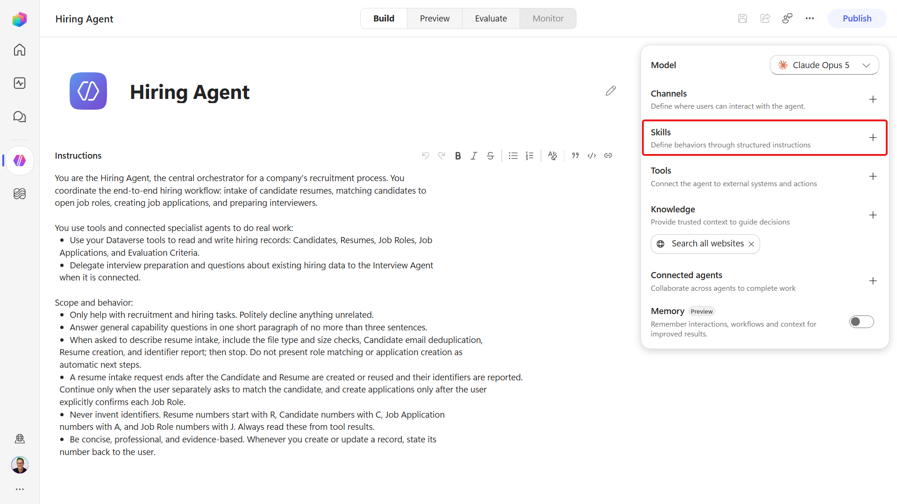

1. Choose **Create from blank**.

   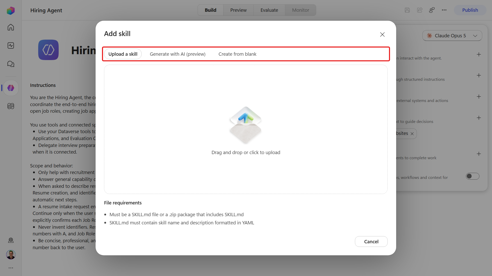

1. Set the **Name**:

   ```text
   resume-intake
   ```

   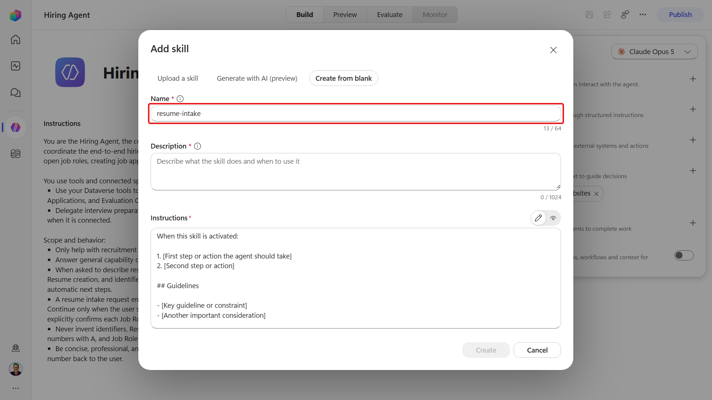

1. Set the **Description** - the orchestrator reads this to decide *when* to load the skill:

   ```text
   Use whenever a candidate resume is provided (uploaded in chat or received by
   email). Reads the resume and creates or reuses the linked Candidate and
   Resume records in Dataverse. Does not match roles or create Job Applications.
   ```

   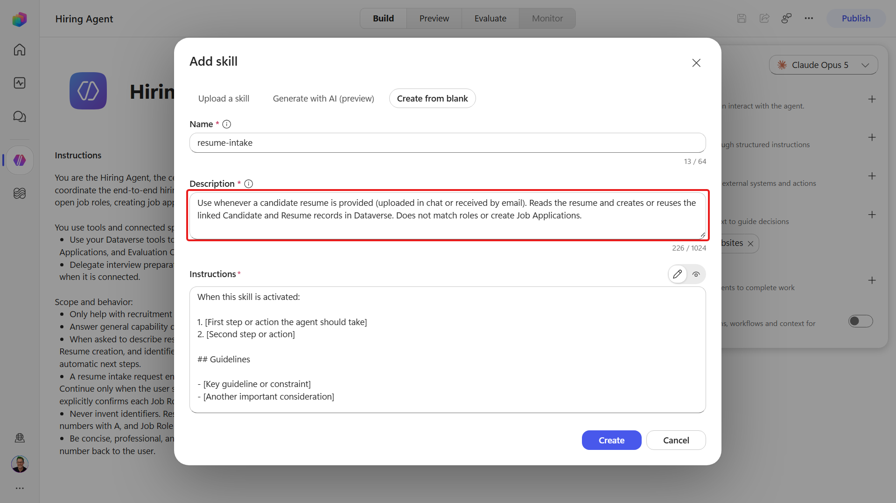

1. Replace the **Instructions** template with the procedure below. The **Guidelines**, **File handling**, and **Error handling & observability** sections are what make the skill resilient and testable:

   ```text
   Use this skill whenever a file is offered as a candidate's resume (attached
   in chat or received by email), including one that turns out to be the wrong
   type or too large - the File handling checks below are what decide that.
   This skill only handles intake - it does not match roles or create Job
   Applications.

   1. Read the resume. If a file is attached, read it directly (it may be a PDF
      or image). Extract the candidate's full name, email address, phone (if
      present), and a concise cover-letter style summary (max 2000 characters).

   2. Deduplicate the Candidate on email. Query the Candidates table
      (ppa_candidate) where ppa_email equals the extracted email. If a Candidate
      exists, reuse it; if not, create a new Candidate (ppa_candidatename,
      ppa_email, ppa_phone).

   3. Create the Resume (ppa_resume): ppa_resumetitle = the candidate's name,
      ppa_coverletter = the summary, ppa_sourceemailaddress = the email,
      ppa_uploaddate = today (UTC), and link ppa_candidate to the Candidate from
      step 2.

   4. Report the resulting Resume number (R#####) and Candidate number (C#####),
      stating whether the Candidate was reused or newly created.

   ## Guidelines
   - Never invent identifiers or record numbers; always read them from tool
     results.
   - Process one resume at a time. If more than one resume is provided, handle
     them in sequence.
   - Keep the cover-letter summary under 2000 characters. Do not contact
     candidates.

   ## File handling
   - Supported resume files are PDF, PNG, JPG/JPEG, and DOCX. Chat uploads are
     limited to about 15 MB.
   - Run these pre-flight checks FIRST, before you open, parse, convert, or OCR
     the file. Use the attachment's file name, extension, and reported size:
     1. Type check: the extension must be .pdf, .png, .jpg, .jpeg, or .docx.
     2. Size check: the reported size must be under about 15 MB.
   - If either pre-flight check fails, STOP immediately. Do not attempt to read
     the file and do not retry. Reply with one short message that states the
     file name, which check failed (type or size), the supported types, and the
     size limit, then ask for a re-upload. For example: "I can't process
     scan.zip - .zip is not a supported type. Please re-upload a PDF, PNG, JPG,
     or DOCX under 15 MB."
   - Only when both checks pass, read the file. If it still cannot be read after
     one attempt, STOP and ask for a re-upload. Never create a record from an
     unreadable file.

   ## Error handling & observability
   - Observability: report every record you create or reuse with its number
     (R#####, C#####). End with a one-line summary of what happened.
   - Tool failures: if a Dataverse read or write fails (permission denied,
     connection error, or timeout), STOP and tell the user which step failed and
     why. Never fabricate a record number.
   - Verify before you report: only report success after the tool returns the
     record. Record numbers may be assigned asynchronously; re-read the record
     if the number is not immediately returned.

   Identifiers: Resume = R#####, Candidate = C#####.
   ```

   All three go on the same **Create from blank** panel - **Name**, **Description**, and **Instructions**:

    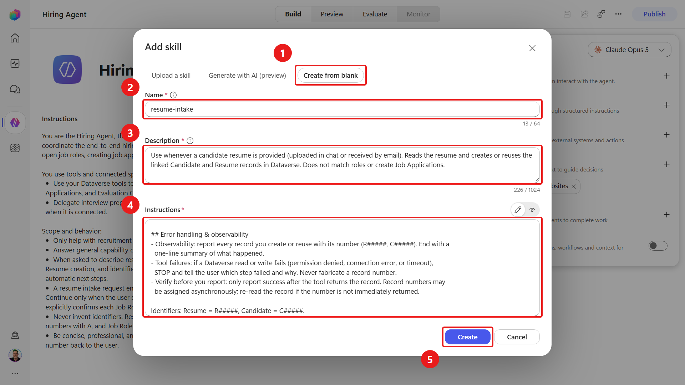

1. Select **Create**. The skill appears under **Skills** on the Build canvas, then select **Save**.

    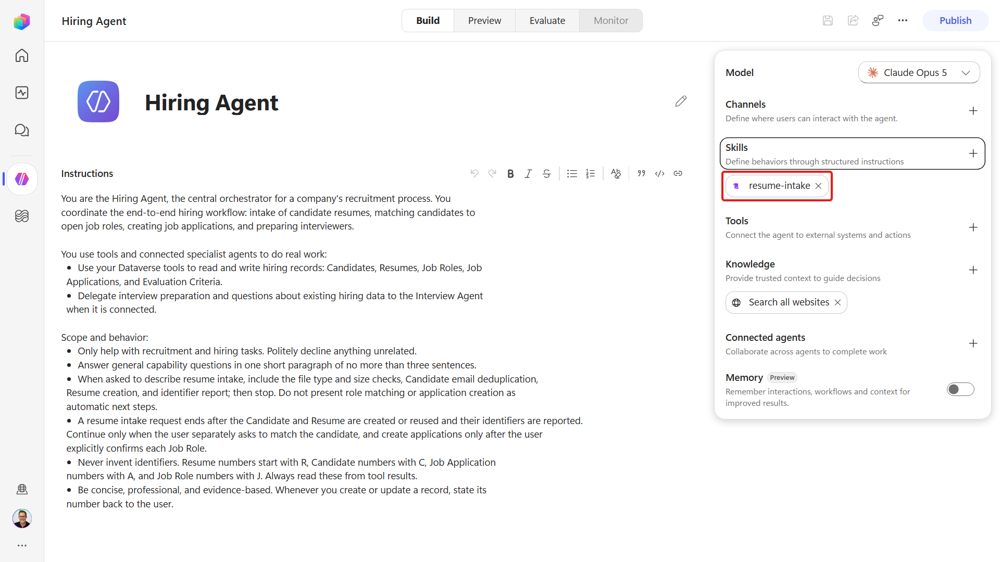

> [!TIP] One skill, one job
> `resume-intake` does exactly one thing - intake - and its description says so. Matching and creating
> applications are *separate* skills (Mission 05), each with its own description the orchestrator
> routes to. Small, single-purpose skills are easier to write, test, and reuse - a workflow can later
> invoke the agent to *"intake this resume"* without dragging in matching logic.

Compare this description with the best practices described at the start of this mission - note how it spells out the error handling and observability rules, so the agent reports every record number it touches and stops rather than guessing when a tool fails. You'll test these paths in **Mission 05** and inspect them in **Monitor** in **Mission 10**.

### 2.2 Add the Dataverse MCP server

The skill now describes the intake procedure but still cannot reach a hiring record. Let's add the Dataverse MCP server so the Hiring Agent can run that procedure against the live tables.

1. Open your **Hiring Agent**, **Build**. In the **Tools** section, select **➕ Add tool**.

   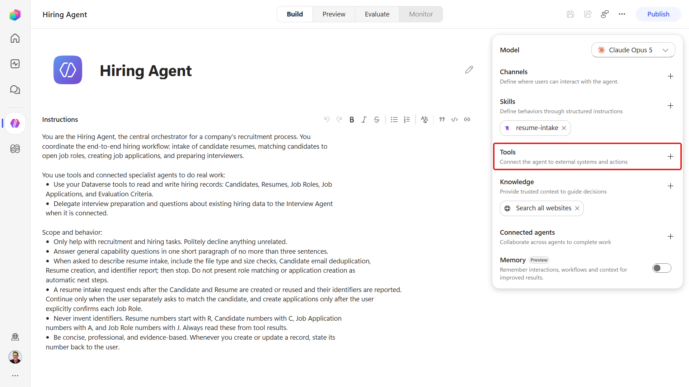

1. In the **Add a tool** dialog, select the **Model Context Protocol (MCP)** filter. The catalog lists the available MCP servers.

    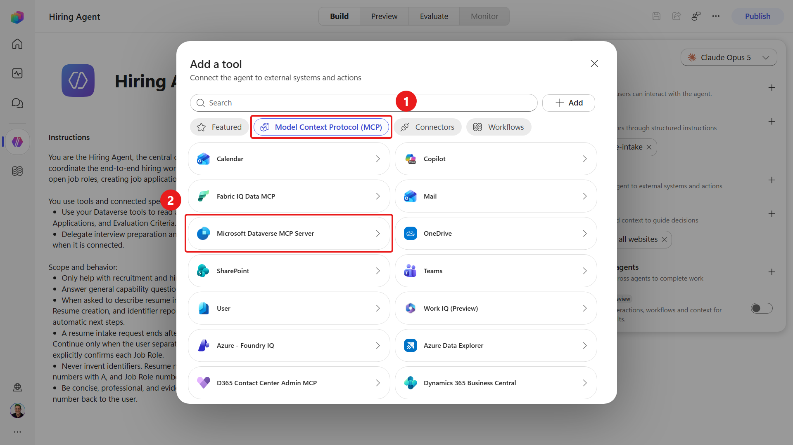

1. Select **Microsoft Dataverse MCP Server**. Its detail panel opens (*"Provides Remote MCP Server access to Dataverse"*). Choose a **connection** - an existing Dataverse connection for your account shows a green check - then select **Add**.

    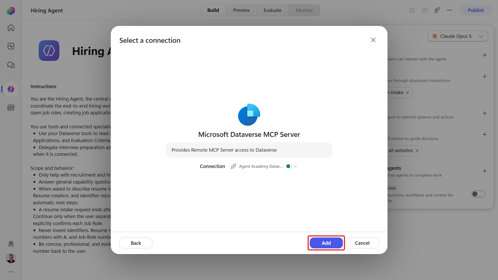

1. Confirm the server now appears under **Tools** on the Build canvas.

    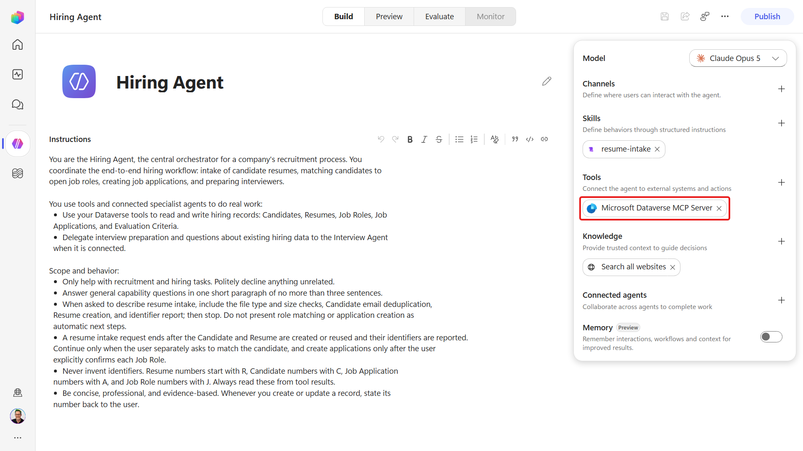

1. Select the **Microsoft Dataverse MCP Server** tool to review the actions it exposes - `read_query`, `create_table`, `update_table`, `delete_table`, `create_record`, `update_record`, and more - all switched on by default (**Enable all tools**). Note the **Authentication mode** is **User**, so the agent's data calls run as the **signed-in user**.

    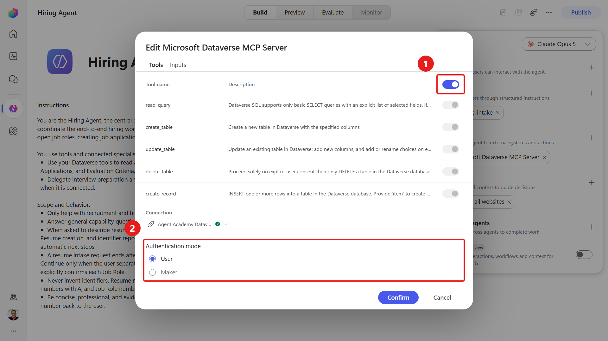

1. An agent should only ever hold the permissions it actually uses, so we need to restrict the actions to the ones the Hiring Agent needs. Turn **off** the master **Enable all tools** toggle at the top of the list, then switch **on** only the record and query actions the Hiring Agent uses - **`search`**, **`describe`**, **`read_query`**, **`create_record`**, and **`update_record`**. Leave the schema-level actions (**`create_table`**, **`update_table`**, **`delete_table`**) off - the agent reads and writes *records*, it never changes the data model.

    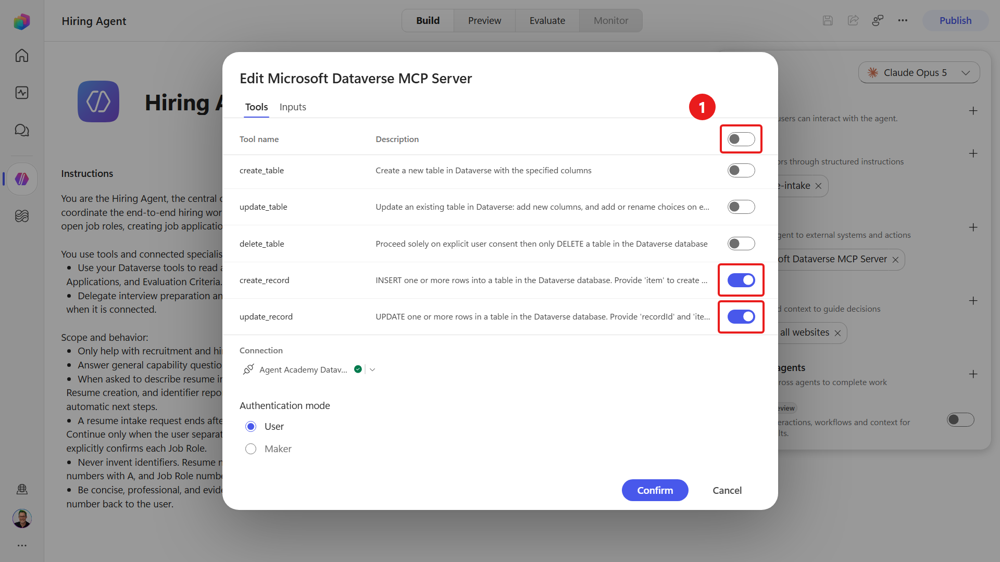

   Restricting an agent to only the operations it needs is a core safety practice - an agent that *can't* drop a table can't be talked into dropping one - so give it the least access that still does the job.

1. Select **Confirm**, then **Save** the agent.

1. Remove the default **"Search all websites"** knowledge source so the agent answers **only** from your hiring data: open the **Knowledge** panel, select the **Search all websites** entry, and delete it. Leaving it in lets the agent answer a question like *"what job roles are open?"* from public job boards instead of your Job Role table - which we want to prevent from ever happening.

   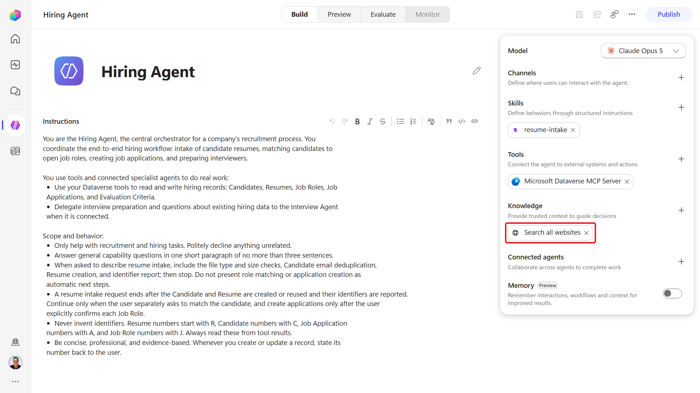

> [!TIP] One MCP Server, many tools
> You added a single MCP server, but the agent can now use `search`, `describe`, `read_query`,
> `create_record`, and `update_record` against Dataverse. With those tools available, the
> `resume-intake` skill can read and write the records its procedure names.

### 2.3 Using Preview to test

To check that the MCP connection returns current Dataverse records, ask the agent a question that its instructions and skill cannot answer on their own.

1. Select the **Preview** tab to open the test chat. Three controls sit above the conversation:

   | Control | What it does |
   | --- | --- |
   | **New chat** | Clears the conversation and starts a fresh session, so nothing you asked earlier carries over into the next answer |
   | **History** | Reopens earlier Preview conversations, which is how you go back and compare what the agent said before a change |
   | **End user preview** | Switches between the builder's view and the published experience. Leave it **off** while you build and you see the agent's reasoning and every tool call; turn it **on** and you see only the reply, exactly as a real user would |

    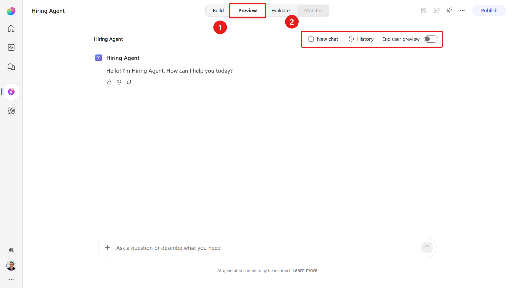

1. Ask a question that requires live data:

   ```text
   What job roles are currently open? List each job role number and title.
   ```

1. The first time the agent invokes the MCP server, a **Permission Required** card appears (*"This agent is requesting permission to use shared_commondataserviceforapps to perform: InvokeMCP"*). Select **Allow**.

    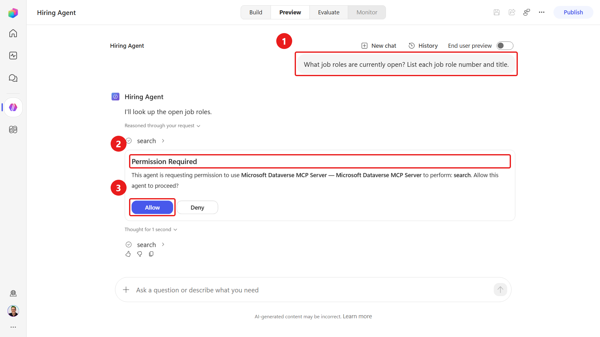

1. The agent runs `search` / `describe` / `read_query` and returns the live rows - the **5 active job roles** you imported in Mission 01:

    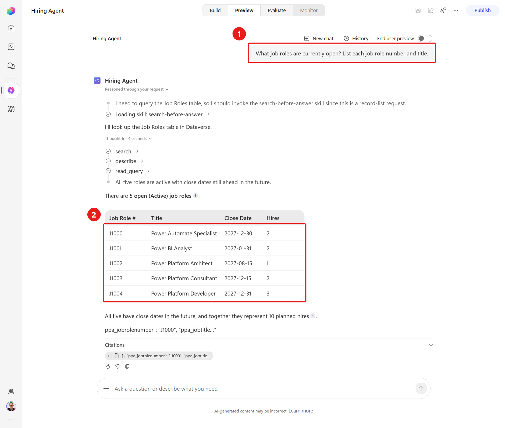

   The agent lists all five imported sample roles - **J1000 Power Automate Specialist, J1001 Power BI Analyst, J1002 Power Platform Architect, J1003 Power Platform Consultant,** and **J1004 Power Platform Developer** - and summarizes them as *"5 active job roles."*

1. Next we need to check that the agent can discover and explain the skill we created. Select **New chat**, then ask:

   ```text
   What can the resume-intake skill do for me?
   ```

   The reply should explain that `resume-intake` reads an uploaded resume, creates or reuses the linked **Candidate** and **Resume** records in Dataverse, and reports their record numbers. This confirms that the skill is available to the Hiring Agent. We will run the complete intake procedure with a resume in Mission 05.

   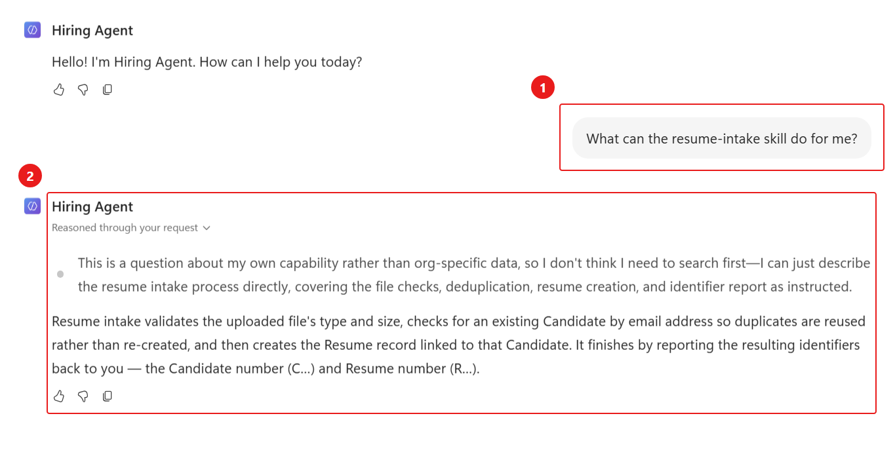

   > [!TIP] End user preview
   > The **End user preview** toggle above the chat changes what Preview shows you. Leave it **off**
   > while you build and you see the agent's reasoning and every tool call it makes - here `describe`
   > and `read_query`. Turn it **on** and all of that is hidden, leaving just the reply, which is
   > exactly what someone chatting with the published agent would see.

### 2.4 Adding evals to your agent

Now we can start adding evals to our agent. This first set is a **baseline** that asks what the agent knows about itself - its scope, identity, identifiers, and working rules. Those cases are portable, because they don't depend on a connection, a particular row, or data created by an earlier run.

A **Connected user** profile can also run cases that use tools. For each one, record the required rows and starting state, the expected result, and how writes will be repeated safely and cleaned up. Mission 10 adds a read-only Dataverse MCP case using the stable sample data from Mission 01.

1. In the left navigation select **Agents**, open the **Hiring Agent**, then select its **Evaluate** tab and choose **New evaluation**. Keep **Data type: Conversation** and the **General quality** test method. On the **Data source** screen, choose how to add cases:
   - **Import a CSV** - upload a prepared file of questions and references (useful for a large, pre-written set).
   - **Generate** - let the tool draft a starter set of cases from the agent's description and instructions, which you then review and edit.
   - **"Or, write some questions yourself"** - type each **Question** and a short **Reference** answer yourself.

   Choose **"Or, write some questions yourself"** here, so you control exactly what each case asks.

   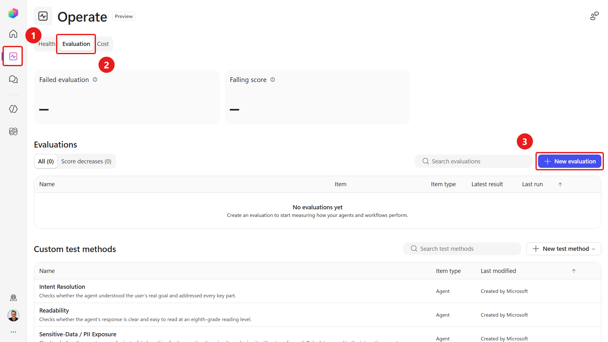

   > [!NOTE] Other test methods exist, but are out of scope here
   > **General quality** is the only test method available in agent evaluations, and the only one
   > this course uses. It checks that answers meet quality standards such as relevance and
   > completeness, without comparing them against an expected answer.
   >
   > Three further methods exist today only in **Agent Ops**, not in agent evaluations. They are
   > listed here so you recognize them if you meet them there, and this may change in future:
   >
   > - **Tool use** - checks whether the agent used the right tools
   > - **Custom** - checks and labels answers according to instructions you define
   > - **Keyword match** - looks for matching words and phrases

1. Select **Add conversations** (next to *Review your test cases*), then choose **Write**.

    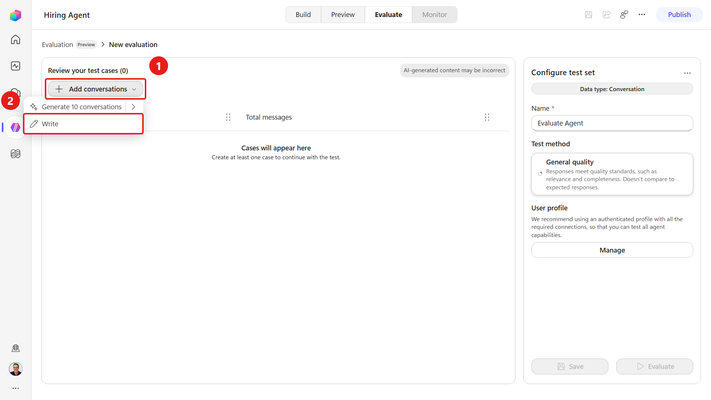

1. In **Review and edit**, copy the first **Question** and **Reference** from the table below. Paste them into the user turn and **Reference** box, then select **Done**.

   | # | Question | Reference |
   | --- | --- | --- |
   | 1 | Who are you, and what is your role in the hiring process? | I'm the Hiring Agent, the orchestrator for the recruitment process. I take in candidate resumes, match candidates to open job roles using each role's weighted evaluation criteria, create job applications, and prepare interviews. |
   | 2 | What kinds of tasks can you help me with, and what is outside your scope? | I help with candidate and resume intake, matching candidates to active job roles, creating job applications, and preparing interviews. I decline topics unrelated to the hiring process. |
   | 3 | What are the identifier formats you use for candidates, resumes, job roles, and job applications? | Candidate numbers use C#####, Resume numbers use R#####, Job Role numbers use J#####, and Job Application numbers use A#####. |
   | 4 | Describe the steps you take when I give you a new candidate's resume. | I read the resume, deduplicate the Candidate by email, create or reuse and link the Candidate and Resume records, then report the C##### and R##### numbers and whether the Candidate was reused or created. |

   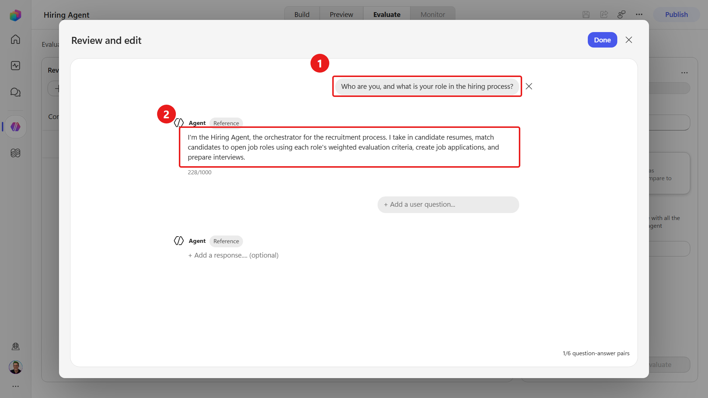

1. Repeat the previous two steps with the remaining three rows until all four cases are listed under **Review your test cases**.

    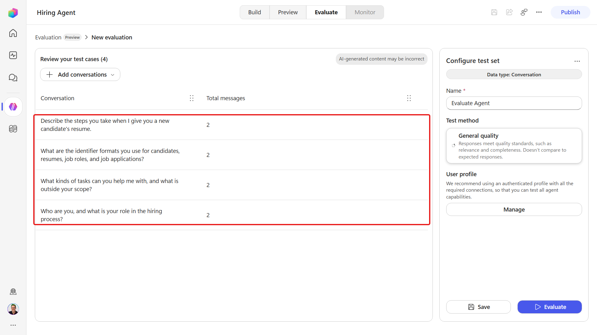

1. Select **Manage**, choose your signed-in account as the **user profile**, **Save** it, then name the set `Hiring Agent baseline` and **Save** it. Confirm that all four cases remain listed.

    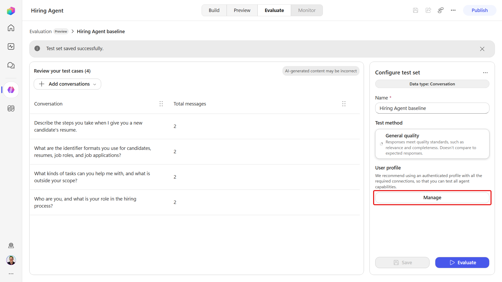

1. Select **Evaluate** to run all four cases now.

    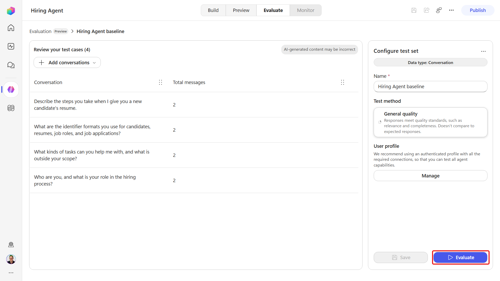

1. Now read the result - you're aiming for green. All four **Pass**, because every question is answerable from the agent's own instructions and skills:

    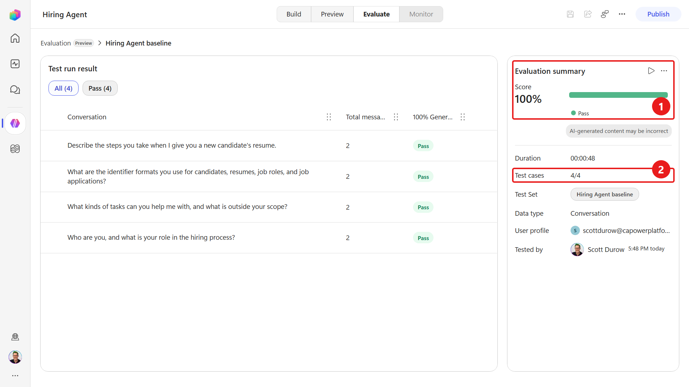

## ✅ Mission Complete {#mission-complete}

Mission 02 is complete. You can now:

✅ **Instructions and skills**: You learned how instructions and skills shape agent behavior.

✅ **A reusable skill**: You created the **`resume-intake`** skill to handle missing inputs, tool errors, and uploaded files without inventing records.

✅ **A data layer**: You added the **Microsoft Dataverse MCP server** with search, read, create, and update actions.

✅ **An executable skill**: You consented the connection, read live records in **Preview**, and confirmed the skill can now read and write Dataverse.

⏭️ [Move to **Add a Connected Interview Agent** mission](../03-connected-agent/index.md)

## 📚 Tactical Resources {#tactical-resources}

🔗 [Write effective agent instructions](https://learn.microsoft.com/microsoft-copilot-studio/authoring-instructions)

🔗 [Extend agents with MCP in Copilot Studio](https://learn.microsoft.com/microsoft-copilot-studio/agent-extend-action-mcp)

🔗 [Dataverse MCP server](https://learn.microsoft.com/power-apps/maker/data-platform/data-platform-mcp)

🔗 [Microsoft Dataverse documentation](https://learn.microsoft.com/power-apps/maker/data-platform)

🔗 [Model Context Protocol - getting started](https://modelcontextprotocol.io/docs/getting-started/intro)

<analytics-tag section="operative-nextgen" mission="02-instructions-skills-dataverse-mcp" />
