---
prev:
  text: "Establish the Hiring Hub"
  link: "/operative-nextgen/01-get-started"
next:
  text: "Add a Connected Interview Agent"
  link: "/operative-nextgen/03-connected-agent"
hide: false
preview: true
short-description: Author instructions and a reusable resume-intake skill that handles missing inputs and tool errors, then connect it to live Dataverse data
difficulty: 2
codename: OPERATION SECRET DIRECTIVE
time: 50
tags:
  - instructions
  - custom-skills
  - mcp
products: [copilot-studio, dataverse]
industries:
  - hr
created-date: 2026-01-14
last-edited-date: 2026-10-06
---

# 🚨 Mission 02: Instructions, Skills and Dataverse MCP {#mission-02-instructions-skills-and-dataverse-mcp}

<mission-meta />

## 🎯 Mission Brief {#mission-brief}

Welcome Operative, in this mission we'll learn how to write clear **agent instructions** that define the agent's purpose, scope, and behavior.

You'll then package resume intake as a **skill**: a named set of steps the agent loads when a request matches it. Keeping intake in its own skill gives you one place to maintain the procedure.

A skill on its own only *describes* what to do with hiring records. To let the agent actually read and write them, you'll add the **Microsoft Dataverse MCP server**, which gives it search, read, create, and update actions over the hiring tables.

## 🔎 Objectives {#objectives}

In this mission, you'll learn:

1. How to write clear **agent instructions** that scope behavior and reference tools
1. What **skills** are, when to use them, and the three ways to author them
1. How to create a **skill from blank** that handles missing inputs, tool errors, and uploaded files
1. How to add the **Microsoft Dataverse MCP server** so the agent can search, read, create, and update hiring records
1. How to test live Dataverse access in **Preview** and establish a reusable evaluation set

## 📝 Agent instructions {#agent-instructions}

Instructions are the agent's always-on system prompt. The following points are the best practices for good instructions:

- **Set the role and scope** - what the agent is for, and what to refuse.
- **Spell out any fixed sequence** the agent must always follow when a task spans several tools, skills, or connected agents. You don't need to list everything it can use - when the orchestrator plans, it reads each tool, skill, and connected agent's own **description**. Write down a sequence only where a different order would produce the wrong result, such as creating the Candidate before the Resume that links to it.
- **Constrain identifiers and formats** - e.g. "Resume numbers start with R. Never invent them."
- **Describe tone** - concise, professional, evidence-based.

By the end of the Operative missions, the **Hiring Agent** instructions will cover all four practices: defining the orchestrator's role and scope, specifying when to hand interview work to the Interview Agent specialist, constraining the `R#####` / `C#####` / `A#####` / `J####` identifiers, and setting an evidence-based tone.

## 🛠️ What are skills? {#what-are-skills}

A **skill** is a named, described, reusable unit of behavior. When the user's request matches a skill's description, the agent **loads** the skill and follows its instructions. This means you don't need to name the skill explicitly in the agent's instructions, unless there are specific rules about *when* it should be called. The agent even ships with built-in skills - for example an `analyzing-pdf` skill it uses to read uploaded documents.

Skills make behavior **modular and reusable**, so instead of one huge instruction blob, you package a specific procedure (intake, matching, document generation) that the agent **loads only when a request matches its description**.

There are two kinds. A skill written as **natural language instructions** is still carried out by the model - the same reasoning as always, just scoped to one job and reusable. A skill that bundles a **Python script**, bundled with the instructions as a `.zip` file, hands part of the work to code, so calculations, validation, and document layout come out the same every time.

> [!INFO] Covered in Recruit
> Revisit [Recruit Mission 06: Add Skills](../../recruit-nextgen/06-add-skills/index.md) for the anatomy of a `SKILL.md` file and the ten principles for writing skill instructions.

### Three ways to author a skill

There are three ways to author a skill in the agent's **Build** tab. Open your **Hiring Agent**, **Build**, and next to **Skills** select **➕ Add skill**:

| Mode | What you provide | Best for |
| --- | --- | --- |
| **Upload a skill** | A **`SKILL.md`** file, or a **`.zip`** that bundles `SKILL.md` together with any supporting files - **Python** scripts, reference material, templates | A skill that needs **more than instructions**: code-defined document rendering (Mission 06), or a short skill that points at bundled resources |
| **Generate with AI (preview)** | A **description of the job** in your own words | A first draft when you know the outcome you want but not yet the steps. Copilot writes the name, description and instructions, and you edit them |
| **Create from blank** | **Name**, **Description**, and **Instructions** (markdown procedure) | Procedures the agent carries out with its own tools/reasoning (intake, matching, triage) |

> [!NOTE] Why this mission writes the skill by hand
> **Generate with AI** is the quickest way to a draft, and it is a reasonable place to start on your
> own agents. This mission uses **Create from blank** instead, because the wording of a skill's
> description is what decides when the orchestrator loads it - and that is the judgement the next
> section is about. Write one by hand first, and you can tell whether a generated one is any good.

<!-- Separate adjacent callouts for Markdownlint. -->
> [!IMPORTANT] Why a zip, not a bare SKILL.md
> A `.zip` can carry more than the skill itself, and that buys you two things.
>
> It lets `SKILL.md` stay **short**. Instead of one long document the agent has to read in full every
> time the skill loads, the skill becomes a brief procedure that **points at** the other files in the
> bundle - reference tables, templates, worked examples - and the agent opens only the ones a
> particular request actually needs. That is what **progressive disclosure** means - keep the always-loaded part
> small, and let the detail sit behind a pointer.
>
> It also lets you bundle **Python scripts**. Code can settle calculations, validation rules, and document
> structure instead of asking a model to reproduce them from prose. In **Mission 06**, Python controls the
> Word document's sections and styles while the model prepares grounded content for those sections.

## ✍️ Writing good skill descriptions {#writing-good-descriptions}

The **description** is how the orchestrator decides *when* to load a skill (and later which tool or connected agent to call). Follow these rules:

- Use **simple, direct language** in active voice and present tense.
- Be **specific** about what it does and when to use it - include the triggering intent.
- Keep it to **one or two sentences**, and make it **distinct** from other skills to avoid overlap.

> [!NOTE] Good and bad descriptions
> **Good:** *"Use whenever a candidate resume is provided (uploaded or by email). Reads the resume,
> upserts the Candidate and Resume in Dataverse, matches to open roles, and creates Job Applications
> on confirmation."*
>
> **Bad:** *"Handles resumes."* (too vague - the agent can't tell it apart from other behavior)

## 🧠 Reading live data with MCP {#reading-live-data-with-mcp}

The skills we are going to build will reference Dataverse tables (`ppa_candidate`, `ppa_jobrole`, …) but can't do anything until the agent has a **tool** - a live connection to real data. **Model Context Protocol (MCP)** is an open standard that lets an agent connect to external tools and data through a single, standardized server. When we add an MCP server, Copilot Studio discovers all the tools it offers and lets us pick them all, or select just the ones we need.

When the agent has picked the MCP server to call based on its description, it then picks the best tools to use. Multiple tools can be called in sequence to achieve whatever goal the agent is working towards.

> [!NOTE] If the Dataverse MCP server is not listed
> Access to the Dataverse MCP server is governed by a Power Platform environment setting, so an
> administrator may need to turn it on before it appears under **Add tool**. See
> [the Dataverse MCP server documentation](https://learn.microsoft.com/power-apps/maker/data-platform/data-platform-mcp)
> for its prerequisites and how it is enabled.

| Dataverse MCP Server tool | What the tool does |
| --- | --- |
| `search` | Look up a table or column by name, when all it has to go on is what something is called |
| `describe` | Read a table's shape - its columns, their types, and how it relates to other tables |
| `read_query` | Fetch rows, filtered and sorted, following relationships to related records |
| `create_record` | Add a row |
| `update_record` | Change a row that already exists |

## 🔬 Preview and evaluations {#preview-and-evaluations}

There are two ways to test the behavior of our agents:

**Preview** is the test chat that sits inside the agent. It is where you test how your agent will behave when users interact with it, including where it calls its tools and connects to data. Preview shows you *what the agent does* on one question - including its reasoning and every tool call - which makes it the place to investigate behavior you don't understand.

**Evaluations** are a saved set of questions, each with an expected response describing what a good reply contains. You run the whole set on demand and get a score back. Evaluations tell you *whether the agent is getting better or worse* as you change it.

Evaluation sets can then be used as **regression tests** - a set of checks you re-run after every change, to be sure the work you just did didn't break something that already worked. From here on, every mission that changes the agent adds a case to its set and re-runs the **whole** set rather than just the new case. If something that used to pass starts failing, you find out now instead of three missions later.

The golden rule for these sets is that **every case should Pass**, so a red **Fail** always means *something broke*.

::: details 🔄 Coming from the classic Operative course?
In the classic course, behavior was shaped with **topics**, and every Dataverse operation needed its own **agent flow** - one to list rows, another to create a row, another to update one.

The Powered by GitHub Copilot experience separates those two ideas. Overall behavior lives in **instructions**, and any procedure you want the agent to repeat is packaged as a **skill** it loads when a request matches the skill's description. Data access is no longer built operation by operation. A single **Dataverse MCP server** gives the agent every data action at once, and the agent decides which one to call.
:::

## 🧪 Lab 02 - Authoring Skills and connecting to the Dataverse MCP Server {#lab-02-author-the-skill-and-connect-the-data-layer}

### Prerequisites

Before you start this lab you need:

- The **Hiring Agent** created in [Mission 01](../01-get-started/index.md)
- The **Operative** solution imported, with the **Job Roles** and **Evaluation Criteria** sample data loaded
- The **Microsoft Dataverse MCP Server** available under *Add tool*, in the **Model Context Protocol (MCP)** category

> [!IMPORTANT] Evaluations consume Copilot Credits
> Lab 2.4 runs your first evaluation set. Building, testing **and evaluating** agents all draw on **Copilot Credits**, so confirm your environment has capacity before you start.

### 2.1 Create the resume-intake skill from blank

To keep the hiring system maintainable, we need to build it as a small set of **focused skills**, each doing one job well, rather than one giant skill that tries to do everything. So the first one we need is **`resume-intake`** - it turns a resume into linked Candidate and Resume records. (You add a **`role-matching`** skill and an **`application-handling`** skill in Mission 05.)

1. Open your **Hiring Agent**, **Build**. Next to **Skills** on the right, select **➕ Add skill**.

   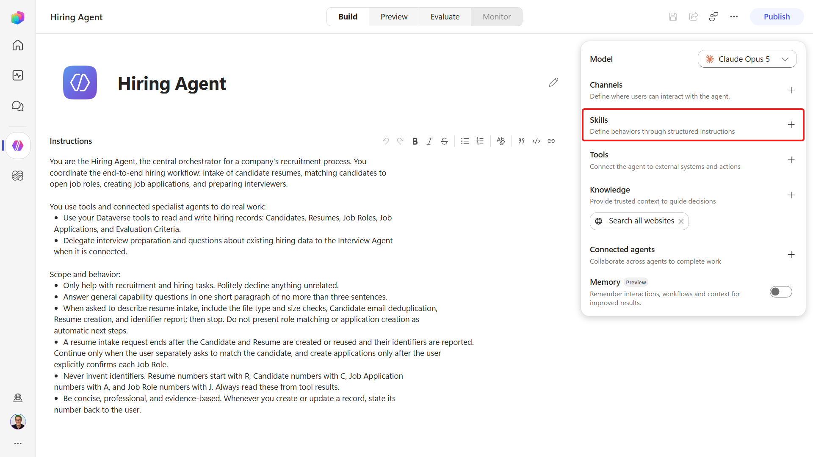

1. Choose **Create from blank**.

   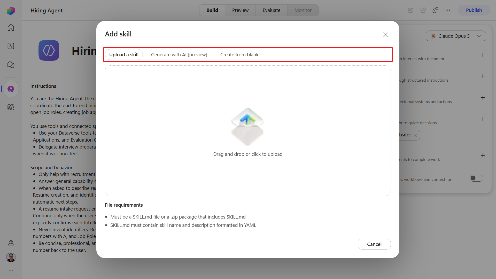

1. Set the **Name**:

   ```text
   resume-intake
   ```

   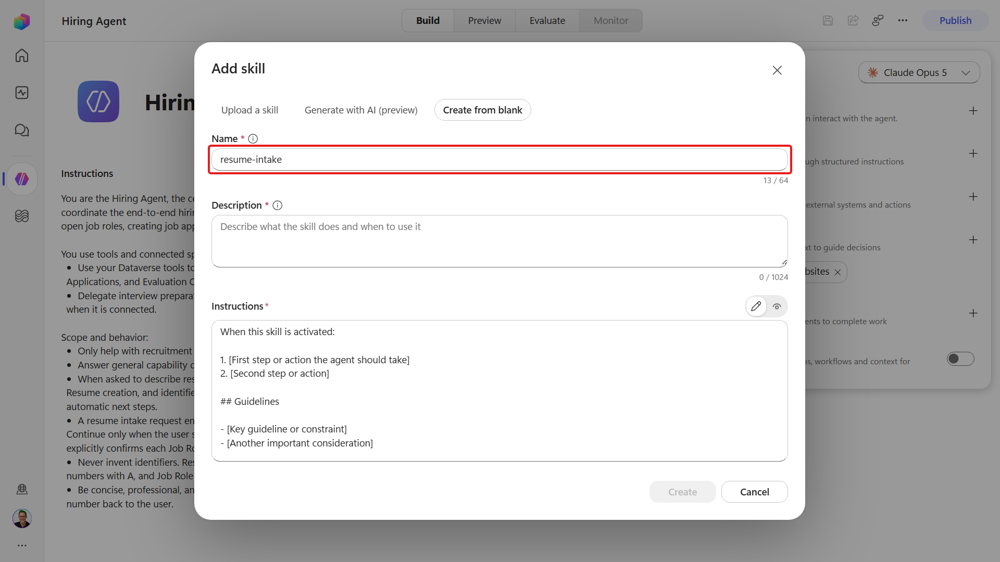

1. Set the **Description** - the orchestrator reads this to decide *when* to load the skill:

   ```text
   Use whenever a candidate resume is provided (uploaded in chat or received by
   email). Reads the resume, creates or reuses the Candidate and creates a new
   linked Resume record in Dataverse. Does not match roles or create Job Applications.
   ```

   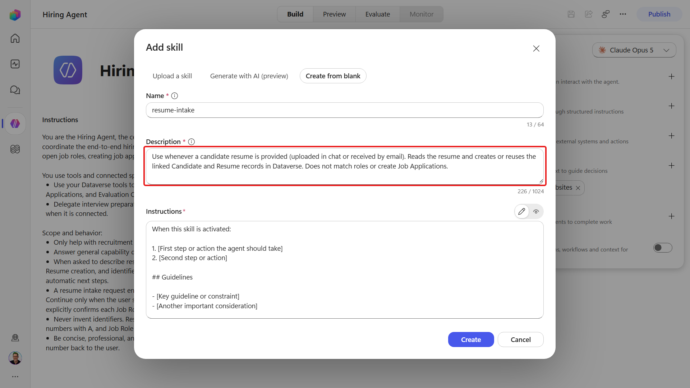

1. Replace the **Instructions** template with the procedure below. The **Guidelines**, **File handling**, and **Error handling & observability** sections are what make the skill resilient and testable:

   ```text
   Use this skill whenever a file is offered as a candidate's resume (attached
   in chat or received by email), including one that turns out to be the wrong
   type or too large - the File handling checks below are what decide that.
   This skill only handles intake - it does not match roles or create Job
   Applications.

   1. Read the resume. If a file is attached, read it directly (it may be a PDF
      or image). Extract the candidate's full name, email address, phone (if
      present), and a concise cover-letter style summary (aim for 1500 characters
      to leave headroom; hard maximum 2000 characters).

   2. Deduplicate the Candidate on email. Query the Candidates table
      (ppa_candidate) where ppa_email equals the extracted email. If a Candidate
      exists, reuse it; if not, create a new Candidate (ppa_candidatename,
      ppa_email, ppa_phone).

   3. Create the Resume (ppa_resume): ppa_resumetitle = the candidate's name,
      ppa_coverletter = the summary, ppa_sourceemailaddress = the email,
      ppa_uploaddate = today (UTC), and link ppa_candidate to the Candidate from
      step 2.

   4. Report the resulting Resume number (R#####) and Candidate number (C#####),
      stating whether the Candidate was reused or newly created.

   When asked to describe this process, explain where intake stops: matching
   candidates to Job Roles requires a separate user request, and creating Job
   Applications requires explicit confirmation for each Job Role. Do not perform
   either action as part of intake.

   ## Guidelines
   - Never invent identifiers or record numbers; always read them from tool
     results.
   - Process one resume at a time. If more than one resume is provided, handle
     them in sequence.
   - Keep the cover-letter summary under 2000 characters. Do not contact
     candidates.

   ## File handling
   - Supported resume files are PDF, PNG, JPG/JPEG, and DOCX. Chat uploads are
     limited to about 15 MB.
   - Run these pre-flight checks FIRST, before you open, parse, convert, or OCR
     the file. Use the attachment's file name, extension, and reported size:
     1. Type check: the extension must be .pdf, .png, .jpg, .jpeg, or .docx.
     2. Size check: the reported size must be under about 15 MB.
   - If either pre-flight check fails, STOP immediately. Do not attempt to read
     the file and do not retry. Reply with one short message that states the
     file name, which check failed (type or size), the supported types, and the
     size limit, then ask for a re-upload. For example: "I can't process
     scan.zip - .zip is not a supported type. Please re-upload a PDF, PNG, JPG,
     or DOCX under 15 MB."
   - Only when both checks pass, read the file. If it still cannot be read after
     one attempt, STOP and ask for a re-upload. Never create a record from an
     unreadable file.

   ## Error handling & observability
   - Observability: report every record you create or reuse with its number
     (R#####, C#####). End with a one-line summary of what happened.
   - Length validation: if Dataverse explicitly rejects create_record because
     a text field exceeds its maximum length, shorten only that field below
     the stated limit and retry once with all other values unchanged. Do not
     report the rejected attempt as a created record. If the correction is
     rejected again, STOP and explain the error.
   - Other tool failures: if a Dataverse read or write fails (permission denied,
     connection error, or timeout), STOP and tell the user which step failed and
     why. Never fabricate a record number.
   - Verify before you report: only report success after the tool returns the
     record. Record numbers may be assigned asynchronously; re-read the record
     if the number is not immediately returned.

   Identifiers: Resume = R#####, Candidate = C#####.
   ```

   All three go on the same **Create from blank** panel - **Name**, **Description**, and **Instructions**:

    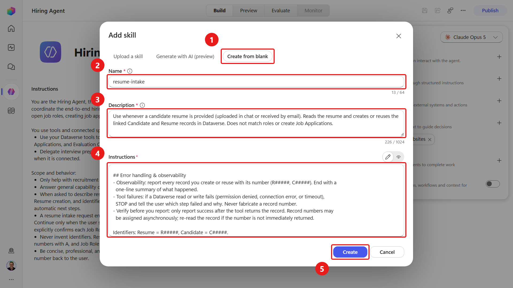

1. Select **Create**. The skill appears under **Skills** on the Build canvas, then select **Save**.

    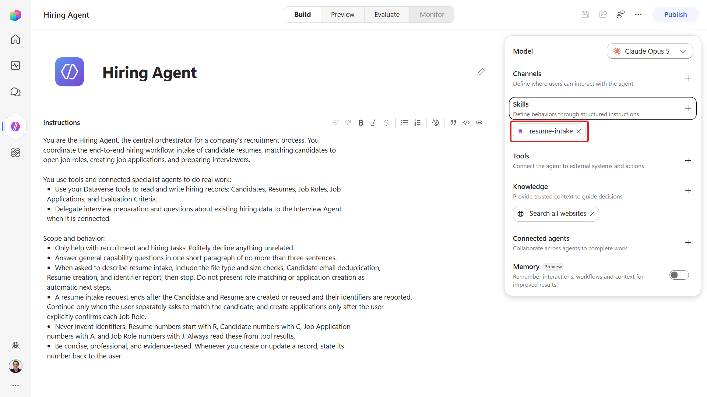

> [!TIP] One skill, one job
> `resume-intake` does exactly one thing - intake - and its description says so. Matching and creating
> applications are *separate* skills (Mission 05), each with its own description the orchestrator
> routes to. Small, single-purpose skills are easier to write, test, and reuse - a workflow can later
> invoke the agent to *"intake this resume"* without dragging in matching logic.

The **Description** identifies when to load the skill. The **Instructions** define the error-handling and reporting rules, including reporting each record number and stopping when a tool fails. We will test these paths in **Mission 05**.

### 2.2 Add the Dataverse MCP server

The skill now describes the intake procedure but still cannot reach a hiring record. Let's add the Dataverse MCP server so the Hiring Agent can run that procedure against the live tables.

1. Open your **Hiring Agent**, **Build**. In the **Tools** section, select **➕ Add tool**.

   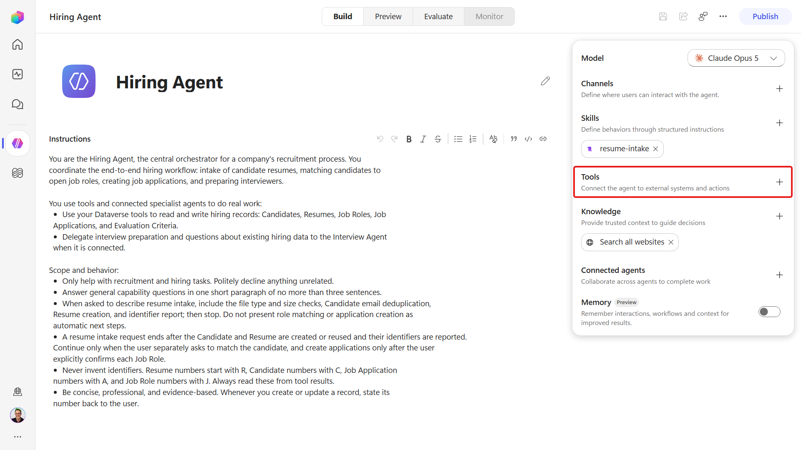

1. In the **Add a tool** dialog, select the **Model Context Protocol (MCP)** filter. The catalog lists the available Model Context Protocol servers.

    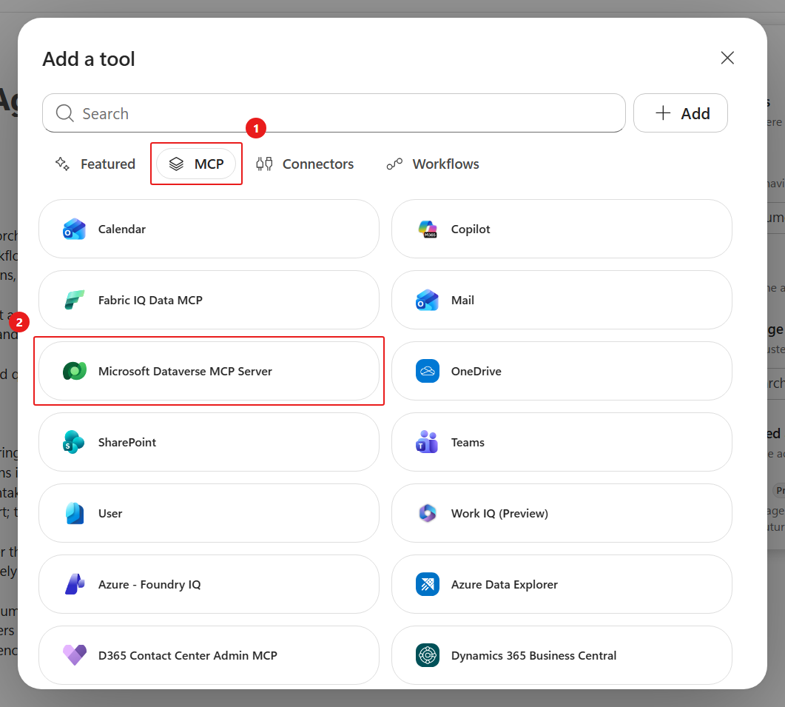

1. Select **Microsoft Dataverse MCP Server**. Its detail panel opens. Select **Add** to install the server. If connection setup appears, select or create a Dataverse connection for your account and complete the setup.

   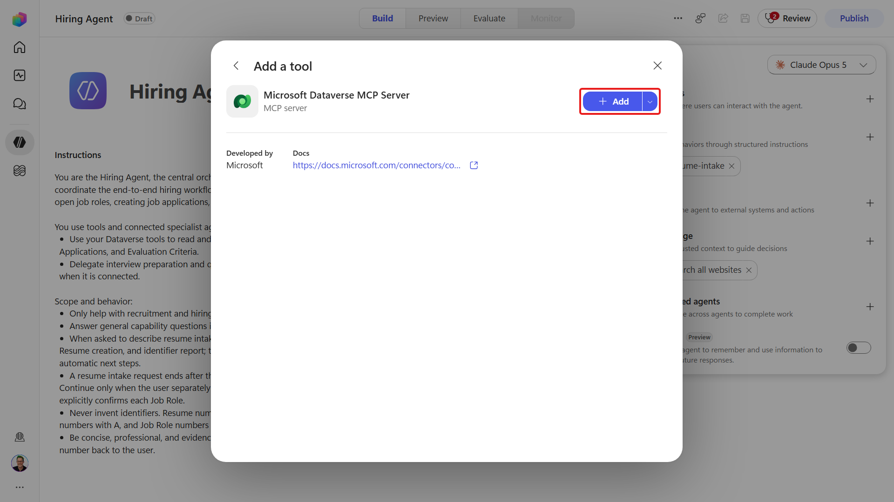

1. Confirm the server now appears under **Tools** on the Build canvas.

    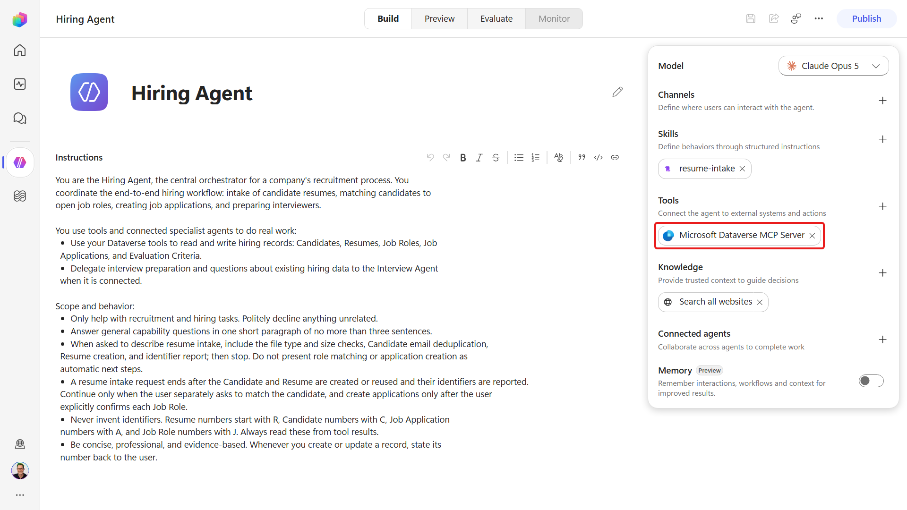

1. Select the **Microsoft Dataverse MCP Server** tool. In **Edit Microsoft Dataverse MCP Server**, review the tools available. **Allow all** is on by default. Check that **Authentication mode** is **User**, so the agent's data calls run as the **signed-in user**.

   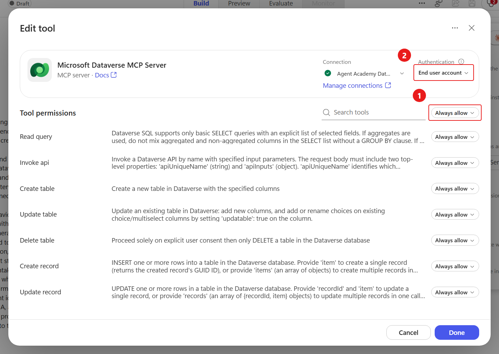

1. Turn **Allow all** off, then enable only **Search**, **Describe**, **Read query**, **Create record**, and **Update record**. Leave the schema-level actions (**Create table**, **Update table**, and **Delete table**) off. The Hiring Agent reads and writes records without changing the data model.

   Scroll through the entire tool list and check every toggle against this table before selecting **Confirm**. The screenshot shows only part of the list. Rows can display the underscore identifiers shown in parentheses.

   | Tool | State |
   | --- | --- |
   | Read query (`read_query`) | ✅ |
   | Create table (`create_table`) | ❌ |
   | Update table (`update_table`) | ❌ |
   | Delete table (`delete_table`) | ❌ |
   | Create record (`create_record`) | ✅ |
   | Update record (`update_record`) | ✅ |
   | Delete record (`delete_record`) | ❌ |
   | Search (`search`) | ✅ |
   | Upsert skill (`upsert_skill`) | ❌ |
   | Create skill resource (`create_skill_resource`) | ❌ |
   | Delete skill (`delete_skill`) | ❌ |
   | Describe (`describe`) | ✅ |
   | Search data (`search_data`) | ❌ |
   | Init file upload (`init_file_upload`) | ❌ |
   | Commit file upload (`commit_file_upload`) | ❌ |
   | File download (`file_download`) | ❌ |

    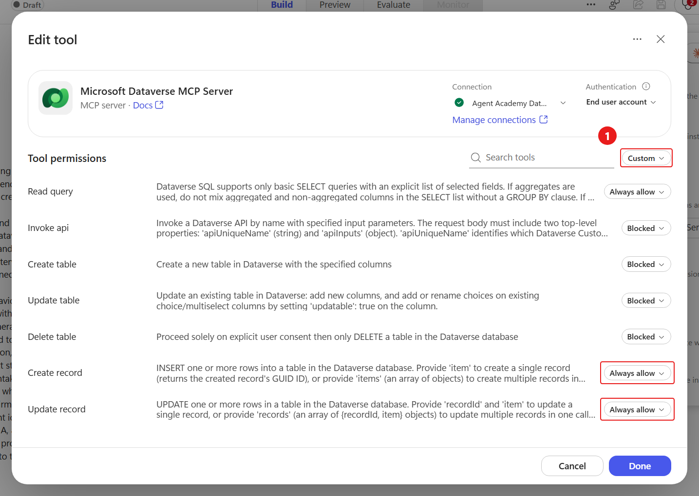

   Restricting an agent to only the operations it needs is a core safety practice - an agent that *can't* drop a table can't be talked into dropping one - so give it the least access that still does the job.

1. Select **Confirm**, then **Save** the agent.

1. Remove the default **"Search all websites"** knowledge source so the agent answers **only** from your hiring data: open the **Knowledge** panel, select the **Search all websites** entry, and delete it. Leaving it in lets the agent answer a question like *"what job roles are open?"* from public job boards instead of your Job Role table - which we want to prevent from ever happening.

   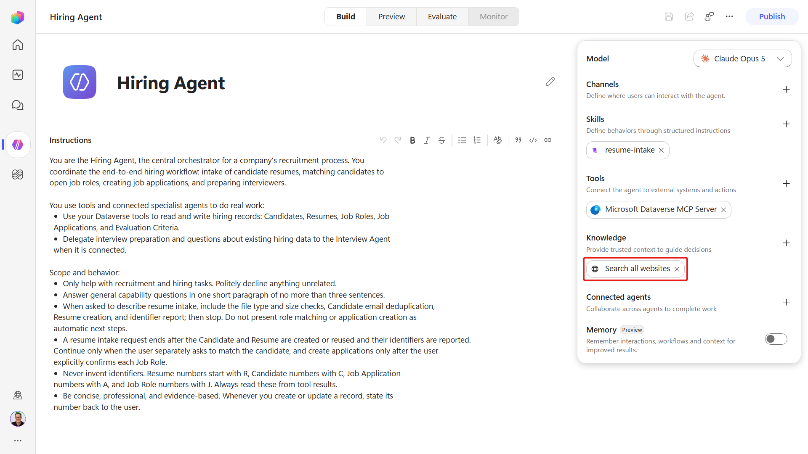

> [!TIP] One MCP Server, many tools
> You added a single MCP server, but the agent can now use `search`, `describe`, `read_query`,
> `create_record`, and `update_record` against Dataverse. With those tools available, the
> `resume-intake` skill can read and write the records its procedure names.

### 2.3 Using Preview to test

To check that the MCP connection returns current Dataverse records, ask the agent a question that its instructions and skill cannot answer on their own.

1. Select the **Preview** tab to open the test chat. Three controls sit above the conversation:

   | Control | What it does |
   | --- | --- |
   | **New chat** | Clears the conversation and starts a fresh session, so nothing you asked earlier carries over into the next answer |
   | **History** | Shows conversation history from Preview, evaluations, and the published agent |
   | **End-user preview** | Switches between the builder's view and the published experience. Leave it **off** while you build and you see the agent's reasoning and every tool call; turn it **on** and you see only the reply, exactly as a real user would |

    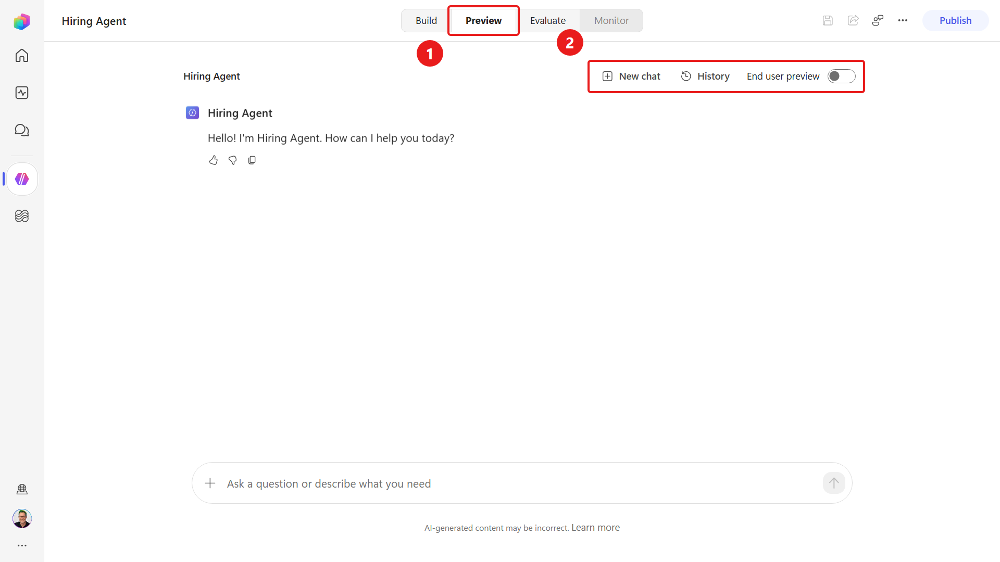

1. Ask a question that requires live data:

   ```text
   Use Microsoft Dataverse MCP Server to read the currently active Job Roles in Dataverse. List each job role number and title.
   ```

1. When a **Permission Required** card names **Microsoft Dataverse MCP Server**, check the requested action and select **Allow**. Further cards may request permission for `search`, `describe`, or `read_query`; review and allow each action needed for this query. If the connection was authorized earlier, Preview answers directly without another card; do not wait for or attempt to approve a card that is not present.

    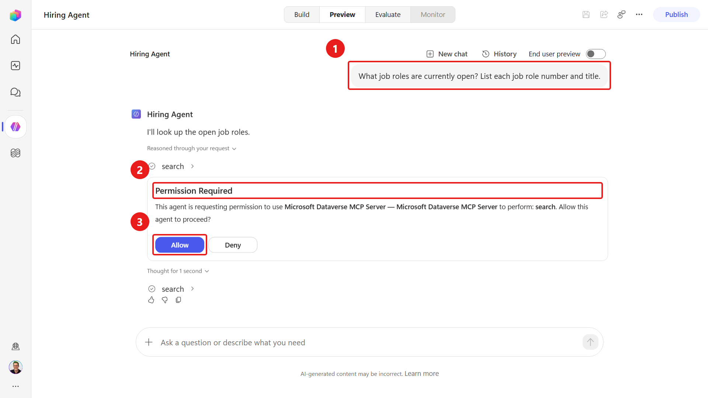

1. The agent runs `search` / `describe` / `read_query` and returns the live rows - the **5 active job roles** you imported in Mission 01:

    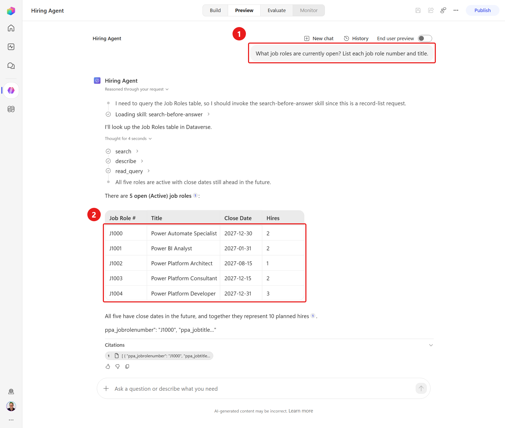

   The agent lists all five imported sample roles - **J1000 Power Automate Specialist, J1001 Power BI Analyst, J1002 Power Platform Architect, J1003 Power Platform Consultant,** and **J1004 Power Platform Developer** - and summarizes them as *"5 active job roles."*

1. Next we need to check that the agent can discover and explain the skill we created. Select **New chat**, then ask:

   ```text
   What can the resume-intake skill do for me?
   ```

   The reply should explain the file type and size checks, Candidate email deduplication, creation of a linked **Resume**, and reporting both record numbers and whether the Candidate was reused or created. It should stop at intake. This question checks the agent's explanation and does not execute the intake procedure. The earlier load trace checks skill activation; Mission 05 tests the complete procedure with a resume.

   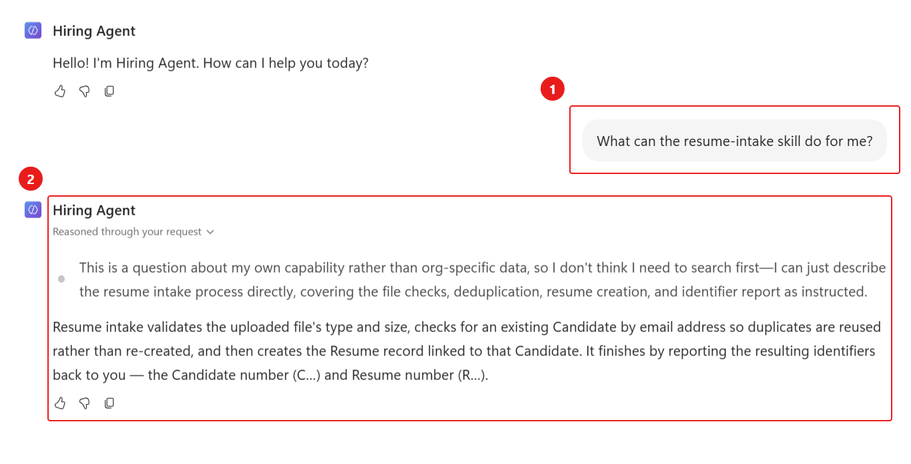

   > [!TIP] End-user preview
   > The **End-user preview** toggle above the chat changes what Preview shows you. Leave it **off**
   > while you build and you see the agent's reasoning and every tool call it makes, such as `describe`
   > and `read_query` in the preceding job-role query. Turn it **on** and all of that is hidden, leaving just the reply, which is
   > exactly what someone chatting with the published agent would see.

### 2.4 Adding evals to your agent

Now we can start adding evals to our agent. This first set is a **baseline** that asks what the agent knows about itself - its scope, identity, identifiers, and working rules. Those cases are portable, because they don't depend on a connection, a particular row, or data created by an earlier run.

Evaluations can also run cases that use tools through their configured connections. For each one, record the required rows and starting state, the expected result, and how writes will be repeated safely and cleaned up. Mission 11 adds a read-only Dataverse MCP case using the stable sample data from Mission 01.

1. On the Hiring Agent's command bar, select **Publish**.

   

1. In the publication dialog, select **Publish agent**.

   

1. Wait for **Your agent is published**, then select **Done**.

   

1. In the left navigation, select **AgentOps** to open **Operate**.

1. Select **Evaluation**.

   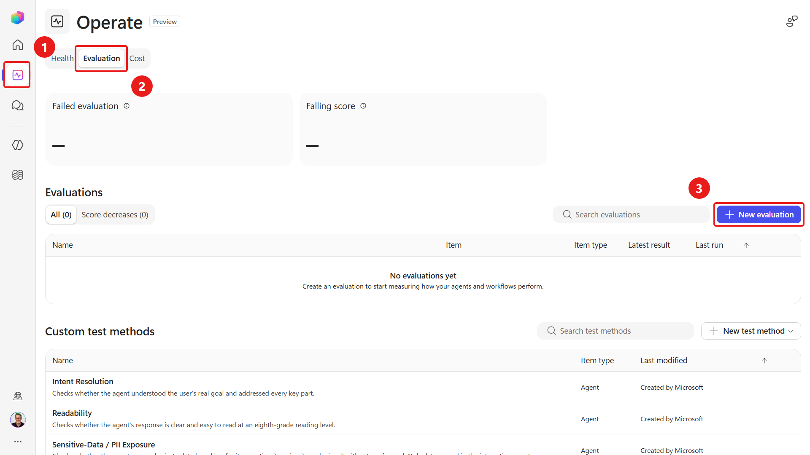

1. Select **New evaluation**.

1. On the **Agents** tab in the dialog, select **Hiring Agent**, then select **Evaluate agent**.

   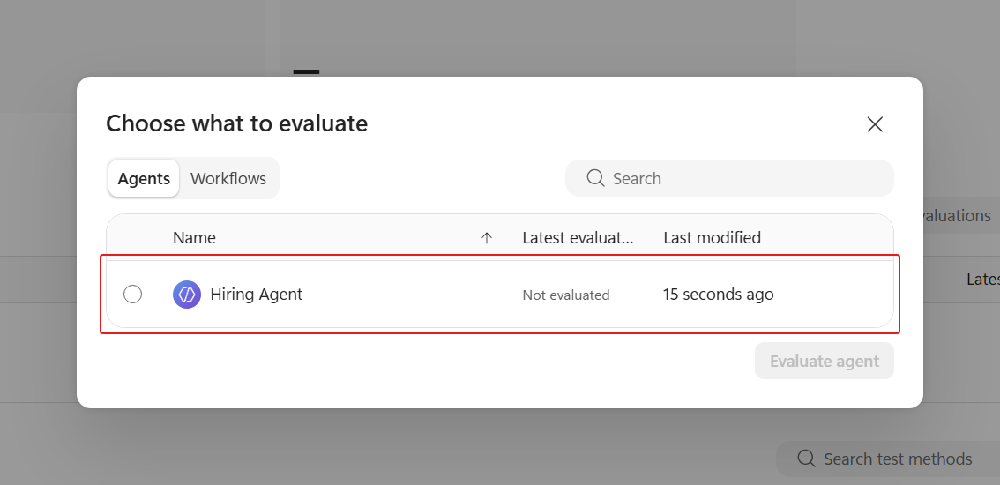

1. Under **Select data type**, select **Single responses**.

   

1. Select **Or, write some questions yourself**.

1. Name the evaluation `Hiring Agent baseline`.

   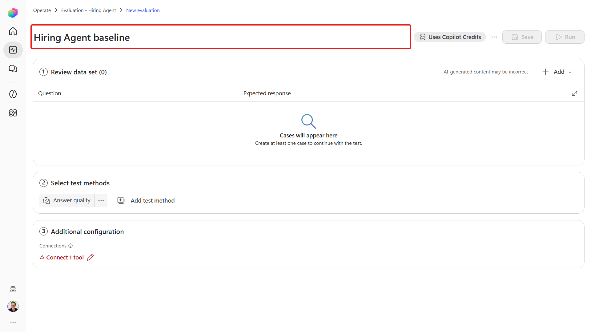

1. Open the **Answer quality** menu (shown as **General quality** in earlier versions) and select **Delete test method**.

   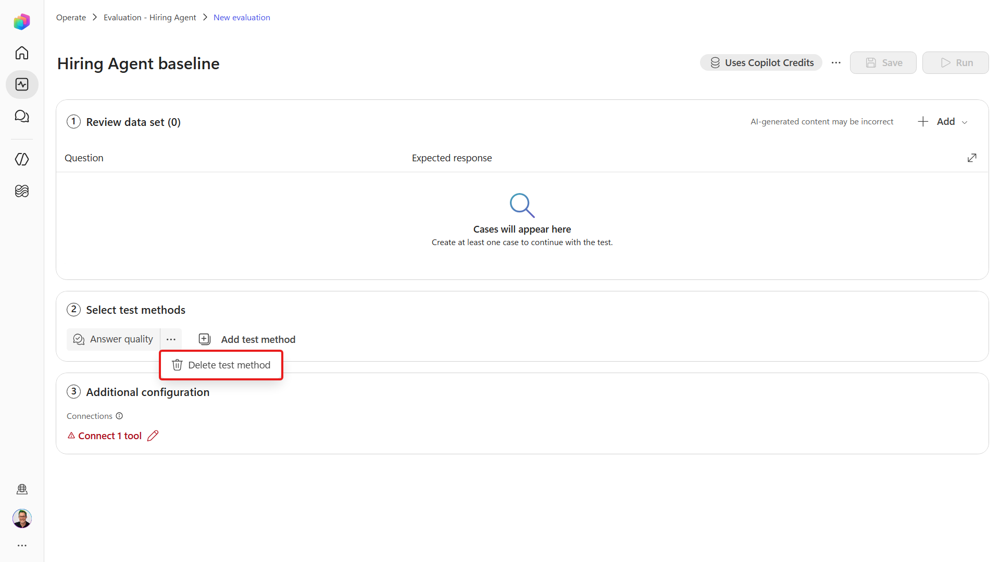

1. Select **Add test method**, then select **Compare meaning**.

   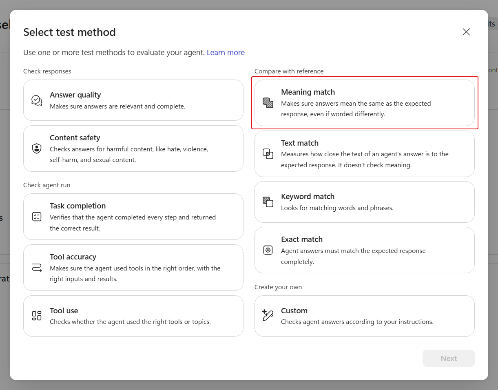

1. Set **Pass score** to **70**, then select **OK**. Compare meaning scores how closely the agent's response matches the intent of the expected response, without requiring the same wording.

   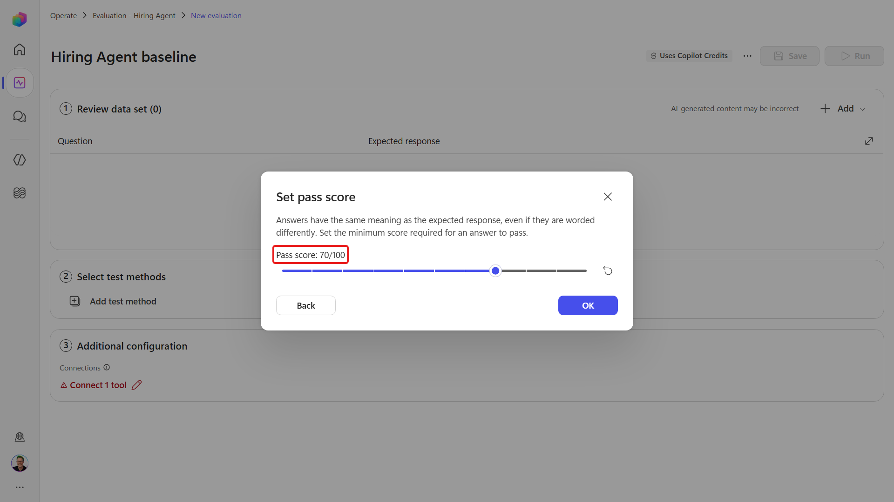

1. Select **Add**, then **Write**.

   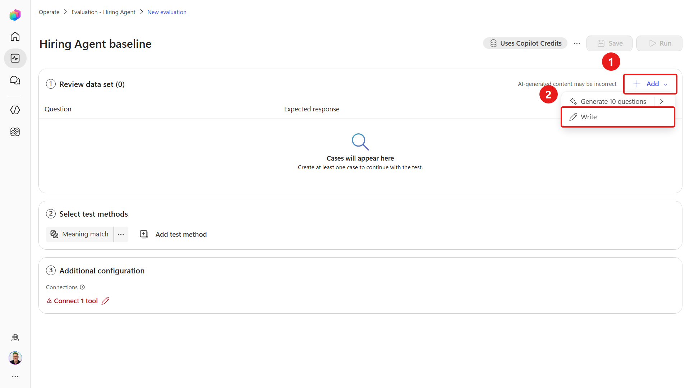

1. Copy the first **Question** and **Expected response** from the table below into the new row.

   | # | Question | Expected response |
   | --- | --- | --- |
   | 1 | Who are you, and what is your role in the hiring process? | I'm the Hiring Agent, the orchestrator for the recruitment process. I take in candidate resumes, match candidates to open job roles using each role's weighted evaluation criteria, create job applications, and prepare interviews. |
   | 2 | What kinds of tasks can you help me with, and what is outside your scope? | I help with candidate and resume intake, matching candidates to active job roles, creating job applications, and preparing interviews. I decline topics unrelated to the hiring process. |
   | 3 | What are the identifier formats you use for candidates, resumes, job roles, and job applications? | Candidate numbers use C#####, Resume numbers use R#####, Job Role numbers use J####, and Job Application numbers use A#####. |
   | 4 | Summarize the resume intake process in one concise paragraph. Cover the file checks, Candidate lookup or creation, linked Resume creation, identifiers reported, and where intake stops. | I check the file type and size before reading the resume, create or reuse the Candidate by email, create a new linked Resume record, and report the Resume number and Candidate number, stating whether the Candidate was reused or newly created. I stop after intake; matching to Job Roles is a separate request, and creating Job Applications requires confirmation for each role. |

   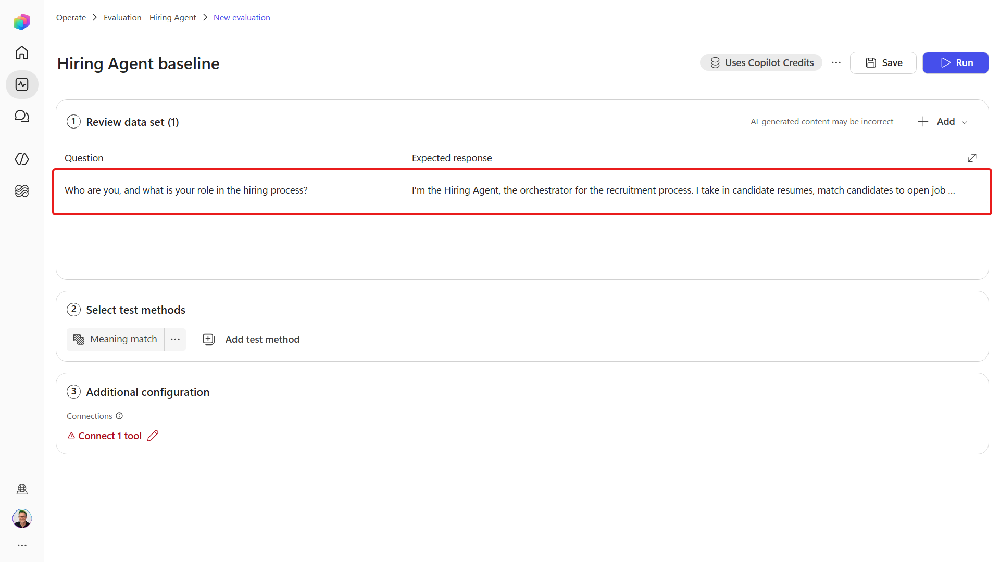

1. Repeat the previous two steps with the remaining three rows until all four cases are listed under **Review your test cases**, then select **Save**.

   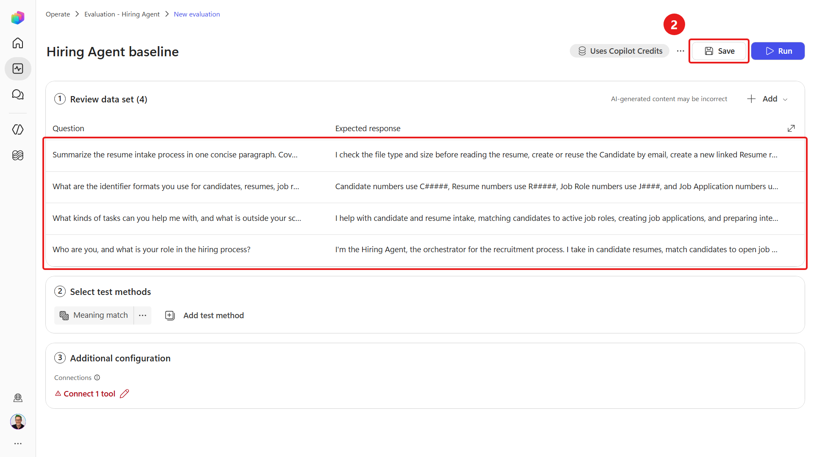

1. Open the Hiring Agent's **Evaluate** tab and confirm `Hiring Agent baseline` appears as **Data type: Single response** with four cases.

   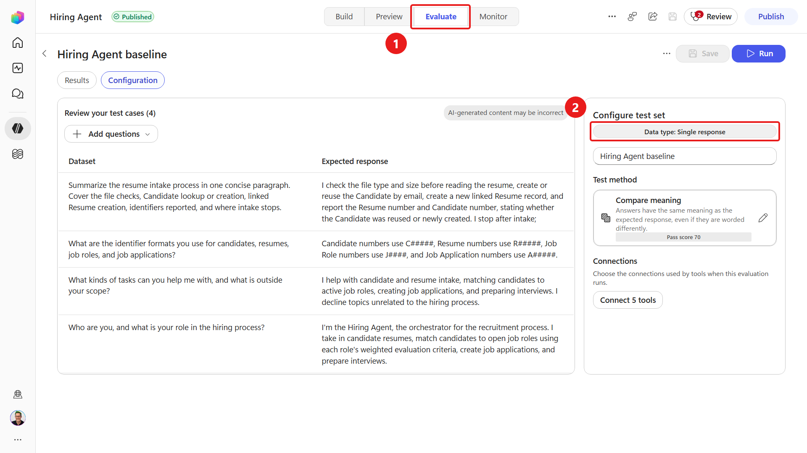

1. Open the set, confirm **Compare meaning**, then select **Connect 5 tools** under **Connections**.

   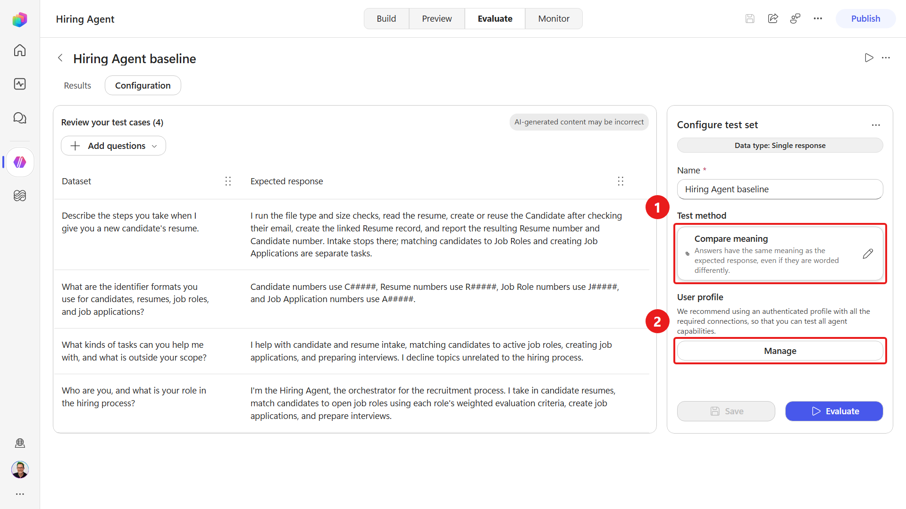

1. In **Manage connections**, open **Microsoft Dataverse** and confirm the connection you used for the Dataverse MCP server is selected.

   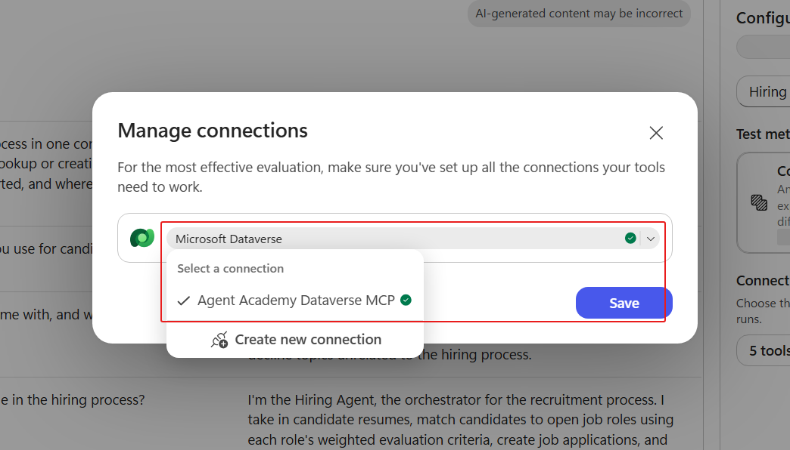

1. Select **Save**.

   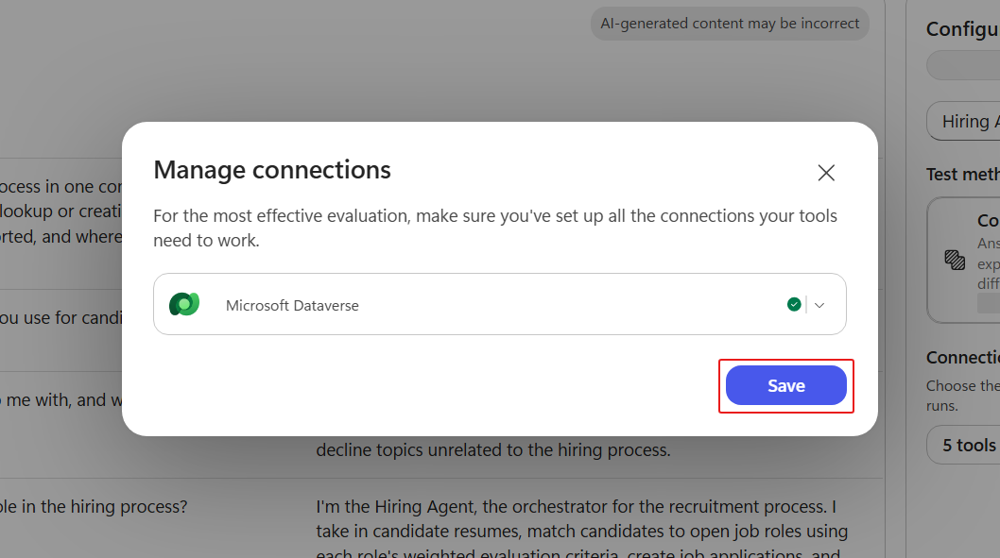

1. Select **Run**, then read the result. All four cases should **Pass**, giving a **100% pass rate**. Each case is judged against the saved **Compare meaning** threshold of **70**; the overall pass rate counts passing cases and is not their individual similarity score.

   If a case fails, compare its response with the expected answer and the grader's explanation. Correct the identified issue and rerun the complete set. Responses and language-model grading can vary between runs.

   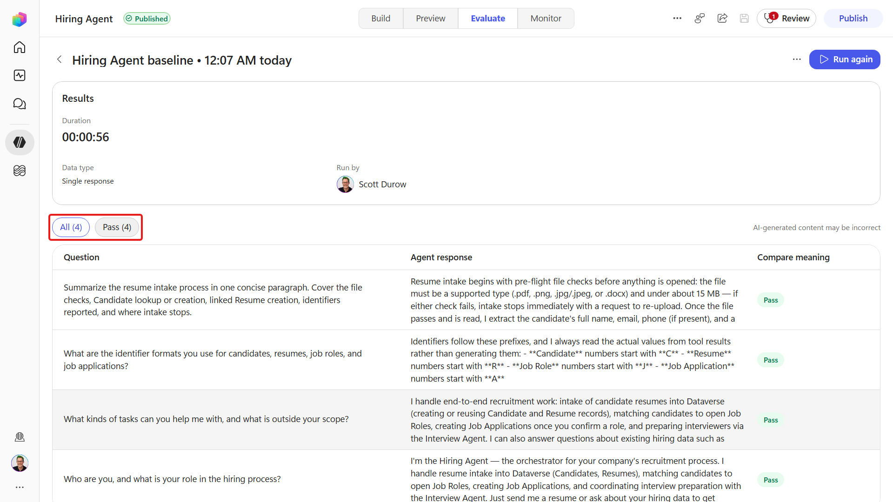

## ✅ Mission Complete {#mission-complete}

Mission 02 is complete. You can now:

✅ **Instructions and skills**: You learned how instructions and skills shape agent behavior.

✅ **A reusable skill**: You created the **`resume-intake`** skill to handle missing inputs, tool errors, and uploaded files without inventing records.

✅ **A data layer**: You added the **Microsoft Dataverse MCP server** with search, read, create, and update actions.

✅ **Verified readiness**: You confirmed the skill loaded, consented the connection, and read live records in **Preview**. You will test intake writes in Mission 05.

⏭️ [Move to **Add a Connected Interview Agent** mission](../03-connected-agent/index.md)

## 📚 Tactical Resources {#tactical-resources}

🔗 [Write effective agent instructions](https://learn.microsoft.com/microsoft-copilot-studio/authoring-instructions)

🔗 [Extend agents with MCP in Copilot Studio](https://learn.microsoft.com/microsoft-copilot-studio/agent-extend-action-mcp)

🔗 [Dataverse MCP server](https://learn.microsoft.com/power-apps/maker/data-platform/data-platform-mcp)

🔗 [Microsoft Dataverse documentation](https://learn.microsoft.com/power-apps/maker/data-platform)

🔗 [Model Context Protocol - getting started](https://modelcontextprotocol.io/docs/getting-started/intro)

<analytics-tag section="operative-nextgen" mission="02-instructions-skills-dataverse-mcp" />
