---
prev:
  text: "Generate Documents with a Python Skill"
  link: "/operative-nextgen/06-document-skill"
next:
  text: "Add Agents to a Workflow"
  link: "/operative-nextgen/08-workflow-agents"
hide: true
preview: true
short-description: Build an email-triggered workflow that screens the inbox and files resumes and their PDFs in Dataverse
difficulty: 3
codename: OPERATION SIGNAL POINT
time: 50
tags:
  - automation
  - triggers
products: [copilot-studio, dataverse, outlook]
industries:
  - hr
created-date: 2026-01-14
last-edited-date: 2026-08-12
---

# 🚨 Mission 07: Automate Resume Intake with a Workflow {#mission-07-automate-resume-intake-with-a-workflow}

<mission-meta />

## 🎯 Mission Brief {#mission-brief}

Welcome back, Agent. So far your agents respond to people. In this mission you'll make the hiring system run on its own.

When an applicant emails a resume, a **Workflow** screens out junk and automatic replies, then files the resume and its PDF in Dataverse - with nobody watching.

A **Workflow** is an automation you build *inside* Copilot Studio. Unlike an agent, it doesn't chat or reason. It runs a fixed sequence of steps every time something **triggers** it, which here is an email arriving. Connector, branch, and loop nodes do the filing, and a **Classify** node reads the email and decides which branch to take.

By the end of this mission an email lands in the mailbox and a resume appears in Dataverse with its PDF attached, unattended.

## 🔎 Objectives {#objectives}

In this mission, you'll learn:

1. What **Workflows** are and the **triggers** available
1. How to route inbound email with a **Classify** node
1. How to group work in a **Scope** and loop over an email's attachments
1. How to file a Dataverse row and attach the original PDF as a note
1. How to test individual nodes and inspect runs in the **Activity** tab

## 🧠 Workflows and their triggers {#workflows-and-their-triggers}

A **Workflow** is a standalone, versioned automation - a graph of **nodes** that runs **deterministically**, the same way every time. It's the new home for the "**when X happens, do Y**" automation that used to live in **agent flows** and event-triggered **Power Automate**: you build, test, publish, and version it **inside Copilot Studio**.

The division of labor runs through the next two missions:

- Use a **Workflow** for the **deterministic** work - a fixed sequence of steps, branching, loops, filing a record, sending mail, posting a card, or waiting for an approval.
- Use an **agent** (called from a workflow **Agent** node) for the **reasoning** work - reading a resume, matching it to a role, deciding the best fit.

This mission builds the deterministic half of that pipeline, covering the trigger, the routing, and the filing. [Mission 08](../08-workflow-agents/index.md) adds the reasoning on top of it.

> [!INFO] Covered in Recruit
> Revisit [Recruit Mission 07: Automate with Workflows](../../recruit-nextgen/07-automate-with-workflows/index.md) for how a workflow differs from a Power Automate cloud flow, and for the Health Center and version history you work with while building one.

### What's in a workflow - the node palette {#node-palette}

You assemble a workflow from a small set of node types, all of them in the left **Add** panel:

| The node | What you'd use it for |
| --- | --- |
| **Connector** | The **trigger** itself, plus 1400+ connector **actions** - Outlook *When a new email arrives*, Dataverse *Add a new row*, Teams *Post adaptive card*. |
| **Classify** | A built-in **AI intent router**: give it some text and a few category names, and it decides which one fits. |
| **Agent** | Hands an open-ended task to an **agent** and reads its structured result back. |
| **Human review** | Pauses and waits for a person to approve something or fill in a gap. |
| **If/Else** | Splits the flow two ways on a **condition**. |
| **Loop** | Repeats over a list - each attachment, say - or until a condition is met. |
| **Variable** / **Function** | Stash a value to use further down, or do small string and array transforms. |

One node you will need is **not** in that palette. **Scope** - a labeled box that groups several actions so they succeed or fail as one - appears only in the **Add** dialog, in the **Actions** group below **Loop**. You create it in Lab 7.3, and it becomes the foundation of the error handling you build in [Mission 09](../09-human-oversight/index.md).

### The triggers you can choose {#triggers}

Every workflow starts with exactly **one trigger** that decides *when* it runs - you choose it on the **Start** node:

| Trigger | Fires when… | Use it when |
| --- | --- | --- |
| **Manual** | You run it by hand | Building and testing while you develop |
| **Recurrence** | On a schedule | Periodic jobs - a nightly digest, a weekly cleanup |
| **Connector event** (e.g. Outlook *When a new email arrives*) | An external system raises an event | **Reacting to the outside world** - this mission's pattern |
| **When an HTTP request is received** | Something calls the workflow's URL | Wiring up a webhook or a custom caller |
| **When an agent calls the workflow** | An agent invokes it as a **tool** | Letting the Hiring Agent kick off the automation on demand |

This mission uses a **Connector event** trigger - *When a new email arrives* - so a resume emailed to the recruitment mailbox files itself with no one watching.

### Classify - the AI router {#classify}

**Classify** is a lightweight AI **router**. It only *sorts* text into the named **categories** you define, drawing one branch per category on the canvas plus an automatic **Other**. It has no tools, knowledge, or memory - it just decides **which branch** to take. You use it in Lab 7.2.

## 🔢 How expressions refer to other nodes {#expressions}

[Recruit Mission 07](../../recruit-nextgen/07-automate-with-workflows/index.md#expressions-and-functions) introduced the expression editor and the functions used most often - `concat()`, `if()`, `empty()`, `coalesce()`, `length()`.

Several steps in this mission read a value that an earlier node produced. Workflows do that with an **expression**, and they all follow one shape:

```text
outputs('File_resume_in_Dataverse')?['body/ppa_resumeid']
```

Read it from the outside in:

- **`outputs('…')`** is the output of the node named inside the quotes. Some nodes use `body('…')` instead, which is the same idea one level deeper.
- **The name in quotes is the node's name with every space and every piece of punctuation replaced by an underscore.** `Is it a PDF?` becomes `Is_it_a_PDF_`, and `Alert - filing failed` becomes `Alert_-_filing_failed`. This is why every lab tells you to rename a node *before* you write any expression that mentions it - rename it afterwards and your expression still points at the old name.
- **`?`** is safe navigation. It means "if this piece is missing, give me nothing rather than an error", which keeps a run from failing on an email that had no such field.
- **`['body/field']`** selects one field out of that output.

Two practical notes. The expression editor **auto-closes brackets and quotes**, so paste an expression in one go rather than typing it character by character. And it **commits when focus leaves the field** - select outside the box before you look for a **Save** button, or your edit is still sitting uncommitted.

### How to fill in a field {#field-editors}

Most fields in a node panel accept three different kinds of value, and the small row of icons above the box is how you choose between them. Every lab in this mission uses at least one of them, so it is worth a moment here.

1. Type straight into the box and the field holds exactly what you typed - a literal value such as `Inbox` or `application/pdf`. The row above it holds three buttons: **⚡ Insert dynamic content**, **✨ Ask Copilot to generate an expression**, and **`</>` Switch to expression mode**.

    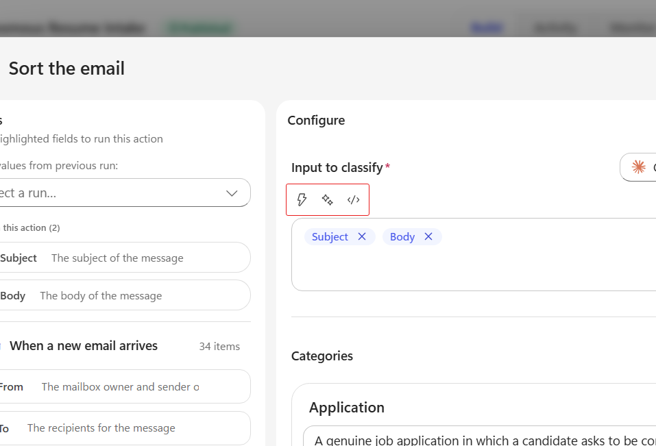

1. **⚡ Insert dynamic content** lists the values earlier nodes produced - the email's **Subject**, an attachment's **Name**. Choosing one drops a blue **token** into the box. Tokens and typed text mix freely in the same field, which is how Lab 7.5 builds a value out of both.

    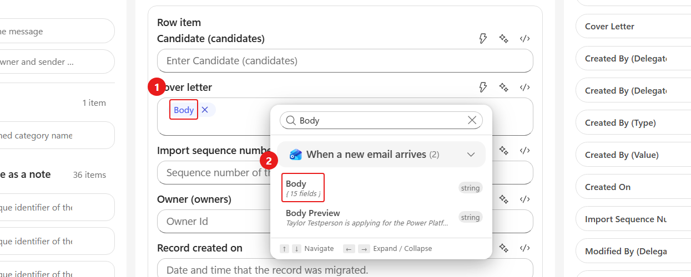

1. **`</>` Switch to expression mode** turns the box into a formula editor for the workflow expression language, so you can call functions such as `concat()` and `base64ToString()` instead of picking a single value. This is what a lab means when it tells you to *switch the field to expression mode*.

    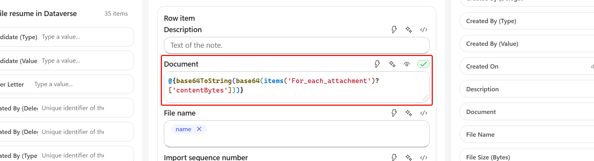

**✨ Ask Copilot** writes an expression from a description of what you want. The labs give you every expression you need, so you will not need it here.

::: details 🔄 Coming from the classic Operative course?
In classic **Mission 04: Add Event Triggers to act autonomously**, an event trigger handed the automation to **Power Automate**, where you assembled it from **Compose**, **Condition** and connector actions in a separate designer with its own publish cycle - which is still how the standard harness works. **Workflows** replace that: you build, test, publish and version the automation inside Copilot Studio, and **Variable** or **Function** takes the place of Compose while **If/Else** takes the place of Condition. That one classic mission is now **split in two** - this mission builds the deterministic pipeline, and [Mission 08](../08-workflow-agents/index.md) adds the reasoning. The genuinely new part here is **Classify**, an AI intent router that reads the email and picks a branch, work that classic solutions did with brittle keyword conditions or not at all. And you can test a single action inside the designer with **Run node**, instead of running the whole flow.
:::

## 🧪 Lab 07 - Build the autonomous intake {#lab-07-build-the-autonomous-intake}

### Prerequisites

Before you start this lab you need:

- The **Operative** solution and the **Hiring Hub** app from [Mission 01](../01-get-started/index.md)
- A mailbox you can send to and receive in, reachable with an **Office 365 Outlook** connection
- The two sample resume PDFs used from Lab 7.6 onward - see the download in [Mission 05](../05-intake-matching-applications/index.md)

Let's build the deterministic half of the pipeline. Work through the sub-labs in order, because later expressions refer to the names and outputs of earlier nodes, so a node renamed out of sequence breaks every expression that follows it.

This is the shape you are about to build - the email trigger, the **Classify** router and its four branches, and the filing steps that run inside the **Process application** Scope. Those steps sit three levels deep: Scope, then loop, then guard.

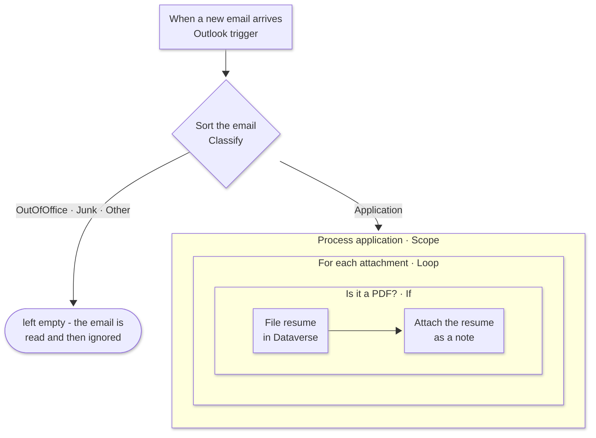
```mermaid
---
config:
  look: neo
---
flowchart TB
  T["When a new email arrives<br/>Outlook trigger"]
  CL{"Sort the email<br/>Classify"}
  IG(["left empty - the email is<br/>read and then ignored"])
  T --> CL
  CL -- "OutOfOffice · Junk · Other" --> IG
  CL -- "Application" --> SCOPE

  subgraph SCOPE["Process application · Scope"]
    direction TB
    subgraph LOOP["For each attachment · Loop"]
      direction TB
      subgraph GUARD["Is it a PDF? · If"]
        direction LR
        F1["File resume<br/>in Dataverse"] --> F2["Attach the resume<br/>as a note"]
      end
    end
  end
```

### 7.1 Create the email-triggered workflow

Next we are going to create the workflow itself and point it at the recruitment mailbox with Office 365 Outlook. Nothing else can run until the trigger is in place.

1. In the left navigation select **Workflows**. The list of workflows in this environment opens - this is where every workflow you build lives.

   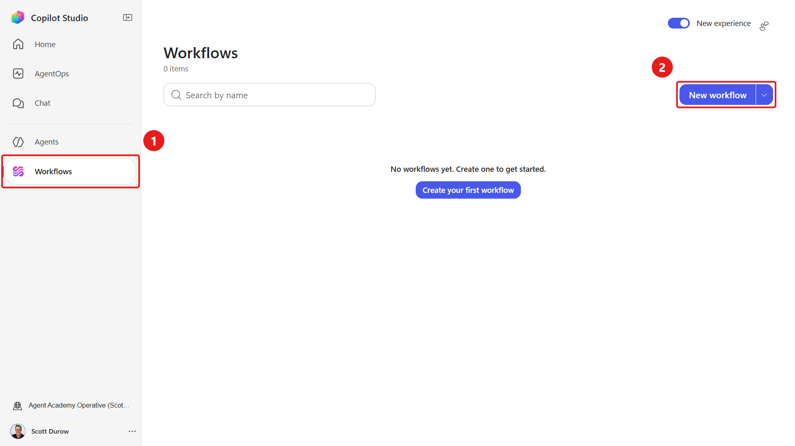

1. On the command bar select **New workflow**. The canvas opens with a single **Start** node whose trigger is **Manual**.

   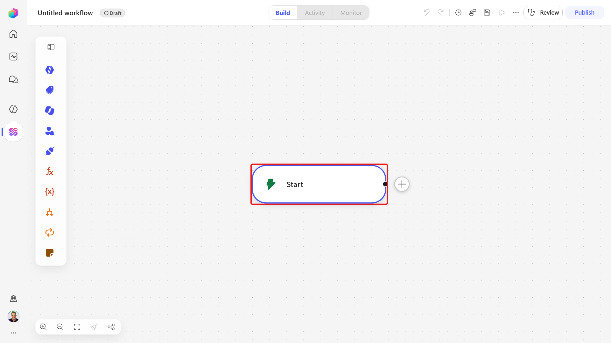

1. At the top left, select the name **Untitled workflow**, type `Autonomous Resume Intake`, and press **Enter**.

   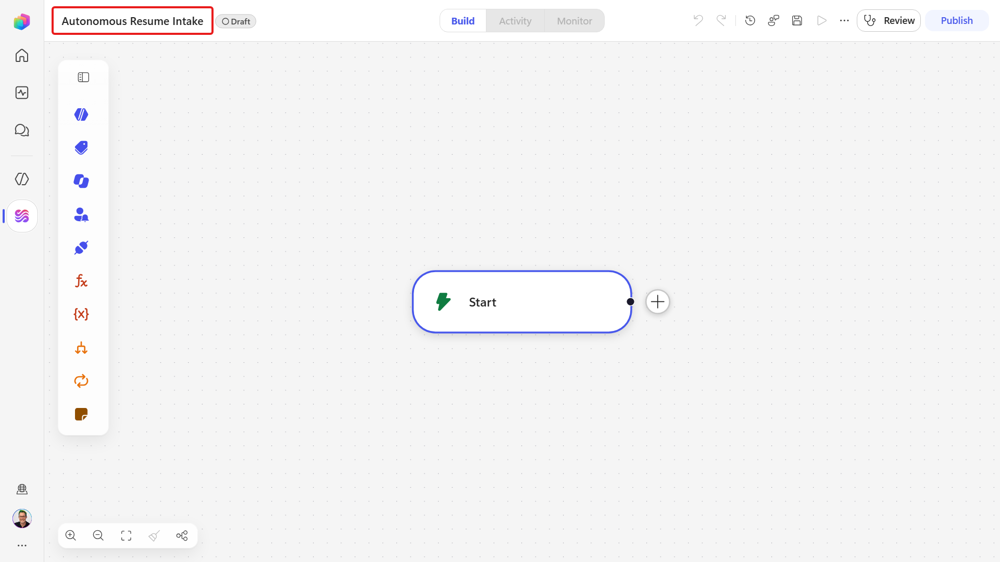

1. Select the **Start** node to open its panel on the right, then select the **Trigger type** box - it currently reads **Manual**. A list of five trigger types opens: **Manual**, **Recurrence**, **Connector**, **When a HTTP request is received**, and **When an agent calls the workflow**. Select **Connector**.

   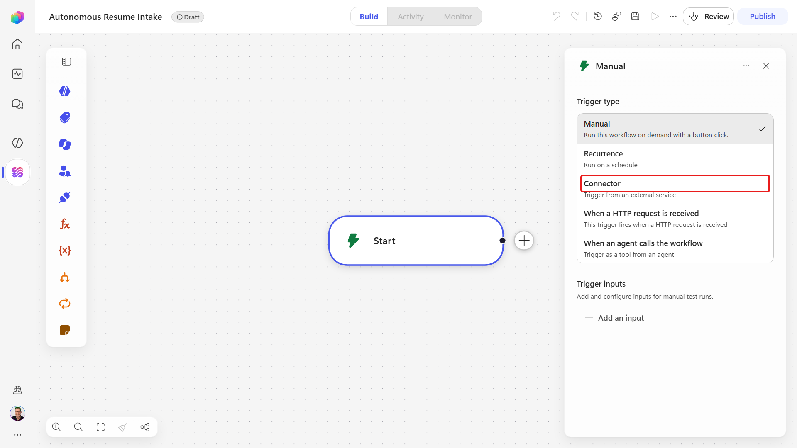

1. A **Select a trigger** dialog opens. In its **Search** box, type `Office 365 Outlook`.

   The **Office 365 Outlook** group previews four triggers, but that preview set can change between openings.

   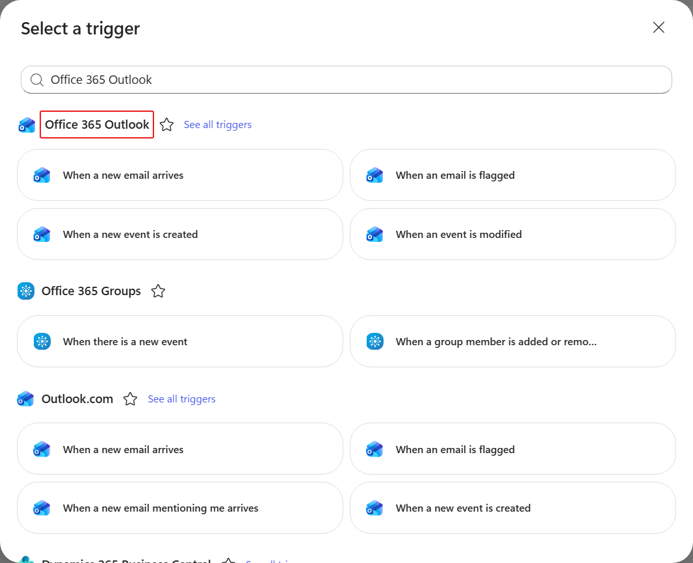

1. Under the **Office 365 Outlook** heading, select **See all triggers**. The dialog switches to the connector's own page and lists all **eight** Office 365 Outlook triggers in a stable list. Select **When a new email arrives** - not *When a new email arrives in a shared mailbox*, which needs a separate shared mailbox and its own permissions. This one watches the mailbox of the account you connect with, which we will use to receive resumes into for this mission.

   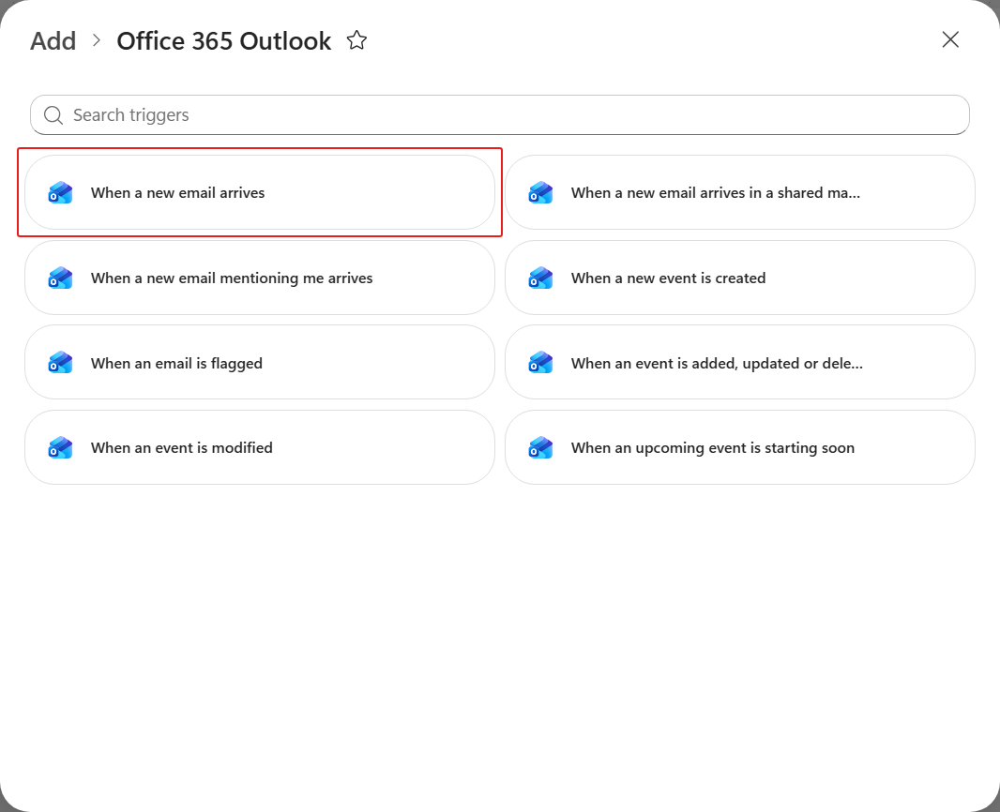

1. The dialog closes and the trigger's own panel opens. The **Start** node is now the **When a new email arrives** trigger, carrying a *Needs setup* badge until you finish configuring it.

   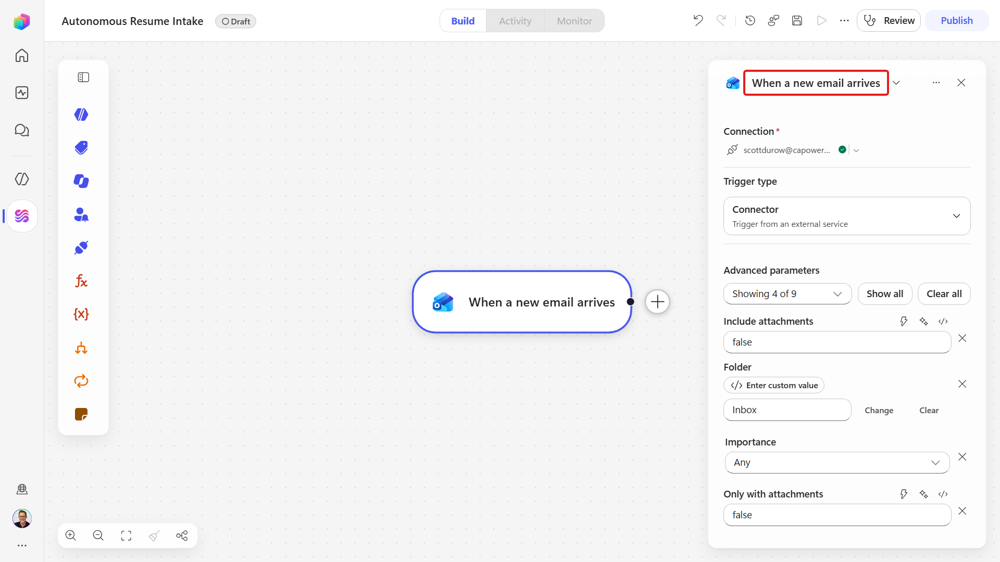

1. Look at the **Connection** box at the top of the panel. If it already shows your account, the environment has an Office 365 Outlook connection and you can move on. If it shows a warning instead, select **Create new connection**, select your account tile, and complete the sign-in prompt.

   If the panel asks for an *Original Mailbox Address* you picked the shared-mailbox trigger by mistake - go back and choose **When a new email arrives**.

   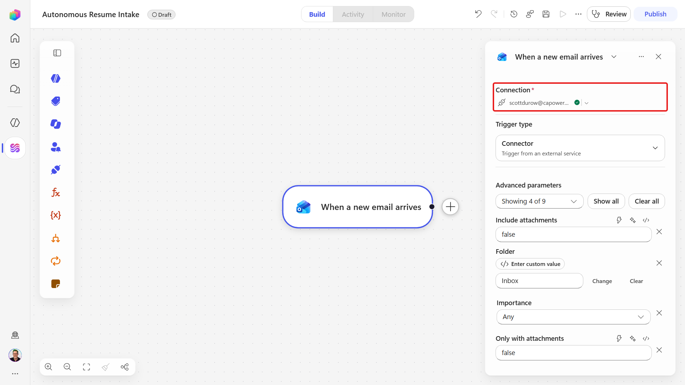

1. Below the connection, select **Show all** to reveal every trigger parameter. The count changes from *Showing 4 of 9* to *Showing 9 of 9*. Then fill in the trigger exactly as follows, and leave every other parameter empty.

   | Field | Value |
   | --- | --- |
   | **Folder** | `Inbox` *(already set by default - just check it)* |
   | **Subject Filter** | `Application` |
   | **Include Attachments** | **Yes** - so the email's files come through with the trigger |
   | **Only with Attachments** | **Yes** - so an email with no file never starts a run |

   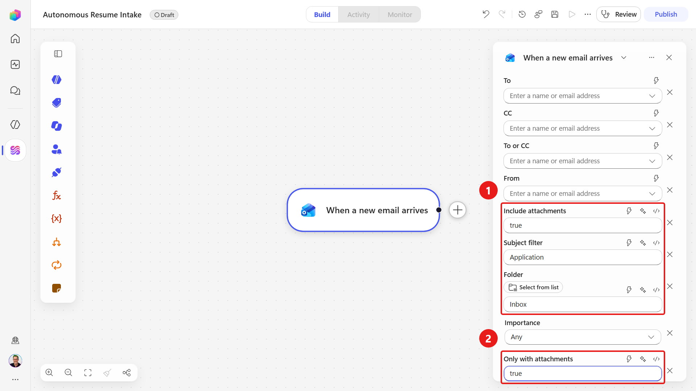

1. On the command bar select **Save** - it is the **disk icon**, not a text button.

   The Start node is now titled *When a new email arrives* and the *Needs setup* badge has gone.

   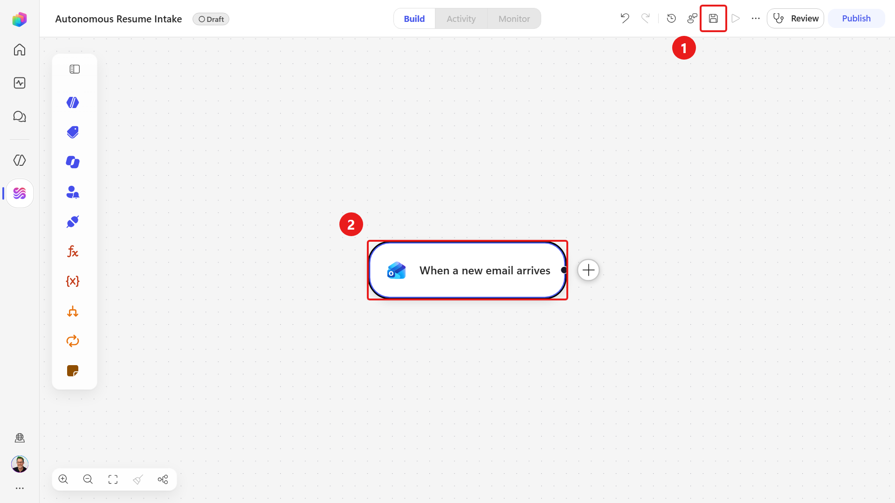

### 7.2 Screen the inbox with Classify

A monitored mailbox receives more than applications: **out-of-office auto-replies**, newsletters, and **junk mail that can be ignored**. We only want to process the genuine application emails. Next we are going to add a **Classify** node, which uses a **language model** to read the message and work out what it is, rather than matching exact text.

Let's add that node and teach it the three kinds of mail this inbox receives.

1. On the canvas, select the **+** immediately after the *When a new email arrives* node. The **Add** dialog opens on its **Actions** group.

   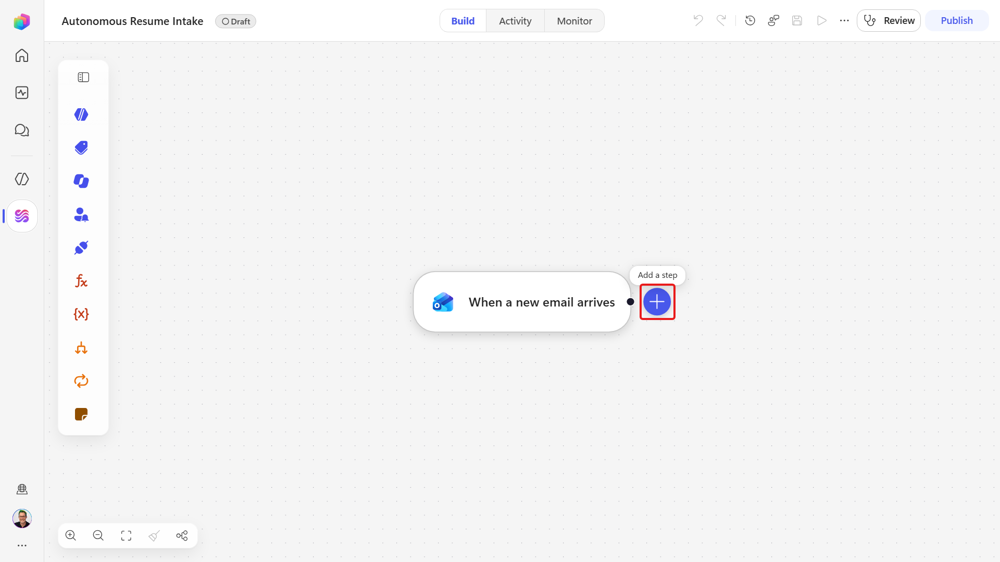

1. In the **Add** dialog's search box, type `Classify`. Many third-party connectors ship an action with *Classify* in its name, so the results are crowded. The one you want is the **first** result, listed on its own under the **Other** heading with a purple tag icon and no connector name beneath it. Select it.

   The node is inserted with a *Needs setup* badge and three empty branches beneath it - **Category 1**, **Category 2** and **Other**.

   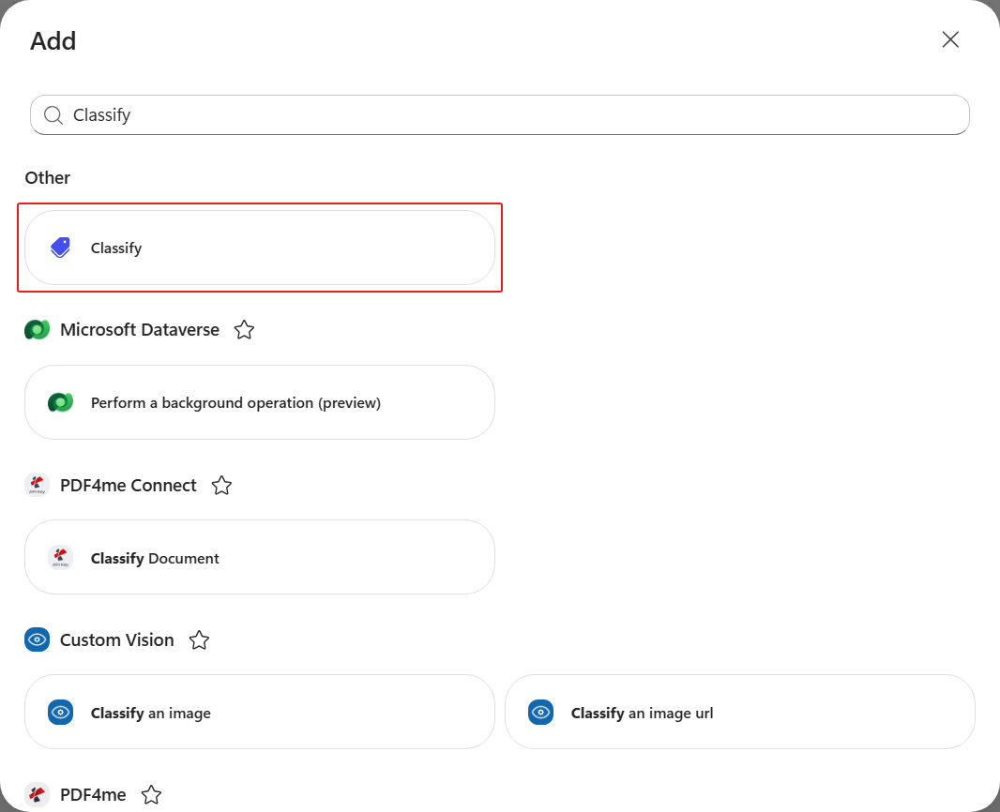

1. Rename the node to `Sort the email` - select the node's name at the top of its panel, type the new name and press **Enter**.

   Use that name exactly. Missions 07 and 08 both refer to this node by it, and an expression that mentions a node quotes the node's name.

   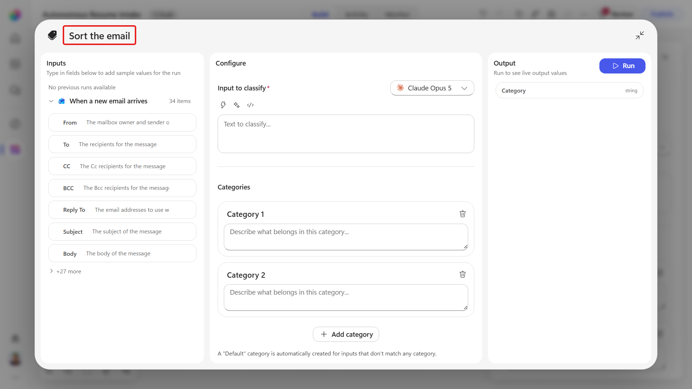

1. Classify runs on a **language model**. Check the model picker beside **Input to classify** and leave it at its default selection. The models available to your environment can change, so the model name in your panel may differ from the screenshot.

   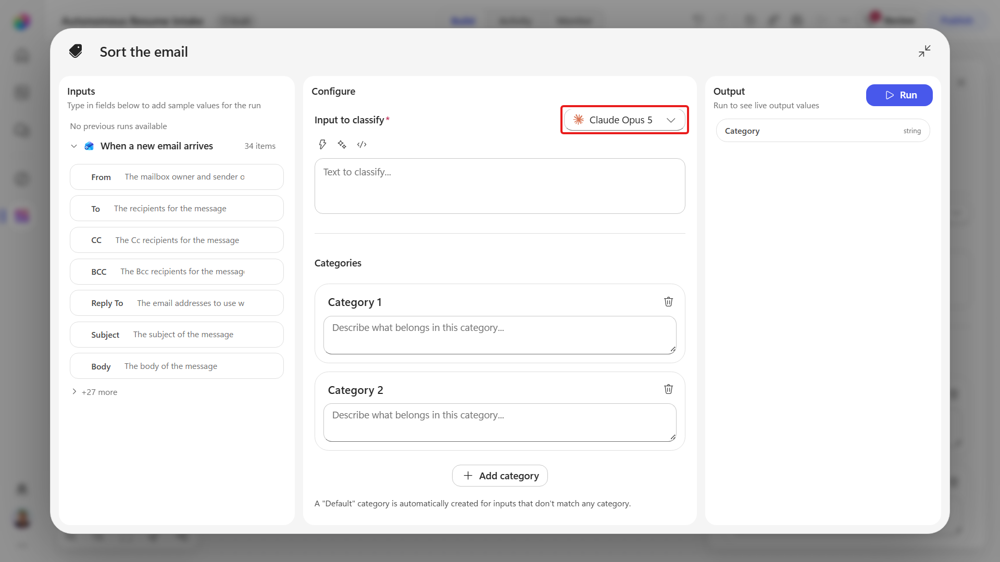

1. Select **`</>` Switch to expression mode** for **Input to classify**, then enter the message's subject and body so the model reads both:

   ```text
   @{triggerOutputs()?['body/subject']} @{triggerOutputs()?['body/body']}
   ```

   The field expands into a multiline expression editor. Leave the model picker - the button to the right of the **Input to classify** label - at its default.

   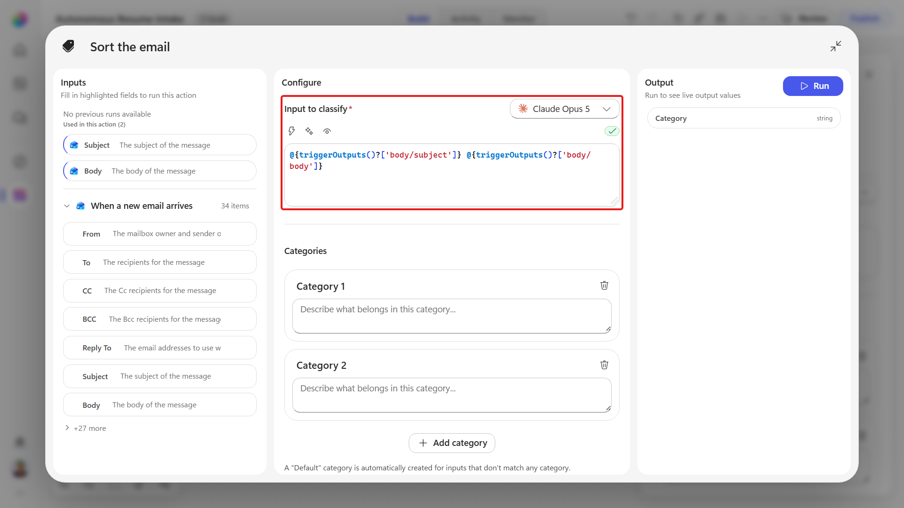

1. In the **Categories** list, select the **Category 1** heading. A category name is a select-to-edit heading rather than a field that is always visible, so it turns into an editable box with the placeholder **Category name**. Select **Add category** so the list holds three, then name and describe each one as follows. Select a heading to type its name, and use the **Describe what belongs in this category…** box underneath it for the description.

   Type each **Category name** exactly as written here. Later steps and [Mission 08](../08-workflow-agents/index.md) refer to these names, and the branch labels on the canvas come straight from them. The **description** is what the model routes on, so keep each one specific.

   | Category name | Describe what belongs in this category… |
   | --- | --- |
   | `Application` | `A genuine job application in which a candidate asks to be considered for a role and provides a resume. This includes applications forwarded by a recruiter on behalf of one or more candidates. Do not choose this category for automatic replies, even when the subject contains Application. Do not choose it when the sender says they are not applying, asks a general question about the recruitment process, or sends a speculative or sample document rather than applying for a role - those belong in Other, even when the subject contains Application and a file is attached.` |
   | `OutOfOffice` | `An automatic reply, vacation notice, absence notification, or out-of-office message. Choose this whenever the body says the sender is away or the subject says automatic reply, even when Application appears elsewhere.` |
   | `Junk` | `Marketing, newsletters, promotions, spam, or content unrelated to hiring. Choose this instead of Application when promotional wording appears, even when the subject contains Application.` |

   Select **Expand to full screen** in the panel's upper-right corner before checking the finished categories. Full screen is worth using for any node with a lot to configure - it gives every box room to show its whole value instead of clipping it - and the rest of this mission uses it wherever a node offers it. The panel then lists three named categories, and the note underneath explains that a *Default* category is created automatically for inputs that match none of them - that is the **Other** branch on the canvas.

   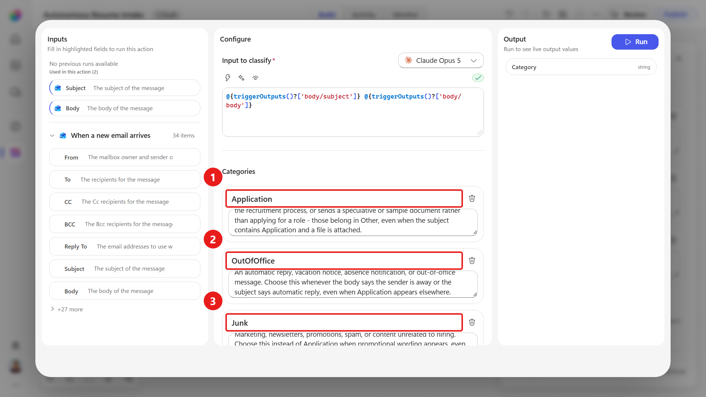

1. Collapse the full screen view, then on the command bar select **Save**. The canvas branch labels change from *Category 1/2/3* to **Application**, **OutOfOffice** and **Junk**, with **Other** still last.

   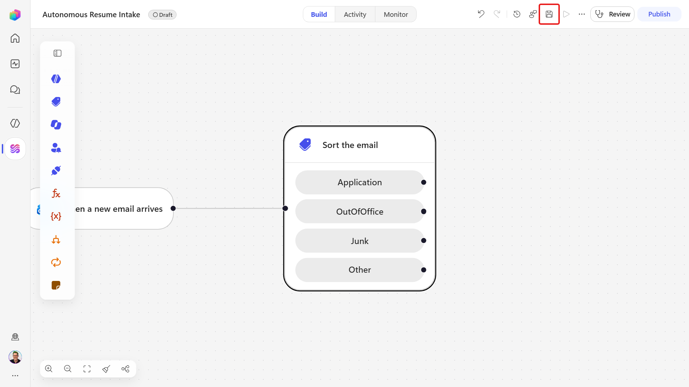

   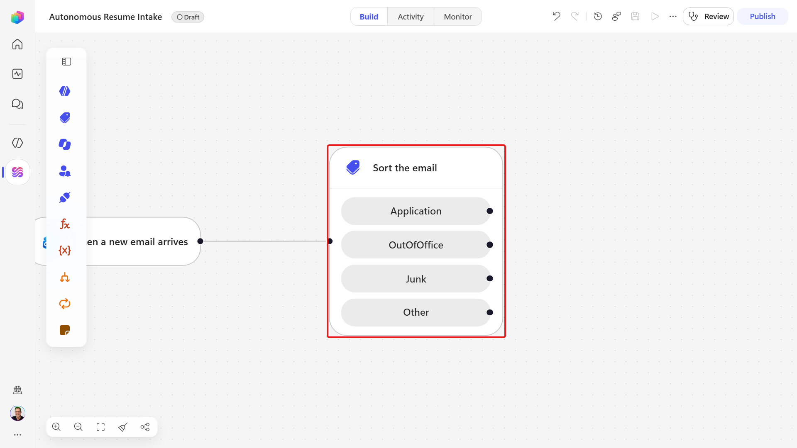

1. Wherever a node can be run on its own, test it there rather than waiting for a whole run. Open the **Sort the email** node again and select the **Run node** tab, next to **Configure**. It executes just the node you have selected against sample values you type in, so you get an answer in seconds instead of publishing the workflow and emailing the mailbox.

   Select **Expand to full screen** and the tab lays the test out in three columns: the **Inputs** you supply on the left, the node's own configuration in the centre, and its **Output** on the right.

   The node's inputs here are **Subject** and **Body** rather than one combined box. Fill both in with an out-of-office message, then select **Run** and read the **Output** - it names the chosen **category**. This sample returns **OutOfOffice**.

   | Field | Value |
   | --- | --- |
   | **Subject** | `RE: Application - Automatic reply` |
   | **Body** | `I am currently out of the office until Monday and will respond on my return.` |

   

1. Select **Clear**, then repeat with a genuine application and confirm it returns **Application**:

   | Field | Value |
   | --- | --- |
   | **Subject** | `Application - Power Platform Consultant` |
   | **Body** | `Please find my resume attached for the opening.` |

   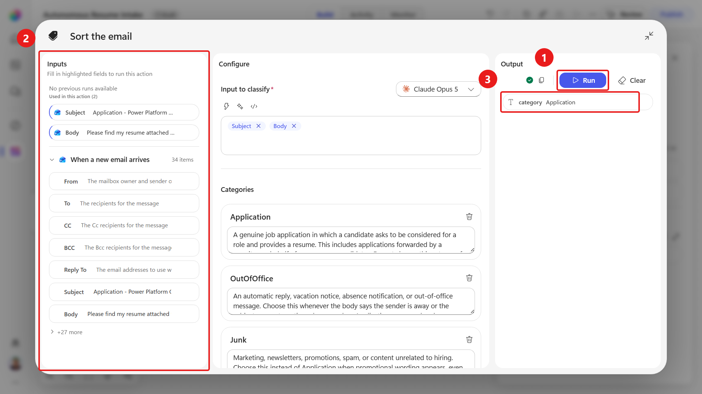

1. Select **Clear**, then repeat once more with obvious marketing text and confirm it returns **Junk**:

   | Field | Value |
   | --- | --- |
   | **Subject** | `Application - Product newsletter` |
   | **Body** | `Limited-time marketing offer. Subscribe now for product promotions and event news.` |

   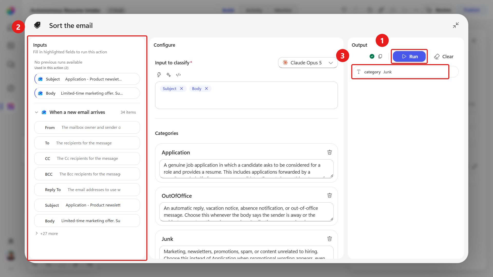

Each sample should return its intended category. Change a category description, run the same sample again, and see the effect straight away - no publishing, no email, no waiting for a trigger. If an auto-reply comes back as **Application**, sharpen the descriptions and re-run until every sample lands where it should.

### 7.3 Add the Process application scope

The **Sort the email** node now sorts the mail, but every branch is empty. Next we are going to put everything that actually processes an application on the **Application** branch, inside a **Scope** - a labeled box that groups actions together. We will build the Scope first, before anything goes in it.

1. On the **Application** branch, select the **+** (its tooltip reads *Add a step*).

   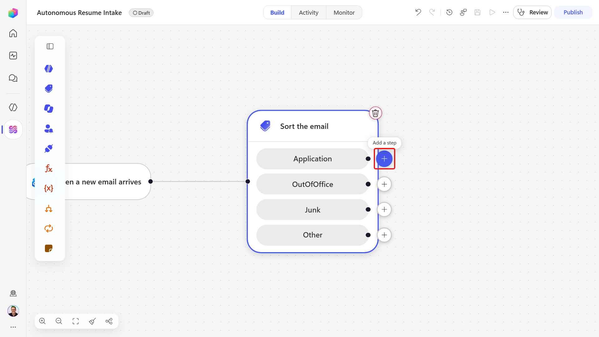

1. In the **Add** dialog, leave the search box empty, scroll the **Actions** group past **If/Else**, **Switch** and **Loop**, and select **Scope**. If you would rather search than scroll, type `scope` and select the entry listed on its own under **Other**.

   A dashed container appears on the **Application** branch. A Scope succeeds or fails as one unit, so if any action inside it fails, the whole Scope is marked failed. [Mission 09](../09-human-oversight/index.md) builds its error handling on exactly that.

   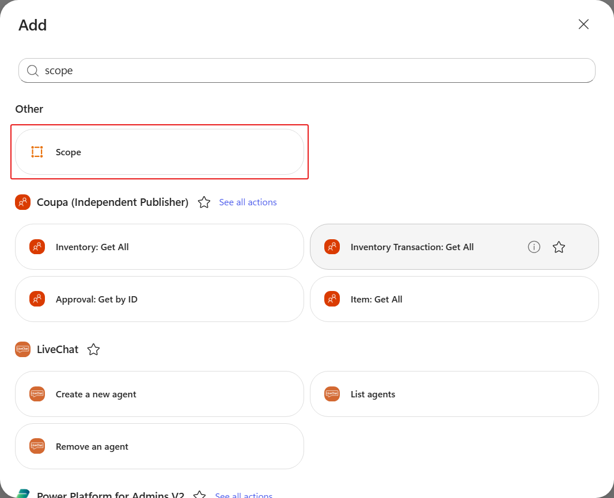

1. At the top of the Scope's panel, select the name **Scope** - it turns into an editable box - and change it to `Process application`. Press **Enter**. Leave the **OutOfOffice** and **Junk** branches empty, so those emails are read and then ignored, and leave **Other** empty for now - we will be attaching the human step to it in [Mission 09](../09-human-oversight/index.md).

   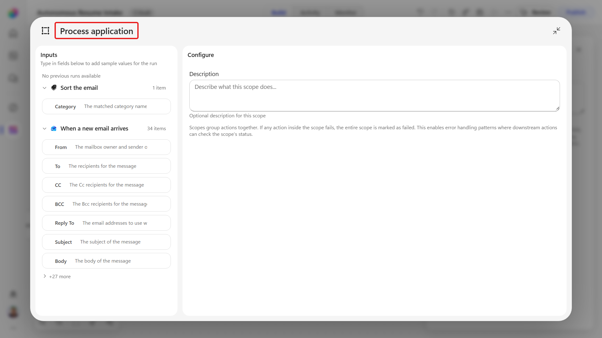

1. On the command bar select **Save**.

   The **Sort the email** node now shows four branches, and only **Application** carries the still-empty **Process application** box.

   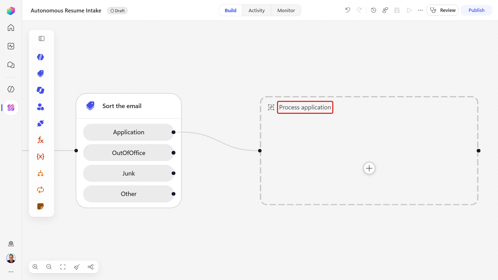

### 7.4 Add the loop and the PDF guard

One email can carry more than one resume, so the workflow loops over **every** attachment and files each one separately. Not every attachment is a resume, though - an inline signature image or a `.docx` would otherwise produce a meaningless Resume row - so each attachment first passes a guard that checks its file type and skips anything that is not a PDF.

Next we are going to build that guard and a loop for each attachment. The attachment loop is added automatically by the designer because the condition reads one of the **attachments** carried by the triggering email. We will then fill the guard with the filing steps in the next lab.

1. Hover the **Process application** container and select the **➕** labeled **Add a step inside Process application**. The plus on the container's right-hand edge reads **Add a step after Process application** and would put the node next to the box rather than in it.

   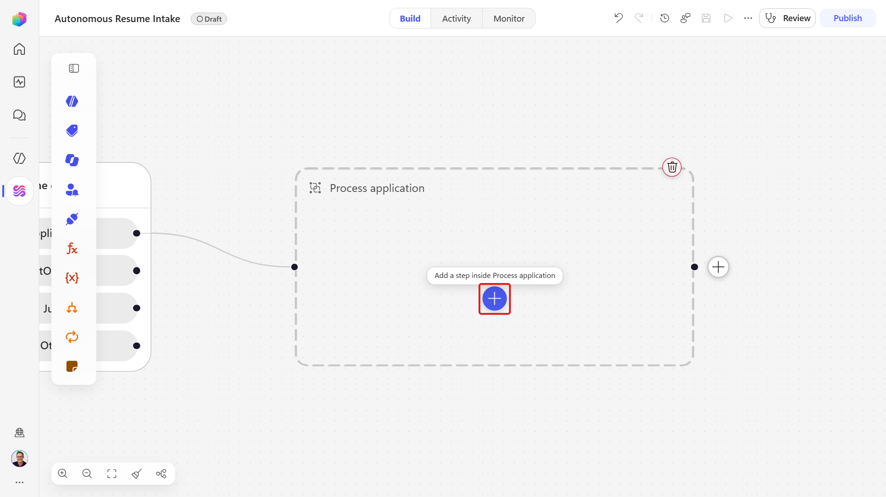

1. In the **Add** dialog, under **Actions**, select **If/Else**. By default, the node is configured with two branches, labeled **If** and **Else**.

   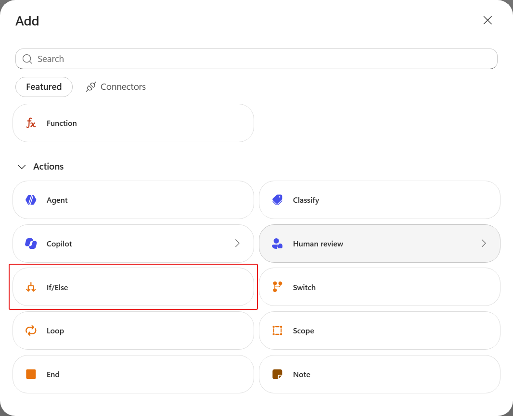

1. Select the **If/Else** node and rename it to `Is it a PDF?` - select its name at the top of the panel, type the new name and press **Enter**. Do this before you write the condition, so every later expression can quote the finished name.

   Select **Expand to full screen** in the panel's upper-right corner and keep that view open while you fill the condition.

   > [!NOTE] A node's name is how expressions refer to it
   > Later steps read a node's output with an expression such as
   > `outputs('File_resume_in_Dataverse')?['body/ppa_resumeid']`. The name inside the quotes is the
   > node's name with every space and every piece of punctuation replaced by an underscore, so
   > `Is it a PDF?` becomes `Is_it_a_PDF_` and `Alert - filing failed` becomes `Alert_-_filing_failed`.
   >
   > Name each node exactly as these labs tell you, and *before* you write any expression that mentions
   > it. Then you can paste every expression that follows verbatim. Rename a node afterwards and any
   > expression you typed by hand still points at the old name.

   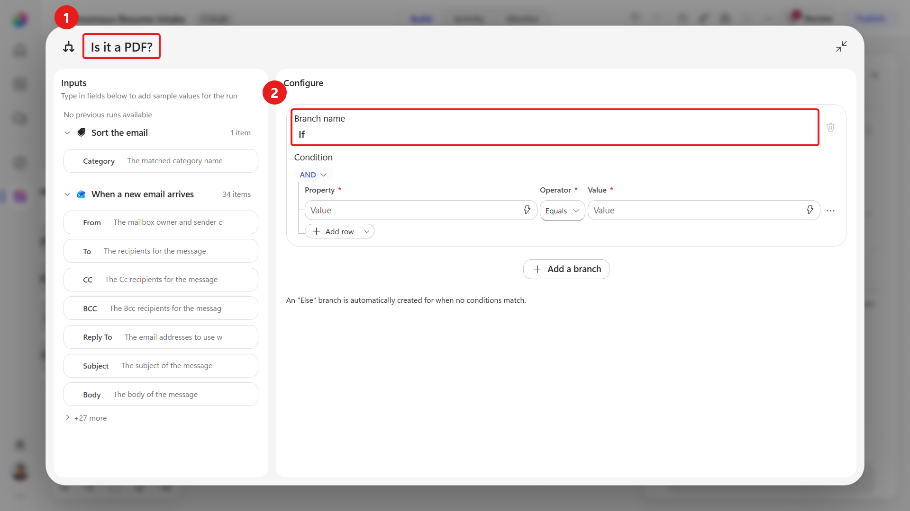

1. Build the condition that lets a PDF through:

   1. In **Property**, select ⚡ **Insert dynamic content**, search for `Content-Type`, and choose **Content-Type** *(Attachment content type)*.
   1. Leave **Operator** set to **Equals**.
   1. Enter `application/pdf` in **Value**.

   **Content-Type** is a property in the array of attachments that arrives with the triggering email, so the designer automatically wraps this node in a loop over those attachments. The condition now reads **Content-Type Equals** `application/pdf`, with the token showing in **Property** as a chip labeled **contentType**. The panel also notes that an **Else** branch is created automatically for when no condition matches.

   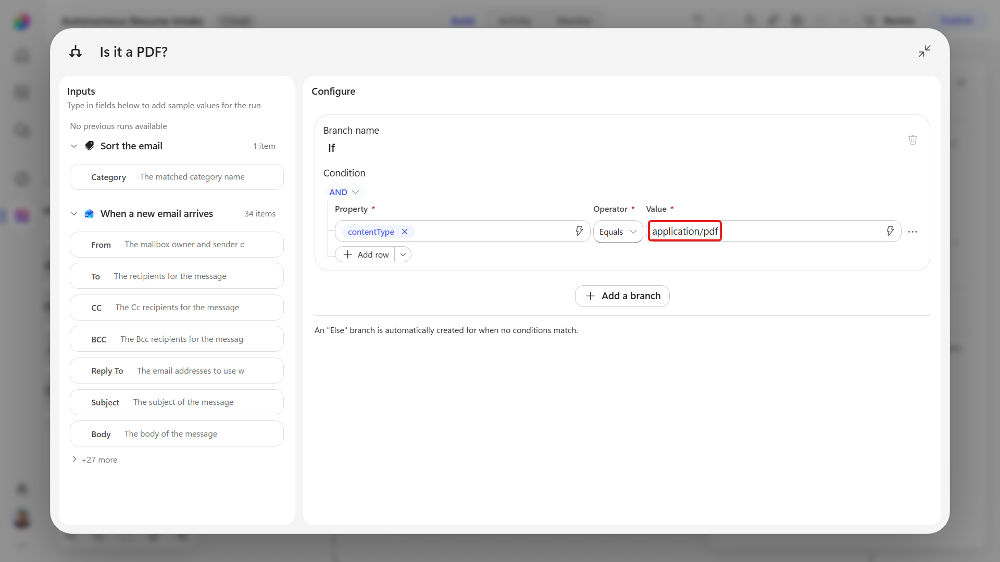

1. Rename the surrounding automatically created loop to `For each attachment`.

   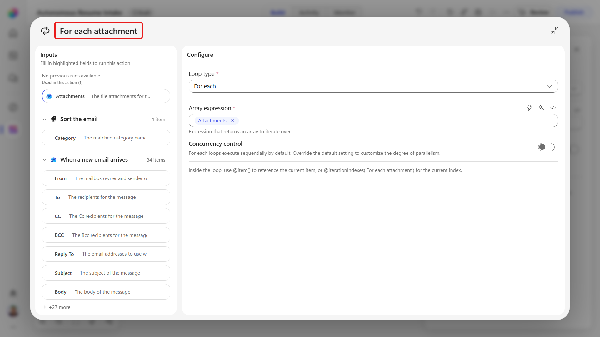

1. On the command bar select **Save**.

   **Process application** now holds the **For each attachment** loop, and inside that the **Is it a PDF?** guard with its empty **If** and **Else** branches. We fill the **If** branch with the filing steps in the **next lab**. The **Else** branch stays empty, so an attachment that is not a PDF does nothing and the loop moves straight on to the next attachment.

   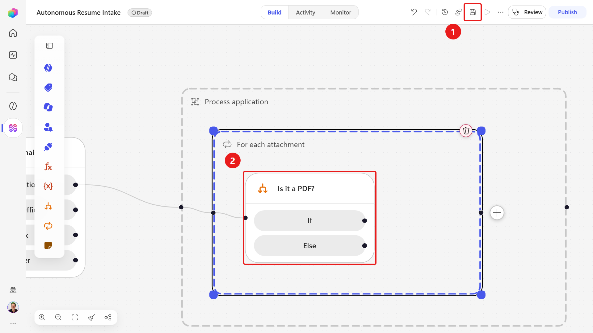

### 7.5 File the resume and attach its PDF as a note

The PDF branch is still empty. Next we are going to fill it with two ordinary **Dataverse connector actions** that run without an agent - one to create the **Resume row**, and one to store the attached PDF as a **Note** on that row.

Everything in this lab goes **inside the If branch** of the **Is it a PDF?** guard we built in Lab 7.4. Because that branch sits inside the loop, every step we add here runs **once per attachment**, so each resume gets its own **Resume** row, its own number and its own Note.

As we go you will see a small ⚡ icon on many fields. That is the **dynamic content** picker from [How to fill in a field](#field-editors) - a menu of values that earlier steps produced. From the email trigger we get **From**, **Subject**, **Body** and **Attachments**, and inside the loop each attachment's **Name**, **Content-Type** and **Content Bytes** (the raw file).

1. Inside the **Is it a PDF?** guard, select the ➕ labeled **Add a step after If**. That button adds the step *into* the **If** branch. Use it for every step in this lab.

   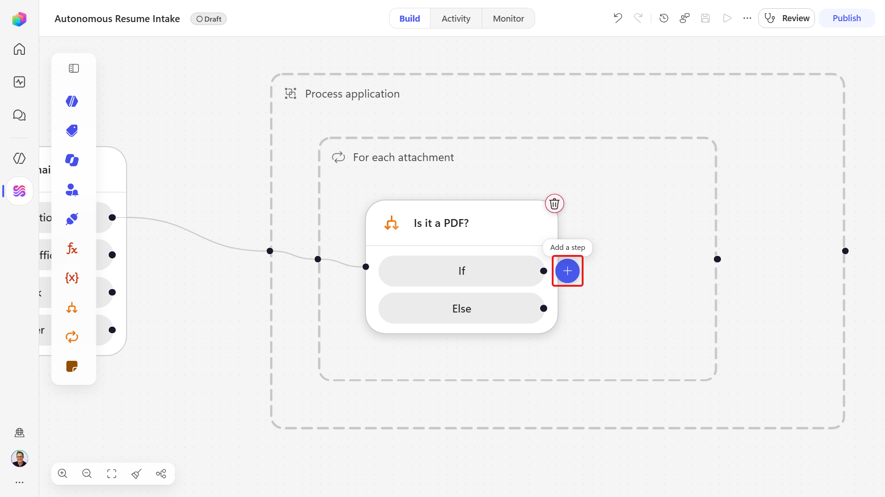

1. In the **Add** panel's search box, type `add a new row`, then select **Microsoft Dataverse**, **Add a new row**. The node is added **inside the If branch** with its **Connection** already showing your Dataverse account as **Connected**.

   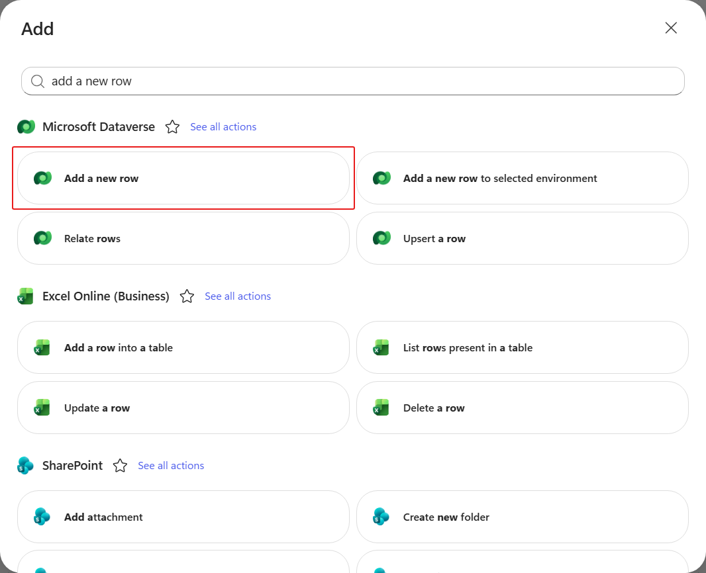

1. Rename it to `File resume in Dataverse` - select its name at the top of the panel, type the new name and press **Enter**. Do this before you set any field, because every later expression refers to the node as `outputs('File_resume_in_Dataverse')`.

   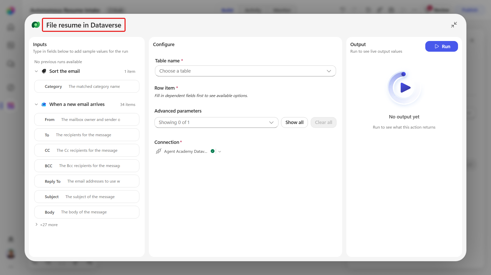

1. Open **Table name** and select **Resumes** from the drop-down list.

   Once a table is chosen, its columns appear under **Row Item**, listed alphabetically. Only **Resume Title** is marked required, because it is defined as **Required** in the Dataverse table definition.

   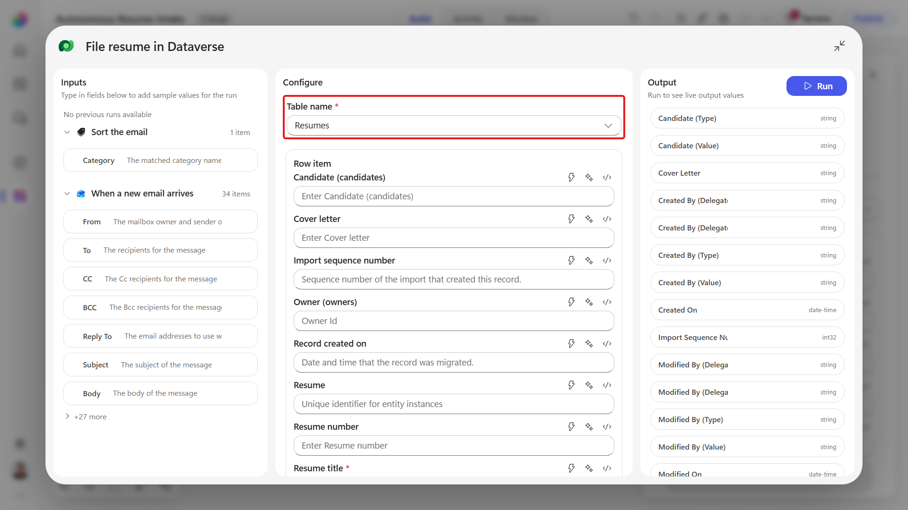

1. In **Resume Title**, select ⚡ **Insert dynamic content**, search for `Name`, and choose the attachment's **Name** from the picker.

   **Resume Title** takes the attachment's **Name** rather than the email subject, because two resumes in one email share a subject and this row has to identify a single attachment.

   > [!NOTE] There is more than one way to insert a value
   > You can also **drag** a value out of the **Inputs** panel on the left and drop it straight into a
   > field, which is quicker once you know where a value lives. This course always uses the
   > ⚡ **Insert dynamic content** picker instead, because it names the value you are choosing and
   > behaves the same way on every field.

   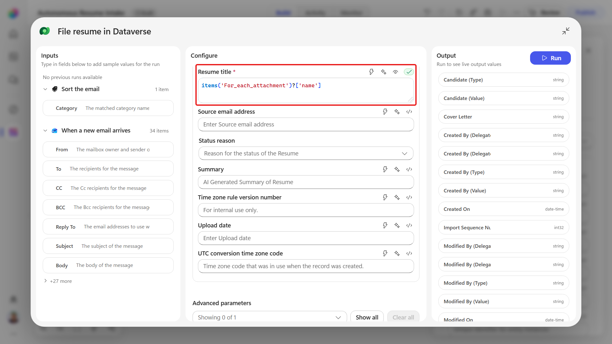

1. In **Cover Letter**, select ⚡ **Insert dynamic content**, search for `Body`, and choose **Body**.

   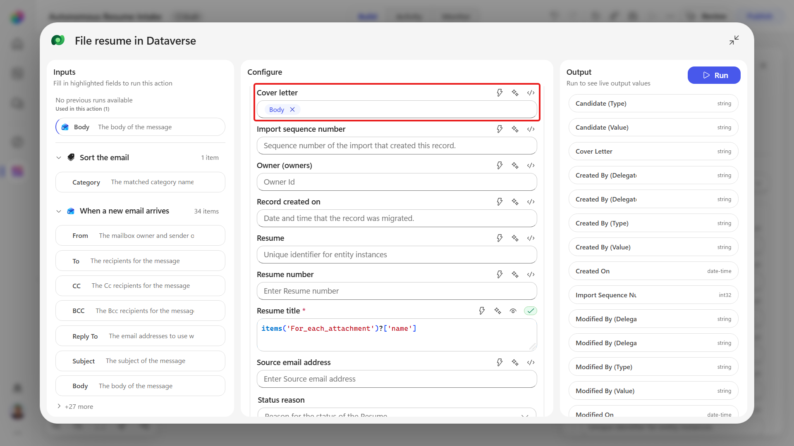

1. In **Source Email Address**, select ⚡ **Insert dynamic content**, search for `From`, and choose **From**.

   Those three boxes now show blue tokens - **Name**, **From** and **Body** - and the *Needs setup* badge disappears from the node, because we have now filled in all of its required parameters.

   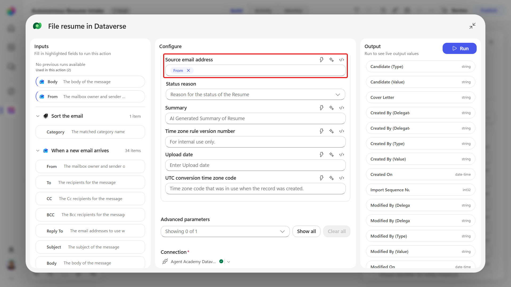

1. Now we will upload the attached PDF as a **Note** on that Resume row. Select the **➕** after the **File resume in Dataverse** node - it is inside the **If** branch - then choose **Connector**, **Microsoft Dataverse**, **Add a new row**. Rename the node to `Attach the resume as a note` straight away, then open **Table name** and select **Notes**.

   Notes live in Dataverse's `annotation` table, and the file's bytes sit in its `documentbody` column - which is where the agent you add in [Mission 08](../08-workflow-agents/index.md) reads them from.

   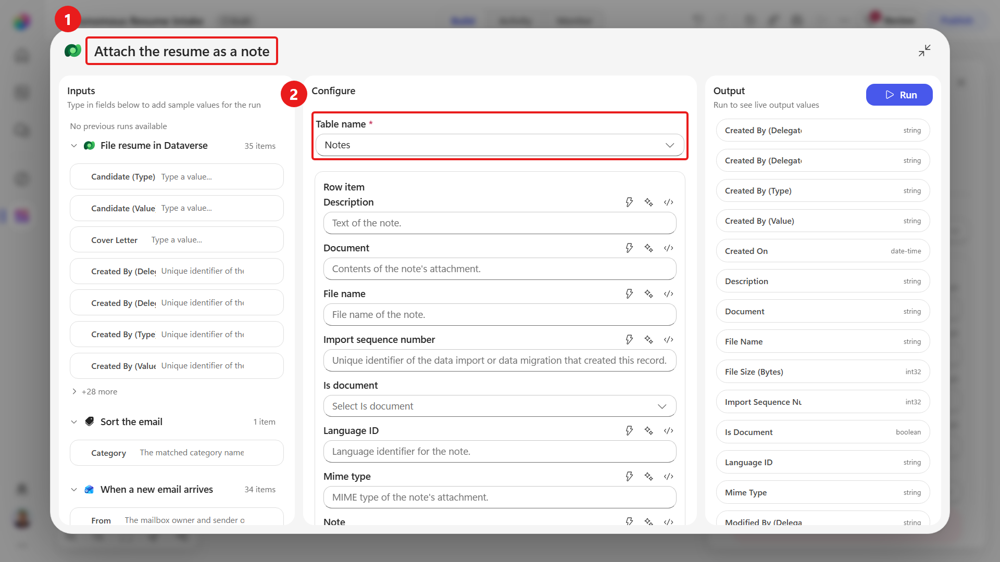

1. Give the note the attachment's own file name:

   1. In **Title**, select ⚡ **Insert dynamic content**, search for `Name`, and choose **Name** *(Attachment name)*.
   1. In **File Name**, insert the same **Name** token.

   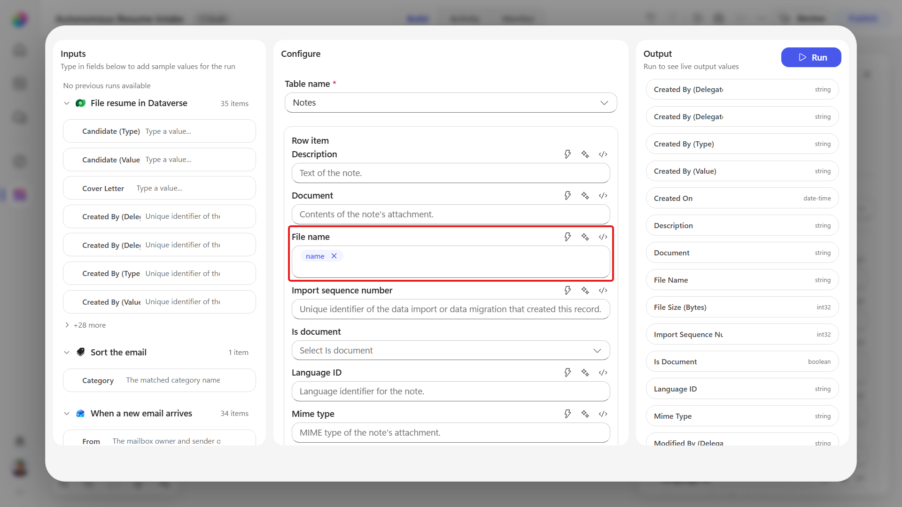

1. Set **Is Document** to **Yes**, then switch **Document** to **expression** mode - the `</>` button from [How to fill in a field](#field-editors) - and paste this expression:

   ```text
   base64ToString(base64(items('For_each_attachment')?['contentBytes']))
   ```

   > [!NOTE] Why the Document expression is wrapped twice
   > `contentBytes` arrives already base64-encoded, and `documentbody` also expects base64 - so passing
   > the token through unchanged fails, and wrapping it in `base64()` on its own encodes it twice.
   > `base64ToString(base64(...))` is the pair that decodes and re-encodes cleanly, leaving the bytes
   > exactly as they arrived.

   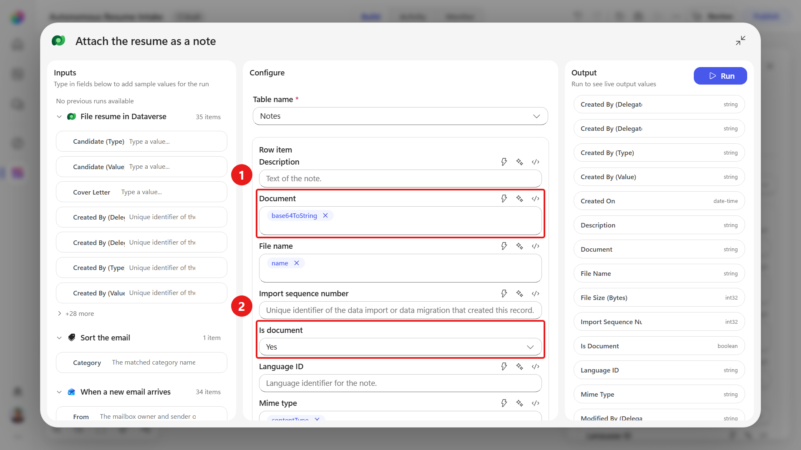

1. Build the **Regarding (Resumes)** value:

   1. Select the field and type `/ppa_resumes(` - just the text, nothing else yet.
   1. Select ⚡ **Insert dynamic content**, and under **File resume in Dataverse** choose the **Resume** token (its description reads *Unique identifier for entity instances*). A chip appears inside your typed text.
   1. Type `)` after the chip to close the bracket.

   The field reads `/ppa_resumes(` **«Resume chip»** `)`. On the command bar select **Save**.

   > [!TIP] What a stored PDF looks like
   > After a run, the Note step's **Inputs** render `documentbody` as `%PDF-1.7` followed by what looks
   > like corrupted text. That is the panel decoding base64 for display, and a correctly stored PDF is
   > supposed to look like that. A value that does *not* begin `%PDF-` means the wrong token reached
   > the field.

   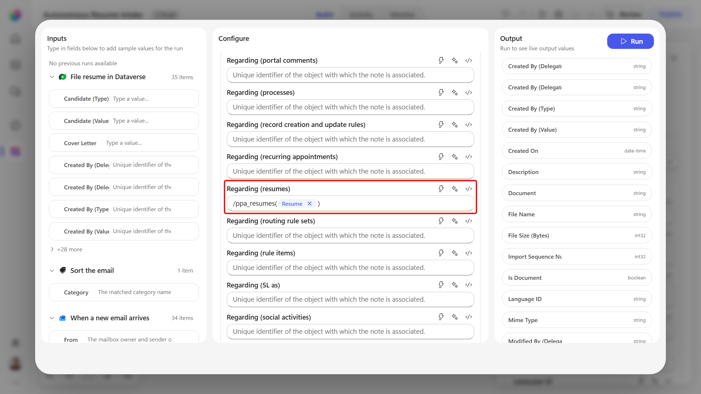

1. Each turn of the loop files one resume on its own, and nothing outside the loop can see what an earlier turn did. The agents in [Mission 08](../08-workflow-agents/index.md) need to see them all together as a single list - the resume number, the id of the Note holding its PDF, and the file name, one line per resume - so we build that list up as the loop runs, in a **variable**.

   A variable has to be initialized at the top level of the workflow, once, before anything reads it, and you cannot initialize one inside a loop or a branch. Select the **➕** immediately after the **When a new email arrives** trigger, *outside and before* everything else.

   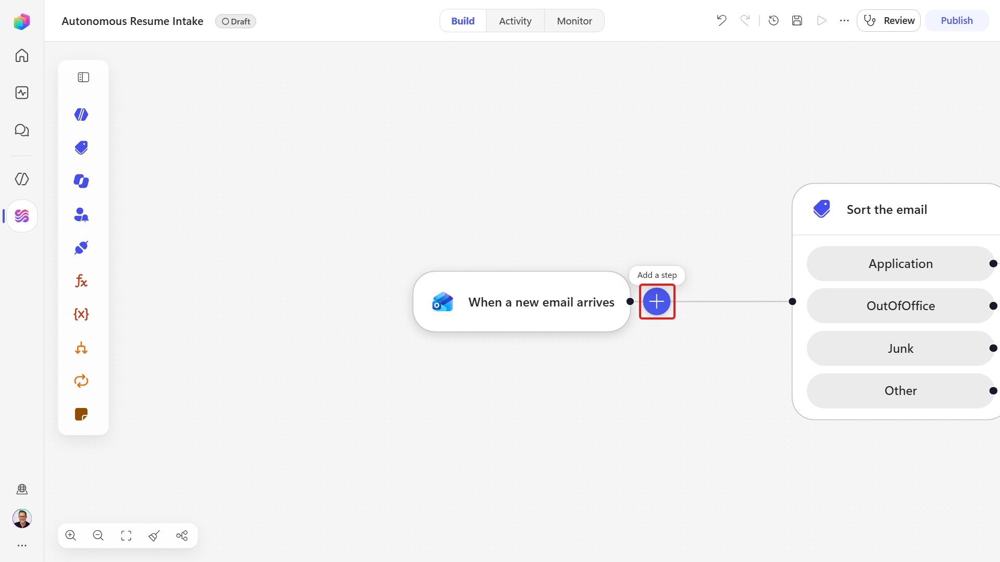

1. Add **Variable**, choose **Initialize Variable**, then rename the node to `Start the resume list` and fill it in as follows.

   | Field | Value |
   | --- | --- |
   | **Variable name** | `ProcessedResumes` |
   | **Type** | **String** |
   | **Value** | Leave empty - the placeholder *Type / to insert dynamic content* stays as it is |

   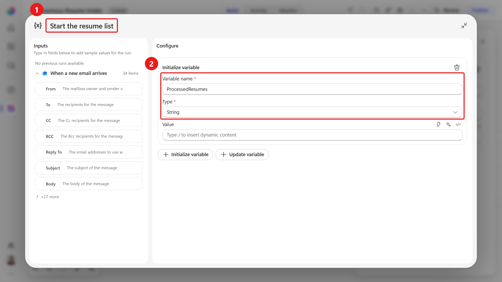

1. Now go back **inside** the loop, below **Attach the resume as a note**, and select the ➕ there. In the **Add** panel search for `Variable` and select it.

   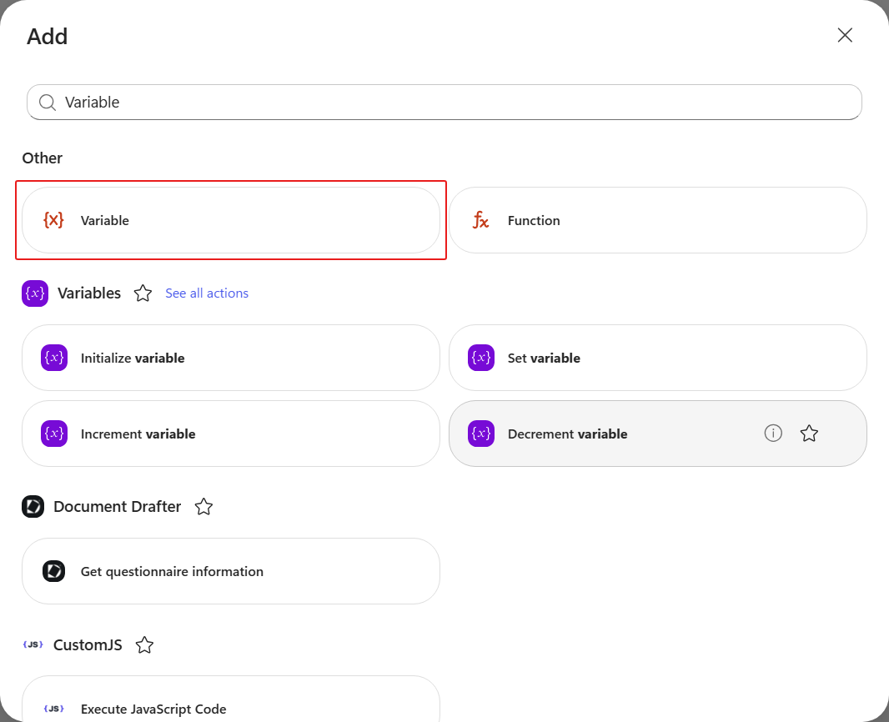

1. Configure the **Variable** node you just added:

   1. The panel opens on **Choose an operation** with two buttons - **Initialize Variable** and **Update Variable**. Select **Update Variable** (there is no button called *Set Variable*).
   1. Rename the node to `Remember this resume`.
   1. Open the **Variable** drop-down list and select `ProcessedResumes`.
   1. Set **Operation** to **Append to string**.
   1. Switch **Value** to **expression** mode and enter this expression:

   ```text
   concat(outputs('File_resume_in_Dataverse')?['body/ppa_resumenumber'], ' | note ', outputs('Attach_the_resume_as_a_note')?['body/annotationid'], ' | ', items('For_each_attachment')?['name'], decodeUriComponent('%0A'))
   ```

   The expression stitches together three values this turn of the loop has just produced - the **Resume Number** of the row we filed, the **annotationid** of the Note holding its PDF, and the attachment's **file name** - separated by `|`, and finishes with a line break. Run the workflow against an email carrying two attachments and `ProcessedResumes` ends up holding two lines, one per resume:

   ```text
   R01047 | note 6baf778e-8a89-f111-8077-6045bd015278 | AVERY EXAMPLE (FICTITIOUS).pdf
   R01048 | note 4b180b90-8a89-f111-8077-70a8a5b2f7b1 | TAYLOR TESTPERSON (FICTITIOUS).pdf
   ```

   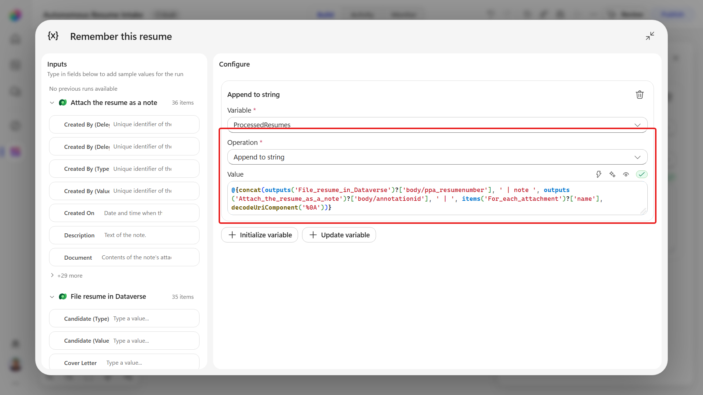

> [!NOTE] Why do we need this variable?
> The loop handles one attachment at a time, and each turn forgets the one before it. Without somewhere
> to write them down, the resume numbers and note ids the loop produced are gone by the time it ends.
> The variable is that notepad. Every turn appends its line, and when the loop finishes a single value
> holds everything that was filed.
>
> Because `ProcessedResumes` is a **String**, the **Operation** list offers only **Set variable** and
> **Append to string**. **Append to string** is the one that works: you supply just *the new line* and
> the platform joins it onto what is already there.
>
> **Set variable** cannot do this job. Its value would have to be
> `concat(variables('ProcessedResumes'), …)` - the variable reading itself - and the designer reports
> *"A variable cannot reference itself when updating its value. Read it into a Compose
> action first."*
>
> The line ending is written as `decodeUriComponent('%0A')` because the expression editor gives you no
> way to type a literal newline.
>
> One caveat. Appending reads the variable and writes it back, so if two attachments were processed **at
> the same time** they could both read the same starting value and one line would be lost. **For each**
> loops run one iteration at a time by default, so this is safe as written - just leave the loop's
> **Concurrency control** alone, or set **Degree of parallelism** to **1** if it is already switched on.
> If you ever do need parallel iterations, this accumulator has to go: have each iteration write its
> line to a child table instead, and read them back after the loop.

### 7.6 Test the workflow end to end

Next we are going to test what we have built in two stages: a quick check on a single node first, then the real end-to-end run that starts from an email.

We can do the quick check without publishing anything and without sending any email, just like when we used the **Run node** tab on **Sort the email** in Lab 7.2. It tells us whether the Dataverse connection, the table and the column mappings are right before the trigger is involved at all.

1. On the canvas, select the **File resume in Dataverse** node, open the **Run node** tab next to **Configure**, and select **Expand to full screen**.

   The **Inputs** column asks for a sample value for each earlier output this action actually reads - here that is just **From** and **Body** from the trigger. Fill in those two and leave the rest, which are collapsed behind *Show all 16 other fields*.

   | Field | Value |
   | --- | --- |
   | **From** | `taylor.testperson@example.com` |
   | **Body** | `Please find my resume attached.` |

   > [!NOTE] Load values from a previous run
   > The **Load values from previous run** drop-down at the top of the **Inputs** column fills every box
   > from a run that already happened, which saves a lot of typing once a workflow has some history.
   > This one has never run, so there is nothing to load and we type the two values in by hand.

   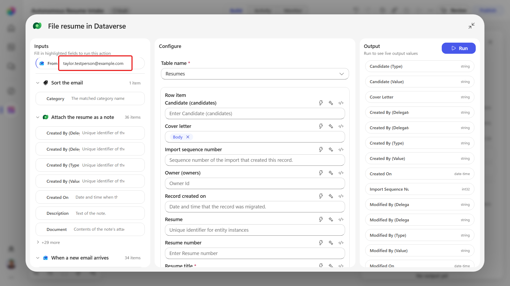

1. Select **Run**, then review the action's **Output** after the green check appears. The list shows every column on the row that was just created, with **Cover Letter** holding the sample **Body** value you entered. Scroll the **Output** list down to the **Resume** columns: **Resume Number** holds a generated value such as `R01064` and **Source Email Address** holds your sample value, while **Resume Title** is blank. The PDF is not here either - it is stored as a **note** by the next step, and **Run node** runs only the action you selected.

   That row is real data. Open the **Hiring Hub** app afterwards - it is in the environment's app list, and [Mission 01](../01-get-started/index.md#lab-01-set-up-the-hiring-hub) has the full route if you need it - go to **Resumes**, select the new row, and **delete** it, so a half-filled resume does not sit in your Resumes list.

   > [!NOTE] Why Resume Title comes out empty
   > **Run node** lets you type sample values for earlier **steps**, but not for the current item of a
   > **loop**. **Resume Title** is mapped from `items('For_each_attachment')?['name']`, so there is no
   > box for it and the created row has a blank title. This check exercises the connection, the table,
   > and the two trigger-driven columns, and the loop is covered by the full run below.

   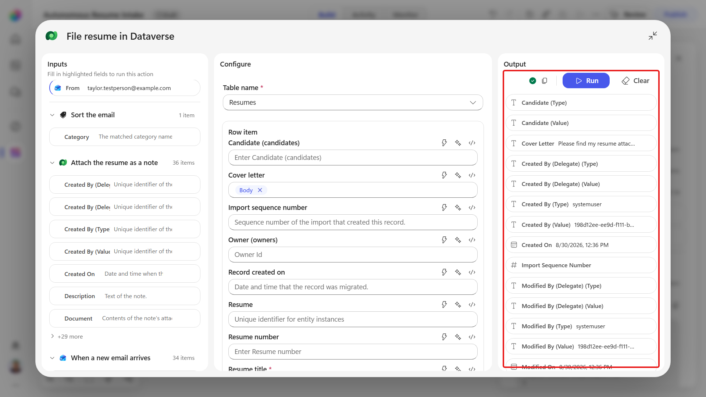

1. Now run the full end-to-end test, which is the only way to exercise the trigger *and* the note attachment together. On the command bar select **Publish** and wait for it to finish.

   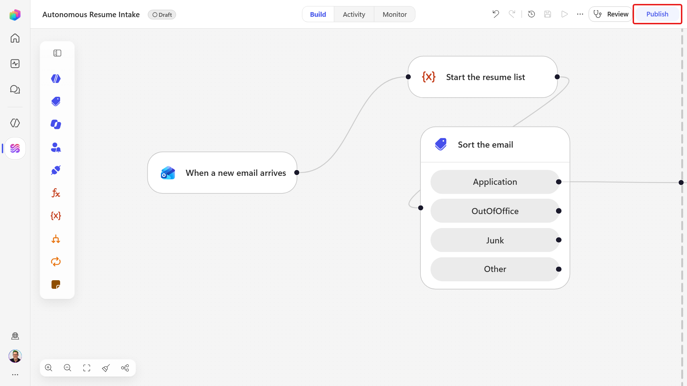

1. Select **Run** on the command bar - it is the triangular control immediately to the right of **Save**.

   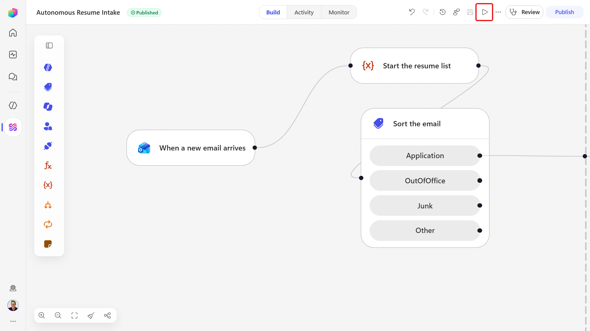

1. Wait for the banner that reads *Your flow is waiting for the trigger event*. Leave the workflow waiting while you send the email in the next step.

   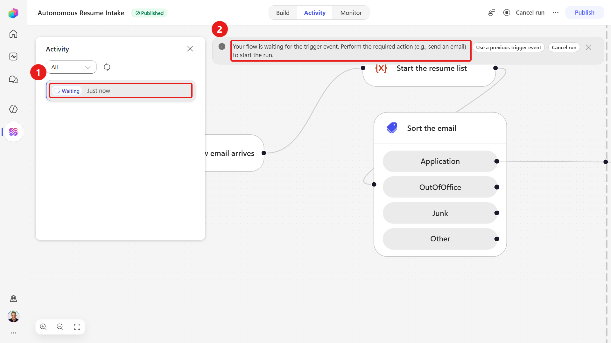

1. From another mailbox (or send to yourself if you don't have another mailbox to use), prepare an email to the monitored mailbox with `Application` in the subject and one resume **PDF attached** - use one of the sample resumes you downloaded in [Mission 05](../05-intake-matching-applications/index.md) - then select **Send** while the workflow is still waiting.

   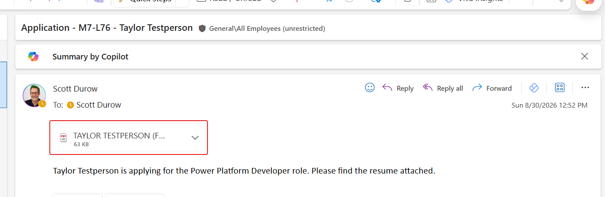

1. Wait for the trigger to poll. A brand-new connector trigger can take a couple of minutes on its first run. When it fires, a run appears in the **Activity** tab.

   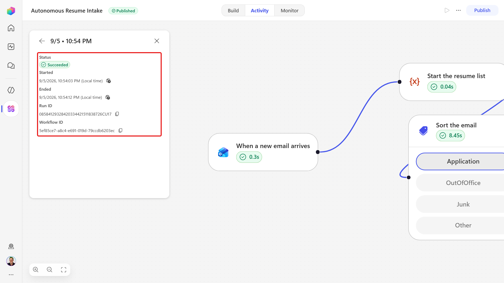

   > [!IMPORTANT] Why your test email may never start a run
   > The **When a new email arrives** trigger node checks the mailbox on a schedule rather than the
   > moment mail arrives, and it slows that schedule to once an hour while the mailbox is quiet.
   > Publishing the workflow - or turning it off and on again - re-creates the subscription and moves
   > its marker forward to the newest matching email **without running anything**, so an email you sent
   > just before publishing is skipped. Restarting the workflow to "kick it" skips the next one too.
   >
   > Two habits avoid the wait:
   >
   > - **Arm the trigger before you send**, which is what the last two steps did. The banner reads
   >   *"Your flow is waiting for the trigger event"*, so send your email while it is up and the run starts
   >   within a minute or so. After a page reload the **Run** button can lose its tooltip and label, but it
   >   is still the control immediately right of **Save**.
   > - **Use Resubmit as your test loop.** In the **Activity** tab choose **Select runs**, tick **one**
   >   previous run, then select **Resubmit**. It replays that run's real trigger payload - attachments
   >   and all - against your newly published definition, starting immediately. Send a fresh email only
   >   when you want to test the trigger itself. **Select runs** ticks *every* run, so clear the
   >   selection first or you will resubmit your whole run history at once.

1. Open the **Activity** tab and select the newest run. Every node shows **Succeeded**. Expand the **Process application** path and confirm **Is it a PDF?**, **File resume in Dataverse** and **Attach the resume as a note** all show **Succeeded**.

   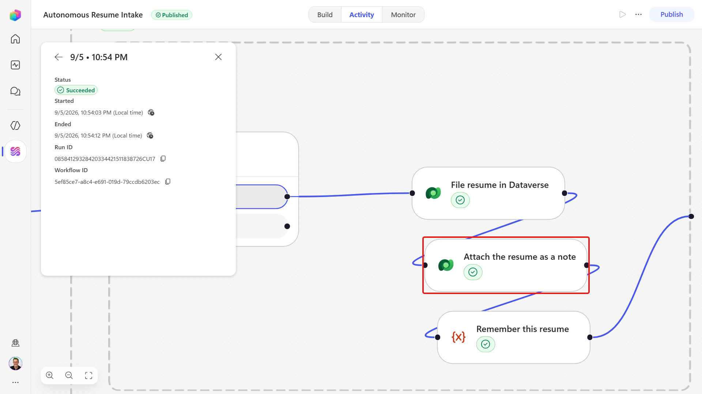

1. Select the **Attach the resume as a note** node inside that run. Its **Inputs** show the attachment's file name and its decoded `%PDF-1.7…` bytes in **documentbody**, and its **Outputs** return an **annotationid** - so the PDF really was written to the **Notes** table and linked to the Resume row. Select **Remember this resume** and confirm it also shows **Succeeded**, because that step appended the Resume number, Note id, and file name to `ProcessedResumes` for the agent steps in the next mission.

   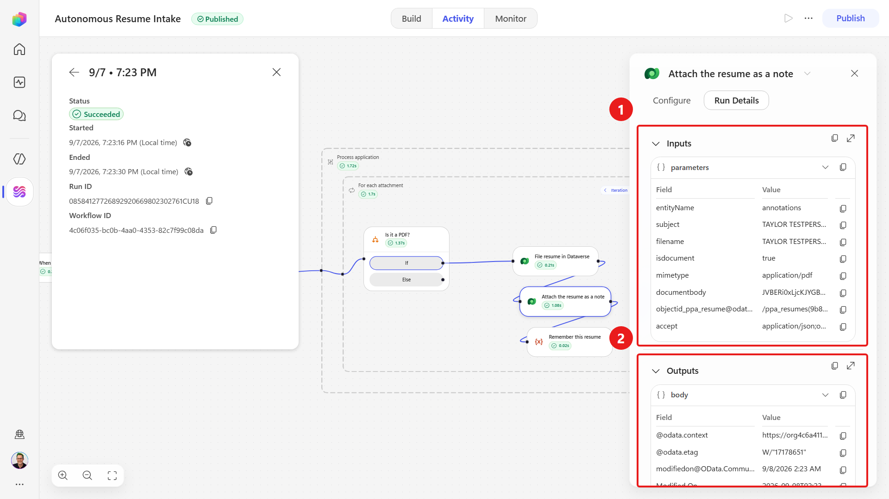

1. Open the **Hiring Hub** app and go to **Resumes**. The list is sorted by **Resume Number** descending, so the row the workflow just filed is at the top.

   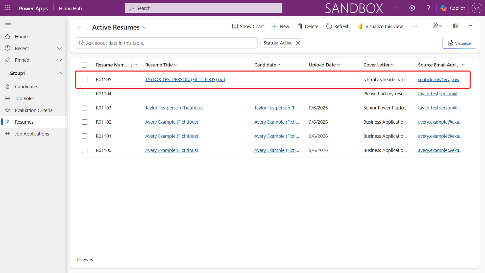

1. Open that row. It holds the sender's address in **Source Email Address** and the email body in **Cover Letter**, and its **Resume Title** is the attachment's file name.

   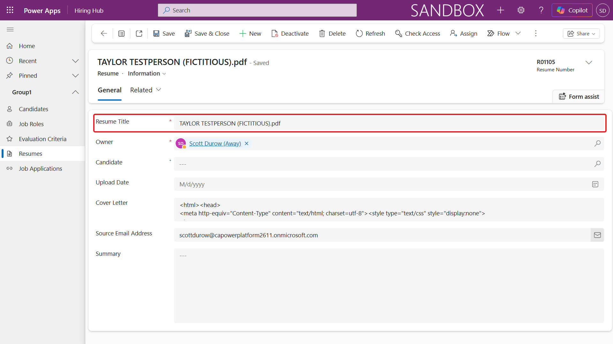

1. Check the record's **All Notes** subgrid: the attached PDF is listed there as a note, named after the file.

   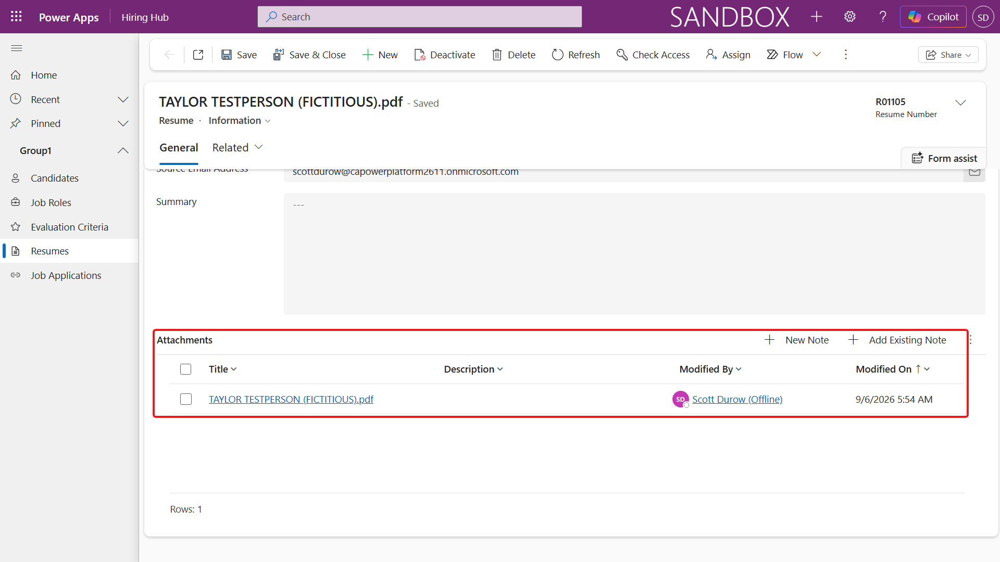

1. Open that note, select the linked file name, then open the downloaded PDF. The document viewer should show the same resume that arrived with the email. A run can show **Succeeded** even when a value was mapped to the wrong field, so this last look at the created row, its note, and the readable PDF is what actually proves the mapping.

   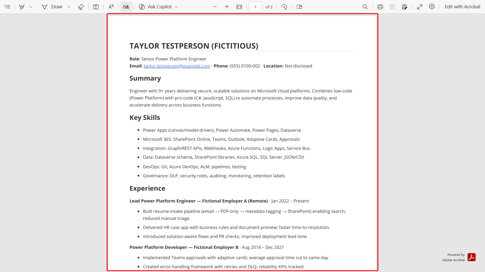

## ✅ Mission Complete {#mission-complete}

An email carrying a resume now files itself in Dataverse without anyone watching it happen.

You can now:

✅ **Workflow automation**: You built an email-triggered workflow entirely inside Copilot Studio.

✅ **Inbox screening**: You used a **Classify** node to route messages by intent, and left the branches that should do nothing empty.

✅ **Scoped, guarded filing**: You grouped the filing work in a **Scope**, looped over every attachment, and accepted only PDFs.

✅ **Dataverse writes from a workflow**: You created a Resume row and attached the original PDF to it as a note.

✅ **Node-level testing**: You exercised single nodes with **Run node** and read a whole run back in the **Activity** tab.

⏭️ [Move to **Add Agents to a Workflow** mission](../08-workflow-agents/index.md)

## 📚 Tactical Resources {#tactical-resources}

🔗 [Workflows in Copilot Studio](https://learn.microsoft.com/microsoft-copilot-studio/workflows-experience/flows-overview)

🔗 [Office 365 Outlook connector reference](https://learn.microsoft.com/connectors/office365/)

🔗 [Microsoft Dataverse connector reference](https://learn.microsoft.com/connectors/commondataserviceforapps/)

🔗 [Copilot Studio documentation](https://learn.microsoft.com/microsoft-copilot-studio/)

<analytics-tag section="operative-nextgen" mission="07-workflow-trigger" />
