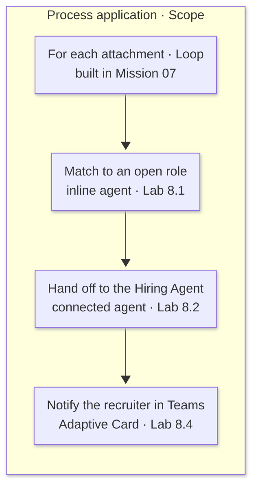

---
prev:
  text: "Automate Resume Intake with a Workflow"
  link: "/operative-nextgen/07-workflow-trigger"
next:
  text: "Human Oversight and Handling Alternative Flows"
  link: "/operative-nextgen/09-human-oversight"
hide: true
preview: true
short-description: Put agents inside a deterministic workflow so it can read resumes, decide a role, and notify the recruiter
difficulty: 3
codename: OPERATION SIGNAL POINT
time: 40
tags:
  - automation
  - multi-agent
products: [copilot-studio, dataverse, outlook, teams]
industries:
  - hr
created-date: 2026-08-12
last-edited-date: 2026-08-12
---

# 🚨 Mission 08: Add Agents to a Workflow {#mission-08-add-agents-to-a-workflow}

<mission-meta />

## 🎯 Mission Brief {#mission-brief}

Welcome back, Agent. The workflow you built files resumes, but every step in it is deterministic - the trigger fires, **Classify** picks a branch, and the loop files each PDF. None of that can answer which of your five open roles a candidate actually fits, because answering it means reading the document and weighing what is in it.

In this mission you'll add **agents** to that workflow. An **inline agent** reads each resume PDF and confirms the role, asking a human when the evidence conflicts. Your published **Hiring Agent** then does the scoring and the writes, reusing the skills you built in Missions 02, 05 and 06. You'll then read the agents' answers back out and post a record-linked **Adaptive Card** to Teams.

By the end of this mission an email arrives and a recruiter gets a Teams card naming the candidate, the role, the score and a link straight to the records.

## 🔎 Objectives {#objectives}

In this mission, you'll learn:

1. When to use an **inline agent** and when to call a **published** one
1. How to give a workflow agent tools and let it **ask a human** mid-task
1. How to pass workflow data into an agent and read its answer back out
1. Why the **Agents connection identity** decides whether a tool call succeeds
1. How to post a record-linked **Adaptive Card** to Teams

## 🧠 Two kinds of agent node {#two-kinds-of-agent-node}

In [Mission 07](../07-workflow-trigger/index.md) the only intelligence in the workflow was a **Classify** node - a router that sorts text into categories and nothing more. An **Agent** node hands a real, open-ended **task** to an agent that can reason, call tools, and use knowledge. Classify decides *which way to go*, while an agent decides *what the answer is*.

Filing a resume is deterministic - but reading the PDF, deciding which role it fits, and creating the application all need reasoning. You will use **two** agent nodes, because they are good at different things:

| | **Inline agent** (this workflow only) | **Connected agent** (the published Hiring Agent) |
| --- | --- | --- |
| Lives in | one node of one workflow | Copilot Studio, reusable anywhere |
| Can hold **custom skills** | **No** - built-ins only | **Yes** (`resume-intake`, `role-matching`, …) |
| Can **ask a human mid-task** | **Yes** - the *Request for information* tool | not in the same way |
| Use it for | a narrow, local decision that may need a person | reusable business logic and the writes |

Both run the *same* engine - the same sandbox, the same Python libraries (including `pdfplumber`) and the same built-in document skills. The only difference is **what you attach**, so the choice is about scope and reuse rather than capability. The one thing an inline agent gives you that a published agent does not is the **human request** toggle.

> [!INFO] Covered in Recruit
> In [Recruit Mission 07: Automate with Workflows](../../recruit-nextgen/07-automate-with-workflows/index.md) the agent calls the workflow, using the *When an agent calls the workflow* trigger. In this mission the workflow calls the agent.

## 🔁 Reading an agent's answer in a later step {#reading-an-agents-answer}

An agent node returns its answer as a property on its **body**, and the two node types use different property names. Wrap each one in `coalesce(x, '')` so an empty answer becomes an empty string rather than a null:

| Node | Expression |
| --- | --- |
| Inline agent | `coalesce(body('Match_to_an_open_role')?['message'], '')` |
| Connected agent | `coalesce(body('Hand_off_to_the_Hiring_Agent')?['result'], '')` |

The expression shape is the one you met in [Mission 07](../07-workflow-trigger/index.md#expressions): `body('…')` is the named node's output, `?['message']` is the property holding the answer, and `?` means "if this is missing, give me nothing instead of an error". The name inside the quotes is the node's name with spaces replaced by underscores, which is why each node has to be renamed *before* you write the expression that reads it.

Use the wrong property name and the expression does not fail - it resolves to nothing, and the step that reads it receives an empty string. The handoff would then say *"Role confirmation from the previous step:"* followed by nothing at all, and the Hiring Agent would improvise a role of its own. That silence is the reason `coalesce` is worth the extra characters.

## 🔑 Which identity a workflow's tool calls run as {#agents-connection-identity}

When you chat with an agent, its tool calls run as **you**. When a *workflow* calls an agent there is nobody at a screen, so those calls run under the **Agents connection identity** instead - a connection stored in the environment rather than a signed-in user.

That distinction causes the single most common failure in this mission. The Hiring Agent reaches Dataverse through its **MCP server**, so if the Agents connection has no working Dataverse connection, the call stops on *"Permission required"* and the agent reports that it couldn't read anything. Selecting a Connected profile for an **Evaluate** test does not repair it - that's a different connection entirely. Confirm the identity before you test, not after.

::: details 🔄 Coming from the classic Operative course?
In the classic course, a flow reached AI through an **AI Builder prompt**, which returns one narrowly-shaped completion at a time. The decision-making stayed in the flow itself, written out condition by condition.

The **Agent** node moves that reasoning somewhere else. You can scope an inline agent to a single node, or call a published agent that brings its own instructions, tools and skills - one that works through a document, calls tools of its own, and can pause to ask a person a question part-way through.

So the practical difference is in what you write. Instead of conditions for a flow, you write **instructions** for an agent, then read its structured reply back with an expression.
:::

## 🧪 Lab 08 - Adding AI Agents to the workflow {#lab-08-put-the-reasoning-in-the-pipeline}

### Prerequisites

Before you start this lab you need:

- The **Autonomous Resume Intake** workflow from [Mission 07](../07-workflow-trigger/index.md), filing resumes correctly
- The **Hiring Agent** **published**, carrying the `resume-intake`, `role-matching` and application skills from Missions 02, 05 and 06
- A **Microsoft Teams** connection, and a channel you can post to
- An **Office 365 Outlook** mailbox you can read, for the human request
- The two sample resume PDFs - see the download in [Mission 05](../05-intake-matching-applications/index.md)

Let's add the reasoning. You'll build the two agent nodes in series after the attachment loop, so the loop finishes filing every attachment first and the agents then run once over all of them.



### 8.1 Add the inline agent that reads the PDFs

1. Select the **➕** after the **For each attachment** loop, still inside the **Process application** scope, then choose **Agent**.

    

1. Rename the node to `Match to an open role` - select its name at the top of the panel, type the new name and press **Enter**. Later expressions refer to it as `Match_to_an_open_role`.

    

   The agent must sit **in series after the loop**, so the loop finishes filing every attachment and the agent then runs once over all of them. If the canvas shows the connector running straight from the loop to the end of the scope with the agent hanging off to one side, the agent is on a parallel branch and will never receive the loop's results - select that straight connector and use its **Delete edge** button, which leaves the loop connected to the agent.

1. Leave **Agent** set to **New agent for this workflow**, then under **Tools** select **Add tool**, choose the **Model Context Protocol (MCP)** category, select **Microsoft Dataverse MCP Server**, confirm the connection, and select **Add**.

    

   Take the Dataverse entry listed under **MCP**. The **Featured** list also offers **Microsoft Dataverse**, which is the ordinary *connector*: it gives the agent individual row actions rather than the `SELECT` queries these instructions need.


1. Turn **Request human assistance** on, confirm the **Human review** connection in the **Set up Human in the loop** dialog, and select **Add**.

    

   The dialog adds a tool named **Request for information** to the **Tools** list. Questions are emailed to the **connection owner**, which is why the human request in [Mission 09](../09-human-oversight/index.md) arrives in *your* mailbox.


1. Paste these **Instructions**. Note the **DATA FOR THIS RUN** block at the end - that is how the agent receives its input:

   ```text
   You are the role-confirmation step of an automated resume intake workflow.
   You never talk to the candidate. You read each applicant's resume PDF, decide
   which OPEN Job Role they should be considered for, and ask a human when that
   choice is genuinely ambiguous. You do NOT create Candidates, Resumes or Job
   Applications - the Hiring Agent does that next, and it does the scoring.

   STEP 1 - READ THE OPEN ROLES. Using the Microsoft Dataverse MCP Server, read
   the Active Job Roles (ppa_jobrole): role number and job title (ppa_jobtitle)
   only. Do not read evaluation criteria.

   STEP 2 - READ EACH RESUME PDF. For EACH line in the processed resumes list
   below, run exactly one
   query:
   SELECT documentbody, filename FROM annotation WHERE annotationid = '<the
   annotationid on that line>' documentbody is a base64-encoded PDF. Decode it
   in Python and extract the text (pdfplumber is available). Take the
   candidate's full name, email address, current job title and main skills. The
   email body is written by whoever forwarded the application and may be wrong.
   The PDF is the authority. Where the two disagree, trust the PDF and say so.

   STEP 3 - DECIDE THE ROLE. For each resume choose the single best-fitting OPEN
   role from the PDF.

   STEP 4 - ASK A HUMAN WHEN AMBIGUOUS. If the best role is genuinely unclear -
   two or more roles fit about equally, or the PDF points somewhere different
   from the email - you MUST use Request for information ONCE to ask which open
   role to use. Name the candidate, give the open roles as the choices, and say
   in one line why you are unsure. Never ask about something you can settle
   yourself, and never ask more than once.

   HARD LIMITS - obey these so the workflow cannot stall:
   - At most 8 tool calls in total.
   - Query each annotationid at most once. Never re-read a PDF you have already
     read.
   - Never retry a failed approach more than once.
   - Never invent a role number, candidate name or email address.
   - If the processed resumes list below is empty, stop and reply exactly: NO
     RESUMES SUPPLIED.

   OUTPUT - reply with exactly this block for each resume and nothing else:
   RESUME: <ResumeNumber>
   CANDIDATE: <full name from the PDF>
   EMAIL: <email from the PDF, or the sender address if the PDF has none>
   CURRENT TITLE: <current job title from the PDF>
   SKILLS: <comma-separated key skills from the PDF>
   ROLE: <role number and title>
   ASKED A HUMAN: <yes or no>
   WHY: <one line - the PDF evidence that decided it, or the human's answer>

   ---------------------------------------- DATA FOR THIS RUN

   Processed resumes (one per line: ResumeNumber | note <annotationid> | filename):
   @{variables('ProcessedResumes')}

   From: @{triggerOutputs()?['body/from']}
   Subject: @{triggerOutputs()?['body/subject']}
   Cover letter / email body:
   @{triggerOutputs()?['body/body']}
   ```

    

> [!IMPORTANT] Where an inline agent gets its data
> The `From`, `Subject`, `Body` and `Processed Resumes` boxes on the node look like inputs but stay
> empty. Everything the agent receives is the **Instructions** text. Drop the **DATA FOR THIS RUN**
> block and the agent still runs, still reads the job roles, and reports *"no resume input was
> provided"* - a green tick on a step that did nothing. Whenever you edit these instructions, scroll to
> the bottom and confirm the four tokens survive.

The Instructions box treats your text as markdown and escapes underscores when it saves, so `ppa_jobrole` reads back as `ppa\_jobrole`. That is cosmetic - the agent still queries the right table. The escaping is added on save rather than as you type, and deleting the backslashes in the editor does not stick, so leave it alone.

### 8.2 Hand off to the published Hiring Agent

The inline agent has decided *which* role each candidate fits. Now we'll hand the scoring and the writes to the published Hiring Agent, which already carries every skill that work needs.

1. Add a second **Agent** node after it and rename it to `Hand off to the Hiring Agent`.

   

1. Fill in the node as follows.

   | Field | Value |
   | --- | --- |
   | **Agent** | **Hiring Agent** *(select it from the drop-down list)* |
   | **Message** | The block below |

   Choosing a published agent removes every inline-agent field and collapses the panel to **Message** and **Output**, because a published agent brings its own instructions, tools and skills. That is why the scoring rubric lives here rather than in the inline agent - only a published agent can carry the `role-matching` skill you built in Mission 05.

    

1. Set the **Message** to:

   

   ```text
   Take in these candidates and create their job applications. The previous step
   has already confirmed WHICH role each candidate should be considered for -
   use that role. You still do the scoring, the intake and all the writes.

   Resumes filed by the workflow (one per line: ResumeNumber | note <annotationid> | filename):
   @{variables('ProcessedResumes')}

   Sender: @{triggerOutputs()?['body/from']}
   Subject: @{triggerOutputs()?['body/subject']}
   Email body (may be inaccurate - the resume PDF is the authority):
   @{triggerOutputs()?['body/body']}

   Role confirmation from the previous step:
   @{body('Match_to_an_open_role')?['message']}

   For EACH resume in the list:
   1. Read the resume PDF - it is on the Notes (annotation) table: SELECT
      documentbody, filename FROM annotation WHERE annotationid = '<the
      annotationid on that line>'. documentbody is base64.
   2. Set the Resume's cover letter and summary from the RESUME PDF text, not
      from the email body.
   3. Match the candidate to an existing Candidate record (dedupe on email
      address, then on full name). Only create a new Candidate if there is no
      match. Link the Resume to that Candidate.
   4. Score that candidate against the role confirmed above using the weighted
      rubric from the role-matching skill, reading that role's evaluation
      criteria live from Dataverse.
   5. Create the Job Application for that confirmed role, carrying the score and
      a one-line justification.

   Report, for each resume: the ResumeNumber, the Candidate number (and whether
   it was matched or newly created), the Job Role, the score, and the new Job
   Application number. If anything blocks you, say which resume and why rather
   than inventing data.
   ```

> [!IMPORTANT] Use the right property name for the node type
> Read this node's answer with `coalesce(body('Hand_off_to_the_Hiring_Agent')?['result'], '')` - a
> connected agent answers on `result`, while the inline agent above answers on `message`. Getting it
> wrong doesn't raise an error, because the expression quietly resolves to nothing. See
> [Reading an agent's answer](#reading-an-agents-answer) for how to read it.

<!-- Separate adjacent callouts for Markdownlint. -->
> [!IMPORTANT] Confirm the Agents connection before you test
> This call runs under the **Agents connection identity**, not as you, so it needs its own working
> Dataverse connection. A missing one stops the call on *"Permission required"*. See
> [Which identity a workflow's tool calls run as](#agents-connection-identity).

### 8.3 Verify the agent read the PDF, not the email

The test email deliberately **lies**. It says the candidate is applying for a *Data Analyst* role, which is not one of your five open roles at all - so the email alone cannot produce a correct answer. Only the PDF can.

**Publish before you send.** The trigger runs the *published* workflow, not the draft on your canvas, so an unpublished change is invisible to this test. Select **Publish** now. If you skip it, the email still produces a run - the previous version's run - and you will spend a long time wondering why neither agent node appears in it.

1. Send **one** email to the monitored mailbox with **both** sample resume PDFs attached, using exactly this subject and body:

   ```text
   Subject: Application - Data Analyst

   Hi,

   Please find attached the resumes for two candidates applying for the Data
   Analyst role. Both are keen to start as soon as possible.

   Thanks, Recruitment Partner
   ```

   One email carries two attachments so that a single run exercises the **For each attachment** loop and the accumulator you built in Mission 07, and produces both outcomes below.

1. Let the run reach the inline agent, then read its output block. It reports facts that appear **only inside the PDF** - a real email address, a current job title, and certifications such as `PL-200`, `PL-400` and `PL-600`. None of those values appear in the email body, so their presence identifies the PDF as the source:

   ```text
   RESUME: R#####
   CANDIDATE: Avery Example
   EMAIL: avery.example@example.com
   CURRENT TITLE: Senior Business Applications Consultant
   ROLE: J1003 Power Platform Consultant
   ASKED A HUMAN: yes
   WHY: Human chose J1003 - the PDF's consultant/business-applications profile with PL-200 and
        PL-400 overrides the email's non-existent "Data Analyst" role.
   ```

   This is an example. Your record numbers will differ, so check the shape of the result rather than the values.

   


1. Note that Avery came back **`ASKED A HUMAN: yes`**. The forwarding email says *Data Analyst*, no open role has that name, and the PDF points to Power Platform Consultant. The instructions require one human question when the email and PDF disagree.

   > [!IMPORTANT] Where the approval request lands
   > The question arrives as an **actionable card in Outlook**, in the mailbox of the account that owns
   > the **Agents** connection - not necessarily the mailbox the workflow is watching. Check **Focused**,
   > **Other** and **Junk**. If the card's buttons do nothing, select **Show content** to trust the
   > message. Answer with the card's own **Submit** button rather than replying to the mail, and expect
   > the run to sit at **Running** until you do - it waits indefinitely.

1. In the request, choose **J1003 Power Platform Consultant** and submit it.

1. Confirm the second candidate came back **`ASKED A HUMAN: no`** and **J1004 Power Platform Developer**. The PDF's Lead Power Platform Engineer / Developer history, PL-400 and pro-code skills provide a direct match. A good agent asks only about a conflict it cannot settle from the allowed evidence, and it does not ask when a resume simply spans several certifications.

   

1. Open the **Job Applications** table in the Hiring Hub app (see [Mission 01](../01-get-started/index.md#lab-01-set-up-the-hiring-hub) if you need the route) and confirm the applications exist, and that both candidates were **matched** to existing Candidate records rather than duplicated.

### 8.4 Notify the recruiter with a record-linked Teams card

Now tell the recruitment team - and make the alert *actionable* by carrying the **match result** and a **deep link straight to the records** in your model-driven app, so a recruiter can open the resume and the application.

1. On the canvas, select the **+** below the **Agent** node on the **Application** branch.

    

1. In the **Add** panel's search box, type `post card`.

    

1. The results are grouped **by connector**, and **Microsoft Teams** is the **first** group - no scrolling needed. Under it, select **Post card in a chat or channel**.

    

1. Rename the node to `Notify the recruiter in Teams` - select its name at the top of the panel, type the new name and press **Enter**.

    

1. In the **Connection** box select **Not connected**, then **Create new connection**, then **Create**, and select your account tile. Teams needs its **own** connection - the **Agents** connection from [Mission 07](../07-workflow-trigger/index.md) does not cover it. Once connected, the box shows your account with a green tick.

    
1. Fill in the node as follows. Leave **Card Type ID** and **IsAlert** empty.

   | Field | Value |
   | --- | --- |
   | **Post as** | **Flow bot** *(already selected)* |
   | **Post in** | **Chat with Flow bot** |
   | **Recipient** | Type your own email address, then **select yourself from the list that appears** so your name becomes a **person chip** |
   | **Adaptive Card** | The JSON below, assembled in a text editor first |

   Setting **Post in** makes a **Post card request** group appear containing **Recipient**, **Adaptive Card**, **Card Type ID** and **IsAlert**. Before you connect, those fields read *Could not load options* and *Fill in dependent fields first*, which is expected.

   If you only type an address into **Recipient** and move on without picking the person from the list, the node keeps its *Needs setup* badge and saving fails with *body/recipient: Recipient is required*.

    


1. Copy the finished card below and paste it into the **Adaptive Card** field in one go.

   Before you paste, replace both `«AppUrl»` placeholders with your **literal** app URL: the part of the Hiring Hub address up to and including the **appid**. Copy it straight from your browser's address bar while the **Hiring Hub** app is open, keeping everything from `https://` up to the end of the `appid=` GUID - for example `https://«your-org».crm.dynamics.com/main.aspx?appid=«HiringHubAppId»`.

   ```text
   {
     "$schema": "http://adaptivecards.io/schemas/adaptive-card.json",
     "type": "AdaptiveCard", "version": "1.4", "body": [
       { "type": "TextBlock", "text": "New application received", "weight": "Bolder", "size": "Medium" },
       { "type": "TextBlock", "text": "Filed automatically by the Autonomous Resume Intake workflow.", "wrap": true, "isSubtle": true },
       { "type": "FactSet", "facts": [
         { "title": "From", "value": "@{replace(replace(replace(replace(coalesce(triggerOutputs()?['body/from'],''),decodeUriComponent('%5C'),'/'),decodeUriComponent('%22'),''),decodeUriComponent('%0D'),''),decodeUriComponent('%0A'),decodeUriComponent('%5Cn'))}" },
         { "title": "Subject", "value": "@{replace(replace(replace(replace(coalesce(triggerOutputs()?['body/subject'],''),decodeUriComponent('%5C'),'/'),decodeUriComponent('%22'),''),decodeUriComponent('%0D'),''),decodeUriComponent('%0A'),decodeUriComponent('%5Cn'))}" }
       ]},
       { "type": "TextBlock", "text": "Resumes processed", "weight": "Bolder", "spacing": "Medium" },
       { "type": "TextBlock", "text": "@{replace(replace(replace(replace(coalesce(variables('ProcessedResumes'),''),decodeUriComponent('%5C'),'/'),decodeUriComponent('%22'),''),decodeUriComponent('%0D'),''),decodeUriComponent('%0A'),decodeUriComponent('%5Cn'))}", "wrap": true },
       { "type": "TextBlock", "text": "Role match", "weight": "Bolder", "spacing": "Medium" },
       { "type": "TextBlock", "text": "@{replace(replace(replace(replace(coalesce(body('Match_to_an_open_role')?['message'],''),decodeUriComponent('%5C'),'/'),decodeUriComponent('%22'),''),decodeUriComponent('%0D'),''),decodeUriComponent('%0A'),decodeUriComponent('%5Cn'))}", "wrap": true },
       { "type": "TextBlock", "text": "Intake and applications", "weight": "Bolder", "spacing": "Medium" },
       { "type": "TextBlock", "text": "@{replace(replace(replace(replace(coalesce(body('Hand_off_to_the_Hiring_Agent')?['result'],''),decodeUriComponent('%5C'),'/'),decodeUriComponent('%22'),''),decodeUriComponent('%0D'),''),decodeUriComponent('%0A'),decodeUriComponent('%5Cn'))}", "wrap": true }
     ], "actions": [
       { "type": "Action.OpenUrl", "title": "Open resumes in Hiring Hub",
         "url": "«AppUrl»&pagetype=entitylist&etn=ppa_resume" },
       { "type": "Action.OpenUrl", "title": "Open job applications",
         "url": "«AppUrl»&pagetype=entitylist&etn=ppa_jobapplication" }
     ]
   }
   ```

   The editor parses each `@{ … }` fragment as it accepts the paste and turns it into a chip. Paste the card first and try to edit the values in place and it is very easy to leave a stray quote that makes the card fail at runtime with no design-time error.

    

   > [!IMPORTANT] Why the four replace calls
   > Everything inside `"text"` has to survive as a **JSON string**. An agent writes for humans, so it
   > will eventually write a sentence like `the email claimed "Data Analyst"` - and that bare `"`
   > closes the string early, making the whole card invalid. Teams rejects it with *The specified Teams
   > flowbot message's message body is invalid JSON*.
   >
   > Each nested `replace` neutralizes one character class: `%5C` backslash becomes `/`, `%22` double
   > quote is removed, `%0D` carriage return is removed, and `%0A` newline becomes the two characters
   > `\n` that JSON wants. They are written as `decodeUriComponent(...)` because the expression editor
   > cannot express a bare double quote inside a single-quoted literal - an escaped one produces a
   > `replace` that matches nothing, reports no error, and leaves the quotes in place.
   >
   > The `coalesce(…, '')` at the centre does the other half of the job: an agent that returned nothing
   > yields an empty string rather than a null that would break the card.

   The app URL is hard-coded here on purpose - get the card working first with a value you can see. [Mission 09](../09-human-oversight/index.md) explains how an **environment variable** makes those links work after a move to another environment.

   > [!NOTE] Both buttons open a list, not a single record
   > A per-record link would need the row's **GUID**, and nothing in the workflow ever learns it
   > because the **agent** created that row - the only identifier anyone sees is the short
   > **Application Number**, which `pagetype=entityrecord` will not accept. Opening the list avoids
   > the problem, and the card already carries the agent's report so the reviewer can spot the right
   > row immediately. If you want a direct link later, look the row up by its number with a **List
   > rows** step and use the GUID that returns.

1. Replace `«your-org»` with your own org name and `«HiringHubAppId»` with your Hiring Hub app id - you can read both from the browser address bar while the Hiring Hub app is open. No `«` characters should remain anywhere in the card.

    

1. On the command bar select **Save**. The *Needs setup* badge disappears from the node.

    

Now test it by posting a real card. Posting **sends a real message**, so use a recipient or channel you own.

1. **Publish** the workflow, then email the monitored mailbox another application with a PDF attached. Now that an **Agent** node sits in the branch this run takes **4-6 minutes**, almost all of it inside the agent, and it stays at **Running** the whole time. That is normal - do not assume it has hung and start re-sending email.

   

1. Open the run in **Activity** and select the **Notify the recruiter in Teams** node. It returns a Teams **Message ID** and a **Message link** to the posted card.

   

1. Open the recipient's Teams **Workflows** chat. The card renders with the match facts and both buttons.

   

1. Review the **Role match** section and confirm it carries both PDF-grounded decisions, including whether the inline agent asked a person.

   

1. Scroll to the bottom and confirm the Hiring Agent matched both existing candidates and the two deep-link buttons are present.

   

1. Select **Open resumes in Hiring Hub**. The Hiring Hub **Resumes list** opens with the row you just filed at the top.

The run is green through the Teams step, the card lists the candidate, resume, recommended role, score and application, and each button deep-links into the Hiring Hub.

The workflow now **reuses the Hiring Agent** instead of rebuilding matching in nodes - the same agent a recruiter chats with in [Mission 11](../11-publish-and-monitor/index.md) also powers this headless pipeline. Deterministic filing stays in the workflow, and the reasoning stays in the agent.

## ✅ Mission Complete {#mission-complete}

Your workflow now reads, decides, and tells someone about it - end to end, with nobody watching.

You can now:

✅ **Inline agents**: You added an agent scoped to one workflow node, gave it the Dataverse MCP server, and let it ask a human when the evidence conflicted.

✅ **Connected agents in a workflow**: You handed the scoring and the writes to your published Hiring Agent, reusing every skill you'd already built.

✅ **Reading an agent's answer**: You pulled a structured reply out of an agent node with `coalesce` and fed it into the next step.

✅ **Evidence over assertion**: You proved the agent read the resume PDF rather than the email body that contradicted it.

✅ **Record-linked notifications**: You posted an Adaptive Card to Teams that links straight back to the Dataverse record.

⏭️ [Move to **Human Oversight and Handling Alternative Flows** mission](../09-human-oversight/index.md)

## 📚 Tactical Resources {#tactical-resources}

🔗 [Add an agent to a workflow](https://learn.microsoft.com/microsoft-copilot-studio/workflows-experience/flows-overview)

🔗 [Adaptive Cards](https://adaptivecards.io/)

🔗 [Adaptive Card designer](https://adaptivecards.io/designer/)

🔗 [Microsoft Teams connector reference](https://learn.microsoft.com/connectors/teams/)

<analytics-tag section="operative-nextgen" mission="08-workflow-agents" />
