---
prev:
  text: "Add Agents to a Workflow"
  link: "/operative-nextgen/08-workflow-agents"
next:
  text: "Schedule Interviews with Work IQ"
  link: "/operative-nextgen/10-work-iq-scheduling"
hide: true
preview: true
short-description: Add human review, alternate-flow handling and failure alerting to the autonomous intake workflow
difficulty: 3
codename: OPERATION FAIL-SAFE
time: 60
tags:
  - automation
  - compliance
products: [copilot-studio, dataverse, outlook, teams]
industries:
  - hr
created-date: 2026-07-26
last-edited-date: 2026-08-12
---

# 🚨 Mission 09: Human Oversight and Handling Alternative Flows {#mission-09-human-oversight-and-handling-alternative-flows}

<mission-meta />

## 🎯 Mission Brief {#mission-brief}

Welcome back, Agent. In the previous two missions you built a workflow that files resumes, asks the Hiring Agent to match them, and notifies recruiters in Teams. It works, but it cannot yet ask for help or report a failure.

In this mission you'll add human review for uncertain decisions, then make failed runs visible with a try/catch pattern that raises an alert.

## 🔎 Objectives {#objectives}

In this mission, you'll learn:

1. How to pause for human review, branch on the answer, and end inactive routes cleanly
1. How to verify that the role-matching agent asks for help only when its evidence is ambiguous
1. How to catch failures with a **Scope** and **Run after** condition and raise an alert
1. How to break a step on purpose and read what the run history tells you

## 🧠 Handling alternate flows {#handling-alternate-flows}

Everything you have built so far is the **happy path**, where the mail arrives carrying a readable PDF and the agent has enough evidence to match it to a role. Real workflows often run off that path.

Handling those alternate flows takes two different techniques, depending on which kind of logic went wrong:

| Deterministic logic | Probabilistic logic |
| --- | --- |
| Writing a row, uploading a file, posting a card | Classifying an email, matching a resume to a role |
| Retry the transient fault, mark the run failed, then alert a human | Ask a human *before* acting when the evidence is ambiguous |
| You test it by **breaking it on purpose** | You test it by **feeding it awkward inputs** |

This mission builds a route to handle each of these alternative flows to ensure that the hiring data consistency is preserved.

> [!INFO] Covered in Recruit
> **Human review** appears in the node palette in [Recruit Mission 07: Automate with Workflows](../../recruit-nextgen/07-automate-with-workflows/index.md#how-workflows-work) but is never configured there. This mission sets one up, decides what it asks, and routes what comes back.

## 🧪 Lab 09 - Handle the alternate flows {#lab-09-handle-the-alternate-flows}

### Prerequisites

Before you start this lab you need:

- The **Autonomous Resume Intake** workflow from Missions [07](../07-workflow-trigger/index.md) and [08](../08-workflow-agents/index.md), **published** and filing resumes successfully. Everything here is added on top of it.
- The **Hiring Hub** app and the **Resumes**, **Job Applications** and **Tasks** tables in Dataverse
- A **test mailbox you control** - never a shared or production inbox
- The test resume PDFs you used in Mission 08 (for example `AVERY EXAMPLE (FICTITIOUS).pdf`)

> [!IMPORTANT] Your workflow is still watching the mailbox
> If you left the workflow **Published** at the end of Mission 08, it is still polling that mailbox and
> will run on any email matching its **Subject Filter**. This mission needs those live runs, so leave it
> on - but check that the mailbox is a test one you control.

The workflow you carried in from Mission 08 needs a defined response to uncertainty and runtime failure before it can watch a mailbox unattended. Let's add both paths and then break a step on purpose to prove the failure path works.

### 9.1 Ask a human when the email is ambiguous

We will now handle the emails that do not route cleanly, where the **Classify** node routes to **Other**, the resume is **unreadable**, or the Hiring Agent **can't confidently pick a role**. In each of these cases we will **pause and ask a person** with a **Human review** node.

You end up with two ways to involve a human, and the difference is *who decides that a human is needed*:

| | **Human review** node (this lab) | **Request for information** (inline agent, [Mission 08](../08-workflow-agents/index.md)) |
| --- | --- | --- |
| Who decides to ask | **You** - it is a step on a branch | **The agent**, mid-reasoning |
| Fires | every time that branch runs | only when the agent judges the evidence ambiguous |
| Question wording | fixed, written by you | written by the agent for that specific case |
| Best for | a known category ("we can't classify this") | a judgment call you can't enumerate up front |

Use the node when you can *name* the situation in advance, and the agent's request when you cannot. Avery's contradictory *Data Analyst* email is the second case, because no branch could have predicted it. Taylor's resume is neither, because its role history, PL-400 and pro-code skills map straight to Power Platform Developer with nothing to ask about.

> [!IMPORTANT] Where the approval request lands
> Both mechanisms email you an actionable card, but Focused Inbox does not place it consistently. Check
> **Focused**, **Other** and **Junk** before concluding anything is stuck, because the run is
> **waiting** and it will wait indefinitely. If the card's buttons do nothing select **Show content**
> first - Outlook blocks the card's scripts until you do.

<!-- Separate adjacent callouts for Markdownlint. -->
**A waiting agent looks like a silent one.** An agent step publishes its activity log only once it **completes**, so an agent that is waiting on a
human shows nothing at all. Do not cancel the run to "see what it's doing" - cancelling destroys the
log you would need to diagnose it. Give it the answer it is waiting for instead.

1. On the canvas, find the **Other** branch under the **Sort the email** node and select the **➕** button labeled **Add a step after Other**.

   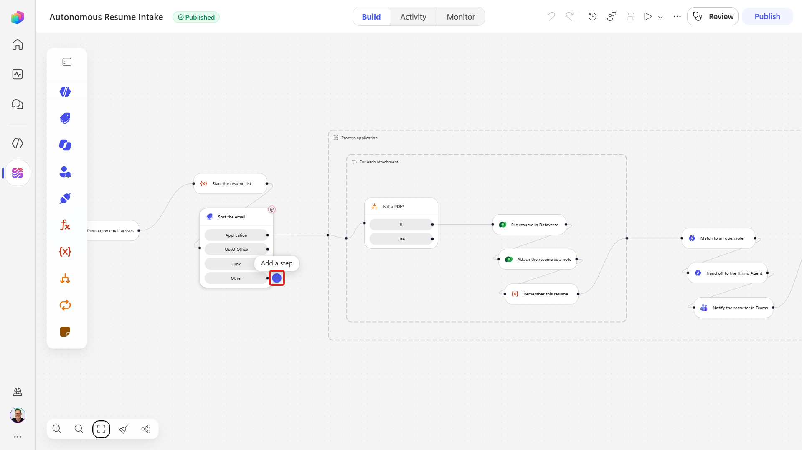

1. In the **Add** dialog, under **Actions**, select **Human review**.

   The node is added straight away - there is no second list of options to choose from.

   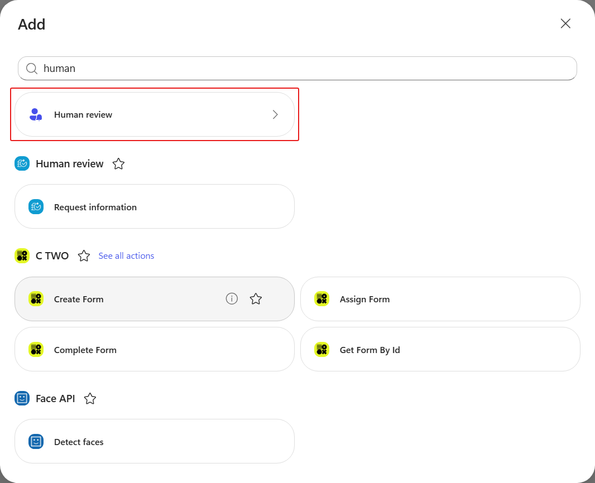

1. Select the new node to open its panel.

   The **Connection** box reads **Human review** with a green tick and the word **Connected**. This connector is created for you the first time you use the node.

   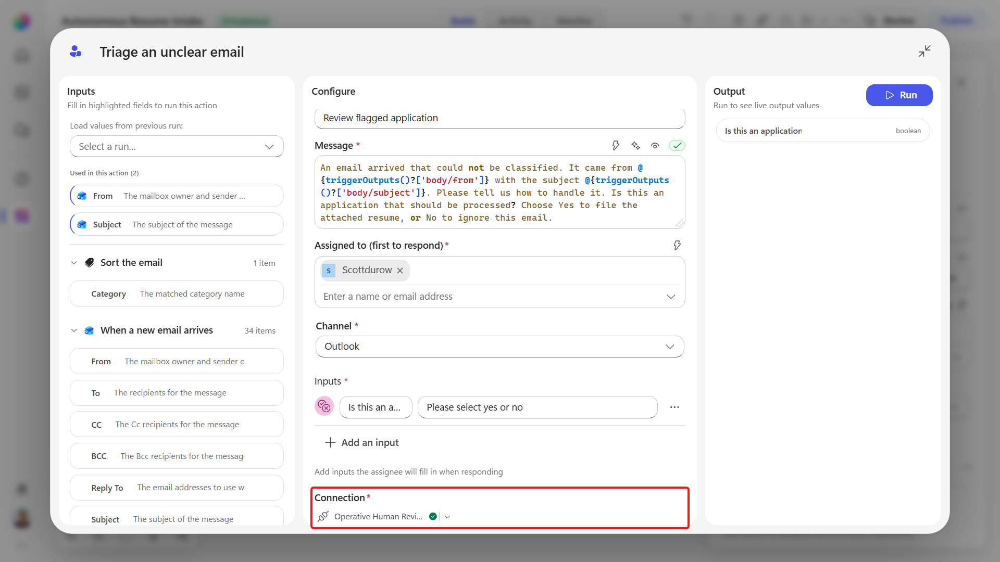

1. Rename the node to `Triage an unclear email` - select the name at the top of the panel, type the new name and press **Enter**.

   The rest of the mission refers to the node by that name, and its compiled identifier becomes `Triage_an_unclear_email`.

   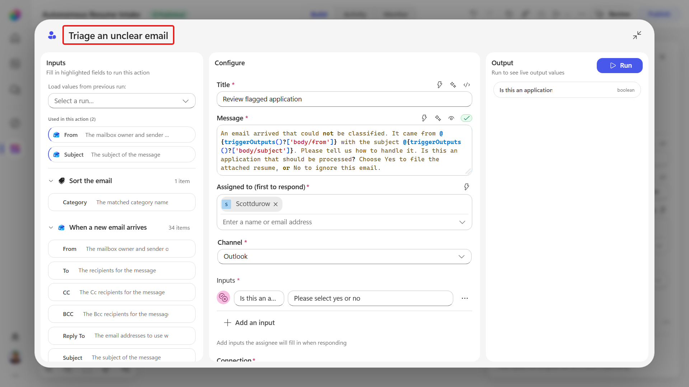

1. In **Title**, enter `Review flagged application`. This is the subject line the reviewer sees.

   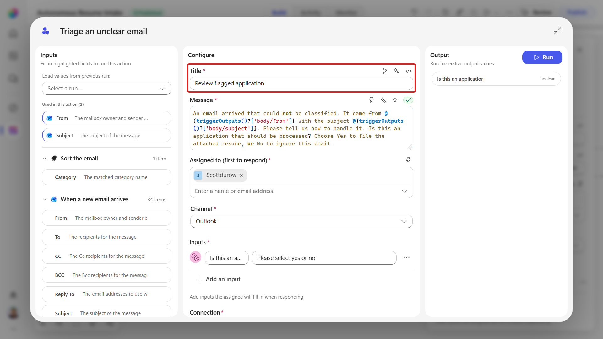

1. Select **`</>` Switch to expression mode** for **Message**, then paste the complete review request:

   ```text
   An email arrived that could not be classified. It came from @{triggerOutputs()?['body/from']} with the subject @{triggerOutputs()?['body/subject']}. Please tell us how to handle it. Is this an application that should be processed? Choose Yes to file the attached resume, or No to ignore this email.
   ```

   The Message field expands into a multiline editor containing the text and both expressions.

   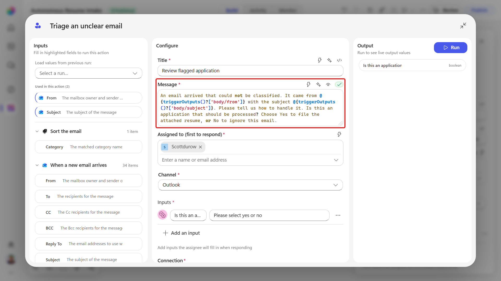

1. In **Assigned to (first to respond)**, start typing your name or email address, then **select yourself from the results**.

   Confirm your name appears as a chip with your initials. Typing an address without selecting it from the list leaves the field empty.

   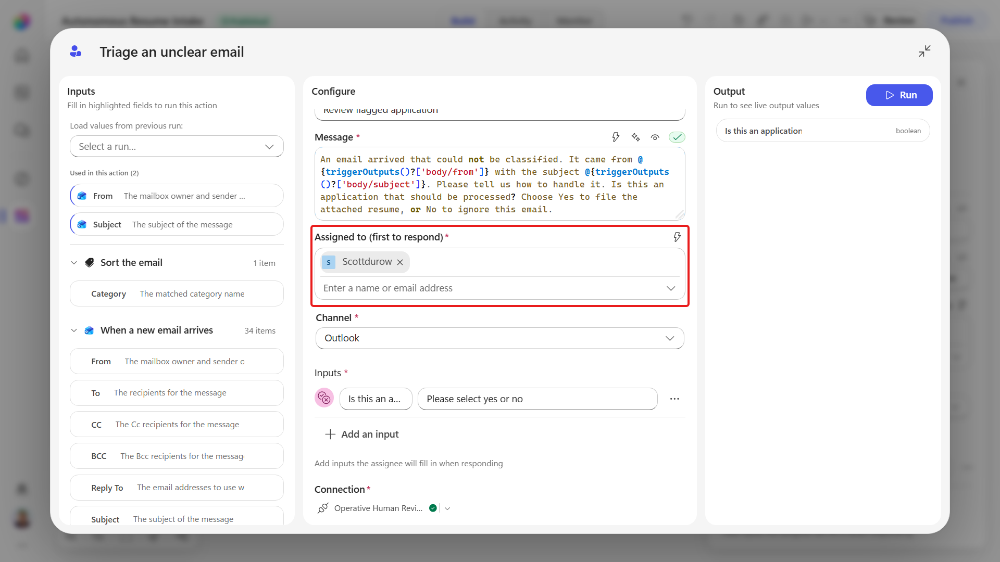

1. Leave **Channel** set to **Outlook** - it is already the default.

   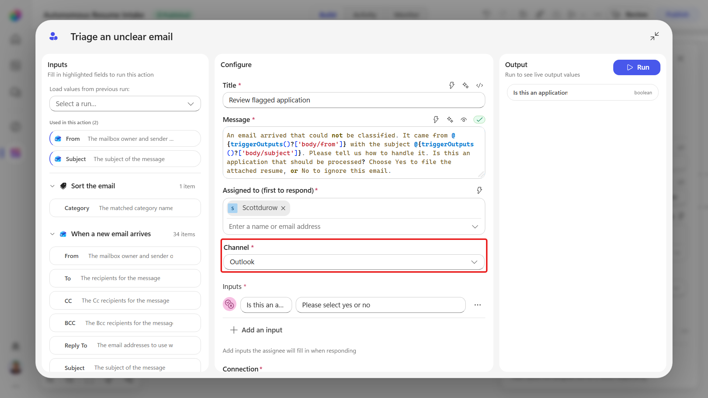

1. Select **➕ Add an input**, then choose **Yes/No** from the **Choose the type of user input** menu.

   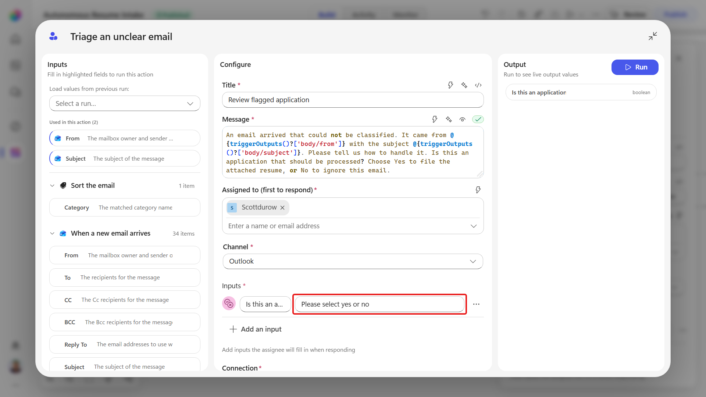

1. Select the box next to the type and replace the placeholder with `Is this an application?`

   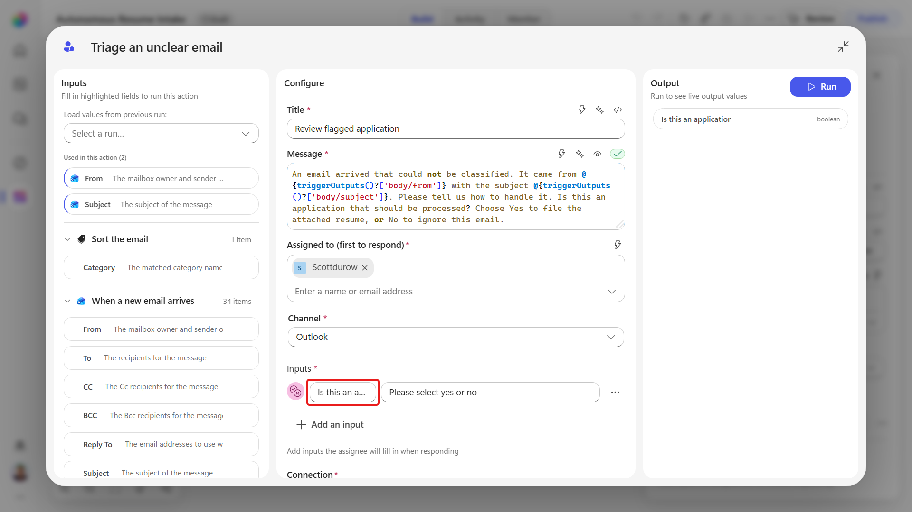

   > [!IMPORTANT] An input's type is fixed
   > The type drop-down list looks editable, but switching it does not re-type the underlying input. If you
   > choose the wrong type, **delete the input row and add a new one**. **Delete** lives on the row's
   > the more options menu - and for **Text** inputs only, so does **Add dropdown**, if you want to offer a fixed
   > list of answers.

1. On the command bar select **Save**.

   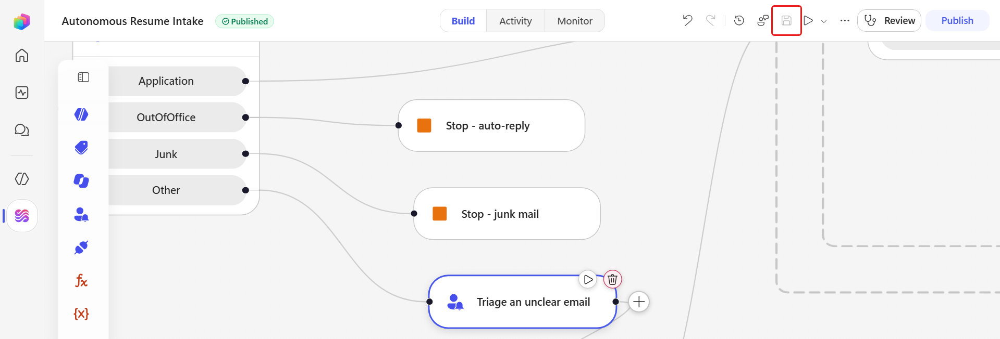

### 9.2 Route the answer and end the dead branches

Right now the reviewer's answer is recorded and then thrown away - the run ends either way. We will now branch on the answer so that **Yes** files the resume through the same pipeline the **Application** branch uses, and **No** stops the run.

1. On the **Other** branch, hover the **Triage an unclear email** node and select the **➕** labeled **Add a step after Triage an unclear email**.

   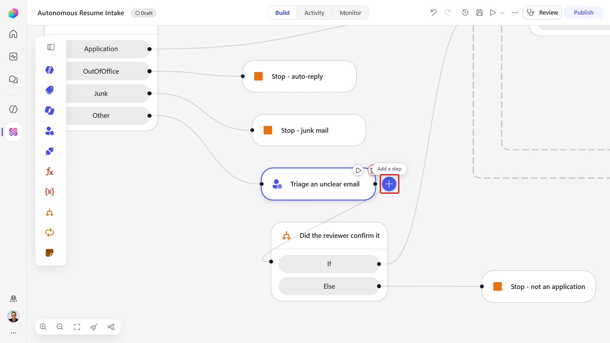

1. In the **Add** dialog, under **Actions**, select **If/Else**.

   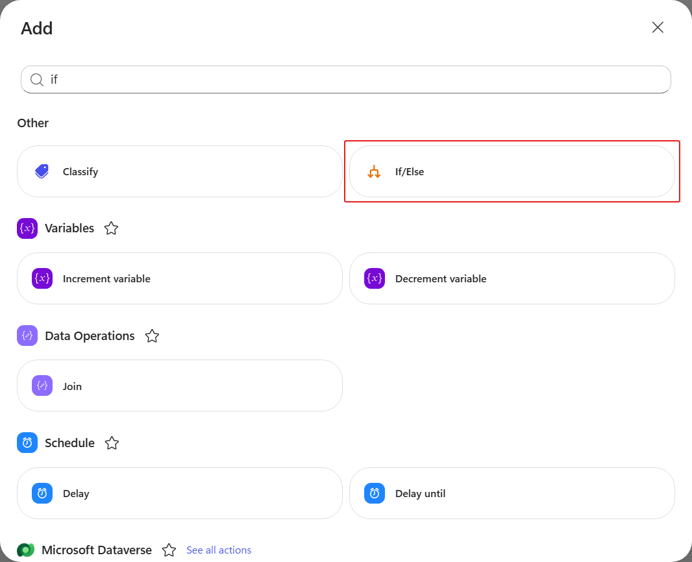

1. Select the new node, select its name at the top of the panel, and rename it to `Did the reviewer confirm it`. Press **Enter**.

   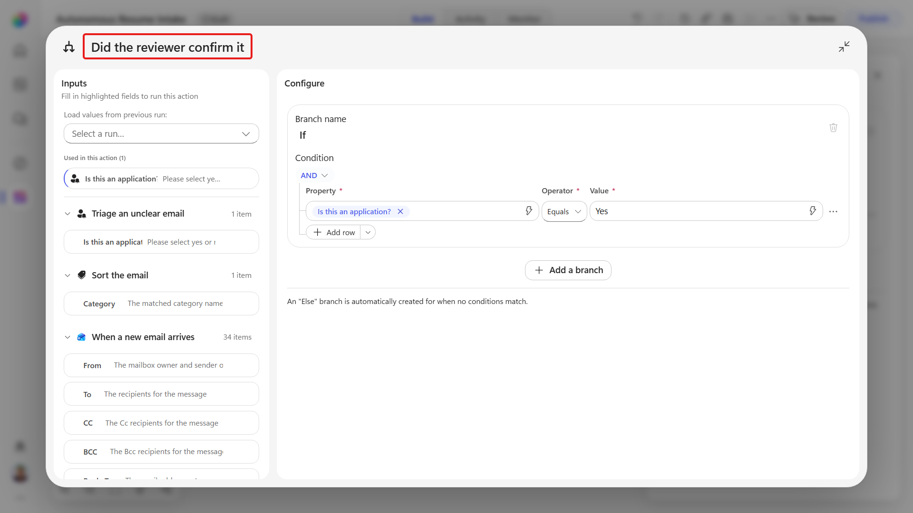

1. Fill in the condition as follows.

   | Field | Value |
   | --- | --- |
   | **Property** | Select ⚡ **Insert dynamic content** and choose the **Yes/No** output of **Triage an unclear email** |
   | **Operator** | **Equals** *(leave as-is)* |
   | **Value** | `Yes` |

   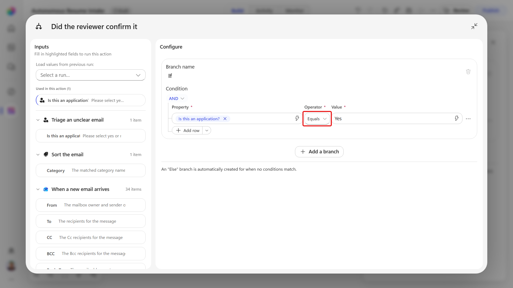

   > [!IMPORTANT] Enter Yes, not true
   > The output is *named* **Yes/No**, and the designer accepts a comparison against the boolean
   > `true`. It looks right and publishes cleanly, but at runtime the node returns the **string**
   > `"Yes"` or `"No"`, so `equals(..., true)` is **always false** - including when the reviewer
   > answered Yes. Nothing errors, but the branch never fires and nothing tells you why. After a run,
   > the step's **Outputs** read `{ "boolean": "Yes", ... }`, and the quotes
   > mean text.

1. Now join the **If** lane to the work that already exists. Drag from the **output handle** on the right-hand edge of the **Did the reviewer confirm it** node onto the left-hand edge of the **Process application** scope, so a new connector is drawn between them.

   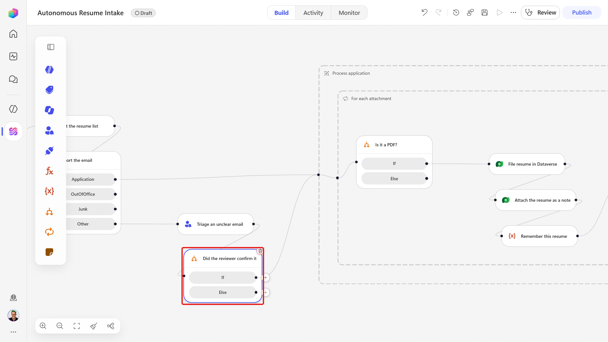

1. Look at where **Process application** now sits.

   The **Process application** scope is now reachable from two routes - the **Application** classification and the **Did the reviewer confirm it** branch.

   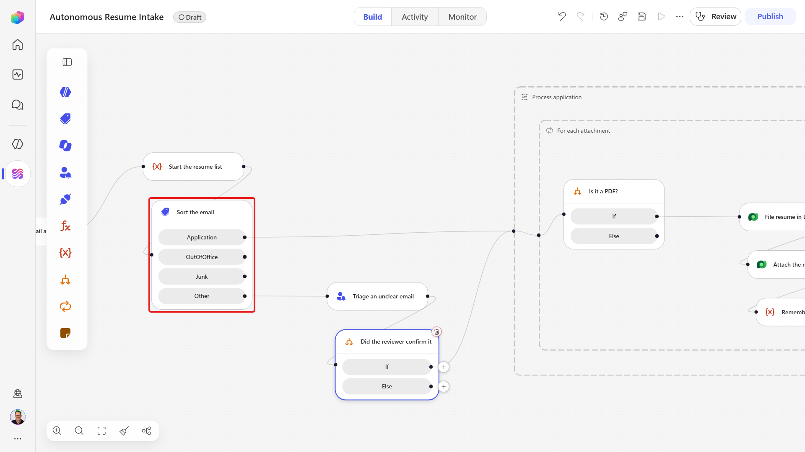

**Process application** now sits *after* the Classify node, so it runs whenever the switch completes - no matter which branch was taken. **OutOfOffice**, **Junk** and the **Else** lane you are about to use for "No" have no path to that merge, so the compiler injects a hidden terminate step into each one and marks the whole run **Failed** with `PartialJoinNotReached ... (code: CROSS_SCOPE_MERGE)`. An out-of-office reply would no longer be read and ignored - it would fail the run.

So next we end those three branches deliberately, with an **End** node, so the run stops cleanly before it ever reaches the merge.

1. Hover the **Did the reviewer confirm it** node and select the **➕** labeled **Add a step after Else**.

   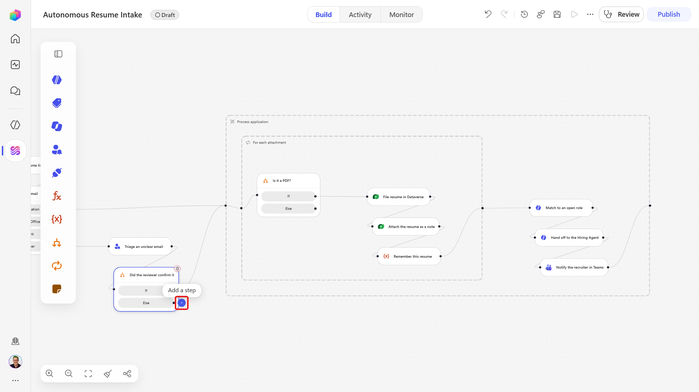

1. In the **Add** dialog, type `End` in the search box and select **End** - it is listed on its own under the **Other** heading, above similarly named connectors.

   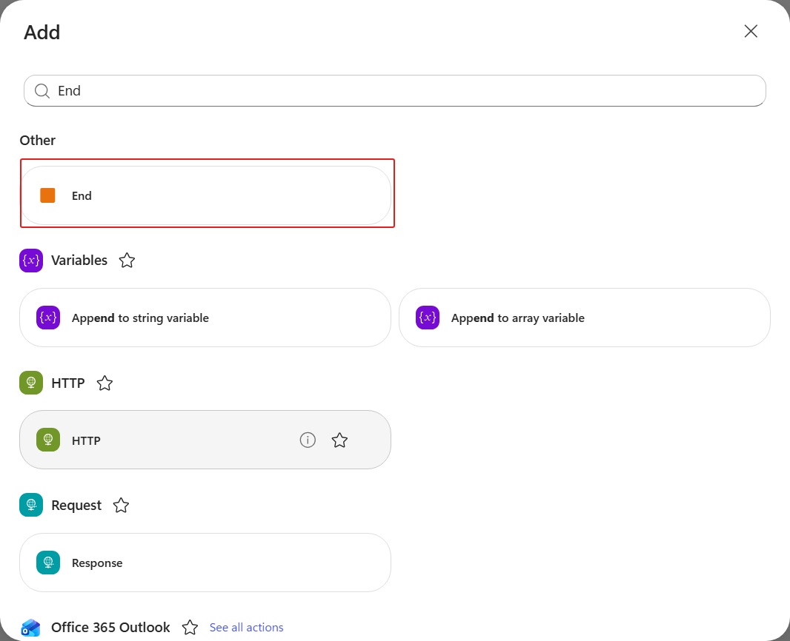
1. Leave **Run status** set to **Succeeded** - the default. Nothing went wrong, there was simply nothing to do.

   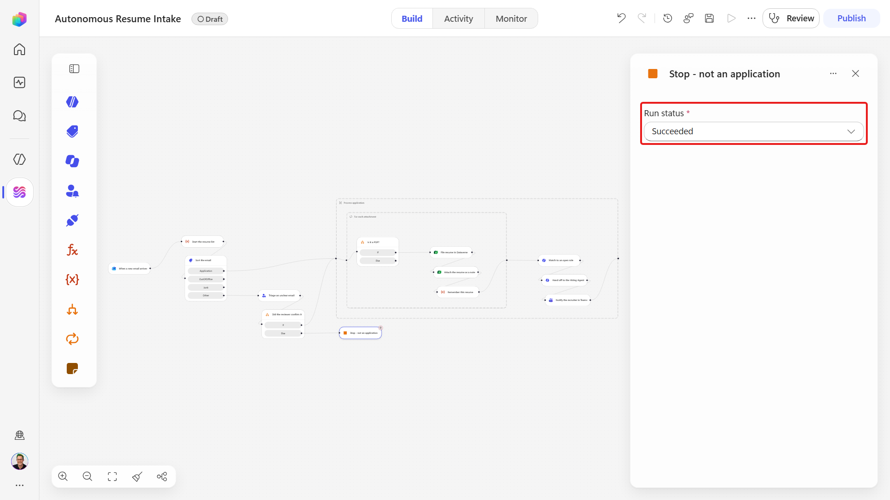

1. Rename the node to `Stop - not an application`.

   

1. Repeat those four steps twice more, on the **OutOfOffice** branch naming the node `Stop - auto-reply`, and on the **Junk** branch naming it `Stop - junk mail`.

1. On the command bar select **Save**, then **Publish**. The canvas now carries all three Stop nodes on their dead branches.

   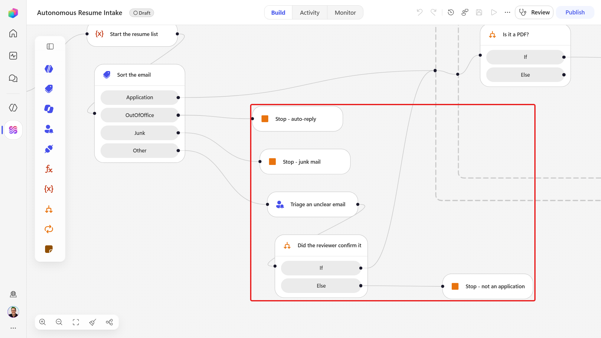

All four branches now have somewhere to go:

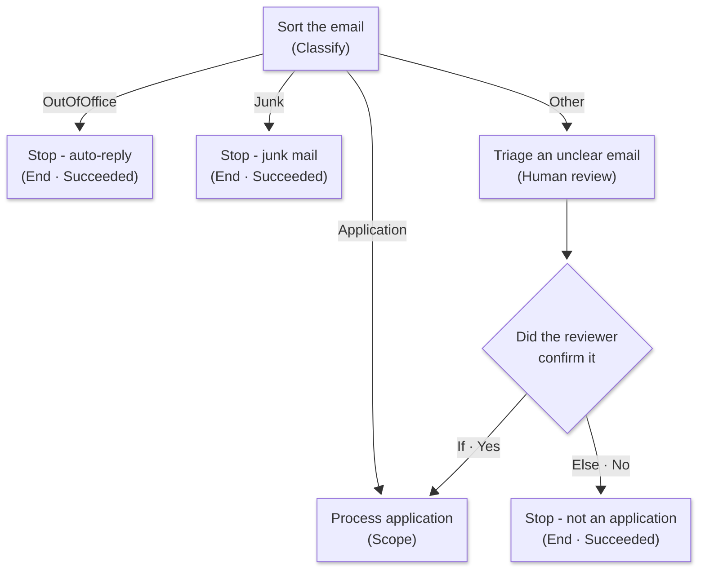
```mermaid
---
config:
  look: neo
---
flowchart TB
  CL["Sort the email<br/>(Classify)"]
  CL -- "Application" --> PA["Process application<br/>(Scope)"]
  CL -- "OutOfOffice" --> E1["Stop - auto-reply<br/>(End · Succeeded)"]
  CL -- "Junk" --> E2["Stop - junk mail<br/>(End · Succeeded)"]
  CL -- "Other" --> HR["Triage an unclear email<br/>(Human review)"]
  HR --> IF{"Did the reviewer<br/>confirm it"}
  IF -- "If · Yes" --> PA
  IF -- "Else · No" --> E3["Stop - not an application<br/>(End · Succeeded)"]
```

### 9.3 Test both review answers

Next we answer **No** and watch the run stop, then we replay that run, answer **Yes**, and watch it continue into the filing pipeline.

#### Answer No

1. Send the monitored mailbox an email with `Application` in the subject, **a PDF attached**, and a body that is clearly *not* an application:

   ```text
   Hi there, I am not applying for anything today. I just wanted to ask how long
   your recruitment process usually takes, and whether you accept speculative
   CVs. I have attached a document only so you can see the format we use. No
   action needed.
   ```

   The trigger fires only on mail **with** attachments, so a bare text email never starts a run at all.

1. Open the **Activity** tab and select the running item. **Triage an unclear email** shows **Waiting**, and the actions after it show **Waiting** too because they are queued behind the review.

   The run stays in this state until a human answers the card. It is not stuck and it will not time out on its own.

   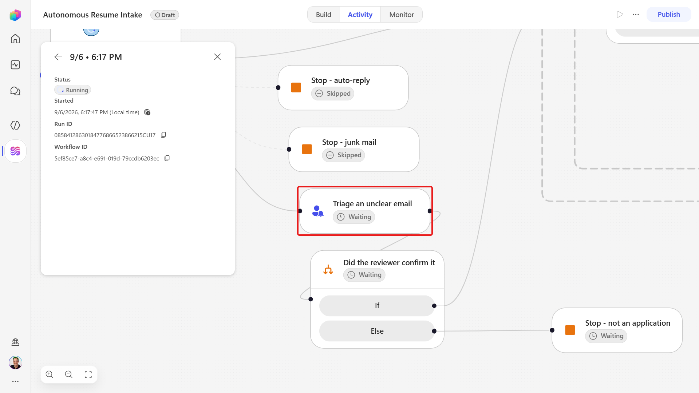

1. Open the mailbox you entered in **Assigned to** and find the *Request information* email. Check **Focused**, then **Other**, then **Junk**.

   The card shows your **Title**, the **Message** with the sender and subject filled in, the heading **Yes/No**, two radio buttons and a **Submit** button.

1. Select **No**, then select **Submit** on the card.

   Use the card's own **Submit** control - replying to the email does not resume the run. If the buttons do nothing, select **Show content** first. The card is replaced by *"Your response has been successfully submitted."*

1. Return to the **Activity** tab and open the same run. Within a couple of minutes it finishes **Succeeded**, with **Triage an unclear email** and **Stop - not an application** both green, and **Process application** and everything inside it **Skipped**.

   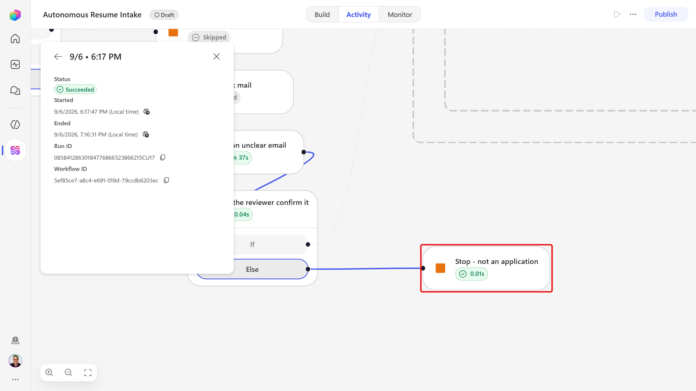

1. Open **Resumes** in the Hiring Hub and confirm no new row was created.

#### Now answer Yes

1. On the **Activity** tab select **Select runs**.

1. Tick **only** the run you just finished.

1. Confirm the command reads **Resubmit 1 selected run**, then select it.

   Resubmit replays the original trigger payload, attachments included, against the currently published definition - so you are testing the same email a second time.

   

1. Wait for the new **Request information** card to arrive in the reviewer's mailbox.

1. Select **Yes** on the card, then select **Submit**.

1. Open the new run in **Activity**. This time **Stop - not an application** is **Skipped** and **Process application** runs the full pipeline: the resume is filed, the Hiring Agent matches it, and the Teams card is posted.

   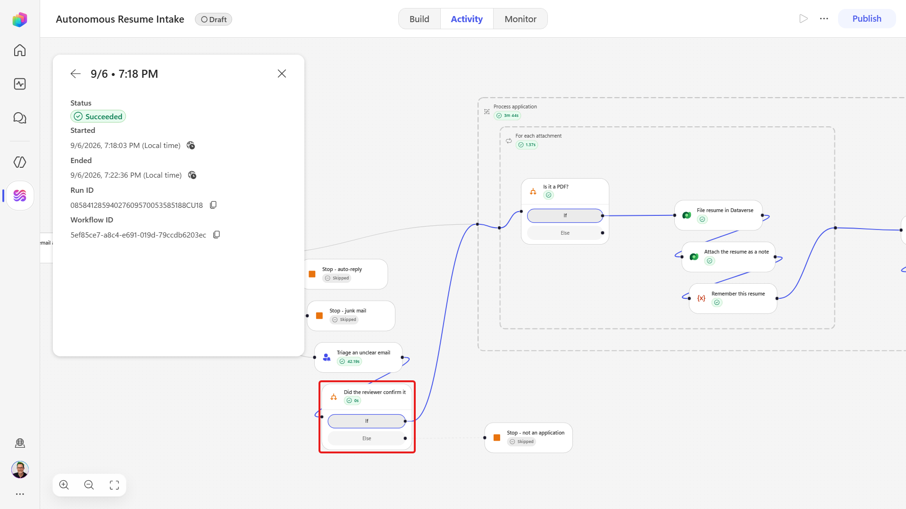

1. Select **Did the reviewer confirm it** and read its **Inputs**. They should read `{ "expressionResult": true }`.

   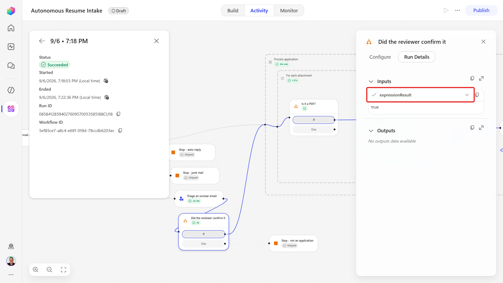

### 9.4 Let the agent ask for help itself

The fixed **Triage an unclear email** human request form handles a situation we can name before the workflow runs. Role ambiguity is different, because the workflow has already filed the PDF, and the matcher must compare that evidence with the open roles in Dataverse before it knows whether another person is needed. The existing **Match to an open role** agent node from Mission 07 owns that decision.

1. Inside **Process application**, select **Match to an open role**.

   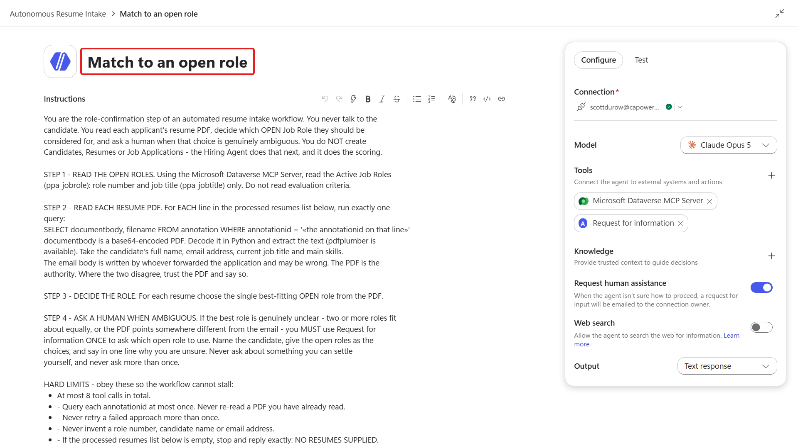

1. Scroll down the panel and toggle **Request human assistance** on.

   Its **Request for information** tool lets the same grounded matcher pause only when two roles fit closely, the PDF is unreadable, or the evidence conflicts.

   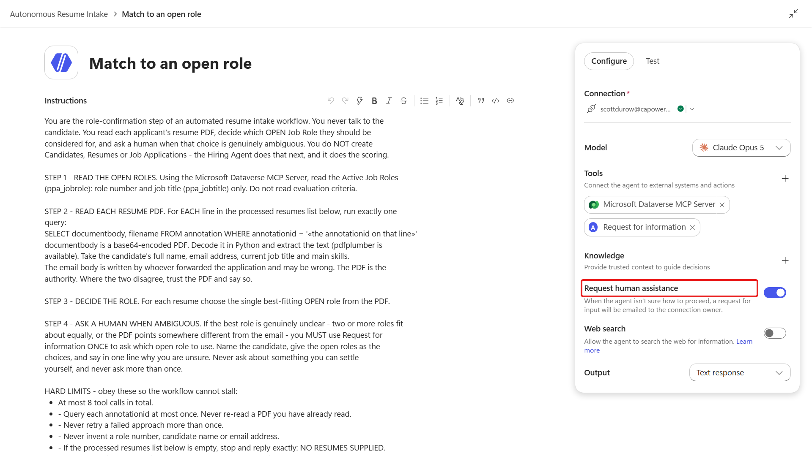

1. Read the instructions and confirm they tell the matcher to return one role when the evidence is clear, and to ask for one role when it is not.

1. Select **Save**, then **Publish**.

Next we exercise the path where the matcher asks for help itself.

1. Send an email to the monitored mailbox with `Application` in the subject and a resume PDF whose experience fits **more than one** open role.

   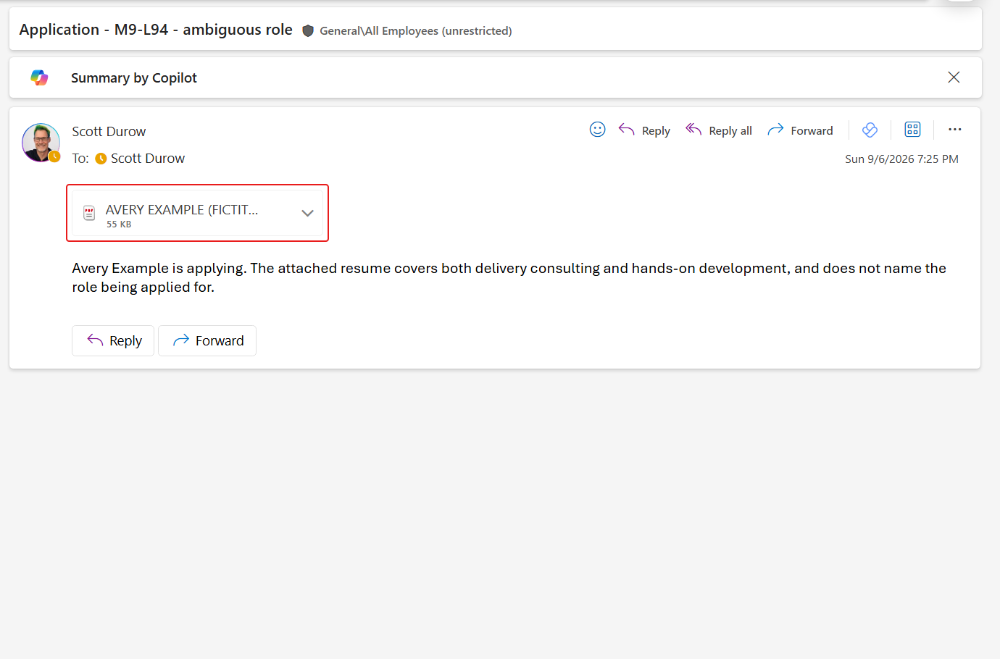

1. Open the **Activity** tab and select the new run. **Match to an open role** reads **Running**, and every action after it reads **Waiting**.

   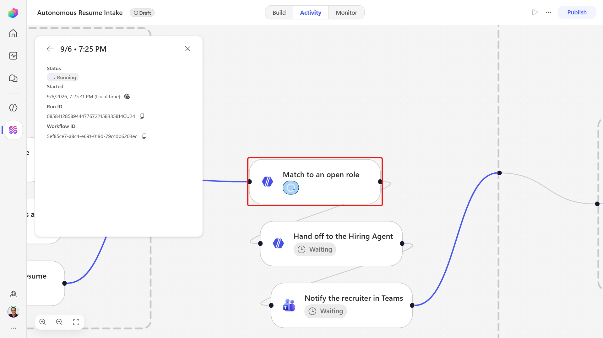

1. Open the mailbox you assigned the reviewer, find the newest **Which open role for candidate...** card, choose one **Job Role**, then select **Submit**. The card replaces its form with a confirmation once your answer is in.

   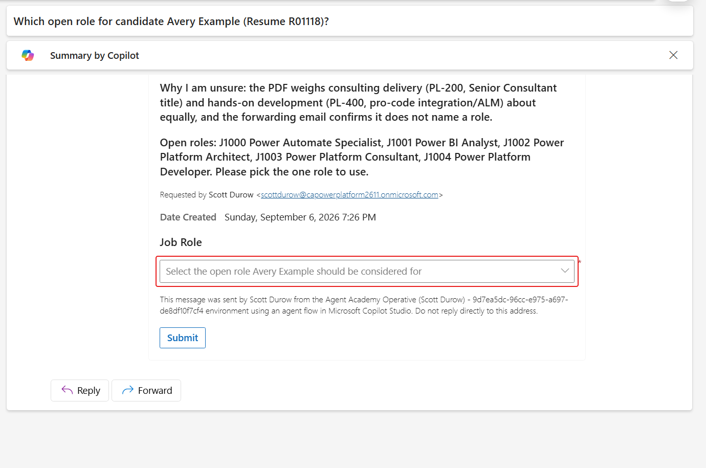

1. Return to the **Activity** tab and confirm the matcher resumed with that answer, and that **Hand off to the Hiring Agent** then created and scored the application.

   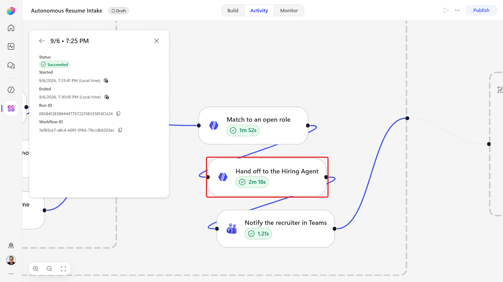

That run shows the second kind of human involvement. Nothing on the canvas told the workflow to ask - **Match to an open role** compared the PDF against the open Job Roles, found more than one that fitted, and raised the question itself. The run waited at that node until you answered, then carried on into **Hand off to the Hiring Agent** with the role you chose.

### 9.5 Catch a failed run and raise an alert

Right now the **Application** branch has nowhere to go when a step fails. Dataverse refuses a write, the branch stops, and nobody is told.

The fix is a **try/catch**. You already have the *try*: the **Process application** Scope you built in [Mission 07](../07-workflow-trigger/index.md#lab-07-build-the-autonomous-intake), a box drawn around the work that might fail. Now you add the *catch* - a second Scope that runs **only if the first one failed**, posts a message to Teams, and marks the run **Failed**.

Because a Scope reports **Failed** if *any* action inside it fails, this one catch covers the row write, the PDF upload, the agent call and the Teams card.

First, look at the settings the connector already gives you. Every action has its own **Settings** panel, which you open from the node's more options menu.

1. On the canvas, select the **File resume in Dataverse** node.

   

1. At the top of its panel select the more options menu, then **Settings**. The panel is headed **‹ Settings** and every section is already open: **Networking**, **Run after**, **Security** and **Tracking**.

1. Read the **Networking** section without changing anything:

   | Setting | What you should see | What it means |
   | --- | --- | --- |
   | **Retry policy** | **Default** | Transient failures are already retried for you. |
   | **Timeout (ISO-8601)** | **PT1H** | An hour is the ceiling this action is given before it is abandoned. |
   | **Pagination** | off | Only fetches the first page of results. |
   | **Async pattern** | on | Long-running calls are polled until they finish. |

   The connector already supplies a retry policy and a one-hour timeout, so leave both at their defaults for this workflow.

   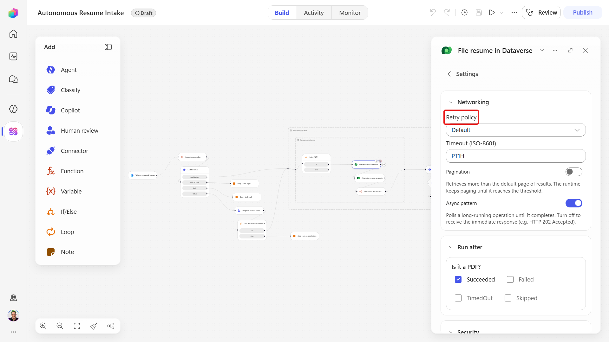

1. Select the **‹** chevron next to **Settings** to go back to the node panel.

1. On the canvas, hover the **Process application** container and select the **➕** on its right-hand edge, labeled **Add a step after Process application**.

   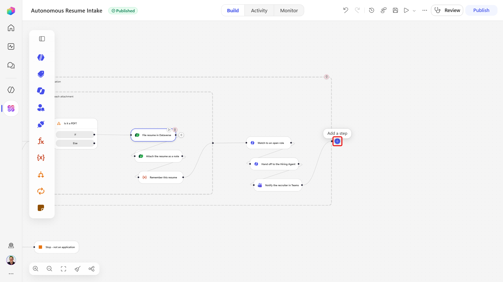

1. In the **Add** dialog, scroll the **Actions** group down past **If/Else**, **Switch** and **Loop**, and select **Scope**.

   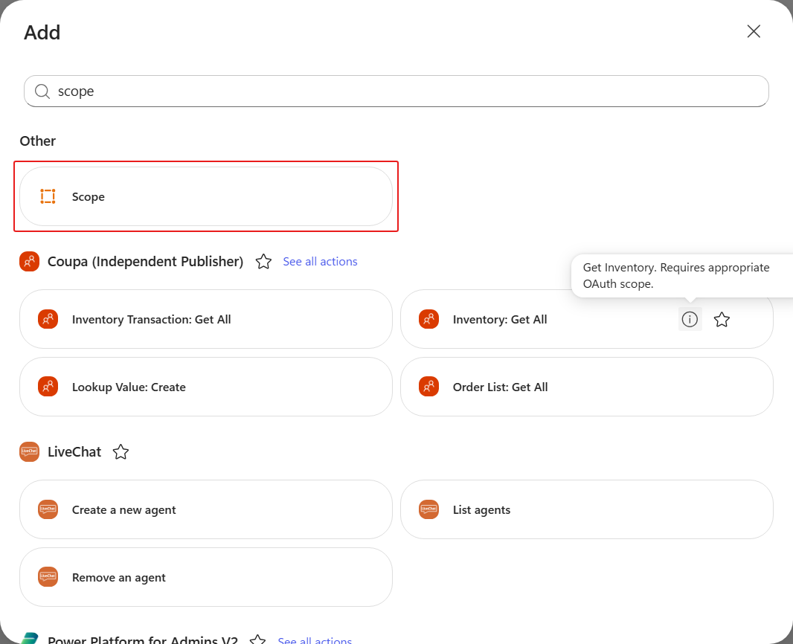

1. Select the name **Scope** at the top of the panel, rename it to `Handle failure`, and press **Enter**.

   The **Application** branch now reads **Process application** → **Handle failure**, with the second box empty.

   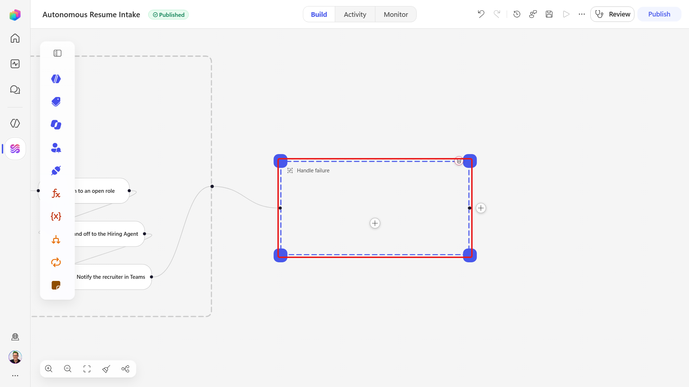

1. Put the alert inside the catch. Hover the **Handle failure** container and select the **➕** labeled **Add a step inside Handle failure**.

1. In the **Add** dialog's search box, type `post message`.

1. Under the **Microsoft Teams** heading, select **Post message in a chat or channel**.

1. Rename the node to `Alert - filing failed` - select the catalog name at the top of the panel, type the new name and press **Enter**.

1. Fill in the node as follows.

   | Field | Value |
   | --- | --- |
   | **Post as** | **Flow bot** *(leave as-is)* |
   | **Post in** | **Chat with Flow bot** |
   | **Recipient** | your own account |
   | **Message** | `ALERT: Resume filing failed - review the run in Activity` |

1. Select **Save**. **Handle failure** now contains a single step, **Alert - filing failed**.

1. Make the catch run only on failure. On the canvas select the **Handle failure** container, choose the more options menu, then **Settings**.

1. Find the **Run after** section. The **first** card is headed **Process application** - the step that runs before this one. Edit only this card. A **second** card underneath is headed **Alert - filing failed**, which is the alert step *inside* this scope.

1. Set the four states on the **Process application** card as follows, so the alert fires only when something inside **Process application** breaks.

   | State | Setting |
   | --- | --- |
   | **Succeeded** | clear the checkbox *(it’s selected by default)* |
   | **Failed** | tick |
   | **TimedOut** | tick |
   | **Skipped** | leave it cleared |

   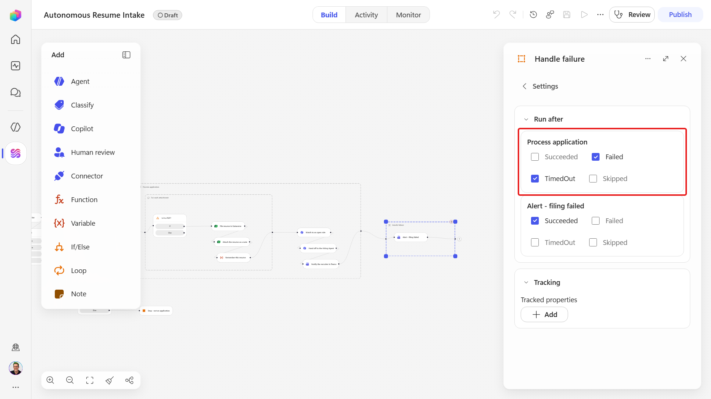

1. Select the **‹** chevron next to **Settings**, then select **Save** and **Publish**.

Keep the catch as the **last** step on the branch. A step that runs after a **skipped** step is skipped too, so on a healthy run - where **Handle failure** is skipped - anything placed after it would be skipped as well, and the run would still report **Succeeded** while doing nothing at all. If you ever do need a step after a catch, open its **Run after** and tick **Skipped** as well as **Succeeded**, which is the *finally* half of the pattern.

1. Catching the error is only half the job. You still want the run **recorded** as a failure, so it shows up in the Activity list, in run-history filters and in any monitoring built on run status.

   On the canvas, select **➕ Add a step after Alert - filing failed** - so the alert is sent *first*, and the run ends *after* it.
1. In the **Add** dialog, under **Actions**, select **End**. The node is called **End**, not *Stop* or *Terminate* - searching for `terminate` returns only unrelated third-party connector actions.

   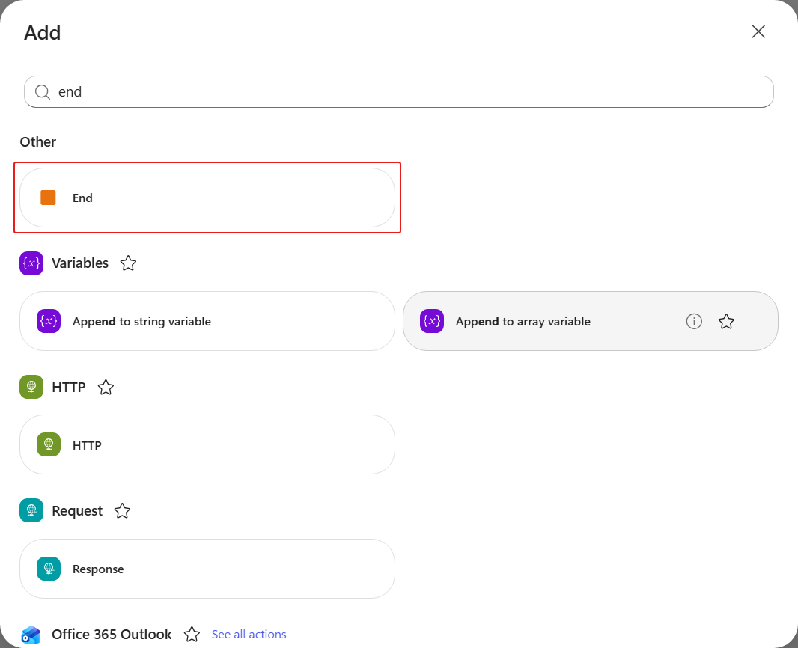

1. Fill in the node as follows.

   | Field | Value |
   | --- | --- |
   | **Run status** | **Failed** - the field is labeled **Run status**, not *Status*, and offers **Succeeded**, **Cancelled** and **Failed** |
   | **code** | `ResumeIntakeFailed` - a short, easy-to-search, machine-readable label |
   | **message** | The block below - include the offending email so the failure identifies itself without anyone opening the run |

   ```text
   The Autonomous Resume Intake workflow could not complete the Process
   application scope for the
   email from @{triggerOutputs()?['body/from']} with subject '@{triggerOutputs()?['body/subject']}'.
   A recruiter alert has been sent. Open this run and check the per-action
   statuses inside Process application to find the failing step.
   ```

   The **code** and **message** boxes appear only once **Run status** is **Failed**. Neither of the other two statuses represents a fault, so neither takes error detail.

   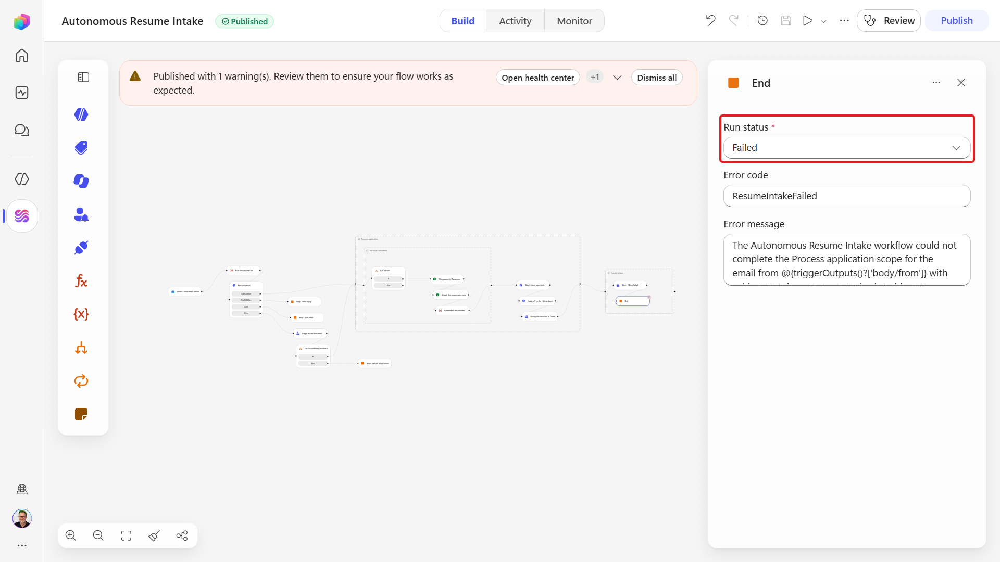

1. **Save** and **Publish**.

Now test the catch. You need a step inside **Process application** to fail while the workflow is running, so next you break the **Resume Title** expression on **File resume in Dataverse**.

1. Inside **Process application**, select the **File resume in Dataverse** node.

   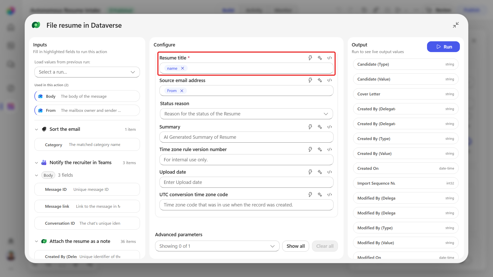

1. In **Resume Title**, remove the **Name** token, then select **Switch to expression mode** (`</>`).
1. Enter the following expression and confirm it with **Add** or **Update**:

   ```text
   substring(triggerOutputs()?['body/subject'],0,850)
   ```

   The designer cannot know the subject's length in advance, so the expression saves and publishes. At runtime a short subject cannot supply an 850-character substring. The filing action fails with `InvalidTemplate` before its Dataverse connector call begins.

1. Select **Save**, then **Publish**. The header changes from **Draft** to **Published**.

   If it stays on **Draft**, open the health center - something else is still unresolved.

1. Email the monitored mailbox with a short subject beginning with `Application`, a one- or two-sentence body, and a resume **PDF attached**. Use `Application - J1003` as the subject, and write the body as a genuine application - for example, `Avery Example is applying for J1003 Power Platform Consultant. The attached PDF is the authoritative resume.`

   The attachment is required because **Only with Attachments** is on - an email without a file never starts a run.

   Do not describe the email as a test in the subject or body. **Sort the email** classifies what you write, and a body that announces itself as a test is classified as `Other`, which no branch handles - the run then sits on **Running** indefinitely instead of failing. The failure this lab is teaching comes from the expression above, not from the wording.

1. Wait for the trigger to poll, then open **Activity** and select the newest run. The verified test completed in **16 seconds**.

   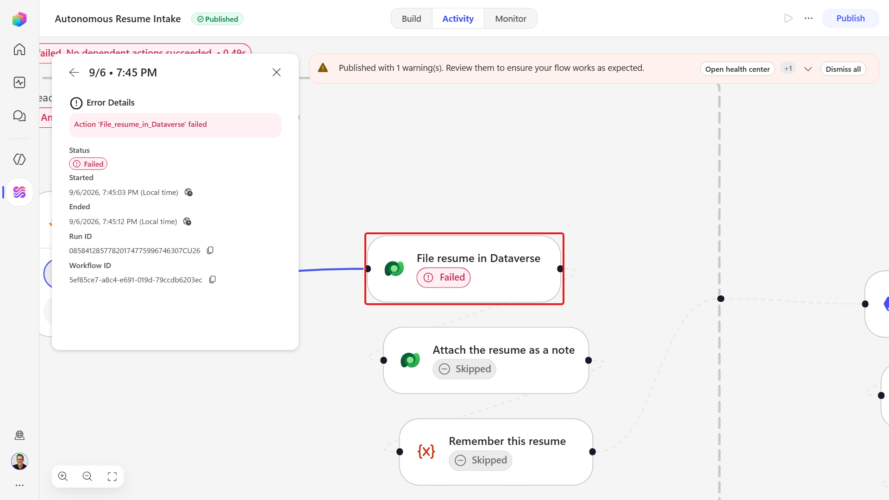

1. Read the node statuses. **Process application** and **File resume in Dataverse** are **Failed**, while **Alert - filing failed** and **End** are **Succeeded**.

   The containing **Handle failure** scope reads **Cancelled**, not Succeeded, because the **End** action terminates its own container after creating the alert.

1. Select the failed **File resume in Dataverse** node and open **Run Details**.

   It shows `InvalidTemplate` and explains that the `substring` parameters are out of range. **Inputs** and **Outputs** both say *No data available*, because expression evaluation failed before the connector ever received an input.

   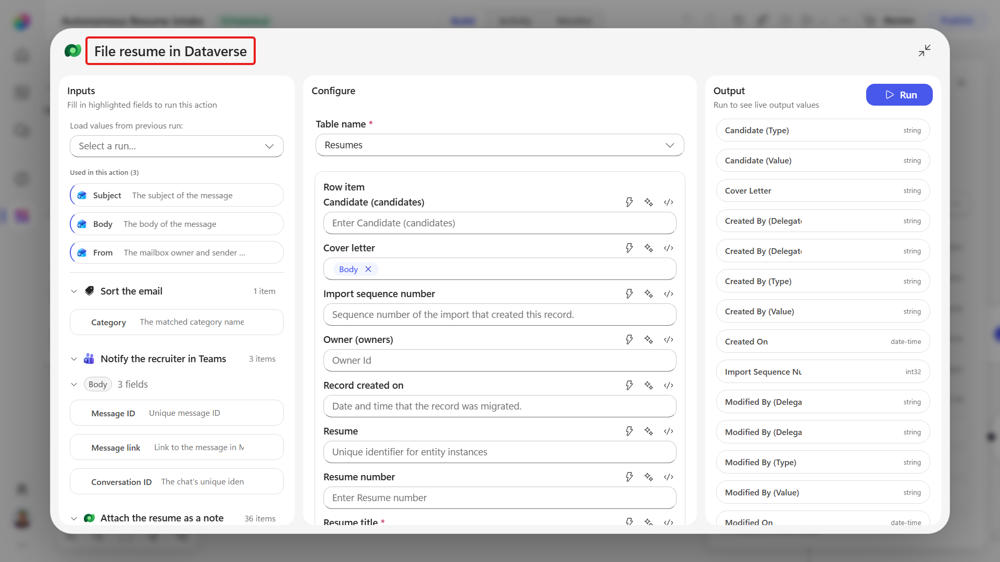

1. Check Teams. The **Flow bot** chat now carries the message *ALERT: Resume filing failed - review the run in Activity*.

Now undo the break.

1. Inside **Process application**, select **File resume in Dataverse** again.

1. In **Resume Title**, remove the **substring** expression and re-insert the **Name** token.

   That is the *attachment's file name* from the loop's current item, not the email **Subject**. After a clean run the column should read exactly `AVERY EXAMPLE (FICTITIOUS).pdf`.

1. Select **Save**, then **Publish**.

> [!NOTE] Turning the workflow off when you are done with it
> Leave the workflow **Published** for now - Mission 10 uses it. A published workflow keeps polling the
> mailbox, so when you no longer need it running, open the **Workflows** list, hover the **Autonomous
> Resume Intake** row, select the more actions menu and choose **Turn off**. Its **Status** then reads
> **Draft**, and selecting **Publish** starts it again.

## ✅ Mission Complete {#mission-complete}

Mission 09 is complete. Your workflow now pauses for a person when it should, names every step, and tells someone when a write fails.

You can now:

✅ **Human oversight**: You added fixed and agent-generated review requests before the workflow acts.

✅ **Readable automation**: You named each node so the canvas and run history explain the process.

✅ **Failure handling**: You used a **Scope** and **Run after** condition to surface failed writes.

✅ **Observability**: You broke a step on purpose, read the run details, and confirmed the alert it raised.

⏭️ [Move to **Schedule Interviews with Work IQ** mission](../10-work-iq-scheduling/index.md)

## 📚 Tactical Resources {#tactical-resources}

🔗 [Workflows in Copilot Studio](https://learn.microsoft.com/microsoft-copilot-studio/workflows-experience/flows-overview)

🔗 [Error handling and retry policies](https://learn.microsoft.com/azure/logic-apps/error-exception-handling)

🔗 [Adaptive Cards](https://adaptivecards.io/)

<analytics-tag section="operative-nextgen" mission="09-human-oversight" />
