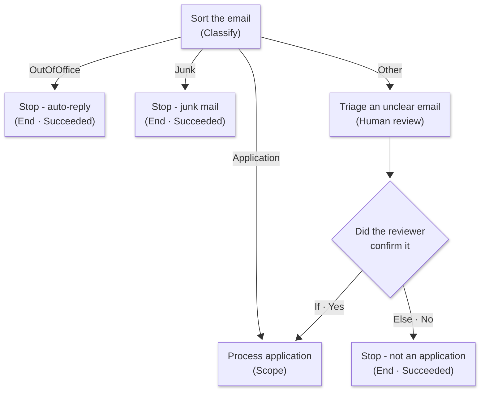

---
prev:
  text: "Add Agents to a Workflow"
  link: "/operative-nextgen/08-workflow-agents"
next:
  text: "Schedule Interviews with Work IQ"
  link: "/operative-nextgen/10-work-iq-scheduling"
hide: true
preview: true
short-description: Add human review, alternate-flow handling, observability, and regression testing to the autonomous intake workflow
difficulty: 3
codename: OPERATION FAIL-SAFE
time: 60
tags:
  - automation
  - compliance
products: [copilot-studio, dataverse, outlook, teams]
industries:
  - hr
created-date: 2026-07-26
last-edited-date: 2026-08-12
---

# 🚨 Mission 09: Human Oversight and Handling Alternative Flows {#mission-09-human-oversight-and-handling-alternative-flows}

<mission-meta />

## 🎯 Mission Brief {#mission-brief}

Welcome back, Agent. In the previous two missions you built a workflow that files resumes, asks the Hiring Agent to match them, and notifies recruiters in Teams. It works, but it cannot yet ask for help or report a failure.

In this mission you'll add human review for uncertain decisions, make failed runs visible with a try/catch pattern, and exercise each route with a regression pass.

## 🔎 Objectives {#objectives}

In this mission, you'll learn:

1. How to pause for human review, branch on the answer, and end inactive routes cleanly
1. How to verify that the role-matching agent asks for help only when its evidence is ambiguous
1. How to catch failures with a **Scope** and **Run After** condition and raise an alert
1. How to inspect runs, complete a regression pass, and turn a workflow on and off

## 🧠 Handling alternate flows {#handling-alternate-flows}

Everything you have built so far is the **happy path**, where the mail arrives carrying a readable PDF and the agent has enough evidence to match it to a role. Real workflows often run off that path.

Handling those alternate flows takes two different techniques, depending on which kind of logic went wrong:

| Deterministic logic | Probabilistic logic |
| --- | --- |
| Writing a row, uploading a file, posting a card | Classifying an email, matching a resume to a role |
| Retry the transient fault, mark the run failed, then alert a human | Ask a human *before* acting when the evidence is ambiguous |
| You test it by **breaking it on purpose** | You test it by **feeding it awkward inputs** |

This mission builds a route to handle each of these alternative flows to ensure that the hiring data consistency is preserved.

> [!INFO] Covered in Recruit
> **Human review** appears in the node palette in [Recruit Mission 07: Automate with Workflows](../../recruit-nextgen/07-automate-with-workflows/index.md#how-workflows-work) but is never configured there. This mission sets one up, decides what it asks, and routes what comes back.

## 🧪 Lab 09 - Handle the alternate flows {#lab-09-handle-the-alternate-flows}

### Prerequisites

Before you start this lab you need:

- The **Autonomous Resume Intake** workflow from Missions [07](../07-workflow-trigger/index.md) and [08](../08-workflow-agents/index.md), **published** and filing resumes successfully. Everything here is added on top of it.
- The **Hiring Hub** app and the **Resumes**, **Job Applications** and **Tasks** tables in Dataverse
- A **test mailbox you control** - never a shared or production inbox
- The test resume PDFs you used in Mission 08 (for example `AVERY EXAMPLE (FICTITIOUS).pdf`)

> [!IMPORTANT] Your workflow is still watching the mailbox
> If you left the workflow **Published** at the end of Mission 08, it is still polling that mailbox and
> will run on any email matching its **Subject Filter**. This mission needs those live runs, so leave it
> on - but check that the mailbox is a test one you control, and finish Lab 9.9 to turn the workflow
> off before you leave it.

The workflow you carried in from Mission 08 needs a defined response to uncertainty and runtime failure before it can watch a mailbox unattended. Let's add both paths, inspect their run history, exercise the route matrix, and then decide whether the trigger should remain active.

### 9.1 Ask a human when the email is ambiguous

We will now handle the emails that do not route cleanly, where the **Classify** node routes to **Other**, the resume is **unreadable**, or the Hiring Agent **can't confidently pick a role**. In each of these cases we will **pause and ask a person** with a **Human review** node.

You end up with two ways to involve a human, and the difference is *who decides that a human is needed*:

| | **Human review** node (this lab) | **Request for information** (inline agent, [Mission 08](../08-workflow-agents/index.md)) |
| --- | --- | --- |
| Who decides to ask | **You** - it is a step on a branch | **The agent**, mid-reasoning |
| Fires | every time that branch runs | only when the agent judges the evidence ambiguous |
| Question wording | fixed, written by you | written by the agent for that specific case |
| Best for | a known category ("we can't classify this") | a judgment call you can't enumerate up front |

Use the node when you can *name* the situation in advance, and the agent's request when you cannot - which is exactly why Avery's contradictory *Data Analyst* email triggers a question while Taylor's resume maps directly to Power Platform Developer from its role history, PL-400 and pro-code skills. An agent that asks every time has moved the work back to you.

> [!IMPORTANT] Where the approval request lands
> Both mechanisms email you an actionable card, but Focused Inbox does not place it consistently. Check
> **Focused**, **Other** and **Junk** before concluding anything is stuck, because the run is
> **waiting** and it will wait indefinitely. If the card's buttons do nothing select **Show content**
> first - Outlook blocks the card's scripts until you do.

<!-- Separate adjacent callouts for Markdownlint. -->
**A waiting agent looks like a silent one.** An agent step publishes its activity log only once it **completes**, so an agent that is waiting on a
human shows nothing at all. Do not cancel the run to "see what it's doing" - cancelling destroys the
log you would need to diagnose it. Give it the answer it is waiting for instead.

1. On the canvas, find the **Other** branch under the **Sort the email** node and select the **➕** button labeled **Add a step after Other**.

   

1. In the **Add** dialog, under **Actions**, select **Human review**.

   The node is added straight away - there is no second list of options to choose from.

   

1. Select the new node to open its panel.

   The **Connection** box reads **Human review** with a green tick and the word **Connected**. This connector is created for you the first time you use the node.

   

1. Rename the node to `Triage an unclear email` - select the name at the top of the panel, type the new name and press **Enter**.

   The rest of the mission refers to the node by that name, and its compiled identifier becomes `Triage_an_unclear_email`.

   

1. In **Title**, enter `Review flagged application`. This is the subject line the reviewer sees.

   

1. In **Assigned to (first to respond)**, start typing your name or email address, then **select yourself from the results**.

   Confirm your name appears as a chip with your initials. Typing an address without selecting it from the list leaves the field empty.

   

1. Leave **Channel** set to **Outlook** - it is already the default.

   

1. Select **➕ Add an input**, then choose **Yes/No** from the **Choose the type of user input** menu.

   

1. Select the box next to the type and replace the placeholder with `Is this an application?`

   

   > [!IMPORTANT] An input's type is fixed
   > The type drop-down list looks editable, but switching it does not re-type the underlying input. If you
   > choose the wrong type, **delete the input row and add a new one**. **Delete** lives on the row's
   > the more options menu - and for **Text** inputs only, so does **Add dropdown**, if you want to offer a fixed
   > list of answers.

1. Build the **Message** in four parts:

   1. Type the opening sentence, stopping where the first token goes:

      ```text
      An email arrived that could not be classified. It came from
      ```

   1. Select ⚡ **Insert dynamic content** and choose **From**.
   1. Type ` with the subject ` (with a space each side), then select ⚡ **Insert dynamic content** and choose **Subject**.
   1. Type the rest of the message, including the actual question:

      ```text
      . Please tell us how to handle it. Is this an application that should be
      processed? Choose Yes to file the attached resume, or No to ignore this
      email.
      ```

   The Message box now reads as one paragraph with **From** and **Subject** shown as two small blue chips inside the text.

   

1. On the command bar select **Save**.

   

### 9.2 Route the answer and end the dead branches

Right now the reviewer's answer is recorded and then thrown away - the run ends either way. We will now branch on the answer so that **Yes** files the resume through the same pipeline the **Application** branch uses, and **No** stops the run.

1. On the **Other** branch, hover the **Triage an unclear email** node and select the **➕** labeled **Add a step after Triage an unclear email**.

   

1. In the **Add** dialog, under **Actions**, select **If/Else**.

   

1. Select the new node, select its name at the top of the panel, and rename it to `Did the reviewer confirm it`. Press **Enter**.

   

1. Fill in the condition as follows.

   | Field | Value |
   | --- | --- |
   | **Property** | Select ⚡ **Insert dynamic content** and choose the **Yes/No** output of **Triage an unclear email** |
   | **Operator** | **Equals** *(leave as-is)* |
   | **Value** | `Yes` |

   

   > [!IMPORTANT] Enter Yes, not true
   > The output is *named* **Yes/No**, and the designer accepts a comparison against the boolean
   > `true`. It looks right and publishes cleanly, but at runtime the node returns the **string**
   > `"Yes"` or `"No"`, so `equals(..., true)` is **always false** - including when the reviewer
   > answered Yes. Nothing errors, but the branch never fires and nothing tells you why. After a run,
   > the step's **Outputs** read `{ "boolean": "Yes", ... }`, and the quotes
   > mean text.

1. Now join the **If** lane to the work that already exists. Drag from the **output handle** on the right-hand edge of the **Did the reviewer confirm it** node onto the left-hand edge of the **Process application** scope, so a new connector is drawn between them.

   

1. Look at where **Process application** now sits. It is no longer drawn inside the **Application** branch - it moves onto the main line after **Sort the email**, and **two** connectors feed it: one from the **Application** branch and one from **Did the reviewer confirm it**.

   One copy of the filing pipeline is now reachable from two routes.

   

Merging two routes into one scope has a side effect worth understanding before you make the change.

> [!IMPORTANT] What the merge does to the other branches
> `Process application` now sits *after* the Classify node, so it runs whenever the switch completes -
> no matter which branch was taken. The compiler notices that **OutOfOffice** and **Junk** have no path
> to that merge and injects a hidden terminate step into each one, with run status **Failed** and the
> error `PartialJoinNotReached ... (code: CROSS_SCOPE_MERGE)`. An out-of-office reply would no longer
> be "read and ignored" - it would mark the whole run **Failed**. The same applies to the **Else** lane
> you are about to use for "No". The fix is to end those branches **deliberately**, with an **End**
> node, so the run stops cleanly before it ever reaches the merge.

1. Hover the **Did the reviewer confirm it** node and select the **➕** labeled **Add a step after Else**.

   

1. In the **Add** dialog, type `End` in the search box and select **End** - it is listed on its own under the **Other** heading, above similarly named connectors.

   
1. Leave **Run status** set to **Succeeded** - the default. Nothing went wrong, there was simply nothing to do.

   

1. Rename the node to `Stop - not an application`.

   

1. Repeat those four steps twice more, on the **OutOfOffice** branch naming the node `Stop - auto-reply`, and on the **Junk** branch naming it `Stop - junk mail`. Leave the **Application** branch and the **If** lane empty - both of those are *meant* to fall through to **Process application**.

1. On the command bar select **Save**, then **Publish**. The canvas now carries all three Stop nodes on their dead branches.

   

All four branches now have somewhere to go:



### 9.3 Test both review answers

Next we answer **No** and watch the run stop, then we replay that run, answer **Yes**, and watch it continue into the filing pipeline.

#### Answer No

1. Send the monitored mailbox an email with `Application` in the subject, **a PDF attached**, and a body that is clearly *not* an application:

   ```text
   Hi there, I am not applying for anything today. I just wanted to ask how long
   your recruitment process usually takes, and whether you accept speculative
   CVs. I have attached a document only so you can see the format we use. No
   action needed.
   ```

   The trigger fires only on mail **with** attachments, so a bare text email never starts a run at all.

1. Open the **Activity** tab and select the running item. **Triage an unclear email** shows **Waiting**, and the actions after it show **Waiting** too because they are queued behind the review.

   The run stays in this state until a human answers the card. It is not stuck and it will not time out on its own.

   

1. Open the mailbox you entered in **Assigned to** and find the *Request information* email. Check **Focused**, then **Other**, then **Junk**.

   The card shows your **Title**, the **Message** with the sender and subject filled in, the heading **Yes/No**, two radio buttons and a **Submit** button.

1. Select **No**, then select **Submit** on the card.

   Use the card's own **Submit** control - replying to the email does not resume the run. If the buttons do nothing, select **Show content** first. The card is replaced by *"Your response has been successfully submitted."*

1. Return to the **Activity** tab and open the same run. Within a couple of minutes it finishes **Succeeded**, with **Triage an unclear email** and **Stop - not an application** both green, and **Process application** and everything inside it **Skipped**.

   

1. Open **Resumes** in the Hiring Hub and confirm no new row was created.

#### Now answer Yes

1. On the **Activity** tab select **Select runs**.

1. Tick **only** the run you just finished.

   **Select runs** ticks every run by default, so clear any others before continuing.

1. Confirm the command reads **Resubmit 1 selected run**, then select it.

   Resubmit replays the original trigger payload, attachments included, against the currently published definition - so you are testing the same email a second time.

   

1. Wait for the new **Request information** card to arrive in the reviewer's mailbox.

1. Select **Yes** on the card, then select **Submit**.

1. Open the new run in **Activity**. This time **Stop - not an application** is **Skipped** and **Process application** runs the full pipeline: the resume is filed, the Hiring Agent matches it, and the Teams card is posted.

   

1. Select **Did the reviewer confirm it** and read its **Inputs**. They should read `{ "expressionResult": true }`.

   

### 9.4 Let the agent ask for help itself

The fixed **Triage an unclear email** human request form handles a situation we can name before the workflow runs. Role ambiguity is different, because the workflow has already filed the PDF, and the matcher must compare that evidence with the open roles in Dataverse before it knows whether another person is needed. The existing **Match to an open role** agent node from Mission 07 owns that decision.

1. Inside **Process application**, select **Match to an open role**.

   

1. Confirm its **Microsoft Dataverse MCP Server** tool is still present.

   The node uses it to read the open Job Role records, rather than relying on role names copied into its prompt.

   

1. Scroll down the panel and confirm **Request human assistance** is on.

   Its **Request for information** tool lets the same grounded matcher pause only when two roles fit closely, the PDF is unreadable, or the evidence conflicts.

   

1. Read the instructions and confirm they tell the matcher to return one role when the evidence is clear, and to ask for one role when it is not.

1. Select **Save**, then **Publish**.

Next we exercise the path where the matcher asks for help itself.

1. Send an email to the monitored mailbox with `Application` in the subject and a resume PDF whose experience fits **more than one** open role.

   

1. Open the **Activity** tab and select the new run. **Match to an open role** reads **Running**, and every action after it reads **Waiting**.

   

1. Open the mailbox you assigned the reviewer, find the newest **Which open role for candidate...** card, choose one **Job Role**, then select **Submit**. The card replaces its form with a confirmation once your answer is in.

   

1. Return to the **Activity** tab and confirm the matcher resumed with that answer, and that **Hand off to the Hiring Agent** then created and scored the application.

   

Read the canvas back.

You named each node as you added it in Mission 07, so the canvas already reads as a sentence - *sort the email → file the resume → for each attachment → is it a PDF? → attach the resume as a note → match to an open role → hand off to the Hiring Agent → notify the recruiter*. Compare that with the catalog names it would otherwise carry - **Add a new row**, **Apply to each**, **If/Else**, **Agent**, **Agent 2**, **Variable** - and it is obvious why the naming happened first.

A node's name **is** its identifier, and every expression in these two missions is written against those names. The designer rewrites dynamic-content **chips** when you rename, but a hand-typed **expression** is a different matter - `outputs(...)`, `body(...)`, `variables(...)`. If you do rename something later, check that no node shows a *Needs setup* warning and read the affected expressions to confirm they point at the new name.

The canvas layout deserves the same discipline. Keep each execution lane flowing left to right, with the later card starting beyond the earlier card's right edge. Place **Triage an unclear email** and **Did the reviewer confirm it** side by side on the **Other** lane, then place the shared **Process application** scope to their right. Both the **Application** branch and the reviewer's **If** lane now enter that one scope without either connector doubling back.

The downstream application steps form another horizontal lane inside **Process application**. Place **Match to an open role** to the right of **For each attachment**, then continue through the Hiring Agent, URL lookup, variable, and Teams notification. Keep **Handle failure** to the right of **Process application** on its separate failure edge. **Tidy up and organize nodes** can reset the graph, but it does not understand this merge, so read the execution direction again after using it.

Dragging has two real hazards. Edges are routed by the workflow's **logical order**, not by where you put the boxes, so a node dragged *backwards* past its predecessors ends up drawn to the left of steps that run before it and the picture contradicts the sequence. A drag can also **reparent** a node, which leaves the canvas still looking like a chain even though the node has lost its incoming connection and **Publish** refuses with *"references output of X, but X is not in its runAfter path"*. Fix it by dragging a new connection from the previous node's right-hand handle onto the orphan's left-hand handle - or, if a drag goes badly wrong, open **Version history** (the clock icon), find the last good version and choose the more options menu, then **Restore**.

**Publish greying out is normal.**

**Publish** is disabled whenever the draft already matches what is live. That is not an error, and it
is the usual state after you publish and then only move nodes around.

### 9.5 Catch a failed run and raise an alert

We now need to think about the ways that our workflow can go wrong and then handle the alternative flows:

| What can go wrong | What handles it | Where it's configured |
| --- | --- | --- |
| A connector action throws - Dataverse rejects a write, Teams rejects the card | **Scope** + **Run After** + **End(Failed)** | This lab |
| An expression resolves to nothing and a step silently receives an empty string | `coalesce(x, '')` at the point of use | [Mission 08](../08-workflow-agents/index.md#reading-an-agents-answer) |
| An agent loops, re-reads the same document, or never terminates | The **HARD LIMITS** block in its instructions | [Mission 08](../08-workflow-agents/index.md) Lab 8.1 |
| A tool call returns *Permission required* | The **Agents connection identity** and its Dataverse connection | [Mission 08](../08-workflow-agents/index.md#agents-connection-identity) |
| A run never starts at all | The trigger's **Subject Filter**, **Only with Attachments**, and its polling interval | [Mission 07](../07-workflow-trigger/index.md#lab-07-build-the-autonomous-intake) |
| Two published copies of the workflow both act on one email | Turning the older copy off | [Mission 07](../07-workflow-trigger/index.md#lab-07-build-the-autonomous-intake) Lab 7.6 |

Only the first row is a runtime *fault* in the sense this lab means. The Application branch currently has no path for one, so a rejected write stops the branch. Add a **Handle failure** Scope that raises an alert and ends the run as **Failed**, making the fault visible in run history and status-based monitoring.

> [!IMPORTANT] Why a catch alone isn't enough
> As soon as **Handle failure** catches an error, the run has *handled* it - so the run's own status
> becomes **Succeeded**, even though a step inside it failed and the work never finished. In a real
> example from this workflow the Teams card failed, **Process application** went to *Failed*, **Handle
> failure** ran and succeeded, and the **run** was reported **Succeeded**. Every application had been
> created but nobody was ever told - and the run does not appear in any "failed runs" filter, so no
> alert or monitoring rule would surface it. You fix that further down with an **End** node. Until
> then, open the run and check the **per-action** statuses as well as the run header.

A workflow that files applicants must never drop one without telling anyone. In this lab you complete the **try/catch** pattern you started in [Mission 07](../07-workflow-trigger/index.md#lab-07-build-the-autonomous-intake): the **Process application** Scope is the *try*, and you now add a **Handle failure** Scope as the *catch*. Then you trigger a rejected write and confirm that the catch creates its alert.

Every action has its own **Settings** panel, which you open from the node's more options menu.

1. On the canvas, select the **File resume in Dataverse** node.

   

1. At the top of its panel select the more options menu, then **Settings**. The panel is headed **‹ Settings** and every section is already open: **Networking**, **Run After**, **Security** and **Tracking**.

1. Read the **Networking** section without changing anything:

   | Setting | What you should see | What it means |
   | --- | --- | --- |
   | **Retry policy** | **Default** | Transient failures are already retried for you. |
   | **Timeout (ISO-8601)** | **PT1H** | An hour is the ceiling this action is given before it is abandoned. |
   | **Pagination** | off | Only fetches the first page of results. |
   | **Async pattern** | on | Long-running calls are polled until they finish. |

   The connector already supplies a retry policy and a one-hour timeout, so leave both at their defaults for this workflow.

   

1. In the **Security** section, turn on **Secure inputs** and leave **Secure outputs** off.

   The **inputs** carry the applicant's cover letter and personal details into Dataverse, so those are the ones worth protecting. The **outputs** are the created row's id and record number, which you need to be able to read in **Activity** when you check which row was written.

   

1. Select the **‹** chevron next to **Settings** to go back to the node panel.

   > [!IMPORTANT] What Secure inputs hides
   > The setting saves and persists correctly, but in this preview build a run made afterwards still
   > displayed the full **Resume Title**, **Source Email Address** and **Cover Letter** values in the
   > maker's own **Run Details** panel. **Secure inputs** does not guarantee that applicant data is
   > hidden from the maker's run panel in this build. Keep real candidate data out of a training
   > environment either way.

Now add the catch.

Back in [Mission 07](../07-workflow-trigger/index.md#lab-07-build-the-autonomous-intake) you wrapped the whole Application branch in a Scope called **Process application**. That is the *try* half of the pattern. Now you add the *catch* half, a second Scope that runs **only if the first one failed** and that holds the alert.

Because a Scope reports **Failed** if *any* action inside it fails, this catch covers the row write, PDF upload, agent call, and Teams card.

1. On the canvas, hover the **Process application** container and select the **➕** on its right-hand edge, labeled **Add a step after Process application**.

   Use the **after** button, not the **inside** one - a catch that lives inside the thing it is catching can never run.

   

1. In the **Add** dialog, scroll the **Actions** group down past **If/Else**, **Switch** and **Loop**, and select **Scope**.

   

1. Select the name **Scope** at the top of the panel, rename it to `Handle failure`, and press **Enter**.

   The **Application** branch now reads **Process application** → **Handle failure**, with the second box empty.

   

1. Put the alert inside the catch. Hover the **Handle failure** container and select the **➕** labeled **Add a step inside Handle failure**.
1. In the **Add** dialog's search box, type `add a new row`.
1. Under the **Microsoft Dataverse** heading, select **Add a new row**.
1. Rename the node to `Alert - filing failed` - select the catalog name **Add a new row** at the top of the panel, type the new name and press **Enter**.

   If it came in as *Add a new row 2*, the designer made it unique because an original still carries that name. Rename it anyway.

   

1. Fill in the node as follows, and leave every other column empty.

   | Field | Value |
   | --- | --- |
   | **Table name** | Type `Task` - three tables match, so select **Tasks** from the drop-down list list. Typing the name without selecting it leaves the column fields showing *Fill in dependent fields first*. |
   | **Subject** | `ALERT: Resume filing failed - review the run in Activity` |

   Once a table is chosen, every column on Tasks appears in alphabetical order and only **Subject** - marked with a red asterisk - is required.

   

1. Select **Save**. **Handle failure** now contains a single step, **Alert - filing failed**.

1. Make the catch run only on failure. On the canvas select the **Handle failure** container, choose the more options menu, then **Settings**.
1. Find the **Run After** section. The **first** card is headed **Process application** - the step that runs before this one. Edit only this card. A **second** card underneath is headed **Alert - filing failed**, which is the alert step *inside* this scope.
1. Set the four states on the **Process application** card as follows, so the alert fires only when something inside **Process application** breaks.

   | State | Setting |
   | --- | --- |
   | **Succeeded** | clear the checkbox *(it’s selected by default)* |
   | **Failed** | tick |
   | **TimedOut** | tick |
   | **Skipped** | leave it cleared |

   

1. Select the **‹** chevron next to **Settings**, then select **Save** and **Publish**.

Keep the catch as the **last** step on the branch. A step that runs after a **skipped** step is skipped too, so on a healthy run - where **Handle failure** is skipped - anything placed after it would be skipped as well, and the run would still report **Succeeded** while doing nothing at all. If you ever do need a step after a catch, open its **Run After** and tick **Skipped** as well as **Succeeded**, which is the *finally* half of the pattern.

1. Catching the error is only half the job. You still want the run **recorded** as a failure, so it shows up in the Activity list, in run-history filters and in any monitoring built on run status.

   On the canvas, select **➕ Add a step after Alert - filing failed** - so the alert is sent *first*, and the run ends *after* it.
1. In the **Add** dialog, under **Actions**, select **End**. The node is called **End**, not *Stop* or *Terminate* - searching for `terminate` returns only unrelated third-party connector actions.

   

1. Fill in the node as follows.

   | Field | Value |
   | --- | --- |
   | **Run status** | **Failed** - the field is labeled **Run status**, not *Status*, and offers **Succeeded**, **Cancelled** and **Failed** |
   | **code** | `ResumeIntakeFailed` - a short, easy-to-search, machine-readable label |
   | **message** | The block below - include the offending email so the failure identifies itself without anyone opening the run |

   ```text
   The Autonomous Resume Intake workflow could not complete the Process
   application scope for the
   email from @{triggerOutputs()?['body/from']} with subject '@{triggerOutputs()?['body/subject']}'.
   A recruiter alert has been sent. Open this run and check the per-action
   statuses inside Process application to find the failing step.
   ```

   The **code** and **message** boxes appear only once **Run status** is **Failed**. Neither of the other two statuses represents a fault, so neither takes error detail.

   

1. **Save** and **Publish**.

   

The order is deliberate: **End** stops the run *immediately* and skips every action after it, so it must be the last thing in the catch. Put it before **Alert - filing failed** and the run is correctly marked Failed, but the alert is skipped.

Now test the catch.

**Forcing the failure reliably.** Clearing **Resume Title** fails its design-time required-field check, and a very long literal fails
its design-time length check. Replacing **Name** with the email **Body** is unreliable for a different
reason: **Sort the email** must classify that long body before the filing action is reached, and the
Classify step can remain *Running* instead of reaching the catch. Use the short expression below. It
passes design-time validation, then fails predictably when the filing action evaluates it.

1. Inside **Process application**, select the **File resume in Dataverse** node.

   

1. In **Resume Title**, remove the **Name** token, then select **Switch to expression mode** (`</>`).
1. Enter the following expression and confirm it with **Add** or **Update**:

   ```text
   substring(triggerOutputs()?['body/subject'],0,850)
   ```

   The designer cannot know the subject's length in advance, so the expression saves and publishes. At runtime a short subject cannot supply an 850-character substring. The filing action fails with `InvalidTemplate` before its Dataverse connector call begins.

1. Select **Save**, then **Publish**. The header changes from **Draft** to **Published**.

   If it stays on **Draft**, open the health center - something else is still unresolved.

1. Email the monitored mailbox with a short subject beginning with `Application`, a one- or two-sentence body, and a resume **PDF attached**. Use `Application - catch test` as the subject.

   The attachment is required because **Only with Attachments** is on - an email without a file never starts a run.

1. Wait for the trigger to poll, then open **Activity** and select the newest run. The verified test completed in **16 seconds**.

   

1. Read the node statuses. **Process application** and **File resume in Dataverse** are **Failed**, while **Alert - filing failed** and **End** are **Succeeded**.

   The containing **Handle failure** scope reads **Cancelled**, not Succeeded, because the **End** action terminates its own container after creating the alert.

   

1. Select the failed **File resume in Dataverse** node and open **Run Details**.

   It shows `InvalidTemplate` and explains that the `substring` parameters are out of range. **Inputs** and **Outputs** both say *No data available*, because expression evaluation failed before the connector ever received an input.

   

1. Check Dataverse. The **Tasks** table now has a row titled *ALERT: Resume filing failed - review the run in Activity*.

Now confirm the run really is marked Failed.

Because you added the **End** node, this run does not report itself as *Succeeded*. Open it in **Activity** and compare the run card with the detail panel:

```text
RUN STATUS = Failed run card = ResumeIntakeFailed: The Autonomous Resume Intake
workflow ... error detail = Action 'File_resume_in_Dataverse' failed
```

The **End** node itself shows **Succeeded**, and that is correct - it *succeeded* at ending the run. Its containing **Handle failure** scope shows **Cancelled** because End terminated it. Identify this deliberately failed run by the **run's** Failed status, the `ResumeIntakeFailed` summary on its card, and the per-action statuses together.

The run header now distinguishes a completed application from a caught failure. A correct run shows every active action *Succeeded* and the inactive paths *Skipped*:

```text
Attach_the_resume_as_a_note Succeeded Match_to_an_open_role Succeeded
Hand_off_to_the_Hiring_Agent Succeeded Notify_the_recruiter_in_Teams Succeeded
Handle_failure Skipped <- nothing to catch Alert_-_filing_failed Skipped <- so
no alert Triage_an_unclear_email Skipped <- classified as Application FAILED
COUNT = 0
```

If **Handle failure** shows *Cancelled* rather than *Skipped*, the catch ran. In that case verify that **Alert - filing failed** and **End** both show *Succeeded*, and that the run itself shows *Failed*.

Now undo the break.

1. Inside **Process application**, select **File resume in Dataverse** again.
1. In **Resume Title**, remove the **substring** expression and re-insert the **Name** token.

   That is the *attachment's file name* from the loop's current item, not the email **Subject**. After a clean run the column should read exactly `AVERY EXAMPLE (FICTITIOUS).pdf`.
1. Select **Save**, then **Publish**. **Process application** is green again on the next run and **Handle failure** is **skipped**. Leave the catch in place - it now guards every future run.

**Succeeded** reports execution status, not whether the workflow created the intended records and messages. Verify the **row exists** and, where configured, that the file uploaded and the Teams card posted. A run can report **Succeeded** when a step was **skipped** rather than run. The **Activity** tab shows every node's inputs, outputs and status for a run, while **Monitor** (Mission 10) shows runs and failures over time.

The workflow now marks a caught fault as **Failed** and creates an alert Task. Lab 9.3 walks a real application through the workflow and checks the other routes.

Before you start testing, this is what the finished canvas should look like - the trigger and Classify on the left, the four branches fanning out, the **Process application** scope holding the loop and the two agents, and **Handle failure** sitting below it on its own failure path:

### 9.6 Set up the end-to-end regression

A single successful application cannot exercise every branch. In order to test the workflow rather than a collection of old run results, send five new emails in the order below and follow each marker into its own **Activity** run. These emails can create Dataverse rows, requests, and Teams messages, so use mailboxes and test data you control.

Read the test shape before sending the first email.

There is one **Match to an open role** Agent inside the shared **Process application** scope. It reads the open Job Roles through the **Microsoft Dataverse MCP Server** and has conditional **Request human assistance** enabled. Clear evidence can continue without a person, while ambiguous or conflicting evidence can make that same Agent ask a person to choose a role.

The fixed **Triage an unclear email** Human review has a different job. It exists only on the Classify **Other** branch and feeds **Did the reviewer confirm it**. **No** ends through **Stop - not an application**. **Yes** joins the same **Process application** scope used by the direct Application branch, so there is still only one filing and matching pipeline.

Five rules before you send anything. These are not steps to work through - they are how to read what happens next.

- **Note your starting point.** Record the latest rows in **Resumes** and **Job Applications** now. That baseline plus the attachment names is how you tell this regression's records apart from earlier ones.

- **Trust the marker, not the run order.** Each scenario has its own subject marker. After sending, open **Activity**, select the new run, and inspect the trigger input to confirm that exact marker belongs to the run you opened. An older completed run is not evidence for a new email.

- **A Waiting run needs a person.** Check the mailbox for the account that owns the Agents connection - **Focused**, then **Other**, then **Junk**. Select **Show content** if Outlook offers it, answer the card, then **Submit**. Replying to the email does not resume the workflow.

- **Classification is probabilistic.** A clear application can still land in **Other**. When the marker-specific card from **Triage an unclear email** appears, answer **Yes** and follow that same run through **Did the reviewer confirm it** into **Process application**.

- **A role-choice card is a separate decision.** It comes from **Match to an open role**, and only after the Agent has compared the PDF with the Dataverse Job Roles. Choose **J1004** for Taylor or **J1003** for Avery, then **Submit**.

  A waiting Agent may not publish its full **Reasoning** timeline until the node finishes, so an empty timeline while it shows **Running** does not mean no card was sent. Check Outlook and the node status first, then read **Reasoning** and **Response** once it completes.

Run both scenarios in order.

### 9.7 Run the clean application scenario

1. Send an email with subject `Application - M9-L93-01 - J1004`, a body that clearly says Taylor is applying for **J1004 Power Platform Developer**, and `TAYLOR TESTPERSON (FICTITIOUS).pdf` from [Mission 05](../05-intake-matching-applications/index.md).

1. In **Activity**, follow the new `M9-L93-01` run. The expected route is **Sort the email** → **Application** → **Process application**.

   

   If Classify chooses **Other**, answer the fixed review card **Yes** - **Did the reviewer confirm it** then rejoins this same scope.

1. If **Match to an open role** requests a Job Role choice, choose **J1004**.

   This request is independent of the earlier Classify review, and answering it resumes the same matcher.

1. After the run completes, confirm all four outcomes rather than relying on the run banner:

   - Exactly one new **Resume** row names Taylor's PDF.
   - Exactly one PDF **Note** is attached to that Resume, with the PDF file name and document content.
   - Exactly one **Job Application** links Taylor to **J1004 Power Platform Developer**.
   - **Notify the recruiter in Teams** succeeded and its card is present in Teams with working links.

### 9.8 Run the mixed attachment scenario

This is the scenario that exercises the loop, the PDF guard's **Else** path, and the conditional role request, all in one run.

1. Send an email with subject `Application - M9-L93-02 - J1003`, a body that clearly says Avery is applying for **J1003 Power Platform Consultant**, and attach **two** files: `AVERY EXAMPLE (FICTITIOUS).pdf` and any **non-PDF** file - a `.txt` or `.docx` will do.

1. In **Activity**, follow the new `M9-L93-02` run. The expected route is **Sort the email** → **Application** → **Process application**.

   If it enters **Other**, answer the marker-specific fixed card **Yes** and continue that exact run into the shared scope.

1. Open **For each attachment** and confirm its input contains both file names.

   The PDF iteration takes **Is it a PDF?** → **If** and files the resume. The non-PDF iteration takes **Else** and creates nothing.

   

   > [!IMPORTANT] The Else path can pass without running
   > That branch is judged by something **not** happening - *no Resume row was created for the non-PDF*
   > - and a workflow that never triggered produces exactly the same evidence, so you would tick it
   > having tested nothing. Do not judge it from the absence of a row. Open **For each attachment**,
   > confirm `foreachItems` contains **both** names, and confirm the loop ran twice.
   >
   > The trigger filters the same way. You configured **Subject Filter = `Application`** and **Only
   > with Attachments = ON** in
   > [Mission 07](../07-workflow-trigger/index.md#lab-07-build-the-autonomous-intake), so an email
   > missing either one is ignored by the connector - no run, no trace, nothing in **Activity**.

1. If the grounded matcher requests a Job Role choice, choose **J1003**, then select **Submit** on the actionable card.
1. After completion, confirm the PDF produced exactly one of each:

   - one new **Resume** row for Avery
   - one PDF **Note** on that Resume
   - one **Job Application** linked to **J1003 Power Platform Consultant**
   - one recruiter card in Teams

1. Confirm the non-PDF produced **nothing** - no Resume row, no Note, no Job Application, and no Teams line.

Now finish the regression from the evidence in each system. For each of the two runs, record the route's **Succeeded** and **Skipped** nodes, then compare those statuses with **Resumes**, PDF **Notes**, **Job Applications**, and Teams. A green run confirms execution completed, and the stored rows and posted card confirm that the workflow produced the intended result.

Query the **Resumes**, **Job Applications** and **Tasks** tables for rows created since you sent the email, because the run panel alone has three traps:

- **A duration next to a node does not mean the node ran.** Once a run finishes the live status overlay clears, and a run you re-open from **Activity** shows **durations only**. Skipped nodes still list a small time. On a verified run, `Process application` reported **0.44s** and `Handle failure` **0.29s** even though neither did anything.
- **`Sort the email` shows no duration until its chosen branch finishes.** On one verified run it sat blank for **27 minutes** and then reported `27m 7s`. A blank duration means *still running*, not *stuck*.
- **A waiting `Human review` node reports "No inputs data available".** That is normal for a webhook step that has not completed, not a sign the card failed to send.

You also cannot read the classifier's output on a run that a **Stop** node ended. **Sort the email** reports **Terminated** and the pane says *"No output is available because this step did not complete successfully."* That is expected - **End** stops the run instantly, so the enclosing Classify step never records a completed result, even though it routed the email correctly. Judge those runs by **which Stop node turned green**, which is the same evidence and is always available.

**Conditional assistance keeps clear matches moving.** The inline agent asks only when role evidence is ambiguous because **Request human assistance** is
configured conditionally, and clear matches continue without a reviewer.

### 9.9 Turn off the workflow

The workflow runs against a real mailbox until it is turned off. Every matching email can create a Dataverse row, post a Teams card, or request a decision, so next we choose its final state before we finish.

Before leaving the designer, inspect the final shape. In a left-to-right layout, every forward downstream card starts at least **80 graph pixels beyond the upstream card's right edge**. This keeps connectors visible instead of sending them backwards through nearby cards. Entry and return edges inside **Scope** and **Loop** containers close those containers and are checked separately.

The agent lane below shows that spacing at a readable zoom. **Handle failure** also sits beyond the right edge of **Process application**, not below it, so its connector does not double back through the application pipeline.

Decide which of these two you want, and do it now.

If you are finished with the mission, turn it off.

1. In the left navigation select **Workflows** to return to the workflows list.
1. Find the **Autonomous Resume Intake** row. Its **Status** column reads **Published**.
1. Hover the row and select the more actions menu for **Autonomous Resume Intake**, then select **Turn off**.

   That command exists only on the **workflows list** row menu - the more options menu inside the workflow designer offers only **Review issues**.

   The workflow stops polling the mailbox, but the list displays its **Status** as **Draft**, not *Stopped*. That is the learner-visible stopped state in the current experience, and every node and run remains preserved.

   

   The stopped row menu now offers **Delete** rather than **Turn on**. To restart later, open the **Autonomous Resume Intake** Draft and select **Publish**. Publishing recreates the live email subscription, so only do that when you are ready for the workflow to start polling again.

If you are carrying on to Mission 10, narrow the blast radius instead.

1. Select the **When a new email arrives** trigger.

   

1. Confirm **Subject Filter** is still set to `Application`, so only deliberately-titled test mail can start a run.
1. Make sure the mailbox you are monitoring is a **test mailbox you control**, not a shared or production inbox. The workflow stays on, but it can only be triggered by mail you send it on purpose.

Then tidy the data you created while testing.

1. In the **Hiring Hub** app, delete the test **Resume**, **Candidate** and **Application** rows you generated across Missions 07 and 08.
1. Delete the **ALERT: Resume filing failed** rows from the **Tasks** table.

Those rows appear to the next person who opens the app and to any agent you point at the data later. Remove them so later exercises start from the expected records.

> [!NOTE] Making the solution work after deployment to a different environment
> The Teams card you built in [Mission 08](../08-workflow-agents/index.md) carries a **hard-coded** app
> URL, so its buttons stop working the moment the solution is imported somewhere else. The production
> pattern is to store that URL in a solution **environment variable** and read it at runtime with a
> Dataverse **List rows** action against **Environment Variable Definitions**, filtering on the
> variable's **schema name** - the one part that is identical in every environment.

## ✅ Mission Complete {#mission-complete}

Mission 09 is complete. Your workflow now pauses for a person when it should, names every step, and tells someone when a write fails.

You can now:

✅ **Human oversight**: You added fixed and agent-generated review requests before the workflow acts.

✅ **Readable automation**: You named each node so the canvas and run history explain the process.

✅ **Failure handling**: You used a **Scope** and **Run After** condition to surface failed writes.

✅ **Observability and testing**: You inspected run details and completed a multi-scenario regression pass.

✅ **Safe operations**: You turned the workflow off and cleared its test data.

⏭️ [Move to **Schedule Interviews with Work IQ** mission](../10-work-iq-scheduling/index.md)

## 📚 Tactical Resources {#tactical-resources}

🔗 [Workflows in Copilot Studio](https://learn.microsoft.com/microsoft-copilot-studio/workflows-experience/flows-overview)

🔗 [Error handling and retry policies](https://learn.microsoft.com/azure/logic-apps/error-exception-handling)

🔗 [Adaptive Cards](https://adaptivecards.io/)

<analytics-tag section="operative-nextgen" mission="09-human-oversight" />
