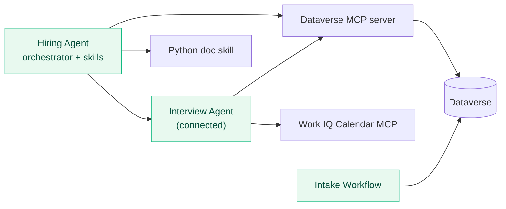

---
prev:
  text: "Schedule Interviews with Work IQ"
  link: "/operative-nextgen/10-work-iq-scheduling"
hide: true
preview: true
short-description: Run your evaluation sets, publish to Microsoft 365 Copilot and Teams, share the agent, then watch real sessions in Monitor
difficulty: 3
codename: OPERATION HOMECOMING
time: 50
tags:
  - evaluation
  - compliance
products: [copilot-studio, dataverse, teams, m365-copilot]
industries:
  - hr
created-date: 2026-01-14
last-edited-date: 2026-08-14
---

# 🚨 Mission 11: Evaluate, Publish, and Monitor Your Agent {#mission-11-evaluate-publish-and-monitor-your-agent}

<mission-meta />

## 🎯 Mission Brief {#mission-brief}

Welcome back, Operative. In this mission you'll run the evaluation sets you've been accumulating since Mission 02, stamp a version into the agent's greeting, publish it to **Microsoft 365 Copilot** and **Teams**, share it with the right people, test the whole system the way a recruiter will actually use it, and then open **Monitor** to read back the sessions those real users produced.

## 🔎 Objectives {#objectives}

In this mission, you'll learn:

1. Why a **Connected user** changes what an evaluation's tool calls can see
1. How to stamp a **release version** into an agent so a user can tell you which build they have
1. How to confirm a **published channel** is serving the build you just published
1. How to publish an agent to **Microsoft 365 Copilot** and **Teams**, and share it
1. How **Evaluate** before release and **Monitor** after it answer different questions
1. How user **reactions** feed back into the test sets you keep re-running

## 🏗️ What you built {#what-you-built}



| Capability | How you built it |
| --- | --- |
| Data model | Imported the **Operative** solution and its sample roles + criteria |
| Orchestrator | **Hiring Agent** with instructions + a **skill** |
| Data layer | **Microsoft Dataverse MCP server** (read + write) |
| Multi-agent | Published, **connected Interview Agent** grounded via MCP |
| Multimodal intake | **Native** document reading + skill + MCP |
| Matching & applications | **Rubric-based** weighted matching via MCP (Mission 05) |
| Documents | **Python skill** with a code-defined Word layout (`python-docx`) |
| Automation | A native **Workflow** (email → Dataverse → Teams card) |
| Extensibility | **Work IQ** MCP servers for scheduling (Mission 10) |
| Quality | Questions about intended behavior and a known-data MCP case in **Evaluate**, plus reactions and **Monitor** |
| Error handling & observability | Explicit stop and not-found behavior in skills + **Run After** handling in the workflow, traceable in **Monitor** |

## 🧭 Release readiness {#release-readiness}

Until now you have been the only user, asking questions you already knew the agent could handle. Releasing changes both halves of that, because the questions get less predictable and you stop seeing most of them. Three tools cover the gap, and each answers a different question:

| Tool | Answers | When you use it |
| --- | --- | --- |
| **Evaluate** | *Does the agent still do what I built it to do?* | **Before** release, and after every change |
| **Reactions** | *Did this particular answer help the person who got it?* | Continuously, once real users have it |
| **Monitor** | *What actually happened in real sessions?* | **After** release |

Reactions add thumbs-up and thumbs-down controls to published responses, with an optional written comment. Treat each reaction as a signal to investigate, not a score on its own. Use the comments to understand what the user expected, then reproduce important issues in **Preview** or an evaluation.

> [!IMPORTANT] Evaluations consume Copilot Credits
> Building, testing **and evaluating** agents all draw on **Copilot Credits**. This mission runs two full evaluation sets and a published end-to-end test, so confirm your environment has credit capacity before you start.

::: details 🔄 Coming from the classic Operative course?
This mission merges classic **Mission 10: Integrate with MCP Servers** and classic **Mission 11: Collecting feedback from users**. The standard harness checks quality mainly through ad-hoc conversations in the test pane, with deeper runtime investigation pushed out to Application Insights telemetry, and it reaches calendars and people through a custom connector or a purpose-built agent flow for each action. The Powered by GitHub Copilot experience replaces all of that with **Evaluate** for reusable scored test sets, built-in **reactions** for user feedback, **Monitor** for published sessions and tool calls, and reusable evaluation sets you re-run after every change. What you do differently is treat evaluation as a regression suite you re-run after every change rather than a final sign-off, and read your published behavior in Monitor instead of instrumenting it yourself.
:::

## 🧪 Lab 11 - Evaluate, publish, and monitor {#lab-11-evaluate-publish-and-monitor}

### Prerequisites

Before you start this lab you need:

- The **Hiring Agent** and **Interview Agent** from the previous missions, with their evaluation sets
- Permission to **publish** an agent to Microsoft 365 Copilot and Teams - see [Recruit Course Setup Step 4](../../recruit-nextgen/00-course-setup/index.md)
- Microsoft 365 Copilot access for the end-to-end test in Lab 11.6

Let's take the whole system to production.

### 11.1 Re-run your evaluation sets before you publish

In the previous missions we have established a set of evals. Now we will run each set to check that they are all still green before we release our agent.

1. In the left navigation select **Agents**, open the **Interview Agent**, and go to its **Evaluate** tab. Open the **Interview Agent baseline** set you've been growing since Mission 03.

   

1. Select **Add conversations** to see how cases can be authored - written by hand, or brought in from a file or an earlier transcript. Close the panel without adding anything. The set already holds every case you need here.

1. Review the self-knowledge cases already in the set. Each of these questions asks the agent about **itself**, so it stays answerable however the hiring data changes. Alongside them sit the guardrail cases you added in Mission 04 and the scheduling case from Mission 10.

   

1. Open **Configure test set** and confirm the set is a **Conversation** data type scored with **General quality**.

   

1. Under **User profile** select **Manage**, and confirm the profile is still your account and still says **Connected**. That identity is what the run uses to call anything.

   

1. Select **Evaluate**. Wait for the cases to progress from 0/n to n/n - one set runs at a time, and each case takes a minute or two.

   

1. Read the **Evaluation summary** first. It gives an overall **Score %** and a **Pass/Fail** badge, with duration, cases completed, test set, data type, user profile, and who ran it.

   

1. Scan the **per-case table**. Each conversation shows its **Total messages** and **General quality** result, so you can see which case moved.

   

1. Open a case. **General quality** breaks into **Seems relevant**, **Seems complete**, and **Based on knowledge sources**, along with the sources the judge used.

   

1. Return to **Recent results**. The Evaluate landing page stacks every run, so a green **100%** sitting above earlier **25%** and **0%** runs makes a regression obvious at a glance.

   

1. Compare runs of the same set. Keep the profile and the test data fixed, so a score that moves means the agent changed and not the test.

   

1. Repeat for the **Hiring Agent** and its **Hiring Agent baseline** set, then investigate anything that isn't green *before* you publish. `General quality` is model-based and moves a little between runs, so read the case details and cited sources rather than the headline number. What counts is a case that changed from **Pass** to **Fail**, and whether the cause is the agent or the test.

> [!TIP] One change at a time
> A regression run tells you *what* broke, not *why*. To find the cause, change one thing between runs
> and keep everything else identical - same set, same user profile, same test data, same starting
> state. Compare a model change against the same set (Mission 04), an instructions change against the
> run immediately before it, and always re-run the full set rather than just the case you added.

### 11.2 Evaluating tool-using agents

So far, every case in both baselines answers from the agent's own instructions, so neither set has ever proved the agent can actually **call** anything.

A tool case is different. It runs against a real system, as a real identity, over real records, so it can fail for reasons that have nothing to do with the agent. Before you write one, pin down four things:

| Pin down | Reason |
| --- | --- |
| **Which identity runs it** | An evaluation calls tools as the account selected under **User profile**, not as you. That account needs its own working connection |
| **Which records it reads** | Name the exact rows and the state you expect them in. A case that reads "the first job role" breaks the day someone adds one |
| **Whether it writes** | A read is repeatable for free. A write needs synthetic data, a unique key so re-runs don't collide, and a cleanup step you have actually tested |
| **What counts as evidence** | A green judge score says the *answer* looked good. It doesn't say which tool ran, or whether one ran at all |

The case below is read-only, against a sample row from Mission 01 that nothing in the course changes.

1. Open **Hiring Hub** (see [Mission 01](../01-get-started/index.md#lab-01-set-up-the-hiring-hub) if you need the route), go to **Job Roles**, and confirm **J1001** is still **Power BI Analyst** and **Active**. If your data differs, pick another stable row and adjust the question and reference to match.

   

1. Open the **Interview Agent**, go to **Evaluate**, and open the **Interview Agent baseline** set. Select **Add conversations**, **Write**, and add this case:

   | Question | Reference |
   | --- | --- |
   | *Using the Microsoft Dataverse MCP Server, retrieve job role J1001. Return exactly: role number \| title \| status.* | *J1001 \| Power BI Analyst \| Active* |

   

1. Select **Manage** under **User profile**, open the **User** list, select your signed-in account, check its row says **Connected**, then select **Save**.

   

1. **Save** the set and select **Evaluate**.

   

1. When the run finishes, open the MCP case. The **Agent response** must contain the live values - `J1001 | Power BI Analyst | Active` - and **Tools** must list **Microsoft Dataverse MCP Server**, so you know the tool really ran.

   

1. Check the **User profile** in the **Evaluation summary** is the account you selected. A green score with no **Tools** entry means the agent answered from somewhere else, so the case scores as a pass without having proved anything, which is why you read all three.

   

> [!NOTE] "Permission required" means the profile, not the agent
> If the case completes but scores **0% / Fail**, open the case details. *"Permission required. See card
> for details."* next to the attempted MCP tool means the agent picked the right tool and the
> evaluation profile could not authorize the call.
>
> To fix this, use **Manage profile and connections**. Selecting **Allow** in Preview only
> authorizes your own interactive session.

### 11.3 Stamp a version into the greeting

Once the agent is installed from a store card, the person using it has whatever version they installed. A user reporting "the agent did the wrong thing" is only useful if you know which version they were talking to. So before you publish, put the release version into the agent's own greeting, and teach the agent to answer the question directly.

1. In the left navigation select **Agents**, open the **Hiring Agent**, and on the command bar select the **…** menu, then **Settings**.

    

1. Select **Greeting and prompts**. Replace the greeting with the text below, and add `What version are you?` as a **suggested prompt** so the question is one click away in Microsoft 365 Copilot.

   ```text
   👋 Hi! You're chatting with the Hiring Agent - version 1.0.0. I file
   candidate resumes, match candidates to open roles using each role's weighted
   criteria, create job applications, and prepare interviewers. If you don't see
   "version 1.0.0" here, ask your admin to publish the latest version. Attach a
   resume or ask what I can do to get started.
   ```

    

1. **Save**, then close Settings and add the same release to the agent's **Instructions**, on a new line at the end. The greeting only appears at the start of a chat, so an agent asked mid-conversation needs the version somewhere it can actually read.

   ```text
   Release identification:
   - The current release is version 1.0.0.
   - When a user asks which version they are using, state this exact version.
   - Never claim a different release version.
   ```

   Select **Save**. The greeting and the instructions now carry the same version, which is the point - one of them is what a user sees, the other is what the agent knows.

    

1. Start a **new** Preview chat and read the greeting back. It should open on **version 1.0.0**, and asking *What version are you?* should return the same answer. An existing chat keeps the old greeting, so this only proves anything in a fresh one.

    

> [!TIP] Bump it every time you republish
> A version number only helps if it moves. Change it in both places - the greeting and the
> instructions - as part of publishing rather than afterwards, because the two are what a user sees
> and what the agent knows respectively. A greeting still claiming 1.0.0 on a 1.1.0 build is worse
> than carrying no version at all: every Monitor session you read will be attributed to the wrong
> build, and the bug you are chasing will look like it came from code that never shipped.

### 11.4 Publish to Microsoft 365 Copilot and Teams

The **Hiring Agent** is already published - you published it in Mission 06 so its skills would run, and again in Missions 07 to 09 so the workflow could call it. But publishing only makes the current draft live for connected agents, workflows and skills. Nobody outside Copilot Studio can reach it yet. Adding a **channel** is what puts it in front of users.

Confirm the release requirements first:

- The agent is **saved** and has a **name, description, and instructions**.
- Every **Preview** case met its response, routing, citation, and no-forbidden-call assertions under both the **maker** and **end-user** preview.
- The evaluation suite contains stable questions about each agent's intended behavior and the controlled
   **Dataverse MCP** read from Lab 11.2. Its profile is **Connected**, J1001 is in the expected state, and the case details show both the live values and the tool used.
- Any evaluation that writes data has synthetic test records, a unique test key, idempotent behavior,
   and verified cleanup. The course's MCP evaluation is read-only, so it does not need cleanup.
- The **Dataverse MCP connection works for each intended identity**. Lab 11.2 checks the evaluation
   profile; Preview and channel tests check the maker and end-user identities separately.
- Intended users have the **required licenses**, and Power Platform apps are **permitted in Teams**.
- Data flowing to Teams / Microsoft 365 is **approved** for your compliance and geographic boundaries.
- **Icon, description, and suggested prompts** are ready - they show in the Agent Store card.

1. In the left navigation select **Agents** and open the **Hiring Agent**.

1. Select the **Publish** split-button chevron (**Customize publish channels**) to open the **Agent published** dialog. It lists **Demo Website**, **Web app**, and **Teams + Microsoft 365**.

   

1. Select **Teams + Microsoft 365** to open its detail pane.

   

1. To list the agent in the Agent Store, select **Make agent available in Microsoft 365 Copilot**. The **Publish to Teams + Microsoft 365** channel setting is independent, so enable only the channels you intend to support.

   

1. Before you publish, select **Edit details** on the agent card to check what users will actually see in the store - the **name**, **description**, **icon** and **suggested prompts**. This is the card a person decides to install from, so it is worth reading it as they would before anyone finds it.

1. Select **Save and publish** and wait. When it completes, the pane shows a **Channel enabled** badge and unlocks **Availability options** with **See agent in Microsoft 365** and **See agent in Teams**.

   

1. Select **See agent in Teams**: Teams opens the agent's store card with its **version**, the clients it supports, and the permissions it is asking for.

   

1. Select **Add**. Teams installs the agent for **you only** and opens it as its own chat.

   

1. Send it a question that can only be answered from your data, so you are testing the *published* agent rather than the model:

   ```text
   Which open roles are we hiring for right now? List the role number and title
   for each.
   ```

   The reply should name real role numbers (**J####**) from your Job Roles table.

   

1. Back in **Availability options**, select **See agent in Microsoft 365** to open the **Agent Store** card, then **Add**. The private install shows the app **version**, cross-client support, and requested permissions before it installs. It now appears as an agent you can chat with in M365 Copilot **and** as a new bot chat in Teams.

   

**If Teams tries to open the desktop app.** The **See agent in Teams** link goes through a launcher that offers to open the Teams desktop client.
Choose **Use the web app instead** if you want to stay in the browser - the agent behaves identically
in both.

<!-- Separate adjacent callouts for Markdownlint. -->
> [!WARNING] Publish from a training tenant
> Publishing and adding the agent makes it available to users in your tenant, so do this only in a
> **sandbox/training** tenant.

### 11.5 Share with the right people

Publishing makes the agent *available*, while **sharing** decides *who can use it*. The **Share** button stays disabled until the agent is **published to Microsoft 365** - which you just did - so it's now live.

1. On the **Hiring Agent** toolbar, select **Share** to open **Share Hiring Agent**.

   

1. In **Add a name, group, or email**, type a colleague or security group and select them from the directory. They're added under **People who can use the agent** - you (the **Owner**) are already listed and role-locked.

   

1. Decide **organization-wide** access. Under **Organization**, **Everyone in your organization**, select the role control to choose between **No permissions, unless specified** (default - only invited people) and **End user access** (anyone in the org can use it and manage their own connections).

   

1. Select **Share**. Optionally use **Choose a channel to copy a link** to send an install link - note that a link only works for users who **already have access**.

   

**Share narrowly first, widen deliberately.** Start with a **small group** (yourself plus a couple of testers) and keep **Everyone in your
organization** on **No permissions**. Broaden access only after the end-to-end test passes for those
testers. For true org-wide **discovery** in the Teams and Microsoft 365 Agent Stores, you additionally
submit the agent for **admin approval** from **Availability options** - an administrator, not the
maker, controls that catalog listing.

### 11.6 End-to-end test from Microsoft 365 Copilot

Now let's ship a second release, confirm the published channel is really serving it, then run the main hiring chain from the surface a real hiring manager would use.

1. Ship a new release. On the Hiring Agent's **Build** tab select **Settings**, then **Greeting and prompts**, and change the version in the greeting to **1.1.0 (August 2026)**. Change the same version under *Release identification* in **Instructions**. Select **Save**, then **Publish**.

1. Open the **Hiring Agent** in **Microsoft 365 Copilot** and select the **What version are you?** starter you added in Lab 11.3:

   ```text
   What version are you?
   ```

   It should answer **1.1.0 (August 2026)**. If it still says **1.0.0**, the publish has not reached the channel yet - wait for it to finish and ask again in a **new** chat.

   This check is the cheapest one you have, and it is worth doing first. It tells you **which version your users are actually talking to**. A channel still serving last week's instructions fails in ways that look like model behaviour rather than a versioning problem, and you can lose a lot of time to that.

1. **Attach a resume** - use one of the sample resumes you downloaded in [Mission 05](../05-intake-matching-applications/index.md).

1. Send one prompt that files the candidate and creates the application:

   ```text
   File this candidate, match them to the best open role, and create the
   application.
   ```

1. Watch the **skill + Dataverse MCP** intake the candidate (C#####/R#####), the **weighted match** recommend a role, and a **Job Application** (A#####) be created.

1. Now ask for the interview preparation, so the connected agent and the document skill work from a completed application:

   ```text
   Now prepare interview questions for that role and generate the interview-prep
   document.
   ```

1. Watch the **connected Interview Agent** prepare questions and the **Python document skill** return the **`.docx`**.

1. Verify in the **Hiring Hub** app that the Candidate, Resume, and Job Application rows exist and are linked - the same records, now created from M365 Copilot.

1. *(If you built the workflow in Mission 07)* email the monitored mailbox a resume and confirm the **autonomous intake workflow** files a row and posts the **Teams card** - the headless path working alongside the conversational one. Open the workflow's **Activity** tab - the view you monitor an unattended workflow from - and select the newest run to watch it node by node.

**What this test covers.** This prompt exercises **orchestration, skills, MCP, multimodal intake, matching, applications, a
connected agent, and a Python document** from the published channel. Keep the saved evaluation sets
and Mission 08 route matrix as separate regression checks, because one successful conversation does not
cover every case.

### 11.7 Review published sessions in Monitor

Use **Evaluate** to compare saved cases before release. Use **Monitor** to inspect sessions from the published agent. Publish the agent, exercise it (including the Mission 05 error-handling test and the Mission 04 red-team prompts), then open **Monitor** and review:

1. **Published activity.** The **Summary** and **Overview** cards show the published **Conversation sessions**, **Total reactions** and **Average DAU** for the selected time range. Preview conversations do not appear here, and a quiet agent reports *Not enough traffic to generate AI Summary*.

   

1. **Tool use.** Under **Capabilities**, the **Tool use** card shows total uses, success rate, and the most-used tool. Select **See details** to see which tools handled the questions that invoked a tool. If the success rate drops below 100%, use the session export in the next step to find the failures.

   

1. **A specific session.** Set the **Time range**, select **Download Sessions**, then choose the UTC date range that contains the conversation. In the downloaded CSV, filter **ChatTranscript** by a reported record number (R#####, C#####, or A#####), or use **SessionId** to identify the session.

   

### 11.8 Final readiness checklist

Before you claim the badge, confirm each item below.

- The **Hiring Agent** is in the **Operative** solution
- It carries four **skills**: `resume-intake` from Mission 02, `role-matching` and `application-handling` from Mission 05, and `interview-prep-document` from Mission 06
- The **Dataverse MCP server** is added, and the agent can use it to read and write records
- The **Interview Agent** is published and connected, and can also use the Dataverse MCP server
- You have run intake, weighted matching, and application creation from end to end
- You uploaded the **interview-prep Python skill** and generated a document through the agent
- You built the **autonomous workflow** that files a resume and stores its PDF as a note, or read through those steps if you have no test mailbox
- Your **evaluation sets** cover how the agent should behave, including one case that uses a tool
- You tested **error handling**, so a missing identifier is reported rather than invented, and reviewed a run in **Monitor**
- You checked **file handling**, so an unsupported file is refused with a request to upload another
- **Published to Microsoft 365 Copilot**
- Ran the **end-to-end test** from Microsoft 365 Copilot

## ✅ Mission Complete {#mission-complete}

Your hiring system is live, measured, and observable - and you finished the Operative course.

You can now:

✅ **Regression testing**: You re-ran both evaluation sets and read the results properly.

✅ **Identity-aware evaluation**: You added a tool case with a **Connected user**.

✅ **A traceable release**: You stamped agent version 1.0.0 into the greeting and the instructions, shipped agent version 1.1.0, and confirmed from the published channel that users were served the new build.

✅ **Release**: You published to **Microsoft 365 Copilot** and **Teams**, and shared the agent deliberately.

✅ **Post-release observability**: You read real published sessions in **Monitor**.

## 📚 Tactical Resources {#tactical-resources}

🔗 [Analytics overview in Copilot Studio](https://learn.microsoft.com/microsoft-copilot-studio/analytics-overview)

🔗 [Analyze autonomous agent health](https://learn.microsoft.com/microsoft-copilot-studio/analytics-improve-agent-health)

🔗 [Publish your agent to channels](https://learn.microsoft.com/microsoft-copilot-studio/publication-fundamentals-publish-channels)

🔗 [Share an agent](https://learn.microsoft.com/microsoft-copilot-studio/admin-share-bots)

🔗 [Add your agent to Microsoft Teams](https://learn.microsoft.com/microsoft-copilot-studio/publication-add-bot-to-microsoft-teams)

🔗 [Copilot Studio documentation](https://learn.microsoft.com/microsoft-copilot-studio/)

## 🏅 Secure Your Operative Badge {#secure-your-operative-badge}

Every Agent Academy path includes a verifiable digital badge issued through the [Global AI Community](https://globalai.community/).


To keep the badge tied to completed technical work, follow each step in order.

> [!IMPORTANT]
> Only the Hiring Agent built in the Operative path is eligible for this badge.

### 1. Star the Agent Academy repository {#star-the-agent-academy-repository}

Star the **[Agent Academy GitHub repository](https://github.com/microsoft/agent-academy)**.

### 2. Complete the badge validation form {#complete-the-badge-validation-form}

Complete the **[Operative Badge Validation Form](https://aka.ms/agent-academy-operative/form)**. The form confirms your course work, collects feedback, and records the email address used to issue the badge.

### 3. Sign in to the Global AI Community {#sign-in-to-the-global-ai-community}

Create or sign in to your **[Global AI Community account](https://globalai.community/auth/login)** using the same email address you enter in the validation form.

> [!IMPORTANT] Use the same email address
> Your validation form and Global AI Community account must use the same email address or the badge cannot be delivered.

<analytics-tag section="operative-nextgen" mission="11-publish-and-monitor" />
