# Personalizing Agent Responses

--8<-- "disclaimer.md"

## 🕵️‍♂️ CODENAME: `OPERATION ARCHETYPE`

> **⏱️ Operation Time Window:** `~45 minutes`

## 🎯 Mission Brief

Welcome back, Agent. In [Mission 04](../04-agent-instructions/README.md), you learned how to define your agent with instructions and invoke tools to equip your agent in handling requests. But even the most well-instructed agent can feel robotic without the right personality and response formatting.

Your assignment, should you choose to accept it, is **Operation Archetype** - transforming your agent from a functional tool into a compelling digital personality. You'll master the art of selecting the optimal AI model and crafting response formats that resonate with users on a human level.

Your agent transforms to a sophisticated conversational partner that understands context, adapts its communication style, and delivers information in ways that truly connect with users. You'll learn to choose between models, then shape every interaction to reflect your agent's unique voice and purpose.

Choose the right model for your agent and format responses to be impactful, clear, and unmistakably on-brand.

## 🔎 Objectives

In this mission, you'll learn:

1. How to understand and select the optimal AI model for your agent's use case
1. How to compare different model capabilities and performance characteristics
1. How to configure response formatting to enhance readability and user experience
1. How to implement consistent styling and structure for agent responses

## 🤔 What is the Agent Model?

The _agent model_ is the underlying generative AI engine powering your Copilot agent’s responses. Copilot Studio lets you select which model your agent uses, enabling you to leverage different strengths (speed, output quality, cost, etc.) depending on your scenario. The model you choose determines how your agent thinks and responds, for example, one model may respond faster, another may produce more detailed answers, while another might excel at complex reasoning.

### 🎭 Why it matters

Selecting the appropriate model ensures your agent performs optimally for your use case. Each available model has distinct capabilities and specializations, so aligning the model with your requirements (such as quick replies vs. deep analysis) can improve user satisfaction and manage costs.

### 🪁 Available models

Copilot Studio supports OpenAI models and Anthropic models. Each model will have a category tag and an availability tag.

#### Model use categories

Different models are designed for specific tasks. Selecting the right model improves your agent’s performance. For instance, use a Deep model for complex decision-making or a General model for broad, conversational topics.

The table below outlines model tags, their strengths, and key considerations - [source](https://learn.microsoft.com/en-us/microsoft-copilot-studio/authoring-select-agent-model#model-use-categories).

| Tag | Description | Strengths | Latency | Cost | Reasoning depth |
|-------|----------|----------|-------------|-----------|-----------|
| **Deep** | Optimized for deliberate, multi-step reasoning and tool-supported workflows. | Complex analytics, multi-hop reasoning, policy and contract analysis, troubleshooting with multi-system steps, and synthesis of long documents with citations | Highest | Highest | Multi-step, tool-rich |
| **Auto** | Optimized for coverage across mixed workloads; routes queries dynamically. | Helpdesk and employee agents with mixed intents, blending knowledge and actions, and tier‑0 customer support with unpredictable complexity | Variable | Variable | Multi-step, tool-rich |
| **General** | Optimized for speed and cost on everyday chat and light grounding. | Drafting, rewriting, summarizing, and translation, FAQ-style grounded answers, and simple action automation | Lowest | Lowest | Shallow-to-moderate |

#### Model availability

Models are released in stages. You can explore cutting-edge options like Experimental or Preview models, or stick with a stable, fully tested Generally Available model.

The table below explains the availability tags - [source](https://learn.microsoft.com/en-us/microsoft-copilot-studio/authoring-select-agent-model#model-use-categories).

| Tag | Description |
|-----|-------------|
| **Experimental** | Used for experimentation, and not recommended for production use. Subject to preview terms, and can have limitations on availability and quality. See [Limitations of experimental and preview models.](https://learn.microsoft.com/en-us/microsoft-copilot-studio/authoring-select-agent-model#limitations-of-experimental-and-preview-models) |
| **Preview** | Will eventually become a generally available model, but currently not recommended for production use. Subject to preview terms, and can have limitations on availability and quality. See [Limitations of experimental and preview models.](https://learn.microsoft.com/en-us/microsoft-copilot-studio/authoring-select-agent-model#limitations-of-experimental-and-preview-models) |
| **No tag** | Generally available. You can use this model for scaled and production use. In most cases, generally available models have no limitations on availability and quality, but some might still have some limitations, like regional availability. |
| **Default** | The default model for all agents, and usually the best performing generally available model. The default model is periodically upgraded as new, more capable models become generally available. Agents also use the default model as a fallback if a selected model is turned off or unavailable. |
| **Retired** | When a new model becomes the default model, the old default model is retired. You can still use the retired model for up to one month after retirement. For more information, see [Continue using a retired AI model](https://learn.microsoft.com/en-us/microsoft-copilot-studio/authoring-retired-model). |

#### OpenAI models

AI capabilities evolve rapidly, and Copilot Studio keeps up by offering a range of Azure OpenAI models. As of 2025, the primary models to choose from include OpenAI's GPT-4.1, and the latest GPT-5 previews. The following table summarizes the main choices and what each is best suited for:

| Model Version | Category | Availability | Key Strengths | Ideal Use Cases |
|-------|----------|----------|-------------|-----------|
| **GPT‑4o** | General | Retired | Fast, versatile responses; supports text and image input; cost-effective balance of speed and accuracy. | Routine Q&A; summarizing support chats or calls; quick content drafts; tasks combining text with visuals. |
| **GPT-4.1** | General | Default | Higher accuracy and reasoning than GPT-4o; excellent at complex text analysis (text-only model). | Analyzing detailed documents (policies, reports); complex knowledge-base Q&A; scenarios where precision is critical. |
| **GPT‑5 Chat** | General | Preview | Advanced conversational abilities with strong context retention; produces human-like dialogue. | Employee self-service chatbots; IT/HR helpdesk assistants; interactive agents requiring natural, human-like responses. |
| **GPT‑5 Auto** | Auto | General | Optimized for orchestrating multi-step workflows; can automate actions across systems (not just chit-chat). | End-to-end process automation (e.g. ticket creation to resolution); multi-step task sequences across apps; "digital project manager" scenarios. |
| **GPT‑5 Reasoning** | Deep | Preview | - Latest model optimized for complex reasoning (trained up to Oct 2024) - High scores in document understanding and response accuracy | Advanced reasoning tasks where top-tier analytical capability is required (such as extensive planning, interpreting complex data). Again, use cautiously in testing since it’s a preview model. |
| **GPT‑5.1 Chat** | General | Experimental | Latest experimental conversational model with broad task proficiency; improves on context awareness and responsiveness. | General-purpose Q&A and dialogue tasks leveraging the newest model’s capabilities; versatile chatbot scenarios where enhanced performance is beneficial. |
| **GPT‑5.1 Reasoning** | Deep | Experimental | Experimental top-tier reasoning model offering maximum depth and accuracy for complex tasks. | Ultra-complex analytical queries or decision support requiring the highest precision (e.g. intricate strategic planning, high-stakes data analysis). |

!!! warning

    - Experimental/preview models (like GPT-5 Chat) are accessible for testing new capabilities before they’re production-ready. They may have limited testing and higher variability in performance.

    - They are not recommended for production use because of possible instability (variable quality, latency, or even time-outs). Always review any _Preview_ model’s limitations and consider using them only in non-critical environments. Use them in _Sandbox_ or _Developer_ environments. If you do publish an agent with an experimental model, usage will still be billed at that model’s established rate.

#### Anthropic models (external)

Currently there are two Anthropic models which are currently under Preview, they are accessible in early release environments.

- **Claude Sonnet 4.5** is Anthropic's newest, coding and agent-focused model.
- **Claude Opus 4.1** is a reasoning-focused model.

OpenAI remains as the default model for new agents in Copilot Studio and you have the flexibility in selecting either of these models.

Both are available in Microsoft Copilot Studio as opt-in preview (Frontier Program) models rather than General Availability (GA), meaning they’re for early experimental use only. The table below compares their status, strengths, and ideal use cases in the Copilot Studio context:

| Model Version | Status | Key Strengths | Ideal Use Cases |
|-------|----------|-------------|-----------|
| **Claude Sonnet 4.5** | Experimental | Excels at code-related tasks and complex “agent” workflows; strong at tool use and step-by-step reasoning. | Advanced software development assistance (code generation & debugging); building multi-step autonomous agents; tasks requiring integration with external tools or systems. |
| **Claude Opus 4.1** | Experimental | Specialized for intensive analysis and structured problem-solving. | In-depth data analysis and research projects; complex reasoning scenarios (e.g. compliance auditing, elaborate planning) where thoroughness is paramount. |

!!! warning

    - It's important to note that these are external models. Anthropic models are hosted outside Microsoft and are subject to Anthropic terms and data handling, which need to be reviewed and accepted before makers can use them. These models are available before an official release so that you can get early access and [provide feedback](https://community.powerplatform.com/forums/thread/?groupid=db8f53c2-767d-47d6-a1ae-fe4c828a6553). Therefore, it is not recommended to use these models for Production purposes.

    - Please note that you could also experience slowdowns or timeouts due to limited capacity and availability, and these models might not be supported in the future. Admins can control access to this feature (more of this soon as you progress from here!).

#### 🔢 Context length and data training

All the above models are capable with large context windows. For instance, GPT-4.1 supports up to 128K tokens of context. They are all trained on data up to mid-2024 (GPT-5 on slightly later data). This means they _know_ information up to those cut-off dates, which is useful for understanding their knowledge limitations when they generate answers.

### 🔧 Changing and updating the model of your agent

By default, a new Copilot agent starts on the GPT-4o model, which is optimized as a balanced choice for most scenarios.

You can switch the agent’s primary model anytime via the agent’s **Settings** page ➡️ **Model** section in the **Generative AI** tab, using a simple dropdown to pick from available models.

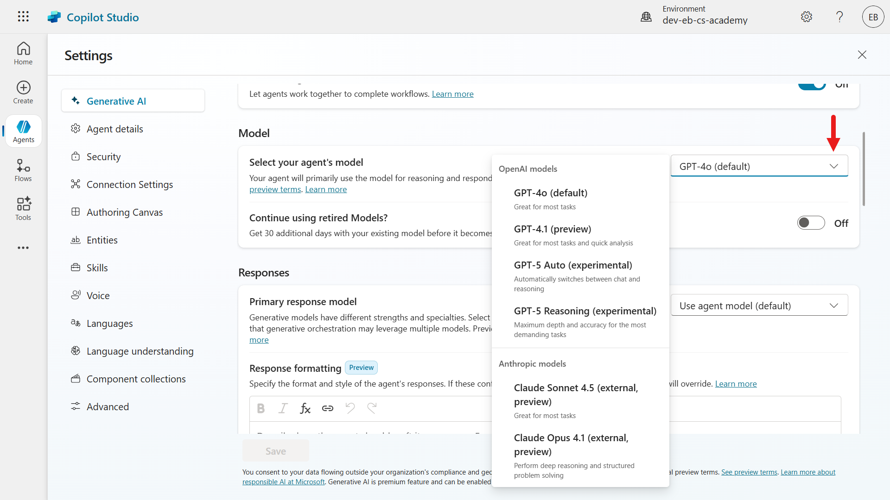

This flexibility allows you to experiment with different models even after your agent is built. For example, switching to an experimental model to evaluate if it improves answer quality for your use case.

## 📶 Model updates and retired models

Microsoft periodically upgrades the available models to newer versions. Notably, in November 2025, several models were made available:

- GPT-5.1 Chat
- GPT-5.1 Reasoning

!!! note ""

    Refer to [Model updates](https://learn.microsoft.com/en-us/ai-builder/prompt-modelsettings#model-updates) periodically to understand model updates made by Microsoft.

If your agent was using the retired GPT-4o model, it would have been transparently moved to **GPT-4.1** which is the default OpenAI model.

### 🧶 Why might you continue using a "Retired" model?

With AI model upgrades happening automatically, Copilot Studio provides a safety valve for continuity. You may have cases where you need to stick with the previous model for a short time, even after an upgrade.

For example, to maintain compatibility, to meet compliance requirements, or simply because your solution’s behavior with the new model needs evaluation before fully switching over. Microsoft recognizes this and allows makers to continue using a retired model for up to **30 days** after an automatic upgrade.

- **Compatibility**: Perhaps the new model’s outputs differ in format or content. If your downstream systems or prompts expect the old model’s style, you might need time to adjust your logic. The grace period lets you run on the known model while you update and test your agent with the new model in a controlled way. You can make adjustments without disrupting users.

- **Compliance & Data Policies**: Some organizations have strict vetting for AI models. An experimental new model might not yet be approved for use, or it might handle data in a different way (for example, the new model might use data centres in different regions). If that’s a concern, an admin might decide to delay the switch until compliance checks are done.

- **Specific Business Needs**: You might have a mission-critical event (product launch, demo) where stability is more important than getting new features quickly. Sticking with the older model ensures no surprises during that period.

### 🌳 How to use a retired model

On your agent’s **Settings** page, in the **Model** section in the **Generative AI** tab, there is a toggle option labeled **"Continue using retired models"**. This becomes available when a model update is rolled out.


If you switch this on, your agent will remain on the previous model version for that 30-day window. During that window, you can toggle between the old and new model to compare responses and gradually roll over. After 30 days, the old model is fully removed from service, so you should plan to move to the new model by then. In practice, this feature offers a buffer to support a smooth transition.

#### Example

Suppose your agent was using GPT-4o and it got upgraded to GPT-4.1. If you notice the AI’s tone changed or it uses slightly different phrasing that doesn’t align with your established conversational style, you could toggle on “use retired model” to temporarily revert to GPT-4o.

You then have a few weeks to update your prompts/instructions to suit GPT-4.1’s style (maybe adding an instruction like “keep responses brief”) and test thoroughly. Test your agent on GPT-4.1 in a safe environment, and then disable the retired model toggle once confident. This way, your end users have a consistent experience during the transition.

## 🔐 Admin controls for AI model selection

It’s worth noting that not every copilot environment allows all model choices by default. There are organization-level settings that tenant administrators control. This is especially relevant for experimental models. Organizations may want to restrict who can use preview AI models (since they might process data in non-standard ways or outside certain regions).

Here are the key admin controls affecting which models a maker/developer can select for an agent:

- **Enable Anthropic models to be used within your organization**: An admin with the **Global administrator** role needs to enable (allow) anthropic models in the Microsoft 365 Admin Center. If this setting is disabled, only OpenAI models will be available to select.


- **Allow Preview (Experimental) models to be used in Copilot Studio environments**: An admin can toggle whether preview and experimental AI models are available in a given environment. If this is turned **off**, makers/developers will only see generally-available models (like GPT-4o) in the dropdown.

    To use GPT-5 or any future preview, the admin must turn this setting **on** for that specific environment.

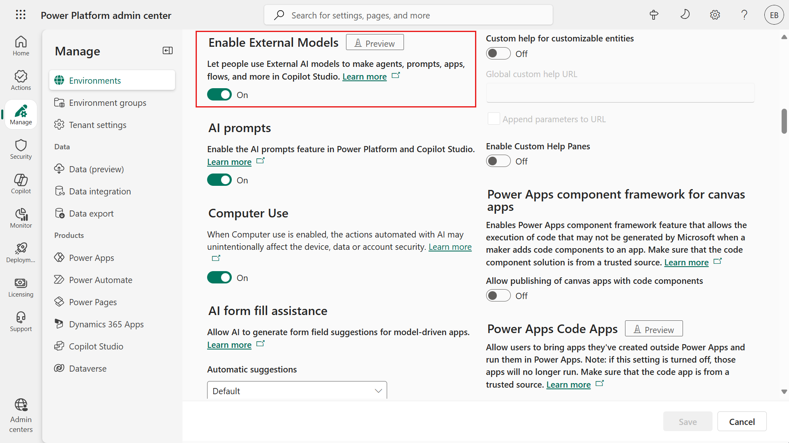

- **Move data across regions**: Because experimental models may not run in the same regional data centres as standard models, enabling them often requires allowing cross-region data movement. In the Power Platform admin centre (environment settings), there is a setting called **Move data across regions**. This must be turned on by the admin if you want to permit experimental model usage. It acknowledges that data processed by these models may leave your organization's geographic boundaries.

    For example, if your environment is in _Europe_ and an experimental model is only hosted in _US_ datacenters, this setting needs to be enabled to let that data flow happen. If it’s disabled, Copilot won’t use those models.

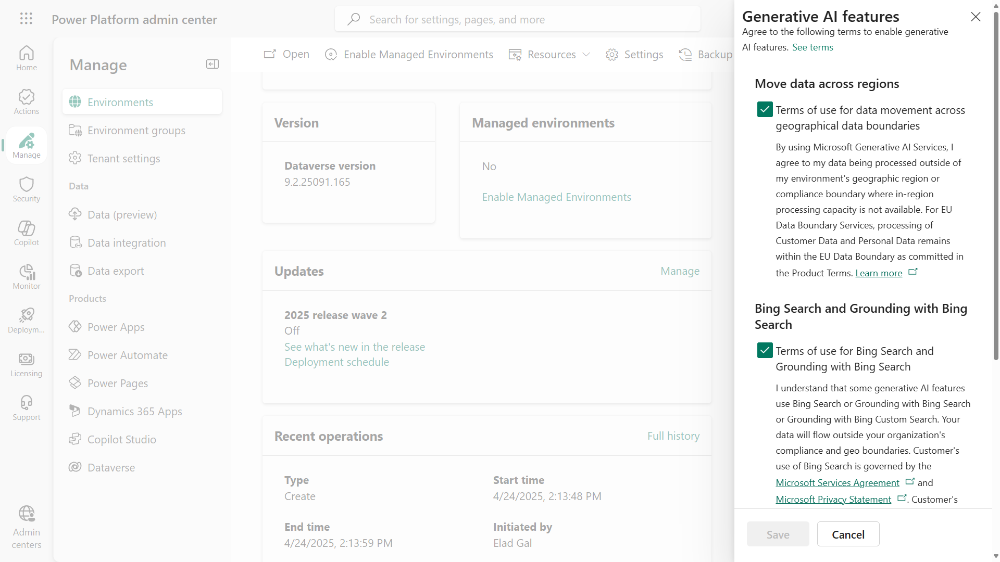

These admin settings ensure that **organizations stay in control** of sensitive aspects like data residency and feature stability. As a developer building an agent, if you find that the option for GPT-5 preview models are missing or you see a warning about generative AI not being available, it could be that your admin has disabled experimental models or hasn’t enabled cross-region data movement. In such cases, you’d need to contact your tenant admin to adjust the environment settings if experimental features are desired.

For a quick reference, here’s a summary of the admin controls related to model selection:

| Admin Setting | Effect on Model selection | Setting location |
|----------|------------|------------|
| **Allow Anthropic models** | When **Allowed**, users can connect to the Anthropic external models for agents built in Copilot Studio. When **disabled**, only OpenAI models are available. | Microsoft 365 Admin Center |
| **Allow Preview & Experimental Models** | When **ON**, makers can choose preview/experimental AI models (for example GPT-5 Chat) for their agents. When **OFF**, only production-ready models are available. | Power Platform admin center |
| **Move Data Across Regions** | Required to be **ON** if experimental models are enabled. It permits data from the agent to be processed and stored outside the home region. If this is OFF, any model that would require cross-region data flow will be blocked, leading to the agent's generative AI features being unavailable. Managed in the Power Platform admin centre by a tenant administrator. | Power Platform admin center |

!!! tip
    - If you’re an **admin** concerned about data compliance, disable the use of Anthropic models + keep the preview models off and cross-region data moving off.
    - If you’re a **developer** in a highly regulated industry environment, you may need to stick to General Availability (GA) models unless you get clearance to use preview models (OpenAI) or external preview models (Anthropic).

## 🔠 Response Formatting

Once you’ve sorted out _what_ your agent will say by picking the right model and providing good instructions, the next focus is _how_ the answer should look when delivered to the user.

**Response Formatting** in Copilot Studio refers to defining the style and structure of the AI’s replies - such as whether text should be bold or italic, if links can be included, or if any dynamic content/expressions should be inserted.

### 🖼️ Why Response Formatting matters

It’s all about readability and user experience. Even the most correct answer can confuse or frustrate a user if it’s a blob of unstructured text. By applying consistent formatting, you ensure key information stands out and the answer is easy to scan.

For example,

- **bold** text can highlight an important number or term
- **lists** can break complex instructions into steps
- **hyperlinks** can point the user to additional resources without overcrowding the answer

Additionally, your brand’s style or tone should be reflected in formatting choices. For instance, a formal agent might avoid emojis and use bold text for emphasis, while a playful one might use italics to highlight lighthearted or humorous comments.

In Copilot Studio’s generative answer node, you can allow or disallow certain formatting in the responses. Let’s go through what options exist and how to use them effectively.

## 🖌️ Available formatting options

Copilot Studio generative answers support a subset of Markdown for rich text. Here are the main formatting elements you can leverage in the AI’s responses, and what they do:

| Formatting Option | Purpose and Effect  | Example Usage |
|----------|------------|---------|
| **Bold** | Makes important words or phrases stand out. Use bold to highlight key information or critical values. | **"Your account balance is $1,250."** - The amount is bold so it's immediately noticeable. |
| _Italics_ | Adds subtle emphasis or denotes special terms. Commonly used for document titles, or to highlight a _phrase_ in a softer way than bold. | _"Please provide additional details for verification."_ - The words “additional details” are italicized to indicate a prompt or placeholder. |
| Hyperlinks | Inserts clickable links in the response text. Useful for directing users to external articles, internal knowledge base, or any detailed reference. | "Refer to our [Microsoft Surface Warranty and Protection Plans](https://www.microsoft.com/surface/business/warranty-protection-plans-and-support) for more details." - The text "Microsoft Surface Warranty and Protection Plans" is a hyperlink to the web page. |
| Power Fx expressions | Embeds dynamic content or logic-driven text in the response. Power Fx can pull in variables, do calculations, or enforce formatting (even with regex for validation). This allows parts of the answer to be determined by real-time data or conditions. | "Today is `${Text(Now(), "dddd, mmmm d, yyyy")}`." - This uses a Power Fx formula to insert the current date in a long format, `Friday, October 3, 2025`. You could also use expressions to format numbers, or ensure an output meets a pattern (using regex). |

!!! tip
    Always test your response formatting using the testing pane in Copilot Studio. Try out sample user questions. See if the agent’s answer is coming through with the formatting you expect. If something is not right, such as the response shows markdown syntax in text instead of formatting it, you may need to adjust the instructions. Sometimes the model might not be sure it’s allowed to use formatting and will “play safe” by showing the markdown syntax such as raw asterisks. Clarify in the formatting instructions and repeat testing till you're satisfied.

## ⭐ Best practices for formatting responses

Now that we know what we _can_ do, let’s talk about what we _should_ do to make the AI’s answers clear and effective. Here are some best practices, aimed at developers crafting the agent’s behavior:

- **Be consistent with style**: Establish a consistent format for similar types of responses.

    For example, you might provide the following instructions: `Term in bold, followed by a colon, then the definition in regular text.`

    Do that every time for a definition.

    Or if the agent is listing multiple options, always use a bulleted list rather than sometimes bullets, sometimes a paragraph.

    Consistency helps users quickly understand the structure of the answer. You can enforce this by specifying it in instructions: `"Always answer with bullet points when listing options."`

- **Use emphasis sparingly but meaningfully**: Apply **bold** to the most crucial information only - typically one or two words or a short phrase that the user should not miss. Avoid bolding entire paragraphs or large chunks, as that defeats the purpose.

    Use _italics_ for secondary emphasis or to denote something like an example input or a note. For instance, italicizing error messages or user-provided text can differentiate it from the rest of the agent’s output.

- **Leverage lists for structure**: When an answer contains multiple pieces of information or a step-by-step process, don’t bury it in a sentence. If it’s naturally a sequence, use a numbered list (1, 2, 3, …). If it’s an unordered collection, like features of a product, use bullet points.

- **Mind the tone along with format**: The formatting should complement the agent’s tone. If your agent’s persona is very formal, you might avoid using exclamation marks or casual emphasis. If it’s friendly, maybe an occasional bold “Great choice!” is fine. The tone is primarily set by language, but formatting can amplify it. A friendly chatty agent might even use emoticons or emojis (if appropriate) - though use those sparingly and only if they fit the use case.

- **Check hyperlink texts**: When including hyperlinks in answers, make sure the link text is descriptive of what it leads to. This not only looks more professional but also aids accessibility.

    For example, `"download the report here"` is not as good as `"download the Quarterly Report"` where _"Quarterly Report"_ is the hyperlink. Ensure the URLs are correct and the user has permission to access them if they are internal sites.

- **Utilize Power Fx for dynamic formatting**: A powerful aspect for developers is that you can combine the generative answer with Power Fx expressions to refine the output.

    For instance, suppose the initial response is `"Your order total is 1250 usd.”` You could use a Power Fx formula to format that number as US currency and replace `"usd"` with the dollar symbol, resulting in `"$1,250.00"`.

    You might do this with a formula like: `"$" & Text(ThisItem.OrderTotal, "[$-en-US]#,##0.00")`

    This formula ensures the number is formatted with commas and two decimal places, following US conventions.

    Similarly, if generative AI provides a date in an undesirable format, a Power Fx expression could re-format it. Essentially, you can post-process the AI’s text to enforce any strict patterns.

- **Validate and extract text using regex**: TBC

- **Aim for readability**: After applying all the above, always put yourself in the user’s perspective and read the output. Is it easy to find the main point? Is the response unnecessarily long? Often, less is more. If the AI tends to be very verbose, consider instructing it to be concise or limiting the scope of answers.

    On the other hand, if the answer is too short or lacks detail, you might want to add instructions asking for more explanation or examples.

    The format can only do so much - the content quality must be there. A good balance is a short answer that addresses the query, followed by a hyperlink or an option to get more info. For instance, `"Your password was reset successfully. You will receive a confirmation email shortly. If you did not request this, please head to [https://support.example.com](https://support.microsoft.com)."` - This is clear, and the additional info (contact support) is given via a hyperlink rather than a big paragraph about what to do.

In summary, use formatting to enhance clarity, not distract. The user should be able to glance at the agent’s answer and grasp the needed information quickly. As a developer, utilize the **Response Formatting** in the **Generative AI** tab under the **Settings** of your agent to ensure the output is polished. Always test a variety of questions to see how the formatting holds up, and adjust your instructions as needed.

## 🧪 Lab 05 - Model selection and response formatting for the Interview Agent

We're next going to change the model of the Hiring agent and add instructions for the agent's response formatting.

### 5.1 Change the model of the Interview Agent

Let's compare the responses of the GPT-4.1 default model with the GPT 5.1 Chat experimental model.

1. Start a new test session in the **Hiring Agent** and enter the following question below. Use a **Resume Number** value from your existing active resumes in the **Hiring Hub** model-driven app.

    ```text
    Summarize resume RXXXXX
    ```

       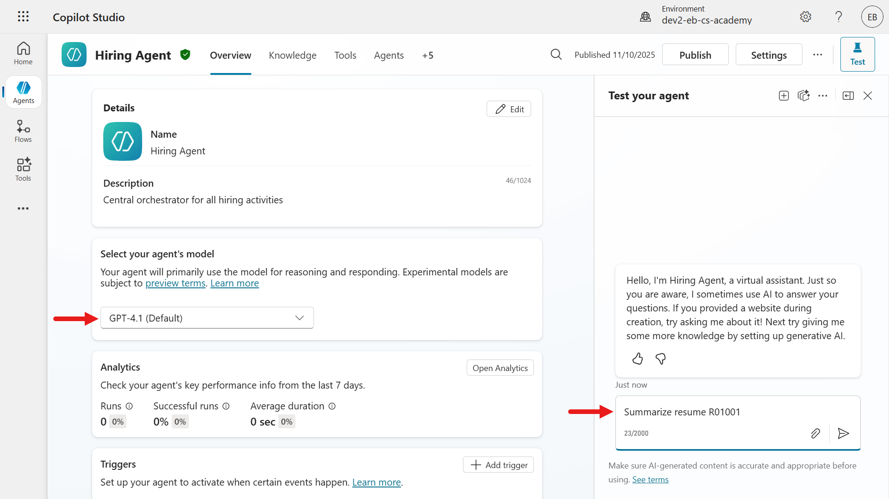

1. A summary of the resume will next be displayed and we can see it's in the output of bullet points by headings. There's also a reference to the Dataverse row for the **Active Resumes** system view.

       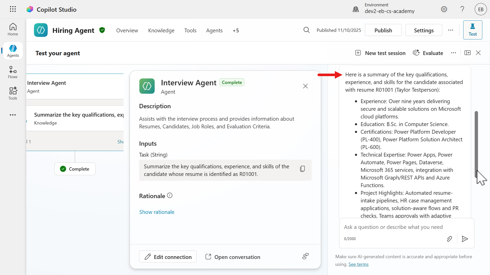

       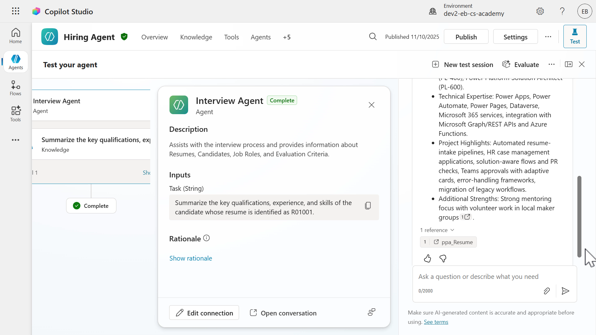

1. We'll ask another question for suggestions of interview questions to ask based on the evaluation criteria of a job role, and provide what the potential answers are. Enter the question below.

    ```text
    Can you provide suggestions of questions to ask in an interview for the Power Platform developer role (Job role number J1004) based on its associated evaluation criteria? Can you also please provide what the answers may be for each question?
    ```

       

1. The returned response lists interview questions in numbered format. Each question is followed by a `Model Answer`. Notice how the answer is in the point of view of the candidate, the model refers to the answers in first-person writing.

       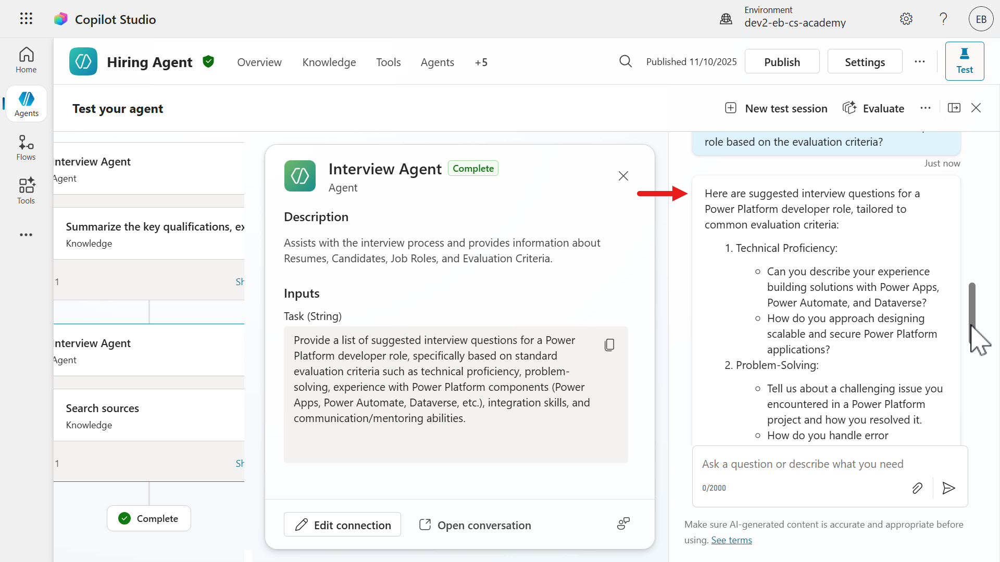

       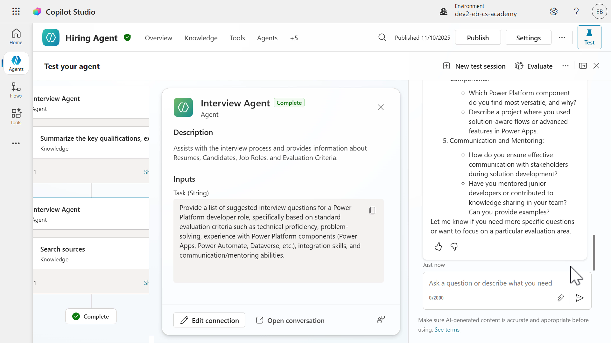

1. Let's now change the agent's model. In the **Overview** tab select the **chevron** icon and from the list of **OpenAI** models, select **GPT-5.1 Chat**.

       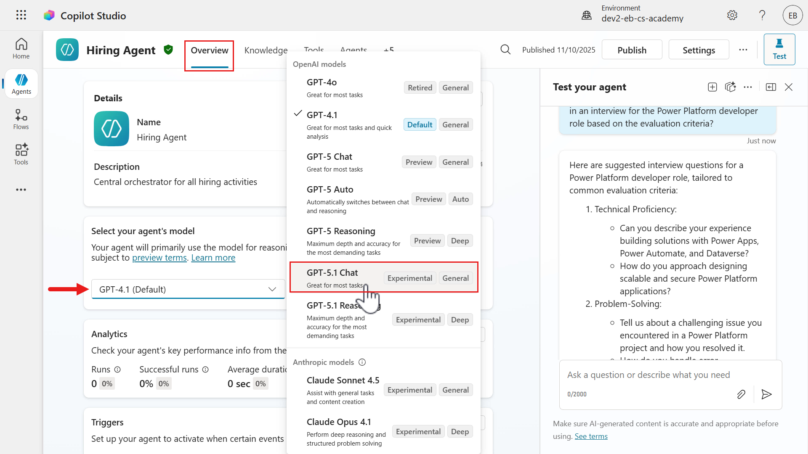

1. A confirmation message will appear shortly to inform you that the agent model has been updated. Let's now test the responses of this model by starting a new test session.

       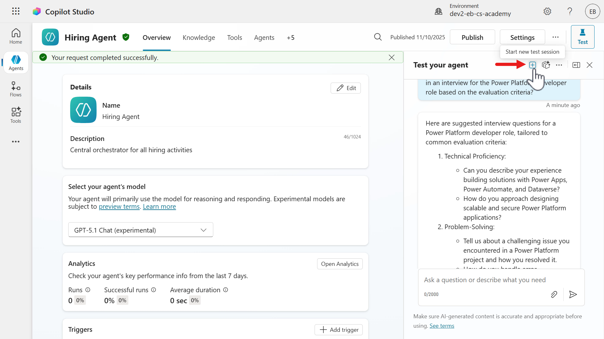

1. Enter the following question below. Use a **Resume Number** value from your existing active resumes in the **Hiring Hub** model-driven app.

    ```text
    Summarize resume RXXXXX
    ```

       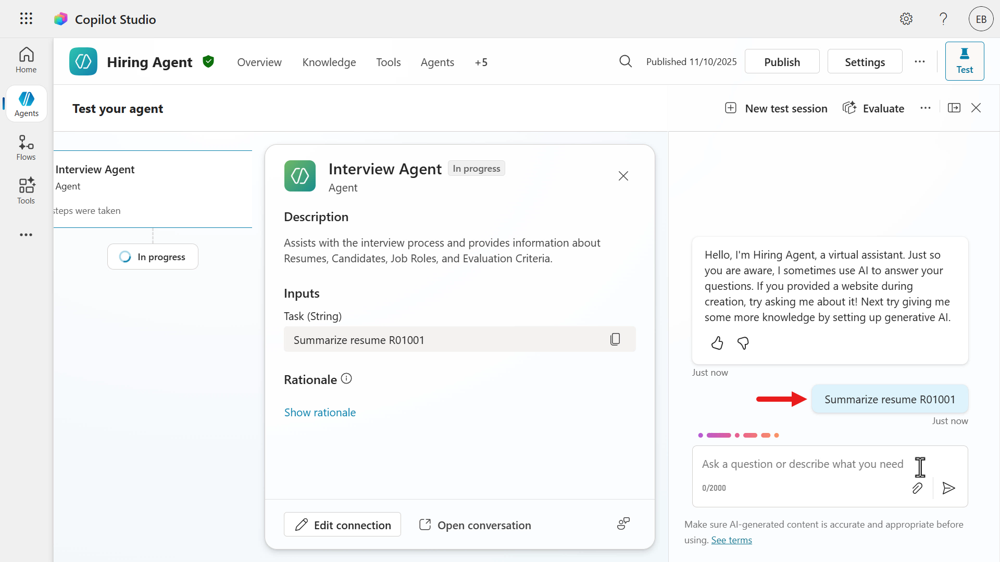

1. A response with the summarized resume is returned. Notice how it is shorter and more concise compared to the previous model's response.

       

1. We'll ask the same second question for a list of interview questions based on the evaluation criteria of a job role, and provide what the potential answers are. Enter the question below.

    ```text
    Can you provide suggestions of questions to ask in an interview for the Power Platform developer role (Job role number J1004) based on its associated evaluation criteria? Can you also please provide what the answers may be for each question?
    ```

       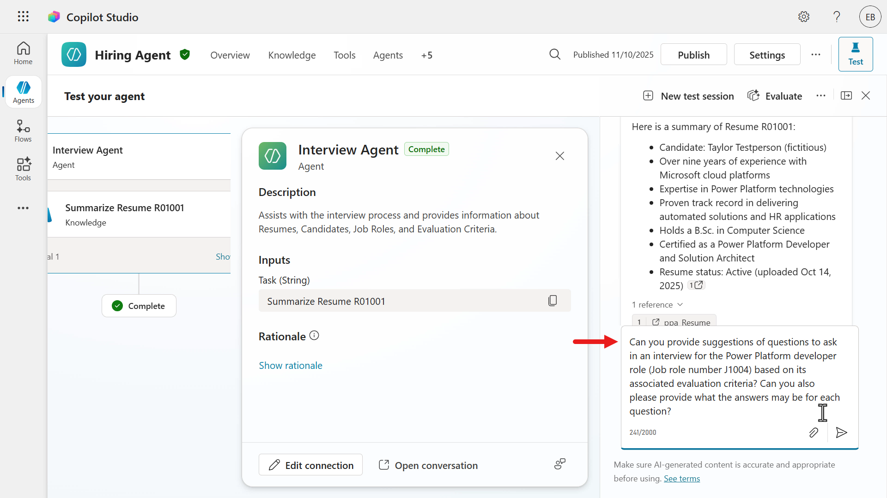

1. A response with the suggested list of interview questions is returned with the potential answers a candidate can provide during the interview. Notice how this time,

    - The response is organized under a **main header** and **subsections**
        - **Question Header**: 15. Environment Strategy
            - This indicates the interview question being evaluated
                - How do you structure environments for enterprise deployments?
        - **Strong Answer Indicators**:
            - This subsection lists key points that the agent considers strong or desirable in a candidate's response.

       

       

### 5.2 Adding instructions for response formatting

Coming soon

## ✅ Mission Complete

Congratulations! 👏🏻 Excellent work, Operative.

✅ Change model: you learned the differences of the outputs of the selected model of the **Interview Agent**.
✅ Response formatting: you added instructions to enhance the response format of the **Interview Agent**.

This enables the **Interview Agent** to be equipped in answering questions and inquiries using the power of the selected model and elegantly follow the same response format each time.

This is the end of **Lab 05 - Model selection and response formatting for the Interview Agent**, select the link below to move to the next lesson.

⏭️ [Move to **AI Safety and Content Moderation** lesson](../06-ai-safety/README.md)

## 📚 Tactical Resources

📖 [Multi-agent orchestration and more: Copilot Studio announcements](https://www.microsoft.com/microsoft-copilot/blog/copilot-studio/multi-agent-orchestration-maker-controls-and-more-microsoft-copilot-studio-announcements-at-microsoft-build-2025/#copilot-studio-enhancements)

📖 [Choose an external model as the primary AI model](https://learn.microsoft.com/en-us/microsoft-copilot-studio/authoring-select-external-response-model?WT.mc_id=power-188561-ebenitez)

📖 [Connect to Anthropic's AI models](https://learn.microsoft.com/en-us/copilot/microsoft-365/connect-to-ai-models?WT.mc_id=power-188561-ebenitez)

📖 [Allow external large language models (LLMs) for generative responses](https://learn.microsoft.com/en-us/power-platform/admin/allow-llm-generative-responses?WT.mc_id=power-188561-ebenitez)

📖 [Move data across regions for Copilots and generative AI features](https://learn.microsoft.com/en-us/power-platform/admin/geographical-availability-copilot?tabs=new#copilots-and-generative-ai-features-that-depend-on-data-movement-across-regions?WT.mc_id=power-188561-ebenitez)

📖 [Provide feedback on Anthropic models](https://community.powerplatform.com/forums/thread/?groupid=db8f53c2-767d-47d6-a1ae-fe4c828a6553)
