# Mission 09: Generate a Candidate Interview Questions Document

--8<-- "disclaimer.md"

## 🕵️‍♂️ CODENAME: `OPERATION DOC ASSEMBLY`

> **⏱️ Operation Time Window:** `~45 minutes`

## 🎯 Mission Brief

Welcome, Operative. Your previous missions have shown you the power of prompts. You learned about multimodal document analysis and grounding your prompts with Dataverse data. Now you'll unlock another prompt capability: **document generation**.

Your assignment, should you choose to accept it, is **Operation Doc Assembly**. In this operation you'll be creating a word document of interview prep questions from a prompt and calling that from an agent.

## 🔎 Objectives

In this mission, you'll learn:

1. How to configure prompts to output to a Word document
1. How to format a Word template to be used in a prompt
1. How to execute a prompt from an agent

## Lab 9: Generating an Interview Document

When a job application is added, you want to automate the process of preparing a detailed interview document. This should be a Word document that summarizes the applications key information (name, current role, experience, etc), the role information (job title, requirements) and creates unique specific interview questions based on the applicant background and role they are applying for.

### Prerequisites to complete this mission

1. Before starting this mission you need to:

    - **Have completed [Mission 08](../08-dataverse-grounding/README.md)** and have the agent ready and a good understanding of Dataverse grounding

### 9.1 Create the prompt

Your first objective: create a prompt capable of analyzing a job description and candidate profile to create tailored interview questions.

1. Sign in to [Copilot Studio](https://copilotstudio.microsoft.com) and select **Tools** from the left navigation.
    

1. Select **+ New tool** button
    

1. Select **Prompt**
    
  
1. **Rename** the prompt from the default timestamp name (E.g. *Custom prompt 09/04/2025, 04:59:11 PM*) to `Interview Question Document Prep`.

    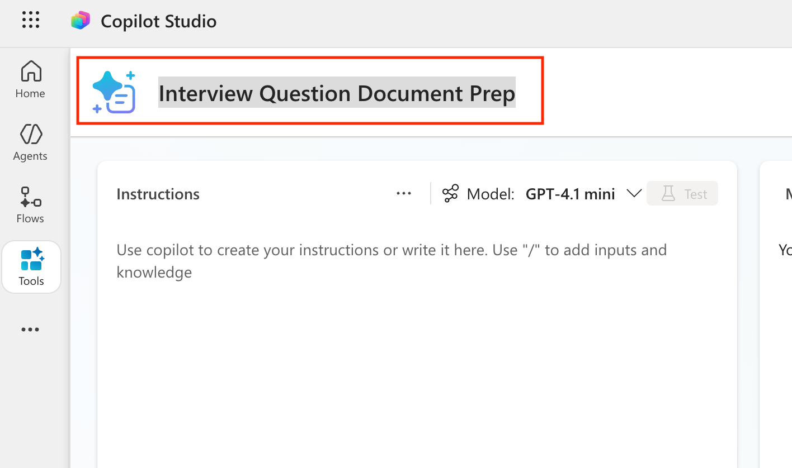

1. In the Instructions field, add this prompt:

    ```text
    You are tasked with evaluating a candidate’s resume against a specific job listing description and generating a targeted set of interview questions to support structured candidate screening.
    ### Instructions
    
    1. **Extract Candidate Details:**
        - Identify and extract the candidate’s full name.
        - Extract contact information, specifically the email address.
        - Identify the candidate’s current or most recent job title.
        - Extract location if present.
        - Estimate total years of experience only if supported by resume dates.
    
    2. **Analyze the Job Listing Description:**
        - Review the job description to identify:
        - Must-have requirements
        - Nice-to-have requirements
        - Key responsibilities
        - Required tools and technologies
        - Treat must-have requirements as the highest priority for evaluation.
    
    3. **Evaluate Resume Against Job Requirements:**
        - Compare the resume content against each must-have requirement.
        - For each requirement, determine:
            - Evidence level: Strong, Moderate, Weak, or Missing
            - A confidence score from 0–100
            - Supporting evidence using short phrases grounded in the resume text only
        - Do not infer or invent experience.
    
    4. **Assess Overall Candidate Fit:**
        - Identify:
            - Top strengths (up to 5)
            - Key gaps (up to 5)
            - Risks or concerns only when supported by missing or unclear evidence
            - Provide a concise one-paragraph summary suitable for recruiter review.
    
    5. **Generate Interview Questions (Exactly 10):**
        - Generate exactly 10 interview questions based on the job requirements and resume evaluation.
        - Distribute the questions as follows:
            - 5 Core Requirement Questions focused on the most critical must-have requirements.
            - 3 Gap or Clarification Questions targeting weak, missing, or ambiguous areas.
            - 2 Scenario-Based Questions derived directly from key job responsibilities.
        - Avoid generic or culture-only questions unless explicitly required by the job description.
    
    **Interview Question Requirements:**
        - Each question must include:
            - The interview question
            - The job requirement it maps to
         - Questions must be specific, non-duplicative, and grounded in the provided inputs.
         - Produce questions in numbered format (1, 2, 3)
    
    ### Input Data
    
    Application Number:  /ApplicationNumber
    Candidate Details (Name, Email): /CandidateDetails
    Resume Details: /Resume Details
    Job Details (Job Number, Title, Description and Requirements): /JobDetails
    Evaluation Criteria (Weighting, Evaluation Criteria): /Criteria
    ```

1. In a new tab, go to make.powerapps.com and find the **Job Application** table. Take note of one of the job application numbers in that table that you want to use for testing.

    

1. Go back to your prompt and scroll down to the **input data** section of the prompt. Find the **/ApplicationNumber** text. Delete that and type a **forward slash (/)** to open up the add input panel and configure the input as follows:

    | Parameter Name | Type | Sample Data |
    |-----------|------|-------------|
    | ApplicationNumber | Text  | Enter a job application number you copied from the step previous step |

1. Now that we have an input to pass in the Job Application number, we want to get other relevant information for this prompt from Dataverse using Dataverse Grounding.

!!! tip "Tip"
If you want to get an in-depth understanding of Dataverse Grounding, be sure to go through [module 8](../08-dataverse-grounding/README.md).

To configure Dataverse grounding for our prompt, find the remaining forward slashes in the **Input Data** section of the prompt and replace according to the table below:

    | Parameter Name | Table | Columns | Filter attribute | Filter value |
    | -------------- | ----- | ------- | ---------------- | ------------ |
    | CandidateDetails | Dataverse -> Job Application -> Candidate (Candidate)| Candidate Name, Email | Application Number |Add Value -> Application Number |
    | ResumeDetails | Dataverse -> Job Application -> Resume (Resume)| Cover Letter, Resume Number, Resume Title, Summary | Application Number |Add Value -> Application Number |
    | JobDetails | Dataverse -> Job Application -> Job Role (Job Role)| Description, Job Role Number, Job Title | Application Number |Add Value -> Application Number |
    | Evaluation Criteria | Dataverse -> Job Application -> Job Role (Job Role) -> Job Role (Evaluation Criteria)| Criteria Name, Description, Weighting | Application Number |Add Value -> Application Number |

The completed input section should look like the screenshot below
    

1. It's always a good idea to test as you go along. Select **Test** to see the initial text output from your prompt and confirm it is pulling the correct information from Dataverse.  
    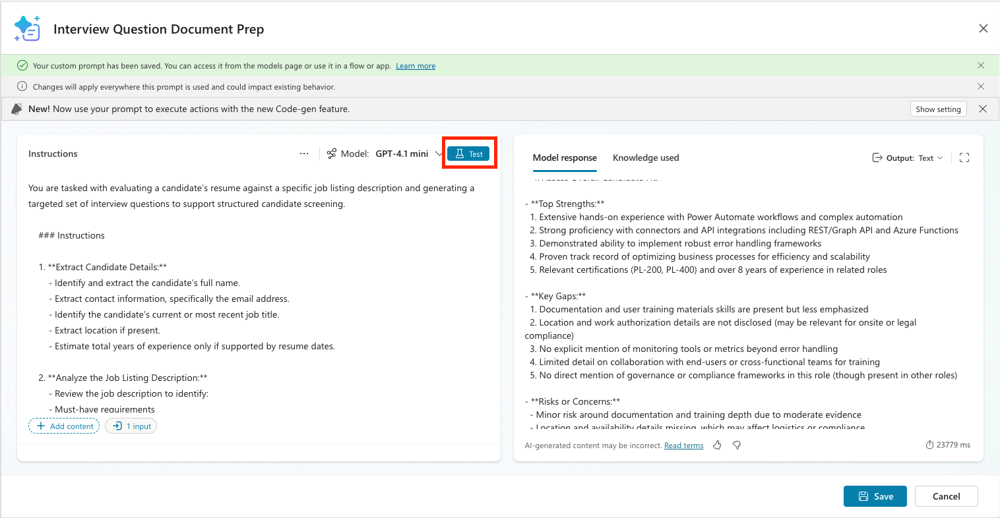

1. Because we want to have this prompt generate a document, we need to change the model the prompt is using to one that supports multi-modal inputs and outputs. To do this, select the **model dropdown** and change it to **GPT-4.1**
    

1. In order to have the prompt populate a Word document as the output, you need a Word template for it to fill. We have provided a template for you to use.  [Click this link to download](./assets/Interview_Questions_Template.docx) the template file and open it. The template itself is nothing special, they key thing you need to know is how to add the placeholders for where the prompt will insert the text. Anywhere that you want text added to you need to put the necessary placeholder text for what you want to fill it will and wrap that in **double curly brackets {}** as shown below.

    

1. So far we have a prompt that generates a text output. To make it generate a Word document output, select the **Output** dropdown in the upper right hand corner of the results panel and choose the **Document (preview)** option.
    

1. To associate the template file with your prompt, select the **Document settings** button and either drag and drop the file you downloaded in or choose select to browse.
    

1. After you upload the file it should recognize that there are 19 identified fields (identified by looking for all those curly bracket placeholders). Select the **test** button again to see if the prompt outputs to the Word document.
    

1. You should see a response similar to the following. You'll see a link at the top to download the document. Select that and confirm that it was filled out correctly.
    
    

1. Click **Save** to save your new prompt
    


### 9.2 Create an agent flow to call the prompt

Now we need to connect the prompt to our agent. To do this, we need to add an agent flow to call the prompt and return the file to the agent.

You might be wondering why we have to do this step rather than calling the prompt directly in the agent. The reason is because currently, we can't get the contentbytes of a file (aka the actual file content) and have that reliably return a file item in the agent alone. The agent flow ensures that we can predictably extract out the file and return it to our agent.

With that out of the way, let's create the agent flow.

1. In Copilot Studio, select the **Tools** tab
    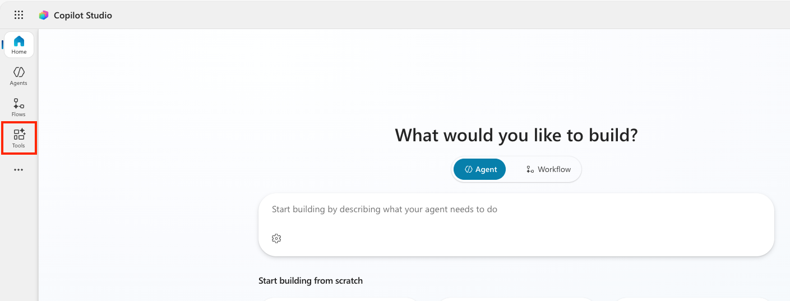

1. Select the **New tool** button
    

1. Select the **Agent Flow** option
    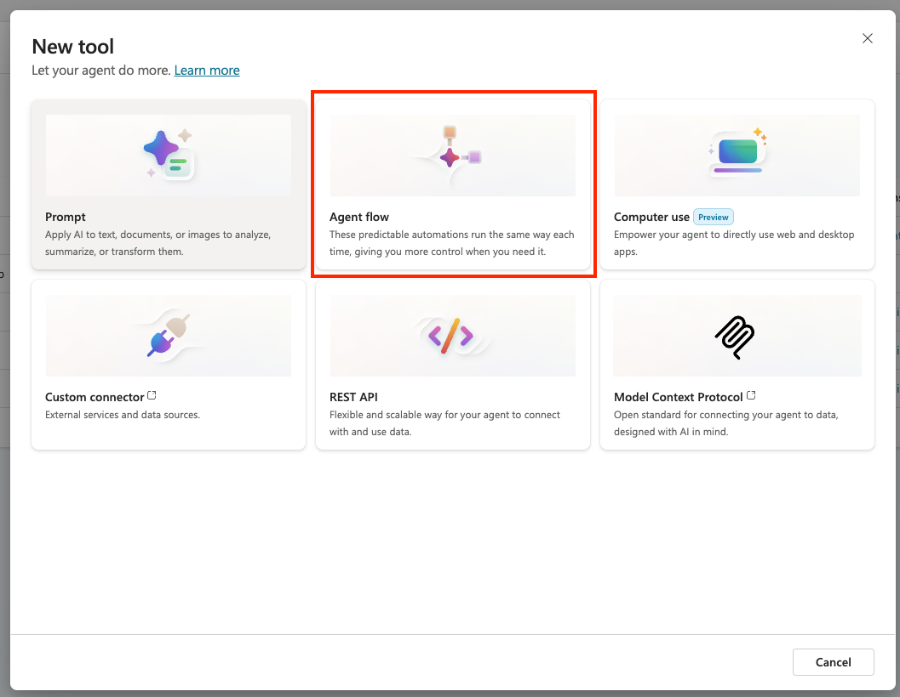

1. Click on the **When an agent calls the flow** trigger to expand it and select the **Add an input** button

    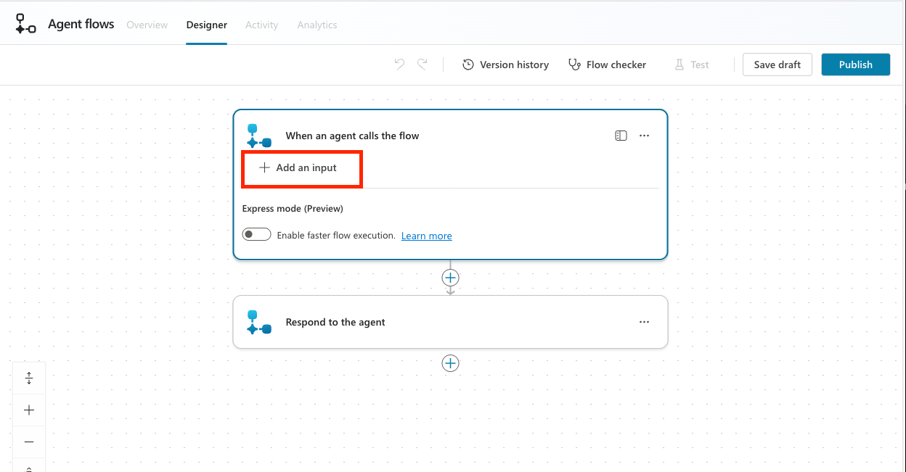

1. Select the **Text** user input type

    

1. Name the input **ApplicationNumber** and put **What's the job application number** as the description

    

1. Select the **+ plus button** below the when an agent calls the flow trigger and select the **Run a prompt** action

    

1. Select the **Interview Question Document Prep** prompt from the dropdown list

    

1. Click into the **ApplicationNumber** input and select the **lightning bolt icon**

    

1. Select the **ApplicationNumber** input that we created earlier

    

1. Click to expand the **Respond to the agent** action and select **Add an output**

    

1. Select **File** from the list of output types

    

1. Name the property **InterviewFile**. For the value, click the **fx icon** and enter the following formula then click **Add**

     ```text
            binary(outputs('Run_a_prompt')?['body/responsev2/predictionOutput/documentOutput/contentBytes'])
    ```

    

    > **Note:** This formula is necessary to properly extract the file from the output so we can return it to our agent.

1. Select **Save Draft** to save the flow

    

1. Select the **Overview** tab

    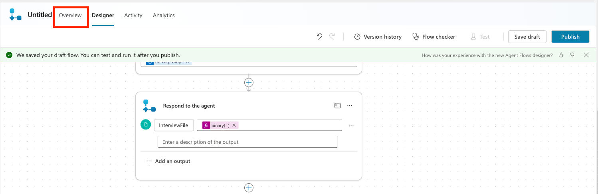

1. Select the **Edit** button next to Details

    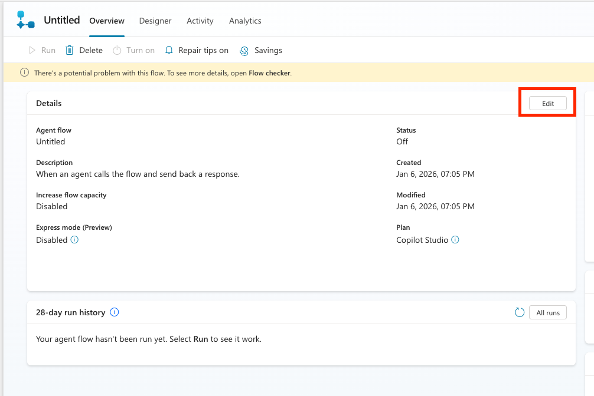

1. Put **Doc Prep** in the Flow name and **Creates an interview prep document and returns to the agent** in the description. Then slick **Save**

    

1. Select the **Designer** tab

    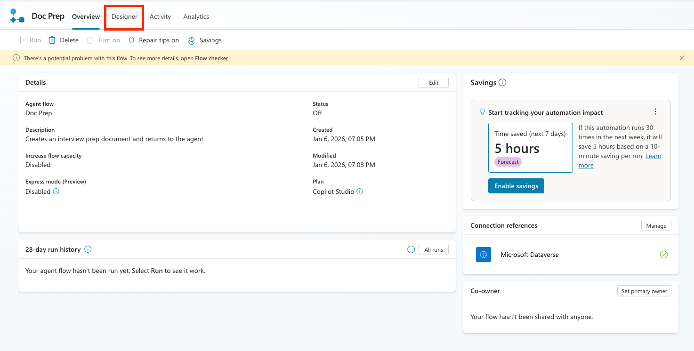

1. Select the **Publish** button to publish your flow

    

### 9.3 Create the topic

Now we will tie all of this together with our agent by adding a topic.

A topic is required rather than adding it to the agent instructions because currently, it is the only way to ensure that a file object is returned every time.

Let's create the topic:

1. Click the **Agents** tab in Copilot Studio and select the **Interview Agent**. Select the **Topics** tab
    

1. Select the **Add a Topic** button and the **From blank** option
    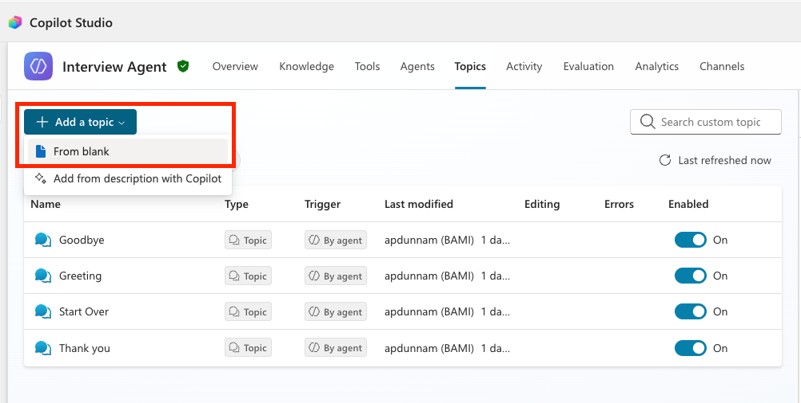

1. Change the name of the Topic by replacing the "Untitled" name with **Generate Interview Doc**
    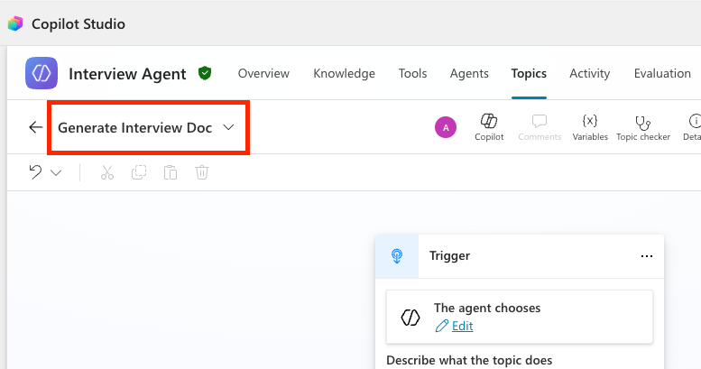

1. In the Topic Trigger, enter the following for the **description**

    ```text
    This topic generates an interview prep document with applicant details, role details and interview questions.
    ```

    

1. We need to be able to pass the Job Application Number we want to create the interview prep file for into our topic. To do that, we will use an AI feature in Copilot Studio called slot filling. This allows the generative orchestration of the language model to identify the values to bring into the topic.

    To do this, select the **Details** button in your topic
            

1. Select the **Input** tab in the details panel and select the **Create a new variable** button
    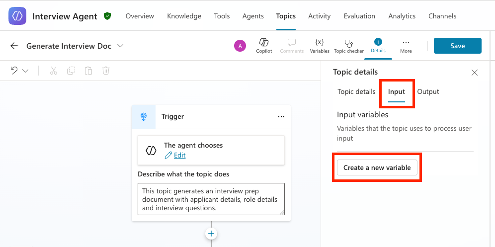

1. For the **Variable name** change it to **VarApplicationNumber**. For the **Description** put in

     ```text
        Fill with the Job Application Number referenced in the chat. The number always starts with a J followed by at least 4 digits.
    ```

    Keep all the other properties the same.
 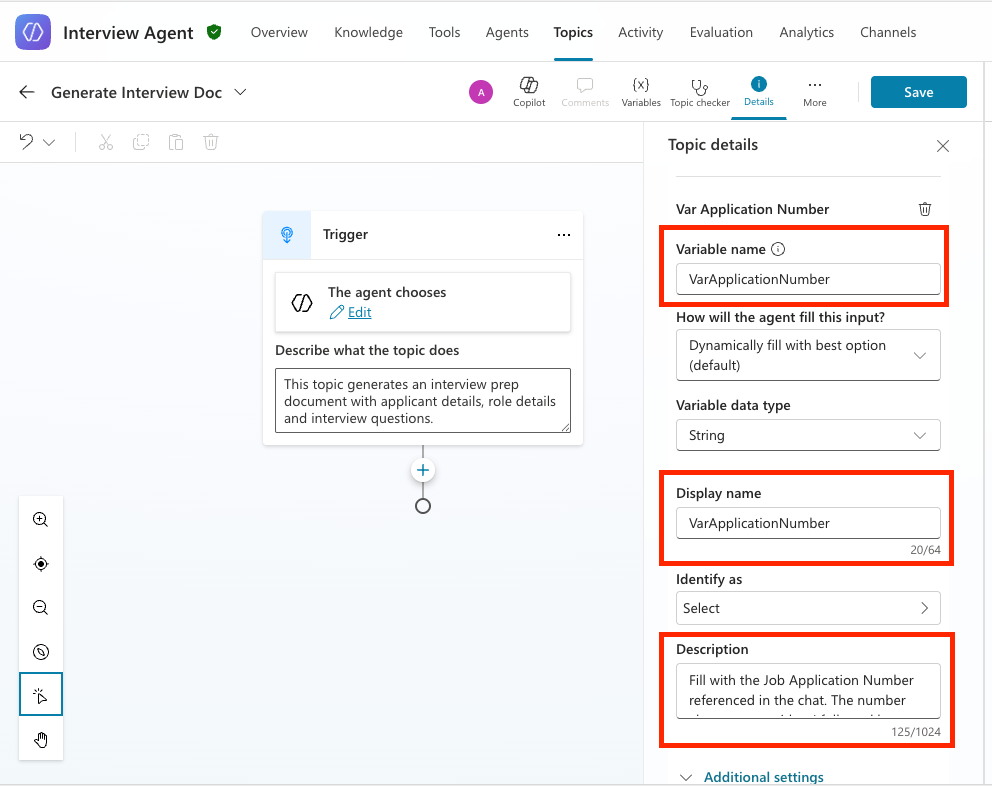

1. Select the **+ plus icon** after the trigger then select **Add a Tool** and locate and select the **Doc Prep** flow from the list that we created earlier

    

1. Click into the **ApplicationNumber** input in the action, click the **... three dots** and choose the **VarApplicationNumber** variable to map that to the input

    

1. Now we need to add a message node to return the file to the user. To do this, click the **+ plus icon** below the action you added and select the **Send a message** action

    

1. In the textbox, type **Here is your interview prep file:**. Then click the **Add** button and choose the **File** option.

    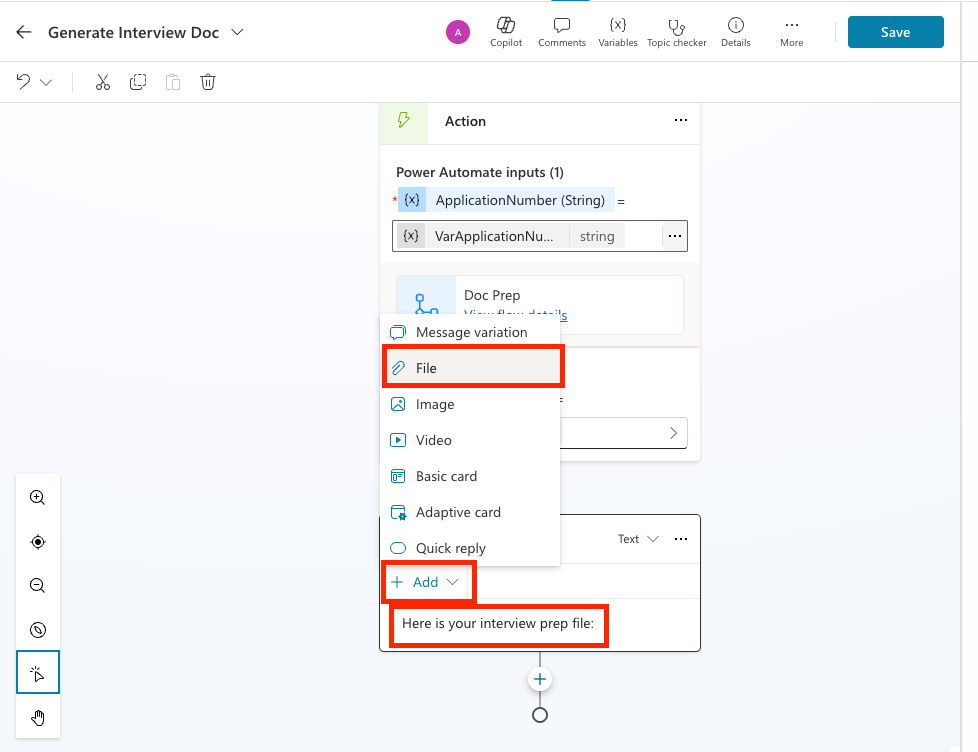

1. Click in the **Content** input, select the **... three dots** and choose the **InterviewFile** property

    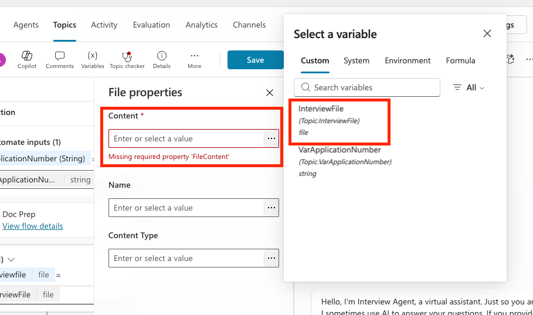

1. Click in the **Name** input, select the **... three dots** and select the **Formula** tab

    

1. In the formula window type the following formula and select the **Insert** button

    ```text
    Topic.VarApplicationNumber&"InterviewPrep.docx"
    ```

    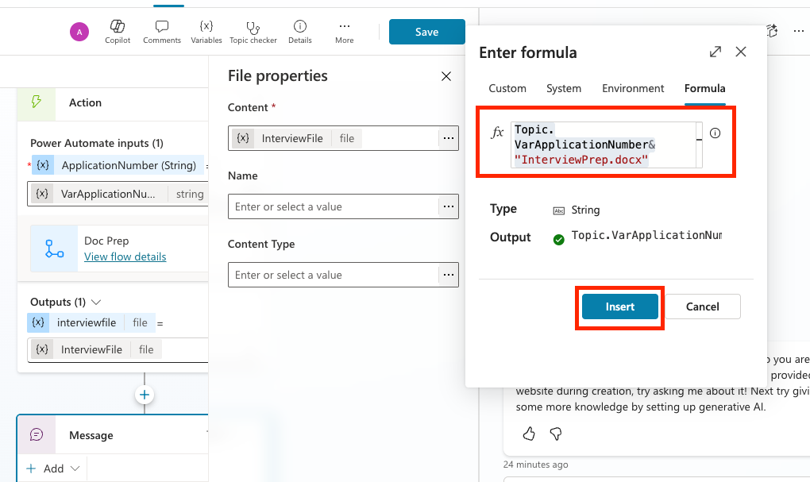

1. Select the **Save** button to save the topic

    

1. Now let's test and make sure our new topic is working. Open up the test panel and type in the following (replace the J1000 number with a relevant job application number in your Job Application table):

    ```text
    Create an interview prep file for job application J1000
    ```

    Press **Enter**

    

1. Notice how it calls the topic, passes in the application number in, calls the flow and returns the file. Click on the document link and notice how it downloads the interview prep document to your hard drive.

    

1. Open up the document and make sure that it is filled in correctly

    

Congratulations! You just successfully added document generation capabilities to your agent!

## 🎉 Mission Complete

Great work, Operative! **Operation Doc Assembly** is now complete. You've successfully enhanced your agent with document generating capabilities!

🚀 **Next up:** In your next mission, you'll learn how to use the power of MCP servers to help add interview meeting scheduling and planning capabilities.

⏩ [Move to Mission 10: Integrating with MCP](../10-mcp/README.md)

## 📚 Tactical Resources

📖 [Document output in prompts](https://learn.microsoft.com/en-us/microsoft-copilot-studio/generate-document-output-prompt?WT.mc_id=power-182762-apdunnam)

📖 [Use your own data in a prompt](https://learn.microsoft.com/ai-builder/use-your-own-prompt-data?WT.mc_id=power-182762-apdunnam)

📖 [Create a custom prompt](https://learn.microsoft.com/ai-builder/create-a-custom-prompt?WT.mc_id=power-182762-apdunnam)

📖 [Work with Dataverse in Copilot Studio](https://learn.microsoft.com/microsoft-copilot-studio/knowledge-add-dataverse?WT.mc_id=power-182762-apdunnam)

📖 [AI Builder custom prompts overview](https://learn.microsoft.com/ai-builder/prompts-overview?WT.mc_id=power-182762-apdunnam)

📖 [Training: Create AI Builder prompts using your own Dataverse data](https://learn.microsoft.com/training/modules/ai-builder-grounded-prompts/?WT.mc_id=power-182762-apdunnam)
