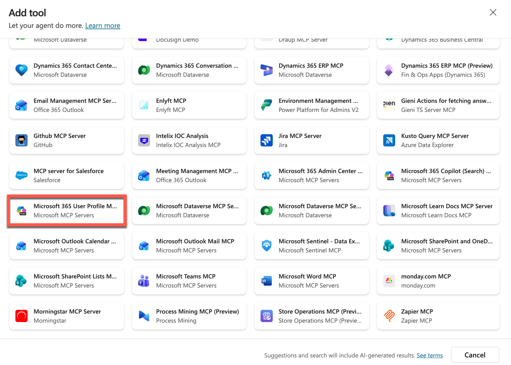
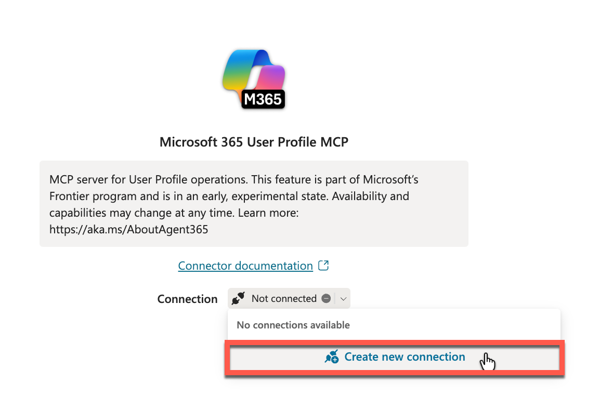
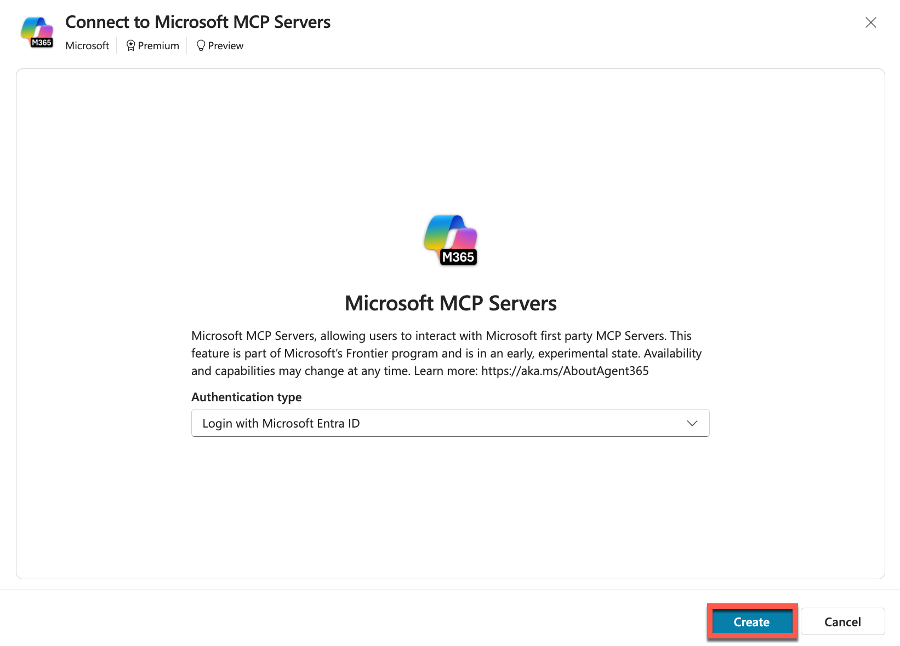
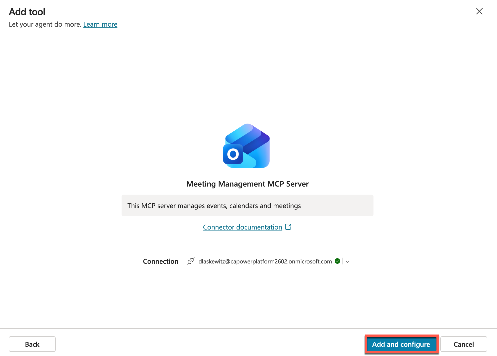
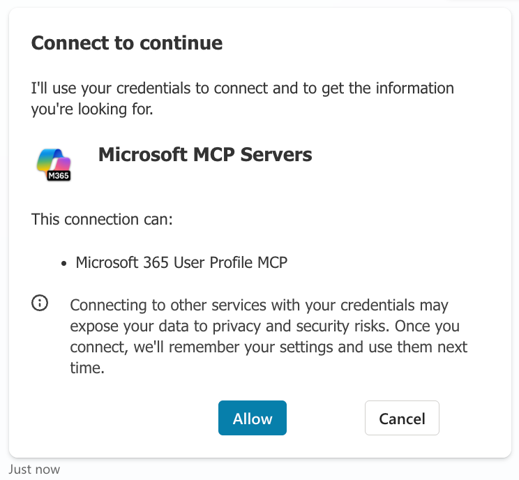
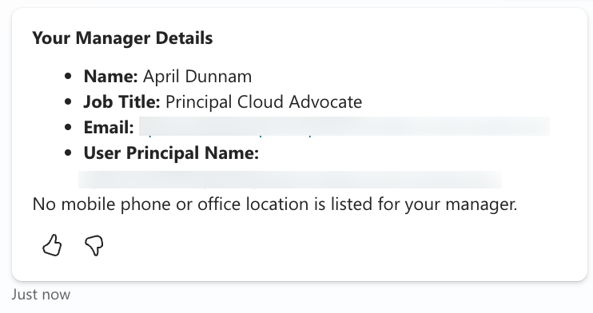
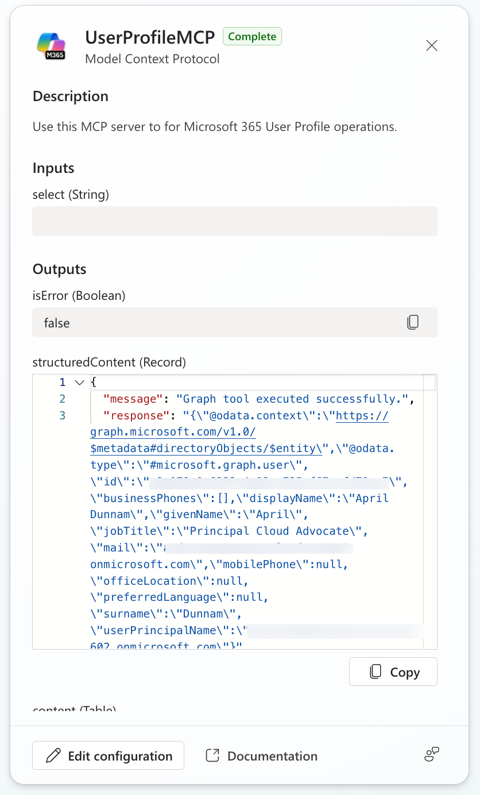
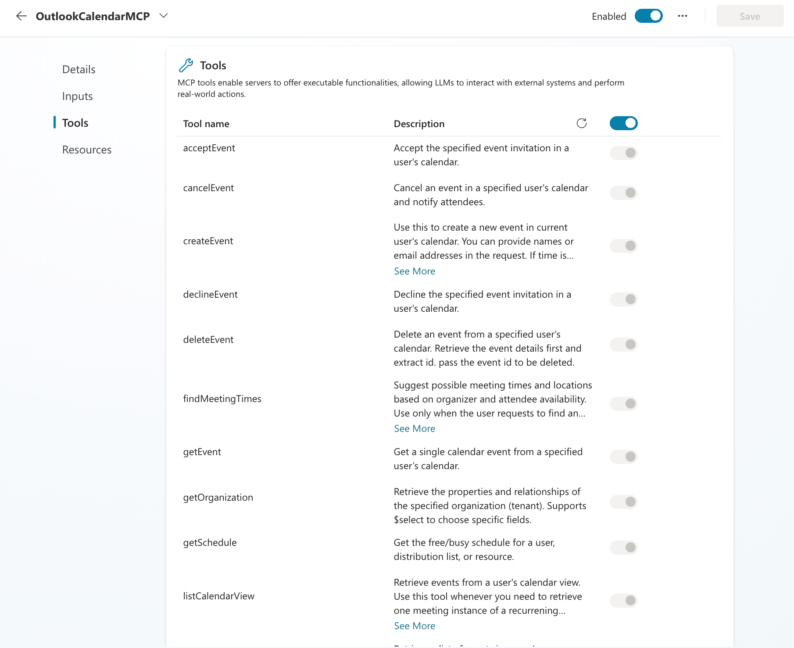
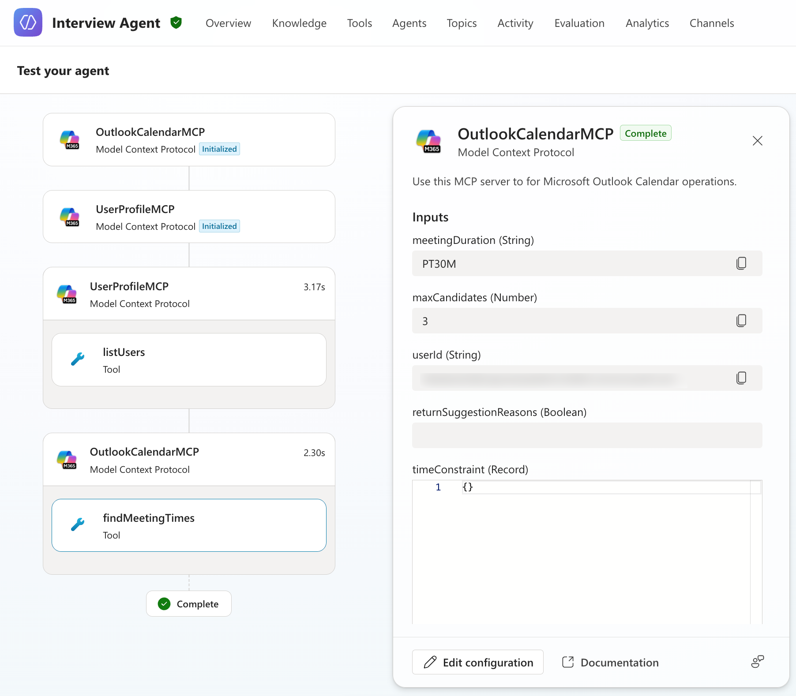

# Mission 10: Integrate with MCP Servers

--8<-- "disclaimer.md"

## 🕵️‍♂️ CODENAME: `OPERATION MCP RENDEZVOUS`

> **⏱️ Operation Time Window:** `~45 minutes`

## 🎯 Mission Brief

Welcome, Operative. Your previous missions have shown you the power of prompts. You learned about multimodal document analysis, grounding your prompts with Dataverse data and document generation. Now you'll unlock another advanced capability: **Model Context Protocol (MCP) server integration**.

Your assignment, should you choose to accept it, is **Operation MCP Rendezvous**. In this operation you'll be connecting your agent to external MCP servers to extend its capabilities, enabling it to arrange interview prep meetings.

## 🔎 Objectives

In this mission, you'll learn:

1. How to understand and work with the Model Context Protocol (MCP) standard
1. How to use Agent 365 to integrate MCP servers with your Copilot Studio agents
1. How to connect your Copilot Studio agent to MCP servers
1. How to leverage MCP server capabilities within your agents

## 🔌 What is MCP?

**Model Context Protocol (MCP)** is an open standard that enables AI assistants to securely connect to external data sources and tools. Think of MCP as the **USB-C of AI integration** – just as USB-C provides a universal connector for various devices and peripherals, MCP provides a standardized way for AI systems to connect to different services, databases, and applications.

Before USB-C, every device had its own proprietary connector (remember all those different charger cables?). Similarly, before MCP, connecting AI agents to external systems required custom integrations for each service. MCP solves this by providing a universal "plug-and-play" protocol.

### ✨ Key benefits of MCP

- **Universal connectivity**: One standard protocol works across different AI platforms and data sources
- **Secure access**: Built-in authentication and permission controls protect your data
- **Extensibility**: Easily add new capabilities to your agents without rewriting core logic
- **Interoperability**: MCP servers can work with multiple AI assistants and applications

In this mission, you'll use MCP to connect your Copilot Studio agent to external services, dramatically expanding what your agent can do beyond its built-in capabilities.

## 🛠️ Where does Agent 365 come in?

**Agent 365** is Microsoft's comprehensive platform for managing and extending AI agents at enterprise scale. It gives each AI agent its own **Microsoft Entra Agent ID** for identity, lifecycle, and access management, while providing the infrastructure to safely connect agents to business systems through MCP servers.

Think of Agent 365 as the **enterprise control plane** for your AI agents - it handles security, governance, and observability while enabling agents to interact with Microsoft 365 and business applications through standardized MCP tooling servers.

### 👥 How Agent 365 serves different roles

Agent 365 addresses the needs of everyone involved in the agent ecosystem:

- **IT Administrators**: Monitor agent activity, enforce policies, and manage threats through the Microsoft 365 admin center
- **Security Teams**: Apply enterprise-grade controls for identity, authentication, and compliance with Microsoft Purview and Defender integration
- **Developers**: Build and extend agents using unified SDKs, pre-built MCP servers, and frameworks in Copilot Studio or Azure AI Foundry
- **Business Decision Makers**: Deploy agents securely and measure their impact on productivity and business outcomes
- **Information Workers**: Collaborate with agents seamlessly to amplify productivity

### 🔧 Agent 365 tooling servers for MCP integration

Agent 365 provides **enterprise-grade MCP servers** that give your agents safe, governed access to business systems:

**Pre-built MCP servers** for Microsoft 365 and business applications:

- **Outlook Calendar**: Create, update, and manage calendar events
- **Outlook Mail**: Send, read, and search emails  
- **Teams**: Create chats, post messages, and manage channels
- **SharePoint & OneDrive**: Upload files, manage lists, and search documents
- **Word**: Create and edit documents, add comments
- **Dataverse & Dynamics 365**: Perform CRUD operations on business data
- **User Profile**: Access user information, managers, and direct reports
- **Copilot Search**: Chat with Microsoft 365 Copilot and ground responses with files

**Enterprise security and governance**:

- **Centralized control**: Manage all MCP servers through the Microsoft 365 admin center - allow or block servers organization-wide
- **Scoped permissions**: Agents only access the resources they need based on Microsoft Entra scopes
- **Full observability**: Monitor and audit all tool calls using Microsoft Defender Advanced Hunting
- **Policy enforcement**: Apply DLP, MIP, rate limits, and security scans at runtime
- **Threat protection**: Detect and remediate attacks targeting agents with Microsoft Defender integration

**Custom MCP server creation**:

- Build scenario-specific servers using the **MCP Management Server** - an API-first tool for creating custom MCP servers
- Connect to **1,500+ Power Platform connectors** (ServiceNow, JIRA, etc.)
- Integrate **Microsoft Graph APIs**, **REST APIs**, and **Dataverse custom APIs**
- Publish and certify custom servers for your organization
- Enable ISVs to build and publish certified servers

**Developer experience**:

- Available in both **Copilot Studio** (low-code) and **Azure AI Foundry** (pro-code)
- Built into the **Agent 365 SDK** for seamless integration
- **Visual Studio Code** integration for creating and testing custom MCP servers
- Consistent, standardized interfaces across all tooling servers

### 💡 Why this matters for your agents

Agent 365 transforms MCP from an open standard into an enterprise-ready platform. Your agents get:

- **Deterministic, auditable actions** - every tool call is tracked and governed
- **Production-grade reliability** - all MCP servers undergo rigorous testing for accuracy, latency, and reliability  
- **Security by default** - enterprise controls are built-in, not bolted on
- **Rapid development** - pre-built servers for common scenarios, easy customization for specialized needs
- **Unified management** - one control plane for all agents, regardless of where they're built

### 🎯 What you'll focus on in this mission

While Agent 365 offers a comprehensive platform for agent management, governance, and custom MCP server development, **this mission focuses specifically on using pre-built MCP servers** in Copilot Studio.

You'll learn how to connect your agent to ready-made tooling servers (like Outlook Calendar and Teams) and enable real actions in Microsoft 365 applications - without building custom integrations. Think of this as learning to use the tools already in the toolbox before building your own.

## 🧪 Lab 10: Add MCP Servers to arrange an interview prep-meeting

> [!IMPORTANT]
> For this lab, you need to make sure that you are part of the [Frontier preview program](https://adoption.microsoft.com/copilot/frontier-program/) to get early access to Microsoft Agent 365. Frontier connects you directly with Microsoft’s latest AI innovations. Frontier previews are subject to the existing preview terms of your customer agreements. As these features are still in development, their availability and capabilities may change over time.

### 📋 Your journey so far

Throughout Missions 1-9, you've built a comprehensive hiring automation system. You started by deploying the Hiring Agent and foundational Dataverse infrastructure, then mastered agent instructions to control behavior and communication. You implemented multi-agent orchestration with connected agents and automated workflows with event-driven triggers. Along the way, you personalized agent responses with model selection and formatting, implemented content moderation and AI safety controls, and extracted resume data using multimodal prompts. You enhanced prompts with Dataverse grounding for dynamic data access and generated Word documents with interview prep questions. Now, you'll take your agent's capabilities even further by connecting it to MCP servers.

### Add MCP servers to the Interview Agent

> [!WARNING]
> In this lab, you will learn how to add two MCP servers: the *Microsoft 365 User Profile MCP server* and the *Microsoft Outlook Calendar MCP*. In this lab, you will need to have the following added:
>
> - Have a manager configured for your user
> - Have an appointment on your calendar in the upcoming 24 hours - this is because you will test the MCP server by asking "Get my meetings for today"
> - Have an extra user created on your tenant, so that you can invite that user for the interview prep-meeting ([How to create a user in M365](#-tactical-resources))
> - For that extra user, the mailbox needs to be provisioned and it would be good to set the working days / hours

To add MCP servers to your agent you only have to add one tool per MCP server. This is different to connector tools. You have to add a tool for every connector action with that. The MCP Server makes this a lot easier.

#### Add the Microsoft 365 User Profile MCP server

1. Open [Copilot Studio](https://copilotstudio.microsoft.com) and **open** the previously created Interview Agent
1. Select **Tools** in the top navigation

    

1. Select **Add a tool** to start adding the MCP Server

    

1. Select **Model Context Protocol** in the filters to filter the tools down to only MCP Servers

    

1. Select the **Microsoft 365 User Profile MCP server** from the tools list

    

1. Select **Create new connection** from the connection dropdown

    

1. Select **Create** to start the create a connection process

    

1. Select **your account** in the pick your account popup to create the connection

1. After picking your account, you will see the following screen. Select **Add and configure** to add the Microsoft 365 User Profile MCP server to the Interview Agent

    

1. If you scroll down on the tool overview page, you can find the MCP tools that are part of the MCP server:

    

1. Next, select **Test** to test out the newly added tool
1. Send the following prompt to the agent in the test pane:

    `Who is my manager?`

1. Select **Allow** to consent that you are OK with the MCP server using your data. This consent card will only show once for the agent and this MCP server combination, after you have allowed it for this agent it will not prompt again (unless you add another MCP server that uses the same connector).

    

    Next, you will see the response from the agent. If all goes well, you will see something like this:

    

    If you look on the left of the *Test your agent* pane, you will see that the agent initialized the MCP server, and it triggered the *getMyManager* MCP tool. You can also see the details of what the agent sent and received from the MCP tool.

    

The first part of the lab is done, you can now ask questions about users on your tenant. This enables you to ask questions like:

    - Who is my manager?
    - Who are my direct reports?
    - What is the job role of Daniel Laskewitz?
    - And much much more...

You can now try out other tools if you want to as well. If you're ready, lets get the other MCP server added too.

#### Add the Microsoft Outlook Calendar MCP server

In the last section, you have added the User Profile MCP server, which makes it possible for you to work with user details on your tenant. This is very helpful when you want to for instance plan meetings, because users of your agent usually don't send a prompt that includes an email / user principal name when they want to plan a meeting. Instead, they will send a prompt like the following:

    `meeting with Daniel Laskewitz tomorrow`

To add capabilities like this, we need to add another MCP server: the Microsoft Outlook Calendar MCP server. Bear with us: the following steps are a lot like the previous section.

1. Select **Tools** at the top navigation
1. Select **Add a tool**
1. Filter the tools by selecting **Model Context Protocol**
1. Scroll down and select the **Microsoft Outlook Calendar MCP Server**

    

1. Select **Add and configure**

Now, you can scroll to the bottom again to see the tools in the Microsoft Outlook Calendar MCP server:

Let's test out this MCP server.

1. Enter the following prompt:

    `Get my meetings for today`

1. The agent will respond with the consent card again, because we added another MCP server. Select **Allow** to consent with the MCP server using your data

    

1. Now you will get a response with the meetings you have on your calendar for today:

    

### Plan an interview prep-meeting

Now, we know both the MCP servers work. We want to plan an interview prep-meeting though. So, let's see if that works too!

1. Select **New test session** to start a new test session

    

1. Enter the following prompt:

    `Can you find 3 meeting times for a 30 minute meeting with Jane Doe for an interview prep-meeting?`

    This will trigger the *findMeetingTimes* MCP tool and it will look at the calendars of both the user of the agent and the Jane Doe and figure out which times work based on their availability. It will then respond with three options for meetings:

    

    And you will be able to figure out what tools have been called in the testing pane:

    

    To plan the actual meeting you still have to respond to the agent.

1. Enter the following prompt (replace the time with one of the suggested meeting slots you got from the agent):

    `Please schedule the one on 10:30 AM UTC`

    This will trigger the *createEvent* MCP tool and schedule the meeting.

    

    It will show the following meeting request in Jane Doe's mailbox:

    

Now we're done with this lab. Hopefully this gave you a good overview of how MCP servers can help you in your agents!

## 🎉 Mission Complete

Great work, Operative! **Operation MCP Rendezvous** is now complete. You've successfully integrated external MCP servers with your Copilot Studio agent, unlocking powerful new capabilities for extending your agent's functionality!

🚀 **Next up:** In your next mission, you'll learn how to collect and analyze user feedback to continuously improve your agent's performance.

⏩ [Move to Mission 11: Collecting feedback from users](../11-obtain-user-feedback/README.md)

## 📚 Tactical Resources

📖 [Microsoft Copilot Studio ❤️ MCP Lab](https://aka.ms/mcsmcp/lab)

📖 [Model Context Protocol - Getting Started](https://modelcontextprotocol.io/docs/getting-started/intro)

📖 [Extend agents with MCP in Copilot Studio](https://learn.microsoft.com/microsoft-copilot-studio/agent-extend-action-mcp)

📖 [Microsoft Agent 365 Overview](https://learn.microsoft.com/microsoft-agent-365/overview)

📖 [Microsoft Agent 365 Tooling Servers Overview](https://learn.microsoft.com/microsoft-agent-365/tooling-servers-overview)

📖 [Microsoft 365 User Profile MCP Server](https://learn.microsoft.com/microsoft-agent-365/mcp-server-reference/me)

📖 [Microsoft Outlook Calendar MCP Server](https://learn.microsoft.com/microsoft-agent-365/mcp-server-reference/calendar)

📖 [Add users and assign licenses](https://learn.microsoft.com/microsoft-365/admin/add-users/add-users?view=o365-worldwide)
