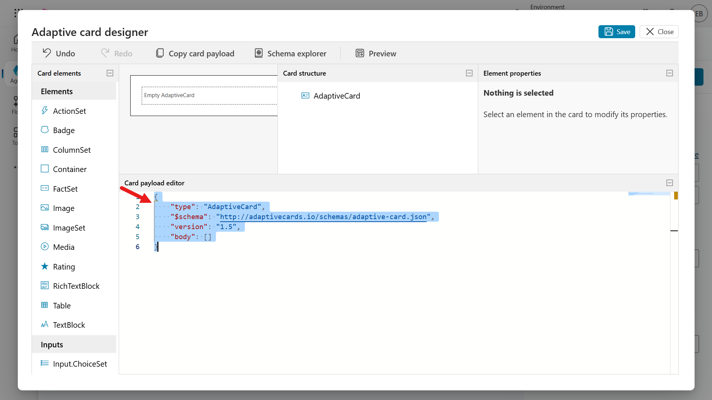
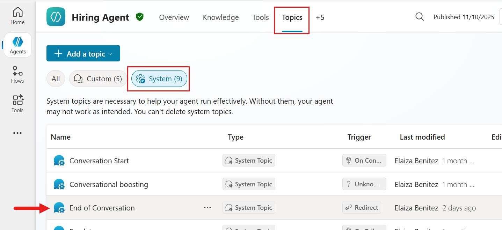
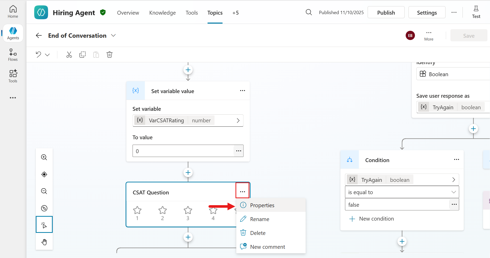
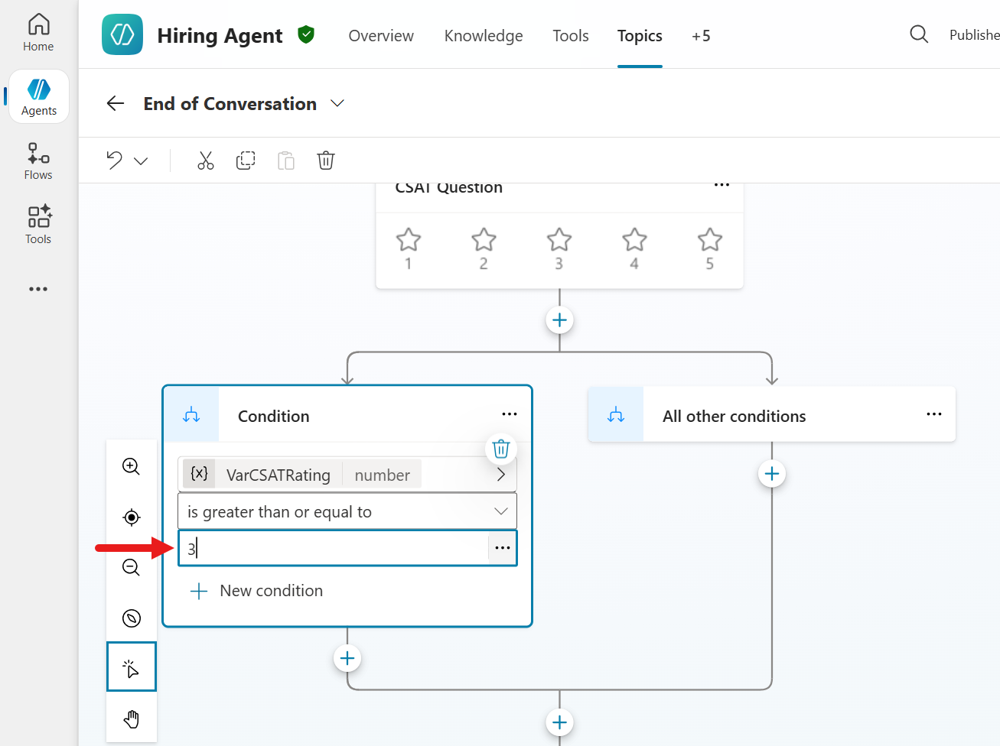
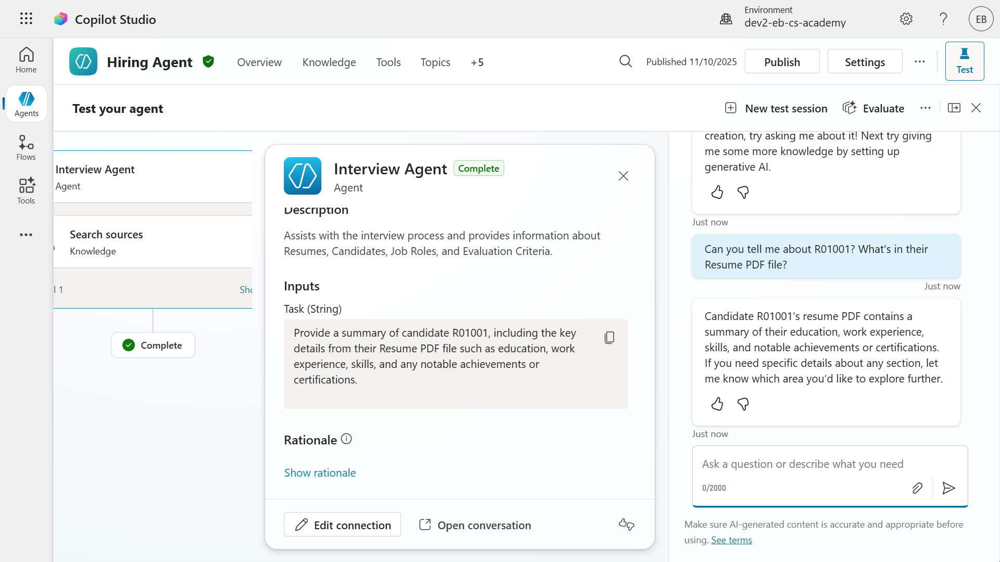
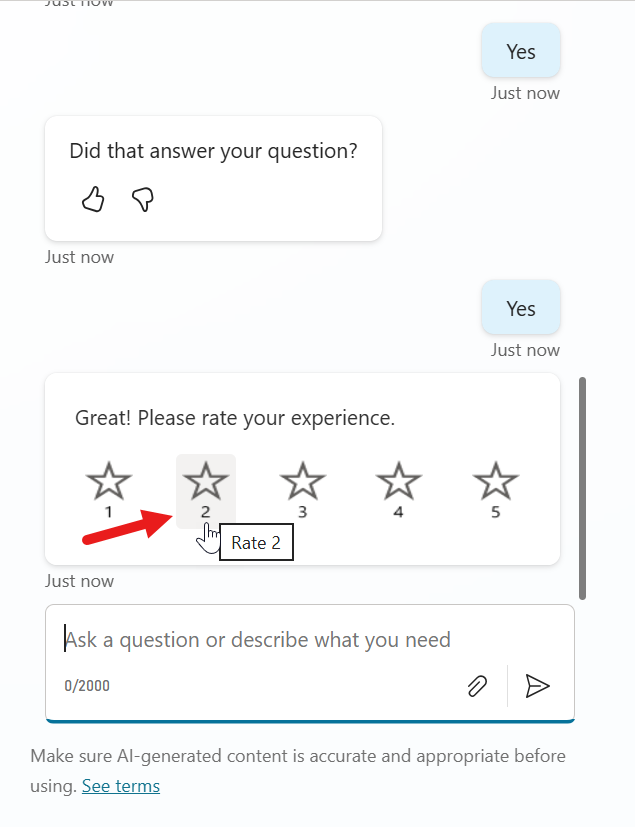
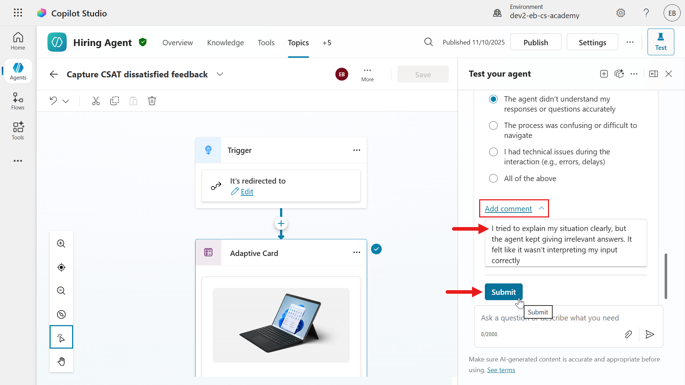
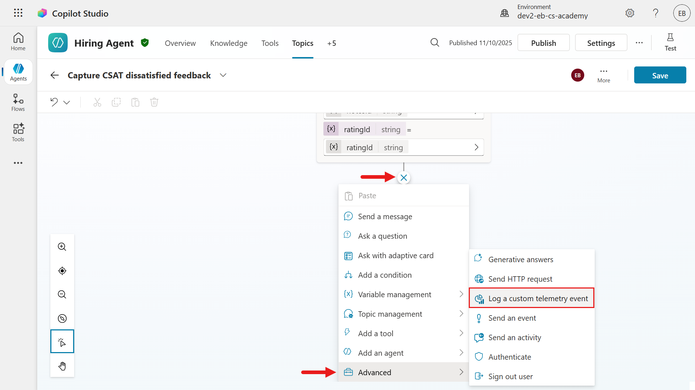
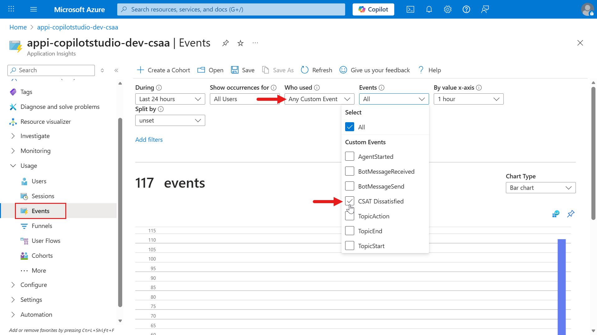

# Collecting feedback from users

--8<-- "disclaimer.md"

## 🕵️‍♂️ CODENAME: `OPERATION ECHO`

> **⏱️ Operation Time Window:** `~45 minutes`

## 🎯 Mission Brief

Welcome back, Agent. In [Mission 10](../04-agent-instructions/README.md) - you learnt how to build an effective prompt to generate documents.

Your assignment, should you choose to accept it, is **Operation Echo** - focusing on collecting feedback to understand user satisfaction towards the agents you develop. This feedback loop allows you to make iterative enhancements to your agent to ensure end user satisfaction.

TBC

Listen, modify, repeat - this is the mission when reviewing user feedback.

## 🔎 Objectives

In this mission, you'll learn:

1. TBC
1. TBC
1. TBC
1. TBC
1. TBC

## The importance of user feedback

Collecting user feedback is critical for improving a conversational agent's performance and user satisfaction. In Microsoft Copilot Studio, there are two primary mechanisms to gather feedback from users after they receive an AI-generated response:

- **Built-in thumbs up/down reactions** – a default, out-of-the-box feature where users can click 👍🏻 or 👎🏻 on each response.
- **Custom feedback via Adaptive Cards** – a customizable approach where developers insert an Adaptive Card in the conversation to solicit feedback (e.g. a rating or comment).

### 🐿️ Why gather feedback?

Collecting user feedback after agent responses is important for continuous improvement. It helps quantify satisfaction, identify knowledge gaps, and directly informs how you can refine your Copilot agent's answers. By analyzing feedback trends and comments, you can prioritize enhancements that lead to a better user experience.

## 💬 Built-in thumbs up/down reactions

Copilot Studio provides a built-in reactions feature that lets end-users react to each agent response with a thumbs-up or thumbs-down. This feature is enabled by default for all new and existing Copilot Studio custom agents, and appears across the common channels where your agent is used:

- Test Chat (in Copilot Studio’s authoring canvas)
- Web (demo or embedded website)
- Microsoft Teams (if the agent is deployed as a Teams app)
- Custom Web chat SDK integrations
- Power Apps/Dynamics 365 channels (e.g. a live chat widget)

After each AI response, users will see a small UI with 👍🏻/👎🏻 icons. They can simply click to give feedback. Optionally, after reacting, the user may be prompted to add a comment explaining their rating (for example, why they gave a thumbs down). These comments provide qualitative insight and are stored in the conversation transcripts (Dataverse) for review.

- The Copilot Studio Analytics page aggregates total reactions and the breakdown of positive vs. negative feedback.
- If a user provides a comment with their rating, it's saved to the conversation transcript. You can view these comments for context (for example, what was "not useful") via the analytics UI or directly from Dataverse records.

## 🪣 Purpose and value of thumbs reactions

The thumbs up/down system's primary purpose is to measure user satisfaction at the response level. It provides immediate, granular feedback on whether each answer fulfilled the user's needs or not. Key benefits include:

- **Quick Sentiment Signal**: A thumbs-up means the user was satisfied, while thumbs-down flags dissatisfaction. This binary signal is easy for users to provide and easy for developers to interpret at scale.
- **Aggregated “Satisfaction” Metric**: In _Copilot Studio Analytics_, a "Reactions" section (under the broader Satisfaction analytics) tallies all feedback received. You can quickly see how many responses were marked positive or negative over time. This serves as a satisfaction scorecard for your agent's responses.
- **Identify Improvement Areas**: By filtering or reviewing thumbs-down instances and their comments, developers can spot patterns. For example, specific topics or questions that often get negative feedback. These are prime candidates for improving your knowledge base or refining your prompts.
- **No Coding Required**: Since it's built-in, makers do not need to configure anything to start collecting this feedback (the setting is on by default). The data is automatically available in the Copilot Studio analytics dashboard.

### Why it matters

This reaction mechanism gives immediate, objective insight into how well the AI is performing from the user's perspective. Reviewing user feedback helps identify new user scenarios and issues, and make improvements based on what users are asking for. In short, thumbs feedback is a quick pulse-check on each answer's usefulness

## Viewing and interpreting feedback analytics

Copilot Studio provides a dedicated analytics view to make sense of the collected reactions:

- **Reactions Chart**: On the agent's **Analytics** tab, the **Satisfaction** section includes a **Reactions** chart counting how many times users clicked 👍🏻 vs 👎🏻 for the selected time period. This gives an at-a-glance ratio of positive to negative feedback. For example, you might see that out of 100 total reactions, 78 were thumbs-up and 22 thumbs-down, indicating a 78% per-response satisfaction rate.
- **Filter and Details**: You can drill down by selecting "See details" on the Reactions chart. This typically lets you filter feedback by type (all/thumbs-up/thumbs-down) and view the list of user comments associated with each feedback. Comments are extremely useful – a thumbs-down by itself signals a problem, but the user's comment might explain why `"The answer was incorrect"` or `"Didn't address my question"` etc.
- **Trend Over Time**: The analytics can be viewed for different date ranges (last 7 days, 30 days, etc., up to 90 days). Monitoring trends helps see if recent changes to the agent improved satisfaction - for example, an increase in thumbs-up percentage after adding a new knowledge source.
- **Session CSAT vs Per-Response Reactions**: The **Satisfaction** analytics also include a **Survey results** section for end-of-session customer satisfaction (CSAT) surveys. Don't confuse this with the per-response thumbs reactions:
      - _Reactions_: feedback on individual answers (our focus here)
      - _Survey Results_: an optional overall rating at the end of a conversation (a 1–5 star survey). Both appear under **Satisfaction** analytics, but thumbs reactions specifically populate the **Reactions** chart.

Interpreting the data: A high ratio of 👍🏻 vs 👎🏻 means most answers are on target. A spike in 👎🏻 for certain questions might reveal a knowledge gap or a misunderstanding by the AI. For instance, if many users give a thumbs down after asking about "pricing" it signals the agent's answer on pricing is unsatisfactory – perhaps outdated or incomplete. Developers should investigate those chat transcripts and improve content for that topic.

!!! tip "Best Practice"
    Regularly review thumbs-down feedback comments. They often contain direct clues `"The agent gave the wrong definition"` or `"It didn't cite a source"` that you can address by updating your knowledge base or refining prompts.

## 📒 Managing the reactions feature

Because this feature is on by default, makers should be aware of how to manage it:

- You can disable user feedback reactions in case you don't want to gather this data (or during testing phases). In the agent's **Settings**, under **User feedback**, there is a toggle `Let users give feedback when using this agent` which can be turned `Off` or `On`. By default it's `On`.
- You can also provide a **disclaimer** to users about feedback usage. For example, you might add a note like `"Your feedback will be used to improve the service. Please do not include sensitive information in comments."` This is especially important in a public-facing agent for transparency and compliance.
- **Data Storage**: All feedback records (including any user comments) are stored in the agent's Dataverse environment, tied to conversation sessions. If needed, advanced users can query the Dataverse directly - for instance, to export all feedback data for offline analysis. For most purposes, however, the built-in analytics UI is sufficient.

!!! tip "Best Practice"
    If your agent is public or customer-facing, definitely keep the feedback feature `On` - it provides invaluable insight. If your agent is in a limited trial or internal-only, you might temporarily turn it off to avoid confusing testers, then re-enable for real users. Always abide by user feedback privacy guidelines (hence the optional disclaimer).

## 📇 Collecting feedback via Adaptive Cards - custom approach

An alternative to the built-in feature is building a custom feedback prompt using an Adaptive Card. We covered adaptive cards previously in [Recruit](../../recruit/10-add-event-triggers/README.md). As a reminder: Adaptive Cards are essentially UI panels defined in JSON that you can embed in an agent's conversation to collect input or display information. In this context, you design a card that asks the user for feedback - for example, `"Please rate this answer"` with buttons or a dropdown, and the user's response is sent back to the agent as structured data.

Unlike the built-in reactions, this method requires the developer (or "maker") to configure the agent's topics to insert the card and handle the responses. Copilot Studio allows adding an Adaptive Card in the following nodes within a topic:

- **Ask a question**
- **Ask with adaptive card**
- **Send a message**

This means after the agent generates an answer, you can immediately follow up with a custom adaptive card asking for feedback before the conversation continues.

### How it works

1. **Generate the answer and store it**: First, ensure you have the agent's answer available to include in the card. For example, the Copilot Studio guidance suggests using a **Generative Answers** node to produce the answer and save it to a variable (example: `Global.VarStoreAnswer`). This variable can hold the AI's response text.

1. **Show Adaptive Card with feedback options**: Immediately after the answer, add a node that supports Adaptive Cards to display the answer text and ask for feedback. The adaptive card's JSON defines what the user sees – the answer text, a prompt like `"Was this answer helpful?"`, and two action buttons (perhaps one for 👍🏻 "Useful" and one for 👎🏻 "Not useful"). You could also design other input types, like a 5-star rating, a text box for comments, or multiple-choice options. Adaptive Cards are very flexible, so you can tailor the feedback question format to your needs.

1. **User selects an Option**: When the user clicks a button or submits the card, that action returns a payload to the agent. Typically, the card's buttons use `Action.Submit` with some custom data. For instance, one button might return a value `{ "Feedback": "Useful" }` and the other returns `{ "Feedback": "NotUseful" }`. In the [example](https://learn.microsoft.com/microsoft-copilot-studio/guidance/adaptive-card-add-feedback-for-every-response) provided by Microsoft, the card's JSON has `selectAction` data set to a string like `"This generated answer was useful"` or `"wasn't useful"` for the two icons. This data comes back as the user's response.

1. **Agent handles the feedback data**: Now it's up to your agent's logic to do something with that feedback. This can be achieved using a topic or trigger to catch the submitted response. For example, you might configure the conversation such that if the user's input (from the adaptive card) equals "This generated answer wasn't useful", it triggers a particular topic - perhaps asking an additional question like `"Sorry to hear that. Could you tell me what was wrong?"`. Or more simply, you might just log it in a datasource and acknowledge `"Thanks for your feedback!"` without further interaction.

1. **(Optional) Store or forward the feedback**: The feedback collected via Adaptive Card is not automatically saved to the Analytics like the built-in reactions. If you want to persist this data for analysis, you should explicitly store it. For example, you could call a Power Automate flow or an API to record the feedback in a database or SharePoint list, including context like which question it was for. Alternatively, since the feedback appears as part of the conversation transcript (the user's selection is essentially a message from the user), it will be saved in Dataverse conversations. But it will be in a raw text/JSON form, you'd have to extract it for reporting.

!!! tip "Best Practice"
    Adaptive Cards in Copilot Studio are supported in all channels that the agent supports, but be mindful of Adaptive Card schema version differences. Copilot Studio uses Adaptive Cards v1.6 in the web test chat, but Microsoft Teams and some other channels support up to **v1.5**. In practice, this means if you design your card with features only in 1.6, it _might not_ render in Microsoft Teams. Best practice is to stick to v1.5 features for broad compatibility, or test your card in each channel. The good news is the typical feedback card (text, buttons) is basic and works fine in all channels.

## 🦜 Why use Adaptive Cards for feedback

Using an Adaptive Card for feedback requires additional effort to set up, but it offers greater flexibility and control. Some reasons you might choose this approach:

- **Custom questions and UI**: You're not limited to a simple thumbs up/down. You could ask the user to rate on a scale of 1 - 5, choose a category for why they liked/disliked the answer, give them a range of answers to select (multiple-choice) or even ask an open-ended question for detailed comments. You design the card's content to suit your scenario.
- **Contextual or conditional feedback**: You might not want to request feedback after every single response (to avoid annoying the user). With your own logic, you could decide to ask only after certain types of answers - for example, only after a long explanation, or only if the session is about to end. You could also tailor the wording: if the answer was an error message, the card could specifically ask, `"Sorry I couldn't help – was this error explanation useful?"` This level of nuance is not possible with the generic thumbs UI.
- **Integrated workflows**: With custom feedback data, you can integrate directly into other processes. For example, if a user indicates an answer was not useful, you could automatically create a ticket for a human expert to review that query later. Or log the feedback to an **Azure Application Insights telemetry** for advanced analytics. Essentially, adaptive card feedback can plug into your own analytics or DevOps cycle more readily. The built-in thumbs data is somewhat siloed in the Copilot analytics dashboard, whereas custom-collected data is yours to route anywhere.
- **Branding and tone**: You can format the feedback card to match your agent's personality or your organization's branding (within the Adaptive Card design limits). Even the text can be changed – for example, `"Rate this response"` or using emoji on buttons  giving a consistent user experience.
- **Additional feedback gathering**: The card could ask for more than just a sentiment. For instance, a single card could both ask `"Was this helpful? (Yes/No)"` and if `"No"`, also include a quick text box saying `"What was missing?"`. All that could be submitted together. This is more advanced but illustrates the flexibility.

In summary, Adaptive Cards for feedback are ideal when you need more than a binary signal or want to handle the feedback in custom ways. It's often used by developers who want to experiment with feedback collection beyond the basics.

## ⭐ Best practices for Adaptive Card feedback

1. **Keep it brief and unobtrusive**: Users may get annoyed if after every message they have to fill out a survey. Make the card simple – usually a quick question with two buttons or a small rating scale. The [example](https://learn.microsoft.com/microsoft-copilot-studio/guidance/adaptive-card-add-feedback-for-every-response) in Microsoft's guidance shows the agent's answer in the card followed by a subtle prompt `"Generated answer, please rate it."`. The prompt is small and polite, which is good. Avoid very large or complex cards for routine feedback.

1. **Handle the response gracefully**: When the user clicks feedback, you might simply thank them silently (no need to always say `"Thanks for your feedback"` every time). In a support scenario, if someone says the answer wasn't useful, you might follow up to help: `"Sorry about that. Let me clarify or escalate your question."` This turns a negative feedback into an opportunity to recover the user's satisfaction.

1. **Data Handling and Privacy**: The feedback data from the adaptive card is just part of the conversation in terms of storage. It will _not_ show up in the Copilot Studio Analytics dashboard (since that only tracks the built-in feedback reaction mechanism). It also won't automatically appear in any compliance audits (those typically log that a user message was sent, but not the content of an Adaptive Card submission specifically). So, if analyzing this feedback is important, plan to capture it. You can create an agent flow triggered by the conversation to write each feedback entry to a separate Dataverse table or external storage along with relevant info (user ID, question asked, etc.). This way you can do your own reporting on it.

1. **Disable built-in reactions to avoid duplication**: If you are fully relying on a custom feedback card for every answer, it might be wise to turn off the default thumbs feedback in the agent settings. Otherwise, users will see two feedback requests (the thumbs UI and your adaptive card) for the same response, which is confusing and overkill. Most implementations choose either one method or the other in production. However, you could still use both in different contexts - for example, maybe you keep thumbs enabled for Teams users, but on a custom website you use a tailored card. In any case, ensure the user isn't bombarded with redundant feedback prompts.

1. **Test on all channels**: Because Adaptive Cards can render a bit differently in Teams vs. web chat, test your feedback cycle in each deployed channel. Make sure the card looks as intended and the submission is received by the agent. For instance, if using Teams, ensure the card's schema is _less than or equal to 1.5_ as noted earlier. Also verify that on mobile versions of Teams or web chat, the adaptive card is still easily usable.

!!! note ""
    In the Copilot Studio documentation [example](https://learn.microsoft.com/microsoft-copilot-studio/guidance/adaptive-card-add-feedback-for-every-response), once the adaptive card feedback was set up, they provided a YAML snippet indicating how the agent can route the "useful/not useful" responses to a specific handling topic. This is a hint at the implementation: essentially treat the feedback like an intent that triggers either a follow-up or just completes. Implementing this means editing your agent's topics (or code) to catch those JSON responses.

## 🧇 Comparison summary: thumbs reactions vs Adaptive Card feedback

Both feedback collection methods aim to improve your Copilot agent via user input, but they serve different needs. Here's a side-by-side comparison to help understand when to use each:

| Feature/aspect | Built-in thumbs up/down reactions  | Custom feedback via Adaptive Card |
|----------|------------|---------|
| **Setup and effort** | Zero setup required – enabled by default for all agents. Simply deploy your agent, and users will see 👍🏻/👎🏻 on each response. | Requires configuration: you must add an Adaptive Card node to your topics and define its JSON, then handle the submitted data. Moderate effort for developers.  |
| **Feedback format** | Binary sentiment (Positive or Negative). Users can optionally add a text comment with their rating | Fully customizable. Could be binary as well, or multi-choice, rating scale, text input, or any combination. The card's JSON defines the format |
| **User experience** | Simple and unobtrusive: one click for thumbs up/down. The option is presented uniformly on all channels (icon buttons). | Potential for richer interaction, but if overused can be intrusive. You control the wording and look. Make sure the card is concise so it doesn't overwhelm the chat UI |
| **Data captured** | Reaction (+ optional comment). Example: `"thumbs down (with comment: 'irrelevant answer')"`. No structured category beyond up/down. | Whatever data you design. Example: you might capture `"Rating: 3 stars"` or `"FeedbackChoice: NotUseful + Reason: Outdated info"`. The card submission is received as a JSON payload (key-value pairs) which you can parse |
| **Analytics and visibility** | Automatically aggregated in Copilot Studio **Analytics** in **Satisfaction** section. Shows total count of 👍🏻 vs 👎🏻, and allows filtering/viewing comments | Not shown in Copilot Studio Analytics by default. These responses are essentially part of the conversation flow (stored in transcripts) and do not feed the out-of-box dashboards. You need to create your own reporting mechanism if you want to summarize this feedback. |
| **Extensibility** | Limited (thumbs UI is fixed). Can't change the question or add more options to built-in mechanism. You can turn it off or on, that's it. | Extensible. You craft the adaptive card and can evolve it. Example: adding a third option `"Partially helpful"`, or asking a follow-up question if they respond negatively. Also, you decide when to invoke it (doesn't have to be every turn). |
| **Ideal use cases** | General satisfaction monitoring for your agent's answers. Best when you want a quick gauge of every response's quality and a simple success metric to track over time. Great for initial deployments to gather broad feedback with minimal effort. | Deep feedback or custom workflows. Useful when specific insights are needed, Example: which of several answers is better, or when integrating feedback into other systems (like creating bug reports, triggering human review). Also valuable if you want to collect feedback in a specific format such as _category tags_ that the built-in reactions mechanism doesn't support. |

As a rule of thumb (no pun intended 😆), **start with the built-in thumbs feedback** for any new agent – it's easy and provides immediate value in understanding user satisfaction. As your solution matures, if you find the need for more nuanced feedback, you can experiment with an Adaptive Card approach.

Some advanced implementations even use both: for example, keeping thumbs up/down _enabled_, but also asking a targeted question via an adaptive card at the end of a session (like a mini survey). In that case, you'd get per-response sentiment (via reactions) and an overall session rating or comment (via your card). However keep in mind that the built-in CSAT is also covered by the Copilot Studio Analytics as highlighted earlier. Therefore as we learnt in this mission, record responses from adaptive cards to build your own custom reporting.

Ultimately, for most scenarios using one method at a time is clearer. If you opt for custom adaptive cards, it often makes sense to disable the default reactions to provide a single, cohesive feedback channel to the user.

## 🎀 Wrapping it up (summary)

| ⚡ **Built-in reactions: quick wins** | 🛠️ **Adaptive cards: custom fit** |
|------------|------------|
| Enable built-in 👍🏻/👎🏻 reactions to rapidly gauge user satisfaction on each answer. This yields instant analytics (no coding) and helps identify trouble spots early. | Use adaptive cards for feedback when you need more than a `yes/no`. You can ask tailored questions and route feedback into your own data stores or workflows for deeper analysis and action. |

## 🧪 Lab 11 - Provide feedback using built-in interactions vs adaptive cards (custom)

We're now going to provide feedback as a user using the following methods,

1. Built-in user interactions and review them using the Analytics page of the agent.
1. Build a custom adaptive card to collect feedback when the user has responded as dissatisfied with a 1 star or 2 stars for the CSAT survey. Bonus exercise of logging this as a telemetry event in Azure Application Insights.

### ✨ Prerequisites to complete this mission

For the built-in interactions to be captured in the Analytics page of the agent, the agent must be published. Ensure the **Interview Agent** is published.

### 11.1 User feedback through built-in interactions

1. In Microsoft Teams, load the Interview Agent and start asking it questions.

1. In the responses, select the **thumbs up** icon by the message to provide positive feedback with a comment, or select the **thumbs down** to provide negative feedback with a comment.

       1. Positive feedback comment examples

          ```text
          Clear and Concise: The response was easy to understand and well-structured.
          ```

          ```text
          Accurate and Relevant: The information provided was correct and directly addressed the question.
          ```

          ```text
          Helpful and Actionable: The response included practical steps or examples that I could apply.
          ```

          ```text
          Comprehensive: The answer covered all aspects of the question without leaving gaps.
          ```

          ```text
          Engaging and Professional Tone: The response was friendly, respectful, and appropriate for the context.
          ```

          ```text
          Adapted to Context: The response considered the specific scenario and provided tailored guidance.
          ```

       1. Negative feedback comment examples

          ```text
          Incomplete or Vague: The response lacked detail or didn’t fully answer the question.
          ```

          ```text
          Inaccurate or Misleading: The information provided was incorrect or not relevant to the query.
          ```

          ```text
          Overly Complex or Hard to Follow: The explanation was confusing or used unnecessary jargon.
          ```

       

1. Repeat until you have submitted several reactions with written feedback.

### 11.2 Reviewing built-in analytics

We're now going to review the feedback submitted in the **Analytics** page of the agent.

!!! note
    The submitted reactions and written feedback may take some time to show up in the Analytics page so if you're seeing it immediately, check it occasionally.

1. Navigate to the **Analytics** tab of the agent and scroll down to the **Satisfaction** section. In the **Reactions** section, select **See details**. This will load the **Reactions** pane where you can view all the thumbs up and thumbs down for the period and the written feedback.

       

### 11.3 Build adaptive card to collect custom feedback

In this exercise we're going to implement a process in the **Hiring Agent** to collect custom feedback in response to the built-in CSAT survey. When the user has responded with 1 star or 2 stars for the CSAT survey, we want to collect additional feedback to understand why they were dissatisfied. This will also give you hands-on learning on how to modify existing system topics.

The following is what you'll learn:

1. Create a new custom topic that contains the custom adaptive card to capture feedback.
1. Modify an existing System topic, **End of conversation**, where a condition will route to the new custom topic that handles the custom feedback.

Let's go!

#### 11.3.1 Create a new custom topic

1. In the **Hiring Agent**, browse to the **Topics** tab. Select **+Add a topic** and select **From blank**.

       

1. Name the topic as the following,

    ```text
    Capture CSAT dissatisfied feedback
    ```

    In the Trigger node, select the **Change trigger** arrows icon and select **It's redirected to**.  This new topic will be triggered when it's explicitly called from an existing topic with through the **Go to another topic** node.

       

1. Next, we'll add a new node that will display the custom adaptive card to the user. This custom adaptive card will collect their dissatisfaction feedback based on their CSAT survey response. Select the **+ icon** and select the **Ask with adaptive card** node.

       

1. Now it's time to configure the adaptive card 😊 Select the node and the **Adaptive Card Node properties** pane will appear. We're now going to edit the JSON. Select **Edit adaptive card**.

       

1. This is the **Adaptive Card Designer** where you can design your card and see the card design in-real time. Click into the **Card payload editor** and select all lines using the Windows keyboard shortcut of _Ctrl + A_ or using the Mac keyboard shortcut of _Command + A_, followed by deleting the lines. **Paste** the JSON from the [CSAT Feedback JSON file](assets/11.3.1_CSATFeedback.json).

       

1. Notice how the **Card Preview** now includes elements that display some text and a list of available devices. Select **Save**.

       

1. Select **Preview** to view the card in different widths. The preview will load where you'll see different card outputs by width. The JSON accounts for responsive design so narrow widths will show different layout compared to the standard width.

       

1. Exit out of **Preview** by selecting the **x icon** or **Close**. Then close the **Adaptive Card Node properties** panel by selecting **X Close**.

1. In the authoring canvas of the topic, you'll see the adaptive card. Scroll to the bottom of the node and you'll see output variables. The `notesId` and the `ratingId` were defined in the element properties. These two variables will store values from the card elements the users interact with. These values will be used in the bonus exercise of this lab.

       

#### 11.3.2 Modify End of Conversation system topic

We're now going to update the **End of Conversation** system topic to redirect to the **Capture CSAT dissatisfied feedback** custom topic created previously.

1. Navigate to the **Topics** tab. Select **System** and select the **End of Conversation** system topic.

       

1. Scroll down to the **Condition** node that checks the `SurveyResponse` variable. Select the **+ icon** below the node and select **Add node**.

       

1. Select **Variable management** and select **Set a variable value**.

       

1. Select **Create a new variable**. This is to declare a variable that will store the user's response to the CSAT question node.

       

1. Select the variable and update the variable name to the following in the **Variable properties** pane.

    ```text
    VarCSATRating
    ```

    In the **To value** field, enter `0`.

    !!! note "Purpose of the **To value** field"
        This is a numeric variable that will store the CSAT rating.

       

1. In the **CSAT Question** node select the **... ellipsis** icon and select **Properties**.

       

1. In the **CSAT Question properties** panel, there will be a field displayed where you can reference the variable to save the response rating selected by the end user. Enter the following which references the variable created earlier.

    ```text
    Topic.VarCSATRating
    ```

       

1. Next, we'll add logic to the topic to redirect to the **Capture CSAT dissatisfied feedback** custom topic when the user responds with a 1 star or 2 stars. Select the **+ icon** below the **CSAT Question** node and select **Add a condition**.

       

1. The **Condition** node is now added to the system topic.

    !!! note "The logic to be applied to the Condition node"
        - If the user’s CSAT rating is `3`, `4`, or `5`, the conversation flow will follow the branch connected to this condition. This will act as a positive (satisfied) feedback path for ratings `3` and above.
        - If the rating is `1` or `2`, the conversation flow will go to the **All other conditions** branch. This will act as a negative (dissatisfied) feedback path fro rating below `3`.

    In the **Condition** node select the **greater than** icon to define the variable.

       

1. Select the **VarCSATRating** variable.

       

1. For the condition **operator**, select `is greater or equal to`.

    !!! note "The significance of the operator in a condition"
        This checks if the value of VarCSATRating meets or exceeds a specified threshold.

    For **Value**, enter the following integer,

    ```text
    3
    ```

    !!! note "The significance of the Value"
        This is the threshold number. The condition will be `true` if VarCSATRating is greater or equal to `3`.

       

1. Now let's complete the logic for when the rating is below `3` (when the user responds with a 1 star or 2 stars). In the **All other conditions** branch, select the **+ icon** to add a new node. Select **Topic management** and then select **Go to another topic >**.

       

1. Select the **Capture CSAT dissatisfied** custom topic created earlier.

       

1. The topic will now be added to the branch. The **End of Conversation** topic will now explicitly call the **Capture CSAT dissatisfied** custom topic when the user responds to the CSAT question with a 1 star or 2 stars rating.

       

1. **Save** the topic.

1. Let's now test the agent by selecting the **new test session** icon and enter a question. Any question will do, the purpose of this test is to submit a CSAT response to collect feedback for the rating below 3 stars.

       

1. The agent will return a response.

       

1. To trigger the system topic of **End of Conversation**, enter the following

    ```text
    end conversation
    ```

       

1. The **End of Conversation** topic will now be triggered as we see the text (question) from the **Ask a question node** of the topic. Select **Yes** to the question asked about ending the conversation.

       

1. Next, we'll see the next question from the system topic about whether our question has been answered. Select **Yes**.

       

1. Will now see the CSAT question. Select 1 star or 2 stars as the rating.

       

1. Since the CSAT rating submitted is below 3, we'll now see that the **End of Conversation** topic has redirected to the **Capture CSAT dissatisfied feedback** custom topic. Select either of the options.

       

1. Select **Add comment** or the **^ caret** icon to add written feedback. The following are sample feedback comments for each of the selected reasons.

    - The agent didn't understand my responses or questions accurately

        ```text
        I tried to explain my situation clearly, but the agent kept giving irrelevant answers. It felt like it wasn’t interpreting my input correctly.
        ```

    - The process was confusing or difficult to navigate

        ```text
        I wasn’t sure what to do next during the interaction. The conversation flow wasn’t intuitive, and I had to guess how to proceed.
        ```

    - I had technical issues during the interaction (e.g., errors, delays)

        ```text
        The agent froze midway and didn’t respond for a while. I also experienced delays and had to refresh the page to continue.
        ```

    - All of the above

        ```text
        The experience was frustrating overall. The agent misunderstood my questions, the interface was hard to follow, and I ran into multiple technical glitches.
        ```

    Next, select **Submit**.

       

1. The agent will resume the **End of Conversation** topic since the activity of the **Capture CSAT dissatisfied** topic has been completed. It proceeds with the question of asking the user if it can be of further assistance. Select **No**.

       

1. The last node sends a final message and the **End of Conversation** topic has been completed.

       

Great work! 🙌🏻 You've added a custom topic with an adaptive card that handles written feedback to CSAT ratings below `3`. Let's take this further by logging this as an event in **Azure Application Insights** next.

### 11.4 BONUS: Logging telemetry to Azure Application Insights

In this exercise you'll learn how to utilize the **Log custom telemetry event** node to log an event in **Azure Application Insights**.

#### Prerequisite

- You need to have an [Application Insights resource](https://learn.microsoft.com/en-us/azure/azure-monitor/app/create-workspace-resource?tabs=portal#create-an-application-insights-resource) set up in **Azure**.
- You also need to be able to access the Application Insights resource to obtain the **Connection string** value.

Let's begin!

1. Navigate to the **Capture CSAT dissatisfied** custom topic and select the **+ icon** below the **Ask with adaptive card** node.

    Select **Advanced** and select **Log a custom telemetry event**.

       

1. Select the **... ellipsis** and select **Properties**.

       

1. We'll now define the Event name as the following,

    ```text
    CSAT Dissatisfied
    ```

    For the Properties, we'll next use a Power Fx formula that references the rating and the written feedback. Select the **... ellipsis** icon.

      To learn more about this, expand the following additional learning block.

    ??? info "Additional Learning: Event name and Properties"

        🏷️ **Event name**
        
        - This is the **identifier** for the telemetry event you want to log. 
        - Think of it as the "label" for the event, so you can easily recognize and filter it later in your analytics or monitoring tools.

        🦋 **Example**
        
        - If you want to track when a user submits negative feedback, you might name the event `CSAT Dissatisfied`. 
           
        🌿 **Properties**
        
        - The properties to track - specific data related to the event, such as variables, user input, or error details.

        🦋 **Example**
        
        - This could be a combination of values submitted through the adaptive card.

       

1. Select the **Formula** tab and enter the following Power Fx formula.

    ```text
    "Feedback: " & Text(Topic.ratingId) & ", " & "Comment: " & If(IsBlank(Topic.notesId), "NA", Topic.notesId)
    ```

    !!! note "Understanding the formula"
        1. `"Feedback: "`
            - Adds the label `"Feedback: "` at the start.
        1. `Text(Topic.ratingId):`
            - Converts the value of `Topic.ratingId` (the user's rating, e.g., a number from 1 to 5) to text and appends it.
        1. `", ":`
            - Adds a comma and space for separation.
        1. `"Comment: "`
            - Adds the label "Comment: ".
        1. `If(IsBlank(Topic.notesId), "NA", Topic.notesId)`
            - Checks if `Topic.notesId` (the user's written comment) is blank. If it is, it adds `"NA"` (not available); otherwise, it adds the actual comment.

        **Example**
        
        - If the user gave a rating of 2 and wrote "Too slow", the result would be `Feedback: 2, Comment: Too slow`

        **Summary**
        
        - This formula is used to log or display both the numeric feedback and any written comment in a clear, combined format, handling cases where the comment might be missing.

       

1. **Save** the topic.

1. Next, we'll link the agent to the Application Insights resource. Select **Settings**.

       

1. Select **Advanced** and select **Application Insights**.

       

1. Open your Application Insights resource in a new browser and under **Overview**, in the **Connection string** field select the copy icon. This will copy the value of the connection string.

       

1. Navigates back to Copilot Studio and paste the copied connecting string value into the **Connection string** field.

    **Save** the updated settings.

       

1. We can now test the telemetry event is logged into Application Insights when the CSAT rating is 1 star or 2 stars. We'll repeat the same steps earlier by asking the agent a question and after the agent has responded, enter the following to trigger the **End of conversation** topic.

    ```text
    end conversation
    ```

       

1. Select **Yes** to the question asked about ending the conversation.

       

1. Next, we'll see the next question from the system topic about whether our question has been answered. Select **Yes**.

       

1. Will now see the CSAT question. Select 1 star or 2 stars as the rating.

       

1. The **End of Conversation** topic has redirected to the **Capture CSAT dissatisfied feedback** custom topic.

    Select either of the options and add written feedback by selecting **Add comment** or the **^ caret** icon.

    Next, select **Submit**.

       

1. The agent will resume the **End of Conversation** topic since the activity of the **Capture CSAT dissatisfied** topic has been completed. It proceeds with the question of asking the user if it can be of further assistance. Select **No**.

       

1. The last node sends a final message and the **End of Conversation** topic has been completed.

       

1. Let's now check out the custom event logged in Application Insights!

    Navigate back to your browser that has your Application Insights resource and select **Events** on the left hand-side menu. Select `Any Custom Event` in the **Who used** dropdown field and in the **Events** dropdown field select our event **CSAT Dissatisfied** (which we created in Copilot Studio earlier).

       

## ✅ Mission Complete

Congratulations! 👏🏻 Excellent work, Operative.
value
✅ Built-in feedback: you learnt how to provide user feedback and where to review the feedback analytics.
✅ Adaptive cards (custom): you learnt how to collect feedback using an adaptive card and log telemetry to Azure Application Insights.

Feedback is paramount to iterative improvements to your agents!

This is the end of **Lab 11 - TBC**, select the link below to move to the next lesson.

⏭️ [Move to **Publishing Your Agents to a Demo Website for Stakeholder Testing** lesson](../12-demo-website/README.md)

## 📚 Tactical Resources

📖 [Collect thumbs up or down feedback and comments for your agents](https://learn.microsoft.com/en-us/power-platform/release-plan/2025wave1/microsoft-copilot-studio/collect-thumbs-up-or-down-feedback-comments-agents?source=recommendations?WT.mc_id=power-188561-ebenitez)

📖 [Enable enhanced user feedback for Copilot and related experiences](https://learn.microsoft.com/en-us/dynamics365/fin-ops-core/dev-itpro/copilot/enable-copilot-feedback?WT.mc_id=power-188561-ebenitez)

📖 [Analyze conversational agent effectiveness](https://learn.microsoft.com/en-us/microsoft-copilot-studio/analytics-improve-agent-effectiveness?WT.mc_id=power-188561-ebenitez)

📖 [Obtain feedback for every response](https://learn.microsoft.com/en-gb/microsoft-copilot-studio/guidance/adaptive-card-add-feedback-for-every-response?WT.mc_id=power-188561-ebenitez)
