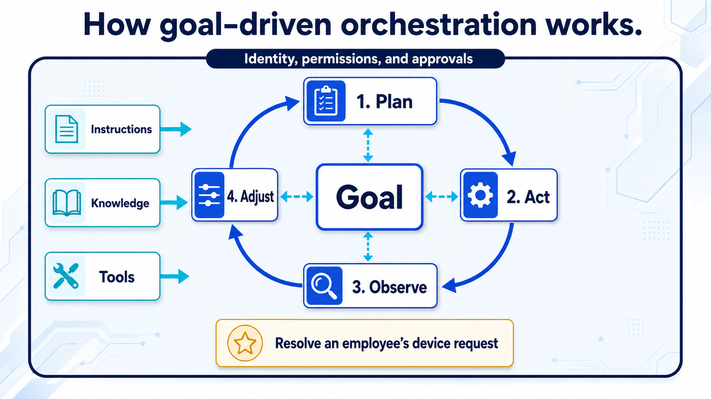

# 🚨 Mission 01: Introduction to Agents

<mission-meta />

## 🎯 Mission Brief

Welcome, Recruit.

This mission is about **how to think about agents**.

We aren't opening Copilot Studio just yet. Before you start building, you need the core concepts, because the product only really clicks once you understand the ideas behind it.

And those ideas have changed.

A couple of years ago, “building a bot” usually meant designing a conversation tree. You mapped out what the user might say, wrote scripted responses, and tried to predict every possible path.

Today, a **reasoning-first agent** can work differently. It can reason over what someone is trying to accomplish, use trusted data, choose from available tools, and take action.

That means our job has changed too.

We aren't just scripting dialogue anymore. We're setting goals, providing capabilities, grounding the agent in the right knowledge, and defining the boundaries it needs to operate safely and effectively.

By the end of this mission, you'll understand what makes agents different and how to start thinking like an agent builder.

## 🔎 Objectives

In this mission, you'll learn:

1. How traditional topic-driven chatbots differ from **reasoning-first agents**, and where AI assistants fit
1. How Large Language Models (LLMs) and Retrieval-Augmented Generation (RAG) power grounded responses
1. How an agent **harness** and **orchestration** work together
1. How agents and workflows divide reasoning and execution, and the control boundaries that keep them safe
1. The broad Microsoft agent-building landscape, from **no-code** to **pro-code**

Let's decode it.

## From Traditional Chatbots to Reasoning-First Agents

The terms *chatbot*, *assistant*, and *agent* often overlap but they describe different aspects of an AI experience rather than strict product categories.

A **traditional topic-driven chatbot** follows conversation logic defined by its maker. It might match a question to a prepared answer, guide someone through a topic, or follow a known sequence of steps.

A **reasoning-first agent** is given a goal, capabilities, and boundaries. At runtime, it can reason about what needs to happen, select relevant knowledge and tools, and adjust its approach based on the results.

| | Traditional topic-driven chatbot | Reasoning-first agent |
| --- | --- | --- |
| **Given by the maker** | Topics, rules, and conversation paths | Goals, instructions, knowledge, tools, and boundaries |
| **At runtime** | Follows maker-defined routing and paths | Plans how to pursue the goal |
| **Best suited for** | Predictable, structured interactions | Dynamic or multi-step work |
| **Example** | Guides an employee through a fixed password-reset process | Diagnoses an IT request, checks relevant guidance, and selects an appropriate action |

> [!NOTE] Where does an AI assistant fit?
> **AI assistant** usually describes how an AI helps a person, not its underlying architecture. Microsoft 365 Copilot is an AI assistant, for example, and it can use agents to perform specialized work. An assistant stays centered on a person's broader work, while an agent is typically configured to pursue a particular goal or perform a defined role.

<!-- Separate adjacent callouts for Markdownlint. -->

> [!INFO] The one-line definition
> An **agent** is an AI system powered by a model and given goals, instructions, knowledge, tools, and boundaries that shape how it reasons and acts.

## The Brain: Large Language Models (LLMs)

Modern agents are built around an LLM: a neural network trained on enormous amounts of text that predicts language one **token** at a time. A few concepts you'll lean on later:

- **Tokens & context window** — Models read and write in tokens (word fragments). The **context window** is how much it can "hold in mind" at once. These context windows are often pretty large, but not infinite. Long conversations and large documents can get summarized or dropped if the context window gets too big.
- **Instructions** — You don't just ask an agent a question; you give it standing **instructions** (its persona, rules, and how to behave). This is the single biggest lever on agent quality.
- **Not all models are equal** — Some are fast and cheap for chat. **Reasoning models** are optimized for more complex, multi-step tasks where planning, analysis, and careful tool use matter. Choosing the right model for the job is important.

> [!TIP] The autocomplete analogy
> An LLM is a "super-smart autocomplete": it doesn't *understand* like a human, it predicts the next best token. That's why **clear instructions and good grounding matter more than clever phrasing** because you're steering a prediction engine, not briefing a colleague.

## The Knowledge: Retrieval-Augmented Generation (RAG)

An LLM only knows what it was trained on, which is frozen in time and knows nothing about *your* organization. **RAG** fixes that by letting the agent look things up before it answers:

1. **Ask** — The user poses a question.
1. **Retrieve** — The agent searches a **knowledge source** (your SharePoint, OneDrive, Dataverse, a website, a database) for relevant information.
1. **Augment** — That information is added to the model's context.
1. **Generate** — The model answers using that retrieved evidence (ideally **with citations**) back to the source.

This is the difference between an agent that *guesses* and one that *cites its sources*. In Copilot Studio this is called the **knowledge layer**, and it's read-only by design: knowledge informs answers, **tools** take actions. Keep those two ideas separate, it'll save you grief later.

## A Quick Note About Harnesses

Before we discuss orchestration, you need one Copilot Studio term: **harness**.

A harness is the **runtime environment around the model**. It determines which capabilities are available, what context reaches the model, how responses are interpreted, and how actions are executed. **Orchestration** is one job the harness performs: directing what the agent should do next.

Put simply: the **model reasons and generates**, the **harness provides the operating environment**, and **orchestration directs the work inside it**.

Copilot Studio offers the **GitHub Copilot**, **standard**, and **Copilot chat** harnesses. This course uses the GitHub Copilot harness, which is designed for complex, multi-step work and uses enhanced, goal-driven orchestration.

> [!NOTE] You'll unpack the harnesses next
> [Mission 02: Copilot Studio Fundamentals](../02-copilot-studio-fundamentals/index.md) compares all three harnesses and explores the capabilities available on the GitHub Copilot harness. For now, remember that a harness is broader than its orchestration strategy.

## The Director: Orchestration

Now that you know what a harness is, let's look more closely at one of the jobs it performs. **Orchestration** directs what the agent does with a request: which knowledge to retrieve, which topics or tools to select, and in what order.

Orchestration can follow maker-defined paths, use a model to choose among available capabilities, or combine both approaches. The right approach depends on how predictable the work is and how much flexibility the agent needs.

The **GitHub Copilot harness** used in this course can break complex work into steps, act, review the results, and adjust its approach:

> **plan → act → observe → replan**

You provide the goal, instructions, capabilities, and boundaries. The harness decides how to combine them to pursue the goal.

> [!INFO] Your job changed
> You've gone from **writing the script** to **defining the operating environment**. Agent quality now lives in the quality of your *instructions, tool names, and data boundaries*, not in how many conversation branches you drew. A vaguely described tool isn't bad documentation anymore; it's a bad instruction handed to the planner.

<!-- Separate adjacent callouts for Markdownlint. -->

> [!NOTE] You'll compare orchestration approaches next
> [Mission 02: Copilot Studio Fundamentals](../02-copilot-studio-fundamentals/index.md) explains how orchestration differs across the three Copilot Studio harnesses and when each harness fits.

## How Agents and Workflows Work Together

An agent and a workflow solve different parts of a business process:

| | Agent | Workflow |
| --- | --- | --- |
| **Best at** | Interpreting intent, reasoning through ambiguity, and deciding what should happen next | Running defined steps consistently and predictably |
| **Example** | Determines whether an employee has provided enough information for a device request | Retrieves the device record and sends the approval email |

How the work **starts** is a separate design choice. A user can ask an agent to begin a task, an agent can call a workflow as a tool, and a workflow can call an agent when one step requires reasoning. A schedule, email, or record change can start a workflow without turning the agent itself into an "autonomous agent."

In this course, the `Contoso IT Concierge` interprets the employee's request and decides when it is ready. It then calls a standalone workflow to execute the repeatable transaction. You'll build that connection in Mission 07.

Across the combined solution, set **control boundaries** for each action:

- **Just do it** (low-risk: look up an answer, summarize a doc),
- **Ask first** (medium-risk: confirm before sending or changing something), or
- **Escalate** (high-risk: a human must approve—e.g., a payment or a deletion).

> [!TIP] Design the boundaries before the capabilities
> The failure mode of agentic AI isn't only a wrong sentence; it's a confident wrong *action* against a real system. Decide what the agent and its workflows are allowed to do **before** you connect them to business systems.

## Where Agents Get Built

Agents can be built through **no-code**, **low-code**, and **pro-code** experiences. The right surface depends on who is building, where the agent will be used, and how much control the solution requires.

| Approach | Microsoft options | Best suited for |
| --- | --- | --- |
| **No-code** | Agent Builder in Microsoft 365 Copilot | Quickly creating focused agents grounded in Microsoft 365 content |
| **Low-code** | Microsoft Copilot Studio | Business agents that need tools, workflows, publishing, and governance |
| **Pro-code** | Microsoft 365 Agents SDK, Microsoft Agent Framework, and Microsoft Foundry | Custom applications, orchestration, runtime, infrastructure, and deployment |

> [!TIP] Want to try Agent Builder?
> This course builds with Copilot Studio, so it doesn't include an Agent Builder lab. For a hands-on introduction, complete the Copilot Developer Camp lab [Declarative Agent Foundation with Agent Builder](https://microsoft.github.io/copilot-camp/pages/extend-m365-copilot/01-first-agent-builder/). It covers creating, grounding, testing, and governing a focused agent in Microsoft 365 Copilot.

These approaches aren't rigid tiers. The right choice depends on the scenario, the builder, and the level of control required. You don't need to choose among them yet; for now, the important point is that Microsoft provides options across the landscape.

This course uses **Microsoft Copilot Studio**, a low-code platform for building and governing business agents. In [Mission 02](../02-copilot-studio-fundamentals/index.md), you'll compare it with other Microsoft build surfaces and learn why it fits this scenario.

## Why This Lands in Microsoft 365

Concepts are universal, but in this course the agents you build **meet people where they already work**: in **Microsoft Teams** and the **Microsoft 365 Copilot** experience, where they can use organizational knowledge and Work IQ, act through connected tools, and respect your organization's identity and permissions.

## ✅ Mission Complete {#mission-complete}

You now have the mental model. You can:

✅ **Compare agent experiences**: Explain how topic-driven and reasoning-first approaches differ, where they overlap, and where AI assistants fit.

✅ **Explain agent foundations**: Describe how models, instructions, and RAG support reasoning and grounded responses.

✅ **Explain orchestration**: Describe how orchestration directs knowledge retrieval, tool selection, and the next step in an agent's work.

✅ **Explain the harness concept**: Distinguish the roles of the model, harness, and orchestration.

✅ **Recognize the build landscape**: Identify Microsoft's no-code, low-code, and pro-code options for creating agents.

⏭️ [Move to **Copilot Studio Fundamentals**](../02-copilot-studio-fundamentals/index.md) to learn how its harnesses work and explore the building blocks you'll use throughout the course.

Stay sharp, Recruit because your AI journey is just beginning!

## 📚 Tactical Resources

🔗 [AI Agents for Beginners](https://github.com/microsoft/ai-agents-for-beginners)

🔗 [Copilot Studio Documentation Home](https://learn.microsoft.com/microsoft-copilot-studio/)

🔗 [Choose a harness in Copilot Studio](https://learn.microsoft.com/en-us/microsoft-copilot-studio/harnesses-overview)

🔗 [Copilot Developer Camp](https://aka.ms/copilot-camp) — hands-on learning paths for Agent Builder, Copilot Studio, Microsoft 365 Agents SDK, Agent Framework, and Foundry

🔗 [Apply generative orchestration capabilities](https://learn.microsoft.com/en-us/microsoft-copilot-studio/guidance/generative-orchestration) — the concept, in Microsoft's words

<!-- markdownlint-disable-next-line MD033 -->
<analytics-tag section="recruit-nextgen" mission="01-introduction-to-agents" />
