# 🚨 Mission 03: Creating a Solution for Your Agent {#mission-03-creating-a-solution-for-your-agent}

<mission-meta />

## 🎯 Mission Brief {#mission-brief}

Welcome back, Agent. In this mission, you'll create a Power Platform solution for the `Contoso IT Concierge` agent you'll build in the next mission with Microsoft Copilot Studio. Think of the solution as your digital briefcase: it keeps everything together as the agent moves from development through testing and into production.

Every agent needs a well-structured home. A Power Platform solution provides organization, portability, and readiness for deployment.

Starting in a custom solution also prevents the work you create throughout this course from becoming scattered across the default solution. As you add knowledge, tools, skills, and workflows in later missions, those related components need to travel together. A clear publisher and solution make ownership easier to recognize and give your team a controlled package for moving changes between environments.

You'll start by creating the solution that will contain your agent.

> [!NOTE] GitHub Copilot harness authoring surface
>
> In the current Copilot Studio UI, turn on the **New experience** toggle in the upper-right corner of the Home page. This selects the authoring surface used for agents powered by the GitHub Copilot harness and makes your screen match the screenshots in this mission.
>
> 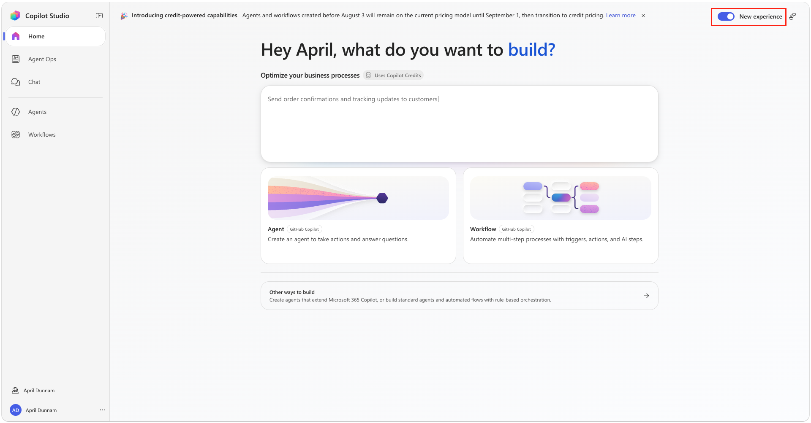

## 🔎 Objectives {#objectives}

In this mission, you'll learn:

1. How solutions organize an agent and its related components
1. Why custom solutions support deployment across environments
1. How solution publishers identify custom components
1. How solutions move from development to testing and production
1. How to create a publisher and custom solution for your `Contoso IT Concierge` agent

## 🕵🏻‍♀️ What is a solution? {#solution-whats-that}

In Microsoft Power Platform, a solution is a package that contains related components, such as agents, tables, flows, and custom logic.

Solutions support **application lifecycle management (ALM)**. ALM is the process of managing a solution as it moves through development, testing, deployment, and future updates.

Copilot Studio stores every agent in a Power Platform solution. By default, new agents are placed in the Default Solution. In this mission, you'll create a custom solution so the `Contoso IT Concierge` and its related components stay together.

Solutions have traditionally been managed in the **Power Apps maker portal**, where you can build and customize apps, Dataverse tables, flows, and other Power Platform components.

    

You can now manage solutions directly from **Solution Explorer** in Copilot Studio without switching to the Power Apps maker portal.

From Solution Explorer, you can:

- **Create a solution** to package an agent for movement between environments.
- **Set your preferred solution** to control where new agents, apps, and other components are created by default.
- **Add or remove components**, including related environment variables and cloud flows.
- **Export and import solutions** to move them between environments or apply updates.
- **Create and manage solution pipelines** to automate deployment between environments.
- **Use Git integration** in developer environments for version control and collaboration.

    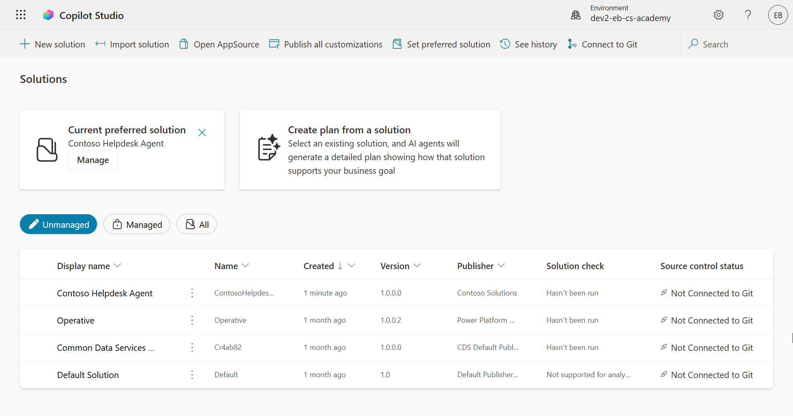

There are two types of solutions:

- **Unmanaged solutions** are used during development, where makers can edit and customize components.
- **Managed solutions** are used for deployment to testing or production, where restrictions help prevent accidental changes.

## 🤔 Why use a solution for your agent? {#why-should-i-use-a-solution-for-my-agent}

A dedicated solution keeps your agent separate from unrelated components in the Default Solution. It also gives your team a controlled package for moving the agent between environments.

Think back to the digital briefcase: when the agent moves, its related components move with it. This supports several parts of the agent lifecycle:

🧩 **Organized development**

- Keep the agent separate from unrelated components in the Default Solution.
- Store related agent components together so they can be exported and imported as one package.

🧩 **Safe deployment**

- Export the agent as a managed solution and deploy it to testing or production without exposing its components to accidental edits.

🧩 **Version control**

- Use patches for targeted fixes, updates for broader changes, or upgrades for major replacements and new features.
- Roll out changes in a controlled way.

🧩 **Dependency management**

- Track relationships between components so you can assess the effect of a change.

🧩 **Team collaboration**

- Let developers and makers collaborate in an unmanaged solution, then hand off a managed solution for deployment.

## 🪪 Understanding Solution Publishers {#understanding-solution-publishers}

A solution publisher identifies who owns a solution and assigns a prefix to its custom components. The prefix helps teams recognize related components and avoid naming conflicts across solutions and environments.

When you create a solution, you must choose a publisher. This publisher defines:

- A prefix that is added to custom components, such as tables, columns, and flows.
- The name and contact information for the organization or person that owns the solution.

### 🤔 Why is it important? {#why-is-it-important}

1. **Clear identification** - a prefix such as `new_` or `abc_` helps you identify which components belong to a solution or team.

1. **Fewer naming conflicts** - if two teams create a column called Status, prefixes such as `teamA_status` and `teamB_status` keep the schema names unique.

1. **Consistent ownership** - as a solution moves from development to testing and production, its publisher information remains associated with its components.

> [!TIP] ✨ Example
>
> Suppose you create a publisher called Contoso Solutions with the prefix `cts_`.
>
> If you add a custom column called _Priority_, it will be stored as `cts_Priority` in the solution.
>
> Anyone reviewing the component can recognize that it belongs to the Contoso solution, regardless of the environment.

## 🧭 Power Platform Solution lifecycle {#power-platform-solution-lifecycle}

Next, follow how a solution moves from development to production.

**1. Create a solution in the development environment** - start with an unmanaged solution that makers can edit.

**2. Add components** - add agents, apps, flows, tables, and other related elements.

**3. Export as a managed solution** - package the tested components for deployment.

**4. Import into the test environment** - validate the solution away from active production users.

**5. Import into the production environment** - deploy the validated solution for live use.

**6. Apply patches, updates, or upgrades** - improve the solution, test the changes, and deploy the next version.

> [!TIP] ✨ Example
>
> Imagine you're building an IT helpdesk agent to help employees with device problems, network troubleshooting, and printer setup.
>
> - You start in a development environment with an unmanaged solution.
>
> - When the solution is ready, you export it as a managed solution and import it into a system test or user acceptance testing environment.
>
> - After testing, you import it into production without changing the original development version.

## 🧪 Lab 03: Create a new Solution {#lab-03-create-a-new-solution}

In this lab, you'll create a solution publisher and a custom solution in your dedicated Copilot Studio environment. The solution will provide the starting package for the `Contoso IT Concierge` agent.

### Prerequisites

- Copilot Studio license
- Access to Copilot Studio with the **New experience** toggle enabled for the GitHub Copilot harness authoring surface
- Administrative permissions to create solutions and agents

> [!TIP] Prerequisites help:
> If you need a Copilot Studio license or test environment, follow the [Recruit Course Setup lab](../00-course-setup/index.md).

#### Security role

Your security role determines which tasks you can perform in Solution Explorer. If you can't manage solutions in the Power Apps maker portal, you also can't manage them in Copilot Studio.

Confirm that you have one of the following roles. If your organization manages your environment, ask your Power Platform administrator to confirm your access.

The following are the security roles that enable users to create a solution in their environment.

| Security role | Description |
| ---------- | ---------- |
| Environment Maker | Provides the necessary permissions to create, customize, and manage resources within a specific environment, including solutions |
| System Customizer | Wider permissions than Environment Maker, including the ability to customize the environment and manage security roles |
| System Administrator | Highest level of permissions and can manage all aspects of the environment, including creating and assigning security roles |

#### Developer environment

::: warning Switch to your environment
Make sure you switch to your dedicated developer environment. For details, see [Lesson 00 - Course Setup - Step 3: Create new developer environment](../00-course-setup/index.md#step-3-create-new-developer-environment).
:::

1. In Copilot Studio, from the left navigation, select the **environment** icon and switch from the default environment to your environment, for example **Adele Vance's environment**.

    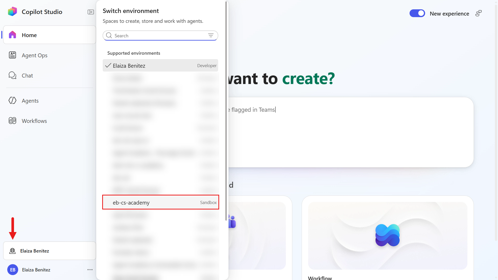

### 3.1 Create a Solution publisher

1. From the left navigation, select the **ellipsis** icon near the bottom, then under **Explore** select **Solutions**.

    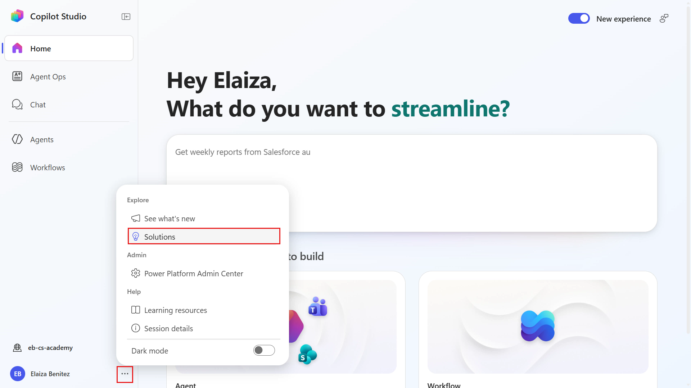

1. In **Solution Explorer**, select **+ New solution**.

    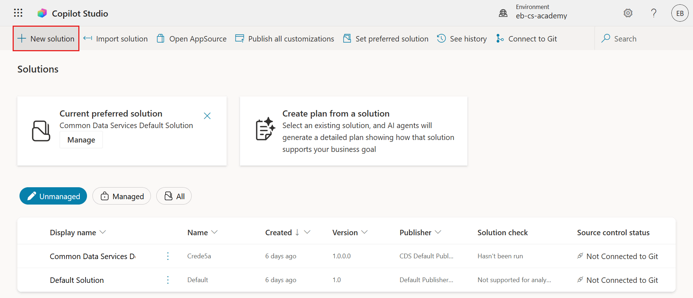

1. In the **New solution** pane, select **+ New publisher**.

    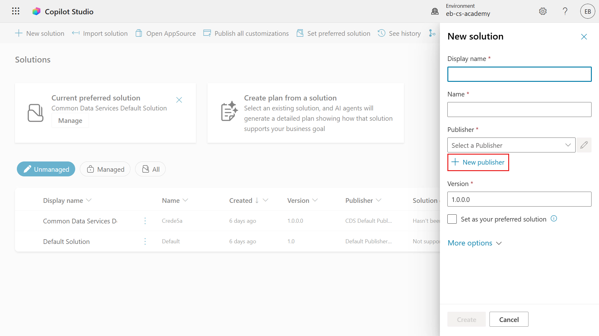

1. Review the required and optional fields on the **Properties** tab of the **New publisher** pane. These values identify the publisher and define the prefix for its custom components.

    |Property|Description|Required|
    |----------|----------|:----------:|
    |Display name|Display name for the publisher|Yes|
    |Name|The unique name and schema name for the publisher|Yes|
    |Description|Outlines the purpose of the solution|No|
    |Prefix|Publisher prefix which will be applied to newly created components|Yes|
    |Choice value prefix|Generates a number based on the publisher prefix. This number is used when you add options to choices and provides an indicator of which solution was used to add the option.|Yes|

    Copy and paste the following as the **Display name**,

    ```text
    Contoso Solutions
    ```

    Copy and paste the following as the **Name**,

    ```text
    ContosoSolutions
    ```

    Copy and paste the following as the **Description**,

    ```text
    Copilot Studio Agent Academy
    ```

    Copy and paste the following for the **Prefix**,

    ```text
    cts
    ```

    The **Choice value prefix** displays an automatically generated integer. Round this value down to the nearest thousand. For example, change `77074` to `77000`.

    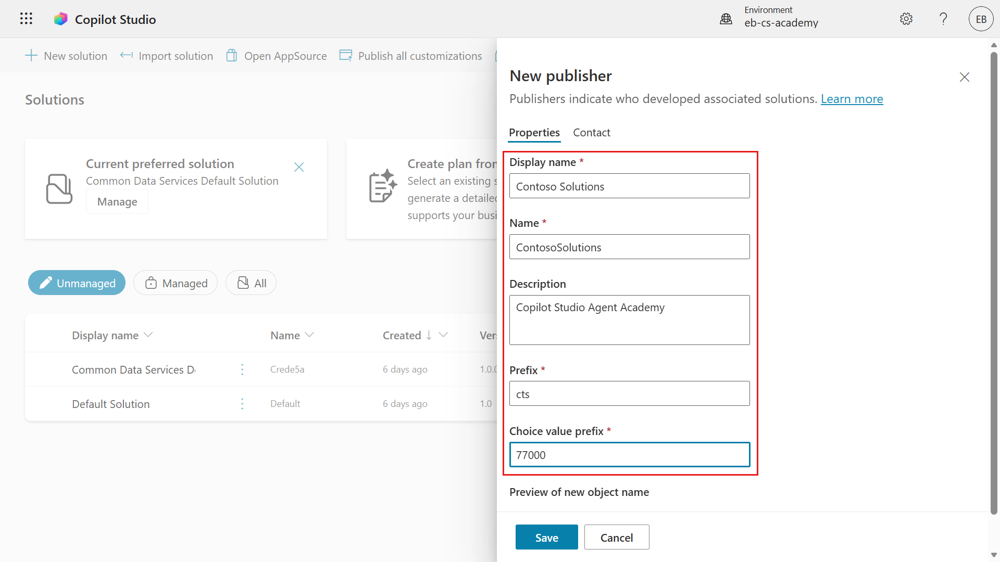

1. Optional: To provide contact details for the publisher, select the **Contact** tab and complete the available fields.

    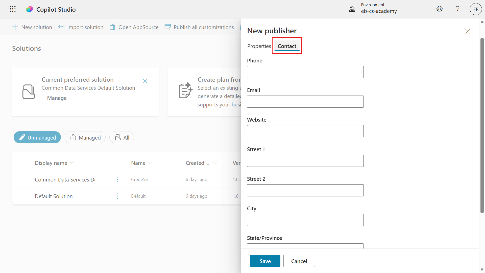

1. Select the **Properties** tab, then select **Save** to create the publisher.

    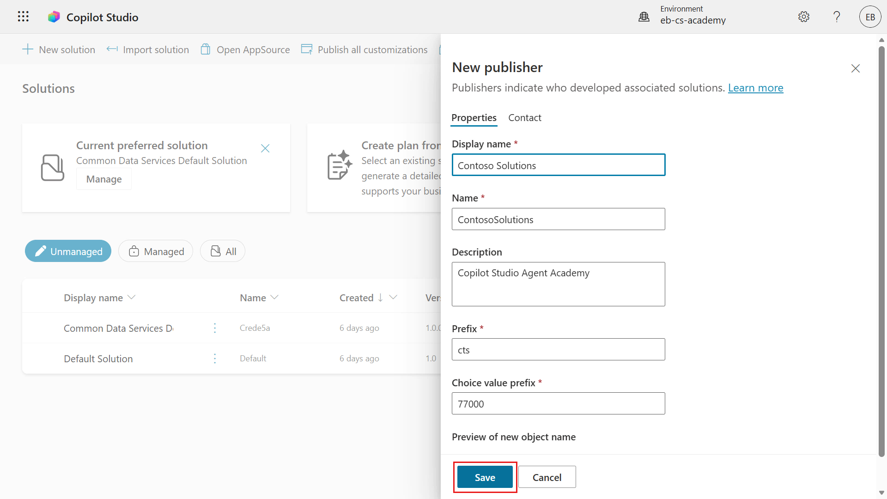

1. Confirm that the **New publisher** pane closes and the new publisher is selected in the **New solution** pane.

    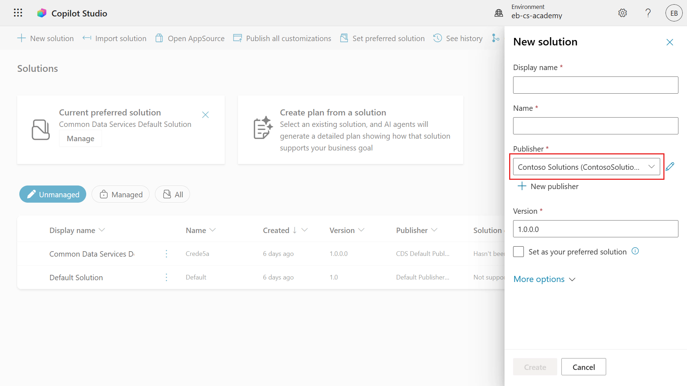

Your solution publisher is ready. Next, you'll use it to create the custom solution.

### 3.2 Create a new Solution

1. In the **New solution** pane, complete the remaining fields.

    Copy and paste the following as the **Display name**,

    ```text
    Contoso IT Concierge Agent
    ```

    Copy and paste the following as the **Name**,

    ```text
    ContosoITConciergeAgent
    ```

    Since we're creating a new solution, the [**Version** number](https://learn.microsoft.com/power-apps/maker/data-platform/update-solutions#understanding-version-numbers-for-updates/?WT.mc_id=power-172615-ebenitez) by default will be `1.0.0.0`.

    Select the **Set as your preferred solution** checkbox.

    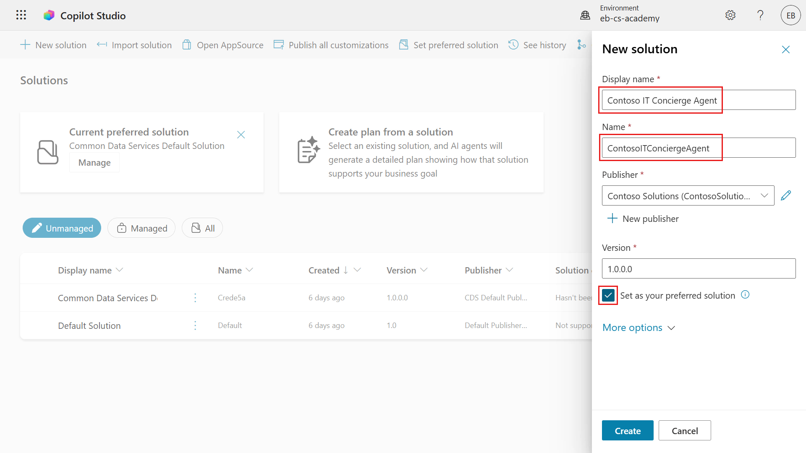

1. Expand **More options** to review the additional solution fields.

    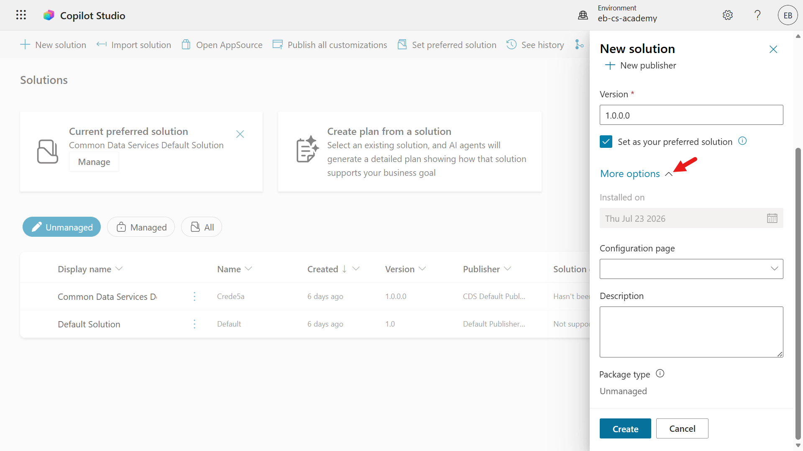

1. Review the optional fields:

    - **Installed on** - the date when the solution was installed.

    - **Configuration page** - an optional HTML web resource that provides instructions or controls for people who install the solution.

    - **Description** - a summary of the solution or its configuration page.

    Leave these fields blank for this lab.

    Select **Create**.

    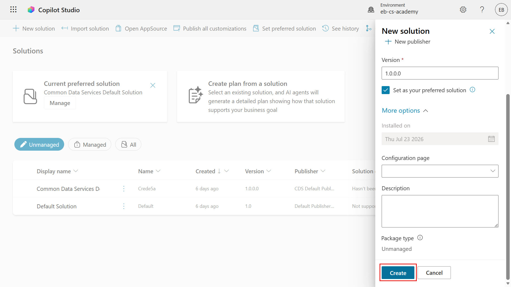

1. Confirm that the `Contoso IT Concierge Agent` solution opens. It has no components yet because you haven't created the agent.

    Select the **back arrow** icon to return to the Solution Explorer.

    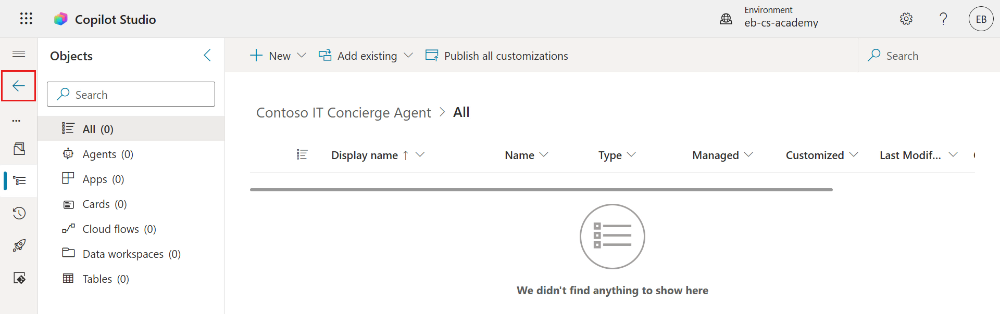

1. Confirm that `Contoso IT Concierge Agent` appears as the **Current preferred solution**.

    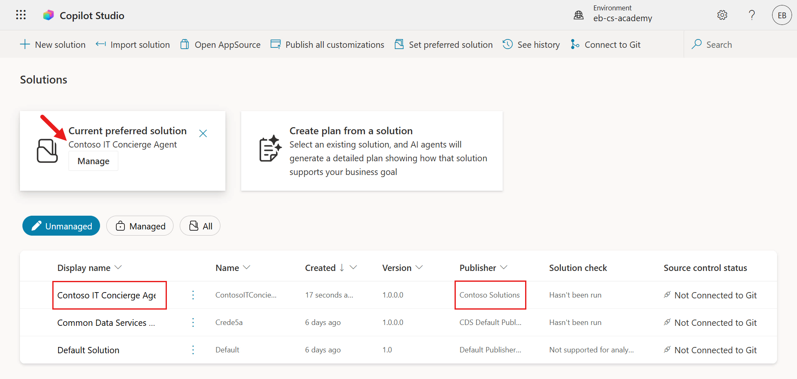

## ✅ Mission Complete {#mission-complete}

Mission accomplished, Recruit! You created a solution publisher and a custom Power Platform solution for the `Contoso IT Concierge` agent.

You can now:

✅ **Create a solution publisher**: Define the ownership details used by solution components.

✅ **Create a Power Platform solution**: Package agent components for consistent lifecycle management.

✅ **Set a preferred solution**: Ensure new components are created in the correct solution by default.

⏭️ [Move to **Build an agent with the GitHub Copilot harness** mission](../04-build-a-custom-agent/index.md)

## 📚 Tactical Resources {#tactical-resources}

🔗 [Create a solution](https://learn.microsoft.com/power-apps/maker/data-platform/create-solution/?WT.mc_id=power-172615-ebenitez)

🔗 [Create and manage solutions in Copilot Studio](https://learn.microsoft.com/microsoft-copilot-studio/authoring-solutions-overview/?WT.mc_id=power-172615-ebenitez)

🔗 [Summary of resources available to predefined security roles](https://learn.microsoft.com/power-platform/admin/database-security#summary-of-resources-available-to-predefined-security-roles/?WT.mc_id=power-172615-ebenitez)

🔗 [Upgrade or update a solution](https://learn.microsoft.com/power-apps/maker/data-platform/update-solutions/?WT.mc_id=power-172615-ebenitez)

🔗 [Overview of pipelines in Power Platform](https://learn.microsoft.com/power-platform/alm/pipelines/?WT.mc_id=power-172615-ebenitez)

🔗 [Overview of Git integration in Power Platform](https://learn.microsoft.com/power-platform/alm/git-integration/overview/?WT.mc_id=power-172615-ebenitez)

<analytics-tag section="recruit-nextgen" mission="03-creating-a-solution" />
