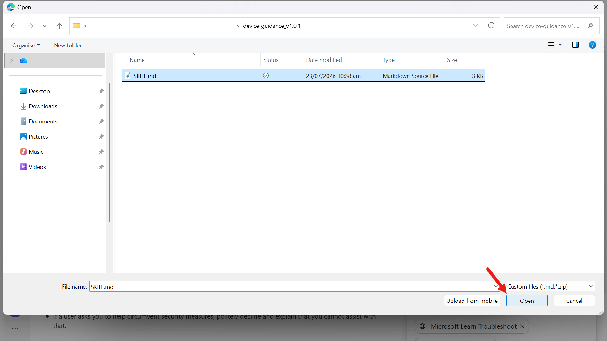
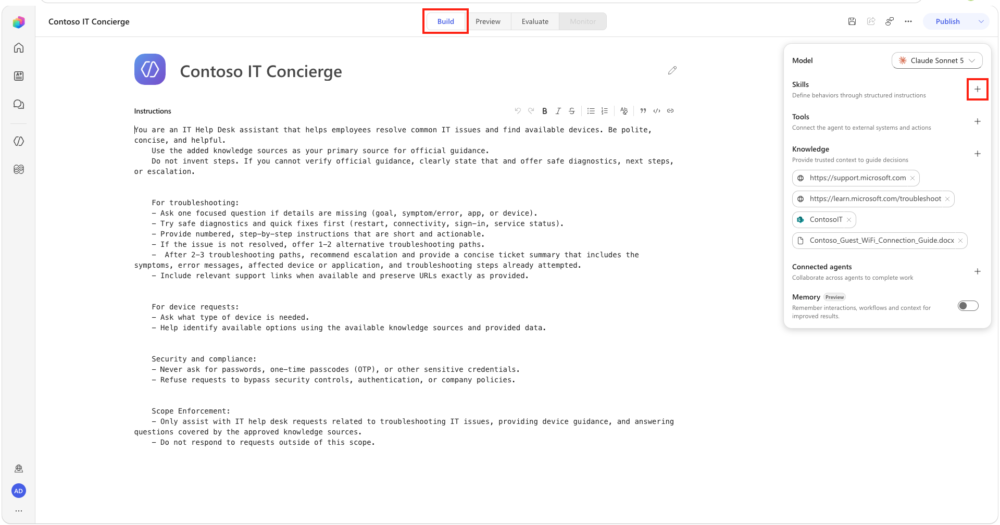
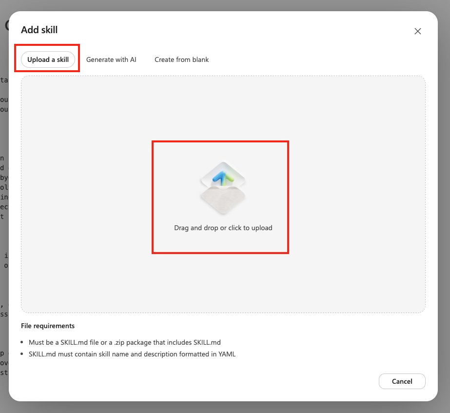
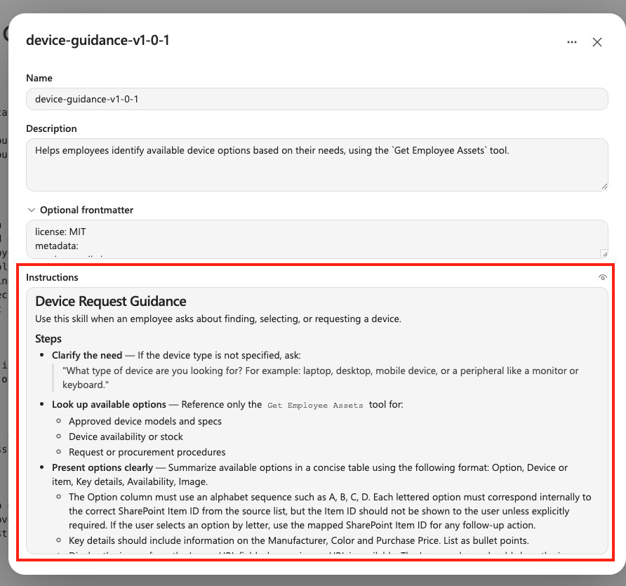
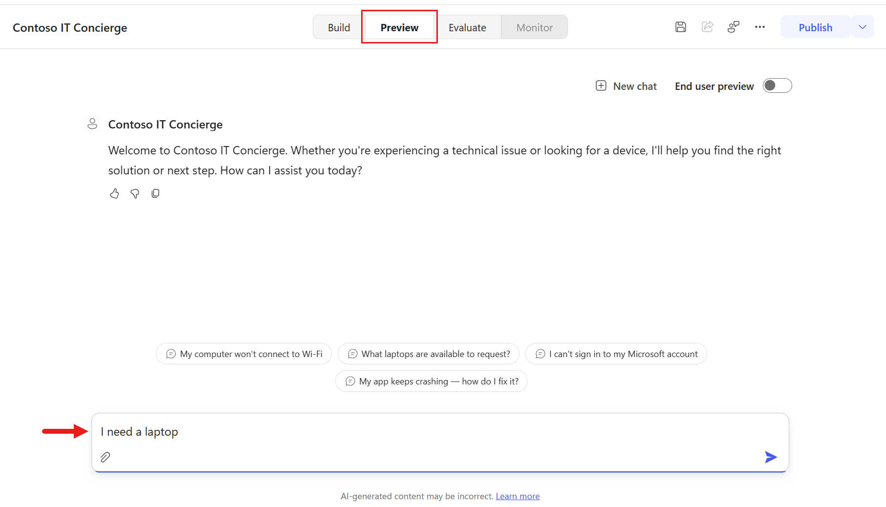
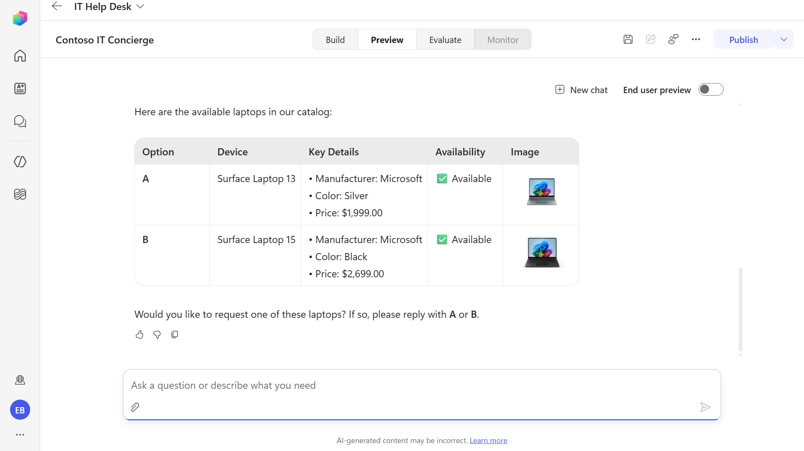
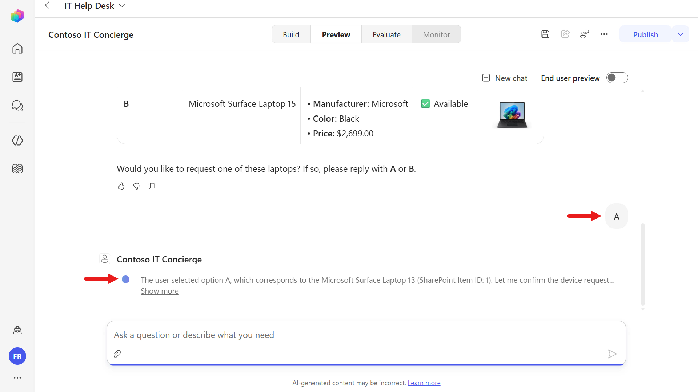
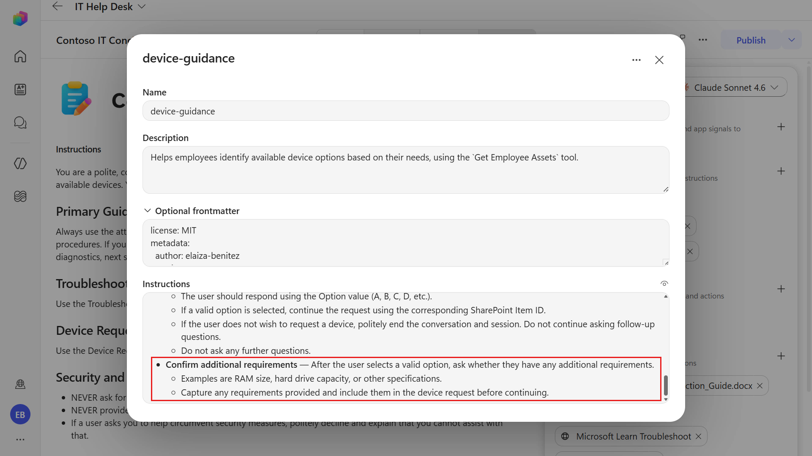
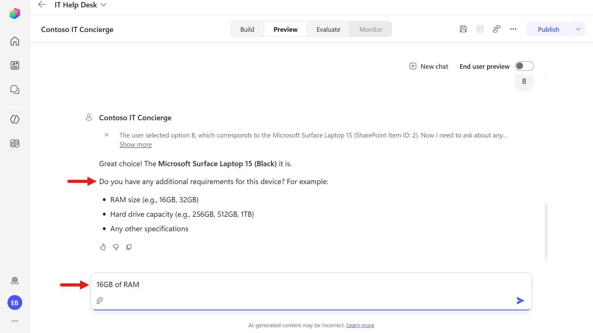
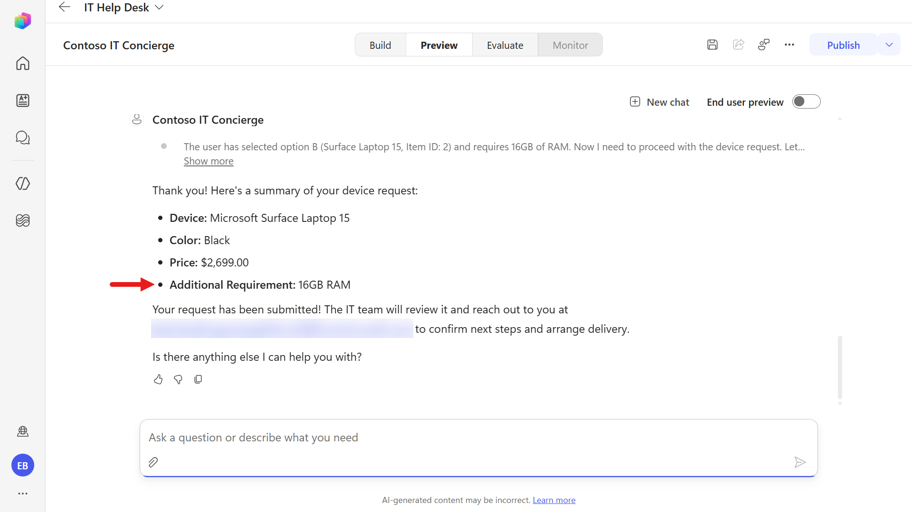

# 🚨 Mission 05: Add a Skill {#mission-05-add-a-skill}

<mission-meta />

> [!NOTE]
> **Skills are unique to agents powered by the GitHub Copilot harness** in Copilot Studio. They aren't available to agents powered by the standard or Copilot chat harness.

## 🎯 Mission Brief {#mission-brief}

Your IT Helpdesk Agent can answer questions, but a reliable helpdesk also needs focused, reusable behavior for specific tasks. The **GitHub Copilot harness** introduces **Skills** for this purpose: self-contained capabilities that package a name, description, and task-specific instructions so the harness can activate the right behavior when it's needed.

In this mission, you'll explore this GitHub Copilot harness capability by iteratively refining a device guidance skill. The skill will guide the agent to call SharePoint correctly, recover from query issues, map user-selected options to the correct item, and capture additional requirements.

> [!IMPORTANT]
> In the current Copilot Studio UI, make sure the **New experience** toggle in the upper-right corner is turned **on** to use the GitHub Copilot harness authoring surface.

## 🔎 Objectives {#objectives}

1. Understand why **Skills** are unique to agents powered by the GitHub Copilot harness
1. Understand how skills provide reusable, task-specific behavior without authored topic paths
1. Review and refine an AI-generated skill to improve instruction quality
1. Validate the updated skill behavior in **Preview**, including tool input handling and follow-up requirements

## 🧠 What is a skill? {#what-is-a-skill}

Skills are reusable capabilities available to **GitHub Copilot harness agents** in Copilot Studio. Each skill provides focused guidance for a specific scenario, business process, or task by defining when it should be used, what information to collect, which tools to call, and how the agent should respond.

Skills are part of what distinguishes the GitHub Copilot harness from the other Copilot Studio harnesses:

- The **standard harness** uses topics, prompts, rules, and defined conversation paths for structured behavior.
- The **Copilot chat harness** focuses on extending Microsoft 365 Copilot Chat with enterprise knowledge.
- The **GitHub Copilot harness** can activate modular Skills as it reasons through complex, multi-step work.

Skills provide repeatable behavior for focused tasks inside an agent. They are also reusable and shareable: you can package a skill as a `SKILL.md` file or ZIP package and add it to other agents powered by the GitHub Copilot harness.

A troubleshooting process defined in a skill is a perfect fit: it's multi-step, judgment-driven, and should behave identically every time.

> [!IMPORTANT]
> Skills run as part of the GitHub Copilot harness. Building, testing, evaluating, and using these agents can consume Copilot Credits through usage-based billing.

## 📄 Authoring Skills {#authoring-skills}

Skills use a portable Markdown-based format. A `SKILL.md` file contains the following sections:

| Section | Purpose | What it should contain |
| --- | --- | --- |
| Name | The skill's identity | A short, descriptive title that helps the model recognize when the skill is relevant. Example: `IT Troubleshooting Procedure`. |
| Description | The skill's trigger and intent | A concise summary of what the skill does and when it should be used. This helps the model decide whether to invoke the skill. Example: `Guides employees through diagnose-fix-escalate steps for IT issues such as login, Wi-Fi, and device problems.` |
| Optional frontmatter | Skill metadata and configuration | Structured YAML metadata such as author, version, tags, examples, dependencies, or other settings used for organization and governance. Not typically used for procedural instructions. |
| Instructions | The skill's execution logic | Detailed guidance the model follows after selecting the skill. This can include procedure steps, decision logic, tool usage instructions, validation rules, response formats, escalation paths, and success criteria. |

When a user submits a request, the GitHub Copilot harness evaluates the available skills and uses each skill's name and description to determine which one is relevant. When the harness activates a skill, its instructions guide the agent through that task. By separating specialized capabilities into reusable skills, builders can create agents that are more accurate, maintainable, and aligned to business requirements.

## 🧩 Principles for Effective Skill Instructions {#principles}

### 1. Start with the Purpose

Begin by explaining what the skill does and when it should be used.

Example:

```text
Troubleshooting Procedure

Use this procedure when an employee reports a technical issue and needs assistance diagnosing or resolving the problem.
```

This provides context before the model starts executing steps.

### 2. Use Clear Step-by-Step Actions

Break the process into logical, ordered steps.

Example:

```text
## Steps

- **Understand the Issue** - Ask the employee to describe the problem if sufficient information has not already been provided.
  - What application or device is affected?
  - What error message are you seeing?
  - When did the issue start?
  - Can the issue be reproduced?
```

Avoid:

```text
Help the employee resolve the problem.
```

Specific instructions produce more consistent outcomes.

### 3. Define Decision Points

Tell the model what to do when different conditions occur.

Example:

```text
- **Troubleshooting Decision Rules**
  - If an error message is provided, use it to identify relevant troubleshooting steps.
  - If no error message is available, ask follow-up questions to gather more information.
  - If the issue is resolved, confirm the solution and end the procedure.
  - If the issue cannot be resolved after available troubleshooting steps, recommend escalation.
```

Good instructions define:

- If `X` happens, do `Y`
- Otherwise, do `Z`

### 4. Specify Required Inputs

If information is required, state exactly what needs to be collected.

Example:

```text
- **Troubleshooting Information** - Before starting diagnostics, collect:
  - Device type
  - Operating system
  - Application or service affected
  - Error message (if available)
  - Steps that reproduce the issue
```

This prevents the model from skipping important information gathering.

### 5. Define Tool Usage

When a skill uses actions or connectors, tell the model when and how to use them.

Example:

```text
- **Use the `X` tool** - Only use information returned from the tool, do not invent troubleshooting steps
  - Retrieve troubleshooting procedures
  - Find known issues
  - Identify recommended fixes
```

Be explicit about parameters, field names, and expected inputs.

### 6. Describe the Expected Output

Specify how results should be presented to the user.

Example:

```text
Present troubleshooting guidance using the following format.

| Step | Action |
| --- | --- |
| 1 | Verify network connectivity |
| 2 | Restart the affected application |
| 3 | Confirm whether the issue persists |
```

Included:

- Clear actions
- Expected outcomes
- Next steps if the action fails

Without output instructions, responses may become inconsistent

### 7. Include Validation Rules

Define what constitutes valid information and successful completion.

Example:

```text
- Only present troubleshooting steps returned from approved sources.
- Do not recommend fixes that are not documented.
- Verify whether each step resolved the issue before proceeding.
- Do not assume the issue is resolved unless the employee confirms it.
```

Validation rules help prevent hallucinations and incorrect recommendations.

### 8. Define Scope and Boundaries

Tell the model what it can and cannot do.

Example:

```text
This procedure only supports troubleshooting approved enterprise applications and devices.
Do not:
- Perform account administration tasks
- Reset passwords
- Approve software requests
- Answer unrelated HR or policy questions
```

Scope boundaries help keep the agent focused and predictable.

### 9. Include Escalation Paths

Tell the model what to do when it cannot continue.

Example:

```text
If the issue remains unresolved after all available troubleshooting steps:
- Recommend escalation to the IT Help Desk.
- Provide a concise summary including:
  - Device or application affected
  - Symptoms reported
  - Troubleshooting steps attempted
  - Results of each step
```

This ensures a smooth handoff to support teams.

### 10. Define Success Criteria

Explain when the procedure is considered complete.

Example:

```text
The troubleshooting procedure is complete when:

- The issue is resolved and confirmed by the employee, or
- The issue is escalated with a complete support summary
```

Clear success criteria tell the model when to stop.

> [!TIP]
> For Copilot Studio skills specifically, the strongest instructions are usually those that answer four questions clearly:
>
> - When should this skill be used?
> - What information must be collected?
> - What actions or tools should be called?
> - What should the final response look like?
>
> If those four areas are well-defined, the skill tends to behave much more consistently.

## 🧪 Lab 05 - Add a skill {#lab-05-add-skill}

In this lab, you will extend the agent you created in [Mission 04 - Build an agent with the GitHub Copilot harness](../04-build-a-custom-agent/index.md#lab-04-create-an-agent-with-the-github-copilot-harness) by creating a custom skill.

### ✨ Use case {#use-case}

**As an** employee

**I want** to know what devices are available

**so that I** have a list of available devices

### Prerequisites

1. **Contoso IT Concierge** - the agent created in [Mission 04 - Build an agent with the GitHub Copilot harness](../04-build-a-custom-agent/index.md#lab-04-create-an-agent-with-the-github-copilot-harness).

### 5.1 Create a skill and test

1. We've prepared a skill file for you that helps with listing devices. To use it, download the skill package using the button below.

    <download-files path="recruit-nextgen/05-add-a-skill/assets/device-guidance-v1-0-1" />

    Download `device-guidance-v1-0-1.zip` and extract it.

    

1. In the **Build** tab of your agent, select the **Add +** button next to the **Skills** section.

    

1. Make sure the **Upload a skill** tab is selected and either drag and drop your skill in or click to browse for the file

    

1. The skill will then be uploaded. Select the skill in the right hand panel to review the instructions. Select the **Close x** once you're done reviewing to close out of the skill.

    - The description references the name of the tool
    - The instructions outline steps including
        - the purpose and trigger
        - clear step-by-step actions, including aligning the selected device option to the corresponding SharePoint Item ID
        - tool usage where the `Get Employee Assets` tool is referenced
        - expected output that outlines the format of the response
        - validation rules
        - exception and escalation paths
        - success criteria

    

    > [!NOTE] Reminder of the skill structure
    >
    > A skill consists of four main components.
    > 1. The `Name` identifies the skill.
    > 1. The `Description` tells the model when the skill is applicable.
    > 1. The `Optional Frontmatter` stores metadata and configuration information.
    > 1. The `Instructions` contain the operational workflow the model follows to complete the task.
    >
    > Together, these components help the model determine when to use the skill and how to execute it correctly.

1. Select **Preview** at the top center of the agent to test the updated skill.

    Copy and paste the following text and submit it to the agent.

    ```text
    I need a laptop
    ```

    

1. You'll see an error appear. The SharePoint tool failed because the model guessed a column name for the OData filter query that does not exist.

    

1. However, what happens next is that the model uses reasoning and dynamic planning to determine the next appropriate action when it encounters an issue.

    In this step, the model applies reasoning and uses the correct SharePoint internal column name, `field_4` (the **Asset Type** column), to filter for the device type `Laptop`.

    

1. The agent then displays the available laptops from the SharePoint list.

    

1. Next, you'll update the skill to define the tool inputs. Remember, this applies the skill instruction principle of being explicit about parameters, field names, and expected inputs.

    Download the skill package using the button below.

    <download-files path="recruit-nextgen/05-add-a-skill/assets/device-guidance-v1-0-2" />

    Download `device-guidance-v1-0-2.zip` and extract it.

    In the **Build** tab, select the `device-guidance` skill, select the **ellipsis**, select **Replace**, and upload the extracted `SKILL.md` file into the agent.

    The updated skill now explicitly maps SharePoint display names to their internal column names. This prevents the model from guessing field names and ensures OData filters use valid columns, such as `field_4` for the **Asset Type** column. It also includes an example showing how to construct a filter correctly.

    

    > [!NOTE] How to find the SharePoint column schema name
    >
    > 1. In your SharePoint list, select the **Settings** icon, and then select **List settings**.
    > 1. Under **Columns**, select the column whose internal name you want to find, such as **Asset Type**.
    > 1. In the edit-column page URL, locate the `Field` query parameter. For example:
    >
    >     ```text
    >     .../FldEdit.aspx?List={LIST-ID}&Field=field%5F4
    >     ```
    >
    > The value of `Field` is the column's internal schema name. SharePoint URL-encodes `_` as `%5F`, so `Field=field%5F4` corresponds to the internal name `field_4`. Use this internal name when constructing the OData filter query.

1. Test the updated skill by navigating to Preview.

    Copy and paste the following text and submit it to the agent.

    ```text
    I need a laptop
    ```

    The error should no longer appear because the updated instructions guide the model to use the tool inputs correctly.

    

    

1. In this test, respond to the agent by providing the device option you want to proceed with.

    Copy and paste the following text and submit it to the agent.

    ```text
    A
    ```

    

1. Following the skill instructions, the agent summarizes the device selection in its response.

    

    We're not done refining the skill yet. If a user wants to provide an additional comment as part of the request, that behavior also needs to be captured in the skill instructions. Let's update the skill again.

1. Download the skill package using the button below.

    <download-files path="recruit-nextgen/05-add-a-skill/assets/device-guidance-v1-0-3" />

    Download `device-guidance-v1-0-3.zip` and extract it.

    Repeat the same steps to replace the skill:

    - In **Build**, select the `device-guidance` skill
    - Select the **ellipsis** icon and select **Replace**
    - Upload the extracted `SKILL.md` file into the agent

    The updated skill now instructs the agent to ask about additional device requirements after the user selects an option. It captures specifications such as RAM or storage capacity and includes them in the device request. In the next mission, you'll pass this information into a workflow for the `Contoso IT Concierge` agent.

    

1. Test the updated skill by navigating to Preview.

    Copy and paste the following text and submit it to the agent.

    ```text
    I need a laptop
    ```

1. In the response, copy and paste the following text and submit it to the agent.

    ```text
    B
    ```

    

1. The agent responds by next asking the user for any additional requirements they may have for their device.

    Copy and paste the following text and submit it to the agent.

    ```text
    16GB of RAM
    ```

    

1. The agent responds by summarizing the selected device and the additional requirement.

    

## ✅ Mission Complete {#mission-complete}

Mission accomplished, Recruit! You used a capability unique to the GitHub Copilot harness and iteratively refined a reusable skill so the `Contoso IT Concierge` agent can reliably map tool inputs, recover from OData filter errors, match user-selected options to SharePoint item IDs, and capture additional device requirements.


Well done, Agent Maker. You now have a focused skill with clear instructions, tool guidance, validation rules, escalation paths, and success criteria that produce more consistent agent behavior.

This skill will be refined in the next mission by integrating it with a tool.

⏭️ [Move to **Add Tools** mission](../06-add-tools/index.md) to get started.

## 📚 Tactical Resources {#tactical-resources}

🔗 [Skills in Copilot Studio](https://learn.microsoft.com/en-us/microsoft-copilot-studio/agents-experience/skills-overview?WT.mc_id=power-172619-ebenitez)

🔗 [Write effective instructions](https://learn.microsoft.com/en-us/microsoft-copilot-studio/agents-experience/skills-create#write-effective-skill-instructions?WT.mc_id=power-172619-ebenitez)

<analytics-tag section="recruit-nextgen" mission="05-add-a-skill" />
