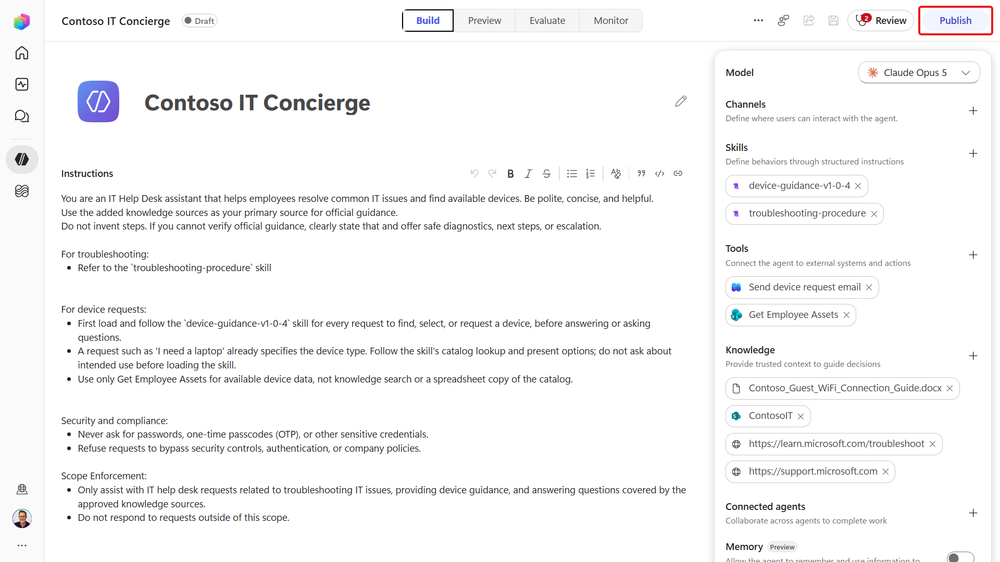
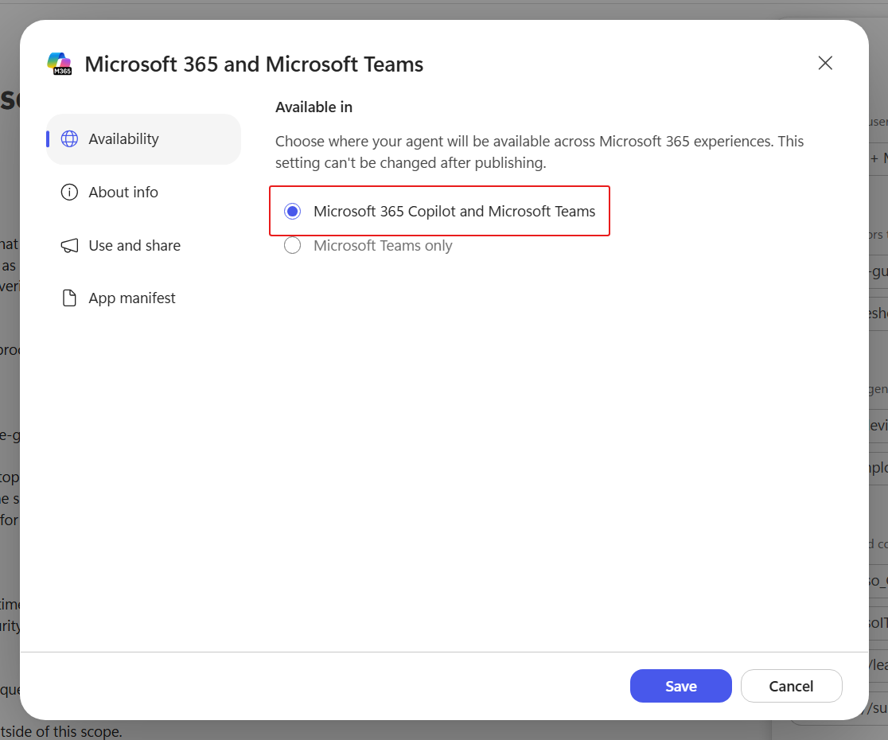
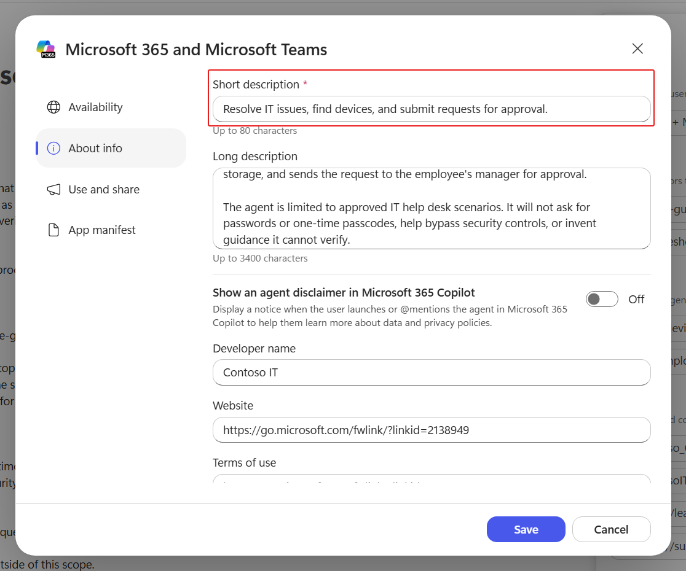
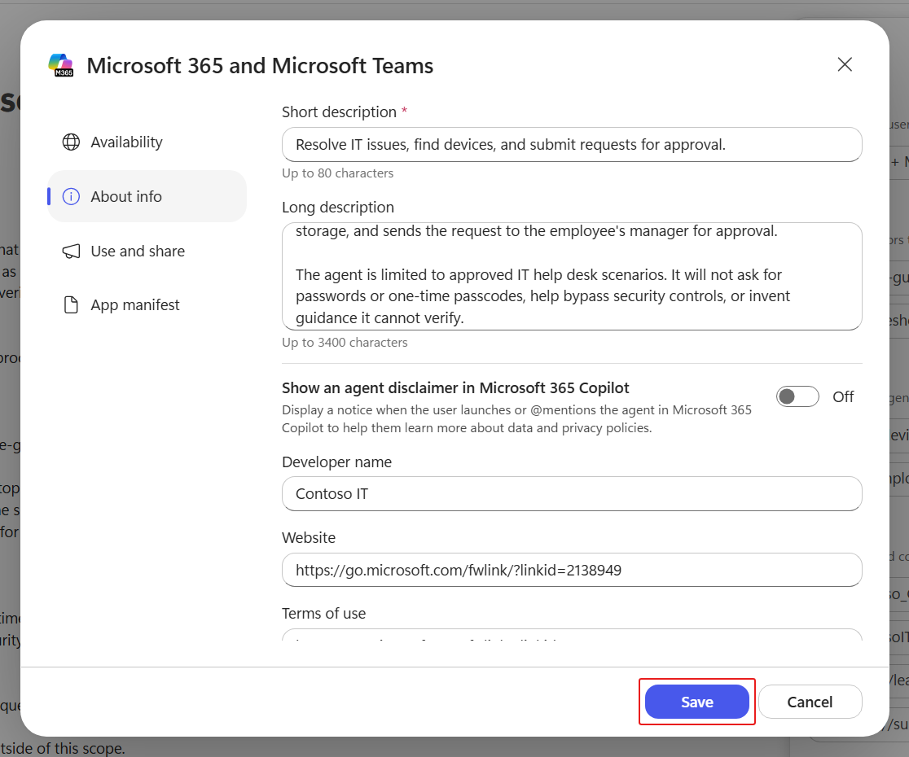
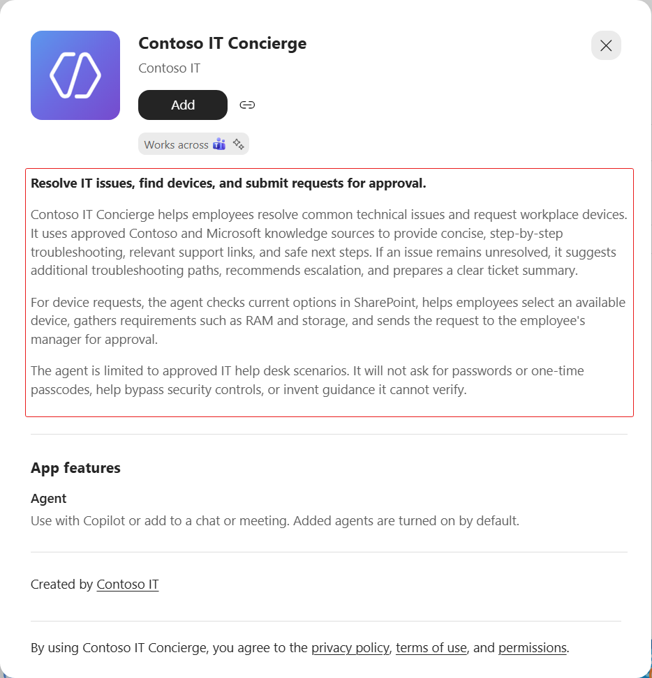
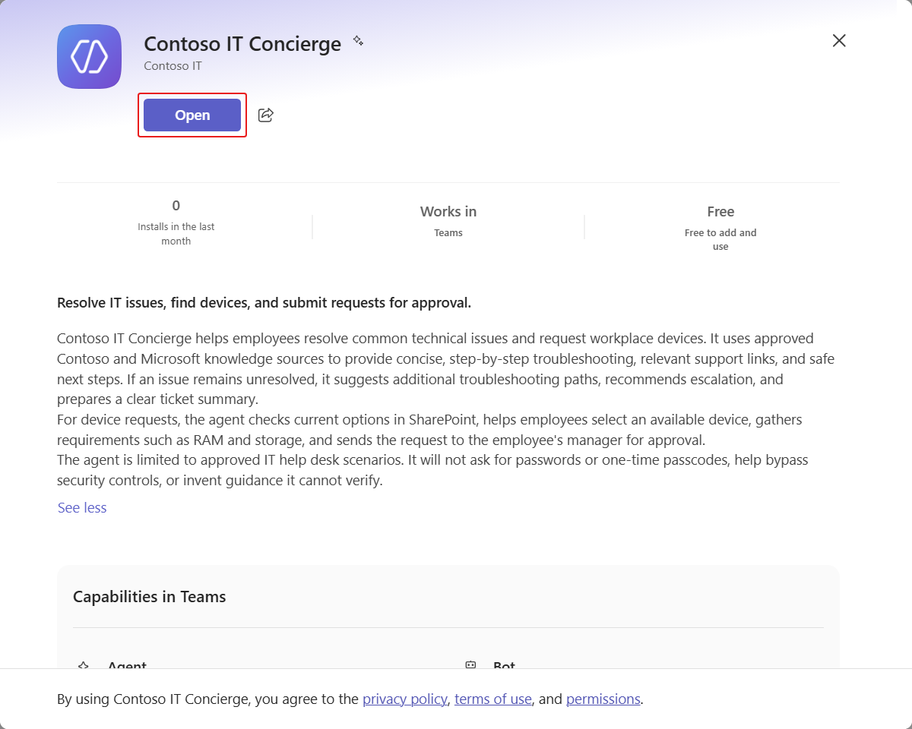
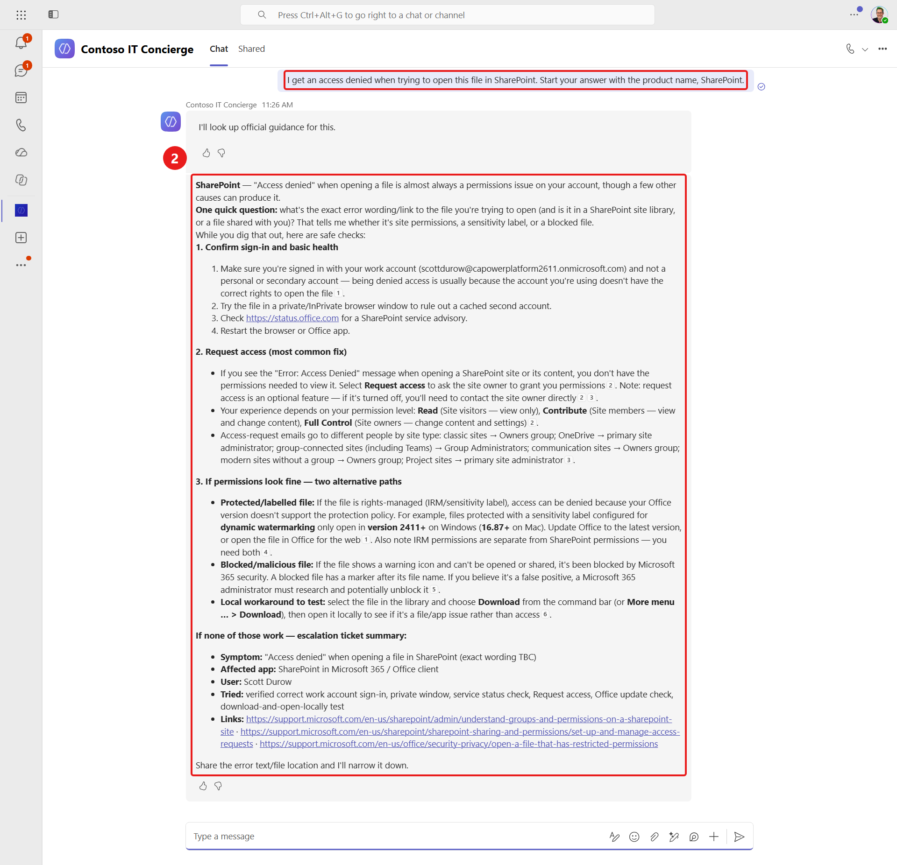
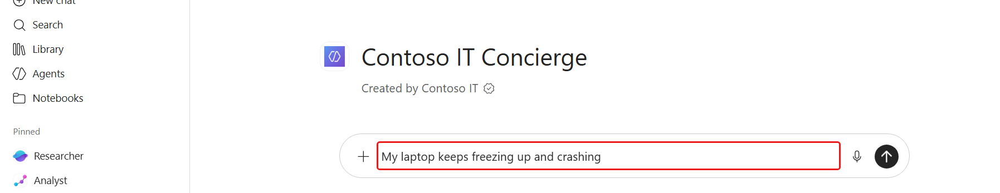
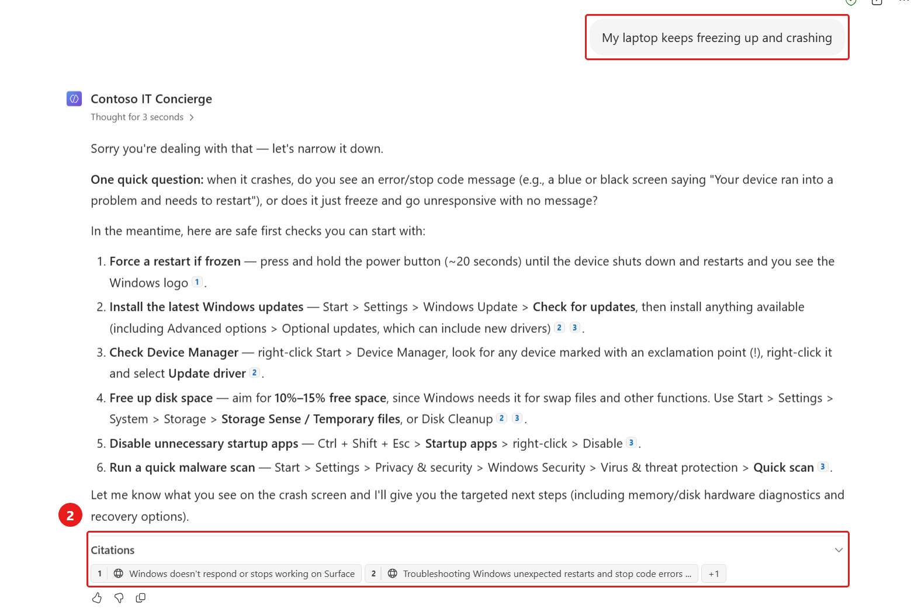

# 🚨 Mission 08: Publish Your Agent {#mission-08-publish-your-agent}

<mission-meta />

## 🎯 Mission Brief {#mission-brief}

Your **Contoso IT Concierge** has knowledge, tools, skills, and a workflow, but employees can only use it after you publish it to a channel. In this mission, you'll move the agent from the Copilot Studio authoring experience into the apps where employees already work.

You'll publish the agent to **Teams + Microsoft 365**, configure the listing employees see before adding it, and make it available in Microsoft 365 Copilot. Finally, you'll install and test the published agent in both Teams and Microsoft 365 Copilot to confirm that it behaves as expected outside the Copilot Studio preview.

Publishing is more than making the agent visible. The name, description, icon, and developer details help employees understand what the agent does and whether it fits their task. Channel configuration determines where they can discover and use it, while organization policies may affect availability and approval.

The final tests are equally important. Authentication, knowledge access, tools, and workflows can behave differently when invoked through a live channel instead of the authoring preview. You'll verify the employee-facing experience in each destination and confirm that grounded troubleshooting still works after deployment. This gives you a release baseline for future updates: revise the agent, publish a new version, and validate the channels again.

## 🔎 Objectives {#objectives}

In this mission, you'll learn:

1. How publishing channels make an agent available outside Copilot Studio
1. How to configure an agent's listing and Teams settings
1. How to publish an agent to Teams and Microsoft 365 Copilot
1. How to install and test a published agent in both channels

## 📡 Publishing and channels {#publishing-and-channels}

Publishing creates a version of your agent that users can access through enabled **channels**. Each channel connects the agent to a destination, such as a website, custom web app, Teams, or Microsoft 365 Copilot.

Publishing and sharing are related, but they are not the same. Publishing makes the latest version available to a channel. Your organization's sharing and admin policies determine who can discover, install, or use it. When you update the agent later, publish it again so users receive the newest version.

Publishing to Teams or Microsoft 365 Copilot changes where employees access the agent; it doesn't change the agent's harness. The Contoso IT Concierge agent remains powered by the GitHub Copilot harness in each channel.

> [!IMPORTANT]
> Test the agent after publishing. A successful preview in Copilot Studio doesn't guarantee that authentication, knowledge, tools, and workflows will behave identically in every channel.

## 🧪 Lab 08 - Publish your agent {#lab-08-publish-your-agent}

In this lab, you'll configure the Teams + Microsoft 365 channel, publish the agent, and verify the employee experience in both destinations.

### Prerequisites

1. **Contoso IT Concierge agent** - the agent created in [Mission 07 - Automate with Workflows](../07-automate-with-workflows/index.md).

### 8.1 Publish the agent

1. On the agent's **Build** page, select **Publish**.

   

1. Select **Publish agent** in the confirmation dialog and wait for publication to finish.

1. Select **Add channels**, then choose the Teams and Microsoft 365 channel.

1. Select **Microsoft 365 Copilot and Microsoft Teams** under **Availability**, then select **Add channel**.

1. Open **Teams + Microsoft 365** from the agent's **Channels** section. Confirm that **Microsoft 365 Copilot and Microsoft Teams** is selected.

   

1. Select **About info** to configure the agent listing.

1. Replace the **Short description** with the following text:

   ```text
   Resolve IT issues, find devices, and submit requests for approval.
   ```

   

1. Replace the **Long description** with the following text:

   ```text
   Contoso IT Concierge helps employees resolve common technical issues and request workplace devices. It uses approved Contoso and Microsoft knowledge sources to provide concise, step-by-step troubleshooting, relevant support links, and safe next steps. If an issue remains unresolved, it suggests additional troubleshooting paths, recommends escalation, and prepares a clear ticket summary.

   For device requests, the agent checks current options in SharePoint, helps employees select an available device, gathers requirements such as RAM and storage, and sends the request to the employee's manager for approval.

   The agent is limited to approved IT help desk scenarios. It will not ask for passwords or one-time passcodes, help bypass security controls, or invent guidance it cannot verify.
   ```

1. Replace the **Developer name** with the following text:

   ```text
   Contoso IT
   ```

1. Select **Save** to apply the listing changes.

   

1. Select **Publish**, then **Publish agent**, to release the updated listing. Wait for publication to finish.

### 8.2 Test the agent in Teams

1. Open **Teams + Microsoft 365** in Copilot Studio and select **Use and share**.

1. Select **View in Teams** to open the published agent's listing.

1. Select **See more** in the agent listing, then review the full description.

   

1. Confirm that the listing identifies **Contoso IT** as the developer.

1. Select **Add**.

1. After the agent is added successfully, select **Open**.

   

1. Enter the following troubleshooting request and submit it to the agent:

   ```text
   I get an access denied when trying to open this file in SharePoint.
   ```

1. Confirm that the agent asks a focused follow-up question and provides safe troubleshooting steps.

   

### 8.3 Test the agent in Microsoft 365 Copilot

1. Return to **Teams + Microsoft 365** in Copilot Studio and select **Use and share**.

1. Select **View in Copilot** to open the published agent in Microsoft 365 Copilot.

1. Enter the following troubleshooting request:

   ```text
   My laptop keeps freezing up and crashing
   ```

   

1. Submit the request and wait for the response.

1. Review the referenced web pages in **Citations** below the response, expanding the section if needed. Confirm that the response includes a relevant **support.microsoft.com** source and troubleshooting steps for the reported issue.

   

## ✅ Mission Complete {#mission-complete}

Mission accomplished, Recruit! You moved the **Contoso IT Concierge** from the authoring environment into the apps where employees work.

You can now:

✅ **Configure channels**: Make an agent available in Teams and Microsoft 365 Copilot

✅ **Create an agent listing**: Add clear descriptions, Teams settings, and developer information

✅ **Publish updates**: Release the latest agent configuration to enabled channels

✅ **Validate the employee experience**: Install and test the published agent in Teams and Microsoft 365 Copilot

⏭️ [Move to **Understanding Licensing**](../09-understanding-licensing/index.md) to learn how GitHub Copilot harness usage is billed and managed.

## 📚 Tactical Resources {#tactical-resources}

- 🔗 [Publish overview for agents](https://learn.microsoft.com/en-us/microsoft-copilot-studio/agents-experience/publication-fundamentals-publish-channels)

- 🔗 [Publish an agent](https://learn.microsoft.com/en-us/microsoft-copilot-studio/agents-experience/publication-publish-agent)

- 🔗 [Available channels for agents](https://learn.microsoft.com/en-us/microsoft-copilot-studio/agents-experience/publication-channels-overview)

<analytics-tag section="recruit-nextgen" mission="08-publish-your-agent" />
