# 🚨 Mission 06: Add a Skill {#mission-06-add-a-skill}

<mission-meta />

> [!NOTE]
> This lab has been updated for the new Copilot Studio experience (2026-06-28).
> It replaces the previous Adaptive Cards mission. See `evaluation.md` for details.

## 🎯 Mission Brief {#mission-brief}

Your IT Helpdesk Agent can answer questions, but a reliable helpdesk also needs consistent behavior when it calls tools and handles edge cases. In the new Copilot Studio experience, you define that behavior through **Skills**.

In this mission, you will iteratively refine a device guidance skill so the agent can call SharePoint correctly, recover from query issues, map user-selected options to the correct item, and capture additional user requirements.

> [!IMPORTANT]
> Make sure the **New experience** toggle in the upper-right corner is turned **on**.

## 🔎 Objectives {#objectives}

1. Understand what **skills** are and why they're new
1. See how skills replace work we used to do with **Topics** and **child agents**
1. Review and refine an AI-generated skill to improve instruction quality
1. Validate the updated skill behavior in **Preview**, including tool input handling and follow-up requirements

## 🧠 What is a skill? {#what-is-a-skill}

Skills are the building blocks of intelligent agents in Copilot Studio, providing focused guidance for handling specific scenarios, business processes, or tasks. Each skill defines when it should be used, what information to collect, which tools to call, and how the agent should respond, outlining the process, decision logic, and execution steps required to achieve an outcome.

Skills are **new** in Copilot Studio and take over jobs we used to solve other ways:

- **Instead of Topics** (trigger phrases + nodes), you describe the process once and the model orchestrates it.
- **Provide repeatable behavior** for narrow specialties inside the same agent.
- **Reusable and shareable**, upload a `SKILL.md` file into any agent.

A troubleshooting process defined in a skill is a perfect fit: it's multi-step, judgment-driven, and should behave identically every time.

## 📄 Authoring Skills {#authoring-skills}

Skills are authored in a structured `SKILL.md` file containing the following sections:

| Section | Purpose | What it should contain |
| --- | --- | --- |
| Name | The skill's identity | A short, descriptive title that helps the model recognize when the skill is relevant. Example: `IT Troubleshooting Procedure`. |
| Description | The skill's trigger and intent | A concise summary of what the skill does and when it should be used. This helps the model decide whether to invoke the skill. Example: `Guides employees through diagnose-fix-escalate steps for IT issues such as login, Wi-Fi, and device problems.` |
| Optional frontmatter | Skill metadata and configuration | Structured YAML metadata such as author, version, tags, examples, dependencies, or other settings used for organization and governance. Not typically used for procedural instructions. |
| Instructions | The skill's execution logic | Detailed guidance the model follows after selecting the skill. This can include procedure steps, decision logic, tool usage instructions, validation rules, response formats, escalation paths, and success criteria. |

When a user submits a request, the agent's underlying AI model evaluates the available skills, uses the name and description to determine which skill is most relevant, and then follows the instructions in the skill file to execute the appropriate procedure. By separating specialized capabilities into reusable skills, builders can create agents that are more accurate, reliable, maintainable, and aligned to business requirements while making complex behaviors easier to design and manage.

## 🧩 Principles for Effective Skill Instructions {#principles}

### 1. Start with the Purpose

Begin by explaining what the skill does and when it should be used.

Example:

```text
Troubleshooting Procedure

Use this procedure when an employee reports a technical issue and needs assistance diagnosing or resolving the problem.
```

This provides context before the model starts executing steps.

### 2. Use Clear Step-by-Step Actions

Break the process into logical, ordered steps.

Example:

```text
## Steps

- **Understand the Issue** - Ask the employee to describe the problem if sufficient information has not already been provided.
  - What application or device is affected?
  - What error message are you seeing?
  - When did the issue start?
  - Can the issue be reproduced?
  - 
```

Avoid:

```text
Help the employee resolve the problem.
```

Specific instructions produce more consistent outcomes.

### 3. Define Decision Points

Tell the model what to do when different conditions occur.

Example:

```text
- **Troubleshooting Decision Rules**
  - If an error message is provided, use it to identify relevant troubleshooting steps.
  - If no error message is available, ask follow-up questions to gather more information.
  - If the issue is resolved, confirm the solution and end the procedure.
  - If the issue cannot be resolved after available troubleshooting steps, recommend escalation.
```

Good instructions define:

- If `X` happens, do `Y`
- Otherwise, do `Z`

### 4. Specify Required Inputs

If information is required, state exactly what needs to be collected.

Example:

```text
- **Troubleshooting Information** - Before starting diagnostics, collect:
  - Device type
  - Operating system
  - Application or service affected
  - Error message (if available)
  - Steps that reproduce the issue
```

This prevents the model from skipping important information gathering.

### 5. Define Tool Usage

When a skill uses actions or connectors, tell the model when and how to use them.

Example:

```text
- **Use the `X` tool** - Only use information returned from the tool, do not invent troubleshooting steps
  - Retrieve troubleshooting procedures
  - Find known issues
  - Identify recommended fixes
```

Be explicit about parameters, field names, and expected inputs.

### 6. Describe the Expected Output

Specify how results should be presented to the user.

Example:

```text
Present troubleshooting guidance using the following format.

| Step | Action |
| --- | --- |
| 1 | Verify network connectivity |
| 2 | Restart the affected application |
| 3 | Confirm whether the issue persists |
```

Included:

- Clear actions
- Expected outcomes
- Next steps if the action fails

Without output instructions, responses may become inconsistent

### 7. Include Validation Rules

Define what constitutes valid information and successful completion.

Example:

```text
- Only present troubleshooting steps returned from approved sources.
- Do not recommend fixes that are not documented.
- Verify whether each step resolved the issue before proceeding.
- Do not assume the issue is resolved unless the employee confirms it.
```

Validation rules help prevent hallucinations and incorrect recommendations.

### 8. Define Scope and Boundaries

Tell the model what it can and cannot do.

Example:

```text
This procedure only supports troubleshooting approved enterprise applications and devices.
Do not:
- Perform account administration tasks
- Reset passwords
- Approve software requests
- Answer unrelated HR or policy questions
```

Scope boundaries help keep the agent focused and predictable.

### 9. Include Escalation Paths

Tell the model what to do when it cannot continue.

Example:

```text
If the issue remains unresolved after all available troubleshooting steps:
- Recommend escalation to the IT Help Desk.
- Provide a concise summary including:
  - Device or application affected
  - Symptoms reported
  - Troubleshooting steps attempted
  - Results of each step
```

This ensures a smooth handoff to support teams.

### 10. Define Success Criteria

Explain when the procedure is considered complete.

Example:

```text
The troubleshooting procedure is complete when:

- The issue is resolved and confirmed by the employee, or
- The issue is escalated with a complete support summary
```

Clear success criteria tell the model when to stop.

> [!TIP]
> For Copilot Studio skills specifically, the strongest instructions are usually those that answer four questions clearly:
>
> - When should this skill be used?
> - What information must be collected?
> - What actions or tools should be called?
> - What should the final response look like?
>
> If those four areas are well-defined, the skill tends to behave much more consistently.

## 🧪 Lab 07 - Update existing skill {#lab-07-update-skill}

In this lab, you will refine an existing skill from [Mission 05 - Build a custom agent](../05-build-a-custom-agent/index.md#lab-05-create-a-custom-engine-agent-in-copilot-studio) by applying the effective skill instruction principles above to improve clarity, consistency, and reliability.

### ✨ Use case {#use-case}

**As an** employee

**I want** to know what devices are available

**so that I** have a list of available devices

### Prerequisites

1. **Contoso IT Concierge** - the agent created in [Mission 05 - Build a custom engine agent](../05-build-a-custom-agent/index.md#lab-05-create-a-custom-engine-agent-in-copilot-studio).

### 7.1 Review Skill

Let's take a closer look at one of the skills that was generated when the agent was created.

1. In the **Build** view, in the **Skills** section, select the skill related to requesting a device to review it.

    > [!WARNING] Skills generated may differ across sessions
    >
    > Each session can produce a different skill name in the AI authoring experience, so your skill may not match the screenshot exactly. Look for the skill associated with device requests.

   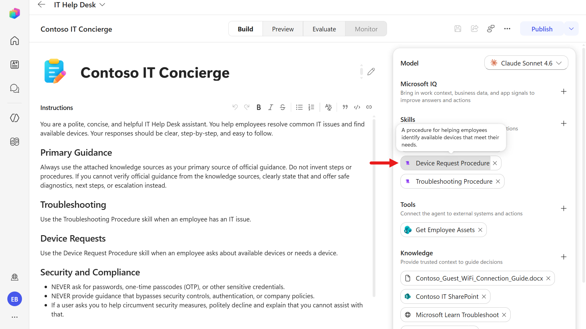

1. In the skill, you'll see the structure of the skill learned earlier.

    > [!NOTE] Reminder of the skill structure
    >
    > A skill consists of four main components.
    > 1. The `Name` identifies the skill.
    > 1. The `Description` tells the model when the skill is applicable.
    > 1. The `Optional Frontmatter` stores metadata and configuration information.
    > 1. The `Instructions` contain the operational workflow the model follows to complete the task.
    >
    > Together, these components help the model determine when to use the skill and how to execute it correctly.

   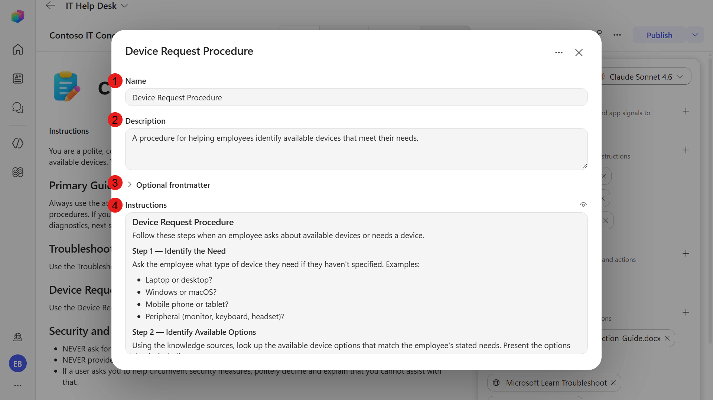

1. Review the skill instructions.

    They are a good starting point, but they do not yet follow the principles above, so let's refine them. The skill will be updated to reference the tool added in [Mission 07 - Add Tools](../07-add-tools/index.md#lab-07-add-the-sharepoint-get-items-tool) to retrieve available devices from the SharePoint list when a user requests a laptop.

   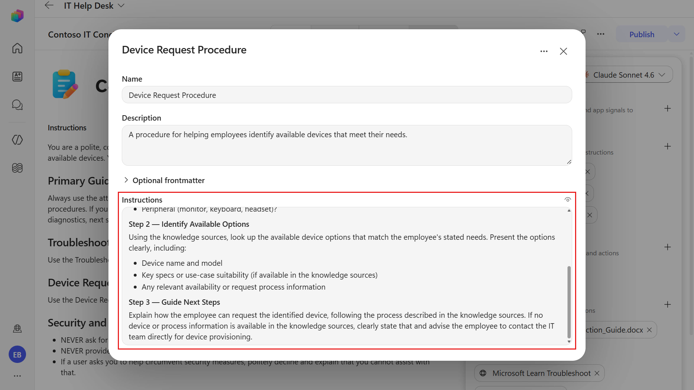

### 7.2 Update skill and test

The skill is read-only in Copilot Studio once saved. However, the `SKILL.md` file can be downloaded for editing. You can then replace the skill by selecting the edited `SKILL.md` file.

1. Select the **ellipsis** icon and select **Replace**.

   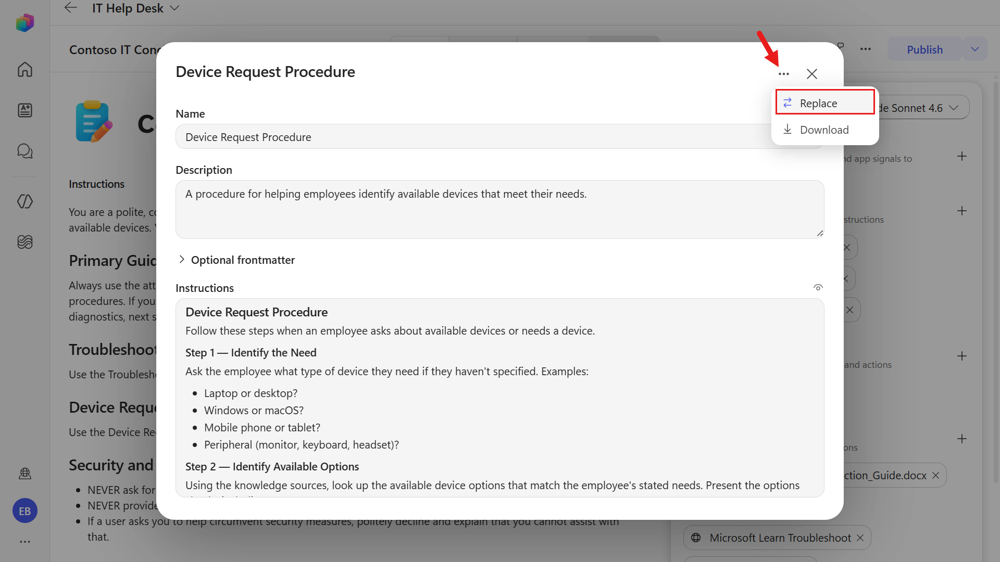

1. Download the skill package using the button below.

    <download-files path="recruit-v2-preview/06-add-a-skill/assets/lab-skills/device-guidance-v1-0-1" />

    Download `device-guidance-v1-0-1.zip`, extract it, then upload the `SKILL.md` file into the agent.

    

1. The skill has now been updated. Select the updated skill to review the instructions.

    - The description references the name of the tool
    - The instructions outline steps including
        - the purpose and trigger
        - clear step-by-step actions, including aligning the selected device option to the corresponding SharePoint Item ID
        - tool usage where the `Get Employee Assets` tool is referenced
        - expected output that outlines the format of the response
        - validation rules
        - exception and escalation paths
        - success criteria

    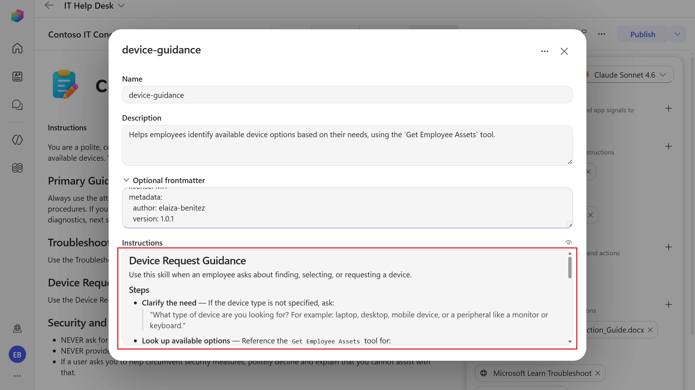

    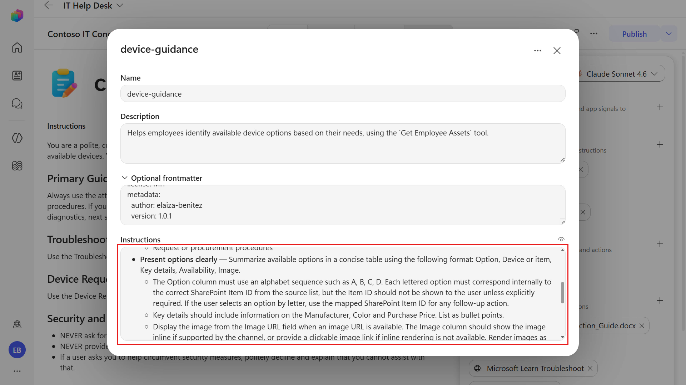

    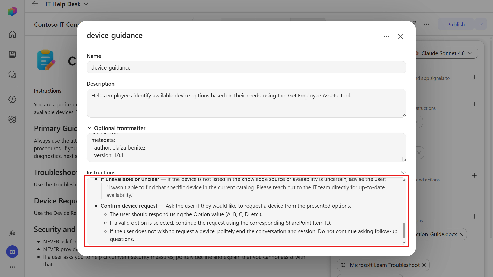

1. Select **Preview** at the top center of the agent to test the updated skill.

    Copy and paste the following text and submit it to the agent.

   ```text
   I need a laptop
   ```

   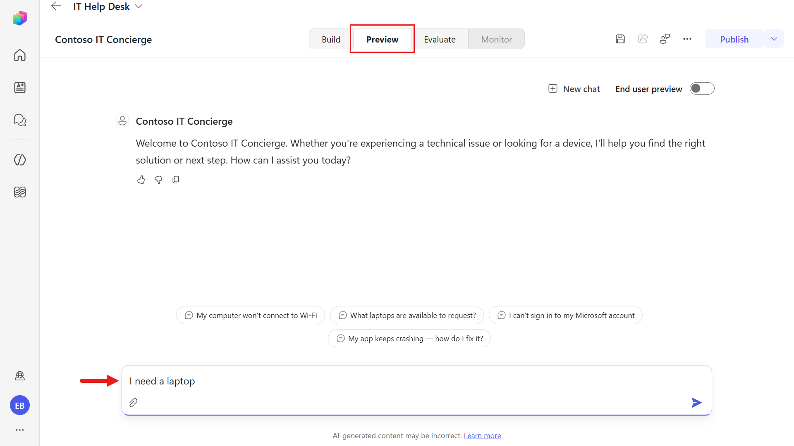

1. You'll see an error appear. The SharePoint tool failed because the model guessed a column name for the OData filter query that does not exist.

    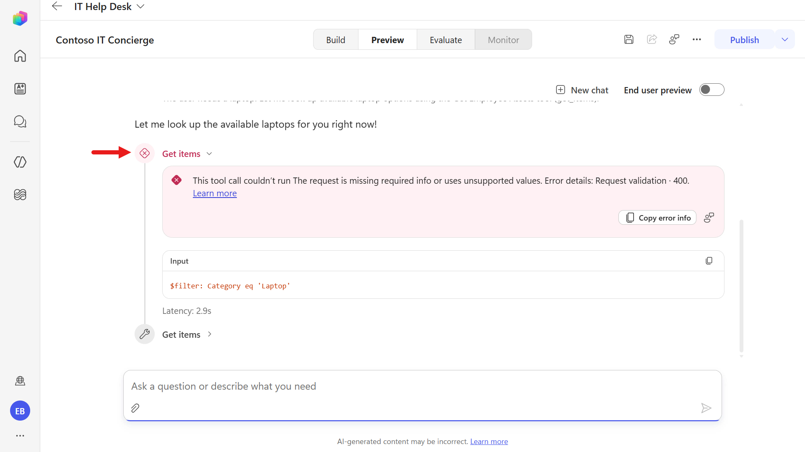

1. However, what happens next is that the model uses reasoning and dynamic planning to determine the next appropriate action when it encounters an issue.

  In this step, the model applies reasoning and uses the correct SharePoint internal column name, `field_4` (the **Asset Type** column), to filter for the device type `Laptop`.

  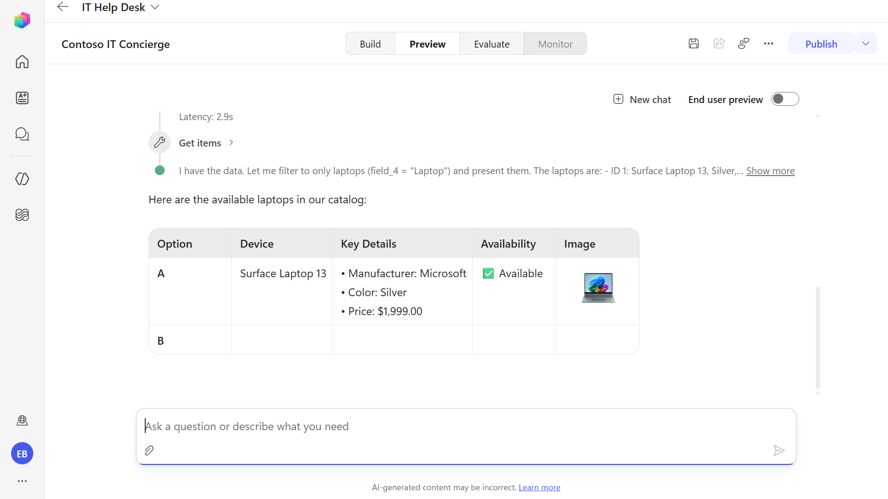

1. The agent then displays the available laptops from the SharePoint list.

    

1. Next, you'll update the skill to define the tool inputs. Remember, this applies the skill instruction principle of being explicit about parameters, field names, and expected inputs.

    Download the skill package using the button below.

    <download-files path="recruit-v2-preview/06-add-a-skill/assets/lab-skills/device-guidance-v1-0-2" />

    Download `device-guidance-v1-0-2.zip` and extract it.

   Repeat the same steps to replace the skill: in **Build**, select the `device-guidance` skill, select the **ellipsis**, select **Replace**, and upload the extracted `SKILL.md` file into the agent.

   You'll then see an additional instruction on how to manage tool inputs for OData filter queries, including explicit column names and examples.

    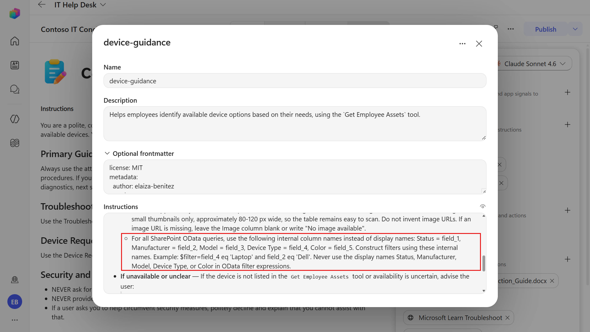

1. Test the updated skill by navigating to Preview.

    Copy and paste the following text and submit it to the agent.

   ```text
   I need a laptop
   ```

    The error should no longer appear because the updated instructions guide the model to use the tool inputs correctly.

    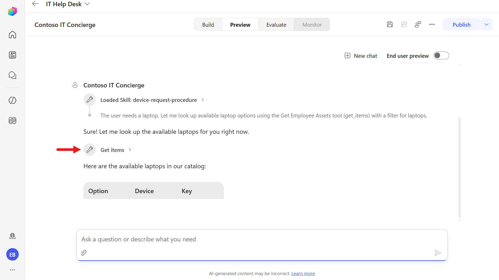

    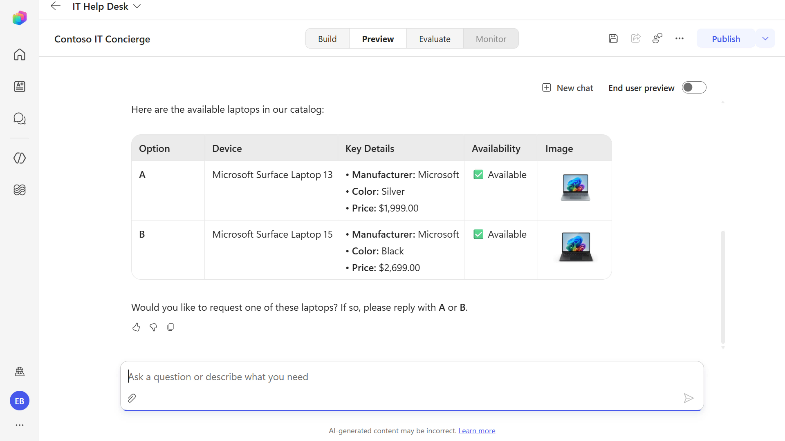

1. In this test, respond to the agent by providing the device option you want to proceed with.

    Copy and paste the following text and submit it to the agent.

   ```text
   A
   ```

    

1. Following the skill instructions, the agent summarizes the device selection in its response.

    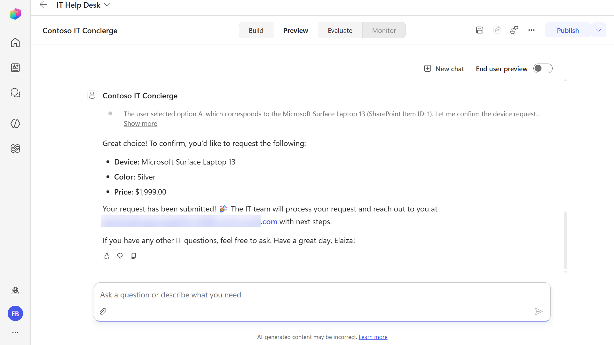

  We're not done refining the skill yet. If a user wants to provide an additional comment as part of the request, that behavior also needs to be captured in the skill instructions. Let's update the skill again.

1. Download the skill package using the button below.

    <download-files path="recruit-v2-preview/06-add-a-skill/assets/lab-skills/device-guidance-v1-0-3" />

    Download `device-guidance-v1-0-3.zip` and extract it.

   Repeat the same steps to replace the skill: in **Build**, select the `device-guidance` skill, select the **ellipsis**, select **Replace**, and upload the extracted `SKILL.md` file into the agent.

   You'll then see an additional instruction that tells the agent to ask for additional requirements. In the next mission, you'll pass this information into a workflow for the `Contoso IT Concierge` agent.

    

1. Test the updated skill by navigating to Preview.

    Copy and paste the following text and submit it to the agent.

   ```text
   B
   ```

    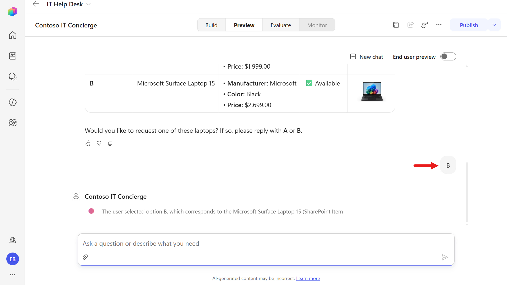

1. The agent responds by next asking the user for any additional requirements they may have for their device.

    Copy and paste the following text and submit it to the agent.

   ```text
   16GB of RAM
   ```

    

1. The agent responds by summarizing the selected device and the additional requirement.

    

## ✅ Mission Complete {#mission-complete}

You iteratively refined a reusable **Skill** so the agent can handle tool-input mapping more reliably, recover from OData filter errors, map user-selected options to SharePoint Item IDs, and capture additional user requirements. 🙌🏻

⏭️ [Move to **Add Tools**](../07-add-tools/index.md)

## 📚 Tactical Resources {#tactical-resources}

🔗 [Skills in Copilot Studio](https://learn.microsoft.com/microsoft-copilot-studio/authoring-skills?WT.mc_id=power-172619-ebenitez)

🔗 [Write effective instructions](https://learn.microsoft.com/microsoft-copilot-studio/authoring-instructions?WT.mc_id=power-172619-ebenitez)

<analytics-tag section="recruit-v2-preview" mission="06-add-a-skill" />
