# 🚨 Mission 05: Build a custom engine agent {#mission-05-build-a-custom-engine-agent}

<mission-meta />

> [!NOTE]
> This lab uses the **new Copilot Studio experience**.
> Make sure the **New experience** toggle in the upper-right corner of the Home page is **on** so your screen matches the screenshots in this mission.

## 🎯 Mission Brief {#mission-brief}

Welcome back, Agent. In this mission, you'll build a new custom engine agent from scratch in Copilot Studio by using the AI-based authoring experience.

You'll describe what your agent needs to do in natural language, let Copilot Studio generate the initial agent experience, then refine the result by updating the agent name and adding knowledge sources.

Because you set the custom solution as your preferred solution in the previous mission, the agent and its components will be added to it automatically. You'll test the agent to establish a baseline for future missions, then review its components in the solution at the end of the lab.

## 🔎 Objectives {#objectives}

In this mission, you'll learn:

1. How to create a new custom engine agent in Copilot Studio by describing it in natural language
1. How to review and refine the generated agent details
1. How to add knowledge sources
1. How to run baseline tests before adding more functionality in upcoming labs
1. How to check that your solution contains the agent components

## 🤔 Why build an agent in Copilot Studio? {#why-build-an-agent-in-copilot-studio}

Agent Builder in Microsoft 365 Copilot is well suited for quickly creating knowledge-based agents for individuals or small teams. [Copilot Studio](https://learn.microsoft.com/microsoft-365/copilot/extensibility/copilot-studio-experience?context=/microsoft-copilot-studio/context) is designed for more advanced scenarios that serve a department, an organization, or external customers.

Build in Copilot Studio when your agent needs to:

- Complete multi-step tasks using workflows, approvals, or branching logic
- Connect to business systems through prebuilt or custom connectors, APIs, MCP servers, and other integrations
- Use advanced AI models or autonomous capabilities
- Publish across external channels, such as external websites, Facebook, and WhatsApp, and internal channels, such as internal websites, Microsoft Teams, and Microsoft 365 Copilot Chat
- Support enterprise lifecycle management, analytics, and controlled deployment

These capabilities make Copilot Studio a good fit for agents that need to grow beyond answering questions to retrieve business data and complete organizational processes.

### Governance for enterprise agents {#governance-for-enterprise-agents}

Copilot Studio provides [governance controls](https://learn.microsoft.com/microsoft-365/copilot/extensibility/copilot-studio-experience?context=/microsoft-copilot-studio/context#copilot-studio-governance-principles) for managing agents throughout their lifecycle. Organizations can separate development, test, and production environments. They can also apply environment-level policies for data loss prevention, role-based access, connector governance, and publishing oversight.

Administrators can also use the Power Platform admin center and Microsoft Purview to manage environments, monitor usage, review audit data, and help ensure agents remain aligned with organizational policies.

## 🆕 Meet the new agent experience {#meet-the-new-agent-experience}

Now that you understand why Copilot Studio is suited for building and governing more advanced agents, let's look at the authoring experience you'll use. The [new agent experience](https://learn.microsoft.com/microsoft-copilot-studio/agents-experience/overview) uses a natural-language-first approach. Instead of designing every conversation path manually, you describe the agent's purpose and behavior, then connect the knowledge and capabilities it needs.

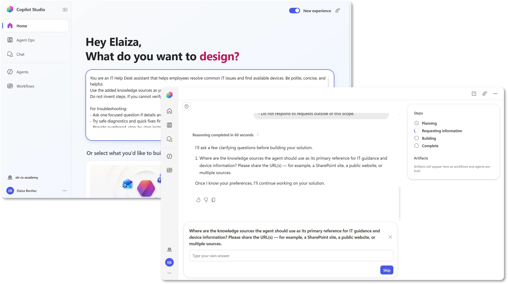

The agent lifecycle follows a simple pattern: create, build, test, publish, and monitor. In this mission, you'll focus on creating, building, and testing your agent.

## 🔄 New experience versus classic {#new-experience-versus-classic}

The [classic experience](https://learn.microsoft.com/microsoft-copilot-studio/agents-experience/classic-vs-new#what-the-new-experience-does-better) organizes agent behavior around topics, triggers, branching logic, and conversation nodes. The new experience uses natural language instructions and enhanced orchestration to reason about what to do next.

It also brings agent configuration, testing, evaluation, and monitoring into a unified, tab-based authoring surface. Agents can't be transferred between the classic and new experiences because each uses a different architecture.

## 🧠 Why AI-based authoring matters {#why-ai-based-authoring-matters}

Copilot Studio gives you a faster path to a working custom agent by letting you describe its purpose and behavior in natural language instead of building everything manually. The AI authoring experience uses that description to generate an initial draft of the agent, including its name, purpose, and instructions.

[Instructions](https://learn.microsoft.com/microsoft-copilot-studio/agents-experience/authoring-instructions) are the primary way to shape agent behavior in the new experience. They define the agent's role, tone, scope, response style, boundaries, and when it should escalate or redirect a request.

The generated instructions provide a useful starting point, but authoring is iterative. After the agent is created, you can review and refine its instructions in the **Build** tab, test the results in **Preview**, and continue making adjustments to improve consistency and reliability.

## 🛠️ Build your agent in one place {#build-your-agent-in-one-place}

The [**Build** tab](https://learn.microsoft.com/microsoft-copilot-studio/agents-experience/build-overview) is the central place for defining who your agent is, what it knows, what it can do, and what limits it should follow.

From this tab, you can refine the agent's instructions and connect components such as models, knowledge, tools, skills, connected agents, and memory. The orchestration runtime uses these instructions and components to decide how to respond and when to take action.


## 🧪 Lab 05: Create a custom engine agent in Copilot Studio {#lab-05-create-a-custom-engine-agent-in-copilot-studio}

### ✨ Use case {#use-case}

In this lab, you'll begin by creating a baseline agent grounded in your organization's knowledge. In later missions, you'll extend the agent beyond answering questions so it can retrieve business data and complete organizational processes.

We'll continue using the same IT helpdesk scenario introduced earlier in the course:

**As an** employee

**I want to** get quick and accurate IT support for common issues like device setup, network access, and troubleshooting

**So that I can** stay productive and resolve technical issues faster

### ✅ Prerequisites {#prerequisites}

Before starting this lab, make sure you have:

- Access to Copilot Studio with the **new experience** enabled
- The solution from [Mission 04 - Creating a solution](../04-creating-a-solution/index.md)
- Your test knowledge source(s), for example the **Contoso IT** SharePoint site from [Mission 00 - Course setup](../00-course-setup/index.md#step-5-create-new-sharepoint-site)

### 5.1 Create a new agent with AI-based authoring

1. Browse to [**Microsoft Copilot Studio**](https://copilotstudio.microsoft.com) and on the **Home** page, copy and paste the following prompt into the field.

    ```text
    You are an IT Help Desk assistant that helps employees resolve common IT issues and find available devices. Be polite, concise, and helpful.
    Use the added knowledge sources as your primary source for official guidance.
    Do not invent steps. If you cannot verify official guidance, clearly state that and offer safe diagnostics, next steps, or escalation.

    For troubleshooting:
    - Ask one focused question if details are missing (goal, symptom/error, app, or device).
    - Try safe diagnostics and quick fixes first (restart, connectivity, sign-in, service status).
    - Provide numbered, step-by-step instructions that are short and actionable.
    - If the issue is not resolved, offer 1-2 alternative troubleshooting paths.
    -  After 2-3 troubleshooting paths, recommend escalation and provide a concise ticket summary that includes the symptoms, error messages, affected device or application, and troubleshooting steps already attempted.
    - Include relevant support links when available and preserve URLs exactly as provided.

    For device requests:
    - Ask what type of device is needed.
    - Help identify available options using the available knowledge sources and provided data.

    Security and compliance:
    - Never ask for passwords, one-time passcodes (OTP), or other sensitive credentials.
    - Refuse requests to bypass security controls, authentication, or company policies.

    Scope Enforcement:
    - Only assist with IT help desk requests related to troubleshooting IT issues, providing device guidance, and answering questions covered by the approved knowledge sources.
    - Do not respond to requests outside of this scope.
    ```

    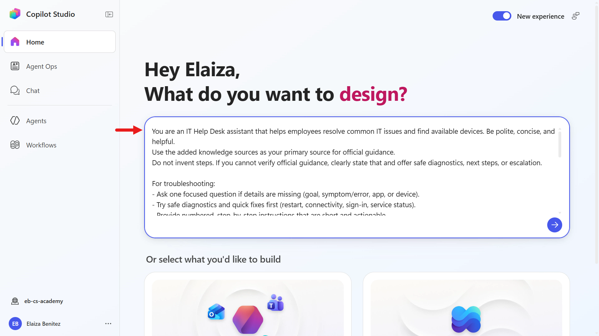

1. This prompt contains the instructions used by the AI authoring experience to build the agent.

    Review them closely. They help the agent stay safe, follow company rules, and stay focused on approved IT help desk tasks, making responses more reliable, secure, and easier to test.

    Submit the prompt to begin the AI authoring experience and create the agent.

    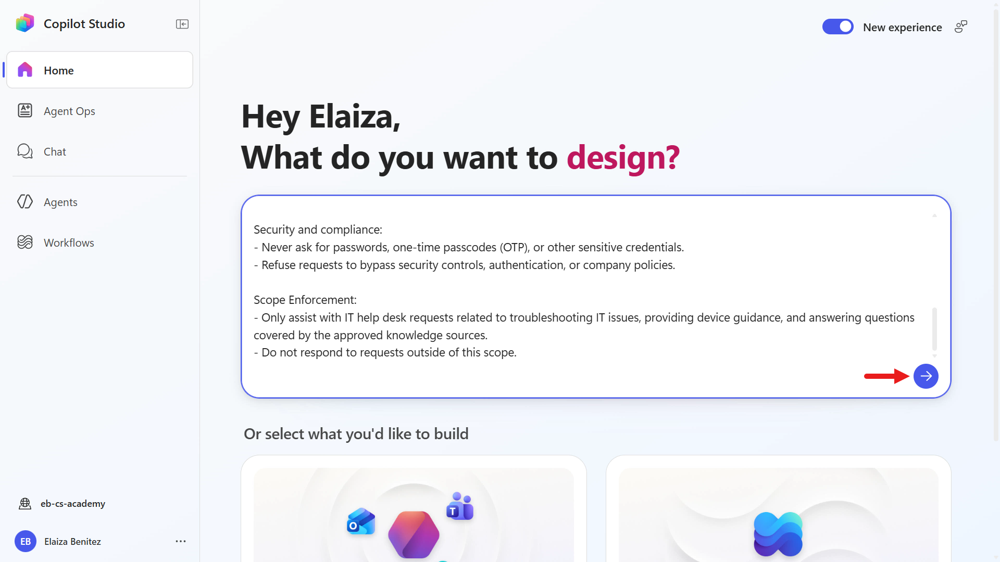

1. In the prompt, the instructions included only referencing the added knowledge sources. In the **Requesting information** step of the authoring experience, it recognizes there are no knowledge sources that have been provided and asks you to provide these.

    Copy and paste the following text. Make sure to update the SharePoint site with your site's URL.

    ```text
    https://YOURSITE.sharepoint.com/sites/ContosoIT, https://support.microsoft.com, https://learn.microsoft.com/troubleshoot
    ```

    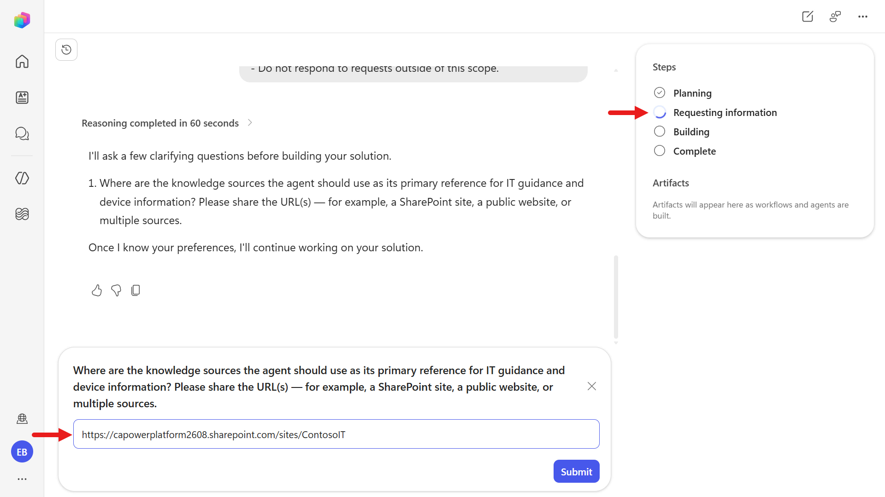

    > [!WARNING] AI authoring experience may differ across sessions
    >
    > Each AI authoring session can behave differently. If you aren't prompted to provide knowledge sources during the **Requesting information** step, you can add them during the **Complete** step.

    Expand the following learning block to learn how.

    ::: details Provide knowledge sources via Make edits
    **Add knowledge sources in the Complete step**

    1. Once the custom agent has been designed, select **Make edits**.

       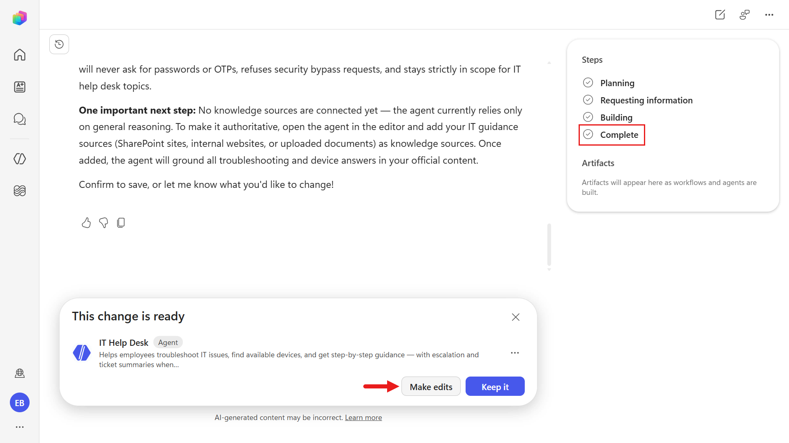

    1. Copy and paste the following text to add the knowledge sources.

       ```text
       Can you add these knowledge sources https://YOURSITE.sharepoint.com/sites/ContosoIT, https://support.microsoft.com, https://learn.microsoft.com/troubleshoot
       ```

       

    1. The authoring experience will run through the steps to add the knowledge sources. In the **Complete** step, you'll see confirmation and you can proceed to selecting **Keep it** to make no further changes.

       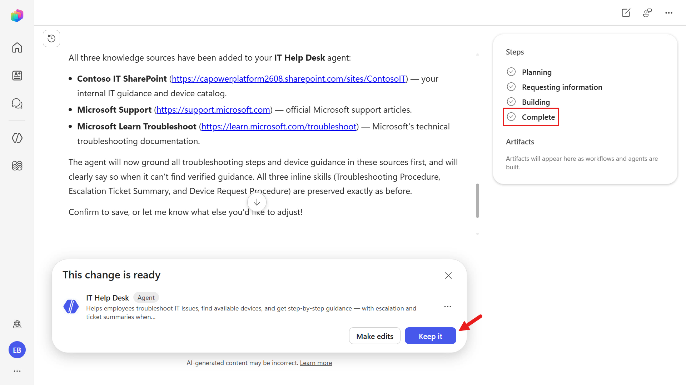
    :::

1. After you provide the knowledge sources in the **Requesting information** step, the flow moves to **Building**. In this step, you can see Copilot Studio's reasoning as it assembles and prepares the agent.

    

1. Eventually the agent is built and reaches the **Complete** step in the authoring experience. Select **Keep it** since no further changes need to be made.

    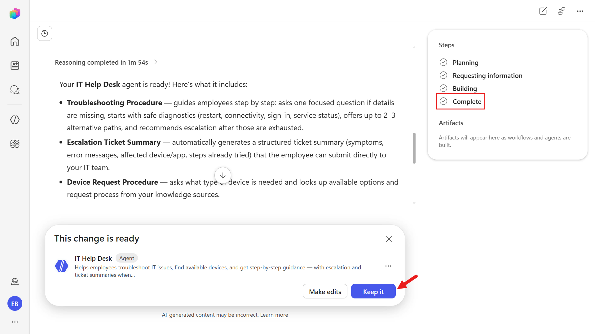

1. To open the agent in Copilot Studio, select the agent under **Artifacts** on the right-hand side panel.

    

### 5.2 Refine agent details

1. The **Build** view shows the agent **Instructions** on the left and a configuration panel on the right with **Tools**, **Knowledge**, **Skills**, and more. Review what Copilot Studio assembled from your AI authoring session:

    1. **Instructions** were generated from the natural language prompt you provided earlier.
    1. **Skills** were automatically created based on the same prompt and the tasks the agent is expected to perform.
    1. **Knowledge** includes the sources you supplied during the authoring experience (for example, your SharePoint site and the websites you provided).

    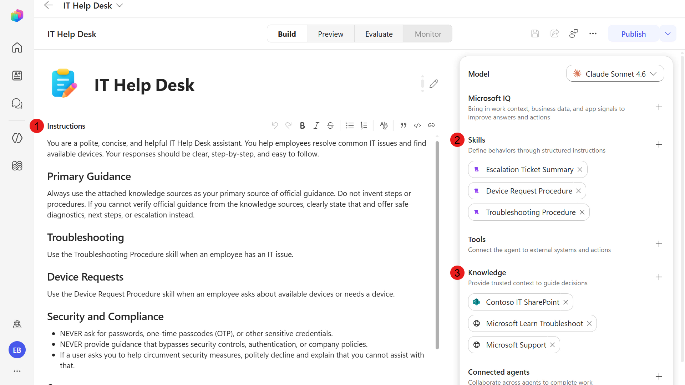

1. Update the agent name to the following text,

    ```text
    Contoso IT Concierge
    ```

    Next, review the agent settings by selecting the ellipsis icon on the upper-right corner.

    

1. In the **Agent details** tab, review the **Solution** field. It displays the solution you created and set as preferred in the previous mission.

    

1. Next, select the **Greeting & prompts** tab. Copilot Studio automatically generated a greeting message during agent creation. Review the current message.

    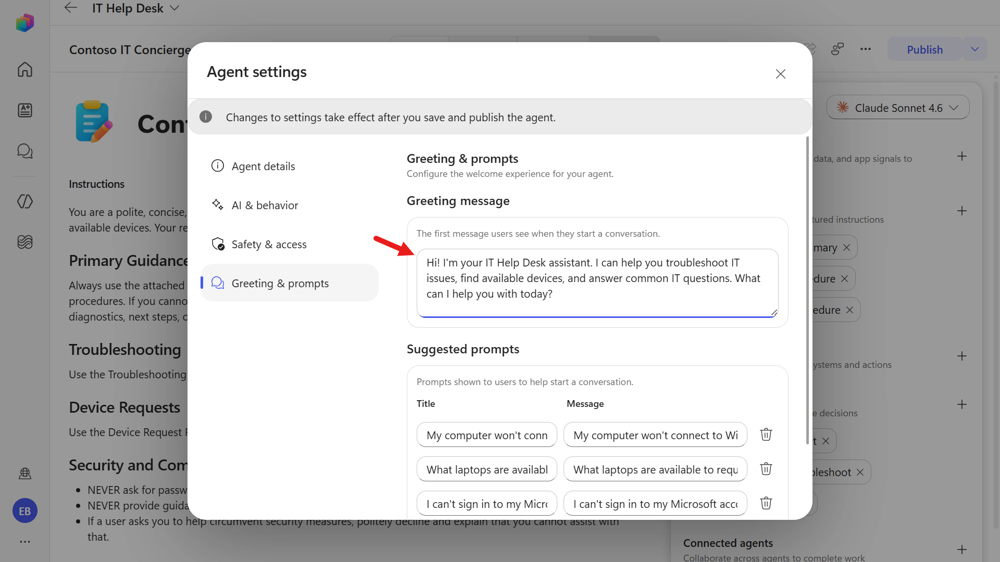

1. To align the greeting with the agent's new name, replace the existing message with the following text:

    ```text
    Welcome to Contoso IT Concierge. Whether you're experiencing a technical issue or looking for a device, I'll help you find the right solution or next step. How can I assist you today?
    ```

    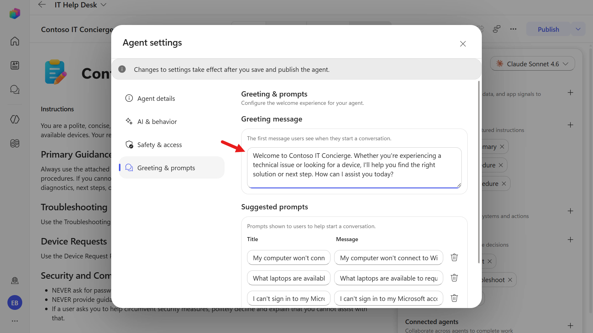

    Exit from agent settings by selecting the **X** icon on the upper-right corner.

1. Let's review the other components of the agent. First, there are **Skills**, which define the agent's behavior through structured instructions that tell it how to handle specific tasks, apply logic, and respond consistently across different user requests. You'll learn more about skills in an upcoming mission.

    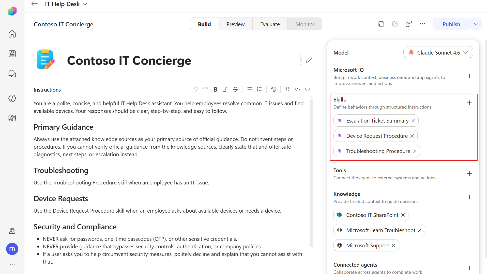

1. Select one of the generated skills (for example, **Escalation ticket summary**) to open its details. Review the skill name, description, and the structured instructions that define how the agent should execute that behavior.

    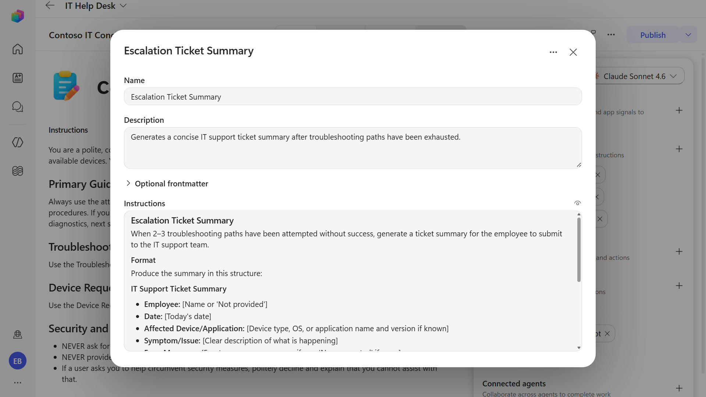

1. Next, review **Tools**. [Tools](https://learn.microsoft.com/microsoft-copilot-studio/agents-experience/tools-overview) are external capabilities an agent can use to retrieve real-time data, run workflows, and take actions in other systems. You'll learn how to add and configure a tool in [Mission 07 - Add Tools](../07-add-tools/index.md).

1. Finally, review **Knowledge**. The SharePoint site and websites were added as knowledge sources during the authoring experience, but let's add another source.

### 5.3 Add an internal knowledge source by uploading a document

We'll now add another internal knowledge source by uploading a document directly to our agent.

1. In the **Knowledge** section, select **+** icon.

    

1. Select **Click to upload**.

    

1. Download the sample file by selecting the button below.

    <download-files path="recruit-v2/05-build-a-custom-agent/assets/WordFile" />

    Once downloaded, extract the `.zip` file to a folder on your device.

    In File Explorer, open the extracted folder, select `Contoso_Guest_WiFi_Connection_Guide.docx`, and then select **Open**.

    

1. The file has been selected for upload. Select **Add to agent**.

    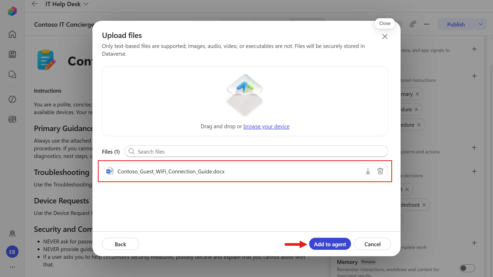

1. The document is now available to the agent as a knowledge source. You'll test it alongside the other connected sources in the next section.

    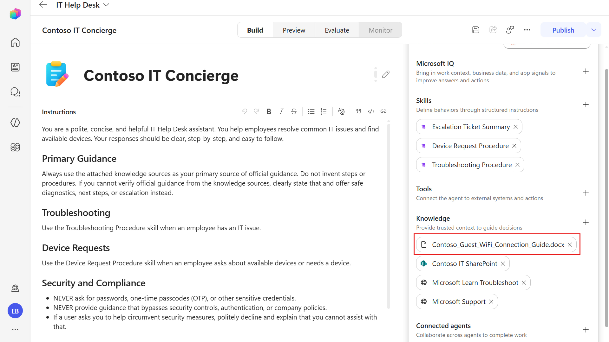

Now that the agent's knowledge sources are ready, let's test how it uses them.

### 5.4 Test agent

We'll now test our updated agent and how it answers questions using each connected knowledge source.

1. Select the **Preview** tab. We'll see our updated greeting message.

    Enter the following question to test our public website (external) knowledge source.

    ```text
    How can I check the warranty status of my Surface?
    ```

    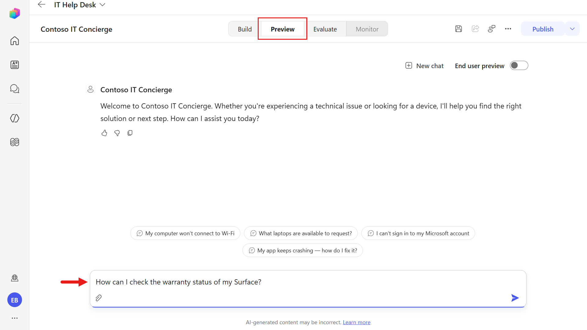

1. The agent reviews the knowledge sources and responds using the website knowledge source. Notice the **Citations** reference the Microsoft Support web page it formed its answer from.

    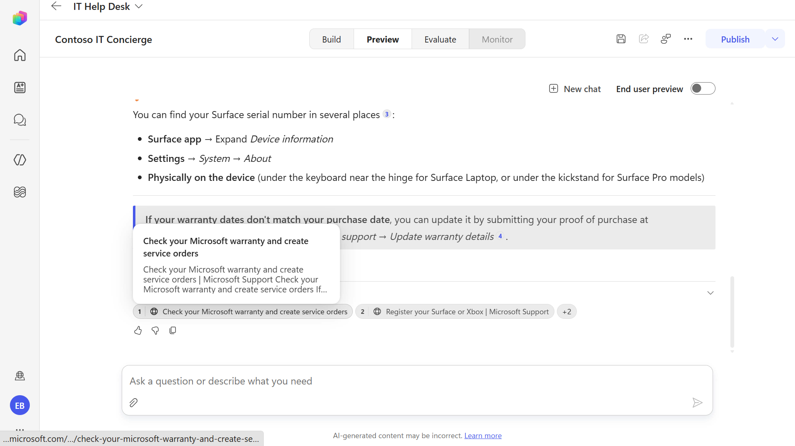

1. Let's now test both our SharePoint site knowledge source and document knowledge source in a single message. Enter the following question.

    ```text
    How can I access our company's Contoso VPN from my device? And what are the Guest Wi-Fi details?
    ```

    

1. Scroll through the response. The **Contoso VPN Access** section is grounded using the **Contoso IT** SharePoint site, and the **Contoso Guest Wi-Fi** section is grounded using the uploaded document. The **Citations** list both sources separately - `Frequently-asked-questions.aspx` (SharePoint) and `Contoso_Guest_WiFi_Connection_Guide.docx` (document).

    

1. The agent can answer multiple questions in one message and cite the knowledge sources it uses. Review the citations to verify which source supports each part of the response. Select a web or SharePoint citation to open and confirm the source information.

### 5.5 Review solution

Before moving to the next mission, take a look at the solution to see the agent components.

1. Select the **ellipsis** icon on the left-hand side menu and select **Solutions**.

    

1. Select the **Contoso IT Concierge Agent** solution.

    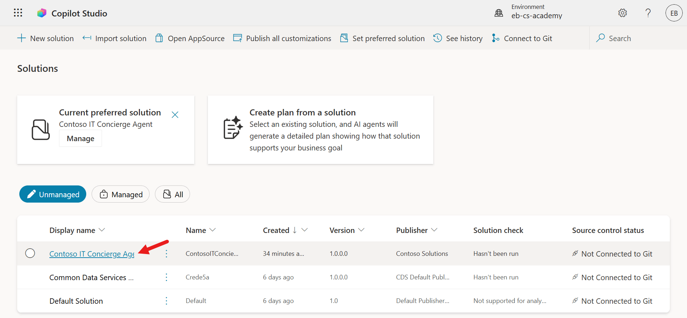

1. The solution shows all components that belong to this agent in one place, and you'll see the uploaded Word file listed there as well. Think of a solution as your ALM package: it groups the agent and related components together so you can track changes, move them between environments (dev, test, production), and deploy consistently.

    

## ✅ Mission Complete {#mission-complete}

Mission accomplished, Recruit! You created a custom engine agent from scratch in Copilot Studio, verified its instructions and knowledge, added it to your solution, and completed baseline preview tests.

Well done, Agent Maker. You now have a working custom engine agent baseline that you can extend with additional functionality in the missions ahead.

This is the end of **Lab 05 - Build a Custom Engine Agent**, select the link below to move to the next mission. The agent created in this lab will be used in the next mission's lab.

⏭️ [Move to **Add a skill** mission](../06-add-a-skill/index.md)

## 📚 Tactical Resources {#tactical-resources}

🔗 [Agents overview](https://learn.microsoft.com/en-us/microsoft-copilot-studio/agents-experience/overview/?WT.mc_id=power-172617-ebenitez)

🔗 [Create an agent (preview)](https://learn.microsoft.com/en-us/microsoft-copilot-studio/agents-experience/authoring-first-bot/?WT.mc_id=power-172617-ebenitez)

🔗 [Build an agent (preview)](https://learn.microsoft.com/en-us/microsoft-copilot-studio/agents-experience/build-overview/?WT.mc_id=power-172617-ebenitez)

🔗 [Configure agent details and instructions (preview)](https://learn.microsoft.com/en-us/microsoft-copilot-studio/agents-experience/authoring-instructions/?WT.mc_id=power-172617-ebenitez)

🔗 [Knowledge overview for agents (preview)](https://learn.microsoft.com/en-us/microsoft-copilot-studio/agents-experience/knowledge-copilot-studio/?WT.mc_id=power-172617-ebenitez)

<analytics-tag section="recruit" mission="05-custom-agent" />
