# 🚨 Mission 07: Add a Tool {#mission-07-add-a-tool}

<mission-meta />

> [!NOTE]
> This lab has been updated for the new Copilot Studio experience (2026-06-28).
> See `evaluation.md` for a full comparison with the original Topics-based lab.

## 🎯 Mission Brief {#mission-brief}

You’ve built an agent. It listens, learns, and answers questions, but now it’s time to get tactical and let it **take action**. In this mission you’ll connect your agent to a real data source so it can fetch live information and do something useful with it.

In the new Copilot Studio experience, that capability comes from **tools**. You’ll add a **SharePoint - Get items** tool so your Contoso IT Concierge agent can pull available devices straight from a SharePoint list.

> [!IMPORTANT]
> If your Copilot Studio screen looks different from these screenshots, make sure the **New experience** toggle in the upper-right corner is turned **on**.

## 🔎 Objectives {#objectives}

In this mission, you’ll learn:

1. Why **Topics** are gone in the new experience and what replaced them
1. What **tools** are and how an agent decides when to use them
1. How to add the **SharePoint - Get items** connector action as a tool
1. How to rename the tool so its purpose is clear to the model
1. How to configure the tool's input parameters for the SharePoint site and list

## ✋🏻 Wait - where did Topics go? {#where-did-topics-go}

If you’ve used Copilot Studio before, you’ll remember **Topics**: hand-built conversation flows made of trigger phrases and connected **nodes** (send a message, ask a question, add a condition, call a tool, and so on). You routed conversations manually and stitched logic together node by node.

The new experience removes the **Topics** tab entirely. Instead of you wiring conversations by hand, the agent’s **large language model orchestrates** the conversation for you. You give the agent:

- **Instructions** - plain-language guidance on how to behave, and
- **Tools, Knowledge, and Skills** - the capabilities it can draw on.

The model reads your instructions, understands the user’s intent, and decides which tool to call and when. No trigger phrases, no node graphs. This is simpler, faster to build, and far more flexible - which is exactly why we’re focusing on **tools** in this mission.

## 🔧 What are tools {#what-are-tools}

Tools give your agent the ability to do something beyond chatting, such as calling an API or MCP server, running a process, or reading and writing business data. Think of tools as "action blocks" that give your agent superpowers.

Tools can come from several places:

- **Connectors** - 1,500+ prebuilt actions for services like SharePoint, Outlook, Teams, Dataverse, and more.
- **Model Context Protocol (MCP)** - connect to MCP servers that expose tools.
- **Workflows** - call automated flows you’ve built.

When a user asks something, the model matches the request to a tool’s description, fills in the tool’s inputs, runs it, and uses the result in its reply. Because the description helps the model choose the right tool, in this lab you’ll review the existing description and decide whether to keep it or update it for the scenario.

In this lab we’ll use the **SharePoint - Get items** connector action so the agent can read a list of devices.

## 🧪 Lab 07 - Add the SharePoint Get items tool {#lab-07-add-the-sharepoint-get-items-tool}

### ✨ Use case {#use-case}

**As an** employee

**I want to** know what devices are available

**So that I** have a list of available devices

### Prerequisites

1. **SharePoint list** - the **EmployeeAssets** list from [Mission 00 - Course Setup](../00-course-setup/index.md#step-5-create-new-sharepoint-site).
1. **Contoso IT Concierge** - the agent created in [Mission 05 - Build a custom engine agent](../05-build-a-custom-agent/index.md#lab-05-create-a-custom-engine-agent-in-copilot-studio).

Let's begin!

### 6.1 Add a tool using a connector

1. In the **Build** view, in the **Tools** section, select the **+** icon to add a tool.

   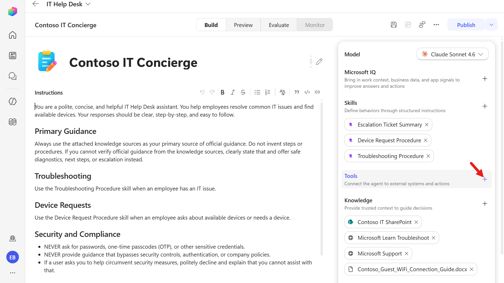

1. The **Add a tool** dialog opens with **Featured**, **MCP**, **Connectors**, and **Workflows** pills.

   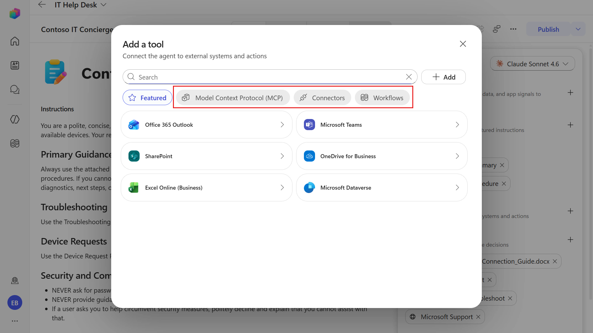

1. Take a moment to review what's available under the different types of tools. Select the **Model Context Protocol (MCP)** pill. Here, you'll see a list of first-party and third-party Microsoft certified MCP tools to select from.

   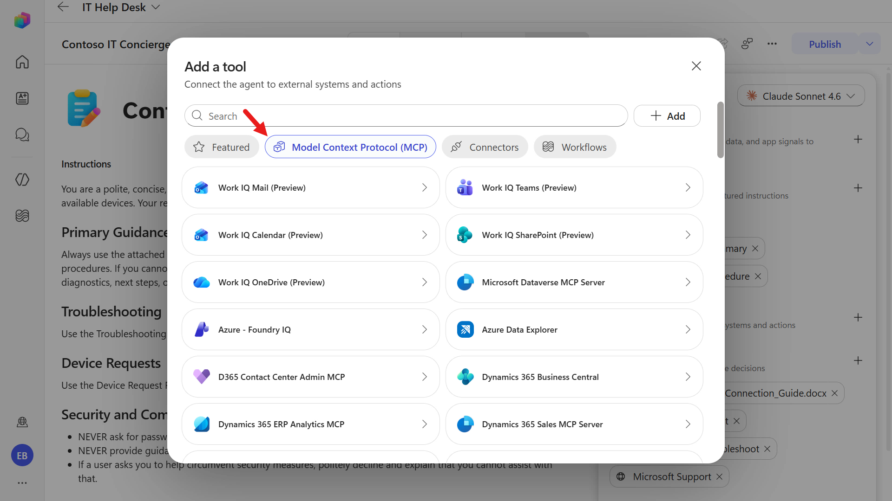

1. Next, select the **Connectors** pill. You'll see a larger list of first-party and third-party Microsoft certified connector tools to select from.

   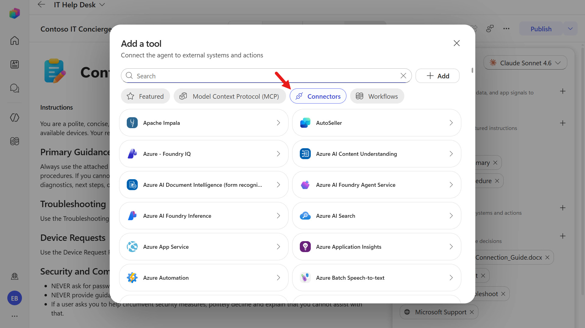

1. Copy and paste the following text in the search bar.

   ```text
   Get items
   ```

   Select the **Get items** tool.

   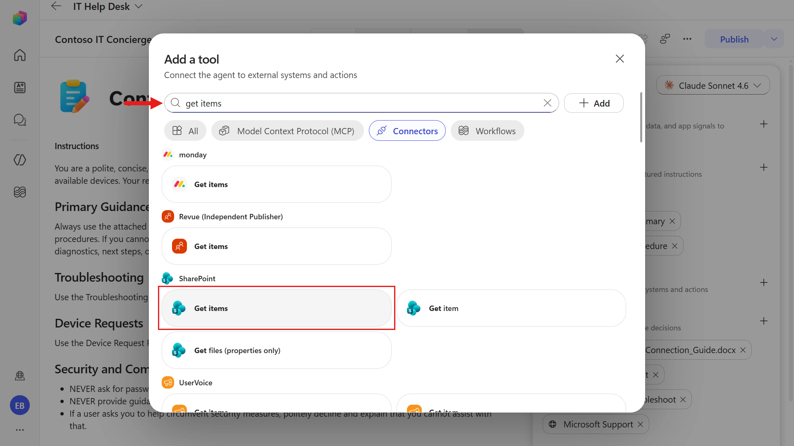

1. Select the **+ Add** button to add the tool to the agent.

   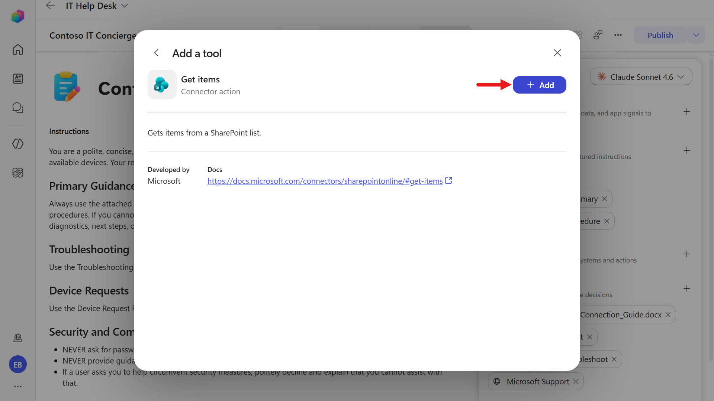

### 6.2 Configure the tool

1. The tool now appears in the **Tools** list. Select **Get items** to open **Tool details**.

   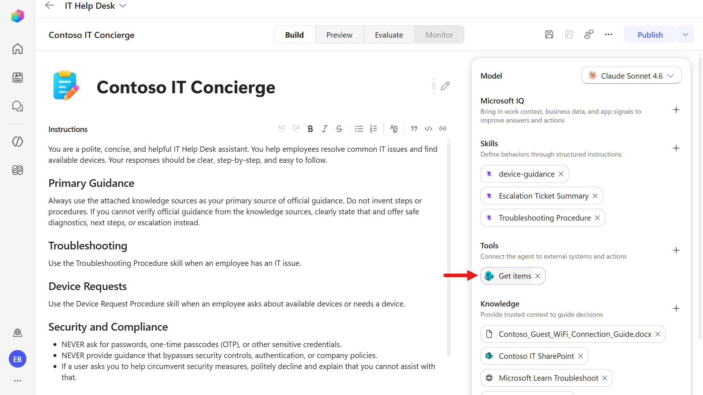

1. On the **Details** tab, we'll rename the tool so that the model knows what the tool will be used for. Copy and paste the following text as the **Name**.

   ```text
   Get Employee Assets
   ```

   We usually provide a clear tool description so the model knows when to use it.

   In this scenario, the existing description already fits because the model will retrieve items from the configured SharePoint list, so we can leave it as-is.

   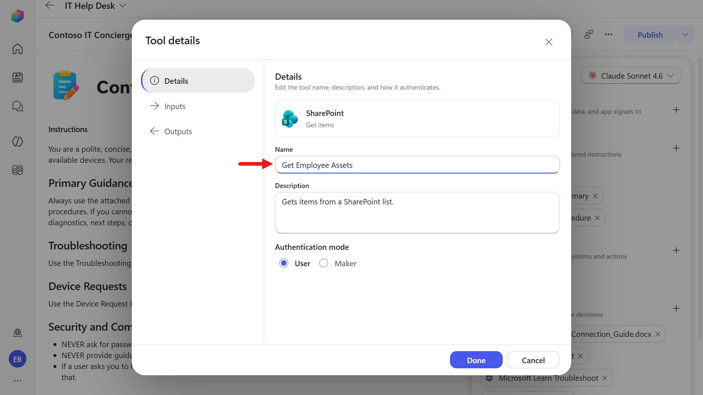

1. Select the **Inputs** tab. Each input parameter (**Site Address**, **List Name**, **Filter Query**, and so forth) can be filled by **AI** or pinned to a fixed **Value**. Leaving them as **AI** lets the agent populate them from the conversation and your instructions.

   For this use case, where the agent retrieves device information and returns it to the user, set **Site Address** and **List Name** to the SharePoint site and list created in the Course Setup mission.

   Update the **How is this filled?** field from `AI` to `Value`.

   Then select the **Value** drop-down field and select **+ Add variable**.

   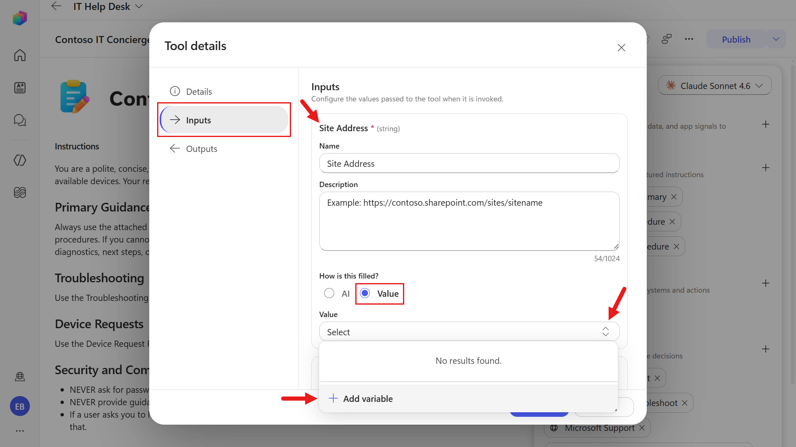

1. In the **Site Address** drop-down field, select the SharePoint site you created in the Course Setup mission.

   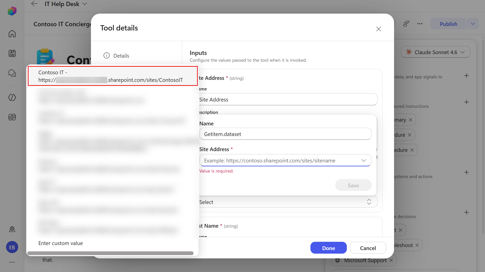

1. Select **Save** to save the variable for the **Site Address** input parameter.

   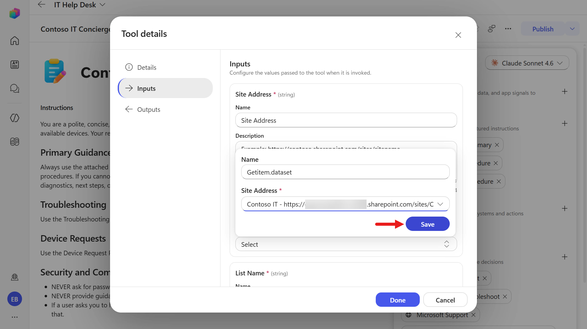

1. Scroll down to the **List Name** input parameter and repeat the same steps:

   - In the **How is this filled?** field, select **Value**.
   - In the **Value** drop-down field, select **Add variable**.

   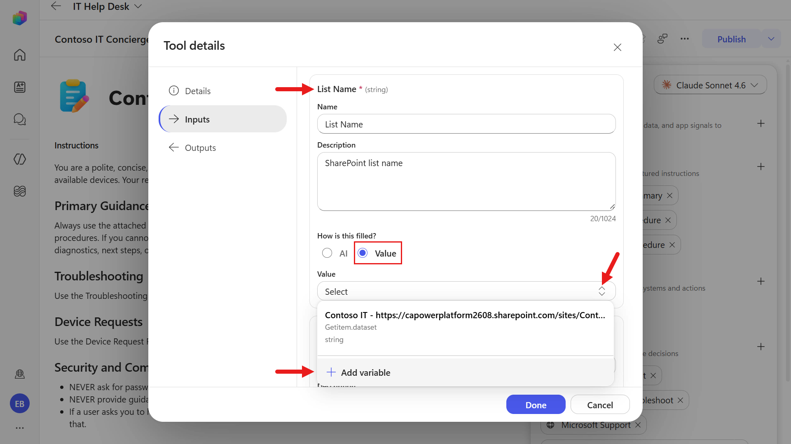

1. Select the SharePoint List created in the Course Setup mission, **EmployeeAssets**, and select **Save**.

   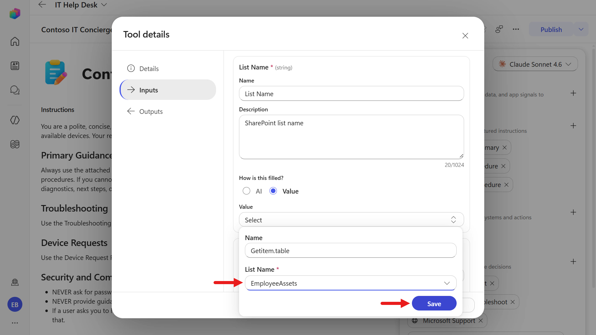

The input parameters for the **Get items** tool have been successfully configured. 👍🏻

## ✅ Mission Complete {#mission-complete}

Congratulations! 👏🏻 You learned that **Topics are gone** in the new experience and the model now orchestrates the conversation. You added a **SharePoint - Get items** tool and configured its inputs. 🙌🏻

In the next mission, you'll be testing the tool after one of the skills has been updated.

⏭️ [Move to **Automate with Workflows**](../08-automate-with-workflows/index.md)

## 📚 Tactical Resources {#tactical-resources}

🔗 [Add tools to agents](https://learn.microsoft.com/microsoft-copilot-studio/agent-extend-action-existing-connectors?WT.mc_id=power-172618-ebenitez)

🔗 [SharePoint connector reference](https://learn.microsoft.com/connectors/sharepointonline/#get-items)

🔗 [Write effective agent instructions](https://learn.microsoft.com/microsoft-copilot-studio/authoring-instructions?WT.mc_id=power-172618-ebenitez)

<analytics-tag section="recruit-v2" mission="07-add-tools" />
