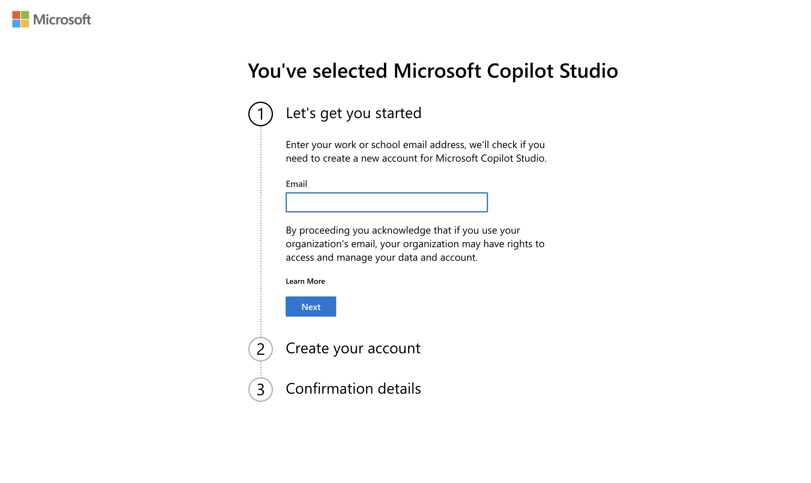
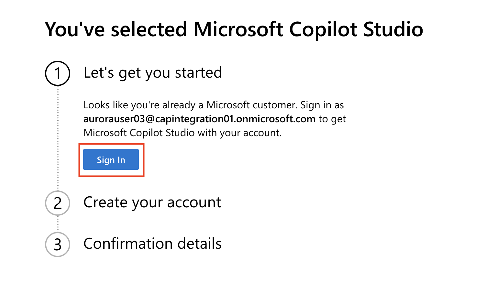
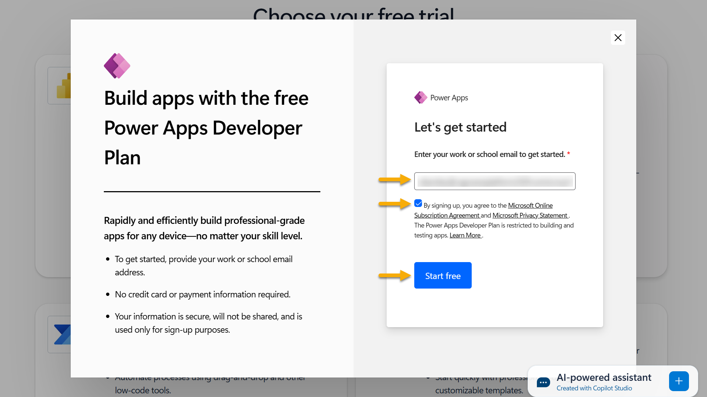
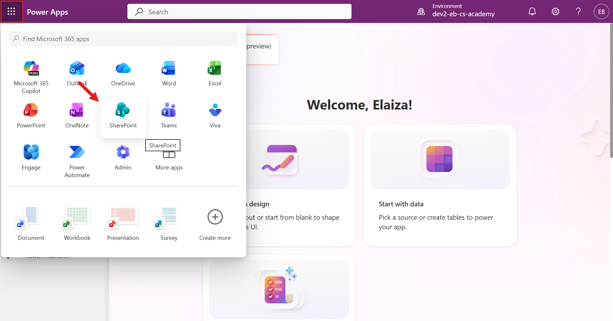
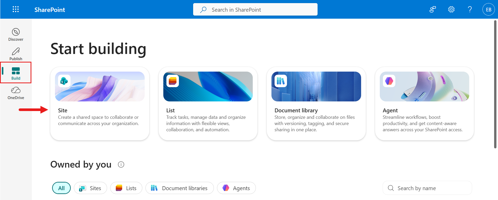
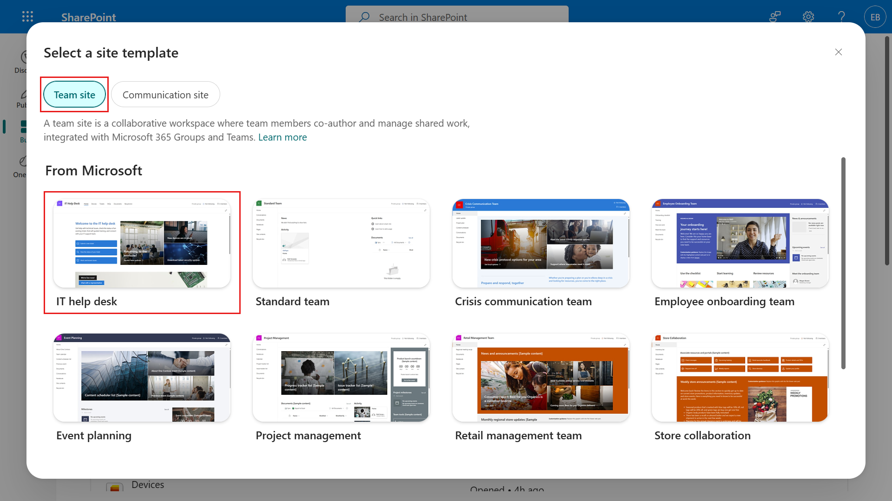
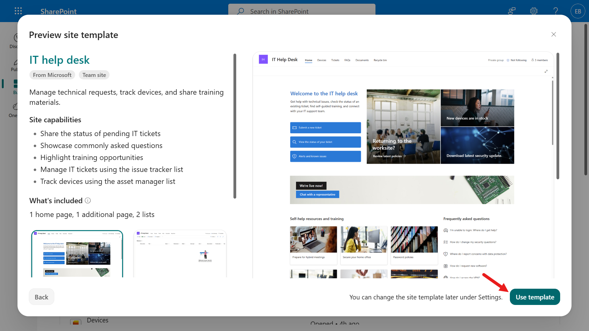
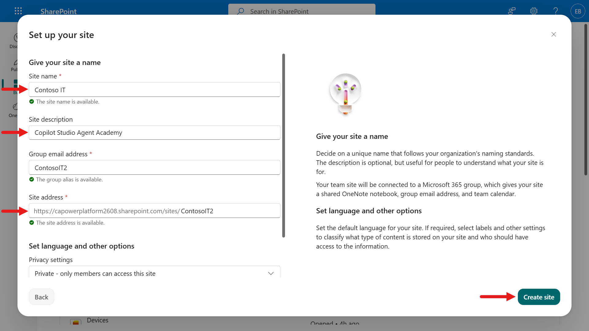

---
prev:
  text: Recruit overview
  link: /recruit
next:
  text: Introduction to Agents
  link: /recruit/01-introduction-to-agents
short-description: 'Set up your dev environment, Copilot Studio trial, and SharePoint site'
difficulty: 1
codename: OPERATION DEPLOYMENT READY
time: 30
harness: standard
tags:
  - setup
products:
  - copilot-studio
  - sharepoint
  - microsoft-365
industries:
  - it
created-date: 2025-08-20
last-edited-date: 2026-08-06
---

# 🚨 Mission 00: Course Setup {#mission-00-course-setup}

<mission-meta />

## 🎯 Mission Brief {#mission-brief}

Welcome, Recruit. Before you can start building your first AI agent, you need to establish your **field-ready development environment**.

This briefing outlines the systems, access credentials, and setup steps required to successfully operate in the Microsoft 365 ecosystem.

> [!IMPORTANT] This mission uses the classic Copilot Studio UI
> Microsoft Copilot Studio is rolling out a new user experience (UI). The screenshots and steps in this mission use the **classic experience**. If your screen looks different, turn off **New Experience** in the upper-right corner before you continue.

## 🔎 Objectives {#objectives}

In this mission, you’ll learn:

1. How to obtain a Microsoft 365 account
1. How to gain access to Microsoft Copilot Studio
1. When a Microsoft 365 Copilot license is needed for production publishing
1. How to create a developer environment for Copilot Studio
1. How to create a SharePoint site that later missions use as a data source

> [!IMPORTANT]
> **Already have access to Microsoft 365, Power Platform, and Copilot Studio?**
> Steps 1–4 below walk you through creating a **new trial environment from scratch**. If you already have a Microsoft 365 business tenant with access to Power Platform and Copilot Studio, you can **skip directly to [Step 5: Create new SharePoint site](#step-5-create-new-sharepoint-site)**. Steps 1–4 are only needed if you want to set up a dedicated trial environment to test these capabilities.

## 🔍 Prerequisites {#prerequisites}

Before you begin, ensure you have:

1. A **work or school email address** (personal @outlook.com, @gmail.com, etc., are not supported).
1. Access to the internet and a modern browser (Edge, Chrome, or Firefox recommended).  
1. Basic familiarity with Microsoft 365 (for example, signing into Office apps or Teams).  
1. (Optional) A credit card or billing method if you plan to purchase paid licenses.

## 🧪 Trial Environment Setup (Steps 1–4) {#trial-environment-setup-steps-14}

## Step 1: Get a Microsoft 365 Account

Copilot Studio resides within Microsoft 365, so you need a Microsoft 365 account to access it. You can either use an existing account if you have one or follow these steps to get an appropriate license:

**Acquire a paid Microsoft 365 Business subscription:**

1. Go to the [Microsoft 365 Business Plans and Pricing page](https://www.microsoft.com/microsoft-365/business/microsoft-365-plans-and-pricing).
1. Select the Microsoft 365 Business Basic plan, then select **Try for free**. Complete the guided form with your subscription, account, and payment information.

    

1. Sign in with your new account after setup is complete.

> [!TIP]
> If you plan to publish agents into Microsoft 365 Copilot Chat or connect to organizational data (SharePoint, OneDrive, Dataverse), a Microsoft 365 Copilot license is required. Learn more about this add-on license on the [Microsoft 365 Copilot plans page](https://www.microsoft.com/microsoft-365/copilot#plans).

## Step 2: Start a Copilot Studio Trial

Once you have your Microsoft 365 tenant, you need to get access to Copilot Studio. You can get a free 30-day trial by following these steps:

1. Navigate to the [Copilot Studio trial signup page](https://aka.ms/TryCopilotStudio).
1. Enter the email address from the new account you configured in the previous step and select **Next**.

    

1. Confirm that Copilot Studio recognizes your account, then select **Sign in**.

    

1. Select **Start free trial**.

    

> [!INFO] Trial Notes
>
> 1. The free trial provides **full Copilot Studio capabilities**.
> 1. You will receive email notifications about your trial expiration. You can extend the trial in 30-day increments (up to 90 days of agent runtime).  
> 1. If your tenant administrator disabled self-service sign-up, you’ll see an error—contact your Microsoft 365 admin to re-enable it.

## Step 3: Create new developer environment

### Sign up for a Power Apps Developer Plan

Using the same Microsoft 365 tenant in Step 1, sign up for a Power Apps Developer Plan to create a free development environment to build and test with Copilot Studio.

1. Sign up on the [Power Apps Developer Plan website](https://aka.ms/PowerAppsDevPlan).

    - Enter your email address
    - Tick the checkbox
    - Select **Start free**

    

1. After signing up for the Developer Plan, you'll be redirected to [Power Apps](https://make.powerapps.com/). The environment uses your name, for example **Adele Vance's environment**. If there's already an environment with that name, the new developer environment is named **Adele Vance's (1)** environment.

    Use this developer environment in Copilot Studio when completing the labs.

> [!NOTE]
> If you are using an existing Microsoft 365 account and did not create one in Step 1, for example, using your own account in your work organization, your IT administrator (or the equivalent) team who manages your tenant/environments might have turned off the sign-up process. In this case, please contact your administrator, or create a test tenant as per Step 1.
>
> If you are using an existing environment from your organization, ensure it is **not** a managed environment. Managed environment restrictions can prevent certain features — such as adding Power Automate flows as agent tools — from working correctly.

## Step 4: Enable Ability to Publish with the Copilot Studio Trial

The Copilot Studio trial recently changed and it does not allow publishing of agents by default. To enable publishing, you have to add yourself to the Copilot Studio Authors role in the Power Platform Admin Center.

First, you need a security group to hold everyone you want to be able to publish. This is what you'll associate with the Copilot Studio Authors role.

1. Navigate to the [Microsoft 365 admin center](https://admin.cloud.microsoft).
1. Expand the **Teams & groups** tab and select **Active teams & groups**

    

1. Select the **Security groups** tab and select **Add a security group**

    

1. Give the security group a name like **AgentCreators** and select the **Next** button.

    

1. Verify the name and select **Create group**

    

1. Select your newly created security group from the list

    

1. Select the **members** tab and select **view all and manage members**

    

1. Select **add members**

    

1. Select your name from the list and select **Add** then **Add** again

    

1. Navigate to the [Power Platform admin center](https://admin.powerplatform.com).
1. Select the **manage** tab

    

1. Select the **tenant settings** tab

    

1. Select the **Copilot Studio authors** option

    

1. Select **Edit** (pencil icon) for the **Copilot Studio authors** setting.

    

1. Select your security group from the list and select **Done**

    

1. Verify your security group is there and select **Save**

    

## 🔧 Required Setup (Everyone) {#required-setup-everyone}

The following steps are required regardless of whether you're using a trial or an existing environment.

## Step 5: Create new SharePoint site

A new SharePoint site needs to be created, which will be used in [Mission 06](../06-create-agent-from-conversation/index.md) when you add a SharePoint knowledge source.

1. In [Power Apps](https://make.powerapps.com/) or the [Microsoft 365 admin center](https://admin.cloud.microsoft), select **App launcher** (grid icon) to open the app menu, then select **SharePoint**.

    

    

1. After SharePoint loads, select **Build** in the left navigation menu, then select **Site** to create a new SharePoint site.

    

1. A dialog appears to guide site creation. Under the **Team site** option, select **IT help desk**.

    

1. Select **Use template** to create a new SharePoint site from the IT help desk template.

    

1. Enter your site details. Example:

    | Field            | Value                        |
    | ---------------- | ---------------------------- |
    | Site name        | Contoso IT                   |
    | Site description | Copilot Studio Agent Academy |
    | Site address     | ContosoIT                    |

    Select **Create site**.

    

1. After selecting **Create site**, SharePoint may take a few seconds to finish provisioning. In the meantime, you can optionally add users by entering email addresses in the **Add members** field.

    Once you see confirmation that the site is ready, select **Go to site**.

    

1. After the SharePoint site home page loads, **copy** the SharePoint site URL.

1. This template provides pages with sample data about various IT policies and two sample lists (Tickets and Devices).

### Use Devices SharePoint list

We will use the **Devices** list in Mission 07.

### Add new column

In the **Devices** list, navigate to the end of the columns and select **+ Add column**.

Choose the **hyperlink** type, enter **Image** for the column name, and select add.

### Create sample data in Devices SharePoint list

You need to make sure you fill in this list with at least 4 sample data items and add one additional column to this list.  

When adding sample data, make sure that the following fields are filled out:

- Device photo - use the device images below
- Title
- Status
- Manufacturer
- Model
- Asset Type
- Color
- Serial Number
- Purchase Date
- Purchase Price,
- Order #
- Image - use the following links

<download-files path="recruit/00-course-setup/assets/device-images" label="Download device images" />

| Device | URL |
| ------ | --- |
| Surface Laptop 13 | [Surface Laptop 13 image](https://raw.githubusercontent.com/microsoft/agent-academy/refs/heads/main/docs/recruit/00-course-setup/images/device-images/Surface-Laptop-13.png) |
| Surface Laptop 15 | [Surface Laptop 15 image](https://raw.githubusercontent.com/microsoft/agent-academy/refs/heads/main/docs/recruit/00-course-setup/images/device-images/Surface-Laptop-15.png) |
| Surface Pro | [Surface Pro image](https://raw.githubusercontent.com/microsoft/agent-academy/refs/heads/main/docs/recruit/00-course-setup/images/device-images/Surface-Pro-12.png) |
| Surface Studio | [Surface Studio image](https://raw.githubusercontent.com/microsoft/agent-academy/refs/heads/main/docs/recruit/00-course-setup/images/device-images/Surface-Studio.png) |

## ✅ Mission Complete {#mission-complete}

You’ve successfully:

- **Development environment**: Set up a Microsoft 365 developer environment
- **Copilot Studio access**: Activated a Copilot Studio trial
- **SharePoint site**: Created a site for grounding agents
- **Device data**: Populated the Devices list for use in later missions

Next, continue to [Mission 01: Introduction to Agents](../01-introduction-to-agents/index.md).

## 📚 Tactical Resources {#tactical-resources}

- [Power Apps Developer Plan](https://learn.microsoft.com/power-platform/developer/plan)
- [Copilot Studio licensing](https://learn.microsoft.com/microsoft-copilot-studio/requirements-licensing-subscriptions)
- [Create a team site in SharePoint](https://support.microsoft.com/office/create-a-team-site-in-sharepoint-ef10c1e7-15f3-42a3-98aa-b5972711777d)

<analytics-tag section="recruit" mission="00-course-setup" />
