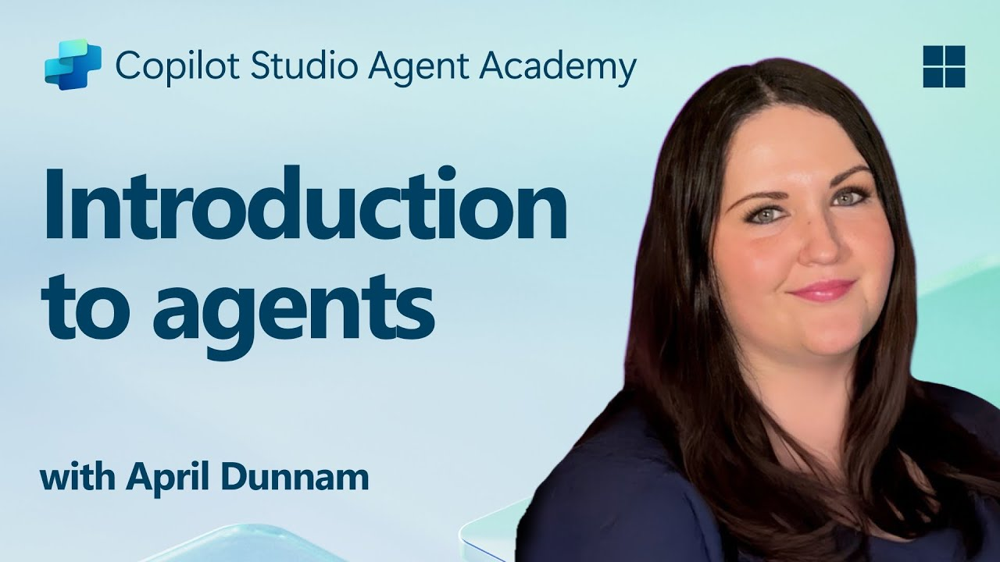

# 🚨 Mission 01: Introduction to Agents

## 🕵️‍♂️ CODENAME: `OPERATION AI AGENT DECODE`

> **⏱️ Operation Time Window:** `~30 minutes – intel only, no fieldwork required`

🎥 **Watch the Walkthrough**

## 🎯 Mission Brief

Welcome, Recruit. Before we dive into building agents, you need a firm grasp of the AI concepts that power them. This mission will equip you with foundational knowledge of conversational AI, large language models (LLMs), retrieval-augmented generation (RAG), and the types of agents you can create in Copilot Studio.

## 🔎 Objectives

In this mission, you’ll learn:

1. What conversational AI is and why it matters  
1. How Large Language Models (LLMs) power chat experiences  
1. What Retrieval-Augmented Generation (RAG) brings to the table  
1. The distinction between conversational agents and autonomous agents  
1. How agents in Copilot Studio leverage these concepts  

Let’s dive in!

---

## What Is Conversational AI?

Conversational AI refers to any system that can understand, process, and respond to human language – whether text or speech – in a way that feels natural. Think chatbots in help desks or virtual personal assistants in your favorite apps. Under the hood, most modern conversational AIs rely on Large Language Models (LLMs), which we’ll cover next.

### Why It Matters

- **User Experience:** Conversational interfaces are often more intuitive than clicking through menus.  
- **Scalability:** One agent can handle tens or hundreds of concurrent conversations.  
- **Efficiency:** Instead of building custom rule-based scripts, LLM-powered agents adapt on the fly to user input.  
- **Extensibility:** With the right design, agents can tap into knowledge bases, connect to APIs, or act as “digital coworkers” inside business workflows.

---

## Large Language Models (LLMs) 101

At the core of most conversational AI systems are **Large Language Models** – neural networks trained on massive text corpora. They learn statistical patterns of language so they can generate coherent sentences, answer questions, or even brainstorm ideas. Key points to understand:

1. **Training Data:** LLMs ingest terabytes of text (web pages, books, articles). This “world knowledge” lets them respond on many topics.  
1. **Tokenization:** Text is broken into smaller units called tokens (words, subwords, or characters). The model predicts one token at a time.  
1. **Context Window:** Each LLM has a limit on how many tokens it can “see” at once. Beyond that limit, prior tokens get truncated.  
1. **Prompting:** You interact with an LLM by sending it a prompt. The better your prompt, the more focused and relevant the response.  
1. **Zero-shot vs. Fine-tuning:** Zero-shot means using an LLM as-is (just raw weights). Fine-tuning means adjusting the model on domain-specific data so it answers more accurately for your needs.

!!! Tip "Pro Tip"
    A common analogy is that an LLM is like a “super-smart autocomplete.” It doesn’t truly understand meaning like a human brain, but it’s extremely good at predicting the next best word (or phrase) in a sequence.

---

## Retrieval-Augmented Generation (RAG)

When LLMs rely solely on static training data, they might hallucinate or become outdated. RAG addresses this by letting the model “look up” fresh information before composing an answer. At a high level, RAG works like this:

1. **User Query:** A user asks a question (e.g., “What’s the latest on Contoso’s quarterly earnings?”).  
1. **Retriever Step:** The system queries a knowledge source (documents, internal databases, SharePoint libraries, etc.) to find relevant passages.  
1. **Augmentation:** Retrieved passages get appended to or prepended before the LLM prompt.  
1. **Generation:** The LLM ingests both the user’s question and the retrieved context, then generates a response that’s grounded in up-to-date data.  

With RAG, your agent can call internal company wikis, plugin APIs, or search an FAQ knowledge base—and return answers that aren’t limited to statically published model parameters.

---

## Conversational vs. Autonomous Agents

In the context of Copilot Studio, the term **agent** can refer to multiple flavors of AI assistants. It’s helpful to draw a line between:

**Conversational Agents:**

- Primarily focus on two-way dialogue.
- Persist context across multiple turns of a conversation.
- Usually orchestrated via predefined flows or triggers (e.g., “If user says X, respond with Y”).
- Ideal for customer support, FAQs, guided interactions, scheduling, or simple Q&A.
  - Examples:
    - A Teams chatbot that answers HR policy questions.  
    - A Power Virtual Agents bot on a SharePoint page to guide users through a form.  

**Autonomous Agents:**

- Go beyond back-and-forth chat; they can **take actions** on behalf of the user.
- Use LLM reasoning loops (think “plan → act → observe → replan”) to complete tasks.
- Hook into external tools or APIs (e.g., call a Power Automate flow, send calendar invites, manipulate data in Dataverse).
- Operate without constant human prompts—once triggered, they can handle multi-step processes autonomously.
  - Examples:  
    - An agent that generates a travel itinerary, books flights, and emails confirmations.  
    - A “Meeting Summarizer” agent that joins a Teams call, transcribes it in real time, and writes an executive summary to OneNote.  

!!! Info "Key Difference"
    Conversational agents wait for user input and stick to dialogue. Autonomous agents proactively plan and execute a sequence of steps using broader tool access.

---

## Agents in Copilot Studio

**Copilot Studio** unifies both conversational and autonomous scenarios under one framework. Here’s how Copilot Studio helps you build agents:

1. **Visual Agent Designer:** A low-code canvas to define prompts, memory, and tools for both chat and action workflows.  
1. **LLM Configurations:** Select from various OpenAI models or Microsoft’s enterprise-grade GPT to match your performance and cost needs.  
1. **Retrieval Connectors:** Prebuilt integrations for SharePoint, OneDrive, Azure Cognitive Search, and Dataverse, enabling RAG out of the box.  
1. **Custom Tools & Functions:** Define custom HTTP actions or Power Automate flows that your agent can invoke autonomously.  
1. **Multi-Modal Support:** Beyond text, Copilot Studio agents can ingest images, files, or structured data to enrich context.  
1. **Publishing & Distribution:** Once your agent is ready, you can publish it to Microsoft 365 Copilot (so users invoke it in Teams, SharePoint, Outlook, etc.) or embed it as a standalone chat widget on a webpage.

---

## 🎉 Mission Complete

You’ve now completed your introduction to agents and foundational AI concepts. You understand:

1. **LLMs = The “Brain” of Your Agent**  
   - Responsible for language understanding and generation.  
   - More tokens = richer context, but also higher cost per call.  

1. **RAG = Real-Time Knowledge Integration**  
   - Bridges the gap between a static LLM and ever-changing data sources.  
   - Retrieves and injects relevant documents or records into the LLM prompt.  

1. **Conversational vs. Autonomous**  
   - **Conversational:** Focus on dialogue flow and preserving context (e.g., “Session Memory”).  
   - **Autonomous:** Add “Action Blocks” that let the agent call out to external tools or services.

---
Next up, you'll explore the [fundamentals of Copilot Studio](../02-copilot-studio-fundamentals/README.md)!

Stay sharp, Recruit - your AI journey is just beginning!

## 📚 Tactical Resources

🔗 [Copilot Studio Documentation Home](https://learn.microsoft.com/microsoft-copilot-studio/)

---

<!-- markdownlint-disable-next-line MD033 -->

