---
prev:
  text: Deploy a Declarative Agent for Microsoft 365 Copilot
  link: /recruit/03-create-a-declarative-agent-for-M365Copilot
next:
  text: Using a Pre-Built Agent
  link: /recruit/05-using-prebuilt-agents
short-description: Package your agent into a reusable solution for environment management
difficulty: 1
codename: OPERATION CTRL-ALT-PACKAGE
time: 45
harness: standard
tags:
  - solutions
products:
  - copilot-studio
  - power-platform
industries:
  - it
created-date: 2025-08-20
last-edited-date: 2026-08-06
---
# 🚨 Mission 04: Creating a Solution for Your Agent {#mission-04-creating-a-solution-for-your-agent}

<mission-meta />

🎥 **Watch the Walkthrough**

[](https://www.youtube.com/watch?v=1iATbkgfcpU "Watch the walkthrough on YouTube")

## 🎯 Mission Brief {#mission-brief}

Welcome back, Recruit. In this mission, you’ll assemble a solution—the deployment vehicle for your IT helpdesk agent built with Microsoft Copilot Studio. Think of it as a digital briefcase that holds your agent and its related components.

Every agent needs a well-structured home. That’s what a Power Platform solution provides - order, portability, and readiness for production.

Let’s pack up.

> [!IMPORTANT] This mission uses the classic Copilot Studio experience
> If your Copilot Studio screen looks different from the screenshots in this mission, turn off **New Experience** in the upper-right corner to switch back to the **classic experience** used here.

## 🔎 Objectives {#objectives}

In this mission, you’ll learn:

1. What Power Platform solutions are and how they support agent development
1. Why solutions help organize and deploy agents
1. How solution publishers identify and manage components
1. How solutions move from development to production
1. How to create a publisher and custom solution for your IT helpdesk agent

## 🕵🏻‍♀️ Solution? What's that? {#solution-whats-that}

In Microsoft Power Platform, solutions are like containers or packages that hold all the parts of your apps or agents - these could be tables, forms, flows, and custom logic. Solutions are essential for Application Lifecycle Management (ALM), they enable you to manage your app and agents from idea to development, testing, deployment, and updates.

In Copilot Studio, every agent you create is stored in a Power Platform solution. By default, agents are created in the Default solution, unless you create a new custom solution to create your agent in. This is what we'll learn 🤓 in this lesson and in the hands-on lab.

Solutions traditionally have been created in the **Power Apps maker portal** - a web based interface where you can build and customize apps, Dataverse, flows, explore AI components and more.

    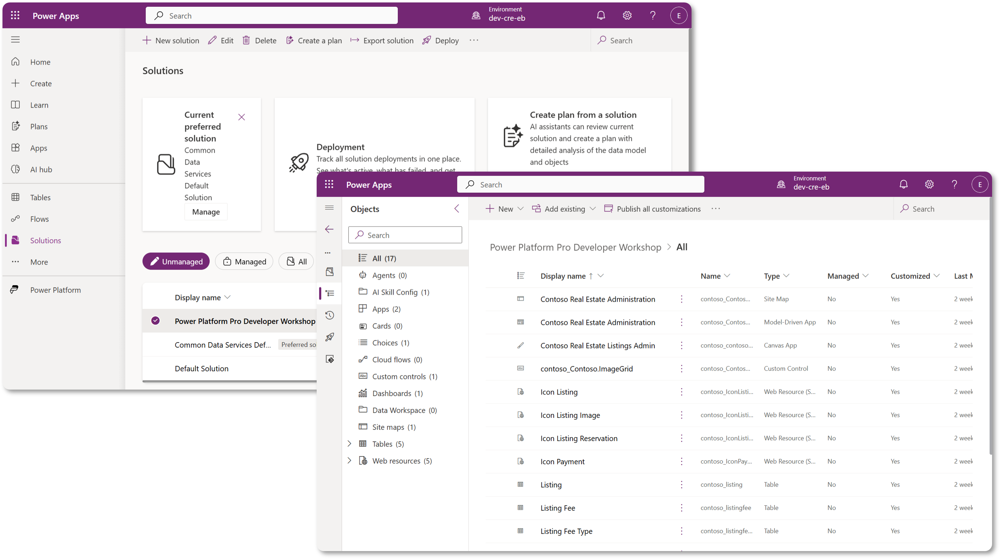

In Copilot Studio, there is now the **Solution Explorer** where you can manage your solutions directly. You no longer need to switch to the Power Apps maker portal to manage your solutions, it can be done right inside Copilot Studio 🪄

This means you can do the usual solution-related tasks:

- **Create a solution** - custom solutions enable agents to be exported and imported between environments.
- **Set your preferred solution** - choose the solution agents, apps, etc will be created in by default.
- **Add or remove components** - your agent could be referencing other components such as environment variables or cloud flows. Therefore these components needed to be included in the solution.
- **Export solutions** - to move solutions to another target environment.
- **Import solutions** - import solutions created elsewhere, including upgrading or updating solutions.
- **Create and manage solution pipelines** - automate the deployment of solutions between environments.
- **Git integration** - enables developers to connect solutions with Git repositories for version control, collaboration and ALM. Intended to be used in developer environments only.

    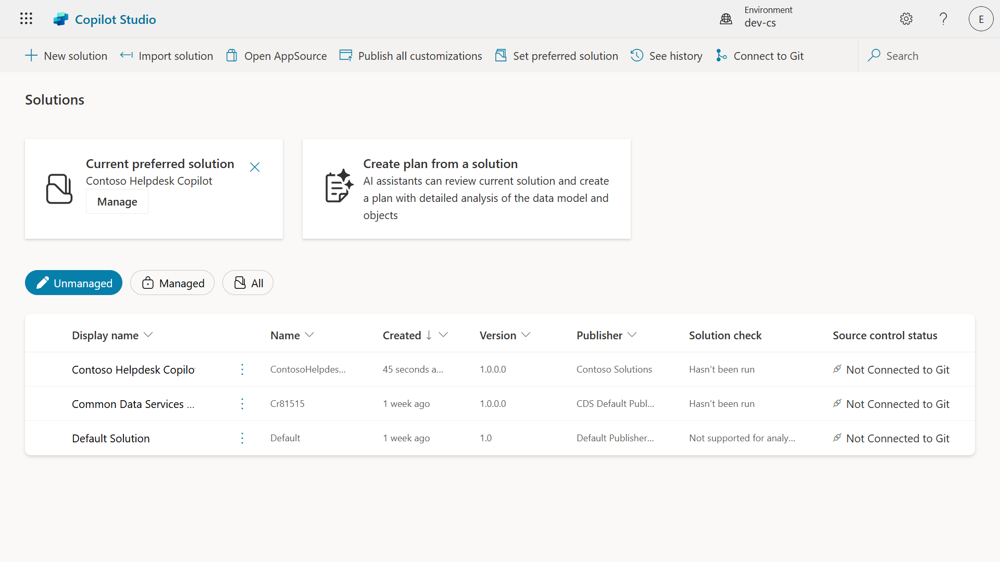

There are two types of solutions:

- **Unmanaged solutions** - used during development. You can freely edit and customize as needed.
- **Managed solutions** - used when you're ready to deploy your app to testing or production. These are locked down to prevent accidental changes.

## 🤔 Why _should_ I use a Solution for my agent? {#why-should-i-use-a-solution-for-my-agent}

Think of Solutions as a _toolbox_. When you need to fix or build something (an agent) in a different location (environment), you gather all the necessary tools (components) and put them in your toolbox (Solution). You can then carry this toolbox to the new location (environment) and use the tools (components) to complete your work, or add new tools (components) to customize your agent or project you're building.

> [!NOTE] Elaiza, your friendly cloud advocate popping in here 🙋🏻‍♀️ to share some words:
> We have a saying in New Zealand, "Be a tidy Kiwi!" which is a call to action for New Zealanders 🥝 to take responsibility for their environment by disposing of litter properly and keeping public spaces clean. We can use the same context for agents by keeping everything related to your agent organized and portable, and it'll help you maintain a tidy environment.

It's good practice to create an agent in a dedicated solution in your source (developer) environment. Here's why solutions are valuable:

🧩 **Organized development**

- You're keeping your agent separate from the Default solution which contains everything in the environment. All your agent components are in one place 🎯

- Everything you need for your agent is in a solution, making it easier to export and import to a target environment 👉🏻 this is a healthy habit of ALM.

🧩 **Safe deployment**

- You can export your app or agent as a managed solution and deploy it to other target environments (such as testing or production) without risking accidental edits.

🧩 **Version control**

- You can create patches (target fixes), updates (a more comprehensive change) or upgrades (replacing a solution - usually major changes and introducing new features).

- Helps you roll out changes in a controlled way.

🧩 **Dependency management**

- Solutions track which parts depend on others. This prevents you from breaking things when you make changes.

🧩 **Team collaboration**

- Developers and makers can work together using unmanaged solutions in development, then hand off a managed solution for deployment.

## 🪪 Understanding Solution Publishers {#understanding-solution-publishers}

A Solution Publisher in Power Platform is like a label or brand that identifies who created or owns a solution. It’s a small but important part of managing your apps, agents and flow customizations, especially when working in teams or across environments.

When you create a solution, you must choose a publisher. This publisher defines:

- A prefix that gets added to all custom components (think tables, fields, and flows).

- A name and contact info for the organization or person who owns the solution.

### 🤔 Why is it important? {#why-is-it-important}

1. **Easy identification** - the prefix (Example - `new_` or `abc_`) helps you quickly identify which components belong to which solution or team.

1. **Avoids conflicts** - if two teams create a column called status, their prefixes (`teamA_status`, `teamB_status`) prevent naming collisions.

1. **Supports ALM** - when moving solutions between environments (Dev → Test → Prod), the publisher helps track ownership and maintain consistency.

> [!TIP] ✨ Example
>
> Let’s say you create a publisher called Contoso Solutions with the prefix `cts_`.
>
> If you add a custom column called _Priority_, it will be stored as `cts_Priority` in the solution.
>
> Anyone who comes across the column at a solution level regardless of what environment they're in, they can easily identify it as a column that's associated to Contoso Solutions.

## 🧭 Power Platform Solution lifecycle {#power-platform-solution-lifecycle}

So now you understand the purpose of a Solution, let's next learn about the lifecycle.

**1. Create Solution in Development environment** - start by creating a new solution in your Development environment.

**2. Add Components** - add apps, flows, tables, and other elements to your solution.

**3. Export as Managed solution** - package your solution for deployment by exporting it as a Managed solution.

**4. Import to Test environment** - test your solution in a separate Test environment to ensure everything works as expected.

**5. Import to Production environment** - deploy the tested solution to your live Production environment.

**6. Apply Patches, Updates or Upgrades** - make improvements or fixes using patches, updated, or upgrades. 🔁 Repeat the cycle!

> [!TIP] ✨ Example
>
> Imagine you're building an IT helpdesk agent to help employees with issues such as device problems, network troubleshooting, printer setup and more.
>
> - You start in a Development environment using an unmanaged solution.
>
> - Once it's ready, you export it as a managed solution and import it into a target environment such as a System Test or User Acceptance Testing (UAT) environment.
>
> - After testing, you move it to the Production environment - all without touching the original development version.

## 🧪 Lab 04: Create a new Solution {#lab-04-create-a-new-solution}

We're now going to learn

- How to create a Solution publisher
- How to create a Solution

We're going to stick with the example from earlier, where we're going to create a solution in the dedicated Copilot Studio environment to build our IT helpdesk agent in.

Let's begin!

### Prerequisites

#### Security role

In Copilot Studio, what you _can do_ in the solution explorer depends on your user security role.
If you don’t have permission to manage solutions in the Power Apps admin center, you won’t be able to do those tasks in Copilot Studio either.

To make sure everything works smoothly, check that you have the right security roles and permissions. Or if you don't manage environments in your organization, ask your IT administrator (or the equivalent) team who manages your tenant/environments.

The following are the security roles that enables users to create a solution in their environment.

| Security role | Description |
| ---------- | ---------- |
| Environment Maker | Provides the necessary permissions to create, customize, and manage resources within a specific environment, including solutions |
| System Customizer | Wider permissions than Environment Maker, including the ability to customize the environment and manage security roles |
| System Administrator | Highest level of permissions and can manage all aspects of the environment, including creating and assigning security roles |

#### Developer environment

::: warning Switch to your environment
Make sure you switch to your dedicated developer environment. For details, see [Lesson 00 - Course Setup - Step 3: Create new developer environment](../00-course-setup/index.md#step-3-create-new-developer-environment).
:::

1. Select **Environment** in the Copilot Studio header and switch from the default environment to your environment, for example **Adele Vance's environment**.

    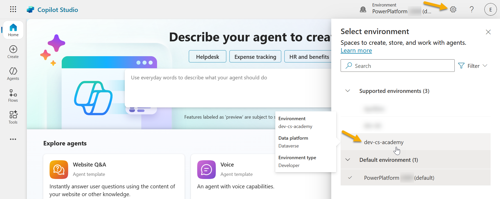

### 4.1 Create a Solution publisher

1. Select the **ellipsis icon (...)** on the left-hand side menu in Copilot Studio. Select **Solutions** under the **Explore** header.

    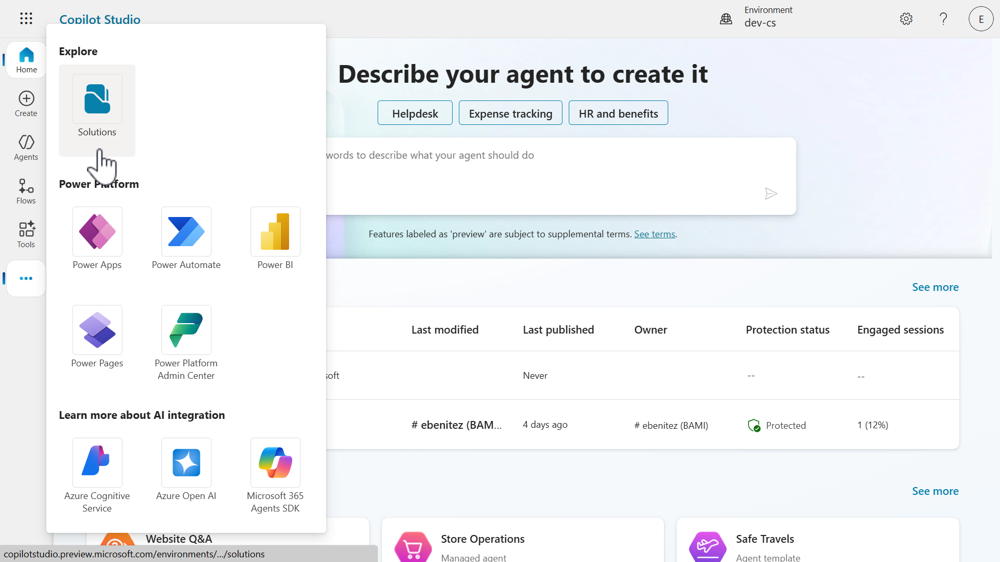

1. The **Solution Explorer** in Copilot Studio will load. Select **+ New solution**

    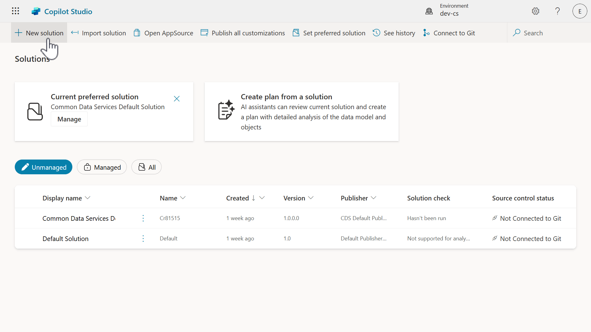

1. The **New solution** pane will appear where we can define the details of our solution. First, we need to create a new publisher. Select **+ New publisher**.

    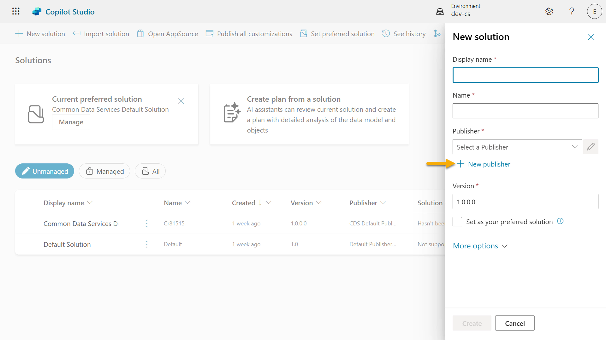

1. The **Properties** tab of the **New publisher** pane will appear with required and non-required fields to be populated in the **Properties** tab. This is where we can outline the details of the publisher which will be used as the label or brand that identifies who created or owns the solution.

    |Property|Description|Required|
    |----------|----------|:----------:|
    |Display name|Display name for the publisher|Yes|
    |Name|The unique name and schema name for the publisher|Yes|
    |Description|Outlines the purpose of the solution|No|
    |Prefix|Publisher prefix which will be applied to newly created components|Yes|
    |Choice value prefix|Generates a number based on the publisher prefix. This number is used when you add options to choices and provides an indicator of which solution was used to add the option.|Yes|

    Copy and paste the following as the **Display name**,

    ```text
    Contoso Solutions
    ```

    Copy and paste the following as the **Name**,

    ```text
    ContosoSolutions
    ```

    Copy and paste the following as the **Description**,

    ```text
    Copilot Studio Agent Academy
    ```

    Copy and paste the following for the **Prefix**,

    ```text
    cts
    ```

    By default, the **Choice value** prefix will display an integer value. Update this integer value to the nearest thousand. For example, in my screenshot below, it was initially `77074`. Update this from `77074` to `77000`.

    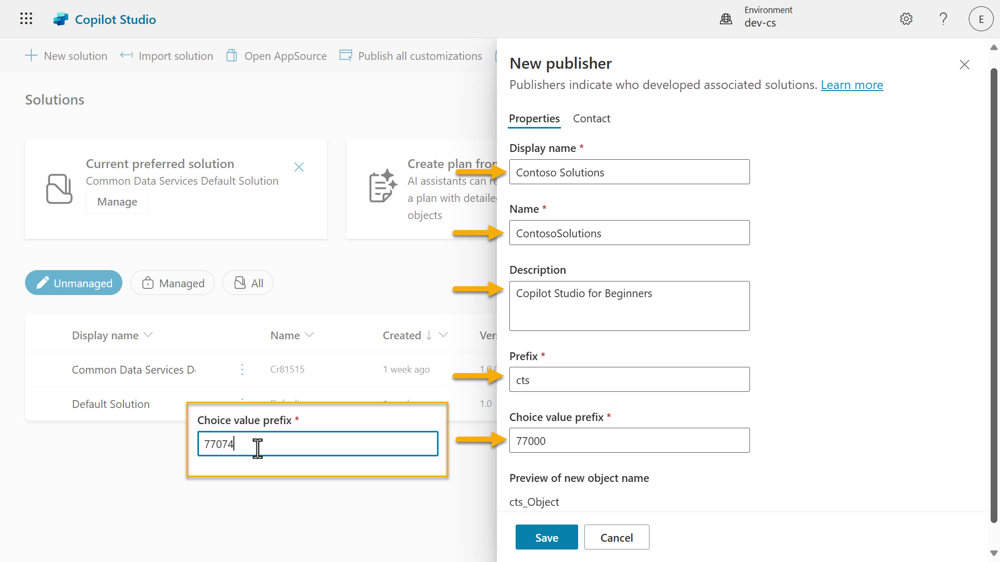

1. If you want to provide the contact details for the Solution, select the **Contact** tab and populate the following columns displayed.

    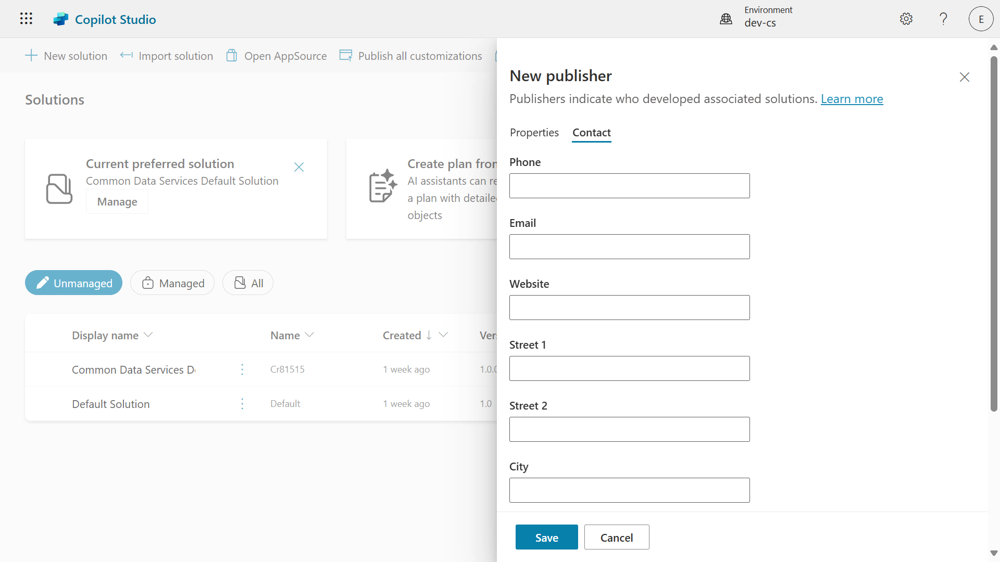

1. Select the **Properties** tab and select **Save** to create the Publisher.

    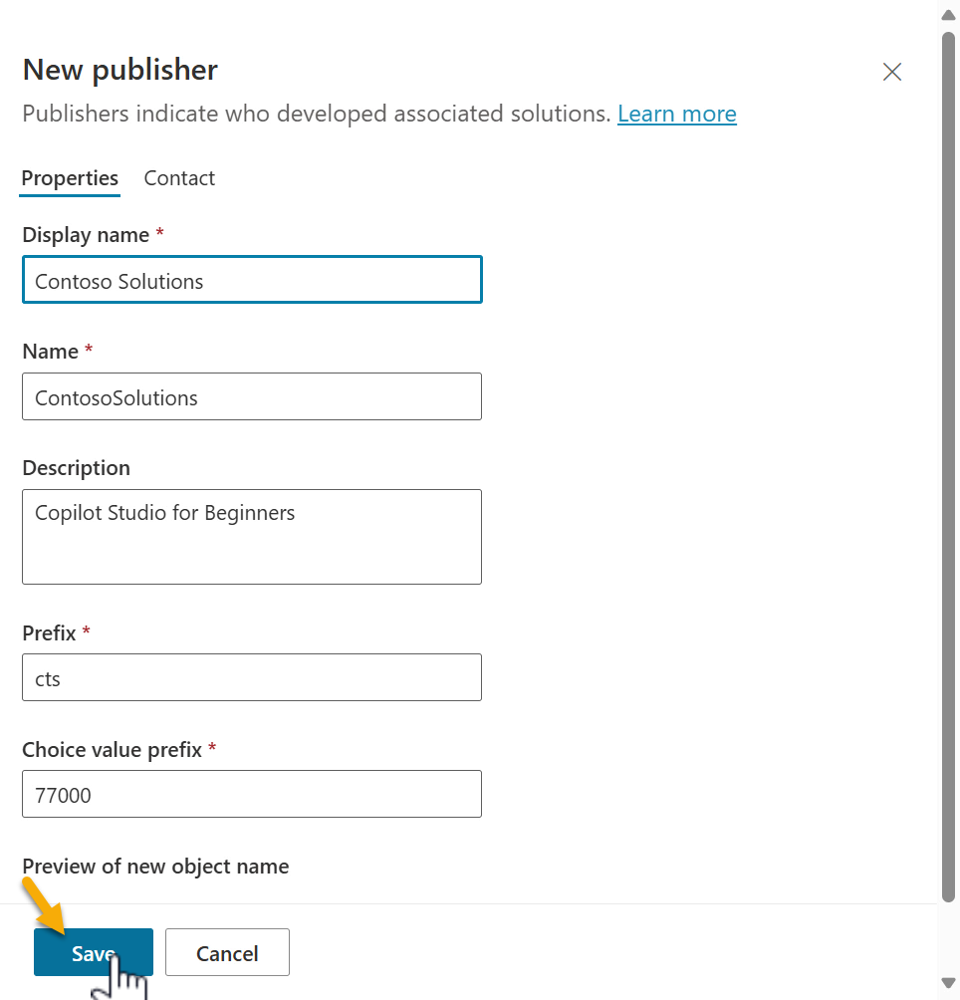

1. The New publisher pane will close and you'll be brought back to the **New solution** pane with the newly created Publisher selected.

    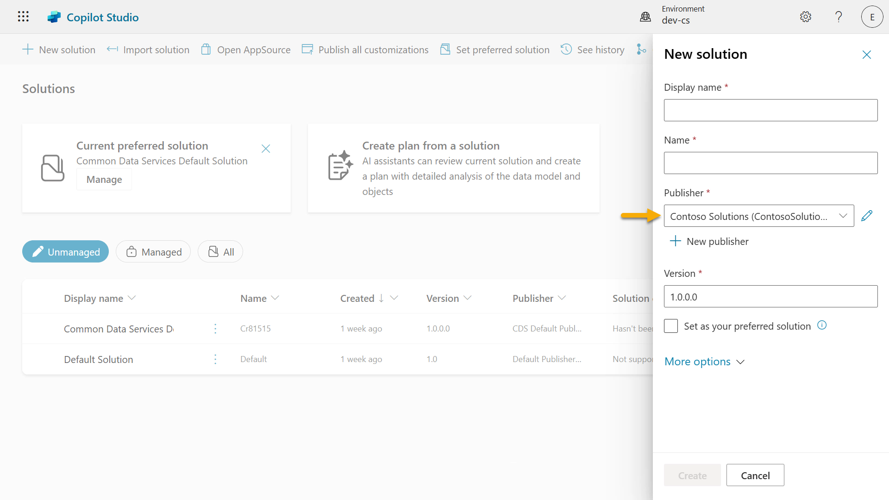

High five, you've now created a Solution Publisher! 🙌🏻 We'll next learn how to create a new custom solution.

### 4.2 Create a new Solution

1. Now that we've created our solutions, we can now complete the rest of the form in the **New solution** pane.

    Copy and paste the following as the **Display name**,

    ```text
    Contoso Helpdesk Agent
    ```

    Copy and paste the following as the **Name**,

    ```text
    ContosoHelpdeskAgent
    ```

    Since we're creating a new solution, the [**Version** number](https://learn.microsoft.com/power-apps/maker/data-platform/update-solutions#understanding-version-numbers-for-updates/?WT.mc_id=power-172615-ebenitez) by default will be `1.0.0.0`.

    Tick the **Set as your preferred solution** checkbox.

    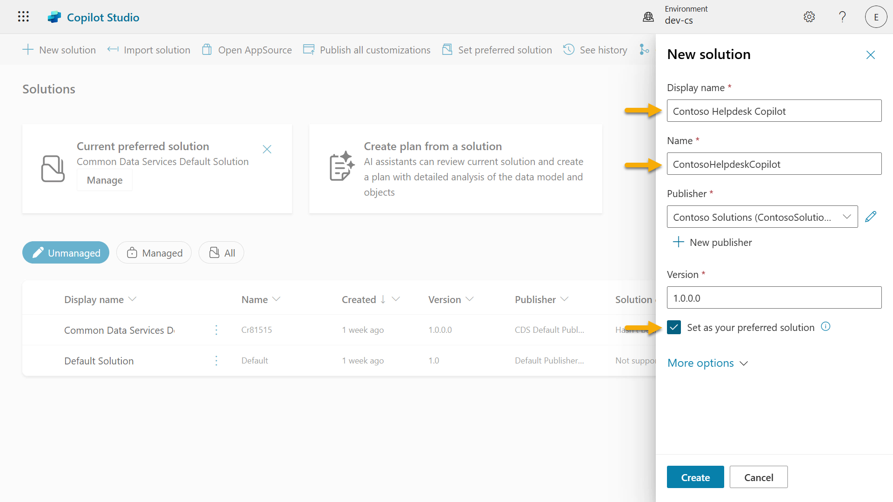

1. Expand the **More options** to see additional details that can be provided in a solution.

    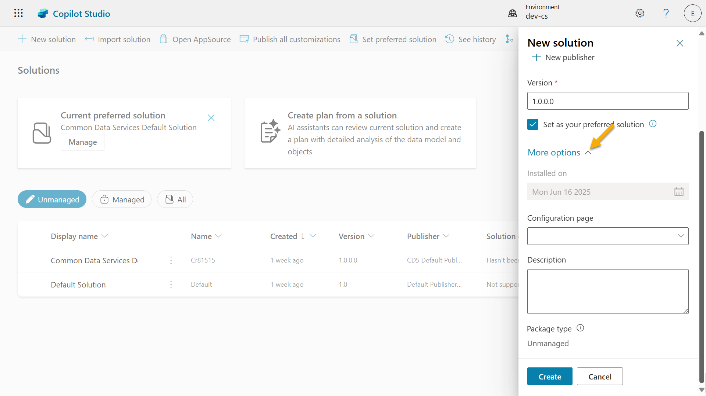

1. You'll see the following,

    - **Installed on** - the date of when the Solution was installed.

    - **Configuration page** - developers set up an HTML web resource to help users interact with their app, agent or tool where it'll appear as a web page in the Information section with instructions or buttons. It’s mostly used by companies or developers who build and share solutions with others.

    - **Description** - describes the solution or a high level description of the configuration page.

    We'll leave these blank for this lab.

    Select **Create**.

    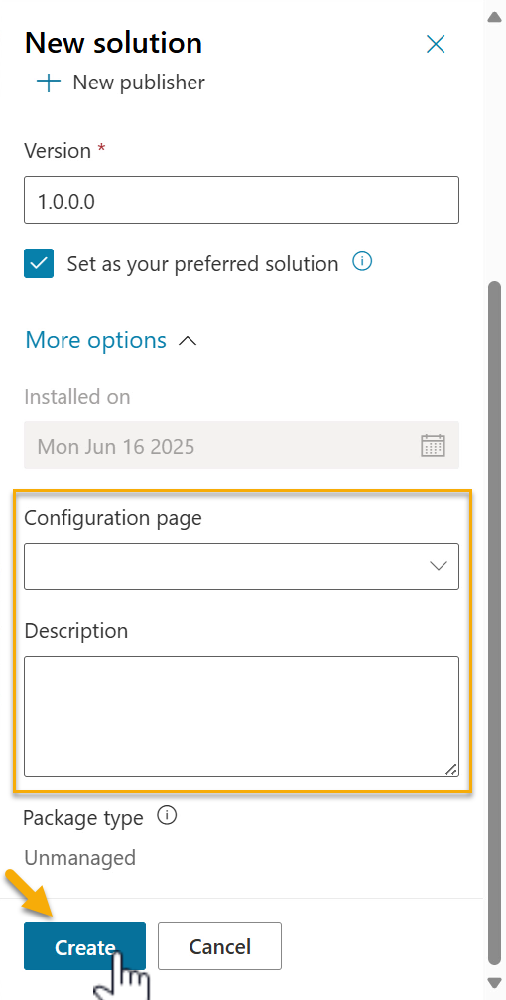

1. The solution for Contoso Helpdesk Agent has now been created. There will be zero components until we create an agent in Copilot Studio.

    Select **Back** to return to **Solution Explorer**.

    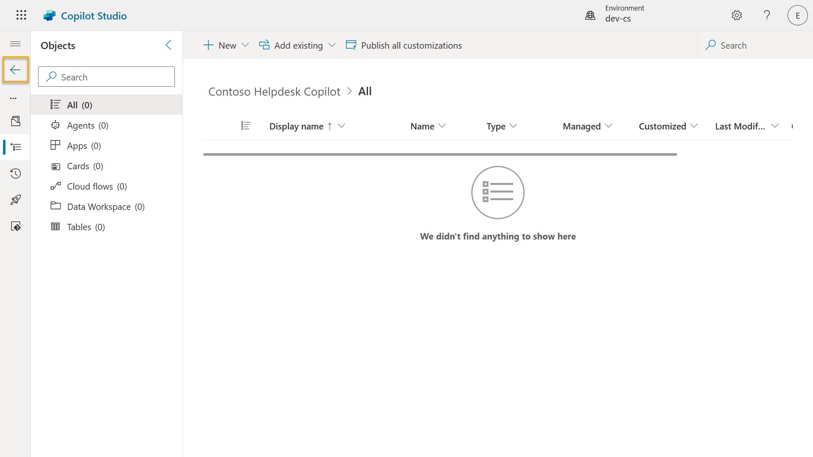

1. Notice how the Contoso Helpdesk Agent now displays as the **Current preferred solution** since we ticked the **Set as your preferred solution** checkbox earlier.

    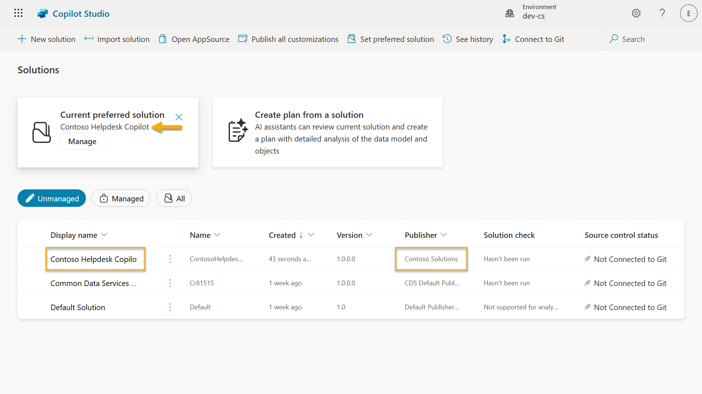

## ✅ Mission Complete {#mission-complete}

You’ve successfully:

- **Solution publisher**: Created a publisher with a custom prefix
- **Custom solution**: Created a solution for the Contoso Helpdesk Agent
- **Preferred solution**: Set the solution as the default location for new components
- **Application lifecycle management**: Established a foundation for moving the agent between environments

Next, continue to [Mission 05: Using a Pre-Built Agent](../05-using-prebuilt-agents/index.md).

## 📚 Tactical Resources {#tactical-resources}

- [Create a solution](https://learn.microsoft.com/power-apps/maker/data-platform/create-solution/?WT.mc_id=power-172615-ebenitez)

- [Create and manage solutions in Copilot Studio](https://learn.microsoft.com/microsoft-copilot-studio/authoring-solutions-overview/?WT.mc_id=power-172615-ebenitez)

- [Share agents with other users](https://learn.microsoft.com/microsoft-copilot-studio/admin-share-bots/?WT.mc_id=power-172615-ebenitez)

- [Summary of resources available to predefined security roles](https://learn.microsoft.com/power-platform/admin/database-security#summary-of-resources-available-to-predefined-security-roles/?WT.mc_id=power-172615-ebenitez)

- [Upgrade or update a solution](https://learn.microsoft.com/power-apps/maker/data-platform/update-solutions/?WT.mc_id=power-172615-ebenitez)

- [Overview of pipelines in Power Platform](https://learn.microsoft.com/power-platform/alm/pipelines/?WT.mc_id=power-172615-ebenitez)

- [Overview of Git integration in Power Platform](https://learn.microsoft.com/power-platform/alm/git-integration/overview/?WT.mc_id=power-172615-ebenitez)

<analytics-tag section="recruit" mission="04-creating-a-solution" />
