---
prev:
  text: Creating a Solution for Your Agent
  link: /recruit/04-creating-a-solution
next:
  text: Create a custom agent using natural language with AI
  link: /recruit/06-create-agent-from-conversation
short-description: Use and customize a template agent to accelerate setup
difficulty: 1
codename: OPERATION SAFE TRAVELS
time: 30
harness: standard
tags:
  - prebuilt-agents
products:
  - copilot-studio
  - microsoft-365
  - teams
industries:
  - it
created-date: 2025-08-20
last-edited-date: 2026-08-06
---
# 🧰 Mission 05: Using a Pre-Built Agent {#mission-05-using-a-pre-built-agent}

<mission-meta />

🎥 **Watch the Walkthrough**

[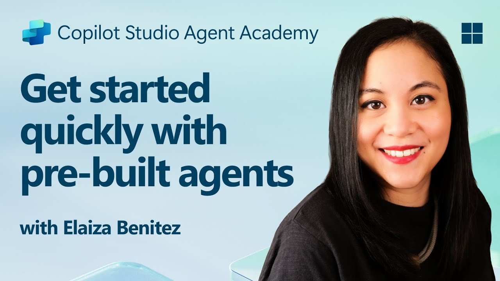](https://www.youtube.com/watch?v=NmXsx8WjWuM "Watch the walkthrough on YouTube")

## 🎯 Mission Brief {#mission-brief}

Welcome to your next mission in the Copilot Studio Agent Academy. You're about to explore the world of **pre-built agents**—intelligent, purpose-driven agents created by Microsoft to accelerate your deployment and reduce time to value.

Rather than building from scratch, pre-built agents (also called **agent templates**) give you a head start by providing ready-to-use scenarios that you can customize and deploy in minutes.

While you prepare the Contoso IT helpdesk agent, another requirement arrives: employees also need help preparing for business travel and finding travel policies. This is related to employee support, but it has a distinct purpose and knowledge domain. Instead of expanding the IT helpdesk agent beyond its core responsibility, you can use a focused agent for the travel scenario.

In this mission, you’ll step away from the main helpdesk build to deploy the **Safe Travels** template. You’ll see how a pre-built agent can satisfy a new requirement quickly while keeping each agent focused on a clear responsibility.

> [!IMPORTANT] This mission uses the classic Copilot Studio experience
> If your Copilot Studio screen looks different from the screenshots in this mission, turn off **New Experience** in the upper-right corner to switch back to the **classic experience** used here.

## 🔎 Objectives {#objectives}

In this mission, you’ll learn:

1. Why pre-built agents accelerate common business scenarios
1. How to deploy the **Safe Travels** agent template
1. How to customize an agent’s knowledge
1. How to test and publish a pre-built agent

## 🧠 What Are Pre-Built Agents? {#what-are-pre-built-agents}

Pre-built agents are turnkey AI agents created by Microsoft that:

- Address common business needs (like travel, HR, IT support)
- Include fully functioning topics, trigger phrases, instructions and sample knowledge.
- Can be edited, extended, and grounded with your own data

These agents are perfect for getting started quickly or learning how agents are structured.

## 🧪 Lab 05: Quickly get started with a pre-built agent {#lab-05-quickly-get-started-with-a-pre-built-agent}

In this lab, you’ll respond to the new travel-support requirement by selecting and customizing a pre-built agent. The Safe Travels agent is a standalone, focused agent rather than an extension of the Contoso IT helpdesk agent.

Let's begin!

### 5.1 Launch Copilot Studio

1. Navigate to [https://copilotstudio.microsoft.com](https://copilotstudio.microsoft.com)

1. Sign in with your Microsoft 365 work or school account

### 5.2 Choose the Safe Travels Agent Template

1. Select the **Agents** tab in the left-hand menu.
    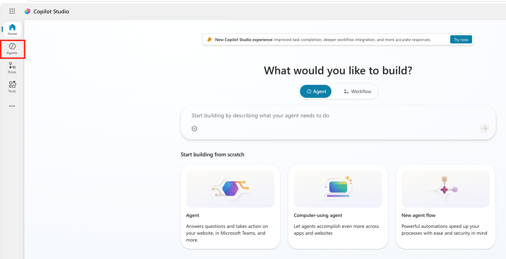

1. Scroll down to the **Start with an agent template** section. Find and select the **Safe Travels** template.

    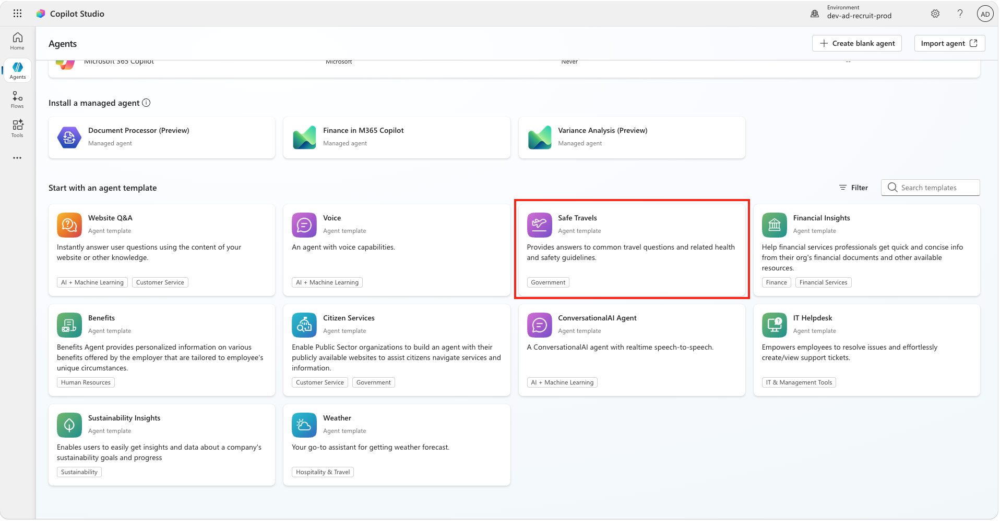

1. Notice that the template comes pre-loaded with a description, instructions and knowledge.

    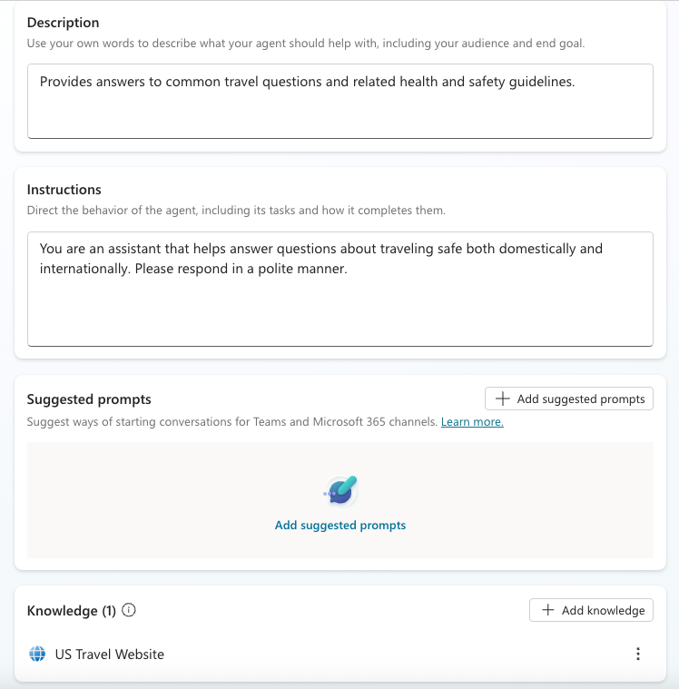

1. Select **Create**.

    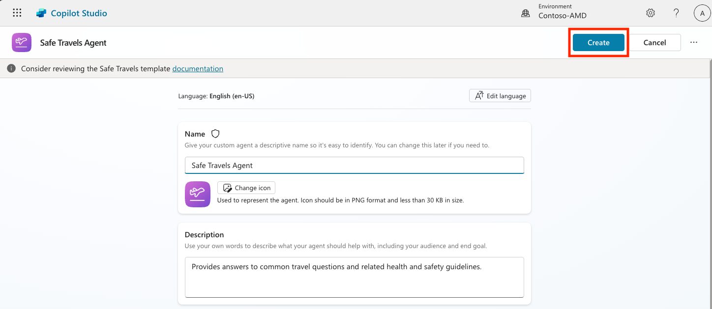

This will create a new agent in your environment based on the Safe Travels configuration.

### 5.3 Customize the Agent

Now that the agent is created, let’s tailor it to your organization:

1. Now we'll equip the agent with an additional knowledge source so it can answer questions about Europe travel. To do this, scroll down to the **knowledge** section and select **Add knowledge**

    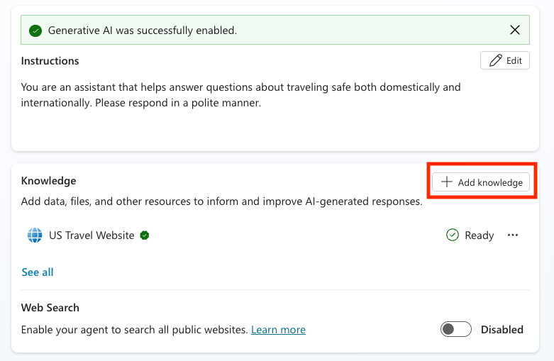

1. Select **Public websites**

    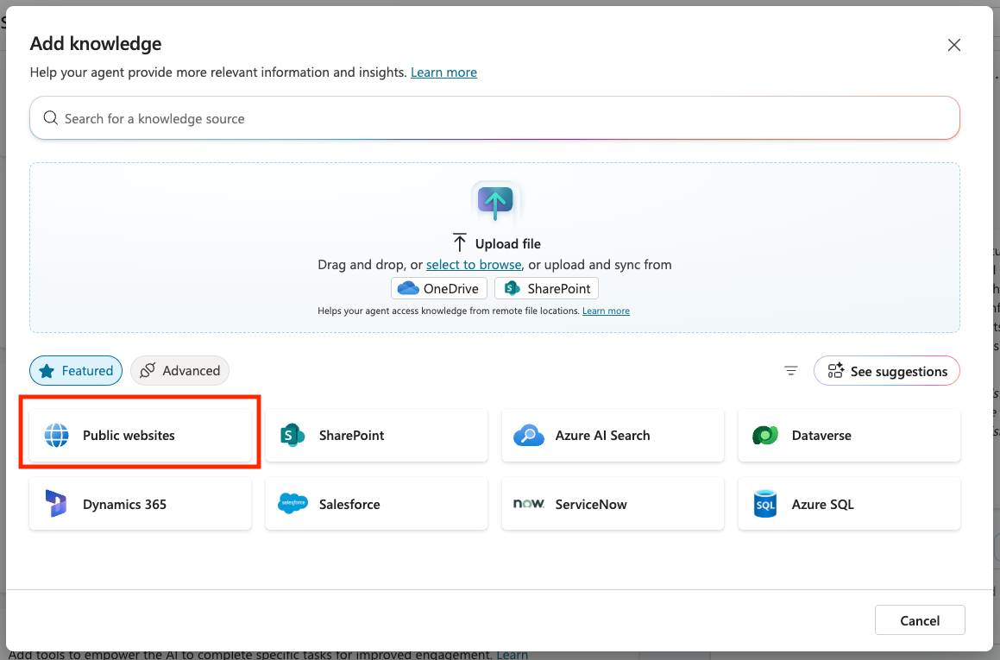

1. In the text input, paste **<https://european-union.europa.eu/>** and select **Add**

    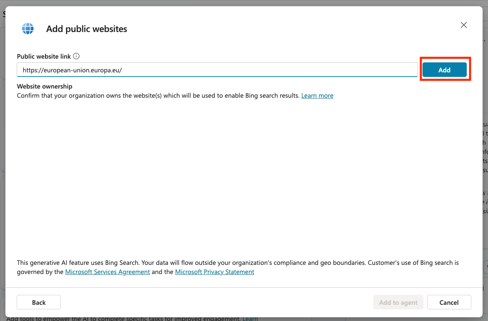

1. Select **Add to agent**

    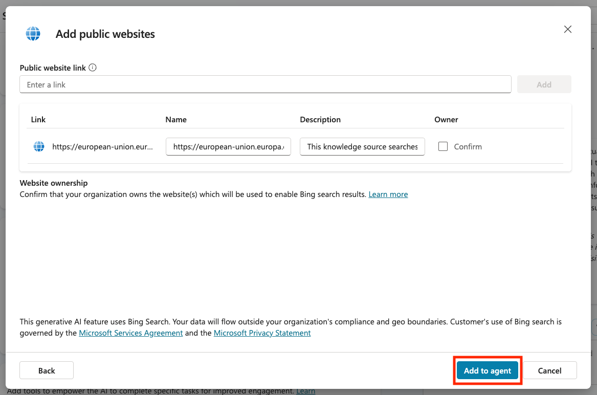

### 5.4 Test and Publish

1. Select **Test** to open the test pane.

1. Try phrases like:

    - `“Do I need a visa to travel from the US to Amsterdam?”`
    - `“How long does it take to get a US Passport?”`
    - `“Where is the closest US embassy in Valencia, Spain?”`

1. Confirm the agent responds with accurate and helpful information and observe the Activity Map to see where it retrieved the information.

    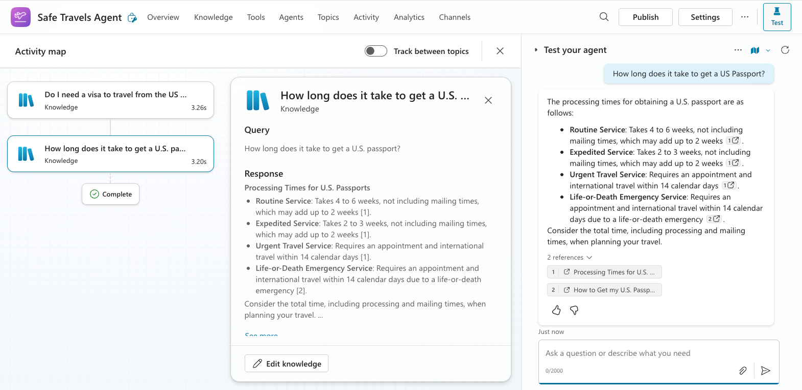

1. When ready, select **Publish**.

    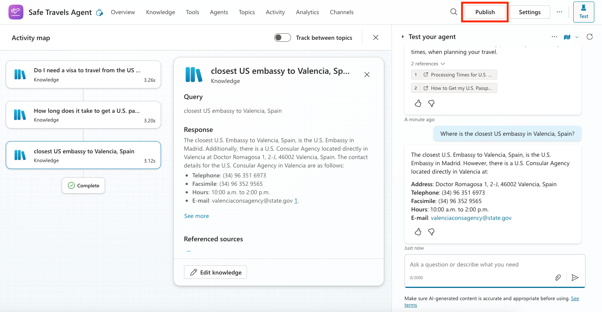

1. Select **Publish** again in the dialog box
    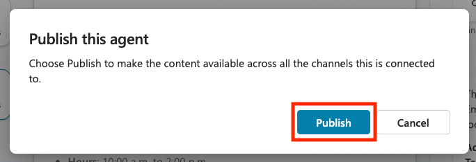

1. Optionally, add the agent to Microsoft Teams using the built-in **Channels** feature.

> [!NOTE] 🧳 Bonus Objective
> Try grounding the Safe Travels agent with a SharePoint site or FAQ file to make it more relevant to your company’s travel policies.

## ✅ Mission Complete {#mission-complete}

You've now successfully:

- **Template selection**: Chose a pre-built agent for a focused business requirement
- **Agent deployment**: Deployed the **Safe Travels** template
- **Knowledge customization**: Added a public website as a knowledge source
- **Testing and publishing**: Tested and published your customized agent

You used a focused agent to address the travel-support requirement without adding unrelated responsibilities to the Contoso IT helpdesk agent. In the next mission, you’ll return to the main course scenario and build that custom helpdesk agent from scratch.

Next, continue to [Mission 06: Build a Custom Agent](../06-create-agent-from-conversation/index.md).

## 📚 Tactical Resources {#tactical-resources}

- [Create and delete agents](https://learn.microsoft.com/microsoft-copilot-studio/authoring-first-bot?WT.mc_id=power-172617-ebenitez)
- [Add knowledge to an agent](https://learn.microsoft.com/microsoft-copilot-studio/knowledge-add-existing-copilot)
- [Watch the Safe Travels walkthrough](https://www.youtube.com/watch?v=NmXsx8WjWuM)

<analytics-tag section="recruit" mission="05-using-prebuilt-agents" />
