# 🚨 Mission 06: Create a custom agent using natural language with Copilot and grounding it with your data

## 🕵️‍♂️ CODENAME: `OPERATION AGENT FORGE`

> **⏱️ Operation Time Window:** `~75 minutes`

🎥 **Watch the Walkthrough**

[](https://www.youtube.com/watch?v=qZTtQVncGFg "Watch the walkthrough on YouTube")

## 🎯 Mission Brief

Welcome back, Agent Maker. This mission puts you in the command seat of the most powerful capability in Copilot Studio - creating a custom agent from scratch using only natural language… and supercharging it with your own data.

This isn’t just another chatbot. You’re building a knowledge empowered digital coworker - one that can reason, respond, and reference real enterprise info.

Your weapon of choice? Natural language. Your mission? Design, train, and test a fully customized helpdesk agent that answers IT questions using SharePoint, uploaded files, or company URLs.

Let’s build your agent from the ground up.

## 🔎 Objectives

In this mission, you’ll learn:

1. Understanding what custom agents are and how they differ from pre-built templates
1. Creating agents using natural language prompts and conversational design with Copilot
1. Grounding agents with enterprise knowledge sources including SharePoint, documents, and websites
1. Learning about generative orchestration and how agents dynamically search and respond using multiple data sources
1. Building and testing a fully functional IT helpdesk agent that can answer questions from your own data

## 🤔 What is a _custom_ agent?

A custom agent is a chatbot or virtual assistant that you create and design in Copilot Studio to help users with specific tasks or questions. It's called custom because:

- **You decide the purpose** - help users request vacation time, check order status, provide assistance with IT related questions.
- **You define the conversation** - what the agent says and how it should respond.
- **You ground it with your own data**  - connect to your enterprise data through the built-in supported knowledge resources.
- **You connect it to your own systems or applications** -  choose from connectors, flows, REST APIs and model context protocol servers.

!!! note
    Think of it this way: you are building your own digital helper that can talk to users and complete tasks for them such as answering questions, collecting information required by a process, or connecting to your enterprise data.

### 🤖 What can a custom agent do?

A custom agent can fulfill the following:

- Ask users for information such as names, dates, or preferences.
- Save that information to a database or table.
- Look up data based on the questions asked and answer them.
- Work autonomously without users directly interacting with the agent.
- Trigger actions either on-demand through direct user interaction or autonomously such as sending emails or creating records.

### 👩🏻‍💻  Why use a custom agent?

- Saves time by automating repetitive tasks.
- Gives users a friendly, guided experience.
- Tailor it to your business or project needs.

### ✨ Example

You build a custom agent that helps employees request vacation leave.

It asks for their name, vacation dates, and their manager’s name, then saves the information into the designated system that managed vacation requests, such as a SharePoint list.

Now, instead of navigating to the SharePoint list and creating a new item, employees simply chat with the agent instead.

## 🗣️ Use natural language to create agents

Previously you learnt how to quickly build agents in Copilot Studio using prebuilt agent templates in [Lesson 05 - Get started quickly with pre-built agents](../05-using-prebuilt-agents/README.md). In this lesson, we'll dive into the conversational creation experience with Copilot. Copilot Studio makes it easy to build agents by chatting with Copilot, just like having a conversation.

In Copilot Studio, you don’t need to write code to create an agent. Instead, you describe what you want your agent to do in plain language, and Copilot helps you build it step by step through a chat-like experience.

## 🌱 But I'm new to "describing what I want" - what do I do?

Describing in natural language to create a custom agent might be a new concept for you. Whenever you use Copilot across Microsoft products and services, you are using natural language in the form of a _prompt_.

A prompt is the message or instruction you give to an AI agent to tell it what you want it to do. Think of it as giving directions to an assistant. The clearer your instructions are, the easier it is for your assistant to understand and act on them.

### 🪄 Why Prompts matter

- They guide the agent’s behavior.
- They help the agent understand what kind of conversation to have.
- A good prompt makes the agent more helpful and accurate.

### 📝 Tips for writing a good prompt

- Be clear and specific - say exactly what you want the agent to do.
- Think like the user - what will the user say? What should the agent reply?
- Include examples - if possible, give a sample interaction.

### ✨ Example

Let's say the HR team needs an agent to help with vacation requests.

The prompt could be,

    “I want to build an agent that helps users submit a vacation request. When a user says they want to request time off, the agent should ask for their name, the start date of their vacation, the end date of their vacation, and their manager’s name. Once the user provides this information, the agent should save it to a SharePoint list called ‘Vacation Requests’ and post a notification in a dedicated Microsoft Teams channel.”

Why this prompt works:

- **Clearly states the goal** - submit a vacation request
- **Describes the user interaction** - what the user says and what the agent should ask
- **Lists the required data** - name, start date, end date, manager
- **Mentions where the data goes** - a SharePoint list called Vacation Requests

## 🔮 OK, I've created my agent... how do I next ground it with knowledge?

In Copilot Studio, knowledge sources are places where your agent can find information to give better answers. When you add these sources, your agent can pull in your enterprise data from places like Power Platform, Dynamics 365, websites, and other systems or services your company uses.

These sources work together with AI to help your agent respond more accurately to user questions, this is achieved through what is known as **generative orchestration**.

### 🌿 What is generative orchestration in the context of agents?

Generative orchestration means the agent uses AI to dynamically decide how to answer a question by combining its built-in language skills with information from your added knowledge sources.

When a user asks a question, the agent:

- Understands the question using AI.
- Can ask users for missing information by generating questions on the fly.
- Selects the most relevant knowledge sources.
- Searches those sources for answers.
- Generates a natural, helpful response using the information it found.

### 🏦 Why knowledge sources matter?

1. **Smarter answers** - when you add knowledge sources, your agent can give better, more accurate answers using real data from your organization.

1. **Less manual work** - you don’t have to write every possible response. The agent can search through your added sources and respond automatically.

1. **Use trusted information** - your agent can pull answers from systems you already use such as Dataverse, SharePoint, or company websites so that users have reliable information from a source of truth.

1. **Works with generative AI** - knowledge sources and AI help your agent understand questions and respond naturally, even if the question wasn't pre-programmed or added as a starter prompt.

1. **Flexible and expandable** - you can add knowledge sources anytime during set up or at later point in time, your agent grows smarter as your needs change.

### ✨ Example

Imagine you build an agent to help employees with HR questions. You add your company’s HR policy document and SharePoint site as knowledge sources.

When an employee asks, _“How many vacation days am I entitled to?”_, the agent uses generative orchestration to search those sources and reply with the correct policy without you having to write that answer manually. This saves you time in having to account for every possible question an employee may ask regarding their entitlements.

## Types of knowledge sources that can be added

1. **Public websites**
    - **What it does:** Searches specific websites (like your company’s site) using Bing.
    - **Why it’s useful:** Great for pulling in public-facing info like FAQs or product details.

1. **Documents**
    - **What it does:** Uses documents that you upload directly to your agent, such as PDFs or Word files. These uploaded files are stored securely in Dataverse.
    - **Why it's useful:** Enables your agent to answer questions based on internal guides, manuals or policies.

1. **SharePoint**
    - **What it does:** Connects to SharePoint folders or files using Microsoft Graph Search.
    - **Why it's useful:** Ideal for accessing team documents, HR policies, or project files stored in SharePoint.

1. **Dataverse**
    - **What it does:** Uses structured data from your Dataverse environment tables and rows, and can apply synonyms and glossary definitions for tables and columns for improving agent responses.
    - **Why it's useful:** When you need to look up enterprise data stored in Dataverse such as customer information.

1. **Real-time knowledge with connectors**
    - **What it does:** Lets your agent access live data from other enterprise systems such as Salesforce, ServiceNow, Dynamics 365, AzureSQL, Databricks, and more during a conversation, using the user's own permissions.
    - **Why it's useful:** It provides up to date, secure, and accurate responses without storing or duplicating data, making your agent smarter and safer.

1. **Azure AI Search**
    - **What it does:** Allows your agent to search through large sets of documents stored in Azure using semantic and vector search to understand user questions.
    - **Why it's useful:** Delivers accurate, trustworthy answers from complex data sources, supports citations, and scales well for large document collections with secure access controls.

## 🔒 Note on security

### Knowledge source authentication

Some sources such as SharePoint and Dataverse require user authentication. This means the agent will only reference data in its response that the user is allowed to see. Whereas other sources may have additional configuration required for the agent to connect to it such as Azure AI Search which requires an Azure account and specifying an authentication type.

## Improving your agent's responses in Copilot Studio

After your agent is provisioned from the conversational creation experience, you'll want to test your agent against the instructions Copilot generated from your prompt. Improving your agent’s responses in Copilot Studio is all about making sure it understands your goals clearly and has the right information to work with.

1. **Refine the agent instructions** - this is where you tell your agent how it should behave. Use clear, specific language.

    For example:

    ✅ “Act like a friendly customer support agent who explains things simply.”

    ❌ “Be helpful.” (Too vague)

1. **Check the tone and language** - make sure the agent’s tone matches your audience.

    You can set it to be:

    - Friendly and casual.
    - Professional and concise.
    - Supportive and patient.

1. **Add or update knowledge sources** - if your agent needs to answer questions about a topic, make sure it has access to the right information.

    - Add links to websites, documents, or FAQs.
    - Keep the content up to date.
    - Use clear, well-structured information.

1. **Use Topics and Triggers** - If your agent needs to handle specific tasks or conversations, you can create topics with trigger phrases. This helps guide the conversation more precisely. We'll learn more about this in the following lesson.

1. **Test with real questions** - try asking your agent the kinds of questions users might ask.

    If the answers aren’t great:

    - Adjust the system instructions.
    - Add more examples or knowledge.
    - Rephrase your questions to see how it responds.

1. **Review and iterate** - improving an agent is an ongoing process!

    After publishing:

    - Collect feedback from users.
    - Watch for common questions or confusion.
    - Keep refining the agent’s setup.

## 🧪 Lab 06: Create a custom agent in Copilot Studio

We're now going to learn how to create a custom agent that can chat over your data

- [6.1 Use natural language to create an agent with Copilot](#61-use-natural-language-to-create-an-agent-with-copilot)
- [6.2 Add an internal knowledge source using a SharePoint site](#62-add-an-internal-knowledge-source-using-a-sharepoint-site)
- [6.3 Add an internal knowledge source by uploading a document](#63-add-an-internal-knowledge-source-by-uploading-a-document)
- [6.4 Test agent](#64-test-agent)

### ✨ Use case

We'll use the same use case from [Lesson 03 - Create a declarative agent for Microsoft 365 Copilot](../03-create-a-declarative-agent-for-M365Copilot/README.md#use-case-scenario)

**As an** employee

**I want to** get quick and accurate help from the IT helpdesk agent for issues like device problems, network troubleshooting, printer setup

**So that I can** stay productive and resolve technical issues without delays

Let's begin!

### ✨ Prerequisites

- **SharePoint site**

We'll be using the **Contoso IT** SharePoint site from [Lesson 00 - Course Setup - Step 3: Create new SharePoint site](../00-course-setup/README.md#step-4-create-new-sharepoint-site).

If you have not set up the **Contoso IT** SharePoint site, please head back to [Lesson 00 - Course Setup - Step 3: Create new SharePoint site](../00-course-setup/README.md#step-4-create-new-sharepoint-site).

- **Solution**

We'll be using the **Contoso Helpdesk Agent** solution from [Lesson 04 - Creating a Solution for your agent](../04-creating-a-solution/README.md#41-create-a-solution-publisher).

If you have not set up the **Contoso Agent** solution, please head back to [Lesson 04 - Creating a Solution for your agent](../04-creating-a-solution/README.md#41-create-a-solution-publisher).

### 6.1 Use natural language to create an agent with Copilot

!!! warning "Copilot questions may differ across sessions"

    The Copilot conversational creation experience can vary each time where the provided questions for guidance may be slightly different than previously.

1. Navigate to the Home page of Copilot Studio and in the field, enter the following prompt which describes the IT help desk agent. The prompt includes the goal of the agent, the context, the expected tasks and format of the agent's response.

    ```text
    You are an IT help desk agent. Your goal is to assist users with their IT issues. You can access information from our company's knowledge base at https://support.microsoft.com/en-us. Your responses should be polite and helpful. If a user reports a slow computer, ask about the age of the device, current software versions, and if they've recently installed any new programs. If a user is experiencing trouble logging into their email, guide them through password reset procedures. You should be concise and informative, using step-by-step instructions with bullet points when appropriate.
    ```

      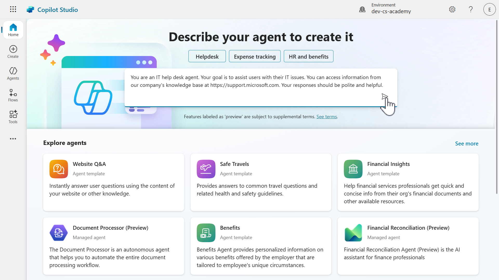

1. The conversational creation experience with Copilot will next load. You'll see Copilot is in progress of responding to you.

      

1. Copilot confirms the agent has been set up with the instructions provided, and is asking for confirmation on the name of the agent. We'll ask Copilot to name our agent as,

       ```text
       Contoso Helpdesk Agent
       ```

      

1. Copilot performs the request and we'll see that the name of the agent has been updated in the agent pane. Copilot next asks us to refine the instructions. It's asking how we should respond to particular issues and we'll request that it acknowledges the issue, provide examples of topics to answer, and format the response as bullet points.

    Copy and paste the following, and submit the request to Copilot.

       ```text
       Prioritize urgent requests. Examples of IT issues or scenarios to help with: device problems, network connectivity, log in issues. When troubleshooting, first acknowledge their issue and respond with empathy, then provide step by step guidance using bullet points and ask if they require further assistance.
       ```

      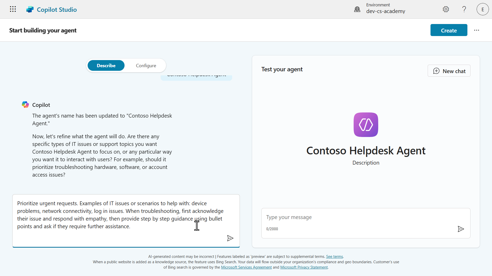

1. The instructions of the agent will be updated after Copilot has received the request. Notice how on the right hand side pane, that starter prompts have now appeared. These were formed based on our instructions.

    Next, Copilot is asking for public websites to ground the agent's knowledge.

    Copy and paste the following, and submit the request to Copilot.

      ```text
      https://support.microsoft.com
      ```

      

1. The public website will be added as a knowledge source. Copilot is asking if additional knowledge sources are to be added. We don't need to add additional public websites.

    Copy and paste the following, and submit the request to Copilot.

      ```text
      Proceed with setup
      ```

      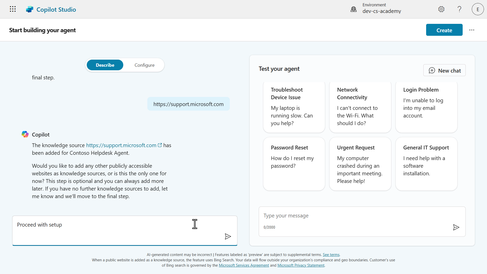

1. Copilot confirms the setup of our Contoso Helpdesk Agent is complete but we'll add one more modification, we're going to request that our agent does not answer HR related questions. This lets our agent know that it should not answer HR related questions asked by users.

    Copy and paste the following, and submit the request to Copilot.

       ```text
       Do not provide assistance to questions related to HR, examples are: What is my vacation leave balance? How many sick days do I have? What's the URL to our payroll portal? 
       ```

      

1. The instructions will be updated to not provide assistance with questions related to HR. We don't need to make further updates, our agent is ready to be created.

      

1. Before we create our agent, let's do a couple of things.

    First, select the **Configure** tab to view the agent details defined from our conversation with Copilot. This is where you'll see the Name, Description, Instructions, Knowledge and Suggested/Starter prompts.

      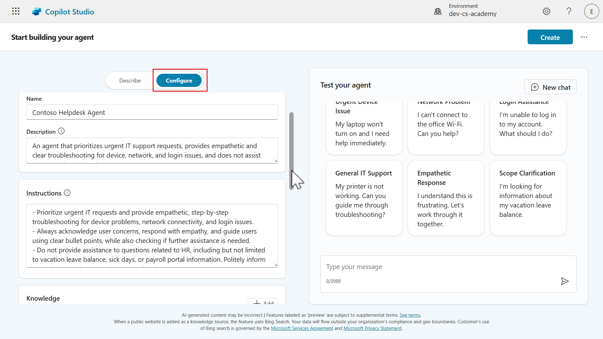

1. Secondly, let's test our agent. Copy and paste the following, and submit the question to our agent.

       ```text
       How can I check the warranty status of my Surface?
       ```

      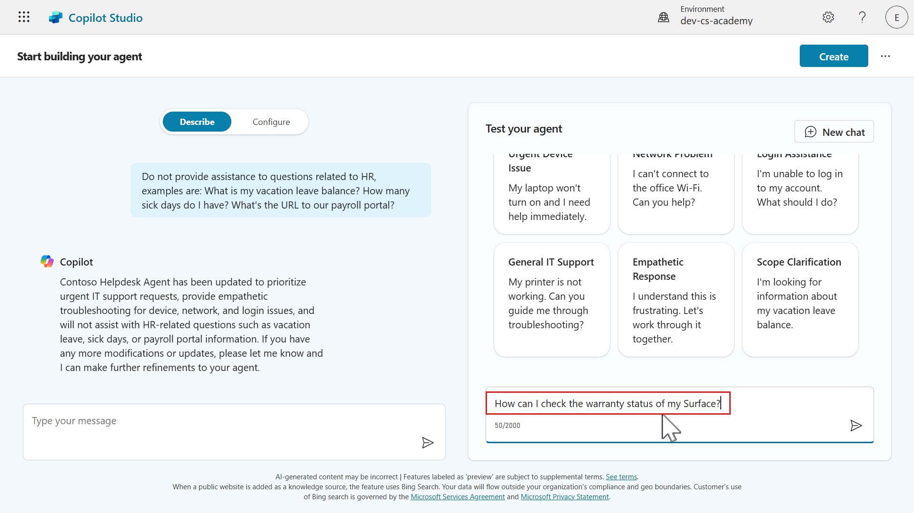

1. The response to the question will then display where the answers are in the format of a step-by-step guide using bullet points. Great, our agent works! 🙌🏻

      

1. Lastly, we'll double check the solution that our agent will be created in, is the solution we created and selected as the preferred solution in [Lesson 04 - Create a new solution](../04-creating-a-solution/README.md#42-create-a-new-solution).

    Select the **ellipsis icon (...)** and select **Update Advanced Settings**.

      

1. The **Advanced Settings** modal will appear and we can see our solution created from earlier is selected by default. This is due to selecting our solution as the preferred solution in [Lesson 04 - Create a new solution](../04-creating-a-solution/README.md#42-create-a-new-solution).

    Select **Cancel.**

      

1. Let's now create our custom agent! Select **Create**.

      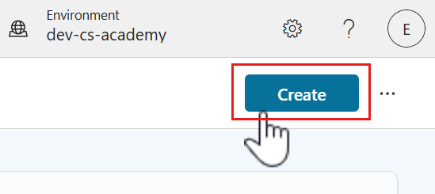

1. Copilot Studio will begin provisioning our agent.

      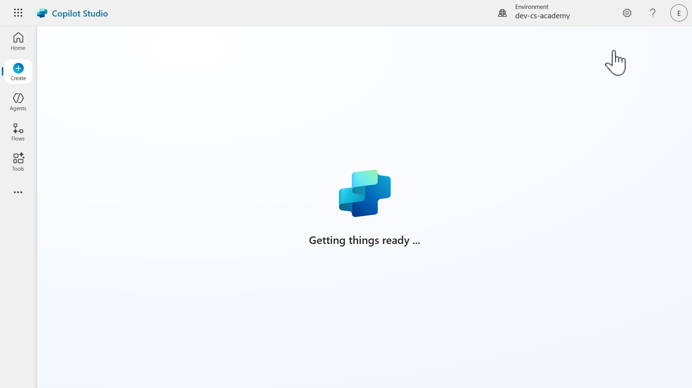

1. Once our agent has been provisioned, we can see the details of the agent reflect what we requested during our Copilot conversational creation experience. Scroll down to review the agent where you'll see the name, description, instructions, the knowledge sources and the suggested prompts. The orchestration mode is enabled by default and the default model is used for the response model of the agent.

      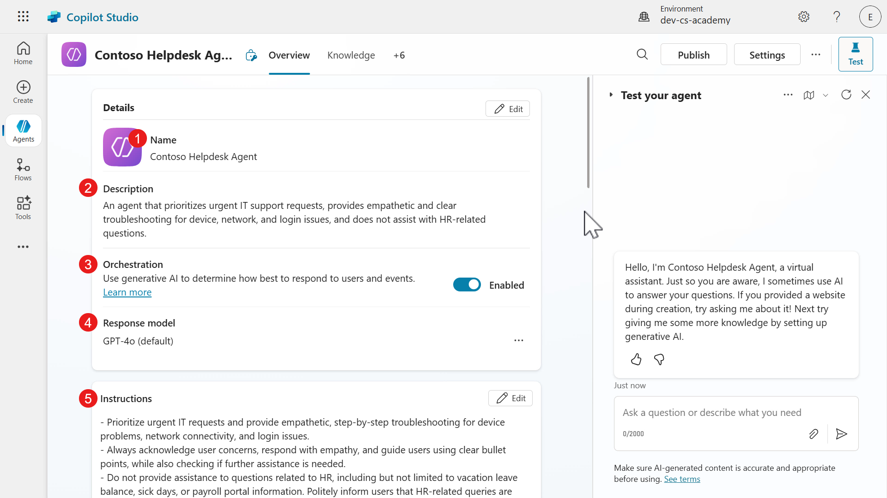

      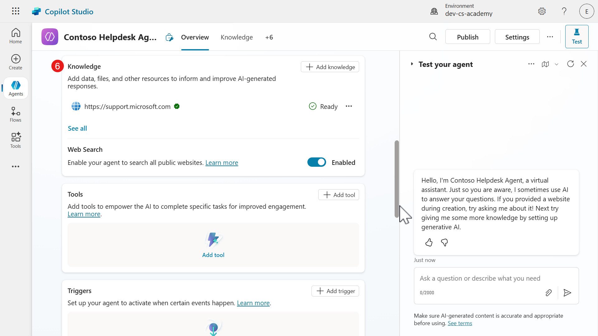

      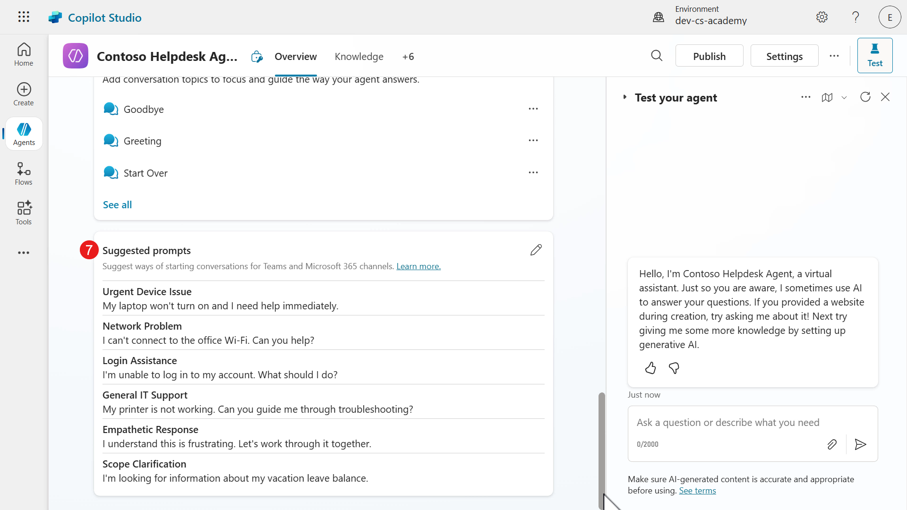

1. Let's now test our newly created agent. In the **Test** pane on the right hand side, select the **Activity Map** icon.

      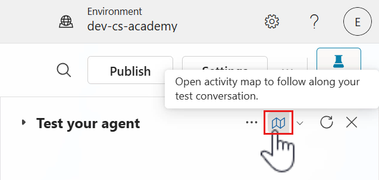

1. Enter the following question in the **Test** pane.

       ```text
       How do I find my Windows 11 product key?
       ```

      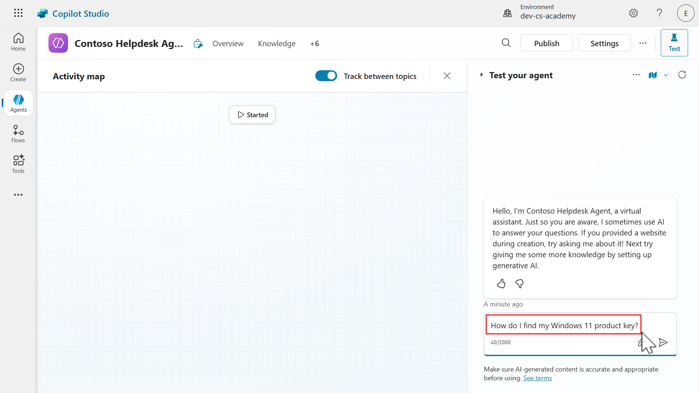

1. The Activity map will then load which shows us in real-time what path the agent is processing. In this scenario, our agent has understood the question and searches the knowledge sources. Currently we have one source which is the public website we added earlier using Copilot, which is what the agent is reviewing.

      

1. Our agent then responds with answers that are outlined as bullet points, as defined in the instructions. The response has references to the web pages that the agent formed its response from. This enables users to verify the source of the answer.

      

1. You can also review the response and its sources by scrolling down the **Knowledge modal** in the Activity map.

      

Congratulations! You've built your first custom agent with Copilot in Copilot Studio 🙌🏻

### 6.2 Add an internal knowledge source using a SharePoint site

Previously with Copilot, we added a public website as an external knowledge source for our agent during the conversational creation experience. We're now going to add an internal knowledge source using a SharePoint site. This will be the SharePoint site you created during [Lesson 00 - Course Setup](../00-course-setup/README.md#step-4-create-new-sharepoint-site).

1. Select **+ Add knowledge**.

      

1. Select **SharePoint**.

      

1. Paste in the **address of the SharePoint site** created in [Lesson 00 - Course Setup](../00-course-setup/README.md#step-4-create-new-sharepoint-site) in the SharePoint URL field and select **Add**.

      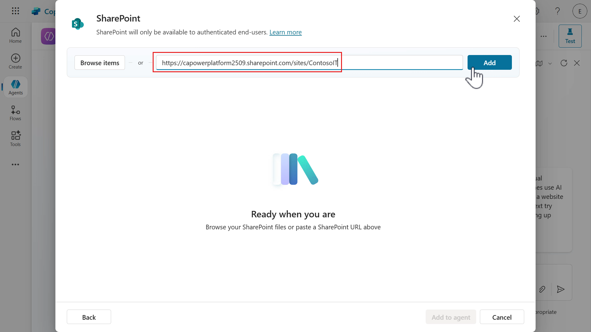

1. Update the **name** of the SharePoint site to `Contoso IT` and select **Add**.

      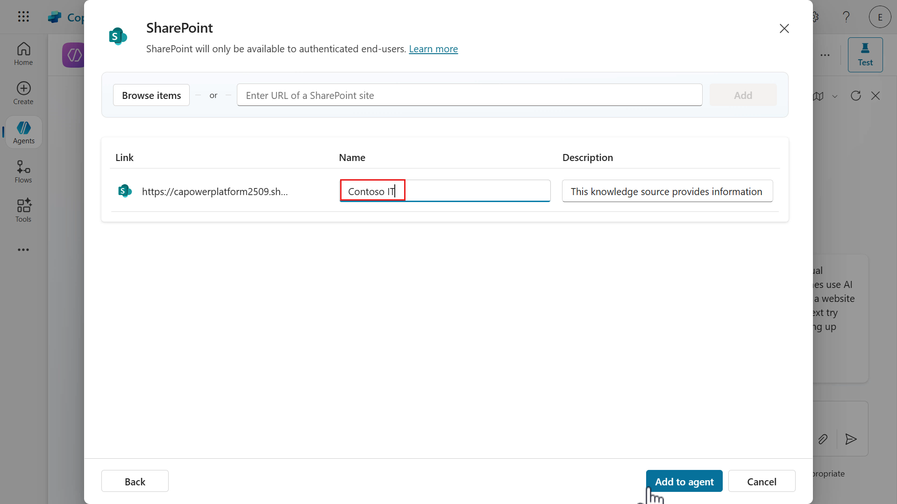

1. The SharePoint site has now been added as a knowledge source with a status of _Ready_. The Status column will show whether the knowledge source has been loaded/connected to successfully, or if there is an issue.

      

### 6.3 Add an internal knowledge source by uploading a document

We'll now add another internal knowledge source by uploading a document directly to our agent.

1. Select **Add knowledge**.

      

1. Select **Upload file** or **Select to browse**.

      

1. Download this [sample file](./assets/Contoso_Guest_WiFi_Connection_Guide.docx "download") and select it in your File Explorer. Select **Open**.

      

1. The file has been selected for upload. Select **Add to agent** next.

      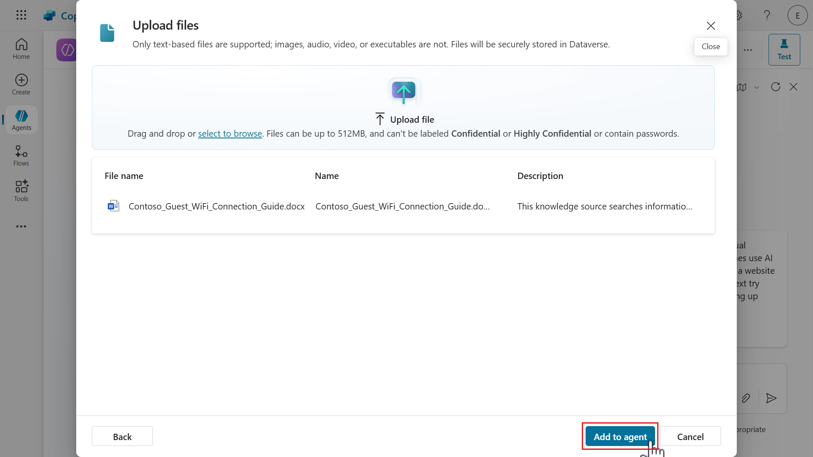

1. The document will be in the process of being added to the agent. Wait until the upload has completed, do not close the browser window. The status of the document will initially show as _In progress_, wait until the status has been updated to **Ready** before testing your agent.

      

Let's now test our agent!

### 6.4 Test agent

We'll test our three knowledge sources by asking questions to our Contoso Helpdesk Agent.

1. Select the **refresh** icon in the test pane, followed by selecting the **activity map** icon.

      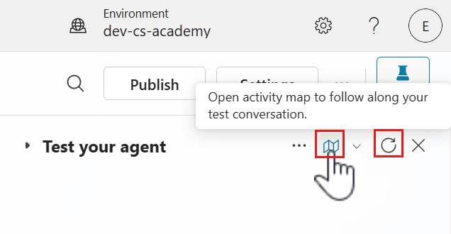

1. Enter the following question to test our public website (external) knowledge source.

      ```text
      How can I find the serial number on my Surface device?
      ```

      

1. You'll next see the agent reviewing the knowledge sources and providing a response using the website knowledge source.

      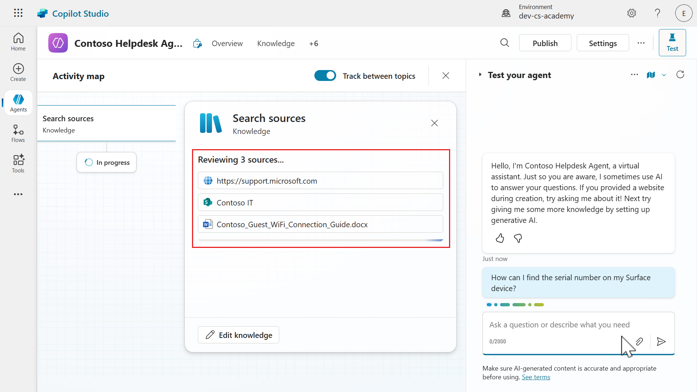

1. A response will be returned an notice how there are references to the web page it formed its answer from. If you scroll down the knowledge modal in the activity map, you'll see the other knowledge sources the agent searched, which is the SharePoint site and the uploaded file.

    However these were not used as in the **Referenced sources** section, the website knowledge source was only referenced. The answer was grounded using the website knowledge source. If you select the references, you'll be directed to the web page.

      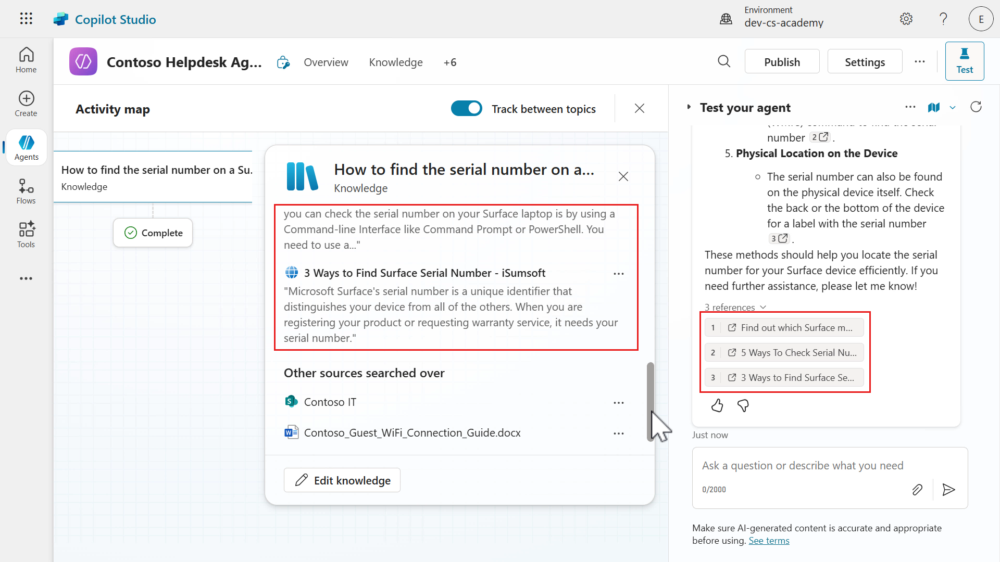

1. Let's now test both our SharePoint site knowledge source and document knowledge source in a single message. Enter the following question.

      ```text
      How can I access our company Contoso VPN? How do guests connect to the Contoso Guest wifi?
      ```

      

1. Once again you'll see the agent reviewing the three knowledge sources to generate a response to the questions our single message. The agent responds to both questions in a single message, and separately references the SharePoint page and document of where it generated its response from.

    In the knowledge modal in the activity map, you'll see the SharePoint site and document used as the reference sources. You have full visibility of what knowledge sources were used to answer both questions.

      

1. It's always good to verify the generated response is correct. Select the SharePoint site reference and the FAQs SharePoint page will load where you can scroll down to review the VPN instructions.

      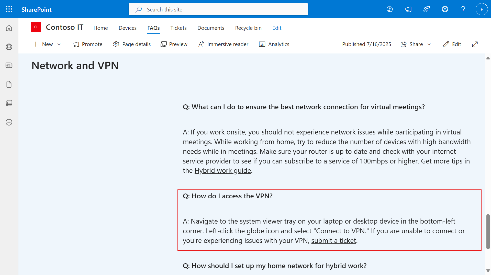

1. Next, select the document reference and a modal will appear with the text from the document that reflects the answer.

      

The agent can answer multiple questions in a single message, and search the knowledge sources + reference the knowledge sources in its response. Make sure to always verify the response is correct by reviewing the references.

## ✅ Mission Complete

Congratulations! 👏🏻 You've learnt how to use natural language to create your own custom agent that can chat over your data from three different knowledge sources 🙌🏻

This is the end of **Lab 06 - Create an agent with Copilot**, select the link below to move to the next lesson. Your custom agent created in this lab will be used in the next lesson's lab.

⏭️ [Move to **Add a new Topic with trigger** lesson](../07-add-new-topic-with-trigger/README.md)

Welcome to the elite. You now know how to forge digital agents that speak your language, reference your data, and support your team. Keep going—your mission’s just getting started.

## 📚 Tactical Resources

🔗 [Quickstart: Create and deploy an agent](https://learn.microsoft.com/microsoft-copilot-studio/fundamentals-get-started?context=%2Fmicrosoft-365-copilot%2Fextensibility%2Fcontext/?WT.mc_id=power-172617-ebenitez)

🔗 [Create and delete agents](https://learn.microsoft.com/microsoft-copilot-studio/authoring-first-bot?WT.mc_id=power-172617-ebenitez)

🔗 [Key concepts - Authoring agents](https://learn.microsoft.com/microsoft-copilot-studio/authoring-fundamentals/?WT.mc_id=power-172617-ebenitez)

📺 [Create a custom agent using natural language](https://aka.ms/ai-in-action/copilot-studio/ep1)

📺 [Add knowledge to your agents](https://aka.ms/ai-in-action/copilot-studio/ep2)

<!-- markdownlint-disable-next-line MD033 -->

