# 🚨 Mission 08: Enhance user interactions in Topics with Adaptive Cards

## 🕵️‍♂️ CODENAME: `OPERATION INTERFACE UPLIFT`

> **⏱️ Operation Time Window:** `~45 minutes`

🎥 **Watch the Walkthrough**

[](https://www.youtube.com/watch?v=RhIlzYHPCXo "Watch the walkthrough on YouTube")

## 🎯  Mission Brief

Agents, your mission is to infiltrate the static user experience and replace it with rich, dynamic, and actionable Adaptive Cards. You’ll deploy JSON payloads and Power Fx formulas to transform Copilot Studio conversations from basic Q&A into fully interactive engagements. Your goal is to gather user input, present data beautifully, and direct conversations with precision and style. Fail to adapt, and your users may defect to less intelligent interfaces.

## 🔎 Objectives

In this mission, you’ll learn:

1. Understanding what Adaptive Cards are and how they enhance user interactions in Copilot Studio
1. Learning to build interactive cards using JSON and Power Fx formulas for dynamic content
1. Exploring the Adaptive Card Designer and its key components for visual card creation
1. Creating rich, interactive forms and data collection experiences within agent topics
1. Implementing best practices for designing responsive and user-friendly adaptive cards

## 🤔 What is an Adaptive Card?

An **Adaptive Card** is way to create interactive, visually rich UI elements that can be embedded in apps like Microsoft Teams, Microsoft Outlook or agents. It is a structured JSON object that defines the layout and content of a card:

- What elements appear on the card - text, images, buttons
- How those elements are arranged
- What actions users can take such as submitting a form or opening a link

    

### Why Adaptive Cards matter in Copilot Studio

Imagine you're building an agent that asks users for their name, email, or feedback. If you just use plain text, the conversation can feel boring or hard to follow. That’s where Adaptive Cards come in!

1. **Makes conversations interactive** - instead of sending text as messages to the user, you can show buttons, forms, images and more.
    - Example: a card can ask the user to fill in their name and email in a clean form.

1. **Look great everywhere** - Adaptive Cards automatically match the style of the app they're in, such as Microsoft 365 Copilot chat or Microsoft Teams. You don't need to worry about dark mode, font, or layouts - it adapts.

1. **Easy to build with JSON** - you define the card using JSON code (think _recipe_ for the UI). Copilot Studio helps you preview your card before adding it to the topic.

1. **Collect and use data** - you can use the card to ask questions, collect answers, and use that data in the conversation flow.
    - Example: Ask for a user's phone number, then show a confirmation card with their phone number.

1. **Boost user experience** - cards make your agent feel more interactive. It's a more clean, clickable, and user-friendly type of interface.

## 🐱 Is _JSON_ a person?

Pronounced as "Jason," it's not a person 😅

JSON, otherwise known as _JavaScript Object Notation_ is a lightweight format used to structure data. It's easy to read and write, and looks like a series of key-value pairs inside curly braces {}.

This is one of the options to use when adding an adaptive card to your topic.

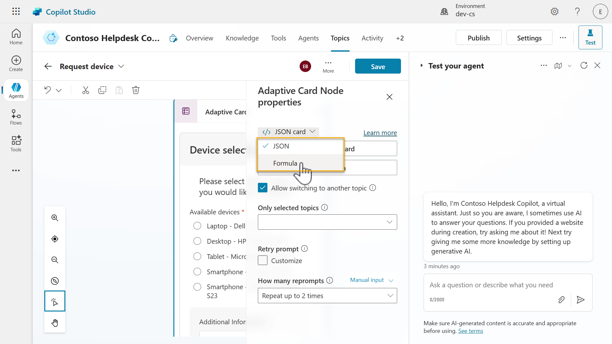

## 👀 I see another option for building an adaptive card using _formula_

Remember how we learnt about Power Fx in [Mission 07 - Using Power Fx in your nodes](../07-add-new-topic-with-trigger/README.md#what-power-fx-can-do-in-topics) The same can be applied in Adaptive Cards within Copilot Studio.

As a recap,

!!! note
    Power Fx is a low-code programming language used to add logic and dynamic behavior to your agent. It's the same language used in Microsoft Power Apps, and it's designed to be simple and Excel-like, making it easy for developers and non-developers.

### How Power Fx works in Adaptive Cards

When you design an Adaptive Card in Copilot Studio, you can use Power Fx formulas to:

- Dynamically insert values such as user names, dates or status.
- Format text or numbers such as show currency or round numbers.
- Show or hide elements based on conditions.
- Customize responses based on user input, variables, outputs from conversation nodes.

For example,

"`Hello`" & `System.User.DisplayName`

This formula combines the word "Hello" with the user's name dynamically.

### Why it's useful

1. **Personalization**

    You can tailor message to each user, making interactions feel more natural and relevant.

1. **Dynamic content**

    Cards can display real data from variables and outputs from conversation nodes.

1. **Smart logic**

    You can control what users see or interact with based on conditions, improving usability and reducing errors.

1. **Low-code friendly**

    Power Fx is a low-code programming language. As mentioned earlier, it's readable, intuitive and similar to Excel formulas.

## 👷🏻‍♀️ Building with the Adaptive Card Designer

The **Adaptive Card Designer** is a visual tool that lets you build interactive message cards using drag-and-drop elements like text, images, buttons, and inputs. Its purpose is to help you create rich, dynamic messages without writing complex code, making it easier to design user-friendly interfaces.

The designer tool helps you build the card visually, but behind the scenes, it’s generating the JSON object for you. You can also switch to _formula_ which enables Power Fx expressions to be used in the card to display data from else where.

## 🎨 Understanding the Adaptive Card Designer


### A) Card Elements

These are the building blocks of your adaptive card. You can drag and drop elements such as the following:

- **TextBlock** to display text.
- **Image** to show pictures.
- **FactSet** for key-value pairs.
- **Input fields** to display text boxes, date pickers, toggles.
- **Actions** to display buttons such as _Submit_, _Open URL_, or _Show Card_.

Each element has its own purpose and can be styled or configured.

### B) Card Viewer

This is the **Preview** area where you see how your card will look like in real time. As you add or edit elements, the viewer updates instantly to reflect changes. This enables you to make iterative updates and see the design output at the same time.

### C) Card Structure

This shows the **hierarchy and layout** of your card. For example:

- A card might start with a **TextBlock** for the title.
- Then a **ColumnSet** with an image on one side and text on the other.
- Followed by a **FactSet** and some **Action buttons**.

It helps you understand how elements are nested and organized.

### D) Element Properties

When you click on any element in the card, this panel lets you **customize its settings**:

- Change text size, weight, or color.
- Set image URLs or alt text.
- Configure input options like placeholder text or default values.

This is where you fine-tune each element.

### E) Card Payload Editor

This is the **raw JSON code** behind your card. Advanced users can edit this directly to:

- Use templating features.
- Copy/paste card definitions.

Even if you're new to the Adaptive Card designer, it's helpful to see how the visual design translates into codes.

!!! tip "Tip - Check out the Adaptive Card samples"

    1. Browse to [https://adaptivecards.microsoft.com/designer](https://adaptivecards.microsoft.com/designer).
    2. Select **New card** to see a list of samples you can choose and modify.
    3. Note that this designer is external (web-based). When you build your card in the web-based Adaptive Card Designer, copy the JSON from the Card Payload Editor.
    4. Paste the JSON into your adaptive card in your agent in Copilot Studio.

    

## 🌵 Common use cases

The following are common use cases for Adaptive Cards in Copilot Studio when used in the **Send a message** or **Ask a question** nodes.

1. **Forms and data collection**

    Use adaptive cards to collect structured input from users, such as:

    - Leave requests
    - Feedback forms
    - Contact information
    - Appointment scheduling

1. **Displaying dynamic information**

    Shows users personalized or real-time data in a clean, readable format from enterprise sources such as ServiceNow, SAP, Dynamics 365, SharePoint etc.

    - Order summaries
    - Account balances
    - Ticket or case status
    - Upcoming events or deadlines

1. **Interactive choices**

    Let users make selections directly in the conversation:

    - Choose from a list of options, for example product categories, support topics.
    - Confirm or cancel action.
    - Rate a service or experience.

1. **Triggering actions**

    Include buttons that trigger further steps in the conversation internally or externally.

    - "Submit request"
    - "View details"

## ⭐ Best practices

Here are some best practices for creating Adaptive Cards for agents in Copilot Studio.

1. **Keep it simple and focused**

    - Design cards with a clear purpose, don’t overload them with too many elements.
    - Use concise text and intuitive layouts to guide users through the interaction.

1. **Be intentional with inputs**

    - Include only the necessary input elements such as text, date choices, to avoid overwhelming users.
    - Use labels to make inputs easy to understand.

1. **Structure for readability**

    - Use **TextBlocks** for headings and instructions.
    - Group related elements using **Containers** or **ColumnSets** to improve visual flow.

1. **Make Action elements clear**

    - Use **Action.Submit** and or **Action.OpenUrl** with clear button titles like "Submit Request" or "View Details"
    - Avoid vague labels like "Click here"

1. **Design for adaptability**

    - Assume the card may be viewed on different screen sizes.
    - Avoid fixed widths and use flexible layouts like **ColumnSets** for responsiveness.

1. **Use dynamic content when possible**

    - Bind card elements to variables or outputs from nodes using Power Fx to personalize the user experience.
    - For example, show the user's name or current status dynamically.

## 🧪 Lab 08 - Add adaptive cards and enhance topic capabilities

We're now going to learn how to enhance our topic with adaptive cards and using advanced functionality of topics and nodes.

- [8.1 Create a new topic with an adaptive card for user to submit their request](#81-create-a-new-topic-with-an-adaptive-card-for-user-to-submit-their-request)
- [8.2 Update agent instructions to invoke Request device topic](#82-update-agent-instructions-to-invoke-request-device-topic)

### ✨ Use case

**As an** employee

**I want to** request a device

**So that I** can request a device from the list of available devices

Let's begin!

### Prerequisites

1. **SharePoint list**

    We'll be using the **Devices** SharePoint list from [Lesson 00 - Course Setup - Step 3: Create new SharePoint site](../00-course-setup/README.md#step-4-create-new-sharepoint-site).

    If you have not set up the **Devices** SharePoint list, please head back to [Lesson 00 - Course Setup - Step 3: Create new SharePoint site](../00-course-setup/README.md#step-4-create-new-sharepoint-site).

1. **Contoso Helpdesk Copilot**

    We're going to use the same agent created previously in [Lesson 06 - Create a custom agent using natural language with Copilot and grounding it with your data](../06-create-agent-from-conversation/README.md).

### 8.1 Create a new topic with an adaptive card for user to submit their request

We'll create a new topic that will handle a user's device request. This new topic will contain an **Ask with adaptive card** node to enable user interaction with the agent.

Let's begin!

1. Select the **Topics** tab, then select **+ Add a topic from blank**.

    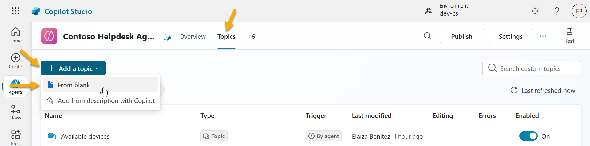

1. Name the topic as the following,

    ```text
    Request device
    ```

    Enter the following as the description for the trigger.

    ```text
    This topic helps users request a device when they answer yes to the question that asks the user if they would like to request one of these devices.
    ```

    

1. Next, add an **Ask with adaptive card** node. This node will display an interactive card for the user to select which device they would like to request.

    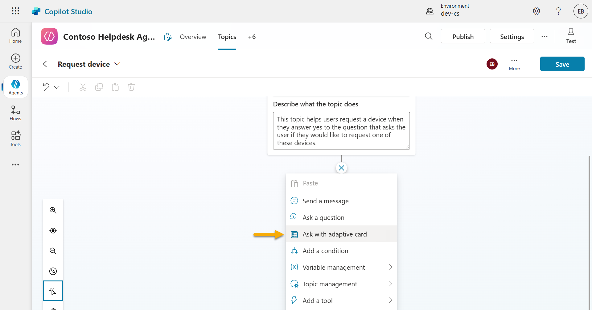

1. Select the node and the **Adaptive Card Node properties** pane will appear. We're now going to edit the JSON. Select **Edit adaptive card**. Select **Edit adaptive card**.

    

1. This is the **Adaptive Card Designer** where you can design your card and see the card design in-real time.

    Try dragging and dropping the **TextBlock** and **FactSet** card elements to the authoring canvas, the card viewer area. Notice how the card structure and card payload editor updates as the two card elements were added. You can directly update the card payload editor and the element properties pane.

    

1. Select **Preview** to view the card in different widths.

    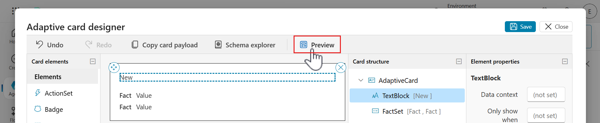

1. The preview will load where you'll see different card outputs by width.

    

1. Exit out of **Preview** by selecting the **x icon** and select **Undo** in the designer to remove the two card elements previously added.

    

1. Click into the **Card payload editor** and select all lines using the Windows keyboard shortcut of _Ctrl + A_ or using the Mac keyboard shortcut of _Command + A_, followed by deleting the lines. **Paste** the JSON from the [Request devices .JSON file](assets/8.1_RequestDevice.json).

    

1. Notice how the **Card Preview** now includes elements that display some text and a list of available devices.

    This JSON is currently a placeholder and preview to what we'll use as the base for our card but in the form of a formula rather than JSON since we're going to reference the **global variable**, `Global.VarDevices.value`, that stores the response of the **Get items** SharePoint connector action.

    Select **Save** and select **Close** to exit from the Adaptive card designer modal.

    

1. Close the **Adaptive Card Node properties** panel by selecting the **X** icon.

    

1. In the authoring canvas of the topic, you'll see the adaptive card.

    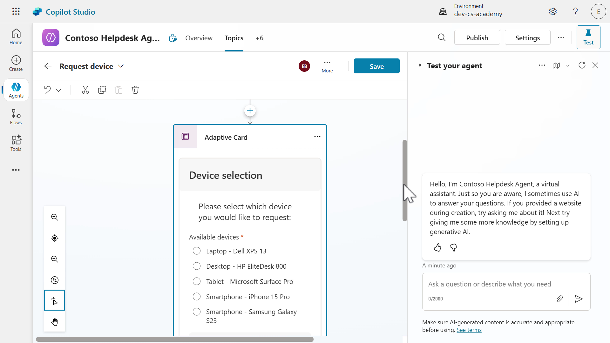

1. Scroll to the bottom of the node and you'll see output variables. The `commentsId` and the `deviceSelectionId` were defined in the element properties. These two variables will store values from the card elements the users interact with. These values will be used downstream in the topic, which we'll learn about in the next lesson's lab.

    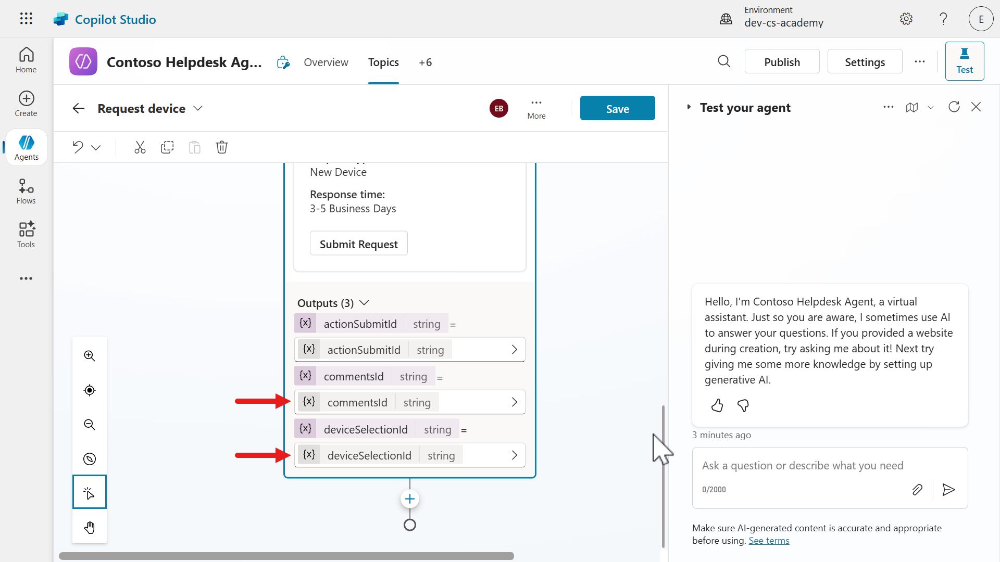

1. Let's next update the card from JSON to formula as we'll use Power Fx again to loop through the items returned in the **Get items** SharePoint connector action, stored in the **global variable**, `Global.VarDevices.value`, via the `value` property of the JSON response.

    > We created this global variable in [Lab 07 - Add a new topic with conversation nodes, 7.3 Add a tool using a connector](../07-add-new-topic-with-trigger/README.md#73-add-a-tool-using-a-connector).

    Select the card in the **Ask with Adaptive Card** node, followed by selecting the **chevron** icon and select **Formula**.

    

1. Click on the **expand** icon to enlarge the Formula field.

    

1. Click into the **Card payload editor** and select all lines using the Windows keyboard shortcut of _Ctrl + A_ or using the Mac keyboard shortcut of _Command + A_, followed by deleting the lines.

    

    Paste the Formula from the [Request Devices formula file](assets/8.1_RequestDeviceFormula.txt).

1. In the formula, we'll loop through each SharePoint list item using the `For All` function to display the values of `Model` in the title of the choice option, and the SharePoint item `ID` is referenced as the value. We're also wrapping the values with the `If(IsBlank()` functions as the formula expects a value in order to render the adaptive card in the authoring canvas of the topic. Otherwise you'll see a message appear, "Property cannot be null"

    **Close** the card modal.

    

1. **Close** the **Adaptive Card Node properties** pane.

1. **Save** the topic.

    

### 8.2 Update agent instructions to invoke Request device topic

Now that we created the new topic that handles the device requests, we need to update the **agent instructions** to invoke the topic.

1. Select the **Overview** tab and in the **agent instructions** select **Edit**.

    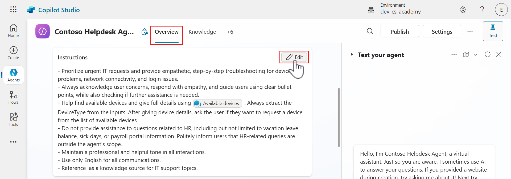

1. Add a new line below the previous instruction from [Lab 07 - Add a new topic with conversation nodes, 7.3 Add a tool using a connector](../07-add-new-topic-with-trigger/README.md#73-add-a-tool-using-a-connector).

    ```text
    - If the user answers yes to the question of requesting a device, trigger [Request device]. Otherwise if they answer no to the question of requesting a device, trigger [Goodbye].
    ```

    Select the entire topic placeholder in square brackets and delete the placeholder.

    

1. Type in `/Req` and select the **Request devices** topic.

    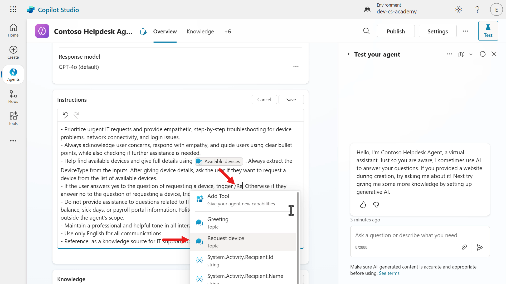

1. Repeat the same steps for the next topic placeholder, **[Goodbye]**. Select the entire topic placeholder in square brackets and delete the placeholder. Type in `/Goodbye` and select the **Goodbye** topic.

    - When the user answers **Yes** to the agent asking if they would like request a device, the agent will redirect from the **Available devices** topic to the **Request devices** topic.

    - Otherwise if the user answers **No**, the agent redirect from the **Available devices** topic to the **Goodbye** topic.

    **Save** the updated instructions.

    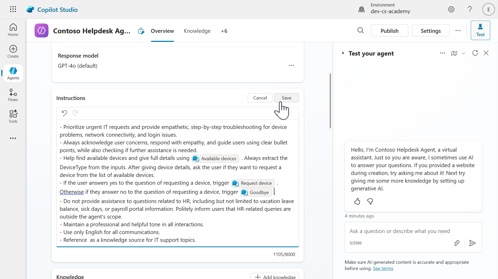

1. Let's now test our the redirection from the _Available devices_ topic to the _Request devices_ topic. Select the **Test** to load the testing pane select **Refresh**.

    Then select the **Activity map** icon in the test pane, followed by enabling **Track between topics**. This will allow us to see the _Available devices_ topic has redirected to the _Request devices_ topic.

    OK, we're good to test! Enter the following in the test pane.

    ```text
    I need a laptop
    ```

    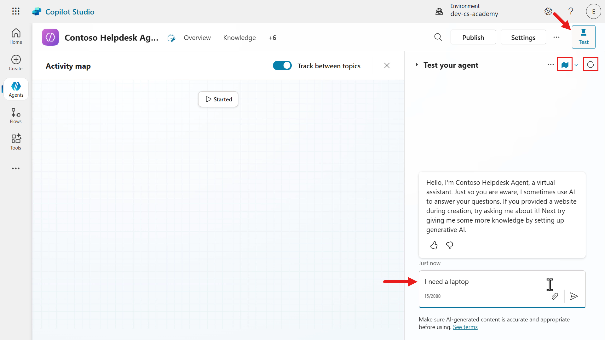

1. The agent will respond with the list of available devices followed by the question of asking the user if they would like to request a device. Copy and paste the following,

    ```text
    yes please
    ```

    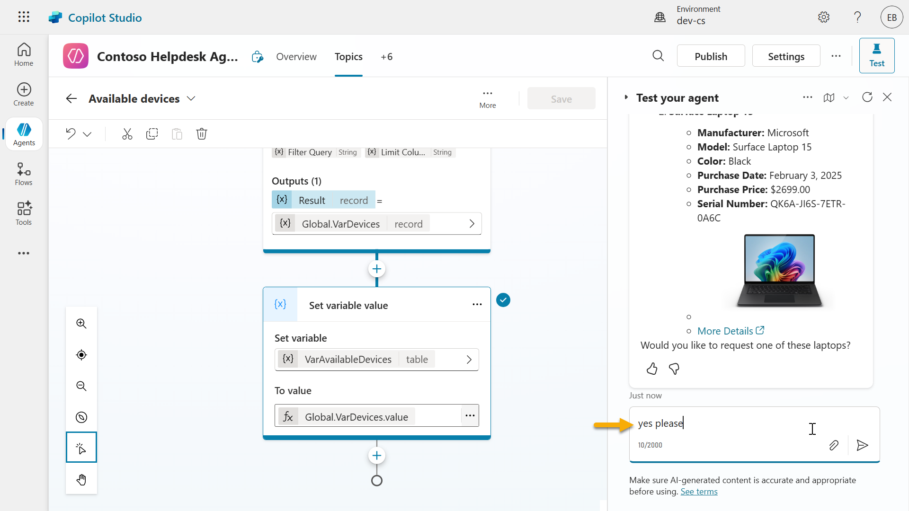

1. We'll next see that the agent has redirected to the **Request device** topic. The agent invoked this topic as per the instructions we added.

    The adaptive card with the interactive elements will now be displayed as message to the user.

    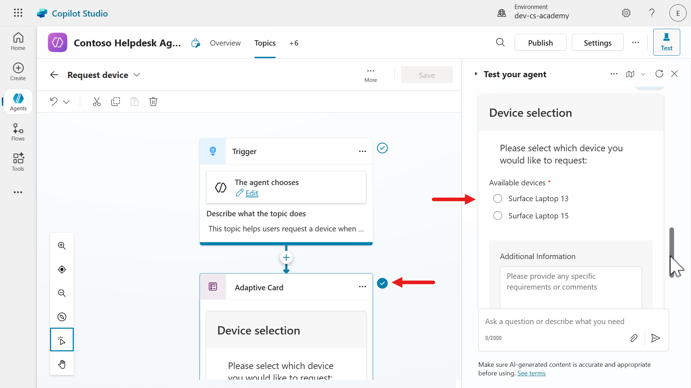

1. We've now successfully tested 😄 our _Available devices_ topic redirecting to the _Request devices_ topic. We'll be adding more enhancements to this topic in the next lesson's lab.

    Refresh the test pane.

    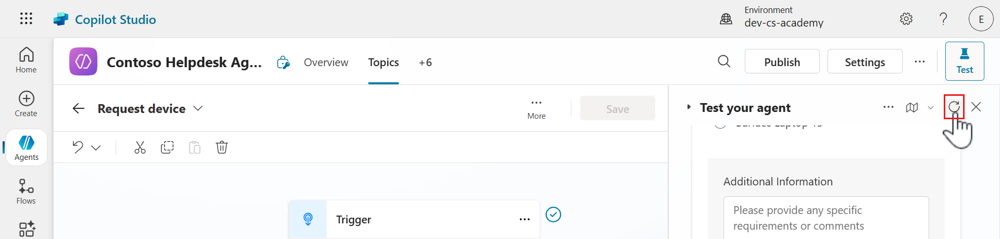

## ✅ Mission Complete

Congratulations! 👏🏻 You've learnt how to add adaptive cards using Power Fx formulas to display data from variables, and you also learnt how to redirect from one topic to another. Creating bite sized topics makes your agent more organized, but also helps guide users through different parts of the conversation flow with the agent.

This is the end of **Lab 08 - Enhance user interactions with Adaptive Cards**, select the link below to move to the next lesson. We'll expand on the use case in this lab in the following lesson's lab.

⏭️ [Move to **Add an agent flow to your Topic for automation** lesson](../09-add-an-agent-flow/README.md)

## 📚 Tactical Resources

🔗 [Using Adaptive Cards in Copilot Studio](https://learn.microsoft.com/microsoft-copilot-studio/guidance/adaptive-cards-overview?WT.mc_id=power-172619-ebenitez)

🔗 [Add an adaptive card in Send a message node](https://learn.microsoft.com/microsoft-copilot-studio/authoring-send-message#add-an-adaptive-card?WT.mc_id=power-172619-ebenitez)

🔗 [Create expressions using Power Fx](https://learn.microsoft.com/microsoft-copilot-studio/advanced-power-fx?WT.mc_id=power-172619-ebenitez)

📺 [Building Adaptive Cards with Power FX](https://aka.ms/ai-in-action/copilot-studio/ep8)

<!-- markdownlint-disable-next-line MD033 -->

