# 🚨 Mission 09: Add an agent flow to your Topic for automation

## 🕵️‍♂️ CODENAME: `OPERATION AUTOMATION POWERHOUSE`

> **⏱️ Operation Time Window:** `~30 minutes`  

🎥 **Watch the Walkthrough**

[](https://www.youtube.com/watch?v=vtLZJT3eBXg "Watch the walkthrough on YouTube")

## 🎯 Mission Brief

Your agent can now converse with users and provide information, but true operational excellence requires your agent to take action. This mission will transform your conversational agent into an automation powerhouse by equipping it with agent flows.

By mission's end, you'll have created an end-to-end device request automation that captures user input through an adaptive card, retrieves data from SharePoint, sends notifications to managers via email, and provides seamless user feedback - all orchestrated by your agent through intelligent workflow automation.

## 🔎 Objectives

In this mission, you’ll learn:

1. Understanding what agent flows are and how they differ from Power Automate cloud flows for automation
1. Learning the key features that make agent flows powerful including AI actions and natural language authoring
1. Exploring the agent flow designer and how to use expressions for dynamic data handling
1. Creating a complete device request automation that integrates SharePoint data and email notifications

## 🤔 What is an agent flow?

Agent flows are a powerful way to automate repetitive tasks and integrate your apps and services. Think of them as structured, step-by-step workflows that your agent can execute to automate tasks or connect with other applications and services. You can think of them as mini workflows that help your agent do things like send notifications, update records, or respond to events.

Unlike autonomous agents that use AI to make decisions on the fly, agent flows are **deterministic workflows** - meaning they follow the same path every time, ensuring consistent and reliable results.

In simple terms:

- They help your agent _do things_, not just _say things_ to users.
- They're reusable across topics and agents, and can be triggered by user messages, events, or other applications and services.

## 🙋🏽 Yes, but how is it different to Power Automate cloud flows?

Both agent flows and Power Automate cloud flows help automate tasks. They're designed for different purposes and work in different ways.

### 🤖 Agent flows in Copilot Studio

**What they're for:**

- Built for conversational and autonomous agents (via agent instructions) in Copilot Studio.
- Focused on smart, AI-driven automation that interacts with business systems.

**Why they're useful:**

- Easy to build and manage directly in Copilot Studio.
- Great for automating tasks that happen _during the conversation_ with users such as submitting a leave request.
- You don't need a separate Power Automate license as billing is based on usage inside Copilot Studio. This can save time and cost for enterprise teams.

**Limitations:**

- You can't share them, copy them, or assign co-owners.
- Agent flows are only visible and usable within Copilot Studio.
- Currently, event triggers for agents can be edited in the Power Automate maker portal.

### ☁️ Power Automate cloud flows

**What they're for:**

- Designed for general-purpose automation across many apps and services.
- Can run independently or work alongside agent flows.

**Why they're useful:**

- Offers a wide range of connectors.
- Ideal for automating processes outside of agents.
- Can be shared, reused, and managed across teams.

**Requirements:**

- You need a Power Automate license to use them.

### 📗 Summary

| Use this | When you want to |
| :- | :- |
| Agent flows | Automate tasks inside an agent, use AI, and keep everything in Copilot Studio |  
| Power Automate cloud flows | Automate across apps and services, or build workflows outside of agents |

## 👍🏻 Why use agent flows

Agent flows always follow a fixed path - they do the same thing every time when given the same input.

This makes them:

- **Reliable** - you can trust that they'll behave the same way every time.
- **Predictable** - you know what result to expect when the flow runs.
- **Rule based** - they follow steps that you define.

Other benefits are:

- **Automation** - enables your agent to handle repetitive tasks such as submitting forms or sending notifications.
- **Connected** - connect with 1400+ connectors like ServiceNow, SharePoint, Salesforce. Otherwise you can build your own custom connector.
- **Tightly integrated** - agent flows are part of the agent's logic, they're triggered directly by user messages or actions in the conversation.
- **Scalability** - reuse flows across multiple agents or scenarios.
- **No-code or low-code** - you can build flows using natural language or a visual designer.
- **All-in-one-platform** - you can design, test and deploy agent flows in one place - Copilot Studio. No need to switch between platforms.

## 🏄🏻‍♂️ How do agent flows enhance your agent?

Agent flows expand what your agent can do beyond "chatting" with users. They allow it to take action and interact with systems.

Let's say you're working in a finance department and you receive a lot of invoices from vendors. Normally, someone has to read each invoice, pull out the important details - the amount, date, who it's from, and check if everything matches your records. Then send it to the right person for approval. This takes time and effort.

With agent flows in Copilot Studio, you can automate this process. As soon as the invoice comes in, the agent:

1. Reads the document using intelligent document processing to find the key information.
1. Checks the details against your enterprise data to make sure everything looks correct.
1. Route it for approval to the right person(s).

This saves time, reduces mistakes and makes the whole process much smoother.

### Think of it this way

- **Agents**: the smart decision-makers
- **Agent flows**: the reliable executors

### Why it matters

- You get the best of both worlds: reliable automation and flexible AI.
- It's easy to build and update flows as your business needs change.
- You can scale automation across teams.

## 🔌 Key features that make agent flows powerful

1. **Natural language authoring**
    - You can describe what you want the flow to do in plain English.
    - Copilot understands your intent and builds the flow for you.
    - No need to write code - explain your idea.

1. **AI actions**

    Use AI to:

    - Read and understand documents or images.
    - Summarize long content into short, useful answers.
    - Make smart recommendations or decisions.

1. **Generative actions**
    - These let the flow adapt in real time.
    - The agent can plan and adjust steps based on changing information.

1. **Integration actions**
    - Connect your flow to other tools like Outlook, Microsoft Teams, ServiceNow, SharePoint and other applications and services, through from +1400 built-in connectors or from your own custom connector.
    - This helps your agent work with the apps your team already uses.

1. **Human in the loop**
    - Add approval steps where a person needs to review or confirm something.
    - [Advanced approvals](https://learn.microsoft.com/microsoft-copilot-studio/flows-advanced-approvals?WT.mc_id=power-172621-ebenitez) supports reminders, delegation, and multi-stage approvals.

## ⚙️ How they work

1. **Trigger**

    An event starts the flow - such as a user asking a question, invoking the flow from a topic, a scheduled time, or an event happening in another system.

1. **Actions**

    These are steps that the agent follows next - send an email, call an API, update a ticket in ServiceNow.

## 🧶 How to create an agent flow

1. **Natural language**: describe what you want the agent to do, and Copilot builds it for you.
1. **Designer canvas**: drag and drop actions, conditions, and loops in the agent flow designer to build your agent flow.

## 🎨 What is the agent flow designer?

It's a visual tool in Copilot Studio that helps you build, edit, and manage agent flows that provide step-by-step instructions your agent follows to complete tasks. It's designed to be straightforward to use, even if you're new to agent flows.

### Key features of the agent flow designer

1. **Visual canvas**
    - You can see your entire flow laid out like a diagram.
    - Easily zoom in/out, fit the view or use a minimap to navigate large flows.

1. **Add and remove actions**
    - Click the _plus (+)_ button to add a new action such as sending a message or updating an item in a SharePoint list.
    - You can search for actions from connectors, and configure them through its settings.
    - To remove an action, click the _three dots (⋮)_ and select _Delete_.

1. **Check parameters**
    - Click on any action to view or edit its settings called _parameters_.
    - You can enter values manually or use _expressions_ to make them dynamic.

1. **Version history**
    - Every time you save your flow, a version is recorded.
    - You can go back and view or restore previous version if needed.

1. **Error checking**
    - The _Flow Checker_ highlights any errors.
    - All errors will need to be resolved prior to publishing your flow.

1. **Publish and test**
    - Once your flow is error-free, publish to make it live.
    - Use the _Test_ feature to run your flow manually or automatically, and check if it works as expected.

### Why use the agent flow designer?

- **Visual and intuitive** - you can build flows by dragging and clicking.
- **Safe to experiment** - version history lets you undo changes.
- **Built-in testing** - helps you make sure everything works before going live.

## 🔤 You mentioned _expressions_ - what are expressions?

Expressions are small formulas or commands that help your agent flow work with data. You use them to calculate values, format text, make decisions, or pull specific information from inputs.

### Why use expressions?

Expressions let you:

- **Customize how data is handled** - combine names, format dates.
- **Make decisions** - if a value is greater than 10, do something.
- **Transform data** - change text to lowercase, extract part of a string.
- **Automate logic** - without writing full code.

### What do expressions look like?

Expressions use functions. I'm going to borrow an explanation of what functions are from former Microsoft MVP, Jerry Weinstock.

!!! quote
    Functions are built-in logic to transform your data either through simple or complex operations in your expression.

Functions enable you to build expressions without you needing to write any code.

The way I like to describe it, is that a function in agent flows is similar to Excel functions. You can perform an operation on data to transform it into a desired output. When building your formula in Excel you select your input value from the cells in a table or a range, and then apply functions to manipulate the data output. An example is using the `COUNT` function to work out the number of cells that contain numbers from a range.

In agent flows, instead of referencing data from cells in a table, you're referencing data outputs from the trigger or actions when building your expressions. Continuing with the previous example, use the function `length` to retrieve the number of items returned from the _Get items_ SharePoint connector action.

### Why do functions matter?

Using functions makes your agent flows:

- **Smarter** - they can react to different inputs or conditions.
- **Flexible** - you can customize how data is handled.
- **Efficient** - you avoid manual steps by automating logic.

### Most useful functions

The following are common functions used in agent flows. For the full list of functions, head to the [reference guide](https://learn.microsoft.com/azure/logic-apps/workflow-definition-language-functions-reference?WT.mc_id=power-172621-ebenitez).

#### 🔡 Text

- `concat()` - Joins two or more pieces of text together.
      - Example: `concat('Hello ', firstName)` → “Hello John”

- `toLower()` / `toUpper()` - Changes text to lowercase or uppercase.
      - Useful for standardizing input.

- `substring()` - Extracts part of a string.
      - Example: Get the first 3 letters of a name.

- `trim()` - Removes spaces from the beginning and end of text.

#### 🔢 Math and number

- `add()`, `sub()`, `mul()`, `div()` - Basic math operations.
      - Example: `add(5, 3)` - the output is 8

#### 📅 Date and time

- `utcNow()` - Gets the current date and time in UTC.
      - Great for timestamps.

- `addDays()`, `addHours()` - Adds time to a date.
      - Example: `addDays(utcNow(), 7)` output is 7 days from now.

- `formatDateTime()` - Formats a date into a readable string.
      - Example: Monday, July 7, 2025

#### ✅ Logical

- `if()` - Runs one value if true, another if false.
      - Example: `if(score > 50, 'Pass', 'Fail')`

- `equals()` - Checks if two values are the same.

- `and()`, `or()`, `not()` - Combine multiple conditions.

#### 🪣 Other handy functions

- `coalesce()` - Returns the first non-empty value.
      - Useful for fallback/default values.

- `guid()` - Generates a unique ID.
      - Useful for tracking or logging.

- `length()` - Counts how many characters or items are in a string or array.

## ⭐ Best practices

Here are some best practices for building agent flows in Copilot Studio.

1. **Start simple and build gradually**

    - Begin with a small, clear task such as sending a message.
    - Add more steps after testing the basics of your automation.

1. **Use clear and descriptive action names**

    - Label each step clearly so you know and your team understands what it does.
    - Example: instead of the default name of "Update item" for the SharePoint connector action, rename it to what it's updating, such as "Update device status."

1. **Check for errors before publishing**

    - Use the **flow checker** to find and fix any issues.
    - You can't publish flows if there are errors, so try to resolve them when they occur.

1. **Test your flow thoroughly**

    - Just because it saves and publishes, doesn't mean it works as expected.
    - Use the _Test_ feature to run your flow manually or automatically, and check the results.

1. **Use Version History**

    - Save your flow often so you can go back to earlier versions if needed.
    - You can view and restore previous versions using the _Version History_ panel.

1. **Use parameters and expressions wisely**

    - When configuring actions, use parameters to make your flow dynamic.
    - You can enter values manually or use expressions to calculate them, or combine it with values from actions upstream by using the _dynamic content_ picker.

1. **Delete unused actions**

    - If you add an action and later decide you don't need it, remove it to keep your flow clean.

## 🧪 Lab 09 - Add an agent flow for automation and enhance topic capabilities

We're now going to learn how to enhance our topic with adaptive cards and using advanced functionality of topics and nodes.

- [9.1 Create an agent flow](#91-create-an-agent-flow)
- [9.2 Add agent flow to topic](#92-add-agent-flow-to-topic)
- [9.3 Update Request device topic with several nodes for a better user experience](#93-update-request-device-topic-with-several-nodes-for-a-better-user-experience)
- [9.4 Test agent using several scenarios](#94-test-agent-using-several-scenarios)

### ✨ Use case

**As a** manager of an employee

**I want to** receive device requests

**So that I** can review the device requested by the employee.

Let's begin!

### Prerequisites

1. **SharePoint list**

    We'll be using the **Devices** SharePoint list from [Lesson 00 - Course Setup - Step 3: Create new SharePoint site](../00-course-setup/README.md#step-4-create-new-sharepoint-site).

    If you have not set up the **Devices** SharePoint list, please head back to [Lesson 00 - Course Setup - Step 3: Create new SharePoint site](../00-course-setup/README.md#step-4-create-new-sharepoint-site).

1. **Contoso Helpdesk Agent**

    We're going to use the same agent created previously in [Lesson 06 - Create a custom agent using natural language with Copilot and grounding it with your data](../06-create-agent-from-conversation/README.md).

### 9.1 Create an agent flow

In this exercise, we'll create an agent flow that retrieves the SharePoint item of the selected device and send an email to a manager with the device details.

1. In the **Request device** topic, scroll down to the **Ask with adaptive card** node and add a new node. Select **Add a tool** and in the **Basic tools** tab of the fly out pane, select **New Agent flow**.

    

1. The Agent flows **Designer** will load with a trigger and action.

    - **Trigger** - When an agent calls the flow
        - This will trigger a flow from a Copilot Studio agent.

    - **Action** - Respond to the agent
        - This send a response that can contain output values back to the Copilot Studio agent.

    Select the trigger.

    

1. Next, we're going to add several inputs for the agent flow.

    - `DeviceSharePointId` - this will store the value, ID, of the SharePoint item. This ID value is an output from the Ask with adaptive card node where the user selected the device.

    - `User` - this will be the name of the user which will be from a system variable of the agent.

    - `AdditionalComments` - this will be the the comment entered by the user, which is an output from the Ask with adaptive card node.

    We'll first add the `DeviceSharePointId` as an input for our trigger. Select **+ Add an input**.

    

1. For the type of user input, select **Text**.

    

1. For the name of the input, enter the following.

    ```text
    DeviceSharePointId
    ```

    

1. We'll now add the second input, `User`. Repeat the same steps, select **+ Add an input** and select **Text**.

    

1. For the name of the input, enter the following.

    ```text
    User
    ```

    

1. We'll now add the third input, `AdditionalComments`. Repeat the same steps, select **+ Add an input** and select **Text**.

    

1. For the name of the input, enter the following.

    ```text
    AdditionalComments
    ```

    

1. For the `AdditionalComments` input, we'll update it to make it optional. Select the **ellipsis (...) icon** and select **Make the field optional**.

    

1. Great work! The trigger has now been configured, let's continue. Select the **plus + icon** under the trigger to insert a new action.

    

1. The **Actions pane** will appear where you can view actions from 1400+ built-in connectors to Microsoft and third-party services. In the **search field** enter the following,

    ```text
    Get item
    ```

    A list of actions will display in the search results. Select the **Get item** action from the **SharePoint connector**.

    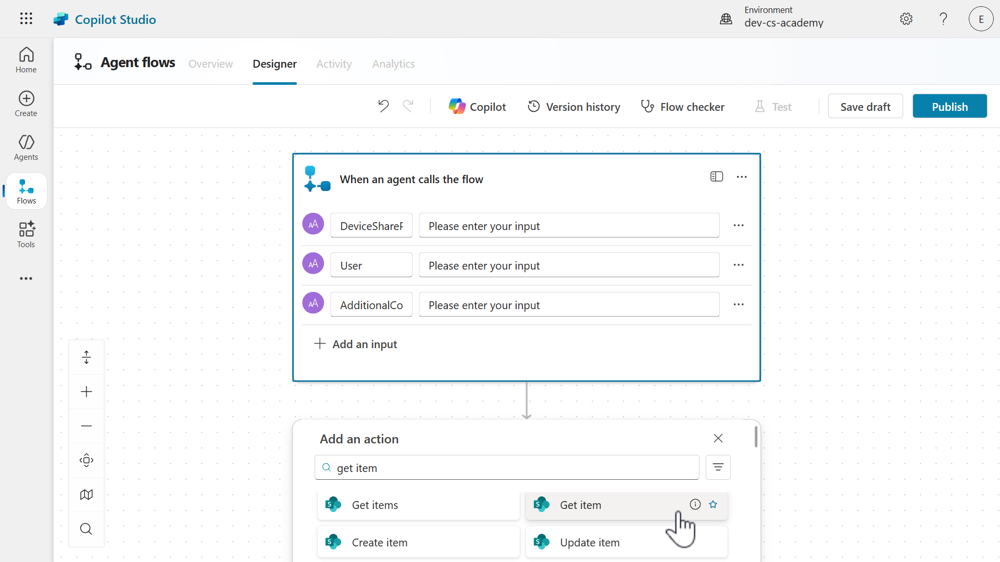

1. We can now begin configuring the **Get item** action.

    Select the **Ellipsis (...)** icon in the **Get item** action.

    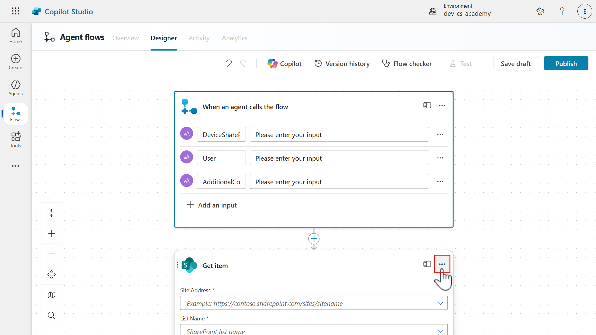

1. Select **Rename**.

    

1. Rename the action to,

    ```text
    Get Device
    ```

    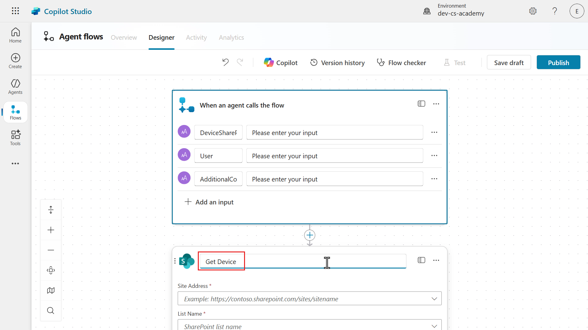

1. In the **Site Address** field, select the **Site address** of the Contoso IT SharePoint site created in [Lesson 00 - Course Setup - Step 3: Create new SharePoint site](../00-course-setup/README.md#step-4-create-new-sharepoint-site).

    In the **List Name** field, select the **Devices** SharePoint list.

    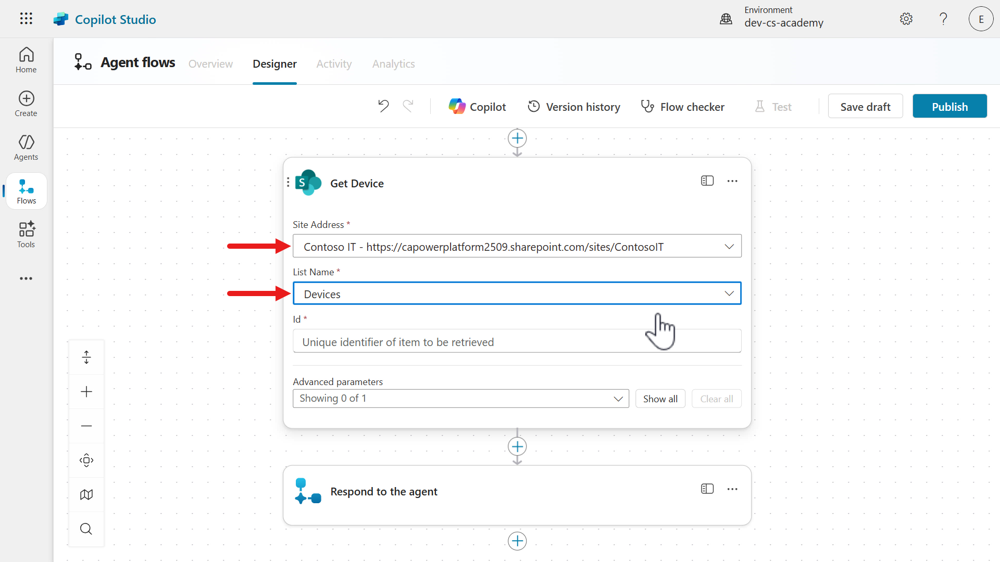

1. In the **Id** field, select the **lightning bolt icon** or **fx icon** to the right.

    

1. In the **Dynamic content** tab of the flyout pane, enter the following,

    ```text
    sharepoint
    ```

    The search results will show input parameters that match the value searched. Select the **DeviceSharePointId** parameter from the trigger.

    Next, select **Add** to add the dynamic content input into the **Id** parameter of the action.

    

1. The dynamic content input from the trigger is now referenced in the **Id** parameter of the action. We're going to update one of the advanced parameters next. Select **Show all** to view the advanced parameters.

    

1. The **Limit Columns by View** parameter will be displayed and by default it's set to **Use all columns (Do not limit)**. We'll update this value to a view to limit the columns returned in the response of the action. Select the **Limit Columns by View** parameter to view the list of views.

    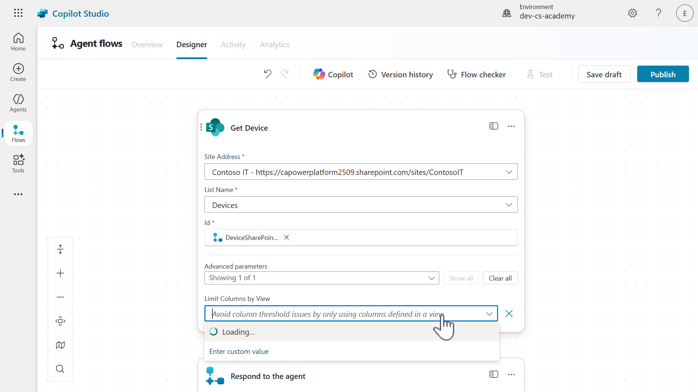

1. Select the **All Items** view.

    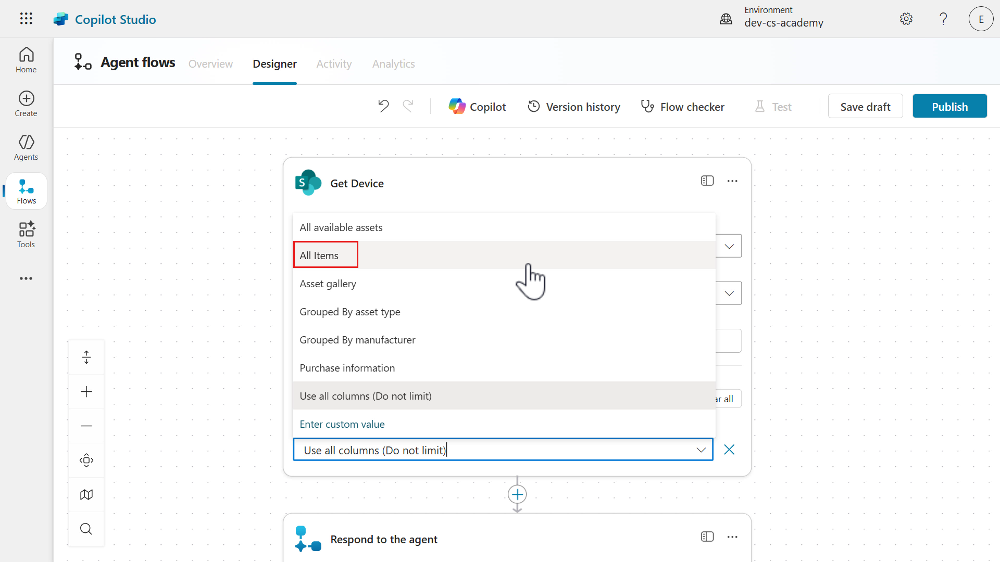

1. Select the **plus + icon** under the _Get Device_ action to insert a new action.

    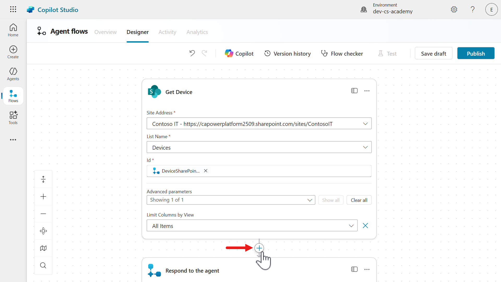

1. In the search field enter the following,

    ```text
    send an email
    ```

    A list of actions will display in the search results. Select the **Send an email (V2)** action from the **Office 365 Outlook connector**.

    

1. We next need to create a connection for the connector action. Select **Sign in**.

    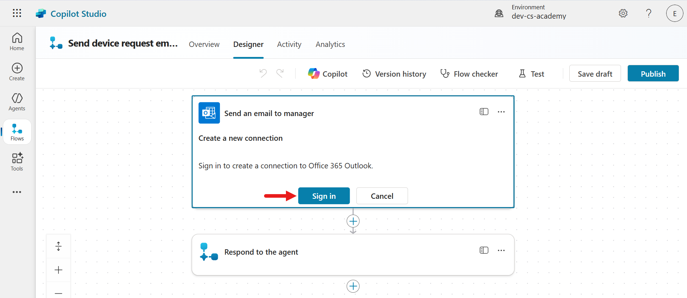

1. Select your signed in user account.

    

1. Select **Allow access**. A connection has now been created.

    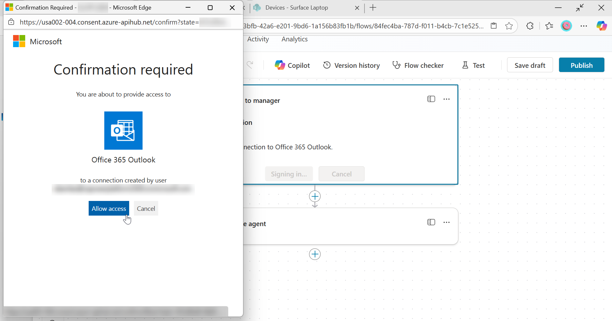

1. Rename the action to the following,

    ```text
    Send an email to manager
    ```

    Let's next define the input parameters of our action.

    For the **To** input parameter, select yourself. Normally this would be your manager or we'd use another action that pulls through your manager based on your Entra ID profile but for the purpose of this lesson, select yourself.

    For the **Subject** input parameter, enter the following,

    ```text
    Request type: new device
    ```

    For the **Body** input parameter, enter the following,

    ```text
    Hi,

    New device requested from

    Manufacturer:
    Model:
    Link to item in SharePoint
    Additional comments from:

    This is an automated email from Contoso Helpdesk Copilot
    ```

    

1. Next, we're going to update the **Body** input parameter with references to dynamic content input from the **trigger** or **Get item** action. Enter a space after the second line as we'll insert the name of the user from the trigger input, **User**.

    Select the **lightning bolt icon** or **fx icon** to the right.

    

1. In the **Dynamic content** tab of the flyout pane, select the **User** input from the trigger.

    Select **Add** to add the dynamic content **User** input into the **Body** parameter of the action.

    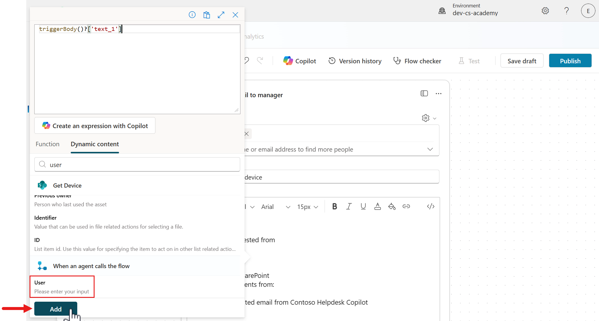

1. The dynamic content input from the trigger is now referenced in the **Body** parameter of the action. We'll repeat the same for the remaining lines in the email message body.

    

1. Click into the space beside `Manufacturer:`. Select the **lightning bolt icon** or **fx icon** to the right.

    In the **Dynamic content** tab of the flyout pane, enter the following in the search field,

    ```text
    manufacturer
    ```

    Select the **Manufacturer value** input from the trigger and select **Add**.

    

1. Click into the space beside `Model:`. Select the **lightning bolt icon** or **fx icon** to the right.

    In the **Dynamic content** tab of the flyout pane, enter the following in the search field,

    ```text
    model
    ```

    Select the **Model** input from the **Get item** action and select **Add**.

    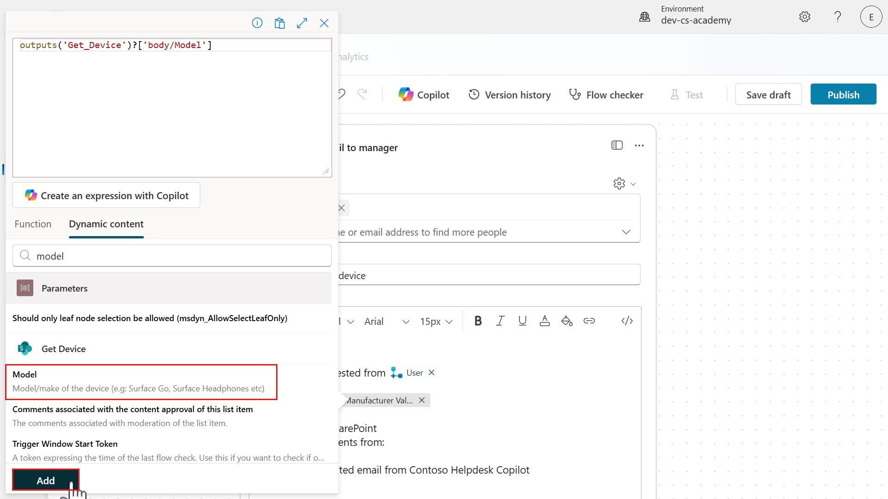

1. For the `Link to item in SharePoint` text, we'll update this to be a hyperlink in the email message body. Click at the beginning of the line and select the **lightning bolt icon** or **fx icon** to the right.

    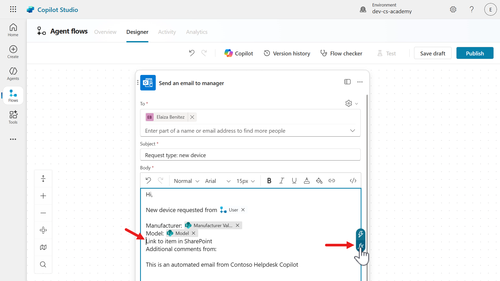

1. Click after the HTML anchor tag and select the **lightning bolt icon** or **fx icon** to the right.

    In the **Dynamic content** tab of the flyout pane, enter the following in the search field,

    ```text
    link to item
    ```

    Select the **Link to item** input from the **Get item** action and select **Add**.

    

1. We need to switch to the HTML editor by selecting the **&lt;/&gt;**
 icon.

    

1. The HTML editor is now enabled. Click before the `Link to item in SharePoint` text, add an HTML anchor tag to create a hyperlink. Copy and paste the following.

    ```text
    <a href="
    ```

    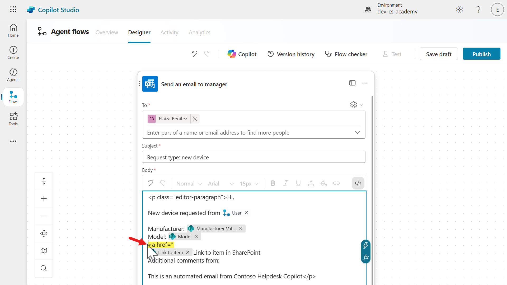

1. The dynamic content input of **Link to item** is now referenced in the **Body** parameter. Click after the **Link to item** input, copy and paste the following.

    ```text
    ">
    ```

    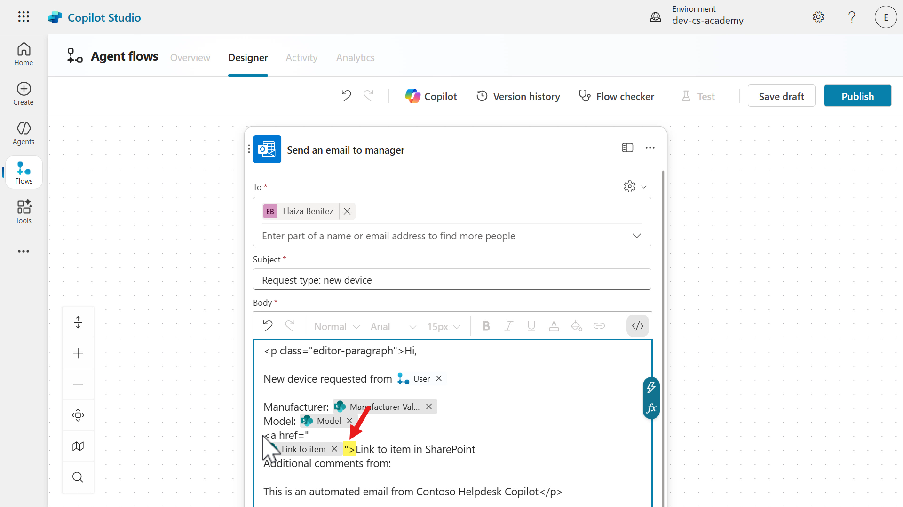

1. Click after the `Link to item in SharePoint` text, close the html anchor tag. Copy and paste the following.

    ```text
    </a>
    ```

    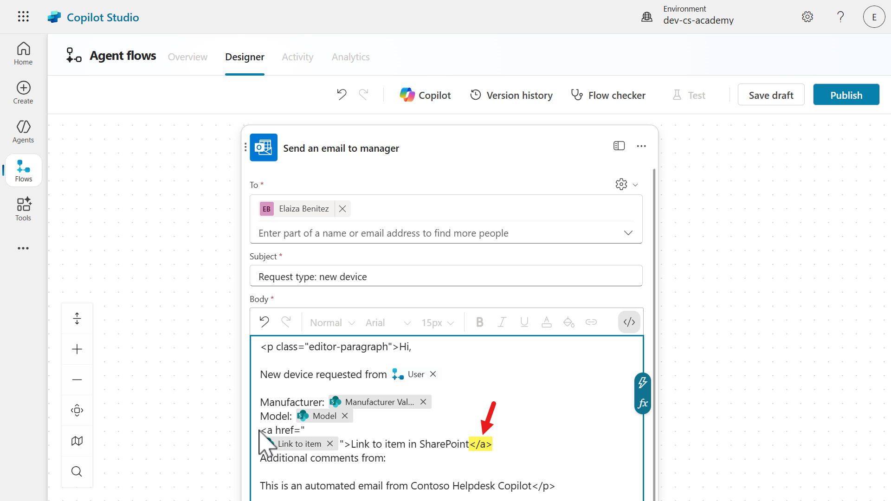

1. Select the **&lt;/&gt;** icon to toggle the code view.

    

1. Then reselect the **&lt;/&gt;** icon to toggle the code view again.

    

1. Notice how there are several extra characters `&lt;br&gt;`. Delete these characters

    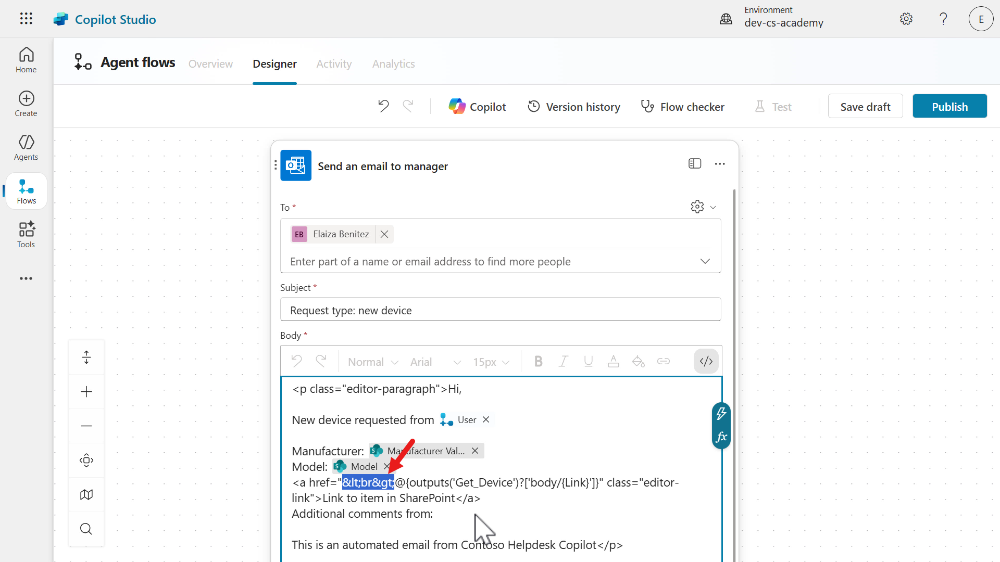

1. We're now done adding a hyperlink to our email message body 😎 Select the **&lt;/&gt;** icon to toggle the code view.

    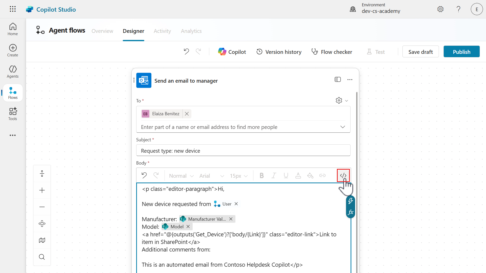

1. Click after the `Additional comments from` text before the colon character and select the **lightning bolt icon** or **fx icon** to the right.

    

1. In the **Dynamic content** tab of the flyout pane, enter the following in the search field,

    ```text
    user
    ```

    Select the **User** parameter from the trigger and select **Add**.

    

1. We're now going to insert an expression that will display the value of Additional Comments if provided by the user in the **Ask an adaptive card** node, otherwise display "None" if the user does not provide any comments.

    Click after the colon and select the **lightning bolt icon** or **fx icon** to the right.

    

1. In the **Function** tab of the flyout pane and in the expression field above, enter the following,

    ```text
    if(empty())
    ```

    This expression uses the `if` function for an if-else statement.

    The next function used is `empty` which checks whether a value exists or not in a string parameter. The string parameter to be referenced is the `AdditionalComments` input parameter value from the trigger.

    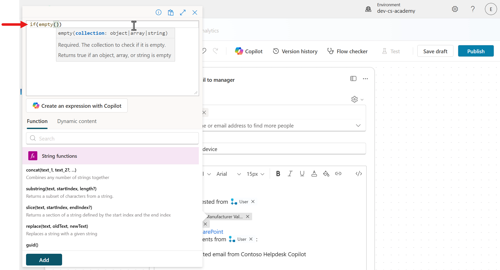

1. Next, click **inside of the brackets** after the `empty` function. We're going to insert the `AdditionalComments` input parameter from the trigger.

    Select the **Dynamic content** tab. Enter the following in the search field,

    ```text
    Additional
    ```

    Scroll down the pane and select **AdditionalComments** input from the trigger. The parameter will now be added as a string parameter in the expression.

    

1. Next we'll define the **_true_** logic, where if the `AdditionalComments` string parameter is empty, then we want to display a string (text) of `None`.

    After the bracket that encloses the string parameter, enter the following,

    ```text
    , 'None',
    ```

    

1. Finally we'll define the **_false_** logic, where if the `AdditionalComments` string parameter is not empty, then we want to display the value of the **AdditionalComments** input parameter from our trigger.

    > A reminder this value will be from the Additional Comments field of the adaptive card in the **Ask with adaptive card** node in the **Request device** topic.

    After the comma after our **_true_** logic, select the **Dynamic content** tab. Enter the following in the search field,

    ```text
    Additional
    ```

    Scroll down the pane and select **AdditionalComments** input from the trigger. The parameter will now be added as a string parameter in the expression.

    Now add it our **Body** parameter by selecting **Add**.

    

1. Excellent, our expression is complete! The expression has now been added to the **Body** parameter. Lastly, format the last line in Italics.

    

1. We're now going to update the **Respond to the agent** action to send the value of the **Model value** parameter from the **Get item** action back to the agent.

    Hold down the left key of your mouse and move in an upward motions within the designer to view the **Respond to the agent** action.

    Select the **Respond to the agent** action and select the **Text** output as the type.

    

1. Enter the following as the name of the output.

    ```text
    ModelValue
    ```

    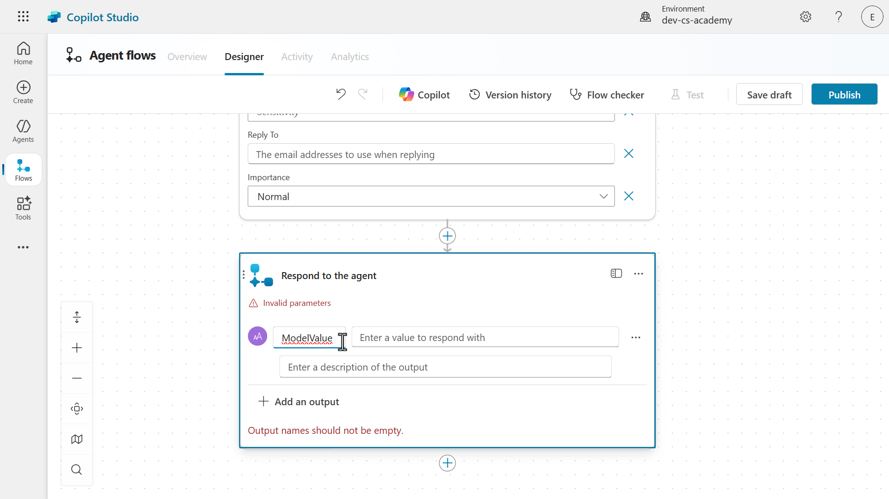

1. Select the value field and select the **lightning bolt icon** or **fx icon** to the right.

    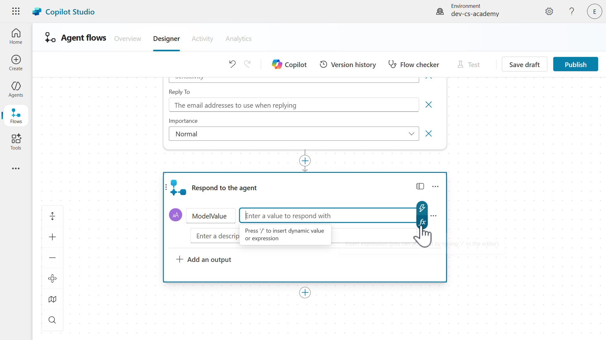

1. In the **Dynamic content** tab of the flyout pane, enter the following in the search field,

    ```text
    model
    ```

    Select the **Model** parameter from the **Get item** action and select **Add**.

    

1. The **Model** parameter is now the value of the text output. Select **Save draft** to save our agent flow.

    We've now completed our agent flow 👏🏻

    

1. Let's make one more update to our agent flow before publishing. Select the **Overview** tab and select **Edit**.

    

1. For the **Flow name**, copy and paste the following.

    ```text
    Send device request email
    ```

    For the **Description**, select the **refresh icon** to use AI to automatically generate a description for you based on the trigger and actions in the agent flow.

    Select **Save** to save the updated name and description of the agent flow.

    

1. Select the **Designer** tab and select **Publish** to publish the agent flow so that it can be added as a node in the **Request device** topic.

    

1. A confirmation message will appear shortly to confirm the agent flow is published.

    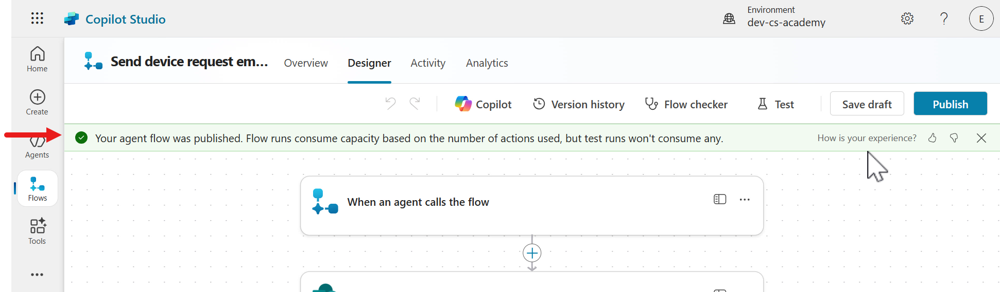

### 9.2 Add agent flow to topic

Let's now add the agent flow to the **Request device** topic.

1. Select **Agents** in the left-hand side menu and select the **Contoso Helpdesk Agent**.

    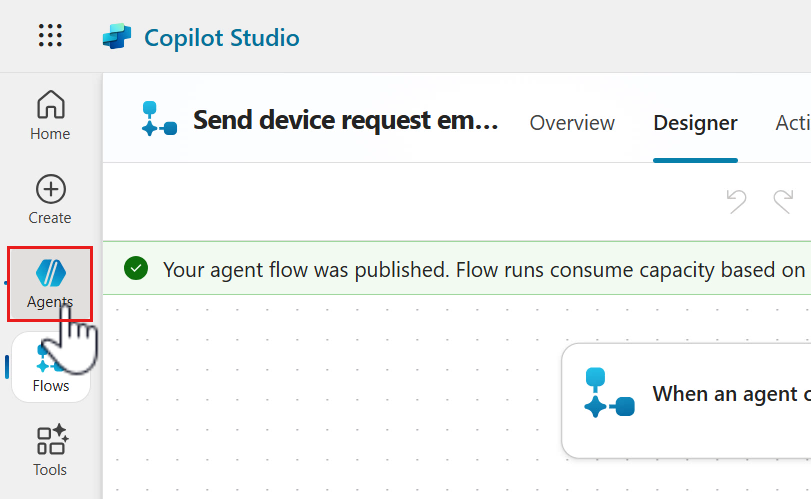

1. Select the **Topics** tab.

    

1. Select the **Request device** topic.

    

1. Scroll down to the **Ask with adaptive card** node and add a new node.

    Select **Add a tool** and in the **Basic tools** tab of the fly out pane, select the **Send device request email** agent flow we recently created and published.

    

1. For the trigger inputs of our agent flow, we need to select the variable outputs from the **Ask with adaptive card** node.

    Select the **ellipsis (...) icon** for the **DeviceSharePointId** input.

    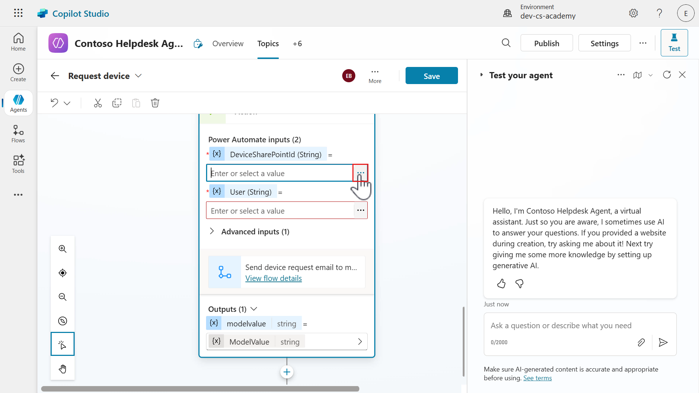

1. Select the **deviceSelectionId** variable which is one of the outputs defined in **Ask with adaptive card** node.

    

1. Next, select the **ellipsis (...) icon** for the **User** input.

    

1. Select the **System** tab in the flyout variable pane and select **User.DisplayName**. This variable stores the display name of the internal user interacting with the agent.

    

1. Next, select the **greater than icon** for **Advanced inputs** to expand and see the **AdditionalComments** input.

    

1. Select the **ellipsis (...) icon** for the AdditionalComments input.

    

1. Select the **Formula** tab and the expand icon in the flyout variable pane as we'll use a Power Fx expression.

    

1. Similar to the expression in the agent flow that does a conditional check using the _if_ function, but this time
    - using Power Fx functions,
    - and inserting either no value, or the value of the `commentsId` output variable from the **Ask with adaptive card** node.

    Enter the following functions in the Power Fx field,

    ```text
    If(IsBlank())
    ```

    This expression uses the `If` function for an if-else statement.

    The next function used is `IsBlank` which checks whether a value exists or does not exist in a string parameter. The string parameter to be referenced is the `commentsId` output variable from the **Ask with adaptive card** node.

    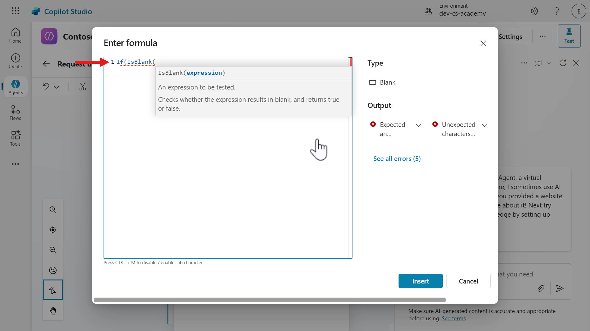

1. Next, click **inside of the brackets** after the `IsBlank` function. We're going to insert the `commentsId` output variable from the **Ask with adaptive card** node.

    Enter the following inside the brackets,

    ```text
    Topic.commentsId
    ```

    And add a comma after the bracket.

    

1. Next we'll define the logic

    - when **_true_** - if the `Topic.commentsId` string parameter is empty, then we want to insert no value.
    - when **_false_** - if the `Topic.commentsId` string parameter is not empty, then insert the value of commentsId variable.

    After the bracket that encloses the string parameter, enter the following,

    ```text
    "", Topic.commentsId)
    ```

    The Power Fx expression should be the following,

    ```text
    If(IsBlank(Topic.commentsId), "", Topic.commentsId)
    ```

    Great work, our expression is complete! 🙌🏻 Now select **Insert** to set the input parameter of the agent flow to the Power Fx expression.

    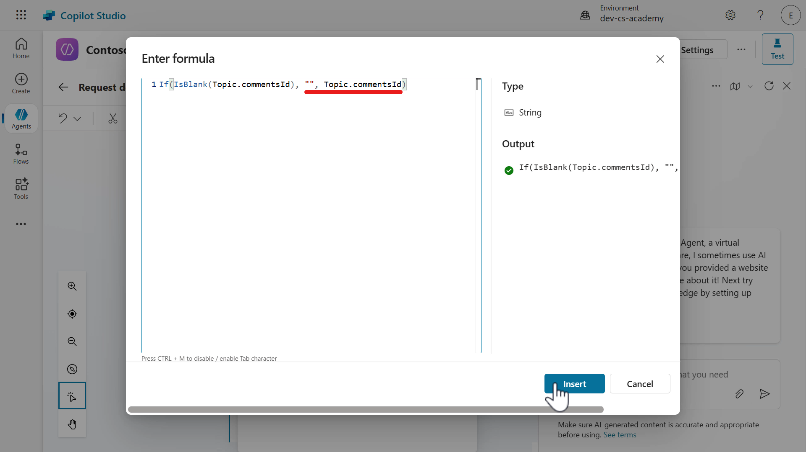

1. **Save** the topic.

### 9.3 Update Request device topic with several nodes for a better user experience

We'll next add two more nodes:

- **Send a message** - this will act as a confirmation message that references the selected device and that their request has been submitted.

- **Topic management** - to close the conversation, we'll redirect to the **End of conversation** node.

Let's begin!

1. Select the **plus + icon** below the agent flow node and select **Send a message** node.

    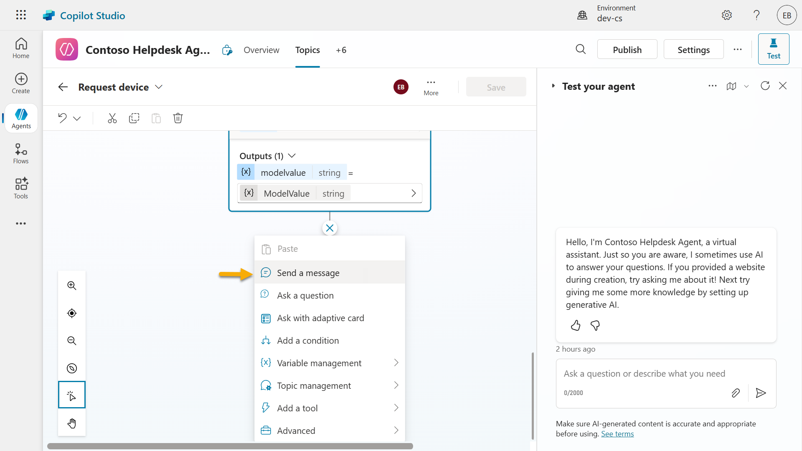

1. Enter the following below in the message field,

    ```text
    Thanks
    ```

    Then select the **Insert variable** as we'll reference the user's name.

    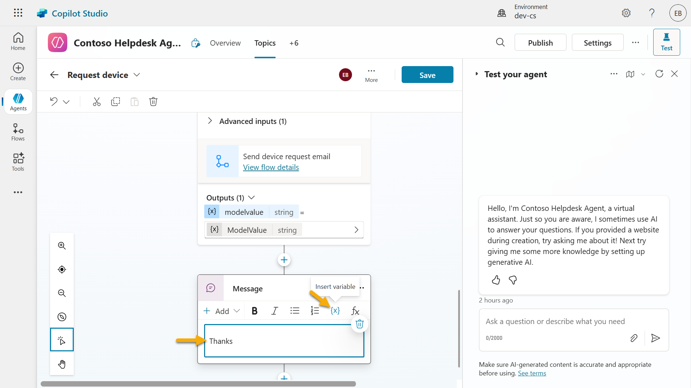

1. Select the **System** tab and search for `User` in the search field. Select the **User.DisplayName** variable.

    

1. Enter the following below in the message field,

    ```text
    . Your selected device,
    ```

    Then select **Insert variable** and this time in the **Custom** tab, select the **ModelValue** variable.

    Then enter the following below to complete the message.

    ```text
    , has been submitted and will be reviewed by your manager.
    ```

    The message should look like the following.

    

1. Lastly, select the **plus + icon** below the **Send a message** node and select **Topic management**, followed by **Go to another topic** and select **End of Conversation**.

    

1. **Save** the topic.

    

### 9.4 Test agent using several scenarios

Great work!!! 😁 We can now test our agent.

#### 9.4.1 Request a device and enter a comment in adaptive card

1. **Refresh** the test pane, select the **activity map** icon and enter the following as a message to the agent.

    ```text
    I need a laptop
    ```

    

1. The agent triggers the **Available devices** and responds with the list of available devices. We'll enter the following as the answer to the question of whether we'd like to request a device.

    ```text
    Yes
    ```

    

1. Notice how the agent invoked the **Request device** as per the agent instructions and that the adaptive card is now being displayed in the agent message.

    Select the **Surface Laptop 15** device and add the following as a comment.

    ```text
    I need 16GB of RAM please
    ```

    

1. Scroll down until you see the **Submit Request** button and select it to submit the adaptive card to the agent.

    

1. Select **Allow** for the agent to use your credentials for the connection authentication of the two connector actions.

    

1. The agent will then display the confirmation message which includes the model selected, followed by redirecting to the **End of Conversation** topic. Cool!

    

1. Select **Yes** to verify the rest of the **End of Conversation** topic.

    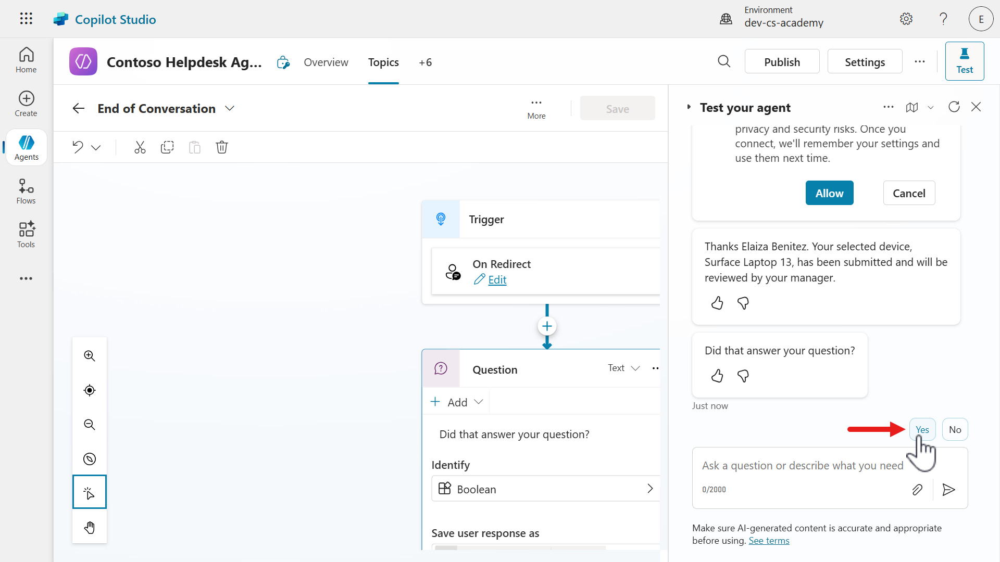

1. Next, rate the experience by selecting any of the stars in the rating scale card.

    The agent will then proceed to the final **Question** node in the **End of Conversation** topic. Select **No**.

    

1. The topic will then complete as a final message will be displayed in the test pane.

    

1. Check your Inbox of your email account to review the email sent to the manager by the agent flow. You can see the details of the device selected, and the note entered in the adaptive card.

    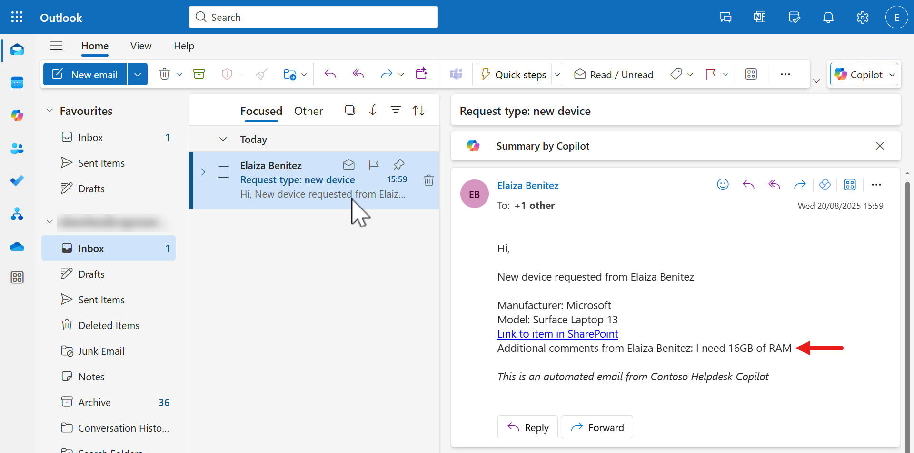

1. Click the hyperlink and the browser should load the SharePoint item of the device. Super!

    

#### 9.4.2 Request a device and do not enter a comment in adaptive card

Let's now test the scenario when a comment is not entered.

1. Repeat the same steps of

    - **Refresh** the test pane and select the **activity map** icon
    - Enter the message, `I need a laptop`
    - Respond with `Yes` to the question of requesting a device

    

1. This time select **Surface Laptop 13** as the device and do not enter a comment.

    

1. **Submit** the request by selecting the **Submit Request** button.

    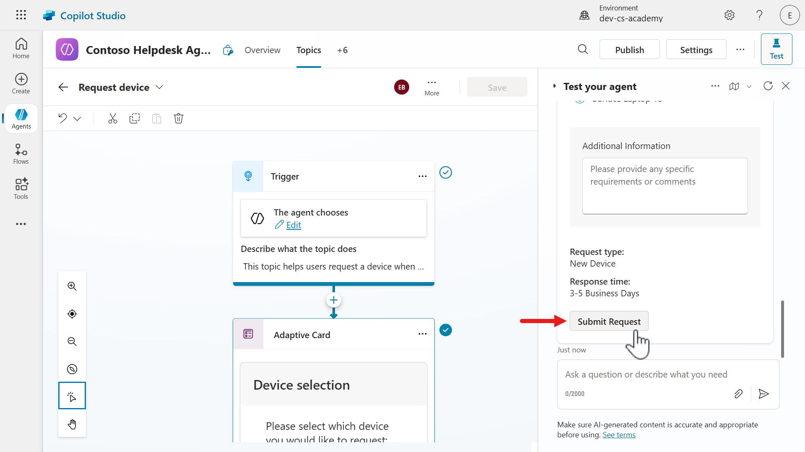

1. This time the email received in your Inbox will display **None** as the comment.

    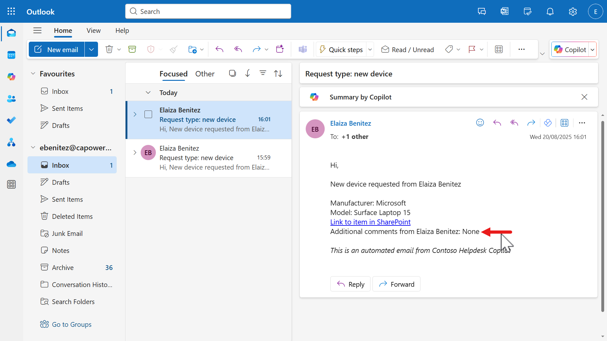

#### 9.4.3 Do not request for a device

Let's test the final scenario which is to not request a device, and the **Goodbye** topic should be invoked as per the agent instructions.

1. Repeat the same steps of

    - **Refresh** the test pane and select the **activity map** icon
    - Enter the message, `I need a laptop`
    - This time respond with `No` to the question of requesting a device

    

1. The agent invoked the **Goodbye** topic and the question as defined in the topic is asked.

    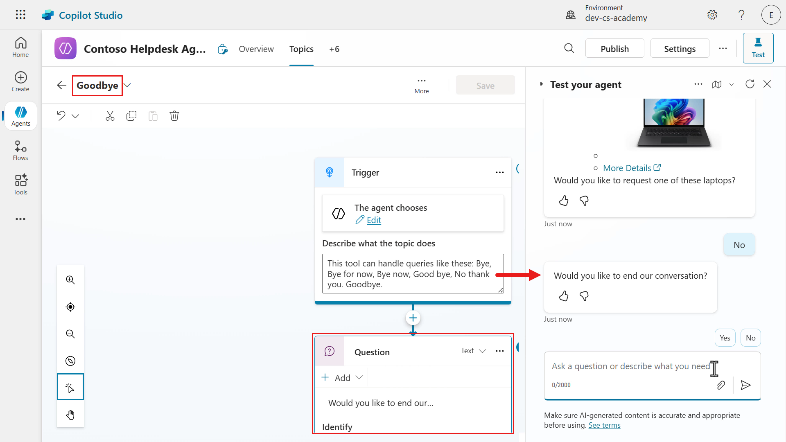

## ✅ Mission Complete

Congratulations! 👏🏻 You've learnt how to build your agent flow and add it to our existing **Request device** topic, and how to redirect the agent to another topic.

This is the end of **Lab 09 - Add an agent flow for automation and enhance topic capabilities**, select the link below to move to the next lesson. We'll expand on the use case in this lab in the following lesson's lab.

⏭️ [Move to **Add Event Triggers - Enable autonomous agent capabilities** lesson](../10-add-event-triggers/README.md)

## 📚 Tactical Resources

🔗 [Introducing agent flows: Transforming automation with AI-first workflows](https://www.microsoft.com/microsoft-copilot/blog/copilot-studio/introducing-agent-flows-transforming-automation-with-ai-first-workflows/)

🔗 [Agent flows overview](https://learn.microsoft.com/microsoft-copilot-studio/flows-overview?WT.mc_id=power-172621-ebenitez)

🔗 [Use agent flows with your agent](https://learn.microsoft.com/microsoft-copilot-studio/advanced-flow?WT.mc_id=power-172621-ebenitez)

🔗 [List of functions in the reference guide](https://learn.microsoft.com/azure/logic-apps/workflow-definition-language-functions-reference?WT.mc_id=power-172621-ebenitez)

📺 [Agent Flows in Copilot Studio](https://www.youtube.com/watch?v=VJTKyk3Pr7s)

<!-- markdownlint-disable-next-line MD033 -->

