---
prev:
  text: Add Event Triggers
  link: /recruit/10-add-event-triggers
next:
  text: Understanding Licensing
  link: /recruit/12-understanding-licensing
short-description: Deploy your agent to Microsoft Teams and Microsoft 365 Copilot
difficulty: 1
codename: OPERATION PUBLISH PUBLISH PUBLISH
time: 30
harness: standard
tags:
  - publishing
products:
  - copilot-studio
  - microsoft-365
  - teams
industries:
  - it
created-date: 2025-08-20
last-edited-date: 2026-08-06
---
# 🚨 Mission 11: Publish Your Agent {#mission-11-publish-your-agent}

<mission-meta />

🎥 **Watch the Walkthrough**

[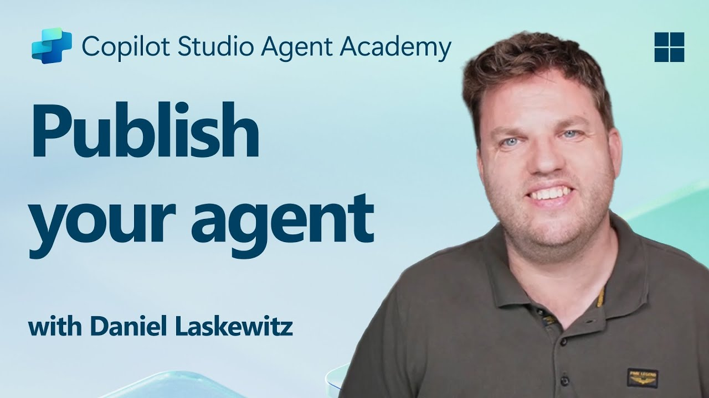](https://www.youtube.com/watch?v=eVZmljhYlSI "Watch the walkthrough on YouTube")

## 🎯 Mission Brief {#mission-brief}

Welcome back, Recruit. After building and testing your agent, you’re ready to publish it for users in Microsoft Teams and Microsoft 365 Copilot.

Your agent—equipped with a clear mission, powerful tools, and access to key knowledge sources—is ready to serve. Using Microsoft Copilot Studio, you deploy your agent so it can start assisting real users, right where they work.

Let’s launch your agent into action.

> [!IMPORTANT] This mission uses the classic Copilot Studio experience
> If your Copilot Studio screen looks different from the screenshots in this mission, turn off **New Experience** in the upper-right corner to switch back to the **classic experience** used here.

## 🔎 Objectives {#objectives}

In this mission, you’ll learn:

1. Why publishing is required to make agent updates available
1. What happens when you publish an agent
1. How to add Microsoft Teams and Microsoft 365 Copilot as a channel
1. How to add the agent in Microsoft Teams
1. How to make the agent available across your organization

## 🚀 Publish an agent {#publish-an-agent}

Every time you work on an agent in Copilot Studio you might update it by adding knowledge or tools. When you're ready with all the changes, and you tested thoroughly, you're ready to publish it. Publishing ensures that the latest updates are live. When you update your agent with new tools, and you don't hit the publish button, it's not available yet for end users.

Make sure to always hit the publish button when you want to push the updates to the users of your agent. Your agent might have channels added to it and when you hit publish the updates are available for all the channels you added to the agent.

> [!IMPORTANT]
> ❗ There was a recent change to Copilot Studio Trial environments that prohibits the publishing of agents. If you are in a trial environment you will not be able to complete this module to publish your agent. It will require a paid environment to publish an agent. Publishing of the agent is not required to receive a badge.

## ⚙️ Configure channels {#configure-channels}

Channels determine where your users can access and interact with your agent. After you publish your agent, you can make it available in multiple channels. Each channel may display your agent's content differently.

You can add your agent to the following channels:

- **Microsoft Teams and Microsoft 365 Copilot** - Make your agent available in Teams chats and meetings, and within Microsoft 365 Copilot experiences. See [publish an agent to Teams and Microsoft 365 Copilot](https://learn.microsoft.com/microsoft-copilot-studio/publication-add-bot-to-microsoft-teams).
- **Demo website** - Test your agent on a demo website provided by Copilot Studio. See [connect an agent to web channels](https://learn.microsoft.com/microsoft-copilot-studio/publication-connect-bot-to-web-channels).
- **Custom website** - Embed your agent directly into your own website. See [connect an agent to a custom website](https://learn.microsoft.com/microsoft-copilot-studio/publication-connect-bot-to-web-channels).
- **Mobile app** - Integrate your agent into a custom mobile application. See [connect an agent to a mobile app](https://learn.microsoft.com/microsoft-copilot-studio/publication-connect-bot-to-custom-application).
- **SharePoint** - Add your agent to SharePoint sites for document and site assistance. See [add an agent to SharePoint](https://learn.microsoft.com/microsoft-copilot-studio/publication-add-bot-to-sharepoint).
- **Facebook Messenger** - Connect with users through Facebook's messaging platform. See [add an agent to Facebook](https://learn.microsoft.com/microsoft-copilot-studio/publication-add-bot-to-facebook).
- **Power Pages** - Integrate your agent into Power Pages websites. See [add an agent to Power Pages](https://learn.microsoft.com/microsoft-copilot-studio/publication-add-bot-to-power-pages).
- **Azure Bot Service channels** - Access additional channels including Slack, Telegram, Twilio SMS, and more. See [connect an agent to Azure Bot Service channels](https://learn.microsoft.com/microsoft-copilot-studio/publication-connect-bot-to-azure-bot-service-channels).

To add a channel, navigate to the **Channels** tab in your agent and select the channel you want to configure. Each channel has specific setup requirements and may require additional authentication or configuration steps.

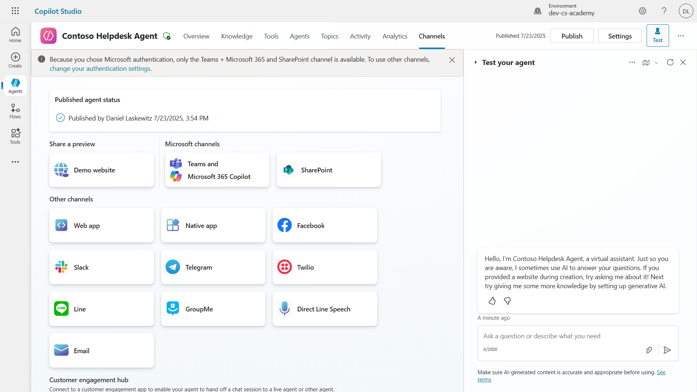

## 📺 Channel experiences {#channel-experiences}

Different channels have different user experiences. When building an agent for multiple channels, make sure to be aware of the differences per channel. It's always a good strategy to test your agent in multiple channels to see if it really does what you intended.

| Experience | Website | Teams and Microsoft 365 Copilot | Facebook | Dynamics Omnichannel for Customer Service |
| :-- | :-- | :-- | :-- | :-- |
| Customer satisfaction survey | Adaptive card | Text-only | Text-only | Text-only |
| Multiple-choice options | Supported | [Supported up to six (as hero card)][1] | [Supported up to 13][3] | [Partially Supported][5] |
| Markdown | Supported | [Partially Supported][2] | [Partially supported][4] | [Partially Supported][6] |
| Welcome message | Supported | Supported | Not supported | Supported for [Chat][7]. Not supported for other channels. |
| Did-You-Mean | Supported | Supported | Supported | Supported for [Microsoft Teams][8], [Chat][7], Facebook, and text-only channels (short message service (SMS) via [TeleSign][9] and [Twilio][10], [WhatsApp][11], [WeChat][12], and [Twitter][13]). Suggested actions are presented as a text-only list; users must retype an option to respond. |

[1]: https://learn.microsoft.com/microsoftteams/platform/concepts/cards/cards-reference#hero-card
[2]: https://learn.microsoft.com/microsoftteams/platform/bots/how-to/format-your-bot-messages#text-only-messages
[3]: https://developers.facebook.com/docs/messenger-platform/send-messages/quick-replies/
[4]: https://www.facebook.com/help/147348452522644?helpref=related
[5]: https://learn.microsoft.com/dynamics365/customer-service/asynchronous-channels#suggested-actions-support
[6]: https://learn.microsoft.com/dynamics365/customer-service/asynchronous-channels#preview-support-for-formatted-messages
[7]: https://learn.microsoft.com/dynamics365/customer-service/set-up-chat-widget
[8]: https://learn.microsoft.com/dynamics365/customer-service/configure-microsoft-teams
[9]: https://learn.microsoft.com/dynamics365/customer-service/configure-sms-channel
[10]: https://learn.microsoft.com/dynamics365/customer-service/configure-sms-channel-twilio
[11]: https://learn.microsoft.com/dynamics365/customer-service/configure-whatsapp-channel
[12]: https://learn.microsoft.com/dynamics365/customer-service/configure-wechat-channel
[13]: https://learn.microsoft.com/dynamics365/customer-service/configure-twitter-channel

> [!NOTE]
> There are some examples of where you can use different logic for different channels. An example of it can be found in the Power Platform Snippets repository:
>
> Henry Jammes shared an [Adaptive Card channel-logic example](https://github.com/pnp/powerplatform-snippets/blob/main/copilot-studio/multiple-topics-matched-topic/source/multiple-topics-matched.yaml#L40) that shows a different card when the channel is Microsoft Teams.

## 🧪 Lab 11: Publish your agent to Teams and Microsoft 365 Copilot {#lab-11-publish-your-agent-to-teams-and-microsoft-365-copilot}

### 🎯 Use case {#use-case}

Your Contoso IT Help Desk agent is now fully configured with powerful capabilities—it can access SharePoint knowledge sources, create support tickets, send proactive notifications, and respond intelligently to user queries. However, all these features are currently only available in the development environment where you built them.

**The Challenge:** End users can't benefit from your agent's capabilities until it's properly published and made accessible through the channels where they actually work.

**The Solution:** Publishing your agent ensures that the latest version—with all your recent updates, new topics, enhanced knowledge sources, and configured flows—is available to real users. Without publishing, users would still interact with an older version of your agent that might be missing critical functionality.

Adding the Teams and Microsoft 365 Copilot channel is equally crucial because:

- **Teams Integration**: Your organization's employees spend most of their day in Microsoft Teams for collaboration, meetings, and communication. By adding your agent to Teams, users can get IT support without leaving their primary work environment.

- **Microsoft 365 Copilot**: Users can access your specialized IT help desk agent directly within their Microsoft 365 Copilot experience, making it seamlessly integrated into their daily workflow across Office applications.

- **Centralized Access**: Instead of remembering separate websites or applications, users can access IT support through the platforms they're already using, reducing friction and increasing adoption.

This mission transforms your development work into a production-ready solution that delivers real value to your organization's end users.

### Prerequisites

Before starting this lab, ensure you have:

- ✅ Completed previous labs and have a fully configured Contoso Helpdesk Agent
- ✅ Your agent has been tested and is ready for production use
- ✅ Permissions in your Copilot Studio environment to publish agents
- ✅ Access to Microsoft Teams in your organization

### 11.1 Publish your agent

Now that all our work on the agent is done, we have to make sure all our work is available for the end users that are going to use our agent. To make sure the content is available for all users, we need to publish our agent.

1. Go to the Contoso Helpdesk Agent in Copilot Studio (via the [Copilot Studio maker portal](https://copilotstudio.microsoft.com))

    In Copilot Studio, it's easy to publish your agent. You can just select the publish button at the top of the agent overview.

    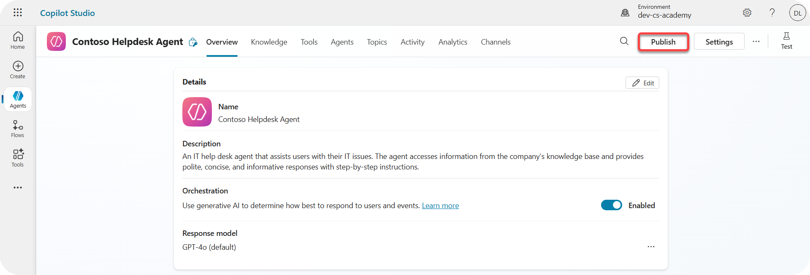

1. Select the **Publish** button in your agent

    It opens the publish pop-up - to confirm you really want to publish your agent.

    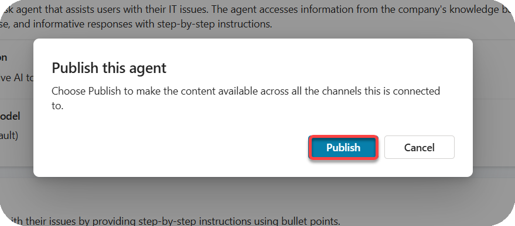

1. Select **Publish** to confirm publishing your agent

    Now a message shows that your agent is publishing. You don't have to keep that popup open. You get notified when the agent is published.

    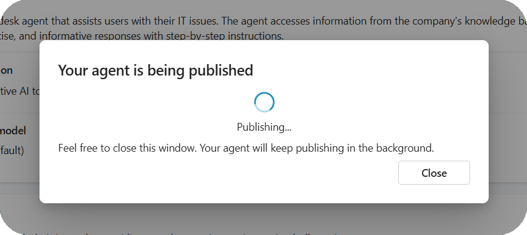

    When the agent is done publishing, you see the notification at the top of the agent page.

    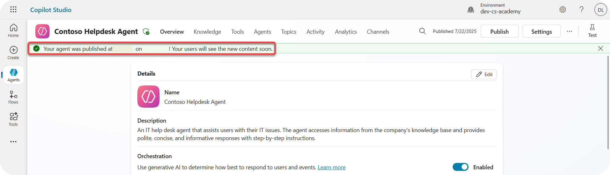

The agent is published, but it is not yet available through a channel. Let's fix that now.

### 11.2 Add the Teams and Microsoft 365 Copilot channel

1. Select **Channels** in the agent navigation.

    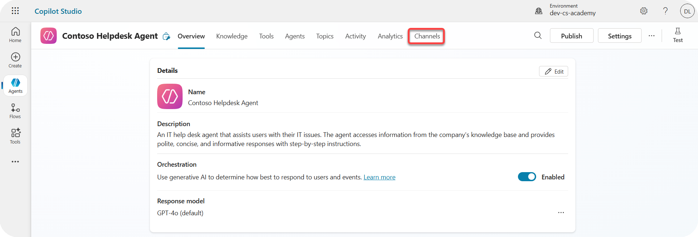

    Here we can see all the channels we can add to this agent.

1. Select **Teams and Microsoft 365**

    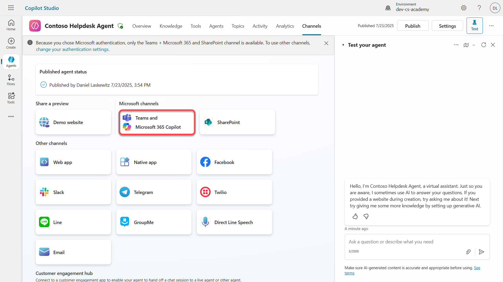

1. Select **Add channel** to complete the wizard and add the channel to the agent

    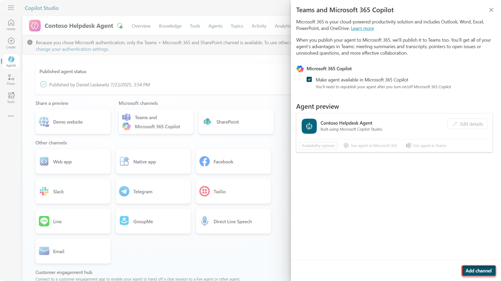

    It may take a little while to add. When it is ready, a success notification appears at the top of the sidebar.

    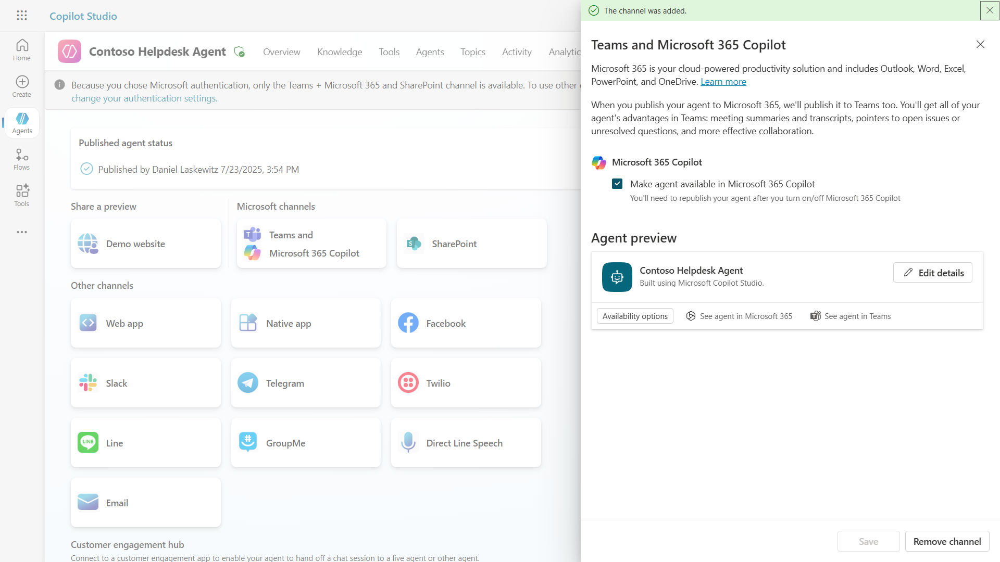

1. Select **See agent in Teams** to open a new tab

    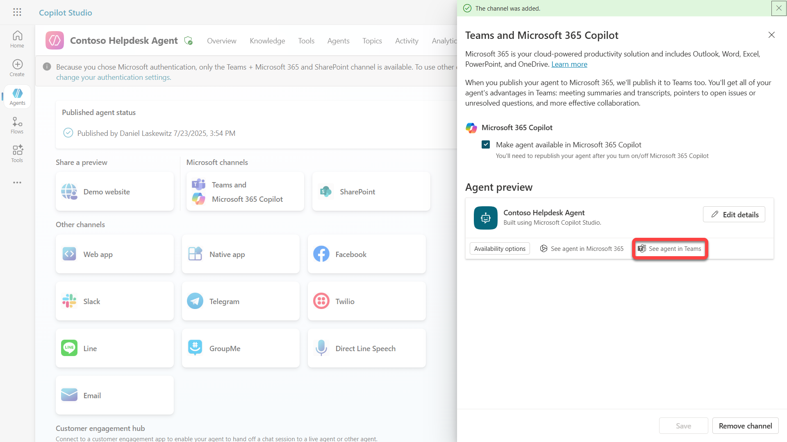

1. Select **Add** to add the Contoso Helpdesk Agent to Teams

    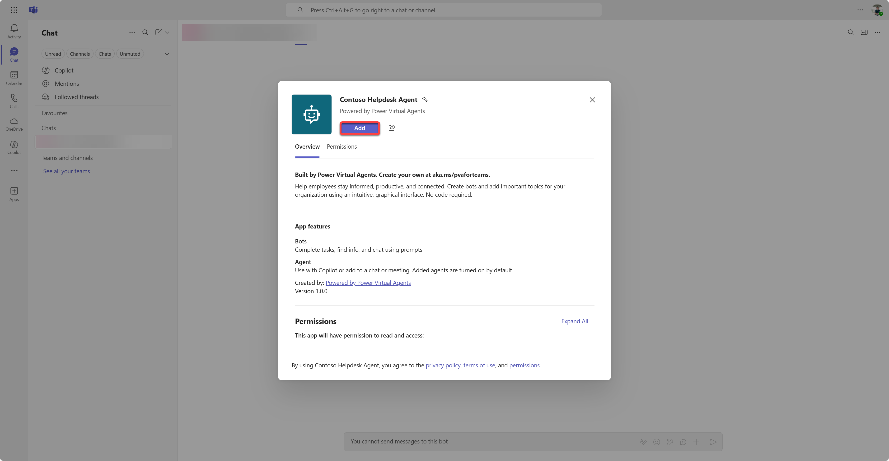

    This should take a little while. After it should show the following screen:

    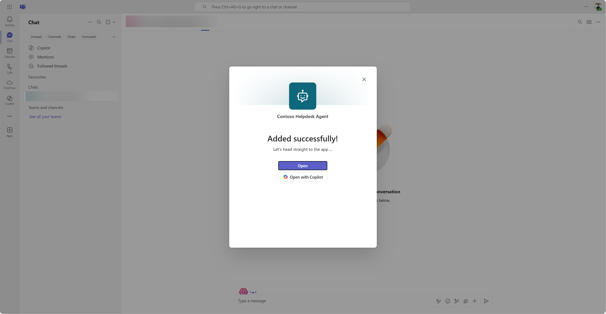

1. Select **Open** to open the agent in Teams

    This will open the agent in Teams as a Teams app

    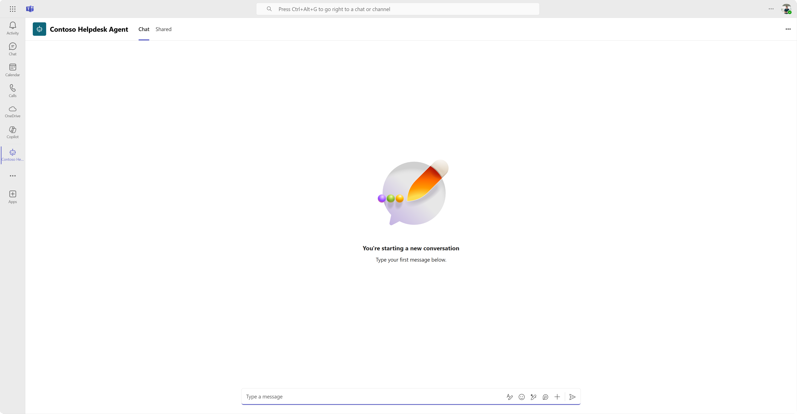

Now we have published the agent to work for you in Microsoft Teams, but you might want to make this available for more people.

### 11.3 Make the agent available for all users in the tenant

1. Close the browser tab where the Contoso Helpdesk Agent is opened

    This should bring you back to Copilot Studio where the Teams and Microsoft 365 Copilot side panel is still open. We only opened the agent in Teams now, but we can do a lot more here. We can edit the details of the agent, we can deploy the agent to more users and more.

1. Select **Edit details**

    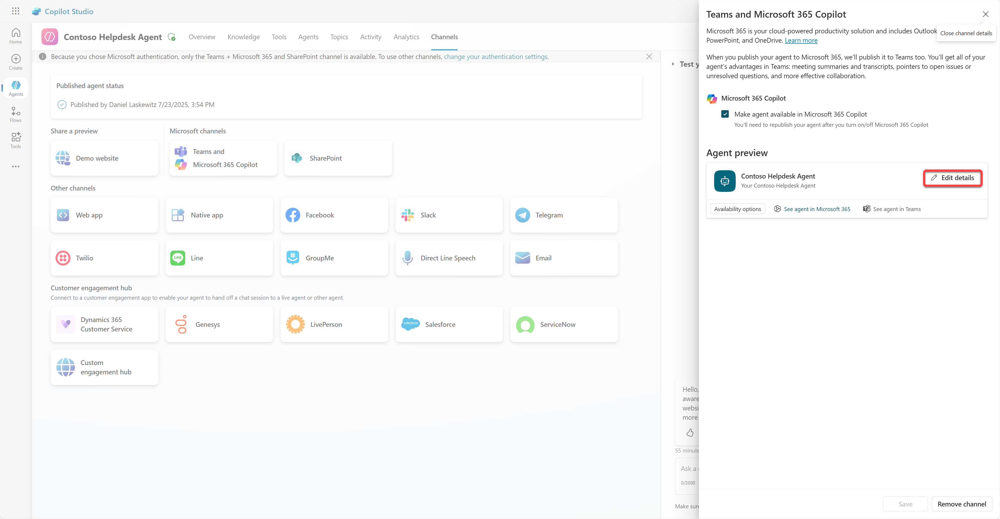

    This will open a pane where we can change a bunch of details and settings of the agent. We can change basic details like the icon, the background color of the icon and the descriptions. We can also change Teams settings (for instance allowing a user to add the agent to a team, or allowing to use this agent in group and meeting chats) here. When you select *more*, you can also change developer details like the developer name, the website, the privacy statement and the terms of use.

    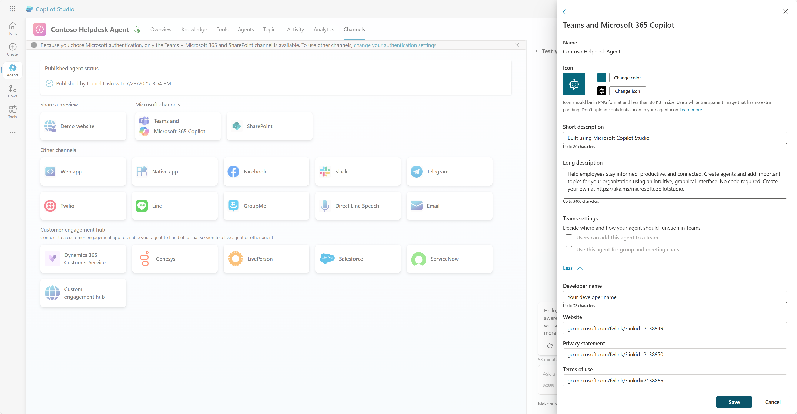

1. Select **Cancel** to close the Edit details pane

1. Select **Availability options**

    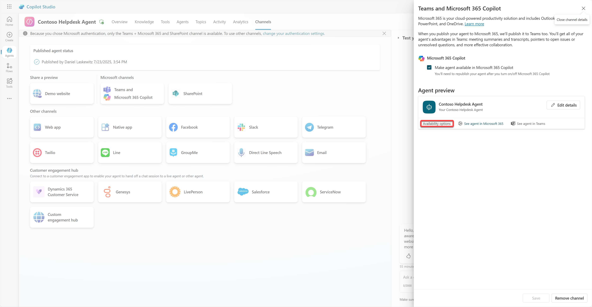

    This will open the availability options pane, where you can copy a link to send to users to use this agent (be aware, you need to share the agent with the user too) and you can download a file to add your agent to the Microsoft Teams or Microsoft 365 store. To show the agent in the store, you have other options too: you can show it to your teammates and shared users (to show in the *Built with Power Platform* section) or you can show it to everyone in your org (this needs administrator approval).

1. Select **Show to everyone in my org**

    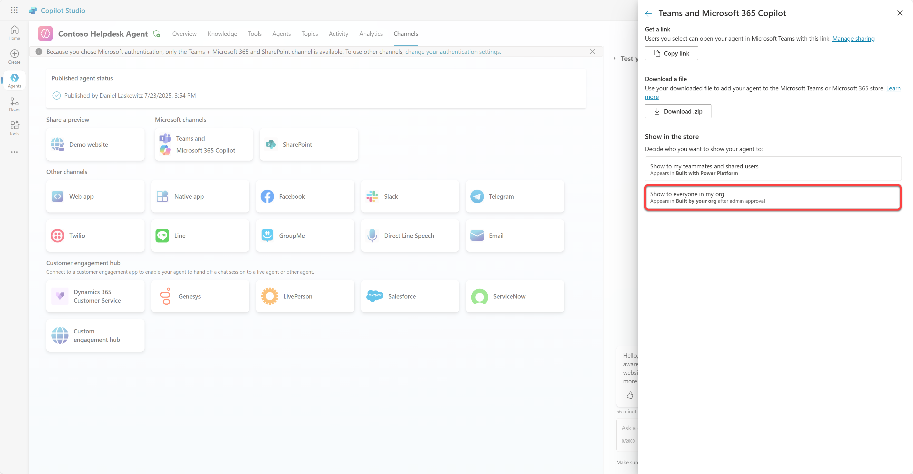

1. Select **Submit for admin approval**

    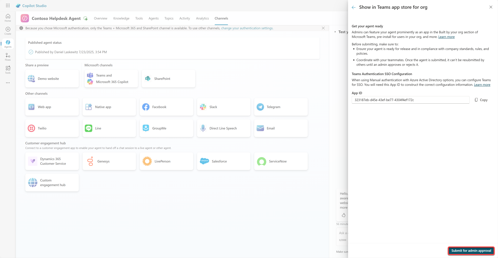

    Now, your administrator has to approve your agent submission. They can do that by going to the Teams Admin Center and look up the Contoso Helpdesk Agent in Apps. In the screenshot you can see what the administrator would see in Teams Admin Center.

    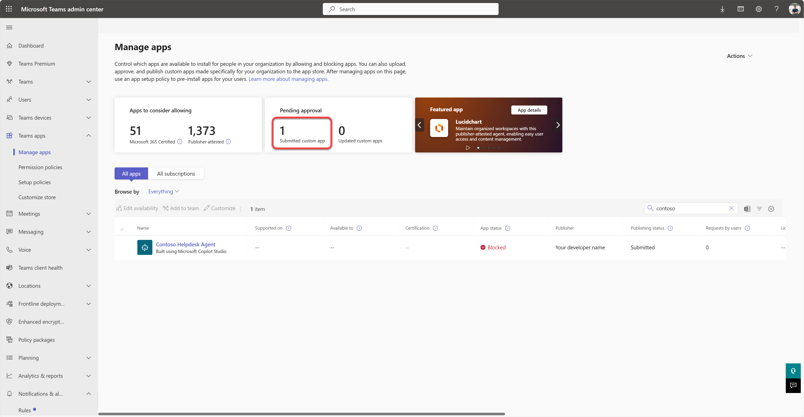

    The administrator has to select the Contoso Helpdesk Agent and select *Publish* to publish the Contoso Helpdesk Agent to everyone.

    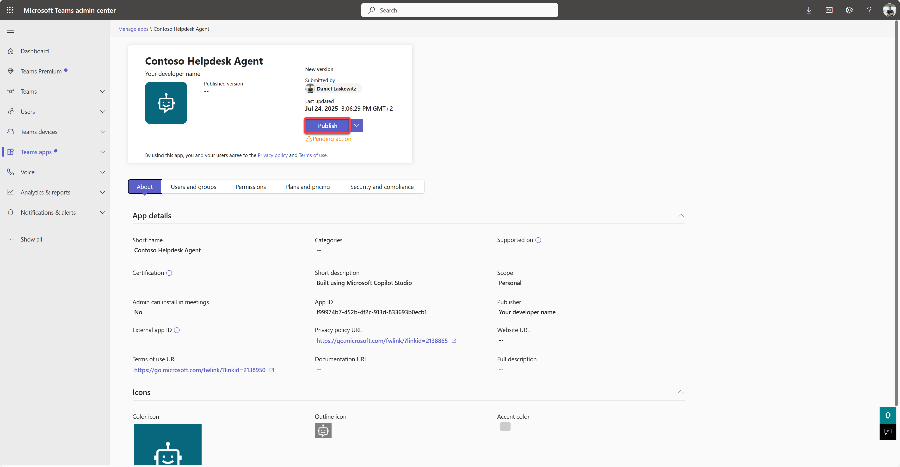

    When the administrator has published the agent submission, you will be able to refresh Copilot Studio and you should see the *available in app store* banner in the availability options.

    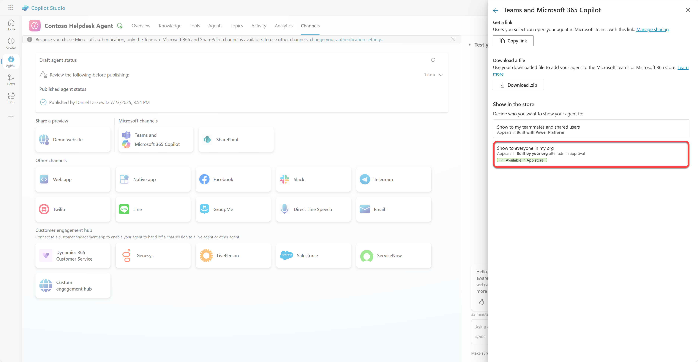

There are even more possibilities here. Your admin can change the global setup policy and auto install the Contoso Helpdesk Agent for everyone in the tenant. On top of that - you are able to pin the Contoso Helpdesk Agent to the left rail so that everyone has easy access to it.

## ✅ Mission Complete {#mission-complete}

You’ve successfully:

- **Publishing**: Published the latest version of your agent
- **Channels**: Added Microsoft Teams and Microsoft 365 Copilot
- **Teams installation**: Added and tested the agent in Microsoft Teams
- **Organizational availability**: Prepared the agent for admin approval and distribution

Next, continue to [Mission 12: Understanding Licensing](../12-understanding-licensing/index.md).

## 📚 Tactical Resources {#tactical-resources}

- [Publish agents and manage channels](https://learn.microsoft.com/microsoft-copilot-studio/publication-fundamentals-publish-channels)

<analytics-tag section="recruit" mission="11-publish-your-agent" />
