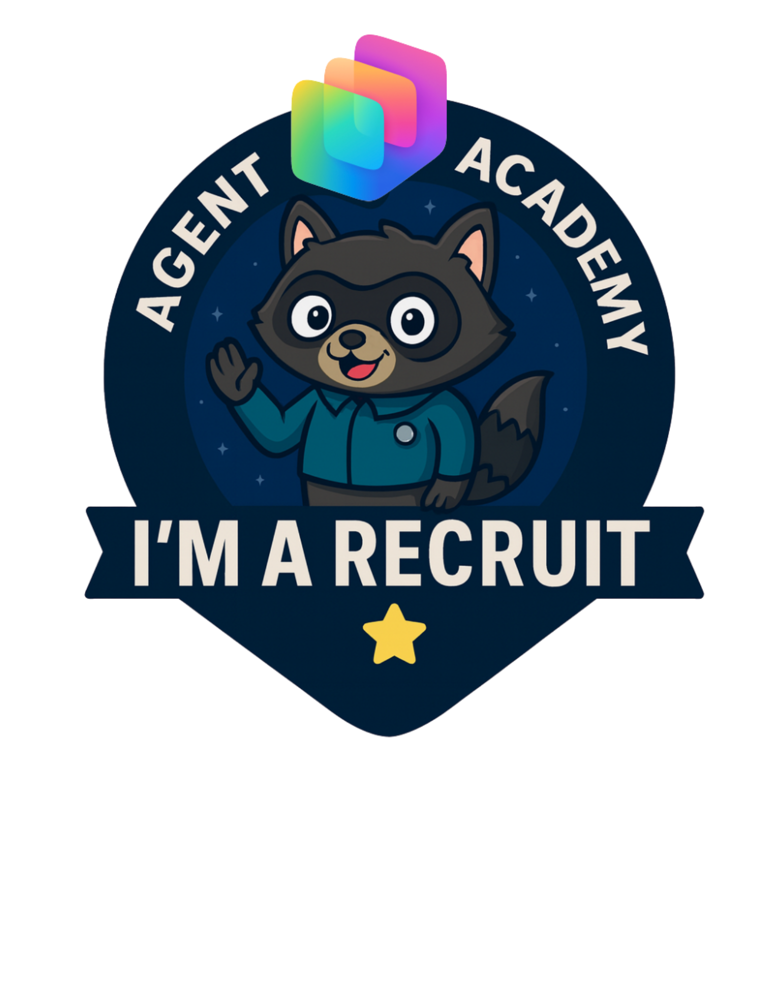

---
prev:
  text: Understanding Licensing
  link: /recruit/12-understanding-licensing
next:
  text: Operative Overview
  link: /operative
short-description: Claim your badge and mark your achievement!
difficulty: 1
codename: OPERATION COURSE COMPLETION
time: 5
harness: standard
tags:
  - completion
products:
  - copilot-studio
industries:
  - it
created-date: 2025-08-20
last-edited-date: 2026-03-27
---
# 🚨 Final Mission: Securing Your Recruit Badge {#final-mission-securing-your-recruit-badge}

<mission-meta />

## 🎯 Mission Brief {#mission-brief}

Welcome, Recruit. You’ve completed your training. Now it’s time to **make it official**.

This final mission verifies that:

- You completed the hands-on work
- Your solution runs in a real environment
- Your badge is issued accurately and fairly

## 🏅 Secure Your Recruit Badge {#secure-your-recruit-badge}

Every Agent Academy path, from **Recruit → Operative → Commander**, includes an official digital badge issued through the [Global AI Community](https://globalai.community/).

These badges are:

- Verifiable
- Shareable (LinkedIn, resumes, portfolios)
- Tied to real technical work, not just attendance

To ensure badges remain meaningful, we follow a **strict validation protocol**.

### 🧭 Submission Protocol {#submission-protocol}

Please follow **ALL steps exactly and in order**.  

### 1. ⭐ Star the Agent Academy GitHub Repo {#1-star-the-agent-academy-github-repo}

👉 **[Agent Academy GitHub Repo](https://github.com/microsoft/agent-academy)**

**Why this matters:**

- It helps others discover the Academy
- It signals active community engagement
- It directly supports continued investment in the project

Starring the repo is quick, free, and required for badge eligibility.

### 2. 🧾 Complete the Badge Validation Form {#2-complete-the-badge-validation-form}

👉 **[Badge Validation Form](https://aka.ms/agent-academy-recruit/form)**

This form:

- Asks questions about the Recruit path to ensure you completed the curriculum
- Collects feedback so we can continue to improve Agent Academy
- Ensures correct email to send the badge to
- Allows you to agree to receiving a badge through the Global AI Community

### 3. 🔐 Create & Log In to Your Global AI Community Account {#3-create-log-in-to-your-global-ai-community-account}

👉 **[Global AI Community Account Log In](https://globalai.community/auth/login)**

Badges are issued **through the Global AI Community platform**.

If you don’t have an account:

- Create one (for free) using the **same email** you used in your badge request form. Otherwise, your badge can’t be delivered

No account = no badge issuance (even with a valid submission).

> [!IMPORTANT]
> **Please ensure the emails match and that you enter your email correctly. Failure to do so will result in your badge not being delivered**
>

## 📡 Stay Mission-Ready {#stay-mission-ready}

🎖 Congratulations, Recruit.  
You didn’t just watch content, you *built something*.

Next up: **[Operative training](../../operative/)**.

## 📚 Tactical Resources {#tactical-resources}

Learn more about Power Platform Advocacy:

⚡ [Power Platform Advocacy Hub](https://aka.ms/power-advocates)

<analytics-tag section="recruit" mission="final-mission" />
