---
tags:
  - skills
  - generative-ai
difficulty: 2
time: 60
harness: github-copilot
description: >-
  Build a single marketing content agent powered by a series of focused Skills
  instead of one bloated instruction block — and watch the orchestrator load the
  right procedure on demand.
badge: ../assets/ghostwriter-badge.png
products:
  - copilot-studio
industries:
  - retail
created-date: 2026-07-23
last-edited-date: 2026-08-07
hide: false
---

# ✍️ Operation Ghostwriter: A Marketing Content Agent Built on Skills {#operation-ghostwriter}

<mission-meta />

<!-- markdownlint-disable-next-line MD033 -->
<p align="center">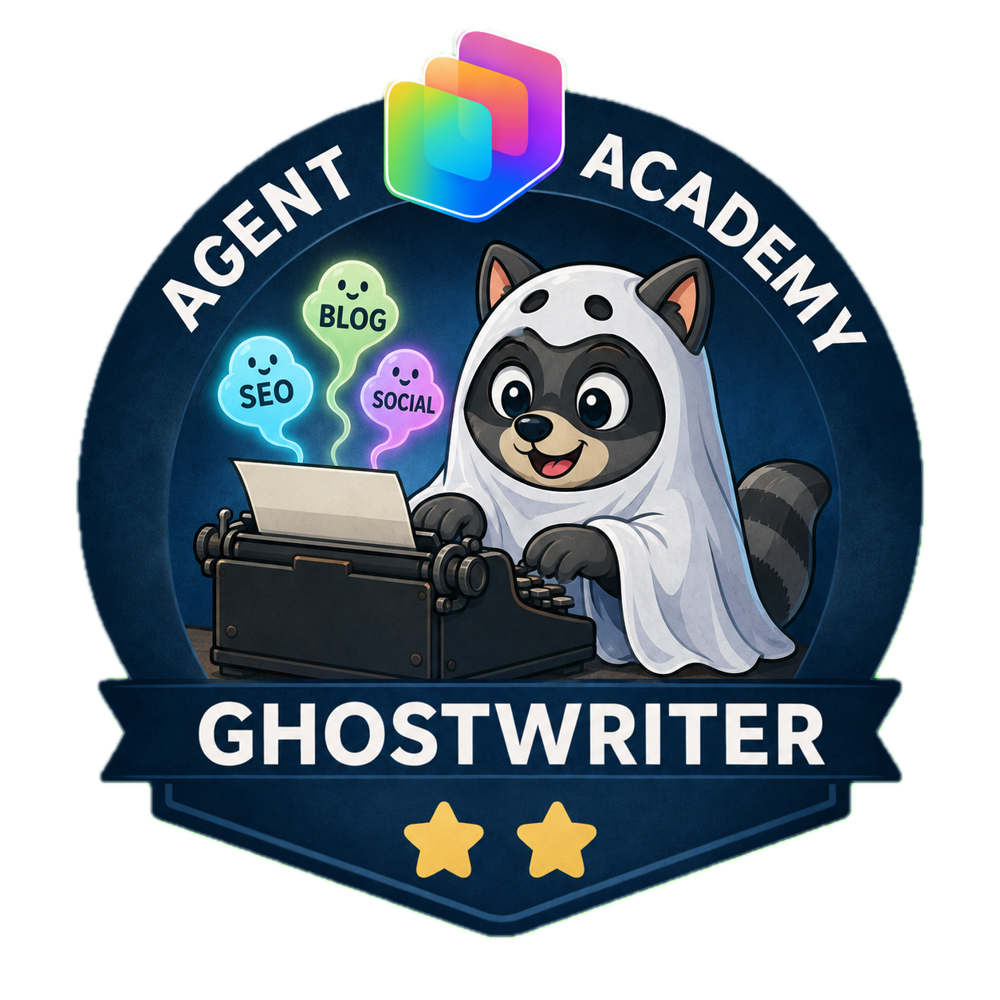</p>

Welcome, agent. Your mission is **Operation Ghostwriter**: build a marketing content agent **without** drowning it in a wall of instructions. You'll teach it four separate trade procedures using **Skills** and let the orchestrator reach for the right one on demand. One agent. A series of Skills. Zero bloat. ✍️🎯

> [!NOTE]
> This mission requires an agent powered by the **GitHub Copilot harness** in the new Copilot Studio experience. Skills aren't available to agents powered by the standard or Copilot Chat harness. Turn on **New experience** with the toggle in the upper-left of the home page before you start.

## 🎯 Mission objectives {#mission-objectives}

In this mission, you'll learn:

- How to separate always-on **Instructions** from on-demand **Skills**
- How to write routing metadata that helps the orchestrator select the right Skill
- How to create Skills from scratch, adapt existing Skills, and draft a Skill with AI
- How to test individual Skill boundaries and multi-Skill orchestration
- How Memory can apply a user's preferences across conversations

## 🔧 What You'll Build {#what-youll-build}

- A single **Marketing Content Agent** with lean, always-on Instructions
- Four core **Skills**: `draft-blog-post`, `seo-audit`, `repurpose-to-social`, and `brand-voice-check`
- An optional fifth Skill, `video-script`, created with AI in the stretch lab
- A working demonstration of the orchestrator activating and combining multiple Skills for one request

## ❓ What is a Skill? {#what-is-a-skill}

A **Skill** is a reusable capability available to agents powered by the GitHub Copilot harness. It defines a procedure in plain Markdown that the orchestrator can activate when a task needs it. A Skill has a **name** and **description** that act as routing metadata, plus instructions and optional supporting files that become relevant after the Skill is activated.

Your agent's **Instructions** are like its employee handbook, showing its purpose, how it should behave, and what it should and shouldn't do. In every conversation, the agent references its employee handbook (its Instructions) before responding. Those Instructions should be short, useful, and true in *every* conversation to avoid bloat.

A **Skill**, on the other hand, is like a laminated procedure card pulled off the wall only when *that* situation walks in the door. You don't tape all forty procedure cards to every employee's forehead. You hang them on the wall, label them clearly, and trust people to grab the right one.

This matters because everything you put into Instructions loads on **every** turn. A 1,500-word prompt that covers blog writing *and* SEO *and* social repurposing *and* brand voice makes the model weigh all four sets of rules on every request. This can lead to slower, more expensive, and often less accurate responses because irrelevant guidance competes for attention. Skills flip that: the model sees a short menu of what each Skill is *for* and loads the full procedure only when it picks one.

> [!NOTE]
> A Skill guides behavior. It's a procedure, not a fact store. If the agent needs *facts* (your product catalog or pricing), those belong in **Knowledge**, not a Skill. If it needs to *do* something external (such as post to a CMS), that belongs in a **Tool**. A Skill is the "how we do this here" playbook.

### 🗝️ Key Terms {#key-terms}

| Term | Definition |
| --- | --- |
| **Instructions** | Global behavior loaded on every turn. What is true in *every* conversation. |
| **Skill** | A reusable procedure loaded on demand. What is true only *sometimes*. |
| **Routing metadata** | The `name` + `description` of a Skill. This is how the orchestrator decides whether to reach for it. |
| **Skill file** | A Markdown file that holds a Skill's metadata, instructions, and examples. A ZIP package must contain this file under the name `SKILL.md`. |
| **On-demand loading** | The orchestrator loads a Skill's full body only when a task matches its description. |

### Instructions vs. a Series of Skills {#instructions-vs-skills}

Let's take a look at two options to build an agent. One with a long set of instructions and another utilizing skills.

#### Option A — one long instruction that does everything

Every procedure is written inline, and all of it loads on every turn:

```text
You are Fabrikam Fitness's marketing content assistant.

When the user asks for a blog post: write 600–900 words with a hook in the first
two sentences, three or four descriptive subheads, lead with the customer benefit
before the product detail, and close with one call to action. Return markdown with
a suggested title.

When the user asks for an SEO check: verify the title tag is under 60 characters
and leads with the primary keyword; propose a 140–160 character meta description if
missing; confirm there is one H1 with keywords in at least one H2; check the primary
keyword appears in the first 100 words without stuffing. Return a checklist with fixes.

When the user asks for social posts: produce a LinkedIn version (~1,300 characters,
story hook, three takeaways, CTA), an X version (≤280 characters, one hashtag), and
an Instagram caption (punchy first line, 3–5 hashtags). Rewrite for each channel,
never truncate.

When the user asks about voice: energetic, confident, never salesy; short sentences;
plain words; no jargon like "synergy" or "leverage"; second person, active voice.
Return a verdict plus the top three fixes.
```

This should technically work, but the model reads all four procedures on every single turn, even when the user only says "make this shorter." The SEO rules are competing for attention while someone is asking about social. And the day the LinkedIn character count changes, you edit this wall of text and re-test all four jobs to make sure you didn't break the others.

#### Option B — a narrow instruction that only routes, plus Skills that hold the detail

The agent's instruction shrinks to a switchboard:

```text
You are Fabrikam Fitness's marketing content assistant. Be concise, energetic,
and never salesy. Route each request to the right skill.
```

> [!NOTE]
> The modern orchestrator can match a request to a Skill from that Skill's own description, so you don't have to spell out the skill routing in the instructions.

## ⚙️ Prerequisites {#prerequisites}

- A **Microsoft Copilot Studio** environment with the **new experience** enabled — [copilotstudio.microsoft.com](https://copilotstudio.microsoft.com). If you don't have an account, check out the [course setup](https://microsoft.github.io/agent-academy/recruit/00-course-setup/) instructions for a free trial.
- An agent powered by the **GitHub Copilot harness**. Turn on **New experience**, create or open an agent, and confirm that **Skills** appears on the **Build** tab. If it doesn't appear, contact your administrator to confirm that the harness is available in your environment.
- A Markdown editor of your choice

> [!IMPORTANT]
> The GitHub Copilot harness uses usage-based billing. Building, testing in Preview, evaluating, and using the agent might consume **Copilot Credits**. Review the [Copilot Credits billing overview](https://learn.microsoft.com/microsoft-copilot-studio/agents-experience/billing-credit-overview) before you begin.

## 🏢 The Scenario {#the-scenario}

**Fabrikam Fitness** is a direct-to-consumer athletic apparel brand. Their two-person marketing team ships a product update almost every week and is buried in the busywork around each one: turning release notes into a blog post, sanity-checking it for SEO, cutting it down into social posts, and making sure everything sounds like Fabrikam. They want **one agent** that handles all four jobs, but the first draft of that agent was a single monster prompt that was slow, ignored half its own rules, and was impossible to maintain. You've been brought in to rebuild it the modern way: lean Instructions and a series of Skills.

## 🧬 Anatomy of a Skill {#anatomy-of-a-skill}

Before you build one, let's look at what a Skill actually *is*. Under the hood, a Skill is plain Markdown with a small block of YAML at the top. You can upload a standalone `.md` file. If you package a Skill and supporting files in a ZIP file, the main file must be named `SKILL.md`. The format has two parts:

```markdown
---
name: seo-audit
description: Use when the user asks to check or improve the SEO of a draft — title
  tags, meta description, keywords, headings. Do NOT use to write new content.
---

# SEO audit for Fabrikam content

Given a piece of content, review and report on:

1. Title tag: under 60 characters and leads with the primary keyword?
2. Meta description: 140–160 characters?
3. ...the rest of the procedure...
```

**The front matter (between the `---` lines) is the routing metadata.** When evaluating which Skill to activate, the orchestrator uses the `name` and `description` to decide whether the Skill matches the request. Think of it as the label on a filing cabinet drawer: the orchestrator reads the label to decide which drawer to open. That's why the `description` is the single most important line in the whole file. You should write it as **"use when… / do NOT use for…"**, not as a vague "helps with content." Use only lowercase letters, numbers, and hyphens for the `name`, and don't start or end it with a hyphen. Keep it short and action-oriented (`draft-blog-post`, `seo-audit`) because it's a handle, not a sentence.

**Everything below the front matter is the body** which is the actual procedure, plus any examples. These instructions guide the agent after the orchestrator activates the Skill. Keep the procedure focused and include only the steps, constraints, examples, and relevant tool references needed for that task.

When you add a Skill in Copilot Studio, those two parts map cleanly onto the three fields in the dialog:

| In the `SKILL.md`           | In the Copilot Studio dialog | When it's seen            |
| --------------------------- | ---------------------------- | ------------------------- |
| YAML `name`                 | **Name** field               | Always (routing metadata) |
| YAML `description`          | **Description** field        | Always (routing metadata) |
| Body below the front matter | **Instructions** field       | Only when the Skill fires |

Keep this picture in your head of name, description, body, because every method below produces this exact same file. The only thing that changes is *who writes it*.

## 🏗️ Three Ways to Build a Skill {#build-a-skill}

The anatomy of a skill never changes, so the real question is where the words come from. You have three options, and they trade off effort for control.

### ✍️ 1. From scratch {#build-from-scratch}

Open a blank file and write every line yourself, the name, description, and the full procedure. This gives you total control and a deep understanding of the format. But it's the slowest path, and for most real work it's overkill: you're hand-writing a procedure that someone, somewhere, has probably already written a better version of. Great for learning and for genuinely novel procedures; not how you'll spend most of your time.

### 📋 2. From an example {#build-from-example}

A Skill is portable Markdown, so you rarely have to start from a blank page. Community libraries like [skills.sh](https://www.skills.sh/) contain contributed procedures for copywriting, SEO, cold email, content strategy, and other tasks. Use them as starting points: review every line, verify the behavior, and adapt the name, `description`, and procedure to fit your scenario before you upload the file.

> [!WARNING]
> Treat any Skill you didn't write as **untrusted code**. A Skill steers your agent's behavior, so read every line before you add it, the same way you'd review a pull request. Never paste one in blind.

### 🤖 3. With AI {#build-with-ai}

This is the one most people miss, and it's often the best of the three. Because a Skill is just structured markdown, modern AI assistants are excellent at writing them. You describe what you need in plain language and let the model produce a high-quality `SKILL.md`, front matter and all. A few ways to do it:

- **A general-purpose assistant** — Microsoft Copilot, ChatGPT, or Claude. Prompt it with something like *"Write a SKILL.md for a Copilot Studio agent that audits blog posts for SEO. Include YAML front matter with a `name` and a `description` written as 'use when… / do NOT use for…', then the procedure as markdown."*
- **An agent workspace like Copilot Cowork**, where you can iterate on the file across turns, have it critiqued, and export clean markdown ready to upload.
- **The Preview pane of the very agent you're building.** Your Copilot Studio agent is itself a capable model so you can ask it *in Preview* to draft a skill, then copy the output into a new Skill. The engine that runs your Skills can also help write them.

Then save the AI's draft as a `.md` file and upload it. The same trick supercharges option 2: find a Skill on skills.sh (or another Skill-sharing site), paste it into one of these tools, and say *"adapt this for a direct-to-consumer athletic apparel brand and tighten the description."* You get a tailored first draft in seconds, ready for your review and testing.

> [!WARNING]
> AI-authored Skills get the same rule as borrowed ones: **read every line before you trust it.** The model gives you a fast first draft, not a finished product you rubber-stamp. You are the reviewer.

## 🚪 Two Ways to Get a Skill Into Copilot Studio {#add-a-skill}

However you authored the content, it enters your agent through one of **two doors** in the **Add skill** dialog:

- **Create from blank** — type or paste the `name`, `description`, and instructions straight into the form. Best when you're writing from scratch or pasting a short Skill.
- **Upload a skill** — drag in a finished Markdown Skill file and Copilot Studio fills the three fields for you. Best when you already *have* a file, from an example, from AI, or from a teammate.

## 🧪 Lab 1.1: Create the agent with lean instructions {#lab-11-create-the-agent}

You'll start by building the agent shell with *only* the instructions that are true in every conversation. Resist the urge to describe blog rules, SEO rules, or anything task-specific here.

1. Navigate to [Microsoft Copilot Studio](https://copilotstudio.microsoft.com) and sign in. Make sure the **New experience** toggle at the top of the home page is turned on.

1. On the home page, select **Agent**.

    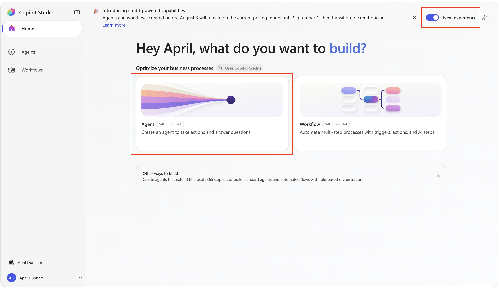

1. You'll land directly in the agent's **Build** editor. Select the **Name your agent** field and copy and paste the following as the **Name**:

    ```text
    Fabrikam Content Agent
    ```

1. Select the **Instructions** field and copy and paste only the global behavior:

    ```text
    You are Fabrikam Fitness's marketing content assistant.
    You help the marketing team turn product updates into on-brand content.
    Be concise, energetic, and never salesy. When a request matches one of your
    skills, use that skill. Ask a clarifying question only if the request is
    genuinely ambiguous.
    ```

    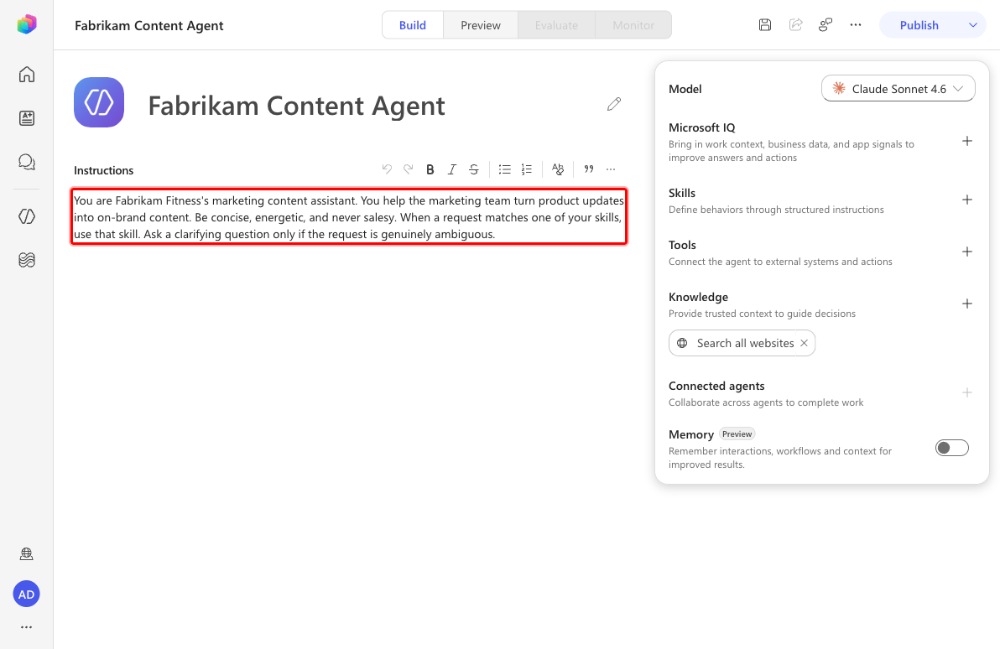

1. Select **Save** in the top command bar.

> [!WARNING]
> Notice what is **not** here: no word counts, no SEO checklist, no brand-voice rules. Those are procedures. They belong in Skills. If you feel the urge to paste a checklist into Instructions, that is your signal to make a Skill instead.

## 🧪 Lab 1.2: Build the `draft-blog-post` Skill from scratch {#lab-12-draft-blog-post}

We'll explore multiple ways to build and integrate Skills in our Copilot Studio agents, starting with one built from scratch. One key task for our marketing content agent is drafting blog posts, so we'll create a focused copywriting Skill.

1. In the **Build** editor, find the **Skills** card in the configuration panel on the right and select **Add skill**.

    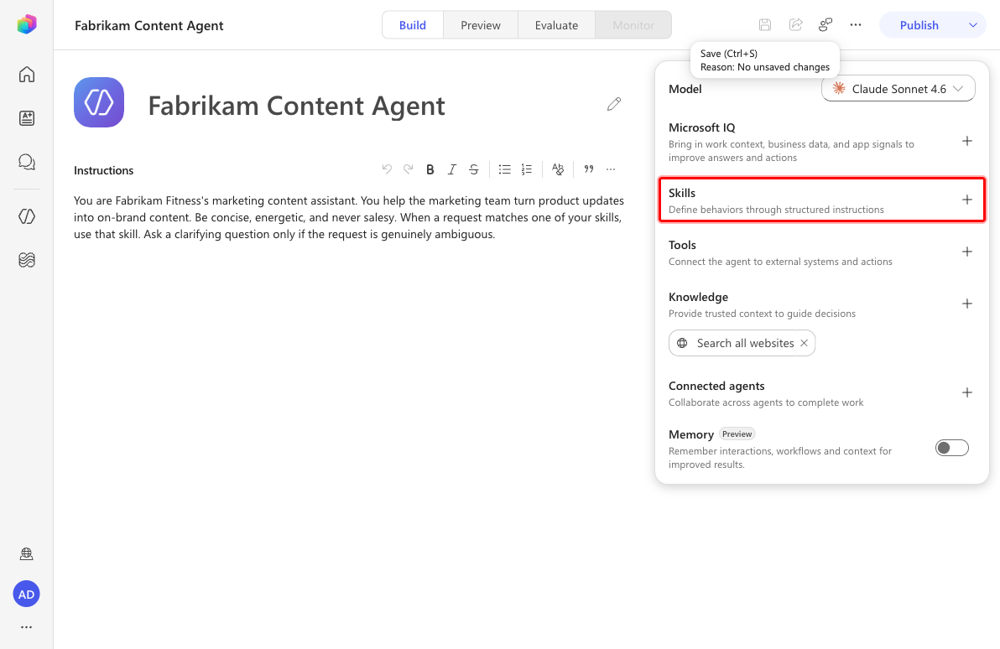

1. The **Add skill** dialog offers two methods: **Upload a skill** (drag in a Markdown Skill file) and **Create from blank** (fill in the fields directly). Select **Create from blank**.

    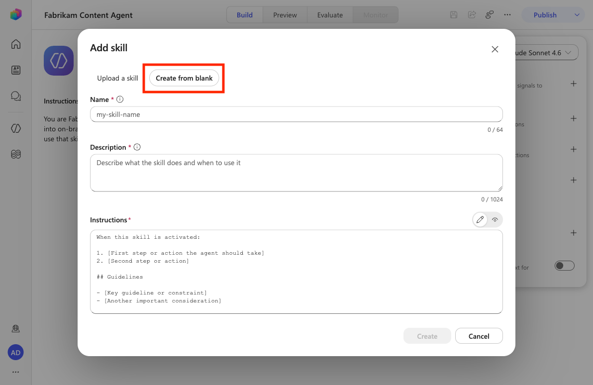

1. Fill in the fields with the inputs below:

    Copy and paste the following as the **Name**:

    ```text
    draft-blog-post
    ```

    Copy and paste the following as the **Description**:

    ```text
    Use when the user wants to turn product notes, a changelog, or a raw idea into a full blog post or article. Do NOT use for social posts, SEO checks, or pure editing — those have their own skills.
    ```

    Copy and paste the following as the **Instructions**:

    ```markdown
    # Draft a Fabrikam blog post

    When drafting a blog post from the provided source material:

    1. Open with a hook in the first two sentences — a customer pain or a bold claim.
    2. Target 600–900 words with three or four descriptive subheads.
    3. Lead with the customer benefit before any product detail.
    4. Close with one clear call to action.
    5. Return the draft in markdown with a suggested title and the subheads as `##`.

    ## Example
    Input: "New Trailburst running shorts — 4-way stretch, hidden zip pocket, launches Friday."
    Output: a titled post opening on the frustration of pockets that bounce, three
    subheads (Move Freely, Carry What Matters, Get Yours Friday), and a CTA.
    ```

1. Select **Create** to add the Skill

    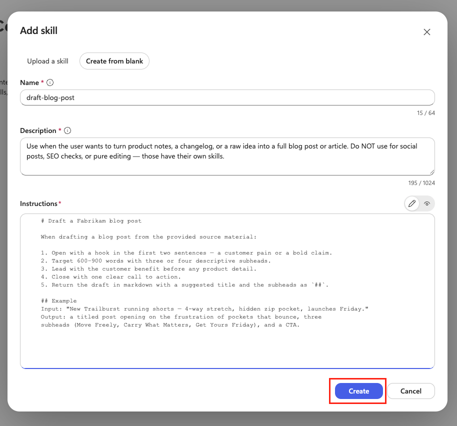

> [!TIP]
> A general best practice when building agents is to test early and often as you add new features. The testing steps for this will be at the end but you could also test now before moving on.

## 🧪 Lab 1.3: Build the `seo-audit` Skill from an example {#lab-13-seo-audit}

In this lab, you'll review and upload an existing Skill file instead of writing one from scratch. This pattern lets you reuse a trusted procedure while keeping it easy to inspect and maintain.

Download the three prepared Skill files before continuing:

<action-button href="https://download-directory.github.io/?url=https://github.com/microsoft/agent-academy/tree/main/docs/special-ops/ghostwriter/assets/skills&filename=ghostwriter-skills" label="Download the prepared Skill files" icon="📦" />

1. Extract the downloaded ZIP file, then open and review [`seo-audit.md`](./assets/skills/seo-audit.md).

    > [!WARNING]
    > Before you upload *any* Skill, read it. Open `seo-audit.md` and skim every line. A Skill steers your agent's behavior, so you review it the way you'd review a pull request. (This one is safe; the habit is the point.)

1. Back on the **Build** tab, find the **Skills** card and select the **plus button**.

    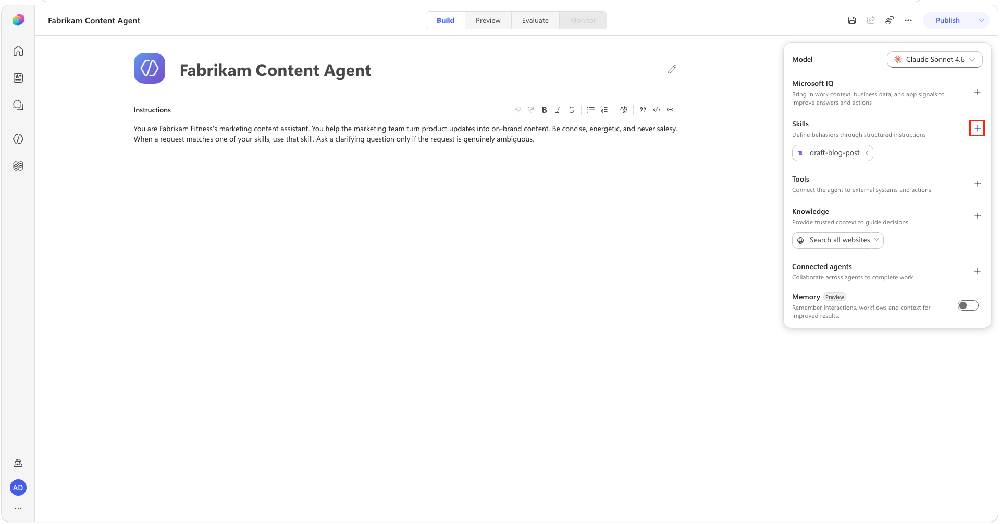

1. This time we will choose the **Upload a skill** option.

    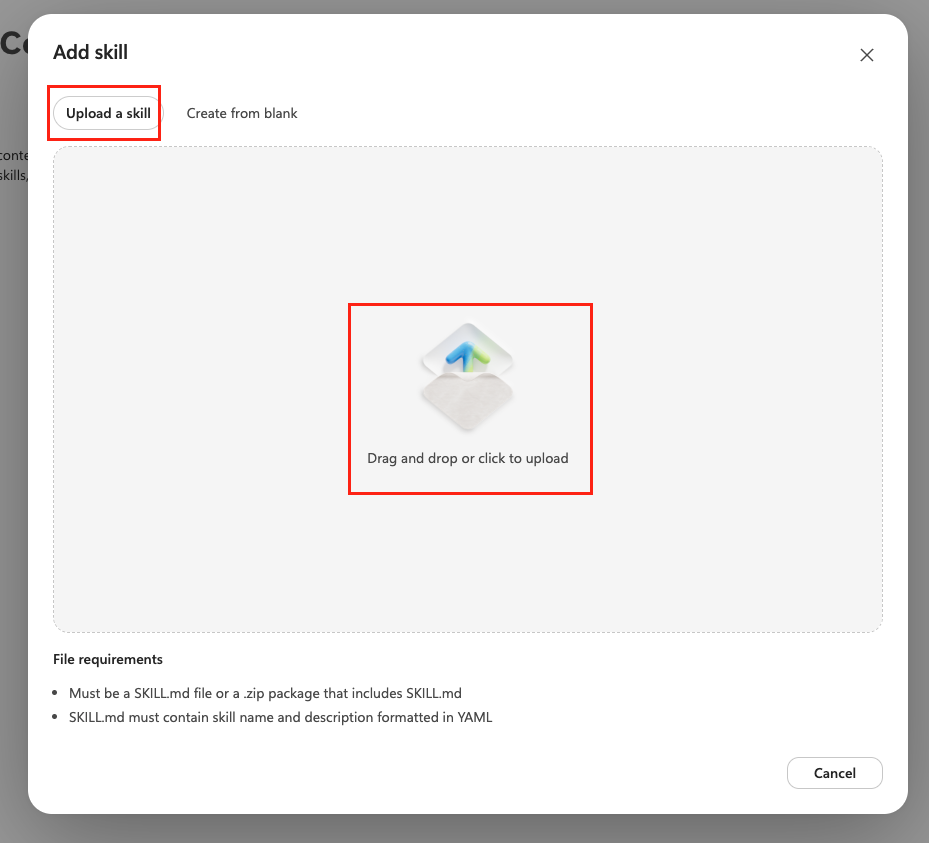

1. Drag `seo-audit.md` into the upload area (or browse to it). Copilot Studio reads the file and fills in the **Name**, **Description**, and **Instructions** for you. The YAML `name` and `description` become the routing metadata, and everything below the front matter becomes the Instructions. Select the `seo-audit` pill under **Skills** to review the result.

## 🧪 Lab 1.4: Build the `repurpose-to-social` Skill {#lab-14-repurpose-to-social}

Next, you'll repeat the upload pattern with a Skill that adapts long-form content for individual social channels.

1. Open `repurpose-to-social.md` from the extracted Skill files and give it a quick read. You can also [preview the file](./assets/skills/repurpose-to-social.md) online.

1. Select **Add skill → Upload a skill**.
1. Drag `repurpose-to-social.md` into the upload area. Select it from the **Skills** section and confirm that all properties mapped correctly.

    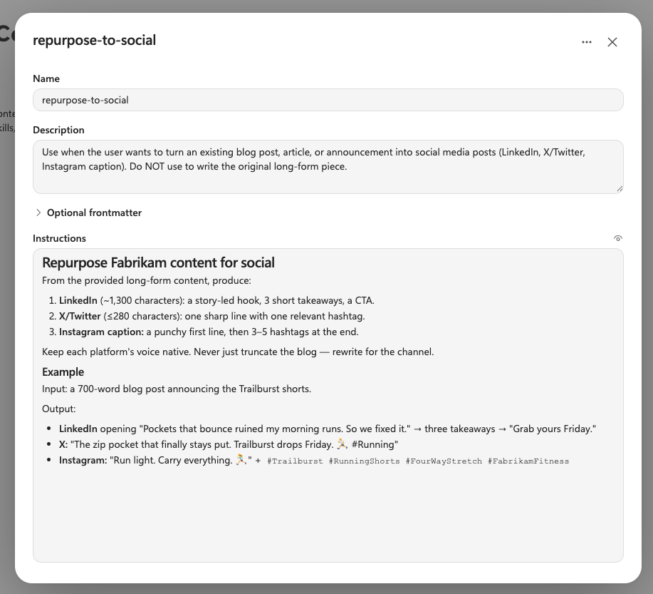

## 🧪 Lab 1.5: Build the `brand-voice-check` Skill {#lab-15-brand-voice-check}

Complete the agent's core Skill set by adding a reusable brand-voice review procedure.

1. Open `brand-voice-check.md` from the extracted Skill files and read it. You can also [preview the file](./assets/skills/brand-voice-check.md) online.

1. Select **Add skill → Upload a skill**.
1. Drag `brand-voice-check.md` into the upload area. Select it from the **Skills** section and confirm that all properties mapped correctly.

    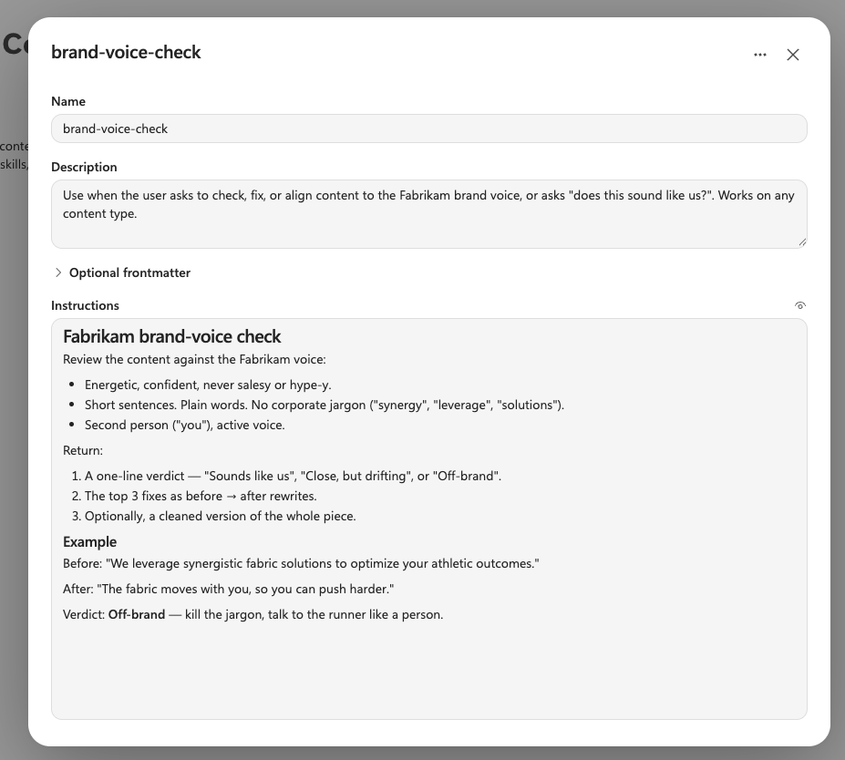

## 🧪 Lab 1.6: Test Multi-Skill Orchestration {#lab-16-prove-it}

This is the payoff. You'll give the agent one composite request and observe how the orchestrator activates and combines multiple Skills to produce one result.

1. Select the **Preview** tab at the top of your agent.

    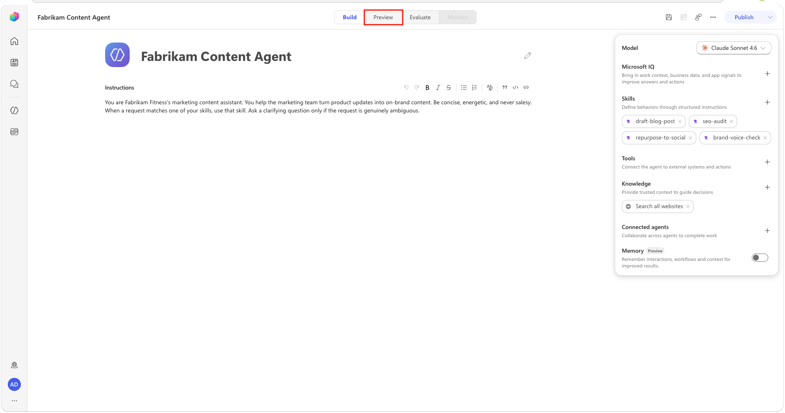

1. Copy and paste the following prompt and press **Enter**:

    ```text
    Create a complete launch content package from these product notes:

    Trailburst running shorts have four-way stretch, a hidden zip pocket,
    and launch this Friday.

    Produce a publish-ready blog post, audit its SEO, document the checks and
    recommended fixes, apply appropriate improvements, adapt the final post for
    LinkedIn and X, and ensure every deliverable follows the Fabrikam brand voice.
    ```

    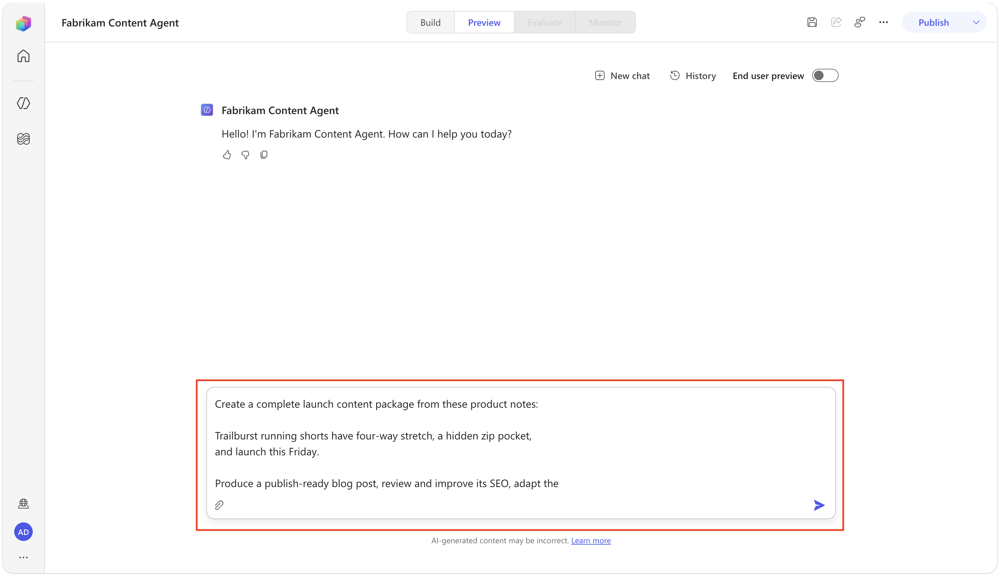

1. Review the activity trace. For this composite request, the expected result is for the agent to load all four Skills: `draft-blog-post`, `seo-audit`, `repurpose-to-social`, and `brand-voice-check`.

    The order can vary because the orchestrator plans the work dynamically. If one is missing, confirm that all four Skills are attached, review their descriptions, start a new chat, and retry with the same request. The exact plan and output can vary between runs.

    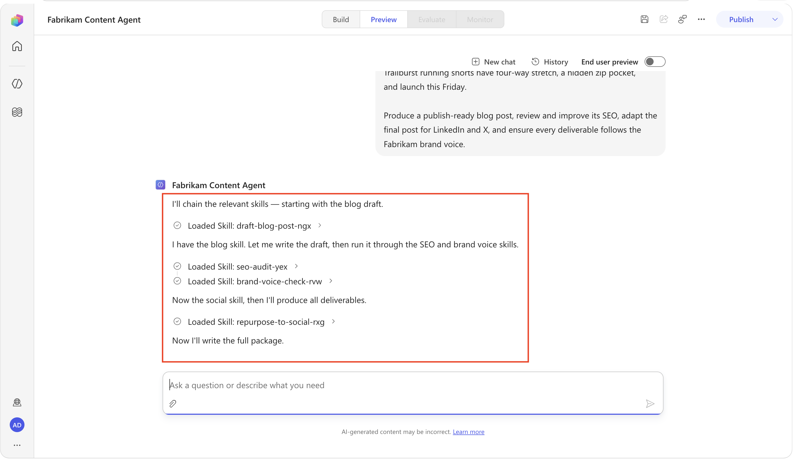

1. Review the response. It might provide a Markdown file or render the artifacts directly in the chat. If it creates a file, select the file to review it.

    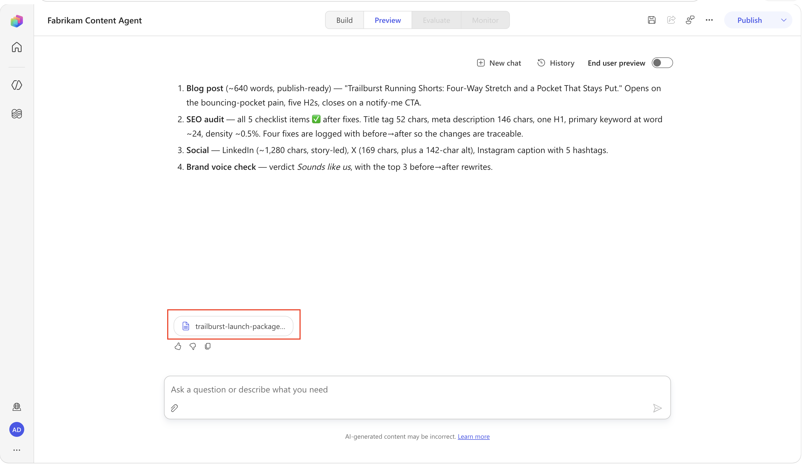

1. Review the file and confirm it includes:

    - The completed blog post
    - An SEO audit showing each check, what it found, and any fixes applied
    - LinkedIn and X posts adapted from the final blog post
    - A Fabrikam brand-voice review

    If a deliverable is missing, confirm that all four Skills are attached on the **Build** tab. Start a new Preview chat and retry the request.

    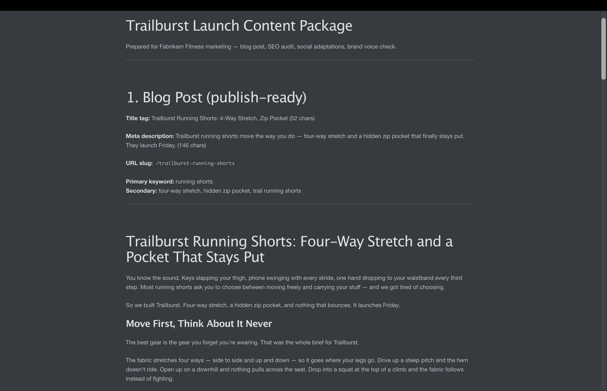

    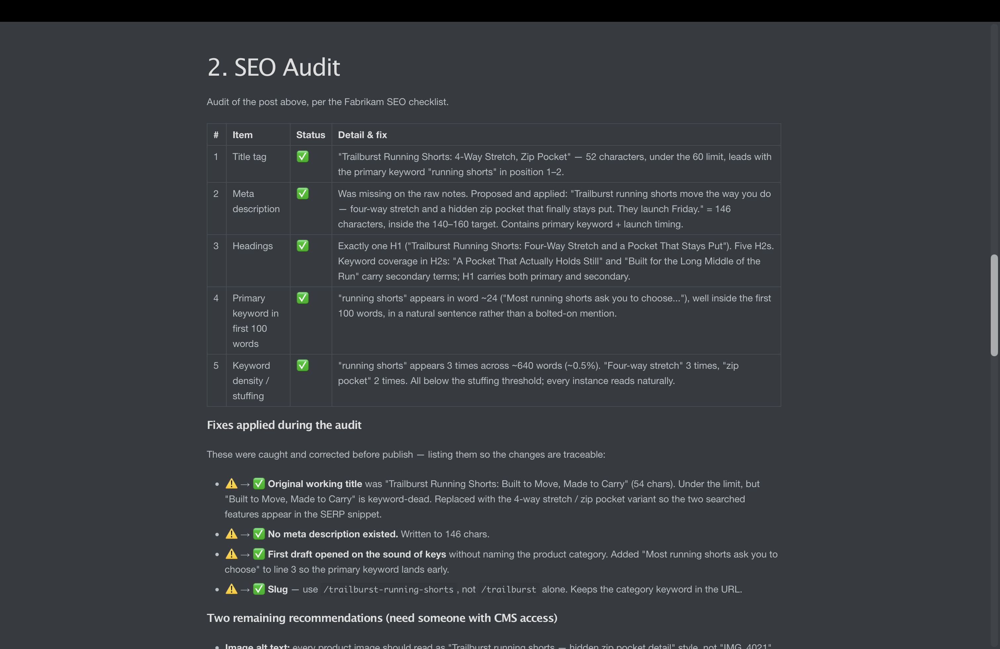

### Test Skill boundaries {#test-skill-boundaries}

A good Skill description helps the orchestrator decide when to activate a Skill and when to leave it on the shelf. Test both sides of that boundary before you consider the routing finished.

1. In **Preview**, select **New chat** so the previous request doesn't influence this test.

    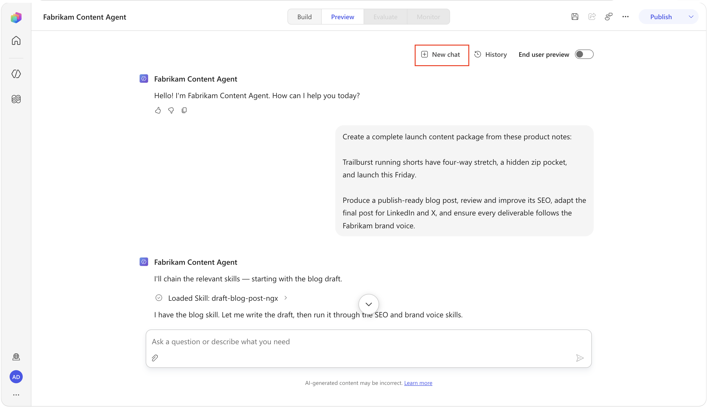

1. Enter the following request:

    ```text
    Suggest five names for a new Fabrikam trail-running shoe.
    ```

    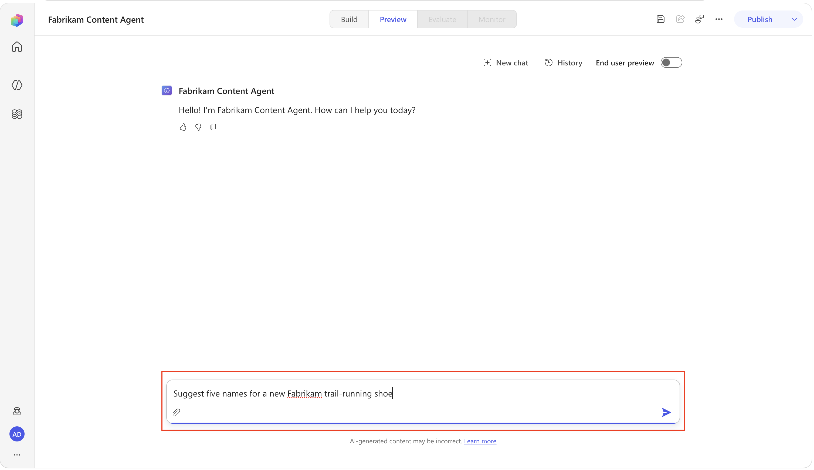

1. Review the response. None of the four Skills should activate because naming a product isn't one of their defined jobs. The agent can respond using its general Instructions.

    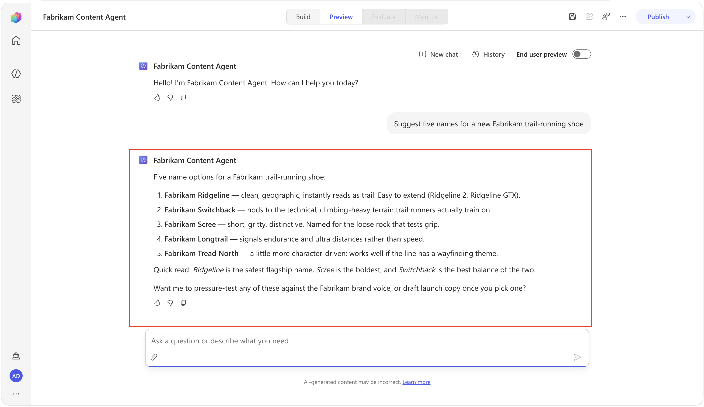

> [!TIP]
> If an unrelated Skill activates, revise its **Description** to state more clearly when it should and shouldn't be used. Start a new chat and repeat the same test until the activity trace shows the intended routing. Skill quality depends as much on staying inactive for the wrong request as activating for the right one.

Imagine maintaining this as one 1,500-word prompt. Changing the LinkedIn character count would mean editing a wall of unrelated text and re-testing everything. With Skills, you open `repurpose-to-social`, change one line, and the other three procedures are untouched. That is the maintainability win.

> [!TIP]
> If a Skill fires when it shouldn't (or fails to fire), the fix is almost always the **description**, not the instructions inside it. Tighten the "use when… / do NOT use for…" language and test again. Routing is a description problem.

## 🧪 Lab 1.7 (Optional): Build a Skill with AI {#lab-17-stretch}

You've authored Skills from scratch and from examples. The third (and often best) way to author skills is to let AI draft them for you. A Skill is just portable markdown, so a model is perfectly capable of writing them for you. With this approach your job shifts from *author* to *editor*.

One of the things that our marketing content agent is missing is the ability to help write on-brand video scripts for our promotional content. Let's see how we can create a custom skill for that directly inside our Copilot Studio agent.

1. Navigate to the **Preview** tab of your agent. If you have an existing conversation, select **New chat** to start a fresh chat.

1. Enter the following prompt in the chat, then press **Enter**:

    ````text
    Write a Skill file (a SKILL.md) for a Microsoft Copilot Studio agent.

    About the agent:
    The agent is the Fabrikam Content Agent for Fabrikam Fitness, an athletic
    apparel brand that sells directly to consumers. Its voice is energetic and
    confident, never salesy: short sentences, plain words, second person, and no
    corporate jargon.

    It already has these Skills, so the new one must not overlap with them:
    draft-blog-post, seo-audit, repurpose-to-social (writes social captions), and
    brand-voice-check.

    What to build:
    A Skill named video-script that turns product notes into a video script. It
    handles two formats and picks based on what the user asks for.

    1. Short-form (TikTok, Reels, or YouTube Shorts, about 15 to 55 seconds):
       a strong hook in the first 2 seconds, a shot-by-shot flow, on-screen text
       cues, a spoken line for each shot, and one call to action.
    2. Long-form (YouTube, about 4 to 8 minutes): a hook intro, 3 to 5 titled
       segments, B-roll and shot ideas for each segment, a spoken script or
       talking points, and a closing call to action to subscribe and shop.

    If the user does not say which format they want, ask once, then default to
    short-form.

    How to format the answer:
    Give one SKILL.md file inside a single markdown code block, with two parts.

    1. YAML front matter at the top with two fields:
       name: a short lowercase handle with dashes, for example video-script.
       description: one or two sentences that say when to use the Skill and when
       not to. Make it specific enough that the agent picks this Skill instead of
       repurpose-to-social, since that one writes captions, not scripts.
    2. A body below the front matter with a short title, a numbered set of steps
       that first decides short-form or long-form and then lists the rules for
       each, and an Example section showing one short-form script and one
       long-form script.

    Keep everything in the Fabrikam voice. Use real numbers and clear structure.
    Reply with only the SKILL.md code block and nothing else.
    ````

    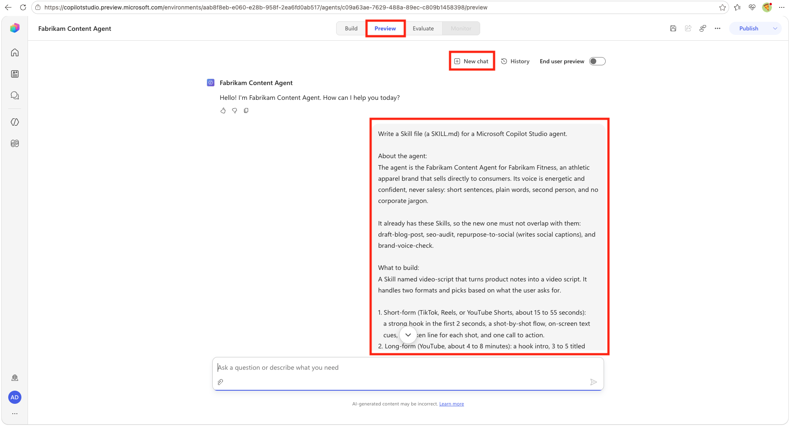

1. **Review the provided Markdown.** Ensure that it's safe and accurate, then make any necessary changes. Select the **Copy** icon in the upper-right corner.

    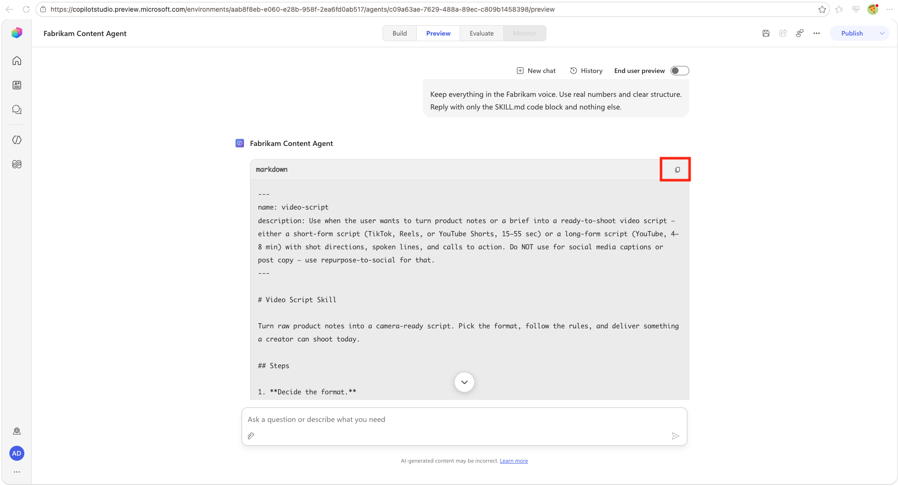

> [!NOTE]
> Your Skill response will look different because AI-generated output varies each time.

1. Select the **Build** tab to go back to your agent configuration.

    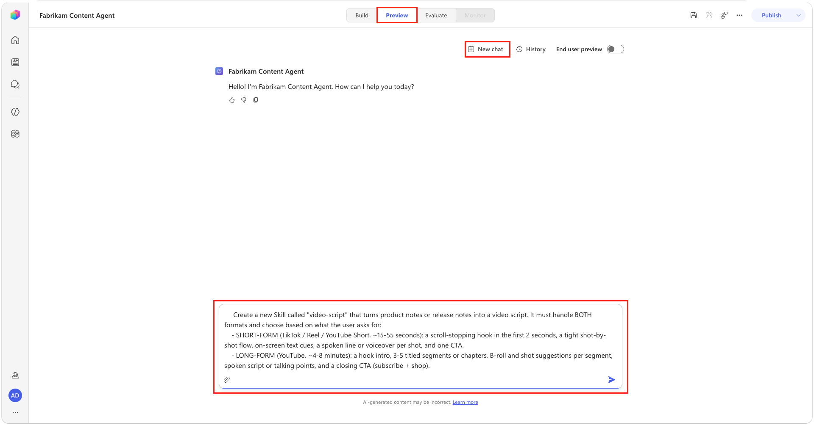

1. Select the **plus button** next to **Skills**.

    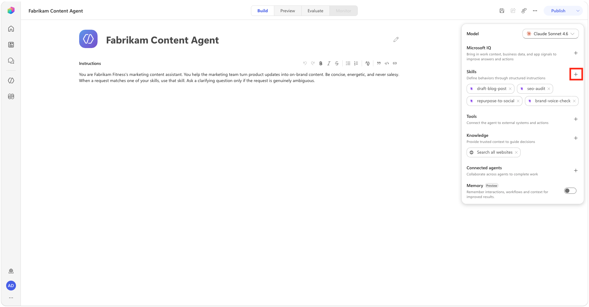

1. Select **Create from blank**. Fill in the **Name**, **Description**, and **Instructions** according to the Markdown file created in the previous step, then select **Create**.

    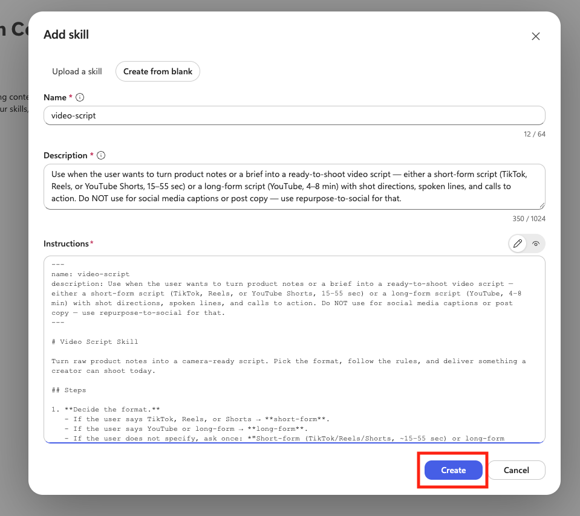

1. Go back to the **Preview** tab. Select **New Chat** to start a new test session. Type the following text and press **Enter**:

    ```text
    Help me write a script for a short-form video about the launch of our new Trailburst running shorts with 4-way stretch and a hidden zip pocket. They launch Friday.
    ```

    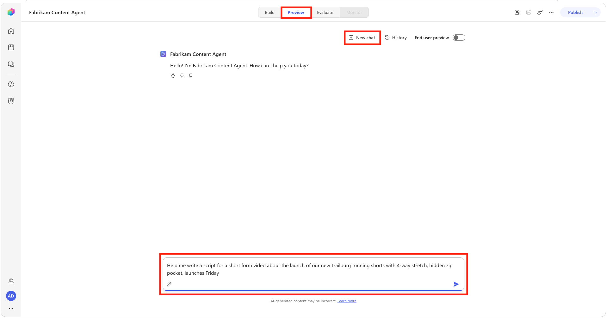

1. Review the response, making sure it calls the video-script skill and produces a good script.

    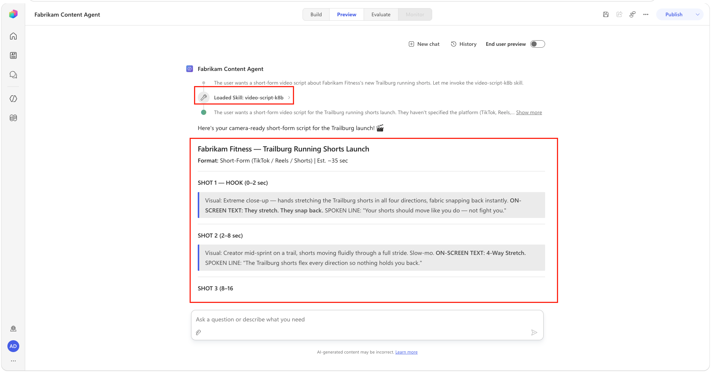

## 🧠 Bonus: Personalize the agent with Memory {#bonus-memory}

Memory lets the agent retain useful preferences for an individual user across conversations. It isn't a replacement for Instructions, Knowledge, or Skills, and shared brand rules still belong in those maker-managed components.

> [!IMPORTANT]
> Memory is a preview capability for agents powered by the GitHub Copilot harness and is subject to change. Each agent maintains a separate memory for each user. Memories are private to that user, and makers and other users can't view them. The system deletes a user's memories for an agent after 28 days without interaction. Memory is disabled in group chats and Microsoft Teams channels. Turning Memory off prevents the agent from using stored memories but doesn't delete them. Using a memory-enabled agent might consume Copilot Credits.

1. Open the agent's **Build** tab.
1. Turn on **Memory** in the components panel.

    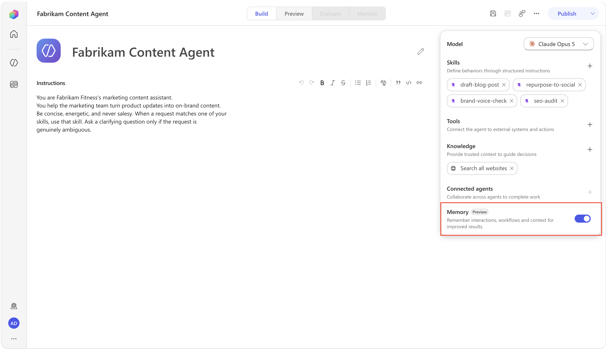

1. Open **Preview**, then select **New chat**. You'll see a message letting you know memories are enabled. Copy and paste the following prompt and press **Enter**:

    ```text
    Remember that I prefer LinkedIn posts under 700 characters, with no emoji and one direct call to action.
    ```

    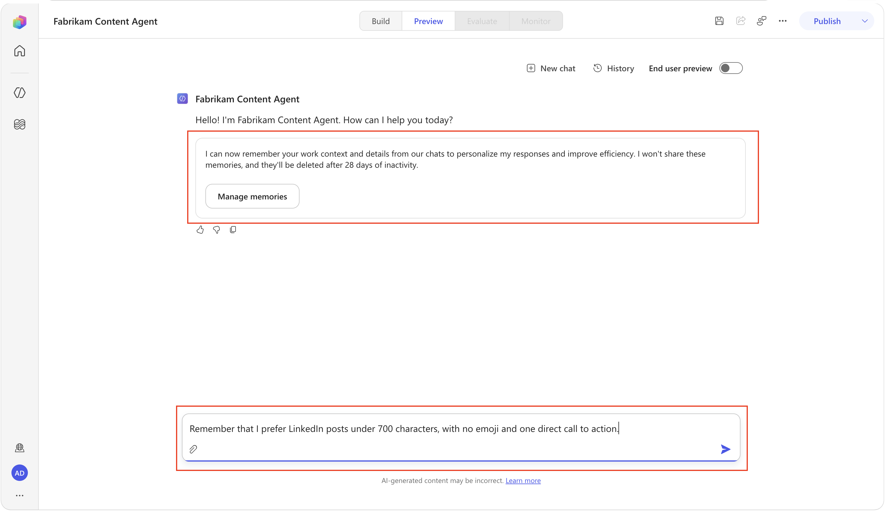

1. The agent will respond with confirmation that it saved the memory.

    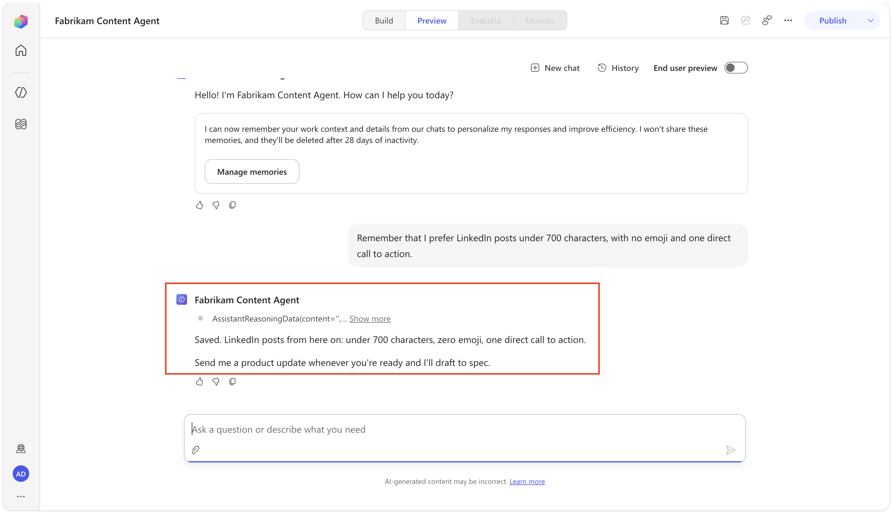

1. Start a new chat. Copy and paste the following prompt to request the agent to create a new LinkedIn post to test the memory:

    ```text
    Create a LinkedIn post about a new purple colorway for our Trailburst running shorts with four-way stretch and a hidden zip pocket. They launch Friday.
    ```

    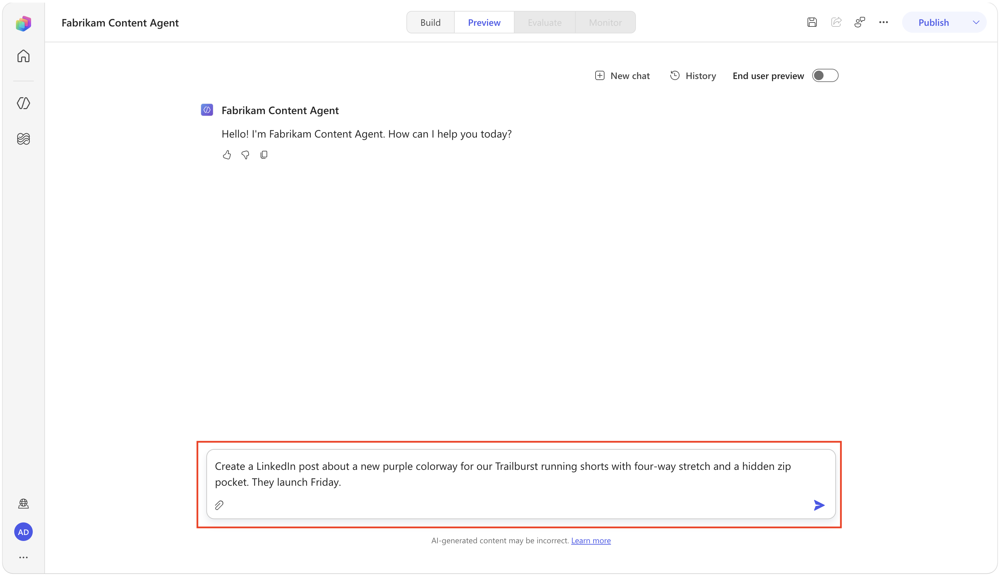

1. Confirm that the response activates the `brand-voice-check` Skill and applies your saved preference: fewer than 700 characters, no emoji, and one direct call to action.

    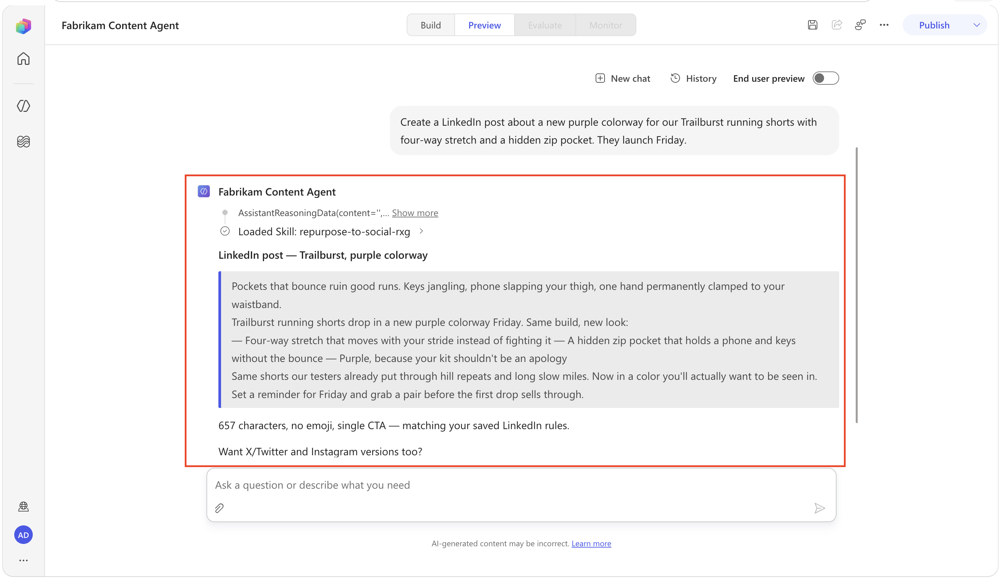

1. Ask the agent to show what it remembers about you:

    ```text
    What do you remember about my content preferences?
    ```

1. Confirm that the response includes your LinkedIn preference. Then remove it to complete the memory lifecycle:

    ```text
    Forget my LinkedIn content preferences.
    ```

    You can update or delete a specific memory in chat. To review or clear all memories, open the memory portal from the link the agent provides in a memory-enabled conversation.

## ✅ Mission Accomplished {#mission-accomplished}

Congrats, agent, **Operation Ghostwriter** is complete! You built a real marketing content agent the modern way — lean Instructions, a series of focused Skills, and an orchestrator that reaches for the right one on demand.

In this mission, you accomplished:

- ✅ **Instructions vs. Skills**: You know what belongs in always-on Instructions versus an on-demand Skill.
- ✅ **Routing metadata**: You can write `name` + `description` that make a Skill fire exactly when it should.
- ✅ **Multi-Skill orchestration**: You built four focused Skills instead of one bloated prompt and saw the orchestrator combine them for one composite request.
- ✅ **Borrow and adapt**: You know how to lift a procedure from the community and harden it before trusting it.
- ✅ **Personal preferences with Memory**: In the optional bonus, you saved, reused, reviewed, and removed a user-specific preference.

## 🏅 Claim your completion badge {#claim-your-completion-badge}

<!-- markdownlint-disable-next-line MD033 -->
<p align="center"></p>

Congrats, agent, mission accomplished! Now it's time to claim your badge.

Simply submit the badge request form and answer all required questions:

[https://aka.ms/agent-academy-special-ops/ghostwriter/form](https://aka.ms/agent-academy-special-ops/ghostwriter/form)

Once your submission is reviewed, you will receive an email from Global AI Community with instructions to claim your badge.

> [!TIP]
> If you do not see the email, check your spam or junk folder.

## 📚 Tactical Resources {#tactical-resources}

- 📖 [Microsoft Copilot Studio documentation](https://learn.microsoft.com/microsoft-copilot-studio/)
- 📖 [Skills overview for GitHub Copilot harness agents](https://learn.microsoft.com/microsoft-copilot-studio/agents-experience/skills-overview)
- 📖 [Add an existing Skill](https://learn.microsoft.com/microsoft-copilot-studio/agents-experience/skills-add-existing)
- 📖 [Write instructions for a GitHub Copilot harness agent](https://learn.microsoft.com/microsoft-copilot-studio/agents-experience/authoring-instructions)
- 📖 [Copilot Credits billing overview](https://learn.microsoft.com/microsoft-copilot-studio/agents-experience/billing-credit-overview)
- 📖 [Memory overview](https://learn.microsoft.com/microsoft-copilot-studio/agents-experience/memory-overview)
- 🔗 [skills.sh — community agent skills](https://www.skills.sh/)

<analytics-tag section="special-ops" mission="skills-ghostwriter" />
