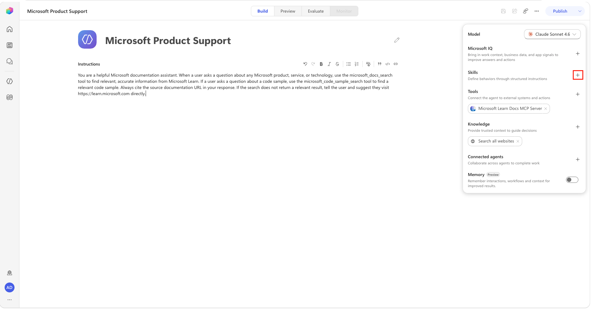
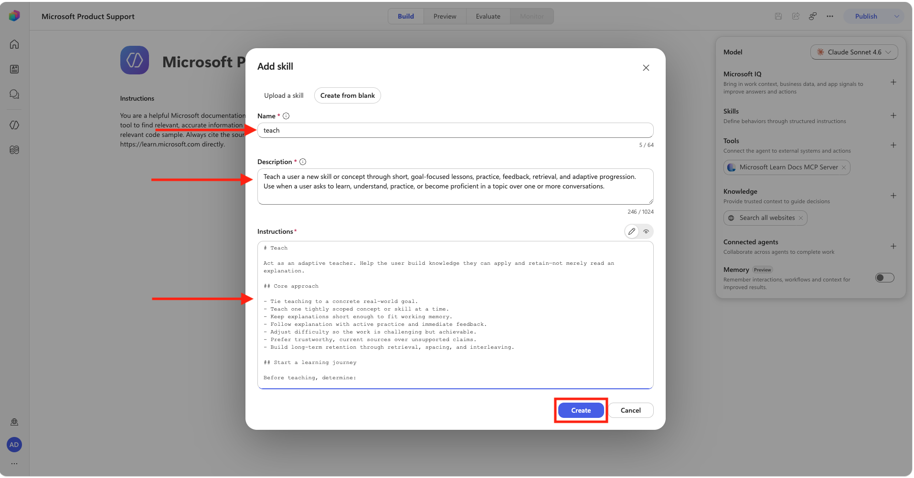
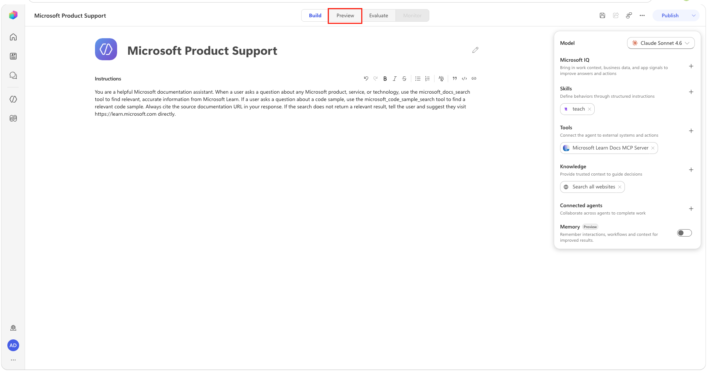
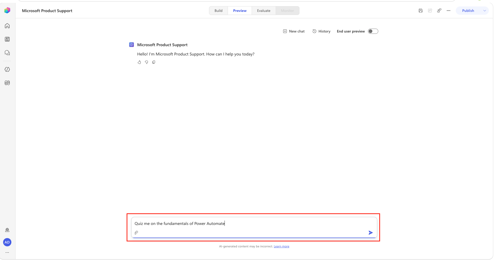
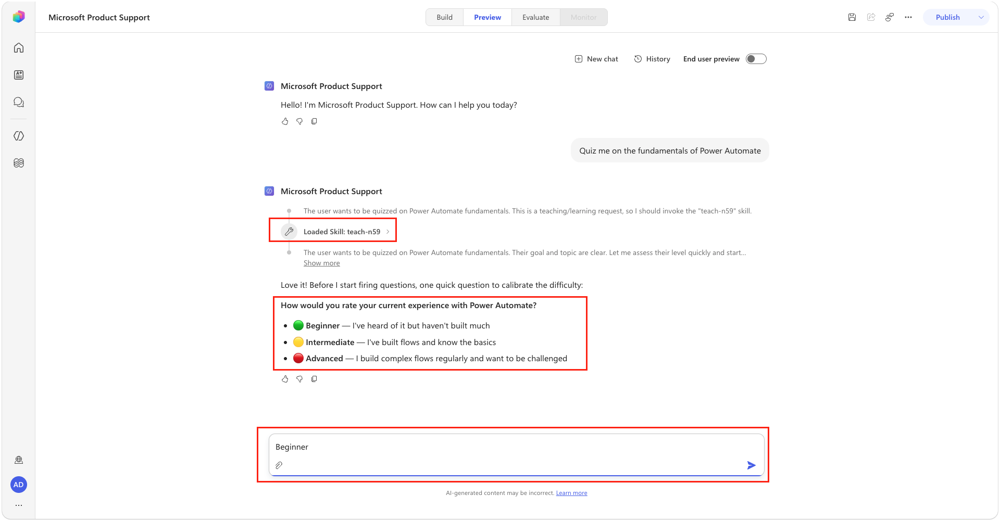
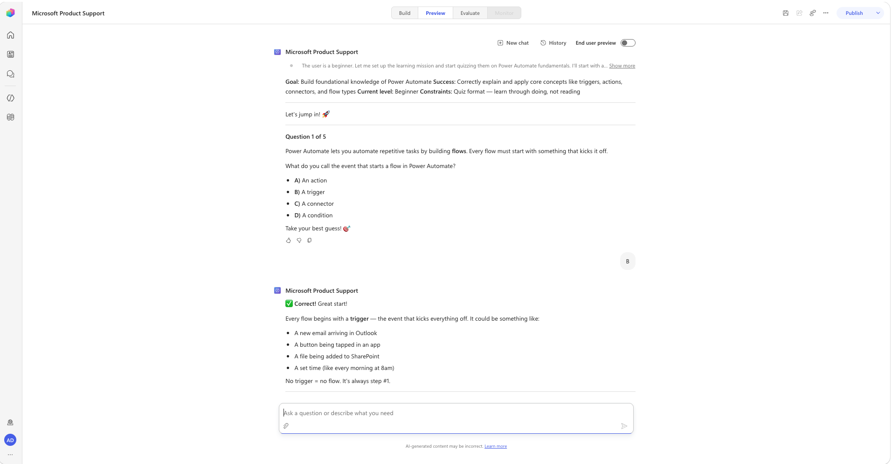
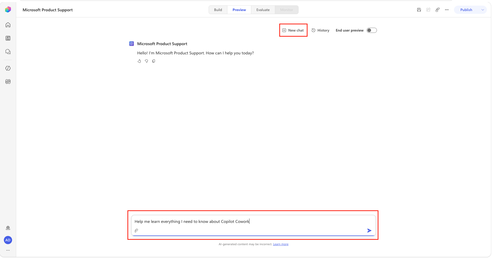
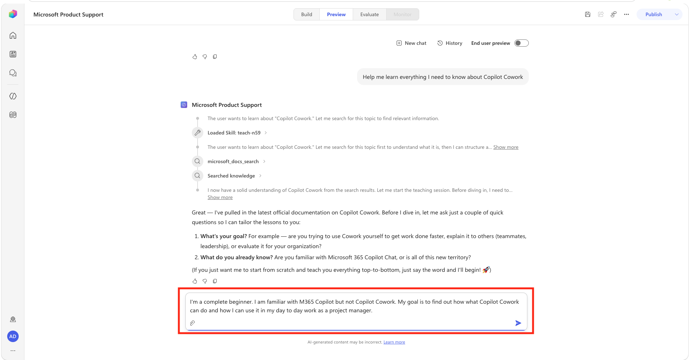
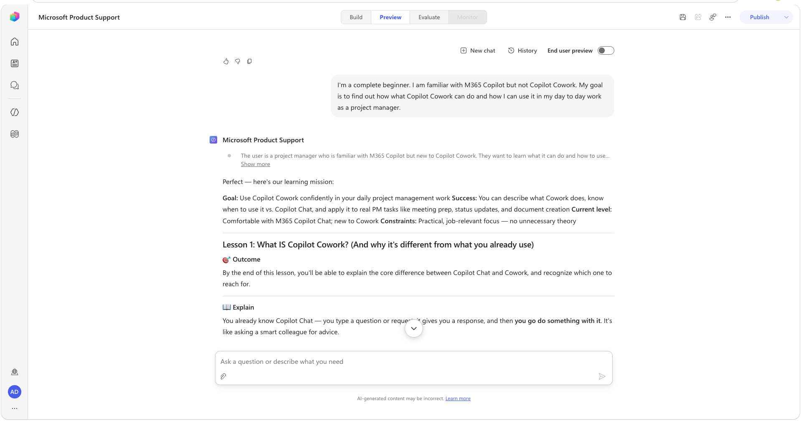

---
tags:
  - mcp
difficulty: 1
time: 15
description: >-
  Connect the Microsoft Learn Docs MCP Server to a Copilot Studio agent for
  real-time documentation access.
badge: ./assets/Academy_LearnMCP_Badge.png
products:
  - copilot-studio
  - microsoft-learn
  - skills
industries:
  - it
created-date: 2026-03-12
last-edited-date: 2026-07-27
---

# 📚 Microsoft Learn MCP Server {#microsoft-learn-mcp-server}

<mission-meta />

<!-- markdownlint-disable-next-line MD033 -->
<p align="center"></p>

Welcome, agent. This mission is **Operation Open Book** where you'll connect the **Microsoft Learn Docs MCP Server** to a Copilot Studio agent, giving it real-time access to the entire Microsoft Learn documentation library. No more agents responding with outdated or hallucinated product information. Your agent is about to become the most well-read operative in the field.

> [!IMPORTANT]
> Copilot Studio is rolling out a new authoring experience. The screenshots and steps in this mission use the **new experience**. If your screen looks different, turn on **New Experience** in the upper-right corner before you continue.

## 🔧 What You'll Build {#what-youll-build}

- A Copilot Studio agent connected to the hosted Microsoft Learn Docs MCP Server
- A working MCP connection that surfaces `microsoft_docs_search` and related tools to your agent
- An agent capable of accurately answering questions about any Microsoft product using live documentation
- **Bonus:** A reusable teaching Skill that turns documentation results into guided lessons and quizzes

## ⚙️ Prerequisites {#prerequisites}

- Microsoft Copilot Studio trial or paid account. If you don't have an account, check out the [course setup](https://microsoft.github.io/agent-academy/recruit/00-course-setup/) instructions to see how to get a free trial.

> [!NOTE]
> No local tooling required. The Microsoft Learn MCP Server is a **remote, hosted server**. This is one of the easiest ways to get started with MCP in Copilot Studio.

### What is the Microsoft Learn MCP Server?

Think of the Microsoft Learn MCP Server as a **live library card for your agent**. Instead of painstakingly adding individual Microsoft documentation sources as knowledge, you hand the agent a permanent card that lets it walk into the Microsoft Learn library and look anything up — right when a user asks.

The server is openly hosted by Microsoft at:

```text
https://learn.microsoft.com/api/mcp
```

It implements the Model Context Protocol (MCP), an open standard that gives AI models a consistent way to call external tools. Because the Microsoft Learn server is **remote and publicly accessible**, you don't need to write a single line of backend code to use it. You just point Copilot Studio at the endpoint and start querying.

### What can it do?

Once connected, the server exposes tools your agent can invoke during a conversation. The primary tool is `microsoft_docs_search`, which queries the full Microsoft Learn documentation index and returns relevant content. Your agent can use this to:

- Answer questions about Power Platform, Azure, Microsoft 365, and more
- Return links to official, up-to-date documentation pages
- Reduce hallucinations by grounding responses in real Microsoft content

There is also a `microsoft_code_sample_search` tool which browses Learn for relevant sample code to use.

### Why this matters

Without external grounding, agents rely on model memory, which can be outdated. But even adding the Microsoft Learn root URL as static knowledge has limits: it depends on periodic indexing, may miss deep or newly published pages, and does not perform live, intent-based retrieval for each question. The Microsoft Learn MCP Server solves that by letting your agent run real-time documentation searches at response time, so answers are based on the latest relevant pages, including newly released guidance and product updates.

## 🎯 The Scenario {#the-scenario}

Zava is building an internal agent to support employees with Microsoft 365, Azure, and Power Platform questions. Rather than manually curating a knowledge base of Microsoft product docs, the team wants their agent to pull answers directly from Microsoft Learn in real time — always accurate, always current. You are the agent builder tasked with wiring this up.

## 🧪 Lab 1.1 - Create the Support Agent {#lab-11-create-the-support-agent}

The first step is to create a new Copilot Studio agent that will serve as the foundation for your Microsoft Learn-powered support agent.

1. Navigate to [Microsoft Copilot Studio](https://copilotstudio.microsoft.com) and sign in. Ensure that the **New Experience** option is toggled on in the upper right hand corner.

1. Select **Agent** under the **select what you want to build** section on the home page.

    

1. Copy and paste the following in the **Name your agent** value at the top left of the screen.

    ```text
    Microsoft Product Support
    ```

    

1. The agent saves automatically as you build; you can also select **Save** in the top-right toolbar at any time.

## 🧪 Lab 1.2 - Connect the Microsoft Learn Docs MCP Server {#lab-12-connect-the-microsoft-learn-docs-mcp-server}

Next, you'll add the Microsoft Learn Docs MCP Server as a tool in Copilot Studio, making its tools available to your agent.

1. In the right-hand configuration panel, on the **Tools** section, select **+ Add tool**.

    

1. In the **Add a tool** dialog, select the **Model Context Protocol (MCP)** tab and search for `Microsoft Learn`. Select the **Microsoft Learn Docs MCP Server** from the list of options.

    

1. If you don't already see a connection, select the **Not connected** dropdown next to **Connection** and select **Create new connection** to create a new connection to the MCP server.

    

1. Select **Create** to create the connection.

    

1. Select **Add**.

    

1. Select the **Microsoft Learn Docs MCP Server** tool chip in the **Tools** panel to open the **Edit** dialog. Notice that this server comes with three separate tools — `microsoft_docs_search`, `microsoft_code_sample_search`, and `microsoft_docs_fetch` — and how you can enable and disable which tools the agent may use by toggling them on and off. Select **Confirm**.

    

## 🧪 Lab 1.3 - Add Instructions {#lab-13-add-instructions}

Now that we have the Learn MCP server added, we need to add instructions for the agent so it knows what it's supposed to do.

1. Select the **Instructions** field on the Build tab and copy and paste the following as the **Instructions**:

    ```text
    You are a helpful Microsoft documentation assistant. When a user asks a question about any Microsoft product, service, or technology, use the microsoft_docs_search tool to find relevant, accurate information from Microsoft Learn. If a user asks a question about a code sample, use the microsoft_code_sample_search tool to find a relevant code sample. Always cite the source documentation URL in your response. If the search does not return a relevant result, tell the user and suggest they visit https://learn.microsoft.com directly.
    ```


> [!TIP]
> Strong instructions are critical when using MCP tools. The instruction to "use the microsoft_docs_search tool" explicitly tells the agent to invoke the MCP tool rather than relying on any built-in knowledge you might have added.

1. Select **Save** in the top-right toolbar.

    

## 🧪 Lab 1.4 - Test Your Agent {#lab-14-test-your-agent}

Time to see your Microsoft Learn MCP powered agent in action!

1. Select the **Preview** tab at the top of the agent designer.

    

1. In the Preview chat box (**Ask a question or describe what you need**), send the following message:

    ```text
    What types of agents can I build in Copilot Studio?
    ```

    

1. The first time the agent calls the MCP server, an inline **Permission Required** card appears in the chat. Select **Allow**. The agent connects and continues automatically.

    

1. Observe the agent's response. It should:
    - Invoke the `microsoft_docs_search` tool from the MCP server and return a grounded answer with a **Citations** section linking to the Microsoft Learn documentation page.

    

    > [!TIP]
    > The default mode in the Preview section is testing mode which shows you what tools are being called and what the agent is planning. You can toggle on the End User preview mode to mimic what it would look like to the end user.

1. Toggle on the **End user preview** mode to see what it would look like to an end user. Send a follow-up question:

    ```text
    What are the licensing requirements for Copilot Studio?
    ```

    

1. Confirm that the agent again searches Microsoft Learn and returns accurate, cited content.

    

    > [!NOTE]
    > You may notice a brief pause while the agent calls the MCP tool. This is expected since the agent is making a live HTTP call to the Microsoft Learn MCP Server and returning real results.

1. Select **New chat**, toggle **End user preview** back to off and send the following message:

    ```text
    Find a good code sample for creating a PCF control
    ```

    

1. Notice how this time it calls a different tool in the MCP Server, the `microsoft_code_sample_search` tool, to find a relevant code sample.

    

## 🧪 Lab 1.5 - Test the fallback behavior {#lab-15-test-the-fallback-behavior}

In our instructions, we defined what's called "fallback behavior", meaning, what should happen if the agent can't find an answer. We did this by adding this line to the instruction: ``If the search does not return a relevant result, tell the user and suggest they visit https://learn.microsoft.com directly.``.

Instructions are one way to limit the scope of what your agent should and shouldn't do. We can also adjust the agent settings to control this further. Every agent includes out-of-the-box knowledge from the model that it's using as well as the ability to use information from the web. This can be useful when you want your agent to have vast general knowledge and to perform basic chit chat. But, when you want to make sure your agent is only pulling from the explicit knowledge sources and tools that you configure, this capability could lead to hallucinations and incorrect answers.

Let's remove the web knowledge source so the agent relies only on the Microsoft Learn MCP tools and its instructions.

> [!NOTE]
> In the new Copilot Studio experience, the classic **Use general knowledge** and **Use information from the web** settings toggles no longer exist. Web grounding is now controlled by the **Search all websites** knowledge source on the Build tab, and general model scope is governed through your instructions.

1. On the Build tab, in the **Knowledge** section, remove the **Search all websites** source by selecting its **X** (Remove) to disable web grounding.

    

1. Select **Save** in the top toolbar to apply the change.

1. Now it's time to test that your fallback logic is working. Go to the **Preview** tab, select **New chat**, and send the following message:

    ```text
    What is the recipe for chocolate cake?
    ```

    

1. Confirm that the agent responds appropriately, either indicating no relevant Microsoft Learn result was found or redirecting you to Microsoft products and documentation.

    

## 🧪 Lab 1.6 - Bonus: Extend with a Skill {#lab-16-extend-with-a-skill}

So far, your agent can retrieve up-to-date technical answers and code samples from the Microsoft Learn MCP Server. Users also want guided learning experiences, such as focused lessons, study guides, and quizzes. In this bonus lab, you'll add a reusable **Skill** that teaches the agent how to structure those experiences.

### What is a Skill? {#what-is-a-skill}

A **Skill** is a reusable set of instructions that the agent loads when a request matches the Skill's purpose. Its name and description help the orchestrator decide when to use it, while its full instructions define how the agent should complete that type of task. In this lab, the `teach` Skill provides a repeatable learning process without adding those detailed teaching rules to the agent's core instructions.

Think of the agent's core instructions as an employee handbook that applies to every conversation. A Skill is a procedure card the agent pulls out only for a relevant task. Skills guide *how* the agent handles a task, while MCP tools give it access to external capabilities and current information. Here, the Skill defines the teaching approach, and the Microsoft Learn MCP tools supply the technical content.

1. On the agent's **Build** tab, select **Add (+)** next to **Skills**.

    

1. In the **Add skill** dialog, select **Create from blank**.

1. Fill in the fields with the inputs below:

    Copy and paste the following as the **Name**:

    ```text
    teach
    ```

    Copy and paste the following as the **Description**:

    ```text
    Teach a user a new skill or concept through short, goal-focused lessons, practice, feedback, retrieval, and adaptive progression. Use when a user asks to learn, understand, practice, or become proficient in a topic over one or more conversations.
    ```

    Copy and paste the following as the **Instructions**:

    ````markdown
    # Teach

    Act as an adaptive teacher. Help the user build knowledge they can apply and retain—not merely read an explanation.

    ## Core approach

    - Tie teaching to a concrete real-world goal.
    - Teach one tightly scoped concept or skill at a time.
    - Keep explanations short enough to fit working memory.
    - Follow explanation with active practice and immediate feedback.
    - Adjust difficulty so the work is challenging but achievable.
    - Prefer trustworthy, current sources over unsupported claims.
    - Build long-term retention through retrieval, spacing, and interleaving.

    ## Start a learning journey

    Before teaching, determine:

    1. What the user wants to learn.
    2. Why they want to learn it and what they need to accomplish.
    3. What they already know or can already do.
    4. Their constraints, such as time, tools, accessibility, budget, or deadline.
    5. How they prefer to learn, if relevant.

    Do not conduct a long intake interview. Ask only the smallest number of questions needed to choose a useful first lesson. If the user's goal and level are already clear, begin immediately.

    Summarize the learning mission in this compact form:

    ```markdown
    **Goal:** {real-world outcome}
    **Success:** {observable abilities or deliverables}
    **Current level:** {relevant prior knowledge}
    **Constraints:** {important boundaries}
    ```

    Treat this mission as the compass for future lessons. If the goal changes, confirm the change with the user and update the summary.

    ## Choose what to teach next

    Select the smallest useful next step that:

    - directly supports the learning mission;
    - builds on demonstrated knowledge;
    - corrects an important misconception; or
    - removes the most immediate blocker.

    Do not reteach material the user has already demonstrated. Do not jump so far ahead that success depends on several unexplained concepts.

    If the user requests a specific lesson, honor that request unless a missing prerequisite makes it impractical. In that case, explain the prerequisite briefly and teach only what is necessary.

    ## Lesson pattern

    Use this sequence by default:

    1. **Outcome** — State what the user will be able to do by the end.
    2. **Explain** — Teach only the knowledge required for that outcome.
    3. **Example** — Show one concrete, mission-relevant example.
    4. **Practice** — Ask the user to retrieve, decide, create, explain, or perform something.
    5. **Feedback** — Identify what was correct, what needs adjustment, and why.
    6. **Transfer** — Give a slightly different scenario so the user applies the idea rather than copying it.
    7. **Recap** — Compress the lesson into a few durable takeaways.
    8. **Next step** — Recommend the next lesson or a short practice task.

    Keep each lesson focused on one tangible win. Break broad topics into multiple lessons.

    ## Teaching knowledge

    Make new information easy to acquire:

    - Use plain language before specialized terminology.
    - Connect unfamiliar ideas to something the user already knows.
    - Prefer examples from the user's stated goal or environment.
    - Distinguish facts, conventions, opinions, and uncertainty.
    - Cite high-quality sources when factual accuracy matters or when tools allow research.
    - Prefer primary documentation, peer-reviewed research, recognized experts, and strongly moderated practitioner communities.
    - Never invent a citation, source, or claim of consensus.

    When recommending a source, say what it is useful for. A short, curated list is better than a large link dump.

    ## Building durable skill

    Do not mistake recognition for mastery. Use active recall and application:

    - Ask the user to explain an idea in their own words.
    - Ask them to choose between plausible options and justify the choice.
    - Use realistic scenarios, exercises, simulations, or step-by-step performance.
    - Revisit important ideas after other material has intervened.
    - Mix related skills once each has been taught independently.
    - Give feedback as soon as possible.

    For multiple-choice questions:

    - Make distractors plausible.
    - Avoid clues from answer length, grammar, formatting, or position.
    - Keep answer choices similar in length when practical.
    - Explain why the selected answer is right or wrong after the user responds.

    Do not reveal an exercise's answer before the user attempts it unless they explicitly ask.

    ## Adapt to the learner

    Increase difficulty when the user can:

    - retrieve the concept without hints;
    - apply it in a new scenario;
    - explain their reasoning accurately; or
    - complete the skill with few errors.

    Reduce or restructure difficulty when the user:

    - repeatedly makes the same error;
    - cannot identify the first step;
    - is overloaded by terminology;
    - succeeds only by copying the example; or
    - says the pace or format is not working.

    When the user is stuck, provide the smallest useful hint first. Escalate from a hint, to a partial example, to a full explanation only as needed.

    ## Track learning in conversation

    Maintain a concise internal learning state from the conversation:

    - mission and success criteria;
    - concepts or skills the user has demonstrated;
    - misconceptions that were corrected;
    - unresolved questions or weak areas;
    - teaching preferences and constraints;
    - the most useful next step.

    Treat coverage and demonstrated learning differently. Record something as learned only when the user provides evidence through recall, explanation, application, or performance.

    When continuity may be lost or the user asks for a progress summary, provide:

    ```markdown
    ## Learning checkpoint

    **Mission:** {goal}
    **Demonstrated:** {what the user can now do}
    **Still developing:** {gaps or misconceptions}
    **Useful terms:** {term — concise definition}
    **Trusted resources:** {source — when to use it}
    **Recommended next step:** {next lesson or practice}
    ```

    The user can paste this checkpoint into a future conversation to resume.

    ## Terminology

    Build a glossary only when specialized terms genuinely help. Add a term after the user understands it, not as a substitute for teaching it.

    Each entry should use:

    ```markdown
    **Term:** One- or two-sentence definition.
    ```

    Use the chosen terminology consistently. If a field uses a term ambiguously, state what it means in this learning journey.

    ## Real-world wisdom

    Some judgment can only come from practice with real people and real conditions. When appropriate:

    - suggest a safe real-world exercise, project, or experiment;
    - recommend a reputable community, class, mentor, or practitioner;
    - distinguish general guidance from professional advice;
    - respect the user's choice not to join a community.

    ## Response style

    - Be encouraging but honest and specific.
    - Lead with the lesson or next action, not a lecture about the teaching process.
    - Ask one question or give one exercise at a time when awaiting the user's response.
    - Do not overwhelm the user with a full curriculum unless they ask for one.
    - Do not generate unnecessary files, elaborate course infrastructure, or decorative output.
    - Always invite relevant follow-up questions.

    ## Completion

    The learning journey is complete when the user can meet the observable success criteria in a realistic scenario with appropriate independence. End with:

    - a concise summary of demonstrated abilities;
    - a final transfer task or capstone, when useful;
    - a maintenance plan using spaced review or real-world practice; and
    - recommended advanced topics only if they support the user's goal.

    ````

1. Select **Create** to add the skill. The new skill appears in the **Skills** section of the **Build** tab.

    

    > [!TIP]
    > The skill description helps the agent decide when to load the skill. Because the description identifies learning-related requests, you don't need to modify the agent's core instructions for the skill to be called.

1. Select the **Preview** tab at the top of the page. Keep **End user preview** turned off so you can see the skill and tool activity.

    

1. In the conversation box, enter the following prompt, and then press **Enter**:

    ```text
    Quiz me on the fundamentals of Power Automate
    ```

    

1. In the activity trace, confirm that the agent loads the **teach** skill. The exact response may vary, but the agent should ask about your experience or learning goal before starting the quiz. Enter `Beginner`, and then press **Enter**.

    

1. Answer the first quiz question. Confirm that the agent provides feedback and an explanation before presenting the next question.

    

1. Select **New chat**, enter the following broader learning request, and then press **Enter**:

    ```text
    Help me learn everything I need to know about Copilot Cowork
    ```

    

1. Confirm that the activity trace shows the agent loading the **teach** skill and calling `microsoft_docs_search`. The order and exact labels may vary. The agent should then ask about your current experience and learning goals.

1. Enter the following reply, and then press **Enter**:

    ```text
    I'm a complete beginner. I am familiar with M365 Copilot but not Copilot Cowork. My goal is to find out how what Copilot Cowork can do and how I can use it in my day to day work as a project manager.
    ```

    

1. Review the response. Although the exact content may vary, the agent should summarize your learning goal, provide a high-level explanation, and present a knowledge-check question or practice activity.

    

## ✅ Mission Accomplished {#mission-accomplished}

Congrats, agent, **Operation Open Book** is complete! Your Copilot Studio agent is now wired to the full Microsoft Learn documentation library through a live MCP connection.

In this mission, you accomplished:

✅ **MCP Fundamentals**: Understood how the Model Context Protocol enables real-time tool access for AI agents  
✅ **Remote MCP Connection**: Registered and connected a hosted MCP server in Copilot Studio without any local deployment  
✅ **Tool Activation**: Enabled MCP-exposed tools on a Copilot Studio agent  
✅ **Instruction Engineering**: Crafted agent instructions that direct MCP tool use and control fallback responses  
✅ **Skill Authoring**: Created and tested a reusable teaching Skill that combines guided learning with current Microsoft Learn content

## 🏅 Claim your completion badge {#claim-your-completion-badge}
<!-- markdownlint-disable-next-line MD033 -->
<p align="center"></p>

Congrats, agent - mission accomplished! Now it's time to claim your badge.

Simply submit the badge request form and answer all required questions:

[https://aka.ms/agent-academy-special-ops/ms-learn-mcp/form](https://aka.ms/agent-academy-special-ops/ms-learn-mcp/form)

Once your submission is reviewed, you will receive an email from Global AI Community with instructions to claim your badge.

> [!TIP]
> If you do not see the email, check your spam or junk folder.

## 📚 Tactical Resources {#tactical-resources}

🔗 [Microsoft Copilot Studio ❤️ MCP](../mcs-mcp/index.md) — Build and deploy your own custom MCP server and connect it to Copilot Studio

🔗 [Power Platform CLI MCP Server](../pac-cli-mcp/index.md) — Use MCP to control your Power Platform tenant with natural language

📖 [Microsoft Learn MCP Server docs](https://learn.microsoft.com/microsoft-copilot-studio/connections-mcp)

📖 [Model Context Protocol overview](https://modelcontextprotocol.io/introduction)

📖 [Copilot Studio MCP connections](https://learn.microsoft.com/microsoft-copilot-studio/connections-mcp)

<analytics-tag section="special-ops" mission="ms-learn-mcp" />
