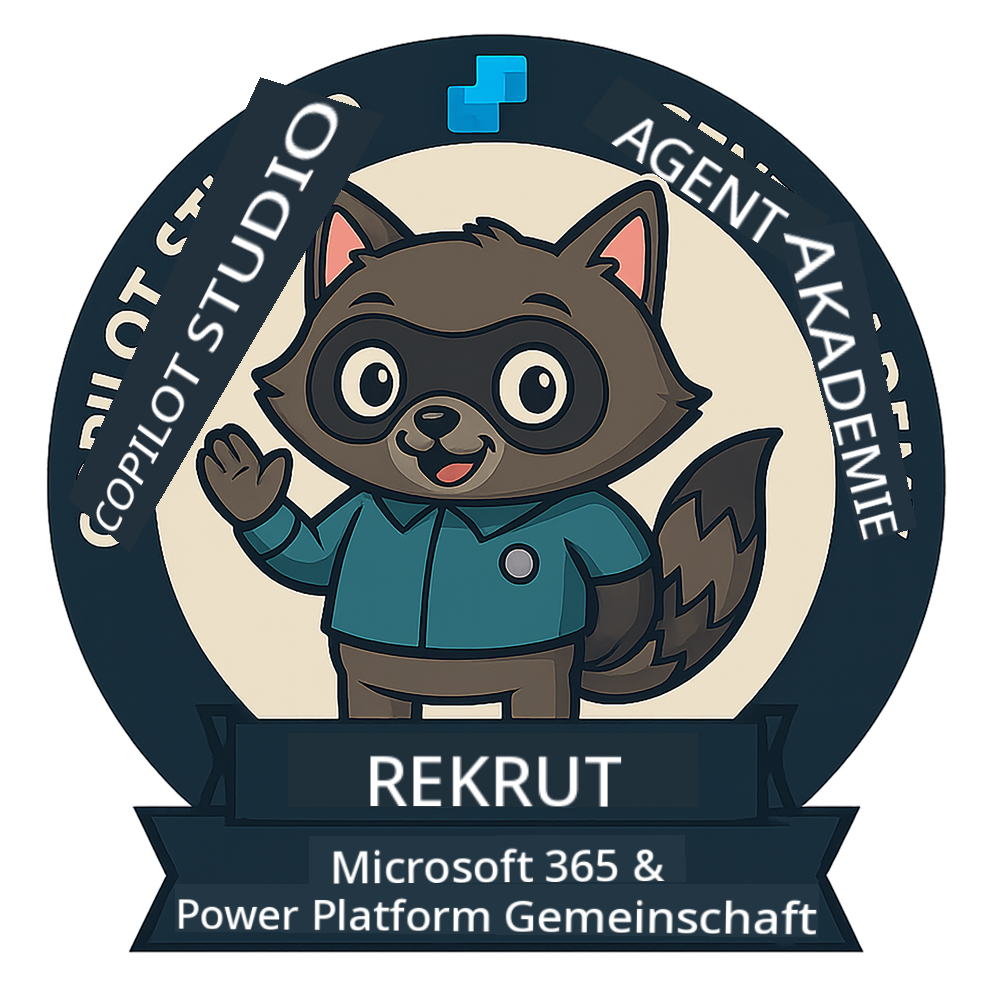
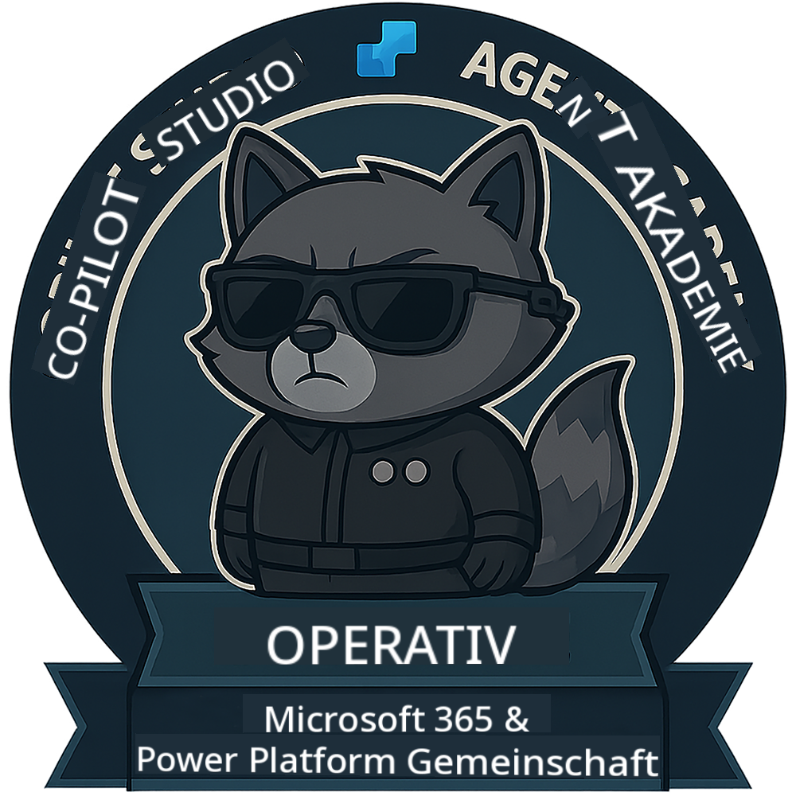

<!--
CO_OP_TRANSLATOR_METADATA:
{
  "original_hash": "15e57e059ce7689d602d7853187235cd",
  "translation_date": "2025-10-17T18:52:44+00:00",
  "source_file": "docs/index.md",
  "language_code": "de"
}
-->
---
hide:
- navigation
---

# Copilot Studio Agent Academy

**Willkommen in der Copilot Studio Agent Academy.**  

Ihre Mission – falls Sie sich dazu entschließen – besteht darin, die Kunst des Erstellens von Agenten mit **Microsoft Copilot Studio** zu meistern.

Dieses praxisorientierte Training ist Ihr Einstieg in die **Welt der Agenten**: Von fundierten Eingabeaufforderungen über Adaptive Cards bis hin zu Agentenabläufen lernen Sie, wie Sie intelligente Agenten mit realen Tools und Anwendungsfällen erstellen, skalieren und bereitstellen können.

---

## 🏅 Rangfortschritt

Die **Copilot Studio Agent Academy** ist ein mehrstufiges Trainingsprogramm, das darauf abzielt, Ihre Fähigkeiten über drei Agenten-Ränge hinweg zu entwickeln. Jede Stufe umfasst ein Abzeichen und steigende Verantwortlichkeiten:

| Rang             | Level | Visual |
|------------------|:-----:|--------|
| 🟢 **Rekrut**  [🚀 Loslegen](https://aka.ms/agent-academy-recruit){ .md-button .md-button--primary }     | •     | { width="300" }     |
| 🔵 **Agent** (Demnächst verfügbar)   | ••    | { width="300" } |
| 🟡 **Kommandant** (Demnächst verfügbar)    | •••   | { width="300" } |

Jede Stufe baut auf der vorherigen auf. Schließen Sie Ihre Rekruten-Mission ab und bleiben Sie dran, um Ihre Agenten-Zertifikate zu erweitern.

---

## 🎒 Weitere Kurse

Entdecken Sie diese weiteren Kurse, um mehr über KI und Agenten zu lernen:

- [Microsoft Copilot Studio <3 MCP Lab](https://aka.ms/mcsmcplab)
- [Copilot Developer Camp](https://microsoft.github.io/copilot-camp/)
- [KI-Agenten für Anfänger](https://microsoft.github.io/ai-agents-for-beginners/)
- [Model Context Protocol (MCP) für Anfänger](https://github.com/microsoft/mcp-for-beginners)

---

## 🚑 Probleme

Wir schätzen Ihr Feedback sehr! Bitte nutzen Sie die [Issues-Liste](https://github.com/microsoft/agent-academy/issues), um Ihre Kommentare und Probleme mitzuteilen. Vielen Dank!

---

## 📜 Verhaltenskodex

Dieses Projekt hat den [Microsoft Open Source Verhaltenskodex](https://opensource.microsoft.com/codeofconduct/) übernommen.

!!! info "Ressourcen:"

    - [Microsoft Open Source Verhaltenskodex](https://opensource.microsoft.com/codeofconduct/)
    - [Microsoft Verhaltenskodex FAQ](https://opensource.microsoft.com/codeofconduct/faq/)
    - Kontaktieren Sie [opencode@microsoft.com](mailto:opencode@microsoft.com) bei Fragen oder Anliegen

---

[⭐️ Geben Sie unserem Repository einen Stern](https://github.com/microsoft/agent-academy){ .md-button .md-button--primary }

<!-- markdownlint-disable-next-line MD033 -->

---

**Haftungsausschluss**:  
Dieses Dokument wurde mit dem KI-Übersetzungsdienst [Co-op Translator](https://github.com/Azure/co-op-translator) übersetzt. Obwohl wir uns um Genauigkeit bemühen, beachten Sie bitte, dass automatisierte Übersetzungen Fehler oder Ungenauigkeiten enthalten können. Das Originaldokument in seiner ursprünglichen Sprache sollte als maßgebliche Quelle betrachtet werden. Für kritische Informationen wird eine professionelle menschliche Übersetzung empfohlen. Wir übernehmen keine Haftung für Missverständnisse oder Fehlinterpretationen, die sich aus der Nutzung dieser Übersetzung ergeben.