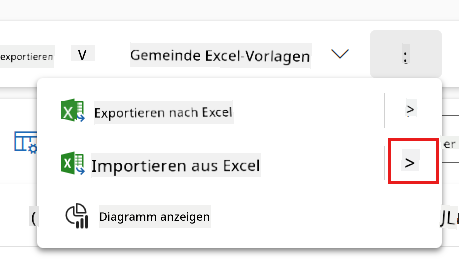
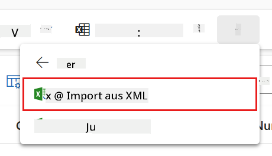
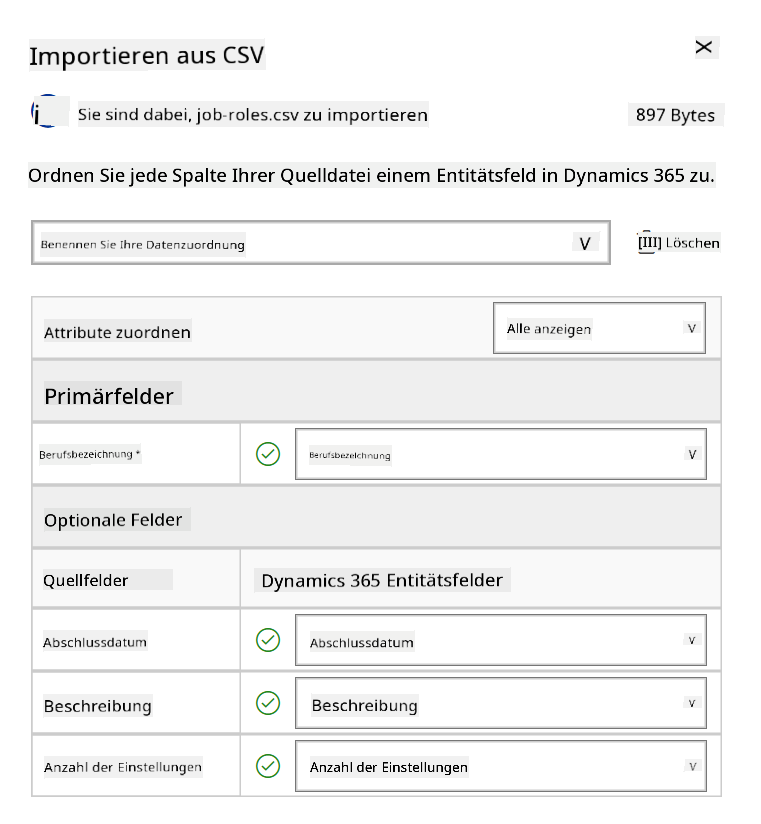
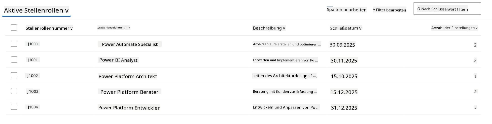
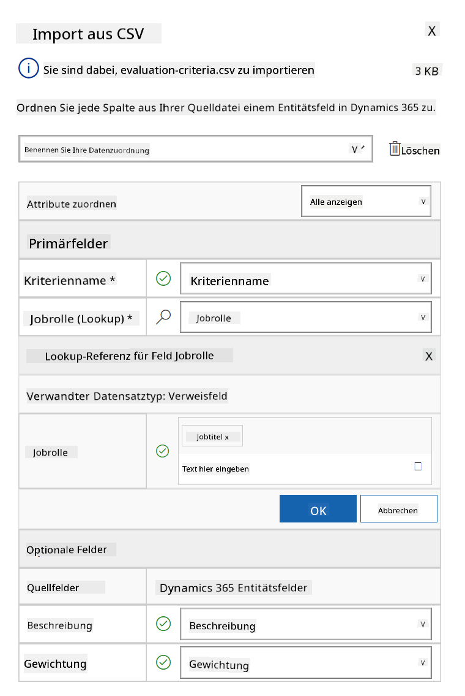
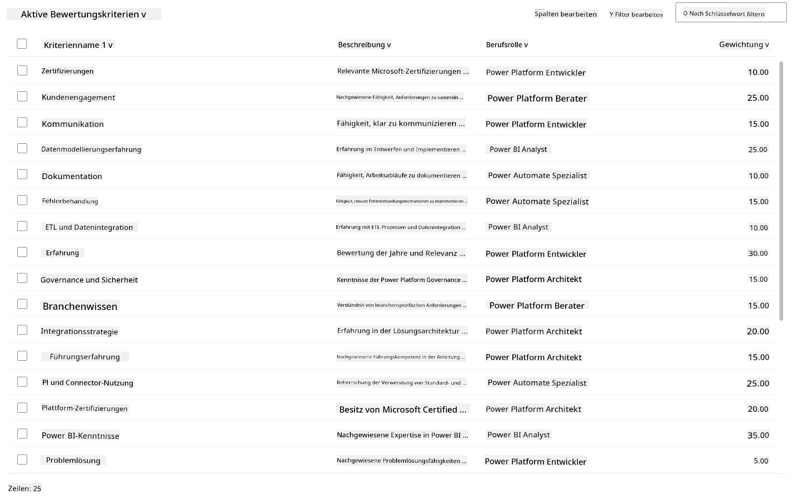

<!--
CO_OP_TRANSLATOR_METADATA:
{
  "original_hash": "2620cf9eaf09a3fc6be7fa31a3a62956",
  "translation_date": "2025-10-17T19:23:19+00:00",
  "source_file": "docs/operative-preview/01-get-started/README.md",
  "language_code": "de"
}
-->
# 🚨 Mission 01: Einstieg mit dem Hiring Agent

--8<-- "disclaimer.md"

## 🕵️‍♂️ CODENAME: `OPERATION TALENT SCOUT`

> **⏱️ Zeitfenster der Operation:** `~45 Minuten`

## 🎯 Missionsbeschreibung

Willkommen, Agent. Ihr erster Auftrag ist **Operation Talent Scout** – die Einrichtung der grundlegenden Infrastruktur für ein KI-gestütztes Rekrutierungssystem, das die Art und Weise revolutionieren wird, wie Organisationen Top-Talente identifizieren und einstellen.

Ihre Mission, falls Sie sich dafür entscheiden, besteht darin, ein umfassendes Managementsystem für die Personalbeschaffung mit Microsoft Copilot Studio zu implementieren und zu konfigurieren. Sie werden eine vorgefertigte Lösung importieren, die alle notwendigen Datenstrukturen enthält, und anschließend Ihren ersten KI-Agenten erstellen – den **Hiring Agent** – der als zentraler Koordinator für alle zukünftigen Rekrutierungsoperationen dient.

Diese erste Implementierung bildet das Kommandozentrum, das Sie im Laufe des Agent Academy Operative Programms weiter ausbauen werden. Betrachten Sie dies als Ihre Basis – das Fundament, auf dem Sie ein ganzes Netzwerk spezialisierter Agenten in den folgenden Missionen aufbauen werden.

---

## 🔎 Ziele

Durch den Abschluss dieser Mission werden Sie:

- **Szenario-Verständnis**: Umfassendes Wissen über Herausforderungen und Lösungen der automatisierten Personalbeschaffung erlangen
- **Lösungsimplementierung**: Erfolgreich die Grundlagen eines Managementsystems für die Personalbeschaffung importieren und konfigurieren
- **Agentenerstellung**: Einen Hiring Agent erstellen, der den Ausgangspunkt für das Szenario bildet, das Sie als Agent Academy Operative aufbauen werden

---

## 🔍 Voraussetzungen

Bevor Sie mit dieser Mission beginnen, stellen Sie sicher, dass Sie:

- Eine Copilot Studio-Lizenz besitzen
- Zugriff auf eine Microsoft Power Platform-Umgebung haben
- Administratorrechte zum Erstellen von Lösungen und Agenten besitzen

---

## 🏢 Verständnis des Szenarios zur automatisierten Personalbeschaffung

Dieses Szenario zeigt, wie ein Unternehmen Microsoft Copilot Studio nutzen kann, um seinen Einstellungsprozess zu verbessern und zu automatisieren. Es führt ein System von Agenten ein, die zusammenarbeiten, um Aufgaben wie das Überprüfen von Lebensläufen, das Empfehlen von Jobrollen, das Vorbereiten von Interviewmaterialien und das Bewerten von Kandidaten zu übernehmen.

### Geschäftswert

Die Lösung hilft HR-Teams, Zeit zu sparen und bessere Entscheidungen zu treffen, indem sie:

- Lebensläufe, die per E-Mail eingehen, automatisch verarbeitet.
- Geeignete Jobrollen basierend auf Kandidatenprofilen vorschlägt.
- Bewerbungen und Interviewleitfäden erstellt, die auf jeden Kandidaten zugeschnitten sind.
- Faire und konforme Einstellungspraktiken durch integrierte Sicherheits- und Moderationsfunktionen gewährleistet.
- Feedback sammelt, um die Lösung zu verbessern.

### Funktionsweise

- Ein zentraler **Hiring Agent** koordiniert den Prozess und speichert Daten in Microsoft Dataverse.
- Ein **Application Intake Agent** liest Lebensläufe und erstellt Bewerbungen.
- Ein **Interview Prep Agent** generiert Interviewfragen und Dokumente basierend auf dem Hintergrund des Kandidaten.
- Das System kann auf einer Demo-Website veröffentlicht werden, sodass Stakeholder damit interagieren können.

Dieses Szenario ist ideal für Organisationen, die ihre Rekrutierungsabläufe mit KI-gestützter Automatisierung modernisieren möchten, während sie Transparenz, Fairness und Effizienz beibehalten.

---

## 🧪 Lab: Einrichtung des Hiring Agent

In diesem praktischen Lab legen Sie die Grundlage für Ihr automatisiertes Einstellungsmanagementsystem. Sie beginnen mit dem Import einer vorkonfigurierten Lösung, die alle notwendigen Dataverse-Tabellen und Datenstrukturen für die Verwaltung von Kandidaten, Jobpositionen und Einstellungsabläufen enthält. Anschließend füllen Sie diese Tabellen mit Beispieldaten, die Ihr Lernen in diesem Modul unterstützen und realistische Szenarien für Tests bieten. Schließlich erstellen Sie den Hiring Agent in Copilot Studio und richten die grundlegende Konversationsschnittstelle ein, die als Eckpfeiler für alle weiteren Funktionen dient, die Sie in zukünftigen Missionen hinzufügen werden.

### 🧪 Lab 1.1: Lösung importieren

1. Gehen Sie zu **[Copilot Studio](https://copilotstudio.microsoft.com)**
1. Wählen Sie die **...** in der linken Navigation und wählen Sie **Solutions**
1. Wählen Sie die Schaltfläche **Import Solution** oben aus
1. **[Download](https://raw.githubusercontent.com/microsoft/agent-academy/refs/heads/main/docs/operative-preview/01-get-started/assets/Operative_1_0_0_0.zip)** der vorbereiteten Lösung
1. Wählen Sie **Browse** und wählen Sie die heruntergeladene Lösung aus dem vorherigen Schritt aus
1. Wählen Sie **Next**
1. Wählen Sie **Import**

!!! success
    Bei Erfolg sehen Sie eine grüne Benachrichtigungsleiste mit der folgenden Nachricht, wenn der Vorgang abgeschlossen ist:  
    "Solution "Operative" imported successfully."

Nachdem die Lösung importiert wurde, sehen Sie sich an, was Sie importiert haben, indem Sie den Anzeigenamen der Lösung (`Operative`) auswählen.


Die folgenden Komponenten wurden importiert:

| Anzeigename | Typ | Beschreibung |
|-------------|------|-------------|
| Candidate | Tabelle | Informationen zu Kandidaten |
| Evaluation Criteria | Tabelle | Bewertungskriterien für die Rolle |
| Hiring Hub | Model-Driven App | Anwendung zur Verwaltung des Einstellungsprozesses |
| Hiring Hub | Site Map | Navigationsstruktur für die Hiring Hub App |
| Job Application | Tabelle | Bewerbungen |
| Job Role | Tabelle | Jobrollen |
| Resume | Tabelle | Lebensläufe der Kandidaten |

Als letzte Aufgabe für dieses Lab wählen Sie die Schaltfläche **Publish all customizations** oben auf der Seite aus.

### 🧪 Lab 1.2: Beispieldaten importieren

In diesem Lab fügen Sie einigen der Tabellen, die Sie in Lab 1.1 importiert haben, Beispieldaten hinzu.

#### Dateien zum Import herunterladen

1. **[Download](https://raw.githubusercontent.com/microsoft/agent-academy/refs/heads/main/docs/operative-preview/01-get-started/assets/evaluation-criteria.csv)** der CSV-Datei mit den Bewertungskriterien
1. **[Download](https://raw.githubusercontent.com/microsoft/agent-academy/refs/heads/main/docs/operative-preview/01-get-started/assets/job-roles.csv)** der CSV-Datei mit den Jobrollen

#### Beispieldaten für Jobrollen importieren

1. Gehen Sie zurück zur Lösung, die Sie im letzten Lab importiert haben
1. Wählen Sie die **Hiring Hub** Model-Driven App aus, indem Sie das Häkchen vor der Zeile auswählen
1. Wählen Sie die Schaltfläche **Play** oben aus

    !!! warning
        Möglicherweise werden Sie aufgefordert, sich erneut anzumelden. Stellen Sie sicher, dass Sie dies tun. Danach sollten Sie die Hiring Hub App sehen.

1. Wählen Sie **Job Roles** in der linken Navigation aus
1. Wählen Sie das **Mehr**-Symbol (drei Punkte untereinander) in der Befehlsleiste aus
1. Wählen Sie den **Pfeil nach rechts** neben *Import from Excel*

    

1. Wählen Sie **Import from CSV**

    

1. Wählen Sie die Schaltfläche **Choose File**, wählen Sie die Datei **job-roles.csv**, die Sie gerade heruntergeladen haben, und wählen Sie **Open**
1. Wählen Sie **Next**
1. Lassen Sie den nächsten Schritt unverändert und wählen Sie **Review Mapping**

    

1. Stellen Sie sicher, dass das Mapping korrekt ist, und wählen Sie **Finish Import**

    !!! info
        Dies startet einen Import, und Sie können den Fortschritt verfolgen oder den Prozess sofort abschließen, indem Sie **Done** auswählen.

1. Wählen Sie **Done**

Dies kann eine Weile dauern, aber Sie können die Schaltfläche **Refresh** drücken, um zu sehen, ob der Import erfolgreich war.



#### Beispieldaten für Bewertungskriterien importieren

1. Wählen Sie **Evaluation Criteria** in der linken Navigation aus
1. Wählen Sie das **Mehr**-Symbol (drei Punkte untereinander) in der Befehlsleiste aus
1. Wählen Sie den **Pfeil nach rechts** neben *Import from Excel*

    

1. Wählen Sie **Import from CSV**

    

1. Wählen Sie die Schaltfläche **Choose File**, wählen Sie die Datei **evaluation-criteria.csv**, die Sie gerade heruntergeladen haben, und wählen Sie **Open**
1. Wählen Sie **Next**
1. Lassen Sie den nächsten Schritt unverändert und wählen Sie **Review Mapping**

    

1. Jetzt müssen wir etwas mehr Arbeit für das Mapping leisten. Wählen Sie das Lupensymbol (🔎) neben dem Feld Job Role
1. Stellen Sie sicher, dass **Job Title** hier ausgewählt ist, und falls nicht – fügen Sie es hinzu
1. Wählen Sie **OK**
1. Stellen Sie sicher, dass der Rest des Mappings ebenfalls korrekt ist, und wählen Sie **Finish Import**

    !!! info
        Dies startet erneut einen Import, und Sie können den Fortschritt verfolgen oder den Prozess sofort abschließen, indem Sie **Done** auswählen.

1. Wählen Sie **Done**

Dies kann eine Weile dauern, aber Sie können die Schaltfläche **Refresh** drücken, um zu sehen, ob der Import erfolgreich war.



### 🧪 Lab 1.3: Den Hiring Agent erstellen

Nun, da Sie die Voraussetzungen eingerichtet haben, ist es Zeit für die eigentliche Arbeit! Lassen Sie uns zuerst unseren Hiring Agent hinzufügen!

1. Gehen Sie zu **[Copilot Studio](https://copilotstudio.microsoft.com)** und stellen Sie sicher, dass Sie sich in derselben Umgebung befinden, in der Sie die Lösung und die Daten importiert haben
1. Wählen Sie **Agents** in der linken Navigation aus
1. Wählen Sie **New Agent**
1. Wählen Sie **Configure**
1. Geben Sie für **Name** ein:

    ```text
    Hiring Agent
    ```

1. Geben Sie für **Description** ein:

    ```text
    Central orchestrator for all hiring activities
    ```

1. Wählen Sie die **...** neben der Schaltfläche *Create* oben rechts aus
1. Wählen Sie **Update advanced settings**
1. Wählen Sie als **Solution** `Operative`
1. Wählen Sie **Update**
1. Wählen Sie **Create** oben rechts aus

Dies wird den Hiring Agent für Sie erstellen, den Sie im gesamten Operative-Kurs verwenden werden.

---

## 🎉 Mission abgeschlossen

Mission 01 ist abgeschlossen! Sie haben nun die folgenden Fähigkeiten gemeistert:

✅ **Szenario-Verständnis**: Umfassendes Wissen über Herausforderungen und Lösungen der automatisierten Personalbeschaffung  
✅ **Lösungsimplementierung**: Erfolgreich die Grundlagen eines Managementsystems für die Personalbeschaffung importiert und konfiguriert  
✅ **Agentenerstellung**: Einen Hiring Agent erstellt, der den Ausgangspunkt für das Szenario bildet, das Sie als Agent Academy Operative aufbauen werden  

Als Nächstes folgt [Mission 02](../02-multi-agent/README.md): Machen Sie Ihren Agenten bereit für Multi-Agenten mit verbundenen Agenten.

---

## 📚 Taktische Ressourcen

📖 [Microsoft Copilot Studio - Einen Agenten erstellen](https://learn.microsoft.com/microsoft-copilot-studio/authoring-first-bot)  
📖 [Microsoft Dataverse Dokumentation](https://learn.microsoft.com/power-apps/maker/data-platform)  

---

**Haftungsausschluss**:  
Dieses Dokument wurde mit dem KI-Übersetzungsdienst [Co-op Translator](https://github.com/Azure/co-op-translator) übersetzt. Obwohl wir uns um Genauigkeit bemühen, beachten Sie bitte, dass automatisierte Übersetzungen Fehler oder Ungenauigkeiten enthalten können. Das Originaldokument in seiner ursprünglichen Sprache sollte als maßgebliche Quelle betrachtet werden. Für kritische Informationen wird eine professionelle menschliche Übersetzung empfohlen. Wir übernehmen keine Haftung für Missverständnisse oder Fehlinterpretationen, die sich aus der Nutzung dieser Übersetzung ergeben.