<!--
CO_OP_TRANSLATOR_METADATA:
{
  "original_hash": "75efaf515d5694d4fd549bfd6518901a",
  "translation_date": "2025-10-17T19:30:56+00:00",
  "source_file": "docs/operative-preview/03-automate-triggers/README.md",
  "language_code": "de"
}
-->
# Mission 03: Ereignistrigger hinzufügen, um autonom zu handeln

--8<-- "disclaimer.md"

## 🕵️‍♂️ CODENAME: `OPERATION SIGNAL POINT`

> **⏱️ Zeitfenster der Operation:** `~45 Minuten`

## 🎯 Missionsbeschreibung

Willkommen zurück, Agent. In [Mission 02](../02-multi-agent/README.md) - haben Sie gelernt, wie Sie einen Application Intake Child-Agent und einen Interview Prep Connected-Agent erstellen, um die Fähigkeiten Ihres Haupt-Hiring-Agent zu erweitern.

Ihr Auftrag, falls Sie ihn annehmen, ist **Operation Signal Point** - ein tieferer Einstieg in **Ereignistrigger**, um Ihr Agentensystem von reaktiv zu **autonomem Betrieb** zu transformieren. Sie werden Ihre Agenten von der Abhängigkeit menschlicher Eingaben befreien und sie dazu bringen, proaktiv auf externe Ereignisse zu reagieren und intelligente Aktionen ohne Aufsicht auszuführen.

Stellen Sie sich das als ein Upgrade von Agenten vor, die _Fragen beantworten_, zu Agenten, die _Bedürfnisse antizipieren_ und _selbstständig handeln_. Durch Ereignistrigger und automatisierte Workflows wird Ihr Hiring-Agent eingehende Lebenslauf-E-Mails erkennen, Anhänge automatisch verarbeiten, Daten in Dataverse speichern und Ihr HR-Rekrutierungsteam über Microsoft Teams benachrichtigen - während Sie sich auf Aufgaben mit höherem Wert konzentrieren.

Willkommen in der Welt, in der Automatisierung auf Intelligenz trifft.

## 🔎 Ziele

In dieser Mission lernen Sie:

1. Wie Ereignistrigger autonomes Agentenverhalten ohne Benutzerinteraktion ermöglichen
1. Die Unterschiede zwischen interaktiven und autonomen Agenten in Copilot Studio
1. Wie man Ereignistrigger erstellt, die E-Mail-Anhänge automatisch verarbeiten und Dateien in Dataverse hochladen
1. Wie man Agenten-Flows erstellt, die adaptive Karten in Teams-Kanälen für Benachrichtigungen posten
1. Wie man Daten zwischen Ereignistriggern und Agenten-Flows für eine End-to-End-Automatisierung übergibt

## 🤔 Was ist ein Ereignistrigger?

In [Recruit](../../recruit/10-add-event-triggers/README.md) haben wir bereits über Ereignistrigger gelernt. Lassen Sie uns dies kurz wiederholen, falls Sie es verpasst haben.

**Ereignistrigger** ermöglichen es einem Agenten, _selbstständig zu handeln_, wenn etwas in einem anderen System passiert - ohne dass eine Benutzernachricht erforderlich ist. Wenn das konfigurierte Ereignis ausgelöst wird - wie „neues SharePoint-Element“, „neue E-Mail“, „Planner-Aufgabe zugewiesen“ oder sogar eine zeitbasierte Wiederholung, sendet ein Connector eine Trigger-Nutzlast an Ihren Agenten. Der Agent folgt dann Ihren Anweisungen, um zu entscheiden, welche Aktionen oder Themen aufgerufen werden sollen.

### Hauptmerkmale

- **Autonome Aktivierung:**
      - Im Gegensatz zu Themen-Triggern, die starten, wenn ein Benutzer mit dem Agenten interagiert, werden Ereignistrigger durch externe Ereignisse ausgelöst und ermöglichen proaktives Verhalten.

- **Nutzlast-gesteuert:**
      - Jedes Ereignis liefert eine Nutzlast (Variablen + optionale Anweisungen) über einen Connector. Der Agent verwendet Ihre definierten Anweisungen und die Nutzlast, um zu entscheiden, was als Nächstes zu tun ist.
      - Zum Beispiel _ein Thema aufrufen_ oder _Aktionen ausführen, die durch Tools definiert sind_.

- **Beispiele direkt verfügbar:**
      - SharePoint/OneDrive-Datei oder -Element erstellt
      - Planner-Aufgabe abgeschlossen/zugewiesen
      - Microsoft Forms-Antwort eingereicht
      - Wiederholung/Planung

    Die Verfügbarkeit hängt von den Datenrichtlinien Ihrer Organisation ab, die in Power Automate konfiguriert sind.

- **Erfordert generative Orchestrierung:**
      - Ereignistrigger sind nur verfügbar, wenn generative Orchestrierung für den Agenten aktiviert ist.

- **Abrechnung/Nutzung:**
      - Jede Trigger-Lieferung zählt als Nachricht im Rahmen der Kapazität von Copilot Studio.
      - Zum Beispiel sendet eine 10-minütige Wiederholung alle 10 Minuten eine Nachricht.

- **Authentifizierungsmodell und Einrichtung:**
      - Sie fügen Trigger im Agenten-Übersicht unter _Triggers_ hinzu. Die Authentifizierung für den Trigger-Connector verwendet das Konto des Agenten-Erstellers („Agenten-Autor-Authentifizierung“).
      - Sie können Trigger-Parameter und Nutzlast im Power Automate Maker-Portal bearbeiten.

- **Testen & Beobachtbarkeit:**
      - Sie können Trigger aus dem Testbereich des Agenten testen und das Verhalten mit der Aktivitätskarte vor der Veröffentlichung überprüfen.

!!! info "TL;DR für Entwickler"

    Denken Sie an Ereignistrigger als **webhook-ähnliche Signale**, die eine strukturierte Nutzlast in Ihren Agenten pushen, sodass er _Arbeit initiieren_ und Aktionen über Systeme hinweg verketten kann - ohne darauf zu warten, dass ein Benutzer eine Anfrage stellt.

### Themen-Trigger - Unterschiede

Zuvor haben Sie in [Recruit](../../recruit/07-add-new-topic-with-trigger/README.md) über Themen-Trigger gelernt, aber Sie fragen sich vielleicht immer noch, wie sich _Themen_-Trigger von _Ereignis_-Triggern unterscheiden und warum diese Unterscheidung wichtig ist, um zu verstehen, was einen Agenten autonom macht.

Themen-Trigger steuern, _wann ein Thema ausgeführt wird_, normalerweise als Reaktion auf eine Benutzernachricht.

- In der generativen Orchestrierung ist der Standard-Trigger **By agent** - der Planer wählt ein Thema aus, dessen Name/Beschreibung am besten zur Nachricht des Benutzers passt.
- In der klassischen Orchestrierung ist der Standard **Phrases** - der Planer wählt ein Thema aus, wenn ein oder mehrere Trigger-Phrasen am besten zur Nachricht des Benutzers passen.

Andere Trigger-Typen umfassen `Message received`, `Event received`, `Activity received`, `Conversation update`, `Invoke received`, `On redirect`, `Inactivity` und `Plan complete`.

!!! info "Wesentlicher Unterschied"

    Themen-Trigger sind _Gesprächsaktivitätsstarter_ innerhalb des Chats.
    
    Ereignistrigger sind _Systemereignisstarter_, die über Connectors geliefert werden und den Agenten ganz ohne Gespräch ausführen können.

### Schnellübersicht: Themen-Trigger vs Ereignistrigger

- **Themen-Trigger:** Benutzer (oder Chat-Aktivität) sagt/tut X ➡️ Thema T ausführen.
- **Ereignistrigger:** SharePoint/Planner/E-Mail/Timer löst mit Nutzlast P aus ➡️ Agent bewertet Anweisungen ➡️ ruft entsprechend Aktionen/Themen auf.

## 🏓 Interaktiver Agent vs Autonomer Agent - Vergleich

Jetzt, da Sie den Unterschied zwischen Ereignistriggern und Themen-Triggern kennen, lernen wir als Nächstes den Unterschied zwischen einem interaktiven Agenten und einem autonomen Agenten.

In Copilot Studio bedeutet "interaktiv", dass Agenten hauptsächlich über **Themen** in einem Chat oder Kanal interagieren. "Autonom" bedeutet, dass Agenten auch **Ereignistrigger** nutzen, um ohne Benutzereingabe zu arbeiten.

Die folgende Tabelle fasst ihre Unterschiede und Gemeinsamkeiten zusammen.

| Dimension                           | Interaktiver Agent     | Autonomer Agent                                                                                              |
|-------------------------------------|-----------------------|---------------------------------------------------------------------------------------------------------------|
| Wie es startet                      | Benutzer (oder Chat-Aktivität) löst ein Thema aus. Beispiel: By agent, Phrases, Message received.   | Externer Ereignistrigger sendet eine Nutzlast über einen Connector an den Agenten. Beispiel: SharePoint, Planner, E-Mail, Zeitplan, etc. |
| Hauptanwendung                      | Q&A, geführte Workflows, anfragegesteuerte Aktionen im Chat - Teams, Web, etc.  | Proaktive Operationen und Hintergrundautomatisierung - auf Systemänderungen reagieren und dann benachrichtigen, speichern oder Aufgaben orchestrieren. |
| Trigger-Oberfläche                  | Themen-Trigger: By agent / Phrases / Message received / Activity types / Invoke / Inactivity / Plan complete | Ereignistrigger-Bibliothek über Connectors; Nutzlast enthält Ereignisdaten + optionale Anweisungen. |
| Planer (generative Orchestrierung)  | Stark genutzt für By agent und Plan complete Trigger, um Themen auszuwählen/zu sequenzieren. | Erforderlich für Ereignistrigger; der Agent verwendet Anweisungen + Nutzlast, um zu entscheiden, welche Aktionen/Themen aufgerufen werden sollen. |
| Typisches Beispiel                  | Benutzer fragt "Was ist unsere Rückerstattungsrichtlinie?" → Thema wird ausgeführt, Abfrage der Wissensdatenbank, Antwort. | Neue Planner-Aufgabe zugewiesen → Ereignistrigger wird ausgelöst → Agent postet eine Teams-Nachricht, aktualisiert einen Datensatz oder ruft ein Thema auf. |
| Einrichtungsweg                     | Themen erstellen, Trigger-Typ definieren, Dialog/Aktionen verfassen; in Kanälen veröffentlichen. | Ereignistrigger hinzufügen (Übersicht → Triggers), Connector mit Agenten-Autor-Anmeldedaten authentifizieren, Nutzlast/Anweisungen konfigurieren; im Testbereich testen; veröffentlichen. |
| Authentifizierung und Governance    | Läuft im Kanal-/Authentifizierungskontext; Themen-Trigger reagieren auf Chat-Aktivitäten in erlaubten Kanälen. | Trigger-Verfügbarkeit hängt von Power Automate-Datenrichtlinien ab; Connectors laufen unter dem Konto des Agenten-Erstellers. |
| Beobachtbarkeit                     | Themen innerhalb von Copilot Studio testen, Gesprächsprotokolle/Aktivitäten überprüfen. | Test-Trigger und Aktivitätskarte verwenden, um die Ausführung vor der Veröffentlichung zu validieren, Aktivität nach der Veröffentlichung überwachen. |
| Kapazitätsauswirkung                | Jede Benutzernachricht/Agentenantwort ist eine Nachricht, die Kapazität verbraucht. | Jede Ereignislieferung ist ebenfalls eine Nachricht, plus alle nachfolgenden Aktionen. Beispiel: eine 10-minütige Wiederholung = 6 Nachrichten/Stunde |

### Wann sollte was verwendet werden?

- Wählen Sie **Themen-Trigger (interaktiv)**, wenn Benutzer die Agenten-Konversation initiieren - FAQ, geführte Intake oder Aufgaben im Befehlsstil innerhalb des Chats. Der By agent-Trigger des Planers reduziert den manuellen Aufwand bei der Phrasenerstellung.
- Fügen Sie **Ereignistrigger (autonom)** hinzu, wenn der Agent die Konversation starten oder selbstständig handeln soll - bei Updates in SharePoint/Dataverse, eingehenden E-Mails oder nach einem Zeitplan. Dies bringt Sie von reaktiven zu proaktiven Operationen.

## Entwicklertipps & Stolperfallen

1. **Generative Orchestrierung aktivieren** für jeden Agenten, den Sie autonom machen möchten. Ereignistrigger werden sonst nicht angezeigt.

1. **Modellieren Sie die Nutzlast frühzeitig.** Entscheiden Sie, welche minimalen Felder Ihr Agent vom Trigger benötigt, wie `itemId`, `assignedTo`, `dueDate`, und fügen Sie prägnante Anweisungen hinzu, die dem Agenten sagen, welche Aktion/welches Thema basierend auf den Nutzlastwerten aufgerufen werden soll.

1. **Authentifizierungsbereich beachten.** Trigger authentifizieren sich über das Konto des Agenten-Erstellers. Stellen Sie sicher, dass dieses Konto die richtigen Connector-Berechtigungen hat und den Power Automate-Datenrichtlinien entspricht.

1. **Kosten und Lärm kontrollieren.** Hochfrequente Wiederholungen oder sehr gesprächige Quellen können den Nachrichtenverbrauch schnell erhöhen - drosseln Sie, wo möglich, oder fügen Sie Bedingungen im Trigger hinzu, um Ereignisse zu filtern.

1. **Vor der Veröffentlichung testen.** Verwenden Sie **Test-Trigger** und die Aktivitätskarte, um den Plan und die aufgerufenen Aktionen zu beobachten - iterieren Sie Anweisungen/Nutzlast, bis das Verhalten stabil ist.

## 🧪 Lab 03 - Automatisierung von Bewerbungs-E-Mails

Als Nächstes werden wir einen Ereignistrigger zum **Hiring Agent** hinzufügen und einen Agenten-Flow im Child-Agent **Application Intake Agent** erstellen, um die weitere Verarbeitung für Autonomie zu ermöglichen.

### ✨ Anwendungsfall-Szenario

!!! info ""

    **Als** HR-Recruiter

    **möchte ich** benachrichtigt werden, wenn eine E-Mail mit einem Lebenslauf in meinem Posteingang angekommen ist, die automatisch in Dataverse hochgeladen wurde

    **damit ich** über Lebensläufe, die per E-Mail für Bewerbungen gesendet und automatisch in Dataverse hochgeladen wurden, informiert bleibe

Wir werden dies mit zwei Techniken erreichen:

1. Ein Ereignistrigger für den Eingang der E-Mail,
    1. Überprüfen, ob der `contentType` der Datei `PDF` als Formattyp entspricht.
    1. Datei extrahieren und mit Aktionen über den Dataverse-Connector in Dataverse hochladen.
    1. Anschließend einen Prompt an den Agenten senden, um die weitere Verarbeitung durch Übergabe von Eingabeparametern aus den Dataverse-Aktionen zu starten.

1. Ein Agenten-Flow wird dem Child-Agent **Application Intake Agent** hinzugefügt, der durch den Prompt im Ereignistrigger aufgerufen wird.
    1. Die Eingabeparameter, die vom Prompt des Ereignistriggers übergeben werden, in einer adaptiven Karte verwenden, die in einem Kanal in Microsoft Teams gepostet wird, um das HR-Rekrutierungsteam zu benachrichtigen. Die adaptive Karte enthält einen Link zur Zeile in Dataverse, die im **Hiring Agent** angezeigt wird.

Legen wir los!

### ✨ Voraussetzungen für die Durchführung dieser Mission

Sie benötigen **entweder**:

- **Mission 01 und Mission 02 abgeschlossen** und Ihren Hiring Agent bereit, **ODER**
- **Die Starterlösung für Mission 03 importieren**, falls Sie neu beginnen oder aufholen müssen. [Mission 03 Starterlösung herunterladen](https://aka.ms/agent-academy)

!!! note "Lösungsimport und Beispieldaten"
    Wenn Sie die Starterlösung verwenden, lesen Sie [Mission 01](../01-get-started/README.md) für detaillierte Anweisungen zum Importieren von Lösungen und Beispieldaten in Ihre Umgebung.

Sie benötigen außerdem Zugriff auf **Microsoft Teams**, um die zweite Übung des Labs abzuschließen, bei der eine adaptive Karte in Microsoft Teams gepostet wird.

### Lab 3.1 - Automatisches Hochladen von Lebensläufen in Dataverse, die per E-Mail empfangen werden

1. Im Hiring Agent scrollen Sie im **Übersicht-Tab** nach unten und wählen **+ Trigger hinzufügen**.

       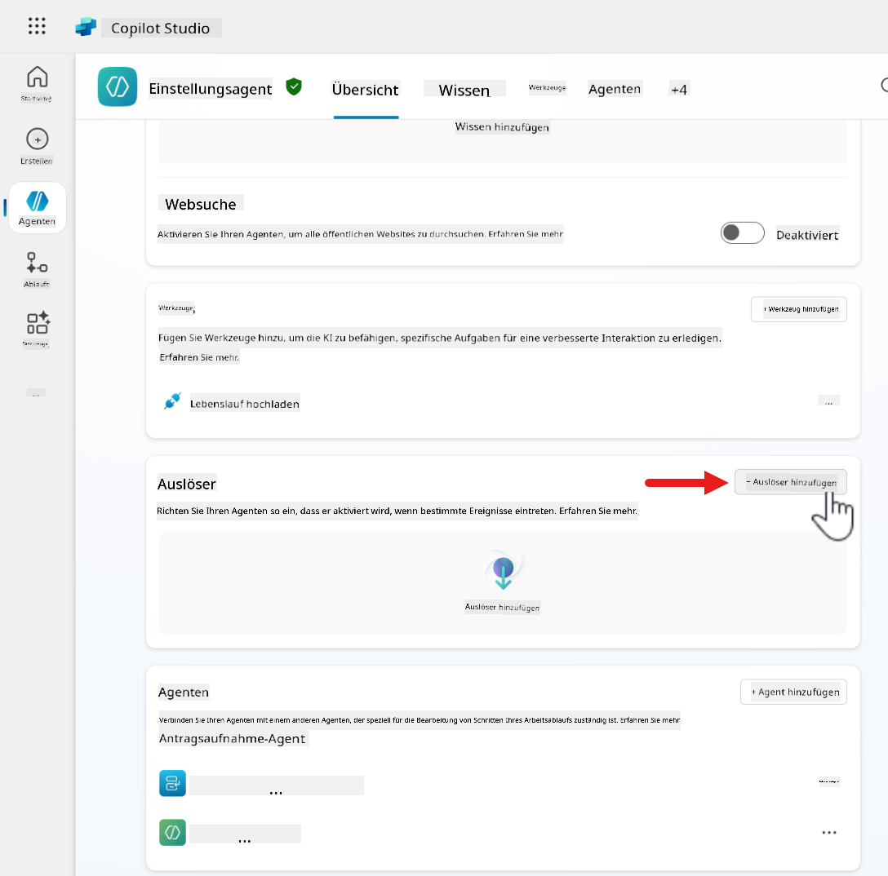

1. Eine Liste von Triggern wird angezeigt. Wählen Sie **Wenn eine neue E-Mail eingeht (V3)** und klicken Sie auf **Weiter**.

       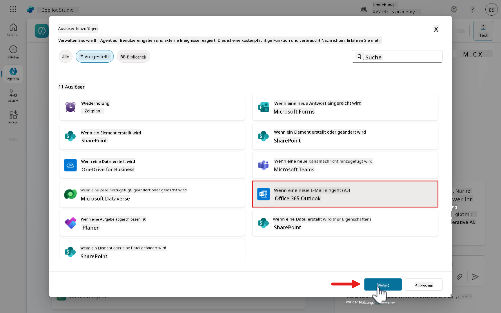

1. Nun sehen Sie den **Trigger-Namen** und die **Anmeldeverbindungen** für die aufgeführten Apps.

       Benennen Sie den Trigger wie folgt um:
    
       ```text
       Wenn eine neue E-Mail von einem Bewerber eingeht
       ```

       Stellen Sie sicher, dass Sie ein grünes Häkchen bei jeder der aufgeführten Verbindungen sehen. Falls nicht, melden Sie sich über die Ellipse (...) an und wählen **+ Neue Verbindungsreferenz**, um eine neue Verbindungsreferenz zu erstellen.

       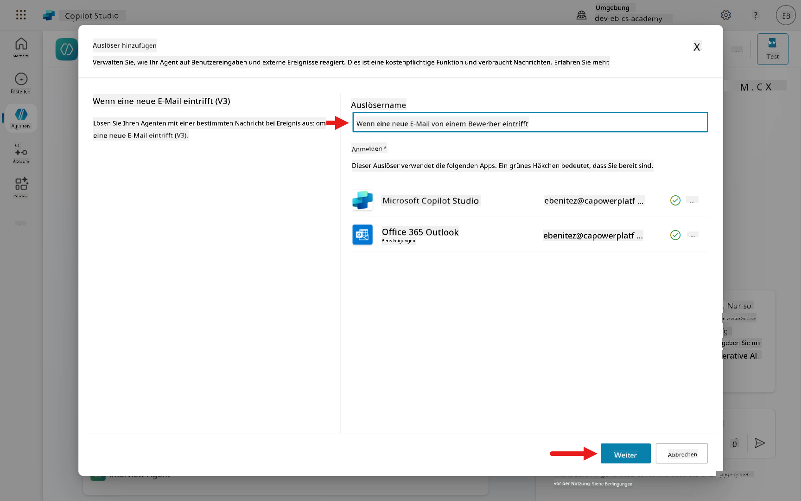

1. Der letzte Schritt besteht darin, die Eingabeeigenschaften des Triggers festzulegen. Aktualisieren Sie die folgenden Eigenschaften wie angegeben:

     | Eigenschaft | Einstellung | Details |
     |-------------|-------------|---------|
     | **Anhänge einbeziehen (optional)** | Dropdown | Ja |
     | **Betreff-Filter (optional)** | Mit Tastatur eingeben | Bewerbung |
     | **Nur mit Anhängen (optional)** | Dropdown | Ja |

       Wählen Sie **Trigger erstellen**.

       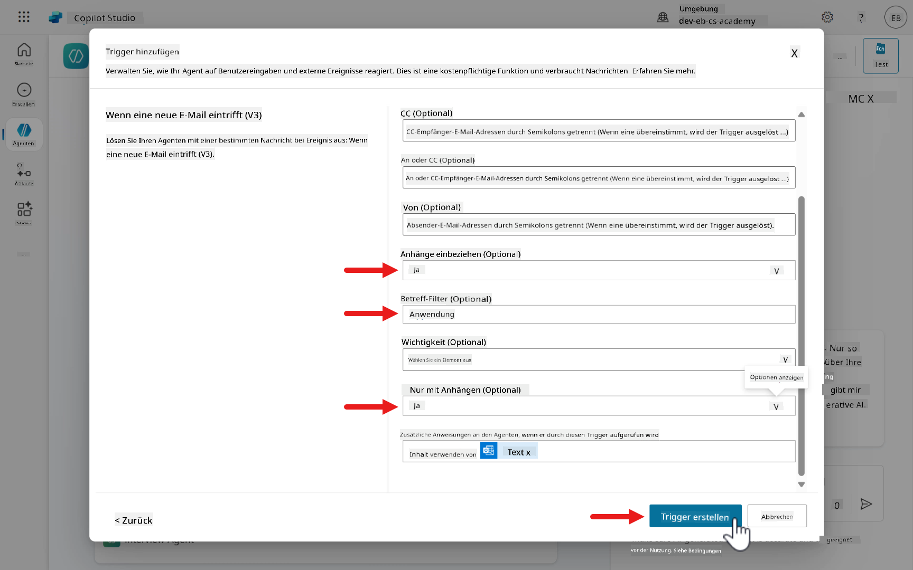

1. Nach der Erstellung erscheint eine Bestätigungsmeldung, dass der Trigger dem Agenten hinzugefügt wurde. Wählen Sie **Schließen**, und der Trigger wird im Abschnitt **Triggers** aufgelistet.
Wir werden nun den Ereignisauslöser aktualisieren, um weitere Automatisierungsfunktionen hinzuzufügen. Wählen Sie die **Ellipsen (...)** beim Auslöser und dann **In Power Automate bearbeiten** aus.

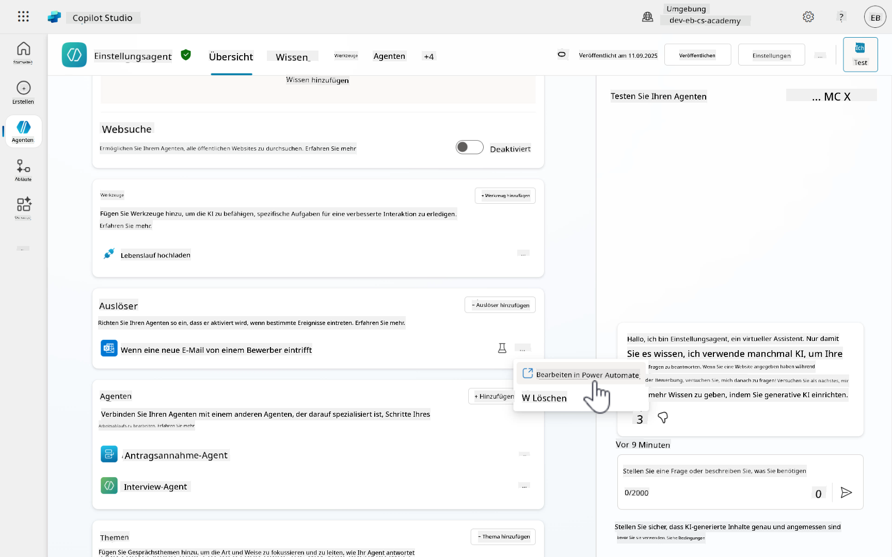

1. Der Auslöser wird dann als Flow im Power Automate Maker-Portal geladen. Was Sie sehen, ist der Flow-Designer im Power Automate Maker-Portal. Hier können wir weitere Logik und Aktionen für mehr Automatisierung hinzufügen. Der Auslöser erscheint oben, gefolgt von **Sendet eine Eingabeaufforderung an den angegebenen Copilot zur Verarbeitung** als letzte Aktion im Flow.

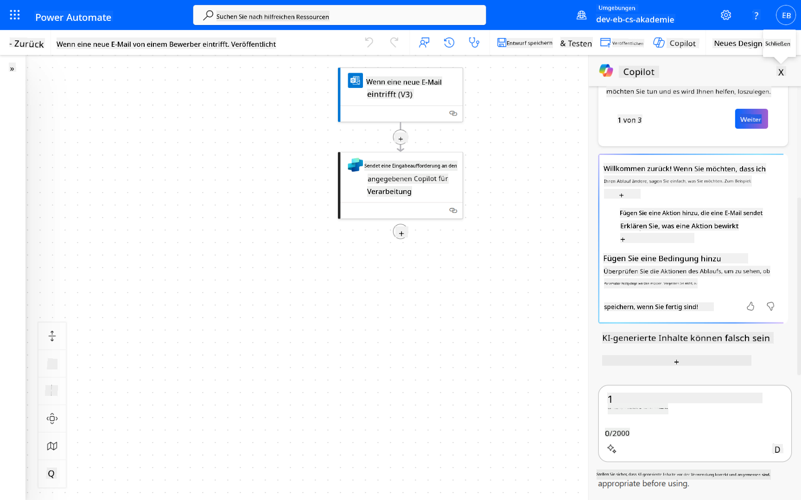

1. Standardmäßig kann der Auslöser **Wenn eine neue E-Mail eintrifft** in Power Automate mehrere E-Mails gleichzeitig verarbeiten, wenn mehrere E-Mails auf einmal eintreffen, und den Flow nur einmal für die gesamte Gruppe ausführen.

Um sicherzustellen, dass der Flow für jede E-Mail separat ausgeführt wird, aktivieren Sie die Einstellung **Split On** in den Einstellungen des Auslösers und wählen Sie `@triggerOutputs()?['body/value']` im Dropdown-Feld für Arrays aus.

Mit aktivierter **Split On**-Einstellung und dem Array-Feld auf `@triggerOutputs()?['body/value']` gesetzt, wird der Flow individuell für jede Nachricht ausgeführt, auch wenn viele gleichzeitig eintreffen.

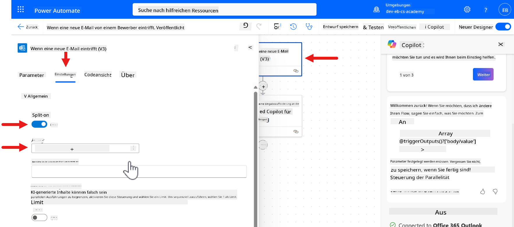

1. Als Nächstes fügen wir eine Logik hinzu, um den Dateityp des Anhangs zu überprüfen. Wir möchten nur .PDF-Dateianhänge hochladen und keine Bilder (diese könnten aus E-Mail-Signaturen stammen). Wählen Sie das **+**-Symbol unterhalb des Auslösers und dann **Steuerung** im Abschnitt **Integrierte Tools** aus.

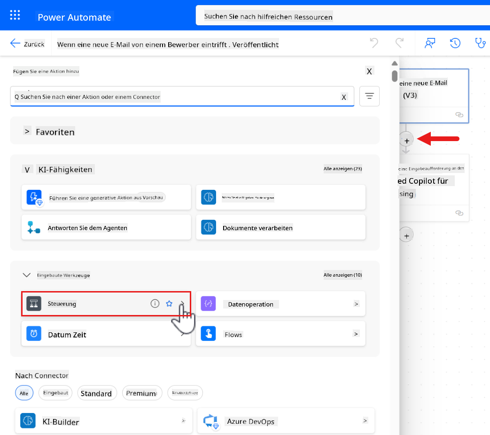

1. Wählen Sie die Aktion **Bedingung** aus.

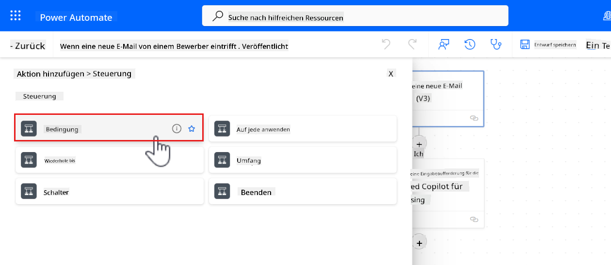

1. Konfigurieren Sie nun die Bedingung, um zu überprüfen, ob der Dateityp des Anhangs .PDF ist. Im Feld **Wert auswählen** wählen Sie das **Blitzsymbol** oder das **fx-Symbol** rechts aus.

1. Geben Sie im **Suchfeld** Folgendes ein:

```text
content type
```

1. Wählen Sie dann den Parameter **Attachments Content-Type** aus dem Auslöser aus.

1. Wählen Sie anschließend **Hinzufügen**, um den dynamischen Inhalt in den **Id**-Parameter der Aktion einzufügen.

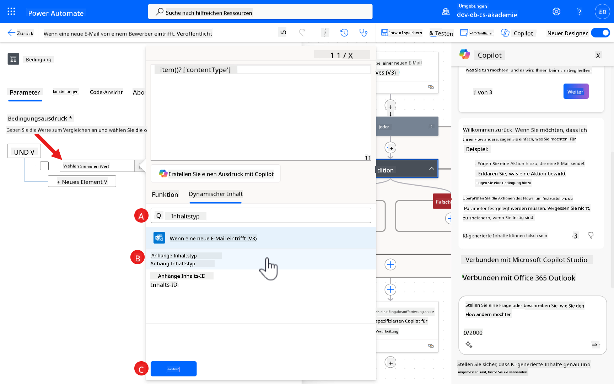

1. Lassen Sie uns hier kurz innehalten. Sie haben wahrscheinlich bemerkt, dass die Aktion **Für jedes** automatisch erschienen ist.

Wählen Sie die Aktion **Für jedes** aus. Diese Aktion stellt das Durchlaufen jedes Anhangs in der E-Mail dar, da der Parameter **Attachments Content-Type** aus dem Auslöser mit jedem Anhang verknüpft ist.

Im Hintergrund handelt es sich um ein Array, und deshalb wurde die Aktion **Für jedes** automatisch hinzugefügt, als wir den Parameter **Attachments Content-Type** in der Aktion **Bedingung** ausgewählt haben.

Um mehr darüber zu erfahren, erweitern Sie den folgenden zusätzlichen Lernblock.

??? info "Zusätzliches Lernen: Für jedes-Aktion erscheint automatisch"

🤔 **Warum erscheint "Für jedes" automatisch?**

Wenn Sie einen Parameter (dynamischen Inhalt) auswählen, der eine Liste oder ein Array von Elementen darstellt – zum Beispiel eine Liste von Anhängen, E-Mails oder Zeilen – erkennt Power Automate, dass Sie möglicherweise jedes Element einzeln verarbeiten möchten.

Um Ihnen dabei zu helfen, fügt Power Automate automatisch eine **"Für jedes"**-Schleife um Ihre Aktion hinzu. Dies stellt sicher, dass Ihre Aktion einmal für jedes Element in der Liste ausgeführt wird, anstatt zu versuchen, die gesamte Liste auf einmal zu verarbeiten (was zu Fehlern führen könnte).

🦋 **Beispiel**

- Wenn Sie "Anhänge" aus einer vorherigen Aktion auswählen (was ein Array ist) und versuchen, es in einer Aktion zu verwenden, die eine einzelne Datei erwartet, umschließt Power Automate Ihre Aktion in einer **"Für jedes"**-Schleife.
- Auf diese Weise wird Ihre Aktion für **jeden Anhang** ausgeführt – einzeln.

💡 **Wichtige Punkte**

- **Automatisch:** Die Schleife erscheint automatisch, um Ihnen zu helfen, jedes Element in einer Sammlung zu verarbeiten.
- **Verhindert Fehler:** Ohne die Schleife könnte Ihre Aktion fehlschlagen, da sie möglicherweise nicht mit mehreren Elementen gleichzeitig umgehen kann.
- **Visueller Hinweis:** Es ist eine visuelle Darstellung, dass Ihr Flow die Aktion für jedes Element in der Liste wiederholt.

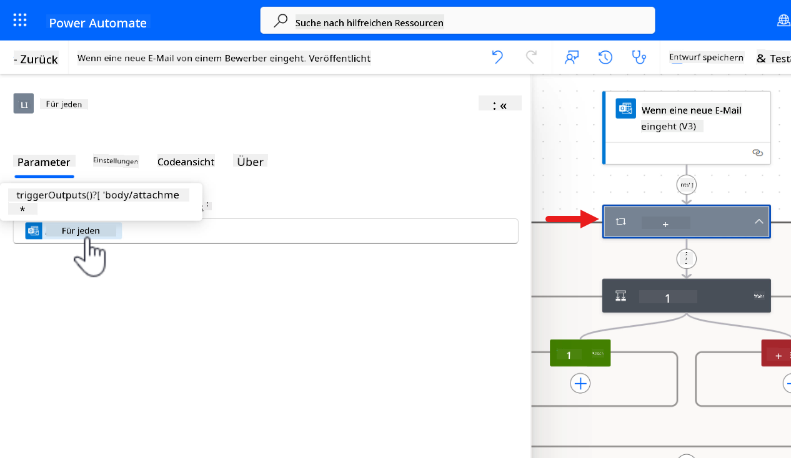

1. Geben Sie im anderen Feld **Wert auswählen** Folgendes ein:

```text
application/pdf
```

Dies stellt sicher, dass für jeden Dateianhang überprüft wird, ob das Dateiformat .PDF ist.

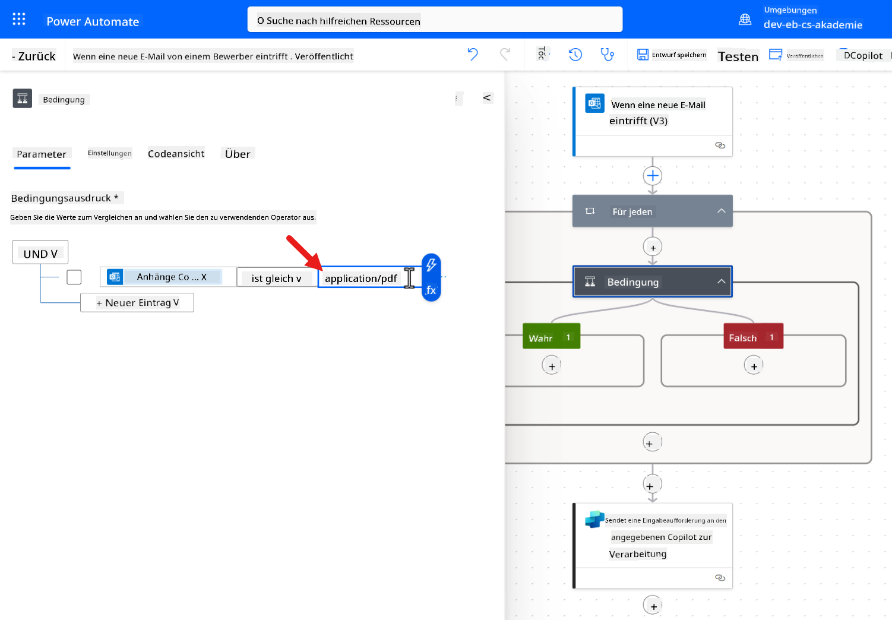

1. Nun konfigurieren wir den **Wahr**-Pfad, um die Datei aus der E-Mail zu extrahieren und sie in die **Lebenslauf**-Dataverse-Tabelle hochzuladen.

Fügen Sie eine neue Aktion im **Wahr**-Pfad hinzu und suchen Sie nach `html to text`. Wählen Sie die Aktion **Html to text** aus.

Um mehr über die Aktion **Html to text** zu erfahren, erweitern Sie den folgenden zusätzlichen Lernblock.

??? info "Zusätzliches Lernen: Html to text-Aktion"

🤔 **Was ist die "HTML to text"-Aktion?**

Die **HTML to text**-Aktion in Power Automate wird verwendet, um HTML-formatierte Inhalte in reinen Text umzuwandeln. Dies ist besonders nützlich, wenn Sie Daten (wie E-Mails, Webinhalte oder API-Antworten) erhalten, die HTML-Tags enthalten, und Sie nur den lesbaren Text ohne Formatierung oder Code extrahieren möchten.

⚙️ **Wie funktioniert es?**

- **Eingabe:** Sie geben eine Zeichenfolge mit HTML-Inhalt an (zum Beispiel den Textkörper einer E-Mail).
- **Ausgabe:** Die Aktion entfernt alle HTML-Tags und gibt nur den reinen Text zurück.

👍🏻 **Wann sollten Sie es verwenden?**

- Wenn Sie lesbaren Text aus E-Mails, Webseiten oder API-Antworten extrahieren möchten, die HTML enthalten.
- Bevor Sie Inhalte an Systeme senden, die keine HTML-Formatierung unterstützen (wie SMS, Teams-Nachrichten oder Datenbanken).
- Um Daten für die weitere Verarbeitung oder Analyse zu bereinigen.

🔭 **Wo finden Sie es?**

- In Power Automate für Agenten-Flows, suchen Sie nach der Aktion `HTML to text`. Sie befindet sich unter dem **Datenoperationen**-Konnektor.

💡 **Wichtige Punkte**

- Es entfernt alle HTML-Tags und lässt nur den Text übrig.
- Es interpretiert oder führt keine Skripte/Styles aus – es entfernt nur die Tags.
- Nützlich zur Datenbereinigung und zur Vorbereitung von Inhalten für reine Textausgaben.

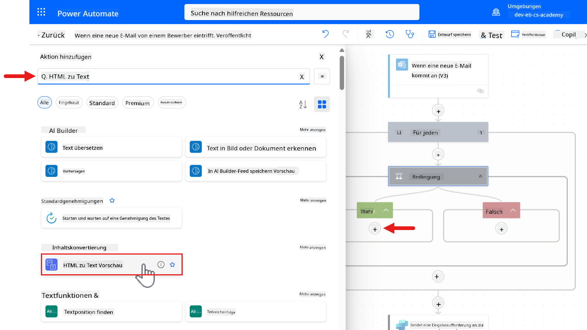

1. Als Nächstes müssen wir eine neue Verbindungsreferenz für die Aktion **Html to text** erstellen, indem wir **Neu hinzufügen** auswählen.

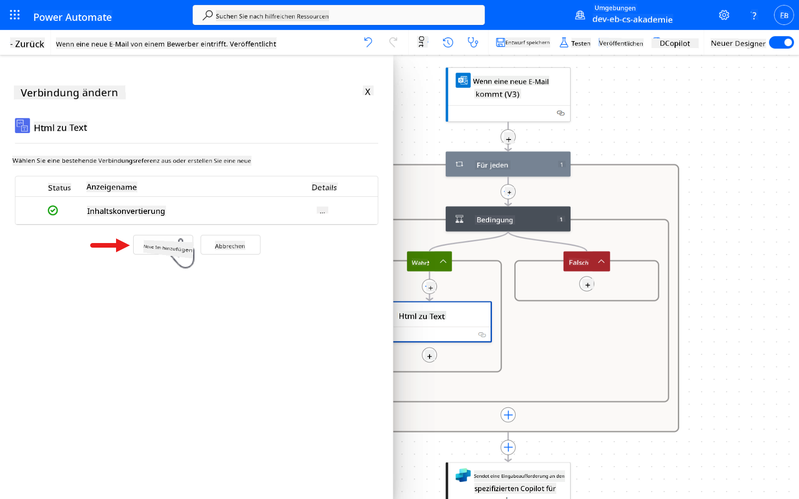

1. Die Aktion kann nun konfiguriert werden. Fügen Sie den **Body**-Parameter aus dem Auslöser hinzu. Wählen Sie im Feld **Inhalt** das **Blitzsymbol** oder **fx-Symbol** rechts aus.

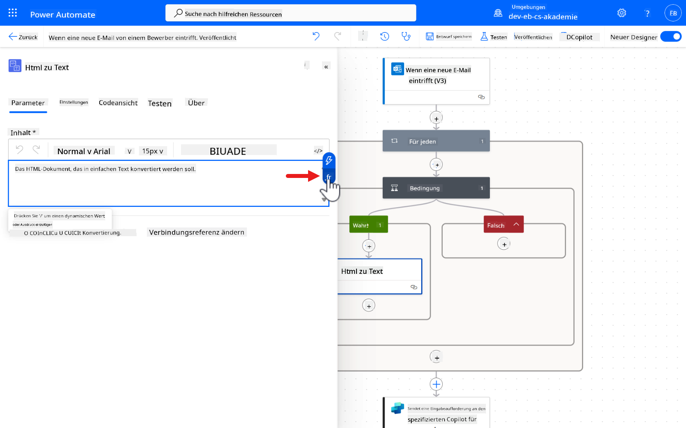

1. Suchen Sie im Tab **Dynamischer Inhalt** nach `body` und wählen Sie den **Body**-Parameter aus, gefolgt von **Hinzufügen**.

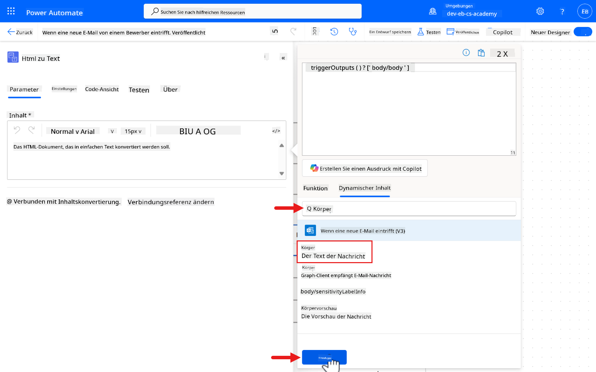

1. Wir haben die Konfiguration dieser Aktion abgeschlossen, also verlassen wir die Aktion, indem wir auf die beiden nach links zeigenden Winkelklammern («) klicken, um das Panel zu minimieren.

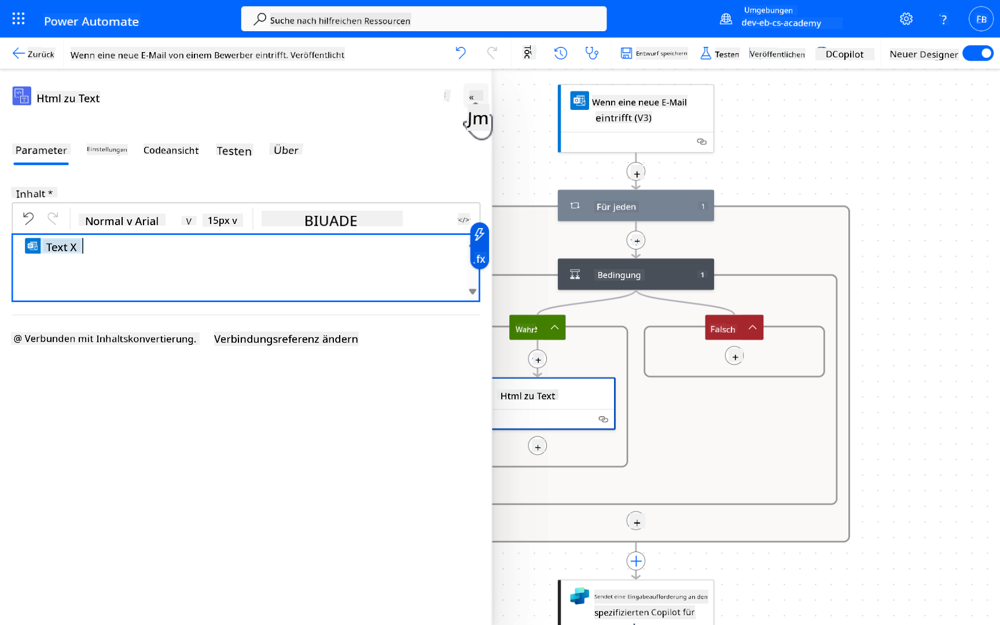

1. Fügen Sie eine neue Aktion hinzu, indem Sie auf das **+ Symbol** unterhalb der Aktion **Html to text** klicken, wodurch das Panel zum Hinzufügen von Aktionen geladen wird. Wählen Sie den **Microsoft Dataverse**-Konnektor aus.

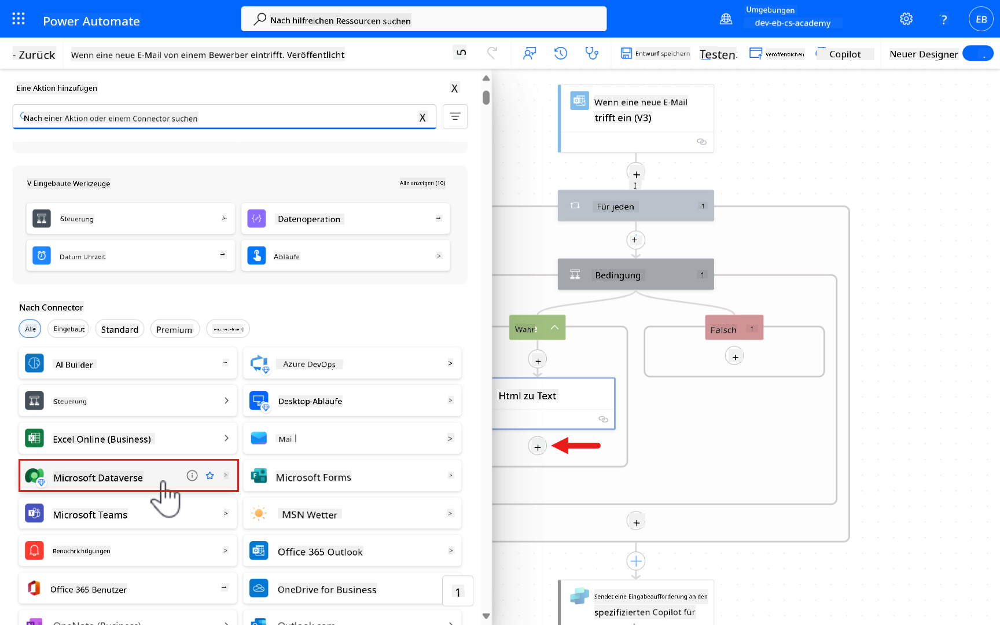

1. Wählen Sie die Aktion **Neue Zeile hinzufügen** aus.

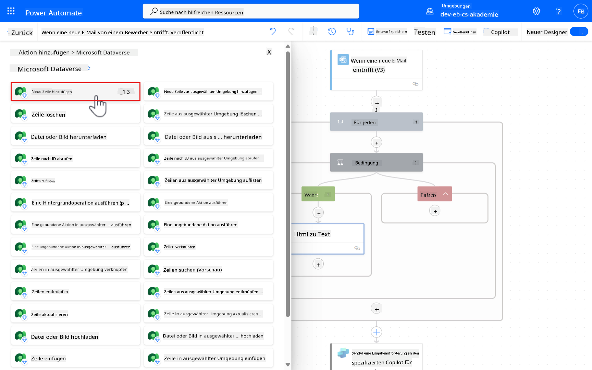

1. Benennen Sie die Aktion um, indem Sie die **Ellipsen (...)** auswählen, und kopieren und fügen Sie den folgenden Namen ein:

```text
Neuen Lebenslauf hinzufügen
```

Für den Parameter **Tabellenname** suchen Sie nach `res` und wählen die Tabelle **Lebensläufe** aus.

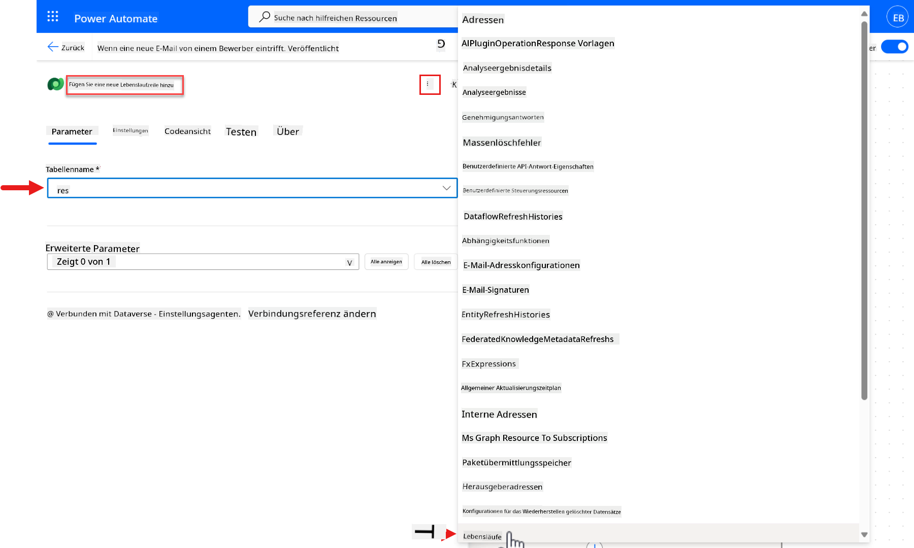

1. Wählen Sie das Feld **Lebenslauftitel** aus und klicken Sie auf das **Blitzsymbol** oder **fx-Symbol** rechts.

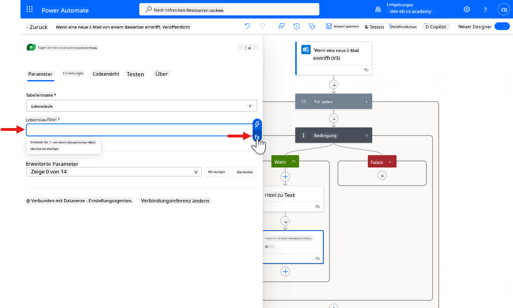

1. Geben Sie im **Funktion-Tab** den folgenden Ausdruck ein, der die Funktion `item()` verwendet:

```text
item()?['name']
```

Um mehr über die Funktion `item()` zu erfahren, erweitern Sie den folgenden zusätzlichen Lernblock.

??? info "Zusätzliches Lernen: `item()`-Funktion"

🤔 **Was ist die `item()`-Funktion?**

- Wenn Sie eine **Für jedes**-Aktion verwenden, durchläuft Power Automate jedes Element in einer Sammlung (Array).
- Sie wird am häufigsten in Aktionen wie **Für jedes**, **Auswählen** oder **Array filtern** verwendet.

⚙️ **Wie funktioniert es?**

- `item()` ist eine Funktion, die das aktuelle Element zurückgibt, das in einer Schleife oder Array-Operation verarbeitet wird.
- Innerhalb dieser Schleife bezieht sich `item()` auf das _aktuelle Element_, das verarbeitet wird.

📌 **Wo wird sie verwendet?**

- **Für jedes:** Um auf Eigenschaften des aktuellen Elements zuzugreifen.
- **Auswählen:** Um jedes Element in einem Array zu transformieren.
- **Array filtern:** Um auf das aktuelle Element zuzugreifen, das ausgewertet wird.

🦋 **Beispiel**

- Ausdruck innerhalb einer Schleife:
       -  `item()?['Email']`
- Dies ruft die Eigenschaft `Email` des aktuellen Elements ab.

💡 **Wichtige Punkte**

- `item()` ist _kontextabhängig_: Es bezieht sich immer auf das aktuelle Element in der Schleife oder Array-Operation, in der Sie sich befinden.
- Wenn Sie verschachtelte Schleifen haben, können Sie `items('LoopName')` verwenden, um auf Elemente in einer bestimmten Schleife zu verweisen.

Wählen Sie **Hinzufügen**, um den Ausdruck in den Parameter **Lebenslauftitel** einzufügen.


1. Wir müssen noch mehrere Parameter konfigurieren. Wählen Sie **Alle anzeigen** und im Feld **Anschreiben** das **Blitzsymbol** oder **fx-Symbol** rechts aus.

Geben Sie im **Funktion-Tab** den folgenden Ausdruck ein, der denselben Ausdruck wie in der vorherigen [Mission](../02-multi-agent/README.md) verwendet:

```text
if(greater(length(body('Html_to_text')), 2000), substring(body('Html_to_text'), 0, 2000), body('Html_to_text'))
```

Dieser Ausdruck überprüft, ob der _Text_ aus der Aktion **Html to text** länger als 2000 Zeichen ist, und gibt, falls ja, nur die ersten 2000 Zeichen zurück; andernfalls gibt er den vollständigen Text zurück.

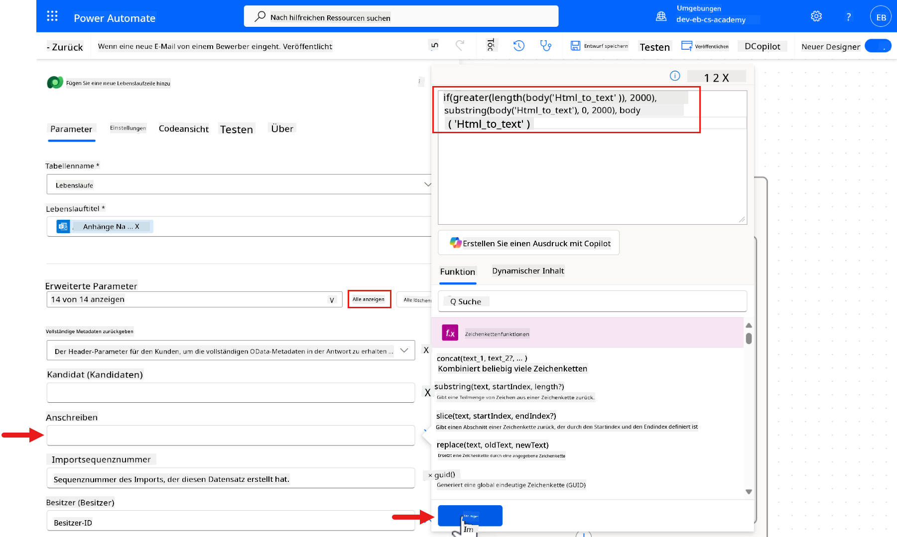

1. Der Ausdruck wird nun dem Feld **Anschreiben** hinzugefügt.

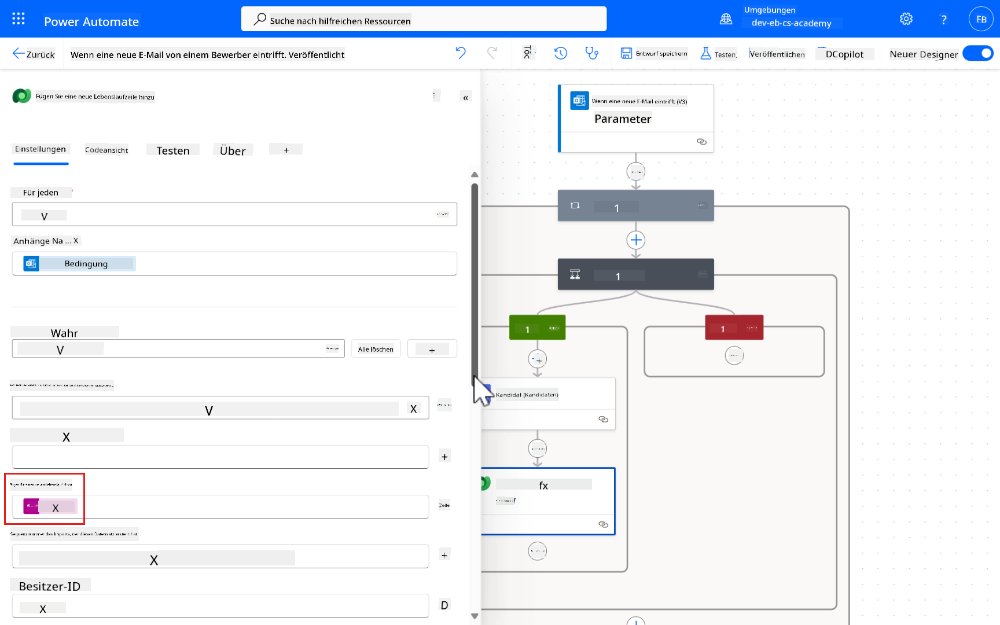

1. Für das Feld **E-Mail-Adresse der Quelle** suchen Sie nach `from` und wählen den Parameter **Von** aus dem Auslöser aus, da dieser den Wert der E-Mail-Adresse enthält.

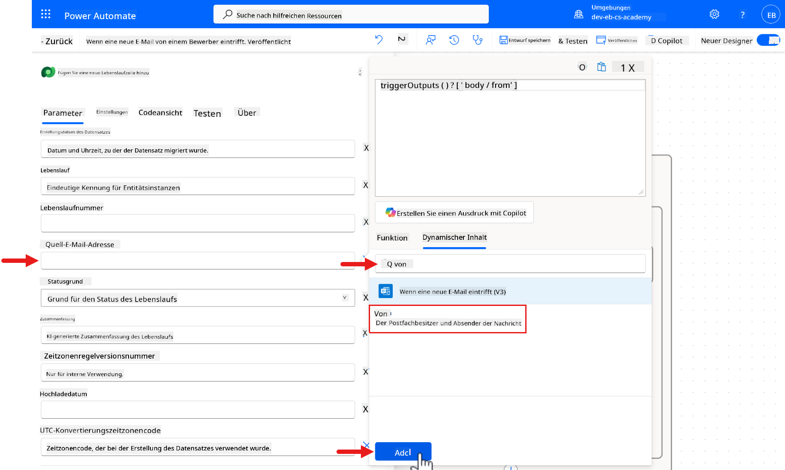

1. Für das Feld **Hochladedatum** wählen Sie das **Blitzsymbol** oder **fx-Symbol** rechts aus. Geben Sie im **Funktion-Tab** den folgenden Ausdruck ein, der die Funktion `utcNow()` verwendet:

```text
utcNow()
```

Um mehr über die Funktion `utcNow` zu erfahren, erweitern Sie den folgenden zusätzlichen Lernblock.

??? info "Zusätzliches Lernen: `utcNow`-Funktion"

🤔 **Was ist die `utcNow()`-Funktion?**

- Die Funktion `utcNow()` in Power Automate gibt das aktuelle Datum und die Uhrzeit in koordinierter Weltzeit (UTC) im ISO 8601-Format zurück, z. B.: `2025-09-23T04:32:14Z`.

🦋 **Beispiel**

- Ausdruck:
       -  `concat('Bericht erstellt am ', utcNow())`
- Ausgabe ist:
       - Bericht erstellt am `2025-09-23T04:32:14Z`.

💡 **Wichtige Punkte**
- **Keine Argumente (Eingabeparameter) erforderlich:** Gibt immer den aktuellen UTC-Zeitstempel zurück.
   - **Anwendungsfälle**
       - Hinzufügen von Zeitstempeln zu Protokollen oder Dateinamen
       - Vergleich der aktuellen Zeit mit anderen Daten
       - Planung oder zeitbasierte Bedingungen

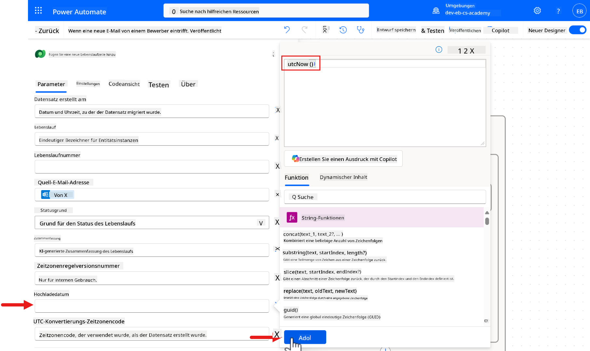

1. Wir haben nun die Konfiguration der Aktion **Neue Lebenslaufzeile hinzufügen** abgeschlossen, also verlassen wir das Panel, indem wir es einklappen.

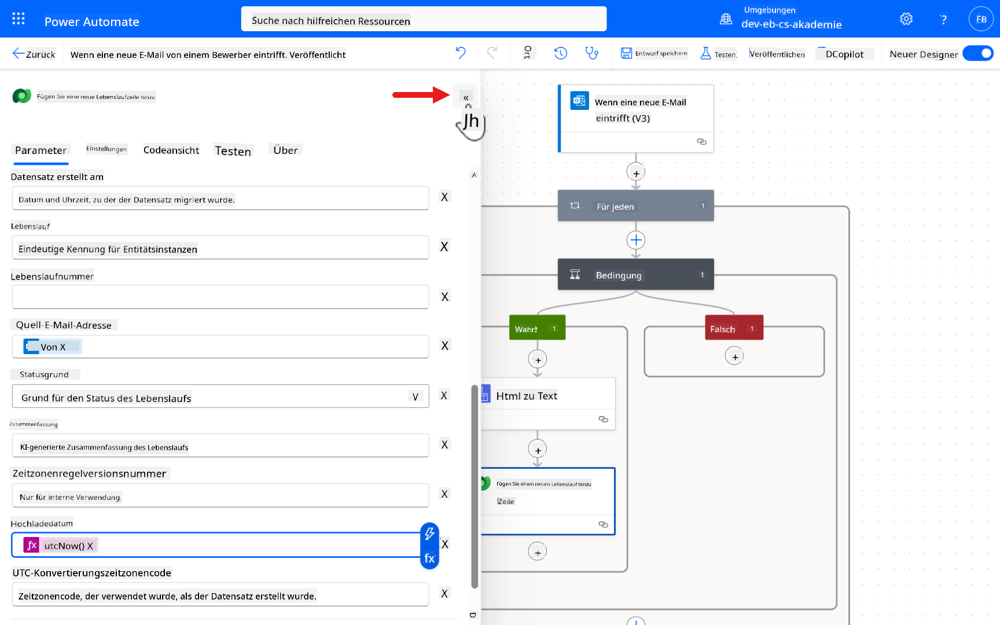

1. Wir fügen eine neue Aktion hinzu, indem wir das **+ Symbol** unter der Aktion **Neue Lebenslaufzeile hinzufügen** auswählen, wodurch das Panel zum Hinzufügen von Aktionen geladen wird. Wählen Sie erneut den **Microsoft Dataverse**-Connector aus.

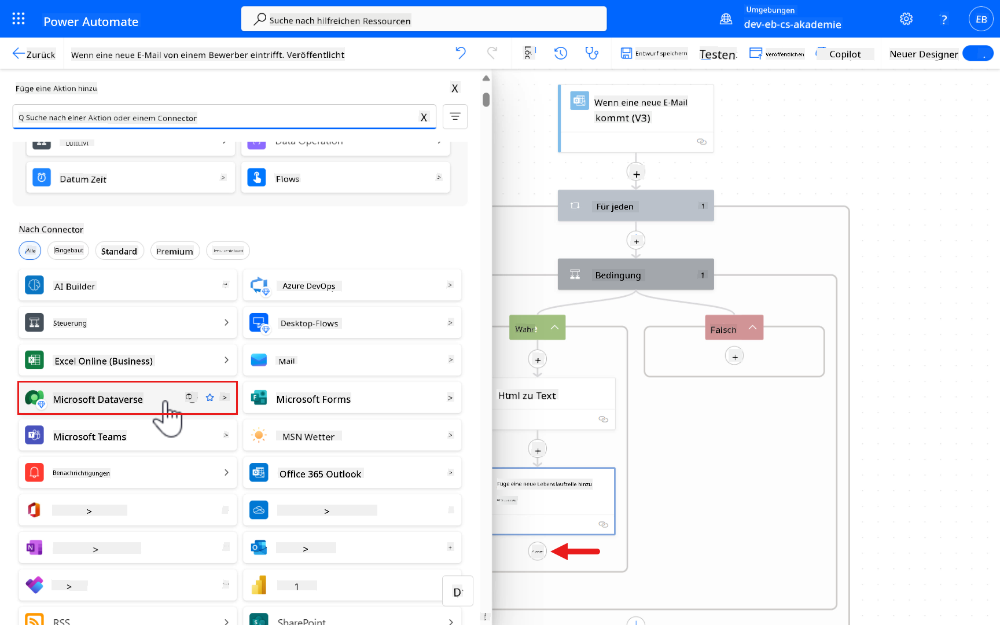

1. Wählen Sie die Aktion **Eine Datei oder ein Bild hochladen** aus.

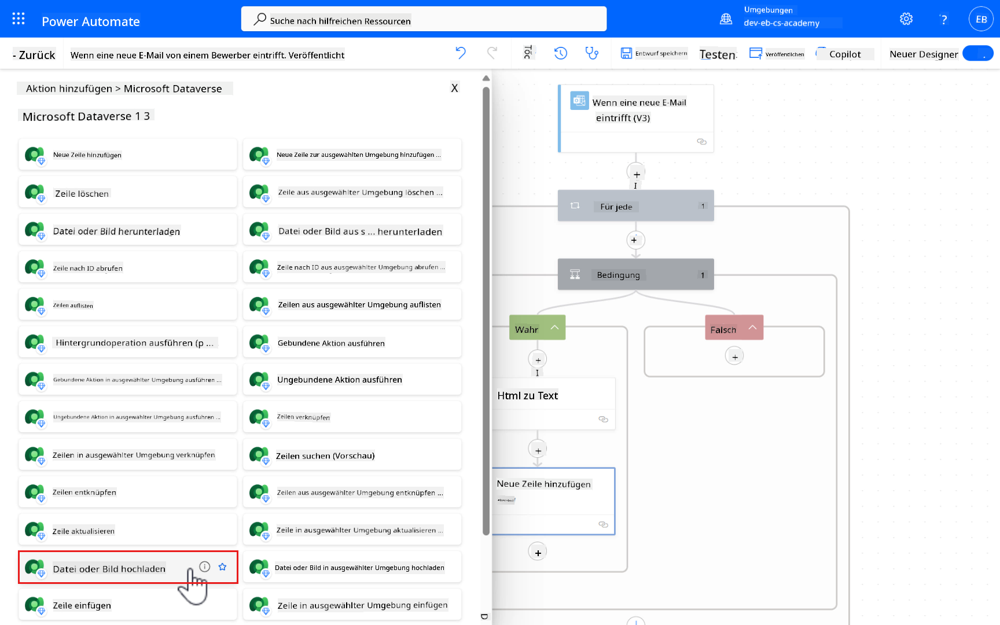

1. Benennen Sie die Aktion um, indem Sie die **Ellipsis (...)** auswählen, und kopieren und fügen Sie den folgenden Namen ein:

```text
Upload Resume File
```

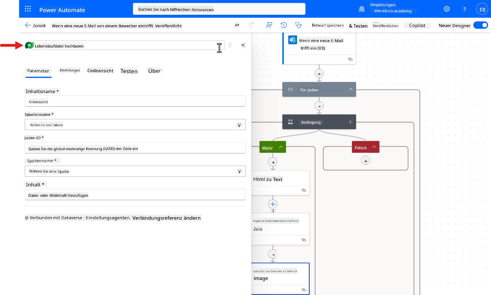

1. Wählen Sie als Nächstes das Feld **Content name** aus und klicken Sie auf das **Blitzsymbol** oder **fx-Symbol** rechts.

Im **Funktions-Tab** geben Sie den folgenden Ausdruck ein, der die Funktion `item()` verwendet. Dies ruft die Eigenschaft `name` des aktuellen Elements (der Anhangsdatei) ab.

```text
item()?['name']
```

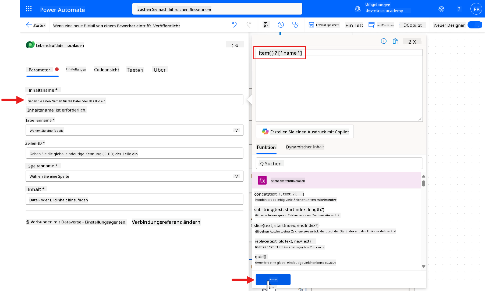

1. Für den Parameter **Table name** suchen Sie nach `res` und wählen die Tabelle **Resumes** aus.

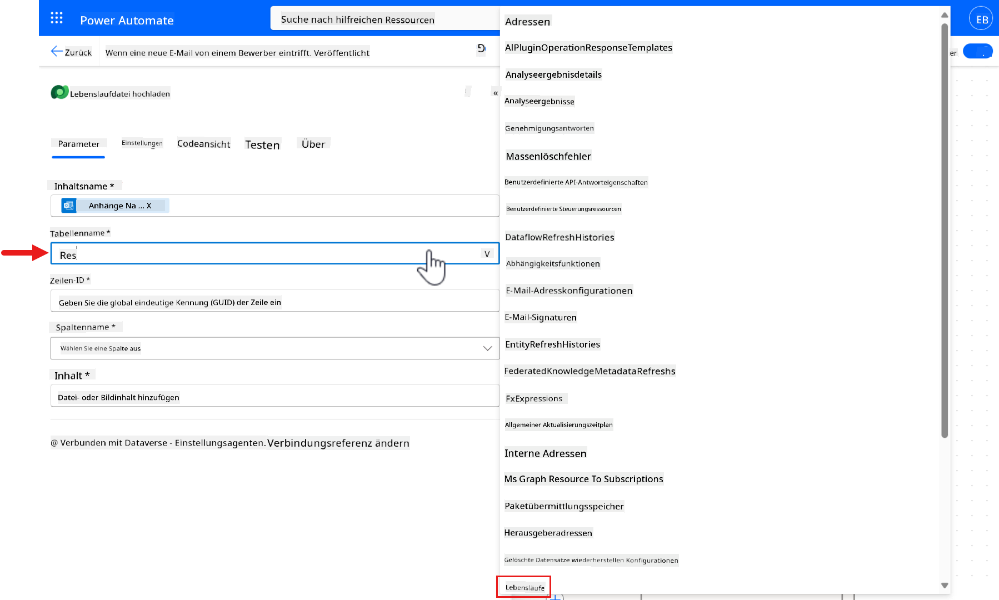

1. Wählen Sie als Nächstes das Feld **Row ID** aus und klicken Sie auf das **Blitzsymbol** oder **fx-Symbol** rechts.

Suchen Sie nach `ID` und wählen Sie den Parameter **Resume** aus der Aktion _Neue Zeile hinzufügen_ im Dataverse aus, da dieser den ID-Wert der Zeile enthält, in die die PDF-Datei hochgeladen werden soll.

Wählen Sie **Hinzufügen**.

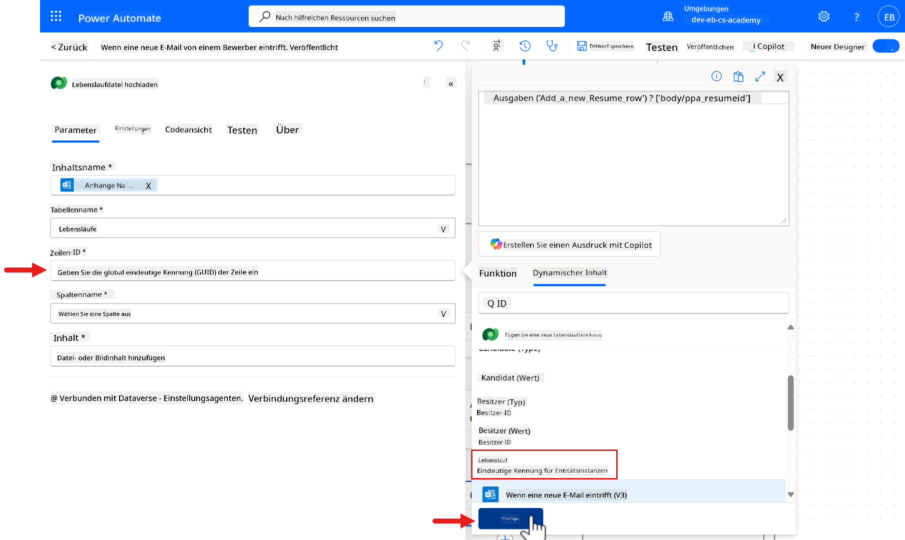

1. Wählen Sie das Feld **Column name** aus und wählen Sie die Option **Resume PDF**.

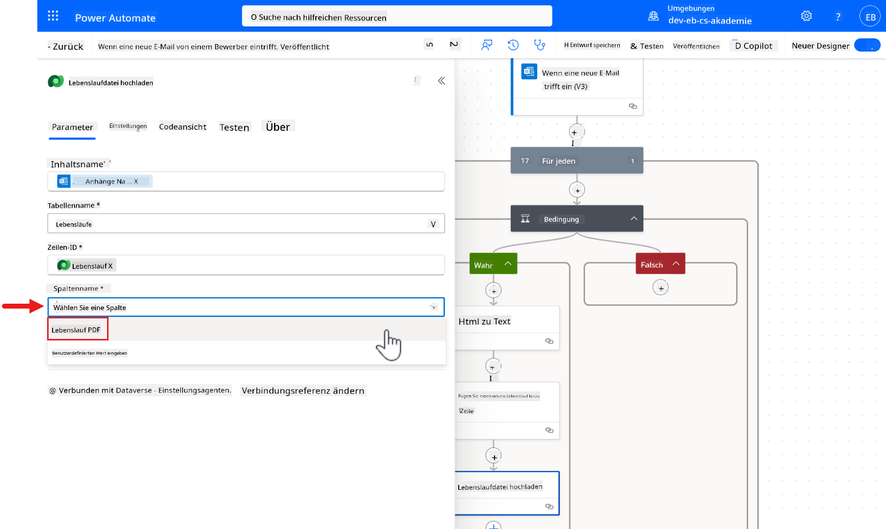

1. Wählen Sie das Feld **Content** aus und klicken Sie auf das **Blitzsymbol** oder **fx-Symbol** rechts.

Im **Funktions-Tab** geben Sie den folgenden Ausdruck ein, der die Funktion `item()` verwendet. Dies ruft die Eigenschaft `contentBytes` des aktuellen Elements (der Anhangsdatei) ab. `contentBytes` bezieht sich auf die rohen Binärdaten einer Datei oder eines Anhangs, codiert als Base64-String.

```text
item()?['contentBytes']
```

1. Wir haben die Konfiguration dieser Aktion abgeschlossen, also verlassen wir die Aktion, indem wir die beiden nach links zeigenden Winkelklammern («) auswählen, um das Panel einzuklappen.


1. Wählen Sie als Nächstes die Aktion **Sendet eine Eingabeaufforderung an den angegebenen Copilot zur Verarbeitung** aus und ziehen Sie diese Aktion unter die Aktion **Upload Resume File** im _True_-Pfad der Bedingung.

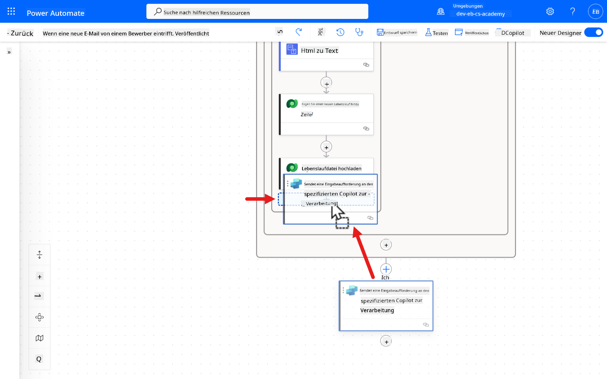

1. Wählen Sie die Aktion **Sendet eine Eingabeaufforderung an den angegebenen Copilot zur Verarbeitung** aus, um sie zu konfigurieren.

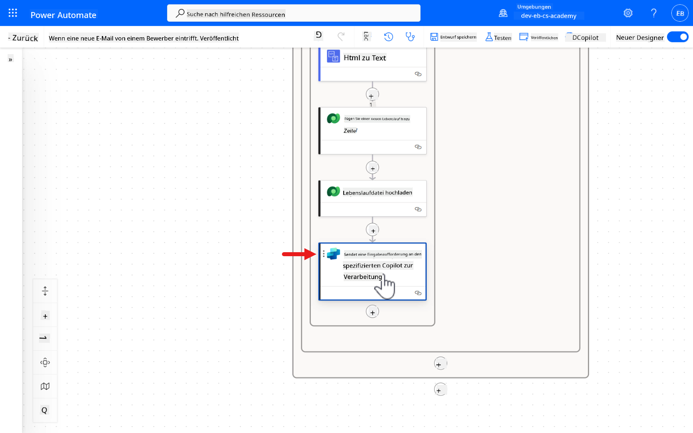

1. Im Feld **Body/message** wählen Sie den gesamten Feldinhalt aus und löschen Sie ihn.

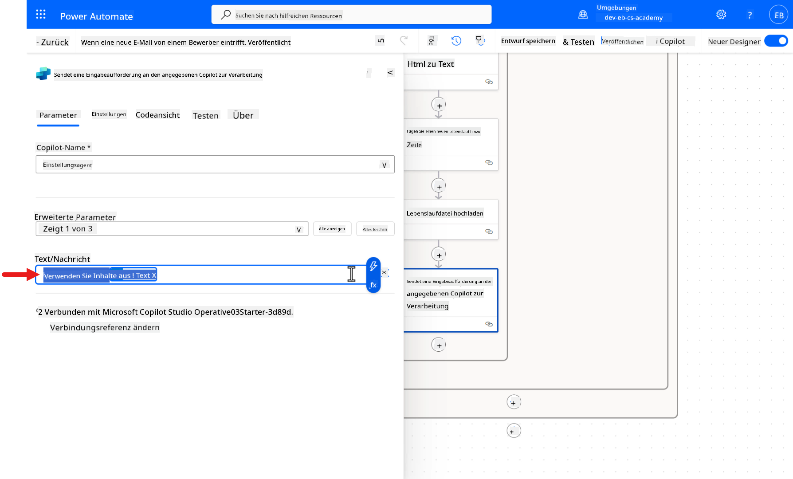

1. Kopieren und fügen Sie den folgenden Text in das Feld **Body/message** ein und markieren Sie den Platzhalter `RESUME ID PLACEHOLDER`.

```text
Send [ResumeId (text)] = "RESUME ID PLACEHOLDER" and [ResumeTitle (text_1)] = "RESUME TITLE PLACEHOLDER" and [ResumeNumber (text_2)]= "RESUME NUMBER PLACEHOLDER" to the Tool "Notify Teams Applicant channel" in the child agent "Application Intake Agent"
```

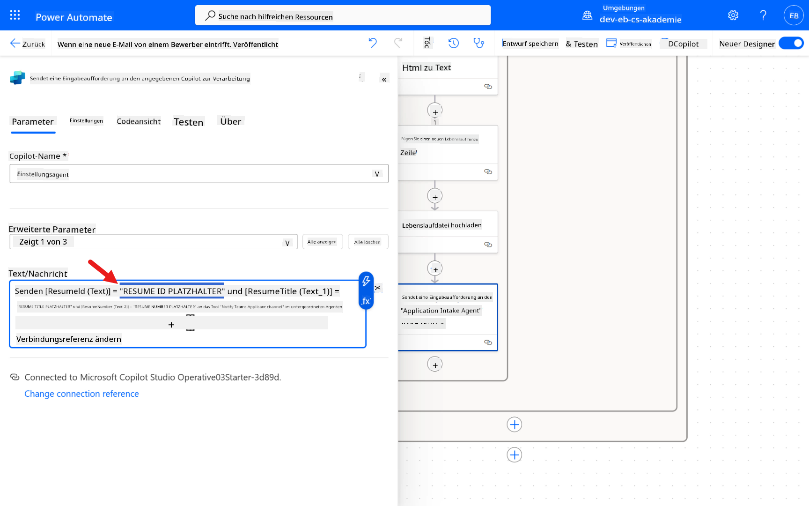

1. Wählen Sie das **Blitzsymbol** oder **fx-Symbol** rechts aus.

Suchen Sie nach `resume` und wählen Sie den Parameter **Resume** aus der Aktion _Neue Zeile hinzufügen_ im Dataverse aus, da dieser den `ID`-Wert der erstellten Lebenslaufzeile enthält.

Wählen Sie **Hinzufügen**.

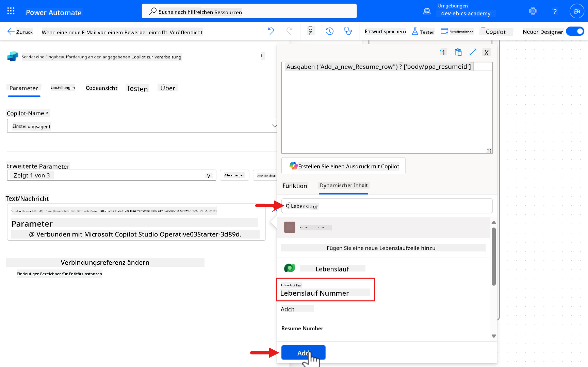

1. Markieren Sie den Platzhalter `RESUME TITLE PLACEHOLDER`. Wählen Sie das **Blitzsymbol** oder **fx-Symbol** rechts aus.

Suchen Sie nach `title` und wählen Sie den Parameter **Resume Title** aus der Aktion _Neue Zeile hinzufügen_ im Dataverse aus, da dieser den Wert `resume title` der erstellten Lebenslaufzeile enthält.

Wählen Sie **Hinzufügen**.

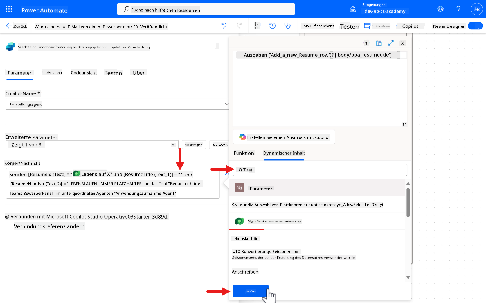

1. Markieren Sie den Platzhalter `RESUME NUMBER PLACEHOLDER`. Wählen Sie das **Blitzsymbol** oder **fx-Symbol** rechts aus.

Suchen Sie nach `resume number` und wählen Sie den Parameter **Resume Number** aus der Aktion _Neue Zeile hinzufügen_ im Dataverse aus, da dieser den Wert `Resume Number` der erstellten Lebenslaufzeile enthält.

Wählen Sie **Hinzufügen**.

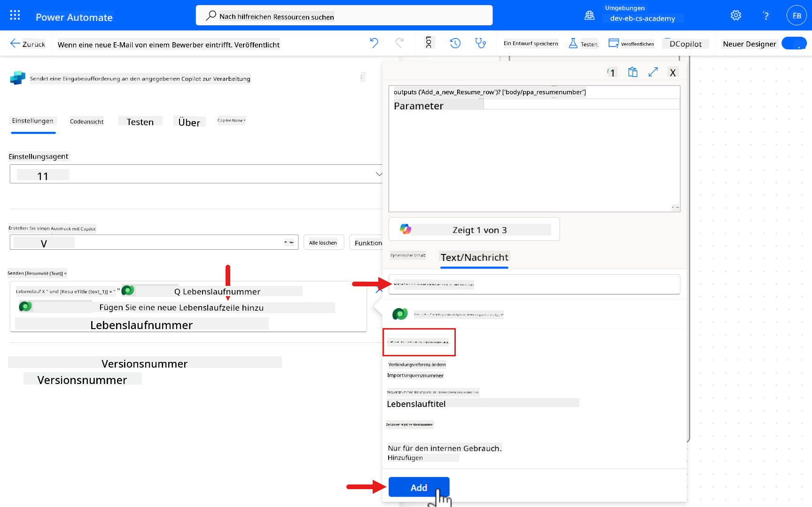

1. Wir haben die Konfiguration dieser Aktion und unseres Agentenflusses abgeschlossen 🙌🏻 Sie machen das großartig! Speichern Sie nun den Ereignisauslöser-Flow, indem Sie **Entwurf speichern** auswählen.

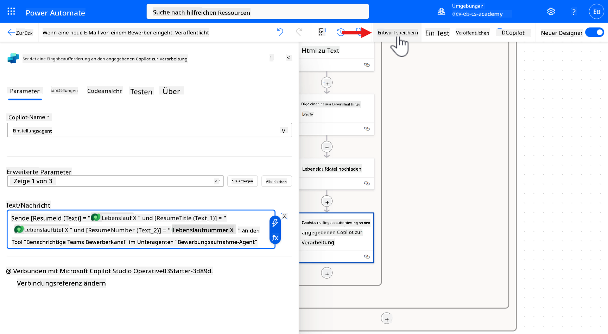

1. Jetzt müssen wir die Details des Agentenflusses bearbeiten. Wählen Sie **Zurück**.

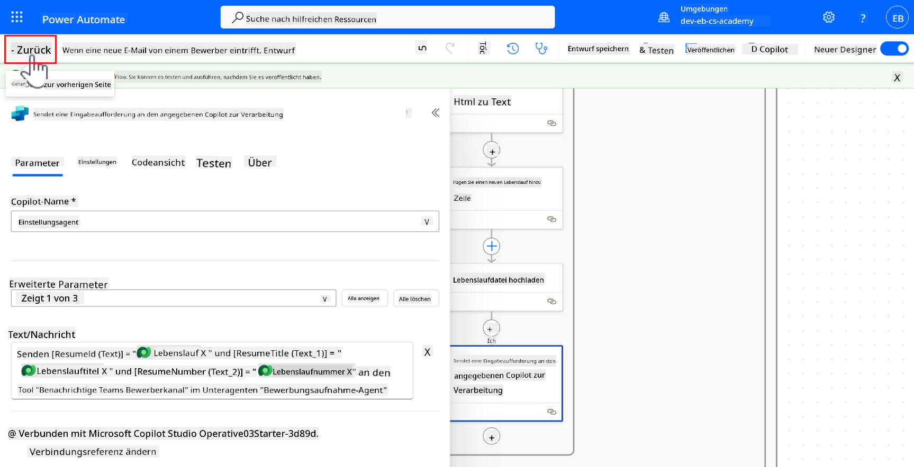

1. Wählen Sie **Bearbeiten** im Abschnitt **Details** und aktualisieren Sie den **Plan** auf die Option **Copilot Studio**.

Wählen Sie **Speichern**.

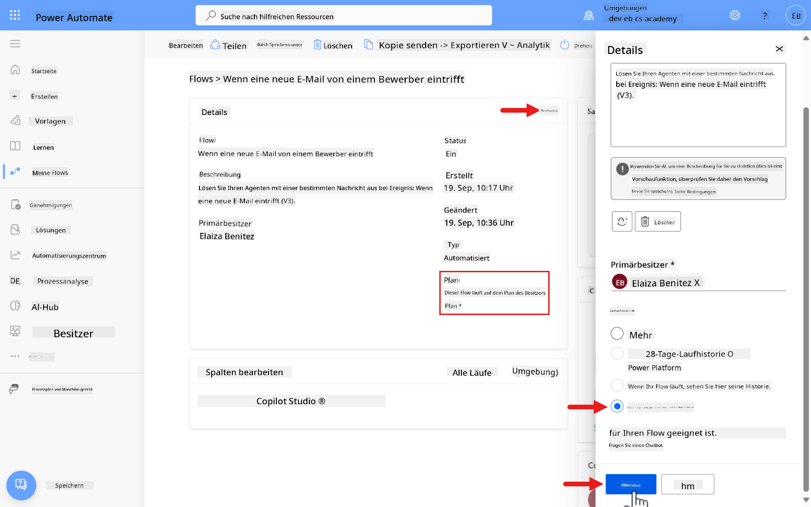

1. Ein Modal wird angezeigt, um Sie zu bitten, den Wechsel zum Copilot Studio-Plan zu bestätigen. Wählen Sie **Bestätigen**.

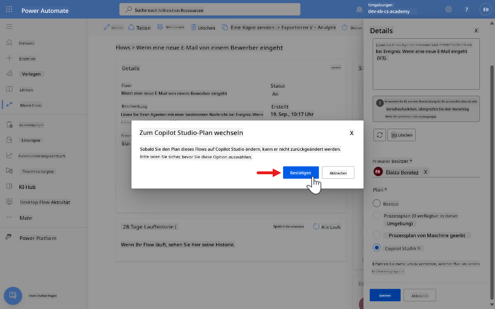

1. Der Plan wurde nun auf **Copilot Studio** aktualisiert. Wählen Sie **Bearbeiten**, da wir den Ereignisauslöser-Flow für unseren Agenten veröffentlichen müssen.


1. Wählen Sie **Veröffentlichen**.

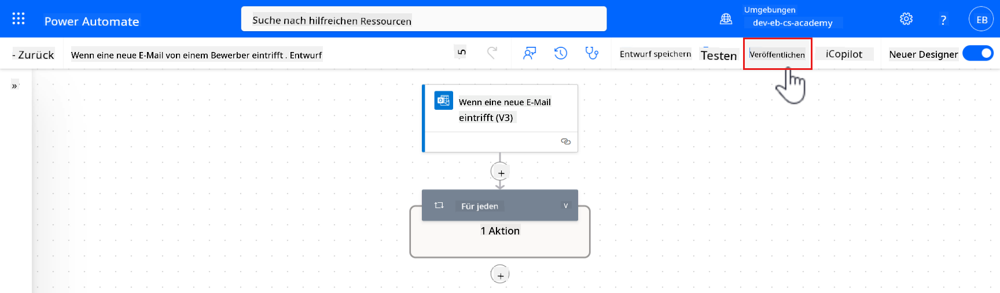

Hurra! Der Ereignisauslöser-Flow ist jetzt veröffentlicht 😃

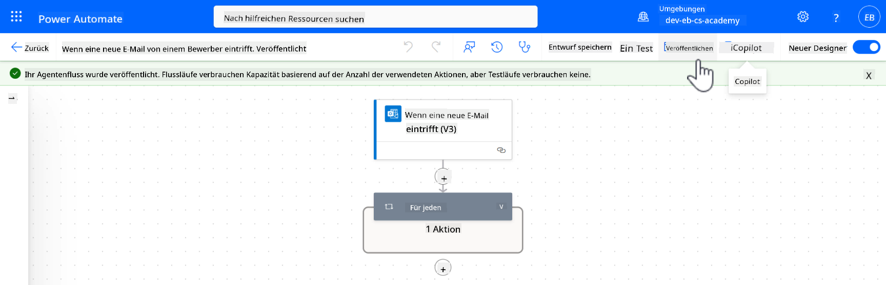

Lassen Sie uns einen neuen Agentenfluss erstellen, der vom untergeordneten **Intake Application Agent** aufgerufen wird.

### Lab 3.2 - Benachrichtigen eines Teams-Kanals mit einer adaptiven Karte

Wir werden nun einen neuen Agentenfluss für den untergeordneten **Intake Application Agent** erstellen, der die vom Ereignisauslöser übergebenen Werte verwendet, um eine adaptive Karte in einem Teams-Kanal zu posten. Diese adaptive Karte wird das HR-Rekrutierungsteam über die automatisch hochgeladene PDF-Datei informieren, damit sie diese überprüfen können.

Legen wir los!

1. Wählen Sie im **Hiring Agent** die Registerkarte **Agents** aus und wählen Sie den **Application Intake Agent**.


1. Scrollen Sie zu **Tools** und wählen Sie **+ Hinzufügen**.

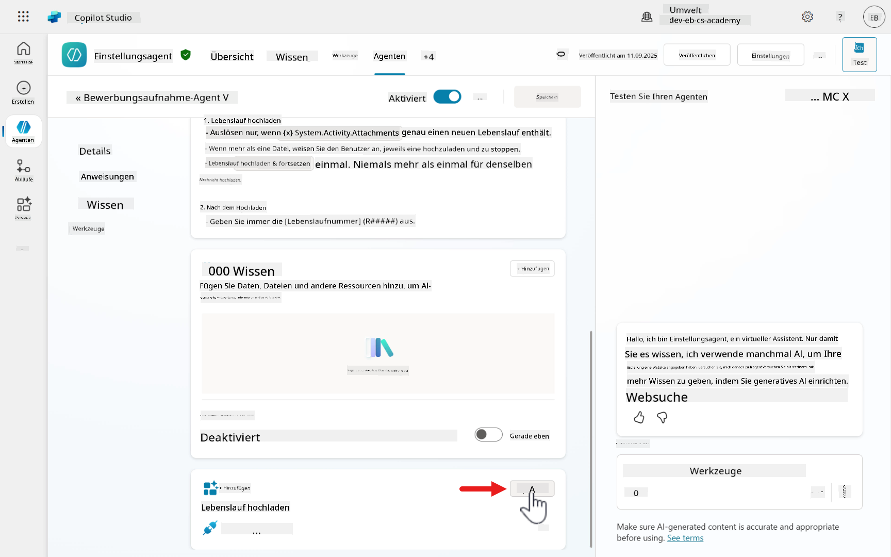

1. Das Modal **Tool hinzufügen** wird angezeigt. Wählen Sie **+ Neues Tool**.

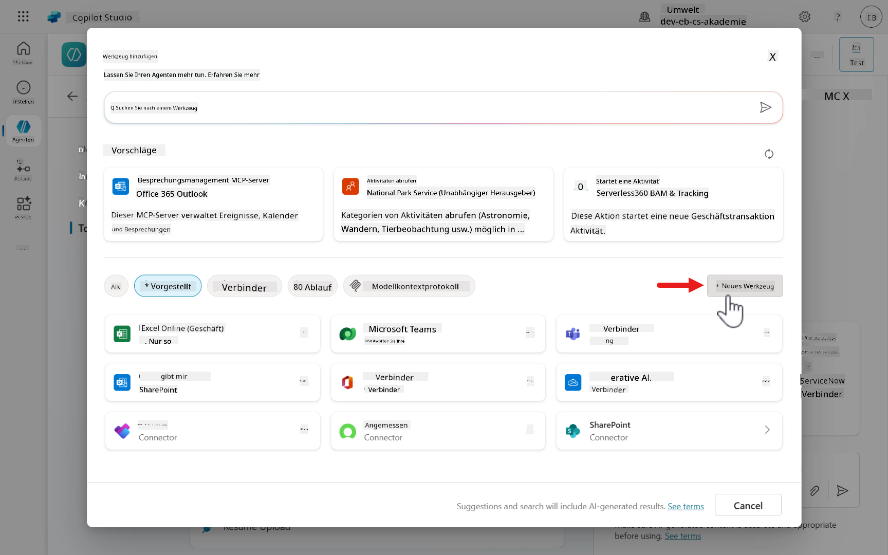

1. Wählen Sie **Agentenfluss**.

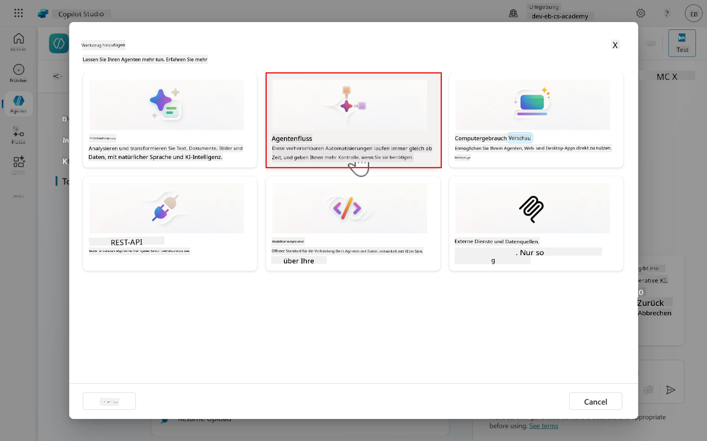

1. Der **Agentenfluss-Designer** wird geladen. Wählen Sie im Trigger **Wenn ein Agent den Flow aufruft** **+ Eingabe hinzufügen**.

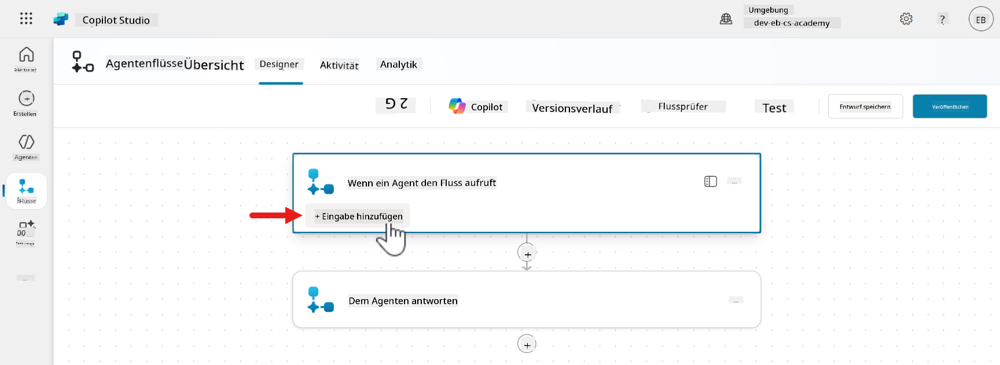

1. Wählen Sie **Text** als Typ der Benutzereingabe.

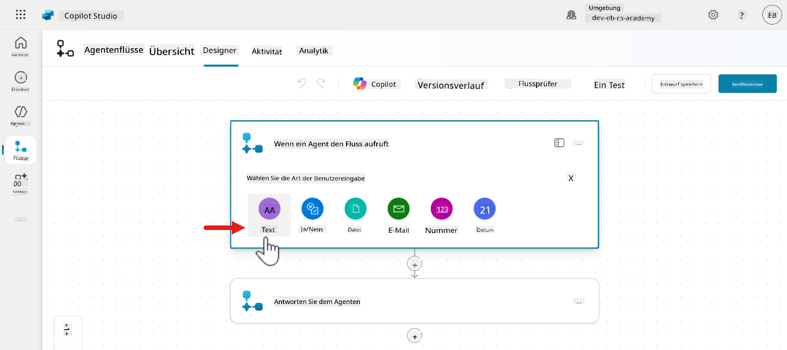

1. Kopieren und fügen Sie den folgenden Text in das Eingabefeld für den Parametername ein.

```text
ResumeId
```

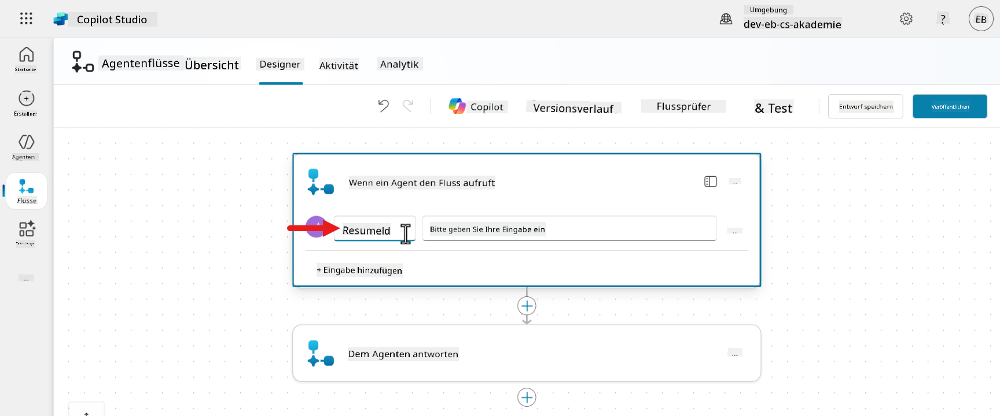

1. Wiederholen Sie die gleichen Schritte, um eine zweite Texteingabe hinzuzufügen. Kopieren und fügen Sie den folgenden Text für den Parametername ein.

```text
ResumeTitle
```

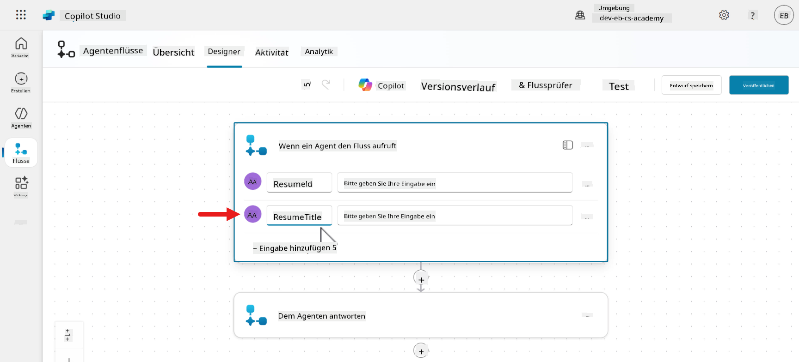

1. Wiederholen Sie die gleichen Schritte, um eine dritte Texteingabe hinzuzufügen. Kopieren und fügen Sie den folgenden Text für den Parametername ein.

```text
ResumeNumber
```

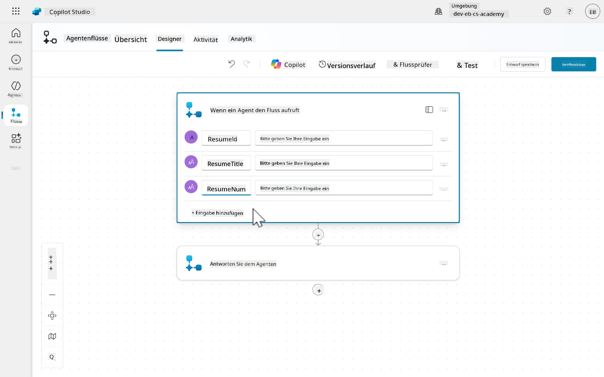

1. Erinnern Sie sich daran, wie wir in [Recruit](../../recruit/08-add-adaptive-card/README.md#81-create-a-new-topic-with-an-adaptive-card-for-user-to-submit-their-request) eine adaptive Karte innerhalb eines Themas für unseren Agenten hinzugefügt haben? Diesmal fügen wir eine adaptive Karte in einem Agentenfluss hinzu. Wir werden nun eine weitere Aktion zu unserem Agentenfluss hinzufügen, die eine adaptive Karte in einem Teams-Kanal postet.

Wählen Sie das **+ Symbol** unterhalb des Triggers.

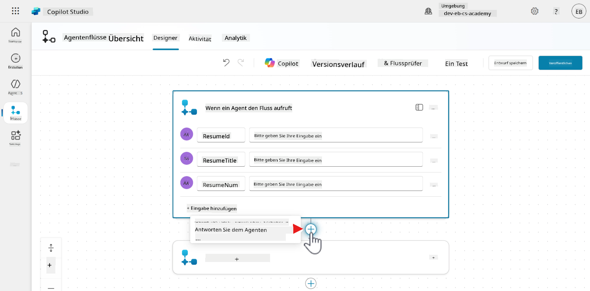

1. Wählen Sie die Aktion **Karte in einem Chat oder Kanal posten**.

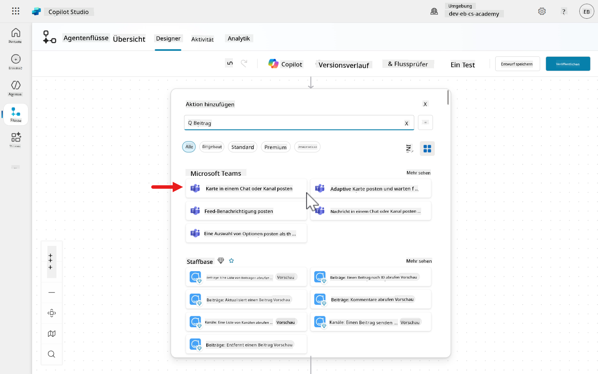

1. Eine Verbindungsreferenz zu Microsoft Teams muss mit Ihrem angemeldeten Benutzerkonto erstellt werden. Wählen Sie **Anmelden**.

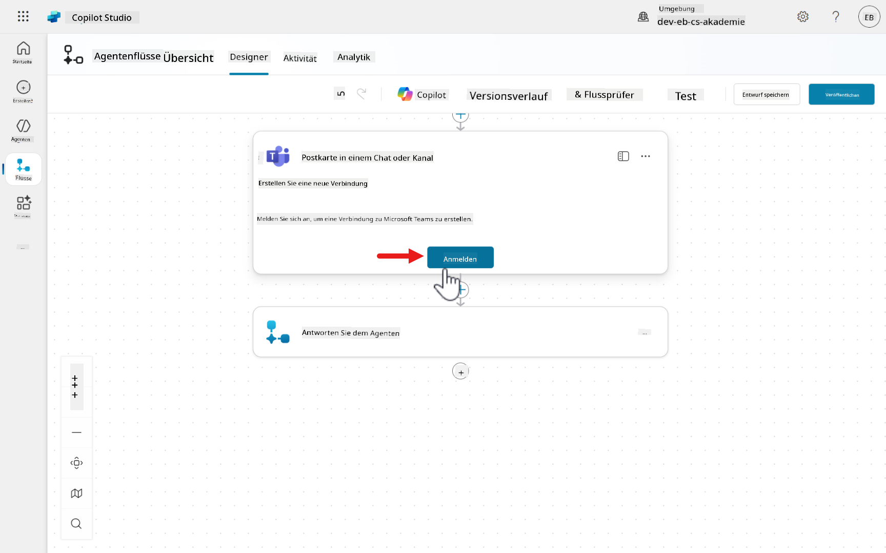

1. Wählen Sie Ihr Benutzerkonto aus und klicken Sie auf **Zugriff erlauben**.

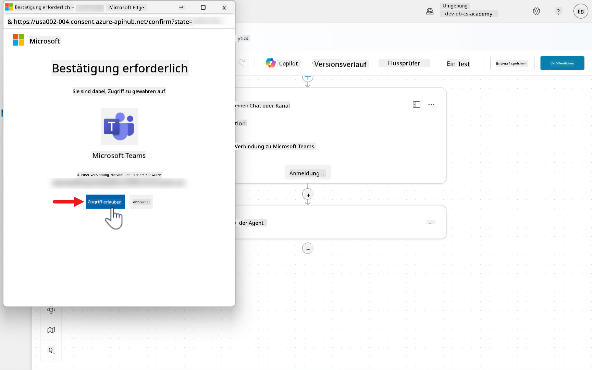

1. Für die folgenden Eingabeparameter:

| Parameter | Wie einstellen | Details |
|----------|----------------|---------|
| **Posten als** | Dropdown | Wählen Sie die Option `Flow bot` |
| **Posten in** | Dropdown | Wählen Sie die Option `Channel` |
| **Team** | Dropdown | Wählen Sie ein Team aus, das in Ihrer Umgebung verfügbar ist und auf das Sie für diese Übung Zugriff haben |
| **Kanal** | Dropdown | Wählen Sie einen Kanal aus, der in Ihrer Umgebung verfügbar ist und auf den Sie für diese Übung Zugriff haben |

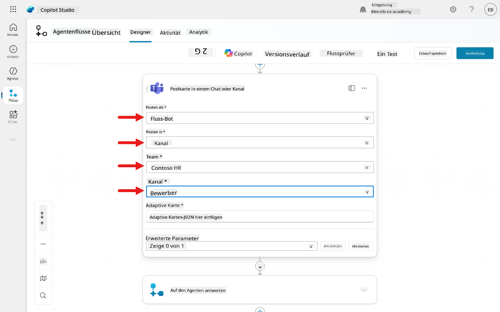

1. Als Nächstes konfigurieren wir das Feld **Adaptive Card**. Wählen Sie das Feld **Adaptive Card** aus.

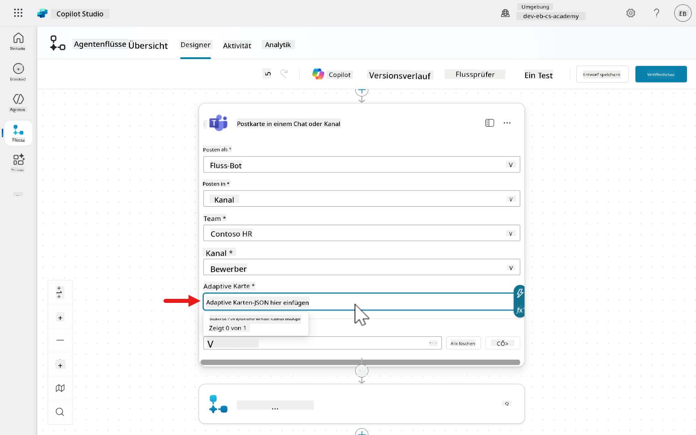

1. Öffnen Sie die [Resume Table Updated JSON-Datei](../../../../../docs/operative-preview/03-automate-triggers/assets/3.2_ResumeTableUpdated.json), kopieren Sie den gesamten Inhalt und fügen Sie ihn in das Feld Adaptive Card ein.

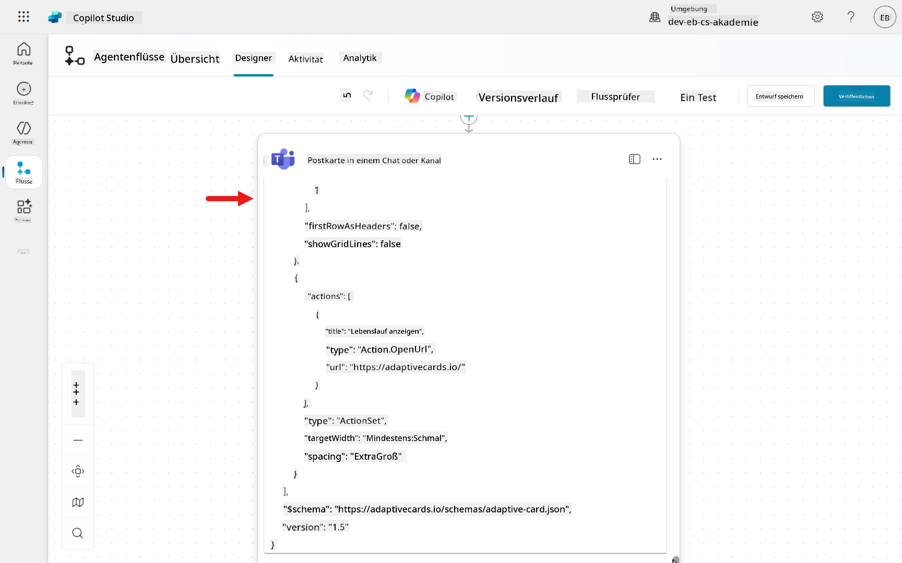

1. Ähnlich wie wir es in [Recruit](../../recruit/08-add-adaptive-card/README.md#81-create-a-new-topic-with-an-adaptive-card-for-user-to-submit-their-request) gemacht haben, werden wir bestehende Werte im JSON-Payload durch tatsächliche Werte oder dynamische Inhalte ersetzen.

Zuerst aktualisieren wir die URL für die Eigenschaft `url` innerhalb der Eigenschaft `selectAction`. Diese URL wird durch die URL der Resumes-Systemansicht in der **Hiring Hub**-Modellgesteuerten App ersetzt. Dadurch kann der Recruiter die Aktion auswählen und zur Resumes-Systemansicht in der modellgesteuerten App weitergeleitet werden.

Markieren Sie den aktuellen URL-Wert und löschen Sie ihn.

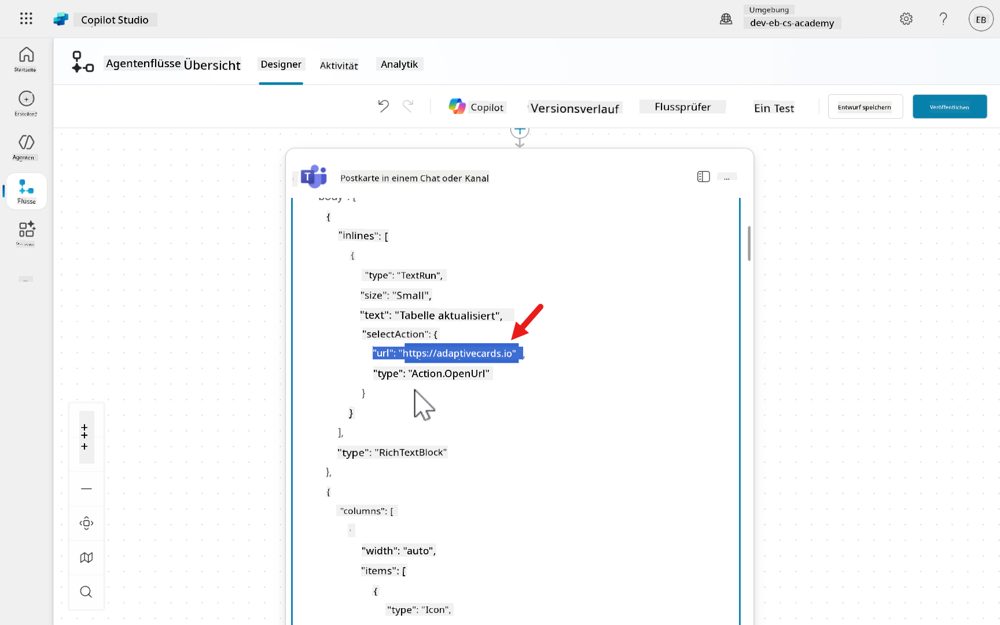

1. Navigieren Sie in der **Hiring Hub**-Modellgesteuerten App zur **Resumes**-Systemansicht über das Menü auf der linken Seite und kopieren Sie die URL. Navigieren Sie dann zurück zum Agentenfluss und fügen Sie die kopierte URL in die Eigenschaft **url** innerhalb der Eigenschaft `selectAction` ein.

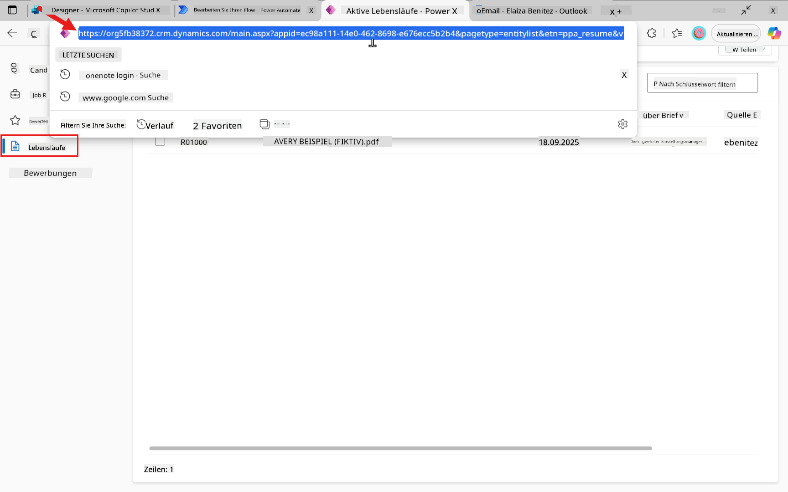
1. Sie sollten Folgendes sehen, wobei die in Gelb hervorgehobenen Details Ihre Umgebungsinformationen der **Hiring Hub** modellgesteuerten App sind.

     | Parameter | Wert | Erklärung |
     |----------|------------|---------|
     | **Organization URI** | GUID | Die URL der Dataverse/Dynamics 365-Umgebungsorganisation |
     | **appid** | GUID | Um eine spezifische modellgesteuerte App zu öffnen, wird der Abfrageparameter entweder appid oder appname verwendet. In diesem Fall wird appid verwendet |
     | **viewid** | GUID | Der Abfrageparameter, der die ID der Ansicht ist |

       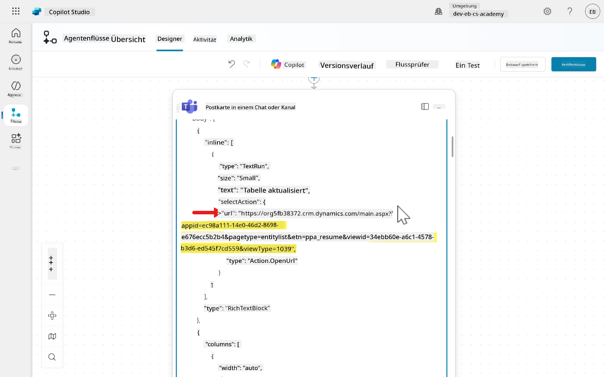

1. Als Nächstes fügen wir dynamische Inhaltswerte für mehrere Eigenschaften hinzu. Beginnen wir mit dem Text, der die Referenznummer des Lebenslaufs anzeigt, die durch den Ereignisauslöser autonom erstellt wurde.

      Wählen Sie das **Panel**-Symbol aus, um das Aktionspanel zu laden.

       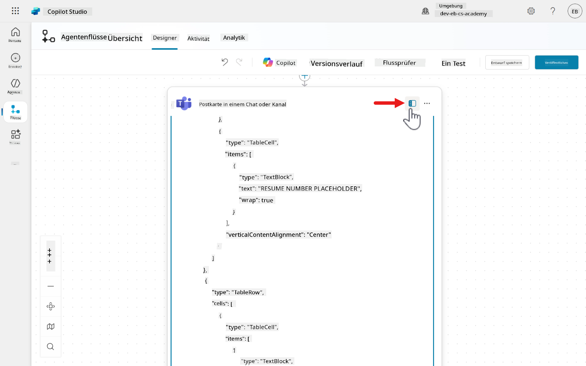

1. Scrollen Sie nach unten zu der Zeile, in der Sie die `text`-Eigenschaft für `RESUME NUMBER PLACEHOLDER` sehen. Markieren Sie den Platzhalterwert und löschen Sie ihn.

       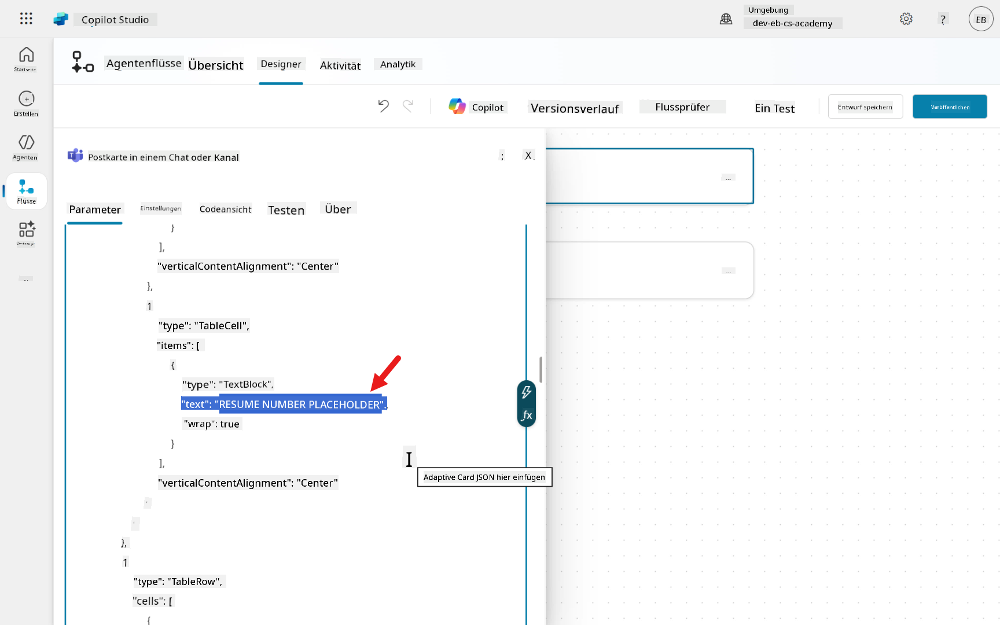

1. Klicken Sie zwischen die Anführungszeichen und wählen Sie das **Blitzsymbol** oder **fx-Symbol** rechts aus.

      Wählen Sie im Tab **Dynamischer Inhalt** den Parameter **ResumeNumber** aus und klicken Sie auf **Hinzufügen**.

       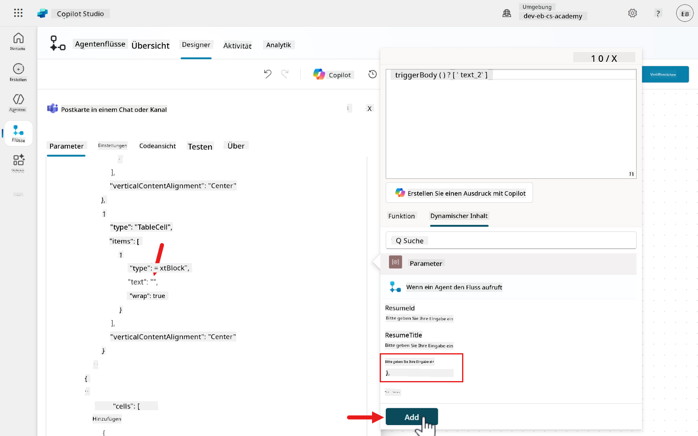

1. Der Parameter **ResumeNumber** wird nun als dynamischer Inhalt zur `text`-Eigenschaft hinzugefügt.

       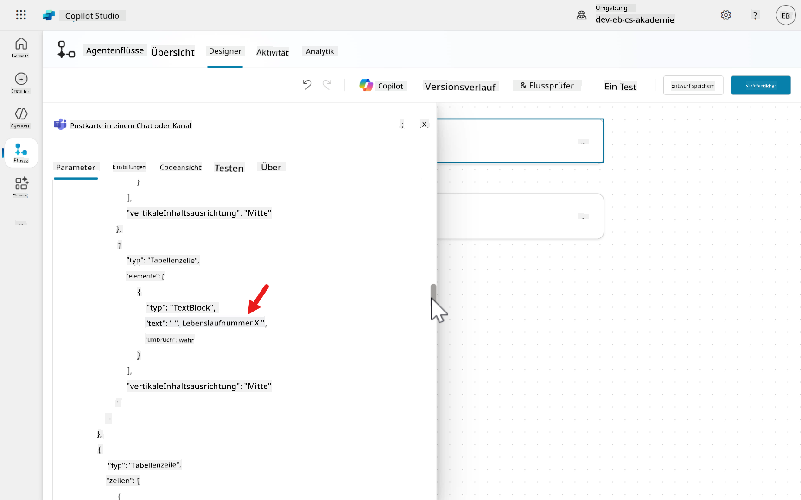

1. Wiederholen Sie die gleichen Schritte für den `RESUME NAME PLACEHOLDER`. Scrollen Sie nach unten zu der Zeile, in der Sie die `text`-Eigenschaft für `RESUME NAME PLACEHOLDER` sehen. Markieren Sie den Platzhalterwert und löschen Sie ihn.

       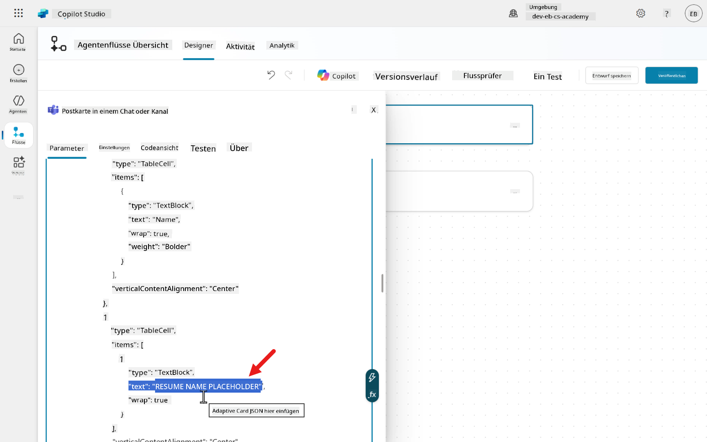

1. Klicken Sie zwischen die Anführungszeichen und wählen Sie das **Blitzsymbol** oder **fx-Symbol** rechts aus.

      Wählen Sie im Tab **Dynamischer Inhalt** den Parameter **ResumeTitle** aus und klicken Sie auf **Hinzufügen**.

       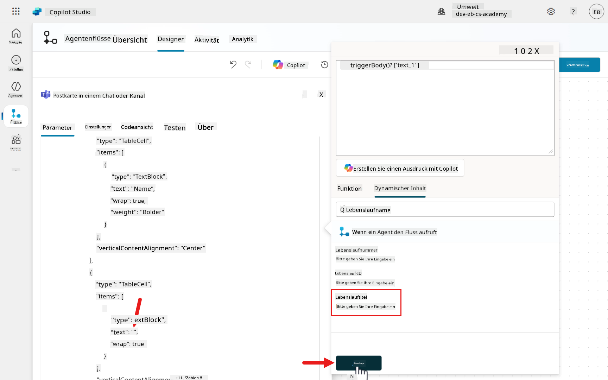

1. Der Parameter **ResumeTitle** wird nun als dynamischer Inhalt zur `text`-Eigenschaft hinzugefügt.

       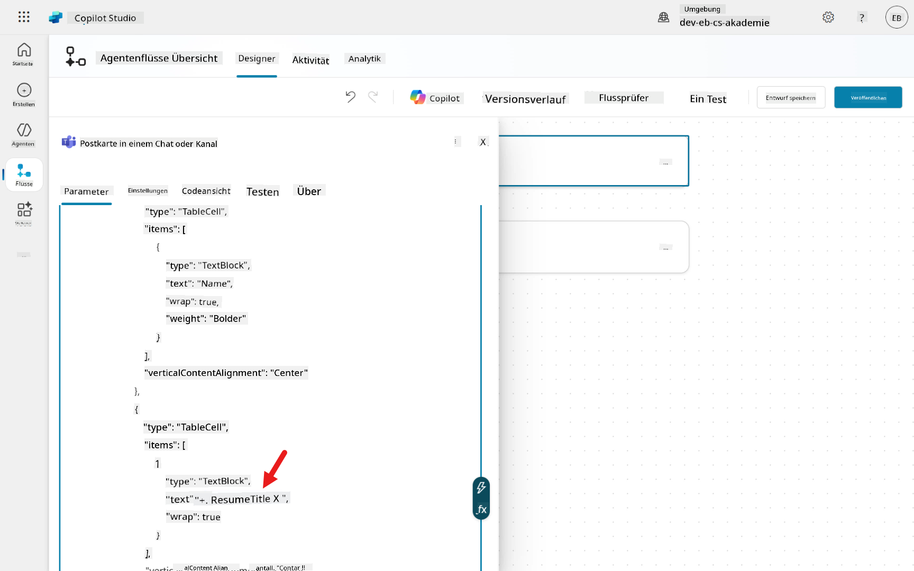

1. Wiederholen Sie die gleichen Schritte für den Wert **Fälligkeitsdatum**, der angibt, wann ein Recruiter den Lebenslauf überprüfen sollte. Scrollen Sie nach unten zu der Zeile, in der Sie die `text`-Eigenschaft für `May 21, 2023` sehen.

       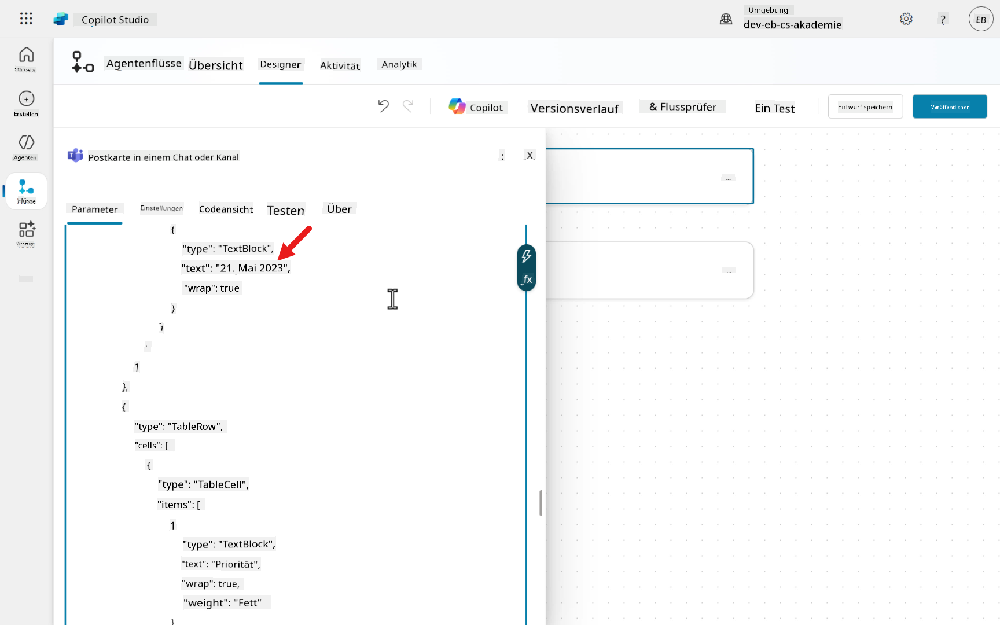

1. Löschen Sie diesen Platzhalterwert für das Datum und klicken Sie zwischen die Anführungszeichen.

       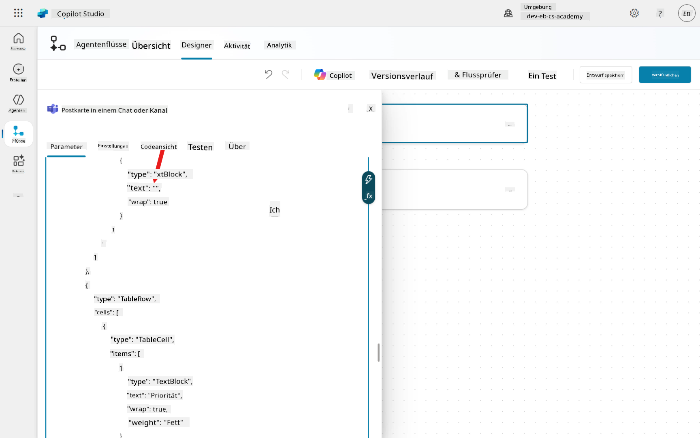

1. Wählen Sie das **Blitzsymbol** oder **fx-Symbol** rechts aus und geben Sie im Tab **Funktion** den folgenden Ausdruck ein und klicken Sie auf **Hinzufügen**.

       ```text
       addDays(utcNow(), 3, 'MMM dd, yyyy')
       ```

      Dieser Ausdruck verwendet zwei Funktionen.

     | Funktion | Erklärung |
     |----------|------------|
     | **addDays** | Fügt einem angegebenen Datum eine bestimmte Anzahl von Tagen hinzu und gibt das resultierende Datum im String-Format zurück |
     | **utcNow** | Gibt das aktuelle Datum und die Uhrzeit im UTC-Format als String zurück. |

      Für den Wert utcNow formatieren wir das Datum als Monat und Tag, gefolgt vom Jahr.

       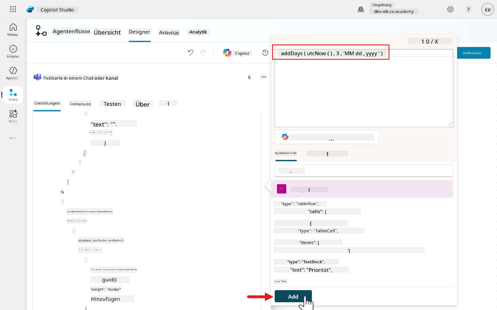

      Der Ausdruck wird nun zur `text`-Eigenschaft hinzugefügt.

       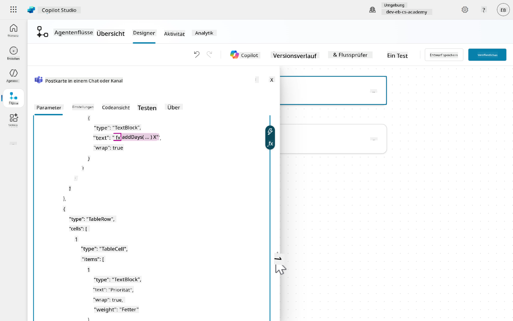

1. Zum Schluss aktualisieren wir die URL für die `url`-Eigenschaft innerhalb der `actions`-Array-Eigenschaft am Ende der JSON-Nutzlast. Diese aktuelle Platzhalter-URL wird durch die URL der Lebenslaufzeile in der **Hiring Hub** modellgesteuerten App ersetzt. Dadurch kann der Recruiter die Aktion `Action.OpenURL` der adaptiven Karte auswählen und wird zur Lebenslaufzeile in der modellgesteuerten App weitergeleitet.

       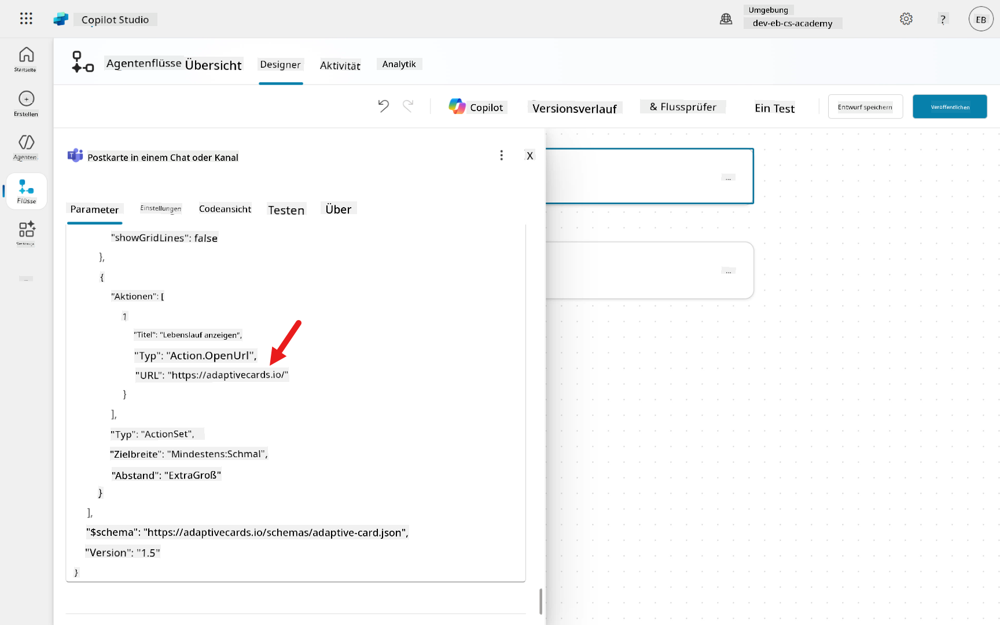

1. Öffnen Sie in der **Hiring Hub** modellgesteuerten App eine Zeile in der Systemansicht **Resumes** über das Menü auf der linken Seite. Die Lebenslaufzeile wird als Formular in der modellgesteuerten App geladen.

      Kopieren Sie die URL für die Lebenslaufzeile.

    ??? info "Wie Sie zur **Hiring Hub** modellgesteuerten App zurückkehren, falls Sie diese verlassen/geschlossen haben"

        1. Gehen Sie zu [https://make.powerapps.com](https://make.powerapps.com) und stellen Sie sicher, dass Sie sich in Ihrer Entwicklerumgebung befinden, die Sie für diese Lab-Übungen verwenden, andernfalls wechseln Sie zu dieser.
        
        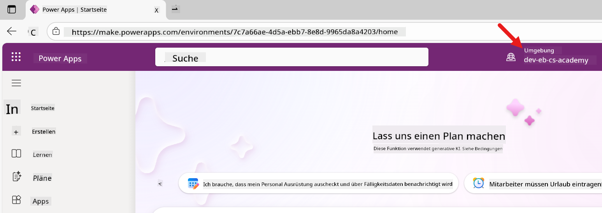

        1. Wählen Sie **Apps** im Menü auf der linken Seite und klicken Sie bei der **Hiring Hub** modellgesteuerten App auf das **Play**-Symbol, um sie in Ihrem Browser zu laden.
        
        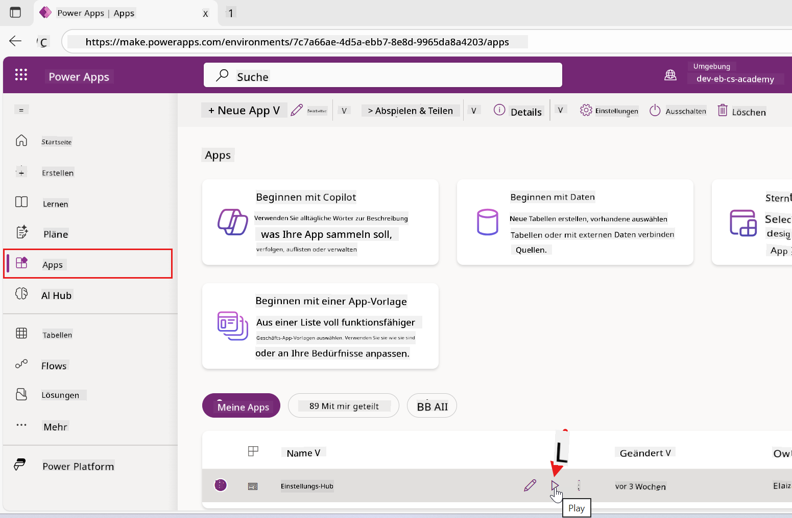

       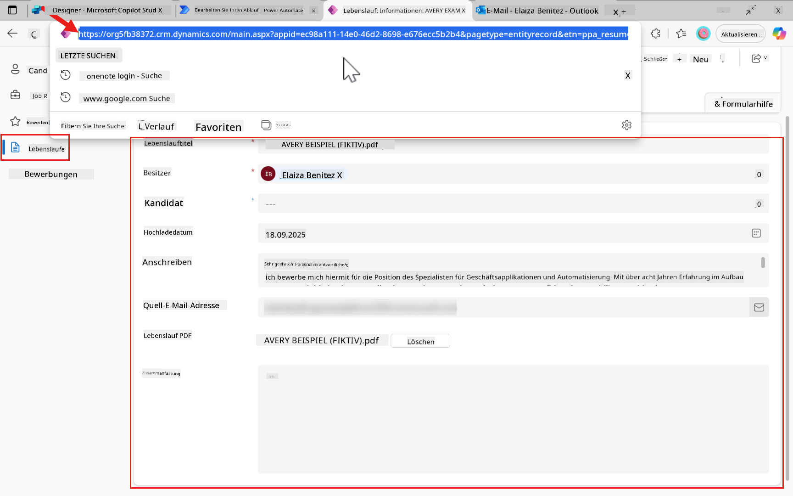

1. Navigieren Sie zurück zum Agentenfluss, markieren Sie den aktuellen Platzhalterwert der URL und löschen Sie ihn.

       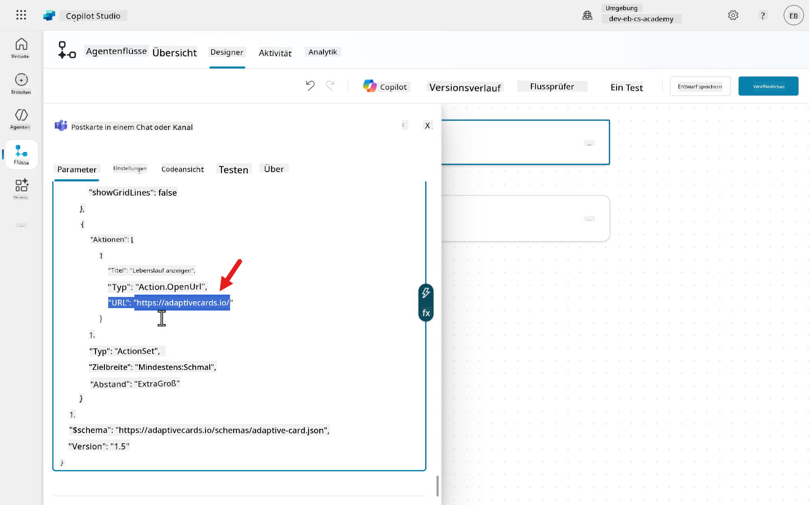

1. Fügen Sie die kopierte URL in die **url**-Eigenschaft innerhalb der `url`-Eigenschaft ein.

       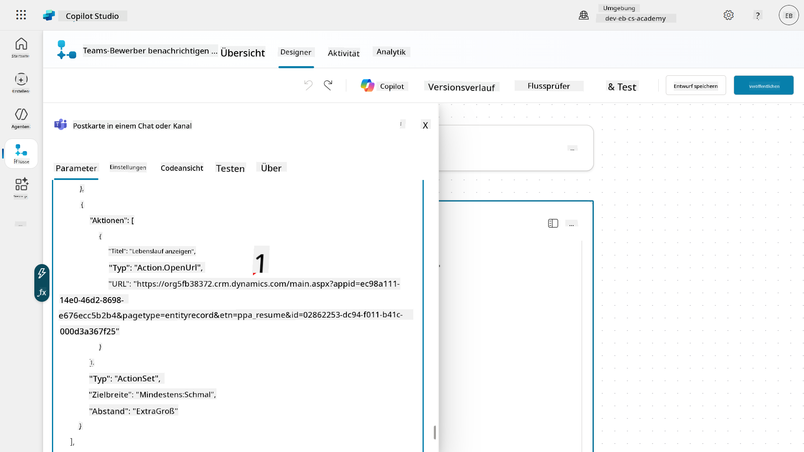

1. Sie sollten Folgendes sehen. Löschen Sie den `GUID`-ID-Wert am Ende. Wir ersetzen diesen durch dynamischen Inhalt - den Parameter **ResumeId**.

       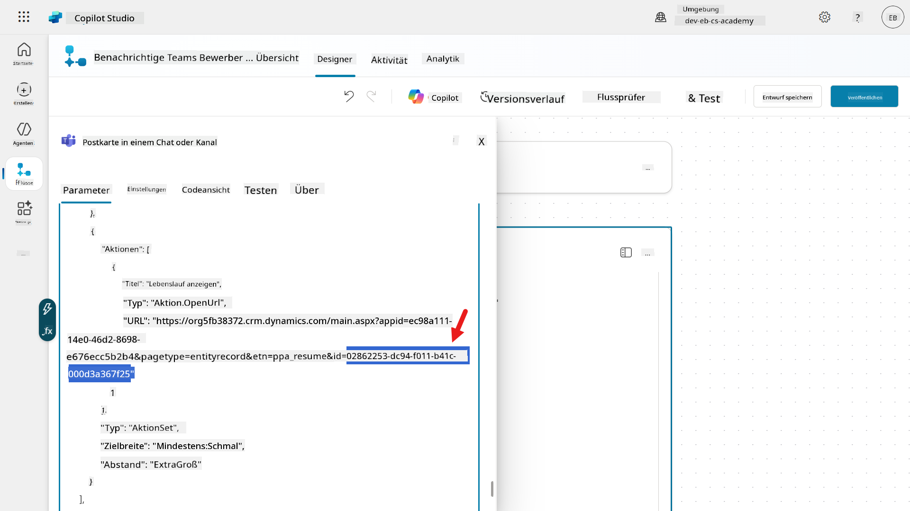

1. Wählen Sie das **Blitzsymbol** oder **fx-Symbol** rechts aus.

      Wählen Sie im Tab **Dynamischer Inhalt** den Parameter **ResumeId** aus und klicken Sie auf **Hinzufügen**.

       

1. Der **ResumeId** wird als dynamischer Inhalt hinzugefügt. Die in Gelb hervorgehobenen Details sind Ihre Umgebungsinformationen der **Hiring Hub** modellgesteuerten App.

     | Parameter | Wert | Erklärung |
     |----------|------------|---------|
     | **Organization URI** | GUID | Die URL der Dataverse/Dynamics 365-Umgebungsorganisation |
     | **appid** | GUID | Um eine spezifische modellgesteuerte App zu öffnen, wird der Abfrageparameter entweder appid oder appname verwendet. In diesem Fall wird appid verwendet |
     | **id** | GUID | Der Abfrageparameter, der die ID der Lebenslaufzeile ist |

       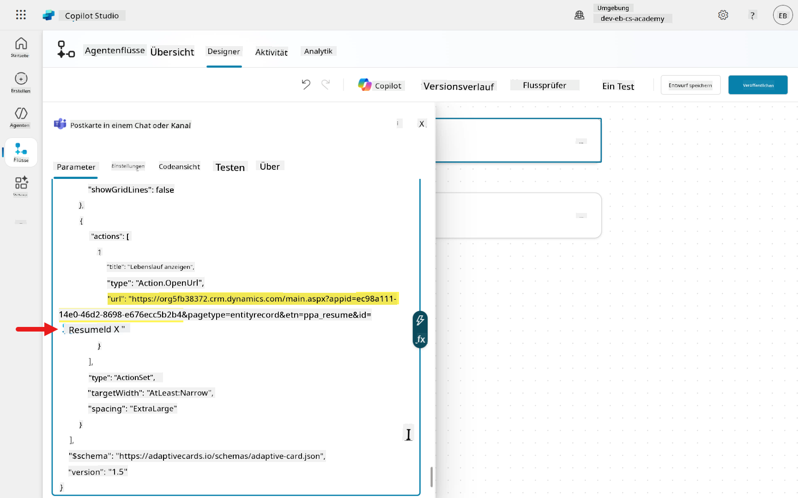

1. Wir haben die Konfiguration der Aktion **Post card in a chat or channel** abgeschlossen 👏🏻 Verlassen Sie das Aktionskonfigurationspanel, indem Sie das **x**-Symbol auswählen.

       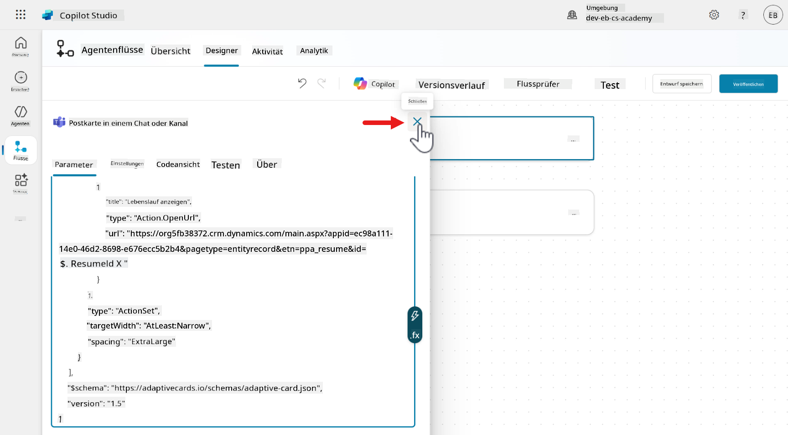

1. Schließlich konfigurieren wir die letzte Aktion, **Respond to the agent**, indem wir eine Textnachricht zurück an den Agenten senden, um die Verarbeitung zu beenden.

      Wählen Sie in der Aktion **Respond to the agent** **+Add an output** aus.

       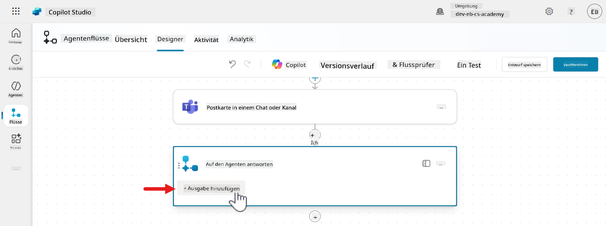

1. Wählen Sie **Text** als Ausgabetyp aus.

       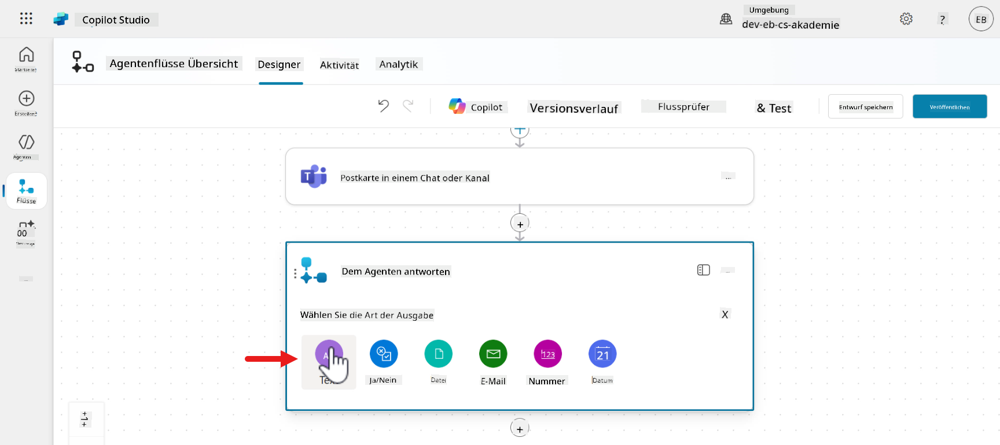

1. Geben Sie Folgendes als Namen der Ausgabe ein.

       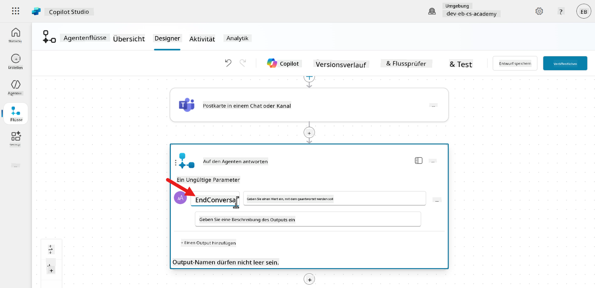

1. Geben Sie Folgendes als Wert für die Ausgabe ein.

       ```text
       Finished
       ```

       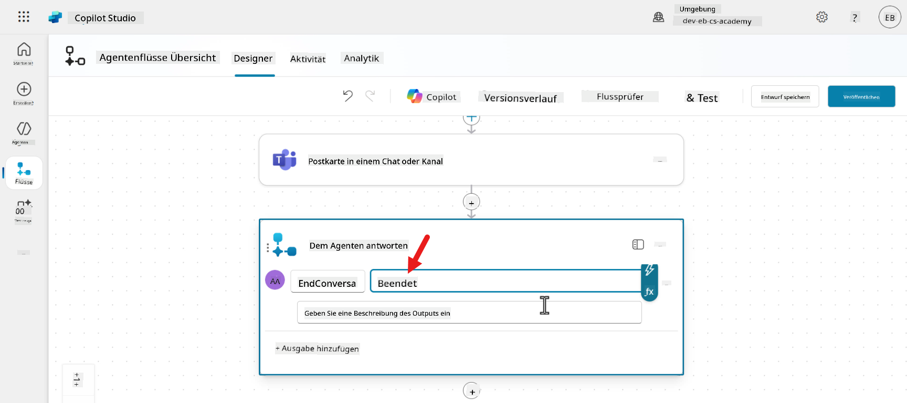

1. Wir haben die Konfiguration des Agentenflusses abgeschlossen. Wählen Sie **Save draft**, um den Agentenfluss zu speichern. Eine Bestätigungsmeldung erscheint nach dem Speichern.

       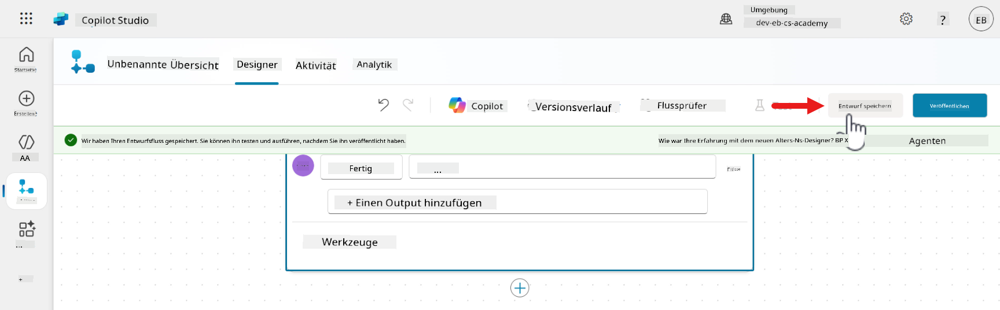

1. Bevor der Agentenfluss veröffentlicht wird, müssen die Details des Agentenflusses aktualisiert werden. Wählen Sie den Tab **Overview** und klicken Sie auf **Edit**.

      Geben Sie im Feld für den Flussnamen Folgendes ein.

       ```text
       Notify Teams Applicant channel
       ```      

      Danach wählen Sie das **Aktualisieren**-Symbol, um die Beschreibung des Agentenflusses mithilfe von KI zu aktualisieren.

      Wählen Sie anschließend **Save**, um die aktualisierten Details des Agentenflusses zu speichern.

       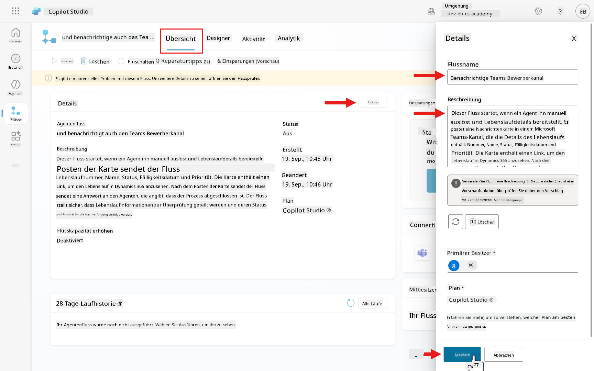

1. Navigieren Sie zurück zum Tab **Designer** und wählen Sie **Publish**, um den Agentenfluss zu veröffentlichen. Eine Bestätigungsmeldung erscheint nach dem Speichern.

       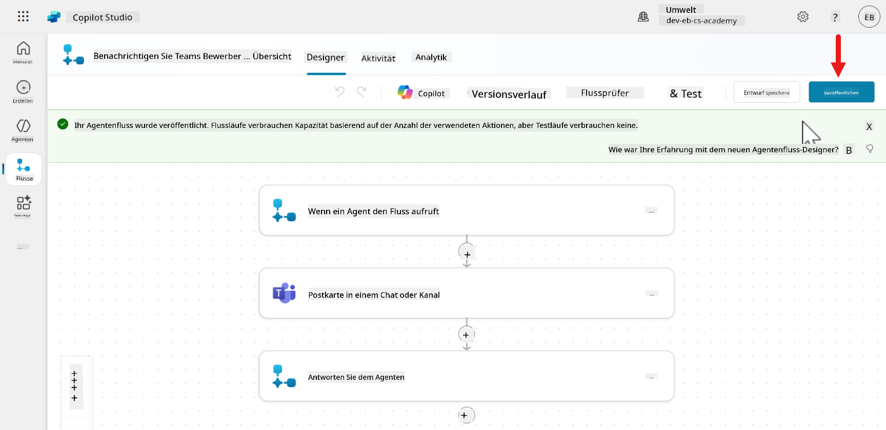

1. Der Agentenfluss muss nun als Tool im **Application Intake Agent** hinzugefügt werden. Navigieren Sie zurück zum **Hiring Agent** und wählen Sie den Tab **Agents**, dann wählen Sie den **Application Intake Agent**.

       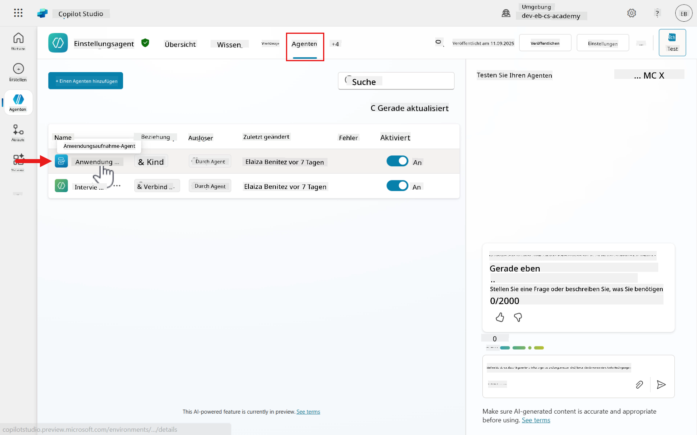

1. Im Abschnitt **Details** des Agenten aktualisieren wir das Feld **Description**. Kopieren Sie Folgendes und fügen Sie es am Ende des Beschreibungstextes ein.

       ```text
       und benachrichtigt auch den Teams Applicant-Kanal
       ```

       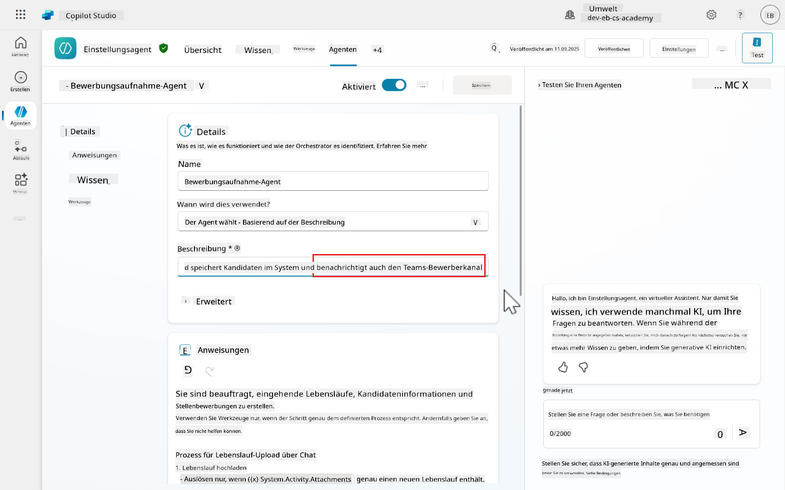

1. Als Nächstes fügen wir den Agentenfluss als Tool hinzu. Scrollen Sie nach unten und wählen Sie **+ Add**.

       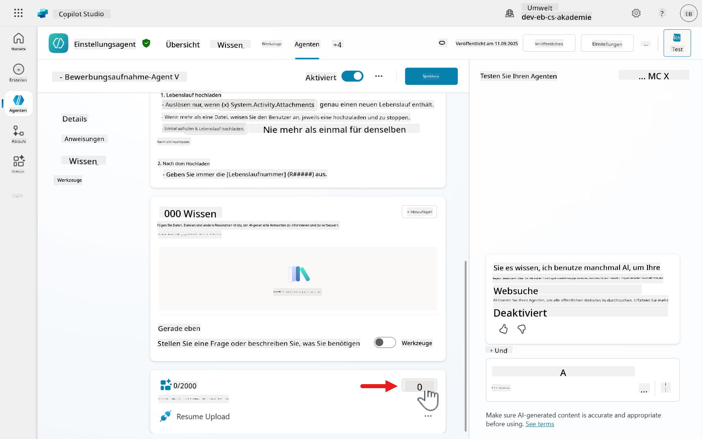

1. Wählen Sie den zuvor erstellten Agentenfluss **Notify Teams Applicant Channel** aus.

       

1. Wählen Sie anschließend **Add and configure**.

       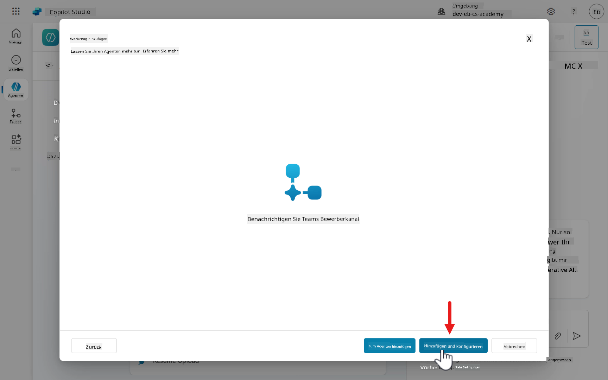

1. Im Abschnitt **Inputs** des Agentenflusses sind die drei Eingaben sichtbar, die wir zuvor im Agentenfluss konfiguriert haben. Standardmäßig ist die Konfiguration **Fill using** auf **Dynamically fill with AI** eingestellt. Wir behalten diese Einstellung bei, da die Eingabeaufforderung des Ereignisauslösers (in der letzten Aktion, **Sends a prompt to the specified copilot for processing** - dies sind die Schritte 38-44 von **Lab 3.1 - Automate uploading resumes to Dataverse received by email**) die Parameterwerte enthält, die von der KI extrahiert werden.

       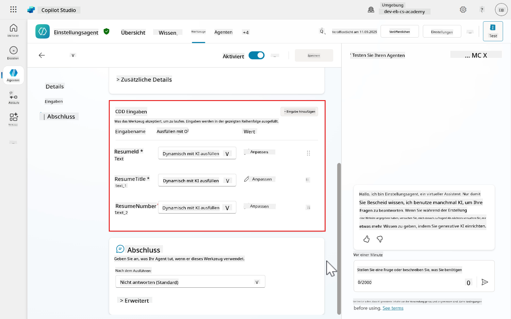

1. Jetzt, da das Tool dem **Application Intake Agent** hinzugefügt wurde, müssen die Anweisungen des Agenten aktualisiert werden. Wählen Sie das **Zurück-Pfeil**-Symbol, um zur Liste der Agenten zurückzukehren.

       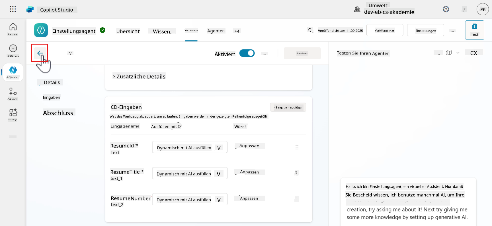

1. Wählen Sie den **Application Intake Agent** im Tab **Agents** des **Hiring Agent** aus.

       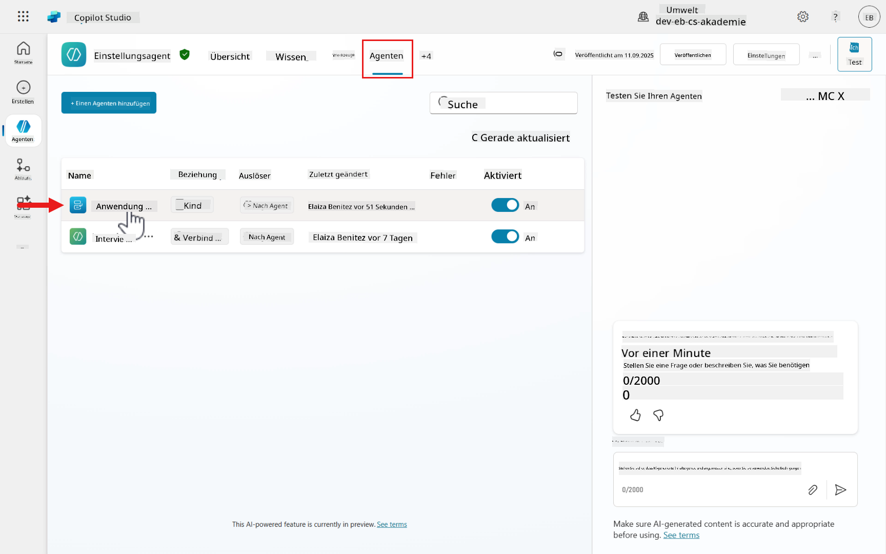

1. Geben Sie im Feld **Instructions** eine neue Zeile nach den Anweisungen `2.Post-Upload` ein. Kopieren und fügen Sie die folgenden Anweisungen ein.

       ```text
       Prozess für Lebenslauf-Upload per E-Mail
       1. Wenn Sie eine Nachricht erhalten, **Senden Sie [ResumeId (text)] = "1680265f-5793-f011-b41b-7c1e525be9f7" und [ResumeTitle (text_1)] = "TAYLOR TESTPERSON (FIKTIV).pdf" und [ResumeNumber (text_2)]= "R01026" an das Tool "Notify Teams Applicant channel"** im Unteragenten "Application Intake Agent", rufen Sie [AGENT FLOW PLACEHOLDER] auf.
       ```

       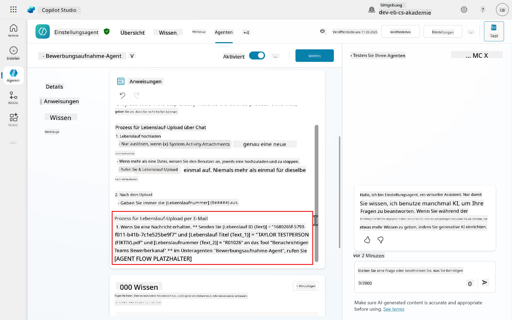

1. Markieren Sie den Text `[AGENT FLOW PLACEHOLDER`.

       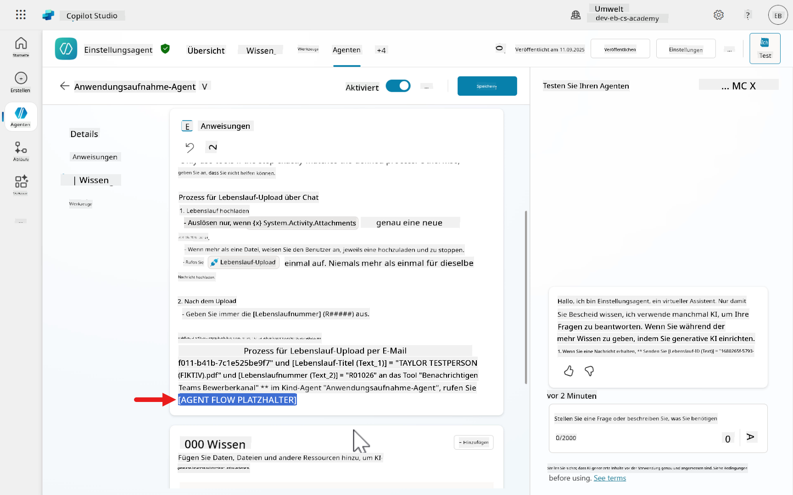

1. Geben Sie das Zeichen für den Schrägstrich `/` ein und wählen Sie das Tool **Notify Teams Applicant Channel** aus.

       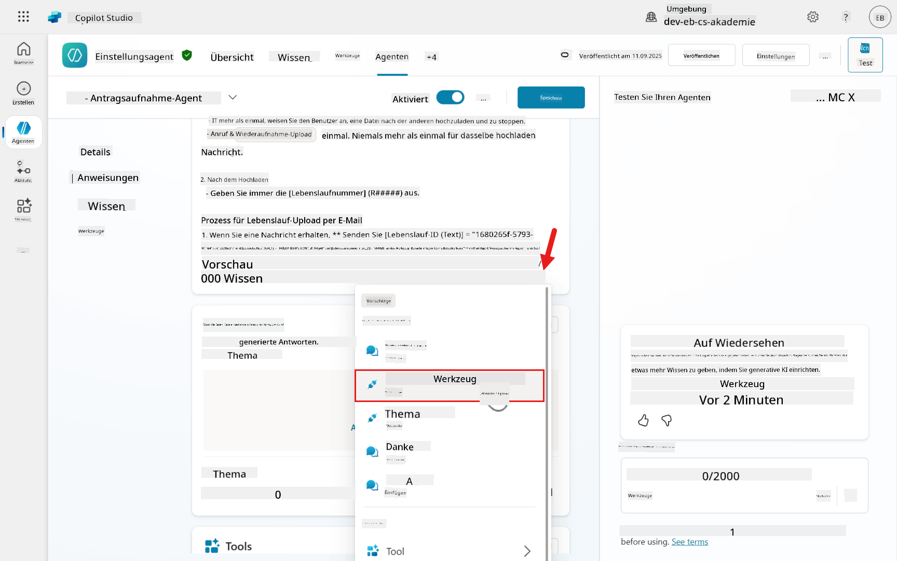
1. Der Agentenfluss wird nun gemäß den Anweisungen vom **Application Intake Agent** ausgelöst, nachdem die letzte Aktion (**Sendet eine Eingabeaufforderung an den angegebenen Copilot zur Verarbeitung**) im Ereignisauslöser die Eingabeaufforderung mit den Parameterwerten zurück an den Agenten sendet.

      Wählen Sie **Speichern**, um die aktualisierten Anweisungen für den **Application Intake Agent** zu speichern.

       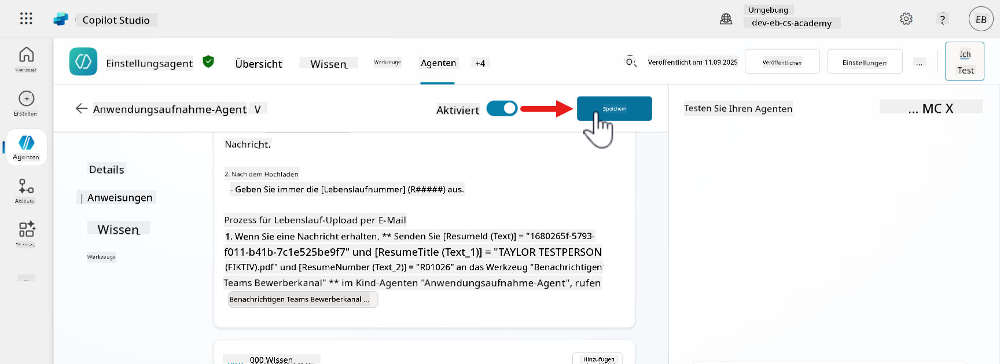

1. Die Anweisungen werden nun aktualisiert, sobald der Agent gespeichert wurde.

       

1. Jetzt müssen wir den **Hiring Agent** **veröffentlichen**. Wählen Sie **Veröffentlichen** oben rechts aus, und wählen Sie im _Modal zum Veröffentlichen dieses Agenten_ **Veröffentlichen**.

       

1. Nach der Veröffentlichung erscheint eine Bestätigungsmeldung, dass der Agent veröffentlicht wurde.

       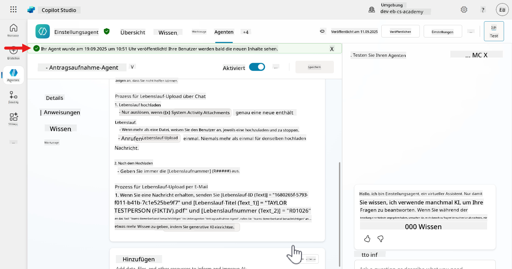

Wir können den Agenten jetzt testen!

### Lab 3.3 - Ereignisauslöser testen

1. Um den Ereignisauslöser auszuführen, muss eine E-Mail mit einer Lebenslauf-PDF-Datei gesendet werden. Verfassen Sie in Outlook eine neue E-Mail-Nachricht.

     | E-Mail-Komponente | Details |
     |----------|------------|
     | **An Empfänger** | Verwenden Sie Ihr angemeldetes Benutzerkonto als Wert |
     | **Dateianhang** | Laden Sie die Datei [TAYLOR TESTPERSON (FICTITIOUS)](../../../../../docs/operative-preview/test-data/resumes/TAYLOR%20TESTPERSON%20(FICTITIOUS).pdf) hoch |
     | **Textkörper** | Kopieren und fügen Sie den folgenden Text als E-Mail-Textkörper ein |

       ```text
       Sehr geehrte/r Personalverantwortliche/r,

       ich möchte mein Interesse an der Position des Senior Power Platform Engineer in Ihrem Unternehmen bekunden. Mit über neun Jahren Erfahrung in der Bereitstellung sicherer und skalierbarer Lösungen auf Microsoft-Cloud-Plattformen bin ich überzeugt, dass ich effektiv zu Ihrem Team beitragen kann.

       In meiner letzten Position als Lead Power Platform Engineer habe ich eine automatisierte Lebenslauf-Pipeline entwickelt, die die manuelle Bearbeitung reduziert und die Durchsuchbarkeit verbessert. Ich habe HR-Fallmanagement-Anwendungen geliefert, lösungsbewusste Flows eingeführt und PR-Checks implementiert, um die Bereitstellungszeiten zu verkürzen. Meine Expertise umfasst Power Apps, Power Automate, Power Pages, Dataverse und eine Reihe von Microsoft 365-Diensten sowie die Integration mit Graph/REST-APIs und Azure Functions.

       Zuvor habe ich Genehmigungen in Teams mit adaptiven Karten entwickelt, wodurch Genehmigungszeiten auf denselben Tag verkürzt wurden, und robuste Fehlerbehandlungsframeworks erstellt. Mein Hintergrund umfasst auch die Migration von Legacy-Workflows zu Power Automate und den Aufbau von Self-Service-Portalen, die von Hunderten von Mitarbeitern genutzt werden.

       Ich habe einen B.Sc. in Informatik und bin zertifiziert als Power Platform Developer (PL-400) und Solution Architect (PL-600). Außerdem engagiere ich mich leidenschaftlich für Mentoring und habe mich bei lokalen Maker-Gruppen ehrenamtlich engagiert.

       Bitte finden Sie meinen Lebenslauf im Anhang zu Ihrer Prüfung. Ich würde mich freuen, die Möglichkeit zu haben, mit Ihnen zu besprechen, wie meine Fähigkeiten und Erfahrungen Ihren Anforderungen entsprechen.

       Vielen Dank für Ihre Zeit und Aufmerksamkeit.

       Mit freundlichen Grüßen,
       Taylor Testperson
       ```

       **Senden** Sie die E-Mail, sobald sie verfasst ist.

       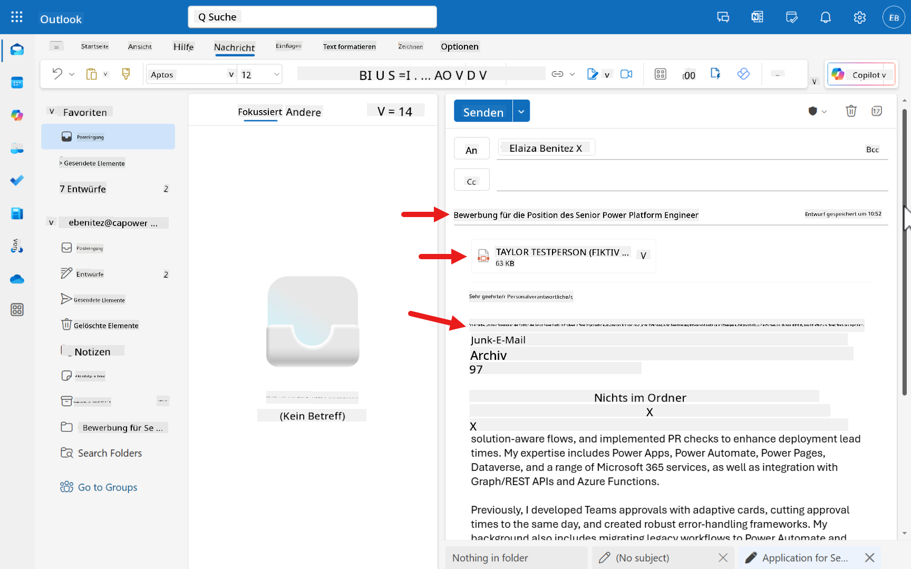

1. Wählen Sie im Power Automate Maker-Portal für den Ereignisauslöser-Flow das **Aktualisieren**-Symbol aus, um den Flow-Lauf anzuzeigen, der für die gesendete E-Mail erfolgreich war.

       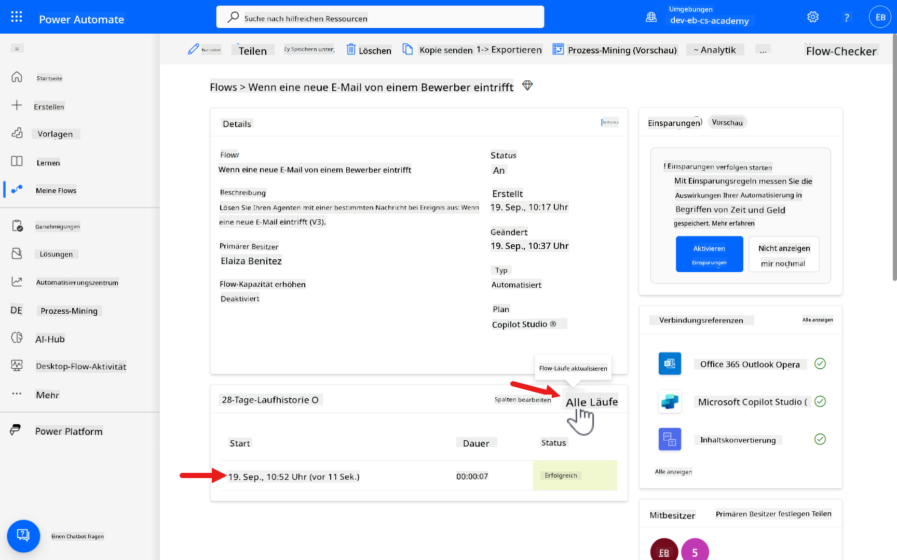

1. Gehen Sie zurück zu Copilot Studio und wählen Sie im **Hiring Agent** die Registerkarte **Aktivität** aus.

       

1. Die Registerkarte **Aktivität** wird geladen und zeigt alle Aktivitäten des **Hiring Agent** an. Es wird eine Aktivität mit dem Namen **Automated** und dem Status **Complete** angezeigt. Diese Aktivität repräsentiert den Ereignisauslöser und den ausgelösten Agentenfluss.

       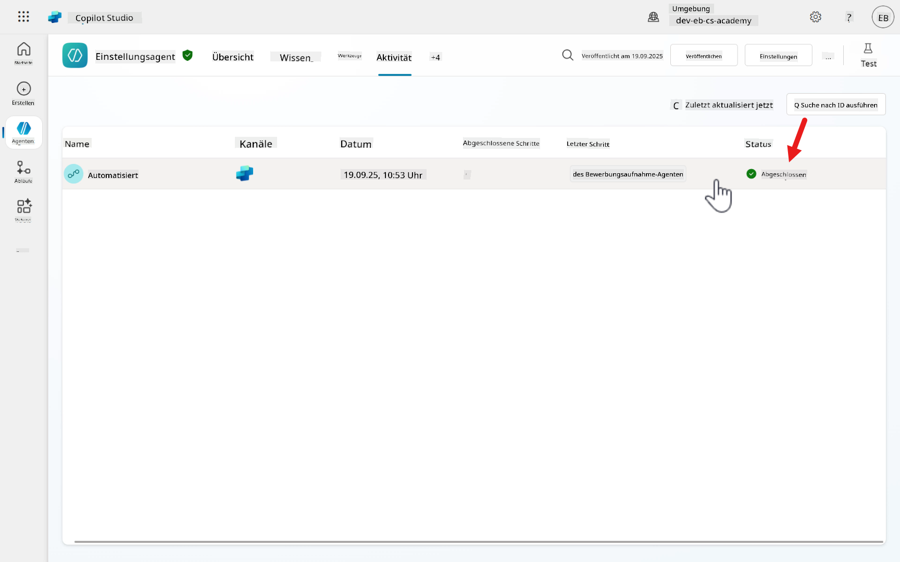

1. Wählen Sie die Aktivität aus und wählen Sie den Ereignisauslöser in der Aktivitätskarte. Im rechten Seitenbereich sehen Sie, wie die Eingabeparameter in der Eingabeaufforderung die Parameterwerte `Resume Id`, `Resume Title` und `Resume Number` aus der **Dataverse**-Zeile enthalten, die erstellt wurde. Dies stammt aus den dynamischen Inhaltswerten, die zuvor in den Schritten 18 - 27 von **Lab 3.1 - Automatisches Hochladen von Lebensläufen in Dataverse, die per E-Mail empfangen wurden** konfiguriert wurden.

       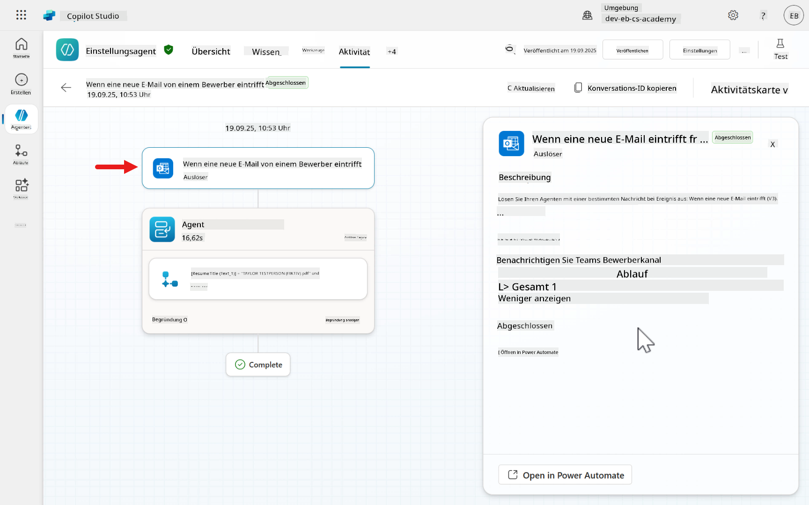

1. Navigieren Sie zurück zur modellgesteuerten App **Hiring Hub** und wählen Sie in der **Resumes Systemansicht** **Aktualisieren**, um die Ansicht zu aktualisieren. Die neu erstellte Zeile für den Lebenslauf, der per E-Mail gesendet wurde, wird nun angezeigt, da sie durch den Ereignisauslöser erstellt wurde.

       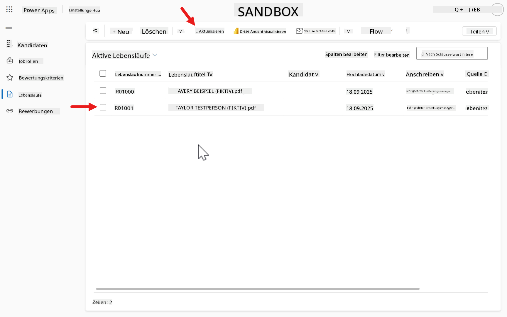

1. Navigieren Sie zurück zu Copilot Studio und wählen Sie den Agentenfluss **Notify Teams Applicant Channel** innerhalb des **Application Intake Agent** in der Aktivitätskarte aus. Im rechten Seitenbereich sehen Sie, wie die Eingaben Werte aus der Dataverse-Zeile enthalten. Dies stammt aus der Eingabeaufforderung, die von der letzten Aktion (**Sendet eine Eingabeaufforderung an den angegebenen Copilot zur Verarbeitung**) im Ereignisauslöser gesendet wurde und die Parameterwerte aus der neu erstellten Dataverse-Zeile enthält. So können wir Parameterwerte von Ereignisauslösern an Agentenflüsse übergeben.

       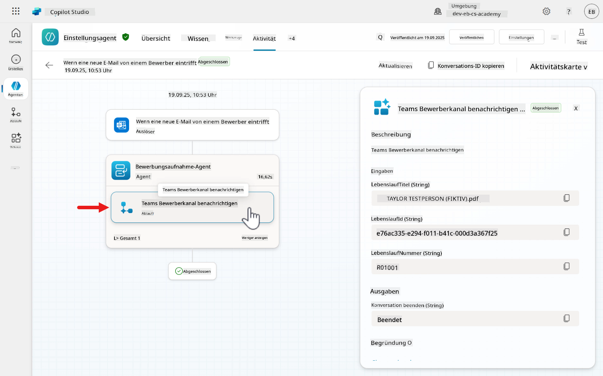

1. Schauen wir uns schließlich die adaptive Karte an, die im Kanal in **Microsoft Teams** gepostet wurde. Im Kanal sehen wir die adaptive Karte, die Informationen über die neu erstellte Lebenslaufzeile in Dataverse anzeigt. Bewegen Sie den Mauszeiger über den Hyperlink am Anfang der adaptiven Karte und beachten Sie, wie die URL die Resumes Systemansicht-URL ist, die wir zuvor in der JSON-Payload (Schritte 15 - 19 von **Lab 3.2 - Benachrichtigen eines Teams-Kanals mit einer adaptiven Karte**) der adaptiven Karte konfiguriert haben.

       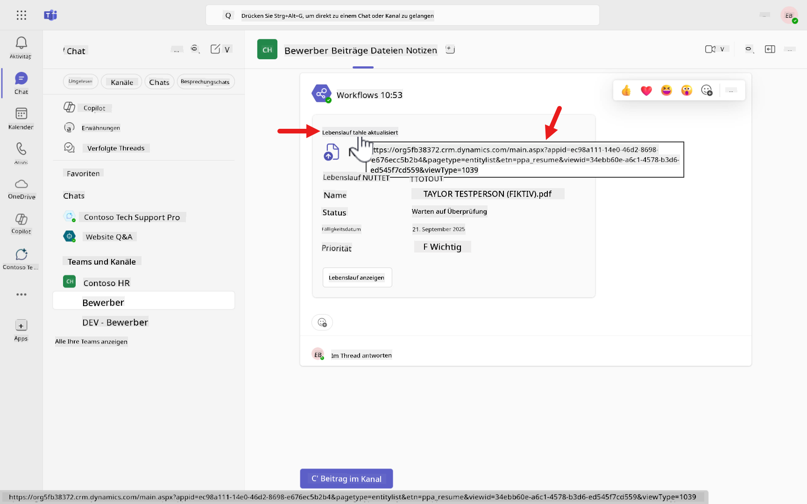

1. Wählen Sie den Hyperlink aus, und Sie werden zur Resumes Systemansicht in der modellgesteuerten App **Hiring Hub** in Ihrem Browser weitergeleitet.

       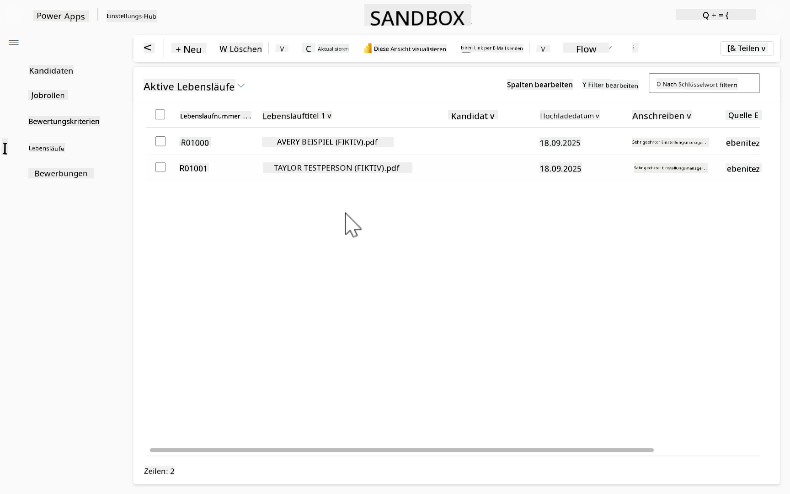

1. Navigieren Sie zurück zur adaptiven Karte, die im Kanal in Microsoft Teams gepostet wurde. Bewegen Sie diesmal den Mauszeiger über **Lebenslauf anzeigen**, was die `Action.OpenURL`-Aktion der adaptiven Karte ist. Beachten Sie, wie die URL die Lebenslaufzeile ist, die wir zuvor in der JSON-Payload (Schritte 30 - 36 von **Lab 3.2 - Benachrichtigen eines Teams-Kanals mit einer adaptiven Karte**) der adaptiven Karte konfiguriert haben.

       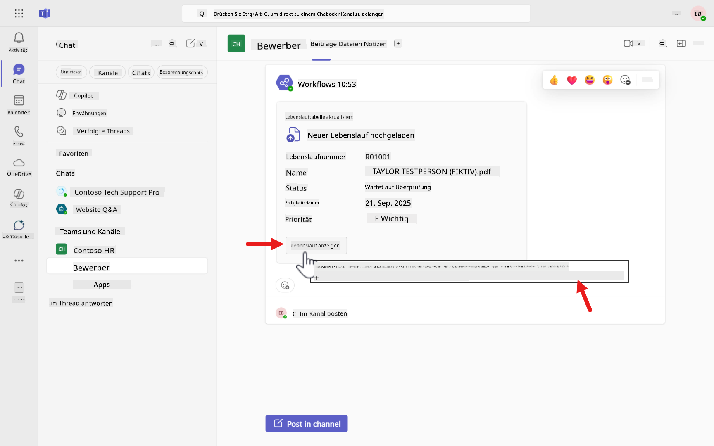

1. Wählen Sie die Aktion aus, und Sie werden zum Formular der Lebenslaufzeile in der modellgesteuerten App **Hiring Hub** in Ihrem Browser weitergeleitet.

       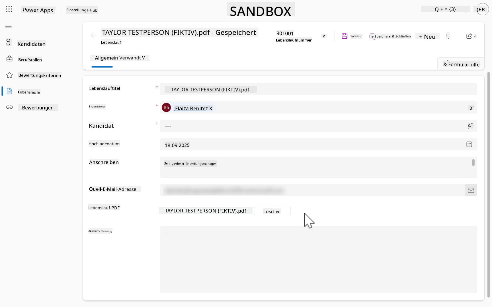

## ✅ Mission abgeschlossen

Herzlichen Glückwunsch! 👏🏻 Hervorragende Arbeit, Operative/r.

✅ Ereignisauslöser: Sie haben einen Ereignisauslöser erstellt, der Dataverse-Parameterwerte an einen Agentenfluss übergibt.  
✅ Agentenfluss erstellt: Verarbeitet die Dataverse-Parameterwerte, um eine adaptive Karte in einem Kanal in Microsoft Teams zu posten und das HR-Rekrutierungsteam zu benachrichtigen.  
✅ Anweisungen für untergeordnete Agenten aktualisiert: Um den Fluss auszulösen, sobald der Ereignisauslöser abgeschlossen ist.

Dies ermöglicht es dem **Hiring Agent**, autonom zu arbeiten, wenn Lebensläufe als E-Mail-Anhänge empfangen werden, und das HR-Rekrutierungsteam für eine manuelle Überprüfung zu benachrichtigen.

Dies ist das Ende von **Lab 03 - Automatisierung von Bewerbungs-E-Mails**, wählen Sie den untenstehenden Link, um zur nächsten Lektion zu gelangen.

⏭️ [Zur Lektion **Agentenanweisungen erstellen** wechseln](../04-agent-instructions/README.md)

## 📚 Taktische Ressourcen

📖 [Machen Sie Ihren Agenten autonom in Copilot Studio](https://learn.microsoft.com/training/modules/autonomous-agents-online-workshop/?WT.mc_id=power-188561-ebenitez)  

📖 [Einen Ereignisauslöser hinzufügen](https://learn.microsoft.com/microsoft-copilot-studio/authoring-trigger-event?WT.mc_id=power-188561-ebenitez)  

📖 [Agentenflüsse mit Ihrem Agenten verwenden](https://learn.microsoft.com/microsoft-copilot-studio/advanced-flow?WT.mc_id=power-188561-ebenitez)  

📖 [Einführung in Power Automate-Auslöser](https://learn.microsoft.com/power-automate/triggers-introduction?WT.mc_id=power-188561-ebenitez)  

📖 [Power Automate-Flows mit Agenten verwenden](https://learn.microsoft.com/microsoft-copilot-studio/advanced-flow-create?WT.mc_id=power-188561-ebenitez)  

📖 [Datenschutzrichtlinien für Copilot Studio](https://learn.microsoft.com/microsoft-copilot-studio/admin-data-loss-prevention?WT.mc_id=power-188561-ebenitez)  

---

**Haftungsausschluss**:  
Dieses Dokument wurde mit dem KI-Übersetzungsdienst [Co-op Translator](https://github.com/Azure/co-op-translator) übersetzt. Obwohl wir uns um Genauigkeit bemühen, beachten Sie bitte, dass automatisierte Übersetzungen Fehler oder Ungenauigkeiten enthalten können. Das Originaldokument in seiner ursprünglichen Sprache sollte als maßgebliche Quelle betrachtet werden. Für kritische Informationen wird eine professionelle menschliche Übersetzung empfohlen. Wir übernehmen keine Haftung für Missverständnisse oder Fehlinterpretationen, die sich aus der Nutzung dieser Übersetzung ergeben.