<!--
CO_OP_TRANSLATOR_METADATA:
{
  "original_hash": "616d142d4fb5f45d2a168fad6c1f9545",
  "translation_date": "2025-10-17T19:34:13+00:00",
  "source_file": "docs/operative-preview/07-multimodal-prompts/README.md",
  "language_code": "de"
}
-->
# 🚨 Mission 07: Extrahieren von Lebenslaufinhalten mit multimodalen Eingabeaufforderungen

--8<-- "disclaimer.md"

## 🕵️‍♂️ CODENAME: `DOCUMENT RESUME RECON`

> **⏱️ Zeitfenster der Operation:** `~45 Minuten`

## 🎯 Missionsbeschreibung

Willkommen, Operative. Ihre bisherigen Missionen haben Ihnen mächtige Fähigkeiten zur Agenten-Orchestrierung vermittelt, aber jetzt ist es an der Zeit, eine bahnbrechende Fähigkeit freizuschalten: **Multimodale Dokumentenanalyse**.

Ihre Aufgabe, falls Sie sich dafür entscheiden, ist **Document Resume Recon** – das präzise Extrahieren strukturierter Daten aus beliebigen Dokumenten. Während Ihre Agenten Texte problemlos verarbeiten können, erfordert die reale Welt den täglichen Umgang mit PDFs, Bildern und komplexen Dokumenten. Lebensläufe stapeln sich, Rechnungen müssen verarbeitet werden, und Formulare benötigen sofortige Digitalisierung.

Diese Mission wird Sie von einem reinen Text-Agenten-Ersteller zu einem **multimodalen Experten** machen. Sie lernen, KI so zu konfigurieren, dass sie Dokumente wie ein menschlicher Analyst liest und versteht – jedoch mit der Geschwindigkeit und Konsistenz von KI. Am Ende der Mission haben Sie ein vollständiges System zur Lebenslaufextraktion aufgebaut, das in Ihren Einstellungsworkflow integriert ist.

Die hier erlernten Techniken werden für die fortgeschrittenen Datenverarbeitungsoperationen in Ihrer nächsten Mission unerlässlich sein.

## 🔎 Ziele

In dieser Mission lernen Sie:

1. Was multimodale Eingabeaufforderungen sind und wann verschiedene KI-Modelle verwendet werden sollten
1. Wie man Eingabeaufforderungen mit Bild- und Dokumenteneingaben konfiguriert
1. Wie man die Ausgabe von Eingabeaufforderungen als JSON für die strukturierte Datenextraktion formatiert
1. Best Practices für die Eingabeaufforderungserstellung bei der Dokumentenanalyse
1. Wie man multimodale Eingabeaufforderungen mit Agent Flows integriert

## 🧠 Verständnis von multimodalen Eingabeaufforderungen

### Was macht eine Eingabeaufforderung "multimodal"?

Traditionelle Eingabeaufforderungen arbeiten nur mit Text. Multimodale Eingabeaufforderungen können jedoch mehrere Arten von Inhalten verarbeiten:

- **Text**: Schriftliche Anweisungen und Inhalte
- **Bilder**: Fotos, Screenshots, Diagramme und Grafiken (.PNG, .JPG, .JPEG)  
- **Dokumente**: Rechnungen, Lebensläufe, Formulare (.PDF)

Diese Fähigkeit eröffnet leistungsstarke Szenarien wie die Analyse von Lebensläufen, die Verarbeitung von Rechnungen oder die Extraktion von Daten aus Formularen.

### Warum multimodal für Ihre Workflows wichtig ist

Täglich steht Ihre Organisation vor diesen Herausforderungen bei der Dokumentenverarbeitung:

- **Lebenslauf-Screening**: Das manuelle Lesen von Hunderten von Lebensläufen kostet wertvolle Zeit
- **Rechnungsverarbeitung**: Extrahieren von Lieferantendaten, Beträgen und Daten aus verschiedenen Dokumentformaten
- **Formularanalyse**: Umwandlung von Papierformularen in digitale Daten

Multimodale Eingabeaufforderungen beseitigen diese Engpässe, indem sie das Sprachverständnis der KI mit visuellen Analysefähigkeiten kombinieren. Dies gibt Ihrer KI die Fähigkeit, Dokumente genauso effektiv wie Texte zu verarbeiten.

### Häufige Geschäftsszenarien

Hier sind einige Beispiele, wie multimodale Eingabeaufforderungen angewendet werden können:

| Szenario                | Aufgabe                                                                                                                                      | Beispiel-Ausgabefelder                                                                                   |
|-------------------------|-------------------------------------------------------------------------------------------------------------------------------------------|---------------------------------------------------------------------------------------------------------|
| **Lebenslauf-Screening**    | Extrahieren von Kandidatenname, E-Mail, Telefonnummer, aktuellem Titel, Berufserfahrung und Schlüsselkompetenzen.                                                 | Kandidatenname, E-Mail-Adresse, Telefonnummer, aktueller Jobtitel, Berufserfahrung, Schlüsselkompetenzen         |
| **Rechnungsverarbeitung**  | Extrahieren von Lieferanteninformationen, Rechnungsdatum, Gesamtbetrag und Positionen aus dieser Rechnung.                                                 | Lieferantenname, Rechnungsdatum, Gesamtbetrag, Rechnungspositionen                                             |
| **Formularanalyse**       | Analysieren dieses Antragsformulars und Extrahieren aller ausgefüllten Felder.                                                                              | Feldname (z. B. Bewerbername), Eingetragener Wert (z. B. John Doe), ...                                  |
| **ID-Dokumentprüfung** | Extrahieren von Name, ID-Nummer, Ablaufdatum und Adresse aus diesem Identifikationsdokument. Überprüfen, ob alle Texte klar lesbar sind, und markieren Sie unklare Abschnitte. | Vollständiger Name, Identifikationsnummer, Ablaufdatum, Adresse, Kennzeichnung unklarer Abschnitte                        |

## ⚙️ Modellauswahl im AI Builder

AI Builder bietet verschiedene Modelle, die für spezifische Aufgaben optimiert sind. Zu verstehen, welches Modell verwendet werden sollte, ist entscheidend für den Erfolg.

!!! note "Stand: September 2025"
    AI Builder-Modelle werden regelmäßig aktualisiert. Überprüfen Sie die neuesten [AI Builder-Modell-Einstellungen-Dokumentation](https://learn.microsoft.com/ai-builder/prompt-modelsettings) für aktuelle Modellverfügbarkeit.

### Modellvergleich

Alle folgenden Modelle unterstützen Vision- und Dokumentenverarbeitung:

| Modell | 💰Kosten | ⚡Geschwindigkeit | ✅Am besten geeignet für |
|-------|------|-------|----------|
| **GPT-4.1 mini** | Basic (kostengünstigstes Modell) | Schnell | Standard-Dokumentenverarbeitung, Zusammenfassungen, budgetbewusste Projekte |
| **GPT-4.1** | Standard | Moderat | Komplexe Dokumente, fortgeschrittene Inhaltserstellung, hohe Genauigkeitsanforderungen |
| **o3** | Premium | Langsam (gründliche Analyse) | Datenanalyse, kritisches Denken, anspruchsvolle Problemlösung |
| **GPT-5 chat** | Standard | Verbesserte Geschwindigkeit | Neueste Dokumentenverständnis, höchste Antwortgenauigkeit |
| **GPT-5 reasoning** | Premium | Langsam (komplexe Analyse) | Anspruchsvollste Analyse, Planung, fortgeschrittenes Denken |

### Erklärung der Temperatureinstellungen

Die Temperatur steuert, wie kreativ oder vorhersehbar die KI-Antworten sind:

- **Temperatur 0**: Am vorhersehbarsten, konsistente Ergebnisse (am besten für Datenextraktion)
- **Temperatur 0.5**: Ausgewogene Kreativität und Konsistenz  
- **Temperatur 1**: Maximale Kreativität (am besten für Inhaltserstellung)

Für die Dokumentenanalyse verwenden Sie **Temperatur 0**, um eine konsistente Datenextraktion sicherzustellen.

## 📊 Ausgabeformate: Text vs JSON

Die Wahl des richtigen Ausgabeformats ist entscheidend für die nachgelagerte Verarbeitung.

### Wann Textausgabe verwenden

Textausgabe eignet sich gut für:

- Menschlich lesbare Zusammenfassungen
- Einfache Klassifizierungen
- Inhalte, die keine strukturierte Verarbeitung benötigen

### Wann JSON-Ausgabe verwenden

JSON-Ausgabe ist unerlässlich für:

- Strukturierte Datenextraktion
- Integration mit Datenbanken oder Systemen
- Verarbeitung in Power Automate-Flows
- Konsistente Feldzuordnung

### JSON Best Practices

1. **Klare Feldnamen definieren**: Verwenden Sie beschreibende, konsistente Benennungen
1. **Beispiele bereitstellen**: Fügen Sie Beispielausgaben und Werte für jedes Feld hinzu
1. **Datentypen spezifizieren**: Geben Sie Beispiele für Daten, Zahlen und Text an
1. **Fehlende Daten handhaben**: Planen Sie für Null- oder leere Werte
1. **Struktur validieren**: Testen Sie mit verschiedenen Dokumenttypen

### Dokumentqualitätsüberlegungen

- **Auflösung**: Stellen Sie sicher, dass Bilder klar und lesbar sind
- **Ausrichtung**: Drehen Sie Dokumente vor der Verarbeitung in die richtige Ausrichtung
- **Formatunterstützung**: Testen Sie mit Ihren spezifischen Dokumenttypen (PDF, JPG, PNG)
- **Größenbeschränkungen**: Beachten Sie die Dateigrößenbeschränkungen in Ihrer Umgebung

### Leistungsoptimierung

- **Geeignete Modelle wählen**: Modelle nur bei Bedarf upgraden
- **Eingabeaufforderungen optimieren**: Kürzere, klarere Anweisungen funktionieren oft besser
- **Fehlerbehandlung**: Planen Sie für Dokumente, die nicht verarbeitet werden können
- **Kosten überwachen**: Verschiedene Modelle verbrauchen unterschiedliche Mengen an AI Builder-Credits

## 🧪 Lab 7: Aufbau eines Systems zur Lebenslaufextraktion

Zeit, Ihr Wissen über multimodale Eingabeaufforderungen in die Praxis umzusetzen. Sie werden ein umfassendes System zur Lebenslaufextraktion erstellen, das Kandidatendokumente analysiert und in strukturierte Daten für Ihren Einstellungsworkflow umwandelt.

### Voraussetzungen für den Abschluss dieser Mission

1. Sie benötigen **entweder**:

    - **Mission 06 abgeschlossen** und Ihr Multi-Agent-Einstellungssystem ist bereit, **ODER**
    - **Importieren Sie die Starterlösung für Mission 07**, wenn Sie neu anfangen oder aufholen müssen. [Mission 07 Starterlösung herunterladen](https://aka.ms/agent-academy)

1. Beispiel-Lebenslaufdokumente von [Test Resumes](https://download-directory.github.io/?url=https://github.com/microsoft/agent-academy/tree/main/operative/sample-data/resumes&filename=operative_sampledata)

!!! note "Lösungsimport und Beispieldaten"
    Wenn Sie die Starterlösung verwenden, lesen Sie [Mission 01](../01-get-started/README.md) für detaillierte Anweisungen zum Importieren von Lösungen und Beispieldaten in Ihre Umgebung.

### 7.1 Erstellen einer multimodalen Eingabeaufforderung

Ihr erstes Ziel: Erstellen Sie eine Eingabeaufforderung, die Lebenslaufdokumente analysieren und strukturierte Daten extrahieren kann.

1. Melden Sie sich bei [Copilot Studio](https://copilotstudio.microsoft.com) an und wählen Sie **Tools** aus der linken Navigation.

1. Wählen Sie **+ Neues Tool**, dann **Eingabeaufforderung**.  
    

1. **Benennen Sie** die Eingabeaufforderung um, von dem Standard-Timestamp-Namen (z. B. *Benutzerdefinierte Eingabeaufforderung 09/04/2025, 04:59:11 PM*) zu `Lebenslauf zusammenfassen`.

1. Fügen Sie im Feld Anweisungen diese Eingabeaufforderung hinzu:

    ```text
    You are tasked with extracting key candidate information from a resume and cover letter to facilitate matching with open job roles and creating a summary for application review.
    
    Instructions:
    1. Extract Candidate Details:
        - Identify and extract the candidate’s full name.
        - Extract contact information, specifically the email address.
    2. Create Candidate Summary:
        - Summarize the candidate’s profile as multiline text (max 2000 characters) with the following sections:
            - Candidate name
            - Role(s) applied for if present
            - Contact and location
            - One-paragraph summary
            - Experience snapshot (last 2–3 roles with outcomes)
            - Key projects (1–3 with metrics)
            - Education and certifications
            - Top skills (Top 10)
            - Availability and work authorization
    
    Guidelines:
    - Extract information only from the provided resume and cover letter documents.
    - Ensure accuracy in identifying all details such as contact details and skills.
    - The summary should be concise but informative, suitable for quick application review.
    
    Resume: /document
    CoverLetter: /text
    ```

    !!! tip "Copilot-Hilfe verwenden"
        Sie können "Mit Copilot starten" verwenden, um Ihre Eingabeaufforderung mit natürlicher Sprache zu erstellen. Versuchen Sie, Copilot zu bitten, eine Eingabeaufforderung zu erstellen, um einen Lebenslauf zusammenzufassen!

1. **Konfigurieren Sie** die Eingabeparameter:

    | Parameter | Typ | Name | Beispieldaten |
    |-----------|------|------|-------------|
    | Lebenslauf | Bild oder Dokument | Lebenslauf | Laden Sie einen Beispiel-Lebenslauf aus dem Testdaten-Ordner hoch |
    | Anschreiben | Text | Anschreiben | Hier ist ein Lebenslauf! |

1. Wählen Sie **Testen**, um die anfängliche Textausgabe Ihrer Eingabeaufforderung zu sehen.  
    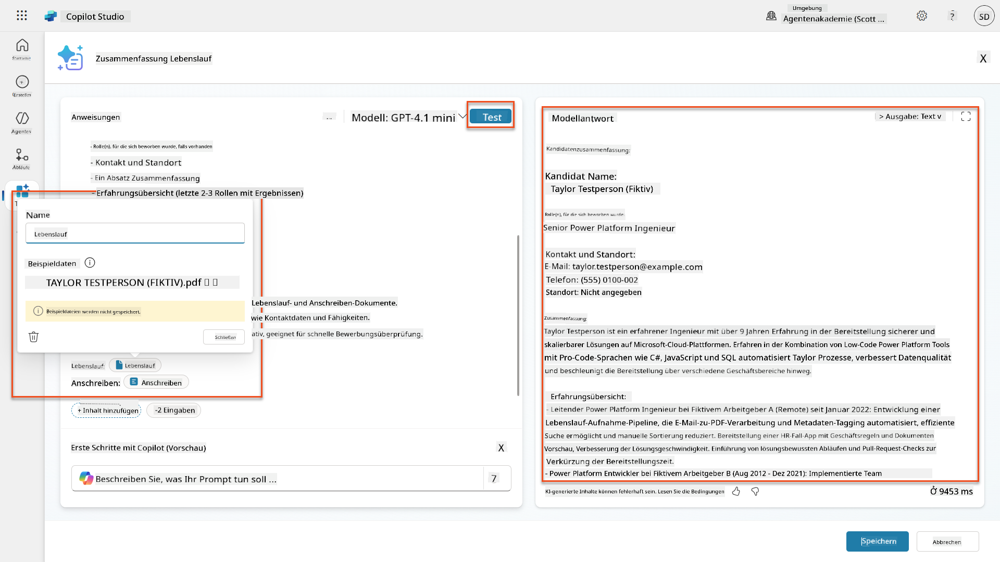

### 7.2 JSON-Ausgabe konfigurieren

Jetzt konvertieren Sie die Eingabeaufforderung, um strukturierte JSON-Daten anstelle von einfachem Text auszugeben.

1. Fügen Sie diese JSON-Formatspezifikation am Ende Ihrer Eingabeaufforderungsanweisungen hinzu:

    ```text
    Output Format:
    Provide the output in valid JSON format with the following structure:
    
    {
        "CandidateName": "string",
        "Email": "string",
        "Summary": "string max 2000 characters",
        "Skills": [ {"item": "Skill 1"}, {"item": "Skill 2"}],
        "Experience": [ {"item": "Experience 1"}, {"item": "Experience 2"}],
    }
    ```

1. Ändern Sie die **Ausgabe**-Einstellung von "Text" zu **JSON**.

1. Wählen Sie erneut **Testen**, um zu überprüfen, ob die Ausgabe jetzt als JSON formatiert ist.  
    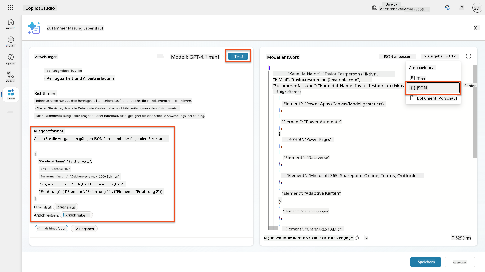

1. **Optional:** Experimentieren Sie mit verschiedenen KI-Modellen, um zu sehen, wie sich die Ausgaben unterscheiden, und kehren Sie dann zum Standardmodell zurück.

1. Wählen Sie **Speichern**, um die Eingabeaufforderung zu erstellen.

1. Wählen Sie im Dialogfeld **Für die Verwendung im Agent konfigurieren** die Option **Abbrechen**.

    !!! info "Warum wir dies noch nicht als Tool hinzufügen"
        Sie werden diese Eingabeaufforderung in einem Agent Flow verwenden, anstatt direkt als Tool, was Ihnen mehr Kontrolle über den Datenverarbeitungsworkflow gibt.

### 7.3 Eingabeaufforderung zu einem Agent Flow hinzufügen

Sie erstellen einen Agent Flow, der Ihre Eingabeaufforderung verwendet, um Lebensläufe zu verarbeiten, die in Dataverse gespeichert sind.

!!! tip "Agent Flow-Ausdrücke"
    Es ist sehr wichtig, dass Sie die Anweisungen zum Benennen Ihrer Knoten und Eingeben von Ausdrücken genau befolgen, da die Ausdrücke sich auf die vorherigen Knoten anhand ihres Namens beziehen! Lesen Sie die [Agent Flow-Mission in Recruit](../../recruit/09-add-an-agent-flow/README.md#you-mentioned-expressions-what-are-expressions) für eine kurze Auffrischung!

1. Navigieren Sie zu Ihrem **Einstellungsagenten** innerhalb von Copilot Studio.

1. Wählen Sie die Registerkarte **Agenten** aus und wählen Sie den untergeordneten **Antragsannahme-Agenten** aus.

1. Wählen Sie im **Tools**-Panel **+ Hinzufügen** → **+ Neues Tool** → **Agent Flow**.

1. Wählen Sie den Knoten "Wenn ein Agent den Flow aufruft", verwenden Sie **+ Eingabe hinzufügen**, um den folgenden Parameter hinzuzufügen:

    | Typ | Name | Beschreibung |
    |------|------|-------------|
    | Text | Lebenslaufnummer | Stellen Sie sicher, dass Sie [Lebenslaufnummer] verwenden. Dies muss immer mit dem Buchstaben R beginnen |

1. Wählen Sie das **+** Symbol für Aktion einfügen unter dem ersten Knoten, suchen Sie nach **Dataverse**, wählen Sie **Mehr anzeigen**, und finden Sie die Aktion **Zeilen auflisten**.

1. Wählen Sie die **Ellipsen (...)** auf dem Knoten "Zeilen auflisten" und wählen Sie **Umbenennen** zu `Lebenslauf-Datensatz abrufen`, und legen Sie die folgenden Parameter fest:

    | Eigenschaft | Wie einstellen | Wert |
    |----------|------------|-------|
    | **Tabellenname** | Auswählen | Lebensläufe |
    | **Zeilen filtern** | Dynamische Daten (Blitzsymbol) | `ppa_resumenumber eq 'Lebenslaufnummer'` Ersetzen Sie **Lebenslaufnummer** durch **Wenn ein Agent den Flow aufruft** → **Lebenslaufnummer** |
    | **Zeilenanzahl** | Eingeben | 1 |

    !!! tip "Optimieren Sie diese Abfragen!"
        Wenn Sie diese Technik in der Produktion verwenden, sollten Sie immer die ausgewählten Spalten auf nur die für den Agent Flow erforderlichen beschränken.

    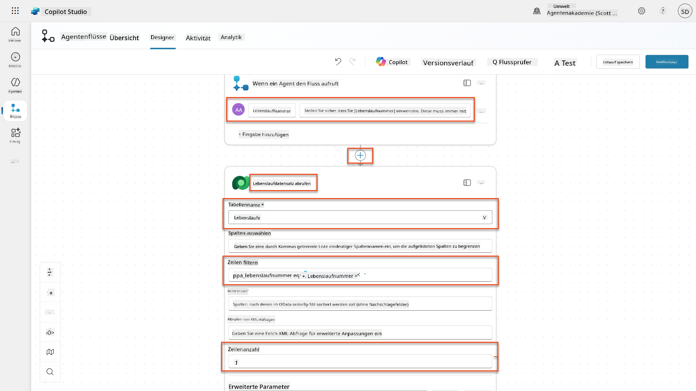

1. Wählen Sie das **+** Symbol für Aktion einfügen unter dem Knoten "Lebenslauf-Datensatz abrufen", suchen Sie nach **Dataverse**, wählen Sie **Mehr anzeigen**, und finden Sie die Aktion **Eine Datei oder ein Bild herunterladen**.

    !!! tip "Wählen Sie die richtige Aktion!"
        Stellen Sie sicher, dass Sie nicht die Aktion auswählen, die mit "aus ausgewählter Umgebung" endet.

1. Wie zuvor, benennen Sie die Aktion `Lebenslauf herunterladen` um und legen Sie die folgenden Parameter fest:

    | Eigenschaft | Wie einstellen | Wert |
    |----------|------------|-------|
    | **Tabellenname** | Auswählen | Lebensläufe |
    | **Zeilen-ID** | Ausdruck (fx-Symbol) | `first(body('Lebenslauf-Datensatz_abrufen')?['value'])?['ppa_resumeid']` |
    | **Spaltenname** | Auswählen | Lebenslauf-PDF |

    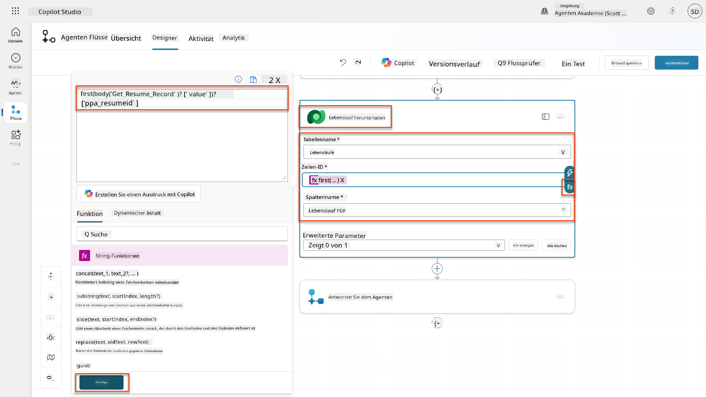

1. Wählen Sie nun das **+** Symbol für Aktion einfügen unter "Lebenslauf herunterladen", unter **KI-Funktionen**, wählen Sie **Eingabeaufforderung ausführen**.

1. Benennen Sie die Aktion in `Lebenslauf zusammenfassen` um und legen Sie die folgenden Parameter fest:

    | Eigenschaft | Wie einstellen | Wert |
    |----------|------------|-------|
| **Eingabeaufforderung** | Auswählen | Lebenslauf zusammenfassen |
| **Anschreiben** | Ausdruck (fx-Symbol) | `first(body('Get_Resume_Record')?['value'])?['ppa_coverletter']` |
| **Lebenslauf** | Dynamische Daten (Blitzsymbol) | Lebenslauf herunterladen → Datei- oder Bildinhalt |

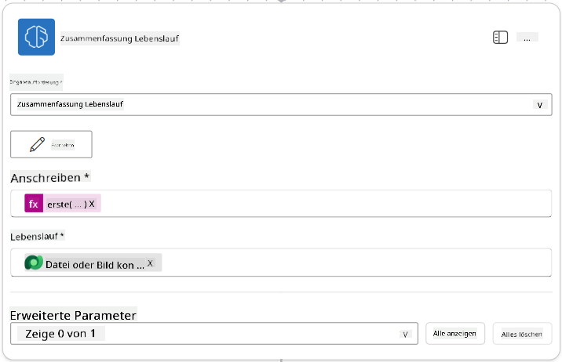

!!! tip "Parameter der Eingabeaufforderung"
    Beachten Sie, dass die Parameter, die Sie ausfüllen, dieselben sind, die Sie als Eingabeparameter konfiguriert haben, als Sie Ihre Eingabeaufforderung erstellt haben.

### 7.4 Kandidaten-Datensatz erstellen

Als Nächstes müssen Sie die Informationen, die die Eingabeaufforderung Ihnen gegeben hat, verwenden, um einen neuen Kandidaten-Datensatz zu erstellen, falls dieser noch nicht existiert.

1. Wählen Sie das **+** Symbol für Aktion einfügen unterhalb des Knotens Lebenslauf zusammenfassen, suchen Sie nach **Dataverse**, wählen Sie **Mehr anzeigen** und finden Sie die Aktion **Zeilen auflisten**.

1. Benennen Sie den Knoten um in `Get Existing Candidate` und setzen Sie die folgenden Parameter:

    | Eigenschaft | Einstellung | Wert |
    |-------------|-------------|------|
    | **Tabellenname** | Auswählen | Kandidaten |
    | **Zeilen filtern** | Dynamische Daten (Blitzsymbol) | `ppa_email eq 'Email'`  **Ersetzen Sie** `Email` durch **Lebenslauf zusammenfassen → Email** |
    | **Zeilenanzahl** | Eingeben | 1 |

    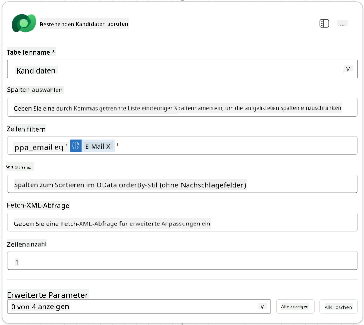

1. Wählen Sie das **+** Symbol für Aktion einfügen unterhalb des Knotens Vorhandenen Kandidaten abrufen, suchen Sie nach **Steuerung**, wählen Sie **Mehr anzeigen** und finden Sie die Aktion **Bedingung**.

1. Legen Sie in den Eigenschaften der Bedingung die folgende Bedingung fest:

    | Bedingung | Operator | Wert |
    |-----------|----------|------|
    | Ausdruck (fx-Symbol): `length(outputs('Get_Existing_Candidate')?['body/value'])` | ist gleich | 0 |

    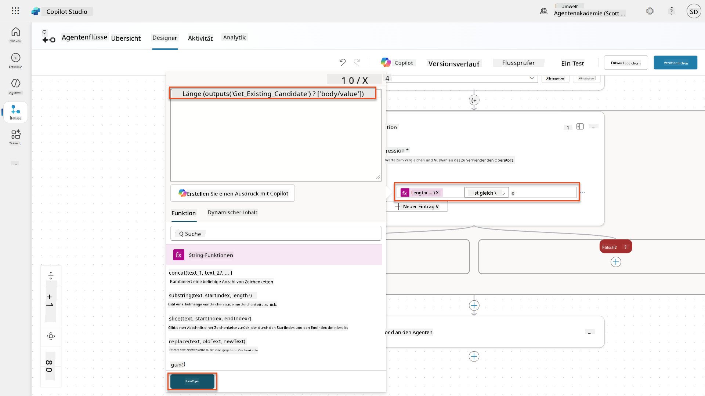

1. Wählen Sie das **+** Symbol für Aktion einfügen im **True**-Zweig, suchen Sie nach **Dataverse**, wählen Sie **Mehr anzeigen** und finden Sie die Aktion **Neue Zeile hinzufügen**.

1. Benennen Sie den Knoten um in `Add a New Candidate` und setzen Sie die folgenden Parameter:

    | Eigenschaft | Einstellung | Wert |
    |-------------|-------------|------|
    | **Tabellenname** | Auswählen | Kandidaten |
    | **Kandidat Name** | Dynamische Daten (Blitzsymbol) | Lebenslauf zusammenfassen → `CandidateName` |
    | **Email** | Dynamische Daten (Blitzsymbol) | Lebenslauf zusammenfassen → `Email` |

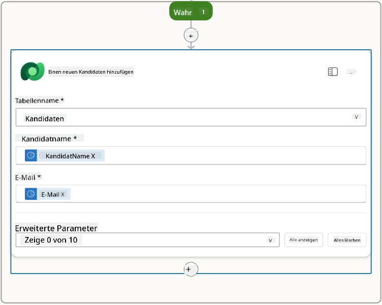

### 7.5 Lebenslauf aktualisieren und Flow-Ausgaben konfigurieren

Schließen Sie den Flow ab, indem Sie den Lebenslauf-Datensatz aktualisieren und konfigurieren, welche Daten an Ihren Agenten zurückgegeben werden sollen.

1. Wählen Sie das **+** Symbol für Aktion einfügen unterhalb der Bedingung, suchen Sie nach **Dataverse**, wählen Sie **Mehr anzeigen** und finden Sie die Aktion **Zeile aktualisieren**.

1. Wählen Sie den Titel aus, um den Knoten umzubenennen in `Update Resume`, wählen Sie **Alle anzeigen** und setzen Sie die folgenden Parameter:

    | Eigenschaft | Einstellung | Wert |
    |-------------|-------------|------|
    | **Tabellenname** | Auswählen | Lebensläufe |
    | **Zeilen-ID** | Ausdruck (fx-Symbol) | `first(body('Get_Resume_Record')?['value'])?['ppa_resumeid']` |
    | **Zusammenfassung** | Dynamische Daten (Blitzsymbol) | Lebenslauf zusammenfassen → Text |
    | **Kandidat (Kandidaten)** | Ausdruck (fx-Symbol) | `if(equals(length(outputs('Get_Existing_Candidate')?['body/value']), 1), first(outputs('Get_Existing_Candidate')?['body/value'])?['ppa_candidateid'], outputs('Add_a_New_Candidate')?['body/ppa_candidateid'])` |

    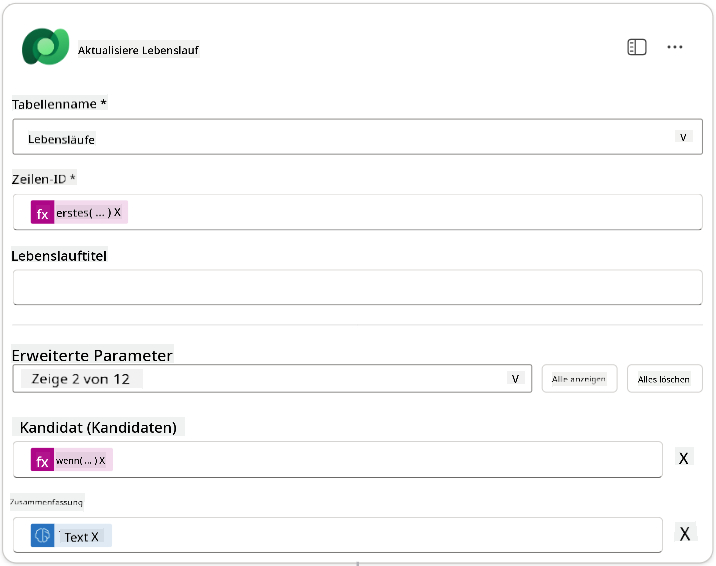

1. Wählen Sie den Knoten **Agent antworten** aus und verwenden Sie **+ Ausgabe hinzufügen**, um Folgendes zu konfigurieren:

    | Typ | Name              | Einstellung                     | Wert                                                        | Beschreibung                                            |
    |-----|-------------------|---------------------------------|------------------------------------------------------------|--------------------------------------------------------|
    | Text | `CandidateName`   | Dynamische Daten (Blitzsymbol) | Lebenslauf zusammenfassen → Mehr anzeigen → CandidateName  | Der [CandidateName], der im Lebenslauf angegeben ist   |
    | Text | `CandidateEmail`  | Dynamische Daten (Blitzsymbol) | Lebenslauf zusammenfassen → Mehr anzeigen → Email          | Die [CandidateEmail], die im Lebenslauf angegeben ist  |
    | Text | `CandidateNumber` | Ausdruck (fx-Symbol)           | `concat('ppa_candidates/', if(equals(length(outputs('Get_Existing_Candidate')?['body/value']), 1), first(outputs('Get_Existing_Candidate')?['body/value'])?['ppa_candidateid'], outputs('Add_a_New_Candidate')?['body/ppa_candidateid']) )` | Die [CandidateNumber] des neuen oder vorhandenen Kandidaten |
    | Text | `ResumeSummary`   | Dynamische Daten (Blitzsymbol) | Lebenslauf zusammenfassen → Mehr anzeigen → body/responsev2/predictionOutput/structuredOutput | Die Lebenslauf-Zusammenfassung und Details im JSON-Format |

    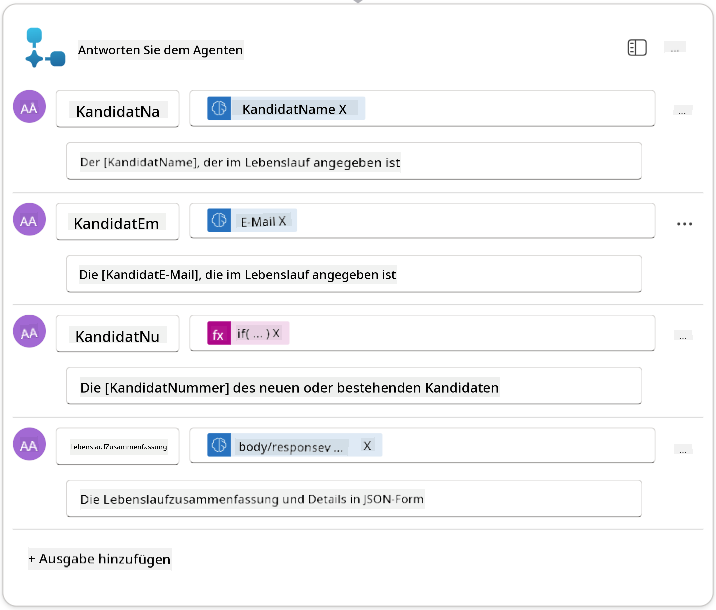

1. Wählen Sie **Entwurf speichern** oben rechts. Ihr Agent Flow sollte wie folgt aussehen:  
    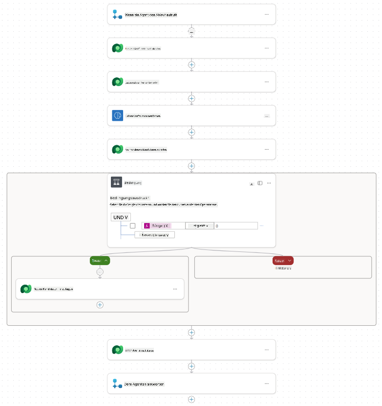

1. Wählen Sie die Registerkarte **Übersicht**, wählen Sie **Bearbeiten** im **Details**-Panel.

    1. **Flow-Name**:`Summarize Resume`
    1. **Beschreibung**:

        ```text
        Summarize an existing Resume stored in Dataverse using a [ResumeNumber] as input, return the [CandidateNumber], and resume summary JSON
        ```

1. Wählen Sie **Speichern**.

1. Wählen Sie erneut die Registerkarte **Designer** und dann **Veröffentlichen**.

### 7.6 Den Flow mit Ihrem Agenten verbinden

Jetzt fügen Sie den Flow als Tool hinzu und konfigurieren Ihren Agenten, ihn zu verwenden.

1. Öffnen Sie Ihren **Hiring Agent** in Copilot Studio.

1. Wählen Sie die Registerkarte **Agenten** und öffnen Sie den **Application Intake Agent**.

1. Wählen Sie das **Tools**-Panel und dann **+ Tool hinzufügen** -> **Flow** -> **Summarize Resume** **(Agent Flow)**.

1. Wählen Sie **Hinzufügen und konfigurieren**.

1. Konfigurieren Sie die Tool-Einstellungen wie folgt:

    | Einstellung | Wert |
    |-------------|------|
    | **Beschreibung** | Zusammenfassung eines vorhandenen Lebenslaufs, der in Dataverse gespeichert ist, mit [ResumeNumber] als Eingabe, Rückgabe der [CandidateNumber] und Lebenslauf-Zusammenfassung im JSON-Format |
    | **Wann dieses Tool verwendet werden kann** | Nur wenn von Themen oder Agenten referenziert |

1. Wählen Sie **Speichern**.  
    

1. Wenn Sie Tools im Hiring Agent auswählen, sehen Sie jetzt beide Tools, die vom **Application Intake Agent** verwendet werden können.  
    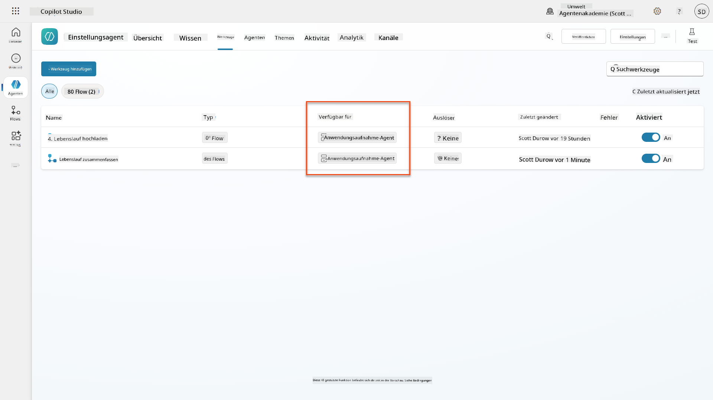

1. Navigieren Sie zu den **Application Intake Child**-Agenten-Anweisungen und ändern Sie den Schritt **Post-Upload** wie folgt:

    ```text
    2. Post-Upload Processing  
        - After uploading, be sure to also output the [ResumeNumber] in all messages
        - Pass [ResumeNumber] to /Summarize Resume  - Be sure to use the correct value that will start with the letter R.
        - Be sure to also output the [CandidateNumber] in all messages
        - Use the [ResumeSummary] to output a summary of the processed Resume and candidate
    ```

    Ersetzen Sie `/Summarize Resume`, indem Sie eine Referenz auf den **Summarize Resume Agent Flow** einfügen, indem Sie einen Schrägstrich (`/`) eingeben oder `/Summarize` auswählen, um die Referenz einzufügen.  
    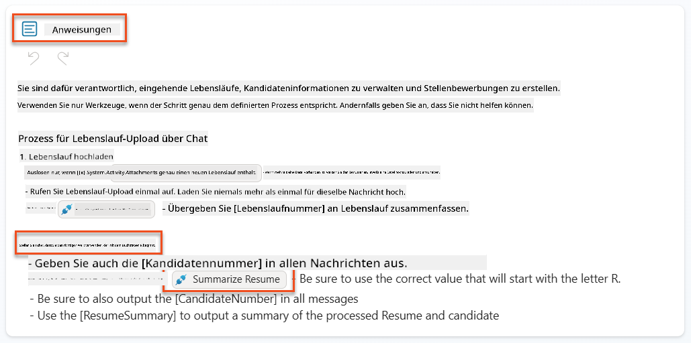

1. Wählen Sie **Speichern**.

### 7.7 Testen Sie Ihren Agenten

Testen Sie Ihr komplettes multimodales System, um sicherzustellen, dass alles korrekt funktioniert.

1. **Test starten**:

    - Wählen Sie **Test**, um das Test-Panel zu öffnen.
    - Geben Sie ein: `Hier ist ein Kandidaten-Lebenslauf`.

    - Laden Sie einen der Beispiel-Lebensläufe aus [Test Resumes](https://download-directory.github.io/?url=https://github.com/microsoft/agent-academy/tree/main/operative/sample-data/resumes&filename=operative_sampledata) hoch.

1. **Ergebnisse überprüfen**:
    - Sobald Sie die Nachricht und den Lebenslauf senden, überprüfen Sie, ob Sie eine Lebenslaufnummer (Format: R#####) erhalten.
    - Überprüfen Sie, ob Sie eine Kandidatennummer und Zusammenfassung erhalten.
    - Verwenden Sie die Aktivitätskarte, um sowohl das Lebenslauf-Upload-Tool als auch das Tool Lebenslauf zusammenfassen in Aktion zu sehen, und die Ausgaben der Zusammenfassungsaufforderung werden vom Agenten empfangen:  
        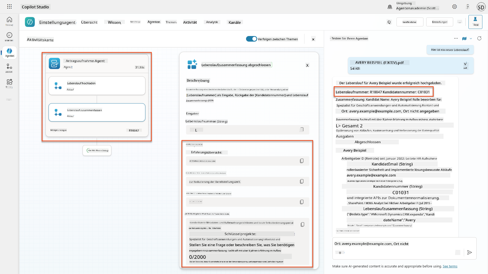

1. **Datenpersistenz überprüfen**:
    - Navigieren Sie zu [Power Apps](https://make.powerapps.com).
    - Öffnen Sie **Apps** → **Hiring Hub** → **Play**.
    - Gehen Sie zu **Lebensläufe**, um zu überprüfen, ob der Lebenslauf hochgeladen und verarbeitet wurde. Er sollte sowohl Zusammenfassungsinformationen als auch einen zugehörigen Kandidaten-Datensatz enthalten.
    - Überprüfen Sie **Kandidaten**, um die extrahierten Kandidateninformationen zu sehen.  
        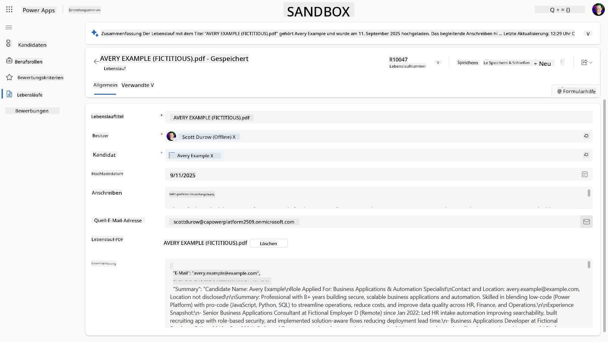
    - Wenn Sie den Prozess erneut ausführen, sollte der vorhandene Kandidat (abgeglichen mit der aus dem Lebenslauf extrahierten E-Mail) verwendet werden, anstatt einen neuen zu erstellen.

!!! tip "Fehlerbehebung"
    - **Lebenslauf wird nicht verarbeitet**: Stellen Sie sicher, dass die Datei ein PDF ist und die Größenbeschränkungen einhält.
    - **Kein Kandidat erstellt**: Überprüfen Sie, ob die E-Mail korrekt aus dem Lebenslauf extrahiert wurde.
    - **JSON-Formatfehler**: Vergewissern Sie sich, dass Ihre Eingabeaufforderungsanweisungen die genaue JSON-Struktur enthalten.
    - **Flow-Fehler**: Überprüfen Sie, ob alle Dataverse-Verbindungen und Ausdrücke korrekt konfiguriert sind.

### Produktionsbereitschaft

Obwohl dies nicht Teil dieser Mission ist, könnten Sie Folgendes in Betracht ziehen, um diesen Agent Flow produktionsbereit zu machen:

1. **Fehlerbehandlung** - Wenn die Lebenslaufnummer nicht gefunden wurde oder die Eingabeaufforderung das Dokument nicht analysieren konnte, sollte eine Fehlerbehandlung hinzugefügt werden, um dem Agenten eine klare Fehlermeldung zurückzugeben.
1. **Aktualisierung vorhandener Kandidaten** - Der Kandidat wird anhand der E-Mail gefunden, dann könnte der Name aktualisiert werden, um dem im Lebenslauf angegebenen Namen zu entsprechen.
1. **Trennung der Lebenslauf-Zusammenfassung und der Kandidatenerstellung** - Diese Funktionalität könnte in kleinere Agent Flows aufgeteilt werden, um sie einfacher zu warten, und dann könnte der Agent Anweisungen erhalten, sie nacheinander zu verwenden.

## 🎉 Mission abgeschlossen

Hervorragende Arbeit, Operative! **Dokument Lebenslauf-Erkennung** ist jetzt abgeschlossen. Sie haben erfolgreich multimodale Eingabeaufforderungen gemeistert und können nun strukturierte Daten aus jedem Dokument präzise extrahieren.

Das haben Sie in dieser Mission erreicht:

**✅ Multimodale Eingabeaufforderungen gemeistert**  
Sie verstehen jetzt, was multimodale Eingabeaufforderungen sind und wann verschiedene KI-Modelle für optimale Ergebnisse verwendet werden sollten.

**✅ Expertise in Dokumentenverarbeitung**  
Sie haben gelernt, Eingabeaufforderungen mit Bild- und Dokumenteingaben zu konfigurieren und Ausgaben als JSON für die Extraktion strukturierter Daten zu formatieren.

**✅ Lebenslauf-Extraktionssystem**  
Sie haben ein vollständiges Lebenslauf-Extraktionssystem erstellt, das Kandidatendokumente verarbeitet und in Ihren Einstellungsworkflow integriert.

**✅ Best Practices umgesetzt**  
Sie haben Best Practices für die Eingabeaufforderungserstellung mit Dokumentenanalyse angewendet und multimodale Eingabeaufforderungen mit Agent Flows integriert.

**✅ Grundlage für fortgeschrittene Verarbeitung**  
Ihre erweiterten Dokumentenanalysefähigkeiten sind jetzt bereit für die fortgeschrittenen Datenverankerungsfunktionen, die wir in den kommenden Missionen hinzufügen werden.

🚀 **Als Nächstes:** In Mission 08 erfahren Sie, wie Sie Ihre Eingabeaufforderungen mit Echtzeitdaten aus Dataverse verbessern können, um dynamische KI-Lösungen zu erstellen, die sich an wechselnde Geschäftsanforderungen anpassen.

⏩ [Weiter zu Mission 08: Verbesserte Eingabeaufforderungen mit Dataverse-Verankerung](../08-dataverse-grounding/README.md)

## 📚 Taktische Ressourcen

📖 [Eingabeaufforderung erstellen](https://learn.microsoft.com/ai-builder/create-a-custom-prompt?WT.mc_id=power-power-182762-scottdurow)

📖 [Text-, Bild- oder Dokumenteingabe zu Ihrer Eingabeaufforderung hinzufügen](https://learn.microsoft.com/ai-builder/add-inputs-prompt?WT.mc_id=power-182762-scottdurow)

📖 [Antworten mit JSON-Ausgabe verarbeiten](https://learn.microsoft.com/ai-builder/process-responses-json-output?WT.mc_id=power-182762-scottdurow)

📖 [Modellauswahl und Temperatureinstellungen](https://learn.microsoft.com/ai-builder/prompt-modelsettings?WT.mc_id=power-182762-scottdurow)

📖 [Ihre Eingabeaufforderung in Power Automate verwenden](https://learn.microsoft.com/ai-builder/use-a-custom-prompt-in-flow?WT.mc_id=power-182762-scottdurow)

📺 [AI Builder: JSON-Ausgaben im Eingabeaufforderungs-Builder](https://www.youtube.com/watch?v=F0fGnWrRY_I)

---

**Haftungsausschluss**:  
Dieses Dokument wurde mit dem KI-Übersetzungsdienst [Co-op Translator](https://github.com/Azure/co-op-translator) übersetzt. Obwohl wir uns um Genauigkeit bemühen, beachten Sie bitte, dass automatisierte Übersetzungen Fehler oder Ungenauigkeiten enthalten können. Das Originaldokument in seiner ursprünglichen Sprache sollte als maßgebliche Quelle betrachtet werden. Für kritische Informationen wird eine professionelle menschliche Übersetzung empfohlen. Wir übernehmen keine Haftung für Missverständnisse oder Fehlinterpretationen, die sich aus der Nutzung dieser Übersetzung ergeben.