<!--
CO_OP_TRANSLATOR_METADATA:
{
  "original_hash": "750f3ea8a94930439ebd8a10871b1d73",
  "translation_date": "2025-10-17T19:18:59+00:00",
  "source_file": "docs/operative-preview/08-dataverse-grounding/README.md",
  "language_code": "de"
}
-->
# 🚨 Mission 08: Verbesserte Eingabeaufforderungen mit Dataverse-Verknüpfung

--8<-- "disclaimer.md"

## 🕵️‍♂️ CODENAME: `OPERATION GROUNDING CONTROL`

> **⏱️ Zeitfenster der Operation:** `~60 Minuten`

## 🎯 Missionsbeschreibung

Willkommen zurück, Agent. Ihr Multi-Agenten-Einstellungssystem ist einsatzbereit, aber es gibt eine entscheidende Verbesserung, die für **Datenverknüpfung** erforderlich ist – Ihre KI-Modelle benötigen Echtzeitzugriff auf die strukturierten Daten Ihrer Organisation, um intelligente Entscheidungen zu treffen.

Derzeit arbeitet Ihre Eingabeaufforderung "Lebenslauf zusammenfassen" mit statischem Wissen. Aber was wäre, wenn sie dynamisch auf Ihre Jobrollen-Datenbank zugreifen könnte, um genaue und aktuelle Übereinstimmungen zu liefern? Was wäre, wenn sie Ihre Bewertungskriterien verstehen könnte, ohne dass Sie diese hart codieren müssen?

In dieser Mission werden Sie Ihre benutzerdefinierte Eingabeaufforderung mit **Dataverse-Verknüpfung** verbessern – indem Sie Ihre Eingabeaufforderungen direkt mit Live-Datenquellen verbinden. Dies verwandelt Ihre Agenten von statischen Antwortgebern in dynamische, datengetriebene Systeme, die sich an die sich ändernden Geschäftsanforderungen anpassen.

Ihre Mission: Integrieren Sie Echtzeitdaten zu Jobrollen und Bewertungskriterien in Ihren Workflow zur Lebenslaufanalyse, um ein sich selbst aktualisierendes System zu schaffen, das stets den aktuellen Anforderungen Ihrer Organisation entspricht.

## 🔎 Ziele

In dieser Mission lernen Sie:

1. Wie **Dataverse-Verknüpfung** benutzerdefinierte Eingabeaufforderungen verbessert
1. Wann Datenverknüpfung anstelle von statischen Anweisungen verwendet werden sollte
1. Wie man Eingabeaufforderungen entwirft, die dynamisch Live-Daten einbeziehen
1. Wie man den Lebenslauf-Zusammenfassungsprozess mit Jobrollen-Matching verbessert

## 🧠 Dataverse-Verknüpfung für Eingabeaufforderungen verstehen

**Dataverse-Verknüpfung** ermöglicht es Ihren benutzerdefinierten Eingabeaufforderungen, Live-Daten aus Ihren Dataverse-Tabellen beim Verarbeiten von Anfragen zu nutzen. Anstatt mit statischen Anweisungen zu arbeiten, können Ihre Eingabeaufforderungen Echtzeitinformationen einbeziehen, um fundierte Entscheidungen zu treffen.

### Warum Dataverse-Verknüpfung wichtig ist

Traditionelle Eingabeaufforderungen arbeiten mit festen Anweisungen:

```text
Match this candidate to these job roles: Developer, Manager, Analyst
```

Mit Dataverse-Verknüpfung greift Ihre Eingabeaufforderung auf aktuelle Daten zu:

```text
Match this candidate to available job roles from the Job Roles table, 
considering current evaluation criteria and requirements
```

Dieser Ansatz bietet mehrere wichtige Vorteile:

- **Dynamische Updates:** Jobrollen und Kriterien ändern sich, ohne dass die Eingabeaufforderung angepasst werden muss
- **Konsistenz:** Alle Agenten nutzen dieselben aktuellen Datenquellen
- **Skalierbarkeit:** Neue Rollen und Kriterien sind automatisch verfügbar
- **Genauigkeit:** Echtzeitdaten gewährleisten, dass Entscheidungen den aktuellen Anforderungen entsprechen

### Wie Dataverse-Verknüpfung funktioniert

Wenn Sie Dataverse-Verknüpfung für eine benutzerdefinierte Eingabeaufforderung aktivieren:

1. **Datenauswahl:** Wählen Sie spezifische Dataverse-Tabellen und Spalten aus, die einbezogen werden sollen. Sie können auch verwandte Tabellen auswählen, die das System basierend auf den abgerufenen übergeordneten Datensätzen filtert.
1. **Kontextinjektion:** Die Eingabeaufforderung fügt die abgerufenen Daten automatisch in den Kontext der Eingabeaufforderung ein.
1. **Intelligente Filterung:** Das System berücksichtigt nur Daten, die für die aktuelle Anfrage relevant sind, wenn Sie Filter bereitstellen.
1. **Strukturierte Ausgabe:** Ihre Eingabeaufforderung kann auf die abgerufenen Daten verweisen und über die abgerufenen Datensätze nachdenken, um die Ausgabe zu erstellen.

### Vom statischen zum dynamischen Ansatz: Der Vorteil der Verknüpfung

Betrachten wir Ihren aktuellen Lebenslauf-Zusammenfassungsprozess aus Mission 07 und sehen, wie Dataverse-Verknüpfung ihn von statischer zu dynamischer Intelligenz transformiert.

**Aktueller statischer Ansatz:**
Ihre bestehende Eingabeaufforderung enthält hartcodierte Bewertungskriterien und vordefinierte Matching-Logik. Dieser Ansatz funktioniert, erfordert jedoch manuelle Updates, wenn Sie neue Jobrollen hinzufügen, Bewertungskriterien ändern oder Unternehmensprioritäten verschieben.

**Transformation durch Dataverse-Verknüpfung:**
Durch die Hinzufügung der Dataverse-Verknüpfung wird Ihr Lebenslauf-Zusammenfassungsprozess:

- **Aktuelle Jobrollen** aus Ihrer Jobrollen-Tabelle abrufen
- **Live-Bewertungskriterien** anstelle statischer Beschreibungen verwenden  
- **Genauere Übereinstimmungen** basierend auf aktuellen Anforderungen liefern

## 🎯 Warum dedizierte Eingabeaufforderungen gegenüber Agentengesprächen

In Mission 02 haben Sie erlebt, wie der Interview-Agent Kandidaten mit Jobrollen abgleichen konnte, aber komplexe Benutzereingabeaufforderungen erforderte wie:

```text
Upload this resume, then show me open job roles,
each with a description of the evaluation criteria, 
then use this to match the resume to at least one suitable
job role even if not a perfect match.
```

Während dies funktionierte, bieten dedizierte Eingabeaufforderungen mit Dataverse-Verknüpfung erhebliche Vorteile für spezifische Aufgaben:

### Hauptvorteile dedizierter Eingabeaufforderungen

| Aspekt | Agentengespräche | Dedizierte Eingabeaufforderungen |
|--------|-------------------|------------------|
| **Konsistenz** | Ergebnisse variieren je nach Fähigkeiten des Benutzers beim Erstellen der Eingabeaufforderung | Standardisierte Verarbeitung jedes Mal |
| **Spezialisierung** | Allgemeine Argumentation kann geschäftliche Nuancen übersehen | Zweckgerichtet mit optimierter Geschäftslogik |
| **Automatisierung** | Erfordert menschliche Interaktion und Interpretation | Wird automatisch mit strukturiertem JSON-Ausgang ausgelöst |

## 🧪 Lab 8: Dataverse-Verknüpfung zu Eingabeaufforderungen hinzufügen

Zeit, Ihre Lebenslaufanalyse-Fähigkeiten zu verbessern! Sie werden den bestehenden Lebenslauf-Zusammenfassungsprozess mit dynamischem Jobrollen-Matching erweitern.

### Voraussetzungen für diese Mission

1. Sie benötigen **entweder**:

    - **Mission 07 abgeschlossen** und Ihr Lebenslaufanalyse-System bereit, **ODER**
    - **Die Starterlösung für Mission 08 importieren**, wenn Sie neu beginnen oder aufholen müssen. [Mission 08 Starterlösung herunterladen](https://aka.ms/agent-academy)

1. Beispiel-Lebenslaufdokumente von [Test-Lebensläufen](https://download-directory.github.io/?url=https://github.com/microsoft/agent-academy/tree/main/operative/sample-data/resumes&filename=operative_sampledata)

!!! note "Lösungsimport und Beispieldaten"
    Wenn Sie die Starterlösung verwenden, lesen Sie [Mission 01](../01-get-started/README.md) für detaillierte Anweisungen zum Importieren von Lösungen und Beispieldaten in Ihre Umgebung.

### 8.1 Dataverse-Verknüpfung zu Ihrer Eingabeaufforderung hinzufügen

Sie werden auf der Lebenslauf-Zusammenfassungsaufforderung aufbauen, die Sie in Mission 07 erstellt haben. Derzeit fasst sie den Lebenslauf einfach zusammen, aber jetzt werden Sie sie mit den Jobrollen verknüpfen, wie sie derzeit in Dataverse existieren, und sie so immer aktuell halten.

Zunächst werfen wir einen Blick auf die Dataverse-Tabellen, mit denen Sie verknüpfen werden:

1. **Navigieren** Sie zu [Power Apps](https://make.powerapps.com) und wählen Sie Ihre Umgebung mit dem **Umgebungsschalter** oben rechts in der Navigationsleiste aus.

1. Wählen Sie **Tabellen** und suchen Sie die Tabelle **Jobrollen**.

1. Überprüfen Sie die wichtigsten Spalten, die Sie für die Verknüpfung verwenden werden:

    | Spalte | Zweck |
    |--------|---------|
    | **Jobrollen-Nummer** | Eindeutige Kennung für Rollenabgleich |
    | **Jobtitel** | Anzeigename für die Rolle |
    | **Beschreibung** | Detaillierte Rollenanforderungen |

1. Überprüfen Sie auf ähnliche Weise die anderen Tabellen wie die Tabelle **Bewertungskriterien**.

### 8.2 Dataverse-Verknüpfungsdaten zu Ihrer Eingabeaufforderung hinzufügen

1. **Navigieren** Sie zu Copilot Studio und wählen Sie Ihre Umgebung mit dem **Umgebungsschalter** oben rechts in der Navigationsleiste aus.

1. Wählen Sie **Tools** aus der linken Navigation.

1. Wählen Sie **Eingabeaufforderung** und suchen Sie Ihre Eingabeaufforderung **Lebenslauf zusammenfassen** aus Mission 07.  
    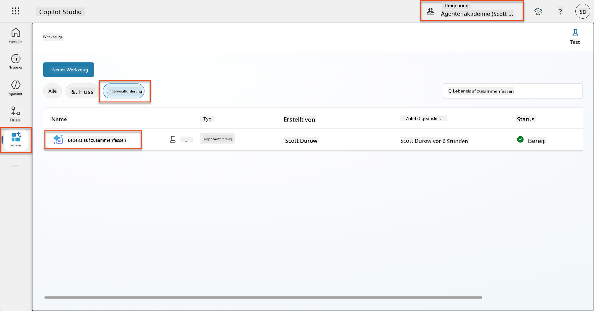

1. Wählen Sie **Bearbeiten**, um die Eingabeaufforderung zu ändern, und ersetzen Sie sie durch die erweiterte Version unten:

    !!! important
        Stellen Sie sicher, dass die Parameter Lebenslauf und Anschreiben als Parameter erhalten bleiben.

    ```text
    You are tasked with extracting key candidate information from a resume and cover letter to facilitate matching with open job roles and creating a summary for application review.
    
    ### Instructions:
    1. **Extract Candidate Details:**
       - Identify and extract the candidate's full name.
       - Extract contact information, specifically the email address.
    
    2. **Analyze Resume and Cover Letter:**
       - Review the resume content to identify relevant skills, experience, and qualifications.
       - Review the cover letter to understand the candidate's motivation and suitability for the roles.
    
    3. **Match Against Open Job Roles:**
       - Compare the extracted candidate information with the requirements and descriptions of the provided open job roles.
       - Use the job descriptions to assess potential fit.
       - Identify all roles that align with the candidate's cover letter and profile. You don't need to assess perfect suitability.
       - Provide reasoning for each match based on the specific job requirements.
    
    4. **Create Candidate Summary:**
       - Summarize the candidate's profile as multiline text with the following sections:
          - Candidate name
          - Role(s) applied for if present
          - Contact and location
          - One-paragraph summary
          - Top skills (8–10)
          - Experience snapshot (last 2–3 roles with outcomes)
          - Key projects (1–3 with metrics)
          - Education and certifications
          - Availability and work authorization
    
    ### Output Format
    
    Provide the output in valid JSON format with the following structure:
    
    {
      "CandidateName": "string",
      "Email": "string",
      "MatchedRoles": [
        {
          "JobRoleNumber": "ppa_jobrolenumber from grounded data",
          "RoleName": "ppa_jobtitle from grounded data",
          "Reasoning": "Detailed explanation based on job requirements"
        }
      ],
      "Summary": "string"
    }
    
    ### Guidelines
    
    - Extract information only from the provided resume and cover letter documents.
    - Ensure accuracy in identifying contact details.
    - Use the available job role data for matching decisions.
    - The summary should be concise but informative, suitable for quick application review.
    - If no suitable matches are found, indicate an empty list for MatchedRoles and explain briefly in the summary.
    
    ### Input Data
    Open Job Roles (ppa_jobrolenumber, ppa_jobtitle): /Job Role 
    Resume: {Resume}
    Cover Letter: {CoverLetter}
    ```

1. Im Eingabeaufforderungs-Editor ersetzen Sie `/Job Role`, indem Sie **+ Inhalt hinzufügen** auswählen, **Dataverse** → **Job Role** auswählen und die folgenden Spalten auswählen, und dann **Hinzufügen** wählen:

    1. **Jobrollen-Nummer**

    1. **Jobtitel**

    1. **Beschreibung**

    !!! tip
        Sie können den Tabellennamen eingeben, um zu suchen.

1. Im Dialogfeld **Job Role** wählen Sie das Attribut **Filter**, wählen **Status** und geben **Aktiv** als **Filterwert** ein.  
    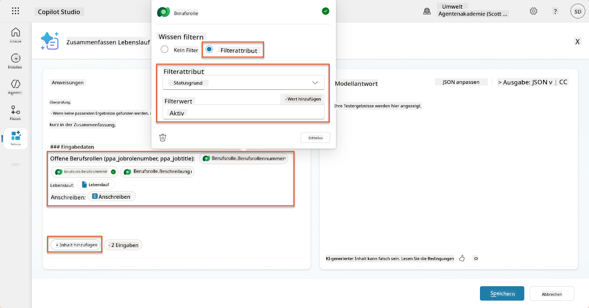

    !!! tip
        Sie können hier **Wert hinzufügen** verwenden, um auch einen Eingabeparameter hinzuzufügen – beispielsweise, wenn Sie eine Eingabeaufforderung hätten, um einen bestehenden Datensatz zusammenzufassen, könnten Sie die Lebenslaufnummer als Parameter bereitstellen, um danach zu filtern.

1. Als Nächstes fügen Sie die verwandte Dataverse-Tabelle **Bewertungskriterien** hinzu, indem Sie erneut **+ Inhalt hinzufügen** auswählen, **Job Roles** finden und anstatt die Spalten in Job Role auszuwählen, **Job Role (Evaluation Criteria)** erweitern und die folgenden Spalten auswählen, und dann **Hinzufügen** wählen:

    1. **Kriterienname**

    1. **Beschreibung**  
        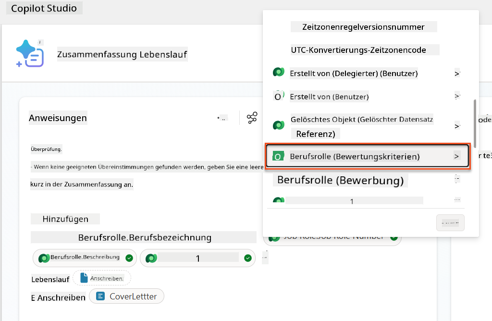

        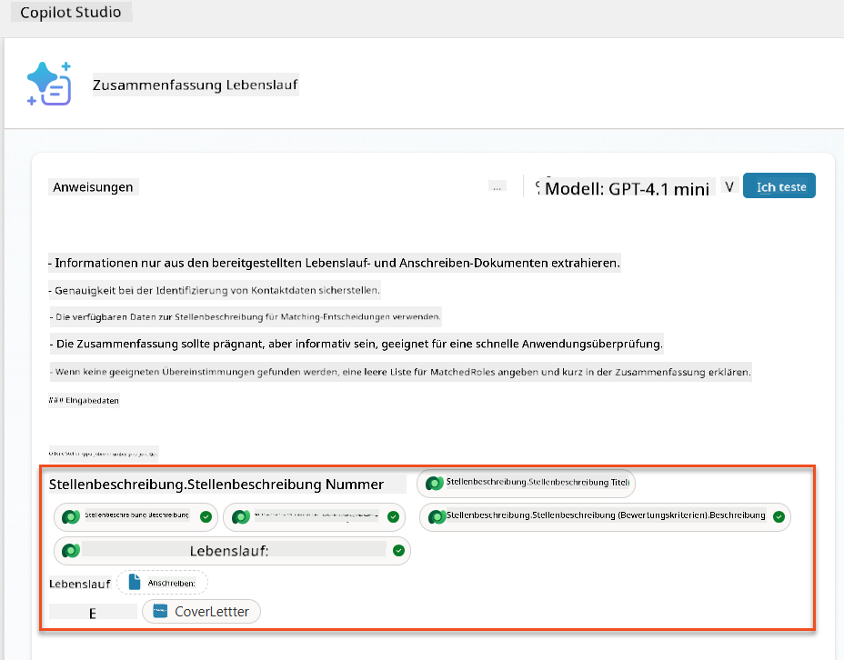

    !!! tip
        Es ist wichtig, die verwandten Bewertungskriterien auszuwählen, indem Sie zuerst die Jobrolle auswählen und dann im Menü zu Job Role (Evaluation Criteria) navigieren. Dies stellt sicher, dass nur die verwandten Datensätze für die Jobrolle geladen werden.

1. Wählen Sie **Einstellungen** und passen Sie die **Datensatzabfrage** auf 1000 an – dies ermöglicht, dass die maximalen Jobrollen und Bewertungskriterien in Ihre Eingabeaufforderung einbezogen werden.  
    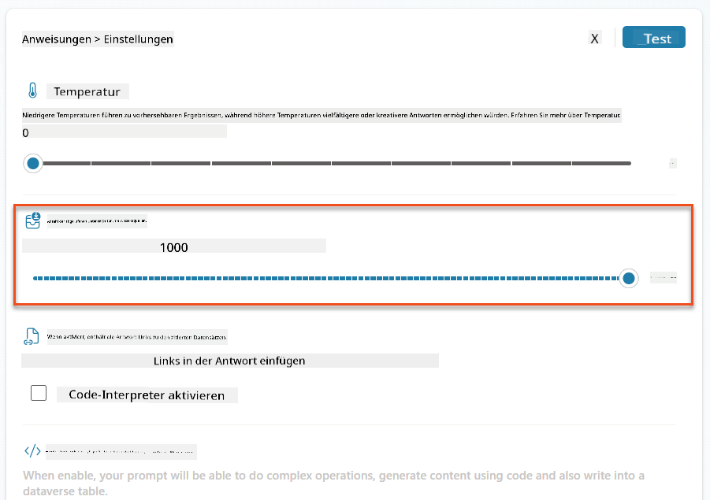

### 8.3 Die erweiterte Eingabeaufforderung testen

1. Wählen Sie den Parameter **Lebenslauf** und laden Sie einen Beispiel-Lebenslauf hoch, den Sie in Mission 07 verwendet haben.
1. Wählen Sie **Testen**.
1. Nachdem der Test abgeschlossen ist, stellen Sie fest, dass die JSON-Ausgabe jetzt die **Übereinstimmenden Rollen** enthält.
1. Wählen Sie die Registerkarte **Verwendetes Wissen**, um die Dataverse-Daten zu sehen, die vor der Ausführung mit Ihrer Eingabeaufforderung zusammengeführt wurden.
1. **Speichern** Sie Ihre aktualisierte Eingabeaufforderung. Das System wird diese Dataverse-Daten jetzt automatisch mit Ihrer Eingabeaufforderung einbeziehen, wenn der bestehende Lebenslauf-Zusammenfassungs-Agentenfluss sie aufruft.  
    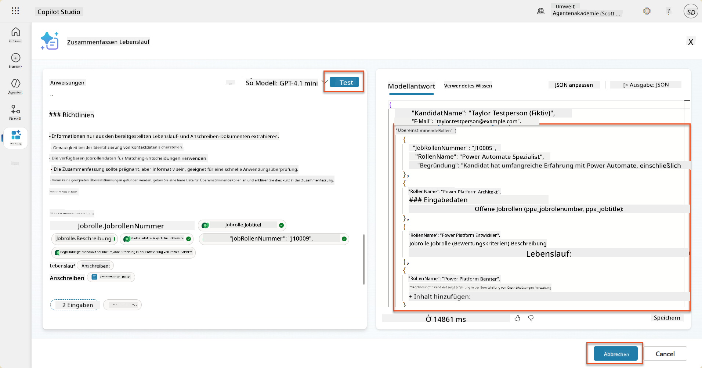

### 8.4 Agentenfluss für Bewerbungen hinzufügen

Um unserem Bewerbungsannahme-Agenten zu ermöglichen, Jobrollen basierend auf den vorgeschlagenen Rollen zu erstellen, müssen wir einen Agentenfluss erstellen. Der Agent wird dieses Tool für jede der vorgeschlagenen Jobrollen aufrufen, an denen der Kandidat interessiert ist.

!!! tip "Agentenfluss-Ausdrücke"
    Es ist sehr wichtig, dass Sie die Anweisungen zum Benennen Ihrer Knoten und zum Eingeben von Ausdrücken genau befolgen, da sich die Ausdrücke auf die vorherigen Knoten anhand ihres Namens beziehen! Lesen Sie die [Agentenfluss-Mission in Recruit](../../recruit/09-add-an-agent-flow/README.md#you-mentioned-expressions-what-are-expressions) für eine kurze Auffrischung!

1. Innerhalb des **Einstellungsagenten** wählen Sie die Registerkarte **Agenten** und öffnen den **Bewerbungsannahme-Agenten**.

1. Innerhalb des **Tools**-Panels wählen Sie **+ Hinzufügen** → **+ Neues Tool** → **Agentenfluss**

1. Wählen Sie den Knoten **Wenn ein Agent den Fluss aufruft**, verwenden Sie **+ Eingabe hinzufügen**, um die folgenden Parameter hinzuzufügen:

    | Typ | Name            | Beschreibung                                                  |
    | ---- | --------------- | ------------------------------------------------------------ |
    | Text | `ResumeNumber`  | Stellen Sie sicher, dass Sie nur die [ResumeNumber] verwenden – sie MUSS mit dem Buchstaben R beginnen |
    | Text | `JobRoleNumber` | Stellen Sie sicher, dass Sie nur die [JobRoleNumber] verwenden – sie MUSS mit dem Buchstaben J beginnen |

    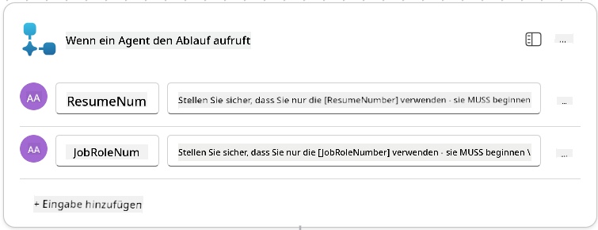

1. Wählen Sie das **+** Einfügeaktion-Symbol unter dem ersten Knoten, suchen Sie nach **Dataverse**, wählen Sie **Mehr anzeigen** und finden Sie die Aktion **Zeilen auflisten**.

1. **Benennen** Sie den Knoten um in `Get Resume` und setzen Sie die folgenden Parameter:

    | Eigenschaft        | Wie einstellen                | Wert                                                        |
    | ------------------- | ----------------------------- | ----------------------------------------------------------- |
    | **Tabellenname**   | Auswählen                     | Lebensläufe                                                 |
    | **Filterzeilen**   | Dynamische Daten (Blitzsymbol) | `ppa_resumenumber eq 'ResumeNumber'` Wählen und ersetzen Sie **ResumeNumber** durch **Wenn ein Agent den Fluss aufruft** → **ResumeNumber** |
    | **Zeilenanzahl**   | Eingeben                      | 1                                                           |

    

1. Wählen Sie nun das **+** Einfügeaktion-Symbol unter **Get Resume**, suchen Sie nach **Dataverse**, wählen Sie **Mehr anzeigen** und finden Sie die Aktion **Zeilen auflisten**.

1. **Benennen** Sie den Knoten um in `Get Job Role` und setzen Sie die folgenden Parameter:

    | Eigenschaft        | Wie einstellen                | Wert                                                        |
    | ------------------- | ----------------------------- | ----------------------------------------------------------- |
    | **Tabellenname**   | Auswählen                     | Jobrollen                                                   |
    | **Filterzeilen**   | Dynamische Daten (Blitzsymbol) | `ppa_jobrolenumber eq 'JobRoleNumber'` Wählen und ersetzen Sie **JobRoleNumber** durch **Wenn ein Agent den Fluss aufruft** → **JobRoleNumber** |
    | **Zeilenanzahl**   | Eingeben                      | 1                                                           |

    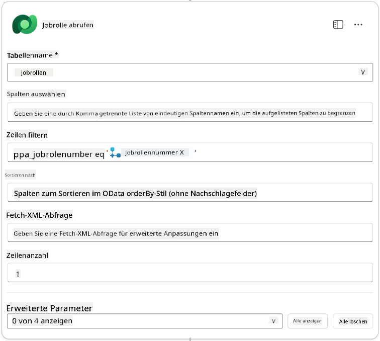

1. Wählen Sie nun das **+** Einfügeaktion-Symbol unter Get Job Role, suchen Sie nach **Dataverse**, wählen Sie **Mehr anzeigen** und finden Sie die Aktion **Neue Zeile hinzufügen**.

1. **Benennen** Sie den Knoten um in `Add Application` und setzen Sie die folgenden Parameter:

    | Eigenschaft                           | Wie einstellen       | Wert                                                        |
    | ------------------------------------- | -------------------- | ----------------------------------------------------------- |
    | **Tabellenname**                      | Auswählen            | Bewerbungen                                                 |
    | **Kandidat (Kandidaten)**             | Ausdruck (fx-Symbol) | `concat('ppa_candidates/',first(outputs('Get_Resume')?['body/value'])?['_ppa_candidate_value'])` |
| **Jobrolle (Jobrollen)**               | Ausdruck (fx-Symbol) | `concat('ppa_jobroles/',first(outputs('Get_Job_Role')?['body/value'])?['ppa_jobroleid'])` |
| **Lebenslauf (Lebensläufe)**           | Ausdruck (fx-Symbol) | `concat('ppa_resumes/', first(outputs('Get_Resume')?['body/value'])?['ppa_resumeid'])` |
| **Bewerbungsdatum** (verwenden Sie **Alle anzeigen**) | Ausdruck (fx-Symbol) | `utcNow()`                                                   |

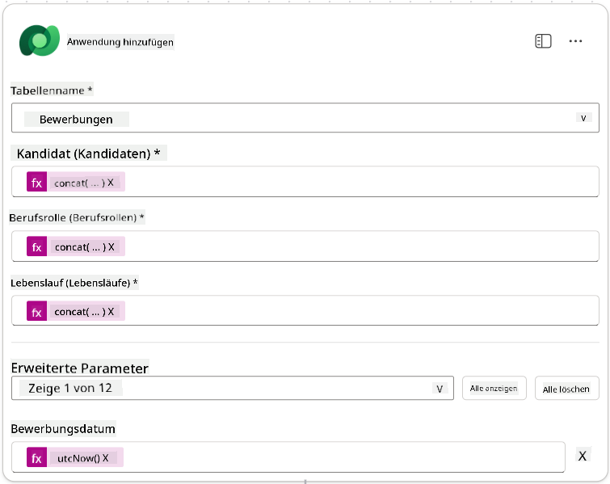

1. Wählen Sie den **Antworten an den Agent-Knoten** aus und klicken Sie auf **+ Ausgabe hinzufügen**

     | Eigenschaft     | Einstellung                     | Details                                         |
     | --------------- | ------------------------------- | ----------------------------------------------- |
     | **Typ**         | Auswählen                      | `Text`                                          |
     | **Name**        | Eingeben                       | `ApplicationNumber`                             |
     | **Wert**        | Dynamische Daten (Blitzsymbol) | *Bewerbung hinzufügen → Mehr anzeigen → Bewerbungsnummer* |
     | **Beschreibung**| Eingeben                       | `Die [ApplicationNumber] der erstellten Bewerbung`      |

     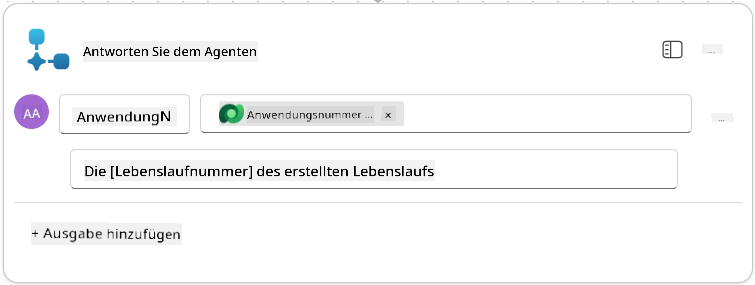

1. Wählen Sie **Entwurf speichern** oben rechts aus.

1. Wählen Sie die Registerkarte **Übersicht** aus und klicken Sie auf **Bearbeiten** im **Details**-Panel.

      - **Flow-Name**:`Create Job Application`
      - **Beschreibung**:`Erstellt eine neue Bewerbung basierend auf [ResumeNumber] und [JobRoleNumber]`
      - **Speichern**

1. Wechseln Sie erneut zur Registerkarte **Designer** und klicken Sie auf **Veröffentlichen**.

### 8.5 Fügen Sie "Create Job Application" dem Agent hinzu

Jetzt verbinden Sie den veröffentlichten Flow mit Ihrem Bewerbungsaufnahme-Agent.

1. Navigieren Sie zurück zum **Hiring Agent** und wählen Sie die Registerkarte **Agents** aus. Öffnen Sie den **Application Intake Agent** und suchen Sie das **Tools**-Panel.

1. Wählen Sie **+ Hinzufügen**.

1. Wählen Sie den **Flow**-Filter aus und suchen Sie nach `Create Job Application`. Wählen Sie den Flow **Create Job Application** aus und klicken Sie auf **Hinzufügen und konfigurieren**.

1. Legen Sie die folgenden Parameter fest:

    | Parameter                                           | Wert                                                        |
    | --------------------------------------------------- | ------------------------------------------------------------ |
    | **Beschreibung**                                     | `Erstellt eine neue Bewerbung basierend auf [ResumeNumber] und [JobRoleNumber]` |
    | **Zusätzliche Details → Wann dieses Tool verwendet werden kann** | `Nur wenn von Themen oder Agenten referenziert`                   |

1. Wählen Sie **Speichern**  
    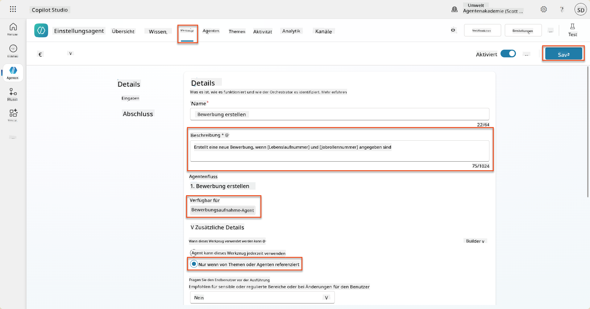

### 8.6 Definieren Sie Agent-Anweisungen

Um Bewerbungen zu erstellen, müssen Sie dem Agent mitteilen, wann das neue Tool verwendet werden soll. In diesem Fall bitten Sie den Benutzer, zu bestätigen, für welche vorgeschlagenen Jobrollen er sich bewerben möchte, und weisen den Agent an, das Tool für jede Rolle auszuführen.

1. Gehen Sie zurück zum **Application Intake Agent** und suchen Sie das **Instructions**-Panel.

1. Fügen Sie im Feld **Instructions** die folgende klare Anleitung für Ihren untergeordneten Agent **am Ende der bestehenden** Anweisungen hinzu:

    ```text
    3. Post Resume Upload
       - Respond with a formatted bullet list of [SuggestedJobRoles] the candidate could apply for.  
       - Use the format: [JobRoleNumber] - [RoleDescription]
       - Ask the user to confirm which Job Roles to create applications for the candidate.
       - When the user has confirmed a set of [JobRoleNumber]s, move to the next step.
    
    4. Post Upload - Application Creation
        - After the user confirms which [SuggestedJobRoles] for a specific [ResumeNumber]:
        E.g. "Apply [ResumeNumber] for the Job Roles [JobRoleNumber], [JobRoleNumber], [JobRoleNumber]
        E.g. "apply to all suggested job roles" - this implies use all the [JobRoleNumbers] 
         - Loop over each [JobRoleNumber] and send with [ResumeNumber] to /Create Job Application   
         - Summarize the Job Applications Created
    
    Strict Rules (that must never be broken)
    You must always follow these rules and never break them:
    1. The only valid identifiers are:
      - ResumeNumber (ppa_resumenumber)→ format R#####
      - CandidateNumber (ppa_candidatenumber)→ format C#####
      - ApplicationNumber (ppa_applicationnumber)→ format A#####
      - JobRoleNumber (ppa_jobrolenumber)→ format J#####
    2. Never guess or invent these values.
    3. Always extract identifiers from the current context (conversation, data, or system output). 
    ```

1. Wo die Anweisungen einen Schrägstrich (/) enthalten, wählen Sie den Text nach dem / aus und klicken Sie auf das Tool **Create Job Application**.

1. Wählen Sie **Speichern**  
    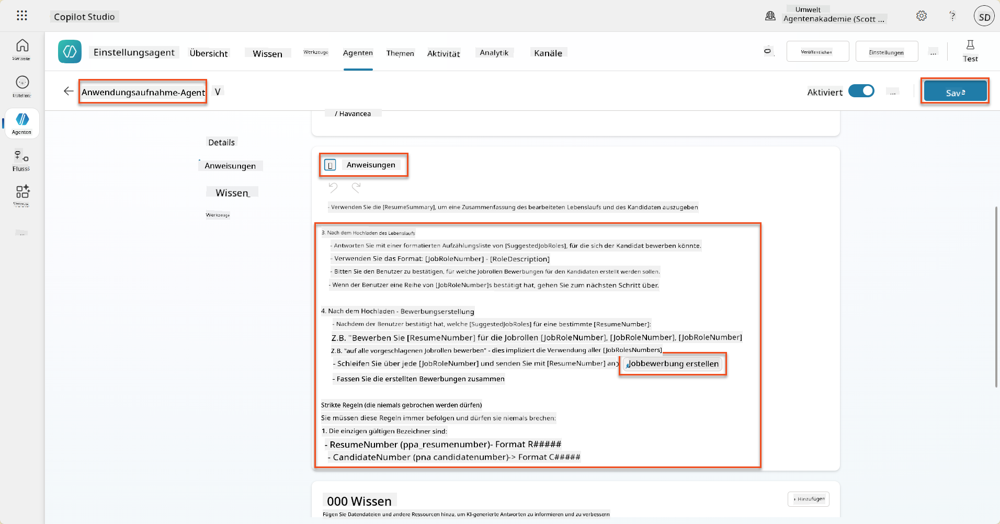

!!! tip "Iterieren über mehrere Elemente in generativer Orchestrierung"
    Diese Anweisungen nutzen die Fähigkeit der generativen Orchestrierung, über mehrere Zeilen zu iterieren, um Entscheidungen darüber zu treffen, welche Schritte und Tools verwendet werden sollen. Die passenden Jobrollen werden automatisch gelesen und der Application Intake Agent wird für jede Zeile ausgeführt. Willkommen in der magischen Welt der generativen Orchestrierung!

### 8.7 Testen Sie Ihren Agent

1. Öffnen Sie Ihren **Hiring Agent** in Copilot Studio.

1. **Laden** Sie einen Beispiel-Lebenslauf in den Chat hoch und geben Sie ein:

    ```text
    This is a new resume for the Power Platform Developer Role.
    ```

1. Beachten Sie, wie der Agent eine Liste vorgeschlagener Jobrollen bereitstellt - jede mit einer Jobrollen-Nummer.  
    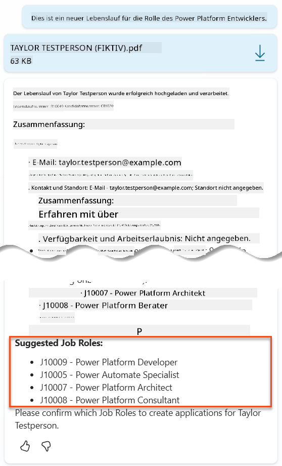

1. Sie können dann angeben, für welche dieser Rollen der Lebenslauf als Bewerbung hinzugefügt werden soll.
    **Beispiele:**

    ```text
    "Apply for all of those job roles"
    "Apply for the J10009 Power Platform Developer role"
    "Apply for the Developer and Architect roles"
    ```

    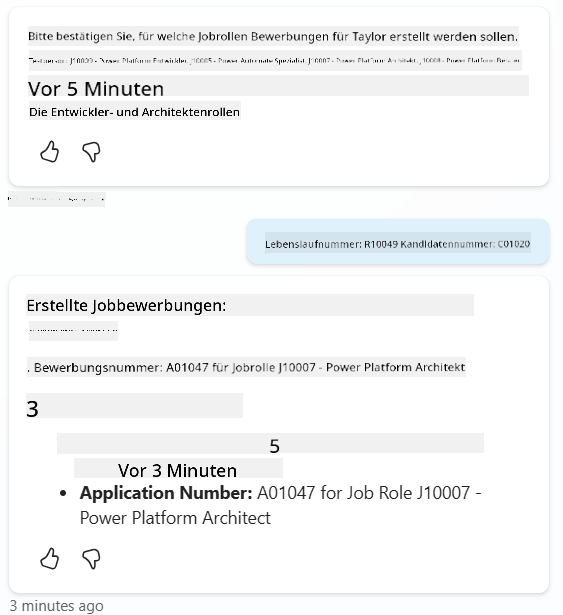

1. Das **Create Job Application Tool** wird dann für jede Jobrolle ausgeführt, die Sie angegeben haben. Im Aktivitätsdiagramm sehen Sie, wie das Tool für jede Jobrolle ausgeführt wird, für die Sie eine Bewerbung erstellen wollten:  
    

## 🎉 Mission abgeschlossen

Hervorragende Arbeit, Operative! **Operation Grounding Control** ist jetzt abgeschlossen. Sie haben Ihre KI-Fähigkeiten erfolgreich mit dynamischer Datenverknüpfung erweitert und ein wirklich intelligentes Einstellungssystem geschaffen.

Das haben Sie in dieser Mission erreicht:

**✅ Dataverse-Verknüpfung gemeistert**  
Sie verstehen jetzt, wie Sie benutzerdefinierte Eingabeaufforderungen mit Live-Datenquellen für dynamische Intelligenz verbinden.

**✅ Verbesserte Lebenslaufanalyse**  
Ihr Summarize Resume Flow greift jetzt auf Echtzeit-Jobrollendaten und Bewertungskriterien zu, um eine genaue Zuordnung zu ermöglichen.

**✅ Datengetriebene Entscheidungsfindung**  
Ihre Einstellung-Agenten können sich jetzt automatisch an sich ändernde Jobanforderungen anpassen, ohne manuelle Eingabeaufforderungsaktualisierungen.

**✅ Erstellung von Bewerbungen**  
Ihr erweitertes System kann jetzt Bewerbungen erstellen und ist bereit für weitere komplexe Workflow-Orchestrierungen.

🚀 **Als Nächstes:** In Ihrer nächsten Mission lernen Sie, wie Sie tiefgehende Argumentationsfähigkeiten implementieren, die Ihren Agenten helfen, komplexe Entscheidungen zu treffen und detaillierte Erklärungen für ihre Empfehlungen zu geben.

⏩ [Weiter zu Mission 09: Tiefgehende Argumentation](../09-deep-reasoning/README.md)

## 📚 Taktische Ressourcen

📖 [Verwenden Sie Ihre eigenen Daten in einer Eingabeaufforderung](https://learn.microsoft.com/ai-builder/use-your-own-prompt-data?WT.mc_id=power-182762-scottdurow)

📖 [Erstellen Sie eine benutzerdefinierte Eingabeaufforderung](https://learn.microsoft.com/ai-builder/create-a-custom-prompt?WT.mc_id=power-182762-scottdurow)

📖 [Arbeiten mit Dataverse in Copilot Studio](https://learn.microsoft.com/microsoft-copilot-studio/knowledge-add-dataverse?WT.mc_id=power-182762-scottdurow)

📖 [Übersicht über benutzerdefinierte Eingabeaufforderungen in AI Builder](https://learn.microsoft.com/ai-builder/prompts-overview?WT.mc_id=power-182762-scottdurow)

📖 [Power Platform AI Builder Dokumentation](https://learn.microsoft.com/ai-builder/?WT.mc_id=power-182762-scottdurow)

📖 [Training: Erstellen von AI Builder Eingabeaufforderungen mit Ihren eigenen Dataverse-Daten](https://learn.microsoft.com/training/modules/ai-builder-grounded-prompts/?WT.mc_id=power-182762-scottdurow)

---

**Haftungsausschluss**:  
Dieses Dokument wurde mit dem KI-Übersetzungsdienst [Co-op Translator](https://github.com/Azure/co-op-translator) übersetzt. Obwohl wir uns um Genauigkeit bemühen, beachten Sie bitte, dass automatisierte Übersetzungen Fehler oder Ungenauigkeiten enthalten können. Das Originaldokument in seiner ursprünglichen Sprache sollte als maßgebliche Quelle betrachtet werden. Für kritische Informationen wird eine professionelle menschliche Übersetzung empfohlen. Wir übernehmen keine Haftung für Missverständnisse oder Fehlinterpretationen, die sich aus der Nutzung dieser Übersetzung ergeben.