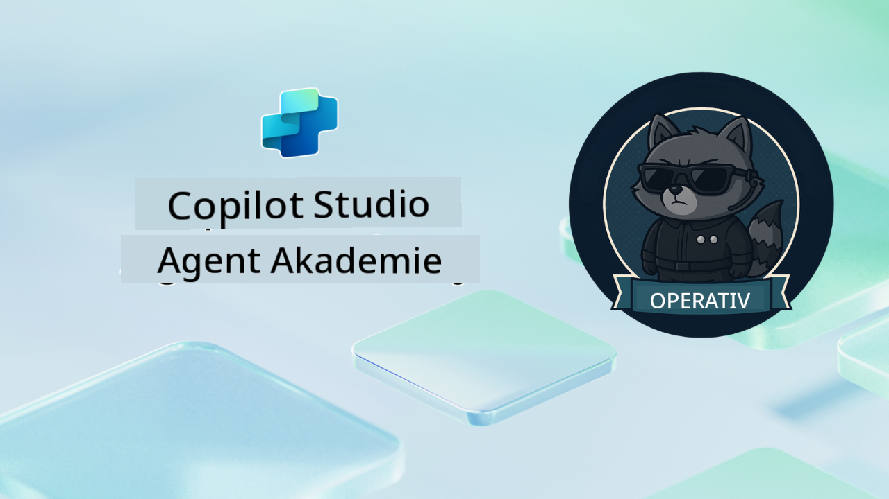

<!--
CO_OP_TRANSLATOR_METADATA:
{
  "original_hash": "24fcbe9a57d3439e05f8866e550c0a84",
  "translation_date": "2025-10-17T19:17:25+00:00",
  "source_file": "docs/operative-preview/README.md",
  "language_code": "de"
}
-->
# Willkommen, Agent

**Willkommen, Agent.**  
Ihre fortgeschrittene Mission – falls Sie sich dafür entscheiden – besteht darin, die Kunst des Aufbaus von **unternehmensgerechten Multi-Agenten-Systemen** mit **Microsoft Copilot Studio** zu meistern.

Dieses intensive Training führt Sie über die grundlegende Agentenerstellung hinaus in die anspruchsvolle Welt der **Multi-Agenten-Orchestrierung**: Von Automatisierung im Recruiting bis hin zu KI-Sicherheit lernen Sie, intelligente Agenten-Ökosysteme zu entwickeln, zu koordinieren und in realen Unternehmensszenarien einzusetzen.

--8<-- "disclaimer.md"

---

## 🎯 Missionsziel

Nach Abschluss des Agent Academy Operative Programms können Sie:

- **Multi-Agenten-Systeme** für komplexe Geschäftsszenarien entwerfen und implementieren
- **Agenten-Orchestrierung** und Kollaborationsmuster meistern
- **KI-Sicherheit und Inhaltsmoderation** in Produktionssystemen umsetzen
- **Multimodale Prompts** für Dokumentenverarbeitung und Analyse erstellen
- **Unternehmensgerechte Agenten** mit ordnungsgemäßer Governance und Tests bereitstellen

---

## 🧪 Voraussetzungen

Um alle Missionen abzuschließen, benötigen Sie:

- Abgeschlossenes **Agent Academy Recruit**-Training
- Eine Microsoft Power Platform-Umgebung mit **Copilot Studio**-Lizenz
- Zugriff auf **Microsoft Dataverse**
- Administratorrechte zum Erstellen von Lösungen und Agenten

---

## 🧬 Für wen ist das geeignet?

Dieser fortgeschrittene Kurs ist ideal für:

- **Lösungsarchitekten**, die Unternehmens-KI-Systeme entwerfen
- **Entwickler**, die produktionsreife Agentenlösungen erstellen
- **IT-Fachleute**, die KI-Governance und Sicherheit implementieren
- **Business-Analysten**, die komplexe Automatisierungs-Workflows erstellen
- Alle, die bereit sind, von einfachen Agenten zu Unternehmenssystemen aufzusteigen

---

## 🧭 Überblick über das Curriculum

Diese Akademie ist als eine fortschreitende Serie von Feldoperationen strukturiert – jede Mission baut auf der vorherigen auf, um ein umfassendes Automatisierungssystem für das Recruiting zu schaffen.

| Mission | Titel | Einsatzbesprechung |
|---------|-------|--------------------|
| `01` | 🚨 [Erste Schritte mit dem Recruiting-Agenten](./01-get-started/README.md) | Grundlegende Infrastruktur bereitstellen und zentralen Orchestrator-Agenten erstellen |
| `02` | 🎭 [Machen Sie Ihren Agenten Multi-Agenten-fähig mit verbundenen Agenten](./02-multi-agent/README.md) | Einzelagenten in ein koordiniertes Multi-Agenten-System umwandeln |
| `03` | ⚡ [Automatisieren Sie Ihren Agenten mit Triggern](./03-automate-triggers/README.md) | Autonome Agentenverhalten mit ereignisgesteuerten Triggern implementieren |
| `04` | 📝 [Erstellen von Agentenanweisungen](./04-agent-instructions/README.md) | Präzise Agentenkommunikation und Verhaltenskontrolle meistern |
| `05` | 💬 [Personalisieren von Agentenantworten](./05-agent-responses/README.md) | Agentenantworten für maximale Wirkung und Engagement anpassen |
| `06` | 🛡️ [Inhaltsmoderation und Grundlagen der KI-Sicherheit](./06-ai-safety/README.md) | Sicherheits- und Compliance-Maßnahmen auf Unternehmensniveau implementieren |
| `07` | 🎨 [Extrahieren von Lebenslaufinhalten mit multimodalen Prompts](./07-multimodal-prompts/README.md) | Dokumente und Bilder mit fortschrittlichen KI-Funktionen verarbeiten |
| `08` | 🗄️ [Prompts – Dataverse-Verankerung](./08-dataverse-grounding/README.md) | Agenten in Unternehmensdaten verankern für präzise Antworten |
| `09` | 🧠 [Anwendung von tiefem Denken zur Bewertung der Kandidaten-Eignung und Interviewvorbereitung](./09-deep-reasoning/README.md) | Anspruchsvolle KI-Logik für komplexe Entscheidungen implementieren |
| `10` | 📄 [Erstellen von interviewbezogenen Dokumenten für Kandidaten mit Prompts](./10-generate-documents/README.md) | Dynamische Dokumente basierend auf Agentenanalyse erstellen |
| `11` | 📊 [Erhalten von Benutzerfeedback mit adaptiven Karten](./11-obtain-user-feedback/README.md) | Benutzerfeedback sammeln und verarbeiten für kontinuierliche Verbesserung |
| `12` | 🌐 [Veröffentlichen Ihrer Agenten auf einer Demo-Website für Stakeholder-Tests](./12-demo-website/README.md) | Komplettlösung für Stakeholder-Demonstration und Tests bereitstellen |

!!! note
    ✅ Der Abschluss dieses Curriculums verleiht Ihnen das **Operative**-Abzeichen.  
    🔓 **Commander** wird in zukünftigen Phasen freigeschaltet.

<!-- markdownlint-disable-next-line MD033 -->

---

**Haftungsausschluss**:  
Dieses Dokument wurde mit dem KI-Übersetzungsdienst [Co-op Translator](https://github.com/Azure/co-op-translator) übersetzt. Obwohl wir uns um Genauigkeit bemühen, beachten Sie bitte, dass automatisierte Übersetzungen Fehler oder Ungenauigkeiten enthalten können. Das Originaldokument in seiner ursprünglichen Sprache sollte als maßgebliche Quelle betrachtet werden. Für kritische Informationen wird eine professionelle menschliche Übersetzung empfohlen. Wir übernehmen keine Haftung für Missverständnisse oder Fehlinterpretationen, die sich aus der Nutzung dieser Übersetzung ergeben.