<!--
CO_OP_TRANSLATOR_METADATA:
{
  "original_hash": "d9cd8cd1a4fbd8915171a2ed972cc322",
  "translation_date": "2025-10-17T19:00:26+00:00",
  "source_file": "docs/recruit/00-course-setup/README.md",
  "language_code": "de"
}
-->
# 🚨 Mission 00: Kurs Setup

## 🕵️‍♂️ CODENAME: `OPERATION EINSATZBEREIT`

> **⏱️ Zeitfenster der Operation:** `~30 Minuten`  

## 🎯 Missionsbeschreibung

Willkommen zur ersten Mission Ihrer Ausbildung als Copilot Studio Agent.  
Bevor Sie Ihren ersten KI-Agenten erstellen können, müssen Sie Ihre **einsatzbereite Entwicklungsumgebung** einrichten.

Diese Anleitung beschreibt die Systeme, Zugangsdaten und Einrichtungsschritte, die erforderlich sind, um erfolgreich im Microsoft 365-Ökosystem zu arbeiten.

## 🔎 Ziele

Ihre Mission umfasst:

1. Einen Microsoft 365-Account erhalten  
1. Zugang zu Microsoft Copilot Studio erhalten  
1. (Optional) Eine Microsoft 365 Copilot-Lizenz für die Veröffentlichung im Produktionsbetrieb sichern  
1. Eine Entwicklerumgebung als Ihre Copilot Studio-Umgebung erstellen  
1. Eine SharePoint-Website erstellen, die später als Datenquelle dient  

---

## 🔍 Voraussetzungen

Bevor Sie beginnen, stellen Sie sicher, dass Sie Folgendes haben:

1. Eine **Arbeits- oder Schul-E-Mail-Adresse** (persönliche @outlook.com, @gmail.com usw. werden nicht unterstützt).
1. Zugang zum Internet und einen modernen Browser (Edge, Chrome oder Firefox empfohlen).  
1. Grundlegende Kenntnisse in Microsoft 365 (z. B. Anmelden bei Office-Apps oder Teams).  
1. (Optional) Eine Kreditkarte oder Zahlungsmethode, falls Sie kostenpflichtige Lizenzen erwerben möchten.

---

## Schritt 1: Microsoft 365-Account erhalten

Copilot Studio befindet sich innerhalb von Microsoft 365, daher benötigen Sie einen Microsoft 365-Account, um darauf zuzugreifen. Sie können entweder ein bestehendes Konto verwenden, falls Sie eines haben, oder die folgenden Schritte ausführen, um eine geeignete Lizenz zu erhalten:

1. **Erwerben Sie ein kostenpflichtiges Microsoft 365 Business-Abonnement**  
   1. Besuchen Sie die [Microsoft 365 Business-Pläne und Preisübersicht](https://www.microsoft.com/microsoft-365/business/microsoft-365-plans-and-pricing)
   1. Die günstigste Option, um zu starten, ist der Microsoft 365 Business Basic-Plan. Wählen Sie `Kostenlose Testversion` und folgen Sie dem geführten Formular, um Ihre Abonnement- und Kontodaten sowie Zahlungsinformationen auszufüllen.
   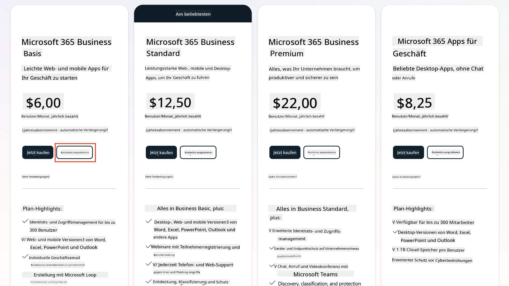
   1. Sobald Sie Ihr neues Konto haben, melden Sie sich an.

    !!! Tipp
        Wenn Sie planen, Agenten in Microsoft 365 Copilot Chat zu veröffentlichen oder mit Organisationsdaten (SharePoint, OneDrive, Dataverse) zu verbinden, ist eine Microsoft 365 Copilot-Lizenz erforderlich. Dies ist eine Zusatzlizenz, über die Sie [auf der Lizenzierungsseite](https://www.microsoft.com/microsoft-365/copilot#plans) mehr erfahren können.

---

## Schritt 2: Copilot Studio-Testversion starten

Sobald Sie Ihren Microsoft 365-Tenant haben, benötigen Sie Zugang zu Copilot Studio. Sie können eine kostenlose 30-Tage-Testversion erhalten, indem Sie die folgenden Schritte ausführen:

1. Gehen Sie zu [aka.ms/TryCopilotStudio](https://aka.ms/TryCopilotStudio).  
1. Geben Sie die E-Mail-Adresse des neuen Kontos ein, das Sie im vorherigen Schritt konfiguriert haben, und wählen Sie `Weiter`.  
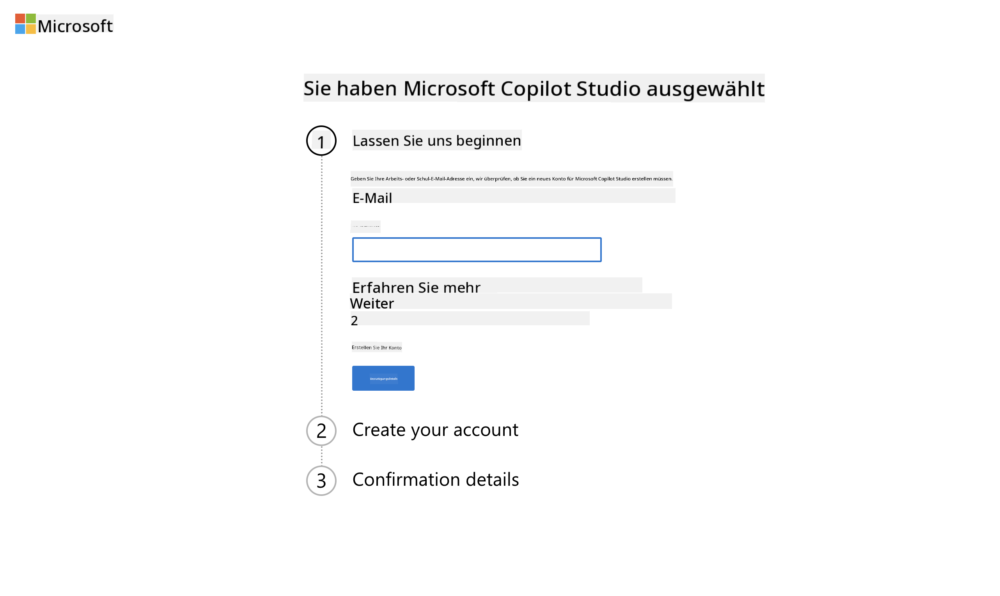
1. Ihr Konto sollte erkannt werden. Wählen Sie `Anmelden`.
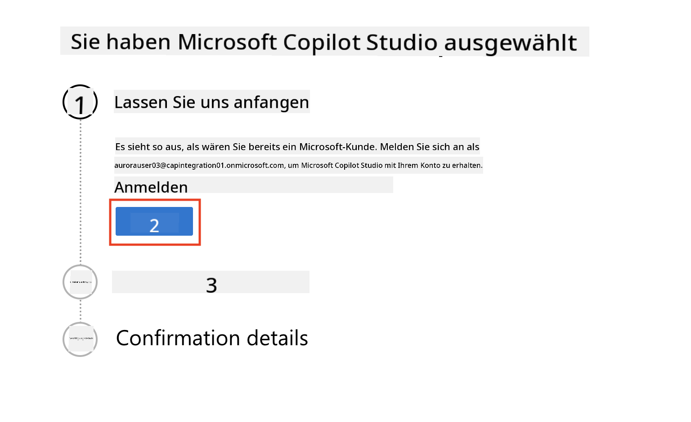  
1. Wählen Sie `Kostenlose Testversion starten`.
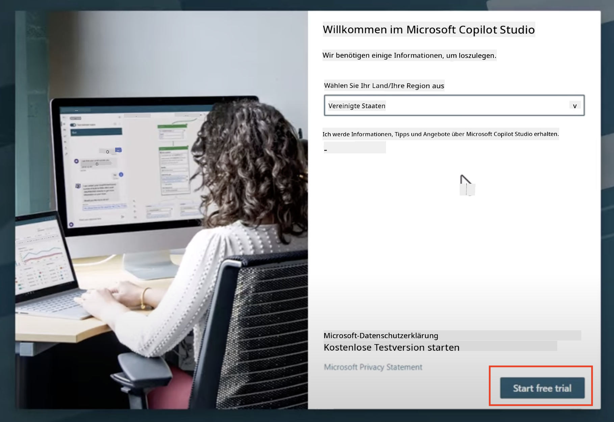

!!! info "Hinweise zur Testversion"  
     1. Die kostenlose Testversion bietet **volle Copilot Studio-Funktionen**.
     1. Sie erhalten E-Mail-Benachrichtigungen über das Ablaufdatum Ihrer Testversion. Sie können die Testversion in 30-Tage-Schritten verlängern (bis zu 90 Tage Laufzeit für Agenten).  
     1. Wenn Ihr Tenant-Administrator die Selbstregistrierung deaktiviert hat, sehen Sie eine Fehlermeldung – kontaktieren Sie Ihren Microsoft 365-Administrator, um sie wieder zu aktivieren.

---

## Schritt 3: Neue Entwicklerumgebung erstellen

### Power Apps Developer Plan registrieren

Verwenden Sie denselben Microsoft 365-Tenant aus Schritt 1, um sich für den Power Apps Developer Plan zu registrieren und eine kostenlose Entwicklungsumgebung zu erstellen, in der Sie mit Copilot Studio entwickeln und testen können.

1. Registrieren Sie sich auf der [Power Apps Developer Plan-Website](https://aka.ms/PowerAppsDevPlan).

    - Geben Sie Ihre E-Mail-Adresse ein
    - Aktivieren Sie das Kontrollkästchen
    - Wählen Sie **Kostenlos starten**

    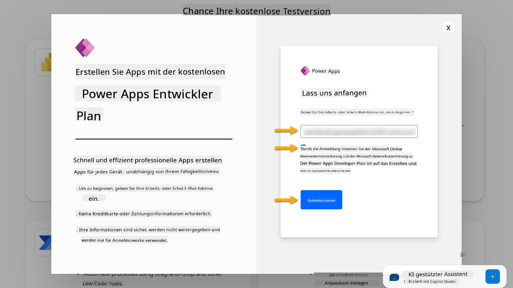

1. Nach der Registrierung für den Developer Plan werden Sie zu [Power Apps](https://make.powerapps.com/) weitergeleitet. Die Umgebung verwendet Ihren Namen, z. B. **Adele Vances Umgebung**. Wenn bereits eine Umgebung mit diesem Namen existiert, wird die neue Entwicklerumgebung als **Adele Vances (1)** Umgebung benannt.

    Verwenden Sie diese Entwicklerumgebung in Copilot Studio, wenn Sie die Labs abschließen.

!!! Hinweis
    Wenn Sie ein bestehendes Microsoft 365-Konto verwenden und keines in Schritt 1 erstellt haben, z. B. Ihr eigenes Konto in Ihrer Arbeitsorganisation, könnte Ihr IT-Administrator (oder das entsprechende Team), das Ihren Tenant/Umgebungen verwaltet, den Registrierungsprozess deaktiviert haben. In diesem Fall wenden Sie sich bitte an Ihren Administrator oder erstellen Sie einen Test-Tenant gemäß Schritt 1.

---

## Schritt 4: Neue SharePoint-Website erstellen

Es muss eine neue SharePoint-Website erstellt werden, die in [Lektion 06 - Erstellen eines benutzerdefinierten Agenten mit der Konversationserstellungserfahrung mit Copilot und Verankerung mit Ihren Daten](../06-create-agent-from-conversation/README.md#62-add-an-internal-knowledge-source-using-a-sharepoint-site) verwendet wird.

1. Wählen Sie das Waffelsymbol oben links in Microsoft Copilot Studio, um das Menü anzuzeigen. Wählen Sie SharePoint aus dem Menü.

    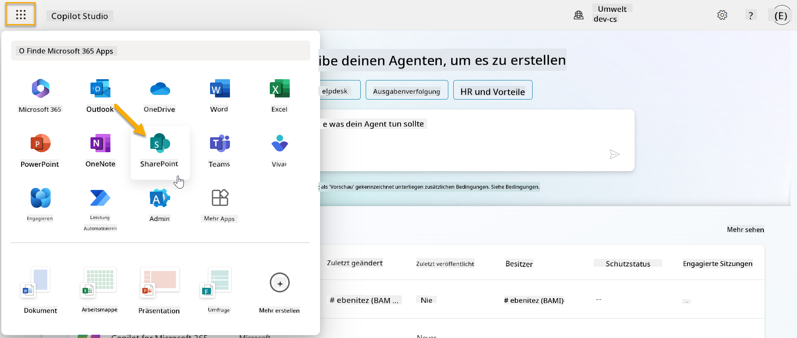

1. SharePoint wird geladen. Wählen Sie **+ Website erstellen**, um eine neue SharePoint-Website zu erstellen.

    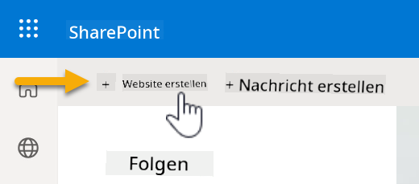

1. Ein Dialogfeld erscheint, das Sie durch die Erstellung einer neuen SharePoint-Website führt. Wählen Sie **Teamwebsite**.

    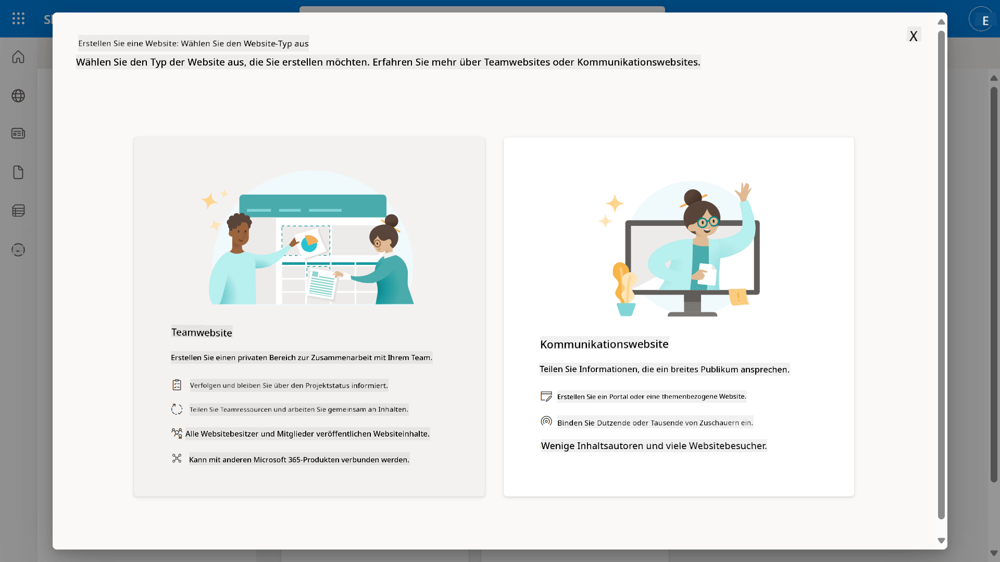

1. Im nächsten Schritt wird standardmäßig eine Liste von Microsoft-Vorlagen geladen. Scrollen Sie nach unten und wählen Sie die Vorlage **IT-Helpdesk**.

    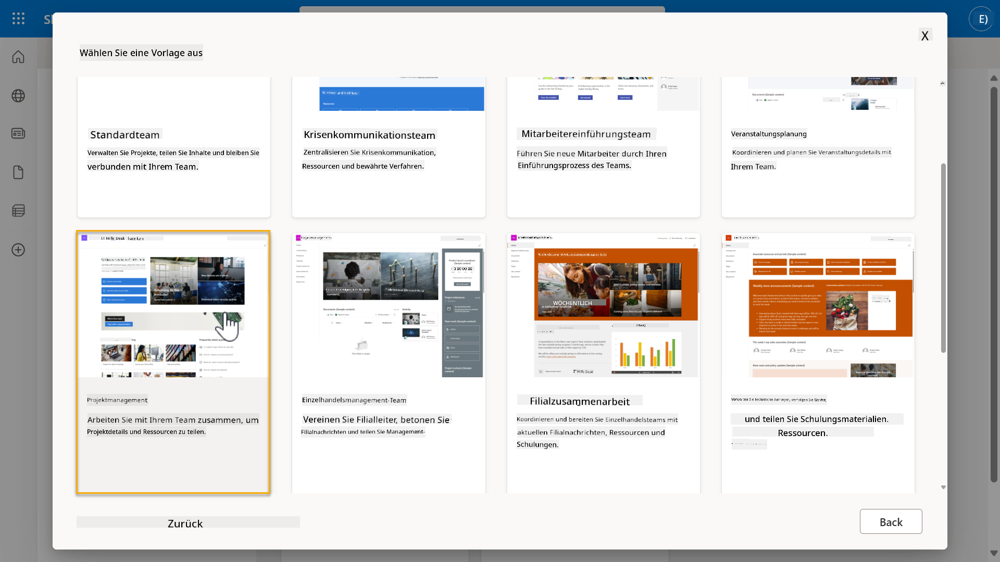

1. Wählen Sie **Vorlage verwenden**, um eine neue SharePoint-Website mit der IT-Helpdesk-Vorlage zu erstellen.

    

1. Geben Sie Informationen für Ihre Website ein. Das folgende Beispiel kann verwendet werden:

    | Feld | Wert |
    | --- | --- |
    | Website-Name | Contoso IT |
    | Website-Beschreibung | Copilot Studio für Anfänger |
    | Website-Adresse | ContosoIT |

    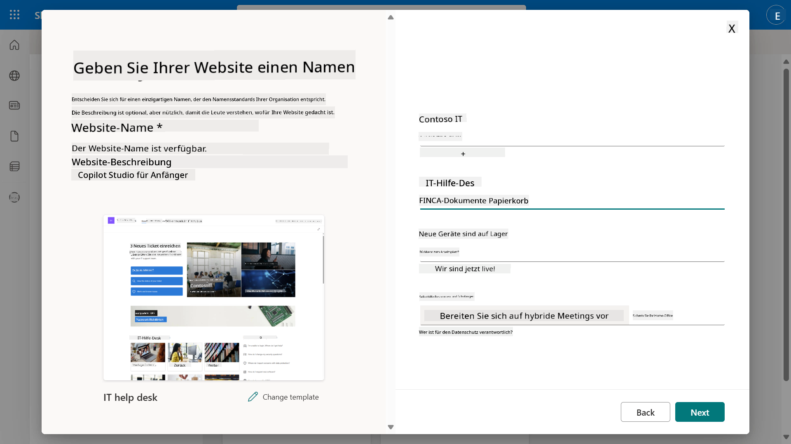

1. Im letzten Schritt kann eine Sprache für die SharePoint-Website ausgewählt werden. Standardmäßig ist dies **Englisch**. Lassen Sie die Sprache auf **Englisch** und wählen Sie **Website erstellen**.

    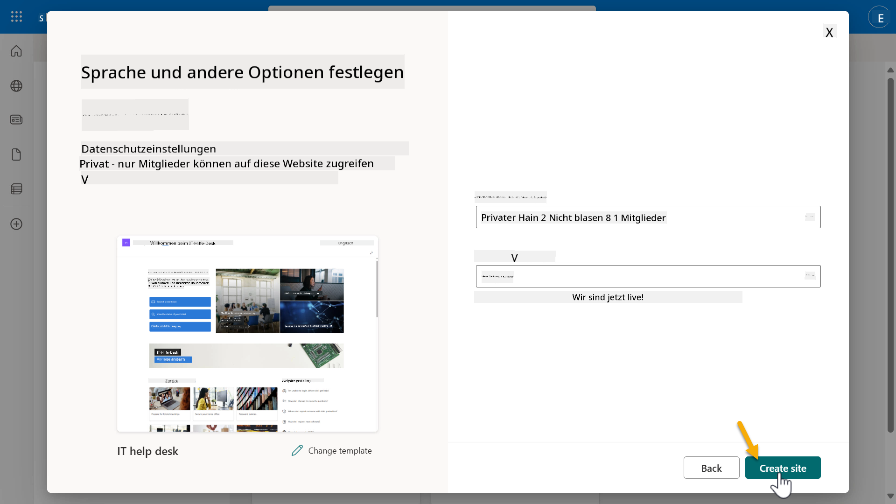

1. Die SharePoint-Website wird in den nächsten Sekunden bereitgestellt. In der Zwischenzeit können Sie andere Benutzer zu Ihrer Website hinzufügen, indem Sie deren E-Mail-Adresse im Feld **Mitglieder hinzufügen** eingeben. Wenn Sie fertig sind, wählen Sie **Fertigstellen**.

    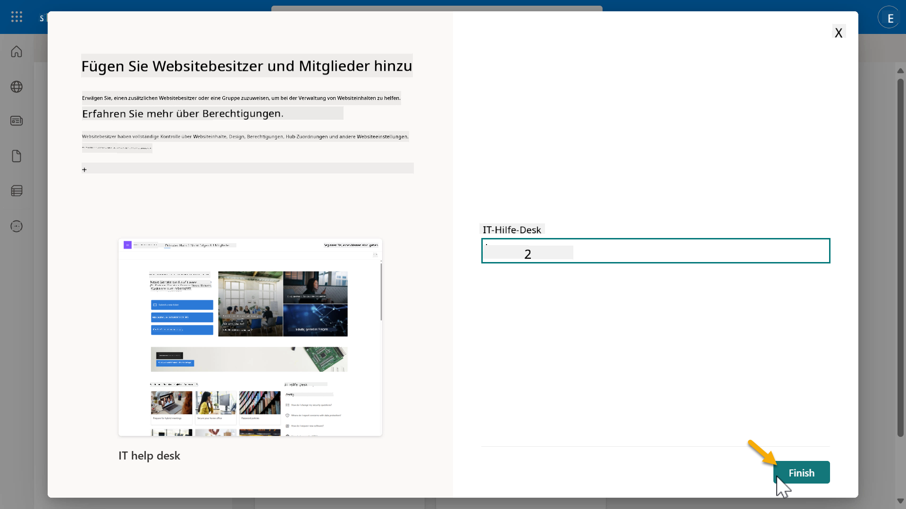

1. Die Startseite der SharePoint-Website wird geladen. **Kopieren** Sie die URL der SharePoint-Website.

1. Diese Vorlage bietet Seiten mit Beispieldaten zu verschiedenen IT-Richtlinien und zwei Beispiel-Listen (Tickets und Geräte).

### Geräte-SharePoint-Liste verwenden

Wir werden die **Geräte**-Liste in [Mission 07 - Neues Thema mit Trigger und Knoten hinzufügen](../07-add-new-topic-with-trigger/README.md#73-add-a-tool-using-a-connector) verwenden.

### Neue Spalte hinzufügen

Scrollen Sie ganz nach rechts in der Liste und wählen Sie die Schaltfläche **+ Spalte hinzufügen**. Wählen Sie den Typ **Hyperlink**, geben Sie **Bild** als Spaltenname ein und wählen Sie hinzufügen.

### Beispieldaten in Geräte-SharePoint-Liste erstellen

Sie müssen sicherstellen, dass Sie diese Liste mit mindestens 4 Beispieldaten füllen und eine zusätzliche Spalte zu dieser Liste hinzufügen.  

Beim Hinzufügen von Beispieldaten stellen Sie sicher, dass die folgenden Felder ausgefüllt sind:

- Gerätefoto - verwenden Sie die Bilder aus dem [Gerätebilder-Ordner](https://github.com/microsoft/agent-academy/tree/main/docs/recruit/00-course-setup/images/device-images)
- Titel
- Status
- Hersteller
- Modell
- Asset-Typ
- Farbe
- Seriennummer
- Kaufdatum
- Kaufpreis
- Bestellnummer
- Bild - verwenden Sie die folgenden Links

|Gerät  |URL  |
|---------|---------|
|Surface Laptop 13     | [https://raw.githubusercontent.com/microsoft/agent-academy/refs/heads/main/docs/recruit/00-course-setup/images/device-images/Surface-Laptop-13.png](https://raw.githubusercontent.com/microsoft/agent-academy/refs/heads/main/docs/recruit/00-course-setup/images/device-images/Surface-Laptop-13.png)        |
|Surface Laptop 15     | [https://raw.githubusercontent.com/microsoft/agent-academy/refs/heads/main/docs/recruit/00-course-setup/images/device-images/Surface-Laptop-15.png](https://raw.githubusercontent.com/microsoft/agent-academy/refs/heads/main/docs/recruit/00-course-setup/images/device-images/Surface-Laptop-15.png)        |
|Surface Pro    | [https://raw.githubusercontent.com/microsoft/agent-academy/refs/heads/main/docs/recruit/00-course-setup/images/device-images/Surface-Pro-12.png](https://raw.githubusercontent.com/microsoft/agent-academy/refs/heads/main/docs/recruit/00-course-setup/images/device-images/Surface-Pro-12.png)        |
|Surface Studio    | [https://raw.githubusercontent.com/microsoft/agent-academy/refs/heads/main/docs/recruit/00-course-setup/images/device-images/Surface-Studio.png](https://raw.githubusercontent.com/microsoft/agent-academy/refs/heads/main/docs/recruit/00-course-setup/images/device-images/Surface-Studio.png)        |

---

## ✅ Mission abgeschlossen

Sie haben erfolgreich:

- Eine Microsoft 365-Entwicklungsumgebung eingerichtet  
- Ihre Copilot Studio-Testversion aktiviert  
- Eine SharePoint-Website für die Verankerung von Agenten erstellt  
- Die Geräte-Liste für zukünftige Missionen gefüllt  

Sie sind offiziell bereit, Ihre **Agenten-Ausbildung auf Rekruten-Level** in [Lektion 01](../01-introduction-to-agents/README.md) zu beginnen.  

<!-- markdownlint-disable-next-line MD033 -->

---

**Haftungsausschluss**:  
Dieses Dokument wurde mit dem KI-Übersetzungsdienst [Co-op Translator](https://github.com/Azure/co-op-translator) übersetzt. Obwohl wir uns um Genauigkeit bemühen, beachten Sie bitte, dass automatisierte Übersetzungen Fehler oder Ungenauigkeiten enthalten können. Das Originaldokument in seiner ursprünglichen Sprache sollte als maßgebliche Quelle betrachtet werden. Für kritische Informationen wird eine professionelle menschliche Übersetzung empfohlen. Wir übernehmen keine Haftung für Missverständnisse oder Fehlinterpretationen, die sich aus der Nutzung dieser Übersetzung ergeben.