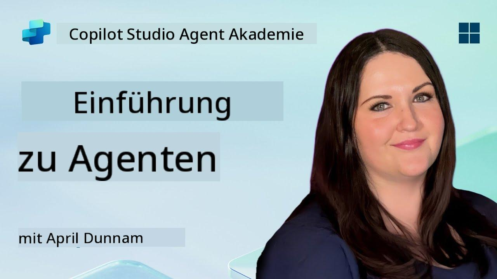

<!--
CO_OP_TRANSLATOR_METADATA:
{
  "original_hash": "d6706e107678264168d77b2e107710b1",
  "translation_date": "2025-10-17T19:13:46+00:00",
  "source_file": "docs/recruit/01-introduction-to-agents/README.md",
  "language_code": "de"
}
-->
# 🚨 Mission 01: Einführung in Agenten

## 🕵️‍♂️ CODENAME: `OPERATION AI AGENT DECODE`

> **⏱️ Zeitfenster der Operation:** `~30 Minuten – nur Informationen, keine Feldarbeit erforderlich`

🎥 **Schauen Sie sich die Anleitung an**

## 🎯 Missionsbriefing

Willkommen, Rekrut. Bevor wir mit dem Aufbau von Agenten beginnen, benötigen Sie ein solides Verständnis der KI-Konzepte, die sie antreiben. Diese Mission vermittelt Ihnen grundlegendes Wissen über konversationelle KI, große Sprachmodelle (LLMs), Retrieval-Augmented Generation (RAG) und die Arten von Agenten, die Sie in Copilot Studio erstellen können.

## 🔎 Ziele

In dieser Mission lernen Sie:

1. Was konversationelle KI ist und warum sie wichtig ist  
1. Wie große Sprachmodelle (LLMs) Chat-Erlebnisse ermöglichen  
1. Was Retrieval-Augmented Generation (RAG) zu bieten hat  
1. Den Unterschied zwischen konversationellen und autonomen Agenten  
1. Wie Agenten in Copilot Studio diese Konzepte nutzen  

Legen wir los!

---

## Was ist konversationelle KI?

Konversationelle KI bezeichnet jedes System, das menschliche Sprache – sei es Text oder Sprache – verstehen, verarbeiten und darauf reagieren kann, und zwar auf eine Weise, die sich natürlich anfühlt. Denken Sie an Chatbots in Helpdesks oder virtuelle persönliche Assistenten in Ihren Lieblings-Apps. Im Hintergrund basieren die meisten modernen konversationellen KIs auf großen Sprachmodellen (LLMs), die wir als Nächstes behandeln.

### Warum es wichtig ist

- **Benutzererfahrung:** Konversationelle Schnittstellen sind oft intuitiver als das Durchklicken von Menüs.  
- **Skalierbarkeit:** Ein Agent kann Dutzende oder Hunderte von gleichzeitigen Gesprächen führen.  
- **Effizienz:** Anstatt benutzerdefinierte regelbasierte Skripte zu erstellen, passen sich LLM-gesteuerte Agenten flexibel an Benutzereingaben an.  
- **Erweiterbarkeit:** Mit dem richtigen Design können Agenten auf Wissensdatenbanken zugreifen, APIs verbinden oder als „digitale Kollegen“ in Geschäftsabläufen agieren.

---

## Große Sprachmodelle (LLMs) 101

Im Kern der meisten konversationellen KI-Systeme stehen **große Sprachmodelle** – neuronale Netzwerke, die auf riesigen Textkorpora trainiert werden. Sie lernen statistische Muster der Sprache, um kohärente Sätze zu generieren, Fragen zu beantworten oder sogar Ideen zu entwickeln. Wichtige Punkte, die Sie verstehen sollten:

1. **Trainingsdaten:** LLMs verarbeiten Terabytes an Text (Webseiten, Bücher, Artikel). Dieses „Weltwissen“ ermöglicht es ihnen, auf viele Themen zu antworten.  
1. **Tokenisierung:** Text wird in kleinere Einheiten namens Tokens zerlegt (Wörter, Teilwörter oder Zeichen). Das Modell sagt ein Token nach dem anderen voraus.  
1. **Kontextfenster:** Jedes LLM hat eine Grenze, wie viele Tokens es gleichzeitig „sehen“ kann. Über diese Grenze hinaus werden frühere Tokens abgeschnitten.  
1. **Prompting:** Sie interagieren mit einem LLM, indem Sie ihm einen Prompt senden. Je besser Ihr Prompt, desto fokussierter und relevanter die Antwort.  
1. **Zero-shot vs. Fine-tuning:** Zero-shot bedeutet, ein LLM so zu verwenden, wie es ist (nur rohe Gewichte). Fine-tuning bedeutet, das Modell mit domänenspezifischen Daten anzupassen, damit es genauer auf Ihre Bedürfnisse antwortet.

!!! Tip "Profi-Tipp"
    Ein häufig verwendeter Vergleich ist, dass ein LLM wie eine „superintelligente Autovervollständigung“ ist. Es versteht die Bedeutung nicht wirklich wie ein menschliches Gehirn, aber es ist extrem gut darin, das nächste beste Wort (oder die nächste Phrase) in einer Sequenz vorherzusagen.

---

## Retrieval-Augmented Generation (RAG)

Wenn LLMs ausschließlich auf statische Trainingsdaten angewiesen sind, können sie Halluzinationen erzeugen oder veraltet sein. RAG löst dieses Problem, indem es dem Modell ermöglicht, aktuelle Informationen „nachzuschlagen“, bevor es eine Antwort erstellt. Auf hoher Ebene funktioniert RAG so:

1. **Benutzeranfrage:** Ein Benutzer stellt eine Frage (z. B. „Was gibt es Neues zu den Quartalsergebnissen von Contoso?“).  
1. **Retriever-Schritt:** Das System durchsucht eine Wissensquelle (Dokumente, interne Datenbanken, SharePoint-Bibliotheken usw.), um relevante Passagen zu finden.  
1. **Erweiterung:** Die abgerufenen Passagen werden dem LLM-Prompt hinzugefügt oder vorangestellt.  
1. **Generierung:** Das LLM verarbeitet sowohl die Frage des Benutzers als auch den abgerufenen Kontext und erstellt eine Antwort, die auf aktuellen Daten basiert.  

Mit RAG kann Ihr Agent interne Unternehmenswikis, Plugin-APIs oder eine FAQ-Wissensdatenbank durchsuchen und Antworten liefern, die nicht auf statisch veröffentlichten Modellparametern beschränkt sind.

---

## Konversationelle vs. autonome Agenten

Im Kontext von Copilot Studio kann der Begriff **Agent** verschiedene Arten von KI-Assistenten bezeichnen. Es ist hilfreich, eine Unterscheidung zu treffen zwischen:

**Konversationelle Agenten:**

- Konzentrieren sich hauptsächlich auf den Dialog.  
- Behalten den Kontext über mehrere Gesprächsrunden hinweg.  
- Werden normalerweise über vordefinierte Abläufe oder Trigger orchestriert (z. B. „Wenn der Benutzer X sagt, antworte mit Y“).  
- Ideal für Kundensupport, FAQs, geführte Interaktionen, Terminplanung oder einfache Q&A.  
  - Beispiele:
    - Ein Teams-Chatbot, der Fragen zu HR-Richtlinien beantwortet.  
    - Ein Power Virtual Agents-Bot auf einer SharePoint-Seite, der Benutzer durch ein Formular führt.  

**Autonome Agenten:**

- Gehen über den Dialog hinaus; sie können **Handlungen** im Namen des Benutzers ausführen.  
- Nutzen LLM-Logikschleifen (denken Sie an „Plan → Handeln → Beobachten → Neu planen“), um Aufgaben zu erledigen.  
- Greifen auf externe Tools oder APIs zu (z. B. einen Power Automate-Flow ausführen, Kalendereinladungen senden, Daten in Dataverse manipulieren).  
- Arbeiten ohne ständige Benutzereingaben – einmal ausgelöst, können sie mehrstufige Prozesse eigenständig abwickeln.  
  - Beispiele:  
    - Ein Agent, der eine Reiseplanung erstellt, Flüge bucht und Bestätigungen per E-Mail versendet.  
    - Ein „Meeting-Zusammenfassungs“-Agent, der an einem Teams-Call teilnimmt, ihn in Echtzeit transkribiert und eine Zusammenfassung für OneNote erstellt.  

!!! Info "Wichtiger Unterschied"
    Konversationelle Agenten warten auf Benutzereingaben und bleiben beim Dialog. Autonome Agenten planen und führen proaktiv eine Reihe von Schritten aus, indem sie auf breitere Toolzugänge zugreifen.

---

## Agenten in Copilot Studio

**Copilot Studio** vereint sowohl konversationelle als auch autonome Szenarien unter einem Framework. So hilft Ihnen Copilot Studio beim Erstellen von Agenten:

1. **Visueller Agenten-Designer:** Eine Low-Code-Oberfläche, um Prompts, Speicher und Tools für Chat- und Aktionsabläufe zu definieren.  
1. **LLM-Konfigurationen:** Wählen Sie aus verschiedenen OpenAI-Modellen oder Microsofts unternehmensgerechtem GPT, um Ihre Leistungs- und Kostenanforderungen zu erfüllen.  
1. **Retrieval-Connectoren:** Vorgefertigte Integrationen für SharePoint, OneDrive, Azure Cognitive Search und Dataverse, die RAG direkt unterstützen.  
1. **Benutzerdefinierte Tools & Funktionen:** Definieren Sie benutzerdefinierte HTTP-Aktionen oder Power Automate-Flows, die Ihr Agent autonom ausführen kann.  
1. **Multi-Modale Unterstützung:** Neben Text können Copilot Studio-Agenten Bilder, Dateien oder strukturierte Daten verarbeiten, um den Kontext zu bereichern.  
1. **Veröffentlichung & Verteilung:** Sobald Ihr Agent fertig ist, können Sie ihn in Microsoft 365 Copilot veröffentlichen (damit Benutzer ihn in Teams, SharePoint, Outlook usw. aufrufen) oder ihn als eigenständiges Chat-Widget auf einer Webseite einbetten.

---

## 🎉 Mission abgeschlossen

Sie haben nun Ihre Einführung in Agenten und grundlegende KI-Konzepte abgeschlossen. Sie verstehen:

1. **LLMs = Das „Gehirn“ Ihres Agenten**  
   - Verantwortlich für Sprachverständnis und -generierung.  
   - Mehr Tokens = reichhaltigerer Kontext, aber auch höhere Kosten pro Aufruf.  

1. **RAG = Echtzeit-Wissensintegration**  
   - Überbrückt die Lücke zwischen einem statischen LLM und sich ständig ändernden Datenquellen.  
   - Ruft relevante Dokumente oder Datensätze ab und fügt sie dem LLM-Prompt hinzu.  

1. **Konversationell vs. Autonom**  
   - **Konversationell:** Fokus auf Dialogfluss und Kontextbewahrung (z. B. „Sitzungsspeicher“).  
   - **Autonom:** Hinzufügen von „Aktionsblöcken“, die es dem Agenten ermöglichen, externe Tools oder Dienste aufzurufen.

---
Als Nächstes erkunden Sie die [Grundlagen von Copilot Studio](../02-copilot-studio-fundamentals/README.md)!

Bleiben Sie wachsam, Rekrut – Ihre KI-Reise hat gerade erst begonnen!

## 📚 Taktische Ressourcen

🔗 [Copilot Studio Dokumentations-Startseite](https://learn.microsoft.com/microsoft-copilot-studio/)

---

<!-- markdownlint-disable-next-line MD033 -->

---

**Haftungsausschluss**:  
Dieses Dokument wurde mit dem KI-Übersetzungsdienst [Co-op Translator](https://github.com/Azure/co-op-translator) übersetzt. Obwohl wir uns um Genauigkeit bemühen, beachten Sie bitte, dass automatisierte Übersetzungen Fehler oder Ungenauigkeiten enthalten können. Das Originaldokument in seiner ursprünglichen Sprache sollte als maßgebliche Quelle betrachtet werden. Für kritische Informationen wird eine professionelle menschliche Übersetzung empfohlen. Wir übernehmen keine Haftung für Missverständnisse oder Fehlinterpretationen, die sich aus der Nutzung dieser Übersetzung ergeben.