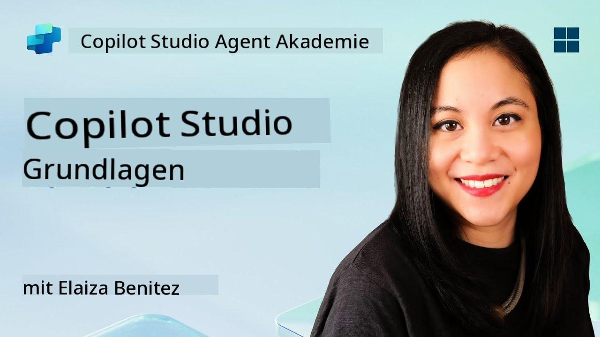
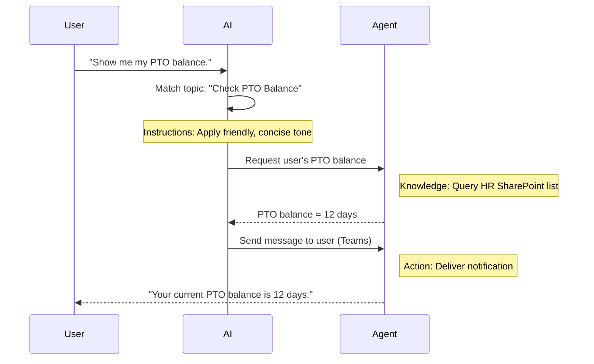

<!--
CO_OP_TRANSLATOR_METADATA:
{
  "original_hash": "90a3c5122f5687bbc8cc819990f175d4",
  "translation_date": "2025-10-17T19:14:51+00:00",
  "source_file": "docs/recruit/02-copilot-studio-fundamentals/README.md",
  "language_code": "de"
}
-->
# 🚨 Mission 02: Grundlagen von Copilot Studio

## 🕵️‍♂️ CODENAME: `OPERATION CORE PROTOCOL`

> **⏱️ Zeitfenster der Operation:** `~30 Minuten – nur Informationen, keine Feldarbeit erforderlich`  

🎥 **Schauen Sie sich die Anleitung an**

[](https://www.youtube.com/watch?v=x4OCwDRGeLE "Schauen Sie sich die Anleitung auf YouTube an")

## 🎯 Missionsbriefing

Willkommen, Rekrut. Diese Mission vermittelt Ihnen grundlegende Informationen darüber, wie Copilot Studio funktioniert und wie Sie intelligente Agenten erstellen, die echten geschäftlichen Mehrwert liefern.

Bevor Sie Ihren ersten Agenten erstellen, müssen Sie die vier Schlüsselkomponenten verstehen, die jeden benutzerdefinierten KI-Agenten ausmachen: Wissen, Werkzeuge, Themen und Anweisungen. Sie erfahren außerdem, wie diese Elemente im Orchestrator von Copilot Studio zusammenarbeiten.

## 🔎 Ziele

In dieser Mission werden Sie:

- **Erfahren, was Copilot Studio ist**
- **Verstehen, wann und warum Agenten eingesetzt werden**
- **Die vier Bausteine von Agenten erkunden**
      - **Wissen**
      - **Werkzeuge**
      - **Themen**
      - **Anweisungen**
- **Verstehen, wie diese Komponenten zusammenarbeiten**, um einen intelligenten, automatisierten Agenten zu erstellen

---

## Was sind Agenten in Copilot Studio?

Ein **Agent** ist ein spezialisierter KI-Assistent, den Sie entwerfen, um bestimmte Aufgaben oder Anfragen zu bearbeiten. Im Gegensatz zu einem allgemeinen Chatbot:

- **Kennt er unternehmensspezifische Daten** (Richtlinien, Dokumente, Datenbanken)  
- **Führt er reale Aufgaben aus** (Nachrichten senden, Kalendereinträge erstellen, Datensätze aktualisieren)  
- **Behält er den Gesprächskontext bei**, sodass er auf vorherige Fragen eingehen kann  

Da Copilot Studio eine Low-Code-Plattform ist, können Sie vorgefertigte Komponenten per Drag-and-Drop verwenden – tiefgehende Programmierkenntnisse sind nicht erforderlich. Sobald Ihr Agent erstellt ist, können ihn Benutzer in Teams, Slack oder sogar auf einer benutzerdefinierten Webseite aufrufen, um Antworten zu erhalten oder Workflows automatisch auszulösen.

---

## Wann und warum Copilot Studio verwenden?

Während Microsoft 365 Copilot allgemeine KI-Unterstützung in Office-Anwendungen bietet, benötigen Sie einen benutzerdefinierten Agenten, wenn:

### Sie domänenspezifisches Wissen benötigen

- Der standardmäßige Copilot kennt möglicherweise nicht die internen Verfahren oder Daten Ihres Unternehmens. Ein Agent kann Ihre SharePoint-Seiten, Datenbanken oder benutzerdefinierte Quellen abfragen, um genaue und aktuelle Antworten zu liefern.  

### Sie mehrstufige Workflows automatisieren möchten

- Zum Beispiel: "Wenn jemand eine Ausgabe einreicht, senden Sie sie zur Genehmigung, aktualisieren Sie den Finanztracker und benachrichtigen Sie den Manager." Ein benutzerdefinierter Agent kann jeden Schritt ausführen, der durch einen einzigen Befehl oder ein Ereignis ausgelöst wird.  

### Sie ein kontextbezogenes Erlebnis innerhalb eines Tools benötigen  

- Stellen Sie sich einen Onboarding-Agenten für neue Mitarbeiter in Teams vor, der das HR-Personal durch alle Richtlinien führt, notwendige Formulare sendet und Orientierungstreffen plant – direkt innerhalb Ihrer bestehenden Kollaborationsplattform.  

---

## Die vier Bausteine eines Agenten

Jeder Copilot Studio Agent besteht aus vier Kernkomponenten:

1. **Wissen**  
1. **Werkzeuge (Aktionen)**  
1. **Themen**  
1. **Anweisungen**

Im Folgenden definieren wir jeden Baustein und zeigen, wie sie zusammenarbeiten, um einen effektiven Agenten zu erstellen.

### 1. Wissen

**Wissen** ist die Daten- und Kontextbasis, die Ihr Agent verwendet, um Fragen genau zu beantworten. Es besteht aus zwei Teilen:

#### Benutzerdefinierte Anweisungen & Kontext

- Sie schreiben eine kurze Beschreibung des Zwecks und Tons des Agenten. Zum Beispiel:  

    ```text
    You are an IT support agent. You help employees troubleshoot common software issues, provide troubleshooting steps, and escalate urgent tickets.
    ```

- Während eines Gesprächs erinnert sich der Agent an vorherige Dialoge, sodass er auf bereits besprochene Themen zurückgreifen kann (zum Beispiel, wenn der Benutzer zuerst sagt: "Mein Drucker ist offline" und später fragt: "Haben Sie den Tintenstand überprüft?", erinnert sich der Agent an den Druckerkontext).

#### Wissensquellen (Grundlagendaten)

- Sie verbinden Ihren Agenten mit mehreren Datenquellen – SharePoint-Bibliotheken, Dokumentationsseiten, Wikis oder anderen Datenbanken.  
- Wenn ein Benutzer eine Frage stellt, zieht der Agent relevante Auszüge aus diesen Quellen, sodass Antworten **auf den tatsächlichen Richtlinien, Handbüchern oder proprietären Informationen Ihrer Organisation basieren**.  
- Sie können den Agenten sogar dazu zwingen, nur mit Informationen aus diesen Quellen zu antworten, um zu verhindern, dass er rät oder "halluziniert".

!!! example
    Ein "Richtlinienassistent"-Agent könnte mit Ihrer HR-SharePoint-Seite verbunden sein. Wenn ein Benutzer fragt: "Wie hoch ist unsere PTO-Akkumulationsrate?", ruft der Agent den genauen Text aus dem HR-Richtliniendokument ab, anstatt auf eine generische KI-Antwort zu vertrauen.

---

### 2. Werkzeuge (Aktionen)

**Werkzeuge (Aktionen)** definieren, was der Agent über das Chatten hinaus tun kann. Jede Aktion ist eine Aufgabe, die der Agent programmgesteuert ausführt, wie:

- Eine E-Mail oder Teams-Nachricht senden  
- Einen Kalendereintrag erstellen oder aktualisieren  
- Einen Datensatz in einer Datenbank hinzufügen oder bearbeiten (z. B. eine SharePoint-Liste oder Dataverse-Tabelle)  
- Einen Power Automate-Flow oder eine REST-API aufrufen  

#### Wie Aktionen funktionieren

- **Eingaben & Ausgaben definieren**  
      - Zum Beispiel könnte eine Aktion "E-Mail senden" erfordern:  
        - `EmpfängerE-MailAdresse`  
        - `Betreffzeile`  
        - `E-MailText`  

- **Aktionen zu Workflows kombinieren**  
      - Oft erfordert die Erfüllung einer Benutzeranfrage mehrere Schritte.  
      - Sie können Aktionen so sequenzieren, dass:  
             1. Der Agent Daten aus einer SharePoint-Liste abruft.  
             2. Eine Zusammenfassung mit dem LLM generiert wird.  
             3. Eine Teams-Nachricht mit dieser Zusammenfassung gesendet wird.  

- **Verbindung zu externen Systemen herstellen**  
      - Wenn Sie ein CRM aktualisieren oder eine interne API aufrufen müssen, erstellen Sie eine benutzerdefinierte Aktion dafür.  
      - Copilot Studio kann mit der Power Platform oder jedem HTTP-basierten Endpunkt integriert werden.

!!! example "Ein "Ausgabenhelfer"-Agent könnte:"  
    1. Auf eine Anfrage "Ausgabe einreichen" hören.  
    2. Die Ausgabendetails des Benutzers aus einem Formular abrufen.  
    3. Eine Aktion "Zu SharePoint-Liste hinzufügen" verwenden, um die Daten zu speichern.  
    4. Eine Aktion "E-Mail senden" auslösen, um den Genehmiger zu benachrichtigen.  

---

### 3. Themen

**Themen** definieren die Gesprächsauslöser oder Einstiegspunkte für Ihren Agenten. Jedes Thema entspricht einer Funktionalität oder einer Fragekategorie.

#### Gesprächsauslöser  

- Ein Thema könnte "IT-Ticket einreichen", "Urlaubssaldo prüfen" oder "Verkaufsbericht erstellen" sein.  
- Im Hintergrund verwendet Copilot Studio **generative Orchestrierung**: Anstatt sich auf genaue Schlüsselwörter zu verlassen, interpretiert die KI die Absicht des Benutzers und wählt das richtige Thema basierend auf einer kurzen Beschreibung, die Sie bereitstellen.  

#### Themenbeschreibungen  

- In jedem Thema schreiben Sie eine klare, prägnante Beschreibung dessen, was dieses Thema abdeckt.

!!! example "Beispiel für eine Themenbeschreibung"
    Dieses Thema hilft Benutzern, ein IT-Support-Ticket einzureichen, indem es die Details des Problems, die Priorität und die Kontaktinformationen sammelt.

- Die KI verwendet diese Beschreibung, um zu entscheiden, wann dieses Thema aktiviert werden soll, auch wenn die Formulierung des Benutzers nicht genau übereinstimmt.

#### Zuordnung von Themen zu Aktionen  

- Jedes Thema ist mit einer oder mehreren Aktionen oder Datenabrufschritten verbunden.  
- Wenn die KI ein Thema auswählt, führt sie das Gespräch durch die von Ihnen definierte Sequenz (stellt Folgefragen, ruft Aktionen auf, gibt Ergebnisse zurück).

!!! example
    Wenn ein Benutzer sagt: "Ich brauche Hilfe beim Einrichten meines neuen Laptops", könnte die KI diese Absicht dem Thema "IT-Ticket einreichen" zuordnen. Der Agent fragt dann nach dem Laptop-Modell, den Benutzerdetails und erstellt automatisch ein Ticket im Helpdesk-System.

---

### 4. Anweisungen

**Anweisungen** (manchmal auch "Prompts" oder "Systemnachrichten" genannt) leiten den Ton, Stil und die Grenzen des LLM. Sie bestimmen, wie der Agent in jeder Situation reagiert.

#### Rolle & Persona  

- Sie sagen der KI, wer sie ist (z. B. "Sie sind ein Kundenservice-Agent für Contoso Retail").  
- Dies legt den Ton fest – freundlich, prägnant, formell oder lässig – je nach Anwendungsfall.

#### Antwortrichtlinien  

- Geben Sie Regeln vor, die der Agent befolgen muss, wie:  
      - "Fassen Sie Richtlinieninformationen immer in Stichpunkten zusammen."  
      - "Wenn Sie die Antwort nicht kennen, sagen Sie: ‚Es tut mir leid, ich habe diese Information nicht.‘"  
      - "Geben Sie niemals vertrauliche Daten außerhalb des Kontexts weiter."

#### Speicher- & Kontextregeln

- Sie können dem Agenten anweisen, wie viele Gesprächsrunden er sich merken soll.  
- Zum Beispiel: "Merken Sie sich Details aus den Anfragen dieses Benutzers für bis zu drei Folgefragen."

!!! example "In einem "Vorteilsberater"-Agenten könnten Sie Folgendes einschließen:"
    "Beziehen Sie sich immer auf das neueste HR-Handbuch, wenn Sie Fragen beantworten. Wenn nach Anmeldefristen gefragt wird, geben Sie die spezifischen Daten aus der Richtlinie an. Halten Sie Antworten unter 150 Wörtern."

---

## Wie die vier Bausteine zusammenarbeiten

Wenn Sie **Wissen**, **Werkzeuge**, **Themen** und **Anweisungen** zusammenfügen, erstellt der AI-Orchestrator von Copilot Studio einen Agenten, der:

1. **Auf ein relevantes Thema hört** (gesteuert durch Ihre Themenbeschreibungen).  
1. **Anweisungen anwendet**, um seinen Ton festzulegen, zu entscheiden, wann Folgefragen gestellt werden sollen, und Regeln durchzusetzen.  
1. **Wissensquellen nutzt**, um seine Antworten auf die Daten Ihrer Organisation zu stützen.  
1. **Werkzeuge (Aktionen) aufruft**, um Aufgaben auszuführen – Nachrichten senden, Datensätze aktualisieren oder APIs aufrufen.  

Im Hintergrund verwendet der Orchestrator einen **generativen Planungsansatz**: Er entscheidet, welche Schritte in welcher Reihenfolge unternommen werden müssen, um eine Benutzeranfrage zu erfüllen. Wenn eine Aktion fehlschlägt (zum Beispiel, wenn eine E-Mail nicht gesendet werden kann), folgt der Agent Ihren Richtlinien zur Fehlerbehandlung (stellt eine klärende Frage oder meldet den Fehler). Da das LLM sich an den Gesprächskontext anpasst, kann der Agent über mehrere Gesprächsrunden hinweg Gedächtnis bewahren und neue Informationen in den Gesprächsverlauf einfließen lassen.

**Beispiel für einen visuellen Ablauf:**  
<!--
1. **Benutzer:** "Zeigen Sie mir meinen PTO-Saldo."
1. **KI (Themen):** Ordnet dem Thema "PTO-Saldo prüfen" zu.  
1. **KI (Anweisungen):** Verwendet einen freundlichen, prägnanten Ton.  
1. **Agent (Wissen):** Fragt die HR-SharePoint-Liste nach dem Saldo des Benutzers ab.  
1. **Agent (Aktionen):** Ruft den Wert ab und sendet eine Teams-Nachricht:  
   > "Ihr aktueller PTO-Saldo beträgt 12 Tage."  
-->



---

## 🎉 Mission abgeschlossen

Sie haben erfolgreich Ihr Grundlagen-Briefing abgeschlossen. Sie haben nun die vier wesentlichen Bausteine eines Agenten in Copilot Studio kennengelernt:

1. **Wissen** – Wo der Agent nach Fakten sucht und sich an den Gesprächsverlauf erinnert.  
1. **Werkzeuge** – Die Aufgaben, die der Agent ausführen kann, um Dinge automatisch zu erledigen.  
1. **Themen** – Wie der Agent die Absicht des Benutzers erkennt und entscheidet, welchen Workflow er ausführt.  
1. **Anweisungen** – Die Regeln, der Ton und die Grenzen, die jede Antwort leiten.

Mit diesen Komponenten können Sie einen grundlegenden Agenten erstellen, der Fragen beantwortet und einfache Workflows ausführt. Im nächsten Abschnitt führen wir Sie Schritt für Schritt durch die Erstellung eines "Service Desk"-Agenten – von der Verbindung Ihrer ersten Wissensquelle bis zur Definition eines Themas und der Verknüpfung einer Aktion.

Als Nächstes: Sie erstellen Ihren [ersten deklarativen Agenten für M365 Copilot](../03-create-a-declarative-agent-for-M365Copilot/README.md).

<!-- markdownlint-disable-next-line MD033 -->


---

**Haftungsausschluss**:  
Dieses Dokument wurde mit dem KI-Übersetzungsdienst [Co-op Translator](https://github.com/Azure/co-op-translator) übersetzt. Obwohl wir uns um Genauigkeit bemühen, beachten Sie bitte, dass automatisierte Übersetzungen Fehler oder Ungenauigkeiten enthalten können. Das Originaldokument in seiner ursprünglichen Sprache sollte als maßgebliche Quelle betrachtet werden. Für kritische Informationen wird eine professionelle menschliche Übersetzung empfohlen. Wir übernehmen keine Haftung für Missverständnisse oder Fehlinterpretationen, die sich aus der Nutzung dieser Übersetzung ergeben.