<!--
CO_OP_TRANSLATOR_METADATA:
{
  "original_hash": "0c51aabca81d6256990caf4c015e6195",
  "translation_date": "2025-10-17T19:07:31+00:00",
  "source_file": "docs/recruit/04-creating-a-solution/README.md",
  "language_code": "de"
}
-->
# 🚨 Mission 04: Eine Lösung für Ihren Agenten erstellen

## 🕵️‍♂️ CODENAME: `OPERATION CTRL-ALT-PACKAGE`

> **⏱️ Zeitfenster der Operation:** `~45 Minuten`

🎥 **Schauen Sie sich die Anleitung an**

[](https://www.youtube.com/watch?v=1iATbkgfcpU "Schauen Sie sich die Anleitung auf YouTube an")

## 🎯 Missionsbeschreibung

Agent Maker, willkommen zu Ihrer nächsten taktischen Operation. In dieser Mission lernen Sie, wie Sie eine Lösung zusammenstellen – das offizielle Bereitstellungsfahrzeug für Ihren IT-Helpdesk-Agenten, der mit Microsoft Copilot Studio erstellt wurde. Stellen Sie sich dies wie einen digitalen Aktenkoffer vor, der Ihren Agenten und seine Artefakte enthält.

Jeder Agent benötigt ein gut strukturiertes Zuhause. Genau das bietet eine Power Platform-Lösung – Ordnung, Portabilität und Produktionsbereitschaft.

Packen wir es an.

## 🔎 Ziele

In dieser Mission lernen Sie:

1. Verstehen, was Power Platform-Lösungen sind und welche Rolle sie bei der Agentenentwicklung spielen
1. Die Vorteile von Lösungen für die Organisation und Bereitstellung von Agenten kennenlernen
1. Lösungspublisher erkunden und ihre Bedeutung für das Komponentenmanagement verstehen
1. Den Lebenszyklus von Power Platform-Lösungen von der Entwicklung bis zur Produktion verstehen
1. Ihren eigenen Lösungspublisher und eine benutzerdefinierte Lösung für Ihren IT-Helpdesk-Agenten erstellen

## 🕵🏻‍♀️ Lösung? Was ist das?

In Microsoft Power Platform sind Lösungen wie Container oder Pakete, die alle Teile Ihrer Apps oder Agenten enthalten – das können Tabellen, Formulare, Flows und benutzerdefinierte Logik sein. Lösungen sind essenziell für das Application Lifecycle Management (ALM), da sie Ihnen ermöglichen, Ihre App und Agenten von der Idee über die Entwicklung, das Testen, die Bereitstellung bis hin zu Updates zu verwalten.

In Copilot Studio wird jeder Agent, den Sie erstellen, in einer Power Platform-Lösung gespeichert. Standardmäßig werden Agenten in der Standardlösung erstellt, es sei denn, Sie erstellen eine neue benutzerdefinierte Lösung, um Ihren Agenten darin zu erstellen. Genau das werden wir in dieser Lektion und im praktischen Lab lernen 🤓.

Traditionell wurden Lösungen im **Power Apps Maker-Portal** erstellt – einer webbasierten Oberfläche, in der Sie Apps, Dataverse, Flows, KI-Komponenten und mehr erstellen und anpassen können.

   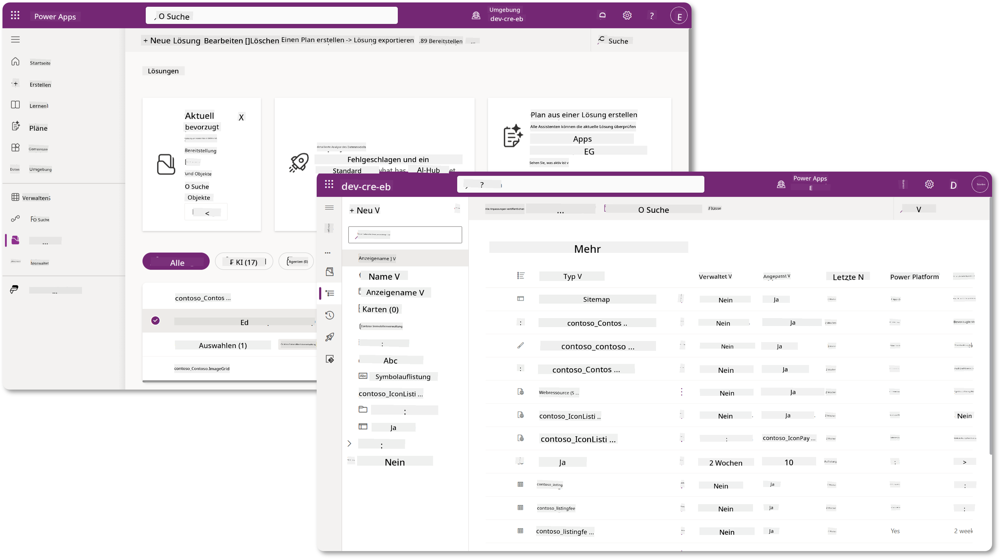

In Copilot Studio gibt es jetzt den **Solution Explorer**, mit dem Sie Ihre Lösungen direkt verwalten können. Sie müssen nicht mehr zum Power Apps Maker-Portal wechseln, um Ihre Lösungen zu verwalten – das kann direkt in Copilot Studio erledigt werden 🪄.

Das bedeutet, dass Sie die üblichen lösungsbezogenen Aufgaben erledigen können:

- **Eine Lösung erstellen** – benutzerdefinierte Lösungen ermöglichen es, Agenten zwischen Umgebungen zu exportieren und zu importieren.
- **Ihre bevorzugte Lösung festlegen** – wählen Sie die Lösung aus, in der Agenten, Apps usw. standardmäßig erstellt werden.
- **Komponenten hinzufügen oder entfernen** – Ihr Agent könnte andere Komponenten wie Umgebungsvariablen oder Cloud-Flows referenzieren. Daher müssen diese Komponenten in die Lösung aufgenommen werden.
- **Lösungen exportieren** – um Lösungen in eine andere Zielumgebung zu verschieben.
- **Lösungen importieren** – importieren Sie Lösungen, die anderswo erstellt wurden, einschließlich Upgrades oder Updates.
- **Lösungspipelines erstellen und verwalten** – automatisieren Sie die Bereitstellung von Lösungen zwischen Umgebungen.
- **Git-Integration** – ermöglicht Entwicklern, Lösungen mit Git-Repositories für Versionskontrolle, Zusammenarbeit und ALM zu verbinden. Nur für Entwicklerumgebungen gedacht.

   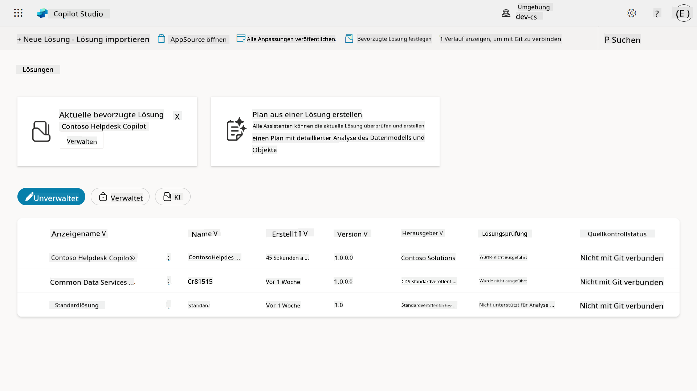

Es gibt zwei Arten von Lösungen:

- **Unverwaltete Lösungen** – werden während der Entwicklung verwendet. Sie können frei bearbeitet und angepasst werden.
- **Verwaltete Lösungen** – werden verwendet, wenn Sie bereit sind, Ihre App zum Testen oder in die Produktion zu bringen. Diese sind gesperrt, um versehentliche Änderungen zu verhindern.

## 🤔 Warum _sollte_ ich eine Lösung für meinen Agenten verwenden?

Betrachten Sie Lösungen als _Werkzeugkasten_. Wenn Sie etwas (einen Agenten) an einem anderen Ort (Umgebung) reparieren oder bauen müssen, sammeln Sie alle notwendigen Werkzeuge (Komponenten) und legen sie in Ihren Werkzeugkasten (Lösung). Sie können diesen Werkzeugkasten dann an den neuen Ort (Umgebung) bringen und die Werkzeuge (Komponenten) verwenden, um Ihre Arbeit zu erledigen oder neue Werkzeuge (Komponenten) hinzuzufügen, um Ihren Agenten oder das Projekt, das Sie erstellen, anzupassen.

!!! quote "Elaiza, Ihre freundliche Cloud-Botschafterin, meldet sich hier 🙋🏻‍♀️ mit ein paar Worten:"
    Wir haben in Neuseeland ein Sprichwort: "Sei ein ordentlicher Kiwi!", das Neuseeländer 🥝 dazu auffordert, Verantwortung für ihre Umgebung zu übernehmen, indem sie Müll ordnungsgemäß entsorgen und öffentliche Räume sauber halten. Wir können denselben Kontext für Agenten verwenden, indem wir alles, was mit Ihrem Agenten zu tun hat, organisiert und portabel halten – das hilft Ihnen, eine ordentliche Umgebung zu bewahren.

Es ist eine gute Praxis, einen Agenten in einer dedizierten Lösung in Ihrer Quell- (Entwickler-) Umgebung zu erstellen. Hier ist, warum Lösungen wertvoll sind:

🧩 **Organisierte Entwicklung**

- Sie halten Ihren Agenten getrennt von der Standardlösung, die alles in der Umgebung enthält. Alle Komponenten Ihres Agenten befinden sich an einem Ort 🎯.

- Alles, was Sie für Ihren Agenten benötigen, befindet sich in einer Lösung, was es einfacher macht, diese in eine Zielumgebung zu exportieren und zu importieren 👉🏻 das ist eine gesunde ALM-Gewohnheit.

🧩 **Sichere Bereitstellung**

- Sie können Ihre App oder Ihren Agenten als verwaltete Lösung exportieren und in andere Zielumgebungen (wie Test oder Produktion) bereitstellen, ohne das Risiko versehentlicher Änderungen.

🧩 **Versionskontrolle**

- Sie können Patches (gezielte Korrekturen), Updates (umfassendere Änderungen) oder Upgrades (Ersetzen einer Lösung – normalerweise größere Änderungen und Einführung neuer Funktionen) erstellen.

- Hilft Ihnen, Änderungen kontrolliert auszurollen.

🧩 **Abhängigkeitsmanagement**

- Lösungen verfolgen, welche Teile voneinander abhängen. Dies verhindert, dass Sie Dinge kaputt machen, wenn Sie Änderungen vornehmen.

🧩 **Teamzusammenarbeit**

- Entwickler und Maker können gemeinsam an unverwalteten Lösungen in der Entwicklung arbeiten und dann eine verwaltete Lösung für die Bereitstellung übergeben.

## 🪪 Lösungspublisher verstehen

Ein Lösungspublisher in der Power Platform ist wie ein Etikett oder eine Marke, die angibt, wer eine Lösung erstellt oder besitzt. Es ist ein kleiner, aber wichtiger Teil der Verwaltung Ihrer Apps, Agenten und Flow-Anpassungen, insbesondere bei der Arbeit in Teams oder über Umgebungen hinweg.

Wenn Sie eine Lösung erstellen, müssen Sie einen Publisher auswählen. Dieser Publisher definiert:

- Ein Präfix, das allen benutzerdefinierten Komponenten hinzugefügt wird (denken Sie an Tabellen, Felder und Flows).

- Einen Namen und Kontaktinformationen für die Organisation oder Person, die die Lösung besitzt.

### 🤔 Warum ist das wichtig?

1. **Einfache Identifikation** – das Präfix (Beispiel – `new_` oder `abc_`) hilft Ihnen, schnell zu erkennen, welche Komponenten zu welcher Lösung oder welchem Team gehören.

1. **Vermeidung von Konflikten** – wenn zwei Teams eine Spalte namens Status erstellen, verhindern ihre Präfixe (`teamA_status`, `teamB_status`) Namenskollisionen.

1. **Unterstützt ALM** – beim Verschieben von Lösungen zwischen Umgebungen (Entwicklung → Test → Produktion) hilft der Publisher, die Eigentümerschaft zu verfolgen und Konsistenz zu wahren.

### ✨ Beispiel

Angenommen, Sie erstellen einen Publisher namens Contoso Solutions mit dem Präfix `cts_`.

Wenn Sie eine benutzerdefinierte Spalte namens _Priorität_ hinzufügen, wird sie als `cts_Priorität` in der Lösung gespeichert.

Jeder, der die Spalte auf Lösungsebene unabhängig von der Umgebung sieht, kann leicht erkennen, dass sie mit Contoso Solutions verbunden ist.

## 🧭 Lebenszyklus von Power Platform-Lösungen

Jetzt, da Sie den Zweck einer Lösung verstehen, lernen wir als Nächstes den Lebenszyklus kennen.

**1. Lösung in der Entwicklungsumgebung erstellen** – beginnen Sie mit der Erstellung einer neuen Lösung in Ihrer Entwicklungsumgebung.

**2. Komponenten hinzufügen** – fügen Sie Apps, Flows, Tabellen und andere Elemente zu Ihrer Lösung hinzu.

**3. Als verwaltete Lösung exportieren** – paketieren Sie Ihre Lösung für die Bereitstellung, indem Sie sie als verwaltete Lösung exportieren.

**4. In die Testumgebung importieren** – testen Sie Ihre Lösung in einer separaten Testumgebung, um sicherzustellen, dass alles wie erwartet funktioniert.

**5. In die Produktionsumgebung importieren** – stellen Sie die getestete Lösung in Ihrer Live-Produktionsumgebung bereit.

**6. Patches, Updates oder Upgrades anwenden** – Verbesserungen oder Korrekturen mit Patches, Updates oder Upgrades vornehmen. 🔁 Wiederholen Sie den Zyklus!

### ✨ Beispiel

Stellen Sie sich vor, Sie erstellen einen IT-Helpdesk-Agenten, der Mitarbeitern bei Problemen wie Geräteproblemen, Netzwerk-Fehlerbehebung, Druckereinrichtung und mehr hilft.

- Sie beginnen in einer Entwicklungsumgebung mit einer unverwalteten Lösung.

- Sobald sie fertig ist, exportieren Sie sie als verwaltete Lösung und importieren sie in eine Zielumgebung wie eine Systemtest- oder User Acceptance Testing (UAT)-Umgebung.

- Nach dem Testen verschieben Sie sie in die Produktionsumgebung – alles, ohne die ursprüngliche Entwicklungsversion zu berühren.

## 🧪 Lab 04: Eine neue Lösung erstellen

Jetzt lernen wir:

- [4.1 Wie man einen Lösungspublisher erstellt](../../../../../docs/recruit/04-creating-a-solution)
- [4.2 Wie man eine Lösung erstellt](../../../../../docs/recruit/04-creating-a-solution)

Wir bleiben bei dem früheren Beispiel, bei dem wir eine Lösung in der dedizierten Copilot Studio-Umgebung erstellen, um unseren IT-Helpdesk-Agenten darin zu bauen.

Legen wir los!

### Voraussetzungen

#### Sicherheitsrolle

In Copilot Studio hängt das, was Sie _tun können_, im Solution Explorer von Ihrer Benutzer-Sicherheitsrolle ab.
Wenn Sie keine Berechtigung haben, Lösungen im Power Apps Admin Center zu verwalten, können Sie diese Aufgaben auch nicht in Copilot Studio ausführen.

Um sicherzustellen, dass alles reibungslos funktioniert, überprüfen Sie, ob Sie die richtigen Sicherheitsrollen und Berechtigungen haben. Oder wenn Sie keine Umgebungen in Ihrer Organisation verwalten, fragen Sie Ihr IT-Administrator-Team (oder das entsprechende Team), das Ihre Mandanten/Umgebungen verwaltet.

Die folgenden Sicherheitsrollen ermöglichen es Benutzern, eine Lösung in ihrer Umgebung zu erstellen.

| Sicherheitsrolle    | Beschreibung |
| ---------- | ---------- |
| Environment Maker | Bietet die notwendigen Berechtigungen, um Ressourcen innerhalb einer bestimmten Umgebung zu erstellen, anzupassen und zu verwalten, einschließlich Lösungen  |
| System Customizer  | Umfassendere Berechtigungen als Environment Maker, einschließlich der Möglichkeit, die Umgebung anzupassen und Sicherheitsrollen zu verwalten |
| System Administrator   | Höchstes Berechtigungsniveau und kann alle Aspekte der Umgebung verwalten, einschließlich der Erstellung und Zuweisung von Sicherheitsrollen     |

#### Entwicklerumgebung

Stellen Sie sicher, dass Sie zu Ihrer dedizierten Entwicklerumgebung wechseln. Siehe [Lektion 00 - Kurssetup - Schritt 3: Neue Entwicklerumgebung erstellen](../00-course-setup/README.md#step-3-create-new-developer-environment).

1. Wählen Sie oben rechts das **Zahnrad-Symbol** aus und wechseln Sie von der Standardumgebung zu Ihrer Umgebung, z. B. **Adele Vance's environment**.

    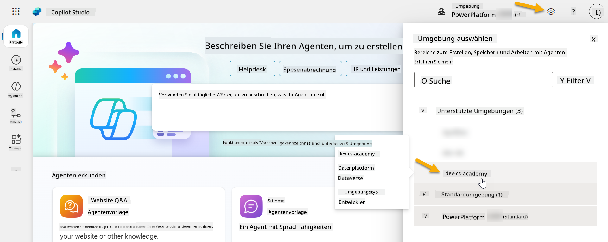

### 4.1 Einen Lösungspublisher erstellen

1. Verwenden Sie dieselbe Copilot Studio-Umgebung wie in der vorherigen Lektion und wählen Sie das **Ellipsen-Symbol (. . .)** im linken Menü von Copilot Studio aus. Wählen Sie **Lösungen** unter der Überschrift **Erkunden**.

    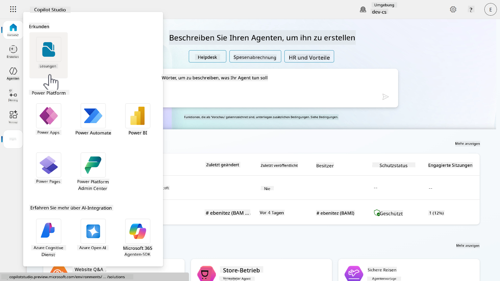

1. Der **Solution Explorer** in Copilot Studio wird geladen. Wählen Sie **+ Neue Lösung**.

    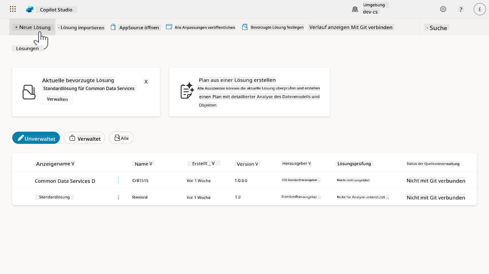

1. Das **Neue Lösung**-Fenster erscheint, in dem wir die Details unserer Lösung definieren können. Zuerst müssen wir einen neuen Publisher erstellen. Wählen Sie **+ Neuer Publisher**.

    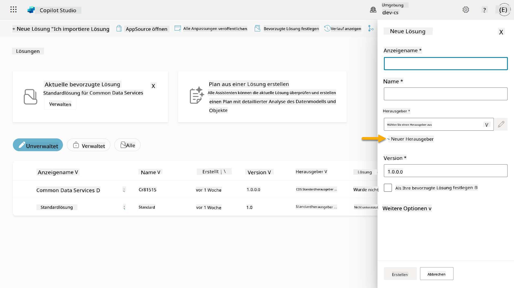  

1. Die **Eigenschaften**-Registerkarte des **Neuer Publisher**-Fensters erscheint mit erforderlichen und nicht erforderlichen Feldern, die in der **Eigenschaften**-Registerkarte ausgefüllt werden müssen. Hier können wir die Details des Publishers festlegen, der als Etikett oder Marke dient, die angibt, wer die Lösung erstellt oder besitzt.

    | Eigenschaft    | Beschreibung | Erforderlich |
    | ---------- | ---------- | :----------: |
    | Anzeigename | Anzeigename für den Publisher | Ja   |
    | Name  | Der eindeutige Name und Schema-Name für den Publisher  | Ja    |
    | Beschreibung   | Umreißt den Zweck der Lösung    | Nein     |
    | Präfix    | Publisher-Präfix, das auf neu erstellte Komponenten angewendet wird   | Ja      |
    | Präfix für Auswahlwert   | Generiert eine Nummer basierend auf dem Publisher-Präfix. Diese Nummer wird verwendet, wenn Sie Optionen zu Auswahlen hinzufügen und bietet einen Indikator dafür, welche Lösung verwendet wurde, um die Option hinzuzufügen.   | Ja      |

    Kopieren und fügen Sie Folgendes als **Anzeigename** ein,

    ```text
    Contoso Solutions
    ```

    Kopieren und fügen Sie Folgendes als **Name** ein,

    ```text
    ContosoSolutions
    ```

    Kopieren und fügen Sie Folgendes als **Beschreibung** ein,

    ```text
    Copilot Studio Agent Academy
    ```

    Kopieren und fügen Sie Folgendes für das **Präfix** ein,

    ```text
    cts
    ```

    Standardmäßig wird das **Präfix für Auswahlwert** eine Ganzzahl anzeigen. Aktualisieren Sie diese Ganzzahl auf den nächstgelegenen Tausender. Zum Beispiel, in meinem Screenshot unten war es ursprünglich `77074`. Aktualisieren Sie dies von `77074` auf `77000`.

      

1. Wenn Sie die Kontaktdaten für die Lösung bereitstellen möchten, wählen Sie die **Kontakt**-Registerkarte aus und füllen Sie die angezeigten Spalten aus.

    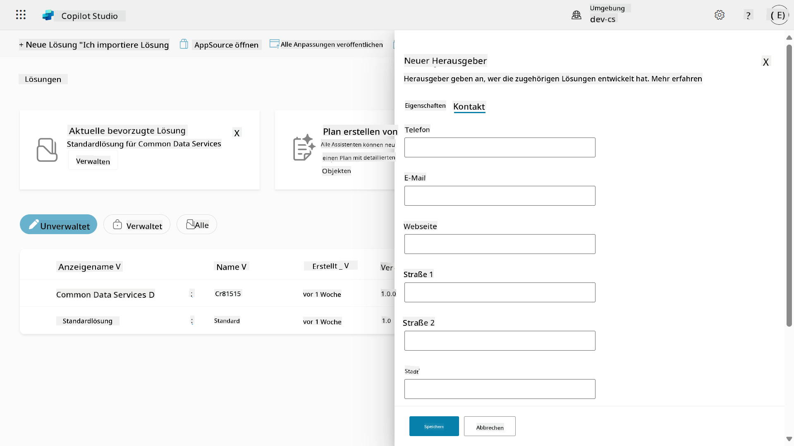

1. Wählen Sie die **Eigenschaften**-Registerkarte aus und klicken Sie auf **Speichern**, um den Publisher zu erstellen.

    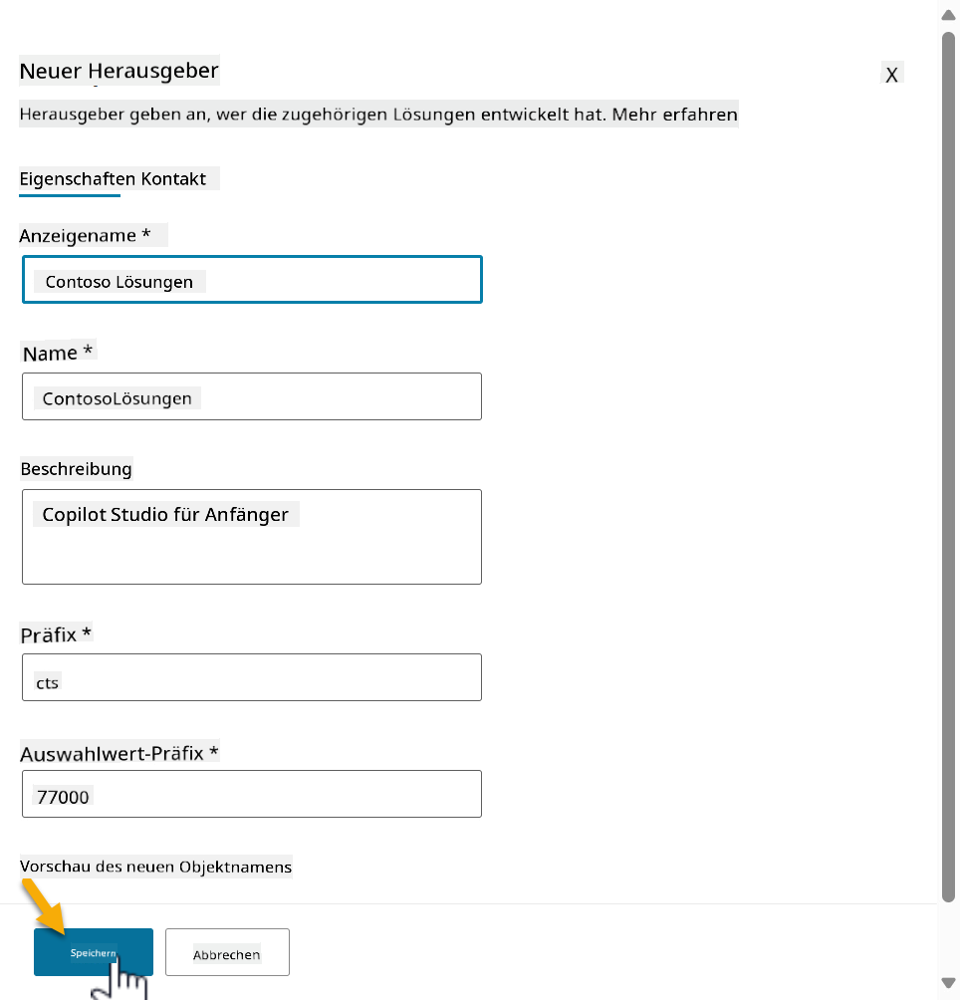
1. Das Fenster **Neuer Publisher** wird geschlossen und Sie kehren zurück zum Fenster **Neue Lösung**, in dem der neu erstellte Publisher ausgewählt ist.

    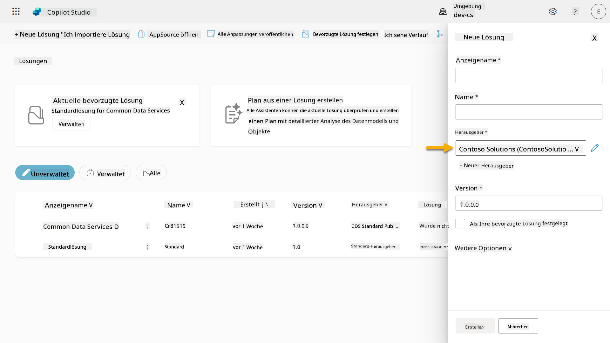  

High Five, Sie haben nun einen Lösungs-Publisher erstellt! 🙌🏻 Als Nächstes lernen wir, wie man eine neue benutzerdefinierte Lösung erstellt.

### 4.2 Eine neue Lösung erstellen

1. Jetzt, da wir unsere Lösungen erstellt haben, können wir den Rest des Formulars im Fenster **Neue Lösung** ausfüllen.

    Kopieren und fügen Sie Folgendes als **Anzeigename** ein,

    ```text
    Contoso Helpdesk Agent
    ```

    Kopieren und fügen Sie Folgendes als **Name** ein,

    ```text
    ContosoHelpdeskAgent
    ```

    Da wir eine neue Lösung erstellen, wird die [**Versionsnummer**](https://learn.microsoft.com/power-apps/maker/data-platform/update-solutions#understanding-version-numbers-for-updates/?WT.mc_id=power-172615-ebenitez) standardmäßig auf `1.0.0.0` gesetzt.

    Aktivieren Sie das Kontrollkästchen **Als bevorzugte Lösung festlegen**.

    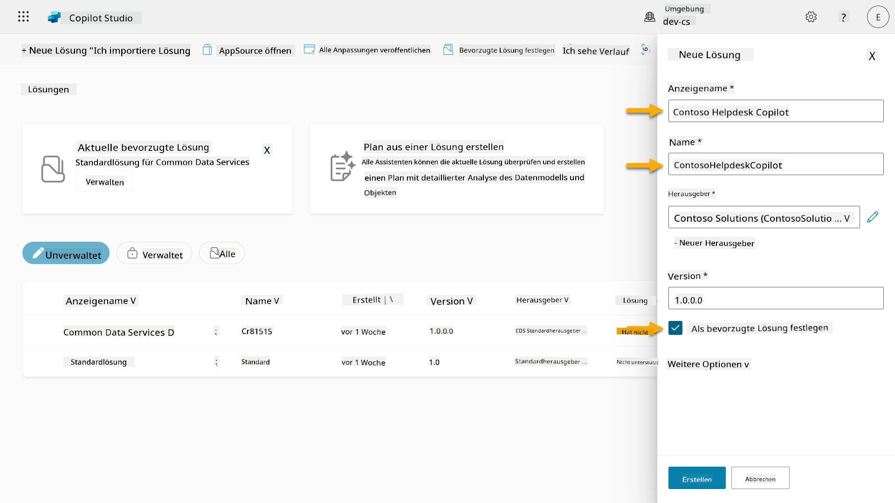  

1. Erweitern Sie die **Weitere Optionen**, um zusätzliche Details zu sehen, die in einer Lösung bereitgestellt werden können.

    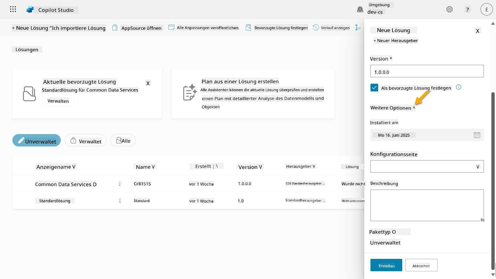

1. Sie sehen Folgendes:

    - **Installiert am** - das Datum, an dem die Lösung installiert wurde.

    - **Konfigurationsseite** - Entwickler richten eine HTML-Webressource ein, um Benutzern die Interaktion mit ihrer App, ihrem Agenten oder ihrem Tool zu erleichtern. Diese erscheint als Webseite im Informationsbereich mit Anweisungen oder Schaltflächen. Sie wird hauptsächlich von Unternehmen oder Entwicklern verwendet, die Lösungen mit anderen teilen.

    - **Beschreibung** - beschreibt die Lösung oder gibt eine allgemeine Beschreibung der Konfigurationsseite.

    Diese Felder lassen wir für dieses Lab leer.

    Wählen Sie **Erstellen**.

    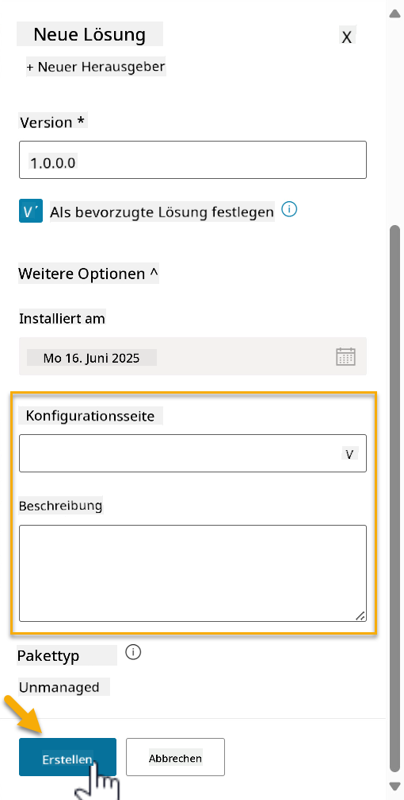

1. Die Lösung für den Contoso Helpdesk Agent wurde nun erstellt. Es gibt keine Komponenten, bis wir einen Agenten im Copilot Studio erstellen.

    Wählen Sie das Symbol **Pfeil zurück**, um zum Solution Explorer zurückzukehren.

    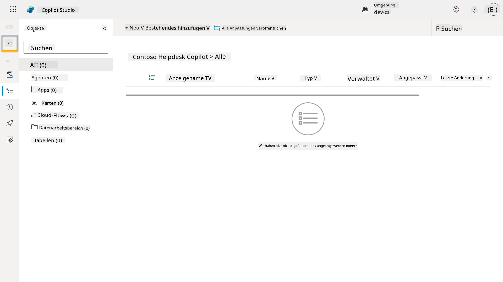

1. Beachten Sie, dass der Contoso Helpdesk Agent jetzt als **Aktuelle bevorzugte Lösung** angezeigt wird, da wir zuvor das Kontrollkästchen **Als bevorzugte Lösung festlegen** aktiviert haben.

    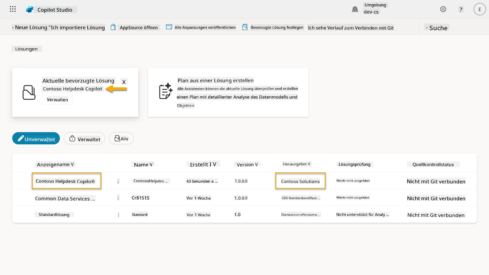

## ✅ Mission abgeschlossen

Herzlichen Glückwunsch! 👏🏻 Sie haben einen Publisher erstellt und ihn in Ihrer neu erstellten Lösung verwendet, um Ihren Agenten zu entwickeln!

Gut gemacht, Agent Maker. Ein ordentlicher digitaler Fußabdruck ist der erste Schritt zur Skalierbarkeit. Jetzt haben Sie die Werkzeuge und die Denkweise für eine nachhaltige, unternehmensgerechte Agentenentwicklung.

Das ist das Ende von **Lab 04 - Eine Lösung erstellen**, klicken Sie auf den untenstehenden Link, um zur nächsten Lektion zu gelangen. Ihre in diesem Lab erstellte Lösung wird im nächsten Lab der Lektion verwendet.

⏭️ [Weiter zur Lektion **Schnellstart mit vorgefertigten Agenten**](../05-using-prebuilt-agents/README.md)

## 📚 Taktische Ressourcen

🔗 [Eine Lösung erstellen](https://learn.microsoft.com/power-apps/maker/data-platform/create-solution/?WT.mc_id=power-172615-ebenitez)

🔗 [Lösungen in Copilot Studio erstellen und verwalten](https://learn.microsoft.com/microsoft-copilot-studio/authoring-solutions-overview/?WT.mc_id=power-172615-ebenitez)

🔗 [Agenten mit anderen Benutzern teilen](https://learn.microsoft.com/microsoft-copilot-studio/admin-share-bots/?WT.mc_id=power-172615-ebenitez)

🔗 [Zusammenfassung der verfügbaren Ressourcen für vordefinierte Sicherheitsrollen](https://learn.microsoft.com/power-platform/admin/database-security#summary-of-resources-available-to-predefined-security-roles/?WT.mc_id=power-172615-ebenitez)

🔗 [Eine Lösung aktualisieren oder upgraden](https://learn.microsoft.com/power-apps/maker/data-platform/update-solutions/?WT.mc_id=power-172615-ebenitez)

🔗 [Übersicht über Pipelines in Power Platform](https://learn.microsoft.com/power-platform/alm/pipelines/?WT.mc_id=power-172615-ebenitez)

🔗 [Übersicht über Git-Integration in Power Platform](https://learn.microsoft.com/power-platform/alm/git-integration/overview/?WT.mc_id=power-172615-ebenitez)


---

**Haftungsausschluss**:  
Dieses Dokument wurde mit dem KI-Übersetzungsdienst [Co-op Translator](https://github.com/Azure/co-op-translator) übersetzt. Obwohl wir uns um Genauigkeit bemühen, beachten Sie bitte, dass automatisierte Übersetzungen Fehler oder Ungenauigkeiten enthalten können. Das Originaldokument in seiner ursprünglichen Sprache sollte als maßgebliche Quelle betrachtet werden. Für kritische Informationen wird eine professionelle menschliche Übersetzung empfohlen. Wir übernehmen keine Haftung für Missverständnisse oder Fehlinterpretationen, die sich aus der Nutzung dieser Übersetzung ergeben.