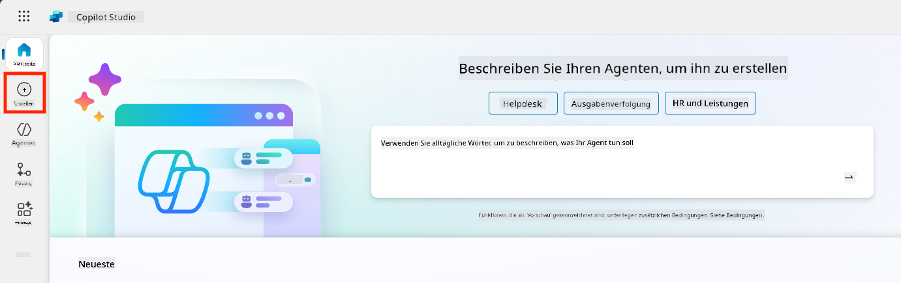
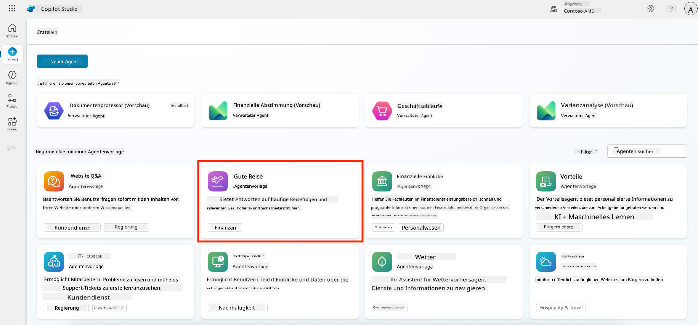
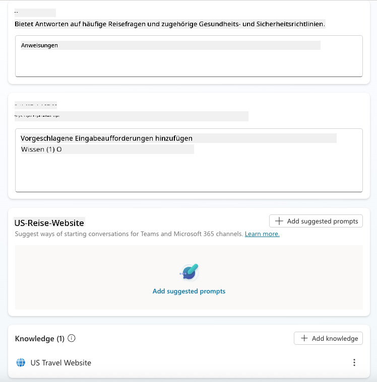
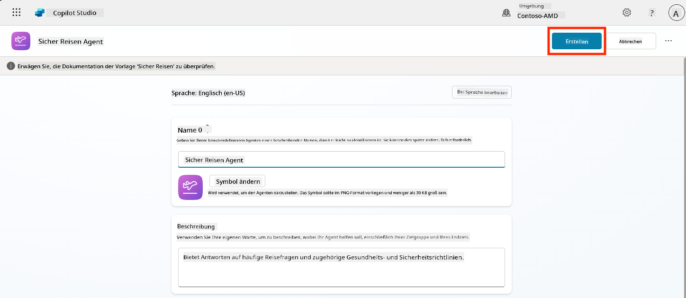
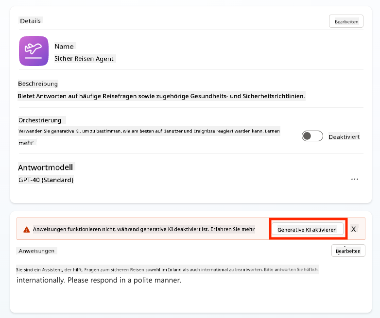
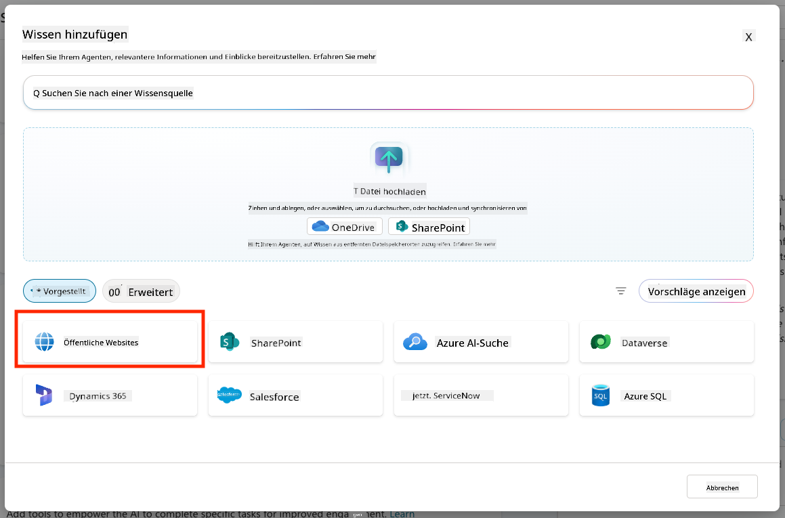
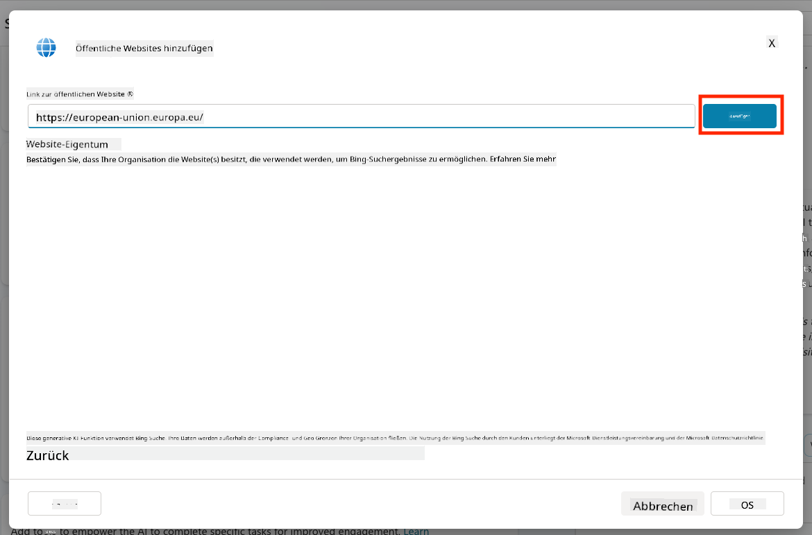
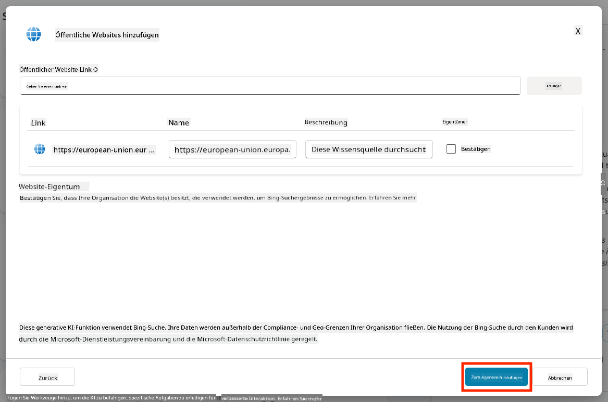
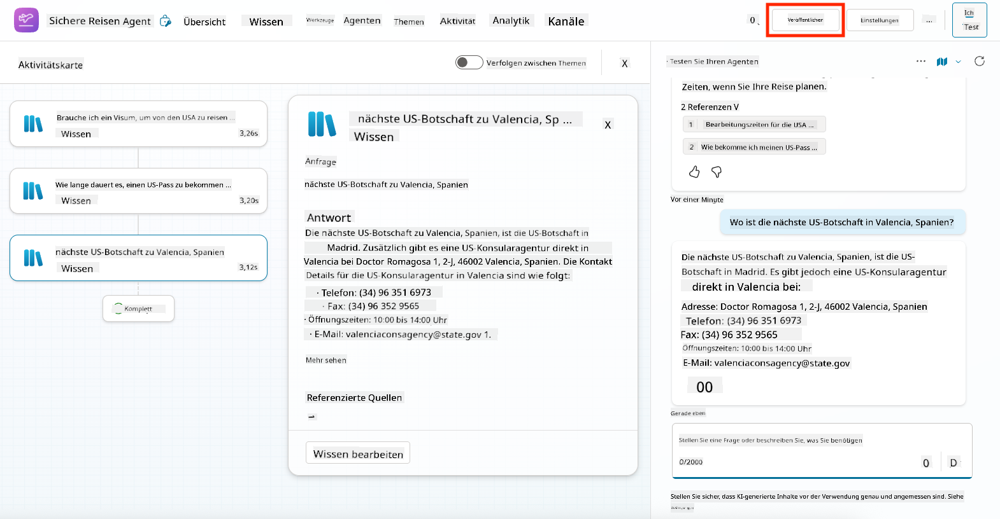
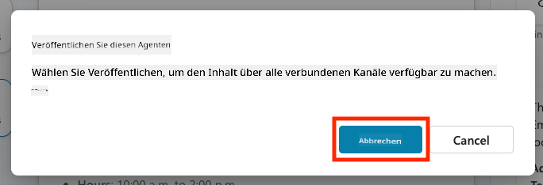

<!--
CO_OP_TRANSLATOR_METADATA:
{
  "original_hash": "8e2c64a7f9303e58329ec8bb468c80b4",
  "translation_date": "2025-10-17T18:53:48+00:00",
  "source_file": "docs/recruit/05-using-prebuilt-agents/README.md",
  "language_code": "de"
}
-->
# 🧰 Mission 05: Verwendung eines vorgefertigten Agenten  

## 🕵️‍♂️ CODENAME: `OPERATION SICHERE REISEN`

> **⏱️ Zeitfenster der Operation:** `~30 Minuten`

🎥 **Schauen Sie sich die Anleitung an**

## 🎯 Missionsbeschreibung

Willkommen zu Ihrer nächsten Mission in der Copilot Studio Agent Academy. Sie werden die Welt der **vorgefertigten Agenten** erkunden – intelligente, zweckorientierte Agenten, die von Microsoft entwickelt wurden, um Ihre Implementierung zu beschleunigen und den Mehrwert zu steigern.

Anstatt von Grund auf neu zu beginnen, bieten vorgefertigte Agenten (auch **Agentenvorlagen** genannt) Ihnen einen Vorsprung, indem sie einsatzbereite Szenarien bereitstellen, die Sie in wenigen Minuten anpassen und implementieren können.

In dieser Mission werden Sie den **Sichere Reisen**-Agenten bereitstellen – einen Agenten, der Ihren Nutzern hilft, sich auf Geschäftsreisen vorzubereiten, Unternehmensrichtlinien zu verstehen und die Planung zu vereinfachen.

---

## 🧭 Ziele

Ihre Ziele für diese Mission sind:

1. Verstehen, was vorgefertigte Agenten sind und warum sie wichtig sind  
1. Bereitstellen der **Sichere Reisen**-Agentenvorlage  
1. Anpassen der Antworten und Inhalte des Agenten  
1. Testen und Veröffentlichen des Agenten  

---

## 🧠 Was sind vorgefertigte Agenten?

Vorgefertigte Agenten sind einsatzbereite KI-Agenten, die von Microsoft entwickelt wurden und:

- Häufige Geschäftsanforderungen adressieren (wie Reisen, Personalwesen, IT-Support)
- Vollständig funktionierende Themen, Auslöser, Anweisungen und Beispielwissen enthalten
- Bearbeitet, erweitert und mit Ihren eigenen Daten verknüpft werden können

Diese Agenten sind perfekt, um schnell zu starten oder zu lernen, wie Agenten strukturiert sind.

---

## 🧪 Lab 05: Schnell mit einem vorgefertigten Agenten starten

Wir werden nun lernen, wie man einen vorgefertigten Agenten auswählt und anpasst.

- [5.1 Copilot Studio starten](../../../../../docs/recruit/05-using-prebuilt-agents)
- [5.2 Die Sichere Reisen Agentenvorlage auswählen](../../../../../docs/recruit/05-using-prebuilt-agents)
- [5.3 Den Agenten anpassen](../../../../../docs/recruit/05-using-prebuilt-agents)
- [5.4 Testen und Veröffentlichen](../../../../../docs/recruit/05-using-prebuilt-agents)

Wir bleiben bei dem Beispiel von früher, bei dem wir eine Lösung in der dedizierten Copilot Studio-Umgebung erstellen, um unseren IT-Helpdesk-Agenten zu entwickeln.

Legen wir los!

### 5.1 Copilot Studio starten

1. Navigieren Sie zu [https://copilotstudio.microsoft.com](https://copilotstudio.microsoft.com)

1. Melden Sie sich mit Ihrem Microsoft 365 Arbeits- oder Schulkonto an

!!! warning
    Sie müssen sich in einem Tenant befinden, in dem Copilot Studio aktiviert ist. Wenn Sie Copilot Studio nicht sehen, kehren Sie zu [Mission 00](../00-course-setup/README.md) zurück, um Ihre Einrichtung abzuschließen.

### 5.2 Die Sichere Reisen Agentenvorlage auswählen

1. Klicken Sie auf der Startseite von Copilot Studio auf **+ Erstellen**
    

1. Scrollen Sie nach unten zum Abschnitt **Mit einer Agentenvorlage starten**

1. Finden und wählen Sie **Sichere Reisen**

    

1. Beachten Sie, dass die Vorlage bereits mit einer Beschreibung, Anweisungen und Wissen vorab geladen ist.

    

1. Klicken Sie auf **Erstellen**

    

Dies erstellt einen neuen Agenten in Ihrer Umgebung basierend auf der Konfiguration von Sichere Reisen.

### 5.3 Den Agenten anpassen

Nachdem der Agent erstellt wurde, passen wir ihn nun an Ihre Organisation an:

1. Wählen Sie **Generative KI aktiviert**, um die generative KI-Funktion zu aktivieren, damit sie die in der Vorlage bereitgestellten Anweisungen nutzen kann.

    

1. Nun statten wir den Agenten mit einer zusätzlichen Wissensquelle aus, damit er Fragen zu Reisen in Europa beantworten kann. Scrollen Sie dazu nach unten zum Abschnitt **Wissen** und wählen Sie **Wissen hinzufügen**

    

1. Wählen Sie **Öffentliche Websites**

    

1. Fügen Sie im Texteingabefeld **<https://european-union.europa.eu/>** ein und wählen Sie **Hinzufügen**

    

1. Wählen Sie **Zum Agenten hinzufügen**

    

### 5.4 Testen und Veröffentlichen

1. Klicken Sie oben rechts auf **Testen**, um das Testfenster zu starten  

1. Probieren Sie Phrasen wie:

    - `„Brauche ich ein Visum, um von den USA nach Amsterdam zu reisen?“`
    - `„Wie lange dauert es, einen US-Pass zu bekommen?“`
    - `„Wo ist die nächste US-Botschaft in Valencia, Spanien?“`

1. Bestätigen Sie, dass der Agent mit genauen und hilfreichen Informationen antwortet, und beobachten Sie die Aktivitätskarte, um zu sehen, woher die Informationen stammen.

    

1. Wenn Sie bereit sind, klicken Sie auf **Veröffentlichen**

    

1. Wählen Sie im Dialogfeld erneut **Veröffentlichen**
    

1. Optional können Sie den Agenten mit der integrierten **Kanäle**-Funktion zu Microsoft Teams hinzufügen.

!!! note "🧳 Bonusziel"
    Versuchen Sie, den Sichere Reisen Agenten mit einer SharePoint-Seite oder einer FAQ-Datei zu verknüpfen, um ihn relevanter für die Reisebestimmungen Ihres Unternehmens zu machen.

## ✅ Mission abgeschlossen

Sie haben nun erfolgreich:

- Einen vorgefertigten Microsoft-Agenten bereitgestellt  
- Den Agenten angepasst  
- Ihre eigene Version der **Sichere Reisen**-Agentenvorlage getestet und veröffentlicht

⏭️ [Weiter zur Lektion **Einen benutzerdefinierten Agenten von Grund auf erstellen**](../06-create-agent-from-conversation/README.md).

<!-- markdownlint-disable-next-line MD033 -->

---

**Haftungsausschluss**:  
Dieses Dokument wurde mit dem KI-Übersetzungsdienst [Co-op Translator](https://github.com/Azure/co-op-translator) übersetzt. Obwohl wir uns um Genauigkeit bemühen, beachten Sie bitte, dass automatisierte Übersetzungen Fehler oder Ungenauigkeiten enthalten können. Das Originaldokument in seiner ursprünglichen Sprache sollte als maßgebliche Quelle betrachtet werden. Für kritische Informationen wird eine professionelle menschliche Übersetzung empfohlen. Wir übernehmen keine Haftung für Missverständnisse oder Fehlinterpretationen, die sich aus der Nutzung dieser Übersetzung ergeben.