<!--
CO_OP_TRANSLATOR_METADATA:
{
  "original_hash": "180f9cc0b40527f61be092c9b0f72aba",
  "translation_date": "2025-10-17T19:12:20+00:00",
  "source_file": "docs/recruit/06-create-agent-from-conversation/README.md",
  "language_code": "de"
}
-->
# 🚨 Mission 06: Erstellen Sie einen benutzerdefinierten Agenten mit natürlicher Sprache und binden Sie ihn an Ihre Daten

## 🕵️‍♂️ CODENAME: `OPERATION AGENT FORGE`

> **⏱️ Zeitfenster der Operation:** `~75 Minuten`

🎥 **Sehen Sie sich die Anleitung an**

[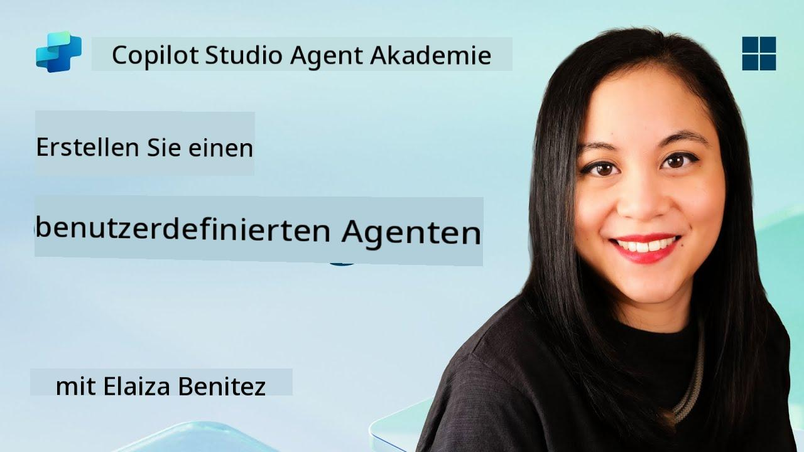](https://www.youtube.com/watch?v=qZTtQVncGFg "Sehen Sie sich die Anleitung auf YouTube an")

## 🎯 Missionsbeschreibung

Willkommen zurück, Agent Maker. Diese Mission setzt Sie in den Kommandositz der mächtigsten Funktion von Copilot Studio – einen benutzerdefinierten Agenten von Grund auf mit natürlicher Sprache zu erstellen… und ihn mit Ihren eigenen Daten zu verstärken.

Das ist nicht nur ein weiterer Chatbot. Sie bauen einen wissensgestützten digitalen Mitarbeiter – einen, der denken, antworten und auf echte Unternehmensinformationen verweisen kann.

Ihre Waffe der Wahl? Natürliche Sprache. Ihre Mission? Entwerfen, trainieren und testen Sie einen vollständig angepassten Helpdesk-Agenten, der IT-Fragen mithilfe von SharePoint, hochgeladenen Dateien oder Unternehmens-URLs beantwortet.

Lassen Sie uns Ihren Agenten von Grund auf erstellen.

## 🔎 Ziele

In dieser Mission lernen Sie:

1. Verstehen, was benutzerdefinierte Agenten sind und wie sie sich von vorgefertigten Vorlagen unterscheiden
1. Agenten mit natürlichen Sprachaufforderungen und Konversationsdesign mit Copilot erstellen
1. Agenten mit Unternehmenswissensquellen wie SharePoint, Dokumenten und Websites verankern
1. Generative Orchestrierung verstehen und wie Agenten dynamisch suchen und mit mehreren Datenquellen antworten
1. Einen voll funktionsfähigen IT-Helpdesk-Agenten erstellen und testen, der Fragen aus Ihren eigenen Daten beantworten kann

## 🤔 Was ist ein _benutzerdefinierter_ Agent?

Ein benutzerdefinierter Agent ist ein Chatbot oder virtueller Assistent, den Sie in Copilot Studio erstellen und entwerfen, um Benutzern bei spezifischen Aufgaben oder Fragen zu helfen. Er wird als benutzerdefiniert bezeichnet, weil:

- **Sie entscheiden über den Zweck** – Helfen Sie Benutzern, Urlaub zu beantragen, den Bestellstatus zu überprüfen oder Unterstützung bei IT-Fragen zu erhalten.
- **Sie definieren die Konversation** – Was der Agent sagt und wie er antworten soll.
- **Sie verankern ihn mit Ihren eigenen Daten** – Verbinden Sie ihn mit Ihren Unternehmensdaten über die integrierten unterstützten Wissensressourcen.
- **Sie verbinden ihn mit Ihren eigenen Systemen oder Anwendungen** – Wählen Sie aus Konnektoren, Flows, REST-APIs und Modellkontextprotokollservern.

!!! note
    Sehen Sie es so: Sie bauen Ihren eigenen digitalen Helfer, der mit Benutzern sprechen und Aufgaben für sie erledigen kann, wie z. B. Fragen beantworten, Informationen sammeln, die für einen Prozess erforderlich sind, oder auf Ihre Unternehmensdaten zugreifen.

### 🤖 Was kann ein benutzerdefinierter Agent tun?

Ein benutzerdefinierter Agent kann Folgendes erfüllen:

- Benutzer nach Informationen wie Namen, Daten oder Präferenzen fragen.
- Diese Informationen in einer Datenbank oder Tabelle speichern.
- Daten basierend auf gestellten Fragen suchen und beantworten.
- Autonom arbeiten, ohne dass Benutzer direkt mit dem Agenten interagieren.
- Aktionen entweder auf Abruf durch direkte Benutzerinteraktion oder autonom auslösen, wie z. B. das Senden von E-Mails oder das Erstellen von Datensätzen.

### 👩🏻‍💻 Warum einen benutzerdefinierten Agenten verwenden?

- Spart Zeit durch Automatisierung sich wiederholender Aufgaben.
- Bietet Benutzern eine freundliche, geführte Erfahrung.
- Passt ihn an Ihre Geschäfts- oder Projektanforderungen an.

### ✨ Beispiel

Sie erstellen einen benutzerdefinierten Agenten, der Mitarbeitern hilft, Urlaub zu beantragen.

Er fragt nach ihrem Namen, den Urlaubsdaten und dem Namen ihres Managers und speichert die Informationen im dafür vorgesehenen System, das Urlaubsanträge verwaltet, wie z. B. eine SharePoint-Liste.

Jetzt müssen Mitarbeiter nicht mehr zur SharePoint-Liste navigieren und einen neuen Eintrag erstellen, sondern können einfach mit dem Agenten chatten.

## 🗣️ Verwenden Sie natürliche Sprache, um Agenten zu erstellen

Zuvor haben Sie gelernt, wie Sie schnell Agenten in Copilot Studio mit vorgefertigten Agentenvorlagen erstellen können, in [Lektion 05 - Schnellstart mit vorgefertigten Agenten](../05-using-prebuilt-agents/README.md). In dieser Lektion tauchen wir in die Konversationserstellungserfahrung mit Copilot ein. Copilot Studio macht es einfach, Agenten zu erstellen, indem Sie mit Copilot chatten, genau wie in einem Gespräch.

In Copilot Studio müssen Sie keinen Code schreiben, um einen Agenten zu erstellen. Stattdessen beschreiben Sie, was Ihr Agent tun soll, in einfacher Sprache, und Copilot hilft Ihnen, ihn Schritt für Schritt durch eine chatähnliche Erfahrung zu erstellen.

## 🌱 Aber ich bin neu im "Beschreiben, was ich will" – was soll ich tun?

Das Beschreiben in natürlicher Sprache, um einen benutzerdefinierten Agenten zu erstellen, könnte ein neues Konzept für Sie sein. Immer wenn Sie Copilot in Microsoft-Produkten und -Diensten verwenden, nutzen Sie natürliche Sprache in Form einer _Aufforderung_.

Eine Aufforderung ist die Nachricht oder Anweisung, die Sie einem KI-Agenten geben, um ihm mitzuteilen, was Sie möchten, dass er tut. Denken Sie daran wie an Anweisungen für einen Assistenten. Je klarer Ihre Anweisungen sind, desto einfacher ist es für Ihren Assistenten, sie zu verstehen und umzusetzen.

### 🪄 Warum Aufforderungen wichtig sind

- Sie leiten das Verhalten des Agenten.
- Sie helfen dem Agenten zu verstehen, welche Art von Konversation er führen soll.
- Eine gute Aufforderung macht den Agenten hilfreicher und genauer.

### 📝 Tipps für das Schreiben einer guten Aufforderung

- Seien Sie klar und spezifisch – sagen Sie genau, was der Agent tun soll.
- Denken Sie wie der Benutzer – was wird der Benutzer sagen? Was sollte der Agent antworten?
- Geben Sie Beispiele – wenn möglich, geben Sie eine Beispielinteraktion.

### ✨ Beispiel

Angenommen, das HR-Team benötigt einen Agenten, der bei Urlaubsanträgen hilft.

Die Aufforderung könnte lauten:

    „Ich möchte einen Agenten erstellen, der Benutzern hilft, einen Urlaubsantrag einzureichen. Wenn ein Benutzer sagt, dass er Zeit frei nehmen möchte, sollte der Agent nach seinem Namen, dem Startdatum seines Urlaubs, dem Enddatum seines Urlaubs und dem Namen seines Managers fragen. Sobald der Benutzer diese Informationen bereitstellt, sollte der Agent sie in einer SharePoint-Liste namens ‚Urlaubsanträge‘ speichern und eine Benachrichtigung in einem dedizierten Microsoft Teams-Kanal posten.“

Warum diese Aufforderung funktioniert:

- **Klar definiertes Ziel** – einen Urlaubsantrag einreichen
- **Beschreibt die Benutzerinteraktion** – was der Benutzer sagt und was der Agent fragen soll
- **Listet die erforderlichen Daten auf** – Name, Startdatum, Enddatum, Manager
- **Erwähnt, wohin die Daten gehen** – eine SharePoint-Liste namens Urlaubsanträge

## 🔮 OK, ich habe meinen Agenten erstellt... wie verankere ich ihn als Nächstes mit Wissen?

In Copilot Studio sind Wissensquellen Orte, an denen Ihr Agent Informationen finden kann, um bessere Antworten zu geben. Wenn Sie diese Quellen hinzufügen, kann Ihr Agent Ihre Unternehmensdaten aus Plattformen wie Power Platform, Dynamics 365, Websites und anderen Systemen oder Diensten, die Ihr Unternehmen verwendet, einbeziehen.

Diese Quellen arbeiten zusammen mit KI, um Ihrem Agenten zu helfen, genauer auf Benutzerfragen zu antworten. Dies wird durch das sogenannte **generative Orchestrierung** erreicht.

### 🌿 Was ist generative Orchestrierung im Kontext von Agenten?

Generative Orchestrierung bedeutet, dass der Agent KI verwendet, um dynamisch zu entscheiden, wie er eine Frage beantworten soll, indem er seine eingebauten Sprachfähigkeiten mit Informationen aus Ihren hinzugefügten Wissensquellen kombiniert.

Wenn ein Benutzer eine Frage stellt, macht der Agent Folgendes:

- Versteht die Frage mithilfe von KI.
- Kann Benutzer nach fehlenden Informationen fragen, indem er Fragen spontan generiert.
- Wählt die relevantesten Wissensquellen aus.
- Durchsucht diese Quellen nach Antworten.
- Generiert eine natürliche, hilfreiche Antwort basierend auf den gefundenen Informationen.

### 🏦 Warum Wissensquellen wichtig sind

1. **Intelligentere Antworten** – Wenn Sie Wissensquellen hinzufügen, kann Ihr Agent bessere, genauere Antworten geben, indem er echte Daten aus Ihrer Organisation verwendet.

1. **Weniger manuelle Arbeit** – Sie müssen nicht jede mögliche Antwort schreiben. Der Agent kann Ihre hinzugefügten Quellen durchsuchen und automatisch antworten.

1. **Verwendung vertrauenswürdiger Informationen** – Ihr Agent kann Antworten aus Systemen ziehen, die Sie bereits verwenden, wie Dataverse, SharePoint oder Unternehmenswebsites, sodass Benutzer zuverlässige Informationen aus einer vertrauenswürdigen Quelle erhalten.

1. **Funktioniert mit generativer KI** – Wissensquellen und KI helfen Ihrem Agenten, Fragen zu verstehen und natürlich zu antworten, auch wenn die Frage nicht vorprogrammiert oder als Startaufforderung hinzugefügt wurde.

1. **Flexibel und erweiterbar** – Sie können Wissensquellen jederzeit während der Einrichtung oder später hinzufügen. Ihr Agent wird intelligenter, wenn sich Ihre Bedürfnisse ändern.

### ✨ Beispiel

Stellen Sie sich vor, Sie erstellen einen Agenten, der Mitarbeitern bei HR-Fragen hilft. Sie fügen das HR-Richtliniendokument Ihres Unternehmens und die SharePoint-Website als Wissensquellen hinzu.

Wenn ein Mitarbeiter fragt: _„Wie viele Urlaubstage stehen mir zu?“_, verwendet der Agent generative Orchestrierung, um diese Quellen zu durchsuchen und mit der richtigen Richtlinie zu antworten, ohne dass Sie diese Antwort manuell schreiben müssen. Dies spart Ihnen Zeit, da Sie nicht jede mögliche Frage eines Mitarbeiters zu seinen Ansprüchen berücksichtigen müssen.

## Arten von Wissensquellen, die hinzugefügt werden können

1. **Öffentliche Websites**
    - **Was es tut:** Durchsucht spezifische Websites (wie die Website Ihres Unternehmens) mithilfe von Bing.
    - **Warum es nützlich ist:** Ideal, um öffentlich zugängliche Informationen wie FAQs oder Produktdetails abzurufen.

1. **Dokumente**
    - **Was es tut:** Verwendet Dokumente, die Sie direkt in Ihren Agenten hochladen, wie PDFs oder Word-Dateien. Diese hochgeladenen Dateien werden sicher in Dataverse gespeichert.
    - **Warum es nützlich ist:** Ermöglicht Ihrem Agenten, Fragen basierend auf internen Leitfäden, Handbüchern oder Richtlinien zu beantworten.

1. **SharePoint**
    - **Was es tut:** Verbindet sich mit SharePoint-Ordnern oder -Dateien über Microsoft Graph Search.
    - **Warum es nützlich ist:** Ideal für den Zugriff auf Teamdokumente, HR-Richtlinien oder Projektdateien, die in SharePoint gespeichert sind.

1. **Dataverse**
    - **Was es tut:** Verwendet strukturierte Daten aus Ihrer Dataverse-Umgebung, Tabellen und Zeilen, und kann Synonyme und Glossardefinitionen für Tabellen und Spalten anwenden, um die Antworten des Agenten zu verbessern.
    - **Warum es nützlich ist:** Wenn Sie Unternehmensdaten aus Dataverse wie Kundeninformationen abrufen müssen.

1. **Echtzeitwissen mit Konnektoren**
    - **Was es tut:** Ermöglicht Ihrem Agenten den Zugriff auf Live-Daten aus anderen Unternehmenssystemen wie Salesforce, ServiceNow, Dynamics 365, AzureSQL, Databricks und mehr während einer Konversation, unter Verwendung der eigenen Berechtigungen des Benutzers.
    - **Warum es nützlich ist:** Es bietet aktuelle, sichere und genaue Antworten, ohne Daten zu speichern oder zu duplizieren, wodurch Ihr Agent intelligenter und sicherer wird.

1. **Azure AI Search**
    - **Was es tut:** Ermöglicht Ihrem Agenten, große Dokumentensammlungen, die in Azure gespeichert sind, mithilfe von semantischer und Vektorsuche zu durchsuchen, um Benutzerfragen zu verstehen.
    - **Warum es nützlich ist:** Liefert genaue, vertrauenswürdige Antworten aus komplexen Datenquellen, unterstützt Zitate und skaliert gut für große Dokumentensammlungen mit sicheren Zugriffskontrollen.

## 🔒 Hinweis zur Sicherheit

### Authentifizierung von Wissensquellen

Einige Quellen wie SharePoint und Dataverse erfordern eine Benutzerauthentifizierung. Das bedeutet, dass der Agent nur Daten in seiner Antwort referenziert, die der Benutzer sehen darf. Andere Quellen können zusätzliche Konfigurationen erfordern, damit der Agent darauf zugreifen kann, wie Azure AI Search, das ein Azure-Konto und die Angabe eines Authentifizierungstyps erfordert.

## Verbesserung der Antworten Ihres Agenten in Copilot Studio

Nachdem Ihr Agent aus der Konversationserstellungserfahrung bereitgestellt wurde, sollten Sie Ihren Agenten anhand der Anweisungen testen, die Copilot aus Ihrer Aufforderung generiert hat. Die Verbesserung der Antworten Ihres Agenten in Copilot Studio besteht darin, sicherzustellen, dass er Ihre Ziele klar versteht und über die richtigen Informationen verfügt, um zu arbeiten.

1. **Verfeinern Sie die Anweisungen des Agenten** – Hier sagen Sie Ihrem Agenten, wie er sich verhalten soll. Verwenden Sie klare, spezifische Sprache.

    Zum Beispiel:

    ✅ „Verhalte dich wie ein freundlicher Kundendienstmitarbeiter, der Dinge einfach erklärt.“

    ❌ „Sei hilfreich.“ (Zu vage)

1. **Überprüfen Sie den Ton und die Sprache** – Stellen Sie sicher, dass der Ton des Agenten zu Ihrem Publikum passt.

    Sie können ihn einstellen auf:

    - Freundlich und locker.
    - Professionell und prägnant.
    - Unterstützend und geduldig.

1. **Fügen Sie Wissensquellen hinzu oder aktualisieren Sie diese** – Wenn Ihr Agent Fragen zu einem Thema beantworten muss, stellen Sie sicher, dass er Zugriff auf die richtigen Informationen hat.

    - Fügen Sie Links zu Websites, Dokumenten oder FAQs hinzu.
    - Halten Sie die Inhalte aktuell.
    - Verwenden Sie klare, gut strukturierte Informationen.

1. **Verwenden Sie Themen und Auslöser** – Wenn Ihr Agent spezifische Aufgaben oder Konversationen bearbeiten soll, können Sie Themen mit Auslösephrasen erstellen. Dies hilft, die Konversation präziser zu führen. Wir werden mehr darüber in der nächsten Lektion lernen.

1. **Testen Sie mit echten Fragen** – Versuchen Sie, Ihrem Agenten die Art von Fragen zu stellen, die Benutzer möglicherweise stellen.

    Wenn die Antworten nicht zufriedenstellend sind:

    - Passen Sie die Systemanweisungen an.
    - Fügen Sie weitere Beispiele oder Wissen hinzu.
    - Formulieren Sie Ihre Fragen um, um zu sehen, wie er reagiert.

1. **Überprüfen und iterieren** – Die Verbesserung eines Agenten ist ein fortlaufender Prozess!

    Nach der Veröffentlichung:

    - Sammeln Sie Feedback von Benutzern.
    - Achten Sie auf häufige Fragen oder Verwirrung.
    - Verfeinern Sie die Einrichtung des Agenten kontinuierlich.

## 🧪 Lab 06: Erstellen Sie einen benutzerdefinierten Agenten in Copilot Studio

Wir werden jetzt lernen, wie man einen benutzerdefinierten Agenten erstellt, der über Ihre Daten chatten kann.

- [6.1 Verwenden Sie natürliche Sprache, um einen Agenten mit Copilot zu erstellen](../../../../../docs/recruit/06-create-agent-from-conversation)
- [6.2 Fügen Sie eine interne Wissensquelle mit einer SharePoint-Website hinzu](../../../../../docs/recruit/06-create-agent-from-conversation)
- [6.3 Fügen Sie eine interne Wissensquelle hinzu, indem Sie ein Dokument hochladen](../../../../../docs/recruit/06-create-agent-from-conversation)
- [6.4 Testen Sie den Agenten](../../../../../docs/recruit/06-create-agent-from-conversation)

### ✨ Anwendungsfall
Wir verwenden denselben Anwendungsfall aus [Lektion 03 - Erstellen eines deklarativen Agenten für Microsoft 365 Copilot](../03-create-a-declarative-agent-for-M365Copilot/README.md#use-case-scenario)

**Als** Mitarbeiter

**Möchte ich** schnelle und präzise Hilfe vom IT-Helpdesk-Agenten bei Problemen wie Geräteproblemen, Netzwerk-Fehlerbehebung, Druckereinrichtung erhalten

**Damit ich** produktiv bleiben und technische Probleme ohne Verzögerungen lösen kann

Legen wir los!

### ✨ Voraussetzungen

- **SharePoint-Website**

Wir verwenden die **Contoso IT** SharePoint-Website aus [Lektion 00 - Kurssetup - Schritt 3: Neue SharePoint-Website erstellen](../00-course-setup/README.md#step-4-create-new-sharepoint-site).

Falls Sie die **Contoso IT** SharePoint-Website noch nicht eingerichtet haben, gehen Sie bitte zurück zu [Lektion 00 - Kurssetup - Schritt 3: Neue SharePoint-Website erstellen](../00-course-setup/README.md#step-4-create-new-sharepoint-site).

- **Lösung**

Wir verwenden die **Contoso Helpdesk Agent**-Lösung aus [Lektion 04 - Erstellen einer Lösung für Ihren Agenten](../04-creating-a-solution/README.md#41-create-a-solution-publisher).

Falls Sie die **Contoso Agent**-Lösung noch nicht eingerichtet haben, gehen Sie bitte zurück zu [Lektion 04 - Erstellen einer Lösung für Ihren Agenten](../04-creating-a-solution/README.md#41-create-a-solution-publisher).

### 6.1 Erstellen eines Agenten mit natürlicher Sprache und Copilot

!!! warning "Copilot-Fragen können je nach Sitzung variieren"

    Die Konversationserstellungserfahrung mit Copilot kann sich jedes Mal unterscheiden, wobei die bereitgestellten Fragen zur Anleitung leicht abweichen können.

1. Navigieren Sie zur Startseite von Copilot Studio und geben Sie im Feld die folgende Eingabeaufforderung ein, die den IT-Helpdesk-Agenten beschreibt. Die Eingabeaufforderung enthält das Ziel des Agenten, den Kontext, die erwarteten Aufgaben und das Format der Antworten des Agenten.

    ```text
    You are an IT help desk agent. Your goal is to assist users with their IT issues. You can access information from our company's knowledge base at https://support.microsoft.com/en-us. Your responses should be polite and helpful. If a user reports a slow computer, ask about the age of the device, current software versions, and if they've recently installed any new programs. If a user is experiencing trouble logging into their email, guide them through password reset procedures. You should be concise and informative, using step-by-step instructions with bullet points when appropriate.
    ```

      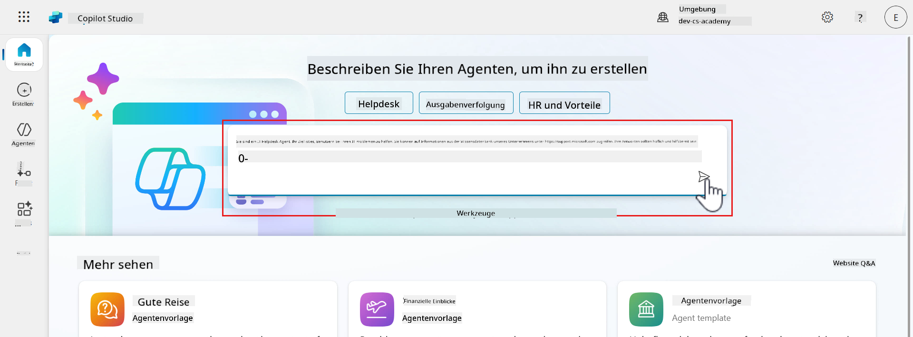

1. Die Konversationserstellungserfahrung mit Copilot wird als Nächstes geladen. Sie sehen, dass Copilot dabei ist, auf Ihre Eingabe zu reagieren.

      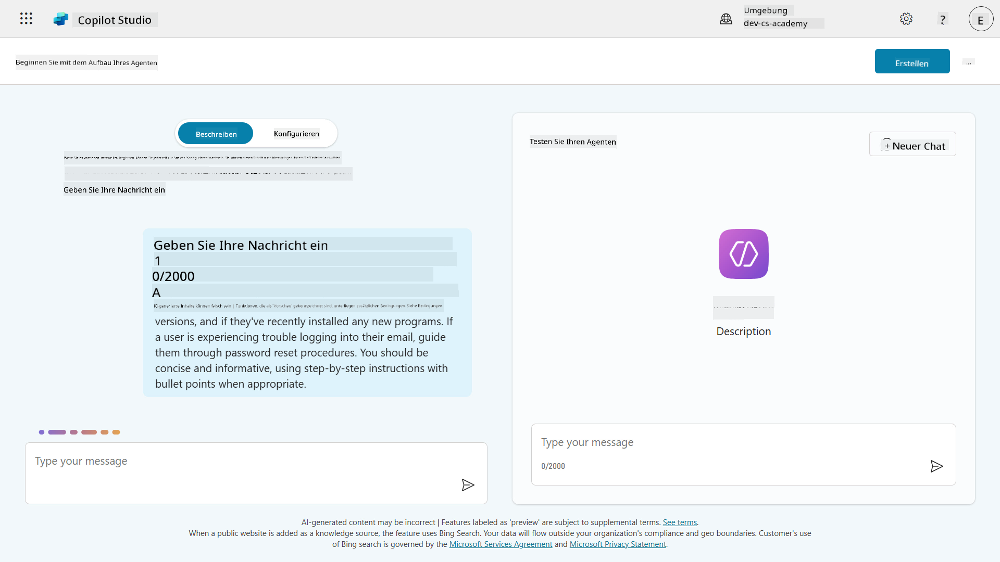

1. Copilot bestätigt, dass der Agent mit den bereitgestellten Anweisungen eingerichtet wurde, und fragt nach einer Bestätigung des Namens des Agenten. Wir bitten Copilot, unseren Agenten wie folgt zu benennen:

       ```text
       Contoso Helpdesk Agent
       ```

      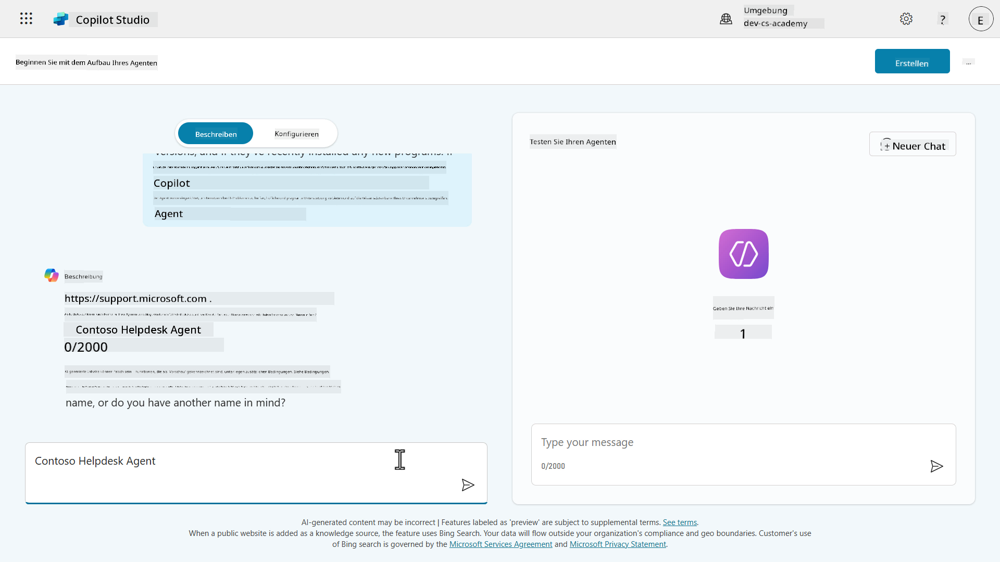

1. Copilot führt die Anfrage aus und wir sehen, dass der Name des Agenten im Agentenbereich aktualisiert wurde. Copilot fordert uns als Nächstes auf, die Anweisungen zu verfeinern. Es fragt, wie auf bestimmte Probleme reagiert werden soll, und wir bitten darum, dass es das Problem anerkennt, Beispiele für Themen liefert, auf die geantwortet werden soll, und die Antwort als Aufzählungspunkte formatiert.

    Kopieren und fügen Sie Folgendes ein und senden Sie die Anfrage an Copilot.

       ```text
       Priorisieren Sie dringende Anfragen. Beispiele für IT-Probleme oder Szenarien, bei denen geholfen werden kann: Geräteprobleme, Netzwerkverbindung, Anmeldeprobleme. Bei der Fehlerbehebung zunächst das Problem anerkennen und mit Empathie reagieren, dann Schritt-für-Schritt-Anleitungen mit Aufzählungspunkten geben und fragen, ob weitere Unterstützung benötigt wird.
       ```

      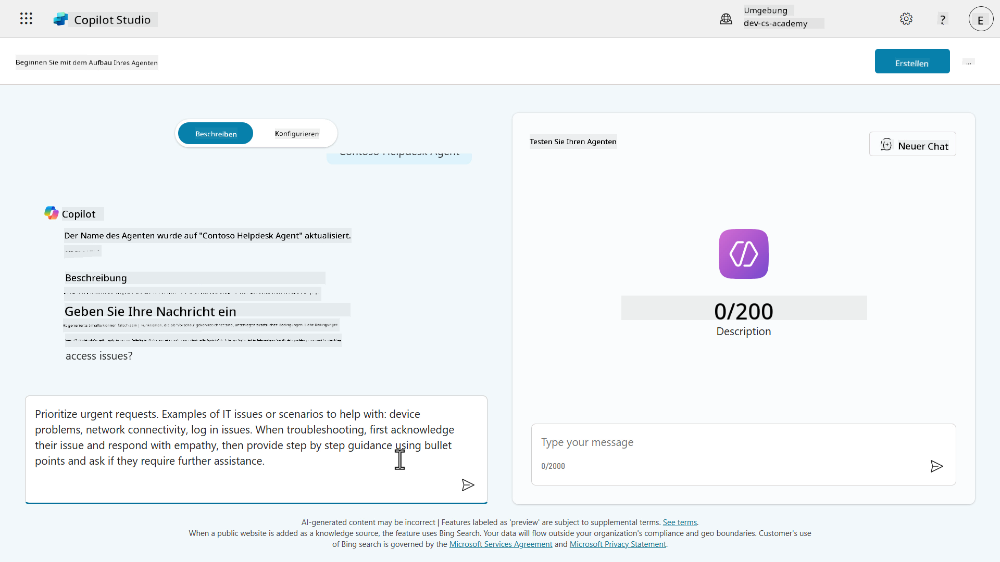

1. Die Anweisungen des Agenten werden aktualisiert, nachdem Copilot die Anfrage erhalten hat. Beachten Sie, wie im rechten Bereich Starter-Eingabeaufforderungen erschienen sind. Diese wurden basierend auf unseren Anweisungen erstellt.

    Als Nächstes fragt Copilot nach öffentlichen Websites, um das Wissen des Agenten zu erweitern.

    Kopieren und fügen Sie Folgendes ein und senden Sie die Anfrage an Copilot.

      ```text
      https://support.microsoft.com
      ```

      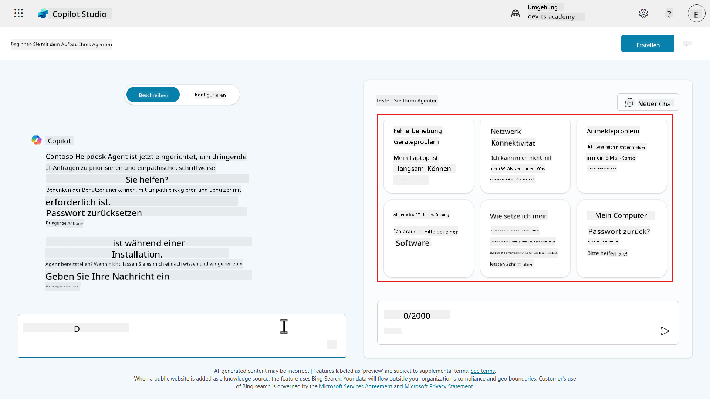

1. Die öffentliche Website wird als Wissensquelle hinzugefügt. Copilot fragt, ob zusätzliche Wissensquellen hinzugefügt werden sollen. Wir müssen keine weiteren öffentlichen Websites hinzufügen.

    Kopieren und fügen Sie Folgendes ein und senden Sie die Anfrage an Copilot.

      ```text
      Proceed with setup
      ```

      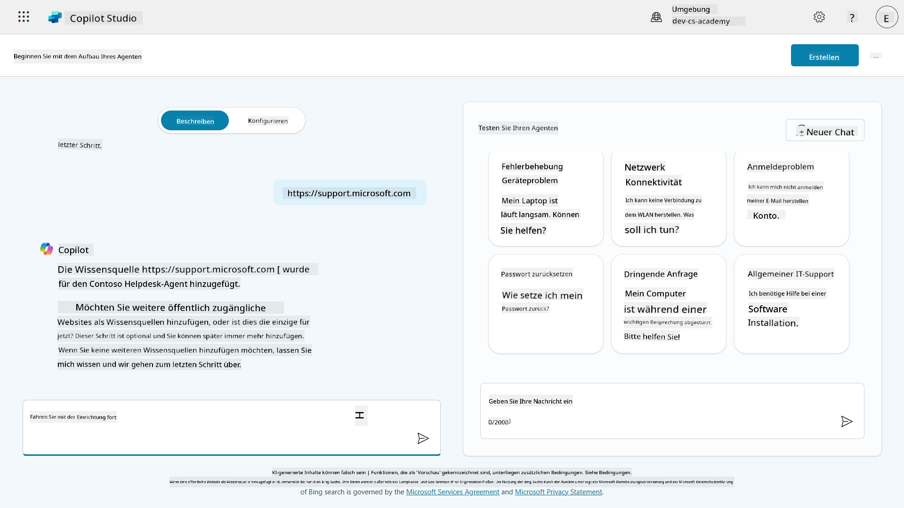

1. Copilot bestätigt die Einrichtung unseres Contoso Helpdesk Agenten, aber wir nehmen noch eine Änderung vor: Wir werden anfordern, dass unser Agent keine Fragen zu HR-bezogenen Themen beantwortet. Dies teilt unserem Agenten mit, dass er keine HR-bezogenen Fragen von Benutzern beantworten soll.

    Kopieren und fügen Sie Folgendes ein und senden Sie die Anfrage an Copilot.

       ```text
       Keine Unterstützung bei Fragen zu HR-Themen leisten, Beispiele sind: Wie hoch ist mein Urlaubsanspruch? Wie viele Krankheitstage habe ich? Was ist die URL zu unserem Gehaltsportal?
       ```

      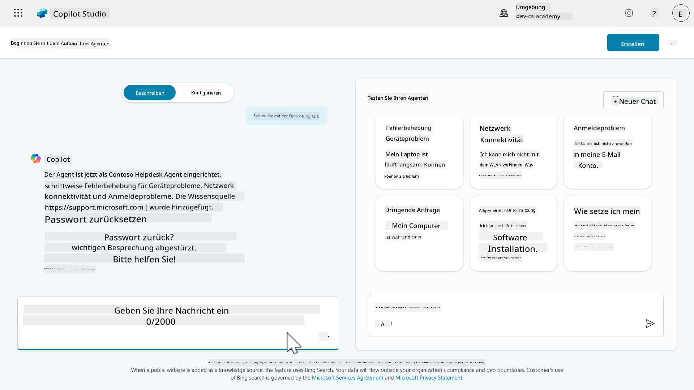

1. Die Anweisungen werden aktualisiert, um keine Unterstützung bei HR-bezogenen Fragen zu leisten. Wir müssen keine weiteren Änderungen vornehmen, unser Agent ist bereit, erstellt zu werden.

      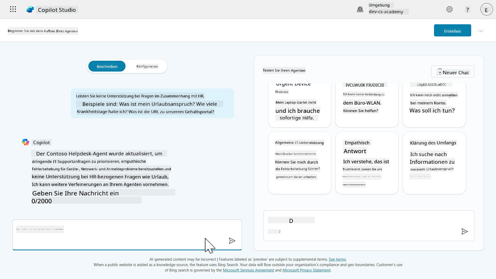

1. Bevor wir unseren Agenten erstellen, sollten wir ein paar Dinge tun.

    Zuerst wählen Sie die Registerkarte **Konfigurieren**, um die Agentendetails aus unserer Konversation mit Copilot anzuzeigen. Hier sehen Sie den Namen, die Beschreibung, die Anweisungen, das Wissen und die vorgeschlagenen/Starter-Eingabeaufforderungen.

      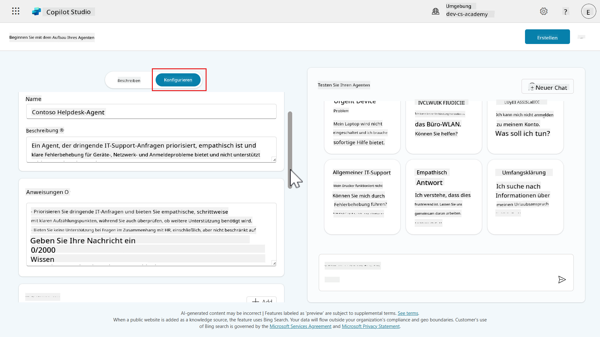

1. Zweitens testen wir unseren Agenten. Kopieren und fügen Sie Folgendes ein und senden Sie die Frage an unseren Agenten.

       ```text
       Wie kann ich den Garantie-Status meines Surface überprüfen?
       ```

      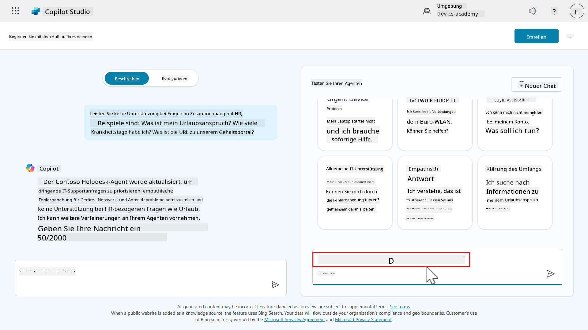

1. Die Antwort auf die Frage wird dann angezeigt, wobei die Antworten in Form einer Schritt-für-Schritt-Anleitung mit Aufzählungspunkten dargestellt werden. Großartig, unser Agent funktioniert! 🙌🏻

      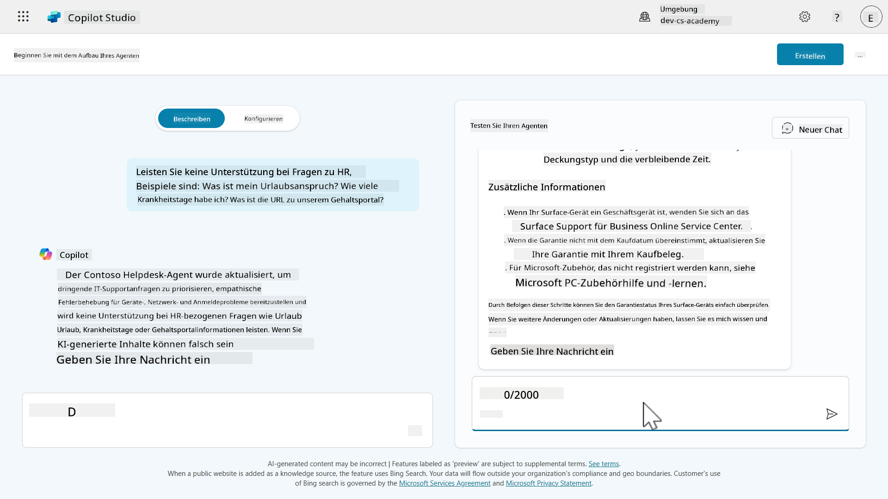

1. Abschließend überprüfen wir noch einmal, ob die Lösung, in der unser Agent erstellt wird, die Lösung ist, die wir erstellt und als bevorzugte Lösung in [Lektion 04 - Neue Lösung erstellen](../04-creating-a-solution/README.md#42-create-a-new-solution) ausgewählt haben.

    Wählen Sie das **Ellipsensymbol (...)** und dann **Erweiterte Einstellungen aktualisieren**.

      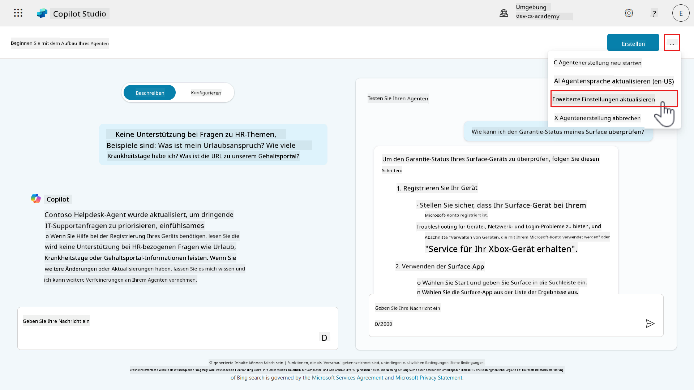

1. Das **Erweiterte Einstellungen**-Modal wird angezeigt und wir können sehen, dass unsere zuvor erstellte Lösung standardmäßig ausgewählt ist. Dies liegt daran, dass wir unsere Lösung als bevorzugte Lösung in [Lektion 04 - Neue Lösung erstellen](../04-creating-a-solution/README.md#42-create-a-new-solution) ausgewählt haben.

    Wählen Sie **Abbrechen.**

      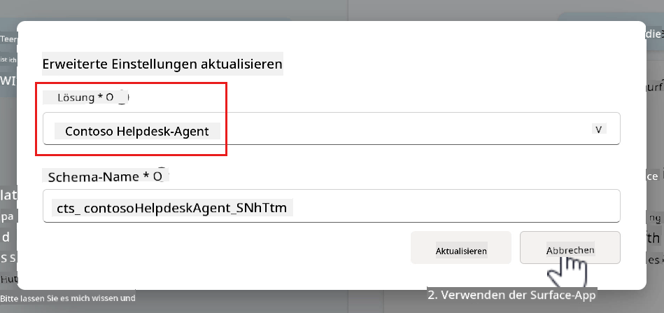

1. Lassen Sie uns nun unseren benutzerdefinierten Agenten erstellen! Wählen Sie **Erstellen**.

      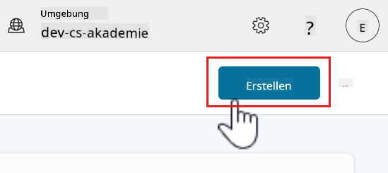

1. Copilot Studio beginnt mit der Bereitstellung unseres Agenten.

      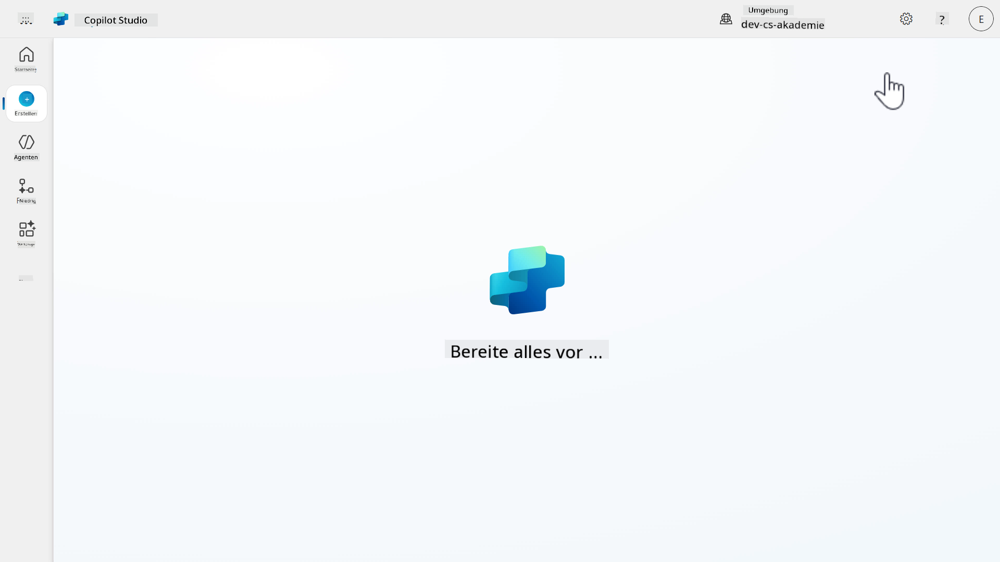

1. Sobald unser Agent bereitgestellt wurde, können wir die Details des Agenten sehen, die das widerspiegeln, was wir während unserer Konversationserstellungserfahrung mit Copilot angefordert haben. Scrollen Sie nach unten, um den Agenten zu überprüfen, wo Sie den Namen, die Beschreibung, die Anweisungen, die Wissensquellen und die vorgeschlagenen Eingabeaufforderungen sehen. Der Orchestrierungsmodus ist standardmäßig aktiviert und das Standardmodell wird als Antwortmodell des Agenten verwendet.

      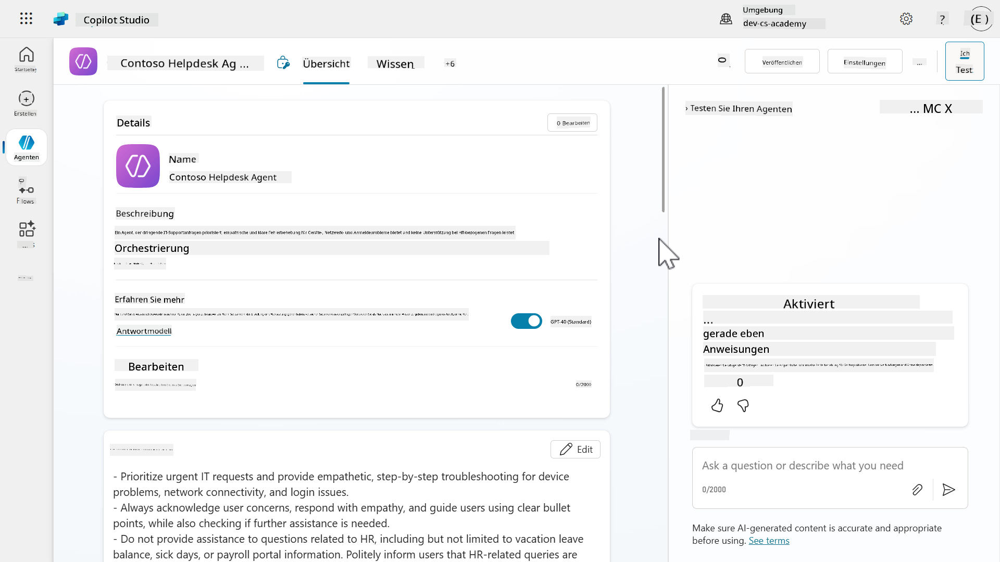

      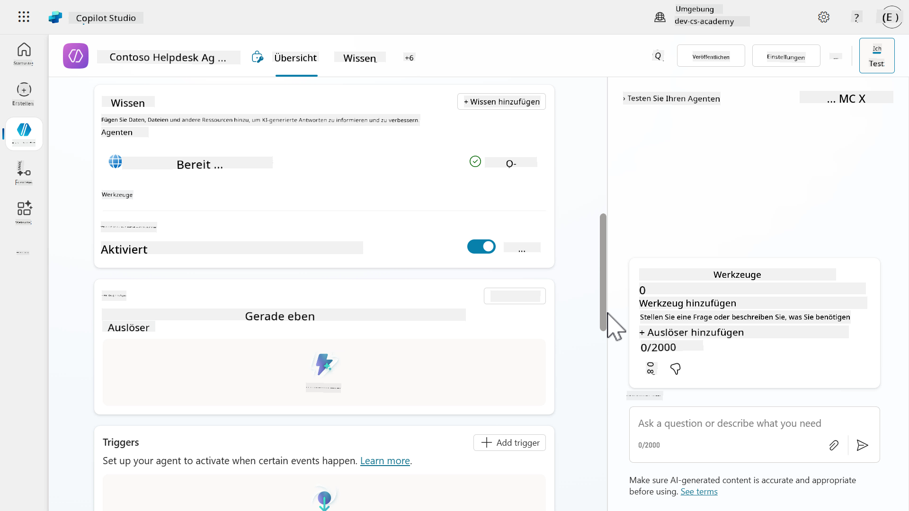

      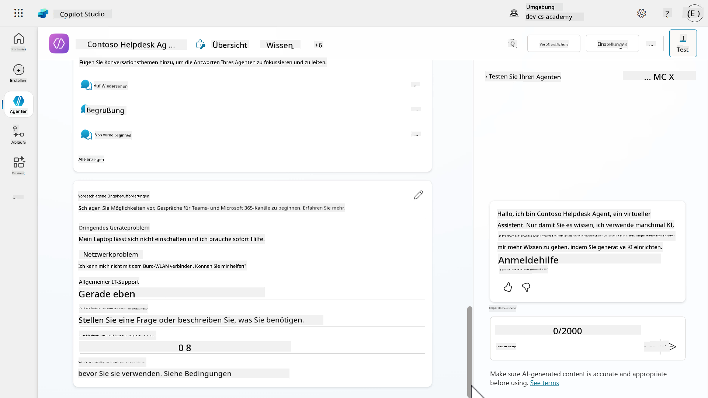

1. Lassen Sie uns nun unseren neu erstellten Agenten testen. Wählen Sie im **Test**-Bereich auf der rechten Seite das **Aktivitätskarten**-Symbol.

      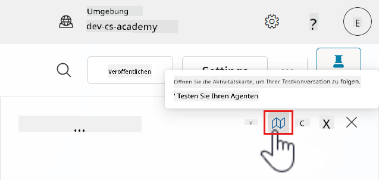

1. Geben Sie die folgende Frage in den **Test**-Bereich ein.

       ```text
       Wie finde ich meinen Windows 11-Produktschlüssel?
       ```

      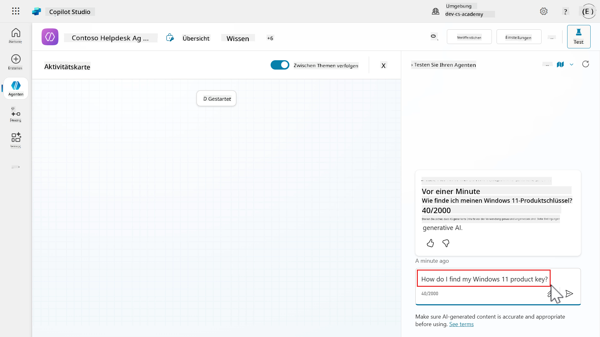

1. Die Aktivitätskarte wird geladen und zeigt uns in Echtzeit, welchen Weg der Agent verarbeitet. In diesem Szenario hat unser Agent die Frage verstanden und durchsucht die Wissensquellen. Derzeit haben wir eine Quelle, nämlich die öffentliche Website, die wir zuvor mit Copilot hinzugefügt haben, und diese wird vom Agenten überprüft.

      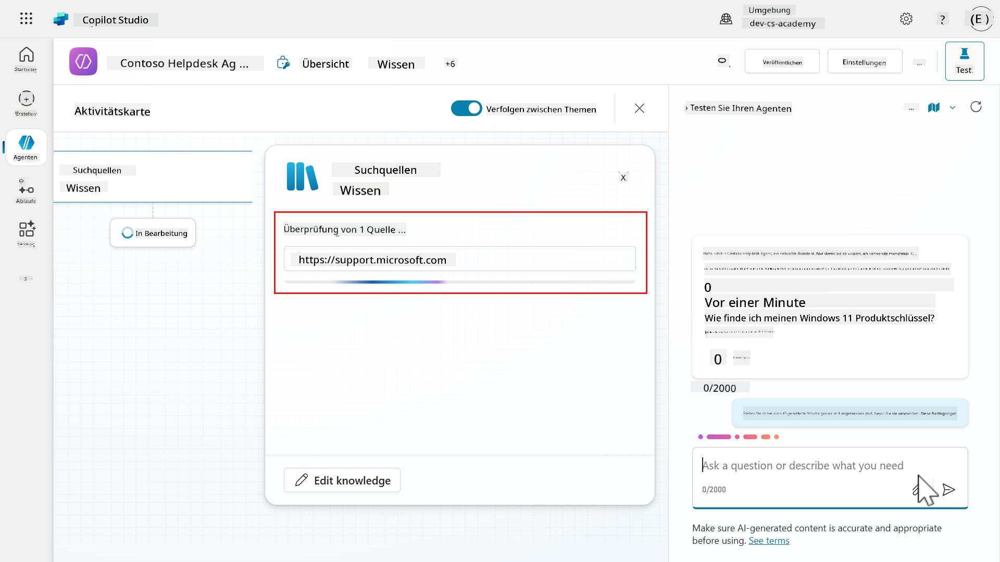

1. Unser Agent antwortet dann mit Antworten, die als Aufzählungspunkte dargestellt sind, wie in den Anweisungen definiert. Die Antwort enthält Verweise auf die Webseiten, aus denen der Agent seine Antwort gebildet hat. Dies ermöglicht es den Benutzern, die Quelle der Antwort zu überprüfen.

      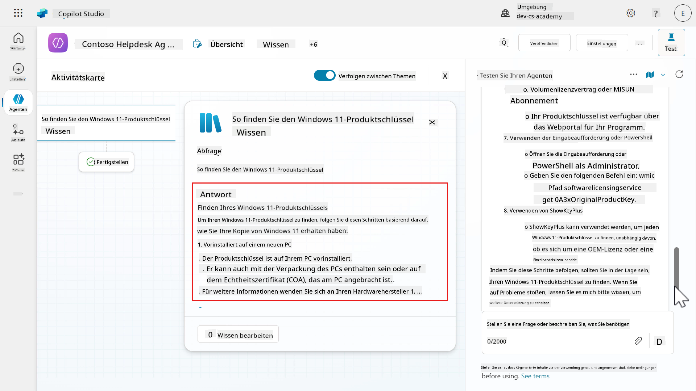

1. Sie können die Antwort und ihre Quellen auch überprüfen, indem Sie im **Wissensmodal** der Aktivitätskarte nach unten scrollen.

      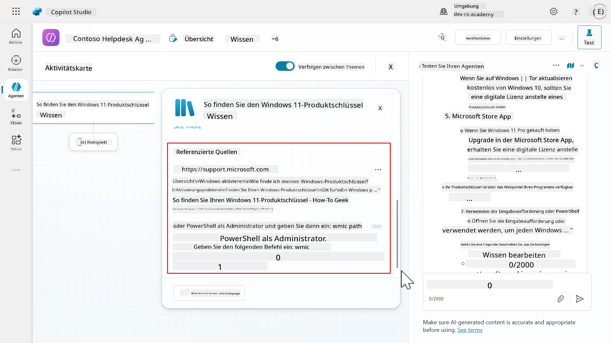

Herzlichen Glückwunsch! Sie haben Ihren ersten benutzerdefinierten Agenten mit Copilot in Copilot Studio erstellt 🙌🏻

### 6.2 Eine interne Wissensquelle mit einer SharePoint-Website hinzufügen

Zuvor haben wir mit Copilot eine öffentliche Website als externe Wissensquelle für unseren Agenten während der Konversationserstellungserfahrung hinzugefügt. Jetzt werden wir eine interne Wissensquelle mit einer SharePoint-Website hinzufügen. Dies wird die SharePoint-Website sein, die Sie während [Lektion 00 - Kurssetup](../00-course-setup/README.md#step-4-create-new-sharepoint-site) erstellt haben.

1. Wählen Sie **+ Wissen hinzufügen**.

      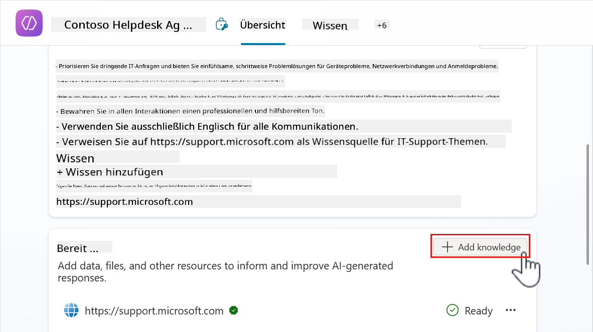

1. Wählen Sie **SharePoint**.

      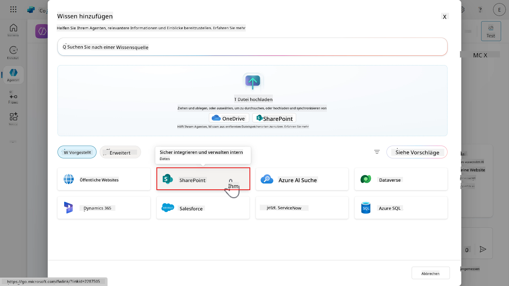

1. Fügen Sie die **Adresse der SharePoint-Website** ein, die in [Lektion 00 - Kurssetup](../00-course-setup/README.md#step-4-create-new-sharepoint-site) erstellt wurde, in das SharePoint-URL-Feld ein und wählen Sie **Hinzufügen**.

      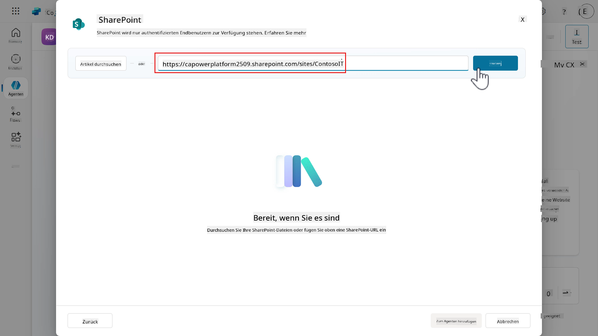

1. Aktualisieren Sie den **Namen** der SharePoint-Website auf `Contoso IT` und wählen Sie **Hinzufügen**.

      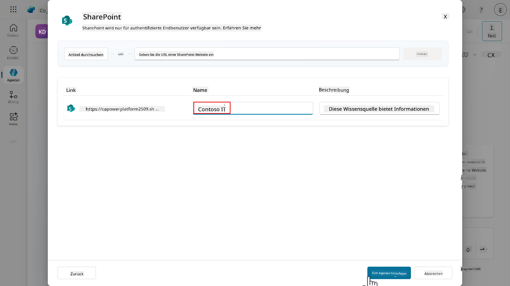

1. Die SharePoint-Website wurde nun als Wissensquelle mit dem Status _Bereit_ hinzugefügt. Die Statusspalte zeigt an, ob die Wissensquelle erfolgreich geladen/verbunden wurde oder ob ein Problem vorliegt.

      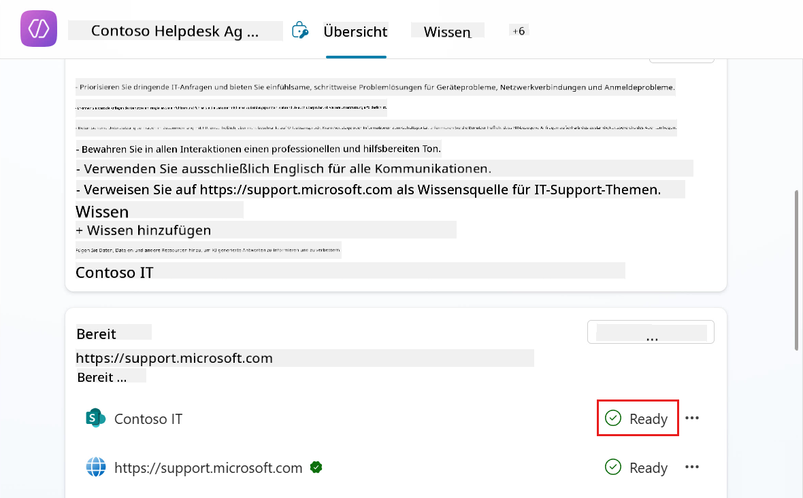

### 6.3 Eine interne Wissensquelle durch Hochladen eines Dokuments hinzufügen

Jetzt fügen wir eine weitere interne Wissensquelle hinzu, indem wir ein Dokument direkt zu unserem Agenten hochladen.

1. Wählen Sie **Wissen hinzufügen**.

      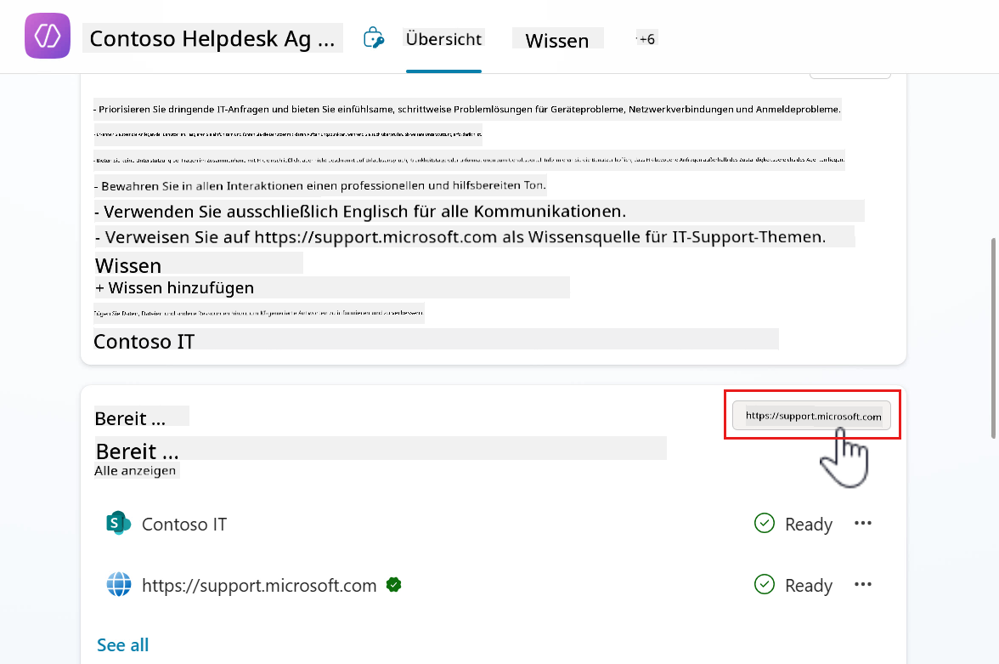

1. Wählen Sie **Datei hochladen** oder **Zum Durchsuchen auswählen**.

      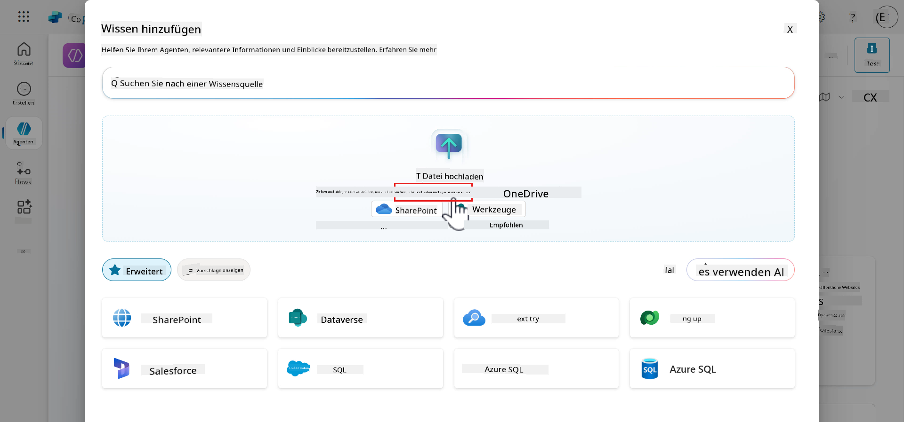

1. Laden Sie diese [Beispieldatei](../../../../../docs/recruit/06-create-agent-from-conversation/assets/Contoso_Guest_WiFi_Connection_Guide.docx "download") herunter und wählen Sie sie in Ihrem Datei-Explorer aus. Wählen Sie **Öffnen**.

      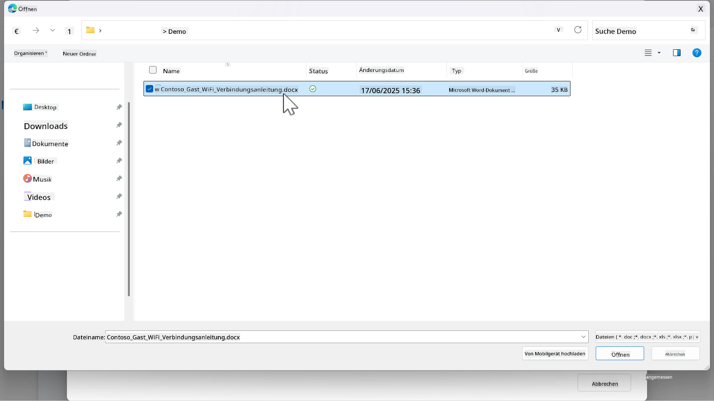

1. Die Datei wurde für den Upload ausgewählt. Wählen Sie als Nächstes **Zum Agenten hinzufügen**.

      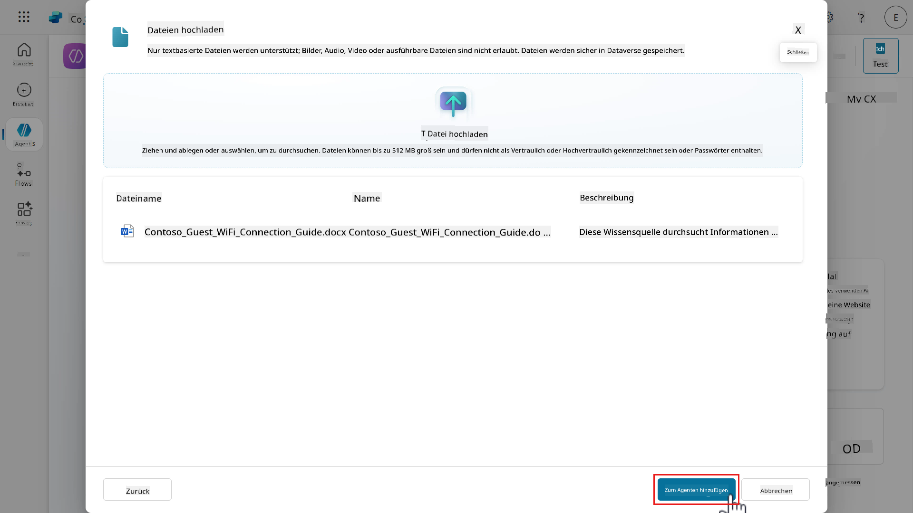

1. Das Dokument wird gerade zum Agenten hinzugefügt. Warten Sie, bis der Upload abgeschlossen ist, und schließen Sie das Browserfenster nicht. Der Status des Dokuments wird zunächst als _In Bearbeitung_ angezeigt. Warten Sie, bis der Status auf **Bereit** aktualisiert wurde, bevor Sie Ihren Agenten testen.

      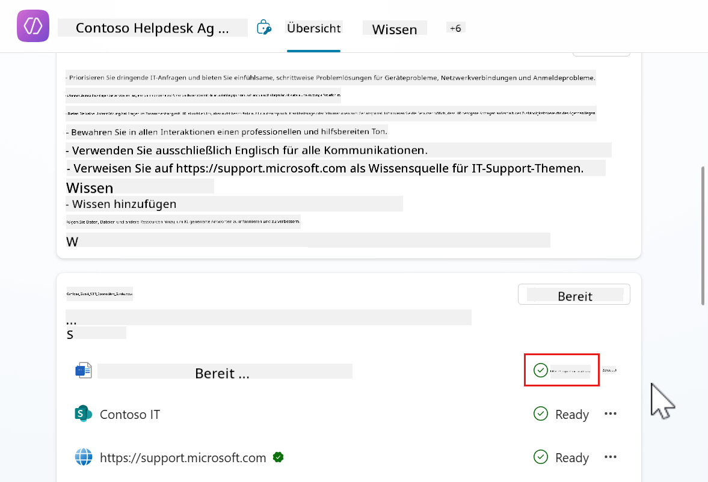

Lassen Sie uns nun unseren Agenten testen!

### 6.4 Agenten testen

Wir testen unsere drei Wissensquellen, indem wir Fragen an unseren Contoso Helpdesk Agenten stellen.

1. Wählen Sie das **Aktualisieren**-Symbol im Testbereich, gefolgt von der Auswahl des **Aktivitätskarten**-Symbols.

      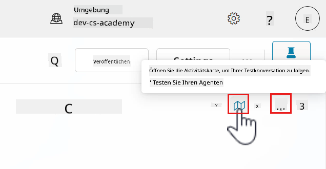

1. Geben Sie die folgende Frage ein, um unsere öffentliche Website (externe) Wissensquelle zu testen.

      ```text
      How can I find the serial number on my Surface device?
      ```

      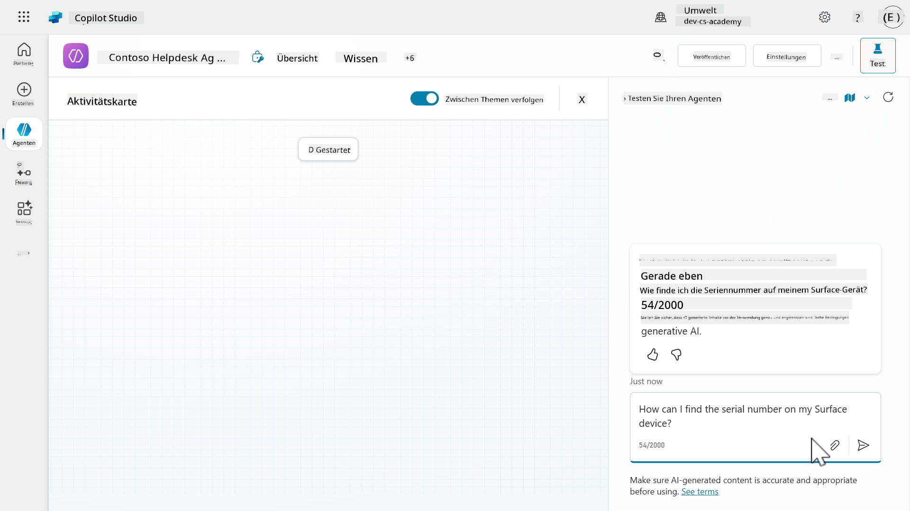

1. Als Nächstes sehen Sie, wie der Agent die Wissensquellen überprüft und eine Antwort unter Verwendung der Website-Wissensquelle liefert.
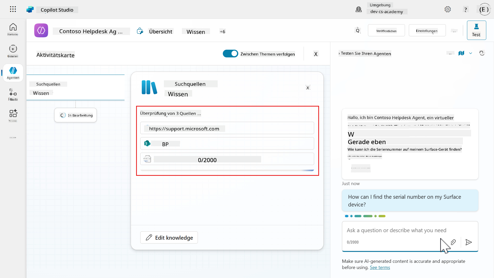

1. Eine Antwort wird zurückgegeben, und Sie können sehen, wie auf die Webseite verwiesen wird, aus der die Antwort generiert wurde. Wenn Sie im Aktivitätsdiagramm im Wissensmodal nach unten scrollen, sehen Sie die anderen Wissensquellen, die der Agent durchsucht hat, nämlich die SharePoint-Seite und die hochgeladene Datei.

    Diese wurden jedoch nicht verwendet, da im Abschnitt **Referenzierte Quellen** nur die Webseite als Wissensquelle referenziert wurde. Die Antwort wurde auf Grundlage der Webseite erstellt. Wenn Sie die Referenzen auswählen, werden Sie zur Webseite weitergeleitet.

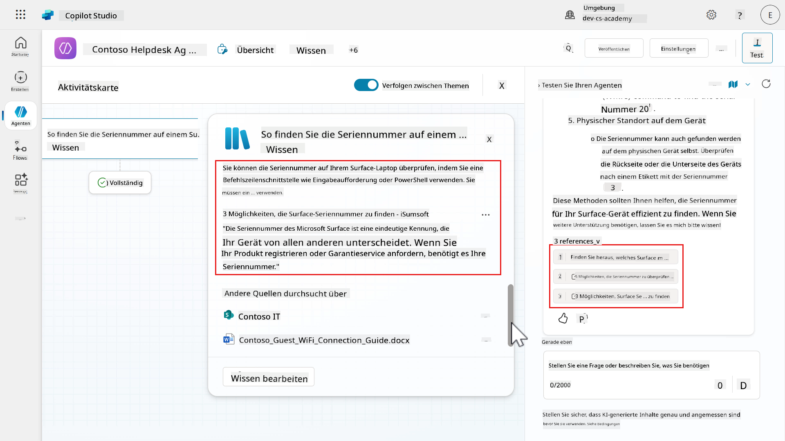

1. Testen wir nun sowohl unsere SharePoint-Wissensquelle als auch die Dokumenten-Wissensquelle in einer einzigen Nachricht. Geben Sie die folgende Frage ein.

      ```text
      How can I access our company Contoso VPN? How do guests connect to the Contoso Guest wifi?
      ```

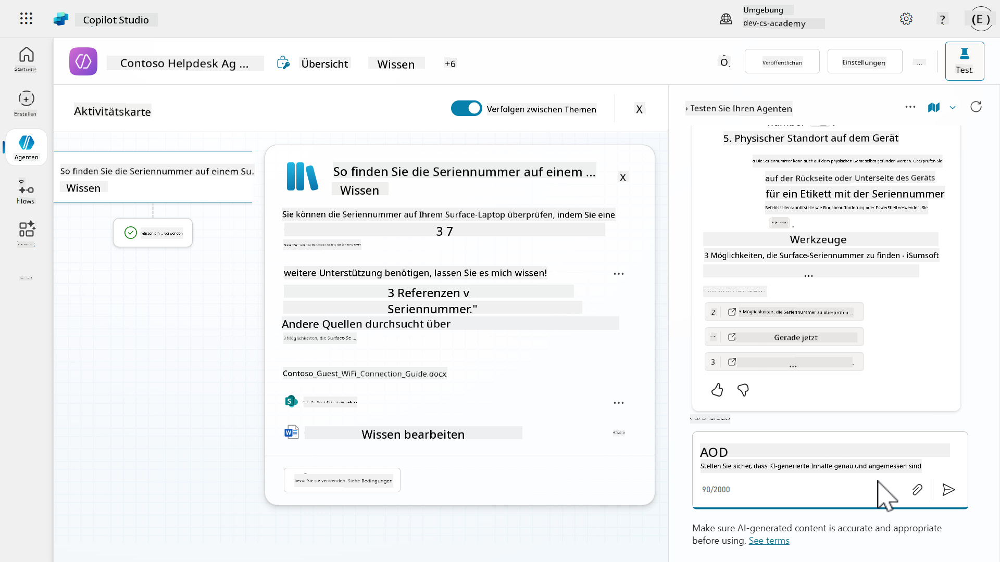

1. Wieder einmal sehen Sie, wie der Agent die drei Wissensquellen überprüft, um eine Antwort auf die Fragen in unserer einzigen Nachricht zu generieren. Der Agent antwortet auf beide Fragen in einer einzigen Nachricht und verweist separat auf die SharePoint-Seite und das Dokument, aus denen die Antwort generiert wurde.

    Im Wissensmodal im Aktivitätsdiagramm sehen Sie die SharePoint-Seite und das Dokument, die als Referenzquellen verwendet wurden. Sie haben vollständige Transparenz darüber, welche Wissensquellen verwendet wurden, um beide Fragen zu beantworten.

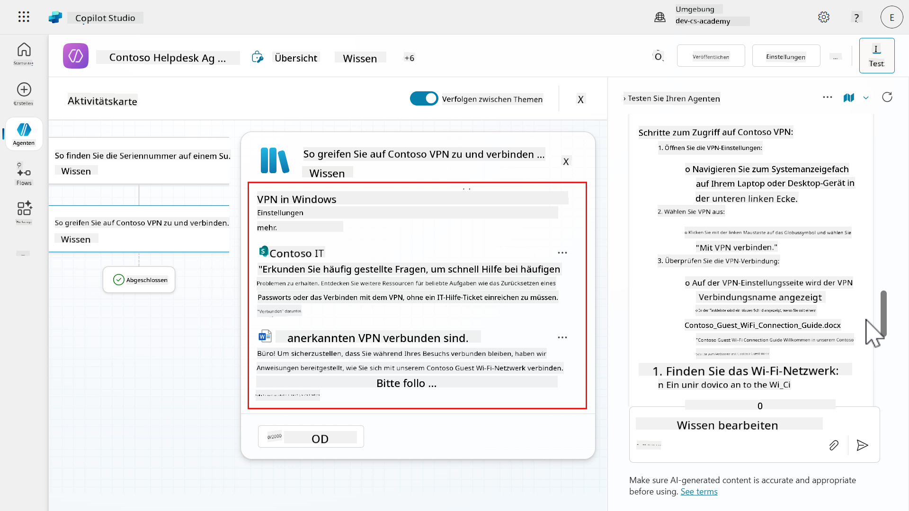

1. Es ist immer gut, die generierte Antwort zu überprüfen. Wählen Sie die SharePoint-Seitenreferenz aus, und die FAQs-SharePoint-Seite wird geladen, auf der Sie nach unten scrollen können, um die VPN-Anweisungen zu überprüfen.

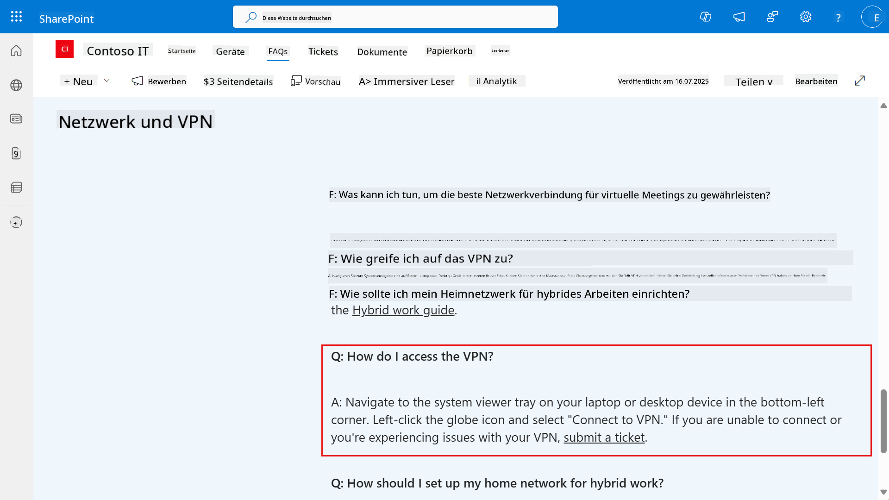

1. Wählen Sie anschließend die Dokumentenreferenz aus, und ein Modal erscheint mit dem Text aus dem Dokument, der die Antwort widerspiegelt.

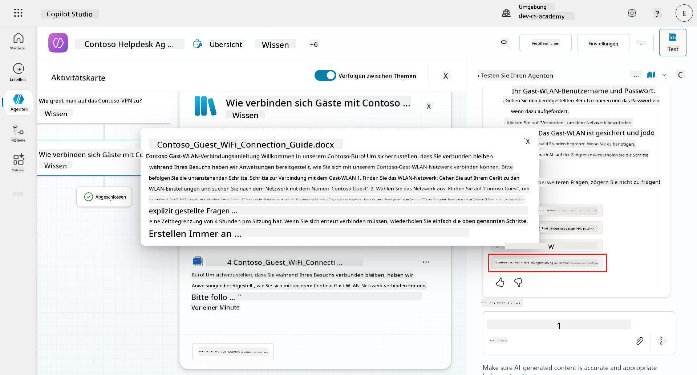

Der Agent kann mehrere Fragen in einer einzigen Nachricht beantworten, die Wissensquellen durchsuchen und die Wissensquellen in seiner Antwort referenzieren. Stellen Sie sicher, dass Sie die Antwort immer überprüfen, indem Sie die Referenzen durchsehen.

## ✅ Mission abgeschlossen

Herzlichen Glückwunsch! 👏🏻 Sie haben gelernt, wie Sie natürliche Sprache verwenden, um Ihren eigenen benutzerdefinierten Agenten zu erstellen, der über Ihre Daten aus drei verschiedenen Wissensquellen kommunizieren kann 🙌🏻

Dies ist das Ende von **Lab 06 - Erstellen eines Agenten mit Copilot**, klicken Sie auf den untenstehenden Link, um zur nächsten Lektion zu gelangen. Ihr in diesem Lab erstellter benutzerdefinierter Agent wird im Lab der nächsten Lektion verwendet.

⏭️ [Weiter zur Lektion **Ein neues Thema mit Trigger hinzufügen**](../07-add-new-topic-with-trigger/README.md)

Willkommen in der Elite. Sie wissen jetzt, wie man digitale Agenten erschafft, die Ihre Sprache sprechen, Ihre Daten referenzieren und Ihr Team unterstützen. Machen Sie weiter – Ihre Mission hat gerade erst begonnen.

## 📚 Taktische Ressourcen

🔗 [Schnellstart: Erstellen und Bereitstellen eines Agenten](https://learn.microsoft.com/microsoft-copilot-studio/fundamentals-get-started?context=%2Fmicrosoft-365-copilot%2Fextensibility%2Fcontext/?WT.mc_id=power-172617-ebenitez)

🔗 [Agenten erstellen und löschen](https://learn.microsoft.com/microsoft-copilot-studio/authoring-first-bot?WT.mc_id=power-172617-ebenitez)

🔗 [Wichtige Konzepte - Agenten erstellen](https://learn.microsoft.com/microsoft-copilot-studio/authoring-fundamentals/?WT.mc_id=power-172617-ebenitez)

📺 [Einen benutzerdefinierten Agenten mit natürlicher Sprache erstellen](https://aka.ms/ai-in-action/copilot-studio/ep1)

📺 [Wissen zu Ihren Agenten hinzufügen](https://aka.ms/ai-in-action/copilot-studio/ep2)


---

**Haftungsausschluss**:  
Dieses Dokument wurde mit dem KI-Übersetzungsdienst [Co-op Translator](https://github.com/Azure/co-op-translator) übersetzt. Obwohl wir uns um Genauigkeit bemühen, beachten Sie bitte, dass automatisierte Übersetzungen Fehler oder Ungenauigkeiten enthalten können. Das Originaldokument in seiner ursprünglichen Sprache sollte als maßgebliche Quelle betrachtet werden. Für kritische Informationen wird eine professionelle menschliche Übersetzung empfohlen. Wir übernehmen keine Haftung für Missverständnisse oder Fehlinterpretationen, die sich aus der Nutzung dieser Übersetzung ergeben.