<!--
CO_OP_TRANSLATOR_METADATA:
{
  "original_hash": "c04b3587170139bc23e3b5cfc24c89ac",
  "translation_date": "2025-10-17T18:58:41+00:00",
  "source_file": "docs/recruit/07-add-new-topic-with-trigger/README.md",
  "language_code": "de"
}
-->
# 🚨 Mission 07: Neues Thema mit Trigger und Knoten hinzufügen

## 🕵️‍♂️ CODENAME: `OPERATION BLEIB IM THEMA`

> **⏱️ Zeitfenster der Operation:** `~60 Minuten`

🎥 **Schau dir die Anleitung an**

[](https://www.youtube.com/watch?v=7iPAZaA8nJs "Schau dir die Anleitung auf YouTube an")

## 🎯 Missionsbeschreibung

Du hast einen Agenten erstellt. Er hört zu, lernt und beantwortet Fragen – aber jetzt wird es Zeit, taktischer zu werden. In dieser Mission tauchst du tief in die Technik ein und bringst deinem Agenten bei, wie er auf spezifische Eingaben präzise reagieren kann.

Mit Themen und Triggern kann dein Agent:

- Absichten erkennen

- Gespräche logisch lenken

- Variablen sammeln und speichern

- Abläufe auslösen und Aktionen durchführen

Du baust nicht nur Dialoge, sondern verdrahtest das Entscheidungszentrum deines Agenten. Willkommen im Neuralen Nexus.

## 🔎 Ziele

In dieser Mission lernst du:

1. Was Themen sind und welche Rolle sie bei der Strukturierung von Gesprächen für deinen Agenten spielen
1. Die Anatomie von Themen, einschließlich Trigger-Phrasen und Gesprächsknoten
1. Verschiedene Arten von Gesprächsknoten und wie man Power Fx für dynamische Logik verwendet
1. Eigene Themen von Grund auf erstellen, um spezifische Benutzeranfragen und Aufgaben zu bearbeiten
1. Ein funktionales Thema erstellen, das mit SharePoint-Daten über Konnektoren und Tools verbunden ist

## 🤔 Was ist ein Thema?

Ein Thema ist ein strukturiertes Gespräch, das deinem Agenten hilft, auf spezifische Benutzerfragen oder Aufgaben zu reagieren. Stell dir ein Thema als Mini-Gespräch oder Aufgabe vor, die dein Agent bearbeiten kann. Jedes Thema ist darauf ausgelegt, auf eine bestimmte Benutzerfrage oder Anfrage zu reagieren.

### 🌌 Zweck eines Themas

Es gibt drei häufige Zwecke für Themen, basierend auf den Bedürfnissen der Benutzer:

**Informativ** – beantwortet Fragen wie:

- `Was ist …?`
- `Wann wird …?`
- `Warum …?`
- `Kannst du mir sagen …?`

**Aufgabenerfüllung** – hilft Benutzern, _etwas zu tun_:

- `"Ich möchte …"`
- `"Wie mache ich …?"`
- `"Ich brauche …?"`

**Fehlerbehebung** – löst Probleme:

- `Etwas funktioniert nicht …`
- `Ich bekomme eine Fehlermeldung …`
- `Ich sehe etwas Unerwartetes …?`

Du kannst auch Themen für unklare Fragen erstellen, wie `Ich brauche Hilfe`, die Benutzer um weitere Details bitten, bevor sie fortfahren.

## 🐦 Warum sind Themen nützlich?

Themen helfen dir,

- Das Wissen deines Agenten zu organisieren.

- Gespräche natürlich wirken zu lassen.

- Benutzerprobleme effektiv zu lösen.

## 🪺 Arten von Themen

1. **Systemthemen** – diese sind eingebaut und behandeln allgemeine Ereignisse wie:
    - Ein Gespräch beginnen
    - Ein Gespräch beenden
    - Fehler behandeln
    - Benutzer auffordern, sich anzumelden
    - An einen menschlichen Agenten weiterleiten

1. **Benutzerdefinierte Themen** – diese erstellst du, um spezifische Aufgaben oder Fragen zu bearbeiten, wie:
    - Urlaubsantrag eines Mitarbeiters
    - Anfrage für ein neues oder Ersatzgerät

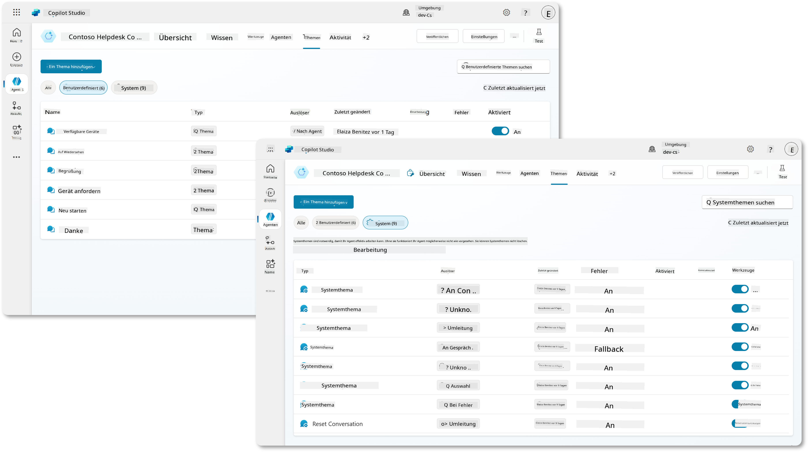

## 🧬 Anatomie eines Themas

Jedes Thema enthält normalerweise Folgendes.

### 🗣️ Trigger-Phrasen

Das sind Wörter oder Sätze, die Benutzer sagen könnten, um das Thema zu starten.

**Beispiele:**

Für ein Urlaubsantrag-Thema könnten Trigger-Phrasen sein:

- `Ich möchte Urlaub beantragen`
- `Urlaub beantragen`
- `Freizeit beantragen`
- `Wie reiche ich einen Urlaubsantrag ein?`

Für ein Geräteanfrage-Thema könnten Trigger-Phrasen sein:

- `Ich brauche ein neues Gerät`
- `Kann ich ein Gerät anfordern?`
- `Kannst du mir bei einer Geräteanfrage helfen?`

### 💬 Gesprächsknoten

Ein Thema besteht aus Knoten, die Schritte sind, denen der Agent folgt, sobald das Thema ausgelöst wird. Du verbindest diese Schritte, um einen Gesprächsfluss zu erstellen, dem dein Agent folgt, wenn er mit Benutzern interagiert.

Stell dir diese als Anweisungen oder Aktionen vor, wie:

- Den Benutzer Fragen stellen
- Nachrichten senden
- Einen externen Dienst wie ein Urlaubsmanagementsystem aufrufen
- Variablen setzen oder überprüfen
- Bedingungen verwenden, um das Gespräch zu verzweigen
- Zu einem anderen Thema weiterleiten

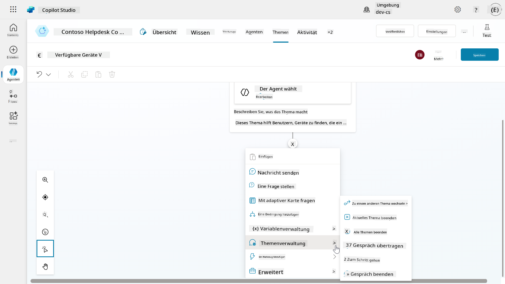

Die folgenden sind die Hauptarten von Knoten, die du einem Agenten hinzufügen kannst:

#### Eine Nachricht senden

- **Zweck** – sendet eine Nachricht an den Benutzer.
- **Beispiel** – `Danke für deine Anfrage! Ich helfe dir dabei.`

Dieser Knoten ermöglicht es deinem Agenten, Nachrichten an Benutzer zu senden, die einfacher Text oder reichhaltige Inhalte wie Bilder, Videos, Karten, Schnellantworten und adaptive Karten sein können.

Du kannst Nachrichten personalisieren, mehrere Varianten für Abwechslung hinzufügen und sogar die Sprachausgabe für sprachaktivierte Kanäle anpassen.

!!! tip
    Stell dir das als "Sag etwas"-Block vor, der deinem Agenten hilft, klar und interaktiv mit Benutzern zu kommunizieren.

#### Eine Frage stellen

- **Zweck** – stellt dem Benutzer eine Frage und wartet auf dessen Antwort.
- **Beispiel** – `Was sind deine Urlaubsdaten?`

Dieser Knoten wird verwendet, um Benutzer während eines Gesprächs nach spezifischen Informationen zu fragen und ihre Antworten in Variablen für die spätere Verwendung zu speichern.

Du kannst den Fragetyp wie Texteingabe anpassen oder Entitäten verwenden, um eine definierte Liste von Werten zu erstellen, aus der der Benutzer auswählen kann, und festlegen, wie der Agent reagieren soll, wenn der Benutzer eine ungültige Antwort gibt oder die Frage überspringt.

Er unterstützt auch reichhaltige Inhalte wie Bilder und Schnellantworten und ermöglicht es dir, Validierung, erneutes Fragen und Unterbrechungseinstellungen zu optimieren, um den Gesprächsfluss reibungslos zu gestalten.

!!! tip
    Stell dir das als "Fragen und Zuhören"-Block vor, der deinem Agenten hilft, strukturiert mit Benutzern zu interagieren.

#### Mit adaptiver Karte fragen

- **Zweck** – sendet eine reichhaltige, interaktive Karte mit JSON.
- **Beispiel** – eine Karte, die einen Kalender-Datumswähler anzeigt, damit ein Benutzer ein Datum auswählen kann.

Dieser Knoten zeigt reichhaltige, interaktive Karten, die Benutzer ausfüllen und einreichen können, wie Formulare mit Textfeldern, Schaltflächen und Bildern. Er erfasst die Eingaben des Benutzers und speichert sie in Variablen, die dein Agent später im Gespräch verwenden kann.

!!! tip
    Stell dir das als anpassbaren "Formular-Ersteller"-Block vor, der deinen Agenten ansprechender macht und ihm ermöglicht, detaillierte Informationen von Benutzern zu sammeln.

#### Eine Bedingung hinzufügen

- **Zweck** – fügt Logik zum Gespräch hinzu. Es überprüft etwas und entscheidet, was als Nächstes zu tun ist.
- **Beispiel** – wenn der Benutzer `Ja` sagt, gehe zum nächsten Schritt. Wenn `Nein`, beende das Gespräch.

Dieser Knoten erstellt Entscheidungspunkte im Gesprächsfluss deines Agenten, indem er überprüft, ob eine Variable bestimmte Kriterien erfüllt. Je nachdem, ob die Bedingung wahr oder falsch ist, folgt der Agent unterschiedlichen Pfaden.

!!! tip
    Stell dir das als "Wenn-Dann"-Block vor, der deinem Agenten hilft, Entscheidungen basierend auf Benutzereingaben oder gespeicherten Daten in Variablen zu treffen.

#### Variablenverwaltung

- **Zweck** – speichert oder löscht Informationen (genannt Variablen) während des Gesprächs.
- **Beispiel** – speichert das Datum, das der Benutzer im Knoten "Frage stellen" ausgewählt hat, der eine adaptive Karte anzeigt.

Dieser Knoten ermöglicht es dir, Informationen während eines Gesprächs zu speichern und zu verwalten, wie den Namen, die Antwort oder die Präferenzen eines Benutzers. Du kannst verschiedene Arten von Variablen verwenden, wie Text, Zahlen oder Daten, und sie können auf ein einzelnes Thema beschränkt, über Themen hinweg geteilt (global) oder sogar aus dem System oder der Umgebung abgerufen werden.

!!! tip
    Stell dir das als "Erinnerungsbox" vor, die deinem Agenten hilft, Informationen zu speichern und sie während des Gesprächs mit dem Benutzer zu verwenden.

#### Themenverwaltung

- **Zweck** – verschiebt das Gespräch zu einem anderen Thema oder Schritt innerhalb des Themas, überträgt das Gespräch oder beendet das Thema oder Gespräch.
- **Beispiel** – Weiterleitung zu einem Thema "Urlaubsrichtlinien".

Dieser Knoten ermöglicht es deinem Agenten, von einem Thema zu einem anderen zu springen, ohne das Gespräch neu zu starten, das Thema zu beenden, das Gespräch zu übertragen oder zu beenden oder zu einem anderen Schritt innerhalb desselben Themas zu wechseln. Er hilft, Benutzer durch verschiedene Teile des Gesprächsflusses zu führen, indem er reibungslos zwischen Themen wechselt, und du kannst Variablen zwischen ihnen übergeben, um den Kontext beizubehalten.

!!! tip
    Stell dir das als "Gehe zu einem anderen Abschnitt/Schritt"-Block vor, der deinem Agenten hilft, flexibel mit Benutzern zu chatten.

#### Ein Tool hinzufügen

- **Zweck** – verbindet mit Tools wie Konnektoren, Agentenabläufen, Eingabeaufforderungen, benutzerdefinierter Suche, Suchanfragen, Fähigkeiten, Model Context Protocol.
- **Beispiel** – Agentenablauf, der nach Einreichung des Urlaubsantrags durch den Benutzer ausgeführt wird.

Dieser Knoten gibt deinem Agenten die Möglichkeit, mit externen Systemen zu interagieren oder spezifische Aufgaben auszuführen, wie E-Mails senden, Wetter prüfen oder auf Datenbanken zugreifen. Du kannst Tools mit eingebauten Konnektoren, benutzerdefinierten APIs, Agentenabläufen, Eingabeaufforderungen oder durch Verbindung zu Model Context Protocol (MCP)-Servern hinzufügen und sogar _grafische Benutzeroberflächen_-Automatisierung für Desktop-Apps über das Computer-Tool nutzen.

!!! tip
    Stell dir Tools als "Aktionsblöcke" vor, die deinem Agenten Superkräfte verleihen, Dinge über das _Chatten_ hinaus zu tun, wie eine API aufzurufen, einen Prozess auszuführen oder Benutzereingaben automatisch zu sammeln.

#### Generativer Antwortknoten

- **Zweck** – verwendet ein großes Sprachmodell, um natürliche, menschenähnliche Antworten basierend auf der Frage des Benutzers und verbundenen Daten zu generieren.
- **Beispiel** – verwendet die verbundene Wissensquelle, die Informationen zu Urlaubsansprüchen enthält, um Benutzerfragen zu Urlaubsanträgen zu beantworten.

Dieser Knoten ermöglicht es deinem Agenten, auf Benutzerfragen mit Informationen aus verschiedenen Wissensquellen zu antworten, wie Websites, Dokumenten, SharePoint oder benutzerdefinierten Daten. Er kann als Fallback verwendet werden, wenn kein passendes Thema gefunden wird, oder innerhalb eines Themas, um detailliertere, dynamische Antworten basierend auf spezifischen Quellen zu geben, die du für deinen Agenten konfiguriert hast.

!!! tip
    Stell dir das als "intelligenten Antwortblock" vor, der deinem Agenten hilft, hilfreiche, genaue Antworten zu geben, indem er vertrauenswürdige Inhalte durchsucht, die du definierst.

#### HTTP-Anfrageknoten

- **Zweck** – verbindet deinen Agenten mit externen Systemen, indem API-Aufrufe (zum Beispiel `GET` oder `POST`) gesendet werden, um Daten abzurufen oder zu aktualisieren.
- **Beispiel** – wenn ein Benutzer nach seinem Urlaubsanspruch fragt, führt der Agent eine `GET`-Anfrage an das Urlaubsmanagementsystem aus, extrahiert die `remainingLeaveDays` aus der API-Antwort und antwortet dem Benutzer mit dem Wert.

Dieser Knoten ermöglicht es deinem Agenten, sich mit externen Systemen zu verbinden, indem REST-API-Aufrufe wie `GET` oder `POST` gesendet werden. Du kannst die Anfrage mit Headern, Body-Inhalten und sogar Power Fx anpassen, um dynamische Daten einzubeziehen, und die Antwort in Variablen speichern, um sie später im Gespräch zu verwenden.

!!! tip
    Stell dir das als "Informationen abrufen"-Block vor, der deinem Agenten hilft, mit anderen Diensten zu kommunizieren, wie Benutzerdetails abzurufen oder Daten an ein anderes System zu senden.

#### Ein Ereignis senden

- **Zweck** – ermöglicht es deinem Agenten, nicht-nachrichtenbezogene Aktionen, wie Systemaktualisierungen oder Tool-Trigger, an den Client oder Kanal zu senden, um Aufgaben auszuführen.
- **Beispiel** – reagiert darauf, dass ein Benutzer einem Chat beitritt, indem eine Willkommensnachricht angezeigt wird.

Dieser Knoten ermöglicht es deinem Agenten, nicht-nachrichtenbezogene Aktionen an externe Systeme oder Kanäle zu senden, die dann entscheiden, wie sie reagieren. Du gibst jedem Ereignis einen Namen und hängst einen Wert an, der eine einfache Zahl oder ein Text, eine Variable oder eine Power Fx-Formel sein kann, und es wird als JSON-Objekt gesendet.

!!! tip
    Stell dir das als "stiller Trigger"-Block vor, der deinem Agenten hilft, Dinge im Hintergrund zu erledigen oder mit externen Tools zu kommunizieren, ohne dass ein Benutzer etwas sagen muss.

## 🏋🏻‍♀️ Power Fx in deinen Knoten verwenden

In Copilot Studio ist Power Fx eine Low-Code-Programmiersprache, die verwendet wird, um deinem Agenten Logik und dynamisches Verhalten hinzuzufügen. Es ist dieselbe Sprache, die in Microsoft Power Apps verwendet wird, und sie ist so konzipiert, dass sie einfach und Excel-ähnlich ist, was sie für Entwickler und Nicht-Entwickler leicht zugänglich macht.

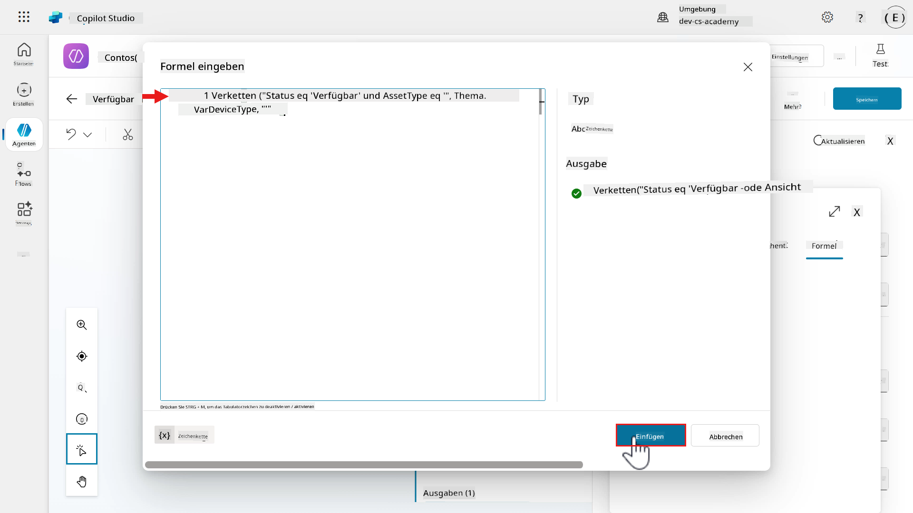

### Was Power Fx in Themen leisten kann

- Variablen setzen und manipulieren
      - Beispiel: `Set(userName, "Adele Vance")`
- Bedingungen erstellen
      - Beispiel: `If(score > 80, "Bestanden", "Nicht bestanden")`
- Daten formatieren und transformieren
      - Beispiel: `Text(DateValue, "dd/mm/yyyy")`

### Warum Power Fx verwenden?

- **Flexibel:** du kannst Logik erstellen, ohne vollständige Codezeilen zu schreiben.

- **Vertraut:** wenn du Excel-Formeln verwendet hast, fühlt es sich sehr ähnlich an.

- **Leistungsstark:** es ermöglicht dir, Gespräche zu personalisieren, Eingaben zu validieren und zu steuern, wie sich dein Agent basierend auf Benutzerdaten verhält.

## 🏗️ Wie erstelle und bearbeite ich Themen?

Es gibt zwei Möglichkeiten, wie du Themen für deine Agenten erstellen und bearbeiten kannst.

### 1. Von Grund auf neu erstellen

Dies ermöglicht es dir, benutzerdefinierte Gesprächsflüsse von Grund auf zu erstellen, und du kannst Knoten nach Bedarf hinzufügen oder entfernen, wenn du dein Thema bearbeitest.

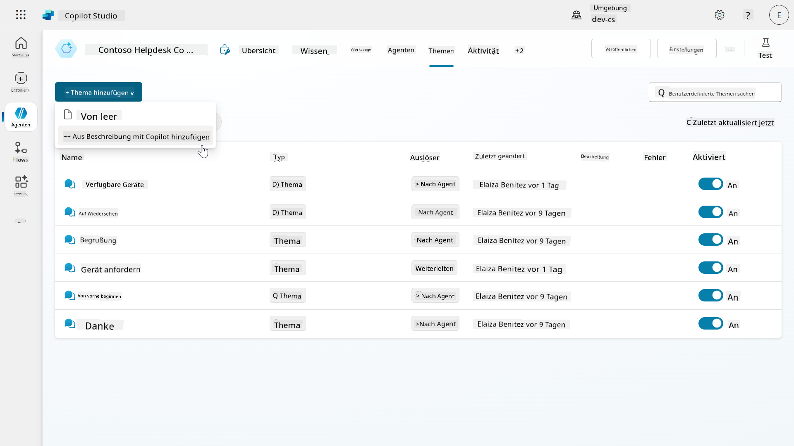

#### Warum das nützlich ist

- Es gibt dir vollständige Kontrolle darüber, wie dein Agent reagiert.
- Du kannst Logik mit Variablen, Power Fx und Bedingungen anpassen.
- Es ist perfekt, um maßgeschneiderte Erlebnisse für spezifische Geschäftsanforderungen zu erstellen.

### 2. Mit Copilot erstellen
Dies ermöglicht Ihnen, mit natürlicher Sprache zu beschreiben, was Sie möchten, und Copilot erstellt die Konversation für Sie. Dasselbe gilt beim Bearbeiten Ihres Themas: Verwenden Sie natürliche Sprache, und Copilot überprüft und modifiziert das Thema für Sie.

#### Was Copilot unterstützt

- Kann erstellen und bearbeiten:
      - Nachrichtenknoten
      - Fragenknoten
      - Bedingungsknoten
- Unterstützt keine erweiterten Einstellungen wie das erneute Auffordern des Benutzers bei Nichtantwort oder das Verwalten von Unterbrechungen während einer Frage. Diese Einstellungen können bei Bedarf weiterhin manuell angepasst werden.

#### Warum das nützlich ist

- Beschleunigt die Entwicklung mit KI-Unterstützung.
- Ermöglicht Ihnen, sich auf Logik und Benutzererfahrung zu konzentrieren, anstatt sich mit wiederholten Setups zu beschäftigen.
- Macht es einfacher, Konversationsabläufe mit minimalem Aufwand zu iterieren und zu verbessern.

#### ✨ Beispielaufforderungen

- **Ein Thema erstellen**
      - `Akzeptiere den Namen, das Alter und das Geburtsdatum eines Benutzers und wiederhole dann seine Antworten`
      - `Sammle die Straßenadresse, den Bundesstaat und die Postleitzahl eines Benutzers. Der Benutzer sollte jede Frage bis zu 4 Mal wiederholen können`

- **Ein Thema bearbeiten**
      - `Füge eine Frage hinzu, die nach dem Geburtsdatum des Benutzers fragt`
      - `Fasse gesammelte Informationen in einer Adaptive Card zusammen.`

## 👩🏻‍🎨 OK, wie entwerfe ich Themen für meinen Agenten?

### 🧙🏻‍♂️ Schritt 1 - Verstehen, was Benutzer benötigen

Beginnen Sie damit, häufige Fragen oder Aufgaben zu identifizieren, die Benutzer Ihrem Agenten stellen werden. Diese könnten sein:

- Fragen, die Benutzer oft stellen, wie `Was sind meine Ansprüche auf Krankheitstage?`
- Häufige Aufgaben, die Benutzer erledigen möchten, wie das Einreichen eines Formulars
- Probleme, die Benutzer häufig haben, wie Login-Probleme

### 📦 Schritt 2 - Szenarien gruppieren

Organisieren Sie die Benutzerbedürfnisse in drei Kategorien basierend auf dem zuvor Gelernten - dem Zweck eines Themas:

- Informativ - Der Benutzer möchte etwas wissen
- Aufgabenabschluss - Der Benutzer möchte etwas tun
- Problemlösung - Der Benutzer benötigt Hilfe bei der Lösung eines Problems

### 🗺️ Schritt 3 - Konversation skizzieren

Skizzieren Sie einen einfachen Konversationsablauf, wie der Agent reagieren sollte:

- Beginnen Sie mit einer Begrüßung oder Bestätigung
- Stellen Sie Folgefragen, um Details zu erhalten
- Geben Sie Antworten oder führen Sie Aktionen aus

!!! tip
    Halten Sie die Konversation kurz und fokussiert. Fragen Sie nur das Nötigste.

### 🔀 Schritt 4 - Unterschiedliche Konversationstypen handhaben

Entwerfen Sie für beide:

- **Einzelturn** - eine Frage, eine Antwort

- **Mehrturn** - eine Hin-und-Her-Konversation mit Folgefragen

Beispiel:

- Benutzer: `Ich möchte Urlaub beantragen.`

- Agent: `Natürlich! Ab welchem Datum möchten Sie Ihren Urlaub beginnen?`

- Benutzer: `15. Juli`

- Agent: `Verstanden. Und wann endet Ihr Urlaub?`

- Benutzer: `22. Juli.`

- Agent: `Danke! Was ist der Grund für Ihren Urlaub?`

- Benutzer: `Familienurlaub.`

- Agent: `Danke für die Details. Ich habe Ihren Urlaubsantrag vom 15. bis 22. Juli für einen Familienurlaub eingereicht. Sie erhalten bald eine Bestätigung.`

### 🤖 Schritt 5 - KI für unerwartete Fragen nutzen

Auch wenn Sie ein Thema für Urlaubsanträge entworfen haben, könnten Benutzer Fragen stellen, die nicht direkt abgedeckt sind. Hier kommt das KI-Feature wie das _Conversational boosting_ Systemthema ins Spiel.

Dieses Thema enthält einen generativen Antwortknoten, der es Ihrem Agenten ermöglicht, sofort verbundene Wissensquellen zu nutzen. Alle Wissensquellen, die auf Agentenebene hinzugefügt werden, sind automatisch im generativen Antwortknoten innerhalb des _Conversational boosting_ Systemthemas enthalten.

#### Beispiel

- Benutzer: `Kann ich nicht genutzte Urlaubstage ins nächste Jahr übertragen?`

Diese Frage könnte nicht Teil Ihres vordefinierten Themenablaufs sein, insbesondere wenn Ihr Thema nur das Einreichen von Urlaubsanträgen behandelt.

#### Wie KI hilft

Wenn Ihr Agent mit den HR-Richtliniendokumenten Ihres Unternehmens oder der internen Website verbunden ist, kann die KI:

- Nach der relevanten Urlaubsrichtlinie suchen
- Die Regeln verstehen und zusammenfassen
- Agent antwortet mit: `Laut der HR-Richtlinie können Sie nicht genutzte Urlaubstage ins nächste Kalenderjahr übertragen. Weitere Details finden Sie im Abschnitt Urlaubsrichtlinie auf dem HR-Portal.`

#### Warum das nützlich ist

- Sie müssen nicht manuell ein Thema für jede richtlinienbezogene Frage erstellen.
- KI kann genaue Antworten aus vertrauenswürdigen Wissensquellen abrufen.
- Es verbessert die Benutzererfahrung, indem der Agent intelligenter und reaktionsschneller wirkt.

### 🔬 Schritt 6 - Das Thema und den Konversationsablauf testen

Bevor Sie Ihr Thema veröffentlichen:

- Testen Sie mit echten Fragen oder echten Beispiel-Eingaben.
- Stellen Sie sicher, dass es natürlich und hilfreich klingt.

!!! tip
    Nehmen Sie Verbesserungen an Ihrem Thema entsprechend den Tests vor, z. B. durch Hinzufügen weiterer Knoten oder Entfernen von Knoten zugunsten einer Weiterleitung zu einem anderen Thema.

### ⚠️ Schritt 7 - Vermeiden Sie die Duplizierung von Website-Inhalten

Kopieren Sie nicht, was bereits auf Ihrer Website steht.

- Konzentrieren Sie sich auf Themen, die Benutzer häufig ansprechen.
- Fügen Sie neue Themen basierend auf Chat-Verlauf oder Supportanfragen hinzu.

### ✨ Beispiel für einen Konversationsablauf

Nachfolgend finden Sie ein Beispiel für ein Thema, das Urlaubsanträge bearbeitet.

#### Schritt 1: Auslösender Satz

Benutzer gibt ein,

`Ich möchte Urlaub beantragen`

#### Schritt 2: Agent fragt nach Details mit einer Adaptive Card

Agent fragt,

`Natürlich! Welche Daten möchten Sie freinehmen?`

Die Adaptive Card enthält eine Startdatum- und Enddatum-Kalenderauswahl.

#### Schritt 3: Benutzer gibt Daten an

Benutzer wählt Startdatum als 5. August 2025 und Enddatum als 10. August 2025 und sendet die Karte ab. Datumswerte werden als Variablen im Output der Adaptive Card gespeichert.

#### Schritt 4: Cloud-Flow ausgeführt

Ein Power Automate Cloud-Flow wird ausgeführt, der eine neue Anfrage im Urlaubsverwaltungssystem erstellt und eine E-Mail sendet, um den Vorgesetzten über die Urlaubsanfrage zu informieren.

#### Schritt 5: Bestätigungsnachricht an den Benutzer senden

Agent antwortet mit,

`Ihr Urlaubsantrag vom 5. bis 10. August wurde eingereicht. Ihr Vorgesetzter wird die Anfrage prüfen und sich in Kürze bei Ihnen melden.`

## 🧪 Lab 07 - Ein neues Thema mit Konversationsknoten hinzufügen

Jetzt lernen wir, wie man ein neues Thema mit einem Auslöser und Werkzeugen hinzufügt. Dieses Lab behandelt das Erstellen eines Themas von Grund auf, damit Sie verstehen, wie Sie Themen an Ihre Bedürfnisse anpassen können.

- [7.1 Ein neues Thema von Grund auf hinzufügen](../../../../../docs/recruit/07-add-new-topic-with-trigger)
- [7.2 Die Eingabe- und Ausgabewerte des Auslösers definieren](../../../../../docs/recruit/07-add-new-topic-with-trigger)
- [7.3 Ein Werkzeug mit einem Connector hinzufügen](../../../../../docs/recruit/07-add-new-topic-with-trigger)

### ✨ Anwendungsfall

**Als** Mitarbeiter

**Möchte ich** wissen, welche Geräte verfügbar sind

**Damit ich** eine Liste der verfügbaren Geräte habe

Lassen Sie uns beginnen!

### Voraussetzungen

1. **SharePoint-Liste**

    Wir werden die **Devices** SharePoint-Liste aus [Lektion 00 - Kurssetup - Schritt 3: Neue SharePoint-Website erstellen](../00-course-setup/README.md#step-4-create-new-sharepoint-site) verwenden.

    Falls Sie die **Devices** SharePoint-Liste noch nicht eingerichtet haben, gehen Sie bitte zurück zu [Lektion 00 - Kurssetup - Schritt 3: Neue SharePoint-Website erstellen](../00-course-setup/README.md#step-4-create-new-sharepoint-site).

1. **Contoso Helpdesk Agent**

    Wir werden denselben Agenten verwenden, der zuvor in [Lektion 06 - Erstellen eines benutzerdefinierten Agenten mit natürlicher Sprache und Copilot sowie Verankerung mit Ihren Daten](../06-create-agent-from-conversation/README.md) erstellt wurde.

### 7.1 Ein neues Thema von Grund auf hinzufügen

1. Wählen Sie die **Themen-Registerkarte** in der Nähe des Agentennamens aus. Falls sie nicht sichtbar ist, wählen Sie **+6** und Sie sehen **Themen** aufgelistet.

    

1. Die **Themen-Registerkarte** wird geladen und standardmäßig werden die _Benutzerdefinierten_ Themen angezeigt. Sie können Themen nach Alle, Benutzerdefiniert und System filtern. Die benutzerdefinierten und Systemthemen, die Sie derzeit sehen, wurden automatisch erstellt, als der Agent bereitgestellt wurde.

    Wählen Sie **+ Thema hinzufügen** und dann **Von Grund auf**.

    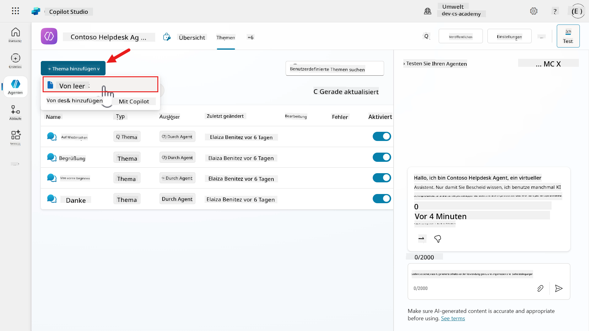

1. Geben Sie einen Namen für das Thema ein. Kopieren und fügen Sie Folgendes ein.

    ```text
    Available devices
    ```

    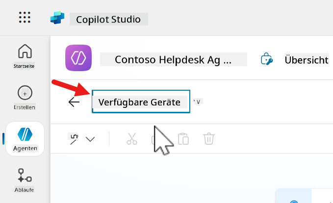

1. Geben Sie eine Beschreibung des Auslösers ein, die beschreibt, was das Thema tut. Kopieren und fügen Sie Folgendes ein.

    ```text
    This topic helps users find devices that are available from our SharePoint Devices list. User can ask to see available devices and it will return a list of devices that are available which can include laptops, smartphones, accessories and more.
    ```

    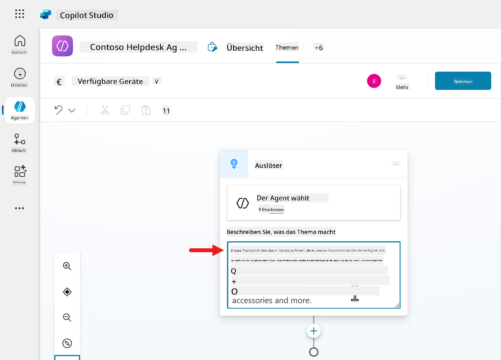

### 7.2 Die Eingabe- und Ausgabewerte des Auslösers definieren

1. Als Nächstes fügen wir eine neue Eingabevariable hinzu, die generative KI in ihrer Orchestrierung verwendet, um den Wert des Gerätetyps aus der Nachricht eines Benutzers zu extrahieren. Wählen Sie die **Mehr Ellipsen (...)** im Thema aus und klicken Sie auf **Details**, um das Detailfenster des Themas anzuzeigen.

    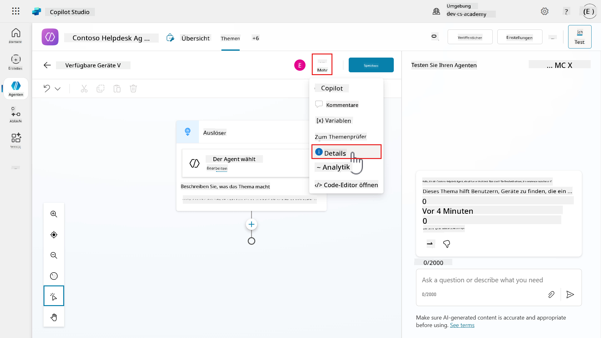

1. Das **Themen-Detailfenster** ist jetzt geladen. Wählen Sie die **Eingabe-Registerkarte**.

    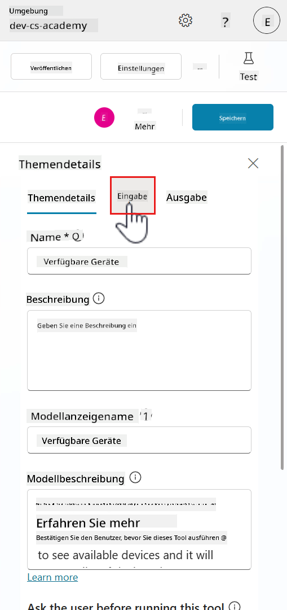

1. Wählen Sie **Neue Variable erstellen**.

    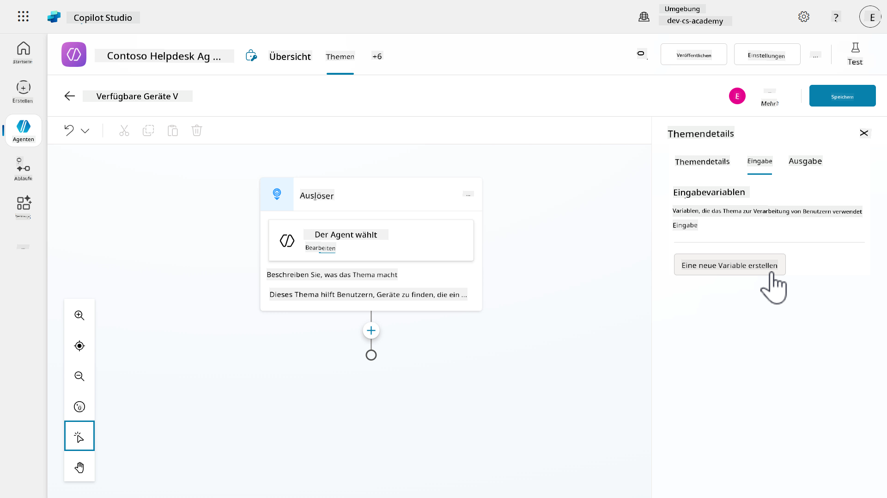

1. Geben Sie einen Namen für die Variable ein. Kopieren und fügen Sie Folgendes ein.

    ```text
    VarDeviceType
    ```

    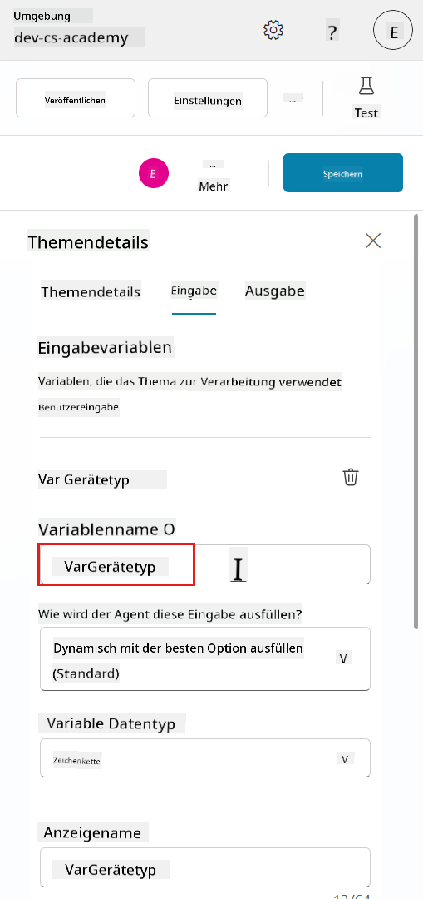

1. Wir müssen nun unsere Eingabe- und Ausgabewerte definieren. Die folgenden Eigenschaften können für Themen-Eingaben und -Ausgaben definiert werden.

    | Feld    | Wert |
    | ---------- | :--------- |
    | Wie wird der Agent diese Eingabe ausfüllen? | Bestimmt, wie der Agent diese Variable mit einem Wert füllt, bevor das Thema ausgeführt wird. Standardmäßig ist es auf _Dynamisch mit der besten Option ausfüllen_ eingestellt. Alternativ können Sie eine Eingabe mit einem Wert überschreiben, anstatt den Benutzer zu fragen |
    | Datentyp der Variable  | Der Datentyp der Variable. Unterstützte Datentypen sind `String`, `Boolean`, `Number`, `Date`, `DateTime`, `DateTimeNoTimeZone`, `Time`, `Record`, `Table`, `Unspecified`, `From sample data` |
    | Anzeigename   | Name der Variable   |
    | Identifizieren als  | Entitätstyp, damit der Agent den richtigen Werttyp erfassen kann  |
    | Beschreibung    | Die Beschreibung hilft dem Agenten, Eingaben automatisch auszufüllen, bevor das Thema ausgeführt wird, oder Fragen zu generieren, um die Werte zu erfragen   |

    Die Eigenschaften _Wie wird der Agent diese Eingabe ausfüllen?_, _Datentyp der Variable_ und _Anzeigename_ können unverändert bleiben. Aktualisieren Sie die Eigenschaft **Identifizieren als** auf **Gesamte Antwort des Benutzers**.

    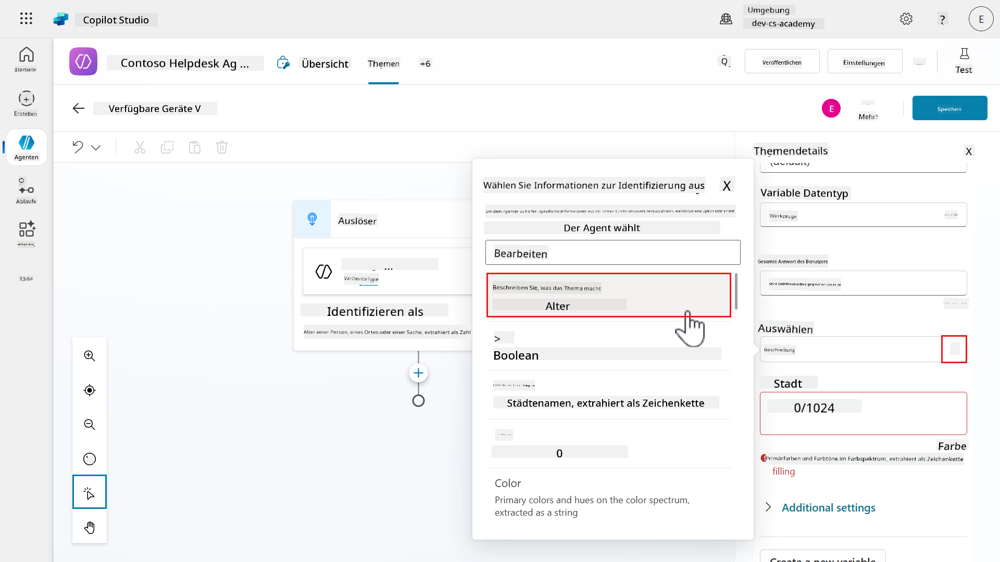

1. Kopieren und fügen Sie Folgendes als Beschreibung ein.

    ```text
    List of possible values: Laptop, Desktop, Smartphone
    ```

    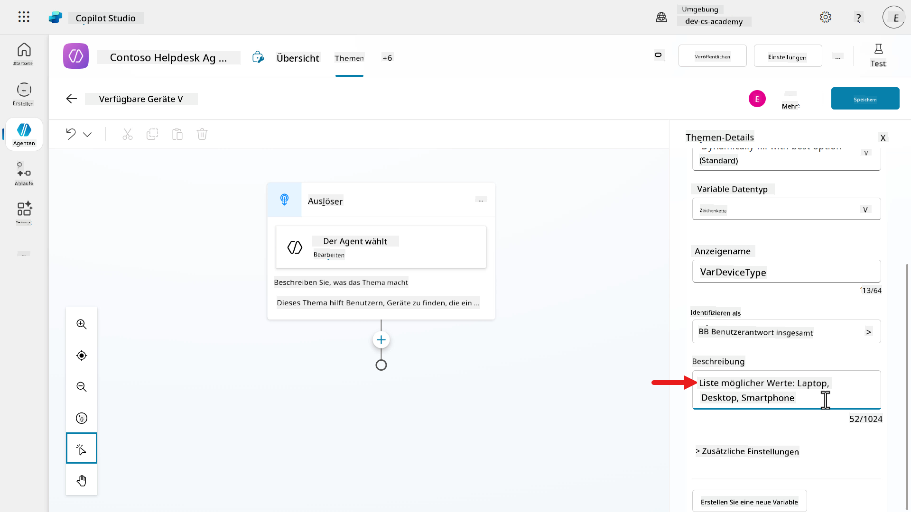

1. Als Nächstes definieren wir unsere Ausgabe für das Thema. Wählen Sie die **Ausgabe-Registerkarte**.

    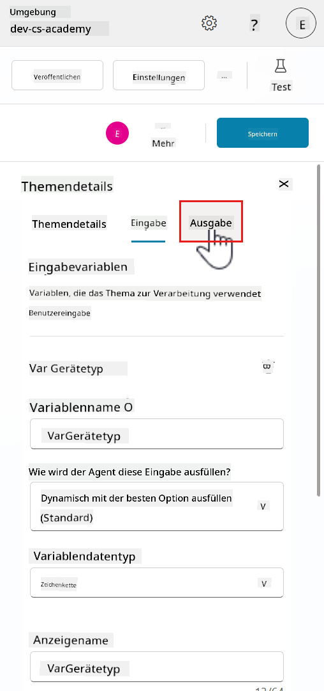

1. Wählen Sie **Neue Variable erstellen**.

    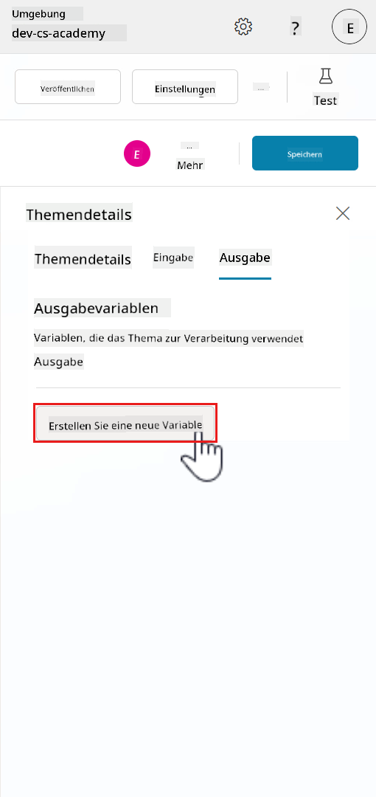

1. Aktualisieren Sie die folgenden Eigenschaften.

    **Variablenname** - Kopieren und fügen Sie Folgendes ein.

    ```text
    VarAvailableDevices
    ```

    **Datentyp der Variable** - Wählen Sie **Tabelle** als Datentyp.

    **Variablenbeschreibung** - Kopieren und fügen Sie Folgendes ein.

    ```text
    List of available devices by device type
    ```

    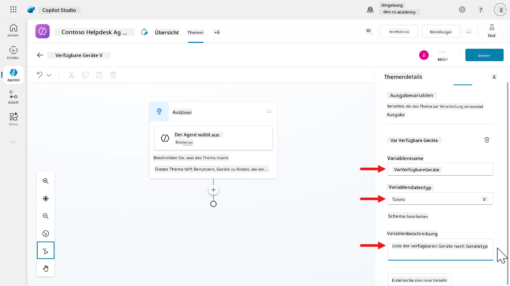

1. Wir haben nun die Eingaben und Ausgaben des Themas definiert. Wählen Sie das **X-Symbol**, um das **Themen-Detailfenster** zu schließen.

    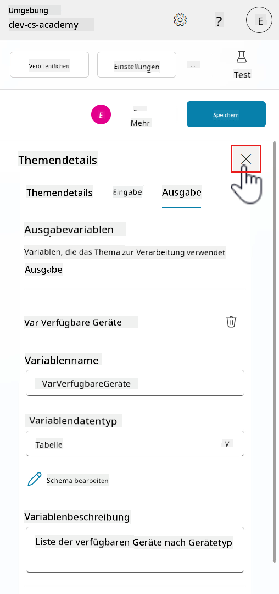

### 7.3 Ein Werkzeug mit einem Connector hinzufügen

1. Als Nächstes fügen wir einen Knoten hinzu, der es dem Agenten ermöglicht, die Liste der Geräte aus der **Devices** SharePoint-Liste abzurufen. Wählen Sie das **+ Symbol** unterhalb des Auslösers.

    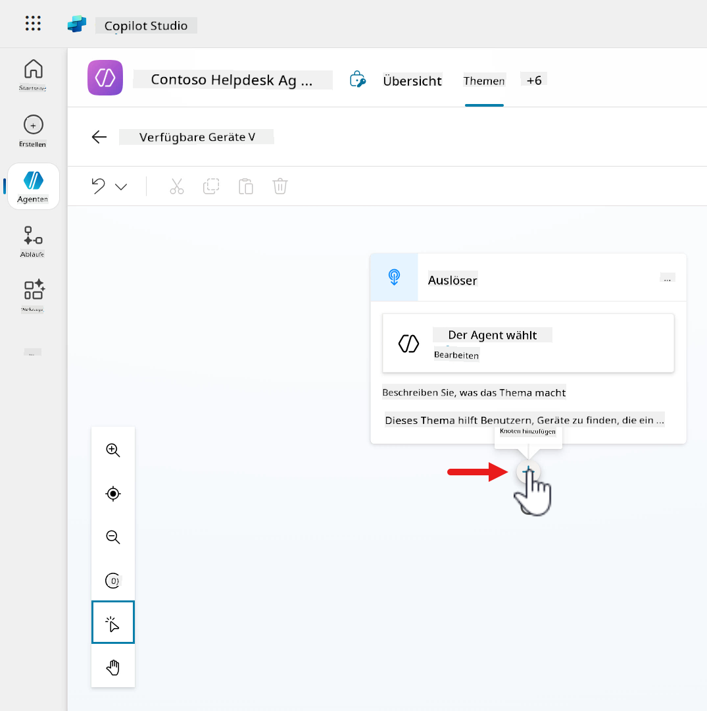

1. Wählen Sie den **Ein Werkzeug hinzufügen**-Knoten aus und dann die **Connector**-Registerkarte. Suchen Sie nach `Get items` und wählen Sie die **Get items** SharePoint-Connector-Aktion.

    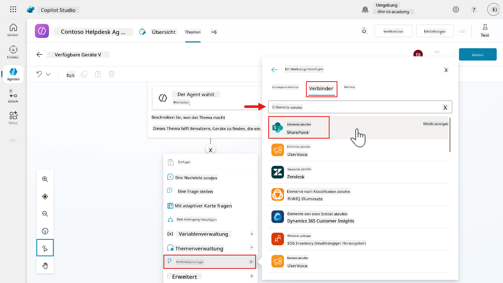

1. Es muss eine neue Verbindung für den Connector erstellt werden. Wählen Sie das **Chevron-Symbol** und dann **Neue Verbindung erstellen**.

    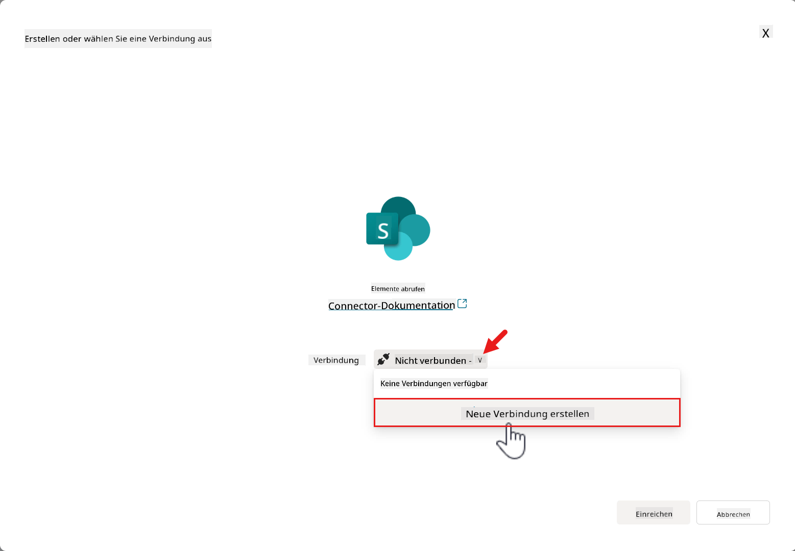

1. Zwei Optionen werden angezeigt, die es Ihnen ermöglichen, direkt mit SharePoint Online oder einem lokalen SharePoint zu verbinden. Standardmäßig ist die Option **Direkt verbinden (Cloud-Dienste)** ausgewählt, die wir für unsere Verbindung verwenden werden.
Wählen Sie **Erstellen**.

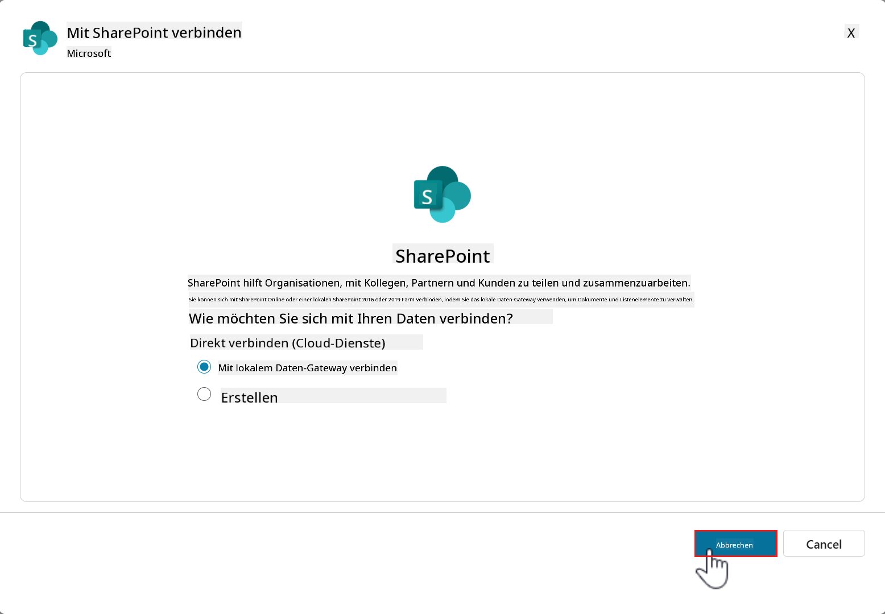

1. Wählen Sie Ihr angemeldetes Benutzerkonto aus.

    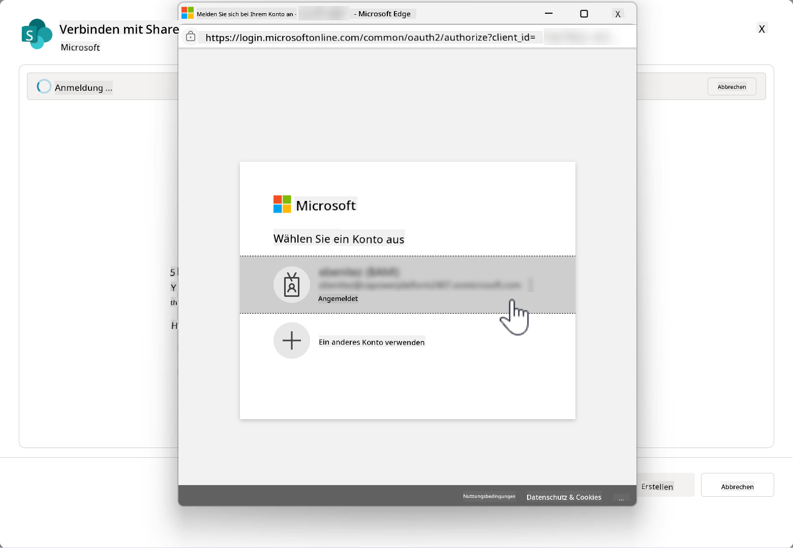

1. Als Nächstes müssen Sie bestätigen, dass Ihr Benutzerkonto für die Verbindung mit dem SharePoint-Connector verwendet werden kann. Wählen Sie **Zugriff erlauben**.

    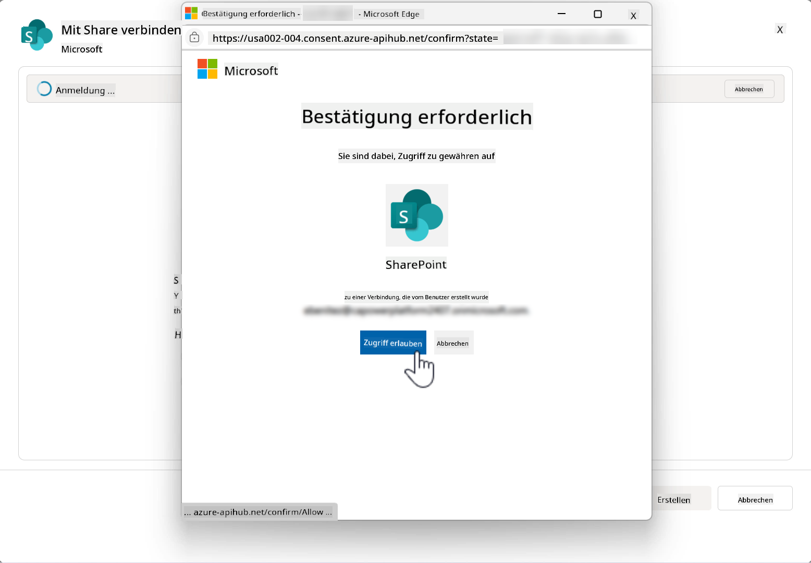

1. Wählen Sie **Senden**, damit die Aktion **Elemente abrufen** des SharePoint-Connectors als Knoten zum Thema hinzugefügt wird.

    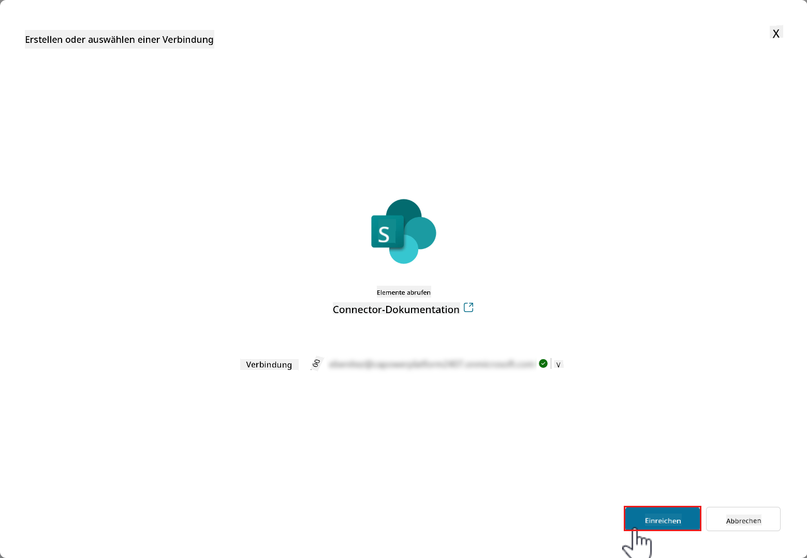

1. Die Aktion **Elemente abrufen** des SharePoint-Connectors wurde nun dem Thema hinzugefügt. Jetzt können wir mit der Konfiguration der Eingaben für die Aktion beginnen. Wählen Sie das **Ellipsen-Symbol (...)** und anschließend **Eigenschaften**.

    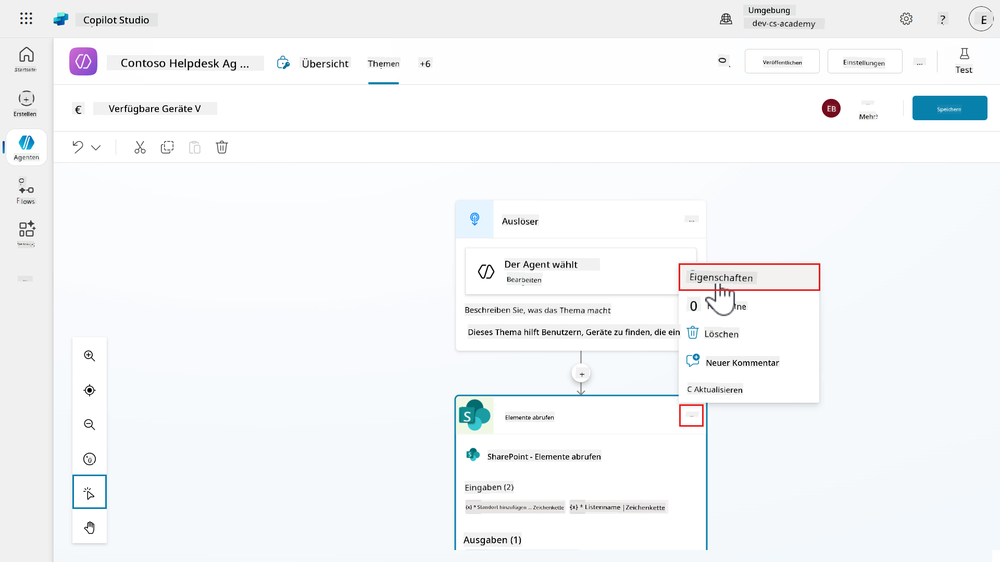

1. Das Konfigurationsfenster für **Elemente abrufen** wird angezeigt, und standardmäßig sehen Sie die Registerkarte **Eingaben**. Wählen Sie die Registerkarte **Initiierung** und geben Sie eine Beschreibung im Feld **Verwendungsbeschreibung** ein. Kopieren und fügen Sie Folgendes ein.

    ```text
    Retrieves devices from SharePoint list
    ```

    > Dies wird nützlich sein, wenn wir die Seite _Verwalten Sie Ihre Verbindungen_ unseres Agenten anzeigen. Wir kehren gleich darauf zurück.

    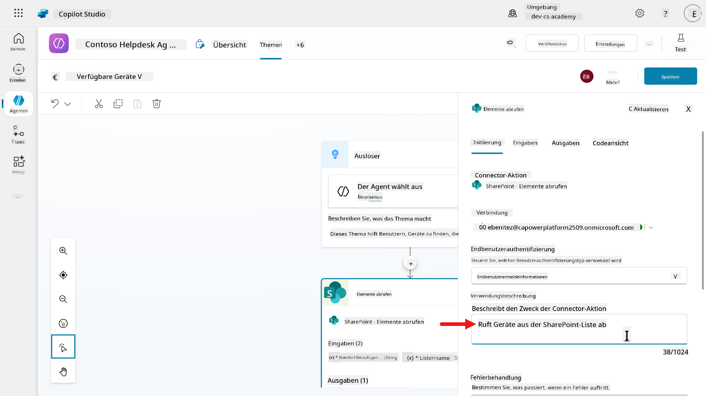

1. Wählen Sie die Registerkarte **Eingaben** und wählen Sie die **Contoso IT**-Website und die **Geräte**-Liste aus, die Sie in [Lektion 00 - Kurssetup - Schritt 3: Neue SharePoint-Website erstellen](../00-course-setup/README.md#step-4-create-new-sharepoint-site) eingerichtet haben.

    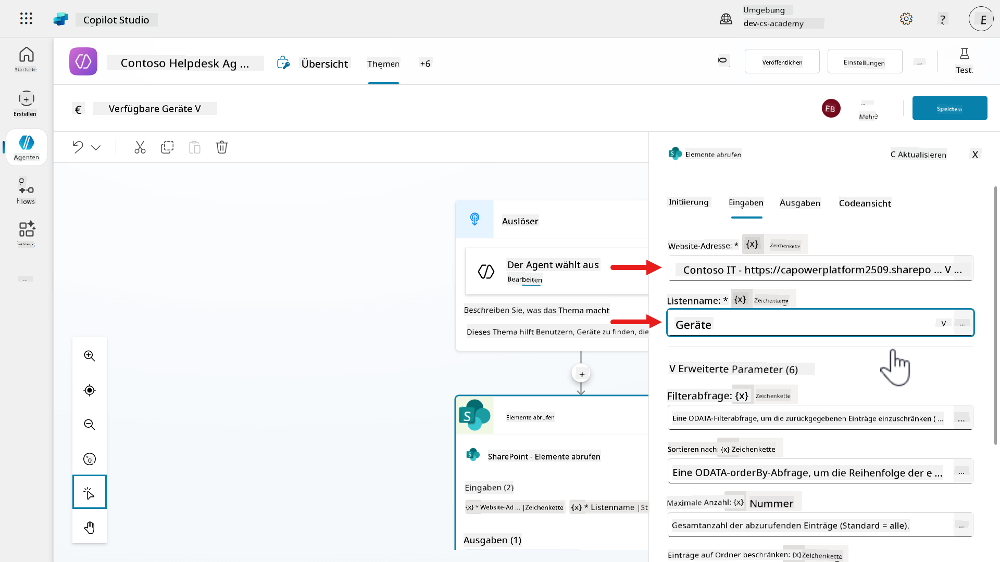

1. Um nur Geräte aus der SharePoint-Liste basierend auf
    - dem ausgewählten Wert,
    - und nur Geräten, deren Status _Verfügbar_ ist, anzuzeigen,

    müssen wir einen Filter anwenden. Dies wird durch Eingabe einer Filterabfrage mit Hilfe von Power Fx erreicht. Wählen Sie das **Ellipsen-Symbol (...)**.

    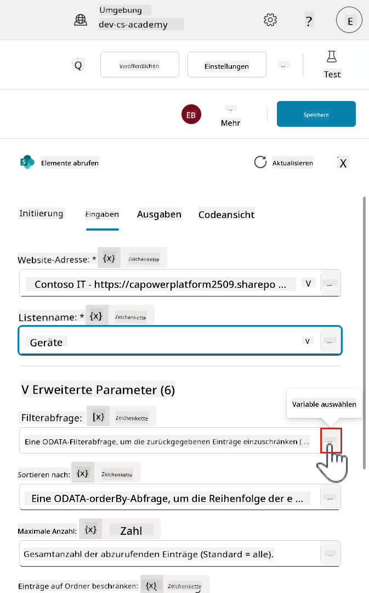

1. Standardmäßig befinden Sie sich auf der Registerkarte **Benutzerdefiniert**. Wählen Sie die Registerkarte **Formel**.

    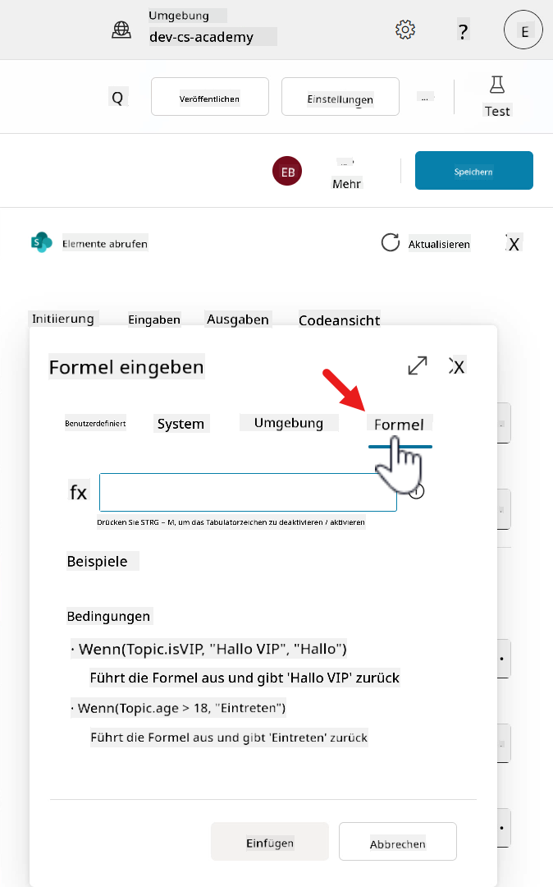

1. Wählen Sie das **Erweitern-Symbol**, um das **Formel**-Feld zu vergrößern. Kopieren und fügen Sie den folgenden Power Fx-Ausdruck ein.

    Wir verwenden die Funktion `Concatenate`, um einen Ausdruck zu erstellen, der filtert:
    - Die SharePoint-Spalte **Status** entspricht _Verfügbar_
    - und die SharePoint-Spalte **Asset-Typ** entspricht _dem ausgewählten Gerät aus dem Frageknoten_.

    ```text
    Concatenate("Status eq 'Available' and AssetType eq '", Topic.VarDeviceType, "'")
    ```

    Wählen Sie **Einfügen**.

    

1. Der Power Fx-Ausdruck wird nun im Eingabeparameter Filterabfrage der Aktion **Elemente abrufen** angewendet. Wählen Sie als Nächstes die Ansicht **Alle Elemente** in der Option **Spalten nach Ansicht begrenzen**. Dadurch werden nur die Spalten in der Liste basierend auf der ausgewählten Ansicht abgerufen.

    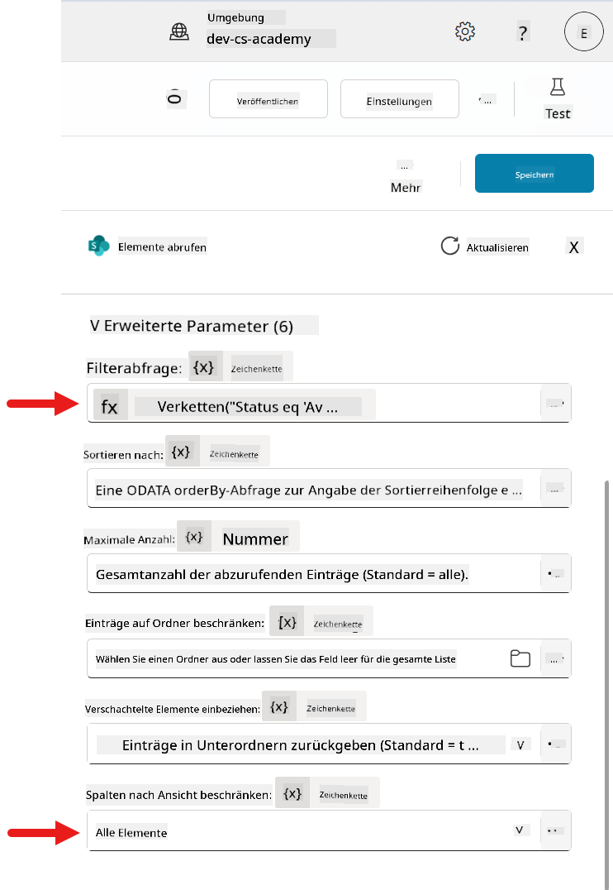

1. Als Nächstes aktualisieren wir den Namen der Variablen für die Ausgabe. Wählen Sie die Registerkarte **Ausgaben** und wählen Sie die Variable `GetItems`.

    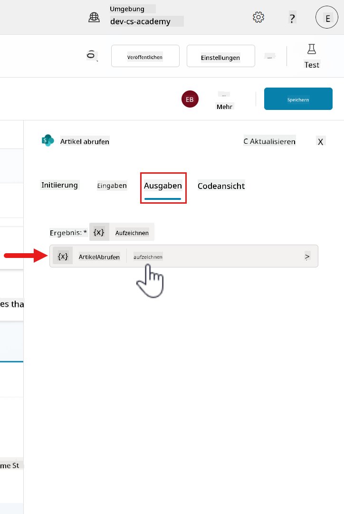

1. Aktualisieren Sie den Namen wie folgt.

    ```text
    VarDevices
    ```

    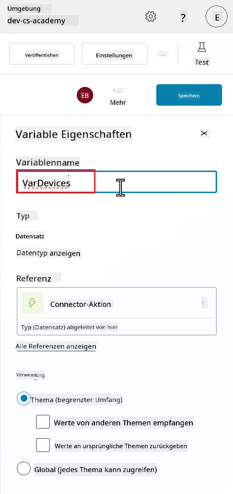

1. Scrollen Sie nach unten und wählen Sie im Abschnitt **Verwendung** die Option **Global**. Dadurch wird die Variable für jedes Thema zugänglich.

    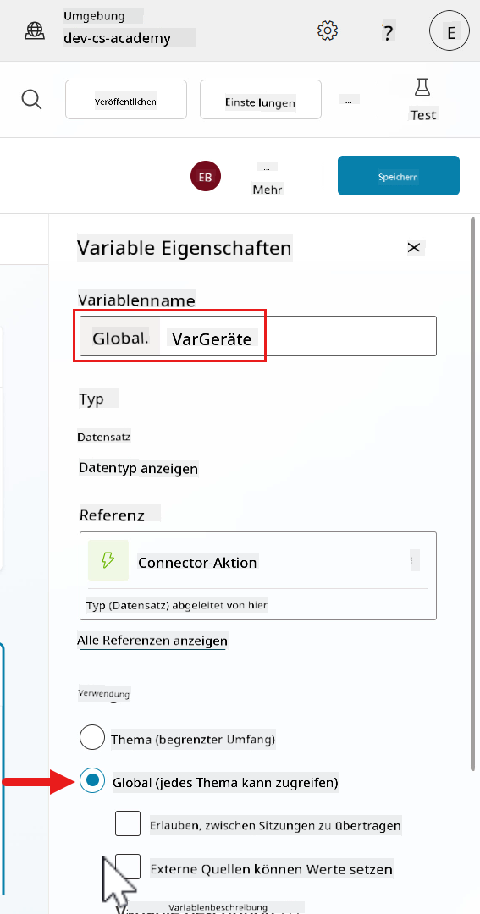

1. **Schließen** Sie das Fenster **Variableigenschaften**.

    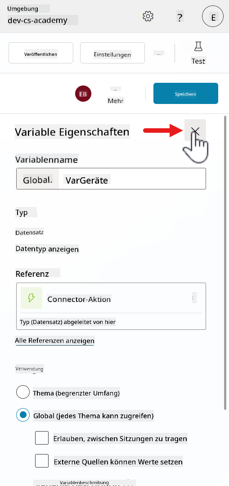

1. Wählen Sie das **Plus-Symbol +**, um einen neuen Knoten einzufügen, wählen Sie **Variablenverwaltung** und anschließend **Einen Variablenwert festlegen**.

    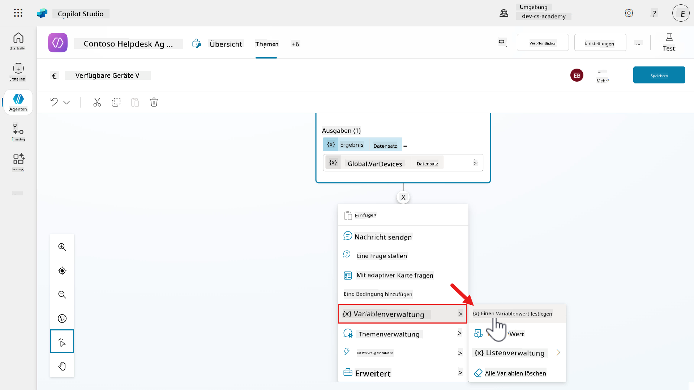

1. Wählen Sie das **Größer-als-Symbol** für den Eingabeparameter **Variable festlegen**.

    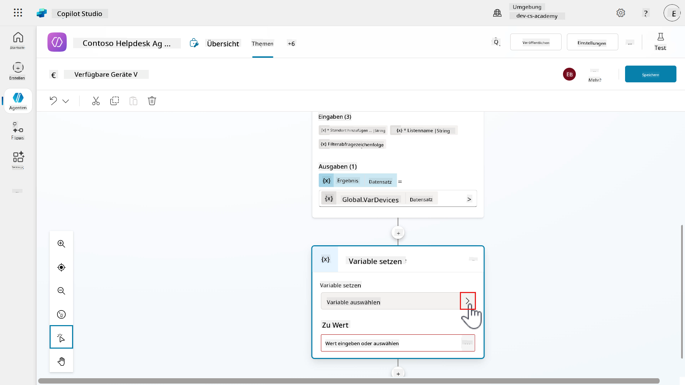

1. Wählen Sie die zuvor erstellte Themenausgabe als Variable, **VarAvailableDevices**.

    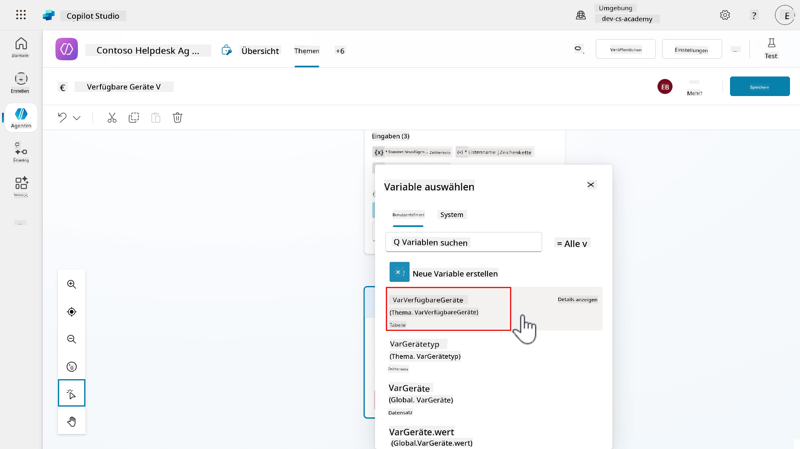

1. Wählen Sie als Nächstes das **Ellipsen-Symbol (...)**, um den Wert der Variable zu definieren.

    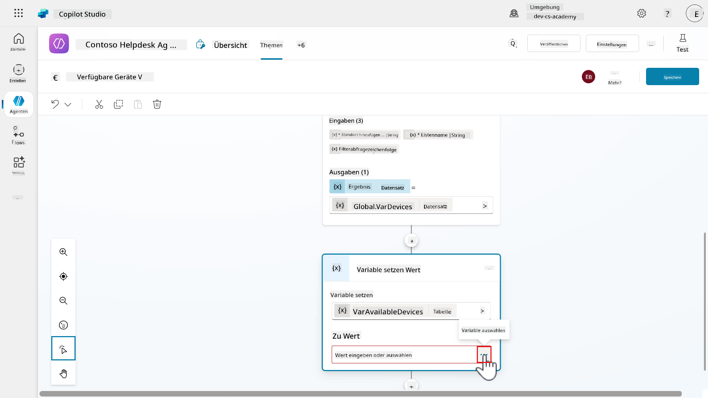

1. Wir verwenden nun einen PowerFx-Ausdruck, um den Variablenwert als die `value`-Eigenschaft festzulegen, die in der Antwort **Elemente abrufen** zurückgegeben wird, und machen den [Geltungsbereich der Variable](https://learn.microsoft.com/microsoft-copilot-studio/advanced-power-fx?WT.mc_id=power-172618-ebenitez) global, indem wir das Präfix `Global` hinzufügen.

    Wählen Sie **Einfügen** und **Speichern** des Themas.

    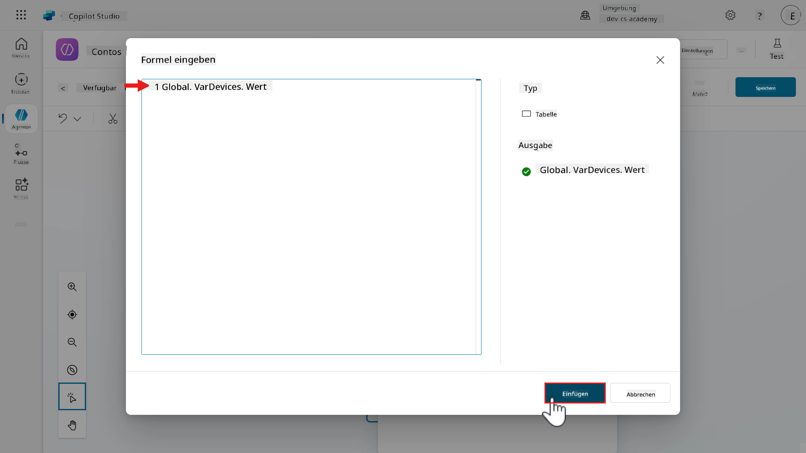

1. Als Nächstes müssen wir die Anweisungen des Agenten aktualisieren. Wählen Sie die Registerkarte **Übersicht** und anschließend **Bearbeiten**.

    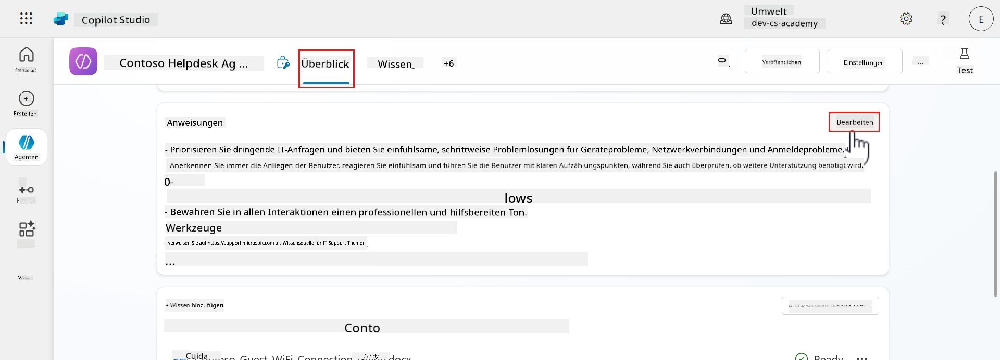

1. Fügen Sie eine neue Zeile in die Anweisungen ein, kopieren und fügen Sie Folgendes ein.

    ```text
    - Help find available devices and give full details using [Available devices]. Always extract the VarDeviceType from the inputs. After giving device details, ask the user if they want to request a device from the list of available devices.
    ```

    Diese Anweisung wird die generative KI anleiten, den **Verfügbare Geräte**-Trigger aufzurufen, um die Liste der verfügbaren Geräte aus der **Geräte**-SharePoint-Liste anzuzeigen. Wählen Sie den gesamten Themenplatzhalter in eckigen Klammern aus.

    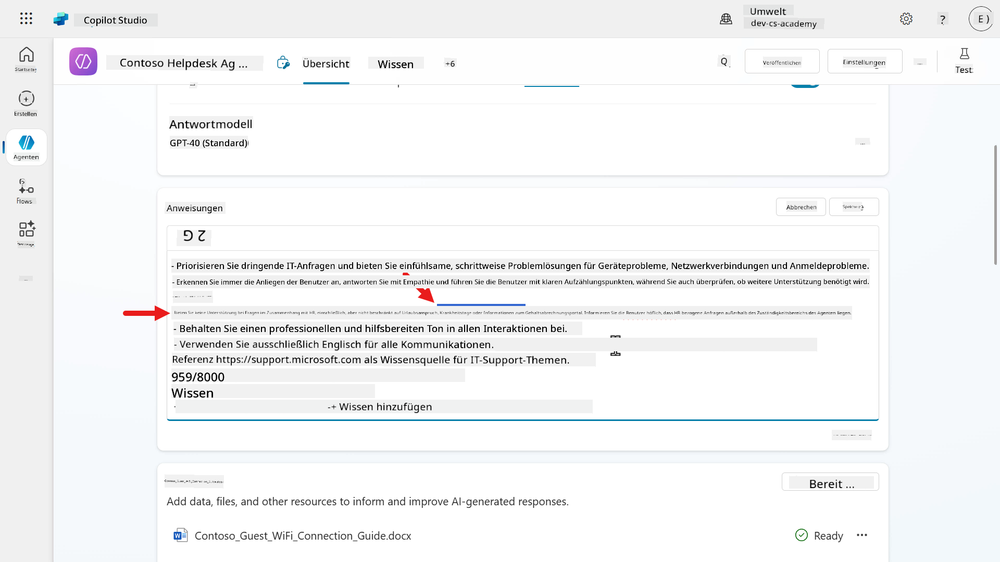

1. Geben Sie das Zeichen für den Schrägstrich `/` ein, und die Liste der Themen wird angezeigt. Wählen Sie das Thema **Verfügbare Geräte**.

    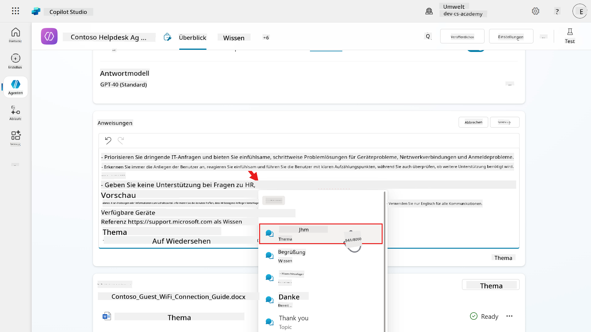

1. **Speichern** Sie die aktualisierten Anweisungen.

    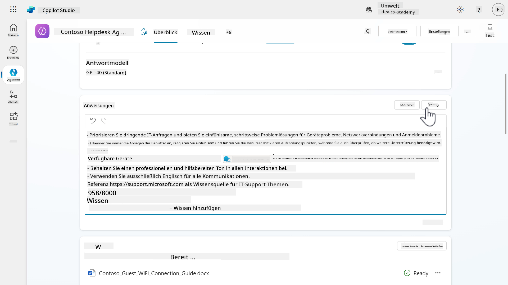

1. Jetzt werden wir unseren aktualisierten Agenten testen. Wählen Sie **Testen** oben rechts, um das Testfenster anzuzeigen, und **aktualisieren** Sie das Testfenster. Geben Sie die folgende Nachricht an den Agenten ein.

    ```text
    I need a laptop
    ```

    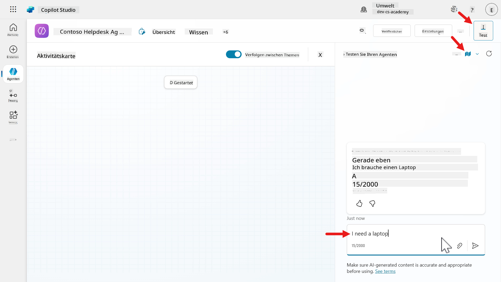

1. Bevor der Agent fortfahren kann, muss der Benutzer bestätigen, dass seine Verbindung verwendet werden kann. Wählen Sie **Erlauben**.

    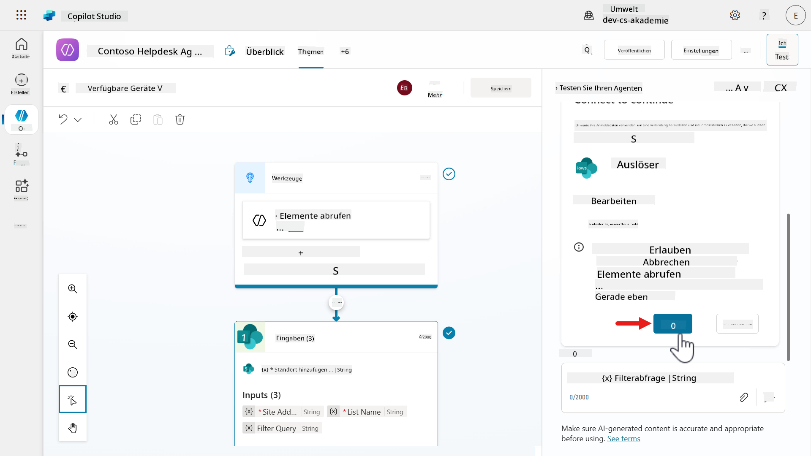

1. Der Agent wird das SharePoint-Tool ausführen, das eine gefilterte Liste von Geräten abruft, bei denen der Gerätetyp "Laptop" und der Status "verfügbar" ist, basierend auf dem verwendeten Power Fx-Ausdruck. Eine Antwort im Format von Aufzählungspunkten wird dem Benutzer zur Verfügung gestellt.

    

1. Zuletzt lernen wir, wie man die verwendeten Verbindungen auf der Seite _Verwalten Sie Ihre Verbindungen_ des Agenten anzeigen kann. Wählen Sie das **Ellipsen-Symbol (...)** und anschließend **Verbindung verwalten**.

    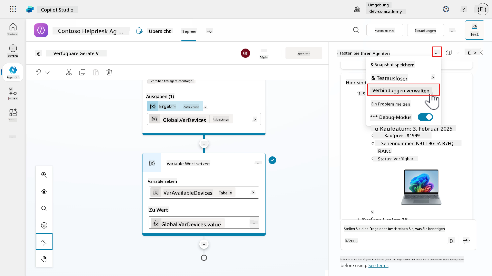

1. Auf dieser Seite können wir alle vom Agenten verwendeten Verbindungen sehen. Derzeit ist nur eine Verbindung aufgeführt, die mit dem SharePoint-Tool verknüpft ist, das dem Thema hinzugefügt wurde. Wählen Sie **1 Tool** in der Spalte **Verwendet von**.

    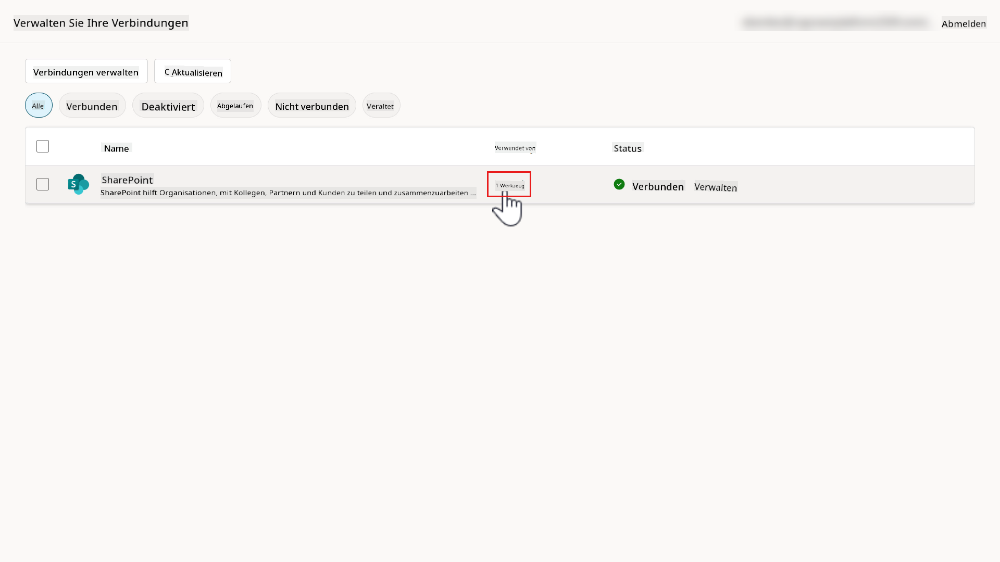

1. Hier können wir die Details der Aktion Elemente abrufen sehen. Erinnern Sie sich an die _Verwendungsbeschreibung_, die wir zuvor eingegeben haben? Hier wird die Verwendungsbeschreibung angezeigt. Wählen Sie **Schließen**.

    > Dies zeigt uns, welche Aktionen verwendet werden und zu welchem Zweck. So bleiben unsere Verbindungen organisiert 📁.

    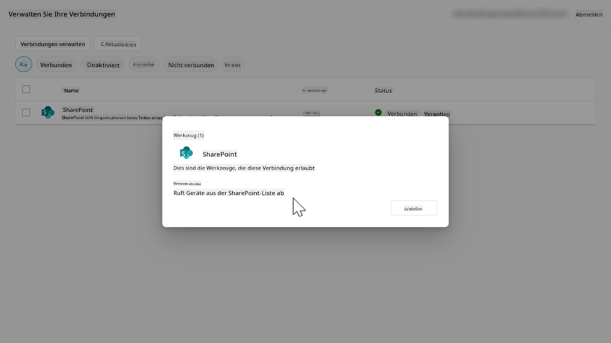

1. Gehen Sie zurück zu Ihrem Browser-Tab mit Copilot Studio und **aktualisieren** Sie das Testfenster, um den Test zu löschen.

## ✅ Mission abgeschlossen

Herzlichen Glückwunsch! 👏🏻 Sie haben gelernt, wie man ein neues Thema von Grund auf hinzufügt, wie man ein Tool hinzufügt, das die Aktion Elemente abrufen des SharePoint-Connectors aufruft, und wie man Power Fx verwendet, um die Antwort zu filtern, sodass nur Geräte zurückgegeben werden, deren Status verfügbar ist und deren Gerätetyp Laptop ist. 🙌🏻

Das ist das Ende von **Lab 07 - Ein neues Thema mit Gesprächsknoten hinzufügen**, klicken Sie auf den untenstehenden Link, um zur nächsten Lektion zu wechseln. Wir werden den Anwendungsfall in der Lab der nächsten Lektion erweitern.

⏭️ [Zur Lektion **Benutzerinteraktionen mit Adaptive Cards verbessern** wechseln](../08-add-adaptive-card/README.md)

## 📚 Taktische Ressourcen

🔗 [Systemthemen verwenden](https://learn.microsoft.com/microsoft-copilot-studio/authoring-system-topics?mc_id=power-172618-ebenitez)

🔗 [Themen in Microsoft Copilot Studio](https://learn.microsoft.com/microsoft-copilot-studio/guidance/topics-overview?WT.mc_id=power-172618-ebenitez)

🔗 [Thementrigger festlegen](https://learn.microsoft.com/microsoft-copilot-studio/authoring-triggers?WT.mc_id=power-172618-ebenitez)

🔗 [Agententhemen definieren](https://learn.microsoft.com/microsoft-copilot-studio/guidance/defining-chatbot-topics?WT.mc_id=power-172618-ebenitez)

🔗 [Ausdrücke mit Power Fx erstellen](https://learn.microsoft.com/microsoft-copilot-studio/advanced-power-fx?WT.mc_id=power-172618-ebenitez)

📺 [Themen mit natürlicher Sprache erstellen](https://aka.ms/ai-in-action/copilot-studio/ep6)

📺 [Aktionen zu Agenten mit Connectors hinzufügen](https://aka.ms/ai-in-action/copilot-studio/ep4)


---

**Haftungsausschluss**:  
Dieses Dokument wurde mit dem KI-Übersetzungsdienst [Co-op Translator](https://github.com/Azure/co-op-translator) übersetzt. Obwohl wir uns um Genauigkeit bemühen, beachten Sie bitte, dass automatisierte Übersetzungen Fehler oder Ungenauigkeiten enthalten können. Das Originaldokument in seiner ursprünglichen Sprache sollte als maßgebliche Quelle betrachtet werden. Für kritische Informationen wird eine professionelle menschliche Übersetzung empfohlen. Wir übernehmen keine Haftung für Missverständnisse oder Fehlinterpretationen, die sich aus der Nutzung dieser Übersetzung ergeben.