<!--
CO_OP_TRANSLATOR_METADATA:
{
  "original_hash": "cc4afa4a5a11c9d03896decfbcbd4060",
  "translation_date": "2025-10-17T19:03:12+00:00",
  "source_file": "docs/recruit/09-add-an-agent-flow/README.md",
  "language_code": "de"
}
-->
# 🚨 Mission 09: Fügen Sie einen Agentenfluss zu Ihrem Thema für Automatisierung hinzu

## 🕵️‍♂️ CODENAME: `OPERATION AUTOMATION POWERHOUSE`

> **⏱️ Zeitfenster der Operation:** `~30 Minuten`  

🎥 **Schauen Sie sich die Anleitung an**

[](https://www.youtube.com/watch?v=vtLZJT3eBXg "Schauen Sie sich die Anleitung auf YouTube an")

## 🎯 Missionsbeschreibung

Ihr Agent kann jetzt mit Benutzern kommunizieren und Informationen bereitstellen, aber wahre operative Exzellenz erfordert, dass Ihr Agent auch handelt. Diese Mission wird Ihren Konversationsagenten in ein Automatisierungs-Kraftwerk verwandeln, indem Sie ihn mit Agentenflüssen ausstatten.

Am Ende der Mission haben Sie eine End-to-End-Geräteanforderungsautomatisierung erstellt, die Benutzereingaben über eine adaptive Karte erfasst, Daten aus SharePoint abruft, Benachrichtigungen per E-Mail an Manager sendet und nahtloses Benutzerfeedback bietet – alles orchestriert durch Ihren Agenten mittels intelligenter Workflow-Automatisierung.

## 🔎 Ziele

In dieser Mission lernen Sie:

1. Was Agentenflüsse sind und wie sie sich von Power Automate Cloud-Flows für die Automatisierung unterscheiden
1. Die wichtigsten Funktionen, die Agentenflüsse leistungsstark machen, einschließlich KI-Aktionen und natürlicher Sprachgestaltung
1. Den Agentenfluss-Designer und die Verwendung von Ausdrücken für die dynamische Datenverarbeitung
1. Wie man eine vollständige Geräteanforderungsautomatisierung erstellt, die SharePoint-Daten und E-Mail-Benachrichtigungen integriert

## 🤔 Was ist ein Agentenfluss?

Agentenflüsse sind eine leistungsstarke Möglichkeit, repetitive Aufgaben zu automatisieren und Ihre Apps und Dienste zu integrieren. Stellen Sie sie sich als strukturierte, schrittweise Workflows vor, die Ihr Agent ausführen kann, um Aufgaben zu automatisieren oder mit anderen Anwendungen und Diensten zu verbinden. Sie sind wie kleine Workflows, die Ihrem Agenten helfen, Dinge wie Benachrichtigungen zu senden, Datensätze zu aktualisieren oder auf Ereignisse zu reagieren.

Im Gegensatz zu autonomen Agenten, die KI verwenden, um Entscheidungen spontan zu treffen, sind Agentenflüsse **deterministische Workflows** – das bedeutet, dass sie jedes Mal denselben Weg gehen und konsistente und zuverlässige Ergebnisse liefern.

Einfach ausgedrückt:

- Sie helfen Ihrem Agenten, _Dinge zu tun_, nicht nur _Dinge zu sagen_.
- Sie sind wiederverwendbar über Themen und Agenten hinweg und können durch Benutzernachrichten, Ereignisse oder andere Anwendungen und Dienste ausgelöst werden.

## 🙋🏽 Ja, aber wie unterscheiden sie sich von Power Automate Cloud-Flows?

Sowohl Agentenflüsse als auch Power Automate Cloud-Flows helfen bei der Automatisierung von Aufgaben. Sie sind jedoch für unterschiedliche Zwecke konzipiert und funktionieren auf unterschiedliche Weise.

### 🤖 Agentenflüsse in Copilot Studio

**Wofür sie gedacht sind:**

- Entwickelt für konversationelle und autonome Agenten (über Agentenanweisungen) in Copilot Studio.
- Konzentriert auf intelligente, KI-gesteuerte Automatisierung, die mit Geschäftssystemen interagiert.

**Warum sie nützlich sind:**

- Einfach direkt in Copilot Studio zu erstellen und zu verwalten.
- Ideal für die Automatisierung von Aufgaben, die _während des Gesprächs_ mit Benutzern stattfinden, wie z. B. das Einreichen eines Urlaubsantrags.
- Sie benötigen keine separate Power Automate-Lizenz, da die Abrechnung auf der Nutzung innerhalb von Copilot Studio basiert. Dies kann Zeit und Kosten für Unternehmen sparen.

**Einschränkungen:**

- Sie können sie nicht teilen, kopieren oder Mitbesitzer zuweisen.
- Agentenflüsse sind nur innerhalb von Copilot Studio sichtbar und nutzbar.
- Derzeit können Ereignisauslöser für Agenten im Power Automate Maker-Portal bearbeitet werden.

### ☁️ Power Automate Cloud-Flows

**Wofür sie gedacht sind:**

- Entwickelt für allgemeine Automatisierung über viele Apps und Dienste hinweg.
- Können unabhängig ausgeführt oder zusammen mit Agentenflüssen verwendet werden.

**Warum sie nützlich sind:**

- Bietet eine breite Palette von Konnektoren.
- Ideal für die Automatisierung von Prozessen außerhalb von Agenten.
- Können geteilt, wiederverwendet und teamübergreifend verwaltet werden.

**Anforderungen:**

- Sie benötigen eine Power Automate-Lizenz, um sie zu nutzen.

### 📗 Zusammenfassung

| Verwenden Sie dies | Wenn Sie möchten |
| :- | :- |
| Agentenflüsse | Aufgaben innerhalb eines Agenten automatisieren, KI nutzen und alles in Copilot Studio behalten |  
| Power Automate Cloud-Flows | Automatisieren über Apps und Dienste hinweg oder Workflows außerhalb von Agenten erstellen |

## 👍🏻 Warum Agentenflüsse verwenden

Agentenflüsse folgen immer einem festen Pfad – sie tun jedes Mal dasselbe, wenn sie die gleichen Eingaben erhalten.

Das macht sie:

- **Zuverlässig** – Sie können darauf vertrauen, dass sie sich jedes Mal gleich verhalten.
- **Vorhersehbar** – Sie wissen, welches Ergebnis Sie erwarten können, wenn der Fluss ausgeführt wird.
- **Regelbasiert** – Sie folgen den von Ihnen definierten Schritten.

Weitere Vorteile sind:

- **Automatisierung** – ermöglicht Ihrem Agenten, repetitive Aufgaben wie das Einreichen von Formularen oder das Senden von Benachrichtigungen zu übernehmen.
- **Verbunden** – Verbindung mit über 1400 Konnektoren wie ServiceNow, SharePoint, Salesforce. Alternativ können Sie Ihren eigenen benutzerdefinierten Konnektor erstellen.
- **Eng integriert** – Agentenflüsse sind Teil der Logik des Agenten, sie werden direkt durch Benutzernachrichten oder Aktionen im Gespräch ausgelöst.
- **Skalierbarkeit** – Flüsse können über mehrere Agenten oder Szenarien hinweg wiederverwendet werden.
- **No-Code oder Low-Code** – Sie können Flüsse mit natürlicher Sprache oder einem visuellen Designer erstellen.
- **Alles-in-einer-Plattform** – Sie können Agentenflüsse an einem Ort entwerfen, testen und bereitstellen – Copilot Studio. Kein Wechsel zwischen Plattformen erforderlich.

## 🏄🏻‍♂️ Wie verbessern Agentenflüsse Ihren Agenten?

Agentenflüsse erweitern die Fähigkeiten Ihres Agenten über das "Chatten" mit Benutzern hinaus. Sie ermöglichen es ihm, Maßnahmen zu ergreifen und mit Systemen zu interagieren.

Angenommen, Sie arbeiten in einer Finanzabteilung und erhalten viele Rechnungen von Lieferanten. Normalerweise muss jemand jede Rechnung lesen, die wichtigen Details herausziehen – den Betrag, das Datum, von wem sie stammt – und prüfen, ob alles mit Ihren Unterlagen übereinstimmt. Dann muss sie zur Genehmigung an die richtige Person weitergeleitet werden. Das kostet Zeit und Mühe.

Mit Agentenflüssen in Copilot Studio können Sie diesen Prozess automatisieren. Sobald die Rechnung eingeht, kann der Agent:

1. Das Dokument mit intelligenter Dokumentenverarbeitung lesen, um die wichtigsten Informationen zu finden.
1. Die Details mit Ihren Unternehmensdaten abgleichen, um sicherzustellen, dass alles korrekt ist.
1. Sie zur Genehmigung an die richtige Person(en) weiterleiten.

Das spart Zeit, reduziert Fehler und macht den gesamten Prozess viel reibungsloser.

### Stellen Sie sich das so vor

- **Agenten**: die intelligenten Entscheidungsträger
- **Agentenflüsse**: die zuverlässigen Ausführer

### Warum es wichtig ist

- Sie erhalten das Beste aus beiden Welten: zuverlässige Automatisierung und flexible KI.
- Es ist einfach, Flüsse zu erstellen und zu aktualisieren, wenn sich Ihre Geschäftsanforderungen ändern.
- Sie können die Automatisierung teamübergreifend skalieren.

## 🔌 Wichtige Funktionen, die Agentenflüsse leistungsstark machen

1. **Natürliche Sprachgestaltung**
    - Sie können beschreiben, was der Fluss tun soll, in einfachem Deutsch.
    - Copilot versteht Ihre Absicht und erstellt den Fluss für Sie.
    - Kein Code erforderlich – erklären Sie einfach Ihre Idee.

1. **KI-Aktionen**

    Nutzen Sie KI, um:

    - Dokumente oder Bilder zu lesen und zu verstehen.
    - Lange Inhalte in kurze, nützliche Antworten zusammenzufassen.
    - Intelligente Empfehlungen oder Entscheidungen zu treffen.

1. **Generative Aktionen**
    - Diese ermöglichen es dem Fluss, sich in Echtzeit anzupassen.
    - Der Agent kann Schritte planen und anpassen, basierend auf sich ändernden Informationen.

1. **Integrationsaktionen**
    - Verbinden Sie Ihren Fluss mit anderen Tools wie Outlook, Microsoft Teams, ServiceNow, SharePoint und anderen Anwendungen und Diensten, über mehr als 1400 integrierte Konnektoren oder Ihren eigenen benutzerdefinierten Konnektor.
    - Dies hilft Ihrem Agenten, mit den Apps zu arbeiten, die Ihr Team bereits verwendet.

1. **Menschliche Eingriffe**
    - Fügen Sie Genehmigungsschritte hinzu, bei denen eine Person etwas überprüfen oder bestätigen muss.
    - [Erweiterte Genehmigungen](https://learn.microsoft.com/microsoft-copilot-studio/flows-advanced-approvals?WT.mc_id=power-172621-ebenitez) unterstützen Erinnerungen, Delegationen und mehrstufige Genehmigungen.

## ⚙️ Wie sie funktionieren

1. **Auslöser**

    Ein Ereignis startet den Fluss – wie z. B. eine Benutzerfrage, das Aufrufen des Flusses aus einem Thema, eine geplante Zeit oder ein Ereignis in einem anderen System.

1. **Aktionen**

    Dies sind die Schritte, die der Agent als Nächstes ausführt – eine E-Mail senden, eine API aufrufen, ein Ticket in ServiceNow aktualisieren.

## 🧶 Wie erstellt man einen Agentenfluss?

1. **Natürliche Sprache**: Beschreiben Sie, was der Agent tun soll, und Copilot erstellt ihn für Sie.
1. **Designer-Canvas**: Ziehen Sie Aktionen, Bedingungen und Schleifen in den Agentenfluss-Designer, um Ihren Agentenfluss zu erstellen.

## 🎨 Was ist der Agentenfluss-Designer?

Es ist ein visuelles Tool in Copilot Studio, das Ihnen hilft, Agentenflüsse zu erstellen, zu bearbeiten und zu verwalten, die Schritt-für-Schritt-Anweisungen enthalten, denen Ihr Agent folgt, um Aufgaben zu erledigen. Es ist so konzipiert, dass es einfach zu bedienen ist, auch wenn Sie neu in Agentenflüssen sind.

### Wichtige Funktionen des Agentenfluss-Designers

1. **Visuelles Canvas**
    - Sie können Ihren gesamten Fluss wie ein Diagramm sehen.
    - Einfaches Zoomen, Anpassen der Ansicht oder Verwenden einer Minikarte, um große Flüsse zu navigieren.

1. **Aktionen hinzufügen und entfernen**
    - Klicken Sie auf die _Plus (+)_-Schaltfläche, um eine neue Aktion hinzuzufügen, wie z. B. das Senden einer Nachricht oder das Aktualisieren eines Elements in einer SharePoint-Liste.
    - Sie können nach Aktionen aus Konnektoren suchen und diese über ihre Einstellungen konfigurieren.
    - Um eine Aktion zu entfernen, klicken Sie auf die _drei Punkte (⋮)_ und wählen Sie _Löschen_.

1. **Parameter überprüfen**
    - Klicken Sie auf eine beliebige Aktion, um ihre Einstellungen, sogenannte _Parameter_, anzuzeigen oder zu bearbeiten.
    - Sie können Werte manuell eingeben oder _Ausdrücke_ verwenden, um sie dynamisch zu gestalten.

1. **Versionsverlauf**
    - Jedes Mal, wenn Sie Ihren Fluss speichern, wird eine Version aufgezeichnet.
    - Sie können zurückgehen und frühere Versionen anzeigen oder wiederherstellen, falls erforderlich.

1. **Fehlerprüfung**
    - Der _Flow Checker_ hebt alle Fehler hervor.
    - Alle Fehler müssen vor der Veröffentlichung Ihres Flusses behoben werden.

1. **Veröffentlichen und Testen**
    - Sobald Ihr Fluss fehlerfrei ist, veröffentlichen Sie ihn, um ihn live zu schalten.
    - Verwenden Sie die _Test_-Funktion, um Ihren Fluss manuell oder automatisch auszuführen und zu überprüfen, ob er wie erwartet funktioniert.

### Warum den Agentenfluss-Designer verwenden?

- **Visuell und intuitiv** – Sie können Flüsse durch Ziehen und Klicken erstellen.
- **Sicheres Experimentieren** – Der Versionsverlauf ermöglicht es Ihnen, Änderungen rückgängig zu machen.
- **Integriertes Testen** – hilft Ihnen sicherzustellen, dass alles funktioniert, bevor es live geht.

## 🔤 Sie haben _Ausdrücke_ erwähnt – was sind Ausdrücke?

Ausdrücke sind kleine Formeln oder Befehle, die Ihrem Agentenfluss helfen, mit Daten zu arbeiten. Sie verwenden sie, um Werte zu berechnen, Text zu formatieren, Entscheidungen zu treffen oder spezifische Informationen aus Eingaben zu extrahieren.

### Warum Ausdrücke verwenden?

Ausdrücke ermöglichen es Ihnen:

- **Anpassung der Datenverarbeitung** – Namen kombinieren, Daten formatieren.
- **Entscheidungen treffen** – Wenn ein Wert größer als 10 ist, etwas tun.
- **Daten transformieren** – Text in Kleinbuchstaben ändern, einen Teil eines Strings extrahieren.
- **Logik automatisieren** – ohne vollständigen Code zu schreiben.

### Wie sehen Ausdrücke aus?

Ausdrücke verwenden Funktionen. Ich werde eine Erklärung von Jerry Weinstock, einem ehemaligen Microsoft MVP, übernehmen.

!!! Zitat
    Funktionen sind integrierte Logik, um Ihre Daten entweder durch einfache oder komplexe Operationen in Ihrem Ausdruck zu transformieren.

Funktionen ermöglichen es Ihnen, Ausdrücke zu erstellen, ohne dass Sie Code schreiben müssen.

Ich beschreibe es gerne so: Eine Funktion in Agentenflüssen ist ähnlich wie Excel-Funktionen. Sie können eine Operation auf Daten ausführen, um sie in eine gewünschte Ausgabe zu transformieren. Wenn Sie Ihre Formel in Excel erstellen, wählen Sie Ihren Eingabewert aus den Zellen in einer Tabelle oder einem Bereich aus und wenden dann Funktionen an, um die Datenausgabe zu manipulieren. Ein Beispiel ist die Verwendung der Funktion `COUNT`, um die Anzahl der Zellen zu ermitteln, die Zahlen aus einem Bereich enthalten.

In Agentenflüssen beziehen Sie sich beim Erstellen Ihrer Ausdrücke auf Datenausgaben aus dem Auslöser oder Aktionen, anstatt auf Daten aus Zellen in einer Tabelle. Im vorherigen Beispiel können Sie die Funktion `length` verwenden, um die Anzahl der Elemente zu ermitteln, die von der Aktion _Get items_ des SharePoint-Konnektors zurückgegeben werden.

### Warum sind Funktionen wichtig?

Die Verwendung von Funktionen macht Ihre Agentenflüsse:

- **Intelligenter** – sie können auf unterschiedliche Eingaben oder Bedingungen reagieren.
- **Flexibler** – Sie können anpassen, wie Daten verarbeitet werden.
- **Effizienter** – Sie vermeiden manuelle Schritte, indem Sie Logik automatisieren.

### Die nützlichsten Funktionen

Die folgenden sind häufig verwendete Funktionen in Agentenflüssen. Für die vollständige Liste der Funktionen besuchen Sie den [Referenzleitfaden](https://learn.microsoft.com/azure/logic-apps/workflow-definition-language-functions-reference?WT.mc_id=power-172621-ebenitez).

#### 🔡 Text

- `concat()` - Verbindet zwei oder mehr Textstücke miteinander.
      - Beispiel: `concat('Hallo ', firstName)` → “Hallo John”

- `toLower()` / `toUpper()` - Ändert Text in Klein- oder Großbuchstaben.
      - Nützlich zur Standardisierung von Eingaben.

- `substring()` - Extrahiert einen Teil eines Strings.
      - Beispiel: Die ersten 3 Buchstaben eines Namens erhalten.

- `trim()` - Entfernt Leerzeichen am Anfang und Ende des Textes.

#### 🔢 Mathematik und Zahlen

- `add()`, `sub()`, `mul()`, `div()` - Grundlegende mathematische Operationen.
      - Beispiel: `add(5, 3)` - die Ausgabe ist 8

#### 📅 Datum und Zeit

- `utcNow()` - Holt das aktuelle Datum und die aktuelle Uhrzeit in UTC.
      - Ideal für Zeitstempel.

- `addDays()`, `addHours()` - Fügt Zeit zu einem Datum hinzu.
- Beispiel: `addDays(utcNow(), 7)` gibt das Datum in 7 Tagen aus.

- `formatDateTime()` - Formatiert ein Datum in eine lesbare Zeichenkette.
      - Beispiel: Montag, 7. Juli 2025

#### ✅ Logisch

- `if()` - Führt einen Wert aus, wenn wahr, und einen anderen, wenn falsch.
      - Beispiel: `if(score > 50, 'Bestanden', 'Nicht bestanden')`

- `equals()` - Überprüft, ob zwei Werte gleich sind.

- `and()`, `or()`, `not()` - Kombiniert mehrere Bedingungen.

#### 🪣 Weitere nützliche Funktionen

- `coalesce()` - Gibt den ersten nicht-leeren Wert zurück.
      - Nützlich für Fallback-/Standardwerte.

- `guid()` - Generiert eine eindeutige ID.
      - Nützlich für Nachverfolgung oder Protokollierung.

- `length()` - Zählt, wie viele Zeichen oder Elemente sich in einer Zeichenkette oder einem Array befinden.

## ⭐ Beste Praktiken

Hier sind einige bewährte Vorgehensweisen für den Aufbau von Agenten-Flows in Copilot Studio.

1. **Einfach anfangen und schrittweise erweitern**

    - Beginnen Sie mit einer kleinen, klaren Aufgabe wie dem Versenden einer Nachricht.
    - Fügen Sie weitere Schritte hinzu, nachdem Sie die Grundlagen Ihrer Automatisierung getestet haben.

1. **Verwenden Sie klare und beschreibende Aktionsnamen**

    - Benennen Sie jeden Schritt klar, damit Sie und Ihr Team verstehen, was er tut.
    - Beispiel: Anstatt den Standardnamen "Element aktualisieren" für die SharePoint-Connector-Aktion zu verwenden, benennen Sie ihn um, um anzugeben, was aktualisiert wird, z. B. "Gerätestatus aktualisieren".

1. **Überprüfen Sie auf Fehler, bevor Sie veröffentlichen**

    - Verwenden Sie den **Flow-Checker**, um Probleme zu finden und zu beheben.
    - Sie können Flows nicht veröffentlichen, wenn Fehler vorliegen, also versuchen Sie, diese zu beheben, sobald sie auftreten.

1. **Testen Sie Ihren Flow gründlich**

    - Nur weil er gespeichert und veröffentlicht wird, bedeutet das nicht, dass er wie erwartet funktioniert.
    - Verwenden Sie die _Test_-Funktion, um Ihren Flow manuell oder automatisch auszuführen und die Ergebnisse zu überprüfen.

1. **Verwenden Sie die Versionshistorie**

    - Speichern Sie Ihren Flow häufig, damit Sie bei Bedarf zu früheren Versionen zurückkehren können.
    - Sie können frühere Versionen im _Versionshistorie_-Panel anzeigen und wiederherstellen.

1. **Verwenden Sie Parameter und Ausdrücke sinnvoll**

    - Verwenden Sie bei der Konfiguration von Aktionen Parameter, um Ihren Flow dynamisch zu gestalten.
    - Sie können Werte manuell eingeben oder Ausdrücke verwenden, um sie zu berechnen, oder sie mit Werten aus vorherigen Aktionen kombinieren, indem Sie den _Dynamischen Inhalt_-Picker verwenden.

1. **Löschen Sie nicht benötigte Aktionen**

    - Wenn Sie eine Aktion hinzufügen und später entscheiden, dass Sie sie nicht benötigen, entfernen Sie sie, um Ihren Flow übersichtlich zu halten.

## 🧪 Lab 09 - Einen Agenten-Flow für Automatisierung hinzufügen und Themenfunktionen erweitern

Jetzt lernen wir, wie wir unser Thema mit adaptiven Karten und erweiterten Funktionen von Themen und Knoten verbessern können.

- [9.1 Einen Agenten-Flow erstellen](../../../../../docs/recruit/09-add-an-agent-flow)
- [9.2 Agenten-Flow zum Thema hinzufügen](../../../../../docs/recruit/09-add-an-agent-flow)
- [9.3 Thema "Gerät anfordern" mit mehreren Knoten für eine bessere Benutzererfahrung aktualisieren](../../../../../docs/recruit/09-add-an-agent-flow)
- [9.4 Agenten mit mehreren Szenarien testen](../../../../../docs/recruit/09-add-an-agent-flow)

### ✨ Anwendungsfall

**Als** Manager eines Mitarbeiters

**Möchte ich** Geräteanfragen erhalten

**Damit ich** das vom Mitarbeiter angeforderte Gerät überprüfen kann.

Legen wir los!

### Voraussetzungen

1. **SharePoint-Liste**

    Wir verwenden die **Geräte**-SharePoint-Liste aus [Lektion 00 - Kurssetup - Schritt 3: Neue SharePoint-Website erstellen](../00-course-setup/README.md#step-4-create-new-sharepoint-site).

    Falls Sie die **Geräte**-SharePoint-Liste noch nicht eingerichtet haben, gehen Sie bitte zurück zu [Lektion 00 - Kurssetup - Schritt 3: Neue SharePoint-Website erstellen](../00-course-setup/README.md#step-4-create-new-sharepoint-site).

1. **Contoso Helpdesk-Agent**

    Wir verwenden denselben Agenten, der zuvor in [Lektion 06 - Einen benutzerdefinierten Agenten mit natürlicher Sprache erstellen und mit Ihren Daten verknüpfen](../06-create-agent-from-conversation/README.md) erstellt wurde.

### 9.1 Einen Agenten-Flow erstellen

In dieser Übung erstellen wir einen Agenten-Flow, der das SharePoint-Element des ausgewählten Geräts abruft und eine E-Mail mit den Gerätedetails an einen Manager sendet.

1. Im Thema **Gerät anfordern** scrollen Sie nach unten zum **Fragen mit adaptiver Karte**-Knoten und fügen einen neuen Knoten hinzu. Wählen Sie **Tool hinzufügen** und im Tab **Basis-Tools** des Flyout-Panels wählen Sie **Neuer Agenten-Flow**.

    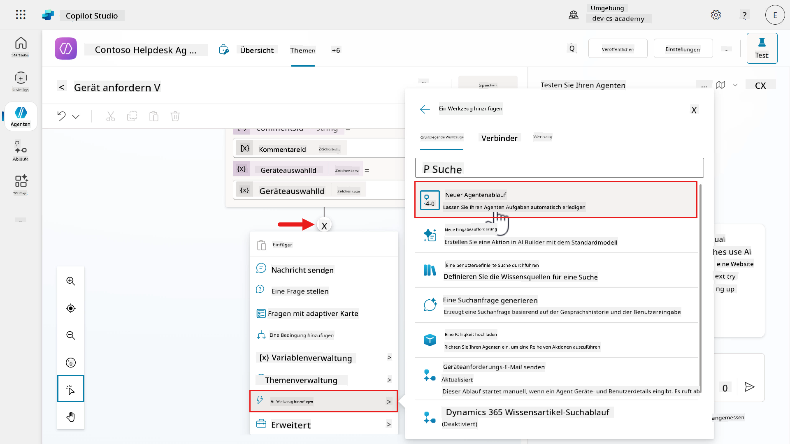

1. Der **Designer** für Agenten-Flows wird mit einem Trigger und einer Aktion geladen.

    - **Trigger** - Wenn ein Agent den Flow aufruft
        - Dies löst einen Flow von einem Copilot Studio-Agenten aus.

    - **Aktion** - Antwort an den Agenten
        - Dies sendet eine Antwort, die Ausgabewerte an den Copilot Studio-Agenten enthalten kann.

    Wählen Sie den Trigger aus.

    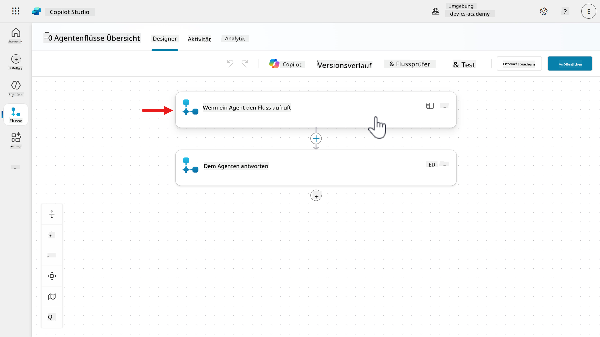

1. Als Nächstes fügen wir mehrere Eingaben für den Agenten-Flow hinzu.

    - `DeviceSharePointId` - Dies speichert den Wert, die ID, des SharePoint-Elements. Dieser ID-Wert ist eine Ausgabe des "Fragen mit adaptiver Karte"-Knotens, bei dem der Benutzer das Gerät ausgewählt hat.

    - `User` - Dies wird der Name des Benutzers sein, der aus einer Systemvariable des Agenten stammt.

    - `AdditionalComments` - Dies wird der Kommentar sein, den der Benutzer eingegeben hat, und ist eine Ausgabe des "Fragen mit adaptiver Karte"-Knotens.

    Zuerst fügen wir `DeviceSharePointId` als Eingabe für unseren Trigger hinzu. Wählen Sie **+ Eingabe hinzufügen**.

    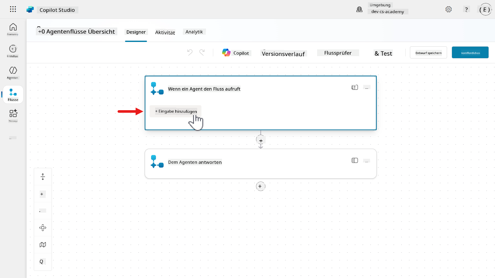

1. Für den Typ der Benutzereingabe wählen Sie **Text**.

    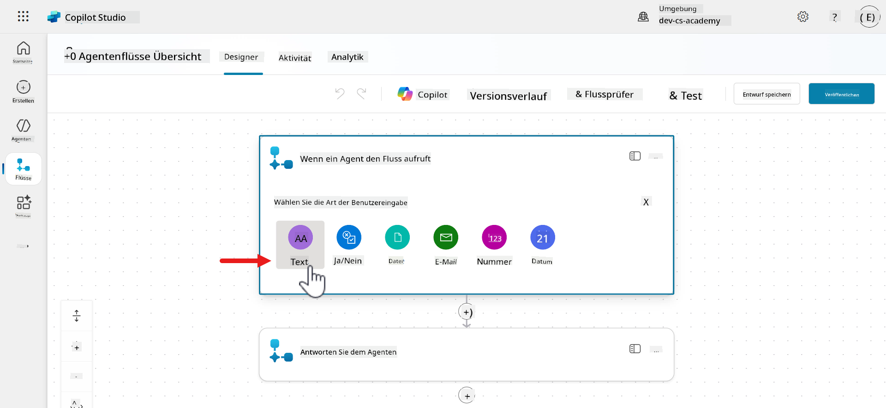

1. Für den Namen der Eingabe geben Sie Folgendes ein.

    ```text
    DeviceSharePointId
    ```

    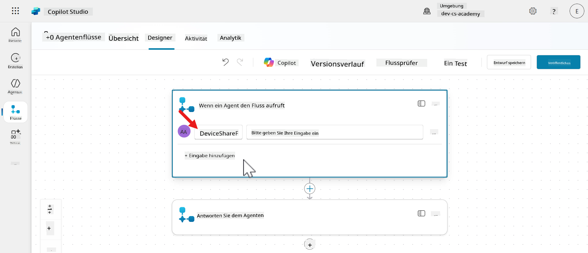

1. Jetzt fügen wir die zweite Eingabe, `User`, hinzu. Wiederholen Sie die gleichen Schritte, wählen Sie **+ Eingabe hinzufügen** und wählen Sie **Text**.

    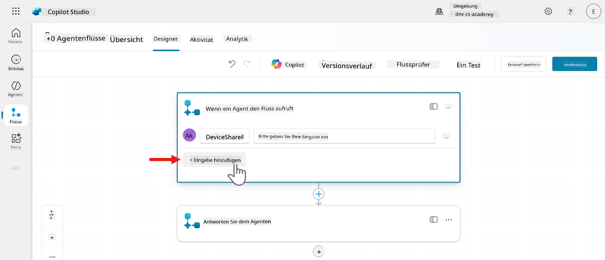

1. Für den Namen der Eingabe geben Sie Folgendes ein.

    ```text
    User
    ```

    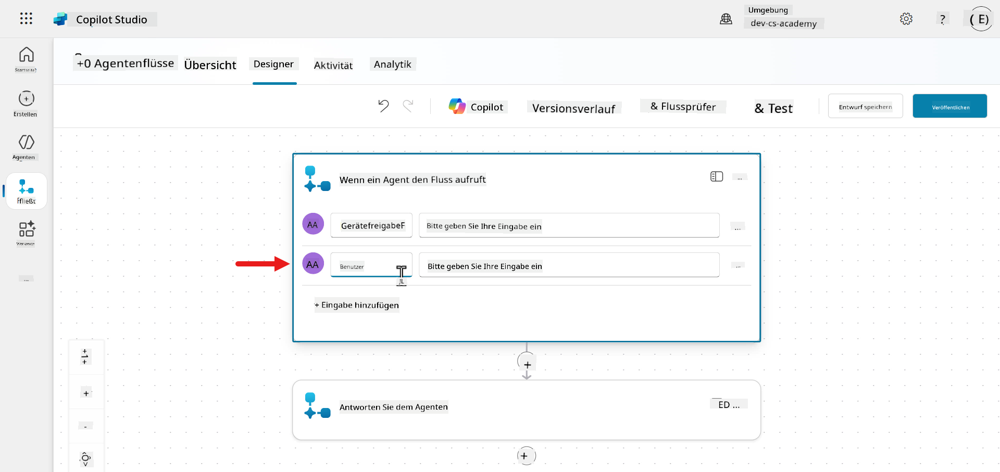

1. Jetzt fügen wir die dritte Eingabe, `AdditionalComments`, hinzu. Wiederholen Sie die gleichen Schritte, wählen Sie **+ Eingabe hinzufügen** und wählen Sie **Text**.

    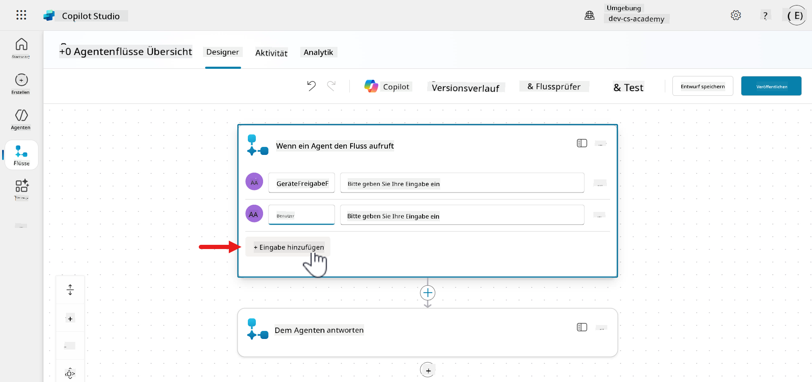

1. Für den Namen der Eingabe geben Sie Folgendes ein.

    ```text
    AdditionalComments
    ```

    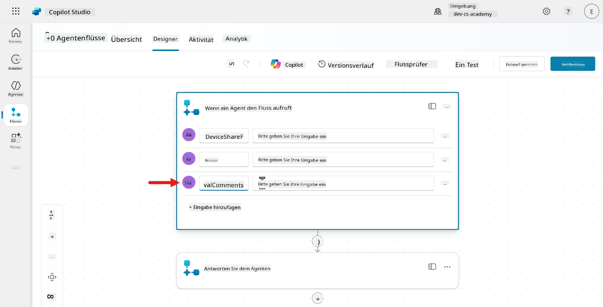

1. Für die Eingabe `AdditionalComments` aktualisieren wir sie, um sie optional zu machen. Wählen Sie das **Ellipsen-Symbol (...)** und dann **Feld optional machen**.

    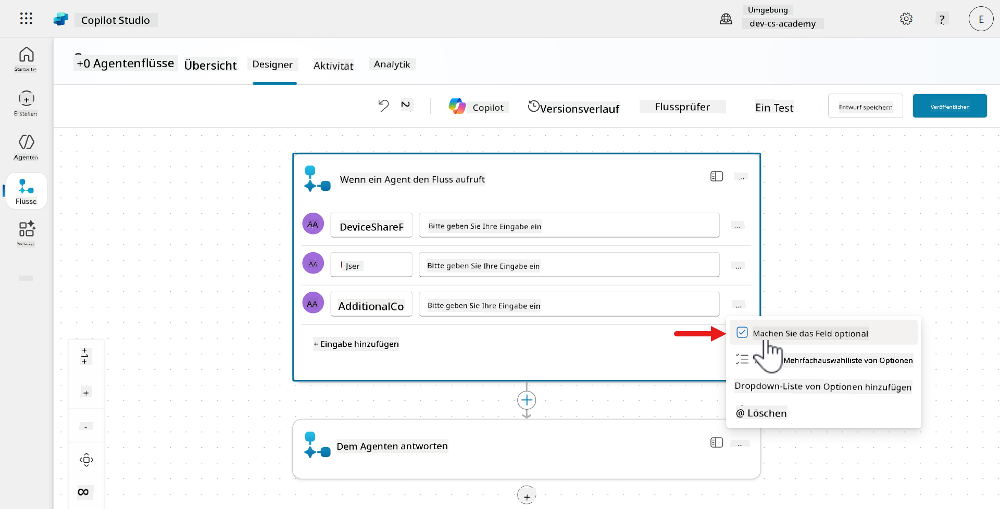

1. Gute Arbeit! Der Trigger ist jetzt konfiguriert, machen wir weiter. Wählen Sie das **Plus-Symbol +** unter dem Trigger, um eine neue Aktion einzufügen.

    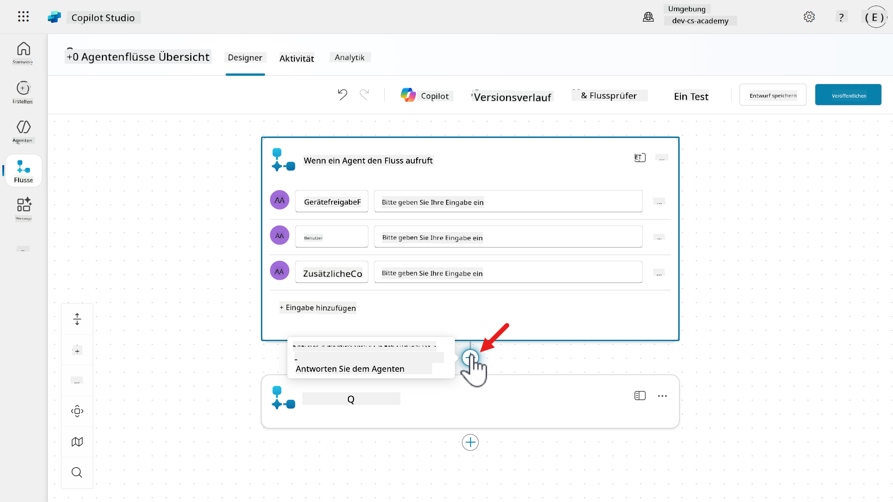

1. Das **Aktions-Paneel** wird angezeigt, in dem Sie Aktionen aus über 1400 integrierten Connectors zu Microsoft- und Drittanbieterdiensten anzeigen können. Geben Sie im **Suchfeld** Folgendes ein,

    ```text
    Get item
    ```

    Eine Liste von Aktionen wird in den Suchergebnissen angezeigt. Wählen Sie die Aktion **Element abrufen** aus dem **SharePoint-Connector**.

    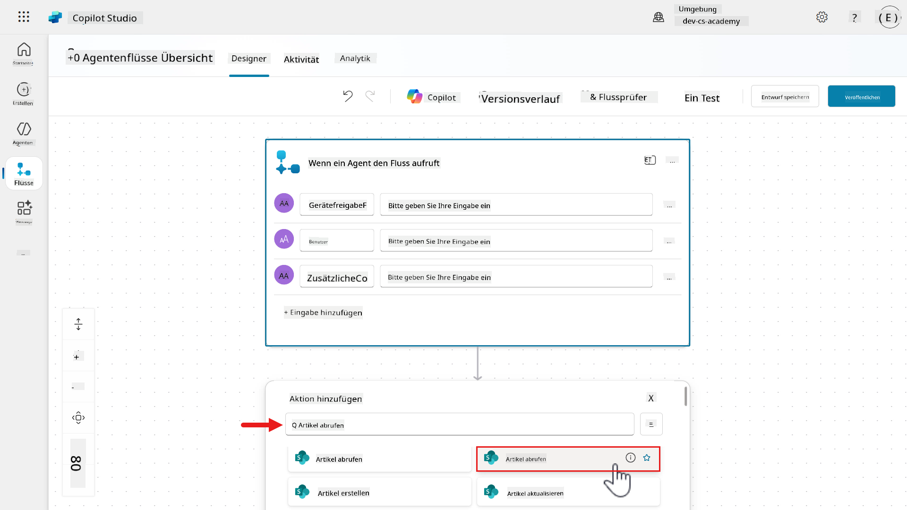

1. Jetzt können wir die Aktion **Element abrufen** konfigurieren.

    Wählen Sie das **Ellipsen-Symbol (...)** in der Aktion **Element abrufen**.

    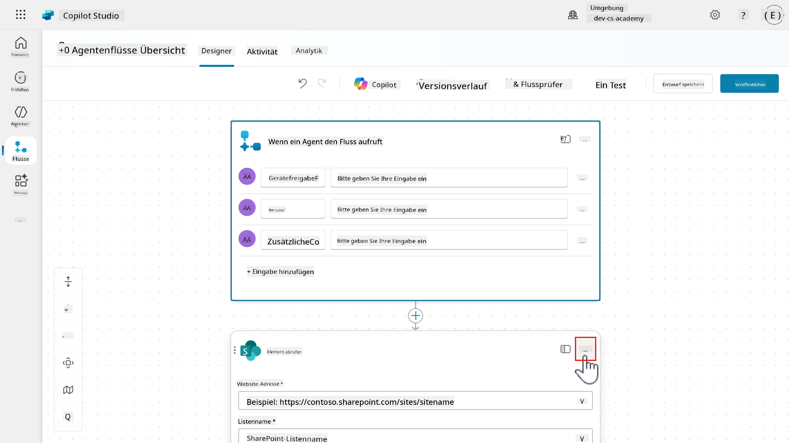

1. Wählen Sie **Umbenennen**.

    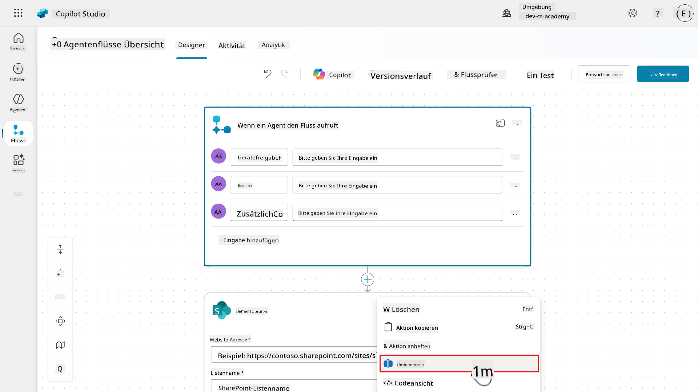

1. Benennen Sie die Aktion um in,

    ```text
    Get Device
    ```

    

1. Im Feld **Website-Adresse** wählen Sie die **Website-Adresse** der Contoso IT SharePoint-Website aus, die in [Lektion 00 - Kurssetup - Schritt 3: Neue SharePoint-Website erstellen](../00-course-setup/README.md#step-4-create-new-sharepoint-site) erstellt wurde.

    Im Feld **Listenname** wählen Sie die **Geräte**-SharePoint-Liste aus.

    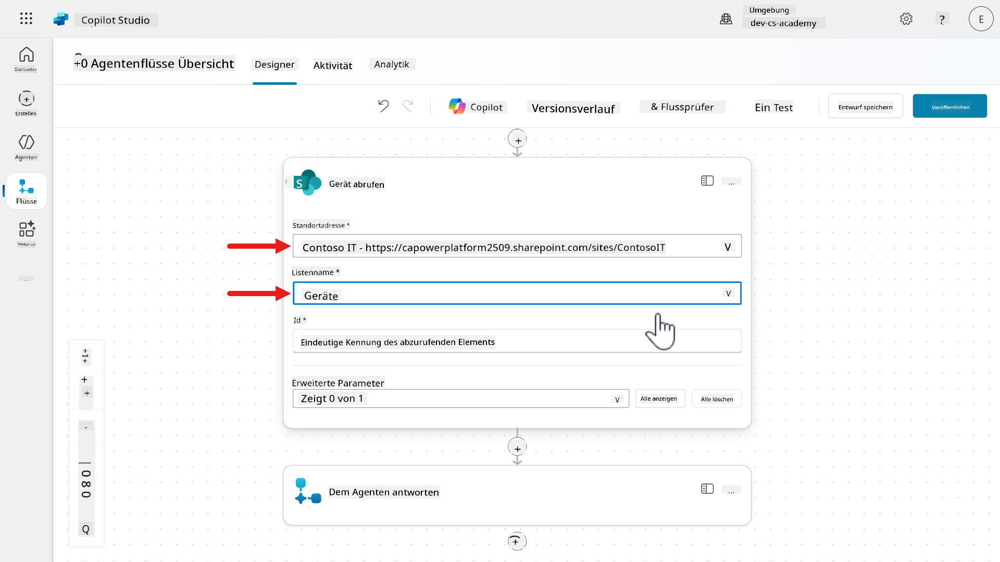

1. Im Feld **Id** wählen Sie das **Blitz-Symbol** oder das **fx-Symbol** rechts aus.

    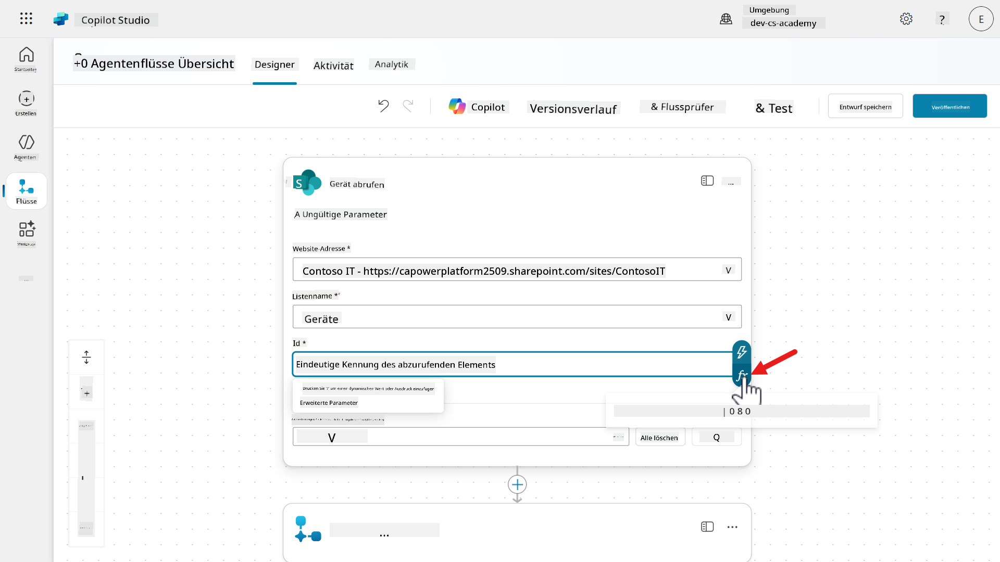

1. Im Tab **Dynamischer Inhalt** des Flyout-Panels geben Sie Folgendes ein,

    ```text
    sharepoint
    ```

    Die Suchergebnisse zeigen Eingabeparameter an, die mit dem gesuchten Wert übereinstimmen. Wählen Sie den **DeviceSharePointId**-Parameter aus dem Trigger aus.

    Wählen Sie **Hinzufügen**, um die dynamische Inhaltseingabe in den **Id**-Parameter der Aktion einzufügen.

    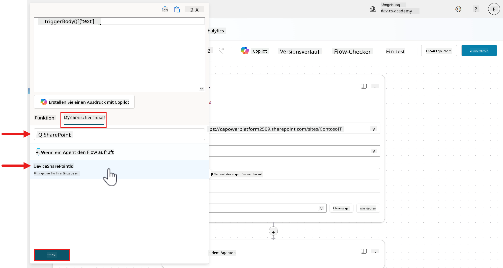

1. Die dynamische Inhaltseingabe aus dem Trigger wird jetzt im **Id**-Parameter der Aktion referenziert. Als Nächstes aktualisieren wir einen der erweiterten Parameter. Wählen Sie **Alle anzeigen**, um die erweiterten Parameter anzuzeigen.

    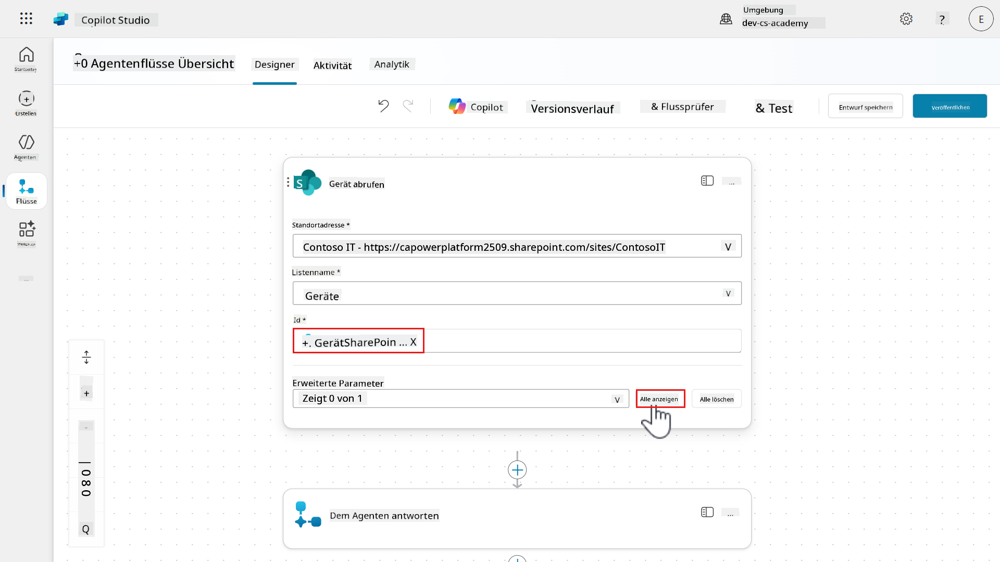

1. Der Parameter **Spalten durch Ansicht begrenzen** wird angezeigt und ist standardmäßig auf **Alle Spalten verwenden (Nicht begrenzen)** eingestellt. Wir aktualisieren diesen Wert auf eine Ansicht, um die zurückgegebenen Spalten in der Antwort der Aktion zu begrenzen. Wählen Sie den Parameter **Spalten durch Ansicht begrenzen**, um die Liste der Ansichten anzuzeigen.

    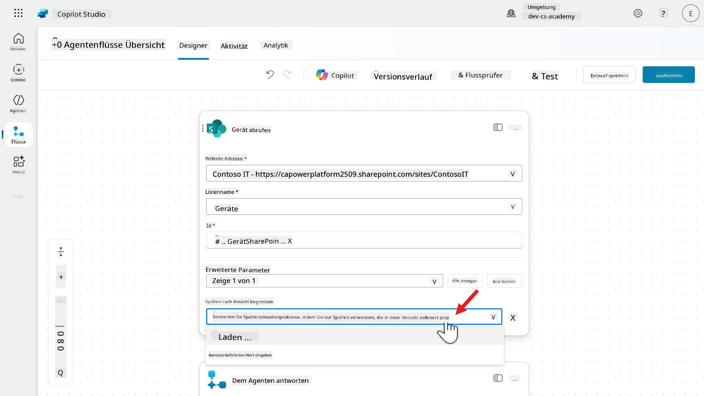

1. Wählen Sie die Ansicht **Alle Elemente**.

    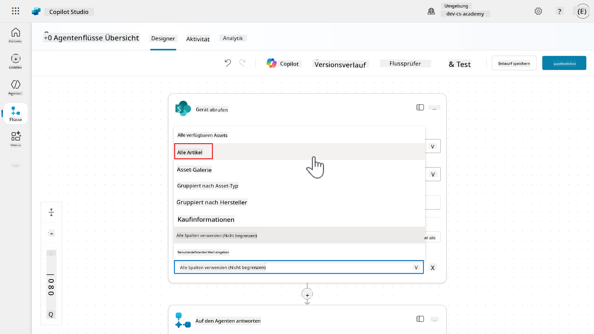

1. Wählen Sie das **Plus-Symbol +** unter der Aktion _Gerät abrufen_, um eine neue Aktion einzufügen.

    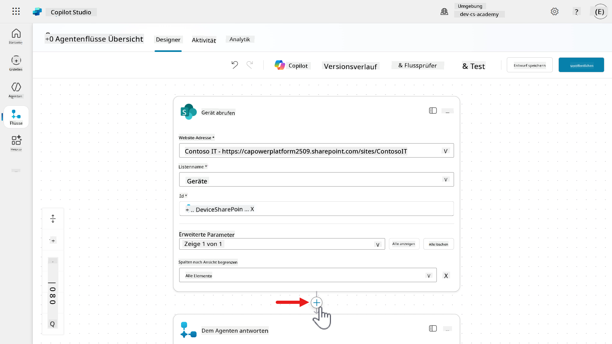

1. Geben Sie im Suchfeld Folgendes ein,

    ```text
    send an email
    ```

    Eine Liste von Aktionen wird in den Suchergebnissen angezeigt. Wählen Sie die Aktion **E-Mail senden (V2)** aus dem **Office 365 Outlook-Connector**.

    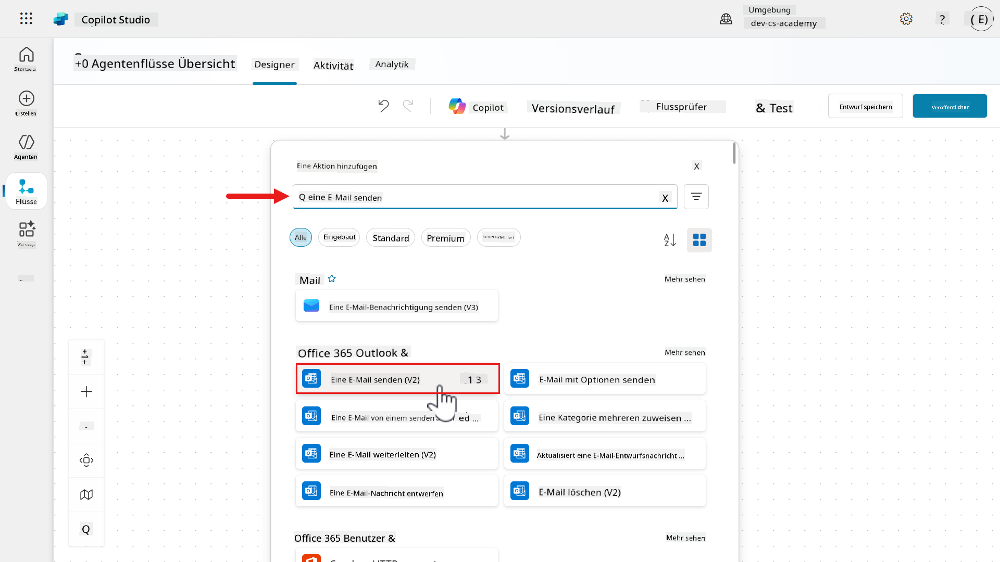

1. Als Nächstes müssen wir eine Verbindung für die Connector-Aktion erstellen. Wählen Sie **Anmelden**.

    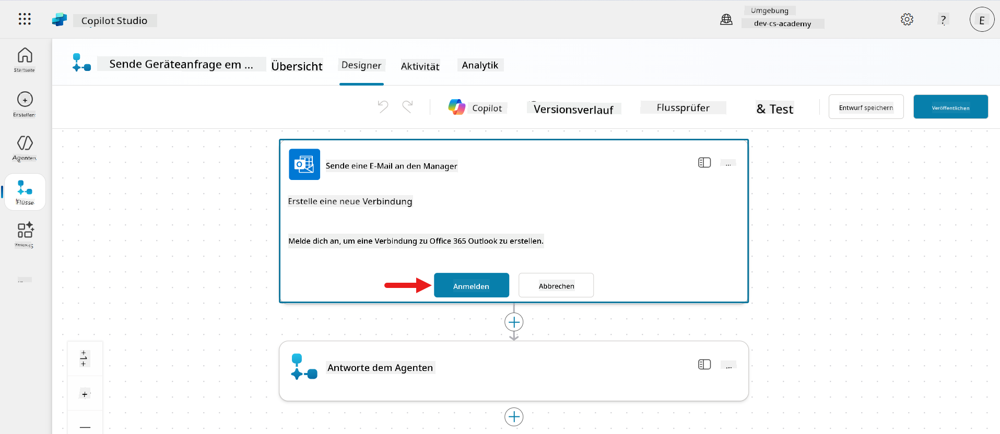

1. Wählen Sie Ihr angemeldetes Benutzerkonto aus.

    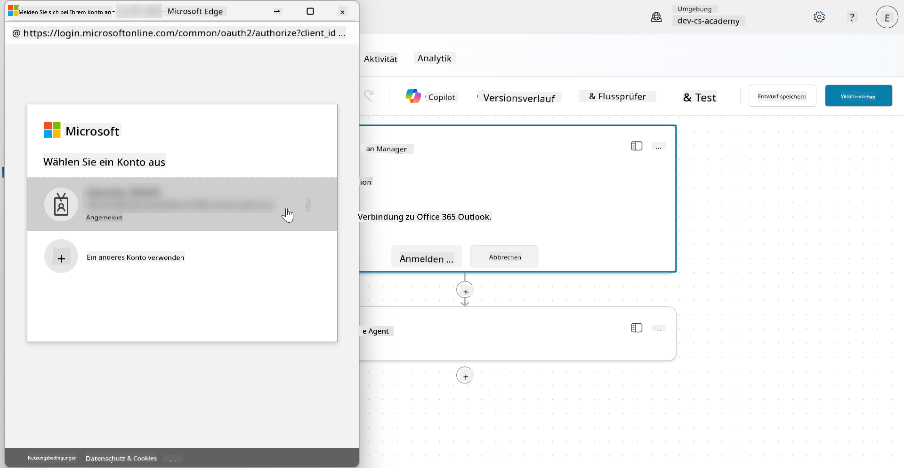

1. Wählen Sie **Zugriff erlauben**. Eine Verbindung wurde nun erstellt.

    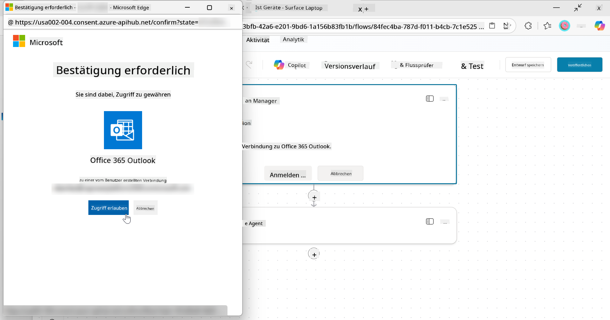

1. Benennen Sie die Aktion um in,

    ```text
    Send an email to manager
    ```

    Definieren wir als Nächstes die Eingabeparameter unserer Aktion.

    Für den Eingabeparameter **An** wählen Sie sich selbst aus. Normalerweise wäre dies Ihr Manager oder wir würden eine andere Aktion verwenden, die Ihren Manager basierend auf Ihrem Entra-ID-Profil abruft, aber für den Zweck dieser Lektion wählen Sie sich selbst aus.

    Für den Eingabeparameter **Betreff** geben Sie Folgendes ein,

    ```text
    Request type: new device
    ```

    Für den Eingabeparameter **Text** geben Sie Folgendes ein,

    ```text
    Hi,

    New device requested from

    Manufacturer:
    Model:
    Link to item in SharePoint
    Additional comments from:

    This is an automated email from Contoso Helpdesk Copilot
    ```

    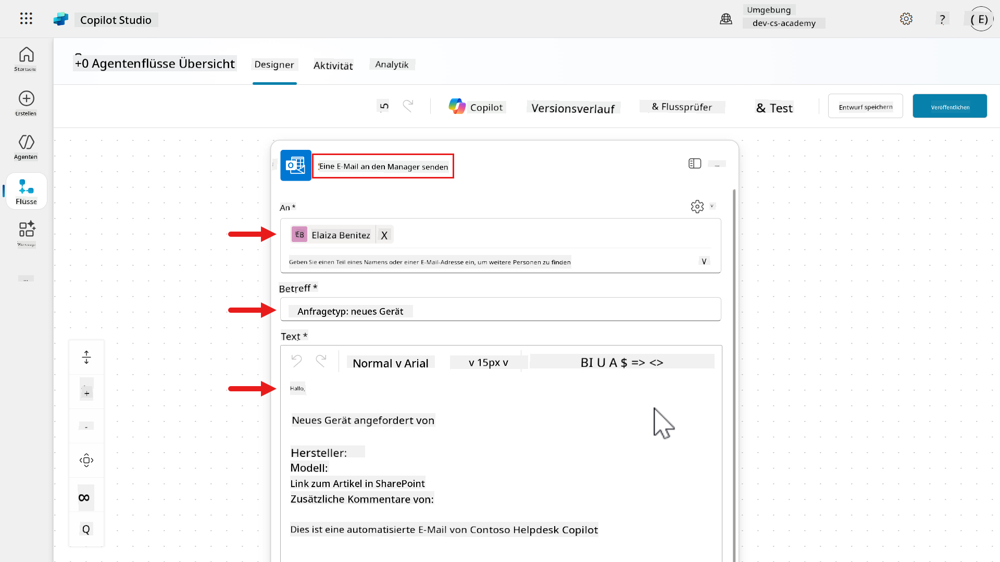

1. Als Nächstes aktualisieren wir den Eingabeparameter **Text** mit Referenzen zu dynamischen Inhaltseingaben aus dem **Trigger** oder der Aktion **Element abrufen**. Geben Sie nach der zweiten Zeile ein Leerzeichen ein, da wir den Namen des Benutzers aus der Trigger-Eingabe, **User**, einfügen werden.

    Wählen Sie das **Blitz-Symbol** oder das **fx-Symbol** rechts aus.

    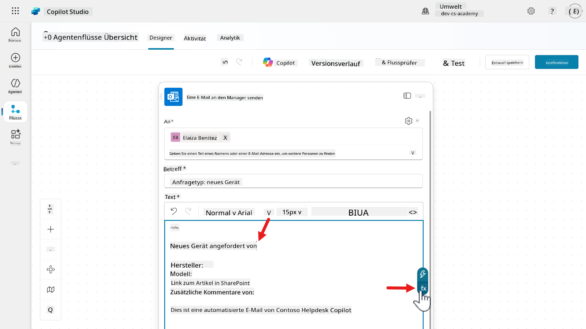

1. Im Tab **Dynamischer Inhalt** des Flyout-Panels wählen Sie die Eingabe **User** aus dem Trigger aus.

    Wählen Sie **Hinzufügen**, um die dynamische Inhaltseingabe **User** in den Eingabeparameter **Text** der Aktion einzufügen.

    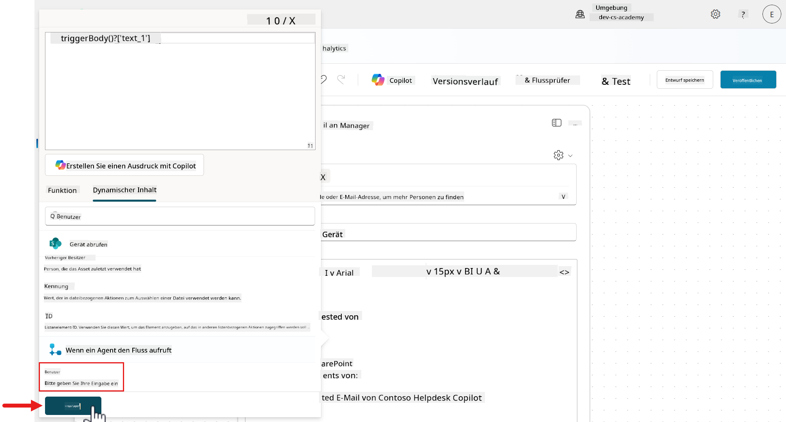
1. Die dynamischen Inhalteingaben aus dem Trigger werden jetzt im **Body**-Parameter der Aktion referenziert. Wir wiederholen dies für die verbleibenden Zeilen im E-Mail-Nachrichtentext.

    

1. Klicken Sie in den Bereich neben `Hersteller:`. Wählen Sie das **Blitzsymbol** oder das **fx-Symbol** rechts aus.

    Geben Sie im Tab **Dynamische Inhalte** des Flyout-Panels Folgendes in das Suchfeld ein,

    ```text
    manufacturer
    ```

    Wählen Sie die Eingabe **Herstellerwert** aus dem Trigger und klicken Sie auf **Hinzufügen**.

    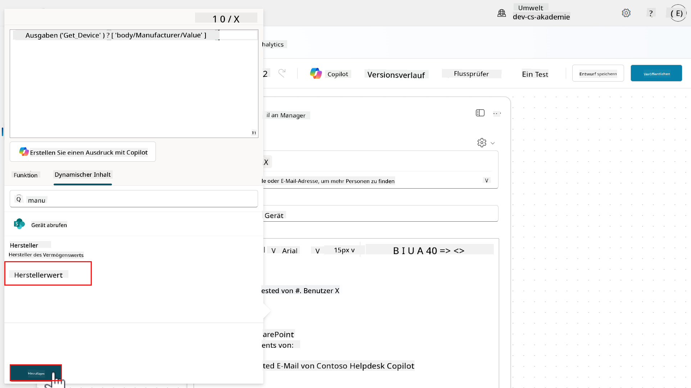

1. Klicken Sie in den Bereich neben `Modell:`. Wählen Sie das **Blitzsymbol** oder das **fx-Symbol** rechts aus.

    Geben Sie im Tab **Dynamische Inhalte** des Flyout-Panels Folgendes in das Suchfeld ein,

    ```text
    model
    ```

    Wählen Sie die Eingabe **Modell** aus der Aktion **Element abrufen** und klicken Sie auf **Hinzufügen**.

    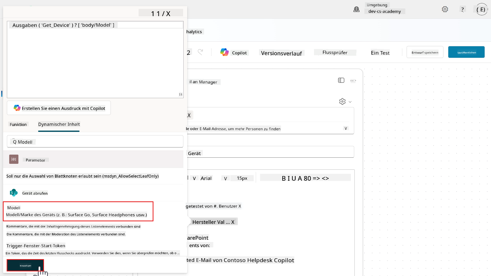

1. Für den Text `Link zu Element in SharePoint` werden wir diesen in der E-Mail-Nachricht als Hyperlink aktualisieren. Klicken Sie an den Anfang der Zeile und wählen Sie das **Blitzsymbol** oder das **fx-Symbol** rechts aus.

    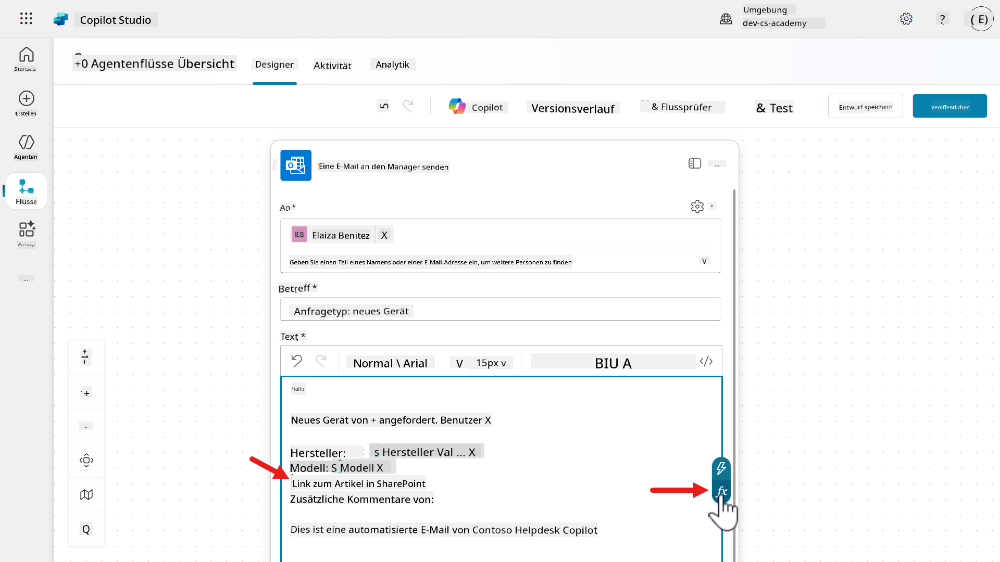

1. Klicken Sie nach dem HTML-Anker-Tag und wählen Sie das **Blitzsymbol** oder das **fx-Symbol** rechts aus.

    Geben Sie im Tab **Dynamische Inhalte** des Flyout-Panels Folgendes in das Suchfeld ein,

    ```text
    link to item
    ```

    Wählen Sie die Eingabe **Link zu Element** aus der Aktion **Element abrufen** und klicken Sie auf **Hinzufügen**.

    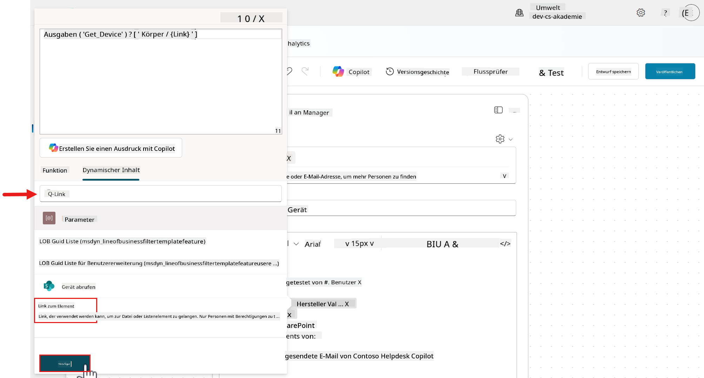

1. Wechseln Sie zum HTML-Editor, indem Sie das Symbol **&lt;/&gt;** auswählen.

    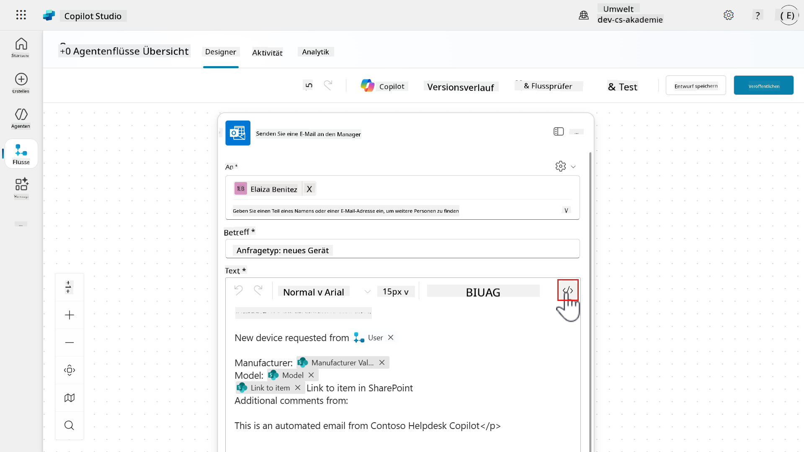

1. Der HTML-Editor ist jetzt aktiviert. Klicken Sie vor den Text `Link zu Element in SharePoint`, fügen Sie ein HTML-Anker-Tag hinzu, um einen Hyperlink zu erstellen. Kopieren und fügen Sie Folgendes ein.

    ```text
    <a href="
    ```

    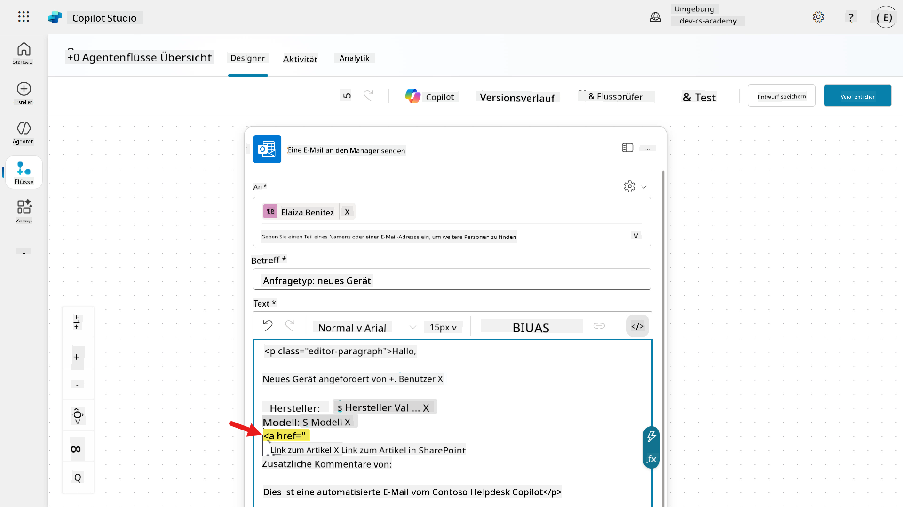

1. Die dynamische Inhalteingabe von **Link zu Element** wird jetzt im **Body**-Parameter referenziert. Klicken Sie nach der Eingabe **Link zu Element**, kopieren und fügen Sie Folgendes ein.

    ```text
    ">
    ```

    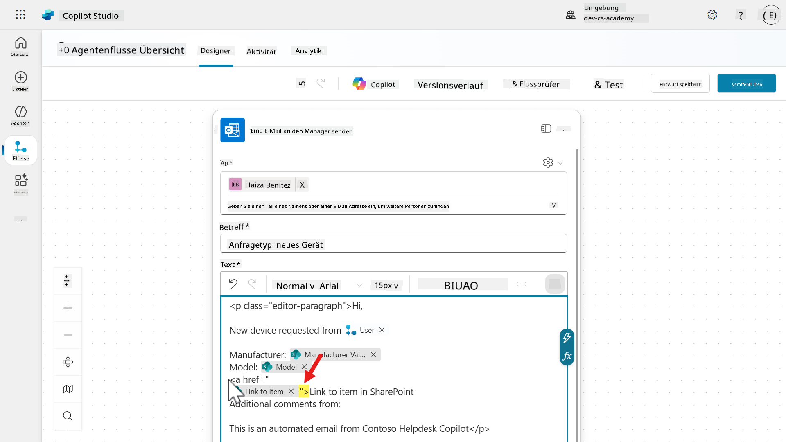

1. Klicken Sie nach dem Text `Link zu Element in SharePoint`, schließen Sie das HTML-Anker-Tag. Kopieren und fügen Sie Folgendes ein.

    ```text
    </a>
    ```

    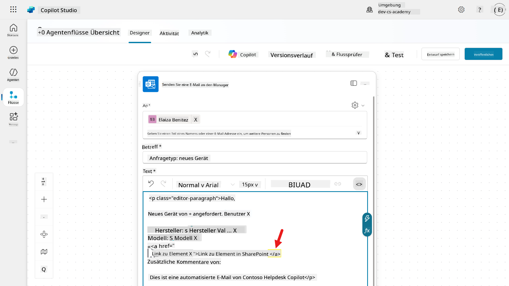

1. Wählen Sie das Symbol **&lt;/&gt;**, um die Code-Ansicht umzuschalten.

    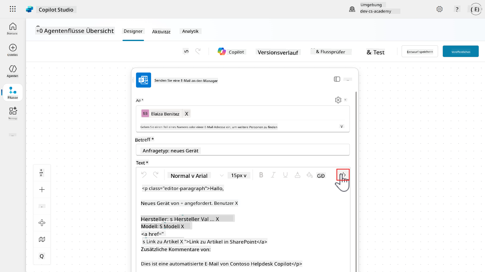

1. Wählen Sie dann erneut das Symbol **&lt;/&gt;**, um die Code-Ansicht wieder umzuschalten.

    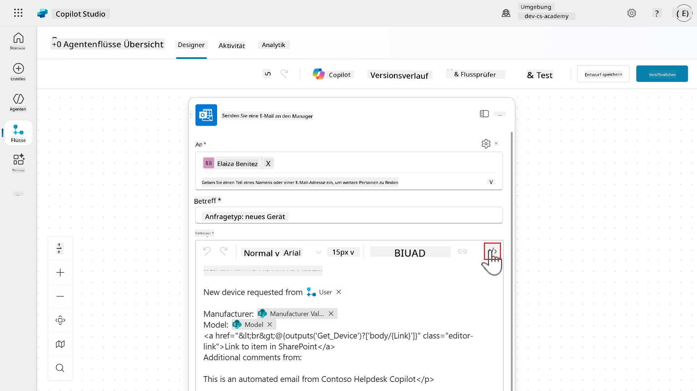

1. Beachten Sie, dass mehrere zusätzliche Zeichen `&lt;br&gt;` vorhanden sind. Löschen Sie diese Zeichen.

    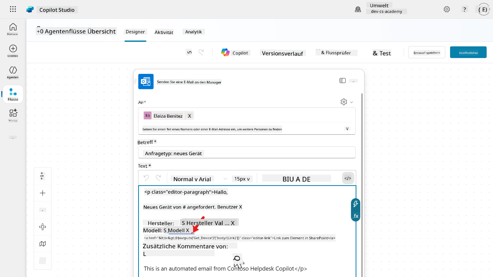

1. Wir haben jetzt einen Hyperlink zu unserem E-Mail-Nachrichtentext hinzugefügt 😎 Wählen Sie das Symbol **&lt;/&gt;**, um die Code-Ansicht umzuschalten.

    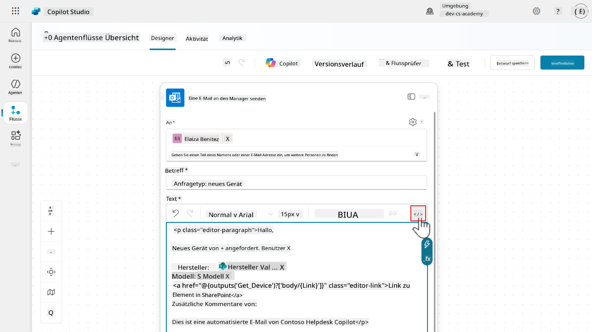

1. Klicken Sie nach dem Text `Zusätzliche Kommentare von` vor dem Doppelpunkt und wählen Sie das **Blitzsymbol** oder das **fx-Symbol** rechts aus.

    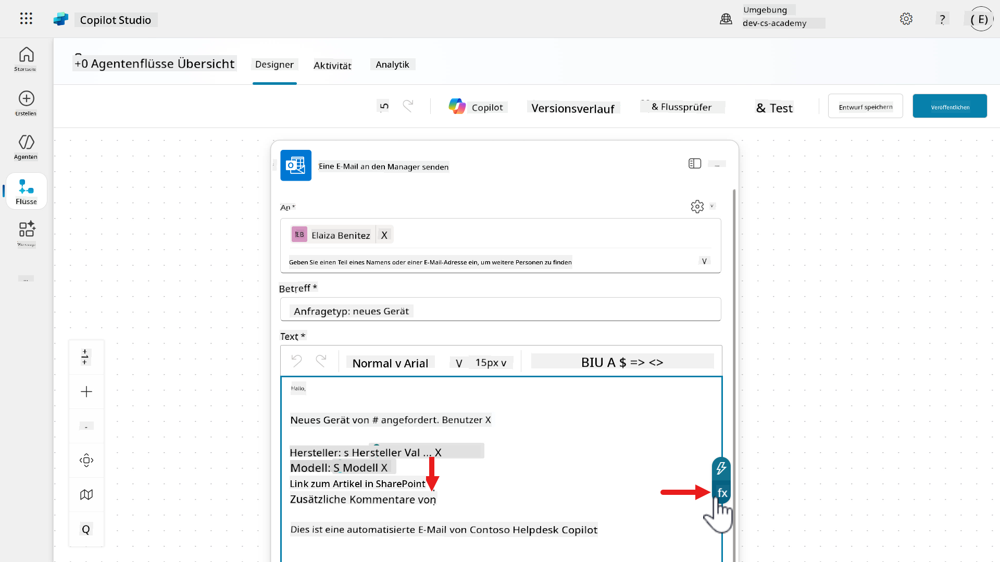

1. Geben Sie im Tab **Dynamische Inhalte** des Flyout-Panels Folgendes in das Suchfeld ein,

    ```text
    user
    ```

    Wählen Sie den **Benutzer**-Parameter aus dem Trigger und klicken Sie auf **Hinzufügen**.

    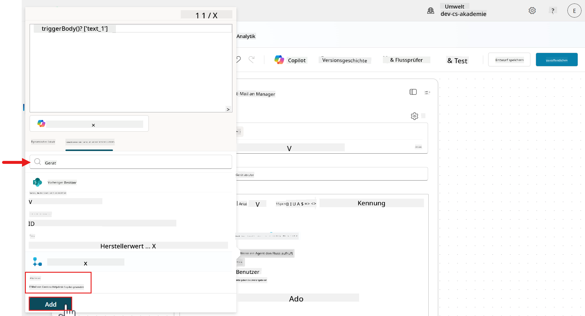

1. Wir werden jetzt einen Ausdruck einfügen, der den Wert von Zusätzlichen Kommentaren anzeigt, wenn der Benutzer im Knoten **Adaptive Karte anfordern** Kommentare bereitgestellt hat, andernfalls wird "Keine" angezeigt, wenn keine Kommentare bereitgestellt wurden.

    Klicken Sie nach dem Doppelpunkt und wählen Sie das **Blitzsymbol** oder das **fx-Symbol** rechts aus.

    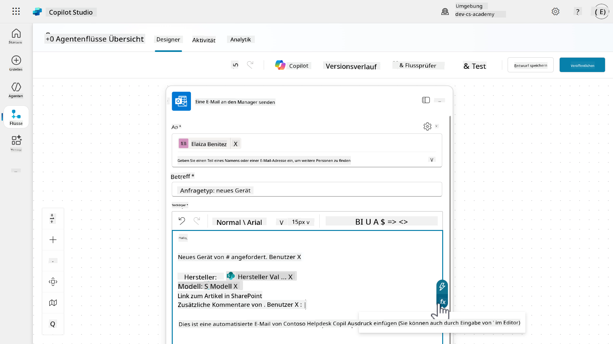

1. Geben Sie im Tab **Funktion** des Flyout-Panels und im Ausdrucksfeld oben Folgendes ein,

    ```text
    if(empty())
    ```

    Dieser Ausdruck verwendet die Funktion `if` für eine if-else-Anweisung.

    Die nächste verwendete Funktion ist `empty`, die überprüft, ob ein Wert in einem Zeichenfolgenparameter vorhanden ist oder nicht. Der zu referenzierende Zeichenfolgenparameter ist der Wert des Eingabeparameters `ZusätzlicheKommentare` aus dem Trigger.

    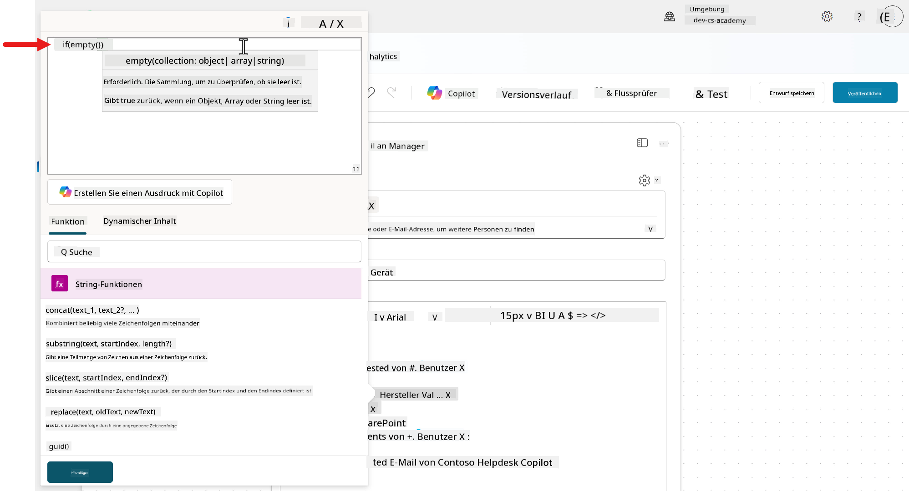

1. Klicken Sie als Nächstes **innerhalb der Klammern** nach der Funktion `empty`. Wir werden den Eingabeparameter `ZusätzlicheKommentare` aus dem Trigger einfügen.

    Wählen Sie den Tab **Dynamische Inhalte**. Geben Sie Folgendes in das Suchfeld ein,

    ```text
    Additional
    ```

    Scrollen Sie im Panel nach unten und wählen Sie den Eingabeparameter **ZusätzlicheKommentare** aus dem Trigger. Der Parameter wird jetzt als Zeichenfolgenparameter im Ausdruck hinzugefügt.

    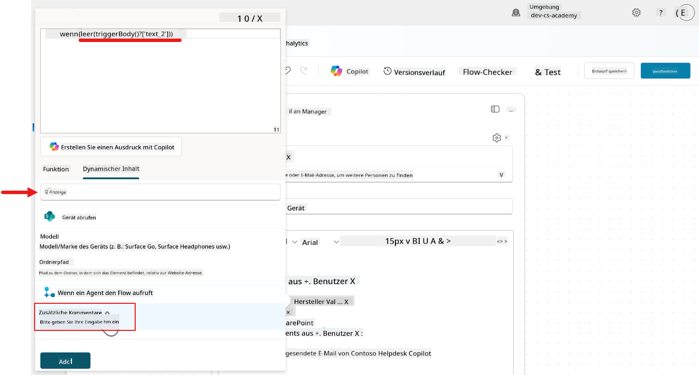

1. Als Nächstes definieren wir die **_true_**-Logik, bei der, wenn der Zeichenfolgenparameter `ZusätzlicheKommentare` leer ist, ein Text `Keine` angezeigt werden soll.

    Geben Sie nach der Klammer, die den Zeichenfolgenparameter umschließt, Folgendes ein,

    ```text
    , 'None',
    ```

    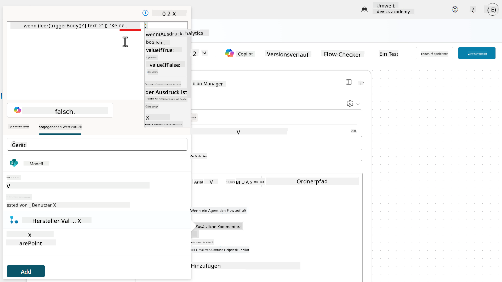

1. Schließlich definieren wir die **_false_**-Logik, bei der, wenn der Zeichenfolgenparameter `ZusätzlicheKommentare` nicht leer ist, der Wert des Eingabeparameters **ZusätzlicheKommentare** aus unserem Trigger angezeigt werden soll.

    > Zur Erinnerung: Dieser Wert stammt aus dem Feld Zusätzliche Kommentare der adaptiven Karte im Knoten **Mit adaptiver Karte anfordern** im Thema **Gerät anfordern**.

    Geben Sie nach dem Komma nach unserer **_true_**-Logik Folgendes ein, wählen Sie den Tab **Dynamische Inhalte**. Geben Sie Folgendes in das Suchfeld ein,

    ```text
    Additional
    ```

    Scrollen Sie im Panel nach unten und wählen Sie den Eingabeparameter **ZusätzlicheKommentare** aus dem Trigger. Der Parameter wird jetzt als Zeichenfolgenparameter im Ausdruck hinzugefügt.

    Fügen Sie ihn jetzt unserem **Body**-Parameter hinzu, indem Sie **Hinzufügen** auswählen.

    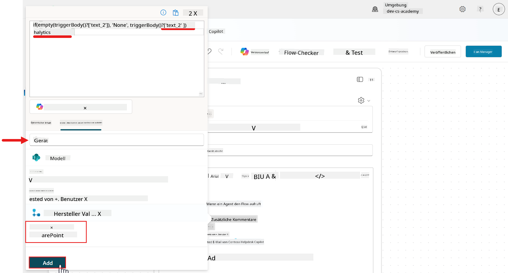

1. Hervorragend, unser Ausdruck ist fertig! Der Ausdruck wurde jetzt dem **Body**-Parameter hinzugefügt. Formatieren Sie abschließend die letzte Zeile kursiv.

    

1. Wir werden jetzt die Aktion **Antwort an den Agenten** aktualisieren, um den Wert des Parameters **Modellwert** aus der Aktion **Element abrufen** an den Agenten zurückzusenden.

    Halten Sie die linke Maustaste gedrückt und bewegen Sie sich im Designer nach oben, um die Aktion **Antwort an den Agenten** anzuzeigen.

    Wählen Sie die Aktion **Antwort an den Agenten** und wählen Sie den **Text**-Ausgabetyp aus.

    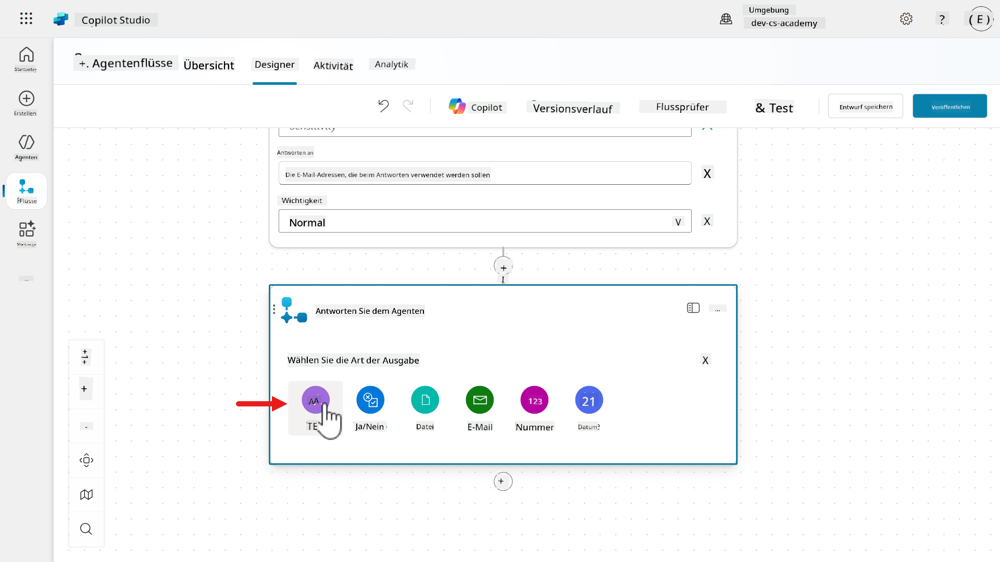

1. Geben Sie Folgendes als Namen der Ausgabe ein.

    ```text
    ModelValue
    ```

    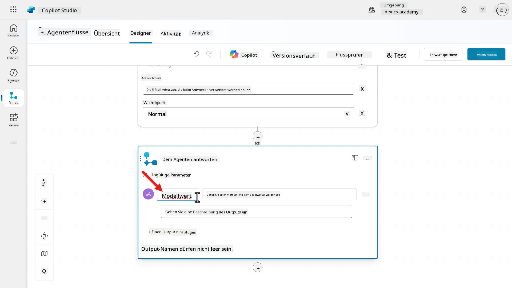

1. Wählen Sie das Wertefeld aus und klicken Sie auf das **Blitzsymbol** oder das **fx-Symbol** rechts.

    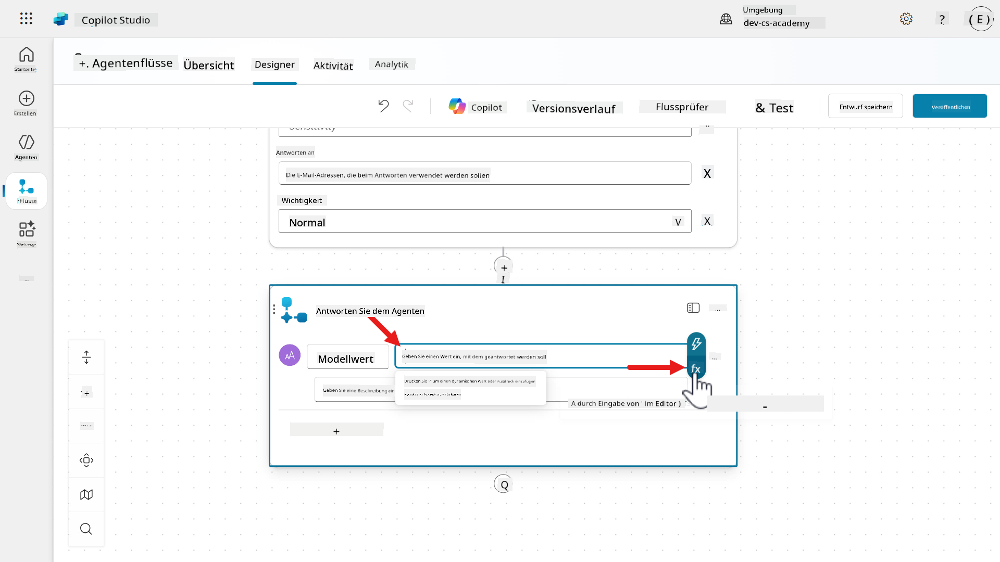

1. Geben Sie im Tab **Dynamische Inhalte** des Flyout-Panels Folgendes in das Suchfeld ein,

    ```text
    model
    ```

    Wählen Sie den Parameter **Modell** aus der Aktion **Element abrufen** und klicken Sie auf **Hinzufügen**.

    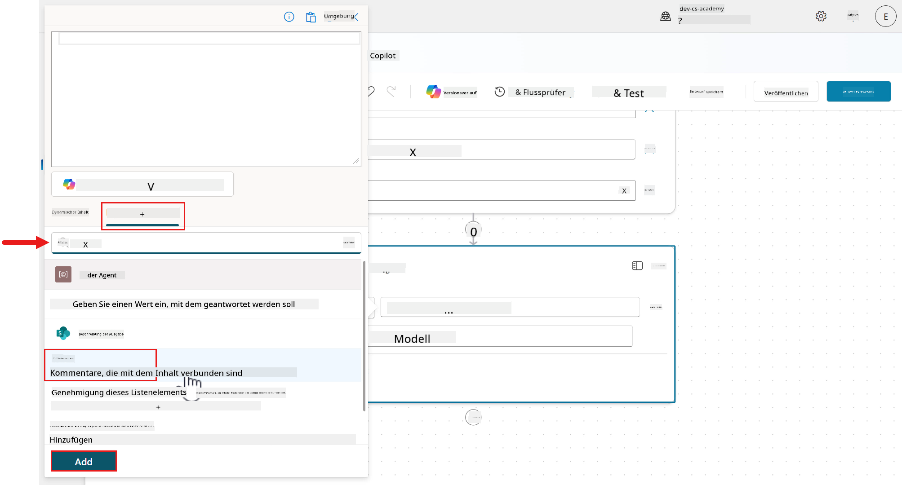

1. Der Parameter **Modell** ist jetzt der Wert der Textausgabe. Wählen Sie **Entwurf speichern**, um unseren Agentenfluss zu speichern.

    Wir haben unseren Agentenfluss abgeschlossen 👏🏻

    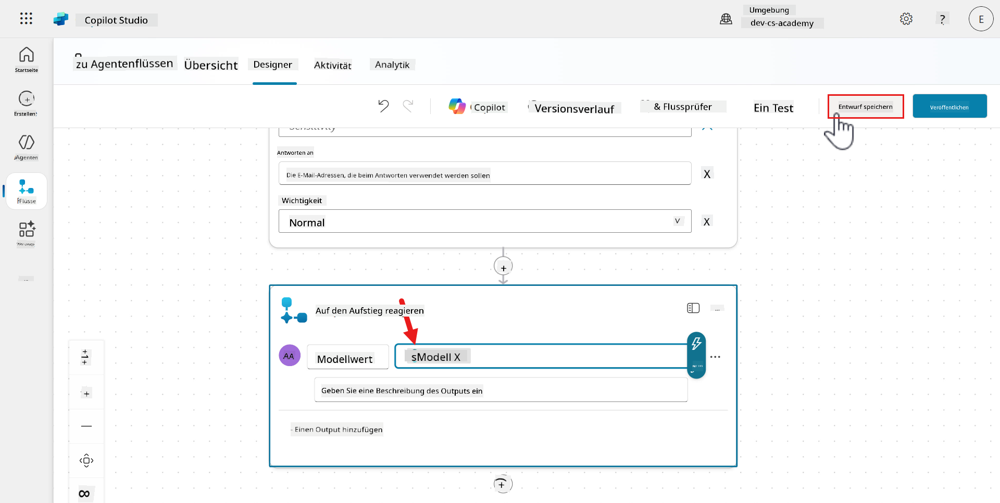

1. Lassen Sie uns eine weitere Aktualisierung unseres Agentenflusses vornehmen, bevor wir ihn veröffentlichen. Wählen Sie den Tab **Übersicht** und klicken Sie auf **Bearbeiten**.

    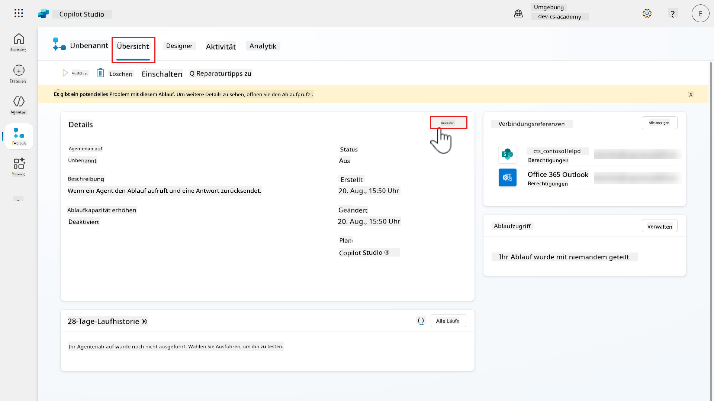

1. Kopieren und fügen Sie Folgendes als **Flow-Name** ein.

    ```text
    Send device request email
    ```

    Für die **Beschreibung** wählen Sie das **Aktualisierungssymbol**, um eine Beschreibung automatisch mithilfe von KI basierend auf dem Trigger und den Aktionen im Agentenfluss zu generieren.

    Wählen Sie **Speichern**, um den aktualisierten Namen und die Beschreibung des Agentenflusses zu speichern.

    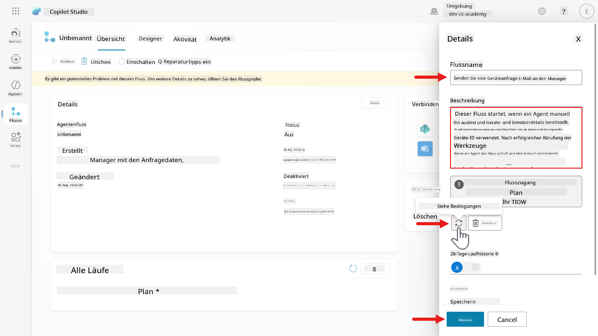

1. Wählen Sie den Tab **Designer** und klicken Sie auf **Veröffentlichen**, um den Agentenfluss zu veröffentlichen, damit er als Knoten im Thema **Gerät anfordern** hinzugefügt werden kann.

    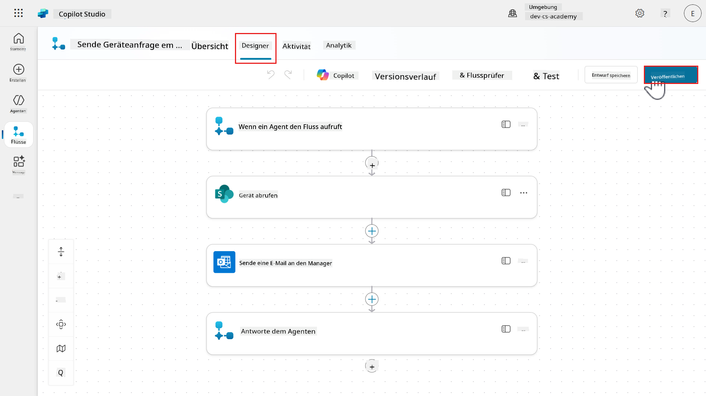

1. Eine Bestätigungsmeldung wird in Kürze angezeigt, um zu bestätigen, dass der Agentenfluss veröffentlicht wurde.

    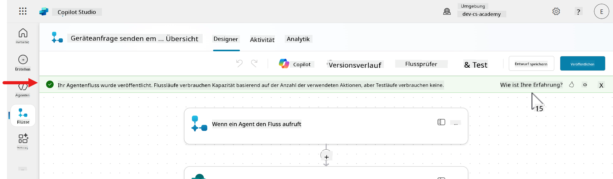

### 9.2 Agentenfluss zum Thema hinzufügen

Fügen wir nun den Agentenfluss zum Thema **Gerät anfordern** hinzu.

1. Wählen Sie **Agenten** im Menü auf der linken Seite und klicken Sie auf den **Contoso Helpdesk Agent**.

    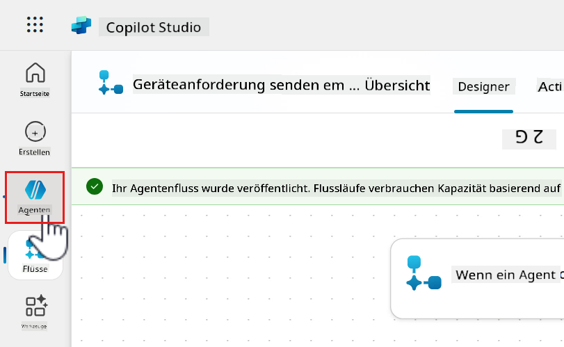

1. Wählen Sie den Tab **Themen**.

    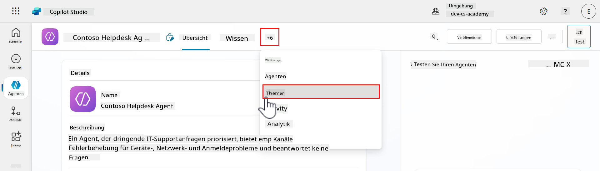

1. Wählen Sie das Thema **Gerät anfordern**.

    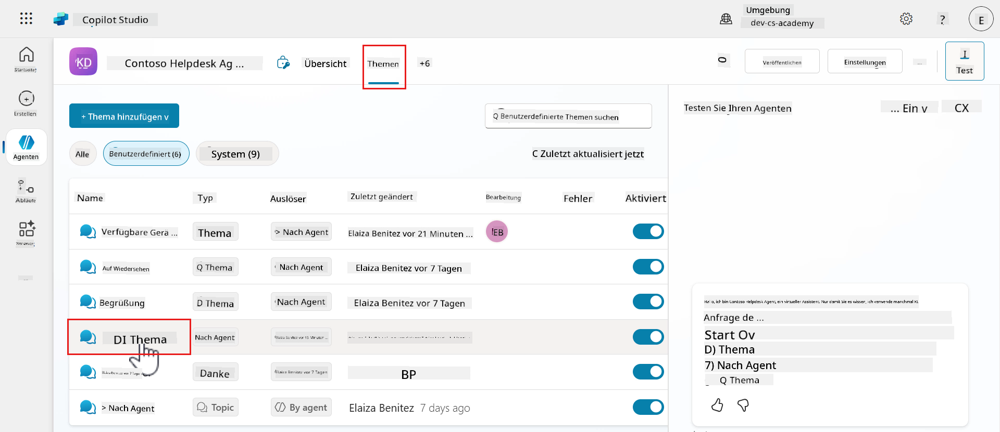

1. Scrollen Sie zum Knoten **Mit adaptiver Karte anfordern** und fügen Sie einen neuen Knoten hinzu.

    Wählen Sie **Ein Tool hinzufügen** und im Tab **Basis-Tools** des Flyout-Panels wählen Sie den Agentenfluss **E-Mail-Anfrage für Gerät senden**, den wir kürzlich erstellt und veröffentlicht haben.

    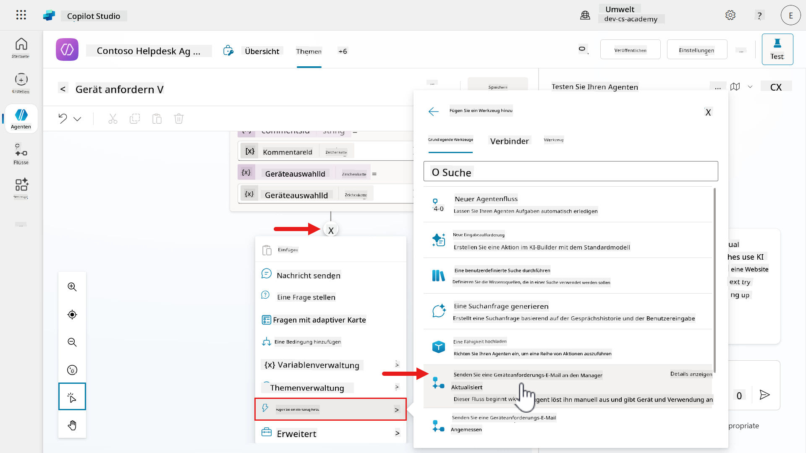

1. Für die Trigger-Eingaben unseres Agentenflusses müssen wir die Variablen-Ausgaben aus dem Knoten **Mit adaptiver Karte anfordern** auswählen.

    Wählen Sie das **Ellipsen-Symbol (...)** für die Eingabe **DeviceSharePointId**.

    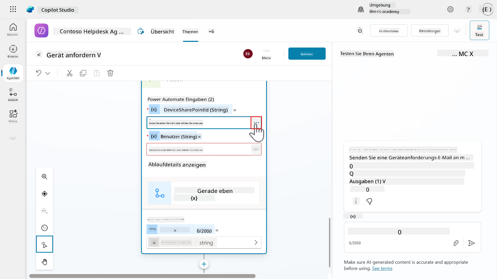

1. Wählen Sie die Variable **deviceSelectionId**, die eine der Ausgaben ist, die im Knoten **Mit adaptiver Karte anfordern** definiert wurde.

    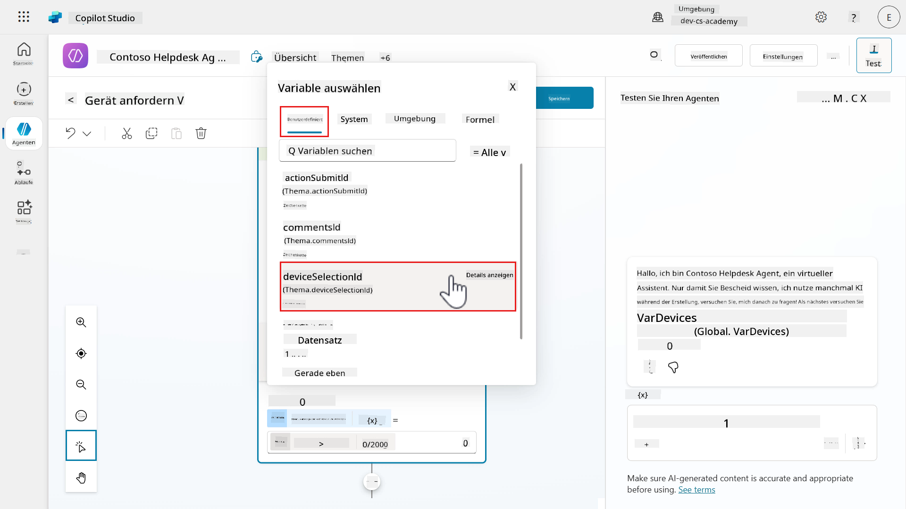

1. Wählen Sie als Nächstes das **Ellipsen-Symbol (...)** für die Eingabe **Benutzer**.

    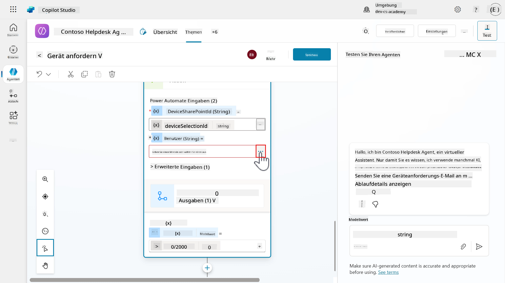

1. Wählen Sie den Tab **System** im Flyout-Variablen-Panel und klicken Sie auf **User.DisplayName**. Diese Variable speichert den Anzeigenamen des internen Benutzers, der mit dem Agenten interagiert.

    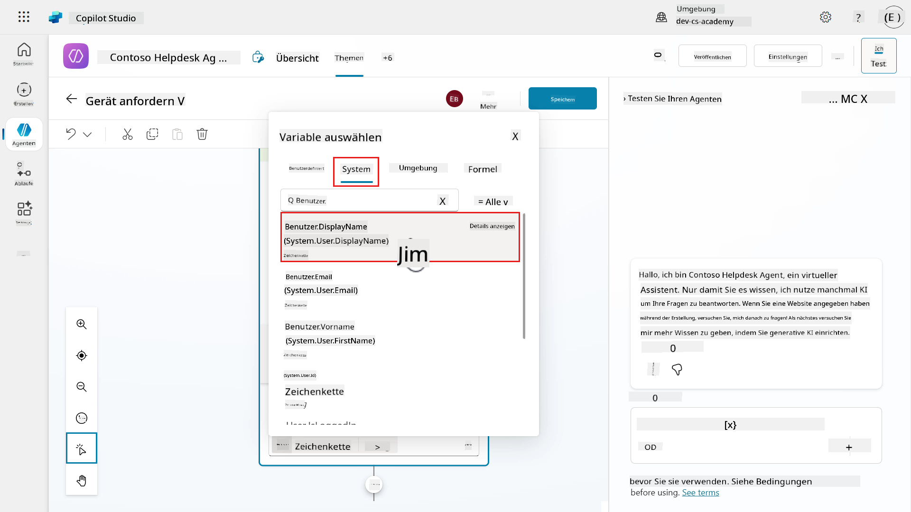

1. Wählen Sie als Nächstes das **größer als Symbol** für **Erweiterte Eingaben**, um die Eingabe **ZusätzlicheKommentare** anzuzeigen.

    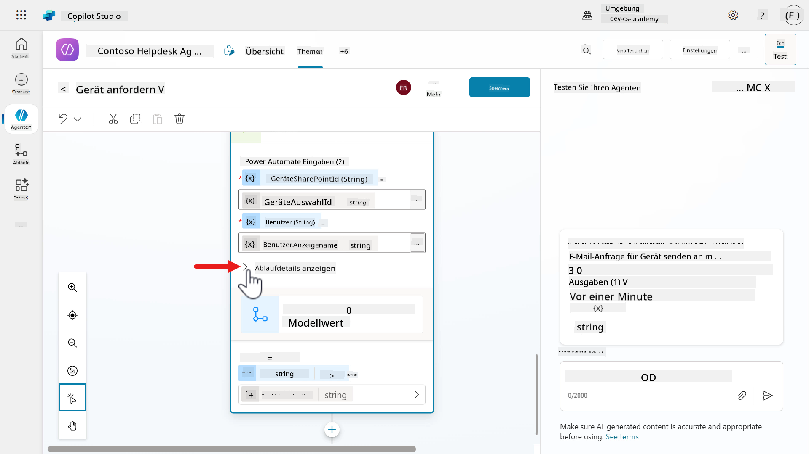

1. Wählen Sie das **Ellipsen-Symbol (...)** für die Eingabe ZusätzlicheKommentare.

    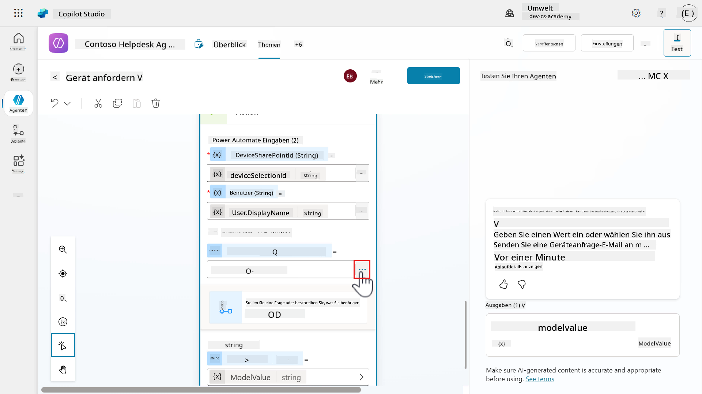

1. Wählen Sie den Tab **Formel** und das Erweiterungssymbol im Flyout-Variablen-Panel, da wir einen Power Fx-Ausdruck verwenden werden.

    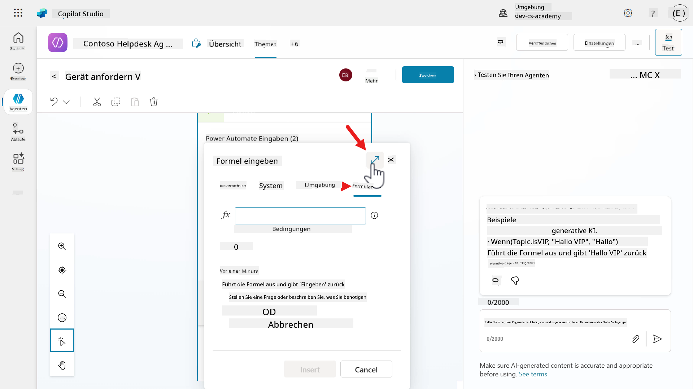

1. Ähnlich wie der Ausdruck im Agentenfluss, der eine bedingte Überprüfung mit der Funktion _if_ durchführt, aber diesmal
    - mit Power Fx-Funktionen,
    - und entweder keinen Wert oder den Wert der `commentsId`-Ausgabevariable aus dem Knoten **Mit adaptiver Karte anfordern** einfügt.

    Geben Sie die folgenden Funktionen in das Power Fx-Feld ein,

    ```text
    If(IsBlank())
    ```

Dieser Ausdruck verwendet die Funktion `If` für eine If-Else-Anweisung.

Die nächste Funktion, die verwendet wird, ist `IsBlank`, die überprüft, ob ein Wert in einem Zeichenfolgenparameter existiert oder nicht. Der zu referenzierende Zeichenfolgenparameter ist die Ausgabewariable `commentsId` aus dem **Ask with adaptive card**-Knoten.

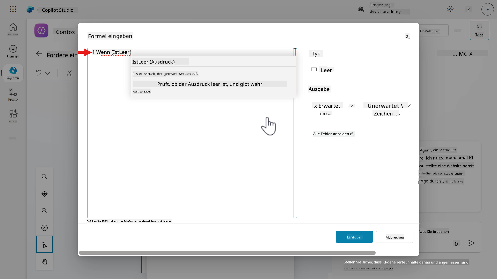

1. Klicken Sie als Nächstes **innerhalb der Klammern** nach der Funktion `IsBlank`. Wir werden die Ausgabewariable `commentsId` aus dem **Ask with adaptive card**-Knoten einfügen.

Geben Sie Folgendes innerhalb der Klammern ein,

    ```text
    Topic.commentsId
    ```

Und fügen Sie ein Komma nach der Klammer hinzu.

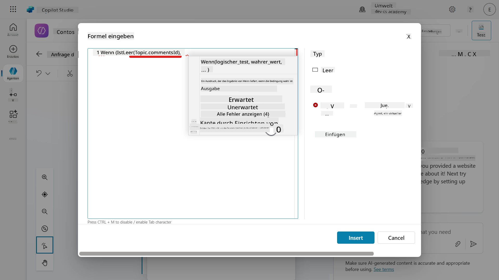

1. Als Nächstes definieren wir die Logik:

   - wenn **_true_** - falls der Zeichenfolgenparameter `Topic.commentsId` leer ist, möchten wir keinen Wert einfügen.
   - wenn **_false_** - falls der Zeichenfolgenparameter `Topic.commentsId` nicht leer ist, fügen wir den Wert der Variable commentsId ein.

Nach der Klammer, die den Zeichenfolgenparameter umschließt, geben Sie Folgendes ein,

    ```text
    "", Topic.commentsId)
    ```

Der Power Fx-Ausdruck sollte wie folgt aussehen,

    ```text
    If(IsBlank(Topic.commentsId), "", Topic.commentsId)
    ```

Super Arbeit, unser Ausdruck ist fertig! 🙌🏻 Wählen Sie nun **Insert**, um den Eingabeparameter des Agentenflusses auf den Power Fx-Ausdruck festzulegen.

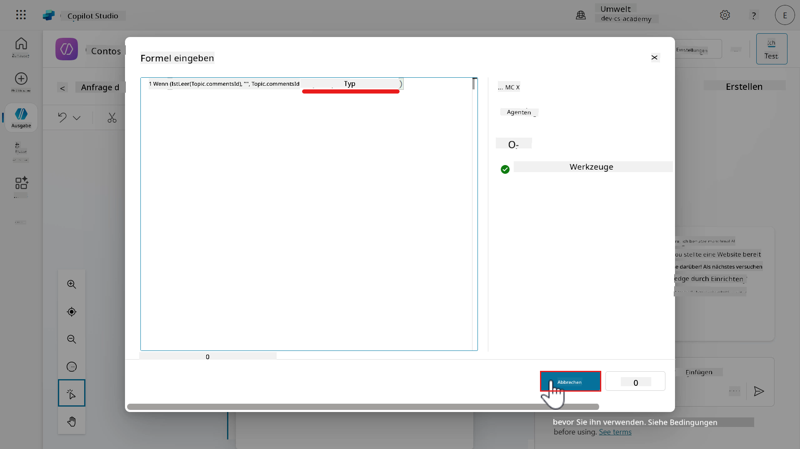

1. **Speichern** Sie das Thema.

### 9.3 Aktualisieren Sie das Thema "Request device" mit mehreren Knoten für eine bessere Benutzererfahrung

Als Nächstes fügen wir zwei weitere Knoten hinzu:

- **Send a message** - dies dient als Bestätigungsnachricht, die das ausgewählte Gerät referenziert und bestätigt, dass die Anfrage eingereicht wurde.

- **Topic management** - um das Gespräch zu beenden, leiten wir zum Knoten **End of conversation** weiter.

Legen wir los!

1. Wählen Sie das **Plus-Symbol +** unterhalb des Agentenfluss-Knotens und wählen Sie den Knoten **Send a message**.

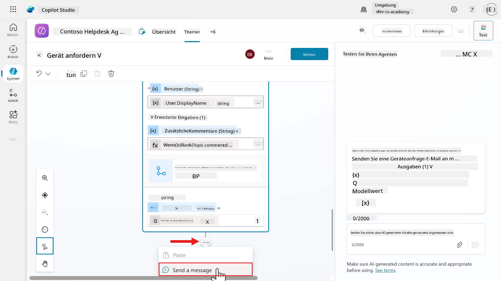

1. Geben Sie Folgendes in das Nachrichtenfeld ein,

    ```text
    Thanks
    ```

Wählen Sie dann **Insert variable**, da wir den Namen des Benutzers referenzieren werden.

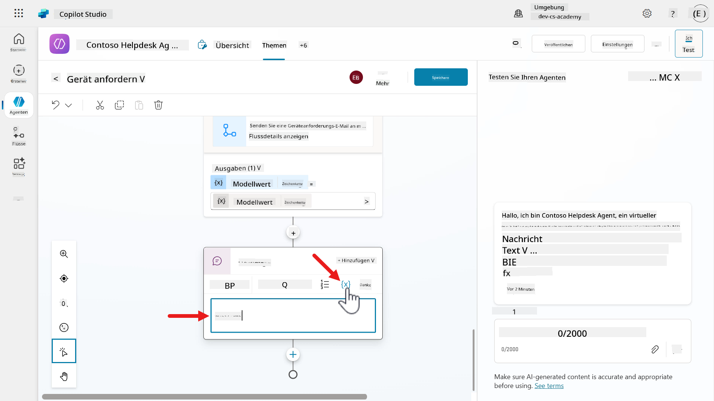

1. Wählen Sie die Registerkarte **System** und suchen Sie im Suchfeld nach `User`. Wählen Sie die Variable **User.DisplayName**.

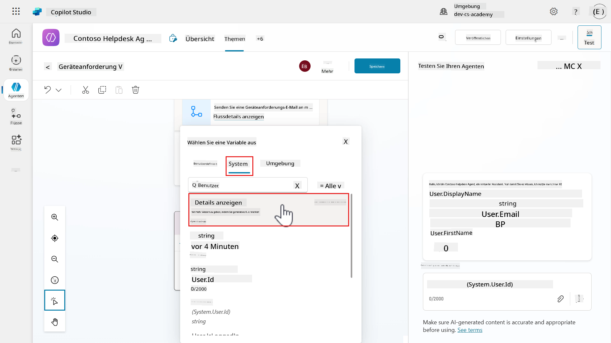

1. Geben Sie Folgendes in das Nachrichtenfeld ein,

    ```text
    . Your selected device,
    ```

Wählen Sie dann **Insert variable** und dieses Mal in der Registerkarte **Custom** die Variable **ModelValue**.

Geben Sie anschließend Folgendes ein, um die Nachricht zu vervollständigen.

    ```text
    , has been submitted and will be reviewed by your manager.
    ```

Die Nachricht sollte wie folgt aussehen.

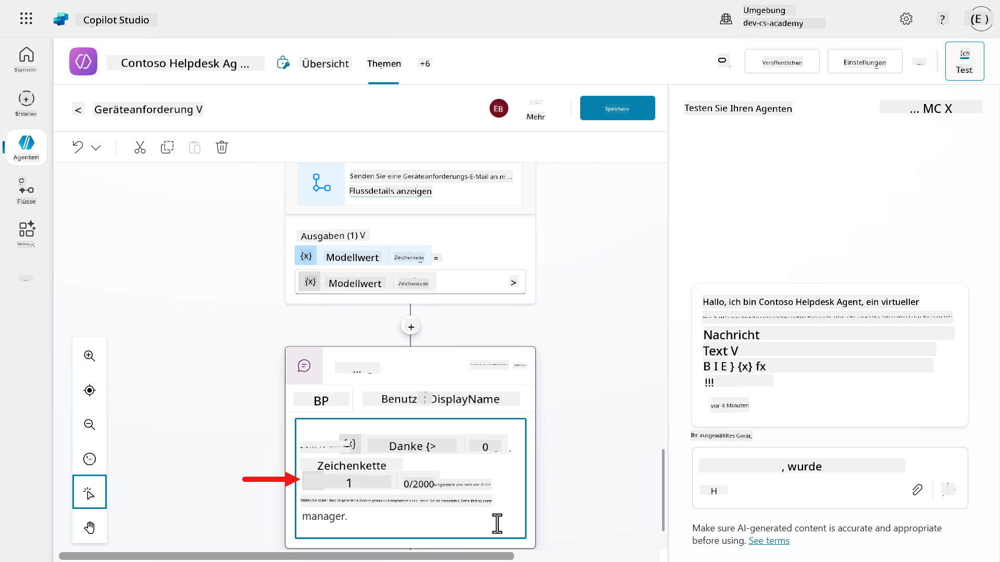

1. Wählen Sie abschließend das **Plus-Symbol +** unterhalb des Knotens **Send a message** und wählen Sie **Topic management**, gefolgt von **Go to another topic** und wählen Sie **End of Conversation**.

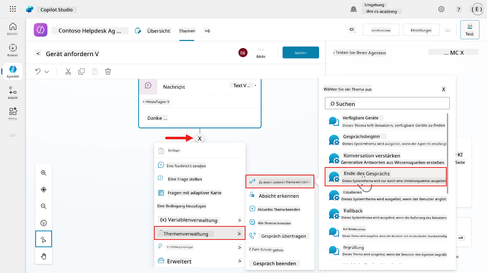

1. **Speichern** Sie das Thema.

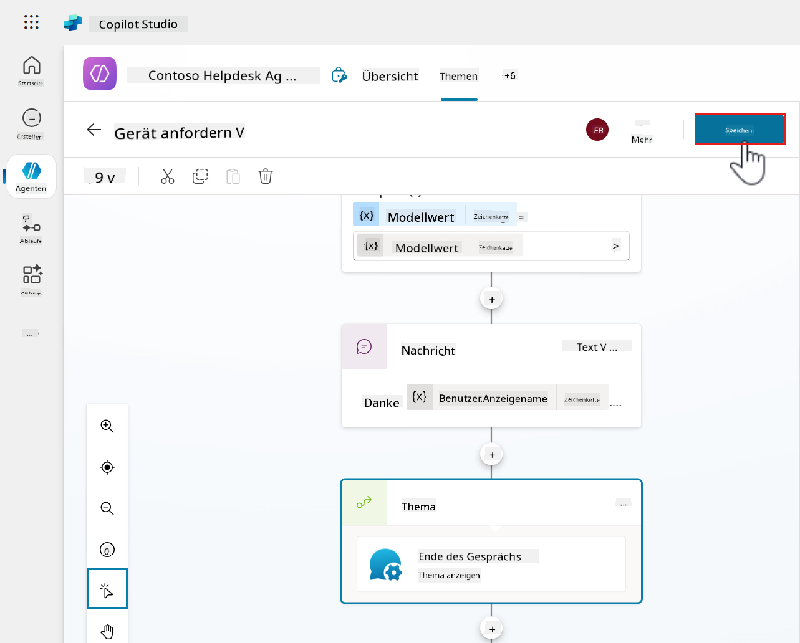

### 9.4 Testen Sie den Agenten mit mehreren Szenarien

Super Arbeit!!! 😁 Wir können jetzt unseren Agenten testen.

#### 9.4.1 Gerät anfordern und einen Kommentar in der adaptiven Karte eingeben

1. **Aktualisieren** Sie das Testfenster, wählen Sie das **Aktivitätskarten-Symbol** und geben Sie Folgendes als Nachricht an den Agenten ein.

    ```text
    I need a laptop
    ```

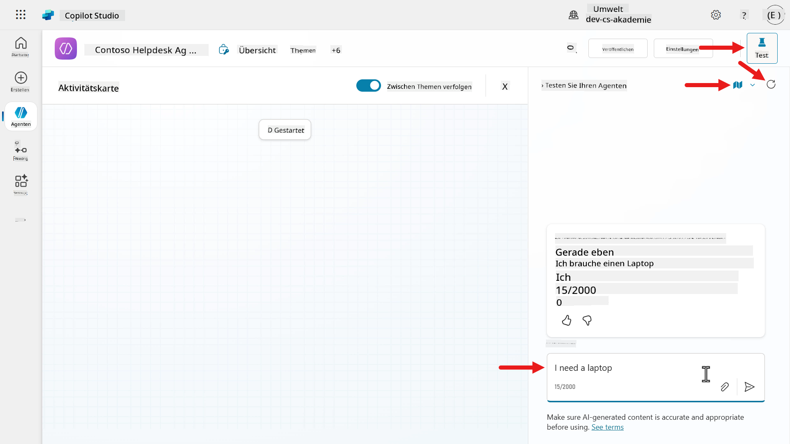

1. Der Agent löst **Available devices** aus und antwortet mit der Liste der verfügbaren Geräte. Geben Sie Folgendes als Antwort auf die Frage ein, ob Sie ein Gerät anfordern möchten.

    ```text
    Yes
    ```

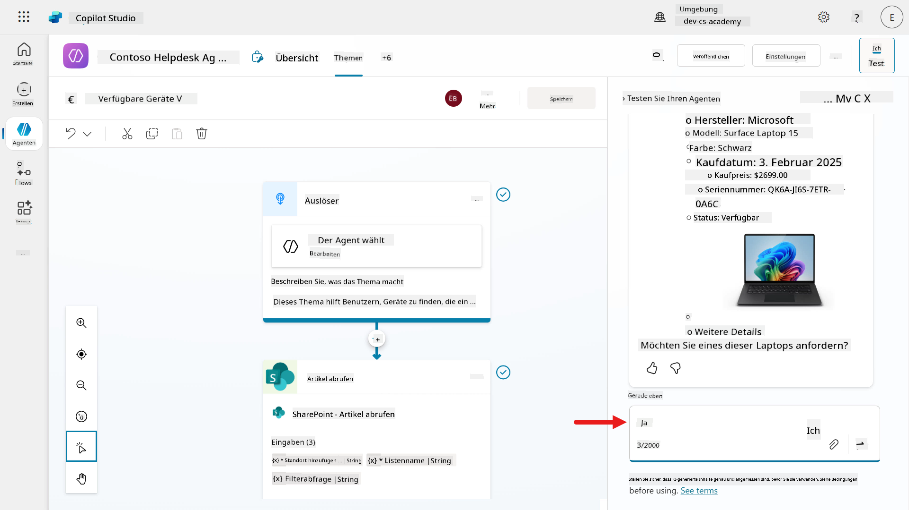

1. Beachten Sie, wie der Agent gemäß den Anweisungen **Request device** aufgerufen hat und dass die adaptive Karte jetzt in der Agentennachricht angezeigt wird.

Wählen Sie das Gerät **Surface Laptop 15** aus und fügen Sie Folgendes als Kommentar hinzu.

    ```text
    I need 16GB of RAM please
    ```

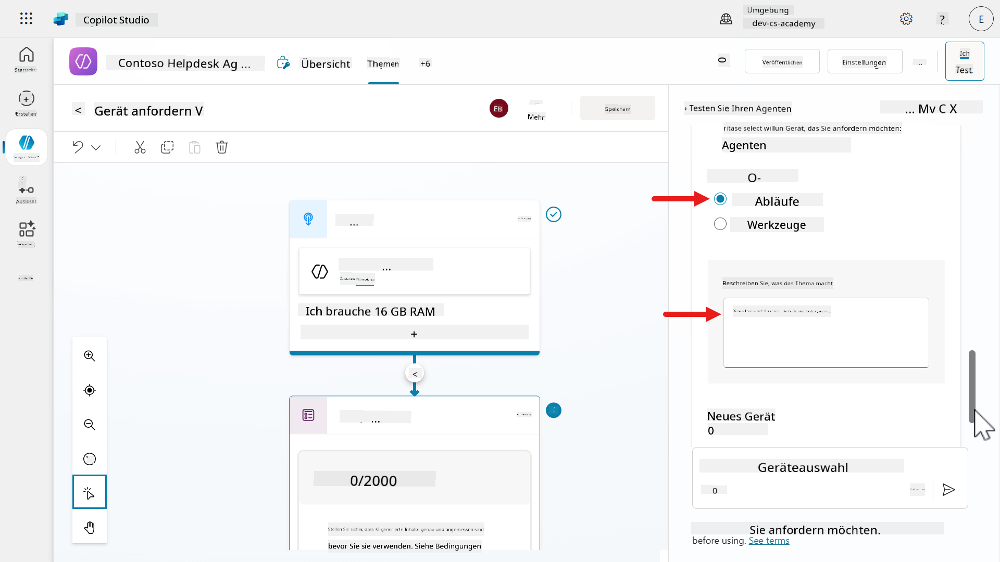

1. Scrollen Sie nach unten, bis Sie die Schaltfläche **Submit Request** sehen, und wählen Sie diese aus, um die adaptive Karte an den Agenten zu übermitteln.

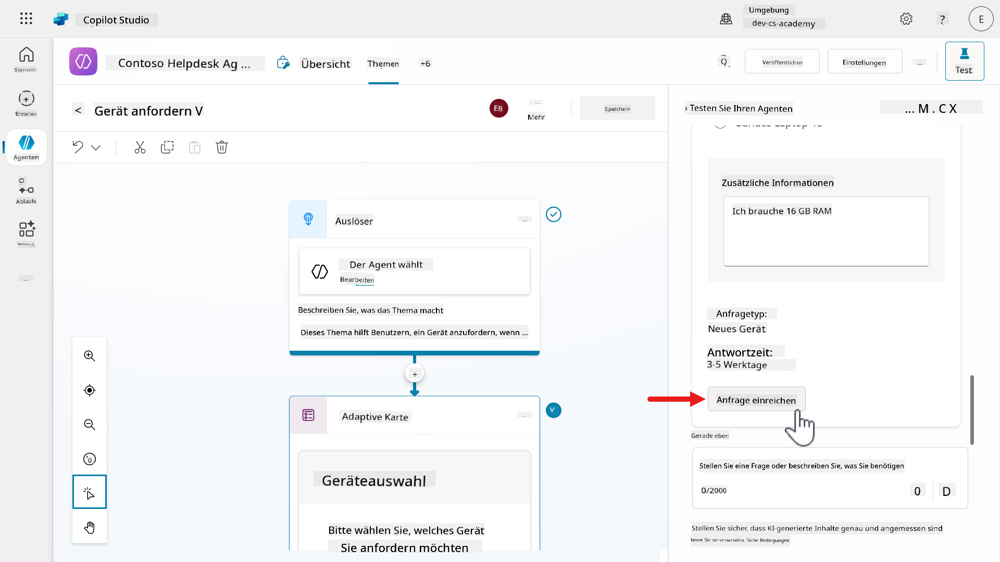

1. Wählen Sie **Allow**, damit der Agent Ihre Anmeldedaten für die Verbindungsauthentifizierung der beiden Connector-Aktionen verwenden kann.

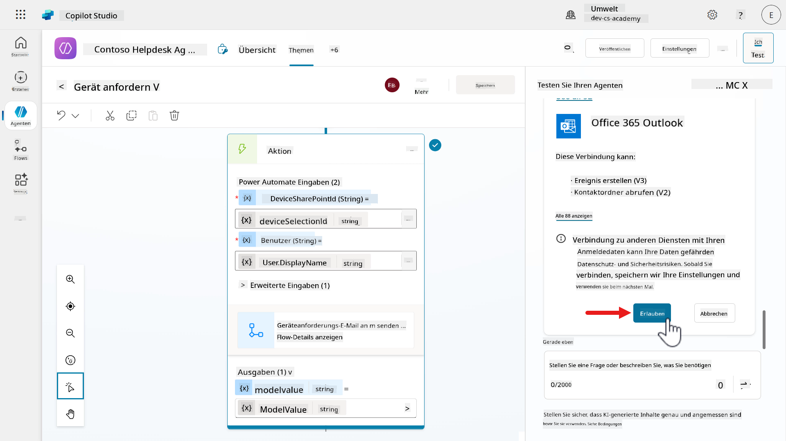

1. Der Agent zeigt dann die Bestätigungsnachricht an, die das ausgewählte Modell enthält, und leitet anschließend zum Thema **End of Conversation** weiter. Cool!

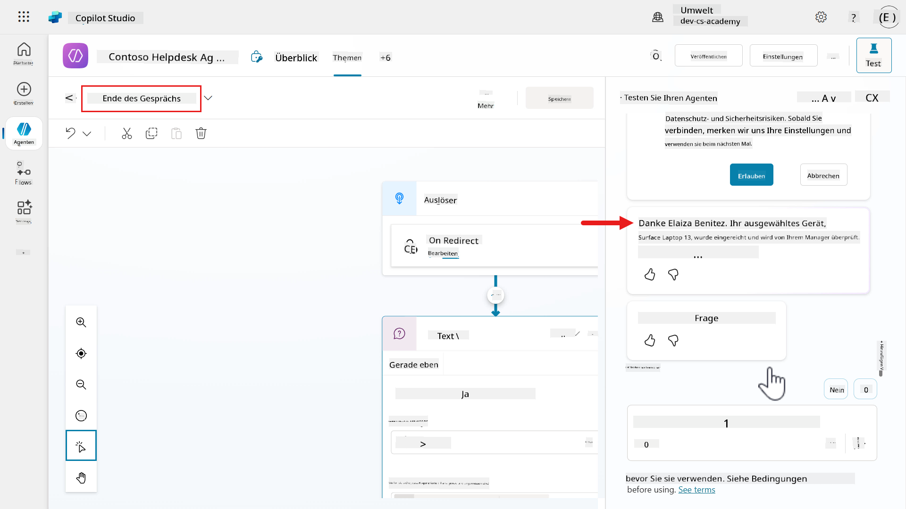

1. Wählen Sie **Ja**, um den Rest des Themas **End of Conversation** zu überprüfen.

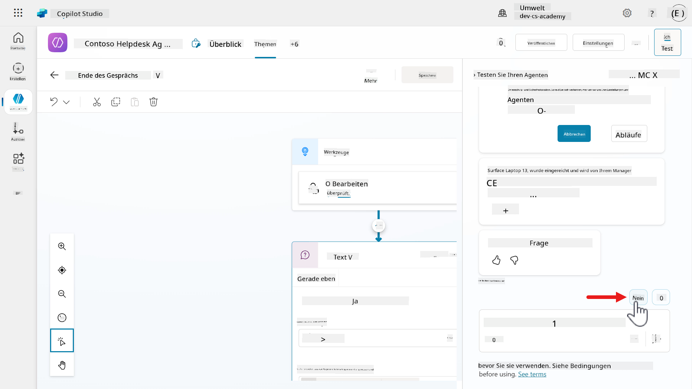

1. Bewerten Sie als Nächstes die Erfahrung, indem Sie einen der Sterne in der Bewertungsskala-Karte auswählen.

Der Agent fährt dann mit dem letzten **Question**-Knoten im Thema **End of Conversation** fort. Wählen Sie **Nein**.

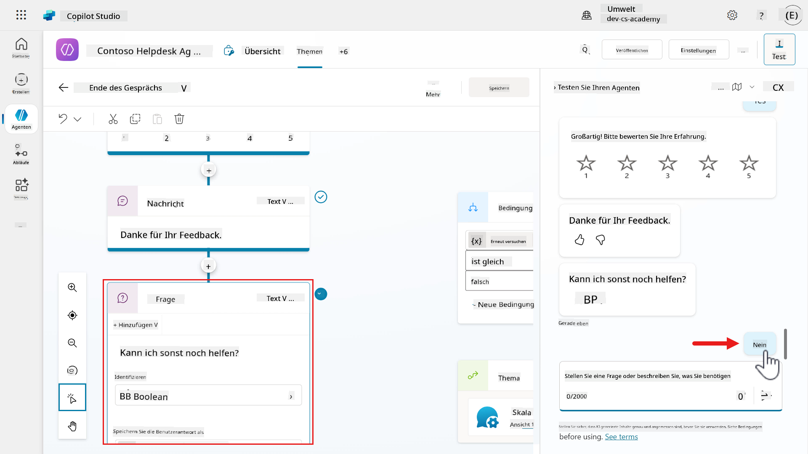

1. Das Thema wird dann abgeschlossen, da eine abschließende Nachricht im Testfenster angezeigt wird.

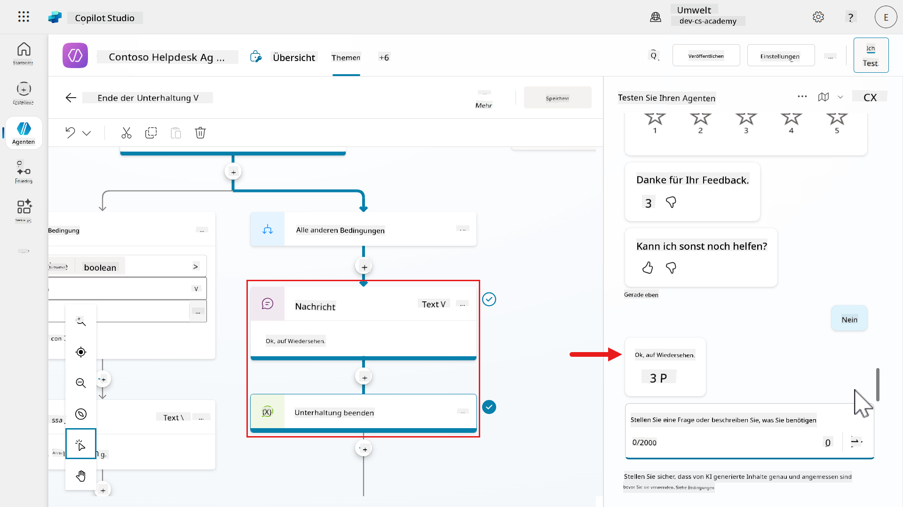

1. Überprüfen Sie Ihr E-Mail-Postfach, um die vom Agentenfluss an den Manager gesendete E-Mail zu überprüfen. Sie können die Details des ausgewählten Geräts und die in der adaptiven Karte eingegebene Notiz sehen.

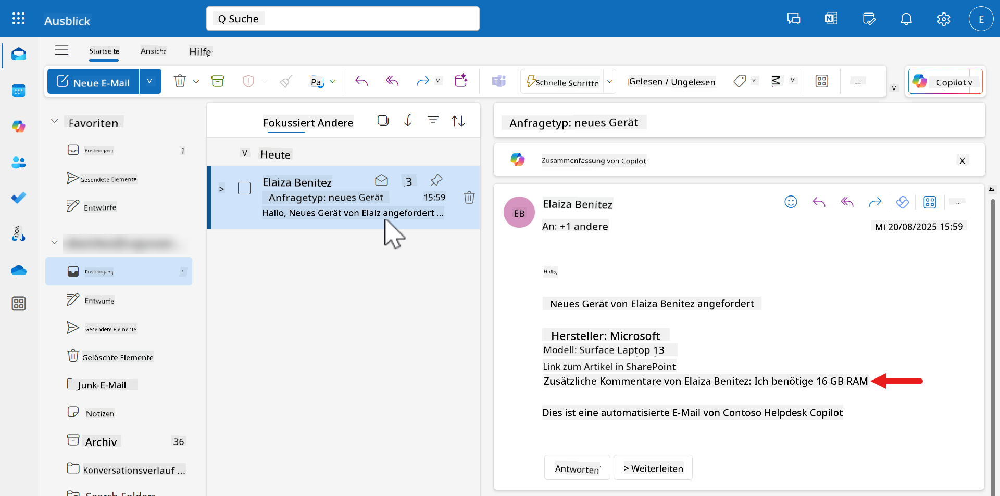

1. Klicken Sie auf den Hyperlink, und der Browser sollte das SharePoint-Element des Geräts laden. Super!

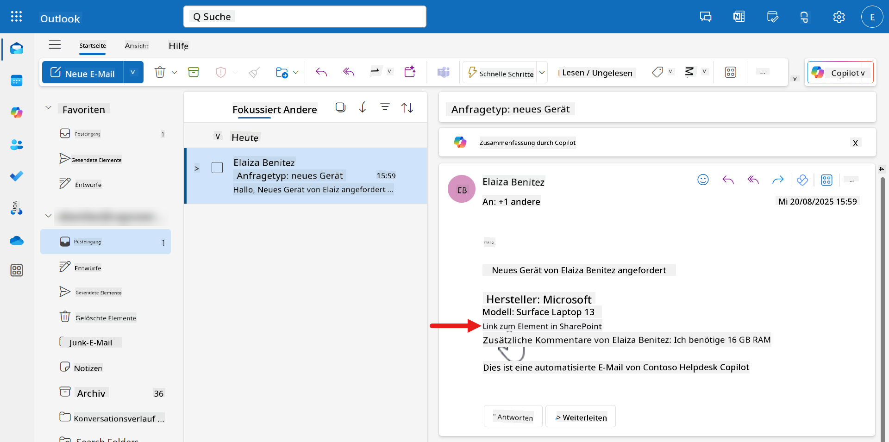

#### 9.4.2 Gerät anfordern und keinen Kommentar in der adaptiven Karte eingeben

Testen wir nun das Szenario, in dem kein Kommentar eingegeben wird.

1. Wiederholen Sie die gleichen Schritte:

   - **Aktualisieren** Sie das Testfenster und wählen Sie das **Aktivitätskarten-Symbol**
   - Geben Sie die Nachricht `I need a laptop` ein
   - Antworten Sie mit `Yes` auf die Frage, ob Sie ein Gerät anfordern möchten

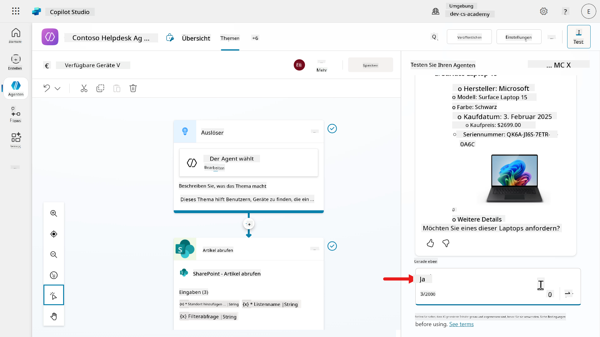

1. Wählen Sie dieses Mal **Surface Laptop 13** als Gerät aus und geben Sie keinen Kommentar ein.

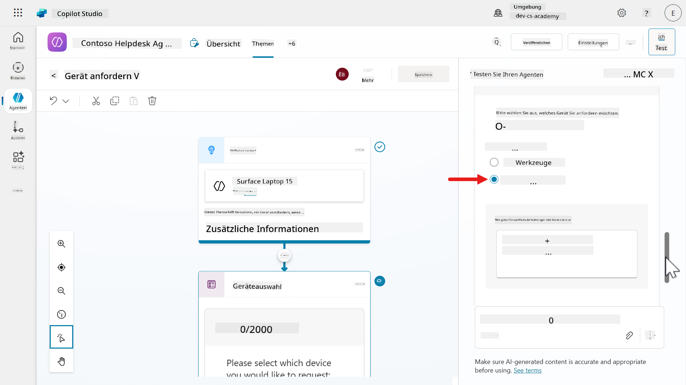

1. **Übermitteln** Sie die Anfrage, indem Sie die Schaltfläche **Submit Request** auswählen.

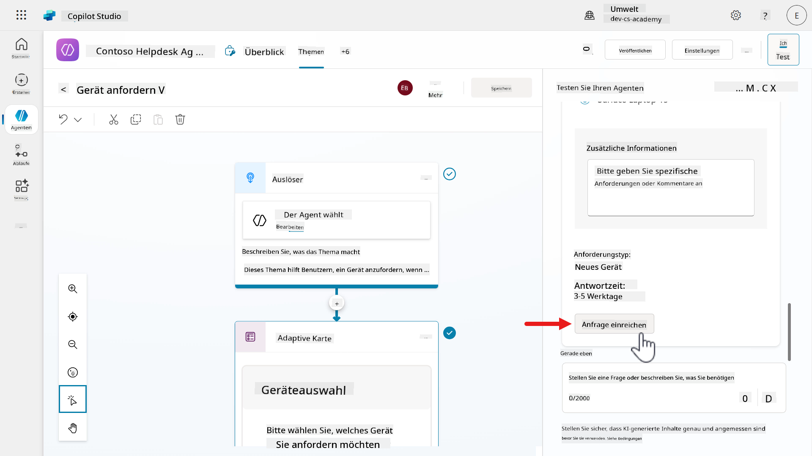

1. Dieses Mal zeigt die E-Mail, die Sie in Ihrem Postfach erhalten, **None** als Kommentar an.

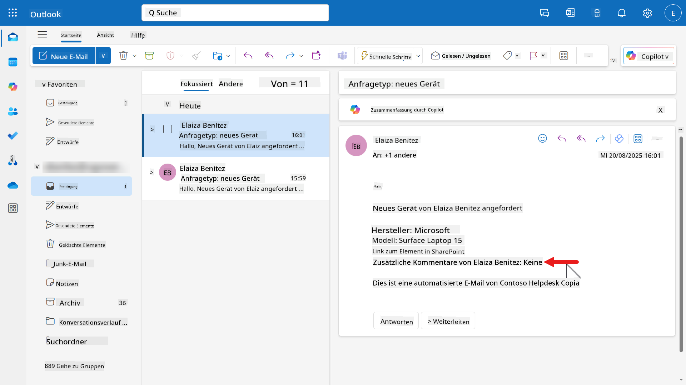

#### 9.4.3 Kein Gerät anfordern

Testen wir das letzte Szenario, bei dem kein Gerät angefordert wird, und das Thema **Goodbye** gemäß den Agentenanweisungen aufgerufen werden sollte.

1. Wiederholen Sie die gleichen Schritte:

   - **Aktualisieren** Sie das Testfenster und wählen Sie das **Aktivitätskarten-Symbol**
   - Geben Sie die Nachricht `I need a laptop` ein
   - Antworten Sie dieses Mal mit `No` auf die Frage, ob Sie ein Gerät anfordern möchten

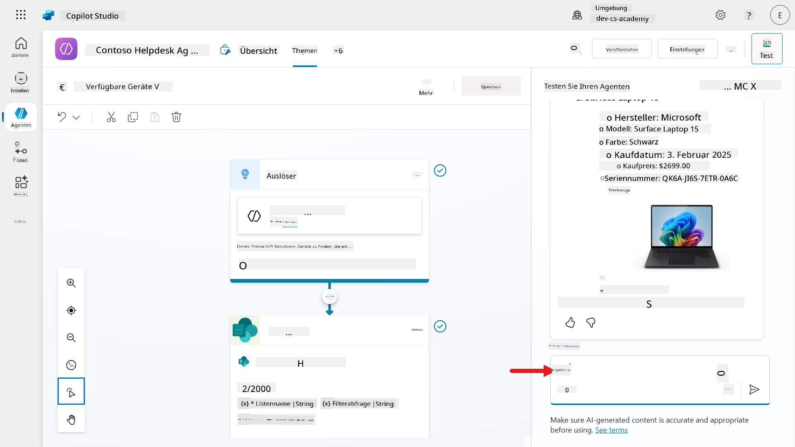

1. Der Agent hat das Thema **Goodbye** aufgerufen, und die im Thema definierte Frage wird gestellt.

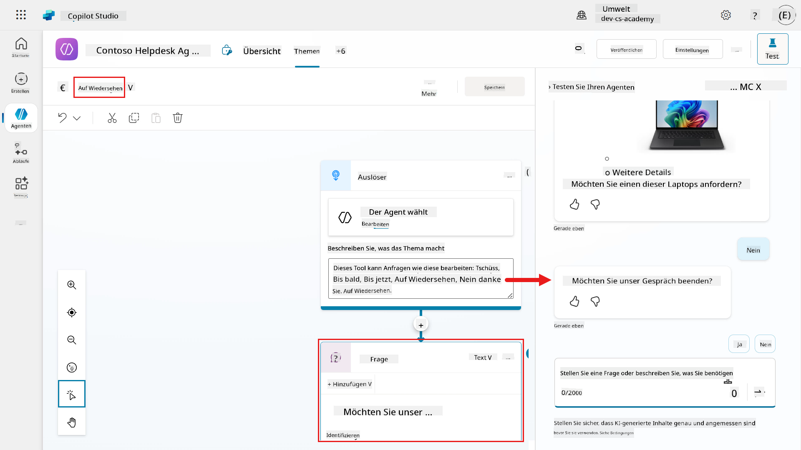

## ✅ Mission abgeschlossen

Herzlichen Glückwunsch! 👏🏻 Sie haben gelernt, wie Sie Ihren Agentenfluss erstellen und ihn in unser bestehendes Thema **Request device** einfügen können, sowie wie Sie den Agenten zu einem anderen Thema weiterleiten.

Dies ist das Ende von **Lab 09 - Add an agent flow for automation and enhance topic capabilities**, wählen Sie den untenstehenden Link, um zur nächsten Lektion zu wechseln. Wir werden den Anwendungsfall in diesem Lab in der nächsten Lektion weiter ausbauen.

⏭️ [Weiter zur Lektion **Add Event Triggers - Enable autonomous agent capabilities**](../10-add-event-triggers/README.md)

## 📚 Taktische Ressourcen

🔗 [Introducing agent flows: Transforming automation with AI-first workflows](https://www.microsoft.com/microsoft-copilot/blog/copilot-studio/introducing-agent-flows-transforming-automation-with-ai-first-workflows/)

🔗 [Agent flows overview](https://learn.microsoft.com/microsoft-copilot-studio/flows-overview?WT.mc_id=power-172621-ebenitez)

🔗 [Use agent flows with your agent](https://learn.microsoft.com/microsoft-copilot-studio/advanced-flow?WT.mc_id=power-172621-ebenitez)

🔗 [List of functions in the reference guide](https://learn.microsoft.com/azure/logic-apps/workflow-definition-language-functions-reference?WT.mc_id=power-172621-ebenitez)

📺 [Agent Flows in Copilot Studio](https://www.youtube.com/watch?v=VJTKyk3Pr7s)


---

**Haftungsausschluss**:  
Dieses Dokument wurde mit dem KI-Übersetzungsdienst [Co-op Translator](https://github.com/Azure/co-op-translator) übersetzt. Obwohl wir uns um Genauigkeit bemühen, beachten Sie bitte, dass automatisierte Übersetzungen Fehler oder Ungenauigkeiten enthalten können. Das Originaldokument in seiner ursprünglichen Sprache sollte als maßgebliche Quelle betrachtet werden. Für kritische Informationen wird eine professionelle menschliche Übersetzung empfohlen. Wir übernehmen keine Haftung für Missverständnisse oder Fehlinterpretationen, die sich aus der Nutzung dieser Übersetzung ergeben.