<!--
CO_OP_TRANSLATOR_METADATA:
{
  "original_hash": "cd99a76bcb7372ac2771b6ae178b023d",
  "translation_date": "2025-10-17T19:16:17+00:00",
  "source_file": "docs/recruit/10-add-event-triggers/README.md",
  "language_code": "de"
}
-->
# 🚨 Mission 10: Ereignis-Auslöser hinzufügen - Autonome Agentenfähigkeiten aktivieren

## 🕵️‍♂️ CODENAME: `OPERATION GHOST ROUTINE`

> **⏱️ Zeitfenster der Operation:** `~45 Minuten`

🎥 **Schauen Sie sich die Anleitung an**

[](https://www.youtube.com/watch?v=ZgwHL8PQ1nY "Schauen Sie sich die Anleitung auf YouTube an")

## 🎯 Missionsbeschreibung

Es ist an der Zeit, Ihren Agenten von einem Gesprächsassistenten zu einem autonomen Operativen zu erheben. Ihre Mission ist es, Ihren Agenten so zu konfigurieren, dass er ohne Aufforderung handelt – präzise und schnell auf Signale aus Ihrer digitalen Umgebung reagiert.

Mit Ereignis-Auslösern trainieren Sie Ihren Agenten, externe Systeme wie SharePoint, Teams und Outlook zu überwachen und intelligente Aktionen auszuführen, sobald ein Signal empfangen wird. Diese Operation verwandelt Ihren Agenten in einen voll funktionsfähigen Feldagenten – leise, schnell und immer wachsam.

Erfolg bedeutet, Agenten zu bauen, die Werte initiieren – nicht nur darauf reagieren.

## 🔎 Ziele

📖 In dieser Lektion lernen Sie:

- Was Ereignis-Auslöser sind und wie sie autonomes Agentenverhalten ermöglichen
- Den Unterschied zwischen Ereignis-Auslösern und Themen-Auslösern, einschließlich Auslöser-Workflows und Payloads
- Häufige Szenarien für Ereignis-Auslöser
- Authentifizierungs-, Sicherheits- und Veröffentlichungsüberlegungen für ereignisgesteuerte Agenten
- Einen autonomen IT-Helpdesk-Agenten zu erstellen, der auf SharePoint-Ereignisse reagiert und E-Mail-Bestätigungen sendet

## 🤔 Was ist ein Ereignis-Auslöser?

Ein **Ereignis-Auslöser** ist ein Mechanismus, der es Ihrem Agenten ermöglicht, autonom auf externe Ereignisse zu reagieren, ohne direkte Benutzereingaben zu benötigen. Stellen Sie sich vor, Ihr Agent "beobachtet" bestimmte Ereignisse und handelt automatisch, wenn diese eintreten.

Im Gegensatz zu Themen-Auslösern, die Benutzer dazu bringen, etwas einzugeben, um eine Konversation zu starten, werden Ereignis-Auslöser durch Ereignisse in Ihren verbundenen Systemen aktiviert. Zum Beispiel:

- Wenn eine neue Datei in SharePoint oder OneDrive for Business erstellt wird
- Wenn ein Datensatz in Dataverse erstellt wird
- Wenn eine Aufgabe in Planner abgeschlossen wird
- Wenn eine neue Antwort in Microsoft Forms eingereicht wird
- Wenn eine neue Nachricht in Microsoft Teams hinzugefügt wird
- Basierend auf einem wiederkehrenden Zeitplan (z. B. tägliche Erinnerungen)  
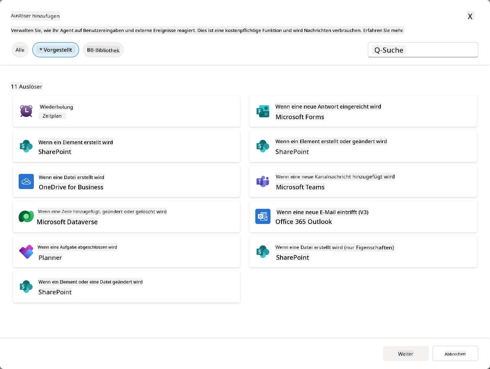

### Warum Ereignis-Auslöser für autonome Agenten wichtig sind

Ereignis-Auslöser verwandeln Ihren Agenten von einem reaktiven Assistenten in einen proaktiven, autonomen Helfer:

1. **Autonomer Betrieb** - Ihr Agent kann rund um die Uhr ohne menschliches Eingreifen arbeiten und auf Ereignisse reagieren, sobald sie eintreten.
    - *Beispiel:* Begrüßen Sie neue Teammitglieder automatisch, wenn sie einem Team hinzugefügt werden.

1. **Echtzeit-Reaktionsfähigkeit** - Anstatt darauf zu warten, dass Benutzer Fragen stellen, reagiert Ihr Agent sofort auf relevante Ereignisse.
    - *Beispiel:* Benachrichtigen Sie das IT-Team, wenn ein SharePoint-Dokument geändert wird.

1. **Workflow-Automatisierung** - Verknüpfen Sie mehrere Aktionen basierend auf einem einzigen Auslöser-Ereignis.
    - *Beispiel:* Wenn ein neues Support-Ticket erstellt wird, erstellen Sie eine Aufgabe, benachrichtigen Sie den Manager und aktualisieren Sie das Tracking-Dashboard.

1. **Konsistente Prozesse** - Stellen Sie sicher, dass wichtige Schritte nie vergessen werden, indem Sie auf Schlüsselereignisse automatisiert reagieren.
    - *Beispiel:* Jeder neue Mitarbeiter erhält automatisch Onboarding-Materialien und Zugriffsanfragen.

1. **Datengetriebene Aktionen** - Verwenden Sie Informationen aus dem auslösenden Ereignis, um intelligente Entscheidungen zu treffen und geeignete Maßnahmen zu ergreifen.
    - *Beispiel:* Leiten Sie dringende Tickets basierend auf der Prioritätsstufe im Auslöser-Payload an erfahrene Mitarbeiter weiter.

## ⚙️ Wie funktionieren Ereignis-Auslöser?

Ereignis-Auslöser arbeiten durch einen dreistufigen Workflow, der es Ihrem Agenten ermöglicht, autonom auf externe Ereignisse zu reagieren:

### Der Auslöser-Workflow

1. **Ereigniserkennung** - Ein spezifisches Ereignis tritt in einem verbundenen System (SharePoint, Teams, Outlook usw.) auf.
1. **Auslöser-Aktivierung** - Der Ereignis-Auslöser erkennt dieses Ereignis und sendet ein Payload über einen Power Automate Cloud Flow an Ihren Agenten.
1. **Agentenreaktion** - Ihr Agent empfängt das Payload und führt die von Ihnen definierten Anweisungen aus.

### Ereignis- vs. Themen-Auslöser

Es ist wichtig, den Unterschied zwischen diesen beiden Auslöser-Typen zu verstehen:

| **Ereignis-Auslöser** | **Themen-Auslöser** |
|-------------------|-------------------|
| Durch externe Systemereignisse aktiviert | Durch Benutzereingaben/Phrasen aktiviert |
| Ermöglichen autonomes Agentenverhalten | Ermöglichen Gesprächsantworten |
| Verwenden die Authentifizierung des Erstellers | Option für die Authentifizierung des Benutzers |
| Funktionieren ohne Benutzerinteraktion | Erfordern, dass der Benutzer die Konversation startet |
| Beispiele: Datei erstellt, E-Mail empfangen | Beispiel: "Wie ist das Wetter?" |

## 📦 Verständnis von Payloads für Auslöser

Wenn ein Ereignis eintritt, sendet der Auslöser ein **Payload** an Ihren Agenten, das Informationen über das Ereignis und Anweisungen zur Reaktion enthält.

### Standard- vs. benutzerdefinierte Payloads

Jeder Auslöser-Typ hat eine Standard-Payload-Struktur, die Sie jedoch anpassen können:

**Standard-Payload** - Verwendet das Standardformat wie `Verwende Inhalte aus {Body}`

- Enthält grundlegende Ereignisinformationen
- Verwendet generische Verarbeitungsanweisungen
- Gut für einfache Szenarien

**Benutzerdefinierte Payload** - Fügen Sie spezifische Anweisungen und Datenformatierungen hinzu

- Enthält detaillierte Anweisungen für Ihren Agenten
- Gibt genau an, welche Daten verwendet werden sollen und wie
- Besser für komplexe Workflows

### Agenten-Anweisungen vs. benutzerdefinierte Payload-Anweisungen

Es gibt zwei Orte, an denen Sie das Verhalten Ihres Agenten mit Ereignis-Auslösern steuern können:

**Agenten-Anweisungen** (Global)

- Allgemeine Anweisungen, die für alle Auslöser gelten
- Beispiel: "Beim Bearbeiten von Tickets immer zuerst auf Duplikate prüfen"
- Am besten für allgemeine Verhaltensmuster geeignet

**Payload-Anweisungen** (Auslöser-spezifisch)

- Spezifische Anweisungen für einzelne Auslöser-Typen  
- Beispiel: "Für dieses SharePoint-Update eine Zusammenfassung an den Projektkanal senden"
- Am besten für komplexe Agenten mit mehreren Auslösern geeignet

💡 **Profi-Tipp**: Vermeiden Sie widersprüchliche Anweisungen zwischen diesen beiden Ebenen, da dies zu unerwartetem Verhalten führen kann.

## 🎯 Häufige Szenarien für Ereignis-Auslöser

Hier sind praktische Beispiele, wie Ereignis-Auslöser Ihren Agenten verbessern können:

### IT-Helpdesk-Agent

- **Auslöser**: Neues SharePoint-Listenelement (Support-Ticket)
- **Aktion**: Automatische Kategorisierung, Priorisierung und Benachrichtigung der entsprechenden Teammitglieder

### Mitarbeiter-Onboarding-Agent

- **Auslöser**: Neuer Benutzer in Dataverse hinzugefügt
- **Aktion**: Begrüßungsnachricht senden, Onboarding-Aufgaben erstellen und Zugriff bereitstellen

### Projektmanagement-Agent

- **Auslöser**: Aufgabe in Planner abgeschlossen
- **Aktion**: Projekt-Dashboard aktualisieren, Stakeholder benachrichtigen und Blocker prüfen

### Dokumentenmanagement-Agent

- **Auslöser**: Datei in einem bestimmten SharePoint-Ordner hochgeladen
- **Aktion**: Metadaten extrahieren, Tags anwenden und Dokumenteneigentümer benachrichtigen

### Meeting-Assistent-Agent

- **Auslöser**: Kalendereintrag erstellt
- **Aktion**: Vorbesprechungs-Erinnerungen und Agenda senden, Ressourcen buchen

## ⚠️ Veröffentlichungs- und Authentifizierungsüberlegungen

Bevor Ihr Agent Ereignis-Auslöser in der Produktion verwenden kann, müssen Sie die Authentifizierungs- und Sicherheitsimplikationen verstehen.

### Authentifizierung des Erstellers

Ereignis-Auslöser verwenden die **Anmeldeinformationen des Agenten-Erstellers** für alle Authentifizierungen:

- Ihr Agent greift mit Ihren Berechtigungen auf Systeme zu
- Benutzer können möglicherweise über Ihre Anmeldeinformationen auf Daten zugreifen
- Alle Aktionen werden "in Ihrem Namen" ausgeführt, auch wenn Benutzer mit dem Agenten interagieren

### Best Practices für den Datenschutz

Um die Sicherheit bei der Veröffentlichung von Agenten mit Ereignis-Auslösern zu gewährleisten:

1. **Datenzugriff bewerten** - Überprüfen Sie, auf welche Systeme und Daten Ihre Auslöser zugreifen können
1. **Gründlich testen** - Verstehen Sie, welche Informationen Auslöser in Payloads enthalten
1. **Auslöserbereich eingrenzen** - Verwenden Sie spezifische Parameter, um zu begrenzen, welche Ereignisse Auslöser aktivieren
1. **Payload-Daten überprüfen** - Stellen Sie sicher, dass Auslöser keine sensiblen Informationen preisgeben
1. **Nutzung überwachen** - Verfolgen Sie die Aktivität der Auslöser und den Ressourcenverbrauch

## ⚠️ Fehlerbehebung und Einschränkungen

Beachten Sie diese wichtigen Überlegungen bei der Arbeit mit Ereignis-Auslösern:

### Auswirkungen auf Kontingent und Abrechnung

- Jede Auslöser-Aktivierung zählt zu Ihrem Nachrichtenverbrauch
- Häufige Auslöser (wie jede Minute) können das Kontingent schnell aufbrauchen
- Überwachen Sie die Nutzung, um Drosselung zu vermeiden

### Technische Anforderungen

- Nur verfügbar für Agenten mit aktivierter generativer Orchestrierung
- Erfordert aktivierte lösungsbewusste Cloud-Flow-Freigabe in Ihrer Umgebung

### Richtlinien zur Verhinderung von Datenverlust (DLP)

- Die DLP-Richtlinien Ihrer Organisation bestimmen, welche Auslöser verfügbar sind
- Administratoren können Ereignis-Auslöser vollständig blockieren
- Kontaktieren Sie Ihren Administrator, wenn erwartete Auslöser nicht verfügbar sind

## 🧪 Lab 10 - Ereignis-Auslöser für autonomes Agentenverhalten hinzufügen

### 🎯 Anwendungsfall

Sie werden Ihren IT-Helpdesk-Agenten verbessern, um automatisch auf neue Support-Anfragen zu reagieren. Wenn jemand ein neues Element in Ihrer SharePoint-Support-Ticket-Liste erstellt, wird Ihr Agent:

1. Autonom ausgelöst, wenn das SharePoint-Ticket erstellt wird
1. Die Ticketdetails und Anweisungen zu den Schritten bereitstellen, die Sie ausführen möchten
1. Das Ticket automatisch per KI-generierter E-Mail an den Einreicher bestätigen

Dieses Labor zeigt, wie Ereignis-Auslöser wirklich autonomes Agentenverhalten ermöglichen.

### Voraussetzungen

Bevor Sie mit diesem Labor beginnen, stellen Sie sicher, dass Sie:

- ✅ Vorherige Labs abgeschlossen haben (insbesondere Lab 6-8 für den IT-Helpdesk-Agenten)
- ✅ Zugriff auf die SharePoint-Website mit der IT-Support-Ticket-Liste haben
- ✅ Eine Copilot Studio-Umgebung mit aktivierten Ereignis-Auslösern haben
- ✅ Ihr Agent generative Orchestrierung aktiviert hat
- ✅ Über die entsprechenden Berechtigungen in SharePoint und Ihrer Copilot Studio-Umgebung verfügen

### 10.1 Generative KI aktivieren und einen SharePoint-Element-Erstellungs-Auslöser erstellen

1. Öffnen Sie Ihren **IT-Helpdesk-Agent** in **Copilot Studio**

1. Stellen Sie zunächst sicher, dass **Generative KI** für Ihren Agenten aktiviert ist:
   - Navigieren Sie zur **Übersicht**-Registerkarte
   - Unter dem Abschnitt Orchestrierung schalten Sie **Generative Orchestrierung** auf **Ein**, falls dies noch nicht geschehen ist  
     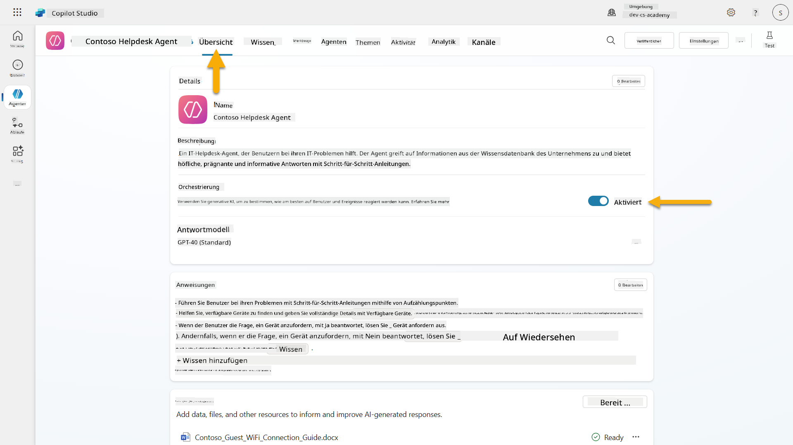

1. Navigieren Sie zur **Übersicht**-Registerkarte und suchen Sie den Abschnitt **Auslöser**

1. Klicken Sie auf **+ Auslöser hinzufügen**, um die Auslöser-Bibliothek zu öffnen  
    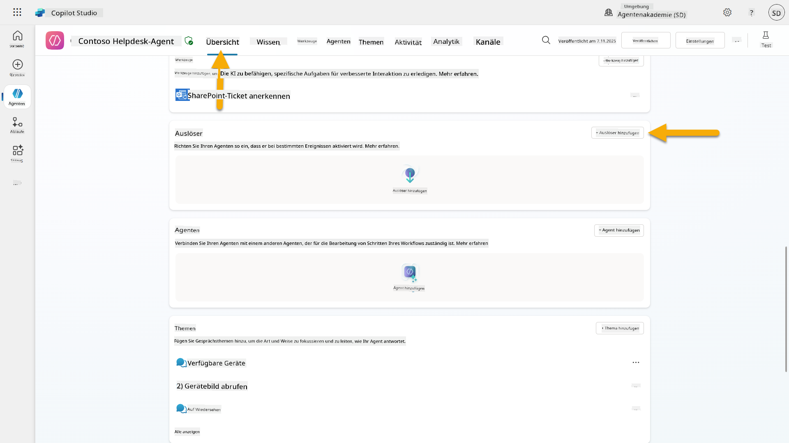

1. Suchen und wählen Sie **Wenn ein Element erstellt wird** (SharePoint)  
    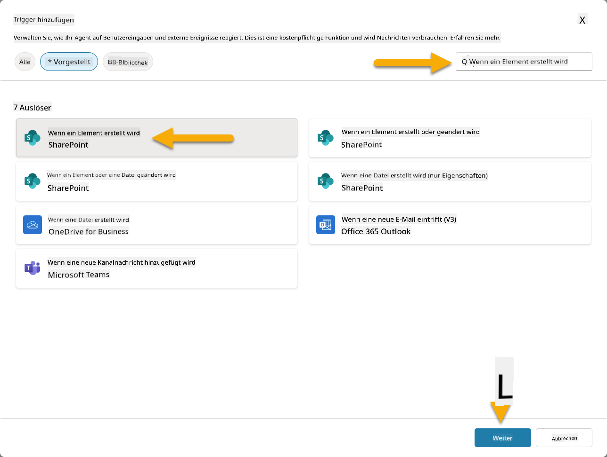

1. Konfigurieren Sie den Auslösernamen und die Verbindungen:

   - **Auslösername:** Neues Support-Ticket in SharePoint erstellt

1. Warten Sie, bis die Verbindungen konfiguriert sind, und wählen Sie **Weiter**, um fortzufahren.  
   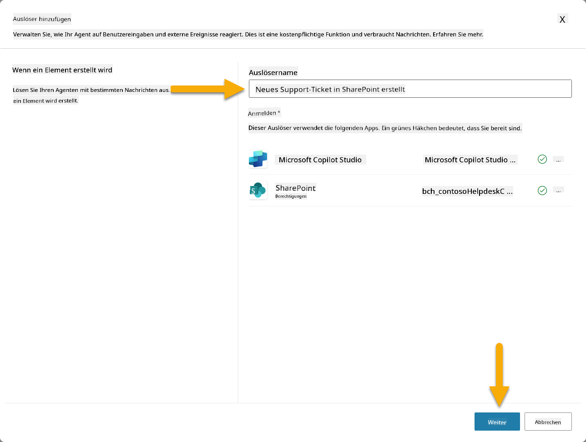

1. Konfigurieren Sie die Auslöserparameter:

   - **Website-Adresse**: Wählen Sie Ihre "Contoso IT"-SharePoint-Website

   - **Listenname**: Wählen Sie Ihre "Tickets"-Liste

   - **Zusätzliche Anweisungen an den Agenten, wenn er durch den Auslöser aktiviert wird:**

     ```text
     New Support Ticket Created in SharePoint: {Body}
     
     Use the 'Acknowledge SharePoint Ticket' tool to generate the email body automatically and respond.
     
     IMPORTANT: Do not wait for any user input. Work completely autonomously.
     ```

     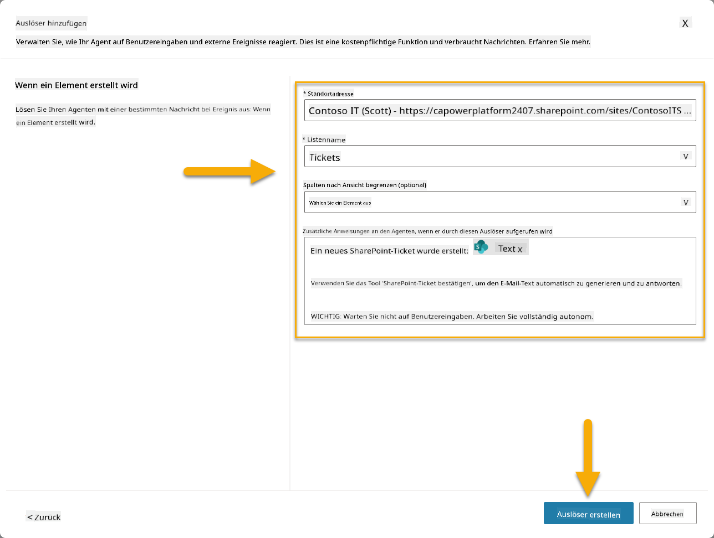

1. Wählen Sie **Auslöser erstellen**, um die Auslösererstellung abzuschließen. Ein Power Automate Cloud Flow wird automatisch erstellt, um den Agenten autonom auszulösen.

1. Wählen Sie **Schließen**.

### 10.2 Den Auslöser bearbeiten

1. Im Abschnitt **Auslöser** der **Übersicht**-Registerkarte wählen Sie das **...**-Menü beim Auslöser **Neues Support-Ticket in SharePoint erstellt**

1. Wählen Sie **In Power Automate bearbeiten**  
   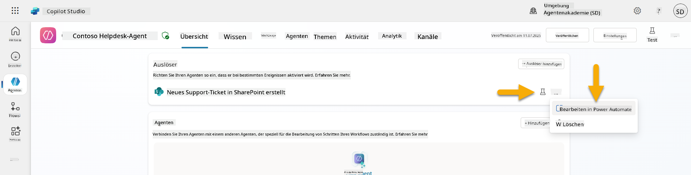

1. Wählen Sie den Knoten **Sendet eine Eingabeaufforderung an den angegebenen Copilot zur Verarbeitung**

1. Im Feld **Body/Nachricht** entfernen Sie den Body-Inhalt, **drücken Sie die Schrägstrich-Taste** (/) und wählen Sie **Ausdruck einfügen**  
   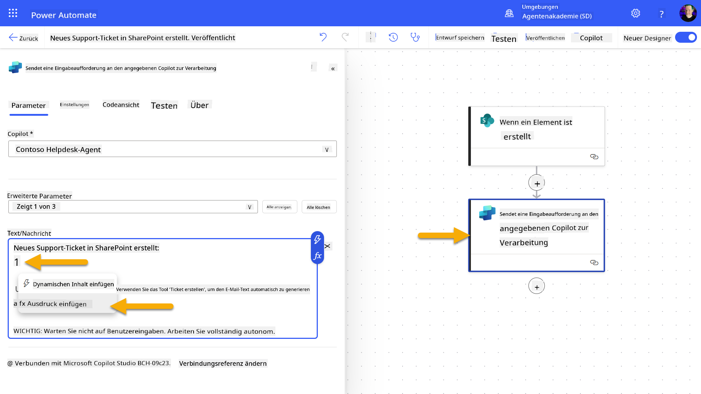

1. Geben Sie den folgenden Ausdruck ein, um dem Agenten spezifische Details über das Ticket bereitzustellen:

    ```text
    concat('Submitted By Name: ', first(triggerOutputs()?['body/value'])?['Author/DisplayName'], '\nSubmitted By Email: ', first(triggerOutputs()?['body/value'])?['Author/Email'], '\nTitle: ', first(triggerOutputs()?['body/value'])?['Title'], '\nIssue Description: ', first(triggerOutputs()?['body/value'])?['Description'], '\nPriority: ', first(triggerOutputs()?['body/value'])?['Priority/Value'],'\nTicket ID : ', first(triggerOutputs()?['body/value'])?['ID'])
    ```

1. Wählen Sie **Hinzufügen**  
   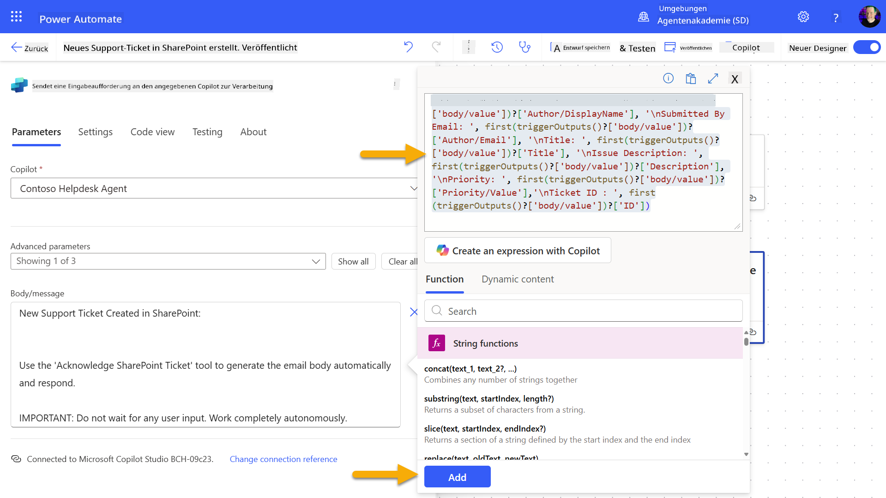

1. Wählen Sie **Veröffentlichen** in der oberen rechten Symbolleiste.

### 10.3 Ein Tool für E-Mail-Bestätigungen erstellen

1. **Kehren Sie zurück** zu Ihrem Agenten in Copilot Studio

1. Navigieren Sie zur **Tools**-Registerkarte in Ihrem Agenten

1. Klicken Sie auf **+ Tool hinzufügen** und wählen Sie **Connector**

1. Suchen und wählen Sie den Connector **E-Mail senden (V2)**  
    

1. Warten Sie, bis die Verbindung konfiguriert ist, und wählen Sie dann **Hinzufügen und konfigurieren**

1. Konfigurieren Sie die Tool-Einstellungen:

   - **Name**: SharePoint-Ticket bestätigen
   - **Beschreibung**: Dieses Tool sendet eine E-Mail-Bestätigung, dass ein Ticket eingegangen ist.

1. Wählen Sie **Anpassen** neben den Eingabeparametern und konfigurieren Sie wie folgt:

    **An**:

    - **Beschreibung**: Die E-Mail-Adresse der Person, die das SharePoint-Ticket eingereicht hat
    - **Identifizieren als**: E-Mail

    **Body**:

    - **Beschreibung**: Eine Bestätigung, dass das Ticket eingegangen ist, und wir innerhalb von 3 Arbeitstagen antworten werden.

    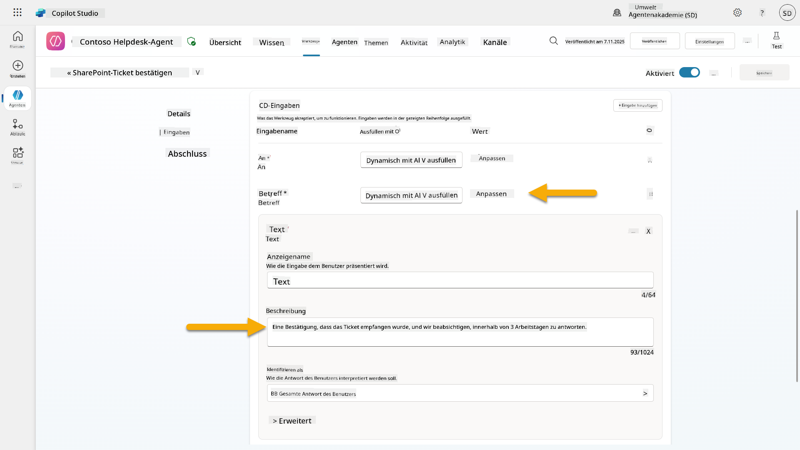

1. Wählen Sie **Speichern**

### 10.4 Den Auslöser testen

1. Wählen Sie in Ihrem **Helpdesk-Agenten** die **Übersicht**-Registerkarte
1. Klicken Sie auf das **Testauslöser**-Symbol neben dem Auslöser **Neues Support-Ticket in SharePoint erstellt**. Dadurch wird das Fenster **Testen Sie Ihren Auslöser** geladen.
1. Öffnen Sie einen neuen Browser-Tab und navigieren Sie zu Ihrer **SharePoint IT Support Tickets-Liste**.
1. Klicken Sie auf **+ Neues Element hinzufügen**, um ein Test-Ticket zu erstellen:
   - **Titel**: "Keine Verbindung zum VPN möglich"
   - **Beschreibung**: "Keine Verbindung zum Unternehmens-WLAN-Netzwerk nach einem kürzlichen Update möglich"
   - **Priorität**: "Normal"

1. **Speichern** Sie das SharePoint-Element  
    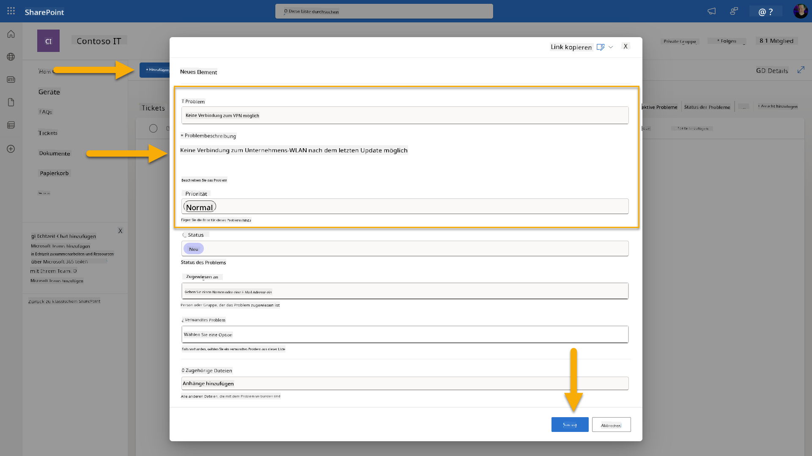
1. Kehren Sie zu **Copilot Studio** zurück und überwachen Sie das Panel **Trigger testen** auf die Aktivierung des Triggers. Verwenden Sie das **Aktualisieren**-Symbol, um das Trigger-Ereignis zu laden. Dies kann einige Minuten dauern.  
    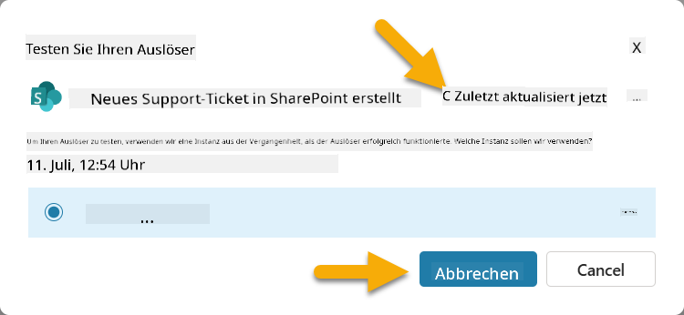
1. Sobald der Trigger erscheint, wählen Sie **Test starten**.
1. Wählen Sie das **Aktivitätskarten-Symbol** oben im Panel **Agent testen**.
1. Überprüfen Sie, ob Ihr Agent:
   - Die Trigger-Nutzlast erhalten hat
   - Das Tool "SharePoint-Ticket bestätigen" aufgerufen hat  
     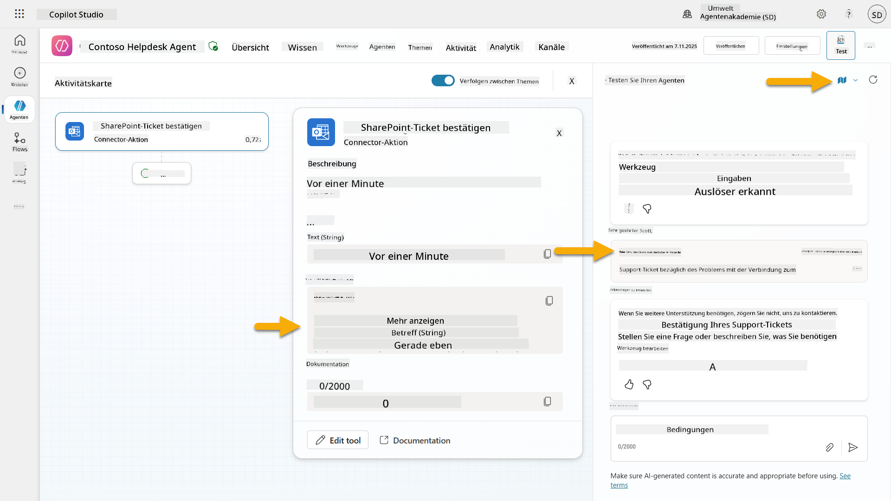
1. Überprüfen Sie den E-Mail-Posteingang des Einreichers, um sicherzustellen, dass die Bestätigungs-E-Mail gesendet wurde.  
    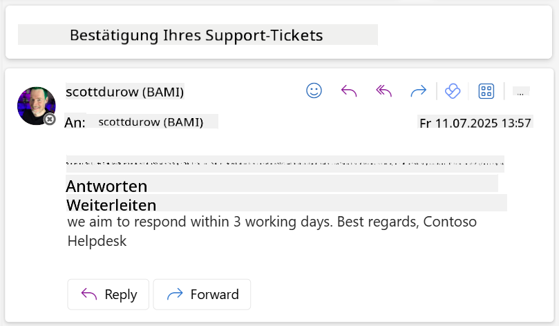
1. Überprüfen Sie die **Aktivitäts**-Registerkarte in Copilot Studio, um die vollständige Trigger- und Tool-Ausführung zu sehen.

## ✅ Mission abgeschlossen

🎉 **Herzlichen Glückwunsch!** Sie haben erfolgreich Ereignis-Trigger mit Connector-Tools implementiert, die es Ihrem Agenten ermöglichen, autonom zu arbeiten, automatisch E-Mail-Bestätigungen zu senden und Support-Tickets ohne Benutzereingriff zu bearbeiten. Sobald Ihr Agent veröffentlicht ist, wird er autonom in Ihrem Namen handeln.

🚀 **Als Nächstes**: In unserer nächsten Lektion lernen Sie, wie Sie [Ihren Agenten veröffentlichen](../11-publish-your-agent/README.md) und ihn in Microsoft Teams und Microsoft 365 Copilot verfügbar machen, sodass Ihre gesamte Organisation darauf zugreifen kann!

⏭️ [Zur Lektion **Agenten veröffentlichen** wechseln](../11-publish-your-agent/README.md)

## 📚 Taktische Ressourcen

Bereit, tiefer in Ereignis-Trigger und autonome Agenten einzutauchen? Schauen Sie sich diese Ressourcen an:

- **Microsoft Learn**: [Machen Sie Ihren Agenten autonom in Copilot Studio](https://learn.microsoft.com/training/modules/autonomous-agents-online-workshop/?WT.mc_id=power-177340-scottdurow)
- **Dokumentation**: [Einen Ereignis-Trigger hinzufügen](https://learn.microsoft.com/microsoft-copilot-studio/authoring-trigger-event?WT.mc_id=power-177340-scottdurow)
- **Best Practices**: [Einführung in Power Automate-Trigger](https://learn.microsoft.com/power-automate/triggers-introduction?WT.mc_id=power-177340-scottdurow)
- **Erweiterte Szenarien**: [Power Automate-Flows mit Agenten verwenden](https://learn.microsoft.com/microsoft-copilot-studio/advanced-flow-create?WT.mc_id=power-177340-scottdurow)
- **Sicherheit**: [Verhinderung von Datenverlust für Copilot Studio](https://learn.microsoft.com/microsoft-copilot-studio/admin-data-loss-prevention?WT.mc_id=power-177340-scottdurow)


---

**Haftungsausschluss**:  
Dieses Dokument wurde mit dem KI-Übersetzungsdienst [Co-op Translator](https://github.com/Azure/co-op-translator) übersetzt. Obwohl wir uns um Genauigkeit bemühen, beachten Sie bitte, dass automatisierte Übersetzungen Fehler oder Ungenauigkeiten enthalten können. Das Originaldokument in seiner ursprünglichen Sprache sollte als maßgebliche Quelle betrachtet werden. Für kritische Informationen wird eine professionelle menschliche Übersetzung empfohlen. Wir übernehmen keine Haftung für Missverständnisse oder Fehlinterpretationen, die sich aus der Nutzung dieser Übersetzung ergeben.