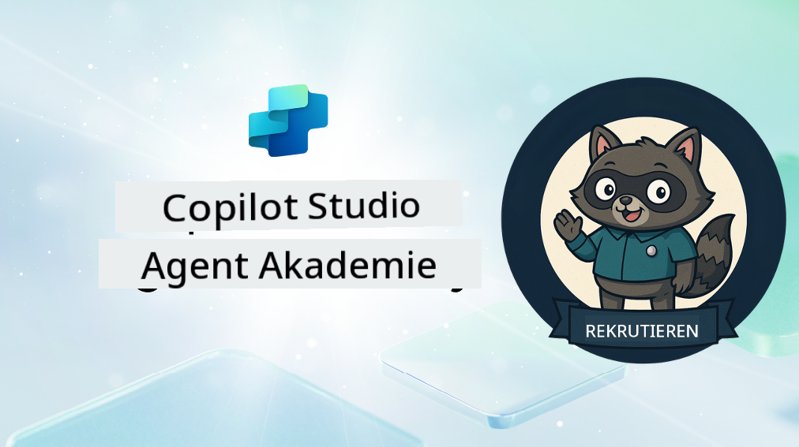

<!--
CO_OP_TRANSLATOR_METADATA:
{
  "original_hash": "8b5ecad9d5d073ea3f4c2b844e80f2e5",
  "translation_date": "2025-10-17T18:53:13+00:00",
  "source_file": "docs/recruit/README.md",
  "language_code": "de"
}
-->
# Willkommen Rekrut

**Willkommen, Rekrut.**  
Ihre Mission – sollten Sie sich dafür entscheiden – besteht darin, die Kunst des Erstellens von Agenten mit **Microsoft Copilot Studio** zu meistern.

Dieses praxisorientierte Training ist Ihr Einstieg in die **Welt der Agenten**: Von fundierten Eingabeaufforderungen über Adaptive Cards bis hin zu Agentenabläufen lernen Sie, wie Sie intelligente Agenten mit realen Tools und Anwendungsfällen erstellen, skalieren und bereitstellen.

---

## 🎯 Missionsziel

Nach Abschluss der Agent Academy werden Sie in der Lage sein:

- Zu verstehen, was Agenten im Kontext von Microsoft Copilot Studio sind
- Zu erkunden, wie Large Language Models (LLMs), Retrieval-Augmented Generation (RAG) und Orchestrierung in einem Agenten zusammenkommen
- Sowohl **deklarative** als auch **benutzerdefinierte Agenten** zu erstellen
- Agenten mit **Themen**, **Adaptive Cards** und **Agentenabläufen** zu erweitern
- Agenten in **Microsoft Teams** und **Microsoft 365 Copilot** bereitzustellen

---

## 🧪 Voraussetzungen

Um alle Missionen abzuschließen, benötigen Sie:

- Einen Microsoft 365 Developer-Tenant (mit aktiviertem SharePoint)
- Zugriff auf **Microsoft Copilot Studio** (Testversion oder lizenziert)
- Optional: Grundkenntnisse in SharePoint, Power Platform oder Power Fx

---

## 🧬 Für wen ist das geeignet?

Dieser Kurs ist ideal für:

- Maker und Entwickler, die **Copilot Studio** erkunden
- IT-Profis, die **Microsoft 365 Copilot-Erweiterungen** erstellen
- Power Platform-Enthusiasten, die sich mit intelligenten Agenten **weiterentwickeln** möchten
- Alle, die lieber durch **praktisches Lernen** vorankommen

---

## 🧭 Überblick über das Curriculum

Diese Akademie ist in aufeinander aufbauende Lektionen unterteilt – jede als Feldmission konzipiert, um Ihre Fähigkeiten im Erstellen von Agenten zu verbessern.

| Lektion | Titel | Missionsbriefing |
|---------|-------|------------------|
| `00` | 🧰 [Kurssetup](./00-course-setup/README.md) | Richten Sie Ihre Entwicklungsumgebung, Copilot Studio-Testversion und SharePoint-Website ein |
| `01` | 🧠 [Einführung in Agenten](./01-introduction-to-agents/README.md) | Verstehen Sie die Konzepte der konversationellen KI, LLMs und autonome vs. deklarative Agenten |
| `02` | 🛠️ [Grundlagen von Copilot Studio](./02-copilot-studio-fundamentals/README.md) | Lernen Sie die Bausteine: Wissen, Fähigkeiten, Autonomie |
| `03` | 👩‍💻 [Erstellen eines deklarativen Agenten](./03-create-a-declarative-agent-for-M365Copilot/README.md) | Fügen Sie Ihren eigenen Agenten zum Microsoft 365 Copilot hinzu, basierend auf einer Eingabeaufforderung |
| `04` | 🧩 [Erstellen einer Lösung](./04-creating-a-solution/README.md) | Verpacken Sie Ihren Agenten in eine wiederverwendbare Lösung für das Umweltmanagement |
| `05` | 🚀 [Erste Schritte mit vorgefertigten Agenten](./05-using-prebuilt-agents/README.md) | Verwenden und passen Sie einen Vorlagenagenten an, um die Einrichtung zu beschleunigen |
| `06` | ✍️ [Erstellen eines benutzerdefinierten Agenten](./06-create-agent-from-conversation/README.md) | Erstellen Sie einen neuen Copilot, der auf Wissensquellen basiert |
| `07` | 🧠 [Hinzufügen eines Themas mit Triggern](./07-add-new-topic-with-trigger/README.md) | Verwenden Sie Themen, um benutzerdefinierte Frage-/Antwortpfade zu definieren |
| `08` | 🪪 [Erweitern mit Adaptive Cards](./08-add-adaptive-card/README.md) | Erstellen Sie eine Adaptive Card mit Power Fx und SharePoint |
| `09` | 🔁 [Automatisieren mit Agentenabläufen](./09-add-an-agent-flow/README.md) | Verwenden Sie Adaptive Card-Eingaben, um Backend-Abläufe auszulösen |
| `10` | 🧭 [Hinzufügen von Ereignistriggern](./10-add-event-triggers/README.md) | Ermöglichen Sie Ihrem Agenten, autonom mit ereignisbasiertem Logik zu handeln |
| `11` | 📢 [Veröffentlichen Ihres Agenten](./11-publish-your-agent/README.md) | Stellen Sie Ihren Agenten in Microsoft Teams und Microsoft 365 Copilot bereit |
| `12` | 🪪 [Verständnis der Lizenzierung](./12-understanding-licensing/README.md) | Erfahren Sie, wie Lizenzierung und Abrechnung mit Copilot Studio funktionieren |
| `13` | 🚨 [Sichern Ihres Rekruten-Abzeichens](./course-completion-badges-recruit/README.md) | Beanspruchen Sie Ihr Abzeichen und markieren Sie Ihre Leistung! |

!!! note
    ✅ Das Abschließen dieses Curriculums bringt Ihnen das **Rekruten-Abzeichen** ein.  
    🔓 **Operative** und **Commander** werden in zukünftigen Phasen freigeschaltet.

<!-- markdownlint-disable-next-line MD033 -->

---

**Haftungsausschluss**:  
Dieses Dokument wurde mit dem KI-Übersetzungsdienst [Co-op Translator](https://github.com/Azure/co-op-translator) übersetzt. Obwohl wir uns um Genauigkeit bemühen, beachten Sie bitte, dass automatisierte Übersetzungen Fehler oder Ungenauigkeiten enthalten können. Das Originaldokument in seiner ursprünglichen Sprache sollte als maßgebliche Quelle betrachtet werden. Für kritische Informationen wird eine professionelle menschliche Übersetzung empfohlen. Wir übernehmen keine Haftung für Missverständnisse oder Fehlinterpretationen, die sich aus der Nutzung dieser Übersetzung ergeben.